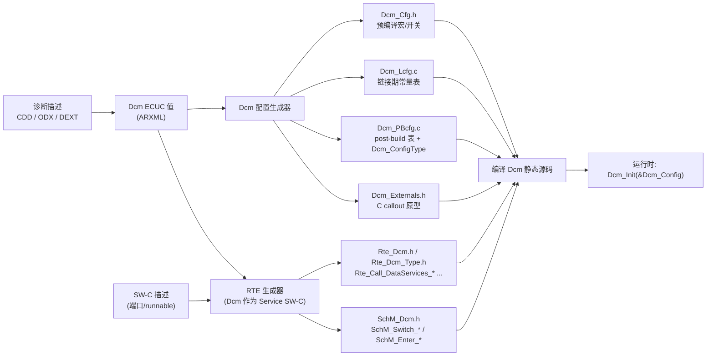
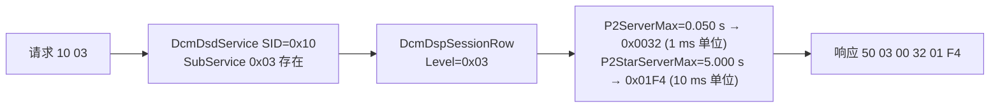

# DCM 配置：从 ECUC 树到生成的表

> Prerequisite: [02 DSL](02-dsl.md)、[03 DSD](03-dsd.md)、[04 DSP](04-dsp.md)、[配置与 ARXML](../02-autosar-classic/04-configuration-arxml.md)
> Next: [06 DiagnosticSessionControl (0x10)](06-diagnostic-session.md)
> 对应规范: AUTOSAR CP SWS DCM **R20-11** §10 配置规范：Dcm 模块 p.441、DcmConfigSet p.441、DcmDsd p.445–456、DcmDsl p.457–481、DcmDsp p.482–674、DcmGeneral p.675–678；端口命名 §8.8（p.335–415）
> 对应源码: openAUTOSAR `diagnostic/Dcm/include/Dcm_Lcfg.h`、`include/Dcm_Cfg.h`；本项目 [`examples/uds_diag_demo/diag/Dcm_Cfg.h`](../../examples/uds_diag_demo/diag/Dcm_Cfg.h)、[`diag/Dcm_Cfg.c`](../../examples/uds_diag_demo/diag/Dcm_Cfg.c)、[`rte/Rte_Dcm.h`](../../examples/uds_diag_demo/rte/Rte_Dcm.h)

---

## 1. 本章目标

1. 画出 DCM ECUC 配置中**真正决定行为**的那部分树：`DcmGeneral`、`DcmConfigSet/{DcmDsl, DcmDsd, DcmDsp}`，以及 `DcmDspSession`、`DcmDspSecurity`、`DcmDspDid / DcmDspDidInfo / DcmDspData`、`DcmDspRoutine`。
2. 对任意一个运行时行为（“为什么 `10 03` 的响应里 P2 是 50 ms？”“为什么 0x2E 写 F1A0 要求解锁？”“DCM 调哪个 RTE 端口读 VIN？”），能指出决定它的**配置参数**和**生成的表/符号**。
3. 理解配置之间的**引用链**（DID → DidInfo → DidRead → SessionRow；DID → DidSignal → Data → 端口），以及生成器如何把引用变成索引/位掩码/函数指针 `[Conceptual]`。
4. 理解配置也决定**接口**：`Rte_Dcm.h`、`SchM_Dcm.h`、`Dcm_Externals.h` 中的名字和签名都来自 ECUC 容器的 short name 与 `*UsePort`。
5. 能把 demo 手写的 `diag/Dcm_Cfg.c` 逐行对应回 ECUC 容器。

---

## 2. 为什么需要关注配置？

DCM 源码在不同 ECU 之间**几乎一模一样**；不同的是配置：服务表、会话、安全级、DID、例程、时序、缓冲。研究笔记 03 对 openAUTOSAR 的结论非常直接：模块内部算法完整，但“**模块之间如何被配置接起来**”这一层缺失或错误，导致所有请求都回 0x11（`DCM_USE_SERVICE_*` 未定义）、P2/S3 全部错位（周期宏不一致）。

在真实项目中：

- 诊断需求来自 OEM 的诊断描述（CDD/ODX 或 AUTOSAR DEXT），导入配置工具后生成 ECUC 值；R20-11 也描述了从 DEXT 导入到 ECUC/Service SW-C 的两种工作流（§7.6.1.7，p.109–110）。
- 配置工具（RTA-CAR、DaVinci、EB tresos 等）把 ECUC 值生成为 C 代码。**没有人手写这些文件**——但读懂它们，能回答 80% 的“DCM 为什么这样做”的问题（`Dcm_Cfg.c:1-14` 头注释）。
- DCM 升级时，配置模型（ECUC 参数定义）往往随 release 变化：参数被改名、拆分、移动或新增约束（研究笔记 02 §6.1：4.3.1 “为配置参数增加约束需求”，4.2.1 “例程配置参数重组”）。

---

## 3. 在系统中的位置：配置 → 生成物 → 运行时

`[Conceptual]`



- Dcm 模块支持 `VARIANT-PRE-COMPILE`、`VARIANT-LINK-TIME`、`VARIANT-POST-BUILD`（Module SWS Item `ECUC_Dcm_01082`，p.441）。每个参数在规范表格中有自己的配置类（Pre-compile / Link / Post-build）。
- 文件名 `Dcm_Cfg.h / Dcm_Lcfg.c / Dcm_PBcfg.c` 是 AUTOSAR 的**惯例**，不同供应商的实际文件名和拆分方式不同 → 需在真实项目确认。
- Post-build 配置通过 `Dcm_Init(const Dcm_ConfigType* ConfigPtr)` 传入（`SWS_Dcm_00037`）——这正是 R4.x 的 `Dcm_Init` 有参数而 R3.x（openAUTOSAR `Dcm.c:79`）没有的原因。

---

## 4. AUTOSAR 如何定义：DCM ECUC 树

下面只列**对运行时行为有直接影响**的参数（完整清单见规范 §10；本表的 ECUC ID 与页码均已在 R20-11 PDF 中核对）。

### 4.1 顶层

```text
Dcm                                      ECUC_Dcm_01082  p.441
├── DcmGeneral [1]                       ECUC_Dcm_00822  p.675
│     ├── DcmDevErrorDetect              ECUC_Dcm_00823  p.676   DET 开关
│     ├── DcmRespondAllRequest           ECUC_Dcm_00600  p.677   FALSE: 0x40–0x7F/0xC0–0xFF 不响应 (00084)
│     ├── DcmTaskTime                    ECUC_Dcm_00820  p.678   Dcm_MainFunction 周期(s)，须与 RTE/OS 一致
│     └── DcmVersionInfoApi              ECUC_Dcm_00821  p.678
└── DcmConfigSet [1]                     ECUC_Dcm_00819  p.441
      ├── DcmDsd [1]                     ECUC_Dcm_00688  p.445   → 4.3
      ├── DcmDsl [1]                     ECUC_Dcm_00690  p.457   → 4.2
      ├── DcmDsp [0..1]                  ECUC_Dcm_00712  p.482   → 4.4（“实际上总会存在”，p.441）
      ├── DcmPageBufferCfg [1]           ECUC_Dcm_00775  p.441
      │     └── DcmPagedBufferEnabled    ECUC_Dcm_00776  p.442
      └── DcmProcessingConditions [0..1] p.442                    DcmModeRule / DcmModeCondition
```

`DcmTaskTime` 是整个 DCM 的“时钟”：所有 P2/P2\*/S3/安全延时都以它为节拍计数，且有约束要求某些时间参数是它的整数倍（如 `DcmDspSecurityMaxAttemptCounterReadoutTime`，`CONSTR_6074` p.75）。

### 4.2 DcmDsl（详见 [02 DSL](02-dsl.md) §4.2）

```text
DcmDsl
├── DcmDslBuffer.DcmDslBufferSize                 ECUC_Dcm_00738  p.459
├── DcmDslCallbackDCMRequestService               ECUC_Dcm_00679  p.459   → Xxx_StartProtocol/StopProtocol
├── DcmDslDiagResp
│     ├── DcmDslDiagRespMaxNumRespPend            ECUC_Dcm_00693  p.460
│     └── DcmDslDiagRespOnSecondDeclinedRequest   ECUC_Dcm_00914  p.460
└── DcmDslProtocol.DcmDslProtocolRow              ECUC_Dcm_00695  p.463
      ├── DcmDslProtocolType / Priority           ECUC_Dcm_01110 / 00699
      ├── DcmDslProtocolRxBufferRef / TxBufferRef ECUC_Dcm_00701 / 00704
      ├── DcmDslProtocolSIDTable                  ECUC_Dcm_00702  → DcmDsdServiceTable
      ├── DcmTimStrP2ServerAdjust / P2StarServerAdjust  ECUC_Dcm_00729 / 00728  p.466–467
      ├── DcmDemClientRef                         ECUC_Dcm_01083  p.467
      └── DcmDslConnection.DcmDslMainConnection   ECUC_Dcm_00706  p.472
            ├── DcmDslProtocolComMChannelRef      ECUC_Dcm_00952
            ├── DcmDslProtocolRx[].{RxPduId 00687, RxAddrType 00710, RxPduRef 00770}
            └── DcmDslProtocolTx.{DcmDslTxConfirmationPduId 00864, DcmDslProtocolTxPduRef 00772}
```

### 4.3 DcmDsd（详见 [03 DSD](03-dsd.md) §4.1）

```text
DcmDsd
├── DcmDsdServiceRequestManufacturerNotification  ECUC_Dcm_00681  p.451
├── DcmDsdServiceRequestSupplierNotification      ECUC_Dcm_00816  p.452
└── DcmDsdServiceTable[].DcmDsdService[]          ECUC_Dcm_00732 / 00689
      ├── DcmDsdSidTabServiceId                   ECUC_Dcm_00735
      ├── DcmDsdSidTabSubfuncAvail                ECUC_Dcm_00737
      ├── DcmDsdSidTabSessionLevelRef [0..*]      ECUC_Dcm_00734   → DcmDspSessionRow
      ├── DcmDsdSidTabSecurityLevelRef [0..*]     ECUC_Dcm_00733   → DcmDspSecurityRow
      ├── DcmDsdSidTabFnc [0..1]                  ECUC_Dcm_00777
      └── DcmDsdSubService[].{Id 00803, SessionLevelRef 00804, SecurityLevelRef 00812}
```

### 4.4 DcmDsp：会话、安全、DID、例程

#### 4.4.1 会话

```text
DcmDspSession                            ECUC_Dcm_00769  p.653
└── DcmDspSessionRow [1..*]              ECUC_Dcm_00767  p.654
      ├── DcmDspSessionLevel             ECUC_Dcm_00765  p.655   子功能值 0x01/0x02/0x03/0x04/0x40–0x7E
      ├── DcmDspSessionP2ServerMax       ECUC_Dcm_00766  p.656   秒；0x10 正响应中报告
      ├── DcmDspSessionP2StarServerMax   ECUC_Dcm_00768  p.656   秒；0x10 正响应中报告
      └── DcmDspSessionForBoot           ECUC_Dcm_00815  p.655   DCM_NO_BOOT / OEM_BOOT / SYS_BOOT …
```

约束：`DcmDspSessionRow` 的 short name 必须与 `Dcm_SesCtrlType` 的名字及 `DcmDiagnosticSessionControl` 模式声明一致，并带 `DCM_` 前缀（`CONSTR_6000`）；ISO 定义的会话必须用 `DCM_DEFAULT_SESSION` 等标准名（`CONSTR_6001`，p.83）。原因：short name 会变成 RTE 模式名 `RTE_MODE_DcmDiagnosticSessionControl_<ShortName>`，SW-C 依赖这些名字。

#### 4.4.2 安全

```text
DcmDspSecurity                           ECUC_Dcm_00764  p.644
└── DcmDspSecurityRow [*]                ECUC_Dcm_00759  p.647   short name = 端口名 SecurityAccess_{SecurityLevel}
      ├── DcmDspSecurityLevel            ECUC_Dcm_00754  p.650   SecurityLevel；requestSeed = 2*Level-1
      ├── DcmDspSecuritySeedSize         ECUC_Dcm_00755  p.651
      ├── DcmDspSecurityKeySize          ECUC_Dcm_00760  p.650
      ├── DcmDspSecurityADRSize          ECUC_Dcm_00725  p.647   requestSeed 携带的 securityAccessDataRecord
      ├── DcmDspSecurityNumAttDelay      ECUC_Dcm_00762  p.651   失败几次后启动延时
      ├── DcmDspSecurityDelayTime        ECUC_Dcm_00757  p.648   延时（s）
      ├── DcmDspSecurityDelayTimeOnBoot  ECUC_Dcm_00726  p.649   上电延时（s）
      ├── DcmDspSecurityAttemptCounterEnabled  ECUC_Dcm_01050  p.647   计数器持久化
      ├── DcmDspSecurityUsePort          ECUC_Dcm_00967  p.652   USE_ASYNCH_CLIENT_SERVER / USE_ASYNCH_FNC
      ├── DcmDspSecurityGetSeedFnc / CompareKeyFnc   ECUC_Dcm_00968 / 00969   (仅 USE_ASYNCH_FNC)
      └── DcmDspSecurityGetAttemptCounterFnc         ECUC_Dcm_01048  p.649
```

`DcmDspSecurityRow` 的描述（p.647）：容器名定义 R-Port 名 `SecurityAccess_{SecurityLevel}`；“若没有引用，则不做安全级检查”。详见 [07 安全访问](07-security-access.md)。

#### 4.4.3 DID：三层引用

```text
DcmDspDid [*]                            ECUC_Dcm_00601  p.509
├── DcmDspDidIdentifier                  ECUC_Dcm_00602  p.509   0xF190 …
├── DcmDspDidUsePort                     ECUC_Dcm_01122  p.510   USE_DATA_ELEMENT_SPECIFIC_INTERFACES / USE_ATOMIC_*
├── DcmDspDidSize                        ECUC_Dcm_01099  p.510
├── DcmDspDidInfoRef ──────────────┐     ECUC_Dcm_00604  p.512
└── DcmDspDidSignal [*]            │     ECUC_Dcm_00813  p.518
      ├── DcmDspDidByteOffset      │     ECUC_Dcm_01105  p.518
      └── DcmDspDidDataRef ────────┼──┐  ECUC_Dcm_00808  p.519
                                   │  │
DcmDspDidInfo [*]  ◄───────────────┘  │  ECUC_Dcm_00607  p.514   多个 DID 可共享一个 Info
├── DcmDspDidRead [0..1]              │  ECUC_Dcm_00613  p.515   存在 = 可读
│     ├── DcmDspDidReadSessionRef     │  ECUC_Dcm_00615  p.517   → DcmDspSessionRow
│     ├── DcmDspDidReadSecurityLevelRef  ECUC_Dcm_00614  p.517   → DcmDspSecurityRow
│     └── DcmDspDidReadModeRuleRef    │  ECUC_Dcm_00917  p.516
├── DcmDspDidWrite [0..1]             │  ECUC_Dcm_00616  p.525   存在 = 可写
│     ├── DcmDspDidWriteSessionRef    │  ECUC_Dcm_00618  p.527
│     └── DcmDspDidWriteSecurityLevelRef ECUC_Dcm_00617  p.527
└── DcmDspDidControl [0..1]           │  p.557                   0x2F
                                      │
DcmDspData [*]  ◄─────────────────────┘  ECUC_Dcm_00869  p.530   short name = 端口名 DataServices_{Data}
├── DcmDspDataType                       ECUC_Dcm_00985  p.537   UINT8_N / UINT16 / UINT8_DYN …
├── DcmDspDataByteSize                   ECUC_Dcm_01106  p.530
├── DcmDspDataUsePort                    ECUC_Dcm_00713  p.537   决定调用形态（见 04 DSP §4.4.1）
├── DcmDspDataReadFnc / WriteFnc         ECUC_Dcm_00669 / 00670  (仅 *_FNC)
├── DcmDspDataConditionCheckReadFnc      ECUC_Dcm_00677  p.531
├── DcmDspDataReadDataLengthFnc          ECUC_Dcm_00671  p.534
├── DcmDspDataEndianness                 ECUC_Dcm_00986  p.532
└── DcmDspDataBlockIdRef                 ECUC_Dcm_00809  p.540   (USE_BLOCK_ID)

DcmDsp.DcmDspMaxDidToRead                ECUC_Dcm_00638  p.483   一次 0x22 最多几个 DID (01335)
```

为什么要三层？

- **DID ↔ Data 分离**：一个 DID 可以由多个数据元素拼成（`DcmDspDidSignal` + `ByteOffset`），一个数据元素也可以被多个 DID 引用。
- **DID ↔ DidInfo 分离**：访问权限（会话/安全/模式规则）往往按“一类 DID”统一管理；多个 DID 引用同一个 `DcmDspDidInfo` 就共享权限。
- 权限的“存在即允许”：没有 `DcmDspDidRead` 容器 = 该 DID 不可读（0x31，`00433`）；没有 `DcmDspDidWrite` = 不可写（0x31，`00468`）。

DID 的服务细节（NRC 规则、范围 DID、动态 DID）见 [08 DID](08-did.md)。

#### 4.4.4 例程

```text
DcmDspRoutine [*]                        ECUC_Dcm_00640  p.606   short name = 端口名 RoutineServices_{RoutineName}
├── DcmDspRoutineIdentifier              ECUC_Dcm_00641  p.607
├── DcmDspRoutineUsed                    ECUC_Dcm_00807  p.607   FALSE = 视为不支持 (00569)
├── DcmDspRoutineUsePort                 ECUC_Dcm_00724  p.608   TRUE: C/S 端口；FALSE: C callout
├── DcmDspStartRoutine [1]               p.618
│     ├── DcmDspStartRoutineFnc          ECUC_Dcm_00664  p.620
│     ├── DcmDspStartRoutineCommonAuthorizationRef  ECUC_Dcm_01052  p.621 → DcmDspCommonAuthorization
│     └── DcmDspStartRoutineIn/Out.*Signal.{Pos, Type, ParameterSize, Endianness}
├── DcmDspStopRoutine [0..1]             p.631   不存在 → 0x31 02 回 0x12 (00869)
│     └── DcmDspStopRoutineFnc / CommonAuthorizationRef  ECUC_Dcm_00752 / 01053
└── DcmDspRequestRoutineResults [0..1]   p.608
      └── DcmDspRequestRoutineResultsFnc ECUC_Dcm_00753  p.610

DcmDspCommonAuthorization [*]            ECUC_Dcm_01025  p.507   会话/安全/模式规则的可复用“授权包”
├── DcmDspCommonAuthorizationSessionRef  ECUC_Dcm_01027  p.508
├── DcmDspCommonAuthorizationSecurityLevelRef  ECUC_Dcm_01026  p.508
└── DcmDspCommonAuthorizationModeRuleRef ECUC_Dcm_01028  p.507
```

同一 RID 的三个子功能的会话/安全授权必须相同（`CONSTR_6100`，p.191）。

### 4.5 配置也决定接口名

`[AUTOSAR Standard]` 端口名由容器 short name 决定（§8.8）：

| 容器 | 端口（Dcm 侧 R-Port） | 生成的调用（典型） |
|---|---|---|
| `DcmDspData` short name `{Data}` + `UsePort=*_CLIENT_SERVER` | `DataServices_{Data}` | `Rte_Call_DataServices_{Data}_ReadData(...)` |
| `DcmDspSecurityRow` short name `{SecurityLevel}` | `SecurityAccess_{SecurityLevel}` | `Rte_Call_SecurityAccess_{SecurityLevel}_GetSeed/CompareKey` |
| `DcmDspRoutine` short name `{RoutineName}` + `UsePort=TRUE` | `RoutineServices_{RoutineName}` | `Rte_Call_RoutineServices_{RoutineName}_Start/Stop/RequestResults` |
| `DcmDsdServiceRequestManufacturerNotification` `{Name}` | `ServiceRequestManufacturerNotification_{Name}` | `..._Indication/_Confirmation` |
| `DcmDspSessionRow` short names | ModeDeclarationGroup `DcmDiagnosticSessionControl` 的模式（`91019` p.409） | `SchM_Switch_<bsnp>_DcmDiagnosticSessionControl(RTE_MODE_...)` |

`Rte_Call_<port>_<operation>` 是 RTE 的通用命名规则（本仓库没有 RTE SWS → 具体形态需以真实项目的 RTE 生成物确认）。**改一个 short name，就改了一个函数名**——SW-C 侧的代码随之编译失败。这是 DCM 配置变更最直接的连锁反应。

---

## 5. 核心数据结构：生成器把 ECUC 变成什么 `[Conceptual]`

规范不规定生成代码的样子。以下是生成器普遍采用的转换方式（具体形态需在真实项目中确认）：

| ECUC 形态 | 生成形态 | 理由 |
|---|---|---|
| 容器多重性 `*` | `const` 结构体数组 + 元素个数 | ROM 中可索引 |
| 引用（`*Ref`） | 数组索引或指针；引用列表 → 位掩码或索引数组 | O(1) 检查；post-build 时指针需重定位，所以常用索引 |
| 枚举（`*UsePort`、`DcmDspDataType`） | 枚举常量 + 不同的函数指针字段 | handler 中按枚举分派 |
| `EcucFunctionNameDef`（`*Fnc`） | 函数指针 + `Dcm_Externals.h` 中的原型 | 集成者实现 |
| C/S 端口 | 函数指针指向 `Rte_Call_*`（或指向生成的“胶水”函数） | RTE 生成器提供实现 |
| short name | 符号常量 `DcmConf_<Container>_<ShortName>` | 其他模块（PduR）引用 |
| 浮点秒（`DcmTaskTime`、P2、延时） | 整数（ms 或 MainFunction 周期数） | 避免运行时浮点；但必须注意整除误差 |
| `DcmPagedBufferEnabled` 等布尔开关 | `#define ... STD_ON/STD_OFF` | 预编译裁剪 |

最后一行“浮点秒 → 整数周期”是一个经典陷阱：若 `DcmTaskTime = 0.01 s` 而某个延时是 0.015 s，生成器要么向上取整、要么向下取整、要么报错——不同供应商不同。openAUTOSAR 的 `DCM_CONVERT_MS_TO_MAIN_CYCLES`（`Dcm_Dsl.c:38`）就是整数除法。

---

## 6. 初始化流程：配置如何被“装载”

1. 预编译配置（`Dcm_Cfg.h`）在编译 DCM 源码时生效；
2. 链接期配置（`Dcm_Lcfg.c` 一类）作为 `const` 表链接进镜像；
3. post-build 配置通过 `Dcm_Init(&Dcm_Config)` 的指针传入，DCM 保存该指针，此后所有查找都通过它（demo：`Dcm.c:16-28` 保存为 `Dcm_CfgPtr`）。
4. 运行时**不修改**配置。所有“动态”的东西（当前会话、安全级、计数器）都在 RAM 状态中。

---

## 7. Runtime Flow：一个行为如何回溯到配置

### 7.1 “`10 03` 的响应为什么是 `50 03 00 32 01 F4`？”



demo：`Dcm_Cfg.c:93-96`（子服务 0x01/0x03）→ `Dcm_Cfg.c:19-23`（会话行 P2=50、P2\*=5000）→ `Dcm_Dsp.c:130-136`（P2\* 除以 10 后编码）。

### 7.2 “为什么读 VIN 会调用 `VehicleInfoSWC_ReadVin`？”

```text
DcmDsdService(0x22) ─fnc→ 内部 DSP 0x22 handler
DcmDspDid(0xF190) ─DidInfoRef→ DcmDspDidInfo ─DidRead→ (会话: 全部, 安全: 无)
                  ─DidSignal[0].DataRef→ DcmDspData(VIN) ─UsePort=USE_DATA_ASYNCH_CLIENT_SERVER
                                                   → R-Port DataServices_VIN（demo 命名 DataServices_DID_F190）
RTE 连接: DataServices_DID_F190 ←→ VehicleInfoSWC 的 P-Port → server runnable VehicleInfoSWC_ReadVin
```

demo 把这条链压平成一行（`Dcm_Cfg.c:34-38`）：

```c
{   /* [Educational Implementation] VIN: asynchronous C/S interface -> exercises DCM_E_PENDING / OpStatus */
    0xF190u, 17u, DCM_USE_DATA_ASYNCH_CLIENT_SERVER,
    NULL_PTR, Rte_Call_DataServices_DID_F190_ReadData, NULL_PTR,
    DCM_SES_ALL, DCM_SEC_ANY, 0u, 0u, "VIN"
},
```

注意最后一跳（端口 → runnable）**不在 DCM 配置中**，而在 RTE 配置（SW-C 端口连接）中。DCM 只知道“调 `Rte_Call_DataServices_DID_F190_ReadData`”；RTE 生成器决定它最终调哪个 runnable（demo：`Rte_Dcm.c:54-62`）。

### 7.3 “为什么 0x2E 写 F1A0 在扩展会话未解锁时回 0x33？”

```text
DcmDsdService(0x2E): SessionLevelRef = {Extended}, SecurityLevelRef = {}（不检查）  → DSD 放行
DcmDspDid(0xF1A0).DidInfo.DidWrite: SessionRef = {Extended}, SecurityLevelRef = {Level_01}
当前安全级 LOCKED → DSP 0x33 (SWS_Dcm_00470)
```

demo：`Dcm_Cfg.c:122`（服务行）、`Dcm_Cfg.c:44-47`（DID 行 `writeSessionMask=DCM_SES_EXTENDED`、`writeSecurityMask=DCM_SEC_LEVEL1`）、`Dcm_Dsp.c:506-511`（检查）。

### 7.4 “为什么 S3 是 5 秒？P2 补偿为什么是 10 ms？”

- S3 不是配置参数：R20-11 固定 5 s（`00143`，p.79）。demo 仍定义 `DCM_S3_SERVER_MS 5000u`（`Dcm_Cfg.h:28`）以便代码引用。
- P2 补偿是协议行参数 `DcmTimStrP2ServerAdjust`（demo `Dcm_Cfg.h:26`）。

---

## 8. RH850 Hardware Mapping

DCM 配置本身不涉及寄存器，但以下配置值必须与 RH850 平台的事实保持一致：

| 配置 | 必须一致的平台事实 |
|---|---|
| `DcmTaskTime` | OS 中调用 `Dcm_MainFunction` 的 task/alarm 周期（底层 OS counter 的 tick 源，例如某个 OSTM 通道——哪个通道是配置选择） |
| `DcmDslBufferSize` | RH850 RAM 预算；以及 CanTp 能支持的最大 SDU（CAN FD 下更大） |
| `DcmDslProtocolRxPduRef/TxPduRef` → PduR → CanTp → CanIf → Can HOH | 最终落到 RS-CANFD 的接收规则（GAFL）与 TX buffer；诊断 ID（如 0x7E0/0x7DF/0x7E8）必须在 Can 配置中有对应的接收规则 |
| `DcmDspDataBlockIdRef` | NvM block 配置 → Fee → RH850 Data Flash 容量与擦写寿命 |
| `DcmDspSecurityDelayTime/DelayTimeOnBoot` | 若需要跨复位持久，依赖 NvM（attempt counter）；上电时间基准来自 OS 启动 |

---

## 9. openAUTOSAR 的配置模型

`include/Dcm_Lcfg.h` 定义了与 ECUC 大致对应的 C 类型（研究笔记 03 §4.1）：

```text
Dcm_ConfigType DCM_Config (:629-634；实例缺失，只有 extern :641)
├── Dsl : Dcm_DslType (:617-626)
│   ├── DslBuffer[] / DslCallbackDCMRequestService[] / DslDiagResp
│   ├── DslProtocol → DslProtocolRowList[] (Dcm_DslProtocolRowType :577-593)
│   │       └── DslConnection → DslMainConnection (:503-511) → DslProtocolRx[] (:464-471) / DslProtocolTx (:478-483)
│   ├── DslServiceRequestIndication[] (:603-606)
│   └── DslSessionControl[] (:609-614)
├── Dsd : Dcm_DsdType (:379-382) → DsdServiceTable[] (:371-376) → DsdService[] (:359-368)
└── Dsp : Dcm_DspType (:337-353)
     ├── DspSession → DspSessionRow[] (:104-109) {Level, P2ServerMax, P2StarServerMax}
     ├── DspSecurity → DspSecurityRow[] (:112-124) {Level, DelayTimeOnBoot, NumAttDelay, DelayTime, NumAttLock, ADRSize, SeedSize, KeySize, GetSeed(), CompareKey()}
     ├── DspDid[] (:173-192) / DspRoutine[] (:262-270) / ...
```

值得对比的点：

- 它用 `Arc_EOL` 标志结束数组，而不是元素个数（Arctic 私有约定）。
- `DsdService` 的会话/安全引用是“指向行的指针数组”（`const Dcm_DspSecurityRowType **DsdSidTabSecurityLevelRef`，`:362-363`）——ECUC 引用的直接映射。
- `DspSecurityRow` 有 `DspSecurityDelayTimeOnBoot / NumAttDelay / DelayTime / NumAttLock` 字段（`:114-117`），但**源码从未使用**（研究笔记 03 §4.5）——“有配置字段 ≠ 有实现”。
- `DspDid` 有 `DspDidUsePort` 字段但未被读取（研究笔记 03 §4.4）。
- 预编译开关在 `include/Dcm_Cfg.h`：`DCM_TASK_TIME TBD`、`DCM_PAGEDBUFFER_ENABLED STD_OFF`、以及由 DaVinci 后加的 `DCM_MAIN_FUNCTION_PERIOD_TIME_MS 10`——与 SchM 实际周期不一致（研究笔记 03 §6.2）。
- `DCM_Config` 实例**不存在**；`DCM_USE_SERVICE_*` 宏无人定义——这就是“只有代码、没有配置”的后果。

---

## 10. 当前教学项目：手写的 `Dcm_Cfg.c` 如何镜像 ECUC

`[Educational Implementation]` `diag/Dcm_Cfg.h` 头注释（`:1-12`）说明：这是“as if generated”的手写配置；真实生成器保留 DID → DidInfo → DidRead/DidWrite → DcmDspData 的多级引用，demo 把它们压平成一行，方便一次读完。

### 10.1 对照表

| ECUC 容器/参数 | demo 符号 | 文件:行 | 简化 |
|---|---|---|---|
| `DcmGeneral.DcmDevErrorDetect` | `DCM_DEV_ERROR_DETECT` | `Dcm_Cfg.h:19` | — |
| `DcmGeneral.DcmTaskTime` | `DCM_TASK_TIME_MS 10u` | `Dcm_Cfg.h:20` | 直接用 ms |
| `DcmGeneral.DcmRespondAllRequest` | `DCM_RESPOND_ALL_REQUEST STD_ON` | `Dcm_Cfg.h:21` | demo 未实现 FALSE 分支 |
| `DcmDslBuffer.DcmDslBufferSize` | `DCM_DSL_BUFFER_SIZE 128u` | `Dcm_Cfg.h:24` | Rx/Tx 各一个 |
| `DcmDslDiagRespMaxNumRespPend` | `DCM_DSL_MAX_NUM_RESP_PEND 20u` | `Dcm_Cfg.h:25` | — |
| `DcmTimStrP2ServerAdjust` / `P2StarServerAdjust` | `DCM_TIM_P2_SERVER_ADJUST_MS 10u` / `DCM_TIM_P2STAR_SERVER_ADJUST_MS 100u` | `Dcm_Cfg.h:26-27` | 全局而非每协议行 |
| S3Server（固定 5 s，`00143`） | `DCM_S3_SERVER_MS 5000u` | `Dcm_Cfg.h:28` | — |
| `DcmDslProtocolRxPduId`（物理/功能）、`DcmDslTxConfirmationPduId` | `DcmConf_DcmDslProtocolRx_DiagPhys/DiagFunc`、`DcmConf_DcmDslProtocolTx_DiagResp` | `Dcm_Cfg.h:30-33` | 寻址类型由“是不是 DiagFunc”硬编码判断 |
| `DcmDspMaxDidToRead` | `DCM_DSP_MAX_DID_TO_READ 4u` | `Dcm_Cfg.h:36` | — |
| `DcmDemClientRef` | `DCM_DEM_CLIENT_ID 0u` | `Dcm_Cfg.h:37` | — |
| 会话/安全引用列表 | `DCM_SES_MASK()` / `DCM_SEC_MASK()` 位掩码，`DCM_SEC_ANY` = 空列表 | `Dcm_Cfg.h:39-50` | — |
| `DcmDspSessionRow` | `Dcm_DspSessionRowType` / `Dcm_SessionRows[]` | `Dcm_Cfg.h:52-58` / `Dcm_Cfg.c:19-23` | P2 用 ms 整数；无 `ForBoot` |
| `DcmDspSecurityRow` | `Dcm_DspSecurityRowType` / `Dcm_SecurityRows[]` | `Dcm_Cfg.h:60-74` / `Dcm_Cfg.c:26-30` | 无 ADR、无 DelayTimeOnBoot、无 AttemptCounterEnabled |
| `DcmDspDid` + `DcmDspDidInfo` + `DcmDspData` | `Dcm_DspDidType` / `Dcm_Dids[]` | `Dcm_Cfg.h:76-98` / `Dcm_Cfg.c:33-49` | 一个 DID 一个数据元素；读写权限直接放在 DID 行 |
| `DcmDspDataUsePort` | `Dcm_DspDataUsePortType`（仅 SYNCH/ASYNCH C/S） | `Dcm_Cfg.h:77-80` | 其余 8 种未实现 |
| `DcmDspRoutine` + `DcmDspCommonAuthorization` | `Dcm_DspRoutineType` / `Dcm_Routines[]` | `Dcm_Cfg.h:100-115` / `Dcm_Cfg.c:87-90` | 授权直接放在例程行 |
| 例程签名适配（生成器的“胶水”） | `Dcm_Cfg_Routine_FF00_Start/Stop/RequestResults` | `Dcm_Cfg.c:51-85` | — |
| `DcmDsdServiceTable` / `DcmDsdService` / `DcmDsdSubService` | `Dcm_DsdServiceType` / `Dcm_Services[]`、`Dcm_DsdSubServiceType` / `Dcm_Sub10…Dcm_Sub3E` | `Dcm_Cfg.h:117-136` / `Dcm_Cfg.c:93-125` | 单张服务表 |
| `DcmConfigSet` → `Dcm_ConfigType` | `Dcm_Config` | `Dcm_Cfg.h:138-152` / `Dcm_Cfg.c:127-133` | — |
| Dcm 的 R-Port 调用 | `Rte_Call_DataServices_DID_F190_ReadData` 等 | `rte/Rte_Dcm.h:30-47`、`rte/Rte_Dcm.c` | 直接函数调用 |

### 10.2 一行一行读 `Dcm_Cfg.c`

```c
/* [Educational Implementation] examples/uds_diag_demo/diag/Dcm_Cfg.c:18-30 */
static const Dcm_DspSessionRowType Dcm_SessionRows[] = {
    /* level                             P2    P2*   name */
    { DCM_DEFAULT_SESSION,               50u, 5000u, "DefaultSession" },
    { DCM_EXTENDED_DIAGNOSTIC_SESSION,   50u, 5000u, "ExtendedDiagnosticSession" }
};

static const Dcm_DspSecurityRowType Dcm_SecurityRows[] = {
    /* level seed key numAttDelay delay(ms) */
    { 1u, 4u, 4u, 3u, 3000u,
      Rte_Call_SecurityAccess_Level_01_GetSeed, Rte_Call_SecurityAccess_Level_01_CompareKey, "Level_01" }
};
```

- 只配置了默认和扩展会话——**没有编程会话**。因此 `10 02` 回 `7F 10 12`（`tests/test_uds_demo.c` 的 `test_session_control_p2_values`）。注意：`Dcm_Sub10`（`Dcm_Cfg.c:93-96`）也只列了 0x01/0x03，所以这个 0x12 实际上由 **DSD**（子服务未配置，`00273`）产生，而 DSP 的 `00307`（会话行未配置，`Dcm_Dsp.c:124-128`）是第二道防线。真实生成器会保证两处一致。
- 安全行：level 1（requestSeed 0x01 / sendKey 0x02），seed/key 各 4 字节，3 次失败后延时 3000 ms，端口 `SecurityAccess_Level_01`。

```c
/* [Educational Implementation] examples/uds_diag_demo/diag/Dcm_Cfg.c:44-48 */
{   /* writable configuration stored in NvM: write needs extended session + level 1 */
    0xF1A0u, 10u, DCM_USE_DATA_SYNCH_CLIENT_SERVER,
    Rte_Call_DataServices_DID_F1A0_ReadData, NULL_PTR, Rte_Call_DataServices_DID_F1A0_WriteData,
    DCM_SES_ALL, DCM_SEC_ANY, DCM_SES_EXTENDED, DCM_SEC_LEVEL1, "DiagConfig(NvM)"
}
```

- `DCM_USE_DATA_SYNCH_CLIENT_SERVER` 只描述了**读**接口（同步）；写接口用的是带 OpStatus 的 `Dcm_WriteDataAsyncFncType`（`Dcm_Cfg.h:84-85`）。这是 demo 的简化：真实 ECUC 中 `DcmDspDataUsePort` 对一个数据元素的读写是**同一个**取值，`USE_DATA_SYNCH_CLIENT_SERVER` 的 WriteData 应是同步签名（`SWS_Dcm_00794`）。把这当作“读 demo 时要识别的简化”之一。

```c
/* [Educational Implementation] examples/uds_diag_demo/diag/Dcm_Cfg.c:127-133 */
const Dcm_ConfigType Dcm_Config = {
    Dcm_Services,     DCM_N(Dcm_Services),
    Dcm_SessionRows,  DCM_N(Dcm_SessionRows),
    Dcm_SecurityRows, DCM_N(Dcm_SecurityRows),
    Dcm_Dids,         DCM_N(Dcm_Dids),
    Dcm_Routines,     DCM_N(Dcm_Routines)
};
```

`Dcm_Config` 是 post-build 风格的根结构，由 `EcuM_Init` 传给 `Dcm_Init(&Dcm_Config)`（`integration/EcuM.c` 第 36 行）。

---

## 11. Code Walkthrough：配置驱动的检查

同一个“会话是否允许”的问题，在三个层次被三张表回答：

| 层次 | 表 | 代码 |
|---|---|---|
| 服务级 | `Dcm_Services[i].sessionMask` | `Dcm_Dsd.c:91-95` → 0x7F |
| 子服务级 | `Dcm_SubXX[j].sessionMask` | `Dcm_Dsd.c:127-131` → 0x7E |
| DID/RID 级 | `Dcm_Dids[k].readSessionMask/writeSessionMask`、`Dcm_Routines[m].sessionMask` | `Dcm_Dsp.c:304`（读：跳过，全部不满足才 0x31）、`:502`（写 → 0x31）、`:565`（例程 → 0x31） |

注意 DID/RID 级会话不满足时回 **0x31** 而不是 0x7F（`00434/00469/00570`）——因为从 ISO 14229-1 的角度看，“这个 DID 在当前会话不可用”是“请求参数超出范围”，服务本身是支持的。这又是一个“配置在哪一层”决定“NRC 是什么”的例子。

---

## 12. Debug 方法：调试配置问题

1. **先确认 DCM 用的是哪份配置**：在 `Dcm_Init` 处断点看 `ConfigPtr`；多配置集（post-build selectable）的 ECU 可能选错了变体。
2. **从现象反查表**：NRC 0x11 → 服务表；0x7F/0x7E → 会话引用；0x33 → 安全引用；0x31 → DID/RID 表或其 Info；0x12 → 子服务表/会话行/安全行/例程子容器。
3. **在生成的 C 表里找行**：搜 DID 值（`0xF190`）、RID 值、SID 值；直接在调试器的 memory/watch 窗口展开 `Dcm_Config` 结构。
4. **对比 ECUC 与生成物的时间戳/版本**：ECUC 改了但没重新生成，是最常见的“配置不生效”原因。
5. **单位与取整**：检查 P2/P2\*/S3/延时在生成物中的整数值，用 `DcmTaskTime` 换算回秒，确认与 ECUC 一致。

---

## 13. 常见问题

| 问题 | 后果 | 预防 |
|---|---|---|
| 会话/安全引用列表留空 | 被理解为“不检查”，服务/DID 对所有会话开放 | 评审时把“空列表”显式标注为“无限制” |
| 服务表与会话行不一致（如服务表有 `10 02` 子服务，但没有编程会话行） | DSP 回 0x12 或行为未定义 | 用配置工具的校验规则；回归测试覆盖所有子功能 |
| `DcmTaskTime` 与 OS 调度周期不一致 | P2/S3/延时全部按比例错误 | 让两者来自同一个参数（生成器通常会检查） |
| 修改 `DcmDspData` 的 short name | RTE 端口名改变，SW-C 编译失败 | short name 视为接口，变更走接口评审 |
| `DcmDspDataUsePort` 从 SYNCH 改为 ASYNCH | SW-C runnable 签名增加 OpStatus | SW-C 必须同步修改并处理四种 OpStatus |
| `DcmDslBufferSize` 小于最长请求/响应 | 请求：FC.OVFLW；响应：0x14 | 按诊断规范中最长 DID/最长 0x19 响应计算；或启用分页 |
| 多个 DID 共享 `DcmDspDidInfo` 时只想改一个 DID 的权限 | 其他 DID 跟着变 | 拆分 DidInfo |

---

## 14. 实验

运行 `python tools/run_uds_demo.py`（不修改 demo），然后：

1. **配置审计**：只读 `diag/Dcm_Cfg.c`，填写下表，然后用 `artifacts/uds-demo/results.txt` 中的测试结果和 `tests/test_uds_demo.c` 验证你的预测：

   | 请求（会话/安全状态） | 你预测的响应 | 依据的配置行 |
   |---|---|---|
   | `22 F1 A0`（默认会话，LOCKED） | | |
   | `2E F1 A0 …10B`（默认会话） | | |
   | `27 01`（默认会话） | | |
   | `31 01 FF 00`（默认会话） | | |
   | `19 02 FF`（扩展会话） | | |
   | `11 03`（默认会话） | | |

2. **追踪一个 short name**：从 `Dcm_Cfg.c:29` 的 `Rte_Call_SecurityAccess_Level_01_GetSeed` 出发，找到 `rte/Rte_Dcm.h`、`rte/Rte_Dcm.c`、`rte/Rte_SecurityAccessSWC.h`、`swc/SecurityAccessSWC.c` 中所有相关符号，画出“配置名 → 端口名 → runnable 名”的映射。
3. **压平 vs 三层**：把 demo 的 3 个 DID 行“反压平”成 ECUC 形式：写出需要几个 `DcmDspDid`、几个 `DcmDspDidInfo`、几个 `DcmDspData`，以及哪些 DID 可以共享同一个 `DcmDspDidInfo`。
4. **单位换算**：若把 `DcmDspSessionP2StarServerMax` 配成 5.005 s，`10 03` 响应的最后两个字节应是多少？demo 的 `p2StarServerMaxMs / 10u`（`Dcm_Dsp.c:130`）会得到什么？这个差异会造成什么问题？

---

## 15. 思考题

1. 为什么 R20-11 把 S3Server 固定为 5 s 而 P2 可以按会话配置？（提示：S3 是“测试仪保活”的约定，P2 是“ECU 能力”的承诺。）
2. 如果一个 OEM 要求“同一个 DID 在扩展会话需要 level 1、在编程会话需要 level 3”，用 `DcmDspDidRead` 的会话引用和安全引用（两个独立列表）能否精确表达？如果不能，规范提供了什么机制（提示：`DcmDspDidReadModeRuleRef`）？
3. post-build 配置可以在不重新编译 DCM 的情况下更换。哪些 DCM 配置**不能**放在 post-build（提示：影响 RTE 接口的那些）？为什么？
4. demo 把会话/安全引用编译成 32 位位掩码。如果 OEM 定义了会话 0x40–0x7E，这种编码会出什么问题（`DCM_SES_MASK` 的 `& 0x1F`）？真实生成器可能如何处理？

---

## 16. 对未来真实项目的意义

在 RTA-CAR 工程中（文件名与组织方式需在真实项目环境中确认）：

1. **找 ECUC 源**：工程中 Dcm 的 ECUC ARXML（或工具的项目文件）；确认它的 AUTOSAR schema 版本——这决定可用的参数集合，是 DCM 升级时“配置迁移”的起点。
2. **找生成物**：搜 `Dcm_Cfg`、`Dcm_Lcfg`、`Dcm_PBcfg`、`Dcm_Externals.h`、`Rte_Dcm.h`、`SchM_Dcm.h`。记录每个文件由哪个生成器、哪个版本生成（文件头通常有）。
3. **建立“行为 → 参数”索引**：用本章 §7 的方法，为你负责的每个 DID/RID/服务写下决定其行为的参数路径。这份索引在升级后对比生成物时极有价值。
4. **检查跨模块一致性**：`DcmTaskTime` vs OS 调度表；`DcmDslProtocolRxPduRef` vs PduR 路由 vs CanTp N-SDU vs CanIf L-PDU vs Can HRH；`DcmDspDataBlockIdRef` vs NvM block。
5. **升级时 diff 三样东西**：ECUC 参数定义（新 release 的 BSWMD）、ECUC 值（迁移后）、生成的 C 表。只 diff 源码会漏掉大部分行为变化。详见 [14 DCM 升级指南](14-dcm-upgrade-guide.md)。

---

## 17. 本章总结

- DCM 的行为 = 静态源码 × 配置。配置树的四个主干：`DcmGeneral`（周期/开关）、`DcmDsl`（协议/连接/缓冲/时序补偿）、`DcmDsd`（服务表/通知）、`DcmDsp`（会话/安全/DID/例程/…）。
- 引用链是理解配置的关键：服务/子服务 → 会话行/安全行；DID → DidInfo（权限）+ DidSignal → Data（接口）；例程 → CommonAuthorization。
- short name 与 `*UsePort` 决定了 RTE/callout 接口的名字和签名——配置变化会直接变成 SW-C 的编译错误或运行时行为变化。
- demo 的 `Dcm_Cfg.c` 是 ECUC 的“压平版”，适合一眼读完；真实生成物保留多层引用，并可能拆分为预编译/链接/post-build 多个文件。

---

## 18. 下一章

有了 DSL/DSD/DSP 与配置的整体图景，接下来两章用两个最核心的服务把它们串起来。[06 DiagnosticSessionControl (0x10)](06-diagnostic-session.md)：会话状态机、P2/P2\* 在响应中的编码、S3、模式通知，以及会话变化对服务/DID 可用性与安全级的影响。
