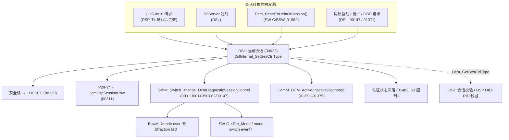
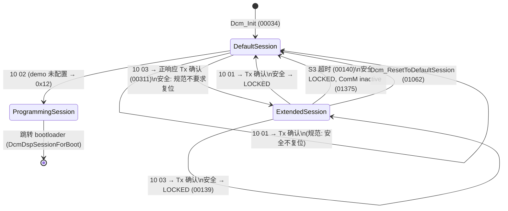
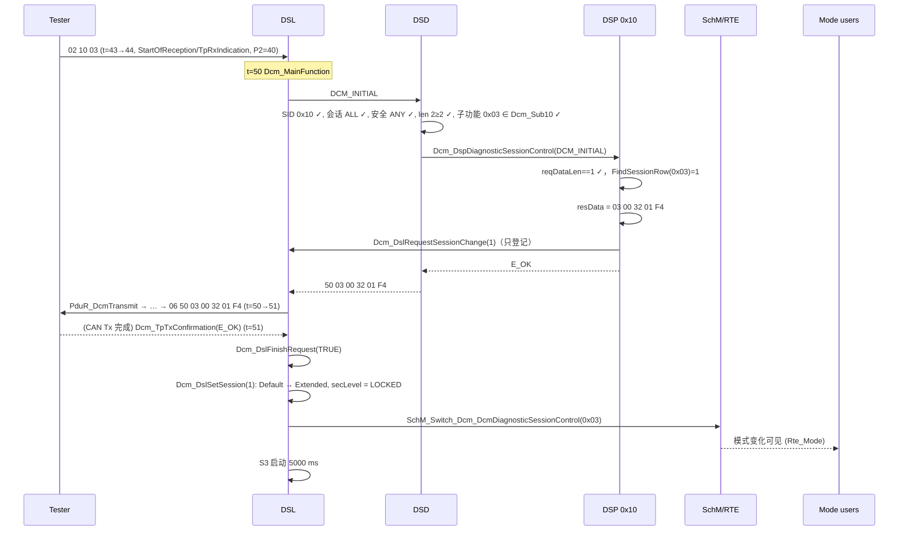

# DiagnosticSessionControl (0x10)：会话状态机、P2/P2\*、S3 与模式通知

> Prerequisite: [02 DSL](02-dsl.md)（S3、P2）、[03 DSD](03-dsd.md)（会话校验）、[05 DCM 配置](05-dcm-configuration.md)（DcmDspSessionRow）
> Next: [07 SecurityAccess (0x27)](07-security-access.md)
> 对应规范: AUTOSAR CP SWS DCM **R20-11**：服务 0x10 §7.6.2.2（p.114）、会话状态管理 §7.4.4.12（p.76）、S3 §7.4.4.14（p.78–79）、时序 §7.4.4.15（p.79–80）、协议启动 §7.4.4.16.5（p.83–84）、安全级复位 `00139`（p.74）、ComM 诊断状态（p.87–88）、bootloader 交互 §7.6.4（p.218–223）、ModeDeclarationGroup `91019`（p.409）、模式接口 `91020`（p.413）、DcmDspSessionRow（p.654–656）
> 对应源码: openAUTOSAR `diagnostic/Dcm/src/Dcm_Dsp.c:443-528`、`Dcm_Dsl.c:104-120 / 533-547`；本项目 [`diag/Dcm_Dsp.c:110-142`](../../examples/uds_diag_demo/diag/Dcm_Dsp.c)、[`diag/Dcm_Dsl.c`](../../examples/uds_diag_demo/diag/Dcm_Dsl.c)、[`rte/Rte_Dcm.c:134-144`](../../examples/uds_diag_demo/rte/Rte_Dcm.c)、trace `artifacts/uds-demo/trace.txt` 第 129–161 行

---

## 1. 本章目标

学完本章你应该能够：

1. 画出 DCM 的会话状态机：有哪些会话、哪些事件引起转换（0x10、S3 超时、`Dcm_ResetToDefaultSession`、协议启动/抢占、OBD 请求）、每次转换的副作用（安全级复位、计时参数、模式通知、ComM 诊断状态）。
2. 解释 0x10 的处理为什么分成“处理”和“生效”两段，以及 `SWS_Dcm_00311` 中的 “send confirmation function” 指的是什么。
3. 解码 `50 03 00 32 01 F4`：每个字节从哪个配置参数来、用什么单位。
4. 说清 BswM/SW-C 如何得知会话变化——以及为什么 R20-11 中找不到 `BswM_Dcm_RequestSessionMode`。
5. 理解“会话决定可用性”的三个层次：服务、子服务、DID/RID，以及它们各自的 NRC。
6. 能在 demo 的 trace 中逐行定位 `10 03` 的每一个状态变化。

---

## 2. 为什么需要诊断会话？

`[Conceptual]` 会话是 UDS 中的“权限上下文”：

- **默认会话（0x01）**：上电即处于此会话，只开放读取类、无副作用的服务（读 DID、读 DTC、TesterPresent……）。车辆正常运行时测试仪可以随时接入，不能有风险。
- **扩展会话（0x03）**：开放写 DID、例程控制、IO 控制、通信控制等“会改变 ECU 行为”的服务。进入扩展会话通常意味着车辆处于维修/产线状态。
- **编程会话（0x02）**：为刷写做准备，常常意味着跳转 bootloader。
- **安全系统诊断会话（0x04）** 与 **OEM 自定义会话（0x40–0x7E）**。

会话把“能做什么”与“当前上下文”绑定：一个危险操作（擦写标定、执行器测试）必须**先显式进入**某会话，而测试仪一旦离开（S3 超时），ECU 就**自动退回**安全的默认会话并重新上锁。这种“显式进入 + 自动退出”就是会话层存在的意义。

---

## 3. 在系统中的位置



---

## 4. AUTOSAR 如何定义

### 4.1 会话状态由 DSL 持有

| SWS | 页 | 要求 |
|---|---|---|
| `00022` | 76 | DSL 保存当前活动会话；对外 `Dcm_GetSesCtrlType`，对内 `DslInternal_SetSesCtrlType` |
| `00034` | 76 | `Dcm_Init` 时会话 = 0x01 DefaultSession |
| `01062` | 76 | `Dcm_ResetToDefaultSession()` 让应用把会话复位到默认，并触发 `SchM_Switch_<bsnp>_DcmDiagnosticSessionControl(...DEFAULT_SESSION)`。规范举例：车速超限时自动终止扩展会话 |
| `00978` | 302–303 | `Dcm_SesCtrlType`：0x01 DEFAULT、0x02 PROGRAMMING、0x03 EXTENDED_DIAGNOSTIC、0x04 SAFETY_SYSTEM_DIAGNOSTIC、0x40–0x7E 配置相关 |
| `CONSTR_6000/6001` | 83 | `DcmDspSessionRow` 的 short name 必须与 `Dcm_SesCtrlType` 名与模式名一致并带 `DCM_` 前缀；ISO 会话使用标准名 |

`DcmDspSessionRow`（`ECUC_Dcm_00767`，p.654）上限 31 行；`DcmDspSessionLevel`（`00765`）范围 1..126（0、127 及以上被 ISO 保留，p.655）。

### 4.2 0x10 服务（§7.6.2.2，p.114）

| SWS | 要求 | 为什么 |
|---|---|---|
| `00250` | DCM 实现 0x10 | — |
| `00307` | 请求的子功能（会话）未配置（`DcmDspSessionLevel`）→ NRC 0x12 | 会话即子功能 |
| （p.114 正文） | 即使请求的会话**等于当前会话**，也执行完整流程（ISO 14229-1 §9.2） | 因此 `10 03` 在扩展会话中再发一次，也会**复位安全级**（结合 `00139`） |
| `00311` | **发送确认函数**中：`DslInternal_SetSesCtrlType(new)`、加载新的 P2ServerMax/P2\*ServerMax、调用 `SchM_Switch_<bsnp>_DcmDiagnosticSessionControl(new)` | 新时序只在发送响应后生效（p.80）；正响应本身应按“旧会话”的时序发出 |
| `00085` | DSP 内部管理 DID 0xF186（ActiveDiagnosticSessionDataIdentifier）的读取 | 测试仪可以随时查询当前会话 |
| （p.97） | **0x10 本身不做 DSD 会话校验** | 否则在默认会话下无法进入任何其他会话 |

“send confirmation function” 就是 [03 DSD](03-dsd.md) §4.9 中的 `DspInternal_DcmConfirmation`：`Dcm_TpTxConfirmation` → DSD → DSP。

### 4.3 安全级随会话复位

`SWS_Dcm_00139`（p.74）：在以下转换时把安全级复位为 `DCM_SEC_LEV_LOCKED`：

- 任何**非默认会话 → 另一个非默认会话**（**包括相同的会话**，例如扩展 → 扩展）；
- **非默认会话 → 默认会话**（由 0x10 或 S3 超时引起）。

**默认 → 默认**不在列表中；**默认 → 非默认**也不在列表中（但默认会话下通常本来就不允许解锁）。

为什么“扩展 → 扩展”也要上锁？因为 ISO 规定重复的 `10 03` 也是一次完整的会话转换；如果不上锁，测试仪就能用 `10 03` 刷新 S3 而保持解锁状态，绕过安全策略的时间约束。

`SWS_Dcm_01329`（p.74）：每次安全级变化都更新 `DcmSecurityAccess` 模式组——所以会话转换引起的“上锁”也会产生一次安全级模式切换。

### 4.4 时序参数

| 参数 | 来源 | 何时生效 | 0x10 响应中的编码 |
|---|---|---|---|
| P2ServerMax | `DcmDspSessionP2ServerMax`（`ECUC_Dcm_00766`，p.656，浮点秒，范围 0..1） | 发送响应之后（p.80） | 2 字节，**1 ms** 分辨率（ISO 14229-2 约定） |
| P2\*ServerMax | `DcmDspSessionP2StarServerMax`（`ECUC_Dcm_00768`，p.656，最大 100 s） | 同上 | 2 字节，**10 ms** 分辨率（ISO 14229-2 约定） |
| S3Server | 固定 5 s（`00143`，p.79） | — | 不在响应中 |
| P2min/P2\*min | 固定 0（`00143`） | — | — |

`[Conceptual]` 0x10 正响应格式 `50 <session> <P2 high> <P2 low> <P2* high> <P2* low>` 及两个时间字段的分辨率来自 ISO 14229-1/-2（本仓库没有 ISO 原文；R20-11 p.656 只说该值会在 0x10 正响应中报告给测试仪）。demo 与 openAUTOSAR 都按此编码：

- demo `Dcm_Dsp.c:130-136`：`p2Star10ms = p2StarServerMaxMs / 10u`；
- openAUTOSAR `Dcm_Dsp.c:497-503`：`p2ServerStarMax10ms = DspSessionP2StarServerMax / 10`，且只在协议为 `DCM_UDS_ON_CAN` 时附带时序字节。

### 4.5 S3 超时

`SWS_Dcm_00140`（p.78–79）：非默认会话中，S3 到期且没有收到任何诊断请求 → 复位到默认会话，并调用 `SchM_Switch_<bsnp>_DcmDiagnosticSessionControl(RTE_MODE_DcmDiagnosticSessionControl_DEFAULT_SESSION)`。S3 启停规则（`00141`）见 [02 DSL](02-dsl.md) §4.4。

S3 超时的连带效果：

- 安全级上锁（`00139`）；
- 所有网络的诊断状态变为 inactive（`01375`，p.87）→ 允许 ECU 休眠；
- 认证状态回落为 deauthenticated（`01483`，p.78）。

### 4.6 模式通知：BswM 与 SW-C 如何得知会话变化

`[AUTOSAR Standard]` R20-11 中，DCM 是 ModeDeclarationGroup `DcmDiagnosticSessionControl` 的 **mode manager**（`00775`、`00806`，p.104–105）：

```text
ModeDeclarationGroup DcmDiagnosticSessionControl   (SWS_Dcm_91019, p.409)
  Category        : EXPLICIT_ORDER
  Initial mode    : DCM_DEFAULT_SESSION
  On transition   : 255
  Modes           : DCM_DEFAULT_SESSION 0, DCM_PROGRAMMING_SESSION 1,
                    DCM_EXTENDED_DIAGNOSTIC_SESSION 2, DCM_SAFETY_SYSTEM_DIAGNOSTIC_SESSION 3
                    + 每个 DcmDspSessionRow.SHORT-NAME（配置的 OEM 会话）
```

- DCM 通过 `SchM_Switch_<bsnp>_DcmDiagnosticSessionControl(mode)` 切换模式（DCM 是 BSW 模块，用 SchM 而不是 Rte 前缀）。
- **SW-C**：通过 `Dcm_DiagnosticSessionControlModeSwitchInterface`（`SWS_Dcm_91020`，p.413；isService=true）的 R-Port 读取当前模式（`Rte_Mode_*`）或用 mode switch event 触发 runnable。
- **BswM**：作为 mode user 订阅同一个模式组，在 BswM 规则中写条件（“会话 == 编程会话”），在 action list 中执行动作（例如关闭某些通信、准备 bootloader 跳转）。BswM 的规则/动作配置属于 BswM SWS（**本仓库没有**）→ 需在真实项目确认。

> **注意模式值 ≠ UDS 会话值**：`91019` 中 `DCM_EXTENDED_DIAGNOSTIC_SESSION` 在模式声明组中的序号是 2，而 UDS 子功能值是 0x03。RTE 生成的 `RTE_MODE_DcmDiagnosticSessionControl_DCM_EXTENDED_DIAGNOSTIC_SESSION` 的数值由 RTE 生成器决定。**SW-C 必须用生成的符号比较，不能与 0x03 比较。** demo 为了简单，`SchM_Switch_Dcm_DcmDiagnosticSessionControl` 直接传入 UDS 会话值（`Dcm_Dsl.c:121`，`rte/SchM_Dcm.h:18`），SW-C 读到的是 0x03（trace 第 371 行 “session seen via Rte_Mode = 0x03”）——这是一个 `[Educational Implementation]` 简化。

#### `BswM_Dcm_RequestSessionMode` 在哪里？

在 R20-11 DCM SWS 全文中**检索不到** `BswM_Dcm_RequestSessionMode`（也检索不到 `RequestSessionMode`）。R20-11 中 DCM 对 BswM 的直接调用只有两个可选接口（p.262）：`BswM_Dcm_ApplicationUpdated()`（bootloader 跳回后，`00768`）和 `BswM_Dcm_CommunicationMode_CurrentState(NetworkHandleType, Dcm_CommunicationModeType)`（0x28，`00512`）。会话与复位的通知全部改为 ModeDeclarationGroup——DCM change history 4.0.3 “Change interaction with BswM module for mode management”（p.4，研究笔记 02 §6.1）记录了这次改变。

`[Real Project Consideration]` 如果你在公司工程中看到 `BswM_Dcm_RequestSessionMode`（或 `BswM_Dcm_RequestResetMode`）的调用，说明该 DCM/BswM 基线早于 R20-11 的这种形态（具体 release 需以对应 SWS 确认）。升级到 R20-11 形态时，BswM 中依赖这些调用的规则必须改为订阅 `DcmDiagnosticSessionControl` / `DcmEcuReset` 模式——这是一个**跨模块**的配置迁移，单独升级 DCM 无法完成。

### 4.7 会话决定可用性：三个层次

| 层次 | 配置 | 不允许时的 NRC | SWS |
|---|---|---|---|
| 服务 | `DcmDsdSidTabSessionLevelRef` | 0x7F | `00211`（p.97） |
| 子服务 | `DcmDsdSubServiceSessionLevelRef` | 0x7E | `00616`（p.97） |
| DID 读 | `DcmDspDidReadSessionRef` | 全部 DID 都不满足才 **0x31** | `00434`（p.137） |
| DID 写 | `DcmDspDidWriteSessionRef` | **0x31** | `00469`（p.175） |
| 例程 | `DcmDspCommonAuthorizationSessionRef`（经 Start/Stop/Results 引用） | **0x31** | `00570`（p.191） |
| 功能寻址 | — | 0x7F/0x7E/0x31 都被抑制 | `00001`（p.101） |

DID/RID 层用 0x31 而不是 0x7F 的理由：服务本身在当前会话是支持的，只是“这个参数值”当前不可用——ISO 把它归类为 requestOutOfRange。

### 4.8 其他会话转换源

| 触发 | 行为 | SWS |
|---|---|---|
| 协议首次启动（所有 `Xxx_StartProtocol` 返回 E_OK） | 安全复位、会话复位为默认并切换模式 | `00146/00147`（p.84） |
| OBD 请求到来而 UDS 处于非默认会话 | 取消正在运行的 UDS 请求、转为默认会话、处理 OBD 请求 | `01371`（p.83） |
| 正在处理 OBD 时收到“进入非默认会话”的 UDS 请求 | 推迟到 OBD 处理完再转换 | `01372`（p.83） |
| ComM | 收到请求或进入非默认会话 → active；处理完且在默认会话 → inactive | `01373/01374`（p.87） |

### 4.9 编程会话与 bootloader（概要）

`DcmDspSessionForBoot`（`ECUC_Dcm_00815`，p.655）决定一个会话是否会跳转 bootloader，以及最终响应由谁发：

| 取值 | 含义 |
|---|---|
| `DCM_NO_BOOT` | 不跳转 |
| `DCM_OEM_BOOT` / `DCM_SYS_BOOT` | 跳转 OEM / 系统供应商 bootloader，**bootloader** 发最终响应 |
| `DCM_OEM_BOOT_RESPAPP` / `DCM_SYS_BOOT_RESPAPP` | 跳转，**应用**先发最终响应 |

主要流程（p.218–222）：切 `DcmEcuReset` 到 `JUMPTOBOOTLOADER` / `JUMPTOSYSSUPPLIERBOOTLOADER` 通知 BswM 准备（`00532/00592`），切换失败 → 0x22（`01175`）；处理复位期间忽略新请求（`01164`）；`DcmSendRespPendOnRestart=TRUE` 时先发 0x78（`00654`）以刷新测试仪的 P2\*；然后 `Dcm_SetProgConditions` 保存上下文（`00535`）……返回后的应用由 `Dcm_GetProgConditions` 判断是否补发响应（`00536`）。完整讨论见 [10 UDS 服务目录](10-uds-services.md) 与 [14 升级指南](14-dcm-upgrade-guide.md)。DCM 规范本身明确不用于 bootloader（p.27–29）。

---

## 5. 核心数据结构

### 5.1 配置

`[Educational Implementation]` `diag/Dcm_Cfg.h:52-58` + `Dcm_Cfg.c:19-23`：

```c
typedef struct {
    Dcm_SesCtrlType level;              /* DcmDspSessionLevel                        */
    uint16          p2ServerMaxMs;      /* DcmDspSessionP2ServerMax                  */
    uint16          p2StarServerMaxMs;  /* DcmDspSessionP2StarServerMax              */
    const char     *name;
} Dcm_DspSessionRowType;

static const Dcm_DspSessionRowType Dcm_SessionRows[] = {
    { DCM_DEFAULT_SESSION,               50u, 5000u, "DefaultSession" },
    { DCM_EXTENDED_DIAGNOSTIC_SESSION,   50u, 5000u, "ExtendedDiagnosticSession" }
};
```

服务行 `{ 0x10u, TRUE, 2u, DCM_SES_ALL, DCM_SEC_ANY, Dcm_Sub10, ... }`（`Dcm_Cfg.c:116`）与子服务 `Dcm_Sub10 = { 0x01, 0x03 }`（`Dcm_Cfg.c:93-96`）。

### 5.2 运行时

`Dcm_Dsl.sessionRow`（当前会话**行索引**，不是会话值）、`Dcm_Dsl.pendingSessionRow`（Tx 确认后要切换到的行，`DCM_SESSION_ROW_INVALID` 表示无）、`Dcm_Dsl.secLevel`、`Dcm_Dsl.s3Running/s3TimerMs`（`Dcm_Dsl.c:44-70`）。

用“行索引”而不是“会话值”保存当前会话，是生成式 DCM 的常见做法：P2/P2\*、可用性掩码都要通过行来查，保存索引省去每次查找。

---

## 6. 初始化流程

`Dcm_DslInit`（`Dcm_Dsl.c:147-157`）：

```c
Dcm_Dsl.sessionRow = Dcm_DslFindSessionRow(DCM_DEFAULT_SESSION);   /* [Educational Implementation] SWS_Dcm_00034 */
if (Dcm_Dsl.sessionRow == DCM_SESSION_ROW_INVALID) {
    Dcm_Dsl.sessionRow = 0u;
}
Dcm_Dsl.secLevel = DCM_SEC_LEV_LOCKED;                                /* SWS_Dcm_00033 */
Dcm_Dsl.pendingSessionRow = DCM_SESSION_ROW_INVALID;
```

`Rte_Start`（`rte/Rte_Dcm.c:38-44`）把 RTE 侧的模式变量初始化为默认会话——对应 ModeDeclarationGroup 的 initial mode `DCM_DEFAULT_SESSION`（`91019`）。

注意：`Dcm_Init` **不调用** `SchM_Switch`——模式的初始值由 RTE 的 initial mode 提供，而不是由一次切换产生。

---

## 7. Runtime Flow

### 7.1 会话状态机

`[Educational Implementation]`（demo 只配置了默认和扩展会话；编程会话以虚线表示规范中的可能转换）



### 7.2 `10 03` 的完整时序（trace 第 129–161 行）



逐 transition：

| 时刻 | trace 行 | 代码 | 规范 |
|---|---|---|---|
| 44 ms | `StartOfReception(DcmRxPduId 0 physical, len=2) -> BUFREQ_OK, buffer=128, S3 stopped` | `Dcm_Dsl.c:339-348` | `00094`、`00141` |
| 44 ms | `TpRxIndication(E_OK): request [10 03] complete; P2 timer = 50-10 ms` | `Dcm_Dsl.c:419-437` | `00093`、`00024` |
| 50 ms | `SID 0x10: lookup in DcmDsdServiceTable -> DiagnosticSessionControl` | `Dcm_Dsd.c:85-90` | `00192/00193` |
| 50 ms | `checks passed (...)` | `Dcm_Dsd.c:91-140` | `01535`（p.97：0x10 不做会话校验——demo 通过 `DCM_SES_ALL` 表达） |
| 50 ms | `0x10: ExtendedDiagnosticSession accepted, P2=50 ms P2*=5000 ms; switch deferred until TX confirmation` | `Dcm_Dsp.c:124-140` | `00250`、`00307` |
| 50 ms | `positive response assembled: SID 0x50 + 5 data bytes` | `Dcm_Dsd.c:181-185` | `00223/00224` |
| 50 ms | `response [50 03 00 32 01 F4] -> PduR_DcmTransmit(0, len=6)` | `Dcm_Dsl.c:187-204` | `00115` |
| 51 ms | `TpTxConfirmation(E_OK): response on the bus` | `Dcm_Dsl.c:492-496` | `00351`、`00353` |
| 51 ms | `session DefaultSession -> ExtendedDiagnosticSession (0x10 response confirmed); security LOCKED; P2=50 ms P2*=5000 ms` | `Dcm_Dsl.c:166-171` → `108-122` | `00311`、`00139` |
| 51 ms | `SchM_Switch_Dcm_DcmDiagnosticSessionControl(0x03): mode users (BswM, SW-Cs) notified` | `Rte_Dcm.c:134-139` | `00311`、`91019` |
| 51 ms | `request finished; S3 timer (re)started (5000 ms)` | `Dcm_Dsl.c:182-184` | `00141` |

### 7.3 响应字节解码

```text
50        = 0x10 + 0x40（正响应 SID）
03        = diagnosticSessionType（回显，已去除 SPRMIB 位）
00 32     = P2ServerMax = 0x0032 = 50   × 1 ms  = 50 ms
01 F4     = P2*ServerMax = 0x01F4 = 500 × 10 ms = 5000 ms
```

### 7.4 S3 超时回默认（trace 第 720–725 行）

```text
[  5720 ms] [Dcm/DSL ] S3 timeout (5000 ms without request) -> back to default session
[  5720 ms] [Dcm/DSL ] session ExtendedDiagnosticSession -> DefaultSession (S3 timeout); security LOCKED; P2=50 ms P2*=5000 ms
[  5720 ms] [Rte     ] SchM_Switch_Dcm_DcmDiagnosticSessionControl(0x01): mode users (BswM, SW-Cs) notified
```

代码 `Dcm_Dsl.c:289-301`：只有 `state == IDLE` 时才递减 S3（处理请求期间 S3 已在 `StartOfReception` 被停止），到期且当前不是默认会话才切换。

### 7.5 TesterPresent 保活

`tests/test_uds_demo.c` 的 `test_tester_present`（第 219–238 行）：进入扩展会话后，每 3 秒发一次功能 `3E 80`，持续 12 秒，会话仍为扩展。每个 `3E 80` 都在 DSL 中重启 S3（`Dcm_Dsl.c:408-417`，`00112`）。

### 7.6 “处理”与“生效”分离带来的边界情况

| 情况 | 结果 | 依据 |
|---|---|---|
| `10 83`（SPRMIB=1） | 不发正响应；DSD 返回 `NO_RESPONSE` → `Dcm_DslFinishRequest(TRUE)` → 会话**仍然切换** | `00238/00240`：抑制时也要调 `DspInternal_DcmConfirmation` |
| 正响应发送失败（`Dcm_TpTxConfirmation(E_NOT_OK)`） | demo：会话**不**切换（`responseOk=FALSE`，`Dcm_Dsl.c:169`） | R20-11 `00311` 未区分成功/失败 → 真实栈行为需在真实项目确认 |
| 0x10 处理中又收到功能 `3E 80` | 接受不处理（`00557`） | — |
| 0x10 在发出前 P2 到期 | 不会发生：0x10 是同步处理，同一个 MainFunction 内完成 | — |

---

## 8. RH850 Hardware Mapping

会话本身是纯软件状态，但会话转换常常**驱动硬件相关的动作**——通过模式通知，而非 DCM 直接操作：

| 会话事件 | 可能的下游动作（由 BswM/SW-C 执行） | RH850 相关 |
|---|---|---|
| 进入扩展会话 | 允许执行器测试、放宽看门狗/安全监控 | 执行器 → IoHwAb → MCAL（PWM/DIO）；看门狗（WDTA）配置变更需谨慎，**需根据实际芯片手册确认** |
| 进入编程会话 / 跳 bootloader | BswM 关闭非必要通信、准备复位 | `Mcu_PerformReset` → RH850 软件复位；bootloader 启动后重新初始化 RS-CANFD |
| S3 超时回默认 | 恢复正常运行模式；ComM inactive → 允许休眠 | CanSM/CanIf → Can 控制器进入 STOP/SLEEP；RS-CANFD 的 channel 模式切换 |

S3 的 5 s 计时依赖 `Dcm_MainFunction` 节拍（底层 OS counter）；若 ECU 在扩展会话期间进入低功耗模式导致 OS counter 停止，S3 也会“暂停”——这是集成设计问题，ComM 的 active diagnostic 正是为防止此情况（`01373`）。

---

## 9. openAUTOSAR 实现（R3.1.5 风格）

`DspUdsDiagnosticSessionControl`（`diagnostic/Dcm/src/Dcm_Dsp.c:469-528`）：

```c
/* openAUTOSAR diagnostic/Dcm/src/Dcm_Dsp.c:476-503 (摘录) */
if (pduRxData->SduLength == 2) {
    reqSessionType = pduRxData->SduDataPtr[1];
    while ((sessionRow->DspSessionLevel != reqSessionType) && (!sessionRow->Arc_EOL)) { sessionRow++; }
    if (!sessionRow->Arc_EOL) {
        result = askApplicationForSessionPermission(reqSessionType);    /* R3: GetSesChgPermission 回调 */
        if (result == E_OK) {
            DslSetSesCtrlType(reqSessionType);                           /* @req DCM311 —— 立即切换！ */
            dspUdsSessionControlData.sessionPending = TRUE;              /* Tx 确认后再通知应用        */
            ...
            if (DCM_UDS_ON_CAN == activeProtocolID) {                    /* 只有 UDS_ON_CAN 带时序字节 */
                pduTxData->SduDataPtr[2] = sessionRow->DspSessionP2ServerMax >> 8;
                ...
                uint16_t p2ServerStarMax10ms = sessionRow->DspSessionP2StarServerMax / 10;
```

与 R20-11 的差异：

| 方面 | openAUTOSAR | R20-11 | 影响 |
|---|---|---|---|
| 会话切换时机 | 处理时立即 `DslSetSesCtrlType`（`:487`） | 发送确认后（`00311`） | 旧实现中，正响应在发送时就已处于新会话；如果新会话 P2 不同、或响应发送失败，行为不同 |
| 应用许可 | `askApplicationForSessionPermission` → `DslSessionControl[].GetSesChgPermission(cur, new)`（`:443-468`） | R20-11 全文**没有** `GetSesChgPermission`（检索为 0）；用 Manufacturer/Supplier Indication 或模式规则（`DcmDsdSubServiceModeRuleRef`）实现 | R3 → R4 升级时这类回调必须迁移 |
| 应用通知 | Tx 确认后调用 `Dcm_DiagnosticSessionControl(session)` callout（`Dcm_Dsp.c:1985-1990`；只在 `Dcm.h` 声明，仓库无实现） | `SchM_Switch_<bsnp>_DcmDiagnosticSessionControl` 模式切换 | 应用侧从“实现回调”变成“订阅模式” |
| 安全复位 | `changeDiagnosticSession`（`Dcm_Dsl.c:104-120`）：从任何非默认会话离开时上锁；回到默认会话时 `DspInit()` | `00139` | 基本一致 |
| S3 | `DslMain`（`Dcm_Dsl.c:533-547`）中按周期数递减，超时调用 `changeDiagnosticSession(DEFAULT)` 并清除 `protocolStarted` | `00140`：还需 `SchM_Switch`、ComM inactive、认证回落 | 旧实现无模式通知 |
| 0xF186 | 无内部处理 | `00085` | — |

---

## 10. 当前教学项目实现

`[Educational Implementation]` demo 实现了：

- `00307`（会话行未配置 → 0x12，`Dcm_Dsp.c:124-128`）与 DSD 子服务 0x12（`Dcm_Sub10`）；
- 精确长度检查（`reqDataLen != 1` → 0x13，`Dcm_Dsp.c:120-123`）；
- P2/P2\* 编码（`:130-136`）；
- 延迟到 Tx 确认的会话切换（`:138` → `Dcm_Dsl.c:166-171`）；
- 会话切换时安全上锁 + seed 作废（`Dcm_Dsl.c:115-116` → `Dcm_Dsp.c:102-105`）；
- 模式切换 `SchM_Switch_Dcm_DcmDiagnosticSessionControl`（`Dcm_Dsl.c:121`）；
- S3 超时（`Dcm_Dsl.c:289-301`）；`Dcm_ResetToDefaultSession`（`Dcm.c:60-67` → `Dcm_Dsl.c:135-141`）。

与规范的已知差异（读代码时应识别）：

1. `Dcm_DslSetSession` 对**所有**转换都上锁，包括规范不要求的“默认 → 默认”和“默认 → 非默认”（`Dcm_Dsl.c:115`，注释写了例外但代码未区分）。在 demo 中无可观察影响，因为 0x27 只允许扩展会话。
2. 模式值直接用 UDS 会话值（§4.6 注意框）。
3. 没有 0xF186 内部 DID、没有编程会话/bootloader、没有 ComM、没有认证。
4. P2\* 编码用整数除法，非 10 ms 整数倍的配置会被截断（见 [05](05-dcm-configuration.md) 实验 4）。

---

## 11. Code Walkthrough

### 11.1 DSP handler（`diag/Dcm_Dsp.c:110-142`）

```c
Std_ReturnType Dcm_DspDiagnosticSessionControl(Dcm_OpStatusType OpStatus, Dcm_MsgContextType *pMsgContext,  /* [Educational Implementation] */
                                               Dcm_NegativeResponseCodeType *ErrorCode)
{
    uint8 row;
    const Dcm_DspSessionRowType *r;
    uint16 p2Star10ms;

    if (OpStatus == DCM_CANCEL) {
        return E_OK;
    }
    if (pMsgContext->reqDataLen != 1u) {                       /* 00272: 精确长度 */
        *ErrorCode = DCM_E_INCORRECTMESSAGELENGTHORINVALIDFORMAT;
        return E_NOT_OK;
    }
    row = Dcm_DslFindSessionRow(pMsgContext->reqData[0]);      /* SPRMIB 已被 DSD 剥离 */
    if (row == DCM_SESSION_ROW_INVALID) {
        *ErrorCode = DCM_E_SUBFUNCTIONNOTSUPPORTED;            /* 00307 */
        return E_NOT_OK;
    }
    r = &Dcm_CfgPtr->sessionRows[row];
    p2Star10ms = (uint16)(r->p2StarServerMaxMs / 10u);         /* ISO 14229-2: P2* in 10 ms units */
    pMsgContext->resData[0] = r->level;
    pMsgContext->resData[1] = (uint8)(r->p2ServerMaxMs >> 8);
    pMsgContext->resData[2] = (uint8)(r->p2ServerMaxMs & 0xFFu);
    pMsgContext->resData[3] = (uint8)(p2Star10ms >> 8);
    pMsgContext->resData[4] = (uint8)(p2Star10ms & 0xFFu);
    pMsgContext->resDataLen = 5u;
    Dcm_DslRequestSessionChange(row);                          /* 00311: 只登记，Tx 确认后生效 */
    return E_OK;
}
```

注意 handler 响应中填的是**新会话**的 P2/P2\*——ISO 规定 0x10 正响应报告的是“请求进入的那个会话”的时序参数，而这个响应本身按**旧会话**的时序发送（新参数在发送后才生效）。

### 11.2 生效（`diag/Dcm_Dsl.c:108-122`、`163-185`）

```c
static void Dcm_DslSetSession(uint8 rowIdx, const char *reason)  /* [Educational Implementation] */
{
    ...
    Dcm_Dsl.sessionRow = rowIdx;
    Dcm_Dsl.secLevel = DCM_SEC_LEV_LOCKED;                      /* 00139 */
    Dcm_DspSessionChanged();                                    /* seed 作废 */
    SchM_Switch_Dcm_DcmDiagnosticSessionControl(newRow->level); /* 00311 / 00140 / 01062 */
}

static void Dcm_DslFinishRequest(boolean responseOk)
{
    Dcm_Dsl.state = DCM_DSL_IDLE;
    if (Dcm_Dsl.pendingSessionRow != DCM_SESSION_ROW_INVALID) {
        uint8 row = Dcm_Dsl.pendingSessionRow;
        Dcm_Dsl.pendingSessionRow = DCM_SESSION_ROW_INVALID;
        if (responseOk) {
            Dcm_DslSetSession(row, "0x10 response confirmed");
        }
    }
    ...
    Dcm_Dsl.s3Running = TRUE;                                   /* 00141 */
    Dcm_Dsl.s3TimerMs = (sint32)DCM_S3_SERVER_MS;
}
```

`Dcm_DslSetSession` 是三个转换源（0x10、S3、`Dcm_ResetToDefaultSession`）的共同出口——这保证了“安全上锁 + 模式通知”不会在某个路径上被遗漏。真实 DCM 中通常也有这样一个“唯一的会话设置函数”（规范中的 `DslInternal_SetSesCtrlType`），调试时在它上面下断点即可捕获所有会话变化。

### 11.3 应用侧读取会话

`swc/VehicleInfoSWC.c` 的例程 Start 中通过 `Rte_Mode_DcmDiagnosticSessionControl_DcmDiagnosticSessionControl()`（`rte/Rte_Dcm.c:141-144`）读取会话（trace 第 371 行）。这展示了 SW-C 不调用 `Dcm_GetSesCtrlType`、而是通过 RTE 模式端口感知会话的标准做法。

---

## 12. Debug 方法

| 想确认的事 | 断点/观察 | 预期 |
|---|---|---|
| 会话何时真正改变 | `DslInternal_SetSesCtrlType` 等价函数（demo `Dcm_DslSetSession`） | 只在 Tx 确认后、S3 超时、`Dcm_ResetToDefaultSession` 时命中 |
| 0x10 响应中的时序值 | handler 填 `resData[1..4]` 处 | 与 `DcmDspSessionRow` 一致，P2\* 为 10 ms 单位 |
| BswM/SW-C 是否收到通知 | `SchM_Switch_*_DcmDiagnosticSessionControl` | 每次会话变化各一次；参数是 RTE 模式符号 |
| 会话意外回默认 | S3 计时器、`Dcm_ResetToDefaultSession` 的调用者、OBD 请求 | S3：查 TesterPresent 是否到达；应用调用：查调用栈 |
| 解锁后意外上锁 | 安全级写入点 | 0x10 重复请求（即使同会话）、S3 超时都会上锁 |

CANoe 侧：在扩展会话中停止发送 TesterPresent，测量最后一个响应到 ECU 回默认会话的时间（通过周期读取 0xF186 或观察受会话控制的报文），应为 5 s ± 一个 `DcmTaskTime`。

---

## 13. 常见问题

1. **SW-C 把模式值当 UDS 会话值比较**：`if (mode == 0x03)` 在真实 RTE 中可能永远不成立（模式序号 2）。
2. **以为 0x10 处理时会话已改变**：在 0x10 handler 或同一 MainFunction 中调用 `Dcm_GetSesCtrlType` 仍得到旧会话。
3. **测试仪发 `10 03` 刷新会话以“保持解锁”**：每次都会上锁（`00139`），需要重新 0x27。
4. **会话行与服务表子服务不一致**：服务表有子服务 0x02，但没有编程会话行 → DSP 0x12；或反过来。
5. **BswM 依赖已移除的 `BswM_Dcm_RequestSessionMode`**：升级 DCM 后 BswM 规则不再触发。
6. **P2\* 配置值不是 10 ms 的整数倍**：响应中报告的值被截断，测试仪按较小的 P2\* 等待，可能提前超时。
7. **ECU 在扩展会话中休眠**：DCM 未调用 `ComM_DCM_ActiveDiagnostic` 或应用调用了 `Dcm_SetActiveDiagnostic(FALSE)`。

---

## 14. 实验

运行 `python tools/run_uds_demo.py`（不修改 demo）：

1. **逐行对照**：把 trace 第 129–161 行的每一行填入 §7.2 的表格，确认没有遗漏；特别标出 “session ... -> ...” 出现在 `TpTxConfirmation` **之后**。
2. **验证安全复位**：阅读 `tests/test_uds_demo.c` 的 `test_s3_timeout`（第 261–276 行）：解锁 level 1 后等待 5.1 s，断言会话回默认且安全级为 LOCKED。找出 demo 中实现这两个效果的代码行。
3. **10 02 的 NRC 来源**：`test_session_control_p2_values`（第 122–135 行）期望 `10 02` → `7F 10 12`。用 trace 思路推演：这个 0x12 是 DSD（`Dcm_Dsd.c:122-126`）还是 DSP（`Dcm_Dsp.c:124-128`）产生的？如果只在 `Dcm_Sub10` 中加上 0x02 而不加会话行，NRC 来源会如何变化？（纸上推演，不修改代码。）
4. **保活**：`test_tester_present` 中 4 × 3 s = 12 s，会话保持扩展。若改为每 5.5 s 发一次 `3E 80`，会发生什么？结合 `00141` 的停止/启动条件回答。
5. **SPRMIB**：推演 `10 83` 在 demo 中的完整路径（DSD 剥离 bit 7 → DSP 正常处理 → 正响应被抑制 → `Dcm_DslFinishRequest(TRUE)`）——会话是否切换？trace 中会出现哪些行、不会出现哪些行？

---

## 15. 思考题

1. 为什么 R20-11 要求“即使请求的会话等于当前会话，也执行完整流程”？如果不这样做，`10 03` 在扩展会话中会有什么不同的效果？
2. 0x10 正响应报告的是新会话的 P2/P2\*，但它本身按旧会话时序发送。如果旧会话 P2 = 50 ms、新会话 P2 = 25 ms，这个响应必须在多少毫秒内发出？
3. OBD 请求会把 UDS 非默认会话打回默认（`01371`）。这对产线刷写流程有什么风险？整车厂通常如何规避？
4. 若 BswM 订阅了 `DcmDiagnosticSessionControl` 并在“进入扩展会话”时执行一个耗时的 action list，而 `SchM_Switch` 在 `Dcm_TpTxConfirmation` 的调用链中（可能是 CAN Tx 中断上下文）被调用，会有什么问题？真实栈/RTE 通常如何处理模式切换的上下文？

---

## 16. 对未来真实项目的意义

在 RTA-CAR DCM 中（内部实现需在真实项目环境中确认）：

1. **找会话设置的唯一入口**：搜 `SchM_Switch_` + `DcmDiagnosticSessionControl`，向上找调用者——那就是 `DslInternal_SetSesCtrlType` 的等价函数。确认它在三个转换源中都被调用。
2. **确认生效时机**：在 0x10 handler 和 Tx 确认回调中各下断点，确认会话在后者改变。
3. **列出模式订阅者**：在 RTE/BswM 配置中搜 `DcmDiagnosticSessionControl` 模式组的 mode user（BswM 规则、SW-C 的 mode switch event/`Rte_Mode` 端口），评估会话变化的全部下游影响。
4. **搜旧 API**：`BswM_Dcm_RequestSessionMode`、`GetSesChgPermission`、`Dcm_DiagnosticSessionControl` callout——出现即说明基线较老，升级需迁移。
5. **核对配置**：`DcmDspSessionRow` 的 P2/P2\* 与 OEM 诊断规范一致、P2\* 是 10 ms 整数倍；`DcmDspSessionForBoot` 与 bootloader 的约定一致。
6. **回归测试**：会话进入/退出、重复 `10 03` 上锁、S3 超时、`10 x3`（SPRMIB）、`10 02`、功能寻址 `10 03`、ECU 在扩展会话不休眠。

---

## 17. 本章总结

```text
10 xx ──DSD(0x10 不查会话)──► DSP: 查会话行(0x12) → 填 50 xx P2(1ms) P2*(10ms) → 登记 pending
         └─ 正响应 Tx 确认 ──► DslInternal_SetSesCtrlType: 会话=新, P2/P2*=新, 安全=LOCKED(非默认→*),
                                SchM_Switch(DcmDiagnosticSessionControl), S3 重启
S3 超时(非默认) ──► 默认会话, 安全 LOCKED, SchM_Switch(DEFAULT), ComM inactive, 认证回落
Dcm_ResetToDefaultSession ──► 同上（应用主动）
```

- 会话 = DSL 持有的全局状态；0x10 只是转换源之一。
- “处理”与“生效”分离：新会话和新时序都在正响应发出之后生效。
- 下游通过 ModeDeclarationGroup 得知会话变化；R20-11 没有 `BswM_Dcm_RequestSessionMode`；模式值不等于 UDS 会话值。
- 会话在服务/子服务/DID-RID 三层控制可用性，分别对应 0x7F/0x7E/0x31。

---

## 18. 下一章

会话转换最重要的副作用之一是“安全级上锁”。下一章 [07 SecurityAccess (0x27)](07-security-access.md) 讲 seed/key 的两步握手、`GetSeed/CompareKey` 接口、尝试计数器与延时（NRC 0x35/0x36/0x37/0x24）、为什么 demo 的 XOR 算法绝不能用于量产，以及真实项目中的 HSM/Csm 方案。
