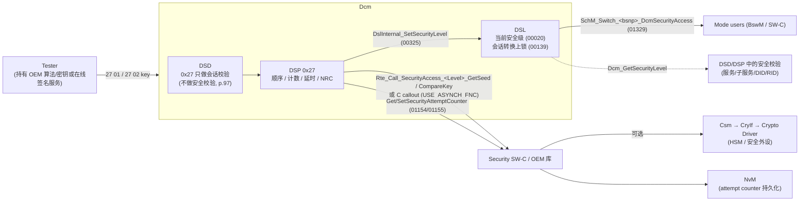
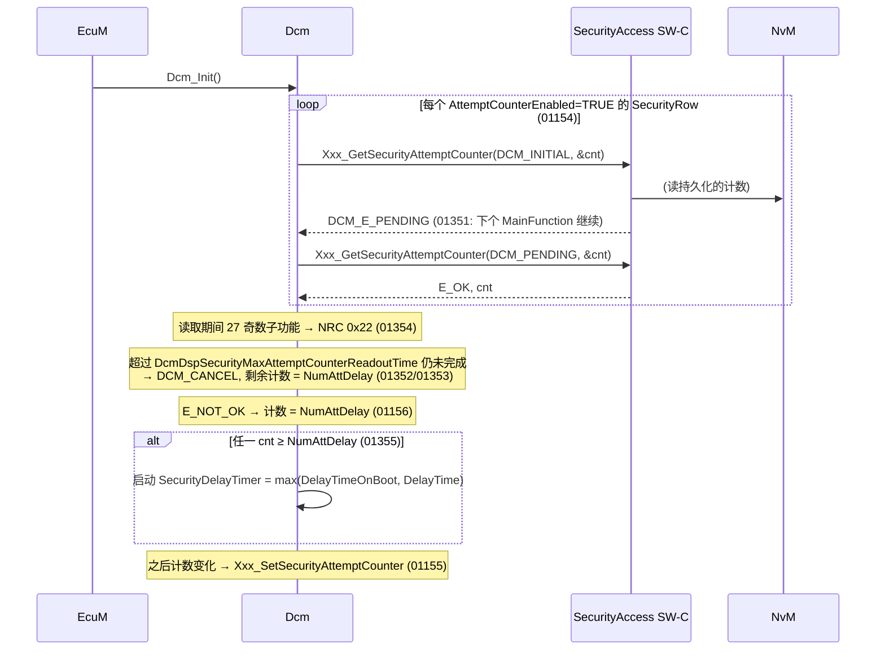
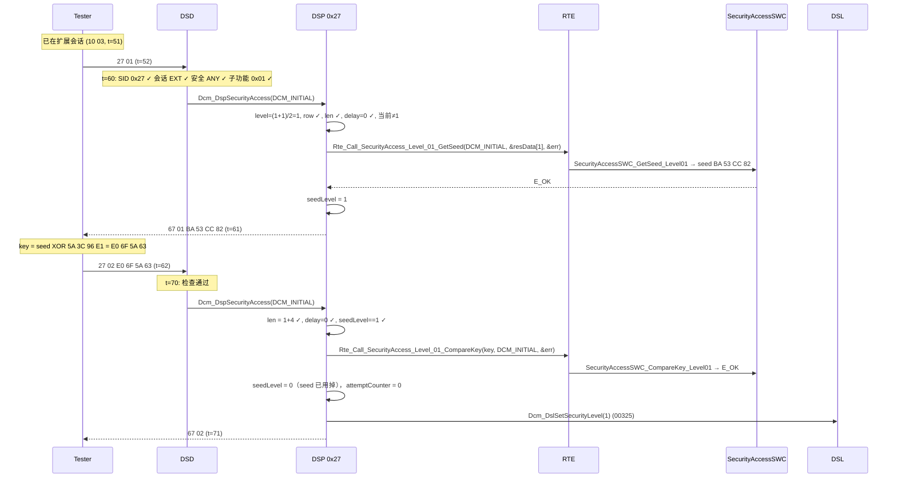
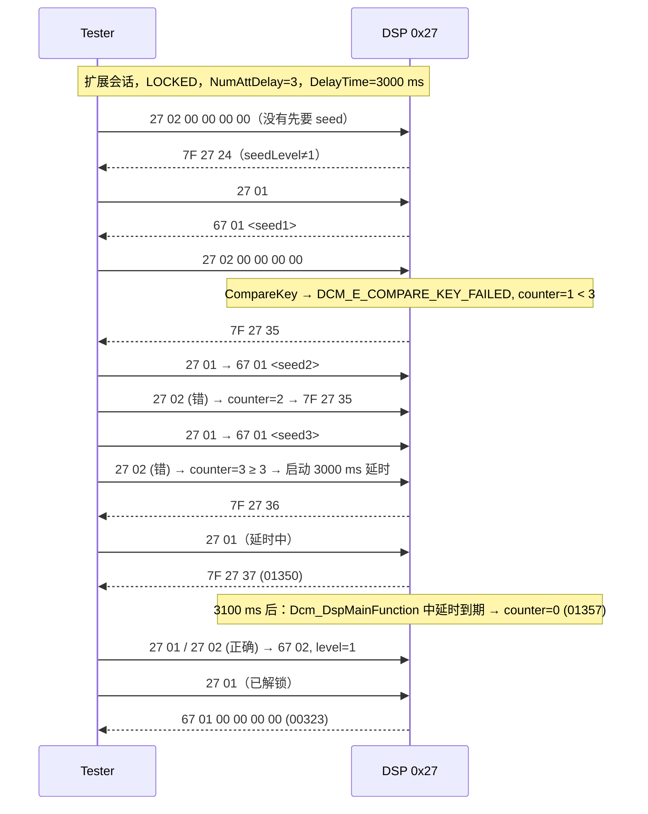

# SecurityAccess (0x27)：seed/key、尝试计数器、延时与安全算法

> Prerequisite: [03 DSD](03-dsd.md)（安全级校验）、[04 DSP](04-dsp.md)（OpStatus）、[06 会话控制](06-diagnostic-session.md)（会话转换上锁）
> Next: [08 DID](08-did.md)
> 对应规范: AUTOSAR CP SWS DCM **R20-11**：服务 0x27 §7.6.2.8（p.142–144）、安全级管理 §7.4.4.11（p.73–75）、DSD 安全校验（p.97–98）、`Dcm_SecLevelType`（p.302）、ModeDeclarationGroup `DcmSecurityAccess`（`01327/01328` p.104）、C 原型（p.265–268）、端口接口 `SecurityAccess_{SecurityLevel}`（`00685` p.338–340）、DcmDspSecurityRow（p.644–652）、change history 4.2.1/4.3.0（p.2–3）
> 对应源码: openAUTOSAR `diagnostic/Dcm/src/Dcm_Dsp.c:1614-1731`；本项目 [`diag/Dcm_Dsp.c:372-482`](../../examples/uds_diag_demo/diag/Dcm_Dsp.c)、[`swc/SecurityAccessSWC.c`](../../examples/uds_diag_demo/swc/SecurityAccessSWC.c)、[`rte/Rte_Dcm.c:89-103`](../../examples/uds_diag_demo/rte/Rte_Dcm.c)、trace 第 163–230 行；RH850/P1M-E 数据手册 r01ds0505ed0100 p.3、硬件手册 r01uh0585ej0120 p.66 / p.2863

---

## 1. 本章目标

1. 说清 0x27 的两步握手：requestSeed（奇数子功能）→ sendKey（偶数子功能）；子功能值与安全级的换算；“已解锁时 seed 全 0”的含义。
2. 理解 DCM 与应用之间的分工：DCM 管**流程与防暴力破解**（顺序、计数、延时、NRC），应用管**算法**（`GetSeed/CompareKey`）。
3. 精确说出 NRC 0x12、0x13、0x22、0x24、0x35、0x36、0x37 在 0x27 中各自何时出现，以及哪些由 R20-11 编号需求规定、哪些只是规范“示例”。
4. 理解 attempt counter 的上电恢复（`Xxx_GetSecurityAttemptCounter`）与 `DcmDspSecurityDelayTimeOnBoot`——为什么“断电重启”不能成为绕过延时的手段。
5. 解释为什么 demo 的 XOR 算法和 LCG seed 绝不可用于量产；真实项目为什么用 HSM/Csm、MAC 算法与真随机数；“静态 seed”问题是什么。
6. 能在 demo trace 中逐行跟踪 `27 01` / `27 02 <key>`，并在 `tests/test_uds_demo.c` 中读懂 0x24/0x35/0x36/0x37 的测试。

---

## 2. 为什么需要 SecurityAccess？

会话（[06](06-diagnostic-session.md)）回答“测试仪处于什么工作上下文”，但会话切换本身**没有身份验证**——任何人只要接上 OBD 口就能发 `10 03`。对于写 VIN、改标定、刷写、关闭安全功能这类操作，需要额外证明“测试仪知道一个秘密”。

0x27 用的是挑战-应答（challenge-response）：

1. ECU 产生一个**不可预测**的 seed（挑战）；
2. 测试仪用只有授权方知道的秘密/算法计算 key（应答）；
3. ECU 用同样的秘密验证 key。

`SWS_Dcm_00252`（p.142）：本服务的目的是“为出于安全、排放或安全性原因而受限的数据和/或诊断服务提供访问手段”。

挑战-应答只有在两个前提成立时才有意义：**seed 不可预测**、**秘密不泄露**。DCM 规范对这两点几乎不做规定（它们属于应用/OEM），而是专注于第三件事：**限制猜测次数**——这就是 attempt counter 与 delay timer。

---

## 3. 在系统中的位置



---

## 4. AUTOSAR 如何定义

### 4.1 安全级与子功能

`[AUTOSAR Standard]`

- `Dcm_SecLevelType`（`SWS_Dcm_00977`，p.302）：`0x00 = DCM_SEC_LEV_LOCKED`，`0x01–0x3F` 配置相关。
- 换算：**SecurityLevel = (SecurityAccessType + 1) / 2**（p.240，`DcmDspSecurityLevel` `ECUC_Dcm_00754` p.650）。requestSeed = 2×Level − 1（奇数），sendKey = 2×Level（偶数）。例：level 1 ↔ `27 01`/`27 02`；level 3 ↔ `27 05`/`27 06`。
- DSL 保存当前安全级（`00020`，p.73），初始化为 LOCKED（`00033`，p.74），**同一时间只有一个安全级**（p.74）。
- 每次安全级变化都更新 ModeDeclarationGroup `DcmSecurityAccess`（`01329`，p.74），其模式为 `DCM_SEC_LEV_LOCKED, DCM_SEC_LEV_1 … DCM_SEC_LEV_63`，initialMode = LOCKED（`01327`，p.104）；切换接口 `SchM_Switch_<bsnp>_DcmSecurityAccess`（`01328`）；SW-C 通过 `Dcm_SecurityAccessModeSwitchInterface` 感知（p.415）。
- 会话转换上锁规则（`00139`）见 [06](06-diagnostic-session.md) §4.3。

“安全级”是**集合成员**而不是“等级高低”：服务/DID 配置的是“允许的安全级列表”（`*SecurityLevelRef`，0..\*），当前安全级必须在列表中。level 3 并不自动包含 level 1 的权限——除非配置把两者都列上。

### 4.2 应用接口

`[AUTOSAR API]` C 原型（`Dcm_Externals.h`，p.265–268）：

```c
/* requestSeed：带 / 不带 securityAccessDataRecord（由 DcmDspSecurityADRSize 是否配置决定） */
Std_ReturnType Xxx_GetSeed(const uint8* SecurityAccessDataRecord, Dcm_OpStatusType OpStatus,
                           uint8* Seed, Dcm_NegativeResponseCodeType* ErrorCode);          /* SWS_Dcm_01151, 0x44 */
Std_ReturnType Xxx_GetSeed(Dcm_OpStatusType OpStatus, uint8* Seed,
                           Dcm_NegativeResponseCodeType* ErrorCode);                       /* SWS_Dcm_91003, 0x45 */
/* sendKey */
Std_ReturnType Xxx_CompareKey(const uint8* Key, Dcm_OpStatusType OpStatus,
                              Dcm_NegativeResponseCodeType* ErrorCode);                    /* SWS_Dcm_91004, 0x47 */
/* attempt counter 持久化（DcmDspSecurityAttemptCounterEnabled = TRUE 时） */
Std_ReturnType Xxx_GetSecurityAttemptCounter(Dcm_OpStatusType OpStatus, uint8* AttemptCounter); /* SWS_Dcm_01152, 0x59 */
Std_ReturnType Xxx_SetSecurityAttemptCounter(Dcm_OpStatusType OpStatus, uint8 AttemptCounter);  /* SWS_Dcm_01153, 0x5a */
```

- 访问方式由 `DcmDspSecurityUsePort`（`ECUC_Dcm_00967`，p.652）决定：`USE_ASYNCH_CLIENT_SERVER` → R-Port `SecurityAccess_{SecurityLevel}`（`00685`，p.338–340），DSP 调 `Rte_Call_SecurityAccess_<Level>_GetSeed/CompareKey`（`00324`）；`USE_ASYNCH_FNC` → `DcmDspSecurityGetSeedFnc` / `CompareKeyFnc` 指定的 C 函数（`00862/00863`，`CONSTR_6077/6075`）。
- 两种都是**异步**（带 OpStatus）——seed 生成和 key 验证可能需要调用 HSM，耗时不确定。
- `CompareKey` 的返回值：`E_OK`（key 正确）、`DCM_E_COMPARE_KEY_FAILED`（值 11，key 错误）、`E_NOT_OK`（其他错误，ErrorCode 有效）、`DCM_E_PENDING`。
- `Seed` 的长度 = `DcmDspSecuritySeedSize`（`00755`）；`Key` 的长度 = `DcmDspSecurityKeySize`（`00760`）；可选的 securityAccessDataRecord 长度 = `DcmDspSecurityADRSize`（`00725`）。

### 4.3 处理规则（§7.6.2.8，p.142–144）

| SWS | 条件 | 动作 / NRC |
|---|---|---|
| `00321` | 请求长度正确后，子功能（access type）未配置 | 0x12 |
| `00323` | requestSeed，且该级**已经激活** | seed 内容置 0x00（正响应 `67 xx 00 00 …`） |
| `00324` / `00862` | requestSeed，该级未激活 | 调 `Xxx_GetSeed` |
| `00659` | `GetSeed` 返回 `E_NOT_OK` | 用 ErrorCode 作 NRC |
| `01350` | requestSeed，而该级的 **SecurityDelayTimer 未到期** | 0x37 |
| `01354`（p.75） | attempt counter 尚未从应用全部读回 | requestSeed → 0x22 |
| `00863` | sendKey，该级未激活，**且对应 requestSeed 已成功执行** | 调 `Xxx_CompareKey` |
| `00325` | `CompareKey` 返回 `E_OK` | `DslInternal_SetSecurityLevel(level)` |
| `01397` | `CompareKey` 返回 `DCM_E_COMPARE_KEY_FAILED` 且配置了 `NumAttDelay` | 该级 attempt counter + 1 |
| `00660` | 失败且 counter **<** `DcmDspSecurityNumAttDelay` | 0x35（invalidKey），安全级不变 |
| `01349` | 失败且 counter **≥** `NumAttDelay` | 启动 `DcmDspSecurityDelayTime`，0x36（exceededNumberOfAttempts），安全级不变 |
| `01150` | `CompareKey` 返回 `E_NOT_OK` | ErrorCode 作 NRC；**不**增加计数、**不**改安全级 |
| `01357`（p.75） | sendKey 成功，或 SecurityDelayTimer 到期 | 该级 counter 清零 |
| `01155`（p.75） | counter 变化（且 `AttemptCounterEnabled`） | 调 `Xxx_SetSecurityAttemptCounter` 通知应用（以便持久化） |

**规范“示例”而非编号需求**（p.143）：“作为示例，安全访问服务可以检测并存入 error code 的错误”：

- `0x24` RequestSequenceError——sendKey 时 access type 无效（例如没有先 requestSeed）；
- `0x37` RequiredTimeDelayNotExpired——延时激活中；
- `0x36` ExceededNumberOfAttempts——尝试次数达到/超过上限；
- `0x35` InvalidKey——key 错误。

`[Real Project Consideration]` 注意 **0x24 没有对应的编号需求**：`00863` 只规定“只有 requestSeed 成功后才调用 `CompareKey`”，没规定否则回什么 NRC。各实现通常回 0x24（ISO 14229-1 的约定）。同样，**sendKey 时延时仍在运行**怎么回应，R20-11 只规定了 requestSeed（`01350`）。这些都是升级时需要用测试锁定的行为。

### 4.4 DSD 层的安全校验与 0x27 本身

- 其他服务/子服务的安全校验在 DSD（`00217/00617` → 0x33），DID/RID 的在 DSP（`00435/00470/00571` → 0x33）。
- **0x27 本身不做安全校验**（p.97）——否则无法从 LOCKED 解锁。
- 0x27 通常只在非默认会话中允许（服务的会话引用），由 DSD 产生 0x7F。

### 4.5 尝试计数器的上电恢复与上电延时

`[AUTOSAR Standard]`（§7.4.4.11.1，p.74–75；4.3.0 “Rework of Security Access management”，p.2）

**问题**：如果 attempt counter 只在 RAM 中，攻击者可以“试 2 次 → 断电 → 再试 2 次 → 断电……”，延时永远不会触发。

**R20-11 的方案**：



要点：

- **读失败按“最坏”处理**：`GetSecurityAttemptCounter` 返回 `E_NOT_OK`（例如 NvM 数据损坏）→ 计数设为 `NumAttDelay`（`01156`），即视为已经达到上限——这是“fail-safe”设计：存储故障不应让安全变弱。
- **读取有时限**：`DcmDspSecurityMaxAttemptCounterReadoutTime`，必须是 `DcmTaskTime` 的整数倍（`CONSTR_6074`）；配置为 0 的计时器视为“立即超时”（`01356`）。
- **上电延时**：`DcmDspSecurityDelayTimeOnBoot`（`ECUC_Dcm_00726`，p.649）的描述是“上电时 DCM 不接受安全访问的时间”。但在 R20-11 的编号需求中，它只出现在 `01355`：恢复的计数 ≥ `NumAttDelay` 时，用 `max(DelayTimeOnBoot, DelayTime)` 启动延时。“是否在**每次**上电都无条件施加 DelayTimeOnBoot”，参数描述与编号需求的表述并不完全一致 → 真实栈的行为需在真实项目确认。
- `CONSTR_6083`：未配置 `NumAttDelay` 时，`AttemptCounterEnabled` 必须为 FALSE（没有上限就没有计数的意义）。`CONSTR_6076/6078`：`Get/SetAttemptCounterFnc` 只在 `USE_ASYNCH_FNC` 且 `AttemptCounterEnabled` 时存在。

### 4.6 关于“静态 seed”

R20-11 change history 4.2.1（p.3）提到 “security Lock time, static seed”；p.143 的 Note 说：“若使用静态 seed 机制，处理需由实现 `Xxx_GetSeed()` 和 `Xxx_CompareKey()` 的应用完成。”——也就是说，**DCM 规范不定义静态 seed 的语义，而是把它留给应用**。

`[Conceptual]` 业界讨论“静态 seed”时通常指两件相关但不同的事，你在 OEM 安全规范中需要分辨：

1. **seed 恒定或可预测（必须避免）**：如果 seed 每次都一样（或可以从时间、计数器、上一次 seed 推算），攻击者只需记录一次合法的 seed/key 对，就能**重放**解锁。这是“static seed avoidance”的核心——seed 必须来自足够好的随机源，且每次不同。
2. **在一次未完成的握手中重复 requestSeed 返回同一个 seed（有时是故意的）**：一些 OEM 规定，在发出 seed 但未收到有效 key 之前，再次 requestSeed 返回**相同**的 seed，防止攻击者通过反复请求 seed 来“挑选”一个容易的挑战或扰乱计数。这种行为是否需要、何时刷新，属于 OEM 规范 → 需在真实项目确认。

全 0 seed 有特殊含义：`00323` 用全 0 表示“已经解锁”。因此 `GetSeed` **绝不能**在未解锁时产生全 0 seed——demo 的 SWC 专门处理了这一点（`SecurityAccessSWC.c:46-48`）。

---

## 5. 核心数据结构

### 5.1 配置

`[Educational Implementation]` `diag/Dcm_Cfg.h:60-74`：

```c
typedef Std_ReturnType (*Dcm_GetSeedFncType)(Dcm_OpStatusType OpStatus, uint8 *Seed,
                                             Dcm_NegativeResponseCodeType *ErrorCode);
typedef Std_ReturnType (*Dcm_CompareKeyFncType)(const uint8 *Key, Dcm_OpStatusType OpStatus,
                                                Dcm_NegativeResponseCodeType *ErrorCode);
typedef struct {
    Dcm_SecLevelType      level;        /* DcmDspSecurityLevel (requestSeed = 2*level-1) */
    uint8                 seedSize;     /* DcmDspSecuritySeedSize                    */
    uint8                 keySize;      /* DcmDspSecurityKeySize                     */
    uint8                 numAttDelay;  /* DcmDspSecurityNumAttDelay                 */
    uint16                delayTimeMs;  /* DcmDspSecurityDelayTime                   */
    Dcm_GetSeedFncType    getSeed;      /* -> Rte_Call_SecurityAccess_<Level>_GetSeed */
    Dcm_CompareKeyFncType compareKey;   /* -> Rte_Call_SecurityAccess_<Level>_CompareKey */
    const char           *name;
} Dcm_DspSecurityRowType;
```

实例（`Dcm_Cfg.c:26-30`）：level 1，seed/key 4 字节，3 次失败后延时 3000 ms，端口 `SecurityAccess_Level_01`。服务表（`Dcm_Cfg.c:121`）：0x27 只允许扩展会话、安全掩码 `DCM_SEC_ANY`（p.97：0x27 不做安全校验）；子服务 `Dcm_Sub27 = {0x01, 0x02}`（`Dcm_Cfg.c:104-107`）。

签名对应 `SWS_Dcm_91003`（无 ADR 的 GetSeed）与 `91004`（CompareKey）——因为 demo 没有配置 `DcmDspSecurityADRSize`。

### 5.2 运行时状态

`diag/Dcm_Dsp.c:32-40`：

```c
typedef struct {  /* [Educational Implementation] */
    uint8            seedLevel;                              /* 已发出 seed 的级别; 0 = 无 */
    uint8            attemptCounter[DCM_DSP_MAX_SECURITY_ROWS];
    sint32           delayMs[DCM_DSP_MAX_SECURITY_ROWS];
} Dcm_DspSecurityStateType;
static Dcm_DspSecurityStateType Dcm_DspSec;
```

当前安全级本身在 DSL：`Dcm_Dsl.secLevel`（`Dcm_Dsl.c:65`）——规范把“安全级的持有”放在 DSL（`00020`），把“获取安全级的流程”放在 DSP。

---

## 6. 初始化流程

- `Dcm_DslInit`：`secLevel = DCM_SEC_LEV_LOCKED`（`Dcm_Dsl.c:155`，`00033`）。
- `Dcm_DspInit`：清零 `Dcm_DspSec`（`Dcm_Dsp.c:79`）——**attempt counter 与延时在复位后丢失**。这是 demo 的简化：没有实现 `Get/SetSecurityAttemptCounter` 与 `DelayTimeOnBoot`（§4.5）。在 demo 中“断电重启”可以清除延时——这正是 R20-11 的 4.5 节机制要防止的攻击。
- `SecurityAccessSWC_Init`（`SecurityAccessSWC.c:26-32`）：清除上一次的 seed。

---

## 7. Runtime Flow

### 7.1 成功解锁（trace 第 163–230 行）



trace 中的关键行：

```text
[    60 ms] [Dcm/DSP ] 0x27 01: requestSeed level 1 -> GetSeed(DCM_INITIAL)
[    60 ms] [Rte     ] Rte_Call_SecurityAccess_Level_01_GetSeed(DCM_INITIAL) -> SecurityAccessSWC_GetSeed_Level01
[    60 ms] [SWC     ] SecurityAccessSWC_GetSeed_Level01: seed BA 53 CC 82
[    60 ms] [Dcm/DSL ] response [67 01 BA 53 CC 82] -> PduR_DcmTransmit(0, len=6)
...
[    70 ms] [Dcm/DSP ] 0x27 02: sendKey level 1 -> CompareKey(DCM_INITIAL)
[    70 ms] [SWC     ] SecurityAccessSWC_CompareKey_Level01: key E0 6F 5A 63 -> E_OK
[    70 ms] [Dcm/DSL ] security level 0 -> 1
[    70 ms] [Dcm/DSL ] response [67 02] -> PduR_DcmTransmit(0, len=2)
```

验证 key：`BA^5A=E0`、`53^3C=6F`、`CC^96=5A`、`82^E1=63`。

注意与 0x10 的区别：**安全级在处理时立即生效**（`Dcm_DslSetSecurityLevel` 在 DSP handler 中调用，trace 中 “security level 0 -> 1” 出现在 `PduR_DcmTransmit` 之前）。R20-11 `00325` 也是“CompareKey 返回 E_OK 时设置新安全级”，没有要求等 Tx 确认——与 0x10 的 `00311` 不同。

### 7.2 失败、计数与延时（`test_security_access`，`tests/test_uds_demo.c:137-173`）



测试中的 `Sim_RunMs(3100u)` 小于 S3（5000 ms），所以会话不会在等待延时期间回默认——否则安全上锁与 seed 作废会干扰测试意图（注释见 `tests/test_uds_demo.c` 第 163 行）。

### 7.3 sendKey 的检查顺序（demo）

`Dcm_Dsp.c:437-481`：

```text
DCM_INITIAL:
  1. 长度 = 1 + keySize ?                 否 → 0x13
  2. 延时计时器 > 0 ?                      是 → 0x37   (demo 选择; R20-11 只对 requestSeed 规定 01350)
  3. seedLevel == level ?                  否 → 0x24   (00863 + p.143 示例)
CompareKey(Key, OpStatus, &ErrorCode):
  DCM_E_PENDING              → PENDING
  （任何最终结果）           → seedLevel = 0  (一个 seed 只能用于一次 key 尝试)
  E_OK                       → counter = 0, DslSetSecurityLevel(level) → 67 0x
  DCM_E_COMPARE_KEY_FAILED   → counter++ ; ≥NumAttDelay → delay + 0x36 ; 否则 0x35
  E_NOT_OK                   → ErrorCode (01150)
```

“一个 seed 只能用于一次 key 尝试”（`Dcm_Dsp.c:458`）是防暴力破解的关键：如果失败后 seed 仍有效，攻击者可以对同一个挑战无限次猜测，计数器只能在“猜测之间”增加而无法阻止离线遍历——尤其当 key 只有 2–4 字节时。R20-11 没有用编号需求明确这一点（`00863` 只说“requestSeed 已成功执行”），它通常来自 ISO 14229-1 与 OEM 规范 → 需在真实项目确认。

### 7.4 会话转换使 seed 作废

`Dcm_DslSetSession` → `Dcm_DspSessionChanged()`（`Dcm_Dsp.c:102-105`）把 `seedLevel` 清零：在扩展会话要到的 seed，在 `10 03` 重入或 S3 超时之后不再可用。结合 `00139`（会话转换上锁），这保证了“会话转换 = 安全上下文完全重置”。

---

## 8. RH850 Hardware Mapping 与安全算法

### 8.1 为什么 demo 的算法是“反面教材”

`[Educational Implementation]` `swc/SecurityAccessSWC.c:9-15` 头注释已经写明：**INSECURE TEACHING ALGORITHM**。

| demo 做法 | 代码 | 问题 |
|---|---|---|
| seed 来自线性同余发生器 `Lcg = Lcg * 1103515245 + 12345`，初值固定 `0x1234ABCD` | `SecurityAccessSWC.c:23`、`:42` | **可预测**：每次上电序列相同；观察一个 seed 就能推出后续所有 seed |
| key = seed XOR 常量掩码 `{5A 3C 96 E1}` | `:22`、`:66` | 只要看到一对 seed/key，就能算出掩码（`mask = seed XOR key`），从此可以为任何 seed 算 key |
| 掩码作为 `const` 存在 flash 中 | `:22` | 通过调试器/读 flash 可直接提取 |
| 4 字节 seed/key | `Dcm_Cfg.c:28` | 2^32 的空间，配合可预测 seed，安全性约等于零 |

DCM 侧（计数、延时、NRC）与算法**无关**，这正是 demo 想展示的分工；但读者必须清楚：**这个 SWC 不能出现在任何真实 ECU 中**。

### 8.2 真实项目的做法 `[Real Project Consideration]`

- **算法**：通常是基于对称密钥的 MAC（例如以 seed 为消息计算 AES-CMAC 并截取作为 key）或基于证书/非对称签名的方案；具体算法属于 OEM 机密，通常以库的形式交付。更新的车型越来越多地使用 **0x29 Authentication**（R20-11 已包含，p.147 起；DCM 只支持 PKI 子功能，p.27–29），用证书替代共享秘密。
- **密钥存储**：密钥不能以明文常量存在普通 flash 中。常见做法是存放在 MCU 的安全模块（HSM）中，应用只能请求“用某个 key slot 计算 MAC”，而无法读出密钥本身。
- **随机数**：seed 应来自真随机数发生器（TRNG）或经过正确播种的 DRBG。
- **AUTOSAR 路径**：`SecurityAccess SW-C` → `Csm`（Crypto Service Manager）→ `CryIf` → Crypto Driver → 硬件安全模块。Csm/CryIf 的 SWS **不在本仓库** → 接口细节需以真实项目所用 release 的 SWS 确认。因为 HSM 调用通常是异步的，`GetSeed/CompareKey` 的 OpStatus 模型（`DCM_E_PENDING`）在这里真正派上用场。
- **调试接口保护**：如果调试器能读出 flash，任何软件方案都会失效。量产 ECU 必须锁定调试/编程接口。

### 8.3 RH850/P1M-E 上的相关硬件

`[RH850 Hardware]`

- P1M-E 数据手册（r01ds0505ed0100）p.3 的功能表与硬件手册（r01uh0585ej0120）p.66 均列出 **“Security (ICUS): Yes”**——即 P1M-E 带有 ICU-S 安全模块。其具体能力（加密算法、随机数发生器、密钥存储方式、与主 CPU 的接口）**本仓库没有资料**：硬件手册 p.2863 明确指向单独的 “RH850/P1M-E ICUSE User's Manual” → 需根据该手册与 Renesas 的安全软件包确认。
- 同一页（硬件手册 p.2863，§35 flash 安全功能）列出了与 flash 编程相关的安全功能：ID code 认证、禁止连接专用 flash 编程器、禁止块擦除/编程/读取命令、OTP 设置等——这些是“防止通过调试/编程接口读出密钥”的硬件基础，具体位定义见该手册 Table 35.4 及 ICUSE 手册。
- 作为对比，P1x-C 数据手册（REN_r01ds0506ed0100，p.1 概述）提到其 secure peripherals 包含 AES engine 与 Random Number Generator——这是**另一个 derivative**，不能直接套用到 P1M-E。

| 安全访问需求 | 在 RH850 上去哪里找答案 |
|---|---|
| 不可预测的 seed | ICU-S 是否提供 RNG → ICUSE User's Manual（不在本仓库） |
| 密钥不可读出 | ICU-S 密钥存储 + flash 安全功能（硬件手册 §35，p.2863 起） |
| MAC 计算 | ICU-S 加密引擎（若有）；否则软件实现 + 密钥保护 |
| attempt counter 持久化 | NvM → Fee → Data Flash |
| 调试口保护 | ID code / OTP（硬件手册 §35） |

---

## 9. openAUTOSAR 实现（R3.1.5 风格）

`DspUdsSecurityAccess`（`diagnostic/Dcm/src/Dcm_Dsp.c:1614-1731`）：

| 步骤 | 位置 | 行为 |
|---|---|---|
| 子功能范围 0x01..0x42 | `:1620` | 否则 0x12（`:1727`） |
| level = (sub+1)/2 | `:1621-1622` | — |
| requestSeed：找安全行 | `:1628-1631` | 未配置 → 0x12（`:1684`） |
| 长度 = 2 + ADRSize | `:1634` | 否则 0x13（`:1679`） |
| 已解锁 → 全 0 seed | `:1639-1643` | `DCM323` |
| `GetSeed(adr, seedOut, &err)` | `:1648` | 同步，无 OpStatus；失败用 err 或 0x22 |
| 记录 `reqSecLevel / reqSecLevelRef / reqInProgress=TRUE` | `:1654-1656` | — |
| sendKey 无 seed | `:1689` / `:1722` | 0x24 |
| 长度 = 2 + KeySize | `:1690` | 否则 0x13（`:1717`） |
| level 与 seed 的 level 不同 | `:1691` / `:1712` | **0x22**（ISO 通常为 0x24） |
| `CompareKey(key)` | `:1694` | 同步，无 OpStatus、无 ErrorCode |
| 成功 → `DslSetSecurityLevel`、`reqInProgress=FALSE` | `:1698-1699` | `DCM325` |
| 失败 → 0x35 | `:1705` | **`reqInProgress` 保持 TRUE** |

关键安全缺陷（教学重点）：

1. **无 attempt counter、无延时**：`DspSecurityNumAttDelay / DelayTime / DelayTimeOnBoot / NumAttLock` 字段存在于 `Dcm_DspSecurityRowType`（`include/Dcm_Lcfg.h:114-117`）但源码从未使用 → 永远不会产生 0x36/0x37。
2. **失败后 seed 仍有效**：`reqInProgress` 在 0x35 后不清除，测试仪可以对同一个 seed 无限次发送 sendKey——这是一个可以被直接暴力破解的实现。
3. **同步接口**：`GetSeed/CompareKey` 无 OpStatus，无法等待 HSM。
4. 安全级变化无模式通知（无 `DcmSecurityAccess` 模式组）。

这些正对应 R20-11 change history 4.3.0 的 “Rework of Security Access management”（研究笔记 02 §6.1）。

---

## 10. 当前教学项目实现

`[Educational Implementation]` demo 实现了：`00321`（0x12）、`00323`（全 0 seed）、`00324`（GetSeed via RTE）、`00659`、`01350`（0x37）、`00863`（只在 seed 后 CompareKey，否则 0x24）、`00325`、`01397`、`00660`（0x35）、`01349`（0x36 + 延时）、`01150`、`01357`（成功或延时到期清零，`Dcm_Dsp.c:94/460`）、会话转换使 seed 作废、一个 seed 只能尝试一次。

未实现 / 简化：

| 规范 | demo |
|---|---|
| `01154–01156/01351–01355` attempt counter 上电恢复与持久化 | 无；复位清零 |
| `DcmDspSecurityDelayTimeOnBoot` | 无 |
| `01329` `DcmSecurityAccess` 模式切换 | `Dcm_DslSetSecurityLevel`（`Dcm_Dsl.c:102-106`）只改变量，不调用 `SchM_Switch` |
| `00139` 只在“非默认 → 任意会话”转换时复位安全级 | `Dcm_DslSetSession`（`Dcm_Dsl.c:115`）对**所有**会话转换（含默认 → 默认）都上锁；因 0x27 只在扩展会话可用，demo 中无可观察影响（见 [06 会话](06-diagnostic-session.md) §10） |
| `DcmDspSecurityADRSize`（securityAccessDataRecord） | 无；requestSeed 长度必须正好 2 |
| `USE_ASYNCH_FNC` | 无，只有 C/S 形态 |
| 多个安全级 | 只配置 level 1（`DCM_DSP_MAX_SECURITY_ROWS 2u`） |
| 安全算法 | XOR，**不安全** |

---

## 11. Code Walkthrough（`diag/Dcm_Dsp.c:383-482`）

### 11.1 入口与子功能映射

```c
uint8 sub = pMsgContext->reqData[0];                     /* [Educational Implementation] SPRMIB 已被 DSD 剥离 */
uint8 level = (uint8)((sub + 1u) / 2u);                  /* SecurityLevel = (AccessType+1)/2 */
uint8 rowIdx = Dcm_DspFindSecurityRow(level);
...
if ((rowIdx == 0xFFu) || (rowIdx >= DCM_DSP_MAX_SECURITY_ROWS)) {
    *ErrorCode = DCM_E_SUBFUNCTIONNOTSUPPORTED;          /* SWS_Dcm_00321 */
    return E_NOT_OK;
}
```

demo 中 DSD 已经用 `Dcm_Sub27` 拦截了未配置的子功能（`00273`），所以这里的 0x12 是第二道防线（例如将来有人只加了子服务表条目而忘了安全行）。

### 11.2 requestSeed（`:401-435`）

```c
if ((sub & 0x01u) != 0u) {  /* [Educational Implementation] */
    if (OpStatus == DCM_INITIAL) {
        if (pMsgContext->reqDataLen != 1u)              → 0x13
        if (Dcm_DspSec.delayMs[rowIdx] > 0)             → 0x37   /* SWS_Dcm_01350 */
        if (Dcm_DslGetSecurityLevel() == level) {                 /* SWS_Dcm_00323 */
            resData = sub, 00 × seedSize; return E_OK;
        }
    }
    r = row->getSeed(OpStatus, &pMsgContext->resData[1], ErrorCode);   /* SWS_Dcm_00324 */
    if (r == DCM_E_PENDING) return DCM_E_PENDING;
    if (r != E_OK)          return E_NOT_OK;                            /* SWS_Dcm_00659 */
    Dcm_DspSec.seedLevel = level;
    resData[0] = sub; resDataLen = 1 + seedSize;
    return E_OK;
}
```

（`→ NRC` 为排版压缩，原文每个分支设置 `*ErrorCode` 并 `return E_NOT_OK`。）

`GetSeed` 直接写入 `resData[1]`——seed 不经过中间缓冲。若 `GetSeed` 返回 PENDING，`resData` 中可能有部分写入的内容，但只有最终 `E_OK` 后 `resDataLen` 才被设置（`01187` 的精神）。

### 11.3 sendKey（`:437-481`）

```c
if (OpStatus == DCM_INITIAL) {  /* [Educational Implementation] */
    if (pMsgContext->reqDataLen != (1u + row->keySize)) → 0x13
    if (Dcm_DspSec.delayMs[rowIdx] > 0)                 → 0x37
    if (Dcm_DspSec.seedLevel != level)                  → 0x24   /* sendKey without seed */
}
r = row->compareKey(&pMsgContext->reqData[1], OpStatus, ErrorCode);    /* SWS_Dcm_00863 */
if (r == DCM_E_PENDING) return DCM_E_PENDING;
Dcm_DspSec.seedLevel = 0u;                       /* a seed can be used for exactly one key attempt */
if (r == E_OK) {
    Dcm_DspSec.attemptCounter[rowIdx] = 0u;      /* SWS_Dcm_01357 */
    Dcm_DslSetSecurityLevel(level);              /* SWS_Dcm_00325 */
    resData[0] = sub; resDataLen = 1u; return E_OK;
}
if (r == DCM_E_COMPARE_KEY_FAILED) {
    Dcm_DspSec.attemptCounter[rowIdx]++;         /* SWS_Dcm_01397 */
    if (Dcm_DspSec.attemptCounter[rowIdx] >= row->numAttDelay) {
        Dcm_DspSec.delayMs[rowIdx] = (sint32)row->delayTimeMs;   /* SWS_Dcm_01349 */
        *ErrorCode = DCM_E_EXCEEDNUMBEROFATTEMPTS;               /* 0x36 */
    } else {
        *ErrorCode = DCM_E_INVALIDKEY;                           /* 0x35, SWS_Dcm_00660 */
    }
    return E_NOT_OK;
}
return E_NOT_OK;                                 /* E_NOT_OK: ErrorCode from the SW-C (SWS_Dcm_01150) */
```

### 11.4 延时计时（`:86-100`）

```c
void Dcm_DspMainFunction(void)  /* [Educational Implementation] */
{
    for (r = 0u; (r < Dcm_CfgPtr->numSecurityRows) && (r < DCM_DSP_MAX_SECURITY_ROWS); r++) {
        if (Dcm_DspSec.delayMs[r] > 0) {
            Dcm_DspSec.delayMs[r] -= (sint32)DCM_TASK_TIME_MS;
            if (Dcm_DspSec.delayMs[r] <= 0) {
                Dcm_DspSec.delayMs[r] = 0;
                Dcm_DspSec.attemptCounter[r] = 0u;     /* SWS_Dcm_01357 */
            }
        }
    }
}
```

延时按安全级（行）独立计时：level 1 的延时不影响 level 3 的 requestSeed——这与 `01349/01350` 中“for the SecurityLevel which was requested”一致。

### 11.5 SWC 侧（`swc/SecurityAccessSWC.c:34-73`）

`GetSeed` 与 `CompareKey` 都处理 `DCM_CANCEL`（直接返回 `E_OK`，值会被忽略）；`CompareKey` 只返回 `E_OK` 或 `DCM_E_COMPARE_KEY_FAILED`，从不使用 ErrorCode——计数与 NRC 完全交给 DCM。这是推荐的分工：**SW-C 只回答“key 对不对”，不决定 NRC**。若 SW-C 返回 `E_NOT_OK` + 自定义 NRC，计数不会增加（`01150`），这可以被用来表达“暂时无法验证（如 HSM 忙）”而不惩罚测试仪。

---

## 12. Debug 方法

| 现象 | 看什么 | 原因方向 |
|---|---|---|
| `27 01` → `7F 27 7F` | 当前会话、0x27 服务的会话引用 | 未进入扩展会话 |
| `27 01` → `7F 27 37` | 延时计时器 | 之前失败次数达到上限；（真实栈）上电恢复的计数 ≥ NumAttDelay，或 DelayTimeOnBoot |
| `27 01` → `7F 27 22`（刚上电） | attempt counter 读取状态 | `Xxx_GetSecurityAttemptCounter` 仍 PENDING（`01354`） |
| `27 02` → `7F 27 24` | seed 状态 | 没有先 requestSeed；中间发生了会话转换（seed 作废）；上一次 sendKey 已消耗 seed |
| `27 02` → `7F 27 35`，但 key 算法确认正确 | `CompareKey` 收到的 seed 与测试仪收到的 seed | SWC 用的“最后 seed”被覆盖（另一个 requestSeed、另一个级别）；字节序 |
| 解锁成功但 0x2E 仍 0x33 | `Dcm_GetSecurityLevel()`；DID 写的安全引用 | 解锁的级别不在 DID 的允许列表中；或之后的会话转换上锁 |
| 断电重启后延时消失 | attempt counter 持久化 | `AttemptCounterEnabled=FALSE` 或 SWC 未实现 Get/Set（demo 即如此） |

调试时注意：**不要在 `CompareKey` 中打印期望 key**——即使是调试版本，日志也可能泄露算法。demo 的 trace 只打印收到的 key 与结果。

---

## 13. 常见问题

1. **以为 level 3 包含 level 1**：安全级是集合成员，需要在 DID/服务的允许列表中列出所有可接受级别。
2. **seed 可预测**：用时间戳、计数器、未播种的 PRNG 生成 seed；或上电后 seed 序列固定（demo 的 LCG）。
3. **失败后 seed 仍可用**：允许对同一挑战反复猜测（openAUTOSAR 的问题）。
4. **attempt counter 不持久化**：断电即可清除计数与延时。
5. **在 SWC 中自行决定 0x35/0x36**：与 DCM 的计数逻辑冲突，产生重复计数或错误 NRC；SWC 应返回 `DCM_E_COMPARE_KEY_FAILED`。
6. **`GetSeed` 在未解锁时返回全 0**：测试仪会误认为已经解锁。
7. **0x10 重复请求后以为仍解锁**：`00139` 上锁。
8. **测试仪对 0x37 的处理**：不同测试仪对“延时中”的重试策略不同；产线工具常因此卡住——需要与 OEM 工具约定 `DelayTime`。

---

## 14. 实验

运行 `python tools/run_uds_demo.py`（不修改 demo）：

1. **手算 key**：从 trace 第 163–195 行读出 seed，按 `SecurityAccessSWC.c:22` 的掩码计算 key，与第 200 行测试仪发出的 key 比较。
2. **“攻击” demo 算法**：仅凭 trace 中的一对 seed/key（`BA 53 CC 82` / `E0 6F 5A 63`），推导出掩码。然后根据 `SecurityAccessSWC.c:42` 的 LCG，推算下一次上电后第一个 seed。写下这说明了什么。
3. **读测试**：逐条解释 `tests/test_uds_demo.c` 第 137–173 行 `test_security_access` 的每个 `EXPECT`：期望的 NRC 由 `Dcm_Dsp.c` 的哪一行产生？对应哪条 SWS？
4. **时序推演**：若在第三次失败（0x36）之后立刻发 `10 03`（重新进入扩展会话），再发 `27 01`，demo 会回什么？延时是否被会话转换清除？（提示：`Dcm_DspSessionChanged` 只清 `seedLevel`。）R20-11 对此有规定吗？
5. **对比 openAUTOSAR**：用 §9 的表格，推演同样的“3 次错误 key”序列在 openAUTOSAR 中的总线响应，并指出哪一步体现了“失败后 seed 仍有效”的缺陷。

---

## 15. 思考题

1. R20-11 让 `CompareKey` 返回 `E_NOT_OK` 时**不**增加计数（`01150`）。设计一个场景，说明这条规则为什么合理；再设计一个场景，说明恶意/错误的 SW-C 如何利用它削弱保护。
2. `01156` 规定读 attempt counter 失败时视为“已达上限”。这在产线上可能造成什么困扰？OEM 通常如何权衡？
3. 为什么 seed/key 只保护“访问权”，却不保护随后 0x2E/0x31 等请求的**内容**？如果攻击者在合法测试仪解锁后注入一条 0x2E，会发生什么？（提示：0x29 Authentication、SecOC 与 DoIP/TLS 是更完整的方案。）
4. 当 `GetSeed` 由 HSM 实现且需要 20 ms 时，从 `27 01` 到正响应的时序是怎样的？会不会触发 0x78？与 P2 = 50 ms、`DcmTaskTime` = 10 ms 一起计算。

---

## 16. 对未来真实项目的意义

在 RTA-CAR 工程中（实现细节需在真实项目环境中确认）：

1. **找安全行配置**：`DcmDspSecurityRow` 生成的表——级别、seed/key 长度、`NumAttDelay`、`DelayTime`、`DelayTimeOnBoot`、`AttemptCounterEnabled`、`UsePort`。与 OEM 安全规范逐项核对。
2. **找应用实现**：搜 `Rte_Call_SecurityAccess_`、`_GetSeed`、`_CompareKey`、`_GetSecurityAttemptCounter`、`_SetSecurityAttemptCounter`；确认谁实现、是否调用 Csm、是否处理全部 OpStatus。
3. **检查随机源与密钥存储**：seed 来自哪里？密钥在哪里？是否经过 P1M-E 的 ICU-S（以 ICUSE User's Manual 为准）？调试接口在量产配置中是否锁定？
4. **检查持久化**：attempt counter 是否写入 NvM？断电后延时是否保持？
5. **搜模式订阅**：`DcmSecurityAccess` 模式组的 mode user（SW-C 根据解锁状态开放功能）。
6. **回归测试**：本章 §7.2 的完整序列 + 断电重启 + 会话转换 + 功能寻址 0x27 + 每个级别独立延时。升级 DCM 时（尤其跨越 4.3.0 的 Security Access 重做），这组测试必不可少。

---

## 17. 本章总结

```text
27 2n-1 (requestSeed)
  ├─ 子功能未配置 → 0x12        ├─ 长度错 → 0x13
  ├─ 计数读取中 → 0x22 (01354)  ├─ 延时中 → 0x37 (01350)
  ├─ 已解锁 → 67 xx 00…00 (00323)
  └─ GetSeed(OpStatus) → 67 xx seed ；记录“该级 seed 已发”
27 2n (sendKey)
  ├─ 长度错 → 0x13 ； 无对应 seed → 0x24（p.143 示例）
  └─ CompareKey(OpStatus)
       ├─ E_OK → 计数清零, DslInternal_SetSecurityLevel(n) → 67 xx
       ├─ COMPARE_KEY_FAILED → 计数+1 → <N: 0x35 ; ≥N: 启动延时, 0x36
       └─ E_NOT_OK → ErrorCode（计数不变）
延时到期或成功 → 计数清零 (01357) ；计数变化 → SetSecurityAttemptCounter (01155)
上电 → GetSecurityAttemptCounter (01154) ；≥N → 延时 max(OnBoot, Delay) (01355)
会话转换 → LOCKED (00139)
```

- DCM 负责流程与防暴力破解；算法、随机数、密钥保护属于应用与硬件安全模块。
- 计数必须跨上电持久化，失败后 seed 必须作废，seed 必须不可预测——这三点缺一不可。
- demo 的 XOR + LCG 只为展示 DCM 流程，**不安全**；openAUTOSAR 的实现缺少计数/延时且允许重复猜测，是 R3 时代实现的典型缺口。

---

## 18. 下一章

解锁之后最常见的操作是读写 DID。下一章 [08 DID](08-did.md)（由 Part VI 的另一组章节负责）详细讲 0x22/0x2E 的 DID 配置、`DcmDspDidInfo` 的读写权限、多 DID 拼接、DID 范围与动态 DID，以及 NvM 型 DID。随后 [09 DTC/Dem](09-dtc-dem.md)、[10 UDS 服务目录](10-uds-services.md)、[11 运行时总流程](11-dcm-runtime-flow.md)、[12 MainFunction](12-dcm-mainfunction.md)、[13 调试](13-dcm-debugging.md) 与 [14 升级指南](14-dcm-upgrade-guide.md) 完成 Part VI。
