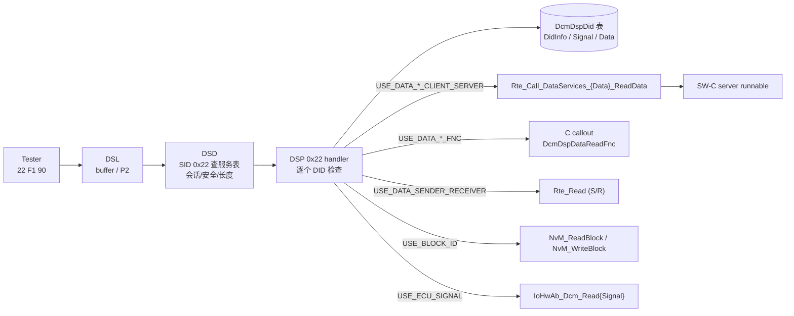
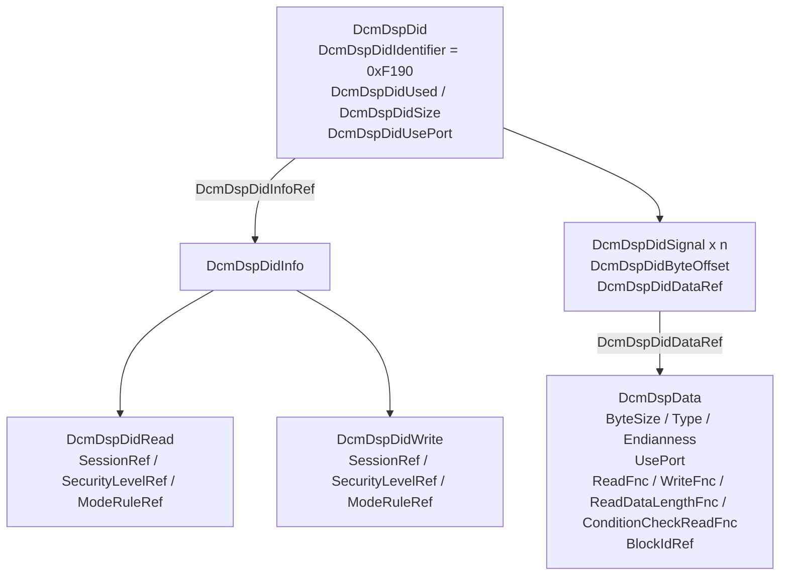
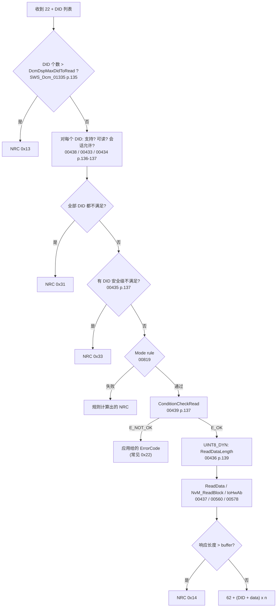
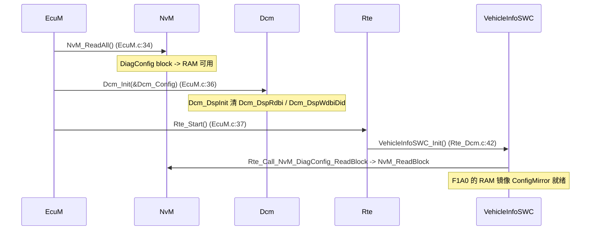
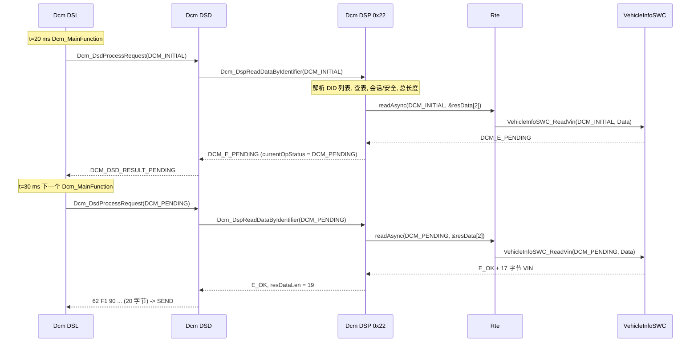
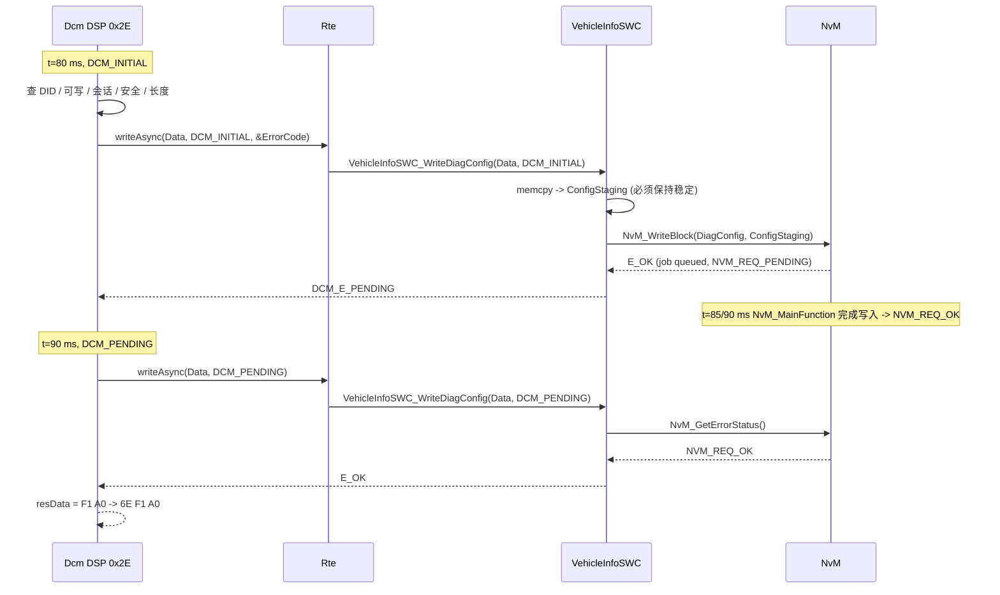

# 08 — DID 深入：0x22 ReadDataByIdentifier / 0x2E WriteDataByIdentifier

> Prerequisite: [03 — DSD](03-dsd.md)、[04 — DSP](04-dsp.md)、[05 — DCM 配置](05-dcm-configuration.md)、[07 — Security Access](07-security-access.md)
> Next: [09 — DTC 与 DCM↔DEM 接口](09-dtc-dem.md)
> 对应规范: AUTOSAR CP **R20-11** SWS DCM（Doc ID 18）：0x22 需求 p.135–141；0x2E 需求 p.174–177；DataServices C 原型 p.269–276；`DataServices_<Data>` C/S 接口 p.341 起；ECUC `DcmDspDid` / `DcmDspDidInfo` / `DcmDspData` p.509–540；数据类型约束 p.51–52。研究笔记 [02 §3.8.5 / §3.8.7 / §3.9 / §3.12](../reference/research/02-autosar-sws-notes.md)
> 对应源码: 本项目 `examples/uds_diag_demo/diag/Dcm_Dsp.c`、`diag/Dcm_Cfg.h`、`diag/Dcm_Cfg.c`、`rte/Rte_Dcm.c`、`swc/VehicleInfoSWC.c`、`mem/NvM.c`；openAUTOSAR（Arctic Core，R3.1.5 风格）`diagnostic/Dcm/src/Dcm_Dsp.c:1205-1450`（读）、`:1520-1610`（写）

---

## 1. 本章目标

读完本章，你应该能够：

1. 画出 `DcmDspDid → DcmDspDidInfo → DcmDspDidRead/DcmDspDidWrite → DcmDspDidSignal → DcmDspData` 这棵配置树，并说出每一层决定了什么（DID 号、访问权限、数据怎么拿）。
2. 根据 `DcmDspDataUsePort` 的取值，**推导出** DCM 会调用的接口形态：`Rte_Call_DataServices_<Data>_ReadData(...)` 的参数里有没有 `OpStatus`、有没有 `ErrorCode`，还是直接调 `NvM_ReadBlock`、`IoHwAb_Dcm_Read<Signal>`。
3. 按 R20-11 的需求顺序复述 0x22 / 0x2E 的检查链，以及每一步失败时回哪个 NRC（0x13 / 0x31 / 0x33 / 0x22 / 0x14 / 0x72）。
4. 解释“多 DID 请求中只要有一个可读就不回 0x31”这条反直觉规则。
5. 在本项目 demo 中逐行跟踪 `22 F1 90`（异步 DID）、`22 F1 87`（同步 DID）、`2E F1 A0`（经 NvM 的异步写）三个例子。

---

## 2. 为什么需要 DID 这一层抽象？

Tester 只知道一个 2 字节的标识符（Data Identifier），例如 `0xF190` = VIN（ISO 14229-1 规定的标准 DID）。ECU 内部，这份数据可能在：

- 某个应用 SW-C 的 RAM 变量里（VIN 由生产线写入后镜像在 RAM）；
- NvM 管理的 data flash block 里；
- 一个 I/O 信号上（例如某个电压的原始 ADC 值，通过 IoHwAb 读）；
- 另一个 ECU 那里（需要先发网络请求，几十毫秒后才有）。

DCM 的设计目标是 **“DCM 不知道数据的业务含义，只知道去哪里拿、拿多少字节、什么条件下允许拿”**。这三件事全部来自配置：

| 问题 | 由谁回答 | 配置容器（R20-11） |
|---|---|---|
| `0xF190` 这个 DID 存不存在？ | DID 表 | `DcmDspDid` / `DcmDspDidIdentifier`（`ECUC_Dcm_00602`，p.509） |
| 当前会话 / 安全级允许读吗？允许写吗？ | 访问信息 | `DcmDspDidInfo` → `DcmDspDidRead` / `DcmDspDidWrite`（p.512–527） |
| 数据由几个 signal 组成、各占几字节、在 response 中的偏移？ | signal 列表 | `DcmDspDidSignal`（`ByteOffset` `ECUC_Dcm_01105` p.518、`DataRef` `00808` p.519） |
| 每个 signal 从哪里拿？同步还是异步？ | 数据元素 | `DcmDspData`（`UsePort` `ECUC_Dcm_00713` p.537、`Type` `00985` p.537、`ByteSize` `01106` p.530 …） |

这就是为什么升级 DCM 时 “DID 能不能读” 往往是**配置问题**而不是代码问题：DSP 的 0x22 处理代码在所有 ECU 上一模一样，差异全在生成的 DID 表里。

---

## 3. 在系统中的位置



逐个 transition：

| 箭头 | 发生了什么 | API / 依据 |
|---|---|---|
| Tester → DSL | 请求经 CanTp/PduR 进入 DCM 的 Rx buffer | `Dcm_StartOfReception/CopyRxData/TpRxIndication`（`SWS_Dcm_00094/00556/00093`，p.243–245），详见 [11 — runtime flow](11-dcm-runtime-flow.md) |
| DSL → DSD | 下一个 `Dcm_MainFunction` 中处理请求 | DSD 校验链 `SWS_Dcm_01535`（p.94），见 [03 — DSD](03-dsd.md) |
| DSD → DSP | SID 0x22 的服务表行指向内部 0x22 handler | `DcmDsdSidTabServiceId` / `DcmDsdSidTabFnc` |
| DSP → DID 表 | 线性或哈希查找 `DcmDspDidIdentifier` | 生成代码，实现自由 |
| DSP → RTE / callout / NvM / IoHwAb | 根据 **每个 `DcmDspData` 的 `DcmDspDataUsePort`** 选路径 | `SWS_Dcm_00437`（p.138–139）、`00560`（p.139）、`00578`（p.138） |
| RTE → SW-C | RTE 把 client call 映射到 server runnable | RTE 生成，见 [07-rte-swc/06 — Client/Server](../07-rte-swc/06-client-server.md) |

注意：**`DcmDspDataUsePort` 是“每个 data element”一个**，不是每个 DID 一个。一个 DID 可以由 3 个 signal 拼成，其中一个来自 SW-C、一个来自 NvM、一个来自 IoHwAb。另有 DID 级的 `DcmDspDidUsePort`（`ECUC_Dcm_01122`，p.510）用于 “整个 DID 作为一个原子 S/R 或 NvData 接口”（`USE_ATOMIC_*`），默认值 `USE_DATA_ELEMENT_SPECIFIC_INTERFACES` 表示“按 data element 各自的 UsePort 走”。

---

## 4. AUTOSAR 如何定义？

### 4.1 配置树

`[AUTOSAR Standard]`（ECUC 名称来自 R20-11 p.509–540）



| 层 | 参数（ECUC ID, 页） | 决定什么 |
|---|---|---|
| `DcmDspDid` | `DcmDspDidIdentifier`（00602, p.509）、`DcmDspDidSize`（01099, p.510）、`DcmDspDidUsePort`（01122, p.510）、`DcmDspDidInfoRef`（00604, p.512） | DID 号；若配置 `DidSize` 则强制响应长度（`SWS_Dcm_01431`，p.138），未被 signal 覆盖的字节填 0x00（`01385`，p.138） |
| `DcmDspDidRead` | `SessionRef`（00615）、`SecurityLevelRef`（00614，p.517）、`ModeRuleRef` | 不存在该容器 = 不可读 |
| `DcmDspDidWrite` | `SessionRef`（00618）、`SecurityLevelRef`（00617，p.527） | 不存在该容器 = 不可写 |
| `DcmDspDidSignal` | `ByteOffset`（01105, p.518）、`DataRef`（00808, p.519） | 一个 DID 由哪些数据元素按什么偏移拼成 |
| `DcmDspData` | `ByteSize`（01106, p.530）、`ConditionCheckReadFnc`（00677, p.531）、`Endianness`（00986, p.532）、`ReadDataLengthFnc`（00671, p.534）、`ReadFnc`（00669, p.535）、`Type`（00985, p.537）、`UsePort`（00713, p.537）、`WriteFnc`（00670, p.539）、`BlockIdRef`（00809, p.540） | 数据怎么取、几字节、字节序 |

另外：`DcmDspMaxDidToRead`（`ECUC_Dcm_00638`，p.483）限制一次 0x22 请求最多几个 DID。

### 4.2 数据长度：固定 vs 可变

`[AUTOSAR Standard]`

- `DcmDspDataType`（`ECUC_Dcm_00985`）取 `UINT8_N`、`SINT8_N`、`UINT16_N`…… 时为**固定长度**，长度 = `DcmDspDataByteSize`（`SWS_Dcm_CONSTR_6002`，p.51：数组类型必须给 ByteSize）。
- 取 `UINT8_DYN` 时为**可变长度**：
  - 读：DSP 先调用 `ReadDataLength`（C/S 操作或 `DcmDspDataReadDataLengthFnc`）得到实际长度，再调用 `ReadData`（`SWS_Dcm_00436`，p.139）。
  - 写：长度从请求报文中算出，并作为 `DataLength` 参数传给 `WriteData`（`SWS_Dcm_00395`，p.175）。
- 约束：
  - 只有 DID 的**最后一个** signal 可以是可变长（`SWS_Dcm_CONSTR_6039`，p.176）——否则 DCM 无法从请求中切分前面的 signal。
  - `USE_DATA_SENDER_RECEIVER(_AS_SERVICE)`、`USE_BLOCK_ID`、`USE_ECU_SIGNAL` **不允许**可变长（`CONSTR_6026`，p.52）；`USE_BLOCK_ID` 必须是 `UINT8_N`（`CONSTR_6038`，p.52）。
- 0x2E 定长 DID：DCM 校验请求数据长度 = 各 signal `ByteSize` 之和（`SWS_Dcm_00473`，p.175）。**需求文本没有写出 NRC 值**，ISO 14229-1 惯例是 0x13；真实栈用哪个 → 需在真实项目确认（研究笔记 02 §3.8.7）。

### 4.3 `DcmDspDataUsePort` → 接口形态（本章最重要的一张表）

`[AUTOSAR API]`（C 原型来自 R20-11 §8.7.3 “Dcm_Externals” 视角，p.269–276；C/S 接口 `DataServices_<Data>` 见 `SWS_Dcm_00686` p.341 起）

| `DcmDspDataUsePort` | DCM 调用什么 | ReadData 原型 | 能否返回 `DCM_E_PENDING` | ErrorCode 来源 |
|---|---|---|---|---|
| `USE_DATA_SYNCH_CLIENT_SERVER` | `Rte_Call_<port>_ReadData` | `Std_ReturnType ReadData(uint8* Data)` — `SWS_Dcm_00793` p.269 | 否（同步，无 OpStatus） | ConditionCheckRead 提供；ReadData 失败 → DCM 自定 |
| `USE_DATA_ASYNCH_CLIENT_SERVER` | 同上 | `ReadData(Dcm_OpStatusType OpStatus, uint8* Data)` — `91006` p.269 | **是** | 同上 |
| `USE_DATA_ASYNCH_CLIENT_SERVER_ERROR` | 同上 | `ReadData(OpStatus, uint8* Data, Dcm_NegativeResponseCodeType* ErrorCode)` — `91005` p.269 | 是 | **应用直接给 NRC** |
| `USE_DATA_SYNCH_FNC` / `USE_DATA_ASYNCH_FNC` / `USE_DATA_ASYNCH_FNC_ERROR` | 配置的 C 函数 `DcmDspDataReadFnc`（`ECUC_Dcm_00669`，p.535） | 与上面三行一一对应的同名形态 | 同上 | 同上 |
| `USE_DATA_SENDER_RECEIVER` / `_AS_SERVICE` | RTE S/R 读（`DataServices_<Data>` 的 data element，§8.8.2.2 p.336） | — | 否 | — |
| `USE_BLOCK_ID` | `NvM_ReadBlock`（`SWS_Dcm_00560` p.139）；写为 `NvM_SetBlockLockStatus → NvM_WriteBlock → NvM_GetErrorStatus`（`00541` p.175–176） | — | DCM 内部轮询 | 写失败 → 0x72 |
| `USE_ECU_SIGNAL` | `IoHwAb_Dcm_Read<EcuSignalName>()`（`SWS_Dcm_00578` p.138） | — | — | 0x2E 不允许（`CONSTR_6018`，p.176） |

WriteData 的 4 种形态（p.270–272）：

```c
/* [AUTOSAR API] DCM SWS R20-11, Dcm 视角的 C 原型（Xxx = 端口/函数前缀） */
Std_ReturnType Xxx_WriteData(const uint8* Data,
                             Dcm_NegativeResponseCodeType* ErrorCode);          /* SWS_Dcm_00794 p.270 sync, 定长  */
Std_ReturnType Xxx_WriteData(const uint8* Data, uint16 DataLength,
                             Dcm_NegativeResponseCodeType* ErrorCode);          /* SWS_Dcm_91007 p.271 sync, 变长  */
Std_ReturnType Xxx_WriteData(const uint8* Data, Dcm_OpStatusType OpStatus,
                             Dcm_NegativeResponseCodeType* ErrorCode);          /* SWS_Dcm_91008 p.271 async, 定长 */
Std_ReturnType Xxx_WriteData(const uint8* Data, uint16 DataLength, Dcm_OpStatusType OpStatus,
                             Dcm_NegativeResponseCodeType* ErrorCode);          /* SWS_Dcm_91009 p.272 async, 变长 */

Std_ReturnType Xxx_ReadDataLength(uint16* DataLength);                          /* SWS_Dcm_00796 p.273 */
Std_ReturnType Xxx_ReadDataLength(Dcm_OpStatusType OpStatus, uint16* DataLength); /* SWS_Dcm_91010 */
Std_ReturnType Xxx_ConditionCheckRead(Dcm_NegativeResponseCodeType* ErrorCode);   /* SWS_Dcm_00797 p.274 */
Std_ReturnType Xxx_ConditionCheckRead(Dcm_OpStatusType OpStatus,
                                      Dcm_NegativeResponseCodeType* ErrorCode);   /* SWS_Dcm_91011 p.274 */
```

规律（记住它就不必背表）：

1. **SYNCH** → 无 `OpStatus`，应用必须在本次调用内完成；**ASYNCH** → 有 `OpStatus`，可以返回 `DCM_E_PENDING`，DCM 会在后续每个 `Dcm_MainFunction` 用 `DCM_PENDING` 再调（`SWS_Dcm_00530`，p.52）。
2. **`_ERROR` 后缀** → 多一个 `ErrorCode` 输出参数，应用可以自己决定 NRC。
3. 写操作**永远**带 `ErrorCode`；可变长写多一个 `DataLength`。
4. 异步接口的 OUT 参数只在返回 `E_OK` 那次有效，`ErrorCode` 只在返回 `E_NOT_OK` 时有效（`SWS_Dcm_01187/01188/01189`，p.223–224）。
5. 同步/异步是**接口签名**的区别；RTE 用 Synchronous 还是 Asynchronous server call point 实现它，是另一层的选择（p.223，研究笔记 02 §3.5）。

`[Real Project Consideration]` RTE 端口名 `DataServices_<Data>` 中的 `<Data>` 是 `DcmDspData` 的 short name，生成出来的 `Rte_Call_*` 符号名取决于配置工具和 SWC 的 port 命名。本项目 demo 用 `DataServices_DID_F190` 作为端口名只是一种命名习惯；真实项目必须打开生成的 `Rte_Dcm.h` / `Dcm_Externals.h`（或供应商等价物）确认。

### 4.4 0x22 的检查链（R20-11 需求顺序）

`[AUTOSAR Standard]`（p.135–139，研究笔记 02 §3.8.5）



逐个 transition 的含义：

| Transition | 要求 | 为什么这样设计 |
|---|---|---|
| 个数检查 → 0x13 | `SWS_Dcm_01335` | 防止一次请求把响应 buffer 撑爆或占用 DSP 过久 |
| 支持/可读/会话 → 0x31 | `00438`：**只有全部 DID 都不支持**才 0x31；不支持的 DID 在多 DID 请求中被**跳过**。`00433`（不可读）、`00434`（会话不允许）同样按“全部”判断 | ISO 14229-1 的语义：DID 不可用对 tester 来说就是 “request out of range”。注意会话不允许回的是 **0x31 而不是 0x7F**——0x7F 是“服务”级的 |
| 安全 → 0x33 | `00435` | 安全拒绝必须明确告诉 tester，让它先做 0x27 |
| ConditionCheckRead | `00439`：应用返回的 ErrorCode 原样发送（不限于 0x22） | 例如“车速 > 0 时不允许读” |
| ReadDataLength | `00436`：仅对 `UINT8_DYN` | 先知道长度才能检查 buffer、安排偏移 |
| ReadData | `00437`，并按 `DcmDspDataEndianness` 序列化（`00638`，p.139） | — |
| 0x14 | ISO 14229-1 的 responseTooLong；R20-11 对分页缓冲有单独规则 | — |

`[Real Project Consideration]` R20-11 的需求编号顺序与 ISO 14229-1 图示在个别位置（尤其 0x13 长度检查）不完全一致。真实栈按哪个顺序实现，是 **DCM 升级回归测试的高风险点**——务必用 “同时触发两个 NRC 条件” 的用例去测（例：DID 不存在 + 长度错误）。

### 4.5 0x2E 的检查链（R20-11 需求顺序）

`[AUTOSAR Standard]`（p.174–177，研究笔记 02 §3.8.7）

| 顺序 | 检查 | NRC | SWS |
|---|---|---|---|
| 1 | 认证（0x29 已配置时） | 0x34 | `01496` |
| 2 | DID 支持（`DcmDspDidUsed=FALSE` 视为不支持） | 0x31 | `00467`、`00562`（p.174） |
| 3 | DID 可写（`DcmDspDidWrite` 存在） | 0x31 | `00468` |
| 4 | 会话（`DcmDspDidWriteSessionRef`） | **0x31** | `00469`（p.175） |
| 5 | 安全（`DcmDspDidWriteSecurityLevelRef`） | 0x33 | `00470`（p.175） |
| 6 | Mode rule | 规则 NRC | `00822` |
| 7 | 定长 DID 的数据长度 | （文本未写；ISO 惯例 0x13） | `00473`（p.175） |
| 8 | 调用 WriteData / 写 S/R / 写 NvM | 应用 ErrorCode / 0x72 | `00395`、`01433`、`00541`（p.175–176） |

`[AUTOSAR Standard]` `USE_BLOCK_ID` 写入流程（`SWS_Dcm_00541`）：`NvM_SetBlockLockStatus(id, FALSE)` → `NvM_WriteBlock(id, buf)` → 轮询 `NvM_GetErrorStatus()` → 成功则 `NvM_SetBlockLockStatus(id, TRUE)` 并发正响应；**任何 NvM 失败 → 0x72**（GeneralProgrammingFailure）。若该服务被取消（例如被高优先级协议抢占），需要 `NvM_CancelJobs()`（`SWS_Dcm_01048`，p.50）。

> 本仓库没有 NvM SWS：上面的 NvM API 名字来自 DCM SWS 作为“调用方”的描述，完整签名与返回值需以真实项目所用 NvM SWS release 确认。

---

## 5. 核心数据结构

### 5.1 标准栈里的典型形态（概念）

`[Conceptual]` 生成器通常产出三类东西：

1. **常量表**：DID 表（按 DID 排序以便二分查找）、DidInfo 表、Signal 表、Data 表（含函数指针或 RTE 调用 wrapper）。
2. **runtime 状态**：当前正在处理第几个 DID、当前 signal、当前 `OpStatus`、已写入 response 的字节数——必须在 `DCM_E_PENDING` 跨周期时保持。
3. **RTE wrapper**：`Rte_Call_DataServices_<Data>_ReadData` 等，由 RTE 生成器产出。

### 5.2 本项目 demo 的压扁形态

`[Educational Implementation]` demo 把 DID → DidInfo → DidRead/DidWrite → Data 四层压成一行 `Dcm_DspDidType`（`examples/uds_diag_demo/diag/Dcm_Cfg.h:86-98`），文件头注释明确说明了这个简化（`Dcm_Cfg.h:9-11`）：

| `Dcm_DspDidType` 字段 | 对应真实 ECUC | 真实栈中的差异 |
|---|---|---|
| `identifier` | `DcmDspDidIdentifier` | — |
| `size` | `DcmDspDataByteSize`（单 signal） | 真实为多个 signal 的 ByteSize + ByteOffset |
| `usePort` | `DcmDspDataUsePort` | demo 只实现两种：`DCM_USE_DATA_SYNCH_CLIENT_SERVER` / `DCM_USE_DATA_ASYNCH_CLIENT_SERVER`（`Dcm_Cfg.h:77-80`） |
| `readSync` / `readAsync` / `writeAsync` | `Rte_Call_DataServices_<Data>_ReadData/WriteData` 的地址 | 真实栈常用生成的 switch-case 或 wrapper，而不是裸函数指针 |
| `readSessionMask` / `readSecurityMask` | `DcmDspDidReadSessionRef` / `SecurityLevelRef` | 真实是引用列表，demo 用位掩码（`Dcm_Cfg.h:44-50`） |
| `writeSessionMask` / `writeSecurityMask` | `DcmDspDidWrite*Ref` | `writeAsync == NULL_PTR` 表示没有 `DcmDspDidWrite` |

三个 DID 的配置行（`examples/uds_diag_demo/diag/Dcm_Cfg.c:33-49`）：

| DID | 含义 | 长度 | UsePort | 读权限 | 写权限 |
|---|---|---|---|---|---|
| `0xF190` | VIN | 17 | `ASYNCH_CLIENT_SERVER` → `Rte_Call_DataServices_DID_F190_ReadData` | 所有会话，无需安全 | 不可写 |
| `0xF187` | SW 版本 | 8 | `SYNCH_CLIENT_SERVER` → `Rte_Call_DataServices_DID_F187_ReadData` | 所有会话 | 不可写 |
| `0xF1A0` | 诊断配置（NvM 中） | 10 | 读 `SYNCH`，写为 async 形态 `Rte_Call_DataServices_DID_F1A0_WriteData(Data, OpStatus, ErrorCode)`（demo 简化：R20-11 中一个 `DcmDspData` 只有一个 `DcmDspDataUsePort`，见 [07-rte-swc/02](../07-rte-swc/02-port-interface.md) §5） | 所有会话 | **扩展会话 + Level 1** |

runtime 状态（`examples/uds_diag_demo/diag/Dcm_Dsp.c:24-30` 的 `Dcm_DspRdbiStateType`）：

```c
/* [Educational Implementation] Dcm_Dsp.c:24-30 —— 跨 DCM_E_PENDING 必须保留的状态 */
typedef struct {
    uint8            didIdx[DCM_DSP_MAX_DID_TO_READ];  /* 通过检查的 DID 在表中的下标   */
    uint8            numDids;                          /* 通过检查的 DID 个数            */
    uint8            current;                          /* 正在读第几个                   */
    Dcm_OpStatusType currentOpStatus;                  /* 下次调用传 INITIAL 还是 PENDING */
    Dcm_MsgLenType   pos;                              /* response 中已写到的位置         */
} Dcm_DspRdbiStateType;
```

`currentOpStatus` 是理解异步 DID 的关键：**OpStatus 是“针对这个 data element 的第几次调用”**，不是“针对整个请求”。多 DID 请求中，第一个 DID 返回 PENDING、第二次调用拿到数据后，第二个 DID 的第一次调用仍然是 `DCM_INITIAL`（`Dcm_Dsp.c:362`）。

---

## 6. 初始化流程

DID 表本身是 `const`，不需要初始化；需要初始化的是**数据的来源**：



| Transition | 说明 |
|---|---|
| `NvM_ReadAll` 在 `Dcm_Init`/`Rte_Start` 之前 | “NV 数据先于其使用者”（`examples/uds_diag_demo/integration/EcuM.c:34`）。真实 ECU 中 `NvM_ReadAll` 是异步的，EcuM/BswM 要等它完成（openAUTOSAR `system/EcuM/src/EcuM.c:236-241` 轮询等待） |
| `Dcm_Init` → `Dcm_DspInit` | `examples/uds_diag_demo/diag/Dcm.c:16-28` → `Dcm_Dsp.c:76-84`，清空 0x22/0x2E 的跨周期状态 |
| `Rte_Start` → SWC init runnable | `examples/uds_diag_demo/rte/Rte_Dcm.c:38-44`；SWC 通过自己的 `Rte_Call_NvM_*` 读 block（`swc/VehicleInfoSWC.c:54-60`，宏定义在 `rte/Rte_VehicleInfoSWC.h:42-47`） |

`[Real Project Consideration]` 如果 tester 在 `NvM_ReadAll` 完成之前就发 `22 F1 A0`，SWC 返回的是未初始化的 RAM。真实项目常见做法：在 `ConditionCheckRead` 里检查“NV 数据已就绪”，未就绪返回 `E_NOT_OK` + 0x22；或在通信启动（ComM FULL_COM）前保证 ReadAll 完成。

---

## 7. Runtime Flow

### 7.1 0x22 单 DID、异步：`22 F1 90`



逐个 transition（行号均为 `examples/uds_diag_demo/` 下的真实位置）：

| # | 调用 | 位置 | 说明 |
|---|---|---|---|
| 1 | `Dcm_DslMainFunction` → `Dcm_DsdProcessRequest(DCM_INITIAL, …)` | `diag/Dcm_Dsl.c:254-257` | DSL 状态 `REQ_RECEIVED → PROCESSING` |
| 2 | DSD 查表命中 SID 0x22 → `fnc(OpStatus, pMsgContext, &nrc)` | `diag/Dcm_Dsd.c:83`、`:163`；服务表行 `diag/Dcm_Cfg.c:120` | 0x22 行 `subFuncAvail=FALSE`、`minReqLen=3` |
| 3 | 长度必须是偶数且 ≥ 2 → 否则 0x13 | `diag/Dcm_Dsp.c:286-289` | `reqDataLen` 不含 SID |
| 4 | DID 个数 > `DCM_DSP_MAX_DID_TO_READ`(4) → 0x13 | `diag/Dcm_Dsp.c:291-294`；常量 `diag/Dcm_Cfg.h:36` | `SWS_Dcm_01335` |
| 5 | 每个 DID：`Dcm_DspFindDid`，不存在或会话不允许 → **跳过** | `diag/Dcm_Dsp.c:296-308` | `00438/00433/00434` |
| 6 | 安全不满足 → 记 `securityFailed` | `diag/Dcm_Dsp.c:309-312`，`:316-319` 回 0x33 | `00435` |
| 7 | 全部被跳过 → 0x31 | `diag/Dcm_Dsp.c:320-323` | — |
| 8 | 预计总长度 > `resMaxDataLen` → 0x14 | `diag/Dcm_Dsp.c:324-327` | `resMaxDataLen = 128 - 1`（`diag/Dcm_Dsl.c:424`） |
| 9 | 写 DID 高/低字节，调用 `readAsync(currentOpStatus, &out[2])` | `diag/Dcm_Dsp.c:340-349` | 函数指针指向 `rte/Rte_Dcm.c:54` |
| 10 | RTE → server runnable | `rte/Rte_Dcm.c:59` → `swc/VehicleInfoSWC.c:77-96` | SWC 第一次返回 `DCM_E_PENDING`（`:87-92`） |
| 11 | DSP 记 `currentOpStatus = DCM_PENDING`，返回 `DCM_E_PENDING` | `diag/Dcm_Dsp.c:351-354` | `SWS_Dcm_00530` |
| 12 | DSD 不组响应，返回 `DCM_DSD_RESULT_PENDING` | `diag/Dcm_Dsd.c:164-168` | DSL 保持 `PROCESSING` |
| 13 | 下一周期 DSL 以 `DCM_PENDING` 再调 | `diag/Dcm_Dsl.c:258-261` | 跳过 DSD 检查（`Dcm_Dsd.c:151` 只在 INITIAL 检查） |
| 14 | SWC 返回 `E_OK`，DSP 推进 `pos/current` | `diag/Dcm_Dsp.c:360-362`、`:364` | — |
| 15 | DSD 写 `0x22 + 0x40 = 0x62`，长度 = 1 + 19 | `diag/Dcm_Dsd.c:181-182` | — |

对应 trace（`artifacts/uds-demo/trace.txt` 第 36–45 行）：

```text
[    20 ms] [Dcm/DSP ] 0x22: DID 0xF190 (VIN) USE_DATA_ASYNCH_CLIENT_SERVER -> ReadData(DCM_INITIAL, Data)
[    20 ms] [Rte     ] Rte_Call_DataServices_DID_F190_ReadData(DCM_INITIAL) -> server runnable VehicleInfoSWC_ReadVin
[    20 ms] [SWC     ] VehicleInfoSWC_ReadVin: VIN not ready yet -> DCM_E_PENDING (0 more)
[    20 ms] [Dcm/DSD ] ReadDataByIdentifier returned DCM_E_PENDING -> call again with DCM_PENDING next cycle
[    30 ms] [Dcm/DSP ] 0x22: DID 0xF190 (VIN) USE_DATA_ASYNCH_CLIENT_SERVER -> ReadData(DCM_PENDING, Data)
[    30 ms] [SWC     ] VehicleInfoSWC_ReadVin: VIN "LRH850DEMO0000001" copied -> E_OK
[    30 ms] [Dcm/DSD ] positive response assembled: SID 0x62 + 19 data bytes
```

### 7.2 0x22 同步 DID 与多 DID：`22 F1 87`、`22 F1 A0 F1 87`

同步 DID 走 `diag/Dcm_Dsp.c:342-345`：`readSync(&out[2])` 没有 `OpStatus`，SWC 必须当场返回（`swc/VehicleInfoSWC.c:98-103`）。DSP 循环 `while (st->current < st->numDids)`（`Dcm_Dsp.c:335`）依次读每个 DID，结果按**请求顺序**拼接：

```text
请求:  22  F1 A0  F1 87
响应:  62  F1 A0 <10 字节 DiagConfig>  F1 87 <8 字节 "SW010203">
```

测试 `examples/uds_diag_demo/tests/test_uds_demo.c:107-120` 还覆盖了两条关键规则：

- `22 F1 87 12 34 F1 87` → `0x1234` 不存在被**跳过**，响应包含两次 F187（`:111-113`）——体现 `SWS_Dcm_00438`“只有全部不支持才 0x31”。
- `22 12 34` → `7F 22 31`（`:114-115`）。

> 观察：`22 F1 87` 的响应 `62 F1 87 53 57 30 31 30 32 30 33` 是 11 字节，超过 SF 的 7 字节，所以 trace 中它也是 **FF + CF**（trace 第 104–118 行），ECU 要等 tester 的 FC。请求是单帧并不意味着响应也是单帧。

### 7.3 0x2E 异步写 + NvM：`2E F1 A0 <10 字节>`



| # | 调用 | 位置 | 说明 |
|---|---|---|---|
| 1 | 长度 < 3 → 0x13 | `diag/Dcm_Dsp.c:496-499` | DID(2) + 至少 1 字节数据 |
| 2 | DID 不存在 / 不可写 / 会话不允许 → 0x31 | `diag/Dcm_Dsp.c:501-505` | `00467/00468/00469`：会话不允许也是 0x31 |
| 3 | 安全不满足 → 0x33 | `diag/Dcm_Dsp.c:506-511` | `00470` |
| 4 | 数据长度 ≠ `size` → 0x13 | `diag/Dcm_Dsp.c:512-515` | `00473`（NRC 值按 ISO 惯例） |
| 5 | 记住 DID 下标，调用 `writeAsync` | `diag/Dcm_Dsp.c:516`、`:521` → `rte/Rte_Dcm.c:76-85` | 每次（INITIAL/PENDING/CANCEL）都传同一个 `Data` 指针 |
| 6 | SWC 复制到 staging，`NvM_WriteBlock` | `swc/VehicleInfoSWC.c:122-130` → `mem/NvM.c:46-57` | NvM 只排队，不立即写 |
| 7 | `NvM_MainFunction`（5 ms task）两次后完成 | `mem/NvM.c:68-81`；调度 `integration/BswScheduler.c:44-46` | — |
| 8 | 下一个 Dcm 周期 SWC 轮询 `NvM_GetErrorStatus` | `swc/VehicleInfoSWC.c:131-141` | `NVM_REQ_PENDING` → 继续 `DCM_E_PENDING`；失败 → `0x72` |
| 9 | DSP 组 `F1 A0`，DSD 加 `0x6E` | `diag/Dcm_Dsp.c:531-534`、`diag/Dcm_Dsd.c:181` | — |

trace 第 258–269 行对应这一段。注意 13 字节的请求本身是多帧：ECU 侧 CanTp 收 FF 后回 `FC CTS BS=2 STmin=5`（trace 第 242–245 行），这是 ECU 作为**接收方**的流控，与 DID 无关但经常一起出问题。

`[Educational Implementation]` demo 让 **SWC** 去调 NvM（`USE_DATA_ASYNCH_CLIENT_SERVER` 风格），而不是让 DCM 直接 `USE_BLOCK_ID`。两种都是标准做法：

| 方案 | 谁调 NvM | 优点 | 缺点 |
|---|---|---|---|
| `USE_BLOCK_ID` | DCM（`SWS_Dcm_00541`） | 无需写 SWC 代码；DCM 统一处理 lock/unlock 与 0x72 | 不能做业务校验（取值范围、联动其他数据）；不支持变长 |
| C/S 到 SWC，SWC 调 NvM | SWC | 可以校验、转换、同步 RAM 镜像 | SWC 必须正确实现异步状态机与 staging buffer |

---

## 8. RH850 Hardware Mapping

DID 处理本身是纯软件，没有直接的寄存器操作。与 RH850 相关的只有数据的**存储位置与访问时间**：

`[RH850 Hardware]` / `[Real Project Consideration]`

| 数据来源 | 在 RH850 上通常对应 | 对 DID 处理的影响 |
|---|---|---|
| SW-C RAM 变量 | Local RAM / Global RAM | 同步读即可 |
| NvM block | NvM → MemIf → Fee → Fls → **data flash**（RH850 带独立 data flash；Renesas 通常提供 FDL/FCL 库或 MCAL Fls/Fee 驱动） | 写入/擦除耗时以毫秒计，**必须异步**；擦写期间可能影响同 bank 的读取——具体 data flash 容量、擦写时间、并发限制需根据实际芯片手册（P1M-E 硬件手册 flash 章节）和 MCAL 用户手册确认 |
| ECU 信号 | IoHwAb → Adc/Dio/Port MCAL → ADC/GPIO 寄存器 | `USE_ECU_SIGNAL` 由 DCM 直接调 `IoHwAb_Dcm_Read<Signal>`；采样是否同步取决于 IoHwAb 实现 |

关键点：**一个 DID 是同步还是异步，应由数据源的物理访问时间决定**。若把一个最终要等 data flash 的数据配置成 `USE_DATA_SYNCH_*`，SWC 就只能在 runnable 里忙等——这会阻塞 `Dcm_MainFunction` 所在的 OS task，进而拖累同 task 的其它 BSW MainFunction。

---

## 9. openAUTOSAR 实现（R3.1.5 风格，只读参考）

`[Educational Implementation]` 以下均为 `D:\side_project\openAUTOSAR` 中的真实位置（研究笔记 03 §4.4）。

| 功能 | 位置 | 与 R20-11 的差异 |
|---|---|---|
| 0x22 入口 | `diagnostic/Dcm/src/Dcm_Dsp.c:1386` `DspUdsReadDataByIdentifier(pduRxData, pduTxData)` | 直接操作 `PduInfoType`，没有 `Dcm_MsgContextType` |
| 读一个 DID | `Dcm_Dsp.c:1223` `readDidData()` | 必须同时配置 `DspDidRead`、`ConditionCheckReadFnc`、`ReadDataFnc`，否则 0x31 |
| ConditionCheck | `Dcm_Dsp.c:1233` `didPtr->DspDidConditionCheckReadFnc(&errorCode)` | — |
| 固定/可变长度 | `Dcm_Dsp.c:1237-1244`（`DspDidFixedLength` / `DspDidReadDataLengthFnc`） | 长度属性在 **DidInfo** 上（`include/Dcm_Lcfg.h:166`），R4 在 `DcmDspData` 上 |
| 读数据 | `Dcm_Dsp.c:1254` `didPtr->DspDidReadDataFnc(&pduTxData->SduDataPtr[*txPos])` | **只有** `ReadData(uint8* data)`，没有 `OpStatus`；`DspDidUsePort` 字段从未被读取，**没有任何 `Rte_Call_*`**（`include/Rte_Dcm.h` 为空） |
| pending | `Dcm_Dsp.c:377-384`：存下请求指针，下个 `DspMain` **从头重新执行整个 handler** | R4 是同一个操作以 `DCM_PENDING` 重入，状态保留在 DSP |
| 全部不支持 → 0x31 | `Dcm_Dsp.c:1424-1438`（注释说明按 ISO / ASR 4.0.3 处理） | 与 R20-11 一致 |
| 0x2E | `Dcm_Dsp.c:1578` → `writeDidData` `:1520`；长度检查 `:1542`；调用 `DspDidWriteDataFnc` `:1543` | 写函数签名 `(data, length, &nrc)`，无 OpStatus；pending 机制同上（`:1603-1608`） |

R3 → R4 迁移要点：`ReadDataFnc(uint8*)` → `Xxx_ReadData([OpStatus,] uint8* [, ErrorCode])`；函数指针 callout → RTE `DataServices_<Data>` 端口；“重跑整个 handler”的 pending → `OpStatus` 状态机。详见 [DCM 升级指南](../dcm-upgrade-guide.md)。

---

## 10. 当前教学项目实现

| 文件 | 角色 |
|---|---|
| `examples/uds_diag_demo/diag/Dcm_Cfg.h:76-98` | DID 行类型与 UsePort 枚举（只有 SYNCH/ASYNCH C/S 两种） |
| `examples/uds_diag_demo/diag/Dcm_Cfg.c:33-49` | 三个 DID 的“生成”配置 |
| `examples/uds_diag_demo/diag/Dcm_Dsp.c:264-366` | 0x22 handler（含多 DID、PENDING、CANCEL） |
| `examples/uds_diag_demo/diag/Dcm_Dsp.c:487-535` | 0x2E handler |
| `examples/uds_diag_demo/rte/Rte_Dcm.h:30-34`、`rte/Rte_Dcm.c:54-85` | `Rte_Call_DataServices_DID_*` |
| `examples/uds_diag_demo/swc/VehicleInfoSWC.c:77-142` | server runnable：VIN（异步）、SW 版本（同步）、DiagConfig 读/写 |
| `examples/uds_diag_demo/mem/NvM.c:46-81` | 异步写的 NvM stub |

demo 未实现（读源码时不要找）：`ConditionCheckRead`、`ReadDataLength`/`UINT8_DYN`、`_ERROR` 变体、S/R 与 `USE_BLOCK_ID`、`USE_ECU_SIGNAL`、DID range、动态 DID（0x2C）、`DcmDspDidSize` 强制长度、mode rule、分页缓冲。

---

## 11. Code Walkthrough：多 DID + PENDING 的状态保持

`[Educational Implementation]`（节选自 `examples/uds_diag_demo/diag/Dcm_Dsp.c:335-364`，保留关键行）

```c
while (st->current < st->numDids) {
    const Dcm_DspDidType *d = &Dcm_CfgPtr->dids[st->didIdx[st->current]];
    uint8 *out = &pMsgContext->resData[st->pos];       /* 从上次停下的位置继续写 */
    out[0] = (uint8)(d->identifier >> 8);
    out[1] = (uint8)(d->identifier & 0xFFu);
    if (d->usePort == DCM_USE_DATA_SYNCH_CLIENT_SERVER) {
        r = d->readSync(&out[2]);                       /* SYNCH: 无 OpStatus */
    } else {
        r = d->readAsync(st->currentOpStatus, &out[2]); /* ASYNCH: INITIAL / PENDING */
    }
    if (r == DCM_E_PENDING) {
        st->currentOpStatus = DCM_PENDING;              /* SWS_Dcm_00530 */
        return DCM_E_PENDING;                           /* current/pos 不动 */
    }
    if (r != E_OK) {
        st->numDids = 0u;
        *ErrorCode = DCM_E_CONDITIONSNOTCORRECT;        /* demo 选择 0x22 */
        return E_NOT_OK;
    }
    st->pos += (Dcm_MsgLenType)(2u + d->size);
    st->current++;
    st->currentOpStatus = DCM_INITIAL;                  /* 下一个 DID 从 INITIAL 开始 */
}
```

三个值得注意的设计点：

1. **`out` 指向 response buffer 本身**。SWC 直接写进 DCM 的 Tx buffer（零拷贝）。代价是：在 `DCM_E_PENDING` 期间 SWC **不能**写 `Data`（OUT 参数只在 E_OK 时有效，`SWS_Dcm_01187`），否则可能写进已经组好的前一个 DID 后面的位置——在 demo 中位置是固定的所以无害，但真实栈可能复用 buffer。
2. **`ReadData` 返回 `E_NOT_OK` 时 NRC 怎么定**：同步/异步非 `_ERROR` 形态的 ReadData 没有 ErrorCode，R20-11 规定未指定时用 0x10（`SWS_Dcm_00271`，p.103）；demo 选 0x22 是为了和 `ConditionCheckRead` 的常见语义对齐——这是一个**实现选择**，真实栈可能不同，回归测试时要注意。
3. **CANCEL**：P2\* 次数用尽或被抢占时，DCM 以 `DCM_CANCEL` 调用当前正在进行的异步操作并忽略返回值（`SWS_Dcm_01046` p.81、`01413` p.111）。demo 在 `Dcm_Dsp.c:269-278` 只对当前 DID 发 CANCEL。

---

## 12. Debug 方法

| 现象 | 断点 / 观察点（demo） | 看什么 |
|---|---|---|
| `7F 22 31` | `diag/Dcm_Dsp.c:304`（skip 分支） | `didId` 值是否为预期（字节序！）；`Dcm_CfgPtr->dids[]` 里是否有该 DID；`readSessionMask` 与 `Dcm_DslGetSesCtrlType()` |
| `7F 22 33` | `diag/Dcm_Dsp.c:310` | `Dcm_Dsl.secLevel`；是否刚切过会话（`SWS_Dcm_00139` 切会话会锁定安全级） |
| `7F 22 13` | `diag/Dcm_Dsp.c:287`、`:292` | `pMsgContext->reqDataLen`（不含 SID）；DID 个数 vs `DCM_DSP_MAX_DID_TO_READ` |
| `7F 22 22` | `diag/Dcm_Dsp.c:356` | SWC 返回值；真实栈还要看 `ConditionCheckRead` 的 ErrorCode |
| 一直 `7F 22 78` | `diag/Dcm_Dsp.c:352` | SWC 是否永远返回 `DCM_E_PENDING`（例如等的 NvM job 根本没被排队、`NvM_MainFunction` 没被调度） |
| 响应字节错位 | `diag/Dcm_Dsp.c:340-349`、`:360` | `st->pos`、`d->size` 是否与 SWC 实际写入的字节数一致（ByteSize 配错是经典问题） |
| `7F 2E 72` | `swc/VehicleInfoSWC.c:135-137` | `NvM_GetErrorStatus` 结果；真实栈中 block 是否 write-protected、Fee 是否满 |

更完整的 DCM 级排查见 [13 — DCM Debugging](13-dcm-debugging.md)；跨层排查见 [debugging-autosar-diagnostics.md](../debugging-autosar-diagnostics.md)。

---

## 13. 常见错误

1. **DID 存在但回 0x31**：大概率是会话不匹配。很多人以为会话不允许会回 0x7F——0x7F 只用于“服务在当前会话不支持”；DID 级会话限制回 0x31（`SWS_Dcm_00434/00469`）。
2. **`DcmDspDataByteSize` 与 SWC 实际写入长度不一致**：SWC 写 20 字节而配置 17 字节 → 覆盖后面 DID 的数据或越界。DCM 无法检测，只能靠评审与测试。
3. **把慢数据配成 SYNCH**：SWC 在 runnable 里循环等待 → `Dcm_MainFunction` 超时、同 task 的 CanTp/Com 计时失准。
4. **异步 WriteData 的 staging buffer 用了栈变量**：NvM 在后续周期才拷贝，栈早已失效（demo 用静态 `VehicleInfoSWC_ConfigStaging`，`swc/VehicleInfoSWC.c:40`）。
5. **忽略 `DCM_CANCEL`**：SWC 内部状态（例如“正在读 VIN”标志）不复位，下一次请求的 `DCM_INITIAL` 被误当作继续。
6. **字节序**：多字节 signal 的 `DcmDspDataEndianness`（`00986`/`00638`）只对 S/R 与 ECU signal 生效；C/S 接口下 SWC 自己负责按 big-endian 填 `uint8*`。
7. **升级后 `_ERROR` 变体签名变化**：配置从 `USE_DATA_ASYNCH_CLIENT_SERVER` 改为 `..._ERROR` 后，`Rte_Call_*` 多一个参数，SWC 编译失败或（更糟）旧的手写 stub 仍能链接但参数错位。

---

## 14. 实验（只运行与观察，不修改 demo 源码）

运行 `python tools/run_uds_demo.py`，然后：

1. **找 OpStatus 的转换**：在 `artifacts/uds-demo/trace.txt` 中 `grep "ReadData("`，数出 `22 F1 90` 第一段中 `DCM_INITIAL` 与 `DCM_PENDING` 各出现几次；再在第 611 行开始的“slow SW-C”段落中数一次。解释为什么后者有 1 次 INITIAL + 8 次 PENDING。
2. **多 DID 的响应拼接**：读 trace 第 287–355 行（`22 F1 A0 F1 87`），在纸上标出响应中每个 DID 的起始偏移，与 `Dcm_Dsp.c:360` 的 `st->pos` 推进对应起来。
3. **NvM 异步时间线**：在 trace 第 258–267 行中找到 `WriteBlock queued`、`NvM MainFunction ... NVM_REQ_OK`、`WriteData(Data, DCM_PENDING)` 三行的时间戳，解释为什么“NvM 需要 2 次 MainFunction”却只让 DCM 多等了 1 个 Dcm 周期（提示：`mem/NvM.c:10` 的 `NVM_WRITE_DURATION_CYCLES`，NvM 在 5 ms task、`Dcm_MainFunction` 在 10 ms task，且同一 tick 中 NvM 先于 Dcm 运行，见 `integration/BswScheduler.c:44-51`）。
4. **阅读测试**：读 `tests/test_uds_demo.c:175-197`（`test_wdbi_needs_security`），按顺序写出每个 `EXPECT` 触发的是 `Dcm_Dsd.c` 还是 `Dcm_Dsp.c` 中的哪一行检查。
5. （思考型，不改代码）如果把 `Dcm_Cfg.c:35` 中 F190 的 UsePort 改成 `DCM_USE_DATA_SYNCH_CLIENT_SERVER`，会发生什么？`readSync` 是 `NULL_PTR`——说明“配置与 RTE 接口必须一致”为什么由生成器而不是人来保证。

---

## 15. 思考题

1. 多 DID 请求 `22 F1 90 12 34`：F190 可读、0x1234 不存在。R20-11 要求回正响应还是 0x31？如果 F190 是 0x33 呢？
2. 为什么 `USE_BLOCK_ID` 不允许 `UINT8_DYN`？（提示：NvM block 长度在配置期固定。）
3. 同一个 DID 的 Read 用 SYNCH、Write 用 ASYNCH，在 R20-11 中合法吗？（提示：UsePort 在 `DcmDspData` 上，Read/Write 共用——demo 的 F1A0 为什么能“读同步、写异步”？这是 demo 的哪处简化？）
4. `ConditionCheckRead` 与 `ReadData` 都能拒绝请求，为什么规范要分成两步？
5. 0x2E 定长 DID 长度错误，你的真实栈回 0x13 还是 0x31？你会写哪个测试用例来锁定这个行为？

---

## 16. 对未来真实项目的意义

- **读一个陌生 DCM 时，先找 DID 表**（生成的 `Dcm_Lcfg.c`/`Dcm_Cfg.c` 或供应商等价文件）：DID → Data → UsePort → 函数/RTE 调用，这条链是 “DCM 如何调用 application” 的最短答案。
- **升级 DCM 时最常坏的地方**：`DcmDspDataUsePort` 取值集合在不同 release 中变化（4.1.2 引入 SYNCH/ASYNCH 两套 API、4.4.0 引入 atomic S/R、R19-11 引入 NvData，见研究笔记 02 §6.1）；每次变化都意味着 `Rte_Call_DataServices_*` 签名变化 → SWC 要重新生成/适配。
- **回归测试要覆盖**：单 DID / 多 DID / 部分不支持 / 全部不支持 / 会话不允许 / 安全不允许 / 长度错 / 异步 PENDING 跨 P2（产生 0x78）/ NvM 写失败（0x72）。demo 的 `tests/test_uds_demo.c` 可作为用例清单的起点。
- **RTA-CAR 等商业工具**中 DID 通常由 CDD/ODX 导入生成；变更 DID 时要确认导入后 `DcmDspData` 的 UsePort 与 SWC 端口原型同步更新——这是集成阶段最常见的编译/链接错误来源（具体工具行为需在真实项目环境中确认）。

---

## 17. 本章总结

- DID = 配置树：`DcmDspDid`（号）→ `DidInfo`（权限）→ `Signal`（布局）→ `DcmDspData`（数据来源）。
- `DcmDspDataUsePort` 决定接口：SYNCH 无 OpStatus、ASYNCH 有 OpStatus、`_ERROR` 有 ErrorCode、BLOCK_ID 走 NvM、ECU_SIGNAL 走 IoHwAb。
- 0x22：不支持/不可读/会话不允许的 DID 被跳过，全部跳过才 0x31；安全 0x33；ConditionCheck 给应用 NRC；超 buffer 0x14。
- 0x2E：DID/可写/会话 → 0x31，安全 → 0x33，长度 → （ISO）0x13，NvM 失败 → 0x72。
- 异步 = `DCM_E_PENDING` + 下周期 `DCM_PENDING` 重入；DSP 必须保存跨周期状态。

## 18. 下一章

[09 — DTC 与 DCM↔DEM 接口](09-dtc-dem.md)：0x14 / 0x19 如何把“读数据”变成“问 DEM”。
