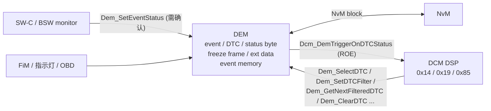
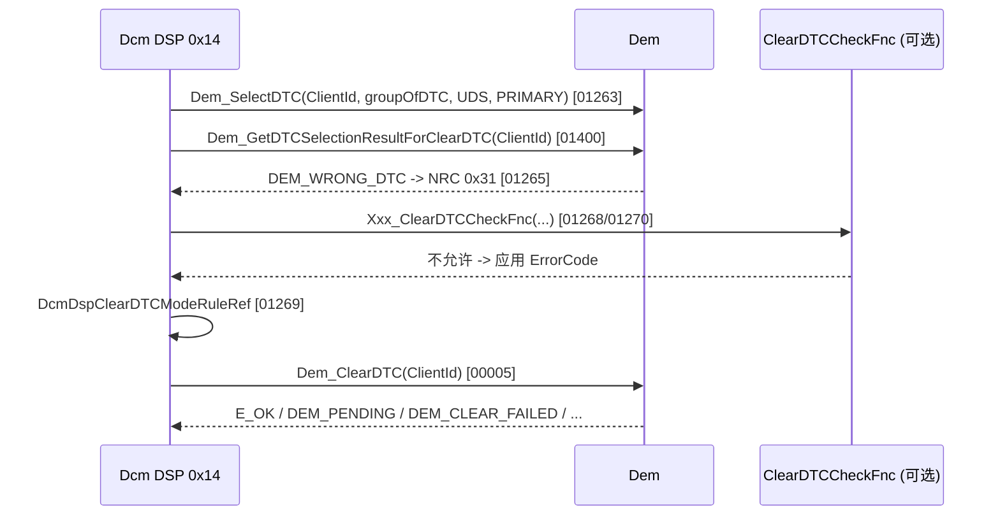
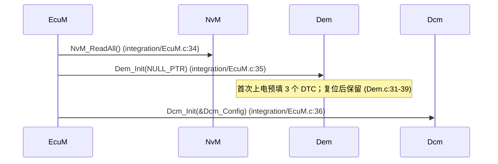
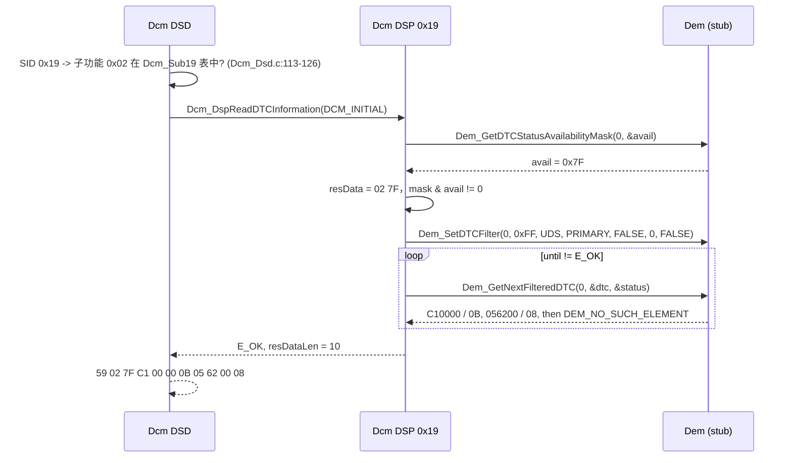
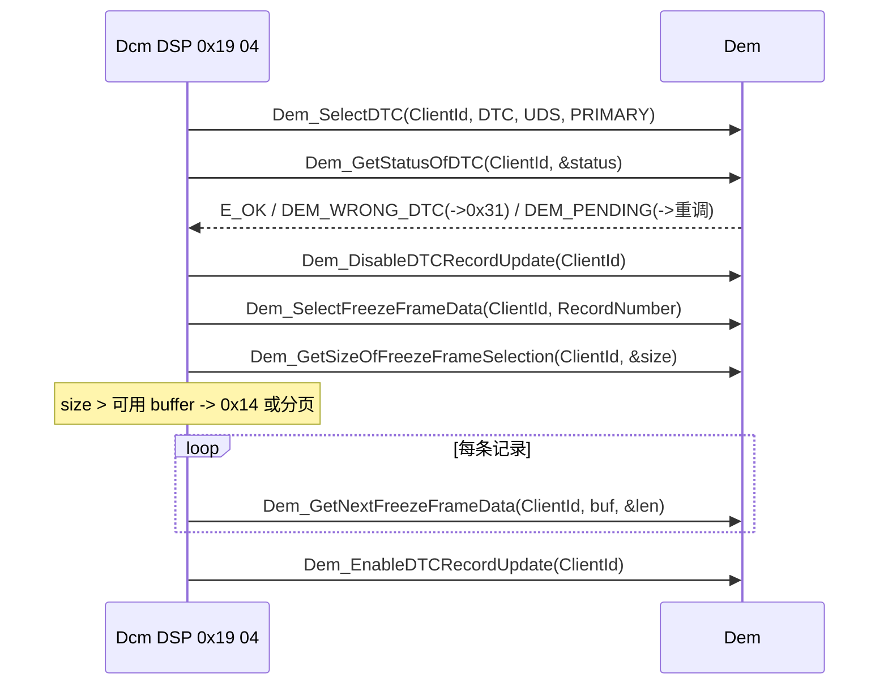

# 09 — DTC 与 DCM↔DEM 接口：0x14 ClearDiagnosticInformation / 0x19 ReadDTCInformation

> Prerequisite: [04 — DSP](04-dsp.md)、[08 — DID](08-did.md)（异步 `DCM_E_PENDING` 模型）
> Next: [10 — UDS 服务目录](10-uds-services.md)
> 对应规范: AUTOSAR CP **R20-11** SWS DCM（Doc ID 18）：0x19 通用规则 p.112–114、子功能 p.117–135；0x14 p.115–117；DEM 返回 PENDING 的重调 p.110；DCM 可选接口表（含 DEM API）`SWS_Dcm_91002` p.261–265；`DcmDemClientRef` p.467。**本仓库没有 DEM SWS**——本章所有 `Dem_*` 的完整签名与返回值类型均标注“需确认”。研究笔记 [02 §3.8.3 / §3.8.4 / §3.10](../reference/research/02-autosar-sws-notes.md)
> 对应源码: 本项目 `examples/uds_diag_demo/diag/Dcm_Dsp.c:170-257`、`diag/Dem.h`、`diag/Dem.c`；openAUTOSAR（R3.1.5）`diagnostic/Dcm/src/Dcm_Dsp.c:581-1175`、`diagnostic/Dem/src/Dem.c:2585-3000`、`diagnostic/Dem/include/Dem_Types.h:270-277`

---

## 1. 本章目标

1. 说清楚 DCM 与 DEM 的分工：**DCM 解析协议、组包；DEM 拥有事件、DTC、状态位、快照、扩展数据和故障存储**。
2. 背下 UDS DTC status byte 的 8 个 bit，理解 `DTCStatusMask` 与 `DTCStatusAvailabilityMask` 的“与”运算。
3. 知道 0x19 常用子功能 0x01 / 0x02 / 0x04 / 0x06 / 0x0A 的请求/响应格式，以及 DCM 为每个子功能调用哪些 DEM API。
4. 复述 R20-11 中 0x14 的 “select-then-act” 序列（`Dem_SelectDTC` → … → `Dem_ClearDTC`）与结果到 NRC 的映射。
5. 认识 R3.x（openAUTOSAR）与 R4.3+ 的 Dcm/Dem 接口差异——这是 DCM 升级时影响面最大的一组接口变化之一。

---

## 2. 为什么需要 DEM？为什么 DCM 不自己存 DTC？

一个 DTC 背后是一整套状态机：monitor 报告 `PASSED/FAILED` → debounce → 事件状态 → 映射为 DTC → 8 个状态位按 operation cycle 更新 → 确认后写入 event memory（NvM）→ 记录快照（freeze frame）和扩展数据 → aging/displacement → 驱动警告灯。这些与“诊断通信”完全无关，而且**不仅 UDS 用**（OBD、仪表警告灯、FiM 功能抑制都依赖它）。

因此 AUTOSAR 把它们放进 DEM，DCM 只是 DEM 的一个 **client**：



| Transition | 说明 |
|---|---|
| monitor → DEM | 应用或 BSW 报告事件结果。R4.x 典型 API 为 `Dem_SetEventStatus(EventId, EventStatus)`（openAUTOSAR R3 版本见 `diagnostic/Dem/src/Dem.c:2585`）。**本仓库无 DEM SWS，签名需确认** |
| DEM ↔ NvM | 事件存储在 NvM block 中；上电 `NvM_ReadAll` 后 DEM 才有历史 DTC |
| DCM → DEM | 0x14/0x19/0x85 全部委托给 DEM API，DCM 用配置的 `DcmDemClientRef` 作为 ClientId（`SWS_Dcm_01369`，p.82；`ECUC_Dcm_01083`，p.467） |
| DEM → DCM | `Dcm_DemTriggerOnDTCStatus(DTC, DTCStatusOld, DTCStatusNew)`（`SWS_Dcm_00614`，p.237），用于 ROE onDTCStatusChange |

---

## 3. 在系统中的位置

0x14/0x19 走的是与 0x22 完全相同的 DSL → DSD → DSP 路径（见 [11 — runtime flow](11-dcm-runtime-flow.md)），区别只在 DSP handler 的“下游”：

| 服务 | DSP 下游 | 是否可能异步 |
|---|---|---|
| 0x22 / 0x2E | RTE DataServices / NvM / IoHwAb | 是（`DCM_E_PENDING`） |
| 0x14 / 0x19 | DEM | 是（DEM 返回 `DEM_PENDING` → DCM 下周期重调，`SWS_Dcm_01412`，p.110） |

---

## 4. AUTOSAR / ISO 如何定义？

### 4.1 DTC status byte（ISO 14229-1）

`[Conceptual]` 状态位定义来自 ISO 14229-1（本仓库无该标准文本，也无 DEM SWS）。下表与 openAUTOSAR `diagnostic/Dem/include/Dem_Types.h:270-277` 的宏定义一致：

| bit | 掩码 | 名称 | 含义（简化） | openAUTOSAR 宏 |
|---|---|---|---|---|
| 0 | 0x01 | testFailed (TF) | 最近一次测试结果为失败 | `DEM_TEST_FAILED` |
| 1 | 0x02 | testFailedThisOperationCycle (TFTOC) | 本操作周期内至少失败过一次 | `DEM_TEST_FAILED_THIS_OPERATION_CYCLE` |
| 2 | 0x04 | pendingDTC (PDTC) | 当前或上一操作周期失败过（未确认） | `DEM_PENDING_DTC` |
| 3 | 0x08 | confirmedDTC (CDTC) | 已确认并存入故障存储 | `DEM_CONFIRMED_DTC` |
| 4 | 0x10 | testNotCompletedSinceLastClear (TNCSLC) | 自上次清除后测试未完成 | `DEM_TEST_NOT_COMPLETED_SINCE_LAST_CLEAR` |
| 5 | 0x20 | testFailedSinceLastClear (TFSLC) | 自上次清除后失败过 | `DEM_TEST_FAILED_SINCE_LAST_CLEAR` |
| 6 | 0x40 | testNotCompletedThisOperationCycle (TNCTOC) | 本操作周期测试未完成 | `DEM_TEST_NOT_COMPLETED_THIS_OPERATION_CYCLE` |
| 7 | 0x80 | warningIndicatorRequested (WIR) | 请求点亮警告灯 | `DEM_WARNING_INDICATOR_REQUESTED` |

demo 只定义了前 4 位（`examples/uds_diag_demo/diag/Dem.h:40-43`），可用性掩码为 `0x7F`（bit 7 不支持，`diag/Dem.c:12`）。

### 4.2 StatusMask 与 AvailabilityMask

- **`DTCStatusAvailabilityMask`**：ECU 支持哪些状态位。DCM 通过 `Dem_GetDTCStatusAvailabilityMask` 获得（`SWS_Dcm_00007`，p.112 起多处），并放在 0x19 01/02/0A 等响应的第一个数据字节。
- **`DTCStatusMask`**：tester 在请求中给出的过滤条件。一个 DTC 被报告的条件是 `(status & mask) != 0`。
- `mask & availability == 0` → DCM 直接回正响应、0 个 DTC，**不调用** `Dem_SetDTCFilter`（`SWS_Dcm_00008`，p.119；mask 为 0 的同类规则 `00700`，p.112）。

例：demo 中 `19 02 FF`：mask `0xFF & 0x7F = 0x7F`，C10000（status `0x0B` = TF|TFTOC|CDTC）与 056200（`0x08` = CDTC）被报告，403500（`0x00`）不报告。

### 4.3 0x19 子功能概览（本章覆盖 0x01 / 0x02 / 0x04 / 0x06 / 0x0A）

`[AUTOSAR Standard]` DEM API 名来自 R20-11 DCM SWS 的服务描述；签名需以 DEM SWS 确认。

| 子功能 | 请求 | 正响应 | DCM 调用的 DEM API（R20-11 描述） | SWS（页） |
|---|---|---|---|---|
| 0x01 reportNumberOfDTCByStatusMask | `19 01 <mask>` | `59 01 <availMask> <DTCFormatId> <countHi> <countLo>` | `Dem_GetDTCStatusAvailabilityMask`、`Dem_SetDTCFilter`、`Dem_GetNumberOfFilteredDTC`、`Dem_GetTranslationType`（得到 DTCFormatIdentifier） | `00376` p.117、`00293` p.118 |
| 0x02 reportDTCByStatusMask | `19 02 <mask>` | `59 02 <availMask> { <DTC 3 字节> <status> }*` | `Dem_SetDTCFilter` + 循环 `Dem_GetNextFilteredDTC` 直到 `DEM_NO_SUCH_ELEMENT` | `00377/00378` p.119；`00008` p.119；`01229/01230` p.121 |
| 0x04 reportDTCSnapshotRecordByDTCNumber | `19 04 <DTC 3> <recNr>` | `59 04 <DTC 3> <status> { <recNr> <numIds> <DID> <data>... }*` | `Dem_SelectDTC` → `Dem_GetStatusOfDTC` → `Dem_DisableDTCRecordUpdate` → `Dem_SelectFreezeFrameData` → `Dem_GetSizeOfFreezeFrameSelection` → 循环 `Dem_GetNextFreezeFrameData` → `Dem_EnableDTCRecordUpdate` | `00302/00383/00384` p.128、`00441` p.129、`00371` p.112 |
| 0x06 reportDTCExtDataRecordByDTCNumber | `19 06 <DTC 3> <extRecNr>` | `59 06 <DTC 3> <status> { <extRecNr> <data>... }*` | `Dem_SelectDTC` → `Dem_GetStatusOfDTC` → `Dem_DisableDTCRecordUpdate` → `Dem_SelectExtendedDataRecord` → `Dem_GetSizeOfExtendedDataRecordSelection` → 循环 `Dem_GetNextExtendedDataRecord` → `Dem_EnableDTCRecordUpdate` | `00386/00295/00382` p.124、`00371` p.112 |
| 0x0A reportSupportedDTC | `19 0A` | `59 0A <availMask> { <DTC 3> <status> }*` | 同 0x02，但 `Dem_SetDTCFilter` 的 StatusMask = 0x00（关闭状态过滤，规范表 7.9） | `00377/00378` p.119–120 |

其他要点（p.112–114）：

- 读快照/扩展数据前 `Dem_DisableDTCRecordUpdate`、读完 `Dem_EnableDTCRecordUpdate`，保证读取期间 DEM 不更新这条记录（`SWS_Dcm_00371`）；DEM 返回 PENDING 时下周期重试（`00702`）。
- 先设过滤再取数（`00835`，p.113）；`Dem_SetDTCFilter` 返回 `E_NOT_OK` → 0x31（`01255` p.114、`01043` p.117）。
- 分页缓冲：响应长度以第一页计算为准，多截少补 0（`00587/00588`，p.121）——这是“数 DTC 时 DEM 内容变化”的一致性问题。
- **0x19 的“未配置子功能”回 0x12**（DSD 通用规则 `SWS_Dcm_00273`，p.98）。

### 4.4 0x14 ClearDiagnosticInformation（R20-11 select-then-act）

`[AUTOSAR Standard]`（p.115–117，研究笔记 02 §3.8.3）



| Dem_ClearDTC 结果 | DCM 行为 | SWS（页） |
|---|---|---|
| `E_OK` | 正响应 `54` | `00705` p.116 |
| `DEM_PENDING` | 下一个 `Dcm_MainFunction` 再调 | `01412` p.110 |
| `DEM_WRONG_DTC` | 0x31 | `00708` p.116 |
| `DEM_WRONG_DTCORIGIN` | 0x31 | `01408` p.117 |
| `DEM_CLEAR_FAILED` | 0x22 | `00707` p.116 |
| `DEM_CLEAR_BUSY` | 0x22 | `00966` p.117 |
| `DEM_CLEAR_MEMORY_ERROR` | 0x72 | `01060` p.117 |

> **规范瑕疵**：`Dem_SelectDTC` 与 `Dem_GetDTCSelectionResultForClearDTC` 出现在服务描述（p.116）中，但**不在** §8.7.2 的可选接口表（`SWS_Dcm_91002`，p.261–265）里——该表只列出 `Dem_ClearDTC`。真实栈的 Dem 接口必须查 DEM SWS / 在真实项目确认。

### 4.5 DCM 使用的 DEM API 一览（R20-11 列出的）

`[AUTOSAR API]`（只有名字可从 DCM SWS 证实；参数、返回类型 **需确认**）

| 用途 | API（`SWS_Dcm_91002` p.261–265，除另注） |
|---|---|
| 0x14 | `Dem_ClearDTC`；（服务描述中）`Dem_SelectDTC`、`Dem_GetDTCSelectionResultForClearDTC` |
| 过滤与遍历 | `Dem_SetDTCFilter`、`Dem_GetNumberOfFilteredDTC`、`Dem_GetNextFilteredDTC`、`…AndFDC`、`…AndSeverity`、`Dem_SetFreezeFrameRecordFilter`、`Dem_GetNextFilteredRecord` |
| 单个 DTC | `Dem_GetStatusOfDTC`、`Dem_GetSeverityOfDTC`、`Dem_GetFunctionalUnitOfDTC`；（服务描述中）`Dem_SelectDTC`、`Dem_SelectExtendedDataRecord`、`Dem_SelectFreezeFrameData` |
| 快照 / 扩展数据 | `Dem_DisableDTCRecordUpdate`、`Dem_EnableDTCRecordUpdate`、`Dem_GetSizeOfFreezeFrameSelection`、`Dem_GetNextFreezeFrameData`、`Dem_GetSizeOfExtendedDataRecordSelection`、`Dem_GetNextExtendedDataRecord`、`Dem_GetNumberOfFreezeFrameRecords` |
| 掩码 / 格式 | `Dem_GetDTCStatusAvailabilityMask`、`Dem_GetDTCSeverityAvailabilityMask`、`Dem_GetTranslationType` |
| 0x85 ControlDTCSetting | `Dem_DisableDTCSetting`、`Dem_EnableDTCSetting` |
| 时间顺序 | `Dem_GetDTCByOccurrenceTime` |
| OBD | `Dem_DcmGetAvailableOBDMIDs`、`Dem_DcmReadDataOfOBDFreezeFrame` 等 |

`[Conceptual]` R4.3+ 的典型形态（**签名需确认**，以真实项目 DEM SWS / `Dem.h` 为准）：

```c
/* [Conceptual] R4.3+ client 形态示意 —— 本仓库无 DEM SWS，参数顺序/类型需确认 */
Std_ReturnType Dem_SelectDTC(uint8 ClientId, uint32 DTC, Dem_DTCFormatType DTCFormat, Dem_DTCOriginType DTCOrigin);
Std_ReturnType Dem_ClearDTC(uint8 ClientId);
Std_ReturnType Dem_SetDTCFilter(uint8 ClientId, uint8 DTCStatusMask, Dem_DTCFormatType DTCFormat,
                                Dem_DTCOriginType DTCOrigin, boolean FilterWithSeverity,
                                Dem_DTCSeverityType DTCSeverityMask, boolean FilterForFaultDetectionCounter);
Std_ReturnType Dem_GetNextFilteredDTC(uint8 ClientId, uint32* DTC, uint8* DTCStatus);
Std_ReturnType Dem_GetDTCStatusAvailabilityMask(uint8 ClientId, Dem_UdsStatusByteType* DTCStatusMask);
```

为什么要 ClientId + “先 select 后操作”？4.3.0 的 Change History 写明 “Redesign interfaces between Dem and Dcm”（DCM SWS p.2）。动机（解读）：多个 client（UDS 的 DCM、OBD、J1939 DCM、其他 tester 连接）可能同时访问 DEM；每个 client 有自己的 filter / selection 上下文，DEM 就不会被交错的请求搞乱。代价是：老代码中 `Dem_ClearDTC(dtc, kind, origin)` 这种一次性调用全部要改。

---

## 5. 核心数据结构

### 5.1 DEM 侧（概念）

`[Conceptual]` 真实 DEM 至少有：事件状态表（每 EventId 的 UDS 状态字节、debounce 计数器）、event memory（primary/secondary/user-defined，含 occurrence counter、aging counter、快照、扩展数据）、每个 client 的 filter 上下文（mask、迭代游标）与 selection 上下文（选中的 DTC、记录号）。

### 5.2 demo 的 Dem stub

`[Educational Implementation]`（`examples/uds_diag_demo/diag/Dem.c`）

| 变量 | 位置 | 对应真实 DEM 的什么 |
|---|---|---|
| `Dem_Dtcs[3]` {dtc, status} | `diag/Dem.c:19`，初值 `:35-37` | event memory + 状态字节（固定 3 个 DTC） |
| `Dem_MemoryValid` | `diag/Dem.c:20`、`:31-39` | “已从 NvM 读回”——只在第一次上电预填，模拟复位后保留 |
| `Dem_SelectedDtc` / `Dem_Selected` | `diag/Dem.c:21-22` | per-client selection 上下文（demo 只有一个 client） |
| `Dem_ClearPendingCycles` | `diag/Dem.c:23`、`:52` | 让 `Dem_ClearDTC` 第一次返回 `DEM_PENDING`，模拟“等 NvM 写” |
| `Dem_FilterMask` / `Dem_FilterIndex` / `Dem_FilterActive` | `diag/Dem.c:24-26` | per-client filter 上下文与迭代游标 |

返回码数值（`diag/Dem.h:31-37`）是**示意值**，文件中已注明 “values illustrative, confirm in Dem SWS”。

---

## 6. 初始化流程



| Transition | 说明 |
|---|---|
| NvM_ReadAll → Dem_Init | DEM 依赖 NvM 中的 event memory；真实栈常有 `Dem_PreInit`（openAUTOSAR `diagnostic/Dem/src/Dem.c:2335`）在 NvM 之前，`Dem_Init`（`:2415`）在 NvM_ReadAll 之后 |
| Dem_Init → Dcm_Init | DCM 不在 init 时调用 DEM，但 tester 请求可能在通信启动后立即到来，DEM 必须先就绪 |

`[Real Project Consideration]` 操作周期（operation cycle）的开始通常由 EcuM/BswM 在启动后触发；在此之前 DEM 状态位（如 TNCTOC）的取值依赖 DEM 配置——0x19 的“上电后第一次读”结果与此相关，需在真实项目确认。

---

## 7. Runtime Flow

### 7.1 `19 02 FF`（demo）



| # | 位置 | 说明 |
|---|---|---|
| 1 | `diag/Dcm_Cfg.c:101-103`、`:119` | 0x19 行 `subFuncAvail=TRUE`、`minReqLen=3`，子功能表只有 0x02（默认/扩展会话） |
| 2 | `diag/Dcm_Dsd.c:106-126` | SPRMIB 处理后查子功能；`19 0A FF` → 0x12（`tests/test_uds_demo.c:299-305`） |
| 3 | `diag/Dcm_Dsp.c:228-231` | 长度必须正好 2（子功能 + mask）否则 0x13 |
| 4 | `diag/Dcm_Dsp.c:233` → `diag/Dem.c:85-90` | 可用性掩码 |
| 5 | `diag/Dcm_Dsp.c:237` | `SWS_Dcm_00008`：与运算为 0 则不设过滤 |
| 6 | `diag/Dcm_Dsp.c:238-242` → `diag/Dem.c:92-108` | `Dem_SetDTCFilter`，失败 → 0x31 |
| 7 | `diag/Dcm_Dsp.c:243-252` → `diag/Dem.c:110-127` | 每个 DTC 4 字节；放不下 → 0x14（`:244-246`） |
| 8 | `diag/Dcm_Dsp.c:256` | `resDataLen = pos`，DSD 加 `0x59` |

对应 trace（`artifacts/uds-demo/trace.txt` 第 471 行起的段落）：

```text
[   590 ms] [Dcm/DSP ] 0x19 02: mask 0xFF & availability 0x7F -> 2 DTC(s) from Dem
[   590 ms] [Dcm/DSD ] positive response assembled: SID 0x59 + 10 data bytes
[   590 ms] [Dcm/DSL ] response [59 02 7F C1 00 00 0B 05 62 00 08] -> PduR_DcmTransmit(0, len=11)
```

### 7.2 `14 FF FF FF`（demo，DEM 返回一次 PENDING）

| # | 时间（trace） | 位置 | 说明 |
|---|---|---|---|
| 1 | 600 ms | `diag/Dcm_Dsp.c:177-191` | INITIAL：长度必须 3 字节 groupOfDTC；`Dem_SelectDTC(client 0, 0xFFFFFF, UDS, PRIMARY)` |
| 2 | 600 ms | `diag/Dcm_Dsp.c:192` → `diag/Dem.c:65-70` | `Dem_ClearDTC` 返回 `DEM_PENDING` |
| 3 | 600 ms | `diag/Dcm_Dsp.c:197-198` | 映射为 `DCM_E_PENDING`（`SWS_Dcm_01412`） |
| 4 | 610 ms | `diag/Dcm_Dsl.c:258-261` | 下一个 `Dcm_MainFunction` 以 `DCM_PENDING` 重调；DSP 跳过 select（只在 INITIAL 做），直接 `Dem_ClearDTC` |
| 5 | 610 ms | `diag/Dem.c:71-82` | 清除全部 → `E_OK` → 正响应 `54` |
| 6 | 611 ms 之后 | `tests/test_uds_demo.c:306-307` | 再读 `19 02 FF` → `59 02 7F`（0 个 DTC） |

`[Educational Implementation]` demo 的简化与偏差（读代码时注意）：

- 没有 `Dem_GetDTCSelectionResultForClearDTC` 与 `ClearDTCCheckFnc`、mode rule；`Dem_SelectDTC` 失败映射为 0x22（`diag/Dcm_Dsp.c:187-190`）——R20-11 中 select 结果应通过 `GetDTCSelectionResultForClearDTC` 判断并映射 0x31。
- `DEM_CLEAR_FAILED`/`DEM_CLEAR_BUSY` 由 `default` 分支统一映射为 0x22（`diag/Dcm_Dsp.c:206-208`），与规范一致；`DEM_CLEAR_MEMORY_ERROR` → 0x72（`:203-205`）。
- DSD 服务表中 0x14 只允许默认/扩展会话（`diag/Dcm_Cfg.c:118`）。

### 7.3 0x04 / 0x06 的典型时序（概念）

`[Conceptual]`（按 R20-11 p.124、p.128 的需求顺序画出；demo 未实现）



| Transition | 为什么 |
|---|---|
| select → status | 响应中要回 DTC 当前状态字节；DTC 不存在时由这里得出 0x31 |
| Disable/EnableDTCRecordUpdate 成对 | 防止读到一半 DEM 用新的快照覆盖（一致性）。**若中途因错误提前返回而忘记 Enable，DEM 会一直不更新该记录**——这是真实项目中的经典 bug |
| GetSize 在前 | 先知道总长度才能决定是否分页、是否 0x14 |

0x06 完全同构，只是把 FreezeFrame 换成 ExtendedDataRecord（`Dem_SelectExtendedDataRecord` / `Dem_GetSizeOfExtendedDataRecordSelection` / `Dem_GetNextExtendedDataRecord`，p.124）。快照数据中的每个 DID 本身由 DEM 配置决定，DCM 只是按 DEM 给的字节流拷贝。

---

## 8. RH850 Hardware Mapping

DTC 处理没有直接的寄存器访问。相关硬件点：

`[RH850 Hardware]` / `[Real Project Consideration]`

- **event memory 的持久化**：DEM → NvM → Fee → Fls → data flash。`14 FF FF FF` 在真实 ECU 上常常要擦写 data flash，耗时可达数十到数百毫秒 → 必然经过 `DEM_PENDING` + NRC 0x78。具体擦写时间需根据实际芯片手册与 Fee 配置确认。
- **复位后 DTC 是否保留**取决于 NvM 写入时机（立即写 vs `NvM_WriteAll` 关机时写）。0x11 硬复位如果发生在 `NvM_WriteAll` 之前，刚确认的 DTC 可能丢失——这是 0x11 与 DEM 的交互点，需在真实项目确认 EcuM/BswM 的关机序列。
- demo 用 `Dem_MemoryValid`（`diag/Dem.c:20`）模拟“复位后保留”。

---

## 9. openAUTOSAR 实现（R3.1.5 风格，只读参考）

| 功能 | 位置 | 与 R20-11 的差异 |
|---|---|---|
| 0x14 | `diagnostic/Dcm/src/Dcm_Dsp.c:581`；调用 `Dem_ClearDTC(dtc, DEM_DTC_KIND_ALL_DTCS, DEM_DTC_ORIGIN_PRIMARY_MEMORY)` `:590` | 一次性调用，无 ClientId、无 select；只认 `DEM_CLEAR_OK`，其余全部 0x31（研究笔记 03 §4.7） |
| 0x19 入口 | `Dcm_Dsp.c:1091` `DspUdsReadDtcInformation`；长度表 `sduLength[0x16]` `:1095` | 用表做 0x13 检查 |
| 0x19 01/07/11/12 | `Dcm_Dsp.c:633` `udsReadDtcInfoSub_0x01_0x07_0x11_0x12` | — |
| 0x19 02/0A/0F/13/15 | `Dcm_Dsp.c:708` | — |
| 0x19 06/10 | `Dcm_Dsp.c:824` | — |
| 0x19 04 | `Dcm_Dsp.c:949` | — |
| 未知子功能 | `Dcm_Dsp.c:1159`（`default` → `DCM_E_REQUESTOUTOFRANGE`）、子功能越界 `:1170` | **回 0x31 而非 0x12**，偏离 ISO 14229-1 与 R20-11 `SWS_Dcm_00273` |
| DEM 侧 | `diagnostic/Dem/src/Dem.c`：`Dem_SetEventStatus` `:2585`、`Dem_GetDTCStatusAvailabilityMask(uint8*)` `:2813`、`Dem_SetDTCFilter` `:2834`、`Dem_GetStatusOfDTC` `:2882`、`Dem_GetNumberOfFilteredDtc` `:2917`、`Dem_GetNextFilteredDTC` `:2951`、`Dem_ClearDTC` `:2998` | R3 形态：无 ClientId，返回专用枚举（如 `Dem_ReturnClearDTCType`），而 R4.3+ 统一为 `Std_ReturnType` + `DEM_*` 扩展码（需确认） |
| 状态位宏 | `diagnostic/Dem/include/Dem_Types.h:270-277` | 与 ISO 位定义一致 |
| 编译开关 | 0x14/0x19 需 `USE_DEM`；当前仓库配置未定义 → 被编译掉（研究笔记 03 §3.3） | — |

升级启示：从 openAUTOSAR 这类 R3 / 早期 R4 基线升到 R4.3+，**0x14/0x19/0x85 的 Dcm↔Dem glue 代码与 NRC 映射几乎要全部重写**，并且 DEM 本身也要同步升级到支持 ClientId 的版本——两者必须一起升（见 [DCM 升级指南](../dcm-upgrade-guide.md)）。

---

## 10. 当前教学项目实现

| 文件 | 内容 |
|---|---|
| `examples/uds_diag_demo/diag/Dem.h:21-56` | 类型、示意返回码、状态位、R4.3+ 形态的 6 个 API |
| `examples/uds_diag_demo/diag/Dem.c:28-127` | 3 个 DTC 的 stub 实现 |
| `examples/uds_diag_demo/diag/Dem.c:129-137` | `Dem_SimSetDtcStatus`——代替 monitor 调 `Dem_SetEventStatus`，**不是 AUTOSAR API** |
| `examples/uds_diag_demo/diag/Dcm_Dsp.c:170-209` | 0x14 |
| `examples/uds_diag_demo/diag/Dcm_Dsp.c:216-257` | 0x19 02 |
| `examples/uds_diag_demo/diag/Dcm_Cfg.h:37` | `DCM_DEM_CLIENT_ID`（对应 `DcmDemClientRef`） |
| `examples/uds_diag_demo/tests/test_uds_demo.c:292-308` | `test_dtc_clear_and_read` |

未实现：0x19 的 0x01/0x04/0x06/0x0A 等其他子功能、0x85、ROE、debounce、operation cycle、aging、快照、扩展数据、多 client。

---

## 11. Code Walkthrough：0x14 的 OpStatus 分支

`[Educational Implementation]`（`examples/uds_diag_demo/diag/Dcm_Dsp.c:170-209` 节选）

```c
if (OpStatus == DCM_INITIAL) {
    /* 只在第一次调用时解析请求并 select —— PENDING 重入时不能重复 select */
    if (pMsgContext->reqDataLen != 3u) { *ErrorCode = DCM_E_INCORRECTMESSAGELENGTHORINVALIDFORMAT; return E_NOT_OK; }
    group = ((uint32)pMsgContext->reqData[0] << 16) | ((uint32)pMsgContext->reqData[1] << 8) | pMsgContext->reqData[2];
    if (Dem_SelectDTC(DCM_DEM_CLIENT_ID, group, DEM_DTC_FORMAT_UDS, DEM_DTC_ORIGIN_PRIMARY_MEMORY) != E_OK) { ... }
}
r = Dem_ClearDTC(DCM_DEM_CLIENT_ID);          /* INITIAL 和 PENDING 都调用 */
switch (r) {
case E_OK:                  pMsgContext->resDataLen = 0u; return E_OK;
case DEM_PENDING:           return DCM_E_PENDING;                       /* SWS_Dcm_01412 */
case DEM_WRONG_DTC:
case DEM_WRONG_DTCORIGIN:   *ErrorCode = DCM_E_REQUESTOUTOFRANGE;       return E_NOT_OK;
case DEM_CLEAR_MEMORY_ERROR:*ErrorCode = DCM_E_GENERALPROGRAMMINGFAILURE; return E_NOT_OK;
default:                    *ErrorCode = DCM_E_CONDITIONSNOTCORRECT;    return E_NOT_OK;
}
```

要点：

1. **select 只在 INITIAL 做一次**——如果 PENDING 时又 select，DEM 可能把正在进行的 clear 当成新请求重新开始，永远 PENDING。
2. `DEM_PENDING` 与 `DCM_E_PENDING` 是两个模块各自的“未完成”码，DSP 负责翻译。
3. 0x14 正响应**没有数据**：`resDataLen = 0`，DSD 只写 `0x54`。

---

## 12. Debug 方法

| 现象 | 断点 / 变量（demo） | 真实项目中看什么 |
|---|---|---|
| `59 02 <mask>` 但没有 DTC | `diag/Dcm_Dsp.c:237`（`mask & avail`）、`diag/Dem.c:119` | DEM 中 event 是否真的报告了 FAILED；debounce 是否达到阈值；operation cycle 是否已开始；DTC 是否映射到 primary memory |
| `7F 19 12` | `diag/Dcm_Dsd.c:122-126` | DSD 子功能表是否配置了该子功能（`DcmDsdSubService`） |
| `7F 19 31` | `diag/Dcm_Dsp.c:240` | `Dem_SetDTCFilter` 的 origin / format 是否被 DEM 支持 |
| `7F 14 22` | `diag/Dcm_Dsp.c:206` | DEM 是否 busy（另一个 client 正在 clear）；ClearDTCCheckFnc 是否拒绝 |
| 0x14 一直 0x78 | `diag/Dcm_Dsp.c:197`、`diag/Dem.c:65` | DEM 等待的 NvM job 是否被调度（`NvM_MainFunction`）、Fee 是否卡住 |
| 读快照后 DTC 不再更新 | — | `Dem_DisableDTCRecordUpdate` 后是否所有路径都调用了 `Dem_EnableDTCRecordUpdate` |

---

## 13. 常见错误

1. **把 status byte 当成 “DTC 是否存在”**：0x19 02 只报告 `(status & mask) != 0` 的 DTC；一个已清除、从未再失败的 DTC 状态为 0x00 或 0x50（取决于 TNC 位的支持），用 mask 0x08 读不到它是正常的。
2. **mask 与 availability 的与运算**：tester 用 `0x80` 查警告灯，ECU 不支持 bit 7 → 正响应 0 个 DTC，而不是 NRC。
3. **0x14 的 groupOfDTC**：`FF FF FF` = 全部；其他 group 值是否支持由 DEM 配置决定；不支持的 group 得到 `DEM_WRONG_DTC` → 0x31。
4. **R3/R4 混用**：DCM 升级到 R4.3+ 而 DEM 仍是旧版 → 链接错误；或通过“适配层”强行转换，但 ClientId 上下文丢失，多个 tester 连接并发时出错。
5. **在 DSP 中忽略 `DEM_PENDING`** 并直接回正响应：tester 以为已清除，实际 event memory 尚未写入 NvM，复位后 DTC“复活”。

---

## 14. 实验（只运行与观察，不修改 demo 源码）

1. 在 `artifacts/uds-demo/trace.txt` 中找到 `14 FF FF FF` 段（第 514 行起），对照本章 §7.2 的表，写出每一行 trace 对应的源码行。
2. 手工解码 `59 02 7F C1 00 00 0B 05 62 00 08`：每个 DTC 3 字节 + 1 字节状态，写出每个状态字节的 bit 含义（用 §4.1 的表）。
3. 读 `tests/test_uds_demo.c:292-308`，解释为什么测试在开头要调用 `Dem_SimSetDtcStatus`（提示：`fresh_ecu()` 之后 DEM 内容是否一定是初值？看 `diag/Dem.c:31`）。
4. 思考：如果 tester 发送 `19 02 08`（只看 confirmed），demo 的响应是什么？在纸上推导，再与 `diag/Dem.c:110-127` 的逻辑核对。

---

## 15. 思考题

1. 为什么 0x19 02 的响应第一个数据字节是 availability mask，而不是 tester 请求的 mask？
2. DCM 为什么要把 `Dem_DisableDTCRecordUpdate` 放在 select 之后、读数据之前？如果放在请求开始时会有什么问题？
3. 两个 tester（例如 OBD scan tool 与 UDS tester）同时清 DTC，ClientId 机制如何避免互相干扰？R3 的接口为什么做不到？
4. `Dem_ClearDTC` 返回 `DEM_CLEAR_BUSY` 映射为 0x22 而不是 0x21（busyRepeatRequest），你认为规范这样选择的理由是什么？（这属于解读题，没有标准答案。）

---

## 16. 对未来真实项目的意义

- **读陌生 DCM 时**，在 DSP 0x14/0x19 handler 中搜索 `Dem_`：调用的是 `Dem_ClearDTC(ClientId)` 还是 `Dem_ClearDTC(dtc, kind, origin)`，立刻可以判断 Dcm/Dem 接口基线（4.3.0 前后）。
- **升级时**：DCM 与 DEM 必须成对评估；`DcmDemClientRef` 是新配置项；NRC 映射表（研究笔记 02 §3.8.3）要逐条回归。
- **测试清单**：19 01/02/04/06/0A × {有 DTC, 无 DTC, mask&avail=0, 不支持子功能, DTC 不存在}；14 × {全部, 单个 group, 不支持 group, DEM busy, NvM 写失败}；以及“读快照时 DTC 状态变化”的一致性场景。
- RTA-CAR 等商业栈的 DEM 通常与 DCM 同一供应商，接口版本一致；但若 OEM 自研 DEM 或混用供应商，接口差异需在真实项目中确认。

---

## 17. 本章总结

- DCM 是 DEM 的 client：DCM 解析协议与组包，DEM 管理事件、DTC、状态位与存储。
- status byte 8 位；报告条件 `(status & mask) != 0`；`mask & availability == 0` → 0 个 DTC 正响应。
- R20-11：ClientId + select-then-act；0x14 结果映射 `E_OK→54`、`WRONG_DTC→0x31`、`CLEAR_FAILED/BUSY→0x22`、`MEMORY_ERROR→0x72`、`PENDING→重调`。
- 本仓库无 DEM SWS，所有 `Dem_*` 签名需在真实项目确认。

## 18. 下一章

[10 — UDS 服务目录](10-uds-services.md)：把 0x10/0x11/0x14/0x19/0x22/0x27/0x2E/0x31/0x3E 放在同一张表里对照。
