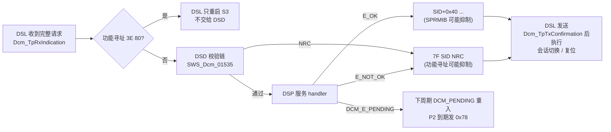
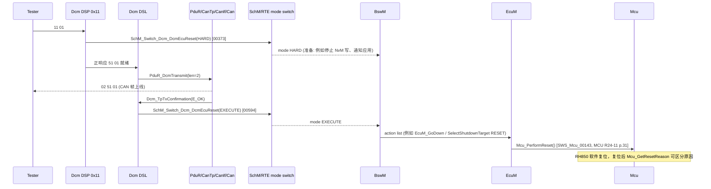
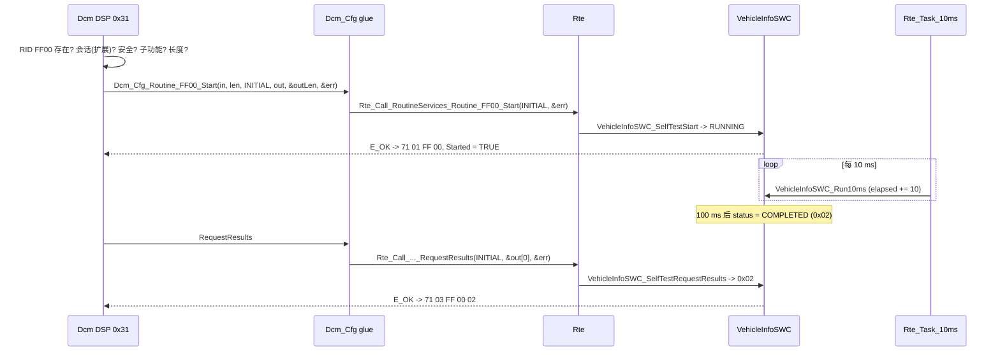

# 10 — UDS 服务目录：0x10 / 0x11 / 0x14 / 0x19 / 0x22 / 0x27 / 0x2E / 0x31 / 0x3E

> Prerequisite: [03 — DSD](03-dsd.md)、[06 — Diagnostic Session](06-diagnostic-session.md)、[07 — Security Access](07-security-access.md)、[08 — DID](08-did.md)、[09 — DTC/DEM](09-dtc-dem.md)
> Next: [11 — DCM Runtime Flow：`22 F1 90` 到底经过哪些函数](11-dcm-runtime-flow.md)
> 对应规范: AUTOSAR CP **R20-11** SWS DCM（Doc ID 18）：DSD 校验顺序 p.92–103；0x10 p.114；0x11 p.114–115、p.221；0x14 p.115–117；0x19 p.112–135；0x22 p.135–141；0x27 p.142–144；0x2E p.174–177；0x31 p.188–196；0x3E p.58、p.196；NRC 类型 p.304–307；ECUC 参数 p.442–678。MCU SWS **R24-11** `Mcu_PerformReset`（`SWS_Mcu_00143`，p.31）。研究笔记 [02 §3.7–§3.8](../reference/research/02-autosar-sws-notes.md)
> 对应源码: 本项目 `examples/uds_diag_demo/diag/Dcm_Dsd.c`、`diag/Dcm_Dsp.c`、`diag/Dcm_Cfg.c`、`tests/test_uds_demo.c`；openAUTOSAR（R3.1.5）`diagnostic/Dcm/src/Dcm_Dsp.c`（各服务入口见 §13）

---

## 1. 本章目标

本章是一张 **“服务速查 + 行为说明”** 的总表，用于：

1. 在调试或写测试时，快速查到每个服务的请求/响应字节格式、子功能、可能的 NRC 及其检查顺序。
2. 知道每个服务在 DCM 内部由谁处理（DSL / DSD / DSP）、调用了哪个 RTE 端口或 callout、依赖哪些配置参数。
3. 理解两个“响应之后才生效”的服务：0x10（会话切换）与 0x11（复位），以及 0x31 RoutineControl 的三种子功能与状态。
4. 每个服务都能在 demo 的测试用例中找到对应 `path:line`，可以直接运行验证。

深入的机制请看各专题章节；本章不重复 DSD/DSP 的内部实现。

---

## 2. 为什么要一张统一的服务目录？

在真实项目里，“这个请求为什么回 0x31 而不是 0x7F？” 这类问题的答案分布在三处：ISO 14229-1（协议语义）、DCM SWS（AUTOSAR 对 ISO 的实现约束）、生成的 DCM 配置（本 ECU 的具体允许条件）。只有把三者对齐，才能判断“是配置错、是实现错、还是测试期望错”。本章按服务把三者放在一起。

---

## 3. 在系统中的位置：通用处理骨架

所有服务共享同一骨架（详见 [11 — runtime flow](11-dcm-runtime-flow.md)）：



| Transition | 依据 |
|---|---|
| 功能寻址 `3E 80` 由 DSL 旁路处理 | `SWS_Dcm_00112/00113/01168`（p.58） |
| DSD 校验链 | `SWS_Dcm_01535`（p.94），见 §4 |
| `DCM_E_PENDING` → 重入 → 0x78 | `00530`（p.52）、`00024`（p.61） |
| SPRMIB 抑制正响应 | `00200`（p.93）、`00204`（p.94） |
| 功能寻址抑制 NRC 0x11/0x12/0x31/0x7E/0x7F | `00001`（p.101） |
| 发送确认后执行会话切换/复位 | `00311`（p.114）、`00594`（p.115） |

---

## 4. AUTOSAR 如何定义：通用 NRC 与检查顺序

### 4.1 DSD 层顺序（所有服务通用）

`[AUTOSAR Standard]` `SWS_Dcm_01535`（p.94）

| 顺序 | 检查 | 失败 NRC | SWS（页） |
|---|---|---|---|
| 1 | 制造商许可（`Xxx_Indication`，Manufacturer notification） | 应用给出 / 不响应 | `00462/00463`（p.99） |
| 2 | SID 在当前协议的服务表中 | 0x11 | `00197`（p.93） |
| 3 | 认证（0x29 已配置时） | 0x34 | `01544`（p.96） |
| 4 | 会话（服务级） | 0x7F | `00211`（p.97）——**0x10 本身不做会话检查** |
| 5 | 安全级（服务级） | 0x33 | `00217`（p.97）——**0x27 本身不做安全检查** |
| 6 | 供应商许可（Supplier notification） | 应用给出 / 不响应 | `00517/00518` |
| 7 | Mode rule | 规则计算出的 NRC | `00773/00774`（p.98） |
| — | 最小长度 | 0x13 | `00696`（p.98） |
| — | 子功能已配置（**0x31 除外**） | 0x12 | `00273`（p.98） |
| — | 子功能会话 / 安全 | 0x7E / 0x33 | `00616/00617`（p.97） |

`[Real Project Consideration]` 表中“—”行在 R20-11 中的相对位置与 ISO 14229-1 的通用 NRC 流程图不完全一致（尤其 0x13 相对 0x7F/0x33 的位置）。demo 的实现顺序见 `examples/uds_diag_demo/diag/Dcm_Dsd.c:10-24`（SID → 会话 → 安全 → 长度 → 子功能），这是一种合理选择而非唯一正解。**真实栈的顺序必须用“同时违反两个条件”的测试确认**。

### 4.2 本章涉及的 NRC

`[AUTOSAR API]` `Dcm_NegativeResponseCodeType`（`SWS_Dcm_00980`，p.304–307；demo `rte/Rte_Dcm_Type.h:32-54`）

| NRC | 名称 | 典型产生者 |
|---|---|---|
| 0x10 | generalReject | 应用返回 E_NOT_OK 但未给 NRC（`00271` p.103）；0x78 次数用尽（`00120` p.111） |
| 0x11 | serviceNotSupported | DSD：SID 不在表中 |
| 0x12 | subFunctionNotSupported | DSD 子功能表；0x10/0x11/0x27/0x31 的 DSP |
| 0x13 | incorrectMessageLengthOrInvalidFormat | DSD 最小长度；各 DSP 精确长度 |
| 0x14 | responseTooLong | DSP：响应超 buffer |
| 0x21 | busyRepeatRequest | DSL：另一连接正在处理且 `DcmDslDiagRespOnSecondDeclinedRequest=TRUE`（`00788–00790` p.56） |
| 0x22 | conditionsNotCorrect | 应用 ConditionCheck；DEM clear 失败；会话切换/复位前置条件 |
| 0x24 | requestSequenceError | 0x27 无 seed 的 sendKey；0x31 未 start 就 stop/results（ISO 语义） |
| 0x31 | requestOutOfRange | DID / RID / DTC 不存在、不可读写、**会话不允许**（DID/RID 级） |
| 0x33 | securityAccessDenied | DSD 或 DSP 安全检查 |
| 0x35 / 0x36 / 0x37 | invalidKey / exceededNumberOfAttempts / requiredTimeDelayNotExpired | 0x27 |
| 0x72 | generalProgrammingFailure | NvM 写失败（`00541`）；DEM memory error |
| 0x78 | responsePending | **只由 DSL 发**；不在 `Dcm_NegativeResponseCodeType` 中，应用不能直接返回 |
| 0x7E / 0x7F | subFunction / service NotSupportedInActiveSession | DSD |

---

## 5. 核心数据结构：服务表

`[Educational Implementation]` demo 的服务表（`examples/uds_diag_demo/diag/Dcm_Cfg.c:114-125`）就是本章的“配置视角”：

| SID | 子功能? | 最小长度(含 SID) | 允许会话 | 安全 | DSD 子功能表 | DSP handler（`diag/Dcm_Dsp.c`） |
|---|---|---|---|---|---|---|
| 0x10 | 是 | 2 | 全部 | — | 01, 03（`Dcm_Cfg.c:93-96`） | `:110` |
| 0x11 | 是 | 2 | 全部 | — | 01, 03（`:97-100`） | `:147` |
| 0x14 | 否 | 4 | 默认+扩展 | — | — | `:170` |
| 0x19 | 是 | 3 | 默认+扩展 | — | 02（`:101-103`） | `:216` |
| 0x22 | 否 | 3 | 全部 | — | — | `:264` |
| 0x27 | 是 | 2 | **仅扩展** | — | 01, 02（`:104-107`） | `:383` |
| 0x2E | 否 | 4 | **仅扩展** | — | — | `:487` |
| 0x31 | 是 | 4 | **仅扩展** | — | `NULL_PTR`（子功能由 DSP 查，`SWS_Dcm_00273` 例外） | `:540` |
| 0x3E | 是 | 2 | 全部 | — | 00（`:108-110`） | `:623` |

真实配置对应 `DcmDsdServiceTable` / `DcmDsdService`：`DcmDsdSidTabServiceId`（`ECUC_Dcm_00735`，p.449）、`DcmDsdSidTabSubfuncAvail`、`DcmDsdSidTabSessionLevelRef` / `SecurityLevelRef`、`DcmDsdSubService`（研究笔记 02 §3.13，p.448–454）。

---

## 6. 初始化流程

服务本身没有初始化，但服务依赖的状态在 `Dcm_Init` 中复位：默认会话（`SWS_Dcm_00034`）、安全级 LOCKED（`00033`，p.74）、DSP 的跨周期状态。demo：`diag/Dcm.c:16-28` → `diag/Dcm_Dsl.c:147-157`、`diag/Dcm_Dsp.c:76-84`。

---

## 7. Runtime Flow：逐服务

每个服务按同一模板：**格式 → 子功能 → DCM 行为 → NRC 与顺序 → 配置 → RTE/callout → demo 测试**。

### 7.1 0x10 DiagnosticSessionControl

| 项 | 内容 |
|---|---|
| 请求 | `10 <diagnosticSessionType>`（bit7 = SPRMIB） |
| 正响应 | `50 <type> <P2Server_max 2 字节, 1 ms> <P2*Server_max 2 字节, 10 ms>`；例 `50 03 00 32 01 F4` = P2 50 ms、P2\* 500×10 ms |
| 子功能 | 0x01 Default、0x02 Programming、0x03 Extended、0x04 SafetySystem、0x40–0x7E 厂商（`Dcm_SesCtrlType`，`SWS_Dcm_00978` p.302–303） |
| DCM 行为 | 子功能未配置 → 0x12（`00307` p.114）；**即使请求会话 = 当前会话也走完整流程**；新会话与新 P2 在**发送确认后**生效，并 `SchM_Switch_<bsnp>_DcmDiagnosticSessionControl(new)`（`00311` p.114）；任何会话切换都把安全级复位为 LOCKED（`00139` p.74）；跳 bootloader 由 `DcmDspSessionForBoot` 控制（p.218–223） |
| NRC 顺序 | DSD：0x11 →（无会话检查）→ 0x13 → 0x12 → DSP：0x13（精确长度）/ 0x12 / 0x22（boot 前置条件，`01175`） |
| 配置 | `DcmDspSessionLevel`（`ECUC_Dcm_00765` p.655）、`DcmDspSessionP2ServerMax`（00766 p.656）、`DcmDspSessionP2StarServerMax`（00768 p.656）、`DcmDspSessionForBoot`（00815 p.655） |
| RTE / callout | Mode switch `DcmDiagnosticSessionControl`（SW-C 用 `Rte_Mode_*` 感知）；boot：`Dcm_SetProgConditions` |
| demo | `diag/Dcm_Dsp.c:110-140`（组响应、`Dcm_DslRequestSessionChange`）→ `diag/Dcm_Dsl.c:166-172`（确认后切换）→ `diag/Dcm_Dsl.c:108-122`（LOCKED + `SchM_Switch`）；测试 `tests/test_uds_demo.c:122-135`（`10 01`→`50 01 00 32 01 F4`，`10 02`→`7F 10 12`） |

> 深入：[06 — Diagnostic Session](06-diagnostic-session.md)；时序：[11 — runtime flow §8](11-dcm-runtime-flow.md)。

### 7.2 0x11 ECUReset（含“先响应、后复位”）

| 项 | 内容 |
|---|---|
| 请求 | `11 <resetType>` |
| 正响应 | `51 <resetType>`；0x04 时附 `powerDownTime`（`00589` p.115） |
| 子功能 | 0x01 hardReset、0x02 keyOffOnReset、0x03 softReset、0x04 enableRapidPowerShutDown、0x05 disableRapidPowerShutDown |
| DCM 行为 | 0x01–0x03：先 `SchM_Switch(DcmEcuReset, HARD/KEYONOFF/SOFT)`，再启动正响应发送（`00373` p.115）；**正响应的 `Dcm_TpTxConfirmation` 后**切 `DcmEcuReset = EXECUTE`（`00594` p.115），由 BswM 按 action list 完成最终复位（集成者也可决定不复位）；复位处理中忽略新请求（`00834` p.115）；0x04/0x05 → `DcmModeRapidPowerShutDown`（`00818`） |
| NRC | 0x12（未配置）、0x13、0x22（条件不满足，例如车速）、0x33（若配置了安全） |
| 配置 | `DcmDspEcuResetRow` / `DcmDspEcuResetId`（`ECUC_Dcm_01113` p.564）、`DcmResponseToEcuReset`（01039 p.565：`BEFORE_RESET` / `AFTER_RESET`，`01423/01424` p.221）、`DcmSendRespPendOnRestart`（01114 p.466） |
| RTE / callout | Mode switch `DcmEcuReset`（mode user 通常是 **BswM**）；之后 BswM → EcuM/`Mcu_PerformReset`（集成配置，非 DCM 规范内容） |
| demo | `diag/Dcm_Dsp.c:147-165` → `diag/Dcm_Dsl.c:173-180` → `rte/Rte_Dcm.c:146-155`（“BswM 角色”内联）→ `integration/EcuM.c:44-47` → `integration/BswScheduler.c:54-56` → `integration/EcuM.c:54-61`；测试 `tests/test_uds_demo.c:310-324` |

**完整复位链**：



逐个 transition：

| Transition | 说明 |
|---|---|
| DSP → `SchM_Switch(HARD)` | 先通知、后响应：给 BswM 时间做准备（例如禁止进一步通信、完成 NvM 写）。demo `diag/Dcm_Dsp.c:160` |
| 正响应发送 | 与任何响应相同；demo `diag/Dcm_Dsl.c:187-204` |
| `Dcm_TpTxConfirmation` | **关键时刻**：只有响应真的上了总线，才允许复位，否则 tester 收不到 `51 01`。demo `diag/Dcm_Dsl.c:492-496` → `Dcm_DslFinishRequest(TRUE)` → `:173-180` |
| `SchM_Switch(EXECUTE)` | DCM 规范到此为止（`00594`） |
| BswM → EcuM → `Mcu_PerformReset` | **集成配置**：BswM rule/action list 决定。本仓库无 BswM/EcuM SWS → 需在真实项目确认具体 action。demo 用 `rte/Rte_Dcm.c:149-154` 内联“BswM 角色”，调用 `EcuM_SimRequestReset`，在调度器 tick 末尾 `EcuM_SimPerformReset` 重跑初始化（`integration/BswScheduler.c:54-56`） |

关于 `Dcm_TxConfirmation` 这个名字：R20-11 中 **`Dcm_TxConfirmation`（`SWS_Dcm_01092`，p.247）是 IF 接口，用于周期传输（0x2A）**；UDS 响应的 TP 发送确认是 `Dcm_TpTxConfirmation`（`00351`，p.247）。openAUTOSAR 是 R3.1.5 风格，那里的 TP 确认才叫 `Dcm_TxConfirmation`（`diagnostic/Dcm/src/Dcm.c:188`）→ `DslTxConfirmation`（`Dcm_Dsl.c:950`）→ `DsdDataConfirmation` → `DspDcmConfirmation`（`Dcm_Dsp.c:1968`），在 `:1971-1981` 调用 `DcmE_EcuPerformReset` 并直接 `Mcu_PerformReset()`——R3 时代 DCM 直接调 MCU，R4 起改为经 BswM 模式管理（DCM Change History 4.0.3，p.4）。读代码时看到哪一种，就能判断基线。

`[RH850 Hardware]` `Mcu_PerformReset` 在 RH850 上通常落到软件复位寄存器写操作；P1M-E 的具体复位寄存器、写保护解锁序列与复位后 RESF 标志的读取/清除，需根据实际芯片手册与 Renesas MCAL 用户手册确认（研究笔记 04；[03-mcal/02 — MCU Driver](../03-mcal/02-mcu-driver.md)）。

`[Real Project Consideration]` demo 没有实现 `00834`（复位处理中忽略请求），因为它在同一个 1 ms tick 内完成复位。真实 ECU 从 EXECUTE 到真正复位可能有几十毫秒（BswM 关机序列、`NvM_WriteAll`），期间到达的请求必须被丢弃。

### 7.3 0x14 ClearDiagnosticInformation

| 项 | 内容 |
|---|---|
| 请求 / 正响应 | `14 <groupOfDTC 3 字节>` / `54` |
| DCM 行为 | `Dem_SelectDTC` → `Dem_GetDTCSelectionResultForClearDTC` → `ClearDTCCheckFnc` → mode rule → `Dem_ClearDTC`；`DEM_PENDING` 下周期重调（p.110、p.116–117） |
| NRC | 0x13、0x31（WRONG_DTC/ORIGIN）、0x22（CLEAR_FAILED/BUSY、应用拒绝）、0x72（MEMORY_ERROR） |
| 配置 | `DcmDspClearDTCCheckFnc`（`ECUC_Dcm_01066` p.674）、`DcmDspClearDTCModeRuleRef`、`DcmDemClientRef`（01083 p.467） |
| demo | `diag/Dcm_Dsp.c:170-209`；测试 `tests/test_uds_demo.c:292-308` |

> 深入：[09 — DTC/DEM](09-dtc-dem.md)。

### 7.4 0x19 ReadDTCInformation

| 项 | 内容 |
|---|---|
| 常用子功能 | 0x01 计数、0x02 按状态掩码列 DTC、0x04 快照、0x06 扩展数据、0x0A 支持的 DTC（格式见 [09 §4.3](09-dtc-dem.md)） |
| DCM 行为 | 全部委托 DEM：`Dem_SetDTCFilter`/`GetNextFilteredDTC`、`Dem_SelectDTC`/`Select*`/`GetNext*`、`Disable/EnableDTCRecordUpdate`（p.112–135） |
| NRC | 0x12（子功能未配置）、0x13、0x31（DTC 不存在、filter 失败）、0x14 |
| demo | 仅 0x02：`diag/Dcm_Dsp.c:216-257`；测试 `tests/test_uds_demo.c:292-308`（含 `19 0A FF` → `7F 19 12`） |

### 7.5 0x22 ReadDataByIdentifier

| 项 | 内容 |
|---|---|
| 请求 / 正响应 | `22 <DID1> [<DID2> ...]` / `62 <DID1> <data1> [<DID2> <data2> ...]` |
| DCM 行为 | 个数 → 支持/可读/会话（全部不满足才 0x31）→ 安全 → mode rule → ConditionCheckRead → ReadDataLength → ReadData（p.135–139） |
| NRC | 0x13（个数/长度）、0x31、0x33、0x22（应用）、0x14 |
| 配置 | `DcmDspMaxDidToRead`（00638 p.483）、`DcmDspDid*`、`DcmDspData*`（p.509–540） |
| RTE | `DataServices_<Data>`：`ReadData` / `ConditionCheckRead` / `ReadDataLength` |
| demo | `diag/Dcm_Dsp.c:264-366`；测试 `tests/test_uds_demo.c:91-105`（F190 多帧）、`:107-120`（F187、多 DID、不支持 DID） |

> 深入：[08 — DID](08-did.md)。

### 7.6 0x27 SecurityAccess

| 项 | 内容 |
|---|---|
| 请求 | requestSeed：`27 <奇数 level> [securityAccessDataRecord]`；sendKey：`27 <偶数> <key>` |
| 正响应 | `67 <奇数> <seed>` / `67 <偶数>` |
| DCM 行为 | SecurityLevel = (AccessType+1)/2（p.240）；未配置 → 0x12（`00321` p.142）；已解锁的同级 requestSeed → seed 全 0（`00323`）；延时中 → 0x37（`01350` p.144）；requestSeed 调 `GetSeed`（`00324`）；sendKey 只在对应 seed 之后调 `CompareKey`（`00863` p.143）：E_OK → 设新安全级（`00325`）；`DCM_E_COMPARE_KEY_FAILED` → 计数+1，未达 `NumAttDelay` → 0x35（`00660`），达到 → 启动延时并 0x36（`01349`）；`E_NOT_OK` → 应用 ErrorCode，计数不变（`01150` p.144） |
| NRC 顺序（demo） | DSD：0x11 → 0x7F（只在扩展会话）→ 0x13 → 0x12 → DSP：0x12（无此 level）→ 0x13 → 0x37 →（零 seed）→ 0x24（无 seed 的 sendKey）→ 0x35/0x36 |
| 配置 | `DcmDspSecurityLevel`（00754 p.650）、`SeedSize`（00755 p.651）、`KeySize`（00760 p.650）、`DelayTime`（00757 p.648）、`NumAttDelay`（00762 p.651）、`AttemptCounterEnabled`、`UsePort`（00967 p.652） |
| RTE | `SecurityAccess_<Level>`：`GetSeed`、`CompareKey`、`Get/SetSecurityAttemptCounter`（`SWS_Dcm_00685` p.338–340） |
| demo | `diag/Dcm_Dsp.c:383-482` → `rte/Rte_Dcm.c:89-103` → `swc/SecurityAccessSWC.c:34`、`:56`（XOR，**不安全，仅教学**）；测试 `tests/test_uds_demo.c:137-173`（0x7F/0x24/0x35/0x36/0x37/零 seed） |

> 深入：[07 — Security Access](07-security-access.md)。

### 7.7 0x2E WriteDataByIdentifier

| 项 | 内容 |
|---|---|
| 请求 / 正响应 | `2E <DID> <dataRecord>` / `6E <DID>` |
| DCM 行为 | DID 支持/可写/会话 → 0x31；安全 → 0x33；mode rule；定长校验；WriteData / NvM（p.174–177） |
| NRC | 0x13、0x31、0x33、0x22（应用）、0x72（NvM） |
| RTE | `DataServices_<Data>.WriteData`（4 种签名，见 [08 §4.3](08-did.md)） |
| demo | `diag/Dcm_Dsp.c:487-535`；测试 `tests/test_uds_demo.c:175-197`（默认会话 0x7F、未解锁 0x33、长度 0x13、NvM 异步写 6E、回读） |

### 7.8 0x31 RoutineControl

| 项 | 内容 |
|---|---|
| 请求 | `31 <sub> <RID 2 字节> [routineControlOptionRecord]` |
| 正响应 | `71 <sub> <RID> [routineStatusRecord]` |
| 子功能 | 0x01 startRoutine、0x02 stopRoutine、0x03 requestRoutineResults（`00257` p.188） |
| DCM 行为 | RID 支持 → 0x31（`00568` p.190；未使用视为不支持 `00569`）；认证；**会话 → 0x31**（`00570` p.191）；安全 → 0x33（`00571` p.191）；子功能（是否配置了 `DcmDspStopRoutine`/`RequestRoutineResults`）→ 0x12（`00869` p.191）；mode rule；总长度 → 0x13（`01140` p.194）；以上之后才调 SW-C，其余检查由 SW-C 负责（`01141` p.194）；调用 `Xxx_Start/Stop/RequestResults`（`00400/00402/00404` p.193），E_OK 时 dataOut 组成 statusRecord（`00401/00403/00405`），E_NOT_OK → ErrorCode（`00668/00670/00672` p.195），`DCM_E_FORCE_RCRRP` → 立即 0x78（`00669` p.195） |
| 子功能检查的位置 | **DSP**，不是 DSD——`SWS_Dcm_00273` 明确排除 0x31，因为 UDS 对 0x31 的会话/安全是在“RID 级”而非子功能级做的；同一 RID 三个子功能的授权必须相同（`CONSTR_6100`，p.191） |
| 状态 | R20-11 未编号规定“未 start 就 stop/results”的 NRC；ISO 14229-1 语义是 0x24。demo 用 `Dcm_DspRoutineStarted[]` 实现（`diag/Dcm_Dsp.c:583-588`） |
| 配置 | `DcmDspRoutineIdentifier`（00641 p.607）、`DcmDspRoutineUsePort`（00724 p.608：TRUE = RTE `RoutineServices_<Name>`（`01442`），FALSE = C callout（`01443`））、`DcmDspStartRoutineCommonAuthorizationRef`（01052 p.621）、`DcmDspCommonAuthorizationSessionRef/SecurityLevelRef`（01027/01026 p.508）、in/out signal 定义 |
| RTE | `RoutineServices_<RoutineName>`（`SWS_Dcm_00690` p.362 起）；C 原型随信号配置变化（`01360–01364` p.192–193）。**规范瑕疵**：`Xxx_Stop` 的 C 原型缺 OpStatus（`01204` p.289），以生成的头文件为准 |
| demo | `diag/Dcm_Dsp.c:540-617`；“生成的 glue” `diag/Dcm_Cfg.c:55-90`；RTE `rte/Rte_Dcm.c:107-130`；SWC `swc/VehicleInfoSWC.c:145-183`（self test 由 10 ms runnable `:62-72` 推进）；测试 `tests/test_uds_demo.c:199-217` |

0x31 时序（demo，`31 01 FF 00` → 运行 → `31 03 FF 00`）：



| Transition | 说明 |
|---|---|
| DSP 检查链 | `diag/Dcm_Dsp.c:549-590`：长度≥3 → RID 查找 `:556-564` → 0x31 `:565-568` → 0x33 `:569-572` → 0x12 `:573-577` → 0x13 `:578-582` → 0x24 `:583-588` |
| DSP → glue | 统一内部形态 `Dcm_RoutineFncType`（`diag/Dcm_Cfg.h`）；glue 把它适配成配置决定的 RTE 签名（`diag/Dcm_Cfg.c:51-85`）——真实生成器做的正是这件事 |
| glue → RTE → SWC | `rte/Rte_Dcm.c:107-130` → `swc/VehicleInfoSWC.c:145-183` |
| 后台运行 | routine 的执行在 SWC 的周期 runnable 中，**不在** DCM 的调用里；DCM 只负责 start/stop/查询。长时间 routine 若放在 `Start` 里同步执行，会阻塞 `Dcm_MainFunction` |
| 响应组装 | `diag/Dcm_Dsp.c:606-616`：`resData = sub RID out...` |

### 7.9 0x3E TesterPresent

| 项 | 内容 |
|---|---|
| 请求 / 正响应 | `3E 00` / `7E 00`；`3E 80`（SPRMIB）无响应 |
| DCM 行为 | 支持 0x00 与 0x80（`00251` p.196）；作用是保持非默认会话（S3 重启）；与认证状态无关（`01558`）。**功能寻址 `3E 80`** 由 DSL 直接重置 S3、不交 DSD（`00112/00113` p.58），且只在功能地址 + SPRMIB 时视为并发 TesterPresent（`01168`）；处理中再来的功能 `3E 80` 被接受但不处理（`00557` p.56） |
| NRC | 0x12（其他子功能）、0x13 |
| demo | DSP `diag/Dcm_Dsp.c:623-634`；DSL 旁路 `diag/Dcm_Dsl.c:408-417`、并发 `:325-330`/`:389-396`；测试 `tests/test_uds_demo.c:219-238`（物理 `3E 80` 由 DSD 抑制、功能 `3E 80` 由 DSL 处理、4×3 s 保持扩展会话）、`:240-259`（`3E 00 00` → 0x13，`3E 05` → 0x12） |

---

## 8. RH850 Hardware Mapping

服务层与硬件的接触点只有两处：

| 服务 | 硬件接触 | 说明 |
|---|---|---|
| 0x11 | `Mcu_PerformReset` → RH850 软件复位 | 具体寄存器与保护机制需根据实际芯片手册确认；复位后 `Mcu_GetResetReason` 决定是否需要补发响应（`DcmResponseToEcuReset=AFTER_RESET`、`Dcm_GetProgConditions`，p.221） |
| 0x2E / 0x14 / 0x10 02 | data flash 擦写（经 NvM/Fee/Fls 或 bootloader） | 耗时长 → 异步 + 0x78 |

其余服务只消耗 CPU 时间（在 `Dcm_MainFunction` 所在的 OS task 中）。

---

## 9. openAUTOSAR 实现（R3.1.5 风格）

| SID | handler（`diagnostic/Dcm/src/Dcm_Dsp.c`） | 值得注意的差异（研究笔记 03 §4.3–§4.7） |
|---|---|---|
| 0x10 | `:469` | 处理中**立即**切会话 `DslSetSesCtrlType`（`:487`），而非确认后；响应含 P2/P2\*（`:497-503`） |
| 0x11 | `:530`；确认后复位 `:1968-1981` | 先响应后复位的时序正确；`DcmE_EcuReset/DcmE_EcuPerformReset` 只在 `Dcm.h:108-110` 声明，无实现 |
| 0x14 | `:581` | 无 ClientId；只认 `DEM_CLEAR_OK` |
| 0x19 | `:1091` | 未知子功能回 0x31 而非 0x12 |
| 0x22 | `:1386` | 函数指针 callout，无 OpStatus、无 RTE |
| 0x27 | `:1614` | 无 attempt counter / delay → 无 0x36/0x37 |
| 0x2E | `:1578` | 同 0x22 |
| 0x31 | `:1832` | 无 routine 状态机（不回 0x24） |
| 0x3E | `:1897` | 只接受 0x00 |
| 分发 | `Dcm_Dsd.c:86` `selectServiceFunction`（`switch` `:89`） | 依赖 `DCM_USE_SERVICE_*` 宏，仓库中全部未定义 → 所有请求 0x11（研究笔记 03 §3.3） |

---

## 10. 当前教学项目实现

服务表 `diag/Dcm_Cfg.c:114-125`；DSD 通用检查 `diag/Dcm_Dsd.c:77-142`；各 DSP handler 见 §5 表。demo **未实现**：0x28、0x85、0x2F、0x23/0x3D、0x2A/0x2C、0x34–0x37、0x29、0x86、OBD 服务；manufacturer/supplier notification、mode rule、认证。

---

## 11. Code Walkthrough：DSD 的“检查 → 分发 → 组包”

`[Educational Implementation]`（`examples/uds_diag_demo/diag/Dcm_Dsd.c:144-186` 结构）

```c
if (OpStatus == DCM_INITIAL) {                       /* 只在第一次做 DSD 检查 */
    if (!Dcm_DsdCheckRequest(pMsgContext, txBuffer, txLength, &reject)) return reject;
}
ret = Dcm_DsdActiveService->fnc(OpStatus, pMsgContext, &nrc);   /* 服务表中的函数指针 */
if (ret == DCM_E_PENDING) return DCM_DSD_RESULT_PENDING;
if (ret != E_OK) {
    if ((nrc == DCM_POS_RESP) || (ret != E_NOT_OK)) nrc = DCM_E_GENERALREJECT;   /* SWS_Dcm_00271 */
    return Dcm_DsdReject(pMsgContext, nrc, ...);     /* 功能寻址时可能抑制 */
}
if (suppressPosResponse && !Dcm_DslResponsePendingWasSent()) return DCM_DSD_RESULT_NO_RESPONSE;
txBuffer[0] = sid + 0x40;                            /* 正响应 SID */
```

两条细节：

1. **SPRMIB 与 0x78**：如果已经发过 0x78，即使 SPRMIB=1 也必须发最终正响应（`SWS_Dcm_00203`，p.94）——tester 已经被告知“在处理”，不能让它一直等。demo 用 `Dcm_DslResponsePendingWasSent()` 实现（`diag/Dcm_Dsd.c:177`）。
2. **功能寻址的 NRC 抑制**同样在 0x78 之后失效（`diag/Dcm_Dsd.c:54-55`）。

---

## 12. Debug 方法：从 NRC 反推检查点

| 收到 | 第一怀疑 | demo 断点 |
|---|---|---|
| `7F xx 11` | SID 不在**当前协议**的服务表 | `diag/Dcm_Dsd.c:87` |
| `7F xx 7F` | 服务不允许当前会话（先 `10 03`？） | `diag/Dcm_Dsd.c:91` |
| `7F xx 7E` | 子功能不允许当前会话 | `diag/Dcm_Dsd.c:127` |
| `7F xx 33` | 未解锁 / 刚切会话导致 LOCKED | `diag/Dcm_Dsd.c:96`、`:132`；DSP 级 `diag/Dcm_Dsp.c:310`、`:506`、`:569` |
| `7F xx 13` | DSD 最小长度或 DSP 精确长度 | `diag/Dcm_Dsd.c:101`；各 handler 开头 |
| `7F xx 12` | DSD 子功能表 / DSP（0x10 会话行、0x27 level、0x31 stop/results 未配置） | `diag/Dcm_Dsd.c:122`；`diag/Dcm_Dsp.c:125`、`:395`、`:574` |
| `7F xx 31` | DID/RID/DTC 不存在或会话不允许 | 见 [08](08-did.md) / [09](09-dtc-dem.md) |
| `7F xx 10` | 应用 E_NOT_OK 未给 NRC；或 0x78 次数用尽 | `diag/Dcm_Dsd.c:170-172`；`diag/Dcm_Dsl.c:277-285` |
| 无响应 | SPRMIB；功能寻址抑制；DSL 拒收 | `diag/Dcm_Dsd.c:54-58`、`:177-180`；见 [13](13-dcm-debugging.md) |

---

## 13. 常见问题

1. **“会话不允许”为什么有时 0x7F、有时 0x31？** 服务级（DSD 服务表）→ 0x7F；DID/RID 级（DSP）→ 0x31。
2. **0x27 在默认会话回 0x7F 正常吗？** 取决于配置；多数 OEM 只允许在扩展/编程会话解锁。demo 即如此（`diag/Dcm_Cfg.c:121`）。
3. **`10 03` 后立刻 `27 01`，为什么 seed 正常但之后 `2E` 回 0x33？** 检查是否在 `27 02` 之后又发了 `10 03`——切会话会锁定安全级（`SWS_Dcm_00139`），即使是切到同一会话也执行完整流程。
4. **0x11 后 tester 收不到 `51 01`**：复位在 TxConfirmation 之前就发生了（例如 BswM 在 HARD 模式就立即复位，或集成者在 DSP 中直接调 `Mcu_PerformReset`）。
5. **0x31 stop 回 0x12 而不是 0x24**：该 RID 没有配置 `DcmDspStopRoutine`——0x12 先于状态检查。

---

## 14. 实验（只运行与观察，不修改 demo 源码）

1. 运行 `python tools/run_uds_demo.py`，打开 `artifacts/uds-demo/results.txt`，把 12 个测试用例与本章 §7 各服务的 “demo” 行对应起来。
2. 在 `artifacts/uds-demo/trace.txt` 中找到 `11 01` 段（第 728 行起），确认 `SchM_Switch_Dcm_DcmEcuReset(1)` 出现在 `PduR_DcmTransmit` 之前、`SchM_Switch_Dcm_DcmEcuReset(5)` 出现在 `TpTxConfirmation(E_OK)` 之后，并说出 1 与 5 在 `rte/Rte_Dcm_Type.h:78-82` 中的含义。
3. 在 trace 中找到 `3E 80`（第 456 行起）段落，说明为什么没有任何 `Dcm/DSD` 行。
4. 阅读 `tests/test_uds_demo.c:137-173`，画出 0x27 的状态图（LOCKED → seed sent → UNLOCKED / attempt counter / delay）。

---

## 15. 思考题

1. 为什么 0x10 不做服务级会话检查、0x27 不做服务级安全检查？如果做了会怎样？
2. 0x11 的 `DcmResponseToEcuReset = AFTER_RESET` 意味着什么？复位后 DCM 如何知道要补发哪个响应、发给谁？（提示：`Dcm_ProgConditionsType`，p.231–232。）
3. 0x31 的会话/安全为什么放在 RID 级而不是子功能级？
4. 如果功能寻址的 `22 F1 90`（ID 0x7DF）请求一个不存在的 DID，ECU 应该如何响应？

---

## 16. 对未来真实项目的意义

- 这张表就是 **DCM 升级回归测试矩阵**的骨架：每个服务 × {正响应, 每个 NRC, SPRMIB, 功能寻址, PENDING/0x78}。NRC 优先级（尤其 0x13 的位置）、0x10/0x11 的生效时机、0x31 的子功能检查位置，是不同 release / 供应商之间最容易出现行为差异的地方（研究笔记 02 §6.2）。
- 0x11 的复位链跨越 DCM → SchM/RTE → BswM → EcuM → Mcu 五个模块：升级 DCM 时如果 BswM 配置没有同步（例如 mode 名或 action list），表现为“回了 51 01 但不复位”或“不回响应就复位”。
- 在 RTA-CAR 等真实工程中，服务表、子功能表、会话/安全引用都在 DCM 配置工具中维护；本章的 “配置” 行告诉你应该去配置界面的哪个容器找（具体界面与生成文件名需在真实项目环境中确认）。

---

## 17. 本章总结

- 9 个服务共享 DSL → DSD → DSP 骨架；DSD 做通用检查（0x11/0x7F/0x33/0x13/0x12/0x7E），DSP 做服务特定检查。
- DID/RID 级会话限制 → 0x31；服务级 → 0x7F。
- 0x10 与 0x11 的效果在 `Dcm_TpTxConfirmation` 之后才生效；0x11 的最终复位由 BswM → EcuM → `Mcu_PerformReset` 完成（集成配置）。
- 0x31 子功能由 DSP 检查；长时间 routine 在 SWC 周期 runnable 中运行。
- 0x78 只能由 DSL 发；已发 0x78 后 SPRMIB 与功能寻址抑制失效。

## 18. 下一章

[11 — DCM Runtime Flow：`22 F1 90` 到达 ECU 后到底经过哪些函数](11-dcm-runtime-flow.md)
