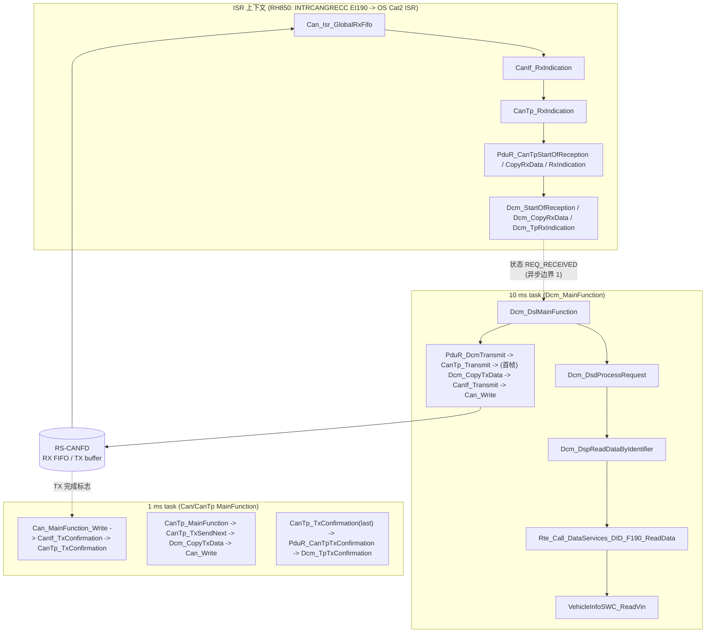
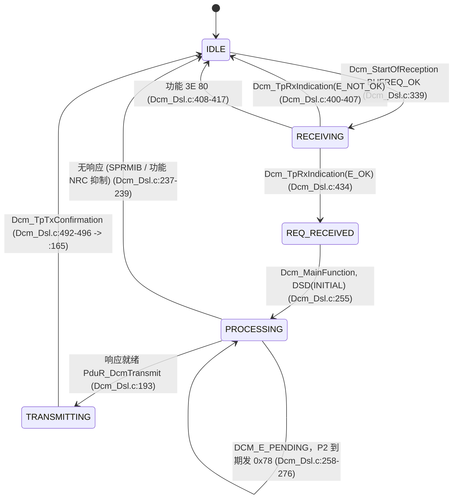
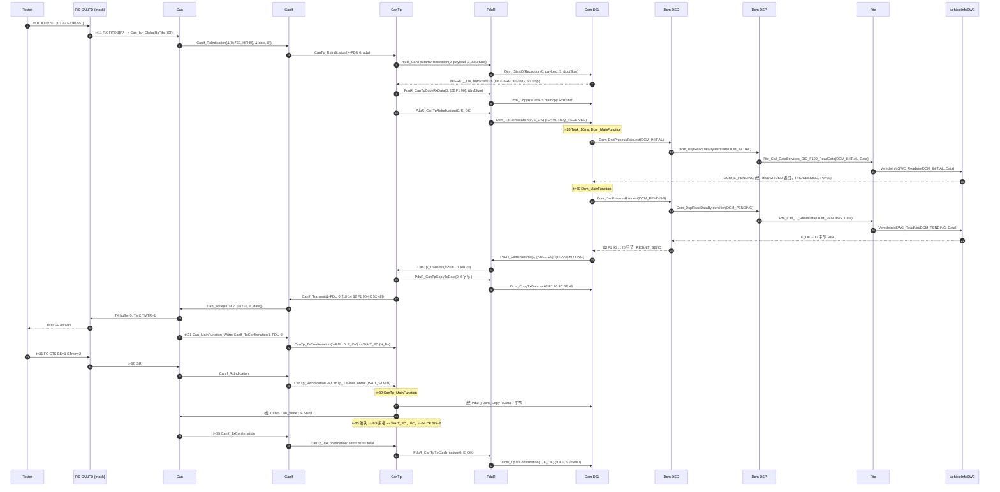
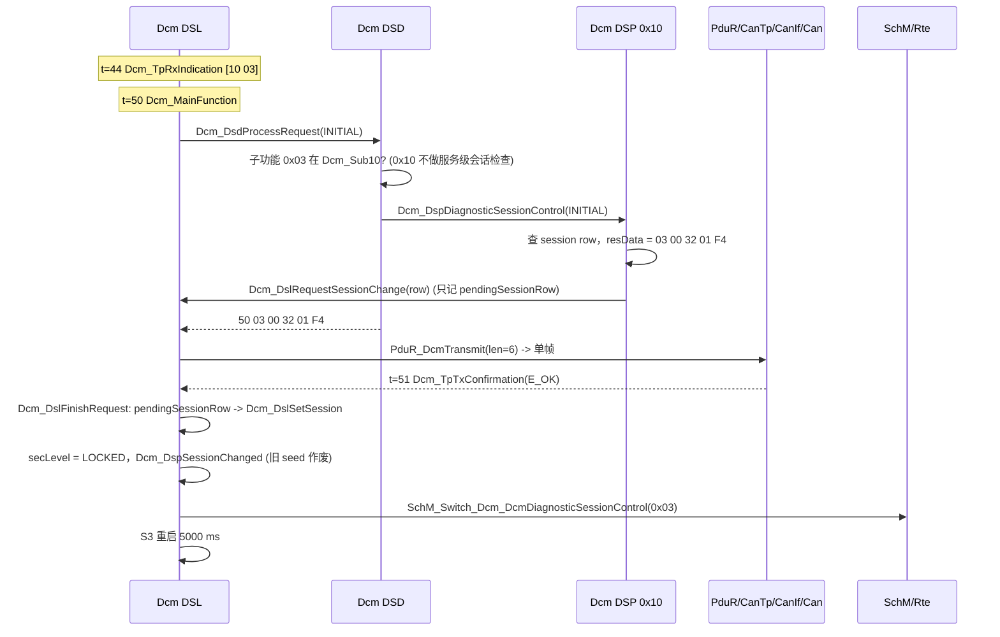
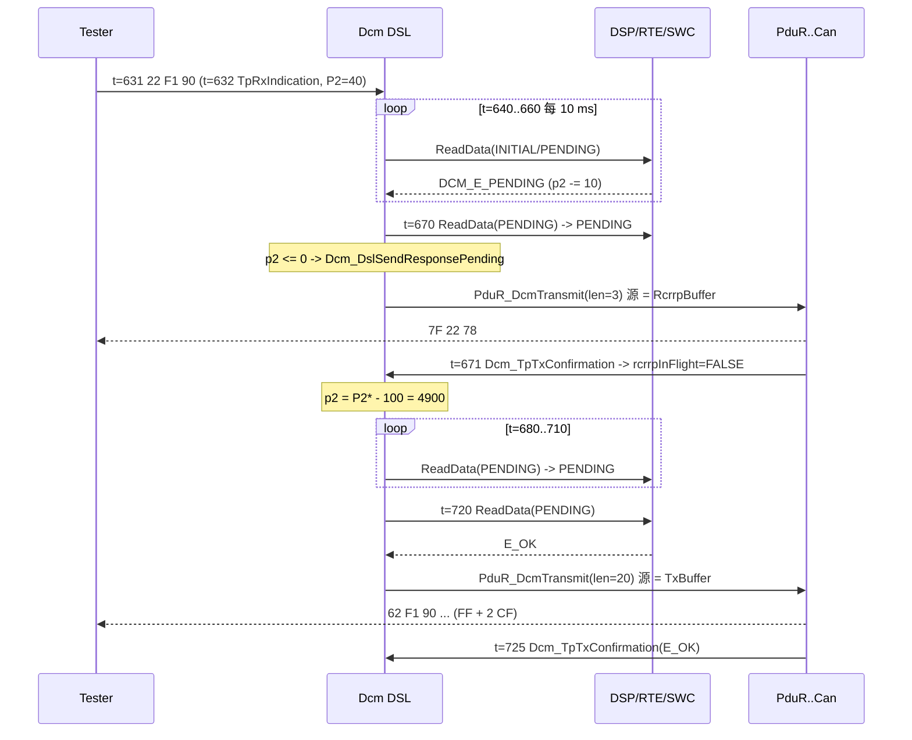

# 11 — DCM Runtime Flow：`22 F1 90` 到达 ECU 后到底经过哪些函数？

> Prerequisite: [02 — DSL](02-dsl.md)、[03 — DSD](03-dsd.md)、[04 — DSP](04-dsp.md)、[08 — DID](08-did.md)、[05-can-stack/03 — CanTp](../05-can-stack/03-cantp.md)、[05-can-stack/05 — PduR](../05-can-stack/05-pdur.md)、[04-can-mcal/12 — CAN 中断实现](../04-can-mcal/12-can-interrupt-implementation.md)
> Next: [12 — Dcm_MainFunction 内部](12-dcm-mainfunction.md)
> 对应规范: AUTOSAR CP **R20-11** SWS DCM（Doc ID 18）：PduR↔Dcm TP 接口 `SWS_Dcm_00094/00556/00093/00092/00351`（p.243–247）、`PduR_DcmTransmit` 用法 `00115`（p.59）、P2/S3 `00024/00141/00353`（p.59–79）、DSD 顺序 `01535`（p.94）、异步 `00527/00530`（p.52）、0x22 p.135–139、0x10 p.114；CAN SWS **R22-11**（`Can_Write`、RX 指示）。CanIf/CanTp/PduR/RTE **本仓库无 SWS**，按公认 R4.x 形态描述并标注。
> 对应源码: 本项目 `examples/uds_diag_demo/`（`mcal/Can.c`、`ecual/CanIf.c`、`com/CanTp.c`、`com/PduR.c`、`diag/Dcm_Dsl.c`、`diag/Dcm_Dsd.c`、`diag/Dcm_Dsp.c`、`rte/Rte_Dcm.c`、`swc/VehicleInfoSWC.c`、`integration/BswScheduler.c`）与真实运行日志 `artifacts/uds-demo/trace.txt`；openAUTOSAR（R3.1.5）`communication/CAN/CanIf/src/CanIf.c`、`communication/CAN/CanTp/src/CanTp.c`、`diagnostic/Dcm/src/Dcm*.c`

---

## 1. 本章目标

这是整个 DCM 部分的**旗舰章节**，回答 `claude_plan.md` §23 的核心问题：

> **`22 F1 90` 到达 ECU 后到底经过哪些函数？**

读完本章，你应该能：

1. 不看资料，按顺序写出从 RH850 CAN RX FIFO 中断到 VIN 正响应发上总线、再到 `Dcm_TpTxConfirmation` 的**每一个函数调用**，并指出它在 demo 中的 `path:line`。
2. 对每一跳说出：调用者、被调者、上下文（ISR / 1 ms task / 10 ms task）、同步还是异步、数据在哪个 buffer、哪个状态变量变了。
3. 把每一跳映射到 R20-11 标准 API、openAUTOSAR（R3.1.5）的对应函数、RH850 硬件动作。
4. 对 `10 03`（会话切换）和 “慢 SW-C 触发 NRC 0x78” 两种情况，说出与 `22 F1 90` 的差异点。

所有时间戳都来自真实运行结果 `artifacts/uds-demo/trace.txt`（`python tools/run_uds_demo.py` 生成；tester 的 FC 参数为 BS=1、STmin=2 ms，见 `integration/main_demo.c:47`）。

---

## 2. 为什么需要把它逐函数走一遍？

因为在真实 ECU 上调试“诊断不响应”时，你手上只有：一个 CANoe trace（总线字节）、一个调试器（断点）、一个 map 文件（符号）。**你必须知道断点应该下在哪里、断下来时应该看到什么**。如果你对正常路径的每一跳都清楚，异常时就能用“二分法”快速定位到断开的那一跳。

另一个原因是：**上下文切换**（ISR → task）、**异步点**（`DCM_E_PENDING`、CanTp 的 FC 等待）、**所有权转移**（buffer 从 CanTp 到 DCM 再回到 CanTp）是最容易出 bug 的地方，而它们只在逐函数追踪时才看得见。

---

## 3. 在系统中的位置：四个执行上下文



| 边界 | 含义 |
|---|---|
| ISR → 10 ms task（虚线 1） | **DCM 不在中断里处理服务**。`Dcm_TpRxIndication` 只把请求标记为完整、启动 P2，真正的 DSD/DSP 在下一个 `Dcm_MainFunction` 里做（`SWS_Dcm_00093` 允许在中断上下文调用 TP 回调；服务处理放在 MainFunction 是 DCM 的设计，详见 [12](12-dcm-mainfunction.md)） |
| 10 ms task → 1 ms task | 首帧在 `Dcm_MainFunction` 里同步发出（demo 的 CanTp 设计）；后续 CF 由 `CanTp_MainFunction` 按 STmin 节奏发出 |
| 硬件 → 1 ms task（虚线） | demo 的 TX 完成是**轮询**（`CanTxProcessing = POLLING`，`mcal/Can.c:219-240`）；配置为中断时，这一段在 TX ISR 中 |

`[Educational Implementation]` demo 是单线程的 host 程序：`integration/BswScheduler.c:25-57` 每 1 ms 调用一次，先模拟 INTC（`:33-35` 有 RX 帧就调 ISR），再跑 1/5/10 ms task。真实 ECU 中 ISR 可以抢占 task，因此需要 exclusive area（见 §13、[12 §9](12-dcm-mainfunction.md)）。

---

## 4. AUTOSAR 如何定义这条链？

### 4.1 PduR ↔ Dcm 的 TP 接口（R20-11 可证）

`[AUTOSAR API]`（`Dcm.h`；R20-11 注明这些回调“可能在中断上下文调用”）

| API | 方向 | 语义 | SWS（页） |
|---|---|---|---|
| `BufReq_ReturnType Dcm_StartOfReception(PduIdType id, const PduInfoType* info, PduLengthType TpSduLength, PduLengthType* bufferSizePtr)` | PduR → Dcm | 一次 TP 接收开始；DCM 决定接不接、报告可用 buffer | `00094` p.243–244 |
| `BufReq_ReturnType Dcm_CopyRxData(PduIdType id, const PduInfoType* info, PduLengthType* bufferSizePtr)` | PduR → Dcm | 把一段数据**拷进** DCM buffer；`SduLength=0` 用于查询剩余空间 | `00556` p.244；`00996` p.57 |
| `void Dcm_TpRxIndication(PduIdType id, Std_ReturnType result)` | PduR → Dcm | 接收结束（成功/失败） | `00093` p.245 |
| `Std_ReturnType PduR_DcmTransmit(PduIdType TxPduId, const PduInfoType* PduInfoPtr)` | Dcm → PduR | 请求发送，**只给长度**（DCM 用法 `00115`，p.59；签名属 PduR SWS，本仓库无 → 公认 R4.x 形态） | — |
| `BufReq_ReturnType Dcm_CopyTxData(PduIdType id, const PduInfoType* info, const RetryInfoType* retry, PduLengthType* availableDataPtr)` | PduR → Dcm | 下层**拉**一段响应数据 | `00092` p.245–246 |
| `void Dcm_TpTxConfirmation(PduIdType id, Std_ReturnType result)` | PduR → Dcm | 整个响应发送完成；停 P2 监控、启动 S3 | `00351` p.247；`00353` p.59 |

**“推收、拉发”模型**：接收时下层把数据 push 给 DCM（`CopyRxData`），发送时 DCM 只告诉下层长度，下层按自己的节奏 pull（`CopyTxData`）。这样 CanTp 不需要缓存整个 4095 字节的响应，只需要 8 字节的帧缓冲。

### 4.2 下层链（本仓库无 SWS，公认 R4.x 形态）

`[Conceptual]` 以下签名来自 demo 源码注释“signature per R4.x convention, confirm against project release”：

```c
void CanIf_RxIndication(const Can_HwType* Mailbox, const PduInfoType* PduInfoPtr);   /* >= R4.2 形态 */
void CanTp_RxIndication(PduIdType RxPduId, const PduInfoType* PduInfoPtr);
Std_ReturnType CanTp_Transmit(PduIdType TxPduId, const PduInfoType* PduInfoPtr);
Std_ReturnType CanIf_Transmit(PduIdType TxPduId, const PduInfoType* PduInfoPtr);
void CanIf_TxConfirmation(PduIdType CanTxPduId);
void CanTp_TxConfirmation(PduIdType TxPduId, Std_ReturnType result);                  /* R4.4 形态 */
```

`Can_Write(Can_HwHandleType Hth, const Can_PduType* PduInfo)` 返回 `E_OK / E_NOT_OK / CAN_BUSY` 来自本仓库 CAN SWS R22-11（研究笔记 02 §2.6）。

---

## 5. 核心数据结构：一次请求经过的 buffer 与状态

| 层 | buffer / 状态 | demo 位置 | 生命周期 |
|---|---|---|---|
| Can | RX FIFO 读出的本地 `frame`（“shadow buffer”）、`Can_TxObj[].busy` | `mcal/Can.c:257-276`、`:211-212` | ISR 栈上 / 直到 TX 完成 |
| CanIf | 只传指针；TX 时复制到 `local[8]`，HTH 忙时进入 CanIf TX 队列 | `ecual/CanIf.c:78-91`、`:116-131` | 调用期间 / 直到 HTH 空闲 |
| CanTp | `CanTp_Rx[]` / `CanTp_Tx[]` runtime（state、timer、sn、bs、stMin、sent、total），TX 帧本地 `frame[8]` | `com/CanTp.c`（`CanTp_TxSendNext` `:328-390`） | 一次 N-SDU 传输 |
| Dcm DSL | `Dcm_DslRxBuffer[128]`、`Dcm_DslTxBuffer[128]`、`Dcm_DslRcrrpBuffer[3]`、`Dcm_DslTpBuffer[2]`、`Dcm_Dsl`（state、rxLen/rxCopied、txLen/txCopied、p2TimerMs、s3TimerMs、sessionRow、secLevel、rcrrp*、msgContext） | `diag/Dcm_Dsl.c:36-76` | 一次请求 / 会话期间 |
| Dcm DSD | `Dcm_DsdActiveService`（当前服务行指针） | `diag/Dcm_Dsd.c:30` | INITIAL 到最终结果 |
| Dcm DSP | `Dcm_DspRdbi`（didIdx、current、currentOpStatus、pos） | `diag/Dcm_Dsp.c:24-30`、`:38` | 跨 `DCM_E_PENDING` |
| `Dcm_MsgContextType` | `reqData = RxBuffer+1`、`resData = TxBuffer+1`、`reqDataLen`、`resMaxDataLen=127`、`idContext=SID`、`reqType` | `diag/Dcm_Types.h:29-38`；填充 `diag/Dcm_Dsl.c:419-427` | 一次请求 |
| SWC | VIN 常量 → 直接写入 `resData[2..18]`（即 `Dcm_DslTxBuffer[3..19]`） | `swc/VehicleInfoSWC.c:93` | — |

DSL 请求状态机（`diag/Dcm_Dsl.c:36-42` 定义，`:20-28` 注释图）：



---

## 6. 初始化前提（第一帧到来之前必须成立的事）

| 前提 | demo 位置 | 缺失时的现象 |
|---|---|---|
| `Can_Init`、接收规则 0x7E0→HRH0、0x7DF→HRH1 | `integration/EcuM.c:28`；trace 第 5–6 行 | 帧根本不进 RX FIFO |
| CanIf/CanTp/PduR 初始化，路由表就绪 | `integration/EcuM.c:30-32` | `CanIf_RxIndication` 丢帧或 DET |
| `Dcm_Init` | `integration/EcuM.c:36` | `Dcm_StartOfReception` 返回 `BUFREQ_E_NOT_OK` + `DCM_E_UNINIT`（`diag/Dcm_Dsl.c:313-316`） |
| `Rte_Start`（SW-C init） | `integration/EcuM.c:37` | SWC 数据未初始化 |
| 控制器 STARTED | `integration/EcuM.c:40`；trace 第 16–19 行（`Can_MainFunction_Mode` 确认） | `CanIf_RxIndication` 丢帧（`ecual/CanIf.c:167-169`）、`CanIf_Transmit` 返回 E_NOT_OK（`:107-109`） |

真实 ECU 中最后一项由 ComM → CanSM → `CanIf_SetControllerMode` 完成（见 [02-autosar-classic/03 — ECU 启动](../02-autosar-classic/03-ecu-startup.md)）。

---

## 7. Runtime Flow：`22 F1 90` 的完整往返

### 7.1 大时序图



### 7.2 逐跳表 ①：调用、上下文、buffer、状态

> 行号均相对 `examples/uds_diag_demo/`；“trace 行”指 `artifacts/uds-demo/trace.txt` 的行号。

**阶段 A — 接收（ISR 上下文，t = 11 ms，trace 第 27–33 行）**

| # | 调用者 → 被调者 | 位置 | 上下文 | 同步/异步 | buffer / 数据 | 状态变化 |
|---|---|---|---|---|---|---|
| A1 | `BswScheduler_Tick1ms` → `Can_Isr_GlobalRxFifo` | `integration/BswScheduler.c:33-35` | 模拟 INTC → ISR | 同步 | 硬件 RX FIFO | —（真实：EI190 进入 OS Cat2 ISR） |
| A2 | `Can_Isr_GlobalRxFifo` → `CanIf_RxIndication(&mailbox, &pdu)` | `mcal/Can.c:255-277`（调用 `:275`） | ISR | 同步 | FIFO → 栈上 `frame`；`mailbox{CanId=0x7E0, Hoh=0, ControllerId}` | FIFO 读指针前进 |
| A3 | `CanIf_RxIndication` → `rx->rxIndication(upperPduId, pdu)` = `CanTp_RxIndication(N-PDU 0)` | `ecual/CanIf.c:160-188`（调用 `:182`）；路由表 `ecual/CanIf_Cfg.c:15-18` | ISR | 同步 | 仅传指针 | —；控制器非 STARTED 时丢弃 `:167-169` |
| A4 | `CanTp_RxIndication` → `CanTp_RxSingleFrame` | `com/CanTp.c:466-499` → `:183` | ISR | 同步 | 解析 PCI `0x03` → SF_DL=3 | — |
| A5 | `CanTp_RxSingleFrame` → `PduR_CanTpStartOfReception(0, payload, 3, &bufSize)` → `Dcm_StartOfReception(0, …)` | `com/CanTp.c:204` → `com/PduR.c:80-90`（路由 `com/PduR_Cfg.c:17-20`）→ `diag/Dcm_Dsl.c:309-349` | ISR | 同步 | `bufferSizePtr ← 128` | DSL `IDLE→RECEIVING`（`:339`）；`rxLen=3`；**S3 停止**（`:343`） |
| A6 | `CanTp_RxSingleFrame` → `PduR_CanTpCopyRxData` → `Dcm_CopyRxData` | `com/CanTp.c:213` → `com/PduR.c:92-99` → `diag/Dcm_Dsl.c:352-381` | ISR | 同步 | `memcpy` 3 字节 → `Dcm_DslRxBuffer`（`:376`） | `rxCopied=3` |
| A7 | `CanTp_RxSingleFrame` → `PduR_CanTpRxIndication(0, E_OK)` → `Dcm_TpRxIndication(0, E_OK)` | `com/CanTp.c:214` → `com/PduR.c:101-109` → `diag/Dcm_Dsl.c:384-438` | ISR | 同步（但**登记后返回**，服务处理异步） | 填 `msgContext`（`:419-427`）：`idContext=0x22`、`reqData=RxBuffer+1`、`reqDataLen=2`、`resData=TxBuffer+1` | `p2TimerMs = 50-10 = 40`（`:433`）；`RECEIVING→REQ_RECEIVED`（`:434`） |

**阶段 B — 处理（10 ms task，t = 20 / 30 ms，trace 第 34–46 行）**

| # | 调用者 → 被调者 | 位置 | 上下文 | 同步/异步 | buffer / 数据 | 状态变化 |
|---|---|---|---|---|---|---|
| B1 | Task_10ms → `Dcm_MainFunction` → `Dcm_DslMainFunction` | `integration/BswScheduler.c:49-50` → `diag/Dcm.c:33-40` → `diag/Dcm_Dsl.c:249` | 10 ms task | 周期 | — | — |
| B2 | DSL → `Dcm_DsdProcessRequest(DCM_INITIAL, &msgContext, TxBuffer, &txLen)` | `diag/Dcm_Dsl.c:254-257` → `diag/Dcm_Dsd.c:144` | 10 ms task | 同步 | — | `REQ_RECEIVED→PROCESSING`（`:255`） |
| B3 | DSD → `Dcm_DsdCheckRequest`：查服务表、会话、安全、长度 | `diag/Dcm_Dsd.c:77-142`（查表 `:64-73`，表 `diag/Dcm_Cfg.c:120`） | 10 ms task | 同步 | — | `Dcm_DsdActiveService = 0x22 行`（`:139`） |
| B4 | DSD → `svc->fnc(DCM_INITIAL, …)` = `Dcm_DspReadDataByIdentifier` | `diag/Dcm_Dsd.c:163` → `diag/Dcm_Dsp.c:264` | 10 ms task | 同步 | 解析 DID `F1 90`，查 `Dcm_Dids[0]` | `Dcm_DspRdbi.numDids=1, current=0, currentOpStatus=INITIAL`（`:328-330`） |
| B5 | DSP → `d->readAsync(DCM_INITIAL, &resData[2])` = `Rte_Call_DataServices_DID_F190_ReadData` | `diag/Dcm_Dsp.c:349` → `rte/Rte_Dcm.c:54-62` | 10 ms task | 同步调用（接口语义异步） | `Data` 指向 `Dcm_DslTxBuffer+3` | — |
| B6 | RTE → server runnable `VehicleInfoSWC_ReadVin(DCM_INITIAL, Data)` | `rte/Rte_Dcm.c:59` → `swc/VehicleInfoSWC.c:77-96` | 10 ms task | 同步 | — | SWC `VinPendingLeft 1→0`，返回 `DCM_E_PENDING`（`:87-92`） |
| B7 | 返回链：DSP `currentOpStatus=DCM_PENDING` → DSD `RESULT_PENDING` → DSL 保持 `PROCESSING` | `diag/Dcm_Dsp.c:351-354` → `diag/Dcm_Dsd.c:164-168` → `diag/Dcm_Dsl.c:240-242` | 10 ms task | — | — | P2 监控：`p2TimerMs 40→30`（`:267-268`） |
| B8 | t=30：DSL → `Dcm_DsdProcessRequest(DCM_PENDING)` → DSP → RTE → SWC | `diag/Dcm_Dsl.c:258-261` → … → `swc/VehicleInfoSWC.c:93-95` | 10 ms task | 同步 | SWC `memcpy` 17 字节 VIN → `TxBuffer[3..19]` | DSD 检查被跳过（`diag/Dcm_Dsd.c:151` 只在 INITIAL） |
| B9 | DSP 完成 → DSD 组正响应 | `diag/Dcm_Dsp.c:360-365` → `diag/Dcm_Dsd.c:176-185` | 10 ms task | 同步 | `TxBuffer[0]=0x62`，`txLen=20` | `Dcm_DsdActiveService=NULL` |
| B10 | DSL → `Dcm_DslTransmitFinal(20)` → `PduR_DcmTransmit(0, {NULL, 20})` | `diag/Dcm_Dsl.c:228-235` → `:187-204`（调用 `:199`） | 10 ms task | 同步请求，数据异步拉取 | `SduDataPtr = NULL_PTR`（`:194`），只给长度 | `PROCESSING→TRANSMITTING`（`:193`），`txCopied=0` |

**阶段 C — 发送（10 ms task 发首帧；之后 1 ms task + ISR，t = 30–35 ms，trace 第 47–76 行）**

| # | 调用者 → 被调者 | 位置 | 上下文 | 同步/异步 | buffer / 数据 | 状态变化 |
|---|---|---|---|---|---|---|
| C1 | `PduR_DcmTransmit` → `CanTp_Transmit(N-SDU 0, len=20)` | `com/PduR.c:67-76`（路由 `com/PduR_Cfg.c:22-25`）→ `com/CanTp.c:392-421` | 10 ms task | 同步 | 20 > 7 → 需 FF | CanTp TX `IDLE→WAIT_DATA`，立即 `CanTp_TxSendNext` |
| C2 | `CanTp_TxSendNext` → `PduR_CanTpCopyTxData(0, 6 字节)` → `Dcm_CopyTxData` | `com/CanTp.c:328-390`（调用 `:365`）→ `com/PduR.c:111-119` → `diag/Dcm_Dsl.c:441-474` | 10 ms task | 同步 | `TxBuffer[0..5]` → CanTp 本地 `frame[2..7]` | `txCopied 0→6`，`available=14` |
| C3 | CanTp → `CanIf_Transmit(L-PDU 0)` → `Can_Write(HTH 2, {0x7E8, 8, [10 14 62 F1 90 4C 52 48]})` | `com/CanTp.c` `CanTp_SendFrame :98` → `ecual/CanIf.c:93-133` → `:78-91` → `mcal/Can.c:171-217` | 10 ms task | 同步，硬件异步 | `frame` → CanIf `local[8]` → 硬件 TX buffer 0 | CanTp `TX_WAIT_CONF`（N_As）；`Can_TxObj[2].busy=TRUE` |
| C4 | t=31：`Can_MainFunction_Write` → `CanIf_TxConfirmation(L-PDU 0)` → `CanTp_TxConfirmation(N-PDU 0, E_OK)` | `integration/BswScheduler.c:39` → `mcal/Can.c:220-240` → `ecual/CanIf.c:136-156` → `com/CanTp.c:501-563` | 1 ms task（轮询） | 同步 | — | FF 已确认 → `TX_WAIT_FC`（N_Bs，`com/CanTp.c:545-549`） |
| C5 | t=32：tester FC 到达 → ISR → `CanIf_RxIndication` → `CanTp_RxIndication` → `CanTp_TxFlowControl` | `mcal/Can.c:275` → `ecual/CanIf.c:182` → `com/CanTp.c:476-484` → `:424-461` | ISR | 同步 | FC `30 01 02` | `bs=1, stMin=2`，`TX_WAIT_STMIN`，timer=0 |
| C6 | t=32：`CanTp_MainFunction` → `CanTp_TxSendNext` → `Dcm_CopyTxData`(7) → `Can_Write`（CF SN=1） | `integration/BswScheduler.c:41` → `com/CanTp.c:590`（`WAIT_STMIN` 分支）→ `:328` | 1 ms task | 同步 | `TxBuffer[6..12]` | `txCopied 6→13` |
| C7 | t=33/34：确认 → BS 用尽 → `WAIT_FC` → 第二个 FC → CF SN=2（7 字节） | 同 C4–C6 | 1 ms task / ISR | — | `TxBuffer[13..19]` | `txCopied 13→20` |

**阶段 D — 发送确认（1 ms task，t = 35 ms，trace 第 77–81 行）**

| # | 调用者 → 被调者 | 位置 | 上下文 | 同步/异步 | 状态变化 |
|---|---|---|---|---|---|
| D1 | `CanTp_TxConfirmation`：`sent(20) >= total(20)` → `PduR_CanTpTxConfirmation(0, E_OK)` | `com/CanTp.c:537-543` | 1 ms task | 同步 | CanTp TX `→IDLE` |
| D2 | `PduR_CanTpTxConfirmation` → `Dcm_TpTxConfirmation(0, E_OK)` | `com/PduR.c:121-129` → `diag/Dcm_Dsl.c:477-497`（`:492-496`） | 1 ms task | 同步 | — |
| D3 | `Dcm_DslFinishRequest(TRUE)` | `diag/Dcm_Dsl.c:163-185` | 1 ms task | 同步 | `TRANSMITTING→IDLE`（`:165`）；无待切会话、无待复位；**S3 重启 5000 ms**（`:182-184`） |

端到端：请求最后一帧到达（11 ms）→ 首个响应帧上线（31 ms）= **20 ms**，其中 9 ms 是“等下一个 `Dcm_MainFunction`”，10 ms 是 SWC 的一次 `DCM_E_PENDING`。trace 结尾的统计 `(after 25 ms, 0 x NRC 0x78 before)` 是从 tester 发出请求（10 ms）到收齐响应（35 ms）。

### 7.3 逐跳表 ②：映射到标准 API / openAUTOSAR / RH850

| # | R20-11 / R4.x 标准接口 | openAUTOSAR（R3.1.5）对应 | RH850 硬件动作 |
|---|---|---|---|
| A1–A2 | Can 驱动 RX 中断处理 → `CanIf_RxIndication`（CAN SWS R22-11 的上层回调） | **缺失**：仓库无 Can 驱动；设计上经 `Can_CallbackType.RxIndication`（`include/Can.h:180`） | INTRCANGRECC（EI190）全局 RX FIFO 中断；读 RFSTSx/RFIDx/RFPTRx/RFDFx，`RFPCTRx=0xFF` 前进（demo 注释 `mcal/Can.c:251-254`；位域需根据实际芯片手册确认，见 [04-can-mcal/11](../04-can-mcal/11-can-rx-implementation.md)） |
| A3 | `CanIf_RxIndication(const Can_HwType*, const PduInfoType*)`（≥R4.2，本仓库无 SWS） | `communication/CAN/CanIf/src/CanIf.c:764`（R3 四参数签名），软件滤波 `:794-822`，分发到 CanTp `:868-878`（**当前配置未接通**） | 硬件接收规则（GAFL）已完成第一级过滤；CanIf 做第二级（HRH+ID） |
| A4 | `CanTp_RxIndication` | `communication/CAN/CanTp/src/CanTp.c:1001` → SF `handleSingleFrame :730` | — |
| A5 | `PduR_CanTpStartOfReception` → `Dcm_StartOfReception`（`SWS_Dcm_00094`） | R3：`PduR_CanTpProvideRxBuffer` → 宏改名为 `Dcm_ProvideRxBuffer`（`PduR_Cfg.h:86`）→ `diagnostic/Dcm/src/Dcm.c:109` → `DslProvideRxBufferToPdur` `Dcm_Dsl.c:682`；S3 停止 `:729` | — |
| A6 | `PduR_CanTpCopyRxData` → `Dcm_CopyRxData`（`00556`） | **无**：R3 模型中 DCM 把整块 buffer“借”给 CanTp，CanTp 直接写入（`CanTp.c:336` `copySegmentToPduRRxBuffer`） | — |
| A7 | `PduR_CanTpRxIndication` → `Dcm_TpRxIndication`（`00093`） | `Dcm_RxIndication`（`Dcm.c:124`，`NotifResultType`）→ `DslRxIndicationFromPduR`（`Dcm_Dsl.c:743`）；P2 起算 `:840`；`DsdDslDataIndication` 只置标志 `:854` → `Dcm_Dsd.c:369-379`；临界区 `Irq_Save/Restore` `:759/:885` | — |
| B1 | `Dcm_MainFunction`（`SWS_Dcm_00053`，p.260） | `Dcm.c:96`：`DsdMain(); DspMain(); DslMain();`（`:100-102`），由 `system/SchM/src/SchM.c:408` 调度 | OS task（由 OSTM 等定时器产生的系统节拍驱动的 alarm/schedule table 激活） |
| B2–B3 | DSD 校验（`01535`） | `DsdHandleRequest` `Dcm_Dsd.c:278`（检查 `:288-309`） | — |
| B4 | DSP 0x22（`00437`） | `selectServiceFunction` `Dcm_Dsd.c:86` → `DspUdsReadDataByIdentifier` `Dcm_Dsp.c:1386` | — |
| B5–B6 | `Rte_Call_DataServices_<Data>_ReadData(OpStatus, Data)`（`91006` p.269）→ SW-C server runnable | **无 RTE**：`didPtr->DspDidReadDataFnc(&tx[pos])`（`Dcm_Dsp.c:1254`），无 OpStatus | — |
| B7–B8 | `DCM_E_PENDING` → 下周期 `DCM_PENDING`（`00530`） | 存请求指针，下次 `DspMain` 从头重跑 handler（`Dcm_Dsp.c:377-384`） | — |
| B9–B10 | DSD 组包 → DSL `PduR_DcmTransmit`（`00115`） | `DsdDspProcessingDone` `Dcm_Dsd.c:342` → `DslDsdProcessingDone` → 同一 MainFunction 末尾 `DslMain` 中 `PduR_DcmTransmit` `Dcm_Dsl.c:596`（宏改名为 `CanTp_Transmit`，`PduR_Cfg.h:127`） | — |
| C1 | `CanTp_Transmit` | `CanTp.c:892`：**只登记**，下一个 `CanTp_MainFunction` 才发（`:1204-1205`） | — |
| C2 | `PduR_CanTpCopyTxData` → `Dcm_CopyTxData`（`00092`） | R3：`Dcm_ProvideTxBuffer`（`Dcm.c:174`）→ `DslProvideTxBuffer`（`Dcm_Dsl.c:899`），借出整块 TX buffer | — |
| C3 | `CanIf_Transmit` → `Can_Write`（CAN R22-11） | `CanIf.c:424` → `Can_Write(HTH, &canPdu)` `:470`（**未定义**） | 写 TMIDp / TMPTRp / TMDF0_p / TMDF1_p，置 `TMCp.TMTR=1`（demo 注释 `mcal/Can.c:208-209`；需根据实际芯片手册确认） |
| C4 | `Can_MainFunction_Write`（轮询）或 TX ISR → `CanIf_TxConfirmation` → `CanTp_TxConfirmation` | `CanIf.c:743` → 配置函数指针 `:758` → `CanTp.c:1111` | 读 `TMSTSp.TMTRF`（demo 注释 `mcal/Can.c:229-230`） |
| C5–C7 | ISO 15765-2 FC/CF 处理 | `handleFlowControlFrame` `CanTp.c:684-710`，STmin `:668-678` | — |
| D1–D3 | `PduR_CanTpTxConfirmation` → `Dcm_TpTxConfirmation`（`00351`）；停 P2（`00353`）、起 S3（`00141`） | `Dcm_TxConfirmation`（`Dcm.c:188`）→ `DslTxConfirmation`（`Dcm_Dsl.c:950`）→ `startS3SessionTimer` `:969` → `DsdDataConfirmation` `:973` → `DspDcmConfirmation` `Dcm_Dsp.c:1968` | — |

### 7.4 三个“异步边界”

1. **ISR → MainFunction**（A7 → B1）：最坏延迟 ≈ 一个 `DcmTaskTime`。这部分时间也在 P2 预算内（P2 从 `Dcm_TpRxIndication` 起算）。
2. **`DCM_E_PENDING`**（B6 → B8）：每次 pending 至少多一个 `DcmTaskTime`。
3. **ISO-TP 流控**（C3 → C7）：响应超过 7 字节就要等 tester 的 FC；tester 的 BS/STmin 直接决定总耗时。这段时间**不在** P2 内（P2 只约束“第一帧响应”何时开始，`Dcm_TpTxConfirmation` 后才停止 P2 监控是为了不在发送中途误发 0x78，`SWS_Dcm_00353`）。

---

## 8. 对比 1：`10 03`（会话切换在发送确认之后）

trace 第 130–162 行。



| 差异点 | 位置 | 规范依据 | 为什么 |
|---|---|---|---|
| DSP 不直接切会话，只记 `pendingSessionRow` | `diag/Dcm_Dsp.c:138` → `diag/Dcm_Dsl.c:124-127` | `SWS_Dcm_00311`（p.114）“send confirmation function shall set the new session” | 若响应发送失败，ECU 不应进入新会话；且正响应本身应按“旧会话”的时序发出 |
| 响应携带**新会话**的 P2/P2\* | `diag/Dcm_Dsp.c:130-136` | ISO 14229-1 | tester 据此更新自己的超时 |
| 确认后切换、锁定安全级、通知模式用户 | `diag/Dcm_Dsl.c:166-172` → `:108-122` | `00311`、`00139`（p.74） | BswM / SW-C 通过 mode 感知会话（例如 SWC `Rte_Mode_*`，`rte/Rte_Dcm.c:141-144`） |
| 发送失败（`E_NOT_OK`）时不切换 | `diag/Dcm_Dsl.c:169`（`if (responseOk)`） | — | — |
| 没有 RTE `Rte_Call`，只有 mode switch | — | — | 会话属于 DCM 自己的状态 |

openAUTOSAR 对照：`DspUdsDiagnosticSessionControl`（`Dcm_Dsp.c:469`）在处理中**立即** `DslSetSesCtrlType`（`:487`），确认后只通知 `Dcm_DiagnosticSessionControl`（`:1985-1990`）——这是 R3 实现与 R20-11 推荐时序的典型差异（研究笔记 03 §4.2）。

---

## 9. 对比 2：慢 SW-C 与 NRC 0x78（response pending）

trace 第 611–720 行（`VehicleInfoSWC_SetVinPendingCycles(8)`，`integration/main_demo.c:99`）。

### 9.1 P2 计时器逐周期表

| t (ms) | 事件 | `p2TimerMs`（之后） | DSL 状态 | 位置 |
|---|---|---|---|---|
| 632 | `Dcm_TpRxIndication(E_OK)` | 40（= 50 − 10 adjust） | REQ_RECEIVED | `diag/Dcm_Dsl.c:433` |
| 640 | DSD(INITIAL) → SWC PENDING (7 more) | 30 | PROCESSING | `:254-257`、`:267-268` |
| 650 | DSD(PENDING) → PENDING | 20 | PROCESSING | `:258-261` |
| 660 | PENDING | 10 | PROCESSING | — |
| 670 | PENDING；`p2TimerMs ≤ 0` → **发 `7F 22 78`**（#1，独立 buffer） | 4900（= 5000 − 100 adjust） | PROCESSING，`rcrrpInFlight=TRUE` | `:269-276` → `Dcm_DslSendResponsePending :206-224` |
| 671 | `Dcm_TpTxConfirmation`（0x78） | 4900 | PROCESSING，`rcrrpInFlight=FALSE` | `:482-491` |
| 680…710 | PENDING ×4 | 4890…4860 | PROCESSING | — |
| 720 | SWC `E_OK` → 正响应 20 字节 | — | TRANSMITTING | `:228-235` |
| 725 | `Dcm_TpTxConfirmation(E_OK)` | — | IDLE，S3 重启 | `:492-496` |

注意两点：

- **0x78 在请求完成后 38 ms 发出**，不是 40 ms，也不是 50 ms：计时器从 `TpRxIndication` 赋值，但只在 `Dcm_MainFunction` 中、且状态为 `PROCESSING` 时递减，粒度是 `DcmTaskTime`。详细的精度分析见 [12 §7](12-dcm-mainfunction.md)。
- 0x78 用 `Dcm_DslRcrrpBuffer[3]` 发送（`SWS_Dcm_00119`，p.61），**不碰** `Dcm_DslTxBuffer`——因为 SWC 可能正往 TX buffer 里写数据。`Dcm_CopyTxData` 根据 `rcrrpInFlight` 选择源 buffer（`diag/Dcm_Dsl.c:451-458`）。

### 9.2 时序



| Transition | 规范 | 说明 |
|---|---|---|
| P2 − adjust 到期 → 0x78 | `SWS_Dcm_00024`（p.61）；adjust `ECUC_Dcm_00729/00728`（p.466–467） | adjust 补偿“DCM 发起发送 → 帧真正上线”的软件延迟 |
| 独立 buffer | `00119`（p.61） | — |
| 0x78 之后使用 P2\* | `00024` | tester 收到 0x78 后改用 P2\*client 等待 |
| 0x78 发送中最终响应就绪 → 等 0x78 确认后再发 | demo `diag/Dcm_Dsl.c:230-233`（`finalWaiting`）、`:487-490` | 同一 TX N-SDU 不能同时发两个消息（`CanTp_Transmit` 会拒绝 busy） |
| 0x78 次数上限 → `DCM_CANCEL` + 0x10 | `00120`（p.111）；`DcmDslDiagRespMaxNumRespPend`（`ECUC_Dcm_00693`，p.460），未配置 = 无限（`01567`，p.62） | demo `diag/Dcm_Dsl.c:270`、`:277-285`，上限 `diag/Dcm_Cfg.h:25`（20） |
| 0x78 后 SPRMIB / 功能寻址抑制失效 | `00203`（p.94） | `diag/Dcm_Dsd.c:54-55`、`:177` |

`[Real Project Consideration]` 若 SWC 返回 `DCM_E_FORCE_RCRRP`，DCM 立即发 0x78 并在确认后以 `DCM_FORCE_RCRRP_OK` 再调用（`00528/00529`，p.52）——demo 未实现，但真实项目中 flash 擦除类 routine 常用它。

---

## 10. RH850 Hardware Mapping：链条的两端

`[RH850 Hardware]`（研究笔记 04；寄存器位域以 P1M-E 硬件手册为准，下列名称来自 demo 注释与 [04-can-mcal](../04-can-mcal/02-rh850-can-peripheral.md) 章节）

| 链条位置 | RH850/P1M-E RS-CANFD | 注意 |
|---|---|---|
| 第一跳之前 | 接收规则表（GAFLIDj/GAFLMj/GAFLP0j/GAFLP1j）把 0x7E0 匹配到 RX FIFO 并带 label（demo 的 label = HRH） | P1M-E 上 GAFLM 位 = 1 表示“比较” |
| A1 | INTRCANGRECC（EI190，RX FIFO 中断）；**不是** EI184（CAN0 common FIFO） | 中断优先级、EIC 配置由 OS/集成者决定 |
| A2 | ISR 中循环读 FIFO 直到空，最后清中断标志（`SWS_Can_00420` 思路，demo `mcal/Can.c:251-254` 注释） | 一次中断可能带来多帧 |
| C3 | TX buffer p：写 ID/DLC/数据，置 TMCp.TMTR | `Can_Write` 返回 `CAN_BUSY` 时 CanIf 缓冲（`ecual/CanIf.c:116-131`） |
| C4 | TX 完成：TMSTSp.TMTRF（轮询）或 TX 中断 | demo 用轮询（1 ms），真实项目两种都常见 |
| B1 的节拍 | OS 系统定时器（例如 OSTM）→ counter → alarm → 10 ms task | OSTM0/1 的归属是配置选择 |

---

## 11. openAUTOSAR 整链对照（R3.1.5）

把 §7.3 的 openAUTOSAR 列串起来，就是研究笔记 03 §3.1–§3.2 的链：

```text
[Can ISR: 缺失] → CanIf_RxIndication            CanIf.c:764
  → CanTp_RxIndication → handleSingleFrame      CanTp.c:1001 → :730
  → Dcm_ProvideRxBuffer (PduR 宏)                Dcm.c:109 → Dcm_Dsl.c:682
  → Dcm_RxIndication → DslRxIndicationFromPduR   Dcm.c:124 → Dcm_Dsl.c:743 (P2 :840, 置标志 :854)
Dcm_MainFunction: DsdMain → DspMain → DslMain   Dcm.c:96 (:100-102)
  → DsdHandleRequest → selectServiceFunction     Dcm_Dsd.c:278 → :86
  → DspUdsReadDataByIdentifier → ReadDataFnc     Dcm_Dsp.c:1386 → :1254
  → DsdDspProcessingDone → DslMain: PduR_DcmTransmit = CanTp_Transmit   Dcm_Dsd.c:342 → Dcm_Dsl.c:596
CanTp_MainFunction: sendNextTxFrame → Dcm_ProvideTxBuffer → CanIf_Transmit → Can_Write(缺失)
  CanTp.c:1204 → :583 → Dcm_Dsl.c:899 → CanIf.c:424 → :470
CanIf_TxConfirmation → CanTp_TxConfirmation → Dcm_TxConfirmation → DslTxConfirmation
  CanIf.c:743 → CanTp.c:1111 → Dcm.c:188 → Dcm_Dsl.c:950
```

与 demo / R20-11 的三处本质差异：(1) R3 “借 buffer” vs R4 “拷贝 + 拉取”；(2) 无 RTE、无 OpStatus；(3) 在当前仓库配置下这条链**接不通**（CanIf 未接 CanTp、`DCM_Config` 缺失、`DCM_USE_SERVICE_*` 未定义 → 全部 0x11，研究笔记 03 §3.3）。

---

## 12. Debug 方法（按跳二分）

把 §7.2 的表当成断点清单。正常情况下，下面每个断点都会**按顺序**命中一次（`22 F1 90` 单帧请求）：

| 顺序 | 断点 | 命中时应看到 | 没命中说明 |
|---|---|---|---|
| 1 | `mcal/Can.c:255` `Can_Isr_GlobalRxFifo` | FIFO 中有 ID 0x7E0 | 硬件/接收规则/中断使能问题 → [04-can-mcal/15](../04-can-mcal/15-can-driver-debugging.md) |
| 2 | `ecual/CanIf.c:182` | `rx->name == "DiagPhysReq_7E0"` | CanIf 路由表（HRH、ID）或控制器模式 |
| 3 | `com/CanTp.c:204` | `len == 3` | PCI 解析 / N-PDU 映射 |
| 4 | `diag/Dcm_Dsl.c:309` | `id == 0`、`TpSduLength == 3`、`Dcm_Dsl.state == IDLE` | PduR 路由表 |
| 5 | `diag/Dcm_Dsl.c:434` | `Dcm_DslRxBuffer = 22 F1 90` | `TpRxIndication` 以 `E_NOT_OK` 到达 / 状态不对 |
| 6 | `diag/Dcm_Dsl.c:256` | ≤ 10 ms 后命中 | `Dcm_MainFunction` 没被调度 |
| 7 | `diag/Dcm_Dsd.c:163` | `Dcm_DsdActiveService->sid == 0x22` | DSD 拒绝（看 txBuffer 中的 NRC） |
| 8 | `rte/Rte_Dcm.c:59` | `OpStatus == DCM_INITIAL` | DID 未配置 / 被跳过 |
| 9 | `diag/Dcm_Dsl.c:199` | `length == 20` | 一直 PENDING |
| 10 | `diag/Dcm_Dsl.c:441` | 第一次 `info->SduLength == 6` | CanTp 未接受发送 |
| 11 | `diag/Dcm_Dsl.c:477` | `result == E_OK` | 流控失败（N_Bs 超时）→ `E_NOT_OK` |

详见 [13 — DCM Debugging](13-dcm-debugging.md)。

---

## 13. 常见错误

1. **在 `Dcm_TpRxIndication` 里直接处理服务**（自写 DCM 时常见）：ISR 时间暴涨；SWC runnable 在中断上下文运行，违反 RTE 映射；与 `Dcm_MainFunction` 并发访问状态。
2. **ISR 与 MainFunction 共享状态没有保护**：真实 ECU 上 `Dcm_TpRxIndication`（ISR）写 `state`，`Dcm_MainFunction`（task）读写 `state`——必须用 `SchM_Enter_Dcm_<ExclusiveArea>` / `SchM_Exit_…`。demo 单线程，省略了（`rte/SchM_Dcm.h:5-10` 注释）；openAUTOSAR 用 `Irq_Save/Irq_Restore`（`Dcm_Dsl.c:759/:885`）。
3. **以为 `PduR_DcmTransmit` 返回 E_OK 就发出去了**：只代表 CanTp 接受了发送请求；数据是之后拉的，结果以 `Dcm_TpTxConfirmation` 为准。
4. **混淆三套 PduId**：`DcmRxPduId 0`、CanTp N-PDU 0、CanIf L-PDU 0、HRH 0 各自独立（demo README §3.1）。
5. **把 FC 等待时间算进 P2**：P2 只约束响应开始；多帧响应的总时间由 tester 的 BS/STmin 与 N_Bs/N_Cr 决定。

---

## 14. 实验（只运行与观察，不修改 demo 源码）

1. **逐行对照**：打开 `artifacts/uds-demo/trace.txt` 第 23–82 行，为每一行 trace 写出 §7.2 表中的跳号（A1…D3）。哪几跳**没有** trace 行？（提示：`Dcm_CopyRxData`、`Dcm_CopyTxData` 没有打印。）
2. **数函数调用**：只看 `22 F1 90` 这一次请求，统计 `Dcm_CopyTxData` 被调用了几次、每次几字节（6/7/7）。与 `com/CanTp.c:337-358` 的 payloadLen 计算对应。
3. **对比 `22 F1 87`**（trace 第 85–127 行）：为什么它没有 `DCM_E_PENDING`，但 DSD 仍然是在 `Dcm_MainFunction`（40 ms）而不是在 RX ISR（36 ms）中执行？
4. **对比 `10 03`**（trace 第 130–162 行）：找到 `session DefaultSession -> ExtendedDiagnosticSession` 这行，确认它在 `TpTxConfirmation` 之后。
5. **0x78**：在 trace 第 611–720 行中，找出 `p2TimerMs` 到期的那一周期，并解释 0x78 与最终响应之间的 `ReadData(DCM_PENDING)` 次数。
6. 用调试器（gcc + gdb 编译 `tests/test_uds_demo.c` 等源文件，命令参考 `artifacts/uds-demo/results.txt` 中记录的编译命令）在 §12 的 11 个断点上依次停下，记录调用栈深度。哪一跳的栈最深？为什么？

---

## 15. 思考题

1. 如果 CanTp 的 `CanTp_Transmit` 像 openAUTOSAR 那样只登记、在下一个 `CanTp_MainFunction` 才发首帧，本例的“请求→首个响应帧”延迟会变成多少？（CanTp 周期 1 ms vs 25 ms 两种情况。）
2. `Dcm_StartOfReception` 返回 `BUFREQ_OK` 但 `bufferSizePtr` 小于 SF 长度，CanTp 应该怎么做？看 `com/CanTp.c:209-212`。
3. 为什么 R4 要从 “ProvideRxBuffer 借 buffer” 改成 “CopyRxData 拷贝”？从 buffer 所有权、并发、网关（PduR 一对多路由）三个角度回答。
4. tester 在 ECU 还处于 `TRANSMITTING` 时又发了一个新请求，demo 的 `Dcm_StartOfReception` 返回什么？R20-11 的哪条需求规定了这个行为？（`diag/Dcm_Dsl.c:324-333`，`SWS_Dcm_00557` p.56。）
5. 为什么 `Dcm_TpRxIndication` 而不是 `Dcm_StartOfReception` 是 P2 的起点？

---

## 16. 对未来真实项目的意义

- 在 RTA-CAR 或其它商业栈里，**DCM 内部函数名一定不同**，但下列符号是标准的、一定存在且可以下断点：`CanIf_RxIndication`、`CanTp_RxIndication`、`PduR_CanTpStartOfReception`、`Dcm_StartOfReception`、`Dcm_CopyRxData`、`Dcm_TpRxIndication`、`Dcm_MainFunction`、`Rte_Call_DataServices_*`（或生成的等价 wrapper）、`PduR_DcmTransmit`、`CanTp_Transmit`、`Dcm_CopyTxData`、`CanIf_Transmit`、`Can_Write`、`CanIf_TxConfirmation`、`Dcm_TpTxConfirmation`。本章的跳序就是在真实 ECU 上应该看到的顺序。
- 真实 MCAL（例如目标环境截图中的 Renesas P1M MCAL，AR 4.2.2 API）可能使用不同的回调形态；中间若有 PduR 网关、SecOC、多核 IOC，跳数会更多——需在真实项目环境中确认，但“推收、拉发、ISR 登记、MainFunction 处理、确认后生效”这五个模式不变。
- DCM 升级时，这条链上每一个接口的签名（R3 → R4 的 TP API、`NotifResultType` → `Std_ReturnType`、`CanIf_RxIndication` 参数）都是检查项；本章表 ② 就是升级影响分析的模板（见 [DCM 升级指南](../dcm-upgrade-guide.md)）。

---

## 17. 本章总结

- `22 F1 90` 的路径：ISR 中 Can → CanIf → CanTp → PduR → `Dcm_StartOfReception/CopyRxData/TpRxIndication`；下一个 `Dcm_MainFunction` 中 DSL → DSD → DSP → `Rte_Call_DataServices_DID_F190_ReadData` → SWC；响应经 `PduR_DcmTransmit`（只给长度）→ CanTp 用 `Dcm_CopyTxData` 拉数据 → CanIf → `Can_Write`；最后 `Dcm_TpTxConfirmation` 结束请求、启动 S3。
- 三个异步边界：ISR→MainFunction、`DCM_E_PENDING`、ISO-TP 流控。
- `10 03`：会话在 TxConfirmation 之后切换并锁定安全级；0x78：P2−adjust 到期由 DSL 用独立 buffer 发出，之后用 P2\*。

## 18. 下一章

[12 — Dcm_MainFunction 内部：计时器、周期选择与调度](12-dcm-mainfunction.md)
