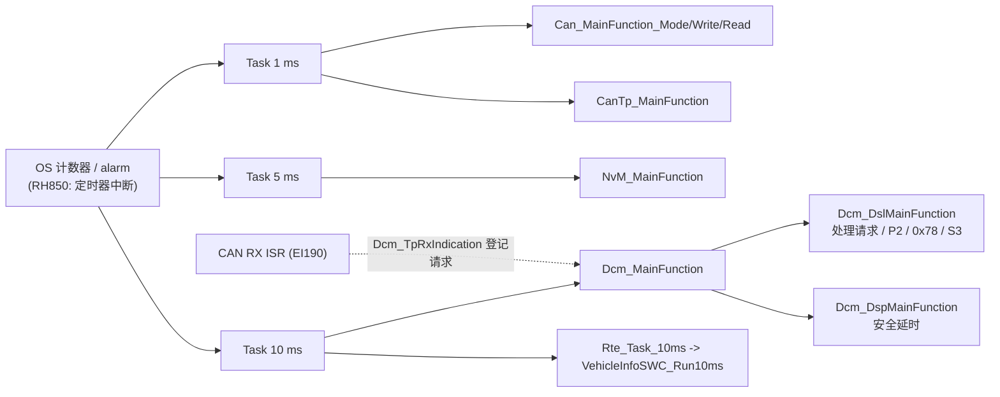
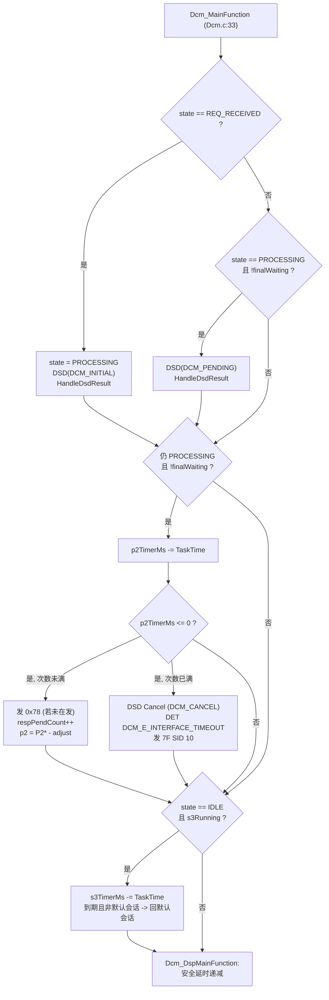
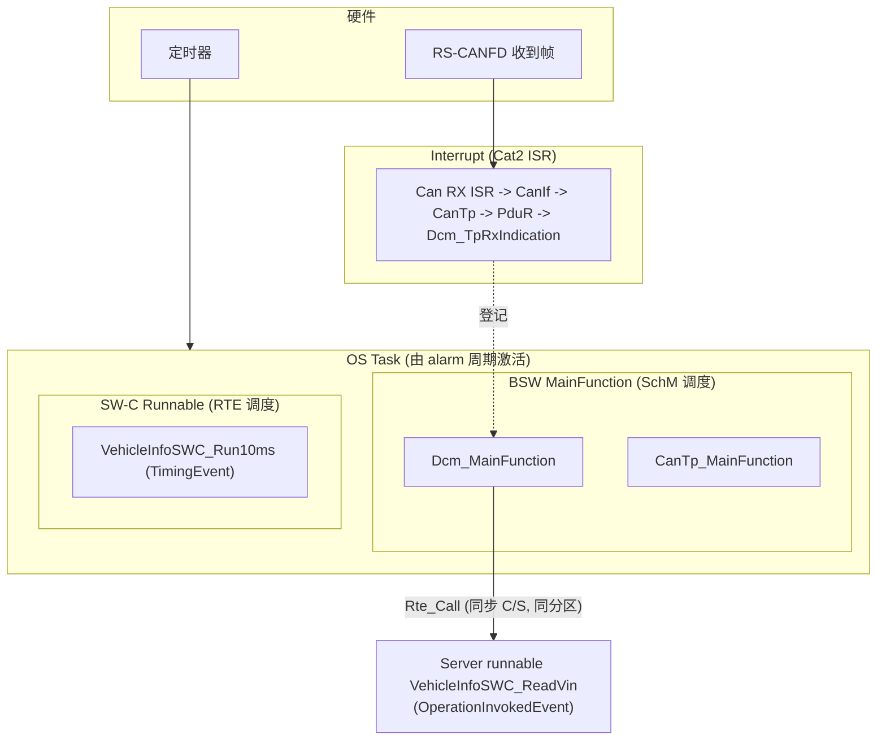

# 12 — Dcm_MainFunction 内部：计时器、逐周期状态推进、周期选择与 OS 调度

> Prerequisite: [02-autosar-classic/06 — OS Task / ISR](../02-autosar-classic/06-os-task-isr.md)、[02-autosar-classic/07 — MainFunction 调度](../02-autosar-classic/07-mainfunction-scheduling.md)、[02 — DSL](02-dsl.md)、[11 — Runtime Flow](11-dcm-runtime-flow.md)
> Next: [13 — DCM Debugging](13-dcm-debugging.md)
> 对应规范: AUTOSAR CP **R20-11** SWS DCM（Doc ID 18）：`Dcm_MainFunction` `SWS_Dcm_00053`（p.260–261）；`DcmTaskTime` `ECUC_Dcm_00820`（p.678）；P2/P2\*/S3 `00027/00143/00144`（p.79–83）、`00024/00119/00120`（p.61、p.111）、`00140/00141`（p.78–79）、`00353`（p.59）；`DcmTimStrP2ServerAdjust` `ECUC_Dcm_00729`（p.466）、`…P2StarServerAdjust` `00728`（p.467）；`DcmDslDiagRespMaxNumRespPend` `00693`（p.460）；异步重入 `00527/00530`（p.52）。OS / SchM / RTE **本仓库无 SWS**，按概念描述。
> 对应源码: 本项目 `examples/uds_diag_demo/diag/Dcm.c:33-40`、`diag/Dcm_Dsl.c:249-302`、`diag/Dcm_Dsp.c:86-100`、`integration/BswScheduler.c:25-57`；openAUTOSAR（R3.1.5）`diagnostic/Dcm/src/Dcm.c:96-103`、`Dcm_Dsl.c:523-620`、`system/SchM/src/SchM.c:379-422`

---

## 1. 本章目标

1. 说出 `Dcm_MainFunction` 每一次被调用时**做了哪几件事、按什么顺序**（demo 与 openAUTOSAR 两种实现）。
2. 列出 DCM 里所有“以 MainFunction 为时基”的计时器（P2、P2\*、S3、安全延时、0x78 计数），并能计算它们的**实际精度**。
3. 根据 P2ServerMax、下层发送延迟、CPU 负载，**论证** `DcmTaskTime` 应该选多少，`DcmTimStrP2ServerAdjust` 应该配多少。
4. 解释 `Dcm_MainFunction` 与 `CanTp_MainFunction`、`NvM_MainFunction`、SW-C runnable 在同一 OS task / 不同 task 中的**先后顺序**会造成什么差异。
5. 用一张表区分诊断链路中的 Interrupt、OS Task、BSW MainFunction、Runnable。

通用的调度概念（OS task、alarm、最坏响应时间计算）在 [02-autosar-classic/07](../02-autosar-classic/07-mainfunction-scheduling.md) 已经讲过，本章只讲 **DCM 自己**。

---

## 2. 为什么 DCM 需要一个 MainFunction？

1. **协议是“按时间”的**：P2、P2\*、S3、安全访问延时、周期 DID（0x2A）、ROE——这些都需要一个稳定的时基。DCM 没有自己的硬件定时器，`Dcm_MainFunction` 的调用周期就是它的时钟。
2. **服务处理不能放在中断里**：TP 回调可能在 ISR 上下文调用（R20-11 p.243–247），而服务处理会调用 SW-C、DEM、NvM，耗时不可控。DSL 在回调中只“登记”，处理留给 MainFunction（见 [11 §3](11-dcm-runtime-flow.md)）。
3. **异步操作需要“轮询点”**：`DCM_E_PENDING` 的语义就是“下个 MainFunction 再来问我”（`SWS_Dcm_00530`，p.52）。

---

## 3. 在系统中的位置



| 关系 | demo 位置 | 说明 |
|---|---|---|
| 1 ms task 内容 | `integration/BswScheduler.c:37-41` | Can 轮询 + CanTp 计时与 CF 节奏 |
| 5 ms task | `integration/BswScheduler.c:43-46` | NvM 作业推进 |
| 10 ms task | `integration/BswScheduler.c:48-52` | **先** `Dcm_MainFunction`（`:50`）**后** SW-C runnable（`:51`） |
| ISR | `integration/BswScheduler.c:33-35` | 每个 tick 开头、所有 task 之前 |
| `Dcm_MainFunction` 本体 | `diag/Dcm.c:33-40` | 未初始化直接返回；`Dcm_DslMainFunction()` → `Dcm_DspMainFunction()` |

---

## 4. AUTOSAR 如何定义？

`[AUTOSAR Standard]`

| 需求 / 参数 | 内容 | 页 |
|---|---|---|
| `SWS_Dcm_00053` `void Dcm_MainFunction(void)` | SID 0x25；在 `SchM_Dcm.h` 中声明；由 BSW Scheduler **周期**调用；**不可重入** | p.260–261 |
| `DcmTaskTime`（`ECUC_Dcm_00820`） | MainFunction 周期，单位秒（float）；**“This configuration value shall be equal to the value in the RTE module”**；必须 > 0；每个配置恰好一个 | p.678 |
| `DcmTimStrP2ServerAdjust`（00729） | 为保证响应在 P2 之前到达总线而对 P2ServerMax 的“提前量”，代表 DCM 发起发送到报文真正上线之间的软件延迟；**必须是 `DcmTaskTime` 的整数倍**；范围 0..1 s | p.466 |
| `DcmTimStrP2StarServerAdjust`（00728） | 同上，作用于 P2\* | p.467 |
| `SWS_Dcm_00024` | 在 `P2ServerMax − adjust`（或 `P2*ServerMax − adjust`）时仍未完成 → 发 0x78 | p.61 |
| `SWS_Dcm_00143` | P2min = P2\*min = 0；**S3Server 固定 5 s** | p.79 |
| `SWS_Dcm_00144` | 协议启动时从默认会话行加载 P2/P2\* | p.83 |
| `SWS_Dcm_00141` | S3：开始接收请求时停止；最终响应发完 / 无需响应的处理完 / 接收出错时重启 | p.79 |
| `SWS_Dcm_00353` | `Dcm_TpTxConfirmation` 后停止 P2/P2\* 监控 | p.59 |
| `SWS_Dcm_00120` / `DcmDslDiagRespMaxNumRespPend`（00693） | 0x78 次数用尽 → `DCM_CANCEL` + 0x10；未配置 = 无限（`01567` p.62） | p.111、p.460 |
| `CONSTR_6074` | 例：`DcmDspSecurityMaxAttemptCounterReadoutTime` 必须是 `DcmTaskTime` 的整数倍 | p.75 |

**规范没有规定的**：MainFunction 内部 DSL/DSD/DSP 的先后顺序（子模块划分本身就“不强制”，p.50）。所以不同实现的“同一周期内能完成多少事”可能不同——这正是 demo 与 openAUTOSAR 的差异之一（§7.1）。

---

## 5. 核心数据结构：所有以 MainFunction 为时基的计时器

| 计时器 | demo 变量 | 单位 / 递减点 | 何时启动 | 到期动作 |
|---|---|---|---|---|
| P2 / P2\* | `Dcm_Dsl.p2TimerMs`（`diag/Dcm_Dsl.c:61` 附近结构体成员） | ms，每次 `DCM_TASK_TIME_MS`，仅在 `PROCESSING` 且未 `finalWaiting` 时（`:267-268`） | `Dcm_TpRxIndication`：P2 − adjust（`:433`）；发 0x78 后：P2\* − adjust（`:276`） | 发 0x78；次数用尽 → CANCEL + 0x10（`:270-285`） |
| 0x78 次数 | `Dcm_Dsl.respPendCount` | 次 | 每个请求清零（`:430`） | 与 `DCM_DSL_MAX_NUM_RESP_PEND`（`diag/Dcm_Cfg.h:25`，20）比较 |
| S3 | `Dcm_Dsl.s3TimerMs` / `s3Running` | ms，仅在 `IDLE` 时递减（`:290-291`） | 请求结束（`:182-184`）、接收失败（`:404-405`）、功能 3E 80（`:414-415`） | 非默认会话 → 回默认会话（`:294-299`） |
| 安全延时 | `Dcm_DspSec.delayMs[]`（`diag/Dcm_Dsp.c:40`，类型 `:32-36`） | ms，每次递减（`diag/Dcm_Dsp.c:86-100`） | 错 key 次数达到 `numAttDelay`（`:468-470`） | 计数器清零（`SWS_Dcm_01357`） |

`[Educational Implementation]` demo 用“毫秒值减 `DCM_TASK_TIME_MS`”的写法（`diag/Dcm_Cfg.h:20`，10 ms），可读性好；openAUTOSAR 用“预先换算成周期数再递减”（`DCM_CONVERT_MS_TO_MAIN_CYCLES(x) ((x)/DCM_MAIN_FUNCTION_PERIOD_TIME_MS)`，`diagnostic/Dcm/src/Dcm_Dsl.c:38`）。两者等价，但后者有**整数除法截断**陷阱：若 P2 = 25 ms、周期 10 ms，换算成 2 个周期 = 20 ms，悄悄比配置值短。

---

## 6. 初始化流程

| 步骤 | demo | openAUTOSAR |
|---|---|---|
| `Dcm_Init` 之前被调用 | `Dcm_CfgPtr == NULL_PTR` → 直接返回（`diag/Dcm.c:35-37`） | `VALIDATE_NO_RV(dcmState == DCM_INITIALIZED, …, DCM_E_UNINIT)`（`diagnostic/Dcm/src/Dcm.c:98`）→ DET |
| 计时器初值 | `Dcm_DslInit` 全部清零，S3 不运行（默认会话无需 S3）（`diag/Dcm_Dsl.c:147-157`） | protocol runtime 由配置提供存储 |
| 调度开始 | `Sim_PowerOn` 之后 `BswScheduler_Tick1ms` 每 ms 调用（`sim/SimHarness.c:15-40`） | `TASK(SchM_Startup)` → `EcuM_StartupTwo` → `SetRelAlarm(Alarm_BswService, 10, 5)`（`system/SchM/src/SchM.c:351-368`） |

`[Real Project Consideration]` 真实 ECU 中 BSW MainFunction 在 EcuM/BswM 进入 RUN 之前可能已被 OS 调度。规范要求未初始化时调用 `Dcm_MainFunction` 不得出错（一般报 `DCM_E_UNINIT` 或静默返回）——demo 与 openAUTOSAR 都做了保护。

---

## 7. Runtime Flow

### 7.1 一次 `Dcm_MainFunction` 做什么

`[Educational Implementation]` demo（`diag/Dcm_Dsl.c:249-302` + `diag/Dcm_Dsp.c:86-100`）：



逐个分支：

| 分支 | 位置 | 说明 |
|---|---|---|
| `REQ_RECEIVED → PROCESSING`，DSD(INITIAL) | `diag/Dcm_Dsl.c:254-257` | 一个周期最多开始处理一个新请求（单连接） |
| `PROCESSING`：DSD(PENDING) | `:258-261` | `SWS_Dcm_00530`；`finalWaiting` 时（最终响应已就绪、在等 0x78 发完）不再调用服务 |
| `HandleDsdResult` | `:226-243` | SEND → `TransmitFinal`（同一周期内调用 `PduR_DcmTransmit`）；NO_RESPONSE → 结束；PENDING → 保持 |
| P2 监控 | `:267-287` | **处理之后**再递减——所以“刚开始处理的那个周期”也算一次 |
| 0x78 | `:271-276` → `Dcm_DslSendResponsePending :206-224` | 若上一个 0x78 尚在发送（`rcrrpInFlight`）则只计数不重发 |
| 次数用尽 | `:277-285` | `Dcm_DsdCancel` 以 `DCM_CANCEL` 调用服务（`diag/Dcm_Dsd.c:188-195`），忽略返回值（`SWS_Dcm_01046`） |
| S3 | `:289-301` | 只在 IDLE 递减；默认会话下到期什么也不做 |
| 安全延时 | `diag/Dcm_Dsp.c:86-100` | 与请求处理无关，每周期都跑 |

openAUTOSAR 的顺序完全不同：`DsdMain(); DspMain(); DslMain();`（`diagnostic/Dcm/src/Dcm.c:100-102`）。

| 步骤 | openAUTOSAR 位置 | 含义 |
|---|---|---|
| `DsdMain` | `Dcm_Dsd.c:269-276` → `DsdHandleRequest` `:278` | 若 `Dcm_RxIndication` 置了标志，校验并调用 DSP handler（handler 同步完成或标记 pending） |
| `DspMain` | `Dcm_Dsp.c:377-384` 等 | 对 pending 的 0x22/0x2E/0x11 **重新执行整个 handler** |
| `DslMain` | `Dcm_Dsl.c:523` | S3 递减（`:533-547`）；`PROVIDED_TO_DSD` 时 P2 递减、到期发 0x78（`:554-576`）；`DSD_PENDING_RESPONSE_SIGNALED` 时 `PduR_DcmTransmit`（`:579-596`） |

结论：两种实现都能做到“同一周期内处理完 → 同一周期内发起发送”，因为发送动作（demo 的 `TransmitFinal`、openAUTOSAR 的 `DslMain` 发送分支）都排在服务处理**之后**。如果某个实现把“发送”放在“处理”之前，每个响应会白白多等一个 `DcmTaskTime`——读陌生 DCM 时值得检查。

### 7.2 逐周期状态推进（慢 SW-C 的 `22 F1 90`）

数据来自 `artifacts/uds-demo/trace.txt` 第 611–720 行；`DcmTaskTime` = 10 ms，P2 = 50 ms，adjust = 10 ms，P2\* = 5000 ms，P2\* adjust = 100 ms（`diag/Dcm_Cfg.h:20-28`、`diag/Dcm_Cfg.c:19-23`）。

| Dcm 周期 t | 进入时 state | 本周期做的事 | 离开时 state | `p2TimerMs` | `respPendCount` | `currentOpStatus`（DSP） |
|---|---|---|---|---|---|---|
| (632, ISR) | RECEIVING | `TpRxIndication` | REQ_RECEIVED | 40 | 0 | — |
| 640 | REQ_RECEIVED | DSD 检查 + DSP(INITIAL) → PENDING | PROCESSING | 30 | 0 | PENDING |
| 650 | PROCESSING | DSP(PENDING) → PENDING | PROCESSING | 20 | 0 | PENDING |
| 660 | PROCESSING | DSP(PENDING) → PENDING | PROCESSING | 10 | 0 | PENDING |
| 670 | PROCESSING | DSP(PENDING) → PENDING；**p2 ≤ 0 → 0x78** | PROCESSING（`rcrrpInFlight`） | 4900 | 1 | PENDING |
| (671, 1 ms task) | PROCESSING | `TpTxConfirmation`（0x78） | PROCESSING | 4900 | 1 | — |
| 680–710 | PROCESSING | DSP(PENDING) ×4 → PENDING | PROCESSING | 4890…4860 | 1 | PENDING |
| 720 | PROCESSING | DSP(PENDING) → E_OK → `TransmitFinal` | TRANSMITTING | （停止） | 1 | INITIAL |
| (725, 1 ms task) | TRANSMITTING | `TpTxConfirmation(E_OK)` → `FinishRequest` | IDLE，S3=5000 | — | — | — |
| 730 … 5720 | IDLE | S3 递减 500 次 | IDLE → 回默认会话 @5720 | — | — | — |

最后一行可以在 trace 中直接验证：`[  5720 ms] S3 timeout (5000 ms without request) -> back to default session`（trace 第 723–724 行）。请求在 725 ms 结束，第一次 S3 递减在 730 ms，第 500 次在 5720 ms——S3 实际是 **4995 ms**（比 5 s 少不到一个周期）。

### 7.3 计时精度：P2 到底在什么时候到期？

设：`T` = DcmTaskTime，`A` = P2 adjust，请求在 `t_rx` 完成（`Dcm_TpRxIndication`），下一个 `Dcm_MainFunction` 在 `t_rx + δ`（0 < δ ≤ T）。

demo 的实现（处理后递减，`≤ 0` 判定）下，第 k 次递减发生在 `t_rx + δ + (k−1)·T`，到期需要 `k = ⌈(P2 − A)/T⌉` 次，所以：

```text
t_0x78 = t_rx + δ + (⌈(P2−A)/T⌉ − 1)·T
       ∈ ( t_rx + (P2−A) − T ,  t_rx + (P2−A) ]          （当 (P2−A) 是 T 的整数倍时）
```

代入 P2 = 50、A = 10、T = 10：0x78 在请求完成后 **(30, 40] ms** 内由 DCM 发起；trace 中 δ = 8 ms → 38 ms（632 → 670）。

再加上**下层发送延迟** `L`（DCM 发起 → 帧上线）：demo 中 `CanTp_Transmit` 当场发首帧，`L` ≈ 1 ms（Can mock 下一 tick 上线）。tester 侧的超时是 P2client（= P2server + 网络延迟裕量，由 tester 配置）。只要满足：

```text
(P2 − A) + L  <  P2server_max            即   A > L
```

ECU 就不会“迟到”。这正是 `DcmTimStrP2ServerAdjust` 的定义：**它代表 DCM 发起发送到报文真正上线之间的软件延迟**（p.466）。

| 场景 | L 的典型来源 | A 应该 ≥ |
|---|---|---|
| CanTp_Transmit 当场发首帧（demo） | Can 驱动 + 总线仲裁，约 1 帧时间 | 1 个 `DcmTaskTime`（A 必须是 T 的整数倍） |
| CanTp 只登记、下一个 `CanTp_MainFunction` 才发（openAUTOSAR `CanTp.c:892`/`:1204`） | + 1 个 CanTp 周期 | ≥ CanTp 周期 + 帧时间，向上取整到 T 的倍数 |
| `Dcm_MainFunction` 与 `CanTp_MainFunction` 在不同 task，CanTp task 优先级更低 | + 调度抖动 | 需测量 |
| 总线负载高、诊断 ID 优先级低 | + 仲裁等待 | 需测量 |

`[Real Project Consideration]` 上面的公式是针对 demo 写法推导的；真实 DCM 的计时器起点（RxIndication 还是第一个 MainFunction）、递减时机（处理前还是后）、判定（`== 0` 还是 `≤ 0`）都可能不同，必须读源码或用示波器/CANoe 实测 “请求最后一帧 → 0x78 第一帧” 的分布。openAUTOSAR 就没有 adjust 参数，直接用 P2ServerMax（`Dcm_Dsl.c:840`、`:558`）。

### 7.4 `DcmTaskTime` 怎么选？

| 考虑 | 对周期的要求 | 说明 |
|---|---|---|
| P2 精度 | `T` 明显小于 `P2 − A` | P2 = 50 ms 时，T = 10 ms 意味着最多 ±10 ms 的抖动、0x78 最早 30 ms 就发出（偏保守） |
| 响应延迟 | 每个请求至少多等 `δ ∈ (0, T]` | 对 flash 下载（0x36 数千次）影响明显：T = 10 ms 时每块平均多 5 ms |
| 每个 `DCM_E_PENDING` 的代价 | 一次 pending = 一个 T | NvM 写需要 2 个 NvM 周期，demo 中只多等 1 个 Dcm 周期（§7.5） |
| CPU 负载 | T 越小，空闲时的 MainFunction 开销越高 | 空闲时 DCM 只检查几个状态变量，开销通常很小 |
| 约束 | adjust、安全读回时间等必须是 T 的整数倍（p.466、p.75） | 改 T 时要连带检查这些参数 |
| 一致性 | `DcmTaskTime` = RTE/OS 中实际调度周期（p.678） | 见 §9 的反面例子 |

`[Real Project Consideration]` 量产项目中 `Dcm_MainFunction` 常见放在 5 ms 或 10 ms 的 BSW task 中（经验值，非规范要求）；具体值取决于 OEM 的诊断时序规范（例如 flash 下载吞吐要求）与 CPU 预算，需在真实项目中确认。

### 7.5 与其他 MainFunction 的先后顺序

demo 的一个 tick（`integration/BswScheduler.c:25-57`）：

```text
ISR(EI190 模拟) → Can_MainFunction_Mode → Can_MainFunction_Write → Can_MainFunction_Read → CanTp_MainFunction
              → [每 5 ms] NvM_MainFunction → [每 10 ms] Dcm_MainFunction → Rte_Task_10ms(SWC) → 复位检查
```

| 顺序关系 | 效果（demo 中可观察） | 若顺序相反 |
|---|---|---|
| ISR 在所有 task 之前 | 同一 tick 到达的请求，本 tick 的 `Dcm_MainFunction` 就能处理 | 真实系统中 ISR 随时抢占，等价于此 |
| `CanTp_MainFunction` 在 `Dcm_MainFunction` 之前 | demo 中无影响：`CanTp_Transmit` 当场发首帧（`com/CanTp.c:420`） | — |
| 若 CanTp 只“登记”（openAUTOSAR 风格） | 先 CanTp 后 Dcm → 响应要等**下一个** CanTp 周期才出；先 Dcm 后 CanTp → 同一 tick 就出 | openAUTOSAR `SchM.c:406`（CanTp）在 `:408`（Dcm）之前 → 每个响应多一个 SchM 周期（≈25 ms） |
| `NvM_MainFunction` 在 `Dcm_MainFunction` 之前 | 2E 中 NvM 在 90 ms 先完成，同一 tick 的 Dcm 就拿到 `NVM_REQ_OK`（trace 第 264–265 行） | 多等一个 Dcm 周期 |
| `Dcm_MainFunction` 在 SW-C runnable 之前 | 0x31 start 后，routine 从下一个 10 ms 开始推进 | routine 状态更新早一个周期 |

`[Real Project Consideration]` 在 OS 中，“先后”由两件事决定：同一 task 内由**生成的 task body 中的调用顺序**决定；不同 task 之间由**优先级与激活时刻（offset）**决定。用 RTE/SchM 生成器时，顺序通常在 BSW 调度配置（mapping BswSchedulableEntity 到 OS task 的位置）中设置——具体工具界面需在真实项目环境中确认。

---

## 8. RH850 Hardware Mapping

`[RH850 Hardware]` `Dcm_MainFunction` 不直接访问外设。它与 RH850 的关系全部经由 OS：

| 层 | RH850 | 说明 |
|---|---|---|
| 时基 | OS 系统计数器由某个定时器中断驱动（例如 OSTM；OSTM0/1 的归属是配置选择） | 定时器精度远高于 `DcmTaskTime`，DCM 的精度瓶颈在 T 本身 |
| task 激活 | OS alarm / schedule table → task 就绪 → 调度 | 高优先级 task 或长 ISR 会推迟 10 ms task，造成 δ 抖动 |
| 抢占者 | CAN RX ISR（EI190）等 | ISR 中调用 `Dcm_StartOfReception/CopyRxData/TpRxIndication`，与 task 中的 `Dcm_MainFunction` 共享 DSL 状态 |
| CPU 负载 | G3M 内核（P1M-E lock-step） | 0x19 列大量 DTC、0x22 读大 DID、DSP 中同步计算 key 等都发生在 `Dcm_MainFunction` 内——要计入该 task 的 WCET |

---

## 9. 在 OS task 中调度 DCM：真实项目要注意什么

### 9.1 `DcmTaskTime` 必须与实际调度一致——openAUTOSAR 的反面例子

`[Educational Implementation]`（研究笔记 03 §6.2）

| 位置 | 值 |
|---|---|
| `diagnostic/Dcm/include/Dcm_Cfg.h:34` | `DCM_TASK_TIME TBD` |
| `diagnostic/Dcm/include/Dcm_Cfg.h:46` | `DCM_MAIN_FUNCTION_PERIOD_TIME_MS 10`（DCM 内部换算用） |
| `system/SchM/src/SchM.c:368` | `SetRelAlarm(Alarm_BswService, 10, 5)` → BSW task 每 5 tick |
| `system/SchM/include/SchM_cfg.h:27` | `SCHM_CYCLE_MAIN (5)`；`SCHM_MAINFUNCTION` 计数分频（`SchM.h:43-47`） |
| 结果 | `Dcm_MainFunction` 实际约每 25 ms 调用一次，而 DCM 以为是 10 ms → **所有 P2/S3 实际时长 ×2.5**：P2 50 ms 变 125 ms（tester 早已超时），S3 5 s 变 12.5 s |

这就是 p.678 那句“shall be equal to the value in the RTE module”的意义：**周期必须来自同一份配置并由生成器保证一致**。

### 9.2 Exclusive area（临界区）

`[Conceptual]` DSL 状态被两个上下文共享：

| 上下文 | 读写的状态 |
|---|---|
| ISR（TP 回调） | `state`（IDLE→RECEIVING→REQ_RECEIVED）、`rxLen/rxCopied`、Rx buffer、`s3Running`、`p2TimerMs` 初值、`msgContext` |
| `Dcm_MainFunction`（task） | `state`（REQ_RECEIVED→PROCESSING→…）、`p2TimerMs`、`s3TimerMs`、Tx buffer |

例：task 正在执行 `if (state == IDLE && s3Running) { s3TimerMs -= T; … }`，此时 ISR 抢占并 `state = RECEIVING; s3Running = FALSE`——返回 task 后若已越过判断，可能把会话切回默认，而新请求正在接收。真实 DCM 用 `SchM_Enter_Dcm_<ExclusiveArea>()` / `SchM_Exit_Dcm_<ExclusiveArea>()` 保护这些读-改-写序列；exclusive area 的实现（关中断、OS resource、spinlock）由 RTE/SchM 生成配置决定。demo 是单线程的，故省略（`rte/SchM_Dcm.h:5-10` 注释）；openAUTOSAR 直接用 `Irq_Save/Irq_Restore`（`Dcm_Dsl.c:759/:885`）。

### 9.3 不可重入

`SWS_Dcm_00053` 规定 `Dcm_MainFunction` 不可重入：不要把它同时映射到两个 task，也不要在 SW-C runnable（被 DCM 同步调用的 server runnable）里反过来调 DCM 的 API 去触发处理。

---

## 10. Interrupt vs Task vs MainFunction vs Runnable（诊断视角）



| 概念 | 谁触发 | 在诊断中做什么 | 能否阻塞/长时间运行 | demo 位置 |
|---|---|---|---|---|
| **Interrupt** | 硬件（INTC，EI190） | 取帧、路由、拷贝到 DCM buffer、**登记**请求 | 不能；越短越好 | `mcal/Can.c:255` 及其调用链 |
| **OS Task** | OS（alarm/schedule table/ActivateTask） | 容器：按周期运行一组 MainFunction 与 runnable | 受 WCET 预算约束 | `integration/BswScheduler.c:37-52`（模拟） |
| **BSW MainFunction** | SchM（生成的 task body 中调用） | DCM：处理请求、计时、0x78、S3；CanTp：计时、CF 节奏 | 单次调用应短；长操作拆成多周期（`DCM_E_PENDING`） | `diag/Dcm.c:33` |
| **Runnable（周期）** | RTE（TimingEvent 映射到 task） | SW-C 后台工作，例如 routine 推进 | 同上 | `swc/VehicleInfoSWC.c:62` |
| **Runnable（server）** | RTE（OperationInvokedEvent）——**同分区同步调用时在调用者 DCM 的 task 中执行** | 提供 DID 数据、seed/key、routine 控制 | 同步时会直接拖长 `Dcm_MainFunction`；跨分区时 RTE 用异步机制，DCM 靠 `DCM_E_PENDING` 轮询 | `swc/VehicleInfoSWC.c:77`；`rte/Rte_Dcm.c:8-14` 注释 |

关键结论：**SW-C 的 server runnable 不是“另一个任务”**——在最常见的同分区同步 C/S 映射下，它就是 `Dcm_MainFunction` 调用栈的一部分。SWC 里一个 5 ms 的循环，就是 `Dcm_MainFunction` 的 5 ms。

---

## 11. openAUTOSAR 实现

| 内容 | 位置 |
|---|---|
| `Dcm_MainFunction` | `diagnostic/Dcm/src/Dcm.c:96-103`（`@req DCM362`，R3 编号） |
| DslMain 主体 | `Dcm_Dsl.c:523` 起：S3 `:533-547`、P2/0x78 `:554-576`、发送 `:579-596` |
| 计时换算 | `Dcm_Dsl.c:36-38`（`DECREMENT`、`DCM_CONVERT_MS_TO_MAIN_CYCLES`） |
| 调度 | `system/SchM/src/SchM.c:379-422`（`TASK(SchM_BswService)`，CanTp `:406` 先于 Dcm `:408`、Dem `:409`） |
| 周期配置 | `Dcm_Cfg.h:34/:46`、`SchM_cfg.h:27`、`SchM.c:368` |

---

## 12. Code Walkthrough：P2 监控块

`[Educational Implementation]`（`examples/uds_diag_demo/diag/Dcm_Dsl.c:266-287`）

```c
/* P2 / P2* supervision while the service is still running. */
if ((Dcm_Dsl.state == DCM_DSL_PROCESSING) && !Dcm_Dsl.finalWaiting) {
    Dcm_Dsl.p2TimerMs -= (sint32)DCM_TASK_TIME_MS;          /* 时基 = 本函数的调用周期 */
    if (Dcm_Dsl.p2TimerMs <= 0) {
        if (Dcm_Dsl.respPendCount < DCM_DSL_MAX_NUM_RESP_PEND) {
            if (!Dcm_Dsl.rcrrpInFlight) {
                Dcm_DslSendResponsePending();               /* 7F SID 78，独立 buffer */
            }
            Dcm_Dsl.respPendCount++;
            Dcm_Dsl.p2TimerMs = (sint32)Dcm_DslRow()->p2StarServerMaxMs
                              - (sint32)DCM_TIM_P2STAR_SERVER_ADJUST_MS;   /* 之后按 P2* */
        } else {
            Dcm_DsdCancel(&Dcm_Dsl.msgContext);             /* DCM_CANCEL，忽略返回值 */
            (void)Det_ReportRuntimeError(DET_MODULE_ID_DCM, 0u, 0x25u, 0x01u /* DCM_E_INTERFACE_TIMEOUT */);
            txLen = Dcm_DsdBuildNegativeResponse((uint8)Dcm_Dsl.msgContext.idContext,
                                                 DCM_E_GENERALREJECT, Dcm_DslTxBuffer);
            Dcm_DslHandleDsdResult(DCM_DSD_RESULT_SEND, txLen);
        }
    }
}
```

阅读要点：

1. 条件中的 `!finalWaiting`：最终响应已经组好、只是在等 0x78 发完时，P2 不再计时，避免“响应已就绪却又发一个 0x78”。
2. `respPendCount++` 在 `rcrrpInFlight` 时也执行：如果 CanTp/CAN 非常慢、上一个 0x78 还没发完，计数仍然增长——次数上限实际上也是“时间上限”（≈ 次数 × P2\*）。
3. `Det_ReportRuntimeError(..., 0x25, 0x01)`：0x25 是 `Dcm_MainFunction` 的 SID（`SWS_Dcm_00053`），0x01 是运行时错误 `DCM_E_INTERFACE_TIMEOUT`（研究笔记 02 §3.14）。
4. 0x10 响应走 `Dcm_DslTxBuffer`，而不是 rcrrp buffer——因为服务已被取消，TX buffer 不再被 SWC 使用。

---

## 13. Debug 方法

| 现象 | 怀疑 | 观察 |
|---|---|---|
| 所有响应都比预期慢一个周期 | “发送”排在“处理”之前；或 CanTp 登记式发送且 CanTp 先于 Dcm 运行 | CANoe 测“请求最后一帧 → 响应首帧”的分布：应在 (0, T] + 处理时间内 |
| 0x78 来得太晚，tester 报 P2 超时 | adjust 太小；`DcmTaskTime` 与实际调度不一致；task 被抢占 | 断点/trace 计时 `Dcm_TpRxIndication` 与 `PduR_DcmTransmit(len=3)` 的时间差；对比 OS 配置中的 task 周期 |
| 0x78 来得太早（例如 20 ms） | P2 配置单位错误（秒 vs 毫秒，ECUC 用秒）；整数截断 | 看 `p2TimerMs` 初值 |
| S3 过早 / 过晚回默认会话 | 同上；或 S3 在非 IDLE 也递减 | 看 `s3TimerMs` 递减条件 |
| 偶发“会话莫名回默认” | ISR 与 MainFunction 竞态（§9.2） | 检查 DSL 状态读-改-写是否在 exclusive area 中 |
| 一直 0x78 | 服务永远 PENDING | `Dcm_DspRdbi.currentOpStatus`、SWC 内部状态；依赖的 MainFunction（NvM/Dem）是否被调度 |

---

## 14. 常见错误

1. `DcmTaskTime` 填了 0.01，但 BSW task 实际是 5 ms 或 20 ms（工程中改了 OS 配置没改 DCM，或反之）。
2. adjust 不是 `DcmTaskTime` 的整数倍（违反 p.466 约束），生成器截断后变成 0。
3. 把 `Dcm_MainFunction` 放进低优先级的“后台 task”，被通信或控制 task 长期抢占。
4. 在 server runnable 中做长时间同步计算（例如软件实现的 key 算法），没有拆成 `DCM_E_PENDING` 多周期。
5. TP 回调在 ISR、MainFunction 在 task，却没有配置 exclusive area。
6. 多核：DCM 与 CanTp 在不同核，回调跨核——需要 IOC/spinlock，延迟模型也完全不同（需在真实项目确认）。

---

## 15. 实验（只运行与观察，不修改 demo 源码）

1. 用 trace 第 611–720 行，独立重建 §7.2 的表，并说明 0x78 为什么是 670 ms 而不是 672 ms（632 + 40）。
2. 在 trace 中找到 S3 超时那一行（5720 ms）和前一个请求结束时间（725 ms），计算 S3 的实际值；推导为什么比 5000 ms 少 5 ms。
3. 阅读 `integration/BswScheduler.c:25-57`，假设把 `NvM_MainFunction` 移到 `Dcm_MainFunction` 之后（**只在纸上推演**），重写 trace 第 258–269 行的时间戳。
4. 用 §7.3 的公式计算：若 `DcmTaskTime` = 5 ms、adjust = 5 ms，0x78 的发起时间窗口是多少？若 = 20 ms、adjust = 20 ms 呢？哪个配置更“危险”？
5. 读 openAUTOSAR `system/SchM/src/SchM.c:379-422` 和 `Dcm_Cfg.h:46`，算出 openAUTOSAR 配置下 S3 的实际时长。

---

## 16. 思考题

1. 为什么规范要求 `DcmTimStrP2ServerAdjust` 是 `DcmTaskTime` 的整数倍？如果允许非整数倍，demo 的实现会出现什么现象？
2. 如果把 DSD/DSP 的处理放到一个独立的低优先级 task，而 DSL 的计时留在高优先级 task，有什么好处和风险？
3. `Dcm_MainFunction` 的周期与 CanTp 的 N_Cr、N_Bs 有没有关系？为什么？
4. 一个 server runnable 需要 30 ms 的计算，你会选择 SYNCH 接口 + 长 runnable，还是 ASYNCH 接口 + 后台 runnable + `DCM_E_PENDING`？画出两种方案下 `Dcm_MainFunction` 所在 task 的执行时间图。

---

## 17. 对未来真实项目的意义

- **DCM 升级时**：新旧版本对计时器起点、递减时机、adjust 的处理可能不同，直接表现为 0x78 出现时间、S3 实际时长的变化——必须作为回归测试项（用 CANoe 统计时间分布，而不是只看字节）。
- **集成检查清单**：`DcmTaskTime` = OS/RTE 实际周期；adjust ≥ 实测下层延迟；`Dcm_MainFunction` 与 `CanTp_MainFunction` 的相对顺序；exclusive area 已配置；`Dcm_MainFunction` 所在 task 的 WCET 包含最坏的同步 server runnable。
- 在 RTA-CAR + RTA-OS 这类环境中，BSW MainFunction 到 OS task 的映射与 exclusive area 实现都由配置生成；具体在哪个配置界面设置需在真实项目环境中确认，但要检查的东西就是本章列出的这些。

---

## 18. 本章总结

- `Dcm_MainFunction` = DCM 的时钟 + 处理器：处理新请求/PENDING 请求、P2/0x78、S3、安全延时。
- 计时精度受 `DcmTaskTime` 限制：demo 中 0x78 在请求完成后 (P2−A−T, P2−A] 内发起；S3 少一个周期。
- `DcmTaskTime` 必须与实际调度一致（openAUTOSAR 的 25 ms vs 10 ms 是反面例子）；adjust 补偿下层发送延迟。
- 顺序很重要：处理在发送之前；CanTp/NvM 与 Dcm 的先后影响每个响应/每次 PENDING 的延迟。
- 同分区同步 server runnable 在 DCM 的 task 里执行——它的耗时就是 DCM 的耗时。

## 19. 下一章

[13 — DCM Debugging：DCM 内部状态与典型故障](13-dcm-debugging.md)
