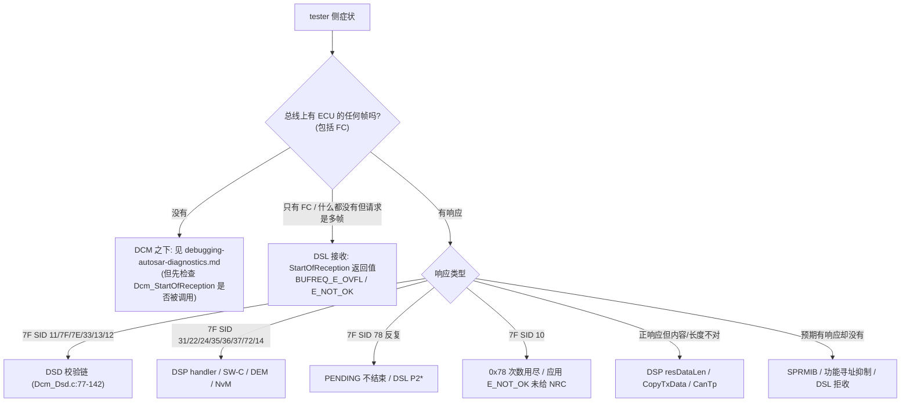
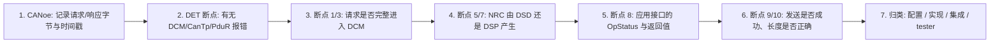

# 13 — DCM Debugging：断点、变量与典型故障的根因定位

> Prerequisite: [11 — Runtime Flow](11-dcm-runtime-flow.md)、[12 — Dcm_MainFunction](12-dcm-mainfunction.md)、[10 — UDS 服务目录](10-uds-services.md)
> Next: [14 — DCM 升级指南（章节入口）](14-dcm-upgrade-guide.md) / [docs/dcm-upgrade-guide.md](../dcm-upgrade-guide.md)
> 对应规范: AUTOSAR CP **R20-11** SWS DCM（Doc ID 18）：DET 开发错误 `SWS_Dcm_00040`（p.47–48）、运行时错误 `01416`（p.48）；TP 接口返回值 p.243–247（`00444` OVFL p.56、`00557` 并发 p.56、`00642` p.57、`00118` 不重发 p.60、`00350` p.58）；0x78 `00024/00119/00120`（p.61、p.111）；DSD NRC p.92–103；S3 `00140/00141`（p.78–79）。研究笔记 [02 §3.3–§3.7、§3.14](../reference/research/02-autosar-sws-notes.md)
> 对应源码: 本项目 `examples/uds_diag_demo/diag/Dcm_Dsl.c`、`Dcm_Dsd.c`、`Dcm_Dsp.c`、`rte/Rte_Dcm.c`、`general/Det.c`、`general/UdsTrace.c`、`artifacts/uds-demo/trace.txt`；openAUTOSAR（R3.1.5）`diagnostic/Dcm/src/Dcm_Dsl.c`、`Dcm_Dsd.c`

---

## 1. 本章目标

本章只讲 **DCM 内部**的调试。跨层（CAN 硬件 → CanIf → CanTp → PduR）的逐层排查在 [debugging-autosar-diagnostics.md](../debugging-autosar-diagnostics.md)，CAN 控制器/引脚/位时间在 [04-can-mcal/15](../04-can-mcal/15-can-driver-debugging.md)。读完本章你应该能：

1. 在 DCM 的 10 个关键位置下断点，并知道每个断点处应该看哪些变量、正常值是什么。
2. 对 “无响应 / 0x11 / 0x7F / 0x31 / 0x22 / 0x78 停不下来 / 响应被截断 / `BUFREQ_E_OVFL`” 八类典型故障，按固定流程找到根因属于**配置、实现、集成**中的哪一类。
3. 把 demo 的 `trace.txt` 当作“理想的调试日志”，在真实项目中用断点、DET、CANoe 时间戳重建同样的信息。

---

## 2. 为什么要单独讲 DCM 调试？

“诊断不响应”在 DCM 之下的原因（总线、波特率、接收规则、CanIf 路由、CanTp 参数）通常**完全没有响应**，而 DCM 内部的原因往往表现为**某个 NRC、某种时序或某种截断**——症状更细，也更依赖对 DSL/DSD/DSP 状态的理解。另外，DCM 的状态跨越 ISR 与 task、跨越多个 `Dcm_MainFunction` 周期，“停在断点上看一眼”往往会**改变**被观察的行为（§8）。

---

## 3. 在系统中的位置：从症状到 DCM 子模块



| 分支 | 关键判别依据 |
|---|---|
| 无任何 ECU 帧 | 若 `Dcm_StartOfReception` 断点从未命中 → 问题在 DCM 之下；命中但返回非 `BUFREQ_OK` → DSL |
| DSD 类 NRC | 这些 NRC 只由 DSD 产生（demo），且不进入 DSP；断点 `diag/Dcm_Dsd.c:48`（`Dcm_DsdReject`）的 `why` 参数直接说明原因 |
| DSP 类 NRC | 服务 handler 或其下游（RTE/SW-C、DEM、NvM）决定 |
| 0x78 / 0x10 | DSL 计时与 PENDING 循环 |
| 截断 / 长度 | DSP 的 `resDataLen`、DSL 的 `txLen`、`Dcm_CopyTxData` 与 CanTp 的交互 |
| 应有却无 | DSD 抑制逻辑或 DSL 并发拒收 |

---

## 4. AUTOSAR 如何定义可观察的东西？

### 4.1 DET 错误码（R20-11）

`[AUTOSAR Standard]`（`SWS_Dcm_00040` p.47–48、`01416` p.48；研究笔记 02 §3.14）

| 类型 | 名称 | 值 | 典型触发 |
|---|---|---|---|
| 开发错误 | `DCM_E_INTERFACE_RETURN_VALUE` | 0x02 | 应用接口返回了不允许的值 |
| 开发错误 | `DCM_E_INVALID_VALUE` | 0x02（**与上一项同值，规范瑕疵**） | 例如 ErrorCode 填 `DCM_POS_RESP` 却返回 E_NOT_OK（`01415`） |
| 开发错误 | `DCM_E_UNINIT` | 0x05 | `Dcm_Init` 之前调用 API |
| 开发错误 | `DCM_E_PARAM` / `DCM_E_PARAM_POINTER` | 0x06 / 0x07 | 非法 PduId、空指针 |
| 开发错误 | `DCM_E_INIT_FAILED` | 0x08 | 配置指针无效 |
| 开发错误 | `DCM_E_SET_PROG_CONDITIONS_FAIL` | 0x09 | 跳 bootloader 前保存条件失败 |
| 运行时错误 | `DCM_E_INTERFACE_TIMEOUT` | 0x01 | 0x78 次数用尽（`00120`） |
| 运行时错误 | `DCM_E_INTERFACE_BUFFER_OVERFLOW` | 0x03 | 应用写超出缓冲 |

DET 回调 / 钩子是真实项目中**最便宜的断点**：在 `Det_ReportError` / `Det_ReportRuntimeError` 上设一个断点，任何模块报错都会停下，`ModuleId`（DCM 的模块号在 demo 中为 53，`general/Det.h:24`；以项目所用 BSW 模块列表 / Det 配置确认）、`ApiId`（SID：`Dcm_StartOfReception` 0x46、`Dcm_MainFunction` 0x25…）、`ErrorId` 就是第一手线索。demo：`general/Det.c:35`、`:44`，DCM 中的调用点 `diag/Dcm.c:19`、`diag/Dcm_Dsl.c:281`、`:314`、`:318`。

### 4.2 标准的状态查询 API

| API | 用途 | SWS |
|---|---|---|
| `Dcm_GetSesCtrlType(Dcm_SesCtrlType*)` | 当前会话 | `00339`（p.240 附近） |
| `Dcm_GetSecurityLevel(Dcm_SecLevelType*)` | 当前安全级 | `00338` |
| `Dcm_GetActiveProtocol(...)` | 当前协议、连接、tester 地址 | `00340` |
| Mode switch 端口 `DcmDiagnosticSessionControl` / `DcmSecurityAccess` / `DcmEcuReset` | SW-C/BswM 侧可见的状态 | p.104、p.406–415 |

这些 API 名是标准的，在任何 DCM 实现里都能找到——**它们的实现体会直接告诉你“会话/安全级存在哪个变量里”**，这是读陌生 DCM 时定位内部状态的捷径。demo：`diag/Dcm.c:42-58` → `diag/Dcm_Dsl.c:98-99`。

---

## 5. 核心数据结构：DCM 观察清单（watch list）

`[Educational Implementation]` demo 中的变量（真实栈名字不同，但几乎都有等价物）：

| 观察项 | demo 表达式 | 正常值 / 含义 | 真实栈中怎么找 |
|---|---|---|---|
| DSL 状态 | `Dcm_Dsl.state` | IDLE(0) / RECEIVING(1) / REQ_RECEIVED(2) / PROCESSING(3) / TRANSMITTING(4)（`diag/Dcm_Dsl.c:36-42`） | 在 `Dcm_StartOfReception` 实现里看它检查/修改哪个变量 |
| 接收进度 | `Dcm_Dsl.rxLen`、`rxCopied`、`rxPduId` | 收完时 `rxCopied == rxLen` | `Dcm_CopyRxData` 实现 |
| 请求内容 | `Dcm_DslRxBuffer[0..rxLen-1]` | 第 0 字节为 SID | 同上，看拷贝目的地址 |
| 当前请求上下文 | `Dcm_Dsl.msgContext`（`idContext`、`reqDataLen`、`msgAddInfo.reqType/suppressPosResponse`） | `reqDataLen` 不含 SID | 外部服务 handler 的 `Dcm_MsgContextType` 参数（`SWS_Dcm_00994`） |
| 会话 / 安全 | `Dcm_Dsl.sessionRow`（→ `Dcm_DslGetSesCtrlType()`）、`Dcm_Dsl.secLevel` | 默认 0x01 / LOCKED 0x00 | `Dcm_GetSesCtrlType/GetSecurityLevel` 实现 |
| 待生效动作 | `Dcm_Dsl.pendingSessionRow`（0xFF = 无）、`resetPending` | 只在 0x10/0x11 处理后到 TxConfirmation 之间非空 | — |
| P2 | `Dcm_Dsl.p2TimerMs` | 40 → 每周期 −10 | 搜索 `P2ServerMax` 配置的使用处 |
| 0x78 | `Dcm_Dsl.respPendCount`、`rcrrpInFlight`、`rcrrpSentForRequest`、`finalWaiting` | 正常请求全为 0/FALSE | 搜索常量 `0x78` |
| S3 | `Dcm_Dsl.s3Running`、`s3TimerMs` | 请求后 5000 递减 | 搜索 5000 或 `S3` |
| 发送进度 | `Dcm_Dsl.txLen`、`txCopied` | 发完时相等 | `Dcm_CopyTxData` 实现 |
| 当前服务 | `Dcm_DsdActiveService`（`diag/Dcm_Dsd.c:30`） | INITIAL 后指向服务表行；完成后 NULL | DSD 分发函数 |
| 异步状态 | `Dcm_DspRdbi.currentOpStatus`、`current`、`numDids`（`diag/Dcm_Dsp.c:38`） | PENDING 期间为 `DCM_PENDING` | DSP 内部 OpStatus 变量 |
| 安全计数 | `Dcm_DspSec.attemptCounter[]`、`delayMs[]`、`seedLevel`（`diag/Dcm_Dsp.c:40`） | — | 0x27 handler |
| DET 记录 | `Det_GetRecord(i)`（`general/Det.c:56`） | 测试要求为 0 条（`tests/test_uds_demo.c:104`） | DET 模块的记录缓冲 / 钩子 |

---

## 6. 初始化相关的检查

| 检查 | 方法 | 异常时 |
|---|---|---|
| `Dcm_Init` 是否被调用、配置指针是否有效 | 断点 `diag/Dcm.c:16`；看 `Dcm_CfgPtr` | 所有 TP 回调返回 `BUFREQ_E_NOT_OK` + DET `DCM_E_UNINIT`（`diag/Dcm_Dsl.c:313-316`） |
| `Dcm_MainFunction` 是否被调度 | 断点 `diag/Dcm.c:33`，或在 OS 层看 task 激活计数 | 请求被收下（`REQ_RECEIVED`）但永远不处理 → tester P2 超时，**没有任何 NRC**（包括 0x78，因为 P2 计时也在 MainFunction 里） |
| 默认会话行存在 | `Dcm_Dsl.sessionRow` 初值（`diag/Dcm_Dsl.c:151-154`） | 找不到默认会话行时 demo 退化为第 0 行；真实栈可能 DET |

---

## 7. Runtime：断点计划与故障定位流程

### 7.1 十个 DCM 断点

| # | 位置（demo） | 标准 / 等价函数 | 命中时看什么 | 正常 | 异常含义 |
|---|---|---|---|---|---|
| 1 | `diag/Dcm_Dsl.c:309` `Dcm_StartOfReception` | 标准 API（`00094`） | `id`、`TpSduLength`、`Dcm_Dsl.state`、返回值 | state=IDLE，返回 `BUFREQ_OK`，`*bufferSizePtr`=128 | 返回 `E_NOT_OK`：未初始化 / id 越界 / 忙（`:324-333`）；`E_OVFL`：请求 > buffer（`:334-338`） |
| 2 | `diag/Dcm_Dsl.c:352` `Dcm_CopyRxData` | 标准 API（`00556`） | `info->SduLength`、`rxCopied`、返回值 | 每次 `BUFREQ_OK` | 状态不是 RECEIVING 或 id 不匹配 → `E_NOT_OK`，CanTp 中止接收 |
| 3 | `diag/Dcm_Dsl.c:384` `Dcm_TpRxIndication` | 标准 API（`00093`） | `result`、`Dcm_DslRxBuffer` | `E_OK`，buffer = 请求字节 | `E_NOT_OK`：CanTp 接收失败（N_Cr 超时、SN 错），请求被丢弃（`:400-407`） |
| 4 | `diag/Dcm_Dsl.c:255` DSL `REQ_RECEIVED→PROCESSING` | DSL 内部 | 距断点 3 的时间 | ≤ `DcmTaskTime` | 从不命中 → MainFunction 未调度 |
| 5 | `diag/Dcm_Dsd.c:48` `Dcm_DsdReject` | DSD 内部 | `nrc`、`why`、`reqType` | 只在预期 NRC 时命中 | `why` 字符串直接给出 DSD 拒绝原因 |
| 6 | `diag/Dcm_Dsd.c:163` 服务分发 | DSD → DSP | `Dcm_DsdActiveService->name`、`OpStatus` | 每个请求先 INITIAL，PENDING 若干次 | — |
| 7 | 服务 handler 入口，例如 `diag/Dcm_Dsp.c:264` | DSP | `pMsgContext->reqData/reqDataLen`、`*ErrorCode` 返回值 | — | handler 返回 E_NOT_OK 时 `*ErrorCode` 即 NRC |
| 8 | `rte/Rte_Dcm.c:54`（等 `Rte_Call_*`） | `Rte_Call_DataServices_<Data>_ReadData` 等 | `OpStatus`、返回值、`Data` 内容 | INITIAL → (PENDING …) → E_OK | 永远 `DCM_E_PENDING`；返回 E_NOT_OK |
| 9 | `diag/Dcm_Dsl.c:199` `PduR_DcmTransmit` 调用 | 标准 API（DCM 侧用法 `00115`） | `length`、`Dcm_DslTxBuffer[0..length-1]`、返回值 | E_OK | 返回 E_NOT_OK → 响应被丢弃且**不重发**（`00118`，`:199-203`） |
| 10 | `diag/Dcm_Dsl.c:441` `Dcm_CopyTxData` / `:477` `Dcm_TpTxConfirmation` | 标准 API（`00092` / `00351`） | `info->SduLength`、`txCopied`、`result` | CopyTxData 若干次后 TxConfirmation(E_OK) | CopyTxData 返回 `E_NOT_OK`；TxConfirmation(`E_NOT_OK`)（流控失败 / N_As / N_Bs 超时） |

### 7.2 典型故障与根因定位

以下每一类都按 **现象 → 可能原因（按概率排序）→ 在哪里断/看什么 → 根因类别** 给出。

#### (1) 完全无响应

| 可能原因 | 断点 / 观察 | 类别 |
|---|---|---|
| 请求没进 DCM | 断点 1 未命中 → 回到下层排查（PduR 路由、CanTp N-SDU、CanIf 路由、接收规则） | 配置 / 集成 |
| DCM 拒收：忙（上一个请求未完成） | 断点 1：`state != IDLE`，`:331-332` 返回 `E_NOT_OK`。R20-11：同一连接 → 拒绝；不同连接 → 视 `DcmDslDiagRespOnSecondDeclinedRequest` 回 0x21 或拒绝（`00788–00790` p.56） | 行为（tester 太快） |
| `TpRxIndication(E_NOT_OK)` | 断点 3：多帧请求时 tester 的 CF 间隔超过 ECU 的 N_Cr | 时序 |
| `Dcm_MainFunction` 未调度 | 断点 4 未命中 | 集成（OS/SchM） |
| 正响应被 SPRMIB 抑制 | 断点 5/6 之后 `diag/Dcm_Dsd.c:177-180` 命中 | **正常行为** |
| NRC 被功能寻址抑制（0x11/0x12/0x31/0x7E/0x7F） | `diag/Dcm_Dsd.c:54-58` 命中，`reqType == FUNCTIONAL` | **正常行为**（`00001` p.101） |
| 功能 `3E 80` | `diag/Dcm_Dsl.c:408-417`，不进 DSD | **正常行为** |
| `PduR_DcmTransmit` 失败 | 断点 9 返回 `E_NOT_OK`（PduR 路由缺失、CanTp N-SDU 忙或长度非法——例如功能寻址 N-SDU 发 > 7 字节，`com/CanTp.c:407-411`） | 配置 |
| 发送中止 | 断点 10：`Dcm_TpTxConfirmation(E_NOT_OK)`（tester 不回 FC → N_Bs 超时） | tester / 时序 |
| 通信未允许（真实栈） | ComM 不在 FULL_COM、DCM 等待通信模式（`01142` p.85） | 集成 |

#### (2) `7F xx 11` serviceNotSupported

- 断点 5，`why = "SID not in service table"`（`diag/Dcm_Dsd.c:87-90`）。
- 根因：SID 不在**当前协议**的服务表中（真实栈中一个 DCM 可有多个协议 / 多张 SID 表，`DcmDslProtocolSIDTable`）；或服务在配置工具中被禁用；或编译开关未打开——openAUTOSAR 的 `DCM_USE_SERVICE_*` 全部未定义，结果**所有**请求都回 0x11（`diagnostic/Dcm/src/Dcm_Dsd.c:232`，研究笔记 03 §3.3）。
- 类别：配置。

#### (3) `7F xx 7F` serviceNotSupportedInActiveSession

- 断点 5，`why = "service not allowed in active session"`（`diag/Dcm_Dsd.c:91-95`）；看 `Dcm_DslGetSesCtrlType()`。
- 常见场景：tester 以为已在扩展会话，但 **S3 已超时**回到默认会话（看 trace / 断点 `diag/Dcm_Dsl.c:294-299`）；或 `10 03` 的响应发送失败，会话没有切换（`diag/Dcm_Dsl.c:169`）；或 ECU 复位过。
- 类别：tester 流程 / 配置。

#### (4) `7F xx 31` requestOutOfRange

- 0x22/0x2E：DID 不存在、不可读写、**DID 级会话不允许**（`diag/Dcm_Dsp.c:304-308`、`:320-323`、`:501-505`）——最常被误判的一类，见 [08 §13](08-did.md)。
- 0x31：RID 不存在或 RID 级会话不允许（`diag/Dcm_Dsp.c:565-568`）。
- 0x19/0x14：DEM 返回 `WRONG_DTC`、filter 失败（[09 §12](09-dtc-dem.md)）。
- 方法：在 DSP handler 里找到所有赋值 `DCM_E_REQUESTOUTOFRANGE` 的位置下断点，看是哪一处。
- 类别：配置（最常见）/ 实现。

#### (5) `7F xx 22` conditionsNotCorrect

- 来源分散：应用 `ConditionCheckRead` / `WriteData` / `GetSeed` 返回的 ErrorCode（看断点 8 的 `*ErrorCode`）；DSP 把应用的 `E_NOT_OK` 映射成 0x22（demo 0x22 读失败 `diag/Dcm_Dsp.c:355-359`）；DEM clear 失败（`diag/Dcm_Dsp.c:206-208`）；0x10 跳 boot 前置条件。
- 方法：**先确认 0x22 是 DCM 自己生成的还是应用给的**——断在服务 handler 的 `return E_NOT_OK` 处，看 `*ErrorCode` 是谁写的。
- 类别：应用逻辑 / 车辆条件（车速、电压等）。

#### (6) `7F xx 78` 一直重复，最终 `7F xx 10` 或 tester 放弃

| 可能原因 | 观察 | 类别 |
|---|---|---|
| SW-C 永远返回 `DCM_E_PENDING` | 断点 8：`OpStatus` 一直是 `DCM_PENDING`，返回值一直 `DCM_E_PENDING` | 应用 |
| SW-C 依赖的下层 MainFunction 未运行（NvM、Dem、Fee） | NvM：`NvM_GetErrorStatus` 一直 `NVM_REQ_PENDING`；看 `NvM_MainFunction` 是否被调度 | 集成 |
| SW-C 没处理 `DCM_INITIAL` 的“重新开始”语义 | 上次被 CANCEL 后内部状态没复位，新请求的 INITIAL 被当作继续 | 应用 |
| 跨分区异步 server call 的结果永远不回来 | RTE/IOC 配置 | 集成 |
| 0x78 次数上限 | demo：20 次后 `DCM_CANCEL` + `7F xx 10` + DET `DCM_E_INTERFACE_TIMEOUT`（`diag/Dcm_Dsl.c:277-285`）；未配置上限 = 无限（`01567`） | 配置 |

`[Real Project Consideration]` 另一个反方向的问题：**0x78 根本不出现**，tester 报 P2 超时。原因：`Dcm_MainFunction` 本身被阻塞（同步 server runnable 太慢，见 [12 §10](12-dcm-mainfunction.md)）、DCM 周期与实际调度不一致（[12 §9.1](12-dcm-mainfunction.md)）、adjust 太小。

#### (7) 响应被截断 / 长度不对

| 可能原因 | 观察 | 类别 |
|---|---|---|
| DSP 的 `resDataLen` 计算错误（DID ByteSize 配置与 SWC 实际写入不符） | 断点 9 处 `length` 与 `Dcm_DslTxBuffer` 内容；对比 DID 配置 | 配置 |
| 响应超过 DCM buffer | demo：0x22 预检 → 0x14（`diag/Dcm_Dsp.c:324-327`）；0x19 逐条检查（`:244-246`）。真实栈：`DcmDslBufferSize`（`ECUC_Dcm_00738` p.459）、`DcmDslProtocolMaximumResponseSize`、分页缓冲 `DcmPagedBufferEnabled` | 配置 |
| CopyTxData 请求量超过剩余 → `BUFREQ_E_NOT_OK` → CanTp 中止 | 断点 10：`info->SduLength > total - copied`（`diag/Dcm_Dsl.c:465-467`）→ `Dcm_TpTxConfirmation(E_NOT_OK)`；tester 只收到 FF 和部分 CF | 实现 / CanTp 配置 |
| 分页缓冲时 DCM 返回 `BUFREQ_E_BUSY` 太久 → CanTp N_Cs 超时 | `01186`（p.73）；CanTp 中止 | 时序 |
| CAN FD / classic 混用（DLC、padding） | 对比 CanTp TX N-SDU 配置与控制器模式 | 配置 |
| openAUTOSAR 已知缺陷：本地 NRC（0x78/0x10/0x21）长度字段 `messageLenght` 从未赋值 | `diagnostic/Dcm/src/Dcm_Dsl.c:927` 读取，`:408` 只设了 `SduLength`（研究笔记 03 §4.2） | 实现缺陷 |

#### (8) `BUFREQ_E_OVFL`（tester 看到 FC OVFLW 或请求被拒）

- 断点 1：`TpSduLength > DCM_DSL_BUFFER_SIZE`（`diag/Dcm_Dsl.c:334-338`，`SWS_Dcm_00444` p.56）。
- CanTp 收到 OVFL 后发 **FC OVFLW**（`com/CanTp.c:247-251`），tester 放弃请求；单帧请求则直接丢弃（`com/CanTp.c:205-208`）。
- 根因：`DcmDslBufferSize` 小于最长的请求（典型：0x2E 写长 DID、0x36 TransferData 块大小与 0x34 响应中的 maxNumberOfBlockLength 不一致）。
- demo README §8 描述了如何复现（把 `DCM_DSL_BUFFER_SIZE` 改为 12 后发 13 字节 2E）；本章不修改 demo，只在 §11 推演其输出。
- 类别：配置。

#### 其它常见 NRC 速查

| NRC | 首先看 |
|---|---|
| 0x13 | DSD 最小长度（`diag/Dcm_Dsd.c:101-105`）与 DSP 精确长度；注意 `reqDataLen` 不含 SID |
| 0x33 | 是否在 `27 02` 之后又切换了会话（安全级被锁，`SWS_Dcm_00139`）；`Dcm_Dsl.secLevel` |
| 0x12 | DSD 子功能表；0x31 的 stop/results 未配置 |
| 0x24 | 0x27 sendKey 前没有 seed（或 seed 已被一次错误 key 消耗，`diag/Dcm_Dsp.c:458`）；0x31 未 start |
| 0x36 / 0x37 | `Dcm_DspSec.attemptCounter[]` / `delayMs[]`；真实栈中计数器是否从 NvM 恢复（`01154–01357` p.74–75） |
| 0x10 | 应用返回 `E_NOT_OK` 但 ErrorCode 未赋值或为 0（`diag/Dcm_Dsd.c:169-172`，`SWS_Dcm_00271`）；或 0x78 次数用尽 |

---

## 8. RH850 Hardware Mapping：在真实芯片上调试 DCM 的注意事项

`[RH850 Hardware]` / `[Real Project Consideration]`

| 问题 | 原因 | 建议 |
|---|---|---|
| 在 ISR 路径（断点 1–3）停下后，tester 报超时、后续帧丢失 | CPU 停住，但 RS-CANFD 控制器仍在收发并 ACK；RX FIFO 可能溢出；tester 的 N_Cr / P2 继续计时 | 用条件断点、tracepoint（不停 CPU 的打印/记录），或在 RAM 中记录环形日志（相当于 demo 的 `UDS_TRACE`）后事后读取 |
| 在 `Dcm_MainFunction` 中停留过久 | 恢复运行后 P2/S3 计时器只差一个周期，但 tester 早已超时 | 只在“第一次命中”时观察；时序问题用 CANoe 时间戳 + 少量 GPIO 翻转（示波器）测量，而不是断点 |
| lock-step 内核（P1M-E 的 G3M） | 调试器对 lock-step 的支持方式、断点资源数量依调试器与芯片而定 | 需根据调试器手册与芯片手册确认 |
| 看门狗 | 停在断点时看门狗可能复位 ECU，表现为“会话莫名回默认、安全级锁定” | 调试构建中关闭或延长看门狗（需在真实项目确认流程） |
| 优化等级 | 高优化下局部变量不可见、断点漂移 | 关键 DCM 状态是静态变量，通常仍可观察；必要时对诊断模块单独降低优化 |

---

## 9. openAUTOSAR 实现：R3 版本该在哪里断

| 目的 | openAUTOSAR（R3.1.5）位置 |
|---|---|
| 请求进入 | `diagnostic/Dcm/src/Dcm.c:109` `Dcm_ProvideRxBuffer` → `Dcm_Dsl.c:682` |
| 请求完成 | `Dcm.c:124` `Dcm_RxIndication` → `Dcm_Dsl.c:743`（P2 起算 `:840`） |
| DSD 校验 / NRC | `Dcm_Dsd.c:278` `DsdHandleRequest`（0x11 `:331`、0x7F `:327`、0x33 `:323`、应用拒绝 `:314/:318`）；`createAndSendNcr` `:70-84` |
| 服务分发 | `Dcm_Dsd.c:86`（`switch` `:89`；默认分支 0x11 `:232`） |
| P2 / 0x78 / 0x10 | `Dcm_Dsl.c:554-576`；`sendResponse` `:388` |
| 发送 | `Dcm_Dsl.c:596` `PduR_DcmTransmit`；取数据 `Dcm_Dsl.c:899` |
| 确认 | `Dcm.c:188` → `Dcm_Dsl.c:950`；0x11 复位 `Dcm_Dsp.c:1971-1981` |
| 状态 | 每协议 runtime：`externalRxBufferStatus/externalTxBufferStatus/stateTimeoutCount/responsePendingCount/securityLevel/sessionControl`（`include/Dcm_Lcfg.h:556-574`） |

已知需要警惕的行为（研究笔记 03 §4、§8）：全部请求 0x11（服务宏未定义）；0x19 未知子功能回 0x31；0x27 无 0x36/0x37；0x10 立即切会话；本地 NRC 长度字段未赋值。

---

## 10. 当前教学项目：把 trace 当作调试日志

`[Educational Implementation]` demo 的 `UDS_TRACE`（`general/UdsTrace.c:17`）在每个关键跳打印一行 `[时间] [模块] 动作`，这正是你在真实 ECU 上希望通过断点/tracepoint 拿到的信息。使用方法：

```text
grep "Dcm/DSL" artifacts/uds-demo/trace.txt     # 只看 DSL：接收、P2、0x78、会话、S3
grep "Dcm/DSD" artifacts/uds-demo/trace.txt     # 只看 DSD：查表、拒绝原因、组包
grep "Rte\|SWC" artifacts/uds-demo/trace.txt    # 只看应用接口与 OpStatus
grep "0x78\|P2 expired" artifacts/uds-demo/trace.txt
```

注意：`Dcm_CopyRxData` / `Dcm_CopyTxData` 没有 trace 行（高频调用），需要时用断点 2、10 观察。

---

## 11. Code Walkthrough：按 trace 格式串推演故障输出

以下“推演输出”是根据源码中的 `UDS_TRACE` 格式串**推导**的，并非实际运行结果（本章不修改 demo）。

`[Conceptual]` 场景 A：`DCM_DSL_BUFFER_SIZE` = 12 时发 13 字节 `2E F1 A0 …`（demo README §8 的实验）。依据 `com/CanTp.c:244-251`、`diag/Dcm_Dsl.c:334-338`：

```text
[Tester ] >>> UDS request physical 0x7E0 (13 bytes): 2E F1 A0 ...
[CanTp  ] RX RxNSdu_DiagPhys: FF total=13 -> PduR_CanTpStartOfReception(0)
[PduR   ] CanTpStartOfReception(0) -> route 'CanTp(DiagPhys) -> Dcm' -> Dcm_StartOfReception(DcmRxPduId 0)
[Dcm/DSL] StartOfReception len=13 > buffer 12 -> BUFREQ_E_OVFL
[CanTp  ] RX RxNSdu_DiagPhys: send FC OVFLW (BS=2 STmin=5 ms)      (格式串见 com/CanTp.c:142-144)
```

诊断要点：**没有 `TpRxIndication` 行、没有任何 `Dcm/DSD` 行** → 请求从未完整进入 DCM；tester 侧看到 FC 帧 `32 02 05`（PCI 0x3 + FS=2 OVFLW，`com/CanTp.c:139-141`）。

`[Conceptual]` 场景 B：服务处理中 tester 立即又发一个物理请求。依据 `diag/Dcm_Dsl.c:324-333`：

```text
[Dcm/DSL] StartOfReception(0) while busy -> BUFREQ_E_NOT_OK
```

诊断要点：第二个请求被静默丢弃（同一连接，`SWS_Dcm_00557`）；tester 若未等到第一个响应就发第二个，会以为 ECU“丢请求”。

场景 C（真实 trace，可直接验证）：`85 02` → `7F 85 11`，trace 第 581–609 行中 `[Dcm/DSD ] negative response 7F 85 11 (SID not in service table)`——`why` 字段就是断点 5 中能看到的原因字符串。

---

## 12. Debug 工作流总结



| 步骤 | 为什么这样排 |
|---|---|
| 1 | 总线证据最客观；先确定“有没有响应、什么响应、什么时候” |
| 2 | DET 几乎零成本，常常直接给出答案 |
| 3 | 把问题切成“DCM 之下”与“DCM 之内” |
| 4 | NRC 的产生者决定下一步看配置表还是看应用 |
| 5 | 大部分 0x22/0x78 问题在应用接口 |
| 6 | 截断与“无响应”的最后一站 |
| 7 | 决定修改哪里：DCM 配置工具、SWC 代码、OS/BswM 集成，还是 tester 脚本 |

---

## 13. 常见调试错误

1. **只看 NRC 不看时间**：0x78 问题、S3 问题、P2 超时都必须看时间戳。
2. **在 ISR 路径上长时间停住**，然后把由此产生的超时当成 bug。
3. **忘记功能寻址的 NRC 抑制**：用 0x7DF 发不支持的服务，“没响应”是正确的。
4. **把 DCM 内部函数名当成标准**：真实栈的 DSL/DSD/DSP 函数名是供应商自定义的；从标准 API（`Dcm_StartOfReception`、`Dcm_TpRxIndication`、`Dcm_CopyTxData`、`Dcm_GetSesCtrlType`）的实现入手找内部状态。
5. **修改配置后没重新生成 RTE/SWC 接口**：DCM 侧与 SWC 侧签名不一致，症状可能是随机的 0x22 或数据错位。
6. **忽略安全级被会话切换重置**：调试脚本里多发了一次 `10 03`。

---

## 14. 实验（基于 demo 的 trace，不修改 demo）

1. **定位 0x78 的触发点**：在 `artifacts/uds-demo/trace.txt` 第 611–720 行中找到 `P2 expired while service pending` 行；说出此时 `Dcm_Dsl.p2TimerMs`、`respPendCount`、`rcrrpInFlight` 的值（提示：[12 §7.2](12-dcm-mainfunction.md)）。
2. **判断 NRC 产生者**：对 `tests/test_uds_demo.c:240-259` 中的每个 `EXPECT`，判断 NRC 是 `Dcm_Dsd.c` 还是 `Dcm_Dsp.c` 产生，并给出行号。
3. **无响应三种原因的区分**：对 `tests/test_uds_demo.c:227-229` 的三个请求（`3E 00`、物理 `3E 80`、功能 `3E 80`），写出分别命中断点 1–10 中的哪些。
4. **会话丢失**：读 trace 第 721–726 行，假设 tester 在 5800 ms 发 `2E F1 A0 …`，预测响应（提示：S3 超时后回默认会话、安全级 LOCKED；0x2E 的服务表行只允许扩展会话，`diag/Dcm_Cfg.c:122`）。
5. **（调试器练习）** 用 gdb 运行 demo 测试程序（编译命令见 `artifacts/uds-demo/results.txt`），在 `Dcm_DsdReject` 上设断点，运行 `test_unknown_sid_and_lengths`，依次记录 `why` 的值。

---

## 15. 思考题

1. 为什么“完全无响应”时，第一件事是确认 `Dcm_StartOfReception` 是否被调用，而不是去看 DSD？
2. 同一个“7F 22 31”，在多 DID 请求与单 DID 请求中，DSP 内部可能经过的路径有何不同？
3. 如果 DET 被关闭（`DcmDevErrorDetect = FALSE`），哪些故障会变得更难定位？你会用什么替代手段？
4. 你如何在不停 CPU 的前提下，测量 “`Dcm_TpRxIndication` → `PduR_DcmTransmit`” 的耗时分布？

---

## 16. 对未来真实项目的意义

- 真实项目中最常见的 DCM 问题按频率大致是：**配置**（DID/RID/服务表/会话/安全引用）＞ **应用接口**（PENDING 不结束、ErrorCode 未赋值、数据长度不符）＞ **集成**（MainFunction 调度、ComM、BswM、NvM 调度）＞ **DCM 实现缺陷**。本章的流程就是按这个概率排序的。
- DCM 升级后的回归问题几乎都会落在 §7.2 的八类里：NRC 优先级变化（0x13 的位置）、0x78 时机变化、OpStatus/签名变化导致的 0x22/0x10、buffer 配置迁移导致的 OVFL/截断。把本章的“断点表 + 观察清单”换成新 DCM 的等价符号，就是升级验证的调试手册（见 [DCM 升级指南](../dcm-upgrade-guide.md)）。
- 在 RTA-CAR 等商业栈中，DCM 的内部状态变量名需要通过阅读标准 API 的实现体来找；供应商通常也提供调试钩子或 trace 配置——具体名称需在真实项目环境中确认。

---

## 17. 本章总结

- 先用总线证据与 DET 分类症状，再用 10 个断点二分定位：接收（1–3）、调度（4）、校验（5–6）、处理（7–8）、发送（9–10）。
- 八类典型故障各有固定的检查点；NRC 的产生者（DSD vs DSP vs 应用）决定下一步看配置还是看应用。
- 在真实 RH850 上避免在 ISR 路径长时间停住；时序问题用时间戳与非侵入式记录。
- 读陌生 DCM 时，从标准 API 的实现体反查内部状态变量。

## 18. 下一章

- [14 — DCM 升级指南（章节入口）](14-dcm-upgrade-guide.md)
- 跨层排查：[debugging-autosar-diagnostics.md](../debugging-autosar-diagnostics.md)
