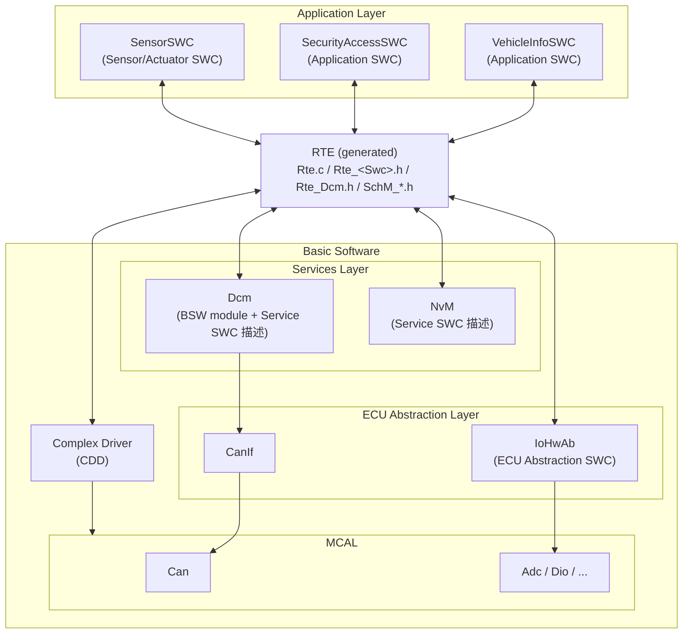
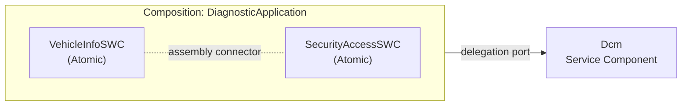
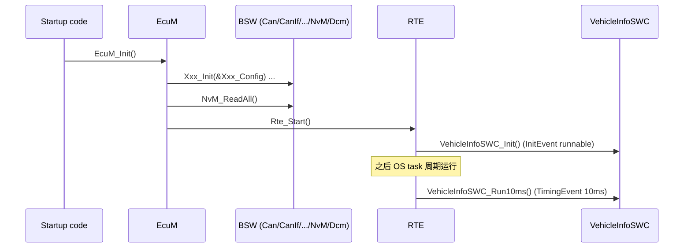

# SWC 概念：Software Component 到底是什么

> Prerequisite: [分层架构](../02-autosar-classic/02-layered-architecture.md), [配置与 ARXML](../02-autosar-classic/04-configuration-arxml.md), [Interrupt / Task / MainFunction / Runnable](../02-autosar-classic/07-mainfunction-scheduling.md)
> Next: [Port 与 Interface](02-port-interface.md)
> 对应规范: **本仓库没有 RTE SWS、没有 Software Component Template（TPS_SWCT）、没有 VFB 规范**。本章的 SWC 类型、Composition、Internal Behavior 等术语为 AUTOSAR R4.x 公认概念，需以真实项目所用 release 的 SWS/TPS 确认。可直接引用的只有：DCM SWS CP R20-11 §8.8（DCM 作为 Service Component 提供/要求的端口，p.335–415）、IoHwAb SWS R24-11（`SWS_IoHwAb_00025` p.25：IoHwAb 实现为 `EcuAbstractionSwComponentType`；`00001` p.24：只能通过 PortPrototype 与其它 SW-C 交互）。
> 对应源码: openAUTOSAR `examples/rte_simple/{Calculator.c,Tester.c,rte_simple_lib.arxml}`、`rte/src/rte.c`；本项目 `examples/uds_diag_demo/swc/VehicleInfoSWC.c`、`swc/SecurityAccessSWC.c`、`rte/Rte_VehicleInfoSWC.h`

---

## 1. 本章目标

这一章只回答一个问题：

> **Classic AUTOSAR 里的 "SWC" 到底是一段什么样的代码？它和一个普通的 `.c` 文件有什么本质区别？**

读完后你应该能够：

1. 说出 SWC 的三层描述：**Component Type（对外长什么样：Port）→ Internal Behavior（内部有哪些 Runnable、被什么 Event 触发）→ Implementation（真正的 C 代码）**。
2. 区分 Application SWC、Sensor/Actuator SWC、Service SWC（Service Component）、Complex Driver、ECU Abstraction SWC，并知道 DCM 在这里属于哪一类。
3. 区分 **Atomic SWC** 与 **Composition**，理解 "Composition 没有代码"。
4. 看懂教学 demo 中 `VehicleInfoSWC` 为什么"只 include 自己的 `Rte_VehicleInfoSWC.h`"，以及为什么它完全不知道 CAN、ISO-TP、SID、NRC 0x78。

---

## 2. 为什么需要 SWC 这个概念？

### 2.1 没有 SWC 时的 ECU 代码长什么样

传统（非 AUTOSAR）ECU 中，"读 VIN" 常常写成：

```c
/* [Conceptual] 非 AUTOSAR 的典型写法 —— 反例 */
#include "can_driver.h"
#include "eeprom.h"
#include "diag.h"

void diag_handle_22(uint8 *req, uint8 *res)
{
    if (req[1] == 0xF1 && req[2] == 0x90) {
        eeprom_read(VIN_ADDR, &res[3], 17);  /* 直接读存储 */
        can_send_isotp(0x7E8, res, 20);      /* 直接发 CAN */
    }
}
```

问题：

| 问题 | 后果 |
|---|---|
| 应用逻辑、诊断协议、通信、存储全混在一个函数里 | 换 CAN ID、换 EEPROM、换诊断协议都要改这段代码 |
| 函数名、参数完全由个人决定 | 两个供应商写的模块无法拼在一起 |
| 谁在什么 task、多久调一次，写在代码里 | 无法在不改代码的情况下重新分配 CPU 负载 |
| 没有机器可读的"接口说明" | 工具无法检查"A 要的数据 B 是否提供"、类型是否一致 |

### 2.2 AUTOSAR 的解法：把"组件"和"连接"分离

AUTOSAR Classic 的核心思想是 **VFB（Virtual Functional Bus）**：

- 设计阶段，所有 SWC 看起来都挂在一根"虚拟总线"上，只通过 **Port** 交换数据或调用服务。
- SWC **不知道**对方在本 ECU 还是在另一个 ECU，也不知道数据是走函数调用、全局变量、IOC 还是 CAN 报文。
- 到集成阶段，**RTE（Runtime Environment）** 由工具根据配置生成，把 VFB 上的"虚拟连线"变成真正的 C 代码。

所以 SWC 的本质是：

> **一段只通过 RTE API 与外界交互、并带有机器可读描述（ARXML）的应用代码单元。**

"带有描述"这一点非常关键。一个 `.c` 文件不是 SWC；`.c` + 描述它 Port / Runnable / Event 的 ARXML + 由 RTE 生成器给它生成的 `Rte_<Swc>.h`，合起来才是一个 SWC。

---

## 3. 在系统中的位置



逐条解释图中的箭头：

1. **Application SWC ↔ RTE**：SWC 只调用 `Rte_Read_*` / `Rte_Write_*` / `Rte_Call_*` / `Rte_Mode_*` 等生成的 API，RTE 反过来调用 SWC 的 Runnable。这是 SWC 与外界唯一的接口。
2. **RTE ↔ Dcm**：Dcm 是 BSW 模块，但它有一份 **Service Component** 描述（DCM SWS R20-11 §8.8），里面声明了 `DataServices_<Data>`、`SecurityAccess_<Level>`、`RoutineServices_<Routine>` 等 Port。Dcm 通过 RTE 调用应用 SWC（`Rte_Call_DataServices_DID_F190_ReadData`）。
3. **RTE ↔ NvM**：NvM 也以 Service Component 的形式向 SWC 提供 `NvMService` 之类的接口（本仓库无 NvM SWS，接口名需在真实项目确认）。
4. **RTE ↔ IoHwAb**：IoHwAb 被规范定义为 **ECU Abstraction SWC**（`SWS_IoHwAb_00025` p.25），向上提供 Port，向下调用 MCAL。
5. **RTE ↔ CDD**：Complex Driver 可以同时有 SWC 描述（向上 Port）和直接访问硬件的代码。
6. **Dcm → CanIf → Can**：这部分是 BSW 内部的 C API 调用，**不经过 RTE**。这一点初学者经常误解："RTE 是所有模块之间的胶水"——不是，RTE 只负责"有 SWC 描述的实体之间"以及 BSW 调度/模式部分（SchM）。

---

## 4. AUTOSAR 如何定义？

> `[AUTOSAR Standard]` 以下分类来自 AUTOSAR R4.x Software Component Template 的公认概念。**本仓库没有 TPS_SWCT 和 RTE SWS**，元素名（如 `APPLICATION-SW-COMPONENT-TYPE`）需以项目 release 的 schema 确认。

### 4.1 三层描述

| 层 | ARXML 元素（R4.x 公认名） | 回答的问题 | 谁写 |
|---|---|---|---|
| **Component Type** | `APPLICATION-SW-COMPONENT-TYPE` 等 + `PORTS` | 对外有哪些 Port？每个 Port 用什么 Interface？ | 系统/功能架构师（常在 SystemDesk、PREEvision、DaVinci Developer、RTA-CAR 等工具中） |
| **Internal Behavior** | `SWC-INTERNAL-BEHAVIOR`：`RUNNABLES`、`EVENTS`、`DATA-READ-ACCESSS`、`SERVER-CALL-POINTS`、`EXCLUSIVE-AREAS`、`PER-INSTANCE-MEMORYS`… | 内部有几个 Runnable？谁触发它们？它们访问哪些 Port？ | SWC 开发者 |
| **Implementation** | `SWC-IMPLEMENTATION` + C 源码 | 代码在哪？用什么编译器？代码多大？ | SWC 开发者 |

`[Conceptual]` 用 VehicleInfoSWC 打个比方：

```text
Component Type   : VehicleInfoSWC 有一个 P-Port "DataServices_DID_F190"，接口是 DataServices_DID_F190
Internal Behavior: 有一个 Runnable "ReadVin"，被 OperationInvokedEvent(DataServices_DID_F190.ReadData) 触发
Implementation   : ReadVin 的 C 符号是 VehicleInfoSWC_ReadVin，在 VehicleInfoSWC.c 里
```

### 4.2 SWC 的类型

| 类型 | 典型例子 | 能否直接访问硬件 / BSW C API | 说明 |
|---|---|---|---|
| **Application SWC** | `VehicleInfoSWC`、空调控制、车窗逻辑 | 否 | 纯应用逻辑，只用 RTE。可在任意 ECU 上部署（理论上）。 |
| **Sensor/Actuator SWC** | 油门踏板传感器信号处理、电机驱动输出逻辑 | 否（经 IoHwAb） | 依赖具体传感器/执行器的特性（比如电压→角度的标定），但不依赖 ECU 电路；它通过 Port 调用 IoHwAb。 |
| **Service SWC（Service Component）** | Dcm、Dem、NvM、ComM、EcuM、BswM 的"服务描述" | 是（它本身就是 BSW） | 这些 BSW 模块用 SWC 描述向应用暴露标准化 Port。Port Interface 名由各 BSW SWS 规定（例如 DCM 的 `DataServices_<Data>`）。 |
| **ECU Abstraction SWC** | IoHwAb | 是（调用 MCAL） | 唯一允许"向上是 Port、向下直接调 MCAL"的标准层。 |
| **Complex Driver (CDD)** | 特殊传感器协议、电机 FOC、高速时序控制 | 是 | 绕过分层，直接访问硬件；对上可以有 SWC 描述也可以没有。 |
| （另有）Parameter SWC、NvBlock SWC、Composition | 标定参数、NV 数据块映射 | — | Parameter SWC 只提供标定参数；NvBlock SWC 把 NvM block 映射成 Port；Composition 见 4.3。 |

**DCM 属于哪一类？** 这是本教程最关心的问题。答案是：**DCM 首先是一个 BSW 模块（有 `Dcm.c`、`Dcm_MainFunction`），同时它有一份 Service Component 描述**。DCM SWS R20-11 §8.8（p.335–415）规定了它要求（Require）的端口接口，例如：

| Port Interface | 何时存在 | 规范位置（R20-11） |
|---|---|---|
| `DataServices_<Data>`（C/S） | `DcmDspDataUsePort` = `USE_DATA_SYNCH_CLIENT_SERVER` / `USE_DATA_ASYNCH_CLIENT_SERVER` / `..._ERROR` | `SWS_Dcm_00686`，p.341 起 |
| `SecurityAccess_<SecurityLevel>`（C/S） | `DcmDspSecurityUsePort = USE_ASYNCH_CLIENT_SERVER` | `SWS_Dcm_00685`，p.338–340 |
| `RoutineServices_<RoutineName>`（C/S） | `DcmDspRoutineUsePort = TRUE` | `SWS_Dcm_00690`，p.362–377 |
| `DCMServices`（C/S，Dcm 提供） | 总是 | `SWS_Dcm_00698`，p.395–396 |

注意方向：对 `DataServices_*`，**Dcm 是 client（R-Port），应用 SWC 是 server（P-Port）**；对 `DCMServices`，Dcm 是 server，应用 SWC 可以 client 方式查询当前会话、安全级等。详见 [08-dcm-rte-integration.md](08-dcm-rte-integration.md)。

### 4.3 Atomic SWC vs Composition



- **Atomic SWC**：不可再分，**有 Internal Behavior 和 C 代码**，整体只能部署到一个 ECU（同一 ECU 内也只能映射到一个分区）。`VehicleInfoSWC` 就是 Atomic SWC。
- **Composition（`COMPOSITION-SW-COMPONENT-TYPE`）**：只是"盒子"，里面放若干 SWC Prototype 并用 Connector 连线。**它没有 Runnable，也没有任何 C 代码**，RTE 生成器会把它"拍平"（flatten）。
  - **Assembly Connector**：连接两个内部组件的 P-Port 与 R-Port。
  - **Delegation Connector**：把内部组件的 Port 引到 Composition 的外部 Port。

`[Real Project Consideration]` 在真实项目中，你最常看到的是 **ECU Extract**（ECU 级的根 Composition，常叫 `EcuComposition` / `TopLevelComposition`）。它包含本 ECU 上的所有 SWC Prototype 以及 Service Component 的连线。"为什么 Dcm 调到了这个 SWC？"的答案永远在 ECU Extract 的 Connector 里，而不在 C 代码里。

### 4.4 Type 与 Prototype（Instance）

- `VehicleInfoSWC` 是 **Type**（像 C 里的 `struct` 定义）。
- 在 Composition 里放一个 `VehicleInfoSWC_Inst`，是 **Prototype**（像 `struct VehicleInfoSWC inst;`）。
- 如果 SWC 被标记为**可多实例**（`supportsMultipleInstantiation = true`），RTE 生成的 API 和 Runnable 都会多一个 `Rte_Instance` 参数，SWC 代码通过它访问"自己的那份数据"（`Rte_Pim_*` 等）。openAUTOSAR 的命名草稿里就画了这个形态：`rte/src/rte.c:24` 注释 `<void|Std_ReturnType> Rte_<name>( [IN Rte_Instance <instance>], [role parameters])`，以及 `rte/src/rte.c:27` 的 `void Rte_Runnable_10ms( int Rte_Instance )`。
- 诊断类 SWC（VehicleInfoSWC）几乎总是**单实例**，所以 demo 中的 runnable 没有 instance 参数。

---

## 5. 核心数据结构：一个 SWC 由哪些"东西"组成

把一个 Atomic SWC 拆开，你会看到下面这些"零件"。后续章节会逐个展开。

| 零件 | 在 ARXML 中 | 在生成的 `Rte_<Swc>.h` 中表现为 | 在 SWC 的 C 代码中 | 详见 |
|---|---|---|---|---|
| Port（P/R） | `P-PORT-PROTOTYPE` / `R-PORT-PROTOTYPE` | API 名字的一部分：`Rte_Call_<Port>_<Op>` | 调用这些 API | [02](02-port-interface.md) |
| Port Interface | `SENDER-RECEIVER-INTERFACE` / `CLIENT-SERVER-INTERFACE` / `MODE-SWITCH-INTERFACE` | 决定 API 种类（Read/Write/Call/Mode）和参数类型 | — | [02](02-port-interface.md) |
| Runnable Entity | `RUNNABLE-ENTITY` + `SYMBOL` | 函数原型 `FUNC(void, ...) <Symbol>(void)` | 你实现的函数 | [03](03-runnable-event.md) |
| RTE Event | `TIMING-EVENT` / `OPERATION-INVOKED-EVENT` / `INIT-EVENT`… | 不直接出现在 SWC 头里；体现在 `Rte.c` 的 task body / 调用点 | — | [03](03-runnable-event.md) |
| Data Access | `DATA-READ-ACCESSS` / `DATA-WRITE-ACCESSS` / `DATA-RECEIVE-POINT-BY-ARGUMENTS`… | 决定生成 `Rte_IRead` 还是 `Rte_Read` | 调用 | [07](07-sender-receiver.md) |
| Server Call Point | `SYNCHRONOUS-SERVER-CALL-POINT` / `ASYNCHRONOUS-...` | 生成 `Rte_Call_*`（以及异步时的 `Rte_Result_*`） | 调用 | [06](06-client-server.md) |
| Exclusive Area | `EXCLUSIVE-AREAS` | `Rte_Enter_<EA>()` / `Rte_Exit_<EA>()` | 包住临界区 | [03](03-runnable-event.md) |
| Per-Instance Memory / IRV | `PER-INSTANCE-MEMORYS` / `EXPLICIT-INTER-RUNNABLE-VARIABLES` | `Rte_Pim_*()` / `Rte_IrvRead_*` | 内部状态 | [03](03-runnable-event.md) |

`[Educational Implementation]` 在教学 demo 中，**没有 ARXML**。上表的信息被"人肉压缩"在 `rte/Rte_VehicleInfoSWC.h` 的注释中（`examples/uds_diag_demo/rte/Rte_VehicleInfoSWC.h:12-17`）：

```c
 * Server runnables of VehicleInfoSWC (provided ports, interface per DCM SWS):
 *   PPort DataServices_DID_F190    op ReadData   -> VehicleInfoSWC_ReadVin
 *   PPort DataServices_DID_F187    op ReadData   -> VehicleInfoSWC_ReadSwVersion
 *   PPort DataServices_DID_F1A0    op ReadData   -> VehicleInfoSWC_ReadDiagConfig
 *                                  op WriteData  -> VehicleInfoSWC_WriteDiagConfig
 *   PPort RoutineServices_Routine_FF00 ops Start/Stop/RequestResults
```

这几行就是 VehicleInfoSWC 的"Component Type + Internal Behavior"的文字版。

---

## 6. 初始化流程：SWC 什么时候"活过来"

SWC 自己不会被谁 `main()` 调用。它的生命周期由 EcuM/BswM 和 RTE 决定：



逐跳解释：

1. **Startup → EcuM_Init**：复位后 C runtime 初始化完成，进入 EcuM（见 [ECU 启动](../02-autosar-classic/03-ecu-startup.md)）。
2. **EcuM → BSW Init**：按依赖顺序初始化 MCAL → ECUAL → Services。demo 中是 `examples/uds_diag_demo/integration/EcuM.c:24-42`。
3. **NvM_ReadAll**：在任何 SWC 读取 NV 数据之前，先把 NV block 读进 RAM 镜像（`EcuM.c:34`）。这就是为什么 `VehicleInfoSWC_Init` 中可以安全地 `Rte_Call_NvM_DiagConfig_ReadBlock`。
4. **Rte_Start**：BSW 就绪后，EcuM（R4.x 中通常在 `EcuM_StartupTwo` 或由 BswM 的 action list）调用 `Rte_Start()`。demo：`EcuM.c:37`；openAUTOSAR：`system/EcuM/src/EcuM.c:228`（在 `USE_RTE` 宏下调用，但 `Rte_Start` **没有定义**，见 [04-rte-concept.md](04-rte-concept.md)）。
5. **RTE → Init runnable**：RTE 启动时执行映射到 `InitEvent` 的 runnable。demo：`rte/Rte_Dcm.c:38-44`。
6. **周期 runnable**：之后由 OS task（被 alarm/schedule table 激活）执行 `TimingEvent` runnable。demo：`rte/Rte_Dcm.c:46-50` 的 `Rte_Task_10ms`，由 `integration/BswScheduler.c:51` 每 10 ms 调用。

---

## 7. Runtime Flow：一个 SWC 被调用的两种方式

SWC 的代码只会在两种情况下执行：

| 方式 | 触发者 | demo 例子 | 上下文 |
|---|---|---|---|
| **被调度**：Event 到来，RTE 在某个 task 中调用 runnable | RTE 生成的 task body | `VehicleInfoSWC_Run10ms`（TimingEvent 10 ms） | OS task |
| **被调用**：别的组件通过 C/S 调用它的 operation，RTE 执行 server runnable | client 的 `Rte_Call_*` | `VehicleInfoSWC_ReadVin`（OperationInvokedEvent，client = Dcm） | **client 的上下文**（同步直接调用时）——这里就是 `Dcm_MainFunction` 所在的 10 ms task |

第二种是诊断 SWC 最重要的方式。用 demo 的 trace 来看（`artifacts/uds-demo/trace.txt:36-44`）：

```text
[    20 ms] [Dcm/DSP ] 0x22: DID 0xF190 (VIN) USE_DATA_ASYNCH_CLIENT_SERVER -> ReadData(DCM_INITIAL, Data)
[    20 ms] [Rte     ] Rte_Call_DataServices_DID_F190_ReadData(DCM_INITIAL) -> server runnable VehicleInfoSWC_ReadVin
[    20 ms] [SWC     ] VehicleInfoSWC_ReadVin: VIN not ready yet -> DCM_E_PENDING (0 more)
[    20 ms] [Rte     ]   <- DCM_E_PENDING
...
[    30 ms] [Rte     ] Rte_Call_DataServices_DID_F190_ReadData(DCM_PENDING) -> server runnable VehicleInfoSWC_ReadVin
[    30 ms] [SWC     ] VehicleInfoSWC_ReadVin: VIN "LRH850DEMO0000001" copied -> E_OK
```

SWC 看到的只是"有人以 `DCM_INITIAL` 调我，我说还没好；有人以 `DCM_PENDING` 再调我，我给出数据"。它不知道这个"有人"是 Dcm，也不知道请求来自 CAN。

---

## 8. RH850 Hardware Mapping

`[RH850 Hardware]` SWC 本身**不访问任何 RH850 寄存器**——这正是分层的目的。但 SWC 的运行最终还是落在硬件上：

| SWC 概念 | 最终落到哪里 | 说明 |
|---|---|---|
| Runnable 执行 | RH850G3M CPU 上的某个 OS task | P1M-E 只有**一个可调度核**（G3M 主核 + lock-step checker core，checker 不是第二个可调度核，见研究笔记 04 §1）。所以 P1M-E 上不存在"跨核 RTE 通信"，所有 SWC 都在同一核的不同 task 中。 |
| TimingEvent 周期 | OS counter → 硬件定时器（如 OSTM） | 哪个 OSTM 通道驱动 OS counter 是**配置选择**，不是硬件事实（见 [OS、Task 与 ISR](../02-autosar-classic/06-os-task-isr.md)）。 |
| Exclusive Area | 中断屏蔽（PSW.ID / INTC PMR）或 OS Resource | 具体实现由 RTE 生成器 + OS port 决定，需以 RTA-OS RH850 port 文档确认。 |
| VIN 等 NV 数据 | NvM → Fee → Fls → Data Flash | P1M-E 的 Data Flash 细节需以 Flash 手册确认；SWC 只看到 `NvM_*` 服务接口。 |
| Sensor/Actuator SWC 的信号 | IoHwAb → Adc/Dio/Pwm MCAL → 外设寄存器 | 与 ECU 原理图有关，本仓库无原理图，只能 `[Conceptual]`。 |

---

## 9. openAUTOSAR 实现

`[AUTOSAR API]` + 实际源码追踪（`D:\side_project\openAUTOSAR`，Arctic Core 2.18.0，R3.1.5 风格）：

| 文件:行 | 内容 | 教学意义 |
|---|---|---|
| `examples/rte_simple/rte_simple_lib.arxml:2` | schema `http://autosar.org/3.1.5` | 这是 **AR 3.x** 的 SWC 描述，元素名与 R4.x 不同（例如 3.x 的 `INTERNAL-BEHAVIOR` 是与 SWC 平级的独立元素，R4.x 中是 SWC 内部的 `SWC-INTERNAL-BEHAVIOR`）。 |
| `rte_simple_lib.arxml:82-100` | `APPLICATION-SOFTWARE-COMPONENT-TYPE Calculator`，一个 P-Port `Port`，接口 `CalculatorOperations` | Component Type 层：只描述"对外有什么"。 |
| `rte_simple_lib.arxml:101-135` | `INTERNAL-BEHAVIOR CalculatorBehavior`：`OPERATION-INVOKED-EVENT InvokeCalculator` → `RUNNABLE-ENTITY Multiply`，`SYMBOL Multiply`（`:133`） | Internal Behavior 层：Event → Runnable → C 符号。 |
| `examples/rte_simple/Calculator.c:8-13` | `#include "Rte_Calculator.h"`；`Std_ReturnType Multiply(const UInt8 arg1, const UInt8 arg2, UInt16* result)` | Implementation 层：server runnable 的 C 代码。 |
| `examples/rte_simple/Tester.c:8-21` | `#include "Rte_Tester.h"`；`TesterRunnable` 中 `Rte_IRead_*` / `Rte_Call_Tester_Calculator_Multiply` / `Rte_IWrite_*` | 一个"标准"的 client SWC 写法。 |
| `examples/rte_simple/Tester.c:9, :29-30` | `#include "Os.h"`，并直接调 `CancelAlarm` / `SetRelAlarm` | **反例**：SWC 直接调 OS API，破坏了可移植性。真实项目里这种需求应由 Mode/BswM 或专门 Service 处理。 |
| `rte/src/rte.c:27` | `void Rte_Runnable_10ms( int Rte_Instance ) {}` | 只是命名草稿。 |

**缺失**：所有 `Rte_Calculator.h / Rte_Tester.h / Rte_Logger.h` 生成头都不存在，`rte_simple` 不在顶层构建里——所以这个例子**只能读，不能编译**（研究笔记 03 §5）。

---

## 10. 当前教学项目实现

`[Educational Implementation]` `examples/uds_diag_demo/` 中有两个 Atomic Application SWC：

| SWC | 源码 | 它的 "RTE 头" | 提供的 Port（文字版） |
|---|---|---|---|
| `VehicleInfoSWC` | `swc/VehicleInfoSWC.c`（183 行） | `rte/Rte_VehicleInfoSWC.h` | `DataServices_DID_F190`、`DataServices_DID_F187`、`DataServices_DID_F1A0`、`RoutineServices_Routine_FF00`（P-Port）；`NvM_DiagConfig`（R-Port，client of NvM）；`DcmDiagnosticSessionControl`（R-Port，mode user） |
| `SecurityAccessSWC` | `swc/SecurityAccessSWC.c`（73 行） | `rte/Rte_SecurityAccessSWC.h` | `SecurityAccess_Level_01`（P-Port） |

**与真实项目的差别**（务必记住）：

1. 没有 ARXML，没有 RTE 生成器，`Rte_*.h` / `Rte_Dcm.c` 是"as if generated"的手写代码。
2. Runnable 的 C 名字（`VehicleInfoSWC_ReadVin`）是直接写死的；真实项目中它来自 ARXML 的 `SYMBOL`。
3. 没有 Composition / Connector；"Dcm 的 F190 端口连到 VehicleInfoSWC 的 F190 端口"这件事被写死在 `rte/Rte_Dcm.c:54-62` 的函数体里。

---

## 11. Code Walkthrough：一个 SWC 的骨架

`examples/uds_diag_demo/swc/VehicleInfoSWC.c` 的结构可以作为"SWC 应该长什么样"的模板：

```c
/* [Educational Implementation] swc/VehicleInfoSWC.c:22-24 */
#include "Rte_VehicleInfoSWC.h"   /* ① 只 include 自己的 RTE 头 */
#include "UdsTrace.h"             /*    (教学 trace，量产 SWC 不会有) */
#include <string.h>
```

① **唯一的"外部世界"入口是 `Rte_VehicleInfoSWC.h`。** SWC 源码里没有 `#include "Dcm.h"`、`"NvM.h"`、`"Can.h"`。这是 SWC 可移植性的根本：换一个 ECU、换一个 Dcm 供应商，只要 RTE 重新生成，这个 `.c` 不用改。

> 细节提醒：`rte/Rte_VehicleInfoSWC.h:23` 自己 `#include "NvM.h"`，因为 `:42-47` 把 `Rte_Call_NvM_DiagConfig_*` 实现成直接映射到 `NvM_*` 的宏。这是"RTE 可以把同分区的 C/S 调用优化成宏"的演示——**这个 include 由 RTE 头负责，不是 SWC 作者写的**。SWC 作者仍然不应在 `.c` 中直接调 `NvM_WriteBlock`。

```c
/* [Educational Implementation] swc/VehicleInfoSWC.c:34-47  —— ② 内部状态：全部 static */
static const uint8 VehicleInfoSWC_Vin[VEHINFO_VIN_LENGTH] = { 'L','R','H','8','5','0', ... };
static uint8 VehicleInfoSWC_ConfigMirror[NVM_DIAGCONFIG_BLOCK_SIZE];   /* NvM RAM block */
static uint8 VehicleInfoSWC_VinPendingLeft;
static boolean VehicleInfoSWC_SelfTestActive;
```

② 单实例 SWC 的内部状态用 `static` 变量即可；多实例 SWC 则应使用 Per-Instance Memory（`Rte_Pim_*`）。

```c
/* [Educational Implementation] swc/VehicleInfoSWC.c:54-60  —— ③ Init runnable（InitEvent） */
void VehicleInfoSWC_Init(void)
{
    (void)Rte_Call_NvM_DiagConfig_ReadBlock(VehicleInfoSWC_ConfigMirror);
    ...
}

/* swc/VehicleInfoSWC.c:62-72  —— ④ 周期 runnable（TimingEvent 10 ms） */
void VehicleInfoSWC_Run10ms(void) { ... }

/* swc/VehicleInfoSWC.c:77-96  —— ⑤ Server runnable（OperationInvokedEvent） */
Std_ReturnType VehicleInfoSWC_ReadVin(Dcm_OpStatusType OpStatus, uint8 *Data) { ... }
```

③④⑤ 三类 runnable 覆盖了一个 SWC 最常见的全部形态。它们的触发方式由 ARXML 中的 Event 决定，**不是由函数名决定**——下一章 [03-runnable-event.md](03-runnable-event.md) 详解。

---

## 12. Debug 方法

| 想确认什么 | 断点 / 观察点 | 看什么 |
|---|---|---|
| SWC 有没有被初始化 | `VehicleInfoSWC_Init`（`swc/VehicleInfoSWC.c:54`） | 是否在 `Rte_Start` 之后被调到；`VehicleInfoSWC_ConfigMirror` 是否已有 NvM 数据 |
| 周期 runnable 有没有在跑 | `VehicleInfoSWC_Run10ms`（`:62`） | 调用栈上方是否是 `Rte_Task_10ms` → `BswScheduler_Tick1ms` |
| 被 Dcm 调用时的上下文 | `VehicleInfoSWC_ReadVin`（`:77`） | 调用栈：`Rte_Call_DataServices_DID_F190_ReadData` → `Dcm_DspReadDataByIdentifier` → `Dcm_DsdProcessRequest` → `Dcm_DslMainFunction` → `Dcm_MainFunction`。真实 ECU 上同样的调用栈说明"server runnable 在 Dcm 的 task 中执行"。 |
| SWC 是否偷偷依赖了 BSW | `grep -n "#include" swc/*.c` | 除了 `Rte_<Swc>.h`、标准库、教学 trace，不应有别的 |

真实项目中，第一步不是打断点，而是在工具（RTA-CAR / DaVinci / EB）里打开 SWC 的 Internal Behavior，看 Event 列表与 runnable-to-task mapping。

---

## 13. 常见问题 / 常见错误

1. **"SWC 就是应用层的 `.c` 文件"**——不完整。没有 ARXML 描述就不是 SWC，RTE 生成器不知道它存在，也不会生成它的 `Rte_<Swc>.h`。
2. **SWC 里 include BSW 头**（`Dcm.h`、`NvM.h`、`Os.h`）——典型反模式，见 openAUTOSAR `examples/rte_simple/Tester.c:9`。后果：SWC 无法在 RTE 重新生成或 BSW 升级后保持编译通过；跨分区部署时直接调用 BSW 会违反内存保护。
3. **把 Composition 当成有代码的东西**——Composition 只是连线盒子。调试时在 Composition 名下找代码是找不到的。
4. **混淆 Type 和 Prototype**——ARXML 里 `VehicleInfoSWC` 和 `VehicleInfoSWC_Inst` 是两个东西。RTE 生成的文件名用 Type（`Rte_VehicleInfoSWC.h`），连线用 Prototype。
5. **以为 Dcm 只是 BSW、和 SWC 无关**——Dcm 有 Service Component 描述，它的 `DataServices_*` 端口要在 ECU Extract 中和应用 SWC 连上，否则 RTE 生成会报未连接端口（或生成返回 `RTE_E_UNCONNECTED` 的桩，取决于工具）。
6. **在 SWC 里假设"我在哪个 task 里跑"**——runnable 到 task 的映射是集成者的配置，可能改变；SWC 应通过 Exclusive Area 等机制声明需求，而不是假设。

---

## 14. 实验

所有实验都**不修改 demo 源码**，只阅读、grep、运行。

1. **依赖审计**：在仓库根目录执行
   ```powershell
   Select-String -Path examples/uds_diag_demo/swc/*.c -Pattern '#include'
   ```
   确认 SWC 只 include 了 `Rte_*.h`、`UdsTrace.h`、`<string.h>`。再对 `diag/Dcm_Dsp.c` 做同样操作，比较 BSW 模块与 SWC 的依赖差异。
2. **调用上下文观察**：运行 `python tools/run_uds_demo.py`，在 `artifacts/uds-demo/trace.txt` 中 grep `"\[SWC"`，统计 VehicleInfoSWC 的哪些行发生在 10 ms 整数倍时刻、哪些不是，并解释原因（提示：所有 SWC 调用都在 `Dcm_MainFunction` 或 `Rte_Task_10ms` 中）。
3. **读 AR 3.1.5 的 SWC 描述**：打开 `D:\side_project\openAUTOSAR\examples\rte_simple\rte_simple_lib.arxml`，找出 Calculator 的三层描述分别在哪几行，画出 "Port → Interface → Operation → Event → Runnable → SYMBOL" 链。

---

## 15. 思考题

1. 如果 VehicleInfoSWC 需要部署到另一个 ECU（VIN 由网关 ECU 提供），它的 C 代码需要改吗？哪些 ARXML 和生成代码需要改？
2. 为什么 IoHwAb 被定义为 ECU Abstraction **SWC**，而 CanIf 不是？（提示：谁是它的上层使用者？）
3. Composition 没有代码，那么它为什么还有存在价值？（提示：分工、复用、ECU Extract。）
4. Dcm 既是 BSW 模块又有 Service Component 描述。它的 `Dcm_MainFunction` 是 runnable 吗？（提示：BSW 的可调度实体叫 BswModuleEntity / BswSchedulableEntity，由 SchM 调度；见 [MainFunction 调度](../02-autosar-classic/07-mainfunction-scheduling.md)。）

---

## 16. 对未来真实项目的意义

`[Real Project Consideration]` 进入真实项目（例如截图中的 RTA-CAR 12.9.0 工程）后：

1. **先找 SWC 清单**：在工程的 ECU Extract（或 RTA-CAR 的 "Software Components" 视图）中列出所有 Atomic SWC 和 Service Component。诊断相关的 SWC 通常叫 `DiagApp`、`DiagnosticSWC`、`Dcm_Callout` 之类。
2. **再找诊断端口的连线**：找到 Dcm Service Component 的 `DataServices_*` R-Port 连到了哪个 SWC 的哪个 P-Port——这就是"DCM 最终调用 application software"的答案。
3. **看 SWC 的 include**：真实项目里也常有违反分层的"历史代码"（直接 include `Dcm.h` 调 `Dcm_GetSesCtrlType`）。DCM 升级时这类代码最容易坏，应优先识别。
4. **区分"谁的代码"**：SWC `.c` 是应用团队写的；`Rte_*.h`/`Rte.c` 是工具生成的（**不能手改**）；Dcm 是供应商交付的。出问题时先确定是哪一份。

---

## 17. 本章总结

```text
SWC = 代码 + 描述
      ├── Component Type      : 对外有哪些 Port（P/R）、每个 Port 用什么 Interface
      ├── Internal Behavior   : 有哪些 Runnable、被什么 Event 触发、访问哪些 Port
      └── Implementation      : C 代码，只 include 自己的 Rte_<Swc>.h

SWC 类型：Application / Sensor-Actuator / Service(=BSW 的服务描述，如 Dcm) / ECU Abstraction(IoHwAb) / CDD
Atomic 有代码，Composition 只有连线。
Dcm 对 DataServices_* 是 client（R-Port），VehicleInfoSWC 是 server（P-Port）。
```

## 18. 下一章

SWC 唯一的对外接口是 Port，而 Port 的"形状"由 Port Interface 决定。下一章 [02-port-interface.md](02-port-interface.md) 详细讲 Sender/Receiver、Client/Server、Mode Switch 三种 Interface，以及 DataElement、Operation、ApplicationError——它们直接决定了生成的 `Rte_Call_DataServices_DID_F190_ReadData` 长什么样。
