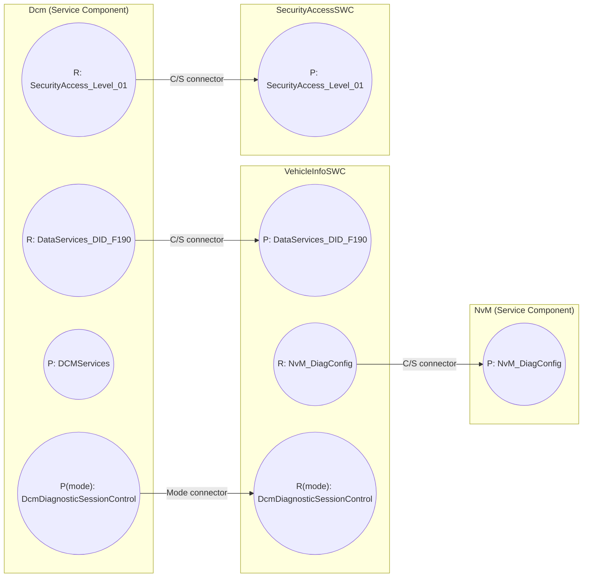
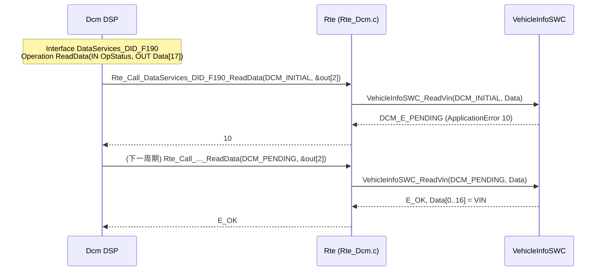

# Port 与 Port Interface：S/R、C/S、Mode Switch

> Prerequisite: [SWC 概念](01-swc-concept.md)
> Next: [Runnable 与 RTE Event](03-runnable-event.md)
> 对应规范: **本仓库无 RTE SWS、无 Software Component Template**——Port / Interface / DataElement / Operation / ApplicationError / ModeDeclarationGroup 均按 AUTOSAR R4.x 公认概念描述，需以项目 release 确认。DCM SWS CP R20-11 中可直接引用的端口接口：`SecurityAccess_<SecurityLevel>`（`SWS_Dcm_00685`，p.338–340）、`DataServices_<Data>`（`SWS_Dcm_00686`，p.341 起）、`RoutineServices_<RoutineName>`（`SWS_Dcm_00690`，p.362–377）、`DCMServices`（`SWS_Dcm_00698`，p.395–396）、Mode Switch 接口（p.406–415）；返回码 `E_OK 0 / E_NOT_OK 1 / DCM_E_PENDING 10 / DCM_E_COMPARE_KEY_FAILED 11 / DCM_E_FORCE_RCRRP 12`（p.338、p.363）。
> 对应源码: openAUTOSAR `examples/rte_simple/rte_simple_lib.arxml:156-271`；本项目 `examples/uds_diag_demo/rte/Rte_Dcm.h`、`rte/Rte_VehicleInfoSWC.h`、`rte/Rte_Dcm_Type.h`、`rte/SchM_Dcm.h`

---

## 1. 本章目标

读完本章你应该能：

1. 说清 **Port**（P-Port / R-Port）与 **Port Interface** 的区别：Port 是"插座"，Interface 是"插座的形状"。
2. 区分三种最重要的 Interface：**Sender/Receiver（S/R）**、**Client/Server（C/S）**、**Mode Switch**，并知道各自包含 **DataElement**、**Operation**（+ Argument + **ApplicationError**）、**ModeDeclarationGroup**。
3. 从一个 Interface 定义**推导出** RTE 会生成什么 API 名字和签名，例如从 `DataServices_DID_F190.ReadData(IN OpStatus, OUT Data)` 推出 `Std_ReturnType Rte_Call_DataServices_DID_F190_ReadData(Dcm_OpStatusType OpStatus, uint8 *Data)`。
4. 理解 DCM 端口接口为什么"名字由 DCM SWS 规定，内容由 DCM 配置决定"。

---

## 2. 为什么需要 Port 与 Interface？

假设两个团队分别写 Dcm 和 VehicleInfoSWC。如果没有正式的接口定义，会出现：

- Dcm 期望 `ReadVin(uint8 *buf)`，应用写成 `GetVin(uint8 *buf, uint8 len)`；
- 一方用 `uint8[17]`，另一方用 `char *`；
- 错误码 10 在一方表示"pending"，另一方表示"busy"。

AUTOSAR 的解决办法是：**接口先于实现，并且是机器可读的**。

- **Port Interface** 定义"能交换什么"：数据元素及其类型，或操作及其参数和可能的错误。
- **Port** 是 SWC 上的一个具名"插座"，引用一个 Interface，并声明方向（提供 P / 要求 R）。
- **Connector** 把一个 P-Port 和一个兼容的 R-Port 连起来。

工具在生成 RTE 之前就能检查：连在一起的两个 Port 的 Interface 是否兼容、类型是否一致、是否有 R-Port 没连。这些检查在 C 编译器层面是做不到的。

---

## 3. 在系统中的位置



逐条连线解释（每一条都对应 demo 中的一个 API）：

| 连线 | Interface 类型 | 谁调用 | demo 中的 API | demo 位置 |
|---|---|---|---|---|
| Dcm.R `DataServices_DID_F190` → VehicleInfoSWC.P | C/S | Dcm（client） | `Rte_Call_DataServices_DID_F190_ReadData` | 声明 `rte/Rte_Dcm.h:30`，实现 `rte/Rte_Dcm.c:54-62` |
| Dcm.R `SecurityAccess_Level_01` → SecurityAccessSWC.P | C/S | Dcm | `Rte_Call_SecurityAccess_Level_01_GetSeed/CompareKey` | `rte/Rte_Dcm.h:36-39`，`rte/Rte_Dcm.c:89-103` |
| VehicleInfoSWC.R `NvM_DiagConfig` → NvM.P | C/S | VehicleInfoSWC | `Rte_Call_NvM_DiagConfig_WriteBlock/ReadBlock/GetErrorStatus` | `rte/Rte_VehicleInfoSWC.h:42-47`（宏） |
| Dcm.P(mode) `DcmDiagnosticSessionControl` → VehicleInfoSWC.R(mode) | Mode Switch | Dcm 切换 / SWC 读取 | `SchM_Switch_Dcm_DcmDiagnosticSessionControl` / `Rte_Mode_DcmDiagnosticSessionControl_DcmDiagnosticSessionControl` | `rte/SchM_Dcm.h:18`、`rte/Rte_Dcm.c:134-144`、`rte/Rte_VehicleInfoSWC.h:51` |

---

## 4. AUTOSAR 如何定义？

> `[AUTOSAR Standard]` 本节的元素名（`SENDER-RECEIVER-INTERFACE`、`CLIENT-SERVER-INTERFACE`、`MODE-SWITCH-INTERFACE`、`IS-SERVICE`、`POSSIBLE-ERRORS` 等）为 R4.x 公认 schema 名称。**本仓库无 SWC Template / RTE SWS，需以项目 release 确认。**

### 4.1 Port：P-Port、R-Port、PR-Port

| Port 种类 | ARXML | 含义 | S/R 中 | C/S 中 | Mode 中 |
|---|---|---|---|---|---|
| **P-Port**（Provided） | `P-PORT-PROTOTYPE` + `PROVIDED-INTERFACE-TREF` | 我提供 | 我是 Sender（写数据） | 我是 Server（实现操作） | 我是 Mode Manager（切换模式） |
| **R-Port**（Required） | `R-PORT-PROTOTYPE` + `REQUIRED-INTERFACE-TREF` | 我需要 | 我是 Receiver（读数据） | 我是 Client（调用操作） | 我是 Mode User（读/响应模式） |
| PR-Port（R4.1+） | `PR-PORT-PROTOTYPE` | 同时读写 | 少用 | — | — |

openAUTOSAR 的真实例子：`examples/rte_simple/rte_simple_lib.arxml:97` 中 Calculator 的 P-Port 引用 `CLIENT-SERVER-INTERFACE CalculatorOperations`；`:297` 中 Tester 的 R-Port `Calculator` 引用同一接口——这就是一对可以连接的 C/S 端口。

**Port 还可以带 ComSpec**（通信规格），例如 S/R 的 `INIT-VALUE`、队列长度、`ALIVE-TIMEOUT`；C/S 的 `QUEUE-LENGTH`。ComSpec 属于 Port 而不属于 Interface——同一个 Interface 在不同 Port 上可以有不同初值。

### 4.2 Sender/Receiver Interface：DataElement

```text
SenderReceiverInterface  VehicleSpeedIf
 └── DataElement  speed : uint16  (unit km/h * 100)
```

| 属性 | 含义 | 影响 |
|---|---|---|
| `DATA-ELEMENTS / VARIABLE-DATA-PROTOTYPE`（R4.x；AR 3.x 叫 `DATA-ELEMENT-PROTOTYPE`） | 一个可传输的数据项 | 每个 DataElement 生成一组 `Rte_Read_<p>_<d>` / `Rte_Write_<p>_<d>` |
| 类型（ImplementationDataType / ApplicationDataType） | 数据的 C 类型与物理语义 | 生成到 `Rte_Type.h` |
| `IS-QUEUED`（`SwDataDefProps` / ComSpec 中的队列语义） | **unqueued = last-is-best**；queued = 事件队列 | unqueued → `Rte_Read/Rte_Write`；queued → `Rte_Receive/Rte_Send` |
| `IS-SERVICE` | 该 Interface 是否由 BSW 服务提供 | Dcm/NvM 的接口都是 service interface |

openAUTOSAR 例子：`rte_simple_lib.arxml:206-233` 定义 `ArgumentIf`，含 `arg1`、`arg2` 两个 `UInt8` DataElement（AR 3.1.5 写法）。详细语义见 [07-sender-receiver.md](07-sender-receiver.md)。

### 4.3 Client/Server Interface：Operation、Argument、ApplicationError

```text
ClientServerInterface  DataServices_DID_F190        (IS-SERVICE = true)
 ├── PossibleError  E_NOT_OK      = 1
 ├── PossibleError  DCM_E_PENDING = 10
 └── Operation  ReadData
       ├── Argument  OpStatus : Dcm_OpStatusType  IN
       ├── Argument  Data     : Dcm_Data17ByteType OUT
       └── PossibleErrorRef  E_NOT_OK, DCM_E_PENDING
```

| 元素 | 含义 | 影响生成的 API |
|---|---|---|
| **Operation** | 一个可被调用的服务 | 生成 `Rte_Call_<p>_<o>` |
| **Argument**（`ARGUMENT-DATA-PROTOTYPE`） | 参数，带方向 IN / OUT / INOUT | IN 标量按值；OUT/INOUT 和数组按指针 |
| **ApplicationError**（`APPLICATION-ERROR`，`POSSIBLE-ERRORS`） | 应用级错误码（名字 + 数值），Operation 引用它可能返回的那些 | 返回值类型统一为 `Std_ReturnType`，错误码数值被生成成宏（如 `RTE_E_DataServices_DID_F190_DCM_E_PENDING`，具体宏名以生成器为准） |
| `IS-SERVICE` | 是否服务接口 | 服务接口通常由 BSW 实现 |

openAUTOSAR 例子：`rte_simple_lib.arxml:156-205` 的 `CalculatorOperations.Multiply`，参数 `arg1 IN`（`:180`）、`arg2 IN`（`:190`）、`result OUT`（`:200`）。生成的 client API 应形如 `Rte_Call_Tester_Calculator_Multiply(arg1, arg2, &result)`——这正是 `examples/rte_simple/Tester.c:16` 所调用的（注意它的命名带了组件名前缀 `Tester_`，这是 AR 3.x / Arctic Core 的命名风格；R4.x 公认风格是 `Rte_Call_<port>_<operation>`，不带组件名）。

**ApplicationError 的意义**：C/S 调用的返回值有两个来源：

1. **RTE 自身的基础设施错误**（R4.x 公认的 `RTE_E_OK = 0`、`RTE_E_TIMEOUT`、`RTE_E_COM_STOPPED`、`RTE_E_UNCONNECTED`、`RTE_E_LIMIT` 等，具体值以项目 `Rte.h` 为准；openAUTOSAR 的 `include/Rte.h` 只有这些错误码定义）。
2. **server 返回的应用错误**（ApplicationError）。DCM 的接口把 `DCM_E_PENDING = 10`、`DCM_E_COMPARE_KEY_FAILED = 11`、`DCM_E_FORCE_RCRRP = 12` 定义为 ApplicationError（DCM SWS R20-11 p.338、p.363）。

所以 Dcm 收到 `10` 时知道这是"server 说还没好"，而不是 RTE 出了问题。demo 中这些值定义在 `rte/Rte_Dcm_Type.h:27-29`。

### 4.4 Mode Switch Interface：ModeDeclarationGroup

```text
ModeSwitchInterface  DcmDiagnosticSessionControl
 └── ModeGroup : ModeDeclarationGroup DcmDiagnosticSessionControl
        modes: DEFAULT_SESSION, PROGRAMMING_SESSION, EXTENDED_DIAGNOSTIC_SESSION, ...
```

- **Mode Manager**（P-Port）调用 `Rte_Switch_<p>_<m>(mode)`；BSW 作为 mode manager 时用 `SchM_Switch_<bsnp>_<m>`。DCM SWS R20-11 规定 DCM 用 `SchM_Switch_<bsnp>_DcmDiagnosticSessionControl` 通知会话变化（研究笔记 02 §3.4，S3 超时回默认会话时也调用它）。
- **Mode User**（R-Port）调用 `Rte_Mode_<p>_<m>()` 读取当前模式，或者通过 `SwcModeSwitchEvent` 在进入/退出某模式时被触发 runnable，或在 runnable 上配置 `ModeDisablingDependency`（某模式下禁止该 runnable 运行）。
- DCM 规定的 Mode Switch 接口有 8 个（p.406–415），例如 `DcmDiagnosticSessionControl`、`DcmEcuReset`、`DcmSecurityAccess`、`DcmControlDTCSetting`、`DcmCommunicationControl_<Channel>` 等（具体列表以规范为准）。

为什么诊断 SWC 需要 Mode？例如：**某个 routine 只能在 Extended Session 下运行**，或者 **进入 Programming Session 时应用要停止输出**。SWC 不应该调用 `Dcm_GetSesCtrlType()`（那是 BSW C API），而应该通过 Mode Port 获得会话信息。

### 4.5 其他 Interface（简述）

| Interface | 用途 | 典型 API |
|---|---|---|
| `PARAMETER-INTERFACE` | 标定参数（只读） | `Rte_Prm_<p>_<d>()` |
| `NV-DATA-INTERFACE` | NV 数据（与 NvBlock SWC 配合） | `Rte_Read/Write` 形态；DCM R19-11 起有 `USE_ATOMIC_NV_DATA_INTERFACE`（研究笔记 02 §6.1） |
| `TRIGGER-INTERFACE` | 外部触发 | `Rte_Trigger_<p>_<t>()` |

---

## 5. 核心数据结构：DCM 的端口接口如何"由配置决定"

DCM 端口接口最容易让人困惑的一点：**名字模板来自 DCM SWS，具体 Operation 和参数来自 DCM 的 ECUC 配置。**

| 配置项（ECUC，R20-11） | 决定什么 |
|---|---|
| `DcmDspData` 的 short name（如 `DID_F190`） | Port / Interface 名中的 `<Data>`：`DataServices_DID_F190` |
| `DcmDspDataUsePort`（`ECUC_Dcm_00713`，p.537–539） | 是 C/S 还是 S/R；同步还是异步（有没有 `OpStatus`）；是否带 `ErrorCode` |
| `DcmDspDataType`、`DcmDspDataByteSize` | `Data` 参数的类型（如 `uint8[17]`） |
| `DcmDspDidRead` / `DcmDspDidWrite` 存在与否 | 有没有 `ReadData` / `WriteData` Operation |
| `DcmDspDataConditionCheckReadFncUsed` 等 | 有没有 `ConditionCheckRead` Operation |
| `DcmDspSecurityRow` short name、`DcmDspSecurityUsePort`（`00967`，p.652） | `SecurityAccess_<Level>`；`GetSeed` 是否带 `SecurityAccessDataRecord` |
| `DcmDspRoutine` short name、`DcmDspRoutineUsePort`（`00724`，p.608）、signal 配置 | `RoutineServices_<Routine>`；`Start` 的 `dataIn_n / dataOut_n` 参数列表（p.192–193） |

`DcmDspDataUsePort` 与签名的对应（DCM SWS R20-11 p.269–276，研究笔记 02 §3.9）：

| `DcmDspDataUsePort` | 生成什么 | `ReadData` 签名（Dcm 视角的 C 原型） | 规范 ID |
|---|---|---|---|
| `USE_DATA_SYNCH_CLIENT_SERVER` | C/S Port `DataServices_<Data>` | `Std_ReturnType Xxx_ReadData(uint8* Data)` | `SWS_Dcm_00793` |
| `USE_DATA_ASYNCH_CLIENT_SERVER` | C/S Port | `Std_ReturnType Xxx_ReadData(Dcm_OpStatusType OpStatus, uint8* Data)` | `SWS_Dcm_91006` |
| `USE_DATA_ASYNCH_CLIENT_SERVER_ERROR` | C/S Port | `Xxx_ReadData(OpStatus, Data, Dcm_NegativeResponseCodeType* ErrorCode)` | `SWS_Dcm_91005` |
| `USE_DATA_SENDER_RECEIVER(_AS_SERVICE)` | S/R Port | 无 operation，Dcm 读数据元素 | §8.8.2.2 p.336 |
| `USE_DATA_SYNCH_FNC` / `USE_DATA_ASYNCH_FNC(_ERROR)` | **无 Port**，C callout 函数 | 同上签名，函数名由 `DcmDspDataReadFnc` 配置 | p.225–226 示例 |
| `USE_BLOCK_ID` | 无 Port，Dcm 直接调 NvM | — | `SWS_Dcm_00560` |
| `USE_ECU_SIGNAL` | 无 Port，Dcm 调 IoHwAb | `IoHwAb_Dcm_Read<EcuSignalName>()` | `SWS_Dcm_00578` |

把它和 demo 对照（`examples/uds_diag_demo/rte/Rte_Dcm.h:30-34`）：

```c
Std_ReturnType Rte_Call_DataServices_DID_F190_ReadData(Dcm_OpStatusType OpStatus, uint8 *Data);   /* [Educational Implementation] ASYNCH */
Std_ReturnType Rte_Call_DataServices_DID_F187_ReadData(uint8 *Data);                              /* SYNCH  */
Std_ReturnType Rte_Call_DataServices_DID_F1A0_ReadData(uint8 *Data);
Std_ReturnType Rte_Call_DataServices_DID_F1A0_WriteData(const uint8 *Data, Dcm_OpStatusType OpStatus,
                                                        Dcm_NegativeResponseCodeType *ErrorCode);
```

> `[Educational Implementation]` 注意 demo 的一处**刻意简化**：DID F1A0 的 `ReadData` 是同步签名，`WriteData` 却是异步签名（`Dcm_Cfg.c:44-47` 中 F1A0 的 `usePort` 是 `DCM_USE_DATA_SYNCH_CLIENT_SERVER`）。在真实 R20-11 配置中，**一个 `DcmDspData` 只有一个 `DcmDspDataUsePort`**，它同时决定 ReadData 与 WriteData 的签名：选 `USE_DATA_SYNCH_CLIENT_SERVER` 时 WriteData 也应是同步形态 `Xxx_WriteData(const uint8* Data, Dcm_NegativeResponseCodeType* ErrorCode)`（`SWS_Dcm_00794`）。demo 这样做是为了在一个 DID 上同时演示"同步读"和"NvM 异步写"。真实项目里要么整个 DID 用 ASYNCH，要么拆成两个 `DcmDspData`。

---

## 6. 初始化流程

Port 和 Interface 本身没有"初始化"，但有两件事发生在启动时：

1. **S/R 的 init value**：RTE 在 `Rte_Start` 中（或作为 `.data` 段初值）把每个 unqueued 数据元素的缓冲设为 ComSpec 里的 `INIT-VALUE`。所以 Receiver 在 Sender 第一次写之前读到的是初值，而不是随机值。
2. **Mode 的初始模式**：每个 ModeDeclarationGroup 有 `INITIAL-MODE`。demo 中 `rte/Rte_Dcm.c:24` 的 `static Dcm_SesCtrlType Rte_ModeDcmDiagnosticSessionControl = DCM_DEFAULT_SESSION;`，以及 `Rte_Start` 中 `:40` 的再次赋值，就是"初始模式"的手写版。

---

## 7. Runtime Flow：从 Interface 定义到一次调用



逐跳解释：

1. **DSP → RTE**：`diag/Dcm_Dsp.c:349` 通过 `Dcm_Cfg.c:36` 中配置的函数指针 `readAsync` 调用 `Rte_Call_DataServices_DID_F190_ReadData`。参数 `OpStatus` 是 Interface 中的 IN Argument，`Data` 是 OUT Argument（数组 → 指针）。
2. **RTE → SWC**：`rte/Rte_Dcm.c:59` 直接调用 server runnable。名字 `VehicleInfoSWC_ReadVin` 来自（真实项目中）ARXML 的 runnable `SYMBOL`，与 Interface 名无关。
3. **SWC → RTE → DSP 返回 10**：10 是 Interface 中声明的 ApplicationError `DCM_E_PENDING`。RTE 原样转发。
4. **再次调用**：OpStatus 变成 `DCM_PENDING`，是 Dcm 的行为（`SWS_Dcm_00530`），RTE 和 Interface 都不管"第几次"。
5. **E_OK**：只有此时 OUT 参数 `Data` 才有效（`SWS_Dcm_01187`，p.223–224）。

---

## 8. RH850 Hardware Mapping

`[RH850 Hardware]` Port 与 Interface 是纯软件抽象，不对应任何寄存器。和硬件相关的只有两点：

- **数据一致性**：S/R 数据元素若大于一次原子访问的宽度（例如 17 字节 VIN、或 64 位数），在可抢占的 task 之间传递时需要 RTE 加保护。RH850G3M 是 32 位 CPU，对齐的 32 位读写是单条指令；更大的数据需要 RTE 用中断屏蔽或 OS 资源保护——具体由 RTE 生成器决定。
- **P1M-E 单核**：所有 Port 连接都在同一核内（无 IOC 跨核）。在多核 RH850（如 U2A 系列）上，跨核 S/R 会使用 OS IOC，需根据实际芯片与 OS 手册确认。

---

## 9. openAUTOSAR 实现

| 位置 | 内容 | 评价 |
|---|---|---|
| `examples/rte_simple/rte_simple_lib.arxml:156-205` | `CLIENT-SERVER-INTERFACE CalculatorOperations`，Operation `Multiply`，3 个 Argument（IN/IN/OUT） | 标准的 C/S 接口定义 |
| `rte_simple_lib.arxml:206-271` | 3 个 `SENDER-RECEIVER-INTERFACE`：`ArgumentIf`、`ResultIf`、`FreqReqIf` | 标准的 S/R 接口定义，未声明 `IS-QUEUED`、无 init value |
| `rte_simple_lib.arxml:419-434` | Tester runnable 的 `SYNCHRONOUS-SERVER-CALL-POINT CallCalculator`，引用 R-Port `Calculator` 与 Operation `Multiply` | 说明"client 调用"需要在 Internal Behavior 中**显式声明调用点**，否则 RTE 不生成 `Rte_Call` |
| `diagnostic/Dcm/include/Rte_Dcm.h:23-28` | 只有 include guard 的空文件 | **openAUTOSAR 的 Dcm 没有任何端口接口**；它用配置中的 C 函数指针调用应用（相当于 R4.x 的 `USE_DATA_SYNCH_FNC`），`DspDidUsePort` 字段从未被读取（研究笔记 03 §4.4） |

---

## 10. 当前教学项目实现

`[Educational Implementation]` demo 中 Interface 没有 ARXML 形式，而是以"已生成"的结果出现：

| Interface 概念 | 在 demo 的哪里 |
|---|---|
| `DataServices_DID_F190/F187/F1A0`、`SecurityAccess_Level_01`、`RoutineServices_Routine_FF00` 的 client 侧 API | `rte/Rte_Dcm.h:30-47` |
| 上述接口的 server runnable 原型 | `rte/Rte_VehicleInfoSWC.h:26-36`、`rte/Rte_SecurityAccessSWC.h:15-19` |
| 接口用到的类型（`Dcm_OpStatusType`、NRC、ApplicationError 值） | `rte/Rte_Dcm_Type.h:19-54` |
| NvM 服务接口（client 侧，宏形态） | `rte/Rte_VehicleInfoSWC.h:42-47` |
| Mode Switch `DcmDiagnosticSessionControl`（manager 侧 / user 侧） | `rte/SchM_Dcm.h:18`、`rte/Rte_VehicleInfoSWC.h:51`、实现 `rte/Rte_Dcm.c:134-144` |
| Mode Switch `DcmEcuReset` | `rte/SchM_Dcm.h:21`、`rte/Rte_Dcm_Type.h:78-82`、`rte/Rte_Dcm.c:146-155` |

---

## 11. Code Walkthrough：从 Interface 推导 API

**练习：给定 Interface，写出生成的 API。**

`[Conceptual]` 规则（R4.x 公认命名，**本仓库无 RTE SWS，需以项目 release 确认**）：

| Interface 类型 | 访问方 | 生成 API 模板 |
|---|---|---|
| S/R unqueued，显式访问 | Receiver | `Std_ReturnType Rte_Read_<p>_<d>(<type>* data)` |
| S/R unqueued，显式访问 | Sender | `Std_ReturnType Rte_Write_<p>_<d>(<type> data)`（复合类型传指针） |
| S/R queued | Receiver / Sender | `Rte_Receive_<p>_<d>(...)` / `Rte_Send_<p>_<d>(...)` |
| S/R 隐式访问 | Runnable | `<type> Rte_IRead_<r>_<p>_<d>()` / `void Rte_IWrite_<r>_<p>_<d>(<type>)` |
| C/S | Client | `Std_ReturnType Rte_Call_<p>_<o>(<args>)` ；异步时另有 `Rte_Result_<p>_<o>(<OUT args>)` |
| Mode | User | `<ModeType> Rte_Mode_<p>_<m>()` |
| Mode | Manager（SWC） | `Std_ReturnType Rte_Switch_<p>_<m>(<ModeType>)` |
| Mode | Manager（BSW） | `SchM_Switch_<bsnp>_<m>(...)` |

应用到 `DataServices_DID_F190`：

```text
p = DataServices_DID_F190    (Dcm 的 R-Port 名)
o = ReadData                 (Operation 名)
args = (IN Dcm_OpStatusType OpStatus, OUT uint8 Data[17])
⇒ Std_ReturnType Rte_Call_DataServices_DID_F190_ReadData(Dcm_OpStatusType OpStatus, uint8 *Data);
```

与 `rte/Rte_Dcm.h:30` 完全一致。

`[Real Project Consideration]` 真实生成头中通常还会：

- 用 Compiler Abstraction 宏：`FUNC(Std_ReturnType, RTE_CODE) Rte_Call_...(VAR(Dcm_OpStatusType, AUTOMATIC) OpStatus, P2VAR(Dcm_Data17ByteType, AUTOMATIC, RTE_APPL_DATA) Data)`；
- 把数组参数声明为生成的数组 typedef（如 `Dcm_Data17ByteType`），而不是 `uint8*`（`rte/Rte_Dcm.h:22-23` 注释提到这一点）；
- 部分生成器在 BSW 服务组件的 API 名中加入组件前缀，具体以生成的 `Rte_Dcm.h` 为准。

---

## 12. Debug 方法

| 症状 | 先查什么 |
|---|---|
| 链接错误 `undefined reference to Rte_Call_DataServices_DID_XXXX_ReadData` | DCM 配置里该 DID 用了 C/S port，但 RTE 未重新生成，或该 R-Port 未连接 |
| 编译错误：server runnable 原型不匹配 | Interface 改了（例如 `DcmDspDataUsePort` 从 SYNCH 改为 ASYNCH，多了 `OpStatus`），SWC 代码没跟着改 |
| Dcm 收到奇怪的返回值（如 `0x81`） | 可能是 RTE 基础设施错误（如 unconnected、timeout）而不是应用错误；查项目 `Rte.h` 中 `RTE_E_*` 的值 |
| SWC 读到的 Mode 永远是初始值 | Mode Port 未连接到 Dcm 的 mode manager 端口，或 Dcm 用的 `SchM_Switch` 对应的 mode group 与 SWC 引用的不是同一个 |

demo 中断点建议：`rte/Rte_Dcm.c:54`（看 OpStatus 与 Data 指针）、`rte/Rte_Dcm.c:134`（看会话切换是否传播到 mode user）。

---

## 13. 常见问题 / 常见错误

1. **把 Port 名当成 Interface 名**：API 名用的是 **Port 名**（`Rte_Call_<Port>_<Op>`）。DCM 的端口名与接口名恰好同名（都叫 `DataServices_DID_F190`），所以初学者容易混；其他 SWC 中两者经常不同（例如 Port `NvM_DiagConfig` 引用 Interface `NvMService`）。
2. **以为 ApplicationError 就是 NRC**：`DCM_E_PENDING = 10` 是 C/S ApplicationError，不是 NRC。NRC 由 `ErrorCode` OUT 参数传递（`Dcm_NegativeResponseCodeType`）。0x78 甚至**不在** `Dcm_NegativeResponseCodeType` 中（DCM SWS R20-11 p.304–307；demo `rte/Rte_Dcm_Type.h:50-54` 注释）——SWC 无法"返回 0x78"。
3. **改了 DCM 的 UsePort 却忘了 SWC**：SYNCH ↔ ASYNCH 切换会改变 Interface 的 Argument 列表，所有 server runnable 都要改签名。这是 DCM 升级中最常见的编译错误来源之一（研究笔记 02 §6.2 第 2 点）。
4. **S/R 当 C/S 用**：用 S/R 让 Dcm "读 VIN" 时，Dcm 读的是 RTE 缓冲中的最新值，**SWC 的代码不会在读的那一刻执行**。如果 VIN 需要按需计算或从 NvM 异步读取，必须用 C/S。
5. **SWC 直接调 `Dcm_GetSesCtrlType`**：功能上可行，但绕过了 Mode Switch 接口，跨分区时会违反内存保护，且使 SWC 依赖 Dcm 头文件。

---

## 14. 实验

1. **推导练习**：不看 demo，仅根据 `RoutineServices_Routine_FF00` 的 Operation 定义（`Start(IN OpStatus, OUT ErrorCode)`、`Stop(IN OpStatus, OUT ErrorCode)`、`RequestResults(IN OpStatus, OUT Out_RoutineStatus: uint8, OUT ErrorCode)`）写出三个 `Rte_Call_*` 原型，然后与 `rte/Rte_Dcm.h:41-47` 对比。
2. **ApplicationError 观察**：运行 demo，在 `trace.txt` 中 grep `"<- DCM_E_PENDING"`，统计 F190 与 F1A0 各返回了几次 10，并找到对应的 `DCM_PENDING` 重调行。
3. **签名差异实验（只读）**：对比 `Dcm_Cfg.h:82-85` 的三个函数指针 typedef，说明它们分别对应 `DcmDspDataUsePort` 的哪个取值，以及为什么 Dcm 需要 `usePort` 字段（`Dcm_Cfg.h:89`）来决定调用哪一个。

---

## 15. 思考题

1. 为什么 ComSpec（如 init value）挂在 Port 上而不是 Interface 上？举一个"同一 Interface，两个 Port 需要不同初值"的例子。
2. `DataServices_DID_F190` 的 Interface 由谁"拥有"？DCM 供应商、应用团队、还是集成者？如果 DID 长度从 17 改为 20，哪些产物要重新生成？
3. Mode Switch 与 S/R 都能"告诉 SWC 当前会话"。为什么 AUTOSAR 要专门设计 Mode Switch？（提示：ModeDisablingDependency、SwcModeSwitchEvent、模式切换的原子性。）
4. openAUTOSAR 的 Dcm 用函数指针调用应用，demo 的 Dcm 也用函数指针（只是指针指向 `Rte_Call_*`）。两者的本质区别是什么？

---

## 16. 对未来真实项目的意义

`[Real Project Consideration]`

- 在真实工程中，**DCM 的 Port Interface 通常由 DCM 配置工具从 CDD/ODX → ECUC 自动生成**，再导出为 Service Component Description ARXML。应用团队拿到的是"已经定好的接口"，只需实现 server runnable。
- DCM 升级（例如 RTA-CAR 换版本或 AUTOSAR release 升级）时，第一件事是**比较新旧生成的 `Rte_Dcm.h` 与 `Rte_<DiagSwc>.h`**：Operation 是否多了 `OpStatus` / `ErrorCode`，数组 typedef 名是否变了，`RoutineServices_*_Stop` 是否带 `OpStatus`（R20-11 C 原型 `SWS_Dcm_01204` 与 C/S 接口描述不一致，研究笔记 02 §3.9 "规范瑕疵"）。
- 找"某 DID 最终由哪个函数实现"时，路径永远是：`DcmDspDid` → `DcmDspData` → `UsePort` → Port 名 → ECU Extract 中的 Connector → 对端 SWC 的 P-Port → `OperationInvokedEvent` → Runnable `SYMBOL`。

---

## 17. 本章总结

```text
Port      = SWC 上的具名插座（P 提供 / R 需要），API 名用的是 Port 名
Interface = 插座形状
  S/R : DataElement（类型、queued/unqueued、init value 在 ComSpec）
  C/S : Operation + Argument(IN/OUT/INOUT) + ApplicationError
  Mode: ModeDeclarationGroup（manager 切换 / user 读取或被触发）
DCM 端口接口名由 DCM SWS 规定（DataServices_<Data> 等），
具体 Operation/参数由 DCM ECUC 配置（DcmDspDataUsePort 等）决定。
```

## 18. 下一章

Port 说明了"能交换什么"，但还没回答"谁的代码、在什么时候执行"。下一章 [03-runnable-event.md](03-runnable-event.md) 讲 Runnable、RTE Event、runnable 到 OS task 的映射以及 Exclusive Area——正是它们决定了 `VehicleInfoSWC_ReadVin` 为什么会在 `Dcm_MainFunction` 的上下文中执行。
