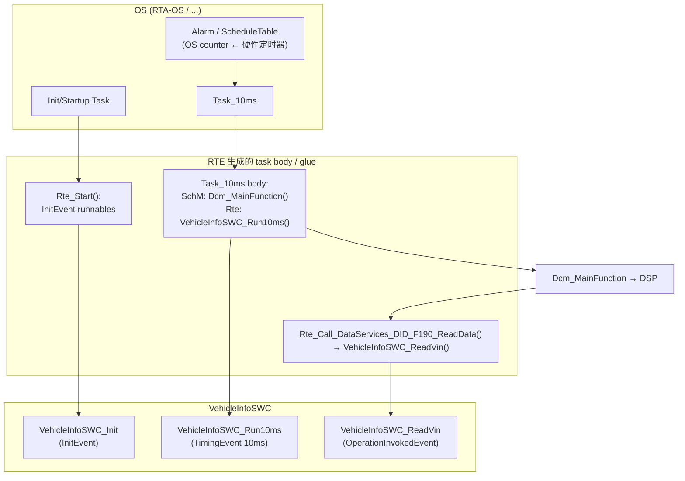
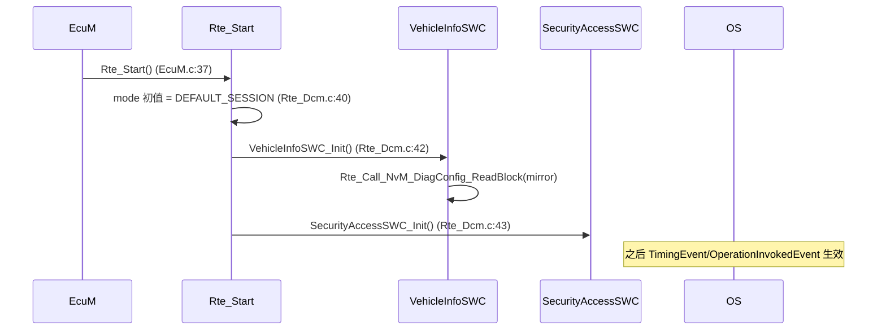
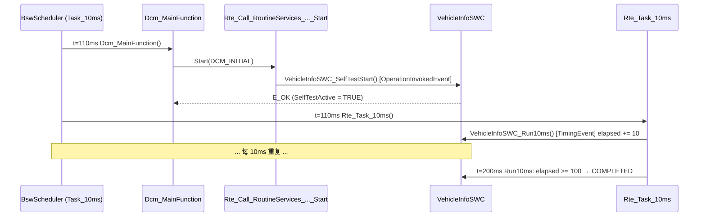

# Runnable 与 RTE Event：SWC 的代码什么时候、在哪里执行

> Prerequisite: [Port 与 Interface](02-port-interface.md), [OS、Task 与 ISR](../02-autosar-classic/06-os-task-isr.md), [Interrupt / Task / MainFunction / Runnable](../02-autosar-classic/07-mainfunction-scheduling.md)
> Next: [RTE 概念](04-rte-concept.md)
> 对应规范: **本仓库无 RTE SWS、无 SWC Template、无 OS SWS**。RunnableEntity、RTEEvent（TimingEvent / OperationInvokedEvent / DataReceivedEvent / InitEvent / SwcModeSwitchEvent …）、RTEEvent-to-task mapping、ExclusiveArea 及 `Rte_Enter/Rte_Exit`、`SchM_Enter/SchM_Exit` 均按 AUTOSAR R4.x 公认概念描述，需以项目 release 确认。可引用：DCM SWS R20-11 `Dcm_MainFunction`（`SWS_Dcm_00053`，p.260–261，由 BSW Scheduler 周期调用、不可重入）、`DcmTaskTime`（`ECUC_Dcm_00820`，p.678，须与 RTE 中一致）；IoHwAb R24-11 `00032/00033`（p.27：BswInterruptEntity 在中断上下文执行）。
> 对应源码: openAUTOSAR `examples/rte_simple/rte_simple_lib.arxml:101-135, :337-473`、`rte/src/rte.c:22-29`；本项目 `examples/uds_diag_demo/rte/Rte_Dcm.c:38-50`、`integration/BswScheduler.c:25-57`、`swc/VehicleInfoSWC.c`、`rte/SchM_Dcm.h`

---

## 1. 本章目标

读完本章你应该能：

1. 说出 **Runnable Entity** 是什么：SWC 中一个**由 RTE 调用**、没有固定调用者的 C 函数。
2. 说出最常用的六种 **RTE Event**：`TimingEvent`、`InitEvent`、`OperationInvokedEvent`、`DataReceivedEvent`、`SwcModeSwitchEvent`、`AsynchronousServerCallReturnsEvent`，以及它们分别会让 RTE 在哪里生成调用代码。
3. 理解 **RTEEvent → OS Task 映射**：同一个 runnable 的执行上下文是**配置决定的**，不是代码决定的。
4. 解释为什么 `VehicleInfoSWC_ReadVin` 在 `Dcm_MainFunction` 的 task 中执行，而 `VehicleInfoSWC_Run10ms` 在 `Rte_Task_10ms` 中执行。
5. 理解 **Exclusive Area** 解决什么问题、通常如何实现、在 RH850 上最终落到什么机制。

---

## 2. 为什么需要 Runnable 和 Event？

### 2.1 SWC 不能有 `main()`，也不能自己 `while(1)`

在一个 ECU 上，几十个 SWC 和几十个 BSW 模块共享一个（P1M-E 上）CPU。如果每个 SWC 自己决定何时运行：

- 没法做最坏响应时间分析；
- 无法把负载从 10 ms task 搬到 20 ms task；
- 两个 SWC 访问同一数据时谁也不知道对方会不会打断自己。

所以 AUTOSAR 规定：**SWC 只声明"我有哪些函数（Runnable）、它们应该在什么事件发生时被调用（Event）"，真正的调用代码由 RTE 生成，放在由集成者配置的 OS task 里。**

### 2.2 Event 的本质：把"触发条件"从代码里拿出来

| 传统写法 | AUTOSAR 写法 |
|---|---|
| 在 `task_10ms()` 里手写 `vehicle_info_10ms();` | ARXML：`TimingEvent(period=0.01) → Runnable Run10ms`；集成者把这个 Event 映射到 `Task_10ms`，RTE 生成调用 |
| 在 `diag_handle_22()` 里手写 `read_vin(buf);` | ARXML：`OperationInvokedEvent(DataServices_DID_F190.ReadData) → Runnable ReadVin`；RTE 生成 `Rte_Call_DataServices_DID_F190_ReadData` 的实现 |
| 在 CAN 接收中断里手写 `on_speed_received();` | ARXML：`DataReceivedEvent(Speed.speed) → Runnable OnSpeed`；RTE 在 Com 回调中激活 task / 设置事件 |

---

## 3. 在系统中的位置



逐条解释：

1. **Alarm → Task_10ms**：OS counter（由硬件定时器驱动）到期后激活 task。这是 OS 配置，与 SWC 无关。
2. **Task_10ms → task body**：task 的函数体由 RTE/SchM 生成，里面按配置的顺序调用映射到该 task 的 BSW MainFunction 与 SWC runnable。demo：`integration/BswScheduler.c:48-52`（`Dcm_MainFunction(); Rte_Task_10ms();`）。
3. **task body → `VehicleInfoSWC_Run10ms`**：TimingEvent runnable。demo：`rte/Rte_Dcm.c:46-50`。
4. **task body → `Dcm_MainFunction` → `Rte_Call_...` → `VehicleInfoSWC_ReadVin`**：OperationInvokedEvent runnable。**它没有被映射到任何 task**，而是在 client（Dcm）调用 `Rte_Call` 时被直接执行——所以它"继承"了 Dcm 的 task 上下文。
5. **Startup → `Rte_Start` → `VehicleInfoSWC_Init`**：InitEvent runnable。demo：`rte/Rte_Dcm.c:38-44`。

---

## 4. AUTOSAR 如何定义？

> `[AUTOSAR Standard]` 以下为 R4.x 公认概念；**本仓库无 RTE SWS，需以项目 release 确认**事件类型全称与属性名。

### 4.1 Runnable Entity

| 属性（ARXML） | 含义 |
|---|---|
| `SHORT-NAME` | runnable 在模型中的名字 |
| `SYMBOL` | **C 函数名**。RTE 生成的调用代码和 `Rte_<Swc>.h` 中的原型用的就是它 |
| `CAN-BE-INVOKED-CONCURRENTLY` | 是否可重入。为 false 时，RTE/集成者要保证它不会被同时执行（例如两个 client 在两个 task 中同时调用同一个 server） |
| `MINIMUM-START-INTERVAL` | 两次启动的最小间隔 |
| `DATA-READ-ACCESSS` / `DATA-WRITE-ACCESSS` | 隐式 S/R 访问（→ `Rte_IRead/IWrite`） |
| `DATA-RECEIVE-POINT-BY-ARGUMENTS` / `DATA-SEND-POINTS` | 显式 S/R 访问（→ `Rte_Read/Write/Receive/Send`） |
| `SERVER-CALL-POINTS` | 调用哪些 C/S Operation（→ `Rte_Call`） |
| `MODE-ACCESS-POINTS` / `MODE-SWITCH-POINTS` | 读/切 mode（→ `Rte_Mode` / `Rte_Switch`） |
| `CAN-ENTER-EXCLUSIVE-AREAS` / `RUNS-INSIDE-EXCLUSIVE-AREAS` | 使用哪些 Exclusive Area |

**一个关键原则：runnable 只能使用它在 ARXML 中声明过的 RTE API。** 例如 `VehicleInfoSWC_WriteDiagConfig` 要调用 `Rte_Call_NvM_DiagConfig_WriteBlock`，就必须在它的 Internal Behavior 中声明一个指向 `NvM_DiagConfig.WriteBlock` 的 server call point。没声明，RTE 生成器可能根本不生成这个 API（编译失败），或者生成了但在多 runnable 场景下优化错误。

openAUTOSAR 的真实例子：`examples/rte_simple/rte_simple_lib.arxml:419-435` 中 `TesterRunnable` 声明了 `SYNCHRONOUS-SERVER-CALL-POINT CallCalculator`，并以 `SYMBOL TesterRunnable` 结束；`Tester.c:16` 对应的正是 `Rte_Call_Tester_Calculator_Multiply`。

Runnable 的 C 原型（R4.x 公认形态）：

```c
/* [Conceptual] 普通 runnable：无参数、无返回值 */
FUNC(void, VehicleInfoSWC_CODE) VehicleInfoSWC_Run10ms(void);

/* [Conceptual] server runnable：参数 = Operation 的 Argument，返回值 = Std_ReturnType（若 Operation 有 PossibleError） */
FUNC(Std_ReturnType, VehicleInfoSWC_CODE) VehicleInfoSWC_ReadVin(Dcm_OpStatusType OpStatus,
                                                                  P2VAR(uint8, AUTOMATIC, RTE_APPL_DATA) Data);

/* [Conceptual] 多实例 SWC：第一个参数是 Rte_Instance */
FUNC(void, Xxx_CODE) Xxx_Run10ms(Rte_Instance self);
```

### 4.2 RTE Event 类型

| Event | 触发条件 | RTE 生成的调用位置 | 典型用途 | demo |
|---|---|---|---|---|
| **TimingEvent** | 周期到期（`PERIOD`） | 映射 task 的 task body 中 | 周期控制、超时计数 | `VehicleInfoSWC_Run10ms`，`rte/Rte_Dcm.c:46-50` |
| **InitEvent** | RTE 启动 | `Rte_Start()` 内（或专门的 init task） | 初始化内部状态、读 NV | `VehicleInfoSWC_Init`，`rte/Rte_Dcm.c:42-43` |
| **OperationInvokedEvent** | client 调用了本 SWC P-Port 上的某个 Operation | `Rte_Call_<p>_<o>` 的实现中（同步直接调用），或 server 所在 task 中（跨 task/异步） | **所有 server runnable** —— 诊断 SWC 的主力 | `VehicleInfoSWC_ReadVin` 等，`rte/Rte_Dcm.c:54-130` |
| **DataReceivedEvent** | R-Port 上收到新数据（S/R） | Sender 的 `Rte_Write` 或 Com 回调中（激活 task / 直接调用） | 事件驱动处理 | demo 无；openAUTOSAR `rte_simple_lib.arxml:356-368`（`RecFreqReq → FreqReqRunnable`） |
| **DataReceiveErrorEvent** | 接收超时 / 无效 | 同上 | 信号失效处理 | — |
| **SwcModeSwitchEvent** | 进入/退出某 mode | `Rte_Switch` / `SchM_Switch` 的实现中 | "进入 Programming Session 时停止输出" | demo 无（demo 用 `Rte_Mode` 轮询） |
| **AsynchronousServerCallReturnsEvent** | 异步 C/S 调用的结果到达 | server 完成处 | 异步 client 取结果 | — |
| **BackgroundEvent** | 空闲 | 最低优先级 task | 非实时工作 | — |
| **DataWriteCompletedEvent / DataSendCompletedEvent** | 发送完成 | Com 确认回调 | 发送确认 | — |

**OperationInvokedEvent 是理解 "DCM 如何调用 SWC" 的关键**：server runnable 不是被周期调度的，而是**被 client 的调用触发**的。在 client 与 server 位于同一分区、且 server runnable 允许被直接调用（`CAN-BE-INVOKED-CONCURRENTLY` 或无冲突）时，RTE 生成器通常把 `Rte_Call` 实现成**直接函数调用**——server runnable 在 client 的栈上、client 的 task 中执行。这就是 demo `rte/Rte_Dcm.c:59` 的 `r = VehicleInfoSWC_ReadVin(OpStatus, Data);`。

### 4.3 RTEEvent → Task 映射

集成者（不是 SWC 开发者）在 ECU 配置中为每个 Event 指定：

| 映射项 | 含义 |
|---|---|
| 映射到哪个 OS Task | 决定上下文、优先级、可被谁抢占 |
| `POSITION-IN-TASK` | 同一 task 中的执行顺序 |
| 激活方式 | task 被 alarm/schedule table 周期激活，或被 RTE `ActivateTask`/`SetEvent` 事件激活 |

R4.x 中这是 RTE 配置（`RteEventToTaskMapping` 之类的 ECUC 容器，名称以项目 release 的 RTE ECUC 为准）。BSW 的 MainFunction 也以同样的方式映射（`RteBswEventToTaskMapping`），所以 **Dcm_MainFunction 和 SWC runnable 可以出现在同一个 task body 里**。

`[Real Project Consideration]` 映射规则的经验：

1. 同一个数据的 Sender 与 Receiver 在同一 task 中按"先写后读"排列，可以省掉保护和一个周期的延迟。
2. `DcmTaskTime`（`ECUC_Dcm_00820`）必须等于 Dcm_MainFunction 所在 task 的实际周期（DCM SWS R20-11 p.678 明确要求与 RTE 中一致），否则 P2/S3 计时全部错误。
3. OperationInvokedEvent 若被映射到**另一个 task**（例如 server 有自己的低优先级 task），`Rte_Call` 就不能同步完成——这正是 DCM 设计 `DCM_E_PENDING` + `OpStatus` 异步模型的原因之一（见 [06-client-server.md](06-client-server.md)、[08-dcm-rte-integration.md](08-dcm-rte-integration.md)）。

### 4.4 Exclusive Area

**问题**：`VehicleInfoSWC_Run10ms` 与 `VehicleInfoSWC_SelfTestStart` 都访问 `VehicleInfoSWC_SelfTestActive`。如果它们在两个不同优先级的 task 中执行，高优先级的可能在低优先级的读-改-写中间打断它。

**解法**：在 ARXML 中声明一个 Exclusive Area（如 `EA_SelfTest`），并声明哪些 runnable 会进入它。SWC 代码写成：

```c
/* [Conceptual] R4.x 公认 API，本仓库无 RTE SWS，需以项目 release 确认 */
Rte_Enter_EA_SelfTest();
VehicleInfoSWC_SelfTestElapsed += 10u;
if (VehicleInfoSWC_SelfTestElapsed >= VEHINFO_SELFTEST_DURATION) { ... }
Rte_Exit_EA_SelfTest();
```

RTE 生成器根据**实际的 task 映射**决定 `Rte_Enter/Exit` 的实现：

| 实际情况 | 生成器常见的实现 | 代价 |
|---|---|---|
| 所有相关 runnable 在同一 task 中（不会互相抢占） | **空宏**（什么都不做） | 0 |
| 在不同 task 中，同一核 | `SuspendOSInterrupts()/ResumeOSInterrupts()` 或 `GetResource()/ReleaseResource()`（OS Resource，优先级天花板） | 短暂提升优先级 / 屏蔽 Cat2 中断 |
| 也可能被 ISR 访问 | `SuspendAllInterrupts()` / `DisableAllInterrupts()` | 屏蔽所有中断，必须极短 |
| 跨核 | 自旋锁（`GetSpinlock`） | 多核才有（P1M-E 不适用） |

BSW 用同样的机制，API 名为 `SchM_Enter_<Module>_<ExclusiveArea>()` / `SchM_Exit_...`。demo 的 `rte/SchM_Dcm.h:9-10` 注释说明了：真实 `SchM_Dcm.h` 包含这些宏，demo 单线程所以省略。

这就是为什么 **SWC 不应该自己调 `DisableAllInterrupts()`**：在同一 task 的配置下，这是毫无必要的中断延迟；在改了映射之后，又可能保护不足。把决定权交给 RTE 生成器才是正确的。

---

## 5. 核心数据结构

RTE 关于 runnable/event 的"运行时数据"其实很少，大多数信息在生成时就"烧"进代码了：

| 数据 | 生成到哪里 | 运行时是否变化 |
|---|---|---|
| Event → task 映射 | task body 函数里的调用序列（代码，不是表） | 否 |
| TimingEvent 周期 | OS alarm / schedule table 配置；若多个不同周期的 event 映射到同一 task，RTE 生成计数器分频 | 计数器变化 |
| Mode-disabling 状态 | RTE 内部的当前 mode 变量 | 是 |
| Exclusive Area | 宏或 OS 调用 | 否 |
| 异步 server 调用的状态 | RTE 内部的"调用进行中"标志 | 是 |

demo 中唯一的 RTE 运行时状态是 `rte/Rte_Dcm.c:24` 的 `Rte_ModeDcmDiagnosticSessionControl`。

---

## 6. 初始化流程



逐跳解释：

1. **EcuM → Rte_Start**：必须在所有 SWC 会用到的 BSW 初始化**之后**（`examples/uds_diag_demo/integration/EcuM.c:33-37`：NvM_Init → NvM_ReadAll → Dem_Init → Dcm_Init → Rte_Start）。如果 `Rte_Start` 早于 `NvM_ReadAll`，`VehicleInfoSWC_Init` 会读到未初始化的 RAM 镜像。
2. **Rte_Start 设 mode 初值**：对应 ModeDeclarationGroup 的 `INITIAL-MODE`。
3. **InitEvent runnables**：按配置顺序执行；它们可以使用 RTE API（这里调用 NvM）。
4. **之后**：R4.x 中 `Rte_Start` 返回后，周期 event 才开始被处理；在 `Rte_Start` 之前发生的 `Rte_Call` 会返回错误或不被处理（具体以项目 release 确认）。

---

## 7. Runtime Flow：同一个 SWC，两种上下文

用 demo trace 观察（`artifacts/uds-demo/trace.txt`）：

```text
[    20 ms] [Rte     ] Rte_Call_DataServices_DID_F190_ReadData(DCM_INITIAL) -> server runnable VehicleInfoSWC_ReadVin   ← 在 Dcm_MainFunction 中
...
[   110 ms] [Rte     ] Rte_Call_RoutineServices_Routine_FF00_Start(DCM_INITIAL) -> VehicleInfoSWC_SelfTestStart         ← 在 Dcm_MainFunction 中
[   200 ms] [SWC     ] VehicleInfoSWC_Run10ms: self test finished after 100 ms                                            ← 在 Rte_Task_10ms 中
```



逐跳解释：

1. **`BswScheduler_Tick1ms` 在 `now % 10 == 0` 时先调 `Dcm_MainFunction()`**（`integration/BswScheduler.c:49-50`）。这就是 "Task_10ms 中 Dcm 的 position 在 SWC runnable 之前"。
2. **Dcm → `Rte_Call_RoutineServices_Routine_FF00_Start`**：经 `diag/Dcm_Cfg.c:55-64` 的"generated glue"转换参数形态后调用（`Dcm_Cfg.c:63`）。
3. **RTE → `VehicleInfoSWC_SelfTestStart`**：`rte/Rte_Dcm.c:112`。在 Dcm 的上下文中设置 `SelfTestActive = TRUE`（`swc/VehicleInfoSWC.c:151`）。
4. **同一 tick 中 `Rte_Task_10ms()`**（`BswScheduler.c:51`）→ `VehicleInfoSWC_Run10ms`（`rte/Rte_Dcm.c:49`）推进计时。
5. **100 ms 后** `Run10ms` 把状态设为 COMPLETED（`swc/VehicleInfoSWC.c:66-69`），之后 `31 03 FF 00` 的 `RequestResults` 读到 `0x02`。

注意：`SelfTestStart`（OperationInvokedEvent）与 `Run10ms`（TimingEvent）访问同一组 `static` 变量。在 demo 中它们都在 "Task_10ms" 中顺序执行，所以不需要 Exclusive Area。**如果真实项目把 `Run10ms` 映射到另一个优先级的 task，就必须加 Exclusive Area。** 这是一个"代码没变、映射变了、bug 出现了"的典型例子。

---

## 8. RH850 Hardware Mapping

`[RH850 Hardware]`

| 概念 | RH850/P1M-E 上的落点 | 依据 / 需确认 |
|---|---|---|
| Task 执行 | G3M 主核；P1M-E 只有一个可调度核 | 研究笔记 04 §1（DS-E p.1–2；HW-E p.187, p.250） |
| TimingEvent 的时间基准 | OS counter，通常由 OSTM 比较中断驱动 | OSTM0/OSTM1 归属是**配置选择**；见 [OS、Task 与 ISR](../02-autosar-classic/06-os-task-isr.md) |
| `SuspendAllInterrupts` / `DisableAllInterrupts` 类的 Exclusive Area 实现 | 最终通常是 PSW.ID（DI/EI 指令，HW-E p.198）或 INTC 优先级屏蔽寄存器 PMR（HW-E p.211，须从最低优先级连续置位） | **具体由 RTA-OS RH850 port 实现，需以 OS port 文档确认** |
| OS Resource（优先级天花板） | 软件提升 task 优先级；若 resource 也被 ISR 使用，可能用 PMR 屏蔽到对应中断优先级 | 同上 |
| BswInterruptEntity（IoHwAb 等） | 在 INTC 中断上下文执行（`SWS_IoHwAb_00032/00033`，p.27） | — |

---

## 9. openAUTOSAR 实现

| 位置 | 内容 | 评价 |
|---|---|---|
| `examples/rte_simple/rte_simple_lib.arxml:110-122` | `OPERATION-INVOKED-EVENT InvokeCalculator`，`START-ON-EVENT-REF` → runnable `Multiply`，`OPERATION-IREF` → P-Port `Port` + Operation `Multiply` | OperationInvokedEvent 的标准写法 |
| `rte_simple_lib.arxml:124-134` | `RUNNABLE-ENTITY Multiply`，`CAN-BE-INVOKED-CONCURRENTLY true`，`SYMBOL Multiply` | Runnable 的标准写法 |
| `rte_simple_lib.arxml:346-355` | `TIMING-EVENT StepTester`，`PERIOD 0.1`（秒）→ `TesterRunnable` | 100 ms 周期 runnable |
| `rte_simple_lib.arxml:356-368` | `DATA-RECEIVED-EVENT RecFreqReq` → `FreqReqRunnable`，`DATA-IREF` → R-Port `FreqReq` 的 `freq` | DataReceivedEvent |
| `examples/rte_simple/rte_simple_extract.arxml` | 只有 `SENDER-RECEIVER-TO-SIGNAL-MAPPING` 与 `SWC-TO-IMPL-MAPPING`（`:16-93`），**没有任何 Event-to-Task 映射** | 缺了集成者那一半配置；即使有 RTE 生成器也无法生成 task body |
| `examples/rte_simple/rte_simple.c:37-68` | 手写的 `StartupTask`、`MainFunctionTask`、`BlinkerTask`，没有调用任何 runnable | task 与 runnable 之间的"胶水"完全缺失 |
| `rte/src/rte.c:22-29` | 注释 `// Runnable entity`、`// Triggered by RTEEvent(always)`，空函数 `Rte_Runnable_10ms(int Rte_Instance)` | 命名草稿，不是实现 |

---

## 10. 当前教学项目实现

`[Educational Implementation]`

| Runnable（C 符号） | 事件（概念上） | demo 中由谁调用 | 位置 |
|---|---|---|---|
| `VehicleInfoSWC_Init` | InitEvent | `Rte_Start` | `swc/VehicleInfoSWC.c:54`；调用 `rte/Rte_Dcm.c:42` |
| `SecurityAccessSWC_Init` | InitEvent | `Rte_Start` | `swc/SecurityAccessSWC.c:26`；调用 `rte/Rte_Dcm.c:43` |
| `VehicleInfoSWC_Run10ms` | TimingEvent 10 ms | `Rte_Task_10ms` ← `BswScheduler.c:51` | `swc/VehicleInfoSWC.c:62`；调用 `rte/Rte_Dcm.c:49` |
| `VehicleInfoSWC_ReadVin` | OperationInvokedEvent `DataServices_DID_F190.ReadData` | `Rte_Call_DataServices_DID_F190_ReadData` | `swc/VehicleInfoSWC.c:77`；调用 `rte/Rte_Dcm.c:59` |
| `VehicleInfoSWC_ReadSwVersion` | OIE `DataServices_DID_F187.ReadData` | `Rte_Call_..._F187_ReadData` | `:98`；`rte/Rte_Dcm.c:67` |
| `VehicleInfoSWC_ReadDiagConfig` / `WriteDiagConfig` | OIE `DataServices_DID_F1A0.ReadData/WriteData` | `Rte_Call_..._F1A0_*` | `:105` / `:114`；`rte/Rte_Dcm.c:73` / `:82` |
| `VehicleInfoSWC_SelfTestStart/Stop/RequestResults` | OIE `RoutineServices_Routine_FF00.*` | `Rte_Call_RoutineServices_*` | `:145` / `:159` / `:173`；`rte/Rte_Dcm.c:112/120/129` |
| `SecurityAccessSWC_GetSeed_Level01` / `CompareKey_Level01` | OIE `SecurityAccess_Level_01.*` | `Rte_Call_SecurityAccess_*` | `swc/SecurityAccessSWC.c:34` / `:56`；`rte/Rte_Dcm.c:94` / `:102` |

`Rte_Task_10ms`（`rte/Rte.h:14`、`rte/Rte_Dcm.c:46-50`）就是"RTE 生成的 task body 中属于 SWC 的那一段"的手写版。真实生成代码会是 `TASK(Task_10ms) { Dcm_MainFunction(); VehicleInfoSWC_Run10ms(); ... TerminateTask(); }` 的形态（OS 宏名以 RTA-OS 为准）。

---

## 11. Code Walkthrough：一个"生成的" task body

`[Conceptual]` 一个 R4.x RTE 生成的 task body 大致如下（伪代码，非任何工具的真实输出）：

```c
/* [Conceptual] Rte.c 中的 task body —— 不是 production code */
TASK(Task_10ms)
{
    /* RteBswEventToTaskMapping: position 0 */
    Dcm_MainFunction();

    /* RteEventToTaskMapping: TimingEvent VehicleInfoSWC_Run10ms, position 1 */
    VehicleInfoSWC_Run10ms();

    /* 一个 20 ms 的 TimingEvent 被映射到 10 ms task 时，RTE 生成分频计数器 */
    if (++Rte_Task_10ms_Counter_20ms >= 2u) {
        Rte_Task_10ms_Counter_20ms = 0u;
        OtherSwc_Run20ms();
    }

    (void)TerminateTask();
}
```

对照 demo 的 `integration/BswScheduler.c:48-52`：

```c
    /* Task_10ms */
    if ((now % 10u) == 0u) {
        Dcm_MainFunction();
        Rte_Task_10ms();
    }
```

两者的"语义"是一样的：在同一个 10 ms 执行上下文中，**先** Dcm、**后** SWC runnable。

---

## 12. Debug 方法

| 问题 | 方法 |
|---|---|
| runnable 从来没执行 | ① ARXML 中是否有 Event？② Event 是否映射到 task？③ task 是否被激活（OS 调试器看 task 状态）？④ 是否被 ModeDisablingDependency 禁止？ |
| runnable 执行频率不对 | 看 TimingEvent 的 `PERIOD` 和所映射 task 的周期；看生成的分频计数器 |
| server runnable 在"意想不到"的上下文执行 | 在 server runnable 设断点，看调用栈的最底层 task —— 那就是 client 的 task |
| 偶发数据错乱 | 列出访问同一变量的所有 runnable 及其 task 映射；检查是否声明了 Exclusive Area，生成的 `Rte_Enter` 是否是空宏 |
| Dcm P2 计时异常 | 检查 `DcmTaskTime` 与 Dcm_MainFunction 所在 task 的实际周期是否一致 |

demo 建议断点：`swc/VehicleInfoSWC.c:65`（`Run10ms` 中计时）、`:151`（`SelfTestStart`），观察两个调用栈的差异。

---

## 13. 常见问题 / 常见错误

1. **以为函数名决定了它是 runnable**：`VehicleInfoSWC_Run10ms` 叫 "10ms" 只是命名习惯；真正决定周期的是 TimingEvent 的 `PERIOD` 和 task 映射。
2. **在 server runnable 里做长时间工作**：server runnable 在 Dcm 的 task 中执行，阻塞它就阻塞了整个 Dcm（以及同 task 的其他模块）。正确做法：返回 `DCM_E_PENDING`，把工作分摊到后续调用或自己的周期 runnable（demo 的 `WriteDiagConfig` 就是这样等 NvM）。
3. **漏声明 server call point / data access**：SWC 代码调用了某个 `Rte_*` API 但 ARXML 未声明，生成器不会生成该 API。
4. **自己关中断代替 Exclusive Area**：见 4.4 节。
5. **`Rte_Start` 顺序错误**：在 NvM_ReadAll 之前启动 RTE，InitEvent runnable 读到无效 NV 数据。
6. **两个 client 在不同 task 中同时调用一个 `CAN-BE-INVOKED-CONCURRENTLY=false` 的 server**：RTE 必须串行化（通常把 server 放进自己的 task 并排队）；若生成器配置不当会出现重入。诊断 SWC 一般只有 Dcm 一个 client，所以较少遇到。

---

## 14. 实验

1. **上下文对比**：运行 `python tools/run_uds_demo.py`，在 `artifacts/uds-demo/trace.txt` 中找到 `VehicleInfoSWC_SelfTestStart` 与 `VehicleInfoSWC_Run10ms: self test finished` 两行，计算时间差，并根据 `swc/VehicleInfoSWC.c:28`（`VEHINFO_SELFTEST_DURATION 100u`）解释为什么是 90 ms 还是 100 ms（提示：同一 tick 中 Dcm 先于 `Rte_Task_10ms`）。
2. **映射思维实验（不改代码）**：假设把 `Rte_Task_10ms()` 从 `BswScheduler.c:51` 移到 5 ms 分支（`:44-46`），`Run10ms` 的计时会变成多少？self test 会在多少毫秒后完成？这说明了 TimingEvent 的周期与 task 周期为什么必须一致。
3. **openAUTOSAR 阅读**：在 `rte_simple_lib.arxml` 中找出所有 Event，列一张"Event 类型 → runnable → SYMBOL → C 文件:行"的表（`Calculator.c:10`、`Tester.c:11`、`Tester.c:24`、`Logger.c:14`）。

---

## 15. 思考题

1. 为什么 server runnable 通常不映射到 task，而 TimingEvent runnable 必须映射？在什么情况下 server runnable 也会被映射到 task？
2. 如果 `VehicleInfoSWC_ReadVin` 需要 50 ms 才能拿到数据（例如从另一个 ECU 请求），而 Dcm 的 P2 是 50 ms，你会如何设计 runnable 与 event？
3. 在 P1M-E（单核）上，Exclusive Area 最便宜的实现是什么？什么情况下生成器必须使用中断屏蔽？
4. `Dcm_MainFunction` 不是 runnable，但它和 runnable 一起出现在 task body 中。BSW 与 SWC 的可调度实体在描述上有什么异同？

---

## 16. 对未来真实项目的意义

`[Real Project Consideration]`

- 拿到一个真实项目，先导出（或在 RTA-CAR 中查看）**OS task 列表 + 每个 task 的 runnable/MainFunction 映射表**。这张表是理解时序、排查 P2 超时、分析 CPU 负载的起点（[MainFunction 调度](../02-autosar-classic/07-mainfunction-scheduling.md) 的 §7.3 有最坏响应时间算法）。
- 诊断相关：确认 `Dcm_MainFunction` 所在 task、诊断 SWC 的 server runnable 是否被映射到别的 task（若是，`Rte_Call` 可能需要异步机制）、`DcmTaskTime` 与 task 周期是否一致。
- 截图中的真实工程出现过 `Rte_TickCounter` 为 HARDWARE counter 的问题（`docs/counter-design.md`）——这正是"TimingEvent → OS counter → RH850 定时器"这条链在真实项目中的体现。
- 生成的 `Rte_Enter_*` 是不是空宏、用的是哪个 OS API，在 `Rte.c`/`Rte_<Swc>.h` 里可以直接看到；做中断延迟分析时必须看。

---

## 17. 本章总结

```text
Runnable = SWC 中由 RTE 调用的函数（C 名 = ARXML 的 SYMBOL）
Event    = 什么时候调用它
  TimingEvent           → 映射到 task，task body 周期调用
  InitEvent             → Rte_Start 中调用
  OperationInvokedEvent → client 调 Rte_Call 时调用（同步时在 client 的上下文中！）
  DataReceivedEvent     → 收到数据时
  SwcModeSwitchEvent    → 模式切换时
映射（Event → Task, position）是集成者的配置，不在 SWC 代码里。
Exclusive Area 让 RTE 根据实际映射选择保护方式：空宏 / OS Resource / 关中断 / 自旋锁。
```

## 18. 下一章

我们已经多次提到"RTE 生成器会生成……"。下一章 [04-rte-concept.md](04-rte-concept.md) 正面回答：RTE 到底是什么？Contract Phase 和 Generation Phase 有什么区别？`Rte_Start` 做什么？为什么 SWC 代码必须调用 `Rte_` API 而不是直接调用对方的函数？
