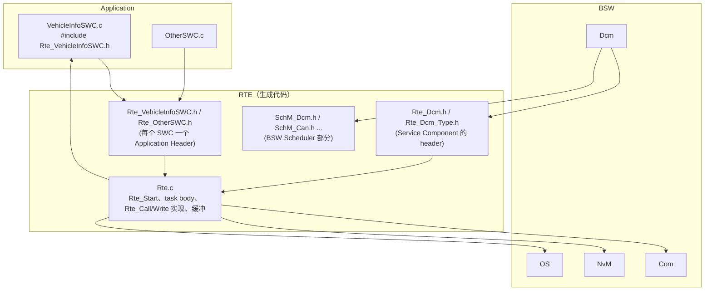
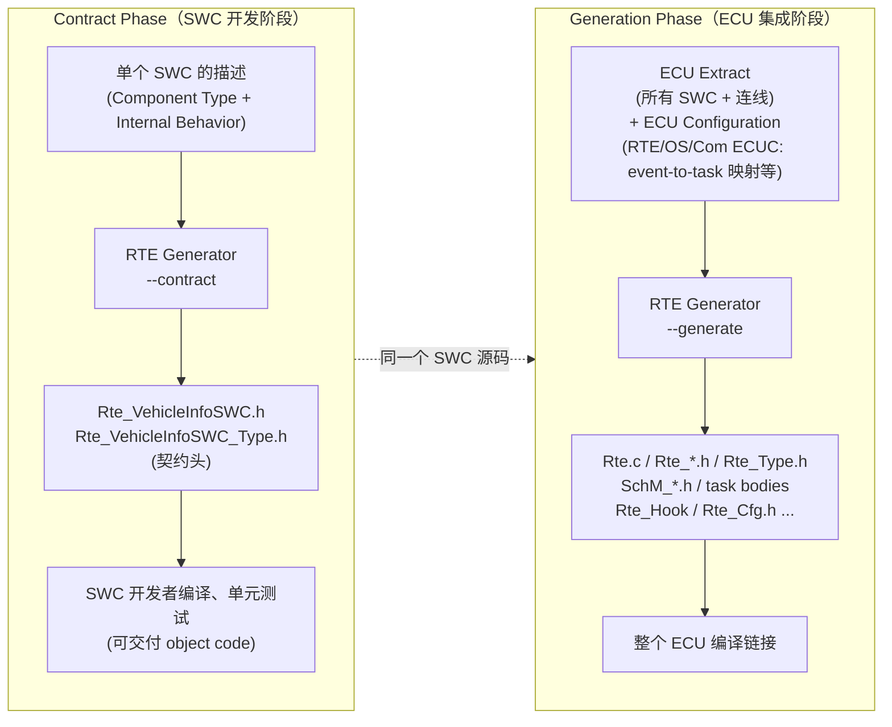
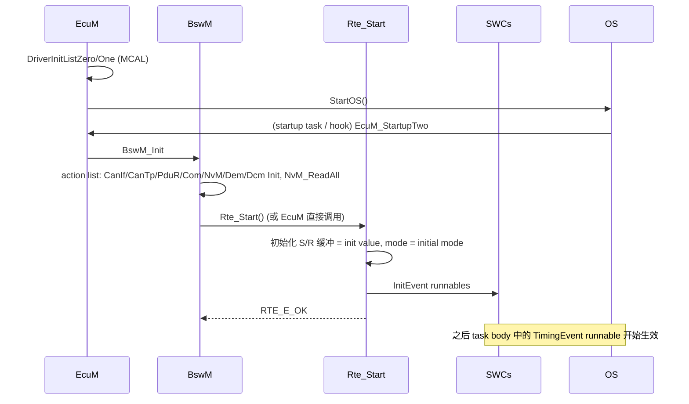
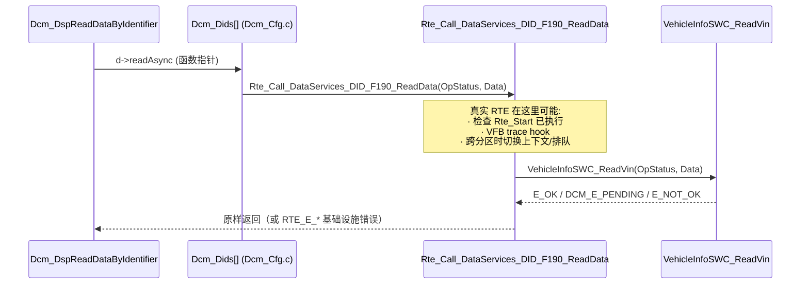

# RTE 概念：Runtime Environment 到底是什么

> Prerequisite: [SWC 概念](01-swc-concept.md), [Port 与 Interface](02-port-interface.md), [Runnable 与 RTE Event](03-runnable-event.md)
> Next: [RTE 生成：ARXML → Rte_*.h](05-rte-generation.md)
> 对应规范: **本仓库无 RTE SWS（AUTOSAR_SWS_RTE）**。本章的 Contract Phase / Generation Phase、`Rte_Start/Rte_Stop`、`Rte_Call/Read/Write/IRead/IWrite/Mode/Switch/Enter/Exit` 命名、intra/inter-ECU 通信、`SchM_*` 等均为 AUTOSAR R4.x 公认约定，**需以项目所用 release 的 RTE SWS 确认**。可引用：DCM SWS R20-11 §8.8（Dcm 作为 Service Component 的端口，p.335–415）、`SWS_Dcm_00053`（`Dcm_MainFunction` 在 `SchM_Dcm.h` 中声明，p.260–261）、`Rte_Dcm_Type.h` 中的类型（`SWS_Dcm_00977–00984`，p.301–304）；IoHwAb R24-11 `SWS_IoHwAb_00143`（p.28：经 RTE 路由的回调原型 `Std_ReturnType Rte_Call_<p>_<o>(<parameters>)`）。
> 对应源码: openAUTOSAR `rte/src/rte.c`、`include/Rte.h`、`include/Rte_Main.h`、`system/EcuM/src/EcuM.c:228`；本项目 `examples/uds_diag_demo/rte/*`

---

## 1. 本章目标

读完本章你应该能回答：

1. **RTE 是什么？** 一个由工具**按 ECU 配置生成**的 C 代码层，实现 VFB 上的连线、事件调度和数据一致性。它不是一个"可下载的库"。
2. **Contract Phase vs Generation Phase** 分别产出什么、给谁用。
3. **RTE 生成哪些文件**：`Rte_<Swc>.h`、`Rte_<Swc>_Type.h`、`Rte_Type.h`、`Rte.c`（及按组件拆分的 `Rte_<Swc>.c`）、`SchM_<Bsw>.h`、`Rte_Main.h`……
4. **`Rte_Start` 做什么、谁调用。**
5. **intra-ECU 与 inter-ECU 通信**：同一个 `Rte_Write` 为什么可以是赋值、可以是 `Com_SendSignal`、可以是 IOC。
6. **为什么 SWC 必须调用 `Rte_` API，而不是直接调用对方的函数**（本章最重要的问题）。

---

## 2. 为什么需要 RTE？

### 2.1 一个思想实验

假设 Dcm 直接调用 `VehicleInfoSWC_ReadVin()`：

```c
/* [Conceptual] 反例：Dcm 直接调用应用 */
#include "VehicleInfoSWC.h"
...
r = VehicleInfoSWC_ReadVin(OpStatus, &out[2]);
```

这能编译、能运行。那为什么不这样做？考虑下面的变化：

| 变化 | 直接调用时要改什么 | 通过 RTE 时要改什么 |
|---|---|---|
| VIN 改由另一个 SWC（`GatewayInfoSWC`）提供 | 改 Dcm 源码（供应商代码！） | 改 ECU Extract 中的 Connector，重新生成 RTE |
| VehicleInfoSWC 被放到另一个 OS-Application（内存保护分区） | 直接调用会触发 MPU 违规 | RTE 生成跨分区调用（trusted function / IOC + task） |
| 把 server runnable 移到低优先级 task 减轻 Dcm task 负载 | 重写调用逻辑 | 改 event-to-task 映射，RTE 生成异步调用 |
| VIN 实际来自 CAN 上的另一个 ECU | 在 Dcm 里写 CAN 收发 | S/R 端口映射到 Com 信号，RTE 生成 `Com_ReceiveSignal` |
| 换一个 Dcm 供应商 | 新 Dcm 不认识 `VehicleInfoSWC.h` | 新 Dcm 仍然调用标准的 `Rte_Call_DataServices_<Data>_ReadData` |

结论：**RTE 把"谁和谁通信、怎么通信、在什么上下文通信"这三件事从代码中拿出来，放进配置中，再由工具生成代码。** SWC 和 BSW 的源码只依赖标准化的 API 名字，因此可以独立开发、复用和升级。

### 2.2 RTE 的三项职责

| 职责 | 说明 | 体现的 API |
|---|---|---|
| **通信** | 实现 S/R、C/S、Mode 的连线：同 task、跨 task、跨分区、跨核、跨 ECU | `Rte_Read/Write/Send/Receive/Call/Result/Mode/Switch` |
| **调度** | 生成 task body，把 runnable（和 BSW MainFunction，经 SchM）放进 OS task；处理 event 激活 | 生成的 `TASK(...)`、`Rte_Start` |
| **一致性与保护** | 数据一致性（隐式访问的副本）、Exclusive Area、ModeDisabling | `Rte_IRead/IWrite`、`Rte_Enter/Exit`、`SchM_Enter/Exit` |

---

## 3. 在系统中的位置



逐条解释：

1. **SWC → `Rte_<Swc>.h`**：SWC 只 include 自己的 Application Header，所有 API 声明（或宏）都在这里。demo：`swc/VehicleInfoSWC.c:22`。
2. **`Rte_<Swc>.h` → `Rte.c`**：头文件中的 API 要么是宏（直接映射到变量或函数），要么是 `Rte.c` 中实现的函数。
3. **Dcm → `Rte_Dcm.h`**：Dcm 作为 Service Component，也通过 RTE 生成的头访问 client 端口。demo：`diag/Dcm_Cfg.c:16` include `Rte_Dcm.h`。
4. **Dcm → `SchM_Dcm.h`**：BSW 的调度相关（MainFunction 声明、Exclusive Area、BSW mode switch）在 SchM 头里。`Dcm_MainFunction` 的声明位置就是 `SchM_Dcm.h`（DCM SWS R20-11 p.260–261）。demo：`rte/SchM_Dcm.h:18-21`。
5. **`Rte.c` → Com / NvM / OS**：RTE 实现内部会调用 BSW（例如 inter-ECU 的 `Rte_Write` → `Com_SendSignal`；task 激活 → `ActivateTask/SetEvent`）。
6. **`Rte.c` → SWC runnable**：RTE 反过来调用 SWC 的 runnable（task body 或 server 调用）。

---

## 4. AUTOSAR 如何定义？

> `[AUTOSAR Standard]` 本节为 R4.x 公认约定，**本仓库无 RTE SWS，需以项目 release 确认**。

### 4.1 Contract Phase vs Generation Phase

RTE 生成器有两种工作模式：



| | Contract Phase | Generation Phase |
|---|---|---|
| 输入 | **只有一个** SWC 的描述（以及它引用的 Interface/类型） | 完整 ECU Extract + ECU Configuration（RTE、OS、Com 的 ECUC） |
| 输出 | `Rte_<Swc>.h`、`Rte_<Swc>_Type.h` 等**契约头** | 完整 RTE：`Rte.c`、最终版 `Rte_<Swc>.h`、`Rte_Type.h`、`SchM_*.h`、task body… |
| 谁用 | SWC 开发者（可能在另一家公司） | ECU 集成者 |
| 是否知道连线 / task 映射 | 否 | 是 |
| API 形态 | 一般是函数原型（保证"无论怎么连都能链接"） | 可以优化成宏、直接变量访问 |

**Contract Phase 的意义**：供应商可以只拿 SWC 描述就开始写代码、编译、甚至交付 object code（`.o` / `.a`），不需要等整车配置完成。这是 AUTOSAR "分工开发"的基础。

> `[Real Project Consideration]` 若 SWC 以 object code 交付，Generation Phase 生成的 API 必须与 Contract Phase 的**二进制兼容**——R4.x 中称为 "compatibility mode"；允许宏优化、只能源码交付的称为 "vendor mode"。具体名词与选项以 RTE 生成器手册为准。

### 4.2 RTE 生成什么文件

| 文件（R4.x 公认名） | 内容 | 谁 include |
|---|---|---|
| `Rte_<Swc>.h`（Application Header） | 该 SWC 可用的所有 RTE API（函数原型或宏）、runnable 原型、PIM/CData 访问 | 该 SWC 的 `.c`（**只能 include 自己的**） |
| `Rte_<Swc>_Type.h` | 该 SWC 专用的类型、mode 常量、ApplicationError 宏 | `Rte_<Swc>.h` |
| `Rte_Type.h` | 整个 ECU 的 ImplementationDataType 定义 | 所有 RTE 头 |
| `Rte.h` | RTE 基础类型与 `RTE_E_*` 错误码 | 所有 RTE 头 |
| `Rte_Main.h` | `Rte_Start()` / `Rte_Stop()` 声明 | EcuM / BswM |
| `Rte.c`（或拆分成 `Rte_<Swc>.c` / `Rte_<Partition>.c`） | API 实现、通信缓冲、task body、`Rte_Start` | — |
| `SchM_<Bsw>.h` | BSW 的 MainFunction 声明、`SchM_Enter/Exit_<Bsw>_<EA>`、`SchM_Switch/Mode` | 对应 BSW 模块 |
| `Rte_<ServiceComponent>.h`、`Rte_<ServiceComponent>_Type.h` | Service Component（如 Dcm）的 client/server API 和类型 | Dcm 等 |
| `Rte_Hook.h`、`Rte_Cbk.h`、`Rte_Cfg.h`… | VFB trace hook、Com 回调、配置宏 | 视工具而定 |

DCM 特有：`Rte_Dcm_Type.h` 中包含 `Dcm_OpStatusType`、`Dcm_NegativeResponseCodeType`、`Dcm_SesCtrlType`、`Dcm_SecLevelType` 等——DCM SWS R20-11 明确规定这些类型由 `Rte_Dcm_Type.h` 提供（`SWS_Dcm_00977–00984`，p.301–304），因为 Dcm 和 SWC 都要用。demo：`rte/Rte_Dcm_Type.h:1-13` 注释逐条列出了这些 SWS ID。

### 4.3 RTE API 一览（R4.x 公认命名）

> **本仓库无 RTE SWS，需以项目 release 确认**参数细节与返回值。

| API | 用途 | 详见 |
|---|---|---|
| `Rte_Read_<p>_<d>(data*)` / `Rte_Write_<p>_<d>(data)` | 显式 S/R，unqueued | [07](07-sender-receiver.md) |
| `Rte_Receive_<p>_<d>` / `Rte_Send_<p>_<d>` | 显式 S/R，queued | [07](07-sender-receiver.md) |
| `Rte_IRead_<r>_<p>_<d>()` / `Rte_IWrite_<r>_<p>_<d>(v)` / `Rte_IWriteRef_*` / `Rte_IStatus_*` | 隐式 S/R（runnable 开始前拷贝、结束后写回） | [07](07-sender-receiver.md) |
| `Rte_Call_<p>_<o>(args)` / `Rte_Result_<p>_<o>(outs)` | C/S client | [06](06-client-server.md) |
| `Rte_Mode_<p>_<m>()` / `Rte_Switch_<p>_<m>(mode)` | Mode user / manager | [02](02-port-interface.md) |
| `Rte_Enter_<ea>()` / `Rte_Exit_<ea>()` | Exclusive Area | [03](03-runnable-event.md) |
| `Rte_IrvRead_<r>_<v>()` / `Rte_IrvWrite_<r>_<v>(v)` | 同 SWC 内 runnable 之间的变量 | [03](03-runnable-event.md) |
| `Rte_Pim_<name>()` / `Rte_CData_<name>()` / `Rte_Prm_<p>_<d>()` | Per-Instance Memory / 标定常量 / 参数端口 | — |
| `Rte_Start()` / `Rte_Stop()` | RTE 生命周期 | 本章 6 |
| `SchM_Enter_<Bsw>_<ea>()` / `SchM_Exit_*` / `SchM_Switch_<bsnp>_<m>` / `SchM_Mode_*` | BSW 侧对应 API | 本章 4.5 |

openAUTOSAR 的 `include/Rte.h:24-33` 给出了一组 `RTE_E_*` 错误码（`RTE_E_OK 0`、`RTE_E_INVALID 1`、`RTE_E_COMMS_ERROR 128`、`RTE_E_TIMEOUT 129`、`RTE_E_LIMIT 130`、`RTE_E_NO_DATA 131`、`RTE_E_TRANSMIT_ACK 132`，以及 overlay 位 `RTE_E_LOST_DATA / RTE_E_MAX_AGE_EXCEEDED = 64`）。这是 **AR 3.x 时代**的定义；R4.x 中部分名字改变（例如 128 在 R4.x 中常见为 `RTE_E_COM_STOPPED`），并新增 `RTE_E_NEVER_RECEIVED`、`RTE_E_UNCONNECTED` 等——**以项目 `Rte.h` 为准**。

### 4.4 Intra-ECU 与 Inter-ECU 通信

同一行 SWC 代码 `Rte_Write_Speed_value(v);`，生成的实现可能完全不同：

| 连接情况 | 生成的实现（典型） | SWC 代码是否需要改 |
|---|---|---|
| 同 task 中的 sender/receiver | 一个全局变量赋值，甚至宏 `#define Rte_Write_Speed_value(v) (Rte_Buf_Speed = (v), RTE_E_OK)` | 否 |
| 不同 task，同核，数据 ≤ 原子宽度 | 全局变量赋值 | 否 |
| 不同 task，数据 > 原子宽度 | 加中断屏蔽/资源保护的拷贝 | 否 |
| 不同 OS-Application（分区） | 带权限的缓冲或 trusted function | 否 |
| 不同核 | OS IOC（`IocWrite_*`） | 否 |
| 另一个 ECU | `Com_SendSignal(ComConf_ComSignal_Speed, &v)`（经 Com → PduR → CanIf → CAN） | 否 |

C/S 同理：同分区通常是直接函数调用；跨分区/跨核需要 task 激活与结果回传；R4.x 也支持跨 ECU 的 C/S（经 Com 序列化），但较少用。

**DCM 的情况**：Dcm 与诊断 SWC 几乎总在同一 ECU、通常同一分区，所以 `Rte_Call_DataServices_*` 多数被生成为直接调用（或宏）。但若诊断 SWC 位于另一分区/核，同步调用无法完成——DCM 的异步接口（`OpStatus` + `DCM_E_PENDING`）正好可以容纳这种情况。demo 在 `rte/Rte_Dcm.c:8-14` 的注释中说明了这一点。

### 4.5 RTE 与 SchM（BSW Scheduler）

R4.x 中 SchM 是 RTE 的一部分（同一个生成器生成）：

- BSW 模块不使用 `Rte_` 前缀的调度/保护 API，而使用 `SchM_` 前缀：`SchM_Enter_Dcm_<EA>`、`SchM_Switch_Dcm_DcmDiagnosticSessionControl`。
- BSW MainFunction（`Dcm_MainFunction`、`CanTp_MainFunction`、`NvM_MainFunction`）由 SchM 放进 task body，与 SWC runnable 同一机制。
- Dcm 作为 Service Component，**对应用端口**用 `Rte_Call_*`（在 `Rte_Dcm.h`），**对 mode/调度**用 `SchM_*`（在 `SchM_Dcm.h`）。demo 中正是这样拆分的：`rte/Rte_Dcm.h` 与 `rte/SchM_Dcm.h`。

---

## 5. 核心数据结构

RTE 运行时数据都是**生成的静态变量**，没有动态分配：

| 数据 | 用途 | demo 对应 |
|---|---|---|
| S/R 缓冲（每个 unqueued DataElement 一个，含 init value） | `Rte_Write` 写入、`Rte_Read` 读出 | 无（demo 没有 S/R） |
| S/R 队列（queued） | `Rte_Send/Receive` | 无 |
| 隐式访问副本 | `Rte_IRead` 在 runnable 开始前拷贝的值 | 无 |
| Mode 状态变量 | `Rte_Mode` 读取 | `rte/Rte_Dcm.c:24` `Rte_ModeDcmDiagnosticSessionControl` |
| 异步 C/S 状态 | 调用中/结果可用 | 无（demo 的 C/S 全是同步直接调用；"异步"由 Dcm 的 OpStatus 层实现） |
| TimingEvent 分频计数器 | 不同周期 event 共享 task | 无（demo 只有 10 ms） |
| 初始化标志 | `Rte_Start` 是否已执行 | 无 |

---

## 6. 初始化流程：`Rte_Start`



逐跳解释：

1. **MCAL 初始化 → StartOS**：OS 启动前只初始化最基础的驱动（见 [ECU 启动](../02-autosar-classic/03-ecu-startup.md)）。
2. **EcuM_StartupTwo / BswM 初始化 BSW**：Services 层（含 Dcm、NvM）初始化，NvM_ReadAll 把 NV 数据读入 RAM。R4.x 中常由 BswM 的 action list 完成，具体以项目配置为准。
3. **`Rte_Start()`**：在 BSW 就绪之后调用（R4.x 公认：由 EcuM 或 BswM 调用；`Std_ReturnType Rte_Start(void)`，openAUTOSAR `include/Rte_Main.h:25` 的声明即此形态）。
4. **RTE 初始化缓冲与 mode**：把所有 S/R 缓冲设为 init value，mode 设为 initial mode。
5. **InitEvent runnables**：执行 SWC 初始化。
6. **之后**：周期 runnable 开始执行。关机时 `Rte_Stop()` 停止 RTE（之后 `Rte_Call` 等返回错误）。

**demo 对照**：`integration/EcuM.c:24-42` 中 `NvM_Init → NvM_ReadAll → Dem_Init → Dcm_Init → Rte_Start`（`:33-37`）；`rte/Rte_Dcm.c:38-44` 的 `Rte_Start` 设置 mode 初值并调用两个 init runnable。demo 的 `Rte_Start` 返回 `void`（`rte/Rte.h:13`），真实 R4.x 返回 `Std_ReturnType`。

**openAUTOSAR 对照**：`system/EcuM/src/EcuM.c:228` 在 `USE_RTE` 下调用 `Rte_Start()`，`include/Rte_Main.h:25` 声明了它——**但整个仓库中没有 `Rte_Start` 的定义**（研究笔记 03 §5），启用 `USE_RTE` 会链接失败。

---

## 7. Runtime Flow：一次 `Rte_Call` 的生命



逐跳解释：

1. **DSP 取函数指针**：`diag/Dcm_Dsp.c:349` 调 `d->readAsync(...)`，指针在 `diag/Dcm_Cfg.c:36` 中被"生成"为 `Rte_Call_DataServices_DID_F190_ReadData`。真实 Dcm 中这一步可能是直接调用 `Rte_Call_...`（由 Dcm 生成器生成的 `Dcm_Lcfg.c` 包装），形态取决于供应商。
2. **进入 RTE**：`rte/Rte_Dcm.c:54`。真实 RTE 在此可以插入 VFB trace hook（`Rte_CallHook_*`，R4.x 公认，名称需确认）、调用合法性检查。
3. **调用 server runnable**：`rte/Rte_Dcm.c:59`。
4. **返回**：`rte/Rte_Dcm.c:60-61`。RTE 不解释应用错误码，只透传。

---

## 8. RH850 Hardware Mapping

`[RH850 Hardware]` RTE 是纯软件生成物，但它的实现选择依赖硬件和 OS：

| RTE 决策 | 依赖的硬件事实 | P1M-E 上的情况 |
|---|---|---|
| 是否需要 IOC 跨核 | 可调度核数量 | **单核**（G3M + lock-step checker），无跨核 IOC |
| 数据一致性是否需要保护 | CPU 原子访问宽度 | 32 位对齐访问原子；17 字节 VIN 之类必须保护（若跨 task） |
| 跨分区调用方式 | MPU、Supervisor/User 模式 | RH850G3M 有 MPU 与 PSW.UM（HW-E p.197）；是否使用由 OS 配置（SC3/SC4）决定，需在真实项目确认 |
| Exclusive Area 实现 | 中断屏蔽机制 | PSW.ID（DI/EI）、INTC PMR（HW-E p.198, p.211），具体由 OS port 实现 |
| 代码/数据段放置 | 内存映射 | RTE 生成 `Rte_MemMap.h` 风格的段宏（R4.x MemMap 机制），链接脚本把它们放到 Code Flash / Local RAM；见 [链接脚本](../01-rh850/05-linker-script.md) |

---

## 9. openAUTOSAR 实现

`[AUTOSAR API]` openAUTOSAR（Arctic Core 2.18.0，R3.1.5 风格）**没有可用的 RTE**：

| 位置 | 内容 | 结论 |
|---|---|---|
| `rte/src/rte.c`（65 行） | `:27` 空函数 `Rte_Runnable_10ms(int Rte_Instance)`；`:35-42` 示例 typedef `Rte_DE_uint8` / `Rte_DES_uint8`；`:47` 一个**括号不闭合**的宏 `Rte_IRead_re1_doors_get_status`；`:52` 空函数 `Doors()` | "命名约定草稿纸"，不是 RTE 实现 |
| `include/Rte.h:24-33` | 只有 `RTE_E_*` 错误码 | 无 API |
| `include/Rte_Main.h:25` | `Std_ReturnType Rte_Start( void );` 声明 | **全仓无定义** |
| `system/EcuM/src/EcuM.c:228` | `USE_RTE` 下调用 `Rte_Start()` | 启用即链接失败 |
| `diagnostic/Dcm/include/Rte_Dcm.h:23-28` | 只有 include guard | Dcm 不经 RTE 调用应用 |
| `examples/rte_simple/*.c` | SWC 代码调用 `Rte_IRead/Rte_Call/Rte_IWrite`，但 `Rte_Calculator.h` 等生成头**全部缺失** | 有"用户侧"，没有"生成侧" |

`rte/src/rte.c:35-47` 中的两个 typedef 值得一看：`Rte_DE_uint8`（data element 的值）与 `Rte_DES_uint8`（值 + status）。这对应 RTE 隐式访问中"把数据副本放进结构，再由宏取出"的实现思路——即 R4.x 中 `Rte_IRead` 常被生成为 `(Rte_Inst->ReadArg1->value)` 这样的宏。草稿中的宏写坏了（`:47` 缺右括号），正好说明这只是笔记。

---

## 10. 当前教学项目实现

`[Educational Implementation]` demo 的 RTE 是**手写的、"as if generated"**的最小实现：

| 文件 | 扮演的真实生成物 | 关键行 |
|---|---|---|
| `rte/Rte.h` | `Rte_Main.h` + task body 声明 | `:13` `Rte_Start`、`:14` `Rte_Task_10ms` |
| `rte/Rte_Dcm_Type.h` | `Rte_Dcm_Type.h` | `:19-29` OpStatus 与 ApplicationError 值；`:50-54` 关于 0x78 的说明 |
| `rte/Rte_Dcm.h` | `Rte_Dcm.h`（Dcm 的 client API） | `:30-47` |
| `rte/SchM_Dcm.h` | `SchM_Dcm.h` | `:18` `SchM_Switch_Dcm_DcmDiagnosticSessionControl`、`:21` `SchM_Switch_Dcm_DcmEcuReset` |
| `rte/Rte_VehicleInfoSWC.h` | `Rte_VehicleInfoSWC.h`（Application Header） | `:26-36` runnable 原型、`:42-47` NvM client 宏、`:51` `Rte_Mode_*` |
| `rte/Rte_SecurityAccessSWC.h` | `Rte_SecurityAccessSWC.h` | `:15-19` |
| `rte/Rte_Dcm.c` | `Rte.c` 中与 Dcm 相关的部分 + `Rte_Start` + task body | `:38-44` `Rte_Start`；`:46-50` task body；`:54-130` `Rte_Call_*`；`:134-155` mode switch |

刻意保留的真实特征：命名（`Rte_Call_<Port>_<Op>`）、签名（按 DCM R20-11 C 原型）、`Rte_Start` 调用 init runnable、mode 状态由 RTE 保存、NvM client 调用被优化成宏。

刻意省略的：ARXML、生成器、Contract Phase、S/R 缓冲、Exclusive Area、跨分区、VFB trace hook、`Rte_Stop`、`RTE_E_*` 基础设施错误。

---

## 11. Code Walkthrough：`Rte_Dcm.c` 的三个片段

**片段 1：生命周期**（`rte/Rte_Dcm.c:38-50`）

```c
void Rte_Start(void)  /* [Educational Implementation] */
{
    Rte_ModeDcmDiagnosticSessionControl = DCM_DEFAULT_SESSION;   /* initial mode */
    UDS_TRACE("Rte", "Rte_Start -> init runnables VehicleInfoSWC_Init, SecurityAccessSWC_Init");
    VehicleInfoSWC_Init();                                        /* InitEvent */
    SecurityAccessSWC_Init();                                     /* InitEvent */
}

void Rte_Task_10ms(void)
{
    /* OS task body generated by the RTE: runnables mapped to the 10 ms event. */
    VehicleInfoSWC_Run10ms();                                     /* TimingEvent 10 ms */
}
```

**片段 2：C/S 连线**（`rte/Rte_Dcm.c:54-62`）——"Dcm 的 R-Port `DataServices_DID_F190` 连到 VehicleInfoSWC 的 P-Port，server runnable 是 `VehicleInfoSWC_ReadVin`"这条连线，被生成为函数体：

```c
Std_ReturnType Rte_Call_DataServices_DID_F190_ReadData(Dcm_OpStatusType OpStatus, uint8 *Data)  /* [Educational Implementation] */
{
    Std_ReturnType r;
    UDS_TRACE(...);                          /* 相当于 VFB trace hook */
    r = VehicleInfoSWC_ReadVin(OpStatus, Data);
    UDS_TRACE(...);
    return r;
}
```

如果把 VIN 改由另一个 SWC 提供，**只有这一行 `VehicleInfoSWC_ReadVin` 需要变**——Dcm 和 VehicleInfoSWC 的源码都不变。这就是"连线在 RTE 中"的具体含义。

**片段 3：BSW mode switch → SWC mode user**（`rte/Rte_Dcm.c:134-144`）

```c
void SchM_Switch_Dcm_DcmDiagnosticSessionControl(Dcm_SesCtrlType nextMode)  /* [Educational Implementation] */
{
    Rte_ModeDcmDiagnosticSessionControl = nextMode;          /* RTE 保存 mode */
    ...
}

Dcm_SesCtrlType Rte_Mode_DcmDiagnosticSessionControl_DcmDiagnosticSessionControl(void)
{
    return Rte_ModeDcmDiagnosticSessionControl;              /* SWC 读取 */
}
```

Dcm（manager，`SchM_` 侧）和 VehicleInfoSWC（user，`Rte_` 侧）通过 RTE 中的一个变量解耦。`swc/VehicleInfoSWC.c:154-155` 在 self test 启动时读取它；trace 中可以看到 `session seen via Rte_Mode = 0x03`。

---

## 12. Debug 方法

| 想知道 | 真实项目中去哪里看 | demo 中 |
|---|---|---|
| 某个 `Rte_Call_*` 最终调到谁 | 生成的 `Rte.c` / `Rte_<Swc>.h` 中搜该函数名或宏；或在调试器中单步进入 | `rte/Rte_Dcm.c` |
| RTE 是否已启动 | `Rte_Start` 断点；生成代码中的 "RTE initialized" 标志 | `rte/Rte_Dcm.c:38` |
| API 是宏还是函数 | 在 `Rte_<Swc>.h` 中看 `#define` vs 原型 | `Rte_Call_NvM_DiagConfig_*` 是宏（`rte/Rte_VehicleInfoSWC.h:42-47`），`Rte_Mode_*` 是函数（`:51`） |
| 生成物是否与配置一致 | RTE 生成器日志（警告：未连接端口、类型不匹配、event 未映射） | — |
| 调试器无法在 `Rte_Call_*` 设断点 | 它可能是宏或被内联；改在 server runnable 上设断点 | — |

---

## 13. 常见问题 / 常见错误

1. **手改生成的 `Rte.c`**：下次生成全部丢失。真实项目里 `Rte*.c/h` 是生成物，应进入 "不要编辑" 的目录并由 CI 重新生成。
2. **SWC include 别的 SWC 的 `Rte_<Other>.h`**：同一编译单元中多个 Application Header 会冲突（R4.x 通常明确禁止）。
3. **在 `Rte_Start` 之前调用 RTE API**：例如在 BSW 初始化回调里调 `Rte_Write`。行为未定义或返回错误。
4. **以为 Contract Phase 头文件就是最终头文件**：Generation Phase 会重新生成，并可能把函数改为宏；不要依赖"能取函数地址"。
5. **以为 RTE 是"所有模块之间的胶水"**：BSW 之间（Dcm → PduR → CanTp → CanIf）是直接 C API 调用，不经 RTE。
6. **把 `RTE_E_*` 和应用错误混淆**：R4.x 中 RTE 基础设施错误值通常 ≥ 128 或使用 overlay 位 64（openAUTOSAR `include/Rte.h:24-33` 的 AR 3.x 定义亦如此），应用错误通常是 1–63。具体以项目 `Rte.h` 为准。

---

## 14. 实验

1. **"只改 RTE 就换实现"思维实验**：阅读 `rte/Rte_Dcm.c:54-62`，假设 VIN 改由一个新的 `GatewayInfoSWC_ReadVin` 提供，列出需要修改的文件（答案：只有 RTE 部分 + 新 SWC；`diag/*` 与 `swc/VehicleInfoSWC.c` 不变）。
2. **启动顺序验证**：运行 demo，在 `artifacts/uds-demo/trace.txt` 的开头（约第 3–20 行）确认 `Rte_Start` 出现在 Dcm 初始化之后、通信启动之前。
3. **宏 vs 函数**：在 `rte/Rte_VehicleInfoSWC.h` 中找出哪个 RTE API 是宏、哪个是函数，并思考"如果 NvM 在另一个分区"时，宏形态还能否成立。

---

## 15. 思考题

1. 为什么 Contract Phase 生成的 API 通常是函数原型而不是宏？
2. 如果 Dcm 与诊断 SWC 位于不同的 OS-Application，`Rte_Call_DataServices_DID_F190_ReadData` 会被生成成什么样？Dcm 的 `DCM_E_PENDING` 机制如何帮助这种情况？
3. RTE 和 SchM 为什么由同一个生成器生成？（提示：BSW MainFunction 与 SWC runnable 共享 task body。）
4. 一个 SWC 的源码在两个项目中复用，项目 A 中它的 `Rte_Write` 是变量赋值，项目 B 中是 `Com_SendSignal`。哪一个产物让这成为可能？

---

## 16. 对未来真实项目的意义

`[Real Project Consideration]`

- 在 RTA-CAR 这样的工具链中，RTE 生成是构建流程的一步；生成器版本、生成选项（compatibility/vendor mode、优化级别）都会影响生成代码。**DCM 升级时一定要同时重新生成 RTE**，并 diff 新旧 `Rte_Dcm.h`、`Rte_Dcm_Type.h`、诊断 SWC 的 `Rte_<Swc>.h`。
- 遇到"诊断请求得到 NRC 0x10/0x22 但应用代码看起来没问题"时，检查 RTE 层是否返回了基础设施错误（如未连接、未启动）——Dcm 会把非 E_OK 返回值转成 NRC。
- `Rte_Start` 的调用点（EcuM 还是 BswM action list）决定了 InitEvent runnable 与 BSW 初始化的先后，影响"上电第一次读 DID 是否正确"。
- 截图中工程的 `Rte_TickCounter` 链接问题（`plan-implementation-history.md`、`docs/counter-design.md`）属于 "RTE/OS 生成物与硬件计数器的契约" 问题——它说明 RTE 生成物并不只与 SWC 有关，也与 OS、硬件定时器有关。

---

## 17. 本章总结

```text
RTE = 工具根据 ECU 配置生成的代码，负责 通信 + 调度 + 保护
Contract Phase   : 只看一个 SWC → 生成契约头 → SWC 可独立开发/交付
Generation Phase : 看整个 ECU → 生成 Rte.c / Rte_*.h / SchM_*.h / task body
Rte_Start        : BSW 初始化之后调用；初始化缓冲与 mode，执行 InitEvent runnable
同一个 Rte_Write/Rte_Call，按连接情况生成为 赋值 / 直接调用 / 带保护拷贝 / IOC / Com 信号
SWC 必须调 Rte_ API：因为"连到谁、怎么连、在哪个上下文"都不该写在 SWC 或 Dcm 的代码里
```

## 18. 下一章

知道了 RTE 生成什么，下一章 [05-rte-generation.md](05-rte-generation.md) 用一个具体例子走完整条链：为 VehicleInfoSWC 写一段教学级 ARXML（C/S 端口 `DataServices_DID_F190`），看 RTE 生成器如何把它变成 `Rte_VehicleInfoSWC.h`、`Rte_Type.h`、`Rte.c` 中的具体内容。
