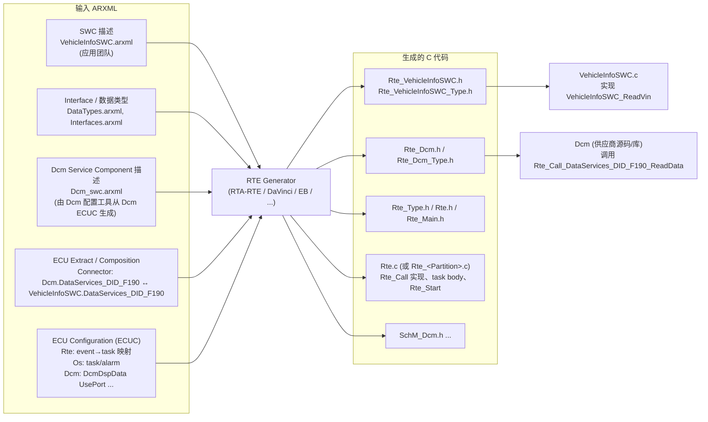
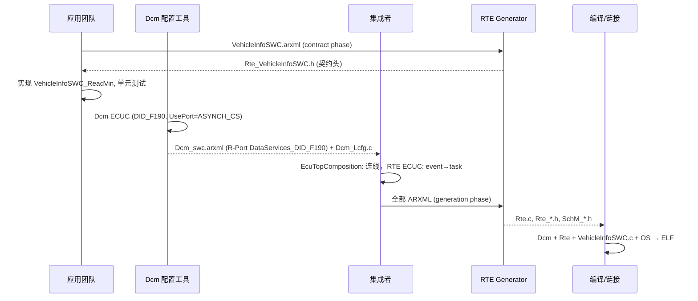
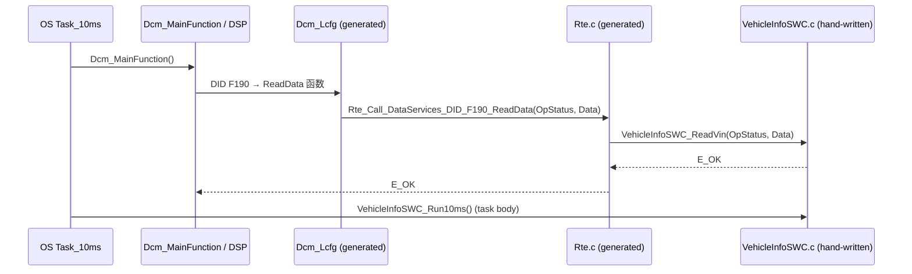

# RTE 生成：从 ARXML 到 `Rte_VehicleInfoSWC.h`

> Prerequisite: [RTE 概念](04-rte-concept.md), [配置与 ARXML](../02-autosar-classic/04-configuration-arxml.md), [Port 与 Interface](02-port-interface.md)
> Next: [Client/Server 通信](06-client-server.md)
> 对应规范: **本仓库无 RTE SWS、无 Software Component Template、无 AUTOSAR XML Schema**。本章所有 ARXML 片段为 `[Conceptual]`，元素名按 AUTOSAR R4.x 公认 schema 书写，**未经 XSD 校验**，真实项目须以所用 release 的 schema 和工具导出结果为准。DCM 相关端口命名与签名依据 DCM SWS CP R20-11：`DataServices_<Data>`（`SWS_Dcm_00686` p.341 起）、`DcmDspDataUsePort`（`ECUC_Dcm_00713` p.537–539）、`Xxx_ReadData` 异步原型（`SWS_Dcm_91006` p.269–276）、返回码 `DCM_E_PENDING = 10`（p.338、p.363）、`Rte_Dcm_Type.h` 类型（`SWS_Dcm_00977–00984`）。
> 对应源码: openAUTOSAR `examples/rte_simple/rte_simple_lib.arxml`（AR 3.1.5）、`rte_simple_extract.arxml`；本项目 `examples/uds_diag_demo/rte/Rte_VehicleInfoSWC.h`、`rte/Rte_Dcm.h`、`rte/Rte_Dcm.c`、`rte/Rte_Dcm_Type.h`、`diag/Dcm_Cfg.c`

---

## 1. 本章目标

这一章把"ARXML → RTE Generator → `Rte_VehicleInfoSWC.h` → Runnable"这条链**逐个文件**走一遍。读完你应该能：

1. 说出 RTE 生成器的**输入**有哪几类 ARXML，分别由谁提供。
2. 读懂一段教学级 ARXML：`VehicleInfoSWC` 提供 C/S 端口 `DataServices_DID_F190`，Operation `ReadData`，由 `OperationInvokedEvent` 触发 runnable `VehicleInfoSWC_ReadVin`。
3. 预测生成器会产生什么：`Rte_VehicleInfoSWC.h` 里有什么、`Rte_Type.h` 里有什么、`Rte.c`（或 `Rte_Dcm.c`）里 `Rte_Call_DataServices_DID_F190_ReadData` 的实现长什么样。
4. 能把 demo 的手写文件逐行对应回"它假装是由哪段 ARXML 生成的"。

---

## 2. 为什么需要"生成"？

如果 RTE 是手写的，每次改一根连线、换一个 task 映射、加一个 DID，都要人工改 `Rte.c`。一个真实 ECU 可能有上千个端口、几百个 runnable——手写既慢又必然出错。

生成的好处：

- **一致性**：Dcm 看到的 `Rte_Call_DataServices_DID_F190_ReadData` 与 SWC 实现的 `VehicleInfoSWC_ReadVin` 签名由同一份 Interface 定义推出，不可能不一致（不一致时生成器报错）。
- **可检查**：未连接端口、类型不匹配、event 未映射，在生成阶段就报告，而不是运行时。
- **可优化**：生成器知道全局信息，可以把同 task 的通信优化成宏、省掉不必要的保护。

---

## 3. 在系统中的位置：生成流程



逐条解释：

1. **SWC 描述（A1）**：VehicleInfoSWC 的 Component Type（Port）+ Internal Behavior（Runnable/Event）+ Implementation。应用团队在 SWC 建模工具中维护。
2. **Interface/类型（A2）**：`DataServices_DID_F190` 的 C/S Interface、`Dcm_OpStatusType`、`Dcm_Data17ByteType`。**对 DCM 接口，这些通常由 Dcm 配置工具生成**，应用团队引用即可。
3. **Dcm Service Component 描述（A3）**：Dcm 配置工具读取 Dcm ECUC（`DcmDspData DID_F190`、`DcmDspDataUsePort = USE_DATA_ASYNCH_CLIENT_SERVER`、`DcmDspDataByteSize = 17`）后，**导出**一份 Service Component 描述，其中 Dcm 有一个 R-Port `DataServices_DID_F190`。这一步是 "DCM 配置如何变成 RTE 端口" 的关键。
4. **ECU Extract（A4）**：系统集成者在 ECU 的根 Composition 中，用 Connector 把 Dcm 的 R-Port 与 VehicleInfoSWC 的 P-Port 连起来。
5. **ECUC（A5）**：RTE 自己的配置（event-to-task 映射、生成选项）、OS 配置（task、alarm）、以及 BSW 配置。
6. **生成器 → 输出**：一次生成，同时产出 SWC 侧头文件、Dcm 侧头文件、公共类型、实现文件。

---

## 4. AUTOSAR 如何定义？

> `[AUTOSAR Standard]` 下列 ARXML 结构是 R4.x 公认写法。**本仓库无 SWC Template / schema，需以项目 release 确认**。

### 4.1 AR 3.x 与 R4.x 的结构差异（读 openAUTOSAR 时必须知道）

| 方面 | AR 3.1.5（openAUTOSAR `rte_simple_lib.arxml:2`） | R4.x |
|---|---|---|
| SWC 类型元素 | `APPLICATION-SOFTWARE-COMPONENT-TYPE` | `APPLICATION-SW-COMPONENT-TYPE` |
| Internal Behavior 位置 | 与 SWC **平级**的独立元素 `INTERNAL-BEHAVIOR`，用 `COMPONENT-REF` 指回 SWC（`rte_simple_lib.arxml:101-108`） | SWC 内部的 `INTERNAL-BEHAVIORS / SWC-INTERNAL-BEHAVIOR` |
| C/S Operation | `OPERATION-PROTOTYPE`（`:164`） | `CLIENT-SERVER-OPERATION` |
| S/R 数据元素 | `DATA-ELEMENT-PROTOTYPE`（`:214`） | `VARIABLE-DATA-PROTOTYPE` |
| Argument | `ARGUMENT-PROTOTYPE`（`:172`） | `ARGUMENT-DATA-PROTOTYPE` |
| 数据类型 | `INTEGER-TYPE` 等（`:20-70`） | Application / Implementation Data Type 两层 |
| OperationInvokedEvent 的引用 | `OPERATION-IREF / P-PORT-PROTOTYPE-REF + OPERATION-PROTOTYPE-REF`（`:117-120`） | `OPERATION-IREF / CONTEXT-P-PORT-REF + TARGET-PROVIDED-OPERATION-REF` |

### 4.2 Dcm 侧：ECUC 如何决定端口

`[Conceptual]` Dcm ECUC（只列与 F190 相关的参数；容器/参数名按 DCM SWS R20-11 第 10 章）：

```xml
<!-- [Conceptual] Dcm ECUC 片段：不是任何工具的真实导出，未经 schema 校验 -->
<ECUC-CONTAINER-VALUE>
  <SHORT-NAME>DID_F190</SHORT-NAME>                       <!-- DcmDspData -->
  <DEFINITION-REF DEST="ECUC-PARAM-CONF-CONTAINER-DEF">/AUTOSAR/EcucDefs/Dcm/DcmConfigSet/DcmDsp/DcmDspData</DEFINITION-REF>
  <PARAMETER-VALUES>
    <ECUC-NUMERICAL-PARAM-VALUE>   <!-- DcmDspDataByteSize (ECUC_Dcm_01106) -->
      <DEFINITION-REF DEST="ECUC-INTEGER-PARAM-DEF">/AUTOSAR/EcucDefs/Dcm/DcmConfigSet/DcmDsp/DcmDspData/DcmDspDataByteSize</DEFINITION-REF>
      <VALUE>17</VALUE>
    </ECUC-NUMERICAL-PARAM-VALUE>
    <ECUC-TEXTUAL-PARAM-VALUE>     <!-- DcmDspDataUsePort (ECUC_Dcm_00713, p.537-539) -->
      <DEFINITION-REF DEST="ECUC-ENUMERATION-PARAM-DEF">/AUTOSAR/EcucDefs/Dcm/DcmConfigSet/DcmDsp/DcmDspData/DcmDspDataUsePort</DEFINITION-REF>
      <VALUE>USE_DATA_ASYNCH_CLIENT_SERVER</VALUE>
    </ECUC-TEXTUAL-PARAM-VALUE>
    <ECUC-TEXTUAL-PARAM-VALUE>     <!-- DcmDspDataType (ECUC_Dcm_00985) -->
      <DEFINITION-REF DEST="ECUC-ENUMERATION-PARAM-DEF">/AUTOSAR/EcucDefs/Dcm/DcmConfigSet/DcmDsp/DcmDspData/DcmDspDataType</DEFINITION-REF>
      <VALUE>UINT8_N</VALUE>
    </ECUC-TEXTUAL-PARAM-VALUE>
  </PARAMETER-VALUES>
</ECUC-CONTAINER-VALUE>
```

Dcm 配置工具根据它推出：

- 需要一个 C/S Interface `DataServices_DID_F190`（因为 UsePort 是 `*_CLIENT_SERVER`）；
- Operation `ReadData` 有 `OpStatus` 参数（因为是 `ASYNCH`），没有 `ErrorCode`（因为不是 `_ERROR` 变体）——对应 `SWS_Dcm_91006`；
- `Data` 参数是 17 字节数组（`UINT8_N` + `ByteSize 17`）；
- Dcm 有一个 R-Port `DataServices_DID_F190`。

`[Educational Implementation]` demo 中这一组信息被压缩成 `diag/Dcm_Cfg.c:34-38` 的一行：

```c
    {   /* VIN: asynchronous C/S interface -> exercises DCM_E_PENDING / OpStatus */
        0xF190u, 17u, DCM_USE_DATA_ASYNCH_CLIENT_SERVER,
        NULL_PTR, Rte_Call_DataServices_DID_F190_ReadData, NULL_PTR,
        DCM_SES_ALL, DCM_SEC_ANY, 0u, 0u, "VIN"
    },
```

### 4.3 教学级 ARXML：VehicleInfoSWC + `DataServices_DID_F190`

`[Conceptual]` 下面是**教学用**的 R4.x 风格 ARXML，只保留理解所需的元素（省略 ADMIN-DATA、UUID、SW-DATA-DEF-PROPS 细节、Implementation 的编译器信息等）。**它不是任何工具的真实导出，没有经过 XSD 校验，不能直接导入工具。**

```xml
<?xml version="1.0" encoding="UTF-8"?>
<!-- [Conceptual] Teaching-grade ARXML. Element names follow common AUTOSAR R4.x usage;
     NOT validated against an XSD. Confirm against the project's AUTOSAR release. -->
<AUTOSAR xmlns="http://autosar.org/schema/r4.0">
  <AR-PACKAGES>

    <!-- ① 数据类型：通常由 Dcm 配置工具生成，应用团队只引用 -->
    <AR-PACKAGE>
      <SHORT-NAME>DataTypes</SHORT-NAME>
      <ELEMENTS>
        <IMPLEMENTATION-DATA-TYPE>
          <SHORT-NAME>Dcm_OpStatusType</SHORT-NAME>
          <CATEGORY>TYPE_REFERENCE</CATEGORY>          <!-- → uint8 -->
        </IMPLEMENTATION-DATA-TYPE>
        <IMPLEMENTATION-DATA-TYPE>
          <SHORT-NAME>Dcm_Data17ByteType</SHORT-NAME>
          <CATEGORY>ARRAY</CATEGORY>                   <!-- → typedef uint8 Dcm_Data17ByteType[17]; -->
          <SUB-ELEMENTS>
            <IMPLEMENTATION-DATA-TYPE-ELEMENT>
              <SHORT-NAME>Element</SHORT-NAME>
              <CATEGORY>TYPE_REFERENCE</CATEGORY>      <!-- → uint8 -->
              <ARRAY-SIZE>17</ARRAY-SIZE>
            </IMPLEMENTATION-DATA-TYPE-ELEMENT>
          </SUB-ELEMENTS>
        </IMPLEMENTATION-DATA-TYPE>
      </ELEMENTS>
    </AR-PACKAGE>

    <!-- ② Port Interface：名字模板 DataServices_<Data> 来自 DCM SWS R20-11 SWS_Dcm_00686 -->
    <AR-PACKAGE>
      <SHORT-NAME>PortInterfaces</SHORT-NAME>
      <ELEMENTS>
        <CLIENT-SERVER-INTERFACE>
          <SHORT-NAME>DataServices_DID_F190</SHORT-NAME>
          <IS-SERVICE>true</IS-SERVICE>
          <POSSIBLE-ERRORS>
            <APPLICATION-ERROR>
              <SHORT-NAME>E_NOT_OK</SHORT-NAME>
              <ERROR-CODE>1</ERROR-CODE>
            </APPLICATION-ERROR>
            <APPLICATION-ERROR>
              <SHORT-NAME>DCM_E_PENDING</SHORT-NAME>
              <ERROR-CODE>10</ERROR-CODE>              <!-- DCM SWS R20-11 p.338/p.363 -->
            </APPLICATION-ERROR>
          </POSSIBLE-ERRORS>
          <OPERATIONS>
            <CLIENT-SERVER-OPERATION>
              <SHORT-NAME>ReadData</SHORT-NAME>
              <ARGUMENTS>
                <ARGUMENT-DATA-PROTOTYPE>
                  <SHORT-NAME>OpStatus</SHORT-NAME>
                  <TYPE-TREF DEST="IMPLEMENTATION-DATA-TYPE">/DataTypes/Dcm_OpStatusType</TYPE-TREF>
                  <DIRECTION>IN</DIRECTION>
                </ARGUMENT-DATA-PROTOTYPE>
                <ARGUMENT-DATA-PROTOTYPE>
                  <SHORT-NAME>Data</SHORT-NAME>
                  <TYPE-TREF DEST="IMPLEMENTATION-DATA-TYPE">/DataTypes/Dcm_Data17ByteType</TYPE-TREF>
                  <DIRECTION>OUT</DIRECTION>
                </ARGUMENT-DATA-PROTOTYPE>
              </ARGUMENTS>
              <POSSIBLE-ERROR-REFS>
                <POSSIBLE-ERROR-REF DEST="APPLICATION-ERROR">/PortInterfaces/DataServices_DID_F190/E_NOT_OK</POSSIBLE-ERROR-REF>
                <POSSIBLE-ERROR-REF DEST="APPLICATION-ERROR">/PortInterfaces/DataServices_DID_F190/DCM_E_PENDING</POSSIBLE-ERROR-REF>
              </POSSIBLE-ERROR-REFS>
            </CLIENT-SERVER-OPERATION>
          </OPERATIONS>
        </CLIENT-SERVER-INTERFACE>
      </ELEMENTS>
    </AR-PACKAGE>

    <!-- ③ SWC：Component Type + Internal Behavior（应用团队维护） -->
    <AR-PACKAGE>
      <SHORT-NAME>SwComponentTypes</SHORT-NAME>
      <ELEMENTS>
        <APPLICATION-SW-COMPONENT-TYPE>
          <SHORT-NAME>VehicleInfoSWC</SHORT-NAME>
          <PORTS>
            <P-PORT-PROTOTYPE>
              <SHORT-NAME>DataServices_DID_F190</SHORT-NAME>
              <PROVIDED-INTERFACE-TREF DEST="CLIENT-SERVER-INTERFACE">/PortInterfaces/DataServices_DID_F190</PROVIDED-INTERFACE-TREF>
            </P-PORT-PROTOTYPE>
          </PORTS>
          <INTERNAL-BEHAVIORS>
            <SWC-INTERNAL-BEHAVIOR>
              <SHORT-NAME>VehicleInfoSWC_InternalBehavior</SHORT-NAME>
              <EVENTS>
                <INIT-EVENT>
                  <SHORT-NAME>IE_Init</SHORT-NAME>
                  <START-ON-EVENT-REF DEST="RUNNABLE-ENTITY">/SwComponentTypes/VehicleInfoSWC/VehicleInfoSWC_InternalBehavior/Init</START-ON-EVENT-REF>
                </INIT-EVENT>
                <TIMING-EVENT>
                  <SHORT-NAME>TE_10ms</SHORT-NAME>
                  <START-ON-EVENT-REF DEST="RUNNABLE-ENTITY">/SwComponentTypes/VehicleInfoSWC/VehicleInfoSWC_InternalBehavior/Run10ms</START-ON-EVENT-REF>
                  <PERIOD>0.01</PERIOD>
                </TIMING-EVENT>
                <OPERATION-INVOKED-EVENT>
                  <SHORT-NAME>OIE_DataServices_DID_F190_ReadData</SHORT-NAME>
                  <START-ON-EVENT-REF DEST="RUNNABLE-ENTITY">/SwComponentTypes/VehicleInfoSWC/VehicleInfoSWC_InternalBehavior/ReadVin</START-ON-EVENT-REF>
                  <OPERATION-IREF>
                    <CONTEXT-P-PORT-REF DEST="P-PORT-PROTOTYPE">/SwComponentTypes/VehicleInfoSWC/DataServices_DID_F190</CONTEXT-P-PORT-REF>
                    <TARGET-PROVIDED-OPERATION-REF DEST="CLIENT-SERVER-OPERATION">/PortInterfaces/DataServices_DID_F190/ReadData</TARGET-PROVIDED-OPERATION-REF>
                  </OPERATION-IREF>
                </OPERATION-INVOKED-EVENT>
              </EVENTS>
              <RUNNABLES>
                <RUNNABLE-ENTITY>
                  <SHORT-NAME>Init</SHORT-NAME>
                  <CAN-BE-INVOKED-CONCURRENTLY>false</CAN-BE-INVOKED-CONCURRENTLY>
                  <SYMBOL>VehicleInfoSWC_Init</SYMBOL>
                </RUNNABLE-ENTITY>
                <RUNNABLE-ENTITY>
                  <SHORT-NAME>Run10ms</SHORT-NAME>
                  <CAN-BE-INVOKED-CONCURRENTLY>false</CAN-BE-INVOKED-CONCURRENTLY>
                  <SYMBOL>VehicleInfoSWC_Run10ms</SYMBOL>
                </RUNNABLE-ENTITY>
                <RUNNABLE-ENTITY>
                  <SHORT-NAME>ReadVin</SHORT-NAME>
                  <CAN-BE-INVOKED-CONCURRENTLY>false</CAN-BE-INVOKED-CONCURRENTLY>
                  <SYMBOL>VehicleInfoSWC_ReadVin</SYMBOL>   <!-- ← 生成的原型用这个名字 -->
                </RUNNABLE-ENTITY>
              </RUNNABLES>
            </SWC-INTERNAL-BEHAVIOR>
          </INTERNAL-BEHAVIORS>
        </APPLICATION-SW-COMPONENT-TYPE>
      </ELEMENTS>
    </AR-PACKAGE>

    <!-- ④ ECU 根 Composition 中的连线（系统集成者维护） -->
    <AR-PACKAGE>
      <SHORT-NAME>EcuComposition</SHORT-NAME>
      <ELEMENTS>
        <COMPOSITION-SW-COMPONENT-TYPE>
          <SHORT-NAME>EcuTopComposition</SHORT-NAME>
          <COMPONENTS>
            <SW-COMPONENT-PROTOTYPE>
              <SHORT-NAME>VehicleInfoSWC_Inst</SHORT-NAME>
              <TYPE-TREF DEST="APPLICATION-SW-COMPONENT-TYPE">/SwComponentTypes/VehicleInfoSWC</TYPE-TREF>
            </SW-COMPONENT-PROTOTYPE>
            <SW-COMPONENT-PROTOTYPE>
              <SHORT-NAME>Dcm</SHORT-NAME>
              <TYPE-TREF DEST="SERVICE-SW-COMPONENT-TYPE">/Dcm_swc/Dcm</TYPE-TREF>   <!-- 由 Dcm 工具导出 -->
            </SW-COMPONENT-PROTOTYPE>
          </COMPONENTS>
          <CONNECTORS>
            <ASSEMBLY-SW-CONNECTOR>
              <SHORT-NAME>Dcm_DataServices_DID_F190__VehicleInfoSWC</SHORT-NAME>
              <PROVIDER-IREF>
                <CONTEXT-COMPONENT-REF DEST="SW-COMPONENT-PROTOTYPE">/EcuComposition/EcuTopComposition/VehicleInfoSWC_Inst</CONTEXT-COMPONENT-REF>
                <TARGET-P-PORT-REF DEST="P-PORT-PROTOTYPE">/SwComponentTypes/VehicleInfoSWC/DataServices_DID_F190</TARGET-P-PORT-REF>
              </PROVIDER-IREF>
              <REQUESTER-IREF>
                <CONTEXT-COMPONENT-REF DEST="SW-COMPONENT-PROTOTYPE">/EcuComposition/EcuTopComposition/Dcm</CONTEXT-COMPONENT-REF>
                <TARGET-R-PORT-REF DEST="R-PORT-PROTOTYPE">/Dcm_swc/Dcm/DataServices_DID_F190</TARGET-R-PORT-REF>
              </REQUESTER-IREF>
            </ASSEMBLY-SW-CONNECTOR>
          </CONNECTORS>
        </COMPOSITION-SW-COMPONENT-TYPE>
      </ELEMENTS>
    </AR-PACKAGE>

  </AR-PACKAGES>
</AUTOSAR>
```

逐段解释每段 ARXML 会变成什么：

| ARXML 段 | 生成器从中得到 | 落在哪个生成文件 |
|---|---|---|
| ① `Dcm_Data17ByteType`（ARRAY 17 × uint8） | `typedef uint8 Dcm_Data17ByteType[17];` | `Rte_Type.h`（或 `Rte_Dcm_Type.h`） |
| ② `DataServices_DID_F190.ReadData(IN OpStatus, OUT Data)` + PossibleErrors | API 签名；ApplicationError 宏 `RTE_E_DataServices_DID_F190_DCM_E_PENDING (10U)`（宏名格式以生成器为准） | `Rte_Dcm.h`（client 侧）、`Rte_VehicleInfoSWC.h`（server 侧）、各自 `_Type.h` |
| ③ `RUNNABLE-ENTITY ReadVin`，`SYMBOL VehicleInfoSWC_ReadVin` | server runnable 原型 | `Rte_VehicleInfoSWC.h` |
| ③ `OPERATION-INVOKED-EVENT` | "调用 `ReadData` 时执行 `VehicleInfoSWC_ReadVin`" | `Rte.c` 中 `Rte_Call_DataServices_DID_F190_ReadData` 的实现 |
| ③ `TIMING-EVENT 0.01` + RTE ECUC 中映射到 `Task_10ms` | task body 中调用 `VehicleInfoSWC_Run10ms()` | `Rte.c`（task body） |
| ③ `INIT-EVENT` | `Rte_Start` 中调用 `VehicleInfoSWC_Init()` | `Rte.c` |
| ④ `ASSEMBLY-SW-CONNECTOR` | Dcm 的 R-Port 的 server 是 VehicleInfoSWC_Inst | 决定 `Rte_Call_...` 函数体里调用的是谁 |

---

## 5. 核心数据结构：生成的文件长什么样

`[Conceptual]` 以下为"典型 R4.x 生成器可能产生"的形态，**不是任何具体工具的真实输出**；Compiler Abstraction 宏、MemMap 段宏、注释格式都因工具而异。

### 5.1 `Rte_Type.h`（节选）

```c
/* [Conceptual] generated - do not edit */
#ifndef RTE_TYPE_H
#define RTE_TYPE_H
#include "Rte.h"

typedef uint8 Dcm_OpStatusType;
typedef uint8 Dcm_Data17ByteType[17];
typedef uint8 Dcm_NegativeResponseCodeType;
/* ... 所有 ImplementationDataType ... */
#endif
```

### 5.2 `Rte_VehicleInfoSWC_Type.h`（节选）

```c
/* [Conceptual] generated - do not edit */
#ifndef RTE_VEHICLEINFOSWC_TYPE_H
#define RTE_VEHICLEINFOSWC_TYPE_H
#include "Rte_Type.h"

/* ApplicationErrors of the provided port interfaces */
#define RTE_E_DataServices_DID_F190_E_NOT_OK      ((Std_ReturnType)1U)
#define RTE_E_DataServices_DID_F190_DCM_E_PENDING ((Std_ReturnType)10U)

/* OpStatus values (from Dcm's types, re-exported) */
#define DCM_INITIAL ((Dcm_OpStatusType)0U)
#define DCM_PENDING ((Dcm_OpStatusType)1U)
#define DCM_CANCEL  ((Dcm_OpStatusType)2U)
#endif
```

### 5.3 `Rte_VehicleInfoSWC.h`（Application Header，节选）

```c
/* [Conceptual] generated - do not edit */
#ifndef RTE_VEHICLEINFOSWC_H
#define RTE_VEHICLEINFOSWC_H

#ifdef RTE_APPLICATION_HEADER_FILE
#error Multiple application header files included.   /* 一个 .c 只能 include 一个 Application Header */
#endif
#define RTE_APPLICATION_HEADER_FILE

#include "Rte_VehicleInfoSWC_Type.h"

/* ---- Runnable prototypes (from RUNNABLE-ENTITY / SYMBOL) ---- */
#define VehicleInfoSWC_START_SEC_CODE
#include "VehicleInfoSWC_MemMap.h"
FUNC(void, VehicleInfoSWC_CODE) VehicleInfoSWC_Init(void);
FUNC(void, VehicleInfoSWC_CODE) VehicleInfoSWC_Run10ms(void);
FUNC(Std_ReturnType, VehicleInfoSWC_CODE) VehicleInfoSWC_ReadVin(
        Dcm_OpStatusType OpStatus,
        P2VAR(uint8, AUTOMATIC, RTE_VEHICLEINFOSWC_APPL_VAR) Data);   /* 或 Dcm_Data17ByteType */
#define VehicleInfoSWC_STOP_SEC_CODE
#include "VehicleInfoSWC_MemMap.h"

/* ---- RTE API the SWC may use (from server call points / data accesses / mode access points) ---- */
/* e.g. Rte_Call_NvM_DiagConfig_WriteBlock(...)    -- only if declared in Internal Behavior   */
/* e.g. Rte_Mode_DcmDiagnosticSessionControl_DcmDiagnosticSessionControl()                   */

#endif
```

关键观察：

1. **server 侧头文件里没有 `Rte_Call_DataServices_DID_F190_ReadData`**——SWC 是 server，它不调用这个 API，它**实现** `VehicleInfoSWC_ReadVin`。
2. 原型中的函数名来自 `SYMBOL`，参数来自 Operation 的 Argument。如果你的 `.c` 实现签名与这里不一致，编译器直接报错——这就是"接口一致性由生成保证"。
3. "一个 `.c` 只能 include 一个 Application Header" 的保护宏是 R4.x 生成器的常见做法（具体宏名以工具为准）。

### 5.4 `Rte_Dcm.h`（Dcm 侧，节选）

```c
/* [Conceptual] generated - do not edit */
#include "Rte_Dcm_Type.h"
FUNC(Std_ReturnType, RTE_CODE) Rte_Call_DataServices_DID_F190_ReadData(
        Dcm_OpStatusType OpStatus,
        P2VAR(uint8, AUTOMATIC, RTE_APPL_DATA) Data);
```

或者在同分区、直接调用的优化下：

```c
/* [Conceptual] vendor-mode optimisation: the call becomes a macro */
#define Rte_Call_DataServices_DID_F190_ReadData(OpStatus, Data) \
        (VehicleInfoSWC_ReadVin((OpStatus), (Data)))
```

### 5.5 `Rte.c`（节选）

```c
/* [Conceptual] generated - do not edit */
#include "Rte_Dcm.h"
#include "Rte_VehicleInfoSWC.h"   /* 实际工具会用内部头避免 Application Header 冲突 */

FUNC(Std_ReturnType, RTE_CODE) Rte_Call_DataServices_DID_F190_ReadData(
        Dcm_OpStatusType OpStatus, P2VAR(uint8, AUTOMATIC, RTE_APPL_DATA) Data)
{
    Std_ReturnType ret;
    /* Rte_CallHook_..._Start(...)   -- VFB trace, if enabled */
    ret = VehicleInfoSWC_ReadVin(OpStatus, Data);     /* OperationInvokedEvent, same partition */
    /* Rte_CallHook_..._Return(...) */
    return ret;
}

FUNC(Std_ReturnType, RTE_CODE) Rte_Start(void)
{
    /* init S/R buffers, modes ... */
    VehicleInfoSWC_Init();                            /* InitEvent */
    return RTE_E_OK;
}

TASK(Task_10ms)
{
    Dcm_MainFunction();                               /* BSW event mapping */
    VehicleInfoSWC_Run10ms();                         /* TimingEvent TE_10ms */
    (void)TerminateTask();
}
```

---

## 6. 初始化流程（构建流程视角）



逐跳解释：

1. **Contract phase**：应用团队只凭自己的 SWC 描述就能拿到头文件，开始编码（[04-rte-concept.md](04-rte-concept.md) §4.1）。
2. **Dcm 配置**：Dcm 配置工具生成两类产物——给 Dcm 自己用的 `Dcm_Cfg.h/Dcm_Lcfg.c`（其中 F190 的读函数指向 `Rte_Call_DataServices_DID_F190_ReadData`），以及给 RTE 用的 Service Component 描述。
3. **集成**：连线 + 映射。
4. **Generation phase**：生成最终 RTE。若 VehicleInfoSWC 的 P-Port Interface 与 Dcm 的 R-Port Interface 不兼容（例如 Dcm 改成 ASYNCH 但 SWC 描述还是 SYNCH），**在这里报错**。
5. **编译链接**：SWC 的 `.c` 与最终生成的 `Rte_VehicleInfoSWC.h` 一起编译。

---

## 7. Runtime Flow：生成物在运行时如何串起来



逐跳解释（demo 对应）：

1. `OS → Dcm_MainFunction`：demo `integration/BswScheduler.c:50`。
2. `Dcm → Dcm_Lcfg`：demo 中是 `diag/Dcm_Dsp.c:336` 取 `Dcm_CfgPtr->dids[...]`，`:349` 调 `d->readAsync`。
3. `Dcm_Lcfg → Rte_Call`：demo `diag/Dcm_Cfg.c:36` 中的函数指针。
4. `Rte_Call → server runnable`：demo `rte/Rte_Dcm.c:59`。
5. `task body → Run10ms`：demo `rte/Rte_Dcm.c:49`。

**可以看到：运行时链路上只有 `VehicleInfoSWC.c` 和 Dcm 核心逻辑是"人写的"，中间两跳（Dcm 配置表、RTE）都是生成的。** 这就是为什么调试 AUTOSAR 项目时"看生成代码"是基本功。

---

## 8. RH850 Hardware Mapping

`[RH850 Hardware]` 生成过程本身与硬件无关，但生成器需要知道：

| 生成器输入 | 与硬件的关系 |
|---|---|
| OS 配置（task 优先级、counter） | counter 由哪个 OSTM 驱动是配置选择（见 [OS、Task 与 ISR](../02-autosar-classic/06-os-task-isr.md)） |
| 核/分区配置 | P1M-E 单核；多核 RH850 需配置 core 映射 |
| 编译器 / Compiler Abstraction / MemMap | 截图中的目标工程用 GHS 编译器（本仓库无该工程，只能作为"可能的真实环境"）；`FUNC/P2VAR` 宏与 `#pragma` 段名由 `Compiler_Cfg.h`/`MemMap.h` 决定 |
| 原子访问宽度 | RH850G3M 32 位；决定 S/R 是否需要保护 |

---

## 9. openAUTOSAR 实现

| 位置 | 能看到什么 | 缺什么 |
|---|---|---|
| `examples/rte_simple/rte_simple_lib.arxml`（711 行） | AR 3.1.5 的 SWC 库：Calculator / Tester / Logger / Logger2、C/S 接口 `CalculatorOperations`（`:156-205`）、S/R 接口（`:206-271`）、各 Internal Behavior（`:101`、`:337`、`:515`、`:595`） | 无 R4.x 结构 |
| `examples/rte_simple/rte_simple_extract.arxml`（266 行） | ECU Extract：`SENDER-RECEIVER-TO-SIGNAL-MAPPING`（`:19-58`，S/R 映射到 Com 信号 → inter-ECU）、`SWC-TO-IMPL-MAPPING`（`:61-93`） | 无 RTE ECUC、无 event-to-task 映射 |
| `examples/rte_simple/{Calculator,Tester,Logger}.c` | include `Rte_<Swc>.h` 并调用 RTE API | **所有生成物缺失**：`Rte_Calculator.h` 等不存在，整个例子不可编译（研究笔记 03 §5） |
| `diagnostic/Dcm/include/Rte_Dcm.h` | 空文件 | Dcm 侧端口完全没有 |

这个例子的价值在于：它是仓库里**唯一的真实 ARXML → SWC 代码**样本，可以对照"输入"与"用户代码"，自己想象缺失的"生成物"。

---

## 10. 当前教学项目实现

`[Educational Implementation]` demo **没有 ARXML、没有生成器**。下表把每个手写文件对应到"它假装是由哪段 ARXML 生成的"：

| demo 文件:行 | 假装来自 | 对应本章 ARXML 段 |
|---|---|---|
| `rte/Rte_Dcm_Type.h:19-29` | Dcm 的类型与 ApplicationError | ① + ② POSSIBLE-ERRORS |
| `rte/Rte_Dcm.h:30` | Dcm R-Port `DataServices_DID_F190` 的 client API | ② + Dcm_swc |
| `rte/Rte_VehicleInfoSWC.h:26-28` | VehicleInfoSWC 的 Init / Run10ms / ReadVin runnable 原型 | ③ RUNNABLES / SYMBOL |
| `rte/Rte_Dcm.c:54-62` | `Rte_Call_DataServices_DID_F190_ReadData` 实现 | ③ OPERATION-INVOKED-EVENT + ④ CONNECTOR |
| `rte/Rte_Dcm.c:38-44` | `Rte_Start` | ③ INIT-EVENT |
| `rte/Rte_Dcm.c:46-50` | task body | ③ TIMING-EVENT + RTE ECUC 映射 |
| `diag/Dcm_Cfg.c:34-38` | `Dcm_Lcfg.c` 中 F190 一行 | Dcm ECUC（§4.2） |

与真实生成物的差异：无 Compiler Abstraction 宏、`Data` 用 `uint8*` 而非数组 typedef（`rte/Rte_Dcm.h:22-23` 注释已说明）、无 Application Header 互斥保护、`Rte_Start` 返回 void。

---

## 11. Code Walkthrough：把 demo 的头文件"反向生成"回 ARXML

读 `rte/Rte_VehicleInfoSWC.h`，逐段反推：

```c
/* [Educational Implementation] rte/Rte_VehicleInfoSWC.h:26-36 */
void VehicleInfoSWC_Init(void);                 /* → RUNNABLE-ENTITY Init,    INIT-EVENT          */
void VehicleInfoSWC_Run10ms(void);              /* → RUNNABLE-ENTITY Run10ms, TIMING-EVENT 0.01   */
Std_ReturnType VehicleInfoSWC_ReadVin(Dcm_OpStatusType OpStatus, uint8 *Data);
                                                /* → P-Port DataServices_DID_F190 (ASYNCH: has OpStatus)
                                                     OIE on ReadData                                */
Std_ReturnType VehicleInfoSWC_ReadSwVersion(uint8 *Data);
                                                /* → P-Port DataServices_DID_F187 (SYNCH: no OpStatus) */
Std_ReturnType VehicleInfoSWC_WriteDiagConfig(const uint8 *Data, Dcm_OpStatusType OpStatus,
                                              Dcm_NegativeResponseCodeType *ErrorCode);
                                                /* → P-Port DataServices_DID_F1A0, op WriteData (async fixed-length, SWS_Dcm_91008) */
Std_ReturnType VehicleInfoSWC_SelfTestStart(Dcm_OpStatusType OpStatus, Dcm_NegativeResponseCodeType *ErrorCode);
                                                /* → P-Port RoutineServices_Routine_FF00, op Start (no in/out signals) */
```

```c
/* [Educational Implementation] rte/Rte_VehicleInfoSWC.h:42-47 */
#define Rte_Call_NvM_DiagConfig_WriteBlock(SrcPtr) \
    NvM_WriteBlock(NvMConf_NvMBlockDescriptor_DiagConfig, (SrcPtr))
                                                /* → R-Port NvM_DiagConfig (client of NvM service),
                                                     SERVER-CALL-POINT in runnable WriteDiagConfig;
                                                     generator optimised the call into a macro and
                                                     filled the BlockId from the port-defined argument */
```

最后这条值得多看一眼：SWC 调用 `Rte_Call_NvM_DiagConfig_WriteBlock(ptr)` 只传一个参数，而 `NvM_WriteBlock` 需要两个参数（BlockId + 指针）。BlockId 是由 RTE 从**端口配置**（port-defined argument value）中补上的。SWC 不需要知道自己用的是第几号 NvM block——这又是一个"把配置从代码里拿出来"的例子（R4.x 公认的 PortDefinedArgumentValue 机制，**本仓库无 RTE/NvM SWS，需以项目 release 确认**）。

---

## 12. Debug 方法

| 问题 | 方法 |
|---|---|
| 生成器报"port not connected" | 打开 ECU Extract，检查 Dcm 的 `DataServices_*` R-Port 是否有 Connector；Dcm 配置改名后 Port 名变了，旧 Connector 失效 |
| 生成器报 interface 不兼容 | 比较两端 Port 引用的 Interface（Dcm 工具导出的版本 vs SWC 引用的版本） |
| SWC 编译报 "conflicting types for VehicleInfoSWC_ReadVin" | 生成头中的原型与 `.c` 实现不一致——通常是 Dcm UsePort 改变导致 |
| 运行时 Dcm 收到 NRC 但 SWC 没被调用 | 在 `Rte_Call_*` 处单步（若为宏，在 server runnable 处设断点）；检查 RTE 是否生成了"未连接"桩 |
| 想知道某生成文件来自哪段配置 | 多数生成器在文件头/函数注释中写出来源 ARXML 路径，善用全文搜索 |

---

## 13. 常见问题 / 常见错误

1. **把教学 ARXML 直接导入工具**：本章的 ARXML 未经 schema 校验，缺少 UUID、SW-DATA-DEF-PROPS、Implementation 等必需信息，只用于理解结构。
2. **手改生成的 `Rte_<Swc>.h` 让编译通过**：下次生成即被覆盖，问题重现。应修改 ARXML 或 SWC 实现。
3. **只改 Dcm 配置不重新导出 Service Component 描述**：Dcm 的 `Dcm_Lcfg.c` 已经调用新的 `Rte_Call_*`，但 RTE 仍按旧端口生成，链接失败。
4. **在 SWC 描述中忘记声明 server call point**：`Rte_Call_NvM_*` 不会被生成。
5. **读 openAUTOSAR ARXML 时套用 R4.x 元素名**：AR 3.1.5 的结构不同（见 §4.1），不要混用。
6. **以为 `SHORT-NAME` 就是 C 函数名**：C 名是 `SYMBOL`。本章 ARXML 中 runnable 的 SHORT-NAME 是 `ReadVin`，SYMBOL 是 `VehicleInfoSWC_ReadVin`。

---

## 14. 实验

1. **手工生成练习（纸上）**：为 `DataServices_DID_F187`（SYNCH，8 字节，`USE_DATA_SYNCH_CLIENT_SERVER`）写出 ①② ③ 三段 ARXML 的差异部分（提示：Operation 没有 OpStatus，PossibleErrors 只有 `E_NOT_OK`），再写出生成的 runnable 原型，与 `rte/Rte_VehicleInfoSWC.h:29` 对比。
2. **反推练习**：对 `rte/Rte_SecurityAccessSWC.h:16-19` 做 §11 的"反向生成"，写出 `SecurityAccess_Level_01` 接口的 ARXML 骨架，并标出 `DCM_E_COMPARE_KEY_FAILED = 11` 应放在哪里。
3. **对照 AR 3.1.5**：打开 `D:\side_project\openAUTOSAR\examples\rte_simple\rte_simple_lib.arxml:101-135`，把 Calculator 的 Internal Behavior 改写成 §4.3 的 R4.x 结构（写在自己的草稿里，不要修改 openAUTOSAR）。

---

## 15. 思考题

1. Dcm 的端口接口由 Dcm 配置工具"导出"，应用 SWC 引用它。如果两个应用 SWC 都想提供 F190（一个在开发阶段，一个在量产），如何在 ARXML 层面切换？
2. 为什么 RTE 生成需要 OS 配置？如果 OS 配置中没有 `Task_10ms`，生成器会怎样？
3. `PortDefinedArgumentValue`（NvM BlockId 由端口补齐）这种机制解决了什么问题？如果没有它，SWC 代码里会出现什么？
4. vendor mode 的宏优化让 `Rte_Call` 变成直接调用。这对调试有什么影响？对 MISRA/代码审查有什么影响？

---

## 16. 对未来真实项目的意义

`[Real Project Consideration]`

- 在 RTA-CAR 这类工具链中，你会在工程里看到类似 `Config/ECUC/*.arxml`、`Config/SWC/*.arxml`、`Generated/Rte/*.c/h` 的目录结构（具体以工程为准）。第一次进入项目时，找到：**SWC 描述在哪、Dcm ECUC 在哪、ECU Extract 在哪、生成目录在哪、生成命令/脚本是什么**。
- DCM 升级时的标准动作：升级 Dcm 配置工具 → 迁移 Dcm ECUC → 重新导出 Dcm Service Component 描述 → 重新生成 RTE → diff `Rte_Dcm*.h` 与诊断 SWC 的 `Rte_<Swc>.h` → 修 SWC 编译错误 → 回归测试。
- 读生成的 `Rte.c` 是理解"某个 DID 最终调到哪里"最快的方法——比在工具 GUI 里点来点去更可靠。

---

## 17. 本章总结

```text
输入：SWC 描述 + Interface/类型 + Dcm Service Component 描述(由 Dcm ECUC 导出) + ECU Extract 连线 + RTE/OS ECUC
生成器：RTE Generator（contract / generation phase）
输出：Rte_<Swc>.h（runnable 原型 + 可用 API）、Rte_Dcm.h（Dcm 的 Rte_Call）、Rte_Type.h、Rte.c（实现 + task body + Rte_Start）
关键映射：
  DcmDspData DID_F190 + UsePort=ASYNCH_CS   → Interface DataServices_DID_F190.ReadData(IN OpStatus, OUT Data[17])
  RUNNABLE-ENTITY SYMBOL                    → VehicleInfoSWC_ReadVin 原型
  OPERATION-INVOKED-EVENT + CONNECTOR       → Rte_Call_DataServices_DID_F190_ReadData() { return VehicleInfoSWC_ReadVin(...); }
```

## 18. 下一章

生成链讲清楚了，接下来深入两种通信语义。[06-client-server.md](06-client-server.md) 讲 C/S：同步与异步、`Rte_Call` / `Rte_Result`、server runnable 在谁的上下文执行，以及 DCM 的 `OpStatus` 异步模型如何叠加在 RTE 的 C/S 之上。
