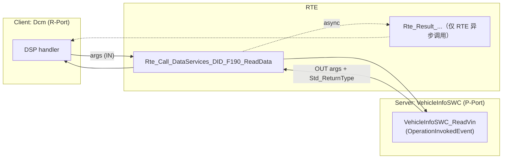
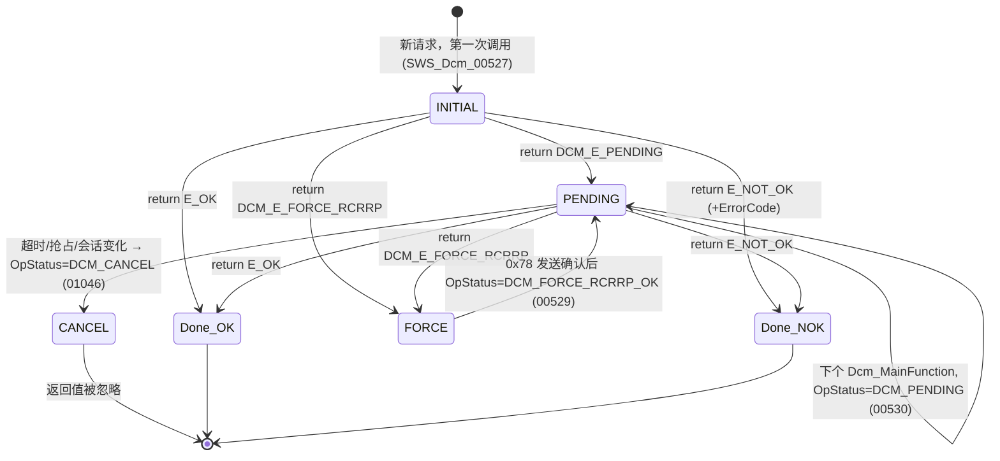
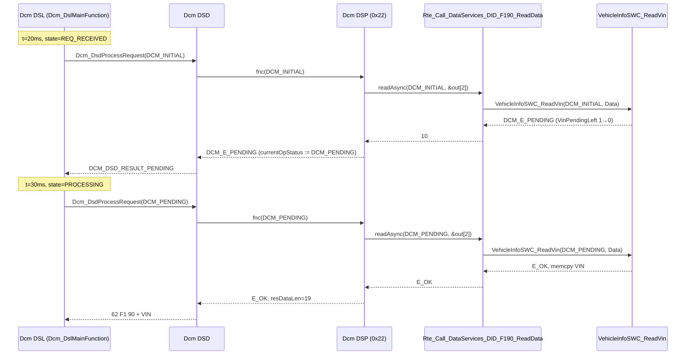

# Client/Server 通信：同步、异步与 DCM 的 OpStatus

> Prerequisite: [Port 与 Interface](02-port-interface.md), [Runnable 与 RTE Event](03-runnable-event.md), [RTE 生成](05-rte-generation.md)
> Next: [Sender/Receiver 通信](07-sender-receiver.md)
> 对应规范: **本仓库无 RTE SWS**——`Rte_Call_<p>_<o>`、`Rte_Result_<p>_<o>`、Synchronous/Asynchronous Server Call Point、`AsynchronousServerCallReturnsEvent`、`RTE_E_TIMEOUT`、`RTE_E_NO_DATA` 等为 AUTOSAR R4.x 公认约定，**需以项目 release 确认**。DCM SWS CP R20-11 可直接引用：`Dcm_OpStatusType`（`SWS_Dcm_00984`，p.301：`DCM_INITIAL 0x00 / DCM_PENDING 0x01 / DCM_CANCEL 0x02 / DCM_FORCE_RCRRP_OK 0x03`）、首次调用 `DCM_INITIAL`（`00527`）、`DCM_E_PENDING` 后每个 MainFunction 以 `DCM_PENDING` 重调（`00530`、`00760`）、取消时 `DCM_CANCEL` 且忽略返回值（`01046` p.81、`01413` p.111）、OUT 参数只在最后一次 E_OK 时有效（`01187–01189`，p.223–224）、"`USE_DATA_SYNCH_CLIENT_SERVER` 接口没有 OpStatus，不能返回 PENDING；是否使用 Synchronous/AsynchronousServerCallPoint 是实现决定，与签名无必然关系"（p.223）、0x78 上限 `DcmDslDiagRespMaxNumRespPend`（`ECUC_Dcm_00693`，p.460；`00120` p.111）。
> 对应源码: openAUTOSAR `examples/rte_simple/Calculator.c:10-13`、`Tester.c:11-22`、`rte_simple_lib.arxml:419-434`；本项目 `examples/uds_diag_demo/rte/Rte_Dcm.c`、`swc/VehicleInfoSWC.c:77-142`、`diag/Dcm_Dsp.c:264-367`、`diag/Dcm_Dsl.c:249-285`、`diag/Dcm_Dsd.c:163-167`

---

## 1. 本章目标

读完本章你应该能：

1. 区分 **RTE 层的同步/异步 C/S**（Synchronous vs Asynchronous Server Call Point，`Rte_Call` vs `Rte_Call` + `Rte_Result`）与 **DCM 层的同步/异步接口**（有没有 `OpStatus`、能不能返回 `DCM_E_PENDING`）——这是两层不同的东西。
2. 说出 server runnable 在什么上下文执行，调用期间 client 是否被阻塞。
3. 准确描述 DCM 的 `OpStatus` 状态机：`DCM_INITIAL → (DCM_E_PENDING) → DCM_PENDING … → E_OK / E_NOT_OK`，以及 `DCM_CANCEL`、`DCM_FORCE_RCRRP_OK`。
4. 写出一个正确的异步 server runnable（以 `VehicleInfoSWC_ReadVin` 与 `VehicleInfoSWC_WriteDiagConfig` 为例），知道 OUT 参数何时可以写、`ErrorCode` 何时有效。

---

## 2. 为什么需要 Client/Server？

S/R 只能表达"把最新值放到那里"。很多交互本质上是**请求-应答**：

- "给我 VIN"——数据可能需要从 NvM 读、从另一个 ECU 拿；
- "用这个 seed 算出 key 并比较"——需要输入，需要计算，有成功/失败；
- "启动自检例程"——有副作用，需要知道是否接受。

这些都需要：**输入参数 → 执行 → 输出参数 + 结果码**。这就是 Client/Server。

对诊断而言，几乎所有"DCM 调应用"都是 C/S：`DataServices_*`、`SecurityAccess_*`、`RoutineServices_*`（DCM SWS R20-11 §8.8）。

---

## 3. 在系统中的位置



逐条解释：

1. **DSP → `Rte_Call`**：client 发起调用，传入 IN 参数和 OUT 参数的缓冲指针。
2. **`Rte_Call` → server runnable**：同步且同分区时为直接调用；否则 RTE 把请求排队并激活 server 所在 task。
3. **server → `Rte_Call` → DSP**：同步时，server 返回即 `Rte_Call` 返回，OUT 参数已填好。
4. **`Rte_Result`（虚线）**：仅当 client 使用**异步 server call point** 时，`Rte_Call` 立即返回"已发出"，结果稍后通过 `Rte_Result` 取回（或由 `AsynchronousServerCallReturnsEvent` 触发 client runnable）。**DCM 的 DataServices 不使用这条路径**，见 §4.3。

---

## 4. AUTOSAR 如何定义？

### 4.1 RTE 层：同步 vs 异步 Server Call Point

> `[AUTOSAR Standard]` R4.x 公认语义，**本仓库无 RTE SWS，需以项目 release 确认**。

| | Synchronous Server Call Point | Asynchronous Server Call Point |
|---|---|---|
| ARXML | `SYNCHRONOUS-SERVER-CALL-POINT`（含 `TIMEOUT`） | `ASYNCHRONOUS-SERVER-CALL-POINT` |
| client API | `Std_ReturnType Rte_Call_<p>_<o>(IN..., OUT*...)` | `Rte_Call_<p>_<o>(IN...)` 只传 IN；`Rte_Result_<p>_<o>(OUT*...)` 取结果 |
| client 是否等待 | 是：返回时结果已就绪（或 `RTE_E_TIMEOUT`） | 否：`Rte_Call` 立即返回；稍后 `Rte_Result` 返回结果或 `RTE_E_NO_DATA` |
| server 执行位置 | 同分区可直接在 client 上下文执行；否则 server task 中执行，client task 阻塞等待（需要 OS extended task / event） | server task 中执行 |
| 通知 | — | 可配置 `AsynchronousServerCallReturnsEvent` 触发 client 的 runnable |

openAUTOSAR 例子：`examples/rte_simple/rte_simple_lib.arxml:419-434` 中 Tester 声明的是 `SYNCHRONOUS-SERVER-CALL-POINT`；`examples/rte_simple/Tester.c:16-21`：

```c
Std_ReturnType retVal = Rte_Call_Tester_Calculator_Multiply(arg1, arg2, &result);
if (retVal == RTE_E_OK) {
    Rte_IWrite_TesterRunnable_Result_result(result);
} else {
    Rte_IWrite_TesterRunnable_Result_result(0);
}
```

server：`examples/rte_simple/Calculator.c:10-13`：

```c
Std_ReturnType Multiply(const UInt8 arg1, const UInt8 arg2, UInt16* result) {
    *result = arg1 * arg2;
    return RTE_E_OK;
}
```

这是最基本的同步 C/S：client 调、server 算、client 拿结果。

### 4.2 DCM 层：SYNCH 与 ASYNCH 接口

DCM 在 RTE 的 C/S 之上，定义了自己的"异步"语义（DCM SWS R20-11 p.223、§3.5 研究笔记 02）：

| `DcmDspDataUsePort` | Operation 参数 | server 能否返回 `DCM_E_PENDING` | 规范 |
|---|---|---|---|
| `USE_DATA_SYNCH_CLIENT_SERVER` | `ReadData(OUT Data)` | **不能** | `SWS_Dcm_00793` |
| `USE_DATA_ASYNCH_CLIENT_SERVER` | `ReadData(IN OpStatus, OUT Data)` | 能 | `SWS_Dcm_91006` |
| `USE_DATA_ASYNCH_CLIENT_SERVER_ERROR` | `ReadData(IN OpStatus, OUT Data, OUT ErrorCode)` | 能，且可给 NRC | `SWS_Dcm_91005` |

DCM 的"异步"是**轮询式**的：

```text
Dcm_MainFunction #1:  r = Rte_Call_..._ReadData(DCM_INITIAL, buf)   → DCM_E_PENDING
Dcm_MainFunction #2:  r = Rte_Call_..._ReadData(DCM_PENDING, buf)   → DCM_E_PENDING
Dcm_MainFunction #3:  r = Rte_Call_..._ReadData(DCM_PENDING, buf)   → E_OK, buf 有效
```

每一次 `Rte_Call` 在 RTE 层面**都是一次完整的同步调用**（立刻返回）。"异步"体现在应用层：server 用返回值 `DCM_E_PENDING`（ApplicationError 10）告诉 Dcm "我还没做完，下次再问我"。

### 4.3 为什么两层不要混为一谈

DCM SWS R20-11 p.223 明确说：**是否使用 Synchronous 或 Asynchronous Server Call Point 是实现决定，与 OpStatus 签名无必然关系。** 在实际项目中最常见的组合是：

| 组合 | 是否常见 | 说明 |
|---|---|---|
| DCM ASYNCH 接口 + RTE 同步 call point + 同分区直接调用 | **最常见** | demo 就是这样：`Rte_Call` 是直接函数调用，"异步"完全由 OpStatus 轮询实现 |
| DCM SYNCH 接口 + RTE 同步 call point | 常见 | 数据立即可用（常量、RAM 变量），如 F187 |
| DCM ASYNCH 接口 + server 在另一分区/task | 可能 | RTE 层可能需要跨上下文；DCM 的 PENDING 轮询让 Dcm 不必阻塞 |
| RTE 异步 call point（`Rte_Result`） | DCM 的 DataServices 中很少见 | Dcm 的代码本身是以 OpStatus 轮询模型写的 |

### 4.4 DCM OpStatus 状态机（R20-11）



逐个状态/转移解释：

| 转移 | 谁触发 | server 应该做什么 | 规范 |
|---|---|---|---|
| `[*] → INITIAL` | DSP 第一次处理请求 | 初始化本次请求的内部状态（例如启动一次 NvM 读） | `SWS_Dcm_00527` |
| `→ PENDING` | server 返回 `DCM_E_PENDING` | 保存进度；**不要**写 OUT 参数（或写了也不算数） | `00530`、`01187` |
| `PENDING → PENDING` | Dcm 每个 MainFunction 再调 | 检查进度 | `00530`、`00760` |
| `→ Done_OK` | server 返回 `E_OK` | OUT 参数此时必须有效 | `01187` |
| `→ Done_NOK` | server 返回 `E_NOT_OK` | `_ERROR` 变体中设置 `ErrorCode`（0x01–0xFF），否则 Dcm 默认 0x10/0x22 | `01414`、`01415`、`00271` |
| `→ FORCE` | server 返回 `DCM_E_FORCE_RCRRP` | 要求 Dcm **立即**发 0x78（比如即将开始一个长时间阻塞的操作） | `00528` |
| `FORCE → PENDING` | 0x78 发送确认 | Dcm 以 `DCM_FORCE_RCRRP_OK` 再调 | `00529` |
| `→ CANCEL` | P2* 重试次数用尽、协议抢占、会话切换等 | 放弃本次操作、释放资源（如 `NvM_CancelJobs`）；返回值被忽略 | `01046`、`01413`、`00120`、`01048` |

---

## 5. 核心数据结构

C/S 调用在运行时需要保存的状态分散在三处：

| 状态 | 归谁 | demo 中的位置 |
|---|---|---|
| 当前请求、当前 OpStatus、读到第几个 DID、写到响应的哪个位置 | **Dcm（client）** | `diag/Dcm_Dsp.c:24-30` `Dcm_DspRdbiStateType`（`currentOpStatus`、`current`、`pos`），实例 `:38` |
| 服务是否处于 pending、P2 计时、0x78 次数 | Dcm DSL | `diag/Dcm_Dsl.c`（`Dcm_Dsl.state`、`p2TimerMs`、`respPendCount`） |
| server 自己的进度（还要 pending 几次、NvM 写到哪一步、staging buffer） | **SWC（server）** | `swc/VehicleInfoSWC.c:40` `VehicleInfoSWC_ConfigStaging`、`:42-43` `VinPendingCycles/VinPendingLeft` |
| RTE 异步调用的状态 | RTE | demo 无 |

**关键原则：异步 server 必须自己保存进度。** 因为每次 `DCM_PENDING` 调用都是一次全新的函数调用，栈上的局部变量不会保留。

---

## 6. 初始化流程

C/S 本身无需初始化，但 server 的内部状态要在 InitEvent 中复位：

- `swc/VehicleInfoSWC.c:54-60`：`VehicleInfoSWC_Init` 清零 `VinPendingLeft`、self test 状态，并从 NvM 读取 `ConfigMirror`。
- 如果 ECU 在一次 pending 操作中途复位，server 状态被 Init 重置，Dcm 也被 `Dcm_Init` 重置——双方一致。

---

## 7. Runtime Flow：F190 一次 pending 的完整时序



逐跳解释（全部对应 demo 源码与 `artifacts/uds-demo/trace.txt:34-46`）：

1. **t=20 ms，DSL 第一次处理**：`diag/Dcm_Dsl.c:254-257`，`state == DCM_DSL_REQ_RECEIVED` → 以 `DCM_INITIAL` 调 DSD。
2. **DSD 分发**：`diag/Dcm_Dsd.c:163` `Dcm_DsdActiveService->fnc(OpStatus, ...)`。
3. **DSP 0x22**：`diag/Dcm_Dsp.c:280-331` 做 DID 检查并初始化 `st->currentOpStatus = DCM_INITIAL`（`:330`）；`:349` 调 `d->readAsync(st->currentOpStatus, &out[2])`。
4. **RTE**：`rte/Rte_Dcm.c:59` 直接调用 server。
5. **SWC 返回 PENDING**：`swc/VehicleInfoSWC.c:84-92`：`DCM_INITIAL` 时装载 `VinPendingLeft = VinPendingCycles`（=1），然后减一并返回 `DCM_E_PENDING`。
6. **DSP 记录**：`diag/Dcm_Dsp.c:351-353`：`st->currentOpStatus = DCM_PENDING; return DCM_E_PENDING;`（注释 `SWS_Dcm_00530`）。
7. **DSD → DSL**：`diag/Dcm_Dsd.c:164-167` 返回 `DCM_DSD_RESULT_PENDING`；DSL 保持 `PROCESSING`（`Dcm_Dsl.c:240-241`）。
8. **t=30 ms，DSL 以 `DCM_PENDING` 再调**：`diag/Dcm_Dsl.c:258-261`（注释 `SWS_Dcm_00530`）。
9. **DSP 从断点继续**：`OpStatus != DCM_INITIAL`，跳过检查，直接进 `while` 循环（`Dcm_Dsp.c:335`），以保存的 `currentOpStatus = DCM_PENDING` 调用。
10. **SWC 返回 E_OK**：`swc/VehicleInfoSWC.c:93-95` 拷贝 17 字节 VIN。只有此刻 `Data` 才有效（`SWS_Dcm_01187`）。
11. **DSP 完成**：`Dcm_Dsp.c:360-366`，`resDataLen = pos`。

**如果 SWC 持续 pending 超过 P2**：DSL 在 `Dcm_Dsl.c:266-276` 中发送 NRC 0x78 并把计时器改为 P2*；达到 `DCM_DSL_MAX_NUM_RESP_PEND` 后在 `:277-284` 调 `Dcm_DsdCancel` → 以 `DCM_CANCEL` 调用 server（`Dcm_Dsd.c:192`、`Dcm_Dsp.c:269-277`），然后发 NRC 0x10（`SWS_Dcm_00120`）。

---

## 8. RH850 Hardware Mapping

`[RH850 Hardware]`

- C/S 调用在 P1M-E 上是同一核上的函数调用（同分区）或跨 task 的激活（不同 task）。不涉及外设寄存器。
- **NvM 异步写**是 C/S pending 的典型来源：`NvM_WriteBlock` 只排队，实际写 Data Flash 发生在 `NvM_MainFunction` → Fee → Fls 中，可能持续数毫秒到数十毫秒（RH850 Data Flash 擦写时间需以 Flash 手册确认）。这正是 `VehicleInfoSWC_WriteDiagConfig` 必须返回 `DCM_E_PENDING` 的原因。
- **SecurityAccess 用 HSM/ICUMx**：在带 ICU（安全模块）的 RH850 上，CompareKey 可能由 Csm 异步调用硬件加密完成，同样适合 ASYNCH 接口。P1M-E 是否有 ICU 以及其接口需根据实际芯片手册确认。

---

## 9. openAUTOSAR 实现

| 位置 | 内容 | 评价 |
|---|---|---|
| `examples/rte_simple/Tester.c:16` | `Rte_Call_Tester_Calculator_Multiply(arg1, arg2, &result)` | 标准同步 client 调用 |
| `examples/rte_simple/Calculator.c:10-13` | server runnable `Multiply` | 标准同步 server |
| `rte_simple_lib.arxml:419-434` | `SYNCHRONOUS-SERVER-CALL-POINT CallCalculator` | 声明调用点 |
| `diagnostic/Dcm/src/Dcm_Dsp.c:1250-1261`（研究笔记 03 §4.4） | `ReadDataFnc(&tx[txPos])`——**配置中的 C 函数指针**，无 OpStatus；`E_PENDING` → 0x78 路径 | R3.1.5 风格：没有 OpStatus 重入模型，没有 RTE port |

openAUTOSAR 的 Dcm 中没有任何 C/S port 调用，DataServices 相当于 R4.x 的 `USE_DATA_SYNCH_FNC`。

---

## 10. 当前教学项目实现

`[Educational Implementation]` demo 覆盖了三种 C/S 形态：

| 端口 | DCM 接口形态 | client 调用点 | server runnable | 演示什么 |
|---|---|---|---|---|
| `DataServices_DID_F190.ReadData` | ASYNCH（OpStatus） | `Dcm_Dsp.c:349` | `VehicleInfoSWC.c:77-96` | 可配置次数的 `DCM_E_PENDING`；`DCM_CANCEL` 处理 |
| `DataServices_DID_F187.ReadData` | SYNCH | `Dcm_Dsp.c:345` | `VehicleInfoSWC.c:98-103` | 立即返回 |
| `DataServices_DID_F1A0.WriteData` | ASYNCH 定长 + ErrorCode（`SWS_Dcm_91008`） | `Dcm_Dsp.c:521` | `VehicleInfoSWC.c:114-142` | 等 NvM 异步写；`ErrorCode` 给 NRC 0x22 / 0x72 |
| `SecurityAccess_Level_01.GetSeed/CompareKey` | ASYNCH + ErrorCode | `Dcm_Dsp.c:424`、`:454` | `SecurityAccessSWC.c:34`、`:56` | `DCM_E_COMPARE_KEY_FAILED`（11） |
| `RoutineServices_Routine_FF00.*` | ASYNCH + ErrorCode | `Dcm_Dsp.c:595`（经 `Dcm_Cfg.c:55-85` glue） | `VehicleInfoSWC.c:145-183` | 有状态的例程 |

所有 `Rte_Call_*` 都在 `rte/Rte_Dcm.c` 中被实现为**同步直接调用**——即 §4.3 表中"最常见"的组合。

---

## 11. Code Walkthrough：写一个正确的异步 server

### 11.1 `VehicleInfoSWC_ReadVin`（`swc/VehicleInfoSWC.c:77-96`）

```c
Std_ReturnType VehicleInfoSWC_ReadVin(Dcm_OpStatusType OpStatus, uint8 *Data)  /* [Educational Implementation] */
{
    if (OpStatus == DCM_CANCEL) {                       /* ① 取消：清理状态，返回值会被忽略 */
        VehicleInfoSWC_VinPendingLeft = 0u;
        return E_OK;
    }
    if (OpStatus == DCM_INITIAL) {                      /* ② 新请求：初始化进度 */
        VehicleInfoSWC_VinPendingLeft = VehicleInfoSWC_VinPendingCycles;
    }
    if (VehicleInfoSWC_VinPendingLeft != 0u) {          /* ③ 还没好：不写 Data，返回 PENDING */
        VehicleInfoSWC_VinPendingLeft--;
        return DCM_E_PENDING;
    }
    (void)memcpy(Data, VehicleInfoSWC_Vin, VEHINFO_VIN_LENGTH);   /* ④ 好了：写 OUT 参数 */
    return E_OK;
}
```

要点：

- ① **先处理 `DCM_CANCEL`**，否则取消时可能还在做"正常处理"。
- ② **只在 `DCM_INITIAL` 时初始化**；`DCM_PENDING` 时继续上次进度。
- ③ 进度保存在 `static` 变量里，因为每次都是新的函数调用。
- ④ 只在返回 `E_OK` 时写 `Data`。（`Data` 指针在每次调用时都指向同一个 Dcm 响应缓冲位置，但规范只保证最后一次有效——`SWS_Dcm_01187`。）

### 11.2 `VehicleInfoSWC_WriteDiagConfig`（`swc/VehicleInfoSWC.c:114-142`）——包裹另一个异步服务

```c
    if (OpStatus == DCM_INITIAL) {  /* [Educational Implementation] */
        (void)memcpy(VehicleInfoSWC_ConfigStaging, Data, NVM_DIAGCONFIG_BLOCK_SIZE);  /* ① 拷贝到稳定缓冲 */
        if (Rte_Call_NvM_DiagConfig_WriteBlock(VehicleInfoSWC_ConfigStaging) != E_OK) {
            *ErrorCode = DCM_E_CONDITIONSNOTCORRECT;                                  /* ② 请求被拒 → 0x22 */
            return E_NOT_OK;
        }
        return DCM_E_PENDING;                                                          /* ③ 已排队 */
    }
    (void)Rte_Call_NvM_DiagConfig_GetErrorStatus(&res);                               /* ④ 轮询 */
    if (res == NVM_REQ_PENDING) {
        return DCM_E_PENDING;
    }
    if (res != NVM_REQ_OK) {
        *ErrorCode = DCM_E_GENERALPROGRAMMINGFAILURE;                                  /* ⑤ 写失败 → 0x72 */
        return E_NOT_OK;
    }
    (void)memcpy(VehicleInfoSWC_ConfigMirror, VehicleInfoSWC_ConfigStaging, NVM_DIAGCONFIG_BLOCK_SIZE);
    return E_OK;
```

要点：

- ① **为什么要拷贝？** `Data` 指向 Dcm 的请求缓冲。NvM 写是异步的，必须在整个写过程中保持源数据稳定（`mem/NvM.h:8-9` 注释：caller must keep its RAM buffer stable）。Dcm 在 pending 期间通常不会覆盖请求缓冲，但 SWC 不应依赖这一点。
- ③ → ④：典型的"一个异步服务包另一个异步服务"——DCM 的 OpStatus 轮询驱动 SWC 去轮询 NvM 的 `GetErrorStatus`。
- ⑤：NRC 0x72 是 DCM 自己在 `USE_BLOCK_ID` 写 NvM 失败时也会用的 NRC（`SWS_Dcm_00541`，p.175–176），这里由 SWC 选择同样的语义。
- `DCM_CANCEL` 分支（`:119-121`）注释提到真实 SWC 可能需要 `NvM_CancelJobs`（`SWS_Dcm_01048`）。

### 11.3 返回值语义速查

| server 返回 | Dcm 怎么处理（R20-11） | demo 中 |
|---|---|---|
| `E_OK` (0) | 使用 OUT 数据 | 所有成功路径 |
| `E_NOT_OK` (1)，无 ErrorCode 参数 | 默认 NRC（0x22 for ReadData 失败，或 0x10） | `Dcm_Dsp.c:355-358` 用 0x22 |
| `E_NOT_OK` + `ErrorCode` | 用 ErrorCode 作为 NRC；ErrorCode 为 0 时报 `DCM_E_INVALID_VALUE` 并用 0x10 | `Dcm_Dsd.c:169-173` |
| `DCM_E_PENDING` (10) | 下周期以 `DCM_PENDING` 重调；超 P2 发 0x78 | `Dcm_Dsp.c:351-353` |
| `DCM_E_COMPARE_KEY_FAILED` (11) | 计数器 +1，0x35 或 0x36 | `Dcm_Dsp.c:454` 之后 |
| `DCM_E_FORCE_RCRRP` (12) | 立即发 0x78 | demo 未实现（README §6 已注明） |

---

## 12. Debug 方法

| 症状 | 断点/观察 |
|---|---|
| 永远 0x78 然后 0x10 | 在 server runnable 设断点，看是否一直返回 `DCM_E_PENDING`；看 `OpStatus` 是否从未变成 `DCM_INITIAL`（说明 SWC 没重置进度）；看被等待的服务（NvM）是否在运行（`NvM_MainFunction` 是否被调度） |
| 响应数据是旧值或乱码 | server 是否在 `DCM_E_PENDING` 时就写了 `Data`？是否返回 E_OK 前忘了写？ |
| 取消后下一次请求行为异常 | server 的 `DCM_CANCEL` 分支是否复位了全部进度变量 |
| NRC 与预期不符 | 看 `ErrorCode` 是否在 `E_NOT_OK` 时设置；接口是否是 `_ERROR` 变体 |

demo 观察点：`Dcm_DspRdbi.currentOpStatus`（`diag/Dcm_Dsp.c:38`）、`VehicleInfoSWC_VinPendingLeft`（`swc/VehicleInfoSWC.c:43`）、`Dcm_Dsl.respPendCount`（`diag/Dcm_Dsl.c`）。

---

## 13. 常见问题 / 常见错误

1. **在 server 里 busy-wait**：`while (NvM_GetErrorStatus(...) == PENDING) {}`——NvM_MainFunction 可能和 Dcm 在同一 task 或更低优先级，永远等不到，ECU 卡死并触发看门狗。必须返回 `DCM_E_PENDING`。
2. **SYNCH 接口里返回 `DCM_E_PENDING`**：SYNCH 接口没有 OpStatus，Dcm 不会重调（DCM SWS R20-11 p.223）；行为未定义（多数实现当作错误）。
3. **忽略 `DCM_CANCEL`**：下次 `DCM_INITIAL` 来时 server 仍以为在上一个请求中。
4. **把 `DCM_E_PENDING` 当作 NRC**：它是 ApplicationError（Std_ReturnType 值 10），不是 NRC。SWC 无法直接"发 0x78"。
5. **把 RTE 同步/异步与 DCM 同步/异步混为一谈**：见 §4.3。
6. **E_NOT_OK 时 ErrorCode 填 0**：R20-11 要求 0x01–0xFF（`SWS_Dcm_01414/01415`）。
7. **Routine `Stop` 签名不一致**：R20-11 C 原型 `Xxx_Stop`（`SWS_Dcm_01204`，p.289）缺 OpStatus，而 C/S 接口描述中有——真实项目以生成的 `Rte_*.h` 为准（研究笔记 02 §3.9 "规范瑕疵"）。demo 中 `Rte_Call_RoutineServices_Routine_FF00_Stop` 带 OpStatus（`rte/Rte_Dcm.h:43`）。

---

## 14. 实验

所有实验通过阅读和运行观察，不修改 demo。

1. **pending 计数**：运行 `python tools/run_uds_demo.py`，在 `artifacts/uds-demo/trace.txt` 中找到第二个 F190 读取（"慢 SWC" 场景，约第 625 行起，`VehicleInfoSWC_SetVinPendingCycles(8u)` 来自 `integration/main_demo.c:99`）。数一数 `DCM_E_PENDING` 次数，找出 `7F 22 78` 在哪一次 pending 之后发出，并用 P2 = 50 ms − 10 ms adjust（`diag/Dcm_Cfg.h:26`、`Dcm_Cfg.c:21`）解释。
2. **NvM 嵌套异步**：在 trace 中找 `WriteDiagConfig` 的两行（约第 259–268 行），确认 INITIAL 时只"请求"、PENDING 时才"完成"，并找出中间 `NvM` 模块的 trace 行（`NvM_MainFunction` 在 5 ms task 中，`integration/BswScheduler.c:44-46`）。
3. **取消路径（读代码）**：从 `diag/Dcm_Dsl.c:277-284` 出发，追踪到 `Dcm_Dsd.c:192`、`Dcm_Dsp.c:269-277`、`rte/Rte_Dcm.c:59`、`swc/VehicleInfoSWC.c:79-83`，画出 `DCM_CANCEL` 的调用链。README §8 给出了触发它的参数修改方法（需在自己的副本上做）。

---

## 15. 思考题

1. 如果 F190 的 VIN 来自另一个 ECU（经 CAN 请求），server 至少需要几次 `DCM_E_PENDING`？如何设计 server 的内部状态机？
2. `DCM_E_FORCE_RCRRP` 适合什么场景？为什么不能用普通的 `DCM_E_PENDING` 代替？
3. 为什么 DCM 要求"异步接口的 IN 参数每次都要给"（`SWS_Dcm_01189`）？这对 server 实现意味着什么？
4. 如果 server runnable 被映射到一个比 Dcm 低优先级的 task，并使用 RTE 同步 call point，会发生什么？使用 DCM ASYNCH 接口能否缓解？

---

## 16. 对未来真实项目的意义

`[Real Project Consideration]`

- 真实项目中**所有涉及 NvM、外部 ECU、硬件加密、长时间计算**的 DID/Routine/SecurityAccess 都应该是 ASYNCH 接口。审查诊断 SWC 时，第一项检查就是"有没有 busy-wait"。
- DCM 升级中 SYNCH ↔ ASYNCH 的切换会改变所有 server runnable 的签名；同时要检查每个 server 是否正确处理 `DCM_CANCEL` 与 `DCM_FORCE_RCRRP_OK`（老代码常常没有）。
- 遇到"偶发 NRC 0x10"，优先怀疑 `DcmDslDiagRespMaxNumRespPend` 用尽后的取消（`SWS_Dcm_00120`），用 trace/断点确认 server 被以 `DCM_CANCEL` 调用。
- 用 CANoe 测试时，`7F xx 78` 的次数和间隔直接反映 server 的 pending 时长——这是不打断点就能观察 C/S 异步行为的方法。

---

## 17. 本章总结

```text
C/S = 请求-应答：Rte_Call_<p>_<o>(IN, OUT*) → server runnable (OperationInvokedEvent)
RTE 层：同步 call point（Rte_Call 返回即结果） vs 异步（Rte_Call + Rte_Result）
DCM 层：SYNCH 接口（无 OpStatus） vs ASYNCH 接口（OpStatus 轮询 + DCM_E_PENDING）
最常见组合：DCM ASYNCH + RTE 同步直接调用 —— "异步"靠 Dcm 每个 MainFunction 重调实现
OpStatus：INITIAL → (PENDING)* → E_OK/E_NOT_OK；CANCEL 必须清理；OUT 只在 E_OK 时有效
server 进度存在 static 变量；绝不 busy-wait
```

## 18. 下一章

C/S 是"按需调用"。另一种同样重要的通信是"状态广播"：[07-sender-receiver.md](07-sender-receiver.md) 讲 S/R 的 queued/unqueued、init value、`Rte_Read/Write` 与 `Rte_IRead/IWrite`，以及 DCM 的 `USE_DATA_SENDER_RECEIVER` 什么时候比 C/S 更合适。
