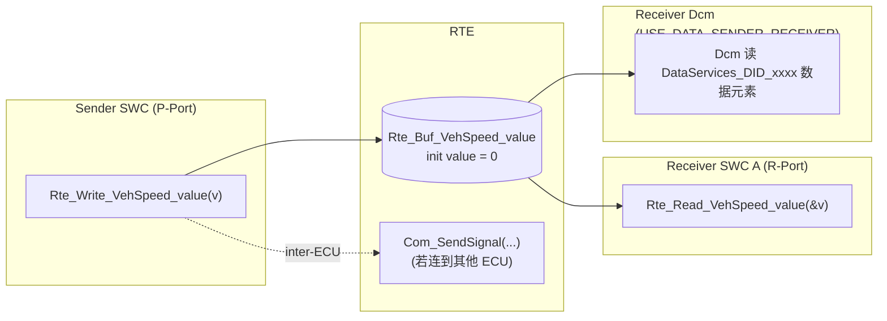
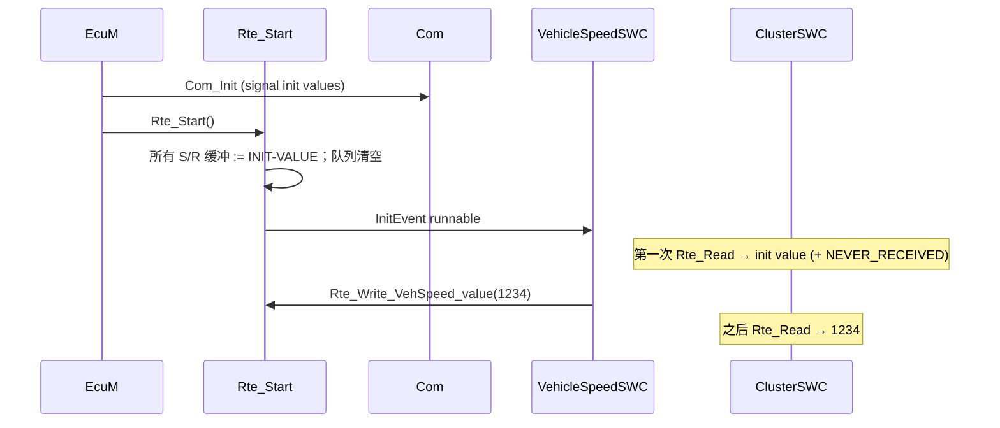
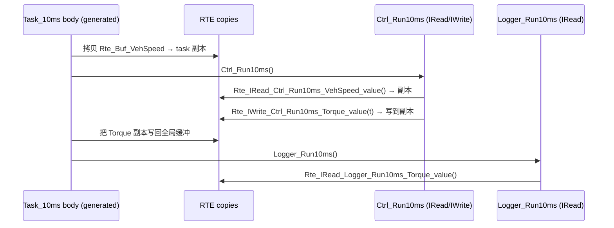

# Sender/Receiver 通信：Read/Write、IRead/IWrite、Queued 与 Init Value

> Prerequisite: [Port 与 Interface](02-port-interface.md), [Client/Server 通信](06-client-server.md)
> Next: [DCM 与 RTE 的集成](08-dcm-rte-integration.md)
> 对应规范: **本仓库无 RTE SWS、无 Com SWS**——`Rte_Read/Rte_Write/Rte_Send/Rte_Receive/Rte_IRead/Rte_IWrite/Rte_IWriteRef/Rte_IStatus`、queued/unqueued、init value、`RTE_E_NO_DATA`/`RTE_E_NEVER_RECEIVED`/`RTE_E_LIMIT`/`RTE_E_LOST_DATA` 等均为 AUTOSAR R4.x 公认约定，**需以项目 release 确认**。DCM SWS CP R20-11 可引用：`USE_DATA_SENDER_RECEIVER` / `USE_DATA_SENDER_RECEIVER_AS_SERVICE`（`ECUC_Dcm_00713`，p.537–539；§8.8.2.2 p.336）、原子 S/R DID 接口 `USE_ATOMIC_SENDER_RECEIVER_INTERFACE(_AS_SERVICE)`（`ECUC_Dcm_01122`，p.510–511；§8.8.2.1 p.335）、S/R 数据按 `DcmDspDataEndianness` 序列化（`SWS_Dcm_00638`）、0x22 读取按 UsePort 读 S/R 接口（`SWS_Dcm_00437`）。
> 对应源码: openAUTOSAR `examples/rte_simple/Tester.c:11-34`、`Logger.c:14-18`、`Logger2.c:14-18`、`rte_simple_lib.arxml:206-271, :379-418`、`rte_simple_extract.arxml:19-58`、`rte/src/rte.c:35-47`；本项目 demo **没有 S/R 端口**（只有 C/S 与 Mode），本章代码多为 `[Conceptual]`

---

## 1. 本章目标

读完本章你应该能：

1. 说清 S/R 的语义：**发送者写"最新状态"，接收者在自己方便的时候读**；双方在时间上解耦。
2. 区分 **unqueued（last-is-best）** 与 **queued（事件队列）**，以及各自的 API：`Rte_Read/Rte_Write` vs `Rte_Receive/Rte_Send`。
3. 区分 **显式访问**（`Rte_Read/Write`）与 **隐式访问**（`Rte_IRead/IWrite`），理解隐式访问"runnable 执行期间数据不变"的一致性保证。
4. 理解 **init value** 与"从未收到"状态。
5. 判断诊断 DID 何时适合用 `USE_DATA_SENDER_RECEIVER` 而不是 C/S。

---

## 2. 为什么需要 Sender/Receiver？

很多 ECU 数据是**持续变化的状态**：车速、电压、温度、门状态。它们的特点：

- 有一个"生产者"周期性更新；
- 有零个或多个"消费者"在各自的周期读取；
- 消费者只关心**最新值**，不关心中间丢了几个；
- 生产者不应该因为有几个消费者而改变代码。

用 C/S 做这件事会很别扭：每个消费者都要"调用"生产者，生产者的代码在消费者的上下文里执行。S/R 则把这种"状态广播"变成写缓冲 + 读缓冲，生产者与消费者互不知道对方存在。

---

## 3. 在系统中的位置



逐条解释：

1. **Sender → RTE 缓冲**：`Rte_Write` 把值写入 RTE 生成的缓冲变量（同 ECU）；若该端口映射到 Com 信号，则调用 `Com_SendSignal`（跨 ECU）。SWC 代码相同。
2. **RTE 缓冲 → Receiver A**：`Rte_Read` 拷贝出最新值。
3. **RTE 缓冲 → Dcm**：当 `DcmDspDataUsePort = USE_DATA_SENDER_RECEIVER` 时，Dcm 作为 Receiver 读取数据元素（DCM SWS R20-11 §8.8.2.2，p.336），然后按 `DcmDspDataEndianness` 序列化到响应（`SWS_Dcm_00638`）。**此时应用 SWC 的代码在 Dcm 读取那一刻并不执行。**

---

## 4. AUTOSAR 如何定义？

> `[AUTOSAR Standard]` 本节为 R4.x 公认语义，**本仓库无 RTE SWS，需以项目 release 确认**。

### 4.1 Unqueued vs Queued

| | Unqueued（last-is-best） | Queued |
|---|---|---|
| 语义 | 状态（state） | 事件（event） |
| 缓冲 | 1 个值 | FIFO，长度由接收端 ComSpec `QUEUE-LENGTH` 决定 |
| Sender API | `Std_ReturnType Rte_Write_<p>_<d>(<type> data)`（复合类型传 `const*`） | `Std_ReturnType Rte_Send_<p>_<d>(<type> data)` |
| Receiver API | `Std_ReturnType Rte_Read_<p>_<d>(<type>* data)` | `Std_ReturnType Rte_Receive_<p>_<d>(<type>* data)` |
| 读取副作用 | 无（读多少次都是同一个值） | 读取即出队 |
| 典型错误码 | `RTE_E_NEVER_RECEIVED`（从未写过，但仍给出 init value）、`RTE_E_MAX_AGE_EXCEEDED`（overlay，超时） | `RTE_E_NO_DATA`（队列空）、`RTE_E_LIMIT`（发送时队列满）、`RTE_E_LOST_DATA`（overlay，曾丢数据） |
| init value | 有（ComSpec `INIT-VALUE`） | 无（队列初始为空） |
| 例子 | 车速、电池电压、VIN（常量） | 按键事件、诊断请求通知 |

openAUTOSAR 的 `include/Rte.h:24-33`（AR 3.x）中有 `RTE_E_NO_DATA 131`、`RTE_E_LIMIT 130`、overlay `RTE_E_LOST_DATA 64`、`RTE_E_MAX_AGE_EXCEEDED 64`。R4.x 中值与新增码以项目 `Rte.h` 为准。

### 4.2 显式 vs 隐式访问

| | 显式（Explicit） | 隐式（Implicit） |
|---|---|---|
| ARXML（runnable 中） | `DATA-RECEIVE-POINT-BY-ARGUMENTS` / `DATA-SEND-POINTS` | `DATA-READ-ACCESSS` / `DATA-WRITE-ACCESSS` |
| API | `Rte_Read_<p>_<d>(&v)` / `Rte_Write_<p>_<d>(v)` | `<type> Rte_IRead_<r>_<p>_<d>()` / `void Rte_IWrite_<r>_<p>_<d>(v)` / `<type>* Rte_IWriteRef_<r>_<p>_<d>()` / `Rte_IStatus_<r>_<p>_<d>()` |
| API 名中有无 runnable 名 | 无 | **有**（`<r>`） |
| 读到的是 | 调用那一刻的最新值 | runnable **开始之前** RTE 拷贝的副本；整个 runnable 期间不变 |
| 写的生效时间 | 调用即生效 | runnable **结束之后** RTE 统一写回 |
| 返回状态 | 有 | IRead 无返回码（需 `Rte_IStatus`） |
| 代价 | 每次调用一次拷贝/保护 | 每次 runnable 执行前后一次批量拷贝；运行中零开销 |
| 适合 | 需要读最新值、或只偶尔读 | 控制算法：需要整个计算周期内输入一致 |

**为什么隐式访问重要？** 假设 runnable 读两次车速：

```c
/* [Conceptual] 显式访问的一致性问题 */
(void)Rte_Read_VehSpeed_value(&v1);
/* ... 此时被高优先级 task 抢占，sender 写了新值 ... */
(void)Rte_Read_VehSpeed_value(&v2);   /* v1 != v2 */
```

用隐式访问时，`Rte_IRead_Ctrl10ms_VehSpeed_value()` 在整个 runnable 中返回同一个值，这是 RTE 帮你做的"数据一致性"。代价是数据最长有一个周期的延迟。

openAUTOSAR 例子：`examples/rte_simple/Tester.c:12-13` `Rte_IRead_TesterRunnable_Arguments_arg1()`、`:18` `Rte_IWrite_TesterRunnable_Result_result(result)`；`Logger.c:16` 与 `Logger2.c:16` 两个 receiver 读同一个 `Result.result`——典型的 1:n S/R。注意 API 名中 `TesterRunnable` / `LoggerRunnable` 是 runnable 名。

`rte/src/rte.c:35-42` 的两个 typedef 正是隐式访问的常见实现草稿：

```c
typedef struct { uint8 value; } Rte_DE_uint8;                          /* data element 副本 */
typedef struct { uint8 value; Std_ReturnType status; } Rte_DES_uint8;  /* 副本 + 状态（给 Rte_IStatus） */
```

### 4.3 1:n 与 n:1

| 连接 | S/R | C/S |
|---|---|---|
| 1 个 provider : n 个 requester | ✔（一个 sender，多个 receiver） | ✔（一个 server，多个 client） |
| n 个 provider : 1 个 requester | ✔ 仅 queued（多个 sender 往一个队列） | ✘ |

### 4.4 Init value 与 "never received"

- 每个 unqueued 数据元素在 receiver 的 ComSpec（或 sender 的 ComSpec）中定义 `INIT-VALUE`。
- `Rte_Start` 时缓冲被设为 init value。sender 第一次写之前，receiver 读到的是 init value，返回码可能是 `RTE_E_NEVER_RECEIVED`（若配置了 `HANDLE-NEVER-RECEIVED`；R4.x 公认，需确认）。
- 跨 ECU 时，Com 信号的 init value 与 RTE 的 init value 应一致，否则上电时 receiver 可能先看到 RTE 的值、再看到 Com 的值。

### 4.5 DCM 与 S/R

DCM SWS R20-11 中 S/R 出现在两处：

| UsePort | 端口 | 含义 | 规范 |
|---|---|---|---|
| `DcmDspDataUsePort = USE_DATA_SENDER_RECEIVER` | Dcm R-Port `DataServices_<Data>`（S/R），读；写 DID 时 Dcm 是 sender | 该数据元素由某个 SWC 持续写入，Dcm 读取时拿缓冲中的最新值 | §8.8.2.2 p.336；`SWS_Dcm_00437` |
| `USE_DATA_SENDER_RECEIVER_AS_SERVICE` | 同上，但端口是 service port（`IS-SERVICE`） | 连接方式不同（服务端口语义） | 同上 |
| `DcmDspDidUsePort = USE_ATOMIC_SENDER_RECEIVER_INTERFACE(_AS_SERVICE)` | 一个 S/R 端口承载**整个 DID**（结构体） | 4.4.0 引入，保证一个 DID 的所有信号来自同一时刻（原子性） | §8.8.2.1 p.335；研究笔记 02 §6.1 |

**何时用 S/R 而不是 C/S 提供 DID？**

| 适合 S/R | 适合 C/S |
|---|---|
| 数据本来就是 SWC 周期计算的状态（车速、温度、当前档位） | 数据需要按需获取（读 NvM、问另一个 ECU、计算代价高） |
| 可接受"读到的是最近一次写入的值" | 需要条件检查（`ConditionCheckRead`）、需要返回 NRC |
| 不需要 pending | 可能需要 `DCM_E_PENDING` |
| 想让 Dcm 读取不触发任何应用代码 | 需要在读的那一刻执行逻辑 |

VIN 是一个有趣的例子：它是常量，S/R 和 C/S 都可以。demo 选 C/S + ASYNCH，是为了演示 OpStatus；很多真实项目直接用 `USE_BLOCK_ID`（Dcm 直接读 NvM block）或 S/R。

---

## 5. 核心数据结构

`[Conceptual]` RTE 为 S/R 生成的典型数据：

```c
/* [Conceptual] Rte.c 中的 S/R 缓冲 —— 不是任何工具的真实输出 */

/* unqueued: one buffer per data element (1:n -> one shared buffer) */
static uint16 Rte_Buf_VehicleSpeedSWC_VehSpeed_value = 0u;           /* INIT-VALUE = 0 */
static boolean Rte_RxFlag_VehSpeed_value_neverReceived = TRUE;

/* queued: ring buffer per receiver port */
static uint8 Rte_Queue_KeyEvt[4];                                    /* QUEUE-LENGTH = 4 */
static uint8 Rte_QHead_KeyEvt, Rte_QCount_KeyEvt;
static boolean Rte_QOverflow_KeyEvt;                                 /* -> RTE_E_LOST_DATA */

/* implicit: per-task copy, refreshed before the runnables of that task run */
static struct { uint16 value; } Rte_Task10ms_Copy_VehSpeed;
```

---

## 6. 初始化流程



逐跳解释：

1. **Com_Init**：跨 ECU 信号的 init value 在 Com 中。
2. **Rte_Start**：RTE 把本地缓冲设为 init value。
3. **Init runnable**：sender 可以在这里写一个初始状态。
4. **第一次读**：receiver 拿到 init value，可通过返回码知道"从未收到"。
5. **之后**：读到最新值。

---

## 7. Runtime Flow：隐式访问在 task 中的时序



逐跳解释：

1. **task body 开始时拷贝输入**：所有该 task 内 runnable 的隐式输入一次性拷贝，保证一致。
2. **`Rte_IRead`**：通常被生成为宏，直接读副本，零开销。
3. **`Rte_IWrite`**：写到副本，**此时其他 task 还看不到**。
4. **runnable 结束后写回**：RTE 在 runnable（或 task）结束时把输出写回全局缓冲。
5. **同 task 的后续 runnable**：能否看到前一个 runnable 的隐式输出取决于生成器的写回粒度（每个 runnable 后还是整个 task 后），需以生成器文档确认。

---

## 8. RH850 Hardware Mapping

`[RH850 Hardware]`

| 问题 | RH850/P1M-E 上的考虑 |
|---|---|
| 单个 S/R 读写是否原子 | RH850G3M 是 32 位 CPU；对齐的 8/16/32 位访问是单条 load/store。`uint16` 车速在同核不同 task 间可以不加保护；17 字节 VIN、64 位数、结构体需要 RTE 加保护（中断屏蔽或 OS Resource）。 |
| 隐式拷贝的代价 | 拷贝在 Local RAM 中进行，单周期访问；拷贝量大时影响 task 执行时间，需在 timing 分析中计入。 |
| 跨核 | P1M-E 单可调度核，无 IOC。多核 RH850 需根据实际芯片与 OS 手册确认。 |
| 跨 ECU | S/R → Com 信号 → PduR → CanIf → RS-CANFD。帧格式、周期在 Com/CanIf 配置中；见 [CAN 硬件基础](../04-can-mcal/01-can-hardware-basics.md)。 |

---

## 9. openAUTOSAR 实现

| 位置 | 内容 | 评价 |
|---|---|---|
| `examples/rte_simple/rte_simple_lib.arxml:206-271` | `ArgumentIf`（arg1, arg2）、`ResultIf`（result）、`FreqReqIf`（freq）三个 S/R 接口 | 没有 queued、没有 init value 声明 |
| `rte_simple_lib.arxml:379-418` | `TesterRunnable` 的 `DATA-READ-ACCESSS`（隐式读 arg1/arg2）、`DATA-WRITE-ACCESSS`（隐式写 result） | 隐式访问声明 → `Rte_IRead/IWrite` |
| `examples/rte_simple/Tester.c:12-13, :18-20` | `Rte_IRead_TesterRunnable_Arguments_arg1()`、`Rte_IWrite_TesterRunnable_Result_result()` | 隐式访问用法 |
| `examples/rte_simple/Tester.c:26, :33` | `FreqReqRunnable` 读 `FreqReq.freq` 并回写 `FreqReqInd.freq`（注释 "from COM stack"） | S/R ↔ Com 信号 |
| `Logger.c:16`、`Logger2.c:16` | 两个 receiver 读同一 `Result.result` | 1:n |
| `rte_simple_extract.arxml:19-58` | `SENDER-RECEIVER-TO-SIGNAL-MAPPING`：把 `Arguments.arg1` 等映射到 `SYSTEM-SIGNAL Arg1` 等 | **这就是"S/R 端口变成 CAN 信号"的配置**；生成器据此生成 `Com_ReceiveSignal` |
| `rte/src/rte.c:35-47` | `Rte_DE_uint8` / `Rte_DES_uint8` / 坏掉的 `Rte_IRead_re1_doors_get_status` 宏 | 隐式访问实现草稿 |

---

## 10. 当前教学项目实现

`[Educational Implementation]` **demo 没有 S/R 端口。** 原因：demo 的主题是 Dcm → 应用的诊断调用，R20-11 中这条路径的主力是 C/S（`DataServices_*` C/S、`SecurityAccess_*`、`RoutineServices_*`）。demo 中最接近 S/R 语义的是 **Mode**：

| demo 中的东西 | 与 S/R 的关系 |
|---|---|
| `rte/Rte_Dcm.c:24` `Rte_ModeDcmDiagnosticSessionControl` | 类似一个 unqueued 数据缓冲，init value = `DCM_DEFAULT_SESSION` |
| `SchM_Switch_Dcm_DcmDiagnosticSessionControl`（`rte/Rte_Dcm.c:134-139`） | 类似 `Rte_Write`（manager 写） |
| `Rte_Mode_DcmDiagnosticSessionControl_DcmDiagnosticSessionControl`（`:141-144`） | 类似 `Rte_Read`（user 读最新值） |

真正的 Mode 机制比 S/R 多了：模式切换的原子性、`SwcModeSwitchEvent`、ModeDisablingDependency、切换确认。demo 只实现了"读最新值"这一面。

如果要在 demo 中加入一个 S/R DID（例如 `0xF40D` 车速），概念上需要：一个 `VehicleSpeedSWC` 周期 `Rte_Write`、RTE 中一个缓冲、Dcm 配置中 `usePort = USE_DATA_SENDER_RECEIVER`、DSP 中按 UsePort 读缓冲而不是调函数。**本教程不修改 demo**，这一扩展留作 [09-diagnostic-swc-example.md](09-diagnostic-swc-example.md) 的设计练习。

---

## 11. Code Walkthrough：S/R 写法示例

`[Conceptual]` 一个生产者、两个消费者（其中一个是 Dcm）：

```c
/* [Conceptual] VehicleSpeedSWC.c — teaching sketch, not production code */
#include "Rte_VehicleSpeedSWC.h"

void VehicleSpeedSWC_Run10ms(void)               /* TimingEvent 10 ms */
{
    uint16 raw;
    uint16 speed;
    (void)Rte_Read_WheelSpeedRaw_value(&raw);     /* explicit read from IoHwAb / sensor SWC */
    speed = (uint16)((raw * 36u) / 10u);          /* scaling (illustrative) */
    (void)Rte_Write_VehSpeed_value(speed);        /* explicit write, unqueued */
}
```

```c
/* [Conceptual] ClusterSWC.c — implicit access */
#include "Rte_ClusterSWC.h"

void ClusterSWC_Run20ms(void)
{
    uint16 speed = Rte_IRead_ClusterSWC_Run20ms_VehSpeed_value();   /* stable during the runnable */
    if (Rte_IStatus_ClusterSWC_Run20ms_VehSpeed_value() == RTE_E_OK) {
        Rte_IWrite_ClusterSWC_Run20ms_Display_speed(speed);
    }
}
```

```c
/* [Conceptual] queued: key events */
void KeySWC_OnKey(void)                            /* e.g. DataReceivedEvent or ISR-driven */
{
    if (Rte_Send_KeyEvt_code(KEY_UP) == RTE_E_LIMIT) {
        /* queue full on the receiver side: event lost */
    }
}

void MenuSWC_Run10ms(void)
{
    uint8 code;
    while (Rte_Receive_KeyEvt_code(&code) == RTE_E_OK) {   /* drain the queue */
        Menu_Handle(code);
    }
}
```

`[Conceptual]` Dcm 用 `USE_DATA_SENDER_RECEIVER` 读车速（Dcm 内部伪代码）：

```c
/* [Conceptual] inside a Dcm DSP 0x22 handler — not any vendor's code */
uint16 v;
(void)Rte_Read_DataServices_DID_F40D_Data(&v);      /* Dcm's R-Port, S/R; no SWC code runs here */
resData[pos + 0] = (uint8)(v >> 8);                /* DcmDspDataEndianness = BIG_ENDIAN (SWS_Dcm_00638) */
resData[pos + 1] = (uint8)(v & 0xFFu);
```

注意对比 C/S：这里**没有 OpStatus、没有 PENDING、没有 ErrorCode**——Dcm 只是读一个缓冲。

---

## 12. Debug 方法

| 症状 | 检查 |
|---|---|
| receiver 永远读到 0 | 是否连线？sender 是否真的在跑（TimingEvent 映射）？是否只读到 init value（看返回码 `RTE_E_NEVER_RECEIVED`）？ |
| 值偶尔"跳变" | 显式读两次得到不同值（见 §4.2）；或大数据结构无保护被撕裂 |
| 隐式写"没生效" | 看写回时机；同 task 后续 runnable 读的是否是旧副本 |
| queued 丢事件 | 看 `RTE_E_LIMIT`、`RTE_E_LOST_DATA`；增大 `QUEUE-LENGTH` 或提高 receiver 频率 |
| 跨 ECU 信号不更新 | Com 层：PDU 是否在接收、信号超时、`SENDER-RECEIVER-TO-SIGNAL-MAPPING` 是否正确 |
| 诊断读出的 S/R DID 字节序反了 | `DcmDspDataEndianness` 配置（`SWS_Dcm_00638`） |

调试技巧：S/R 缓冲是全局变量，在调试器 Watch 窗口中直接看 `Rte_Buf_*`（名称以生成器为准）比在 runnable 里打断点更快。

---

## 13. 常见问题 / 常见错误

1. **用 S/R 传"命令"**：命令是事件，用 unqueued 会丢（被覆盖），应该用 queued 或 C/S。
2. **以为 `Rte_Write` 后 receiver 立即执行**：不会，除非配置了 DataReceivedEvent。
3. **混用显式和隐式访问同一数据元素于同一 runnable**：语义混乱，多数生成器禁止或警告。
4. **忽略 init value**：上电后几十毫秒内 receiver 读到 init value；若 init value 选择不当（例如车速 init = 0 被当作"真的停车"），可能引发功能问题。
5. **在 Dcm 中用 S/R 读需要条件检查的数据**：S/R 无法返回 NRC，应该用 C/S + `ConditionCheckRead`。
6. **以为 S/R DID 读取会触发应用代码**：不会——这对调试很重要：在应用里设断点是等不到的。

---

## 14. 实验

1. **读 openAUTOSAR 的 S/R 链**：从 `rte_simple_extract.arxml:19-26` 的 `Arguments.arg1 → SystemSignal Arg1` 出发，找到 `rte_simple_lib.arxml` 中 `ArgumentIf.arg1` 的定义（`:214`）、Tester 的 R-Port `Arguments`（`:300-306`）、隐式读声明（`:379-404`）、最终 C 代码 `Tester.c:12`。写出"CAN 信号 → C 变量"的完整链。
2. **1:n 观察**：在 `rte_simple_lib.arxml` 中找出 `ResultIf.result` 的 sender（Tester）和所有 receiver（Logger、Logger2），说明 RTE 需要几个缓冲（提示：unqueued 1:n 通常 1 个）。
3. **Mode 当作 S/R 观察（demo）**：运行 demo，在 `artifacts/uds-demo/trace.txt` 中找到 `SchM_Switch_Dcm_DcmDiagnosticSessionControl(0x03)`（约第 158 行）和后来 `session seen via Rte_Mode = 0x03`（约第 371 行），解释"写"和"读"在时间上是解耦的。

---

## 15. 思考题

1. 为什么隐式访问的 API 名里有 runnable 名，而显式访问没有？
2. 一个 unqueued S/R 数据元素有 3 个 receiver 分布在 3 个不同优先级的 task 中，RTE 至少要做什么保证一致性？如果数据是 `uint32`，在 RH850G3M 上能否省掉保护？
3. `USE_ATOMIC_SENDER_RECEIVER_INTERFACE` 解决了 `USE_DATA_SENDER_RECEIVER` 的什么问题？（提示：一个 DID 有多个信号。）
4. 把一个 DID 从 C/S 改成 S/R，应用 SWC 的代码结构会怎样变化？测试方法会怎样变化？

---

## 16. 对未来真实项目的意义

`[Real Project Consideration]`

- 真实诊断配置中，**大量"测量值类"DID（车速、电压、温度）使用 S/R**，而"标识类"（VIN、零件号）常用 `USE_BLOCK_ID` 或 C/S，"控制类"（IO control、routine）用 C/S。拿到 DCM 配置后先按 `DcmDspDataUsePort` 分组统计，就能知道应用侧需要实现多少 server runnable。
- 排查"诊断读出的值不对"时，S/R DID 应查 sender SWC 和 RTE 缓冲，而不是 Dcm。
- DCM 升级到 4.4.0 之后的 release 会出现 `USE_ATOMIC_*` 选项；旧配置迁移时可能需要决定是否改用原子 DID 接口（研究笔记 02 §6.1）。
- 读生成的 `Rte.c` 时，S/R 缓冲变量是理解数据流的最佳入口；用调试器 Watch 它们比打断点高效。

---

## 17. 本章总结

```text
S/R = 状态广播：sender 写缓冲，receiver 读缓冲，时间解耦
unqueued（last-is-best）: Rte_Write / Rte_Read，有 init value
queued（事件）          : Rte_Send / Rte_Receive，队列空 NO_DATA、满 LIMIT
显式 Rte_Read/Write     : 调用时刻的值
隐式 Rte_IRead/IWrite   : runnable 前拷贝、后写回，整个 runnable 内一致
DCM: USE_DATA_SENDER_RECEIVER → Dcm 直接读 RTE 缓冲，应用代码不执行；无 OpStatus/NRC
demo 无 S/R，Mode（SchM_Switch / Rte_Mode）是最接近的例子
```

## 18. 下一章

C/S、S/R、Runnable、生成链都已具备。下一章 [08-dcm-rte-integration.md](08-dcm-rte-integration.md) 把它们全部用在一件事上：**DCM 如何最终调用 application software**——从 Dcm 的 Service Component 描述，到 `DcmDspDataUsePort` 的各种取值，再到 demo 中 `Dcm_Dsp.c → Rte_Dcm.c → VehicleInfoSWC.c` 的逐行 trace。
