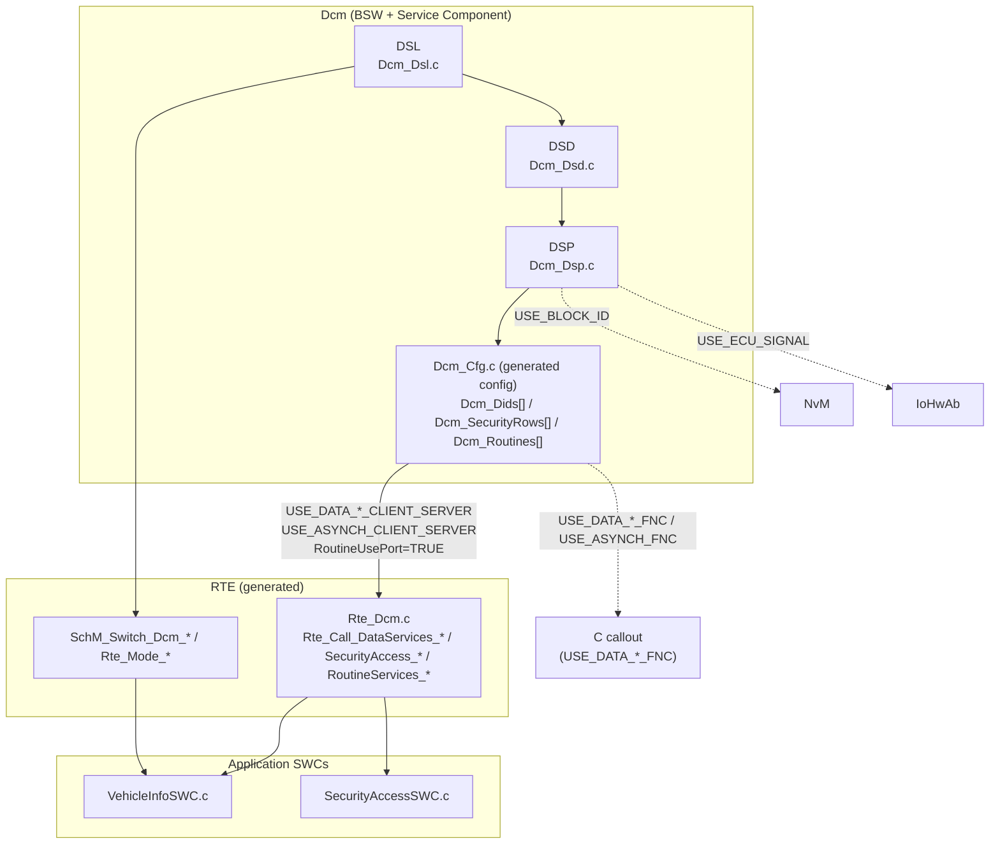
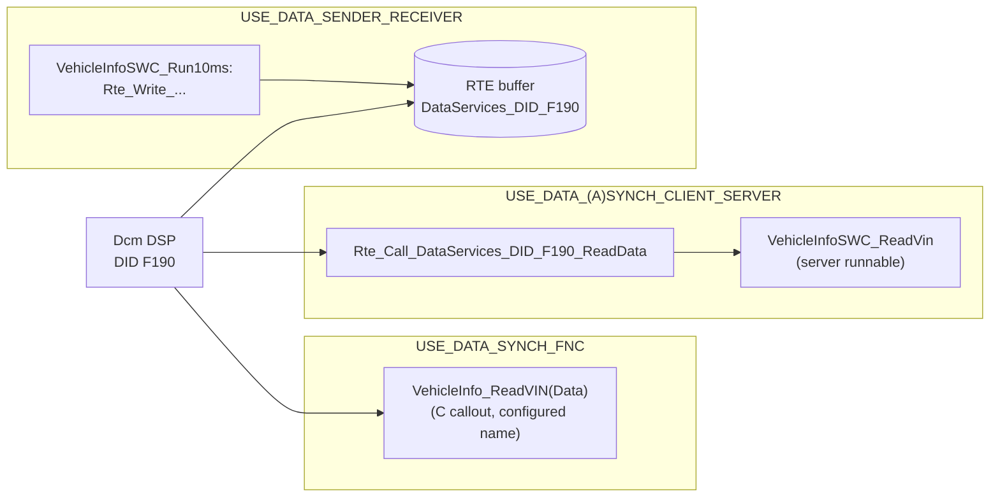
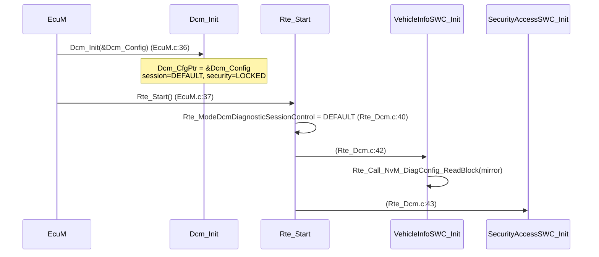
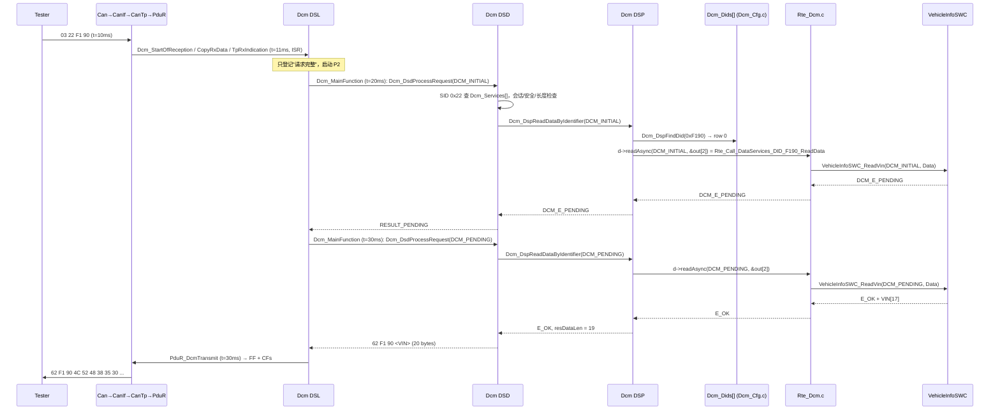
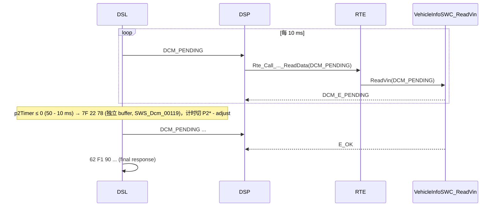

# DCM 与 RTE 的集成：DCM 如何最终调用 Application Software

> Prerequisite: [Client/Server 通信](06-client-server.md), [Sender/Receiver 通信](07-sender-receiver.md), [RTE 生成](05-rte-generation.md), [DSP](../06-dcm/04-dsp.md), [DID](../06-dcm/08-did.md)
> Next: [诊断 SWC 实例：一步一步写 VehicleInfoSWC](09-diagnostic-swc-example.md)
> 对应规范: DCM SWS CP R20-11（`AUTOSAR_SWS_DiagnosticCommunicationManager.pdf`）：§8.8 Service Interfaces（p.335–415）——`SecurityAccess_<SecurityLevel>` `SWS_Dcm_00685`（p.338–340）、`DataServices_<Data>` `SWS_Dcm_00686`（p.341 起）、`RoutineServices_<RoutineName>` `SWS_Dcm_00690`（p.362–377）、`DCMServices` `SWS_Dcm_00698`（p.395–396）、Mode Switch 接口（p.406–415）；`DcmDspDataUsePort` `ECUC_Dcm_00713`（p.537–539）、`DcmDspDidUsePort` `01122`（p.510–511）、`DcmDspSecurityUsePort` `00967`（p.652）、`DcmDspRoutineUsePort` `00724`（p.608）；C 原型 p.265–292（`00793`、`91006`、`91005`、`91008`、`91003`、`91004`、`01203`、`01204`、`91013`）；OpStatus `00984`（p.301）、`00527/00530/00760/01046/01187–01189`；0x22 读取 `00437`（p.138）、`USE_BLOCK_ID` `00560`、`USE_ECU_SIGNAL` `00578`；规范示例 `USE_DATA_SYNCH_FNC`（p.225–226）。**本仓库无 RTE SWS**：`Rte_Call_<p>_<o>` 等 RTE API 命名按 R4.x 公认约定，**需以项目 release 确认**。
> 对应源码: openAUTOSAR `diagnostic/Dcm/src/Dcm_Dsp.c:1237-1302`、`diagnostic/Dcm/include/Dcm_Lcfg.h:174-181`、`diagnostic/Dcm/include/Rte_Dcm.h:23-28`；本项目 `examples/uds_diag_demo/diag/Dcm_Dsp.c`、`diag/Dcm_Cfg.c`、`diag/Dcm_Cfg.h`、`diag/Dcm_Dsd.c`、`diag/Dcm_Dsl.c`、`rte/Rte_Dcm.c`、`rte/Rte_Dcm.h`、`swc/VehicleInfoSWC.c`、`swc/SecurityAccessSWC.c`、`artifacts/uds-demo/trace.txt`

---

## 1. 本章目标

这是 Part VII 的核心章节，回答用户最关心的问题：

> **DCM 收到 `22 F1 90` 之后，究竟是怎样一步一步调用到应用代码 `VehicleInfoSWC_ReadVin` 的？**

读完后你应该能：

1. 说出 DCM 作为 **Service Component** 暴露了哪些 Port（`DataServices_<Data>`、`SecurityAccess_<Level>`、`RoutineServices_<Routine>`、`DCMServices`、Mode Switch），以及这些 Port 由哪个配置参数产生。
2. 对 `DcmDspDataUsePort` 的每种取值说出：Dcm 调用什么、是否经过 RTE、签名是什么、谁实现。重点区分 **`USE_DATA_SYNCH/ASYNCH_CLIENT_SERVER`**、**`USE_DATA_SENDER_RECEIVER`**、**`USE_DATA_SYNCH_FNC`**（C callout）。
3. 画出 `Dcm DSP → Rte_Call_DataServices_DID_F190_ReadData → VehicleInfoSWC server runnable` 的完整时序，包括 `OpStatus` 与 `DCM_E_PENDING`。
4. 逐行读懂 demo 的 `rte/Rte_Dcm.c` 与 `swc/VehicleInfoSWC.c`，以及它们与 `diag/Dcm_Dsp.c`、`diag/Dcm_Cfg.c` 的连接点。
5. 在真实项目中，给定一个 DID，能找到最终实现它的函数。

---

## 2. 为什么 DCM 不直接调用应用函数？

DCM 是供应商交付的 BSW（截图中的目标工程使用 RTA-CAR 12.9.0 的 Dcm；本仓库无该工程，只能作为"可能的真实环境"提及）。它的源码对所有客户是同一份，**不可能 include 你的 `VehicleInfoSWC.h`**。它需要一个"标准插座"：

- 插座的名字由 DCM SWS 规定（`DataServices_<Data>`），
- 插座的形状由 Dcm 配置决定（`DcmDspDataUsePort`、数据长度），
- 插座的另一端插谁，由 ECU Extract 的 Connector 决定，
- 插座的电线由 RTE 生成。

另一个选项是 **C callout**（`USE_DATA_SYNCH_FNC` 等）：Dcm 配置里直接写一个 C 函数名，Dcm 生成的配置表中放这个函数指针。这不经过 RTE，简单直接，但应用代码就不再是严格意义上的 SWC（没有端口、不能跨分区、不能被 RTE 检查）。两种方式在真实项目中都很常见。

---

## 3. 在系统中的位置



逐条解释：

1. **DSL → DSD → DSP**：请求在 `Dcm_MainFunction` 中被处理（不在 ISR 中）。见 [DCM 运行时流程](../06-dcm/11-dcm-runtime-flow.md)。
2. **DSP → 配置表**：DSP 不知道应用是谁，它只查配置表：DID 0xF190 → 这一行 → 用什么方式读。
3. **配置表 → `Rte_Call_*`（实线）**：C/S 方式。配置表里放的是 `Rte_Call_*` 函数指针（demo 方式），或 Dcm 生成代码中直接写 `Rte_Call_*` 调用（另一种常见实现）。
4. **`Rte_Call_*` → SWC**：RTE 按 Connector 调用 server runnable。
5. **配置表 → C callout（虚线）**：`*_FNC` 方式，不经 RTE。
6. **DSP → NvM / IoHwAb（虚线）**：`USE_BLOCK_ID` / `USE_ECU_SIGNAL`，Dcm 直接调 BSW，**应用完全不参与**。
7. **DSL → Mode → SWC**：会话/复位等变化通过 `SchM_Switch_Dcm_*` 通知 mode user（BswM、SWC）。

---

## 4. AUTOSAR 如何定义？

### 4.1 Dcm 的 Service Component 端口（R20-11 §8.8）

`[AUTOSAR Standard]` 下表整理自 DCM SWS R20-11（研究笔记 02 §3.9）：

| Port Interface | Dcm 角色 | 产生条件（ECUC） | 主要 Operation | 规范 |
|---|---|---|---|---|
| `DataServices_<Data>`（C/S） | client（R-Port） | `DcmDspDataUsePort ∈ {USE_DATA_SYNCH_CLIENT_SERVER, USE_DATA_ASYNCH_CLIENT_SERVER, USE_DATA_ASYNCH_CLIENT_SERVER_ERROR}` | `ConditionCheckRead`、`ReadDataLength`、`ReadData`、`WriteData`、`FreezeCurrentState`、`ResetToDefault`、`ReturnControlToECU`、`ShortTermAdjustment`、`GetScalingInformation` | `SWS_Dcm_00686`，p.341 起 |
| `DataServices_<Data>`（S/R） | receiver / sender | `USE_DATA_SENDER_RECEIVER(_AS_SERVICE)` | 数据元素 | §8.8.2.2 p.336 |
| `DataServices_<DID>`（原子 S/R 或 NvData） | receiver / sender | `DcmDspDidUsePort = USE_ATOMIC_*` | 整个 DID 结构 | §8.8.2.1 p.335；§8.8.4.1 p.398 |
| `DataServices_DIDRange_<Range>` | client | DID range | `IsDidAvailable`、`ReadDidData`、`WriteDidData`、`ReadDidRangeDataLength` | §8.8.3.3 p.358 |
| `SecurityAccess_<SecurityLevel>` | client | `DcmDspSecurityUsePort = USE_ASYNCH_CLIENT_SERVER` | `GetSeed`、`CompareKey`、`Get/SetSecurityAttemptCounter` | `SWS_Dcm_00685`，p.338–340 |
| `RoutineServices_<RoutineName>` | client | `DcmDspRoutineUsePort = TRUE` | `Start`、`Stop`、`RequestResults`（及 Confirmation） | `SWS_Dcm_00690`，p.362–377 |
| `CallbackDCMRequestServices` | client | `DcmDslCallbackDCMRequestService` | `StartProtocol`、`StopProtocol` | `SWS_Dcm_00692`，p.378 |
| `ServiceRequestNotification` | client | Manufacturer/Supplier notification | `Indication`、`Confirmation` | §8.8.3.8 p.379 |
| `DCMServices` | **server**（P-Port） | 总是 | `GetActiveProtocol`、`GetSecurityLevel`、`GetSesCtrlType`、`ResetToDefaultSession`、`SetActiveDiagnostic` | `SWS_Dcm_00698`，p.395–396 |
| Mode Switch（`DcmDiagnosticSessionControl`、`DcmEcuReset`、`DcmSecurityAccess` 等） | **mode manager** | 总是/按配置 | — | p.406–415 |

注意方向：**绝大多数端口中 Dcm 是 client，应用是 server**；只有 `DCMServices` 中应用是 client（可以问 Dcm"现在是什么会话"）。

### 4.2 `DcmDspDataUsePort`：一个参数决定"DCM 怎么拿数据"

`[AUTOSAR Standard]` `ECUC_Dcm_00713`（p.537–539）的十个取值，按"Dcm 最终调用什么"分组：

| 取值 | 经过 RTE？ | Dcm 调用 | `ReadData` 签名（Dcm 视角） | 谁实现 | 能否 PENDING | 能否给 NRC |
|---|---|---|---|---|---|---|
| `USE_DATA_SYNCH_CLIENT_SERVER` | **是**（C/S） | `Rte_Call_DataServices_<Data>_ReadData(Data)` | `Std_ReturnType Xxx_ReadData(uint8* Data)`（`00793`） | 应用 SWC 的 server runnable | 否 | 否（E_NOT_OK → 默认 NRC） |
| `USE_DATA_ASYNCH_CLIENT_SERVER` | **是**（C/S） | `Rte_Call_..._ReadData(OpStatus, Data)` | `Xxx_ReadData(Dcm_OpStatusType OpStatus, uint8* Data)`（`91006`） | 同上 | **是** | 否 |
| `USE_DATA_ASYNCH_CLIENT_SERVER_ERROR` | **是**（C/S） | `Rte_Call_..._ReadData(OpStatus, Data, ErrorCode)` | `91005` | 同上 | 是 | **是** |
| `USE_DATA_SENDER_RECEIVER` | **是**（S/R） | `Rte_Read_<p>_<d>(&data)`（或等价的 RTE 读取） | 无 operation | 应用 SWC 是 **sender**，Dcm 读缓冲 | 否 | 否 |
| `USE_DATA_SENDER_RECEIVER_AS_SERVICE` | **是**（S/R，service port） | 同上 | 同上 | 同上 | 否 | 否 |
| `USE_DATA_SYNCH_FNC` | **否** | 配置的 C 函数（`DcmDspDataReadFnc`，`ECUC_Dcm_00669`） | 与 `00793` 同形 | 应用写的 C callout | 否 | 否 |
| `USE_DATA_ASYNCH_FNC` | 否 | 配置的 C 函数 | 与 `91006` 同形 | C callout | 是 | 否 |
| `USE_DATA_ASYNCH_FNC_ERROR` | 否 | 配置的 C 函数 | 与 `91005` 同形 | C callout | 是 | 是 |
| `USE_BLOCK_ID` | 否 | `NvM_ReadBlock` / `NvM_WriteBlock`（`00560`、`00541`） | — | NvM | （Dcm 内部轮询） | Dcm 给 0x72 等 |
| `USE_ECU_SIGNAL` | 否 | `IoHwAb_Dcm_Read<EcuSignalName>()`（`00578`） | — | IoHwAb | 否 | 否 |

规范给出的 `USE_DATA_SYNCH_FNC` 示例（p.225–226）：DID 0xF080 配置 `ReadDID_F080/WriteDID_F080`、`DcmDspDataType = UINT8_N`。

**三种常用方式的直观对比**：



| 维度 | C/S | S/R | C callout (`*_FNC`) |
|---|---|---|---|
| 应用代码在 Dcm 读取时是否执行 | 是 | **否** | 是 |
| 是否经 RTE | 是 | 是 | **否** |
| 应用是否需要 SWC 描述/端口 | 是 | 是 | 否（普通 C 函数） |
| 能否跨分区/被 RTE 检查 | 能 | 能 | 不能 |
| 函数名谁定 | runnable `SYMBOL`（应用定），API 名由 Port 定 | — | Dcm 配置中的函数名 |
| 典型用途 | 需要按需计算、NvM、条件检查 | 测量值 | 遗留代码、无 RTE 的小项目、快速移植 |
| openAUTOSAR 对应 | 无 | 无 | **有**（它的唯一方式） |

### 4.3 SecurityAccess 与 Routine 的 UsePort

| 参数 | 取值 | Dcm 调用 |
|---|---|---|
| `DcmDspSecurityUsePort`（`00967`，p.652） | `USE_ASYNCH_CLIENT_SERVER` | `Rte_Call_SecurityAccess_<Level>_GetSeed / _CompareKey`（`SWS_Dcm_00324` / `00863`） |
| | `USE_ASYNCH_FNC` | 配置的 C 函数（`SWS_Dcm_00862`） |
| `DcmDspRoutineUsePort`（`00724`，p.608） | `TRUE` | `Rte_Call_RoutineServices_<Routine>_Start/Stop/RequestResults`（`SWS_Dcm_01442`） |
| | `FALSE` | 配置的 C callout（`SWS_Dcm_01443`） |

### 4.4 OpStatus 与 `DCM_E_PENDING`（R20-11）

详见 [06-client-server.md](06-client-server.md) §4.4。摘要：首次 `DCM_INITIAL`（`00527`）→ server 返回 `DCM_E_PENDING`（=10）→ 每个 `Dcm_MainFunction` 以 `DCM_PENDING` 重调（`00530`、`00760`）→ 超过 `P2ServerMax − DcmTimStrP2ServerAdjust` 时 DSL 发 NRC 0x78（`00024`）→ 达到 `DcmDslDiagRespMaxNumRespPend` 时以 `DCM_CANCEL` 取消并发 NRC 0x10（`00120`）。OUT 参数只在 E_OK 时有效（`01187`）。

---

## 5. 核心数据结构：配置表如何"指向"RTE

### 5.1 真实 Dcm 中的数据链

`[AUTOSAR Standard]` R20-11 ECUC 中，一个 DID 的配置分布在多个容器（研究笔记 02 §3.13）：

```text
DcmDspDid (DcmDspDidIdentifier = 0xF190, DcmDspDidUsePort = USE_DATA_ELEMENT_SPECIFIC_INTERFACES)
 ├── DcmDspDidInfoRef  → DcmDspDidInfo
 │                         └── DcmDspDidRead (SessionRef, SecurityLevelRef, ModeRuleRef)
 └── DcmDspDidSignal (DcmDspDidByteOffset = 0)
       └── DcmDspDidDataRef → DcmDspData "DID_F190"
                                ├── DcmDspDataByteSize = 17
                                ├── DcmDspDataType     = UINT8_N
                                └── DcmDspDataUsePort  = USE_DATA_ASYNCH_CLIENT_SERVER
                                      ⇒ Port DataServices_DID_F190 (name from the DcmDspData short name)
```

Dcm 生成器把这条链"展开"为 C 代码中的表与函数指针（或直接调用）。

### 5.2 demo 中的扁平化

`[Educational Implementation]` demo 把上面的链压成一行（`diag/Dcm_Cfg.h:86-98` 类型定义，`diag/Dcm_Cfg.c:33-49` 实例）：

```c
/* diag/Dcm_Cfg.h:77-98 */
typedef enum {
    DCM_USE_DATA_SYNCH_CLIENT_SERVER = 0,  /* ReadData(Data)            - no OpStatus  */
    DCM_USE_DATA_ASYNCH_CLIENT_SERVER      /* ReadData(OpStatus, Data)  - may PENDING  */
} Dcm_DspDataUsePortType;

typedef Std_ReturnType (*Dcm_ReadDataSyncFncType)(uint8 *Data);
typedef Std_ReturnType (*Dcm_ReadDataAsyncFncType)(Dcm_OpStatusType OpStatus, uint8 *Data);
typedef Std_ReturnType (*Dcm_WriteDataAsyncFncType)(const uint8 *Data, Dcm_OpStatusType OpStatus,
                                                    Dcm_NegativeResponseCodeType *ErrorCode);
typedef struct {
    uint16                    identifier;        /* DcmDspDidIdentifier          */
    uint16                    size;              /* DcmDspDataByteSize (fixed)   */
    Dcm_DspDataUsePortType    usePort;           /* DcmDspDataUsePort            */
    Dcm_ReadDataSyncFncType   readSync;          /* used if SYNCH                */
    Dcm_ReadDataAsyncFncType  readAsync;         /* used if ASYNCH               */
    Dcm_WriteDataAsyncFncType writeAsync;        /* NULL_PTR: no DcmDspDidWrite  */
    uint32                    readSessionMask;   /* DcmDspDidReadSessionRef      */
    ...
} Dcm_DspDidType;
```

```c
/* diag/Dcm_Cfg.c:33-49 */
static const Dcm_DspDidType Dcm_Dids[] = {
    {   /* VIN: asynchronous C/S interface -> exercises DCM_E_PENDING / OpStatus */
        0xF190u, 17u, DCM_USE_DATA_ASYNCH_CLIENT_SERVER,
        NULL_PTR, Rte_Call_DataServices_DID_F190_ReadData, NULL_PTR,
        DCM_SES_ALL, DCM_SEC_ANY, 0u, 0u, "VIN"
    },
    {   /* ECU software version: synchronous C/S interface */
        0xF187u, 8u, DCM_USE_DATA_SYNCH_CLIENT_SERVER,
        Rte_Call_DataServices_DID_F187_ReadData, NULL_PTR, NULL_PTR,
        DCM_SES_ALL, DCM_SEC_ANY, 0u, 0u, "SparePartNumber/SwVersion"
    },
    {   /* writable configuration stored in NvM: write needs extended session + level 1 */
        0xF1A0u, 10u, DCM_USE_DATA_SYNCH_CLIENT_SERVER,
        Rte_Call_DataServices_DID_F1A0_ReadData, NULL_PTR, Rte_Call_DataServices_DID_F1A0_WriteData,
        DCM_SES_ALL, DCM_SEC_ANY, DCM_SES_EXTENDED, DCM_SEC_LEVEL1, "DiagConfig(NvM)"
    }
};
```

**这里就是 "DCM 如何最终调用 application software" 的第一个答案：Dcm 的配置表中保存了指向 `Rte_Call_*` 的函数指针。** `diag/Dcm_Cfg.c:10-13` 的文件头注释把这一点写得很直白：

```c
 *   "How does Dcm know 0x22 is ReadDataByIdentifier?"   -> Dcm_Services[] row 0x22
 *   "How does Dcm find F190?"                            -> Dcm_Dids[] row 0xF190
 *   "How does Dcm call the application?"                 -> function pointer to
 *                                                           Rte_Call_DataServices_DID_F190_ReadData
```

> `[Educational Implementation]` 两处 demo 简化需要知道：(1) demo 只实现了 SYNCH / ASYNCH 两种 C/S，没有 S/R、`*_FNC`、`USE_BLOCK_ID`；(2) F1A0 的 `usePort` 是 SYNCH，但 `writeAsync` 用了异步签名——真实 R20-11 中一个 `DcmDspData` 只有一个 UsePort，读写签名都由它决定（见 [02-port-interface.md](02-port-interface.md) §5）。

### 5.3 运行时状态（Dcm 侧）

`diag/Dcm_Dsp.c:24-30`：

```c
typedef struct {
    uint8            didIdx[DCM_DSP_MAX_DID_TO_READ];   /* 本次请求中要读的 DID（配置表下标） */
    uint8            numDids;
    uint8            current;                           /* 正在读第几个 */
    Dcm_OpStatusType currentOpStatus;                   /* 下一次调用该 DID 时用的 OpStatus */
    Dcm_MsgLenType   pos;                               /* 响应缓冲写到哪 */
} Dcm_DspRdbiStateType;
```

这是 "必须跨越 `DCM_E_PENDING` 保存的状态"（`:23` 注释）。多 DID 请求（`22 F1 A0 F1 87`）中，若第一个 DID pending，第二个 DID 要等第一个完成后才读，`current` 与 `pos` 记住了进度。

---

## 6. 初始化流程



逐跳解释：

1. **`Dcm_Init`**：保存配置指针，会话 = Default（`SWS_Dcm_00034`），安全 = LOCKED（`00033`）。此时 Dcm 已"知道" F190 对应 `Rte_Call_DataServices_DID_F190_ReadData`（编译期就确定了）。
2. **`Rte_Start`**：在 `Dcm_Init` 之后。mode 初值与 Dcm 内部会话一致（都是 Default）——如果两者不一致，SWC 通过 `Rte_Mode` 看到的会话与 Dcm 实际会话不同，是一类隐蔽 bug。
3. **SWC init runnables**：VehicleInfoSWC 读取 NvM 镜像，之后 `22 F1 A0` 才能读到正确值。
4. 只有 `Rte_Start` 完成后，Dcm 对 `Rte_Call_*` 的调用才应被视为有效。真实 ECU 中，诊断请求通常要等到通信启动（ComM FULL_COM）之后才能到达，那时 RTE 早已启动。

---

## 7. Runtime Flow：`22 F1 90` 从 DSP 到 VehicleInfoSWC

### 7.1 总时序



### 7.2 逐个 transition 对应的 API 与源码

| # | Transition | API / 代码 | 文件:行 | 上下文 |
|---|---|---|---|---|
| 1 | Tester → 栈 | `[Bus] Tester -> wire ID=0x7E0 ... 03 22 F1 90` | `trace.txt:26` | 总线 |
| 2 | 栈 → DSL | `Dcm_StartOfReception` / `Dcm_CopyRxData` / `Dcm_TpRxIndication`（DCM SWS R20-11 p.243–245） | `trace.txt:31-33` | ISR（真实 ECU：RS-CANFD RX FIFO 中断 EI190 之后的回调链） |
| 3 | DSL 登记 | "request complete; P2 timer = 50-10 ms; DSD runs in next Dcm_MainFunction" | `trace.txt:33` | ISR |
| 4 | `Dcm_MainFunction` | `Dcm_DslMainFunction()` | `diag/Dcm.c:33-39`；由 `integration/BswScheduler.c:50` 每 10 ms 调用 | Task_10ms |
| 5 | DSL → DSD（INITIAL） | `Dcm_DsdProcessRequest(DCM_INITIAL, ...)` | `diag/Dcm_Dsl.c:254-257` | Task_10ms |
| 6 | DSD 查表/检查 | `Dcm_DsdCheckRequest` | `diag/Dcm_Dsd.c:151-158`（检查函数 `:77`）；配置 `diag/Dcm_Cfg.c:120` | Task_10ms |
| 7 | DSD → DSP | `Dcm_DsdActiveService->fnc(OpStatus, pMsgContext, &nrc)` | `diag/Dcm_Dsd.c:163` | Task_10ms |
| 8 | DSP 解析 DID、查表 | `Dcm_DspFindDid(didId, &idx)`；会话/安全检查 | `diag/Dcm_Dsp.c:296-315` | Task_10ms |
| 9 | DSP 初始化进度 | `st->current = 0; st->pos = 0; st->currentOpStatus = DCM_INITIAL;` | `diag/Dcm_Dsp.c:328-330` | Task_10ms |
| 10 | DSP 写 DID 头、按 UsePort 调用 | `out[0..1] = F1 90`；`r = d->readAsync(st->currentOpStatus, &out[2]);` | `diag/Dcm_Dsp.c:340-349` | Task_10ms |
| 11 | **配置表 → RTE** | 函数指针 = `Rte_Call_DataServices_DID_F190_ReadData` | `diag/Dcm_Cfg.c:36` | — |
| 12 | **RTE → SWC** | `r = VehicleInfoSWC_ReadVin(OpStatus, Data);` | `rte/Rte_Dcm.c:54-62`（调用在 `:59`） | Task_10ms（server runnable 在 Dcm 上下文执行） |
| 13 | SWC 返回 PENDING | `return DCM_E_PENDING;` | `swc/VehicleInfoSWC.c:84-92` | — |
| 14 | DSP 记录 PENDING | `st->currentOpStatus = DCM_PENDING; return DCM_E_PENDING;`（`SWS_Dcm_00530`） | `diag/Dcm_Dsp.c:351-353` | — |
| 15 | DSD → DSL | `return DCM_DSD_RESULT_PENDING;` | `diag/Dcm_Dsd.c:164-167` | — |
| 16 | 下一周期 DSL → DSD（PENDING） | `Dcm_DsdProcessRequest(DCM_PENDING, ...)` | `diag/Dcm_Dsl.c:258-261` | Task_10ms（t=30 ms） |
| 17 | DSP 继续 | 跳过 INITIAL 分支，`while` 循环以 `DCM_PENDING` 调用 | `diag/Dcm_Dsp.c:335-349` | — |
| 18 | SWC 返回 E_OK | `memcpy(Data, VehicleInfoSWC_Vin, 17); return E_OK;` | `swc/VehicleInfoSWC.c:93-95` | — |
| 19 | DSP 完成 | `pos += 2 + 17; ... resDataLen = pos;` | `diag/Dcm_Dsp.c:360-366` | — |
| 20 | DSD 组正响应 | `txBuffer[0] = sid + 0x40` | `diag/Dcm_Dsd.c:181-185` | — |
| 21 | DSL 发送 | `PduR_DcmTransmit(0, len=20)` | `trace.txt:46` | Task_10ms |

对应 trace（`artifacts/uds-demo/trace.txt:34-46`）：

```text
[    20 ms] [Dcm/DSD ] SID 0x22: lookup in DcmDsdServiceTable -> ReadDataByIdentifier
[    20 ms] [Dcm/DSD ] checks passed (session/security/length/sub-function) -> dispatch to DSP ReadDataByIdentifier
[    20 ms] [Dcm/DSP ] 0x22: DID 0xF190 (VIN) USE_DATA_ASYNCH_CLIENT_SERVER -> ReadData(DCM_INITIAL, Data)
[    20 ms] [Rte     ] Rte_Call_DataServices_DID_F190_ReadData(DCM_INITIAL) -> server runnable VehicleInfoSWC_ReadVin
[    20 ms] [SWC     ] VehicleInfoSWC_ReadVin: VIN not ready yet -> DCM_E_PENDING (0 more)
[    20 ms] [Rte     ]   <- DCM_E_PENDING
[    20 ms] [Dcm/DSD ] ReadDataByIdentifier returned DCM_E_PENDING -> call again with DCM_PENDING next cycle
[    30 ms] [Dcm/DSP ] 0x22: DID 0xF190 (VIN) USE_DATA_ASYNCH_CLIENT_SERVER -> ReadData(DCM_PENDING, Data)
[    30 ms] [Rte     ] Rte_Call_DataServices_DID_F190_ReadData(DCM_PENDING) -> server runnable VehicleInfoSWC_ReadVin
[    30 ms] [SWC     ] VehicleInfoSWC_ReadVin: VIN "LRH850DEMO0000001" copied -> E_OK
[    30 ms] [Rte     ]   <- E_OK
[    30 ms] [Dcm/DSD ] positive response assembled: SID 0x62 + 19 data bytes
```

### 7.3 P2 到期：同一条路径加上 0x78

当 SWC 持续 pending（demo 中 `integration/main_demo.c:99` 把 `VinPendingCycles` 设为 8，测试 `tests/test_uds_demo.c:278-290`）：



0x78 完全是 Dcm DSL 的行为（`diag/Dcm_Dsl.c:266-276`），SWC 对此毫不知情——SWC 无法也不需要"发送 0x78"（0x78 不在 `Dcm_NegativeResponseCodeType` 中，`rte/Rte_Dcm_Type.h:50-54`）。

### 7.4 SecurityAccess 与 Routine：同一模式

| 请求 | DSP 调用点 | 配置表 | RTE | SWC |
|---|---|---|---|---|
| `27 01` | `row->getSeed(OpStatus, &resData[1], ErrorCode)` `diag/Dcm_Dsp.c:424` | `Dcm_SecurityRows[]` `diag/Dcm_Cfg.c:26-30` | `rte/Rte_Dcm.c:89-95` | `SecurityAccessSWC_GetSeed_Level01` `swc/SecurityAccessSWC.c:34` |
| `27 02 <key>` | `row->compareKey(&reqData[1], OpStatus, ErrorCode)` `:454`；结果处理 `:458-481`（`DCM_E_COMPARE_KEY_FAILED` → 计数、0x35/0x36） | 同上 | `rte/Rte_Dcm.c:97-103` | `SecurityAccessSWC_CompareKey_Level01` `swc/SecurityAccessSWC.c:56` |
| `31 01 FF 00` | `fnc(&reqData[3], len, OpStatus, &resData[3], &outLen, ErrorCode)` `diag/Dcm_Dsp.c:595-596` | `Dcm_Routines[]` + "generated glue" `diag/Dcm_Cfg.c:55-90` | `rte/Rte_Dcm.c:107-113` | `VehicleInfoSWC_SelfTestStart` `swc/VehicleInfoSWC.c:145` |
| `2E F1 A0 ...` | `d->writeAsync(&reqData[2], OpStatus, ErrorCode)` `diag/Dcm_Dsp.c:521` | `Dcm_Dids[2]` `diag/Dcm_Cfg.c:44-47` | `rte/Rte_Dcm.c:76-85` | `VehicleInfoSWC_WriteDiagConfig` `swc/VehicleInfoSWC.c:114` |

Routine 的"generated glue"（`diag/Dcm_Cfg.c:51-85`）值得注意：DSP 内部用统一形态 `(InBuffer, InLength, OpStatus, OutBuffer, OutLength, ErrorCode)`，而 `RoutineServices_Routine_FF00` 的 Operation 签名取决于 routine 的 in/out signal 配置（`SWS_Dcm_01360–01364`，p.192–193）。真实 Dcm 生成器也会生成类似的适配代码，把请求字节拆成 `dataIn_n` 参数。

---

## 8. RH850 Hardware Mapping

`[RH850 Hardware]` DCM ↔ RTE ↔ SWC 这一段完全在软件中，但它所在的执行环境与硬件相关：

| 环节 | RH850/P1M-E 上的落点 |
|---|---|
| 请求到达（第 2 步） | RS-CANFD 接收 → RX FIFO 中断（INTRCANGRECC，EI190；**不是** EI184）→ CanIf/CanTp/PduR/Dcm 回调，在 ISR 上下文 |
| Dcm 处理（第 4–21 步） | OS task（10 ms），G3M 单个可调度核 |
| server runnable | 在 Dcm 的 task 中执行（同步直接调用） |
| `WriteDiagConfig` 等待的 NvM | NvM → Fee → Fls → Data Flash（P1M-E Data Flash 细节需以 Flash 手册确认） |
| P2 计时 | `Dcm_MainFunction` 周期 = OS counter 驱动的 task 周期（OSTM，通道归属为配置选择） |

---

## 9. openAUTOSAR 实现

`[AUTOSAR API]` openAUTOSAR（R3.1.5 风格）的 Dcm **没有 RTE 端口路径**（研究笔记 03 §4.4、§5）：

| 位置 | 内容 |
|---|---|
| `diagnostic/Dcm/include/Dcm_Lcfg.h:174` | `Dcm_DspDidType` 有 `DspDidUsePort` 字段——但 Dcm 源码中**从未读取**（死字段） |
| `diagnostic/Dcm/include/Dcm_Lcfg.h:179-181` | `DspDidReadDataFnc` 等 C 函数指针 |
| `diagnostic/Dcm/src/Dcm_Dsp.c:1237-1244` | 长度：FixedLength 用 `DspDidSize`，否则调 `ReadDataLengthFnc` |
| `diagnostic/Dcm/src/Dcm_Dsp.c:1250-1254` | 写 DID 高/低字节，然后 `ReadDataFnc(&tx[txPos])`——**直接 C 函数指针，无 OpStatus** |
| `diagnostic/Dcm/src/Dcm_Dsp.c:1257-1261` | `E_PENDING` → 0x78 路径；其他失败 → 0x22 |
| `diagnostic/Dcm/src/Dcm_Dsp.c:1293-1302` | 递归读取引用的子 DID |
| `diagnostic/Dcm/include/Rte_Dcm.h:23-28` | 只有 include guard 的空文件 |
| 全仓 grep | **没有任何 `Rte_Call_*` / `Rte_Read_*`** |

结论：openAUTOSAR 的 Dcm 相当于 R4.x 中 **所有 DID 都配置为 `USE_DATA_SYNCH_FNC`**（且没有 OpStatus）。它能帮你理解 DSP 的查表与拼响应逻辑，但**不能**帮你理解 "DCM → RTE → SWC"——这正是本项目 demo 要补的部分。

---

## 10. 当前教学项目实现

`[Educational Implementation]` demo 中 "DCM → RTE → SWC" 的完整拼图：

| 拼图块 | 文件 | 关键行 | 扮演 |
|---|---|---|---|
| DSP 0x22 handler | `diag/Dcm_Dsp.c` | `:264-367` | Dcm DSP |
| DSP 0x27 / 0x2E / 0x31 | `diag/Dcm_Dsp.c` | `:383-482` / `:487-535` / `:540-618` | Dcm DSP |
| UsePort 枚举与函数指针类型 | `diag/Dcm_Cfg.h` | `:60-115` | 生成的 `Dcm_Cfg.h` |
| DID / Security / Routine 表 | `diag/Dcm_Cfg.c` | `:26-90` | 生成的 `Dcm_Lcfg.c` |
| Dcm 的 client API | `rte/Rte_Dcm.h` | `:30-47` | 生成的 `Rte_Dcm.h` |
| Dcm 相关类型 | `rte/Rte_Dcm_Type.h` | `:19-82` | 生成的 `Rte_Dcm_Type.h` |
| `Rte_Call_*` 实现 | `rte/Rte_Dcm.c` | `:54-130` | 生成的 `Rte.c` |
| Mode switch | `rte/SchM_Dcm.h`、`rte/Rte_Dcm.c` | `:18-21`、`:134-155` | 生成的 `SchM_Dcm.h` / `Rte.c` |
| server runnables | `swc/VehicleInfoSWC.c`、`swc/SecurityAccessSWC.c` | 见 §11.2 | 应用 SWC |

---

## 11. Code Walkthrough

### 11.1 `rte/Rte_Dcm.c` 逐段

**文件头（`:1-15`）** 说明了 RTE 在这里的角色：

```c
 * [Educational Implementation] What the RTE does on Rte_Call for a synchronous server call point when
 * client (Dcm) and server (SW-C runnable) are on the same core/partition:
 * it simply invokes the server runnable - often generated as a direct call
 * or even a macro. If they were on different OS-Applications/cores, the RTE
 * would instead use IOC / activate a task and the call could not complete
 * synchronously; DCM_E_PENDING + OpStatus is the mechanism that lets the
 * Dcm keep polling in that case.
```

**include（`:16-22`）**：`Rte_Dcm.c` 同时 include `Rte_Dcm.h`（client 侧）、`Rte_VehicleInfoSWC.h`、`Rte_SecurityAccessSWC.h`（server 侧）。**只有 RTE 实现文件同时看见两边**——Dcm 看不见 SWC，SWC 看不见 Dcm。这是解耦的物理体现。

**mode 状态（`:24`）**：`static Dcm_SesCtrlType Rte_ModeDcmDiagnosticSessionControl = DCM_DEFAULT_SESSION;`——RTE 拥有的运行时状态。

**`Rte_OpName`（`:26-34`）**：仅用于 trace，相当于 VFB trace hook 的文本化。

**生命周期（`:38-50`）**：`Rte_Start` 调用 init runnable；`Rte_Task_10ms` 是 task body 中的 SWC 部分。

**DataServices（`:54-85`）**：

```c
Std_ReturnType Rte_Call_DataServices_DID_F190_ReadData(Dcm_OpStatusType OpStatus, uint8 *Data)  /* [Educational Implementation] */
{
    Std_ReturnType r;
    UDS_TRACE("Rte", "Rte_Call_DataServices_DID_F190_ReadData(%s) -> server runnable VehicleInfoSWC_ReadVin",
              Rte_OpName(OpStatus));
    r = VehicleInfoSWC_ReadVin(OpStatus, Data);        /* ← Connector: Dcm.R → VehicleInfoSWC.P */
    UDS_TRACE("Rte", "  <- %s", ...);
    return r;                                           /* ← ApplicationError 原样透传 */
}

Std_ReturnType Rte_Call_DataServices_DID_F187_ReadData(uint8 *Data)
{
    UDS_TRACE(...);
    return VehicleInfoSWC_ReadSwVersion(Data);          /* SYNCH: 无 OpStatus */
}
```

要点：

- **参数原样传递**：`OpStatus`、`Data` 指针都不变。`Data` 指向 Dcm 的响应缓冲（`&pMsgContext->resData[pos + 2]`），SWC 直接写进 Dcm 的缓冲——零拷贝。真实 RTE 在跨分区时不能这样做（需要拷贝）。
- **返回值原样透传**：`DCM_E_PENDING`（10）不是 RTE 的错误，RTE 不解释它。
- **函数体只有一行有意义的代码**：真实生成器在同分区下常常把它生成成宏（[05-rte-generation.md](05-rte-generation.md) §5.4）。

**SecurityAccess（`:89-103`）**、**RoutineServices（`:107-130`）**：同一模式。

**Mode（`:134-155`）**：

```c
void SchM_Switch_Dcm_DcmDiagnosticSessionControl(Dcm_SesCtrlType nextMode)  /* [Educational Implementation] */
{
    Rte_ModeDcmDiagnosticSessionControl = nextMode;
    ...
}
```

由 DSL 在会话切换时调用（`diag/Dcm_Dsl.c:121`，注释 `SWS_Dcm_00311`），SWC 通过 `Rte_Mode_DcmDiagnosticSessionControl_DcmDiagnosticSessionControl()`（`:141-144`）读取。`SchM_Switch_Dcm_DcmEcuReset`（`:146-155`）演示了 BswM 作为 mode user 的角色：收到 `EXECUTE` 时触发复位（`diag/Dcm_Dsl.c:177-178` 在 0x11 正响应确认后调用）。

### 11.2 `swc/VehicleInfoSWC.c` 逐段

| 行 | 内容 | 与 Dcm/RTE 的关系 |
|---|---|---|
| `:1-21` | 文件头："It knows nothing about CAN, ISO-TP, SIDs or NRC 0x78: it only implements runnables with the port-interface signatures and uses its own Rte_ header." | 定义了"诊断 SWC 应有的知识边界" |
| `:22` | `#include "Rte_VehicleInfoSWC.h"` | 唯一的外部接口 |
| `:34-37` | VIN `"LRH850DEMO0000001"`、SW 版本 `"SW010203"` | 应用数据 |
| `:39-40` | `ConfigMirror`（NvM RAM 镜像）、`ConfigStaging`（写入期间保持稳定） | NvM 契约 |
| `:42-43` | `VinPendingCycles`、`VinPendingLeft` | 跨 PENDING 的进度状态 |
| `:49-52` | `VehicleInfoSWC_SetVinPendingCycles` | **测试钩子，不是 RTE API**（`rte/Rte_VehicleInfoSWC.h:53-54` 明确标注） |
| `:54-60` | `VehicleInfoSWC_Init` | InitEvent，经 RTE 读 NvM |
| `:62-72` | `VehicleInfoSWC_Run10ms` | TimingEvent，推进 self test |
| `:77-96` | `VehicleInfoSWC_ReadVin` | `DataServices_DID_F190.ReadData`，ASYNCH：CANCEL → INITIAL → PENDING → E_OK |
| `:98-103` | `VehicleInfoSWC_ReadSwVersion` | `DataServices_DID_F187.ReadData`，SYNCH |
| `:105-109` | `VehicleInfoSWC_ReadDiagConfig` | `DataServices_DID_F1A0.ReadData`，读 RAM 镜像 |
| `:114-142` | `VehicleInfoSWC_WriteDiagConfig` | `DataServices_DID_F1A0.WriteData`，等 NvM；`ErrorCode` 0x22 / 0x72 |
| `:145-157` | `VehicleInfoSWC_SelfTestStart` | `RoutineServices_Routine_FF00.Start`；`:154-155` 用 `Rte_Mode_*` 读当前会话 |
| `:159-171` | `VehicleInfoSWC_SelfTestStop` | `.Stop` |
| `:173-183` | `VehicleInfoSWC_SelfTestRequestResults` | `.RequestResults`，OUT `Out_RoutineStatus` |

**注意 `:154-155`**：SWC 想知道当前会话时，调用的是 `Rte_Mode_DcmDiagnosticSessionControl_DcmDiagnosticSessionControl()`，**不是** `Dcm_GetSesCtrlType()`。后者是 Dcm 的 BSW C API（`diag/Dcm.c:42`），SWC 不应调用；对应的标准化 SWC 方式是 Mode 端口或 `DCMServices.GetSesCtrlType`（C/S，`SWS_Dcm_00698`）。

### 11.3 一个"反面对照"：如果没有 RTE

`[Conceptual]` 如果 Dcm 直接调用应用（openAUTOSAR 的方式、或 `USE_DATA_SYNCH_FNC`）：

```c
/* [Conceptual] Dcm_Lcfg.c with a C callout — no RTE in between */
extern Std_ReturnType VehicleInfo_ReadVIN(uint8 *Data);
static const Dcm_DspDataType Dcm_DspData_F190 = { 17u, VehicleInfo_ReadVIN /* DcmDspDataReadFnc */ };
```

调用链缩短为 `DSP → VehicleInfo_ReadVIN`。功能上等价，但：没有端口、没有 Connector、没有 RTE 生成检查、不能跨分区、`VehicleInfo_ReadVIN` 的名字被写死在 Dcm 配置里。完整讨论见 [09-diagnostic-swc-example.md](09-diagnostic-swc-example.md) §11.1。

---

## 12. Debug 方法

### 12.1 "DCM 调到哪了？"——断点阶梯

| 层 | demo 断点 | 真实 ECU 对应 | 看什么 |
|---|---|---|---|
| DSL 开始处理 | `diag/Dcm_Dsl.c:256` | Dcm 内部 DSL 处理函数（名字因供应商而异） | `msgContext.reqData` 是否是 `22 F1 90` |
| DSD 分发 | `diag/Dcm_Dsd.c:163` | DSD 分发点 | `Dcm_DsdActiveService->sid` |
| DSP 按 UsePort 调用 | `diag/Dcm_Dsp.c:345` / `:349` | DSP 0x22 中调用 ReadData 处 | `d->identifier`、`d->usePort`、`st->currentOpStatus` |
| RTE | `rte/Rte_Dcm.c:59` | `Rte_Call_DataServices_DID_F190_ReadData`（若为宏，跳过此层） | `OpStatus`、`Data` 指针 |
| SWC | `swc/VehicleInfoSWC.c:77` | server runnable | 返回值、`VinPendingLeft` |

**原则**：从两端向中间夹。先在 SWC 设断点——到了，说明 Dcm→RTE 正常，问题在 SWC 或返回之后；没到，在 DSP 调用点设断点——到了但没进 SWC，问题在 RTE/配置（函数指针、连线）；DSP 都没到，问题在 DSD 检查（会话/安全/长度）或更下层。

### 12.2 根据 NRC 反推

| 测试仪看到 | 可能原因 | 查哪里 |
|---|---|---|
| `7F 22 31` | DID 未配置 / 当前会话不允许 / 全部 DID 不支持 | `Dcm_Dids[]`、`readSessionMask`；`diag/Dcm_Dsp.c:304-323` |
| `7F 22 33` | 安全级不够 | `readSecurityMask`；`diag/Dcm_Dsp.c:309-318` |
| `7F 22 22` | SWC 返回 `E_NOT_OK`（非 ERROR 变体） | SWC 返回值；`diag/Dcm_Dsp.c:355-358` |
| `7F 22 78` 后 `7F 22 10` | SWC 一直 PENDING，达到 0x78 上限后被取消 | SWC 进度逻辑；`diag/Dcm_Dsl.c:277-284` |
| `7F 22 78` 后正响应 | 正常：SWC 慢但完成了 | — |
| 无响应 | Dcm 没收到 / SPRMIB / 功能寻址抑制 | 下层（CanTp/PduR）或 DSD |

### 12.3 用 trace 定位

demo 中：`Select-String -Path artifacts/uds-demo/trace.txt -Pattern 'Rte|SWC|Dcm/DSP'`，可以只看 DCM↔RTE↔SWC 这一段。真实 ECU 上可用 RTE VFB trace hook（若生成器支持）或在 `Rte_Call_*` 外包一层日志达到同样效果。

---

## 13. 常见问题 / 常见错误

1. **Dcm 配置改了 UsePort，SWC 没改签名**：SYNCH → ASYNCH 多了 `OpStatus`；ASYNCH → ASYNCH_ERROR 多了 `ErrorCode`。生成 RTE 时报 Interface 不兼容，或编译时报原型冲突。
2. **以为 `USE_DATA_SENDER_RECEIVER` 的 DID 会调用应用代码**：不会。在 SWC 里打断点等不到。
3. **server runnable 里调用 `Dcm_*` API**：例如在 `ReadData` 中调 `Dcm_GetSesCtrlType`。功能上常常可以，但绕过 RTE；更糟的是在某些实现中可能产生重入问题。用 Mode 端口或 `DCMServices`。
4. **ASYNCH server 没处理 `DCM_CANCEL`**：下一个请求进来时状态错乱。
5. **以为 `Rte_Dcm.c`（真实项目中的 `Rte.c`）可以手改来"临时绕过"**：重新生成即丢失，且会掩盖配置错误。
6. **把 DID 读写权限问题当成 RTE 问题**：0x31 / 0x33 / 0x7F 是 Dcm 在调用 RTE **之前**就决定的，RTE 和 SWC 根本没被调用。
7. **SecurityAccess 用 C/S 但 SWC 返回 `E_NOT_OK` 表示 key 错**：应返回 `DCM_E_COMPARE_KEY_FAILED`（11）；返回 `E_NOT_OK` 时 Dcm 用 ErrorCode 作 NRC 且**不增加尝试计数**（`SWS_Dcm_01150`），防暴破失效。demo 正确返回 11（`swc/SecurityAccessSWC.c:72`）。
8. **混淆 Dcm 的 `Rte_Call` 与 openAUTOSAR 的函数指针**：读 openAUTOSAR Dcm 时看不到任何 RTE 调用，这不代表 R4.x 的 Dcm 也这样。

---

## 14. 实验

全部基于运行 demo 和阅读源码，**不修改 demo**。

1. **断点阶梯（用 trace 代替调试器）**：运行 `python tools/run_uds_demo.py`，在 `artifacts/uds-demo/trace.txt` 中为第一个 `22 F1 90` 找到 §7.2 表中第 2、5、7、10、12、13、16、18、20、21 步对应的行，标出行号。
2. **SYNCH vs ASYNCH 对比**：在 trace 中比较 F190（约第 36–44 行）与 F187（约第 99–100 行）的调用序列，解释为什么 F187 没有 `DCM_INITIAL/DCM_PENDING` 字样（`diag/Dcm_Dsp.c:342-345`）。
3. **多 DID 请求**：找到 `22 F1 A0 F1 87` 的 trace（约第 301–304 行），说明 `Dcm_DspRdbi.current` 和 `pos` 如何变化，以及响应如何拼接。
4. **SecurityAccess 链**：找到 `27 01` / `27 02` 的 trace（约第 178–213 行），用 `swc/SecurityAccessSWC.c:22` 的 key mask 手算 seed `BA 53 CC 82` 对应的 key，与 trace 中的 key `E0 6F 5A 63` 对比。（提醒：这个算法是**完全不安全的教学算法**，文件头 `:9-15` 有说明。）
5. **0x78 测试**：运行 `tests/test_uds_demo.c` 中的 `test_response_pending_0x78`（`:278-290`，由 `run_uds_demo.py` 自动执行），在 `artifacts/uds-demo/results.txt` 中确认 PASS，并解释 `r.elapsedMs >= 80u` 的含义。

---

## 15. 思考题

1. 一个 DID 有两个信号（DcmDspDidSignal），分别来自两个不同的 SWC。Dcm 会产生几个 `DataServices_*` 端口？如果要求两个信号来自"同一时刻"，应选择哪种 `DcmDspDidUsePort`？
2. 如果 VehicleInfoSWC 被放到另一个 OS-Application，demo 中 `Data` 指针直接指向 Dcm 响应缓冲的做法还成立吗？RTE 会怎么处理？
3. 为什么 R20-11 让 SecurityAccess 只提供 `USE_ASYNCH_CLIENT_SERVER` 和 `USE_ASYNCH_FNC`，没有 SYNCH 选项？
4. `DCMServices` 让 SWC 可以查询会话，Mode 端口也可以。两者在使用场景上有何区别？（提示：轮询 vs 事件、ModeDisablingDependency。）
5. 真实项目中，你如何在不打开配置工具的情况下，仅凭生成代码找出 DID 0xF190 的最终实现函数？

---

## 16. 对未来真实项目的意义

`[Real Project Consideration]`

**"给定一个 DID，找到最终实现"的标准流程**（适用于 RTA-CAR 等任何 R4.x 工具链）：

1. 在 Dcm ECUC（或 CDD/ODX 来源）中找到 `DcmDspDid` 0xF190 → `DcmDspDidSignal` → `DcmDspData`，记下 short name 与 `DcmDspDataUsePort`。
2. 按 UsePort 分支：
   - `*_CLIENT_SERVER` → 在生成的 `Rte_Dcm.h` / `Rte.c` 中搜 `DataServices_<ShortName>` → 找到 `Rte_Call_..._ReadData` 的实现或宏 → 得到 server runnable 名 → 在 SWC 源码中找实现。
   - `*_SENDER_RECEIVER*` → 找写这个数据元素的 sender SWC。
   - `*_FNC` → 在 `Dcm_Cfg`/`Dcm_Lcfg` 中找函数名 → 全局搜实现。
   - `USE_BLOCK_ID` → 找 NvM block 配置。
   - `USE_ECU_SIGNAL` → 找 IoHwAb 函数。
3. 用断点阶梯（§12.1）验证。

**DCM 升级时与本章相关的检查项**：

- 每个 `DcmDspData` 的 UsePort 是否被迁移工具改变？SWC 签名是否随之改变？
- `Rte_Dcm_Type.h` 中类型是否改名或改值（例如 NRC 列表、`Dcm_ExtendedOpStatusType`）？
- `RoutineServices_*_Stop` 是否带 OpStatus（R20-11 规范内部不一致，研究笔记 02 §3.9）？
- 所有 server 是否处理 `DCM_CANCEL`、`DCM_FORCE_RCRRP_OK`？
- `SecurityAccess` 是否新增 `GetSecurityAttemptCounter/SetSecurityAttemptCounter`（`SWS_Dcm_01152/01153`）需要应用实现？

---

## 17. 本章总结

```text
DCM 如何最终调用 application software：

 Tester 22 F1 90
   → (ISR) Can/CanIf/CanTp/PduR → Dcm_TpRxIndication：只登记
   → (Task) Dcm_MainFunction → DSL → DSD(查 SID 表、检查) → DSP 0x22
   → DSP 查 DID 表：F190 → DcmDspData DID_F190, UsePort = USE_DATA_ASYNCH_CLIENT_SERVER
   → 配置表中的函数指针 / 生成代码 → Rte_Call_DataServices_DID_F190_ReadData(OpStatus, Data)
   → RTE 按 Connector → server runnable VehicleInfoSWC_ReadVin(OpStatus, Data)（在 Dcm 的 task 中执行）
   → DCM_E_PENDING：下个 MainFunction 以 DCM_PENDING 重调；超 P2 由 DSL 发 0x78
   → E_OK：VIN 已写入 Dcm 响应缓冲 → 62 F1 90 + VIN

DcmDspDataUsePort 决定一切：
  *_CLIENT_SERVER → RTE C/S → server runnable
  *_SENDER_RECEIVER → RTE S/R 缓冲（应用代码不在此刻执行）
  *_FNC → C callout（不经 RTE）
  USE_BLOCK_ID / USE_ECU_SIGNAL → NvM / IoHwAb（应用不参与）
```

## 18. 下一章

原理全部讲完。下一章 [09-diagnostic-swc-example.md](09-diagnostic-swc-example.md) 动手：从最朴素的 `VehicleInfo_ReadVIN(uint8 *Data)` 开始，一步一步把它改造成一个完整的诊断 SWC（F190 VIN、F187 SW 版本、NvM 可写 DID、Routine、SecurityAccess SWC），并解释每一步为什么要这样做。
