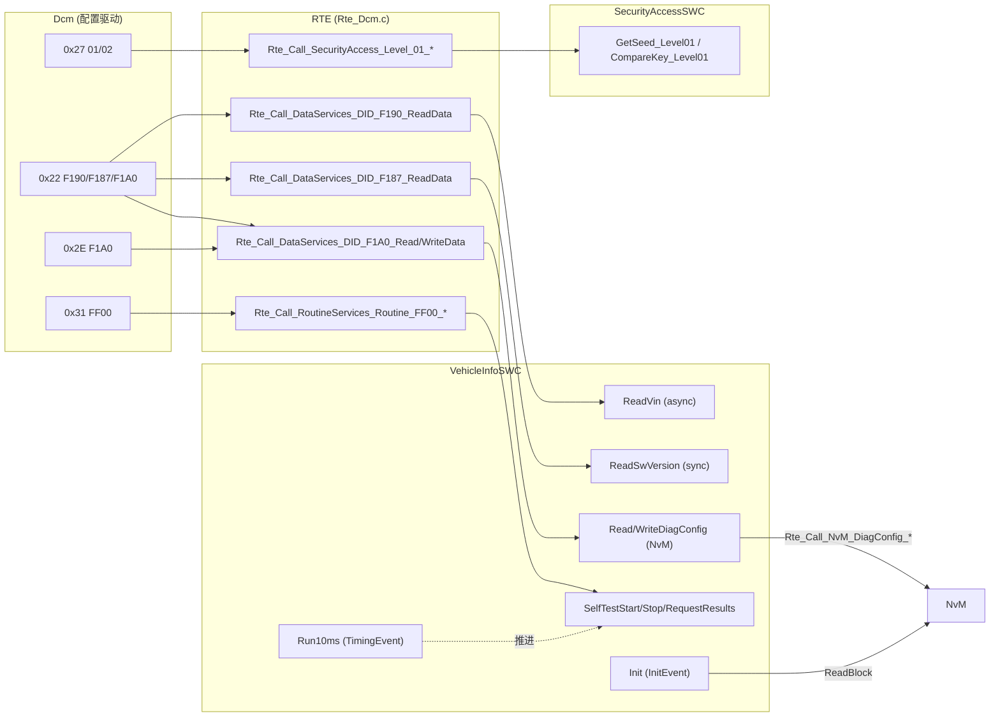

# 诊断 SWC 实例：一步一步写出 VehicleInfoSWC

> Prerequisite: [DCM 与 RTE 的集成](08-dcm-rte-integration.md), [Client/Server 通信](06-client-server.md), [RTE 生成](05-rte-generation.md)
> Next: [F190 VIN 端到端 Demo](../08-integration/04-f190-vin-demo.md)（整条 CAN → DCM → RTE → SWC 链路）；独立导读版见 [AUTOSAR SWC + RTE 教程](../autosar-swc-rte-tutorial.md)
> 对应规范: DCM SWS CP R20-11：`DataServices_<Data>`（`SWS_Dcm_00686`）、`SecurityAccess_<SecurityLevel>`（`00685`）、`RoutineServices_<RoutineName>`（`00690`）；C 原型 `Xxx_ReadData` sync `00793` / async `91006`、`Xxx_WriteData` async 定长 `91008`、`Xxx_GetSeed` `91003`、`Xxx_CompareKey` `91004`、`Xxx_Start/Stop/RequestResults` `01203/01204/91013`（p.265–292）；OpStatus `00984`；NvM 写失败 NRC 0x72（`00541`）、取消时 `NvM_CancelJobs`（`01048`）；SecurityAccess 结果处理 `00325/01397/00660/01349/01150`。**本仓库无 RTE SWS、无 NvM SWS**——`Rte_*` 命名与 NvM 服务接口按 R4.x 公认形态，需以项目 release 确认。
> 对应源码: 本项目 `examples/uds_diag_demo/swc/VehicleInfoSWC.c`、`swc/SecurityAccessSWC.c`、`rte/Rte_VehicleInfoSWC.h`、`rte/Rte_SecurityAccessSWC.h`、`rte/Rte_Dcm.c`、`diag/Dcm_Cfg.c`、`mem/NvM.h`、`tests/test_uds_demo.c`；openAUTOSAR `diagnostic/Dcm/src/Dcm_Dsp.c:1250-1254`（函数指针直连的对照）

---

## 1. 本章目标

前面八章讲原理，这一章**按开发顺序**构建一个诊断 SWC，每一步都对应 demo 中真实存在的代码。读完你应该能：

1. 从 `claude_plan.md` §10 给出的朴素函数 `VehicleInfo_ReadVIN` 出发，说出把它变成一个 AUTOSAR SWC 需要补齐的每一样东西。
2. 独立写出：同步 DID（F187）、异步 DID（F190）、NvM 可写 DID（F1A0）、带周期 runnable 的 Routine（FF00）、SecurityAccess SWC（Level 01）。
3. 每一步都知道：Dcm 配置要配什么、Interface 长什么样、RTE 会生成什么、SWC 写什么、怎么测试。
4. 有一份可在真实项目中复用的"诊断 SWC 审查清单"。

---

## 2. 为什么需要这样一步一步来？

在真实项目中，诊断需求通常以一张表的形式到达（来自 OEM 的诊断规范 / CDD / ODX）：

| DID / RID / Level | 名称 | 长度 | 读会话 | 写会话 | 安全级 | 数据来源 |
|---|---|---|---|---|---|---|
| F190 | VIN | 17 | 全部 | — | — | 常量/EOL 写入（demo：常量 + 模拟延迟） |
| F187 | SW 版本 | 8 | 全部 | — | — | 编译期常量 |
| F1A0 | 诊断配置 | 10 | 全部 | Extended | Level 1 | NvM |
| FF00 | 自检 Routine | — | Extended | — | — | 应用逻辑 |
| Level 01 | Seed/Key | 4/4 | Extended | — | — | OEM 算法 |

（上表就是 demo `diag/Dcm_Cfg.c:19-90` 的内容。）

应用开发者的工作是：**对表中的每一行，决定实现方式，并写出对应的 server runnable**。每一行背后的决策（同步/异步、C/S/S/R/NvM、是否需要 ErrorCode）都会影响签名和行为。按"从简单到复杂"的顺序做，可以每一步只引入一个新概念。

---

## 3. 在系统中的位置



---

## 4. AUTOSAR 如何定义？（本章用到的规则汇总）

| 规则 | 来源 | 在本章哪一步用到 |
|---|---|---|
| `DataServices_<Data>` 的 Operation 签名由 `DcmDspDataUsePort` 决定 | DCM R20-11 p.269–276、p.537–539 | Step 2–5 |
| ASYNCH 接口：首次 `DCM_INITIAL`，PENDING 后以 `DCM_PENDING` 重调；OUT 只在 E_OK 时有效；`DCM_CANCEL` 返回值被忽略 | `00527/00530/01187/01046` | Step 4、5 |
| NvM 写失败应给 NRC 0x72；取消时可能需 `NvM_CancelJobs` | `00541`、`01048` | Step 5 |
| Routine 签名随 in/out signal 配置变化 | `01360–01364`（p.192–193） | Step 6 |
| `CompareKey` 返回 `DCM_E_COMPARE_KEY_FAILED` 才计入尝试次数；`E_NOT_OK` 不计数 | `01397`、`01150` | Step 7 |
| SWC 只 include 自己的 `Rte_<Swc>.h` | R4.x 公认（本仓库无 RTE SWS） | 全部 |

---

## 5. 核心数据结构：VehicleInfoSWC 的内部状态

`swc/VehicleInfoSWC.c:26-47`：

| 变量 | 作用 | 生命周期 | 为什么需要 |
|---|---|---|---|
| `VehicleInfoSWC_Vin[17]`（const） | VIN 数据 | 常量 | Step 4 |
| `VehicleInfoSWC_SwVersion[8]`（const） | SW 版本 | 常量 | Step 3 |
| `VehicleInfoSWC_ConfigMirror[10]` | NvM block 的 RAM 镜像 | 上电由 Init 读入，写成功后更新 | Step 5 读 |
| `VehicleInfoSWC_ConfigStaging[10]` | 写入期间的稳定缓冲 | 一次写请求 | Step 5 写：NvM 异步写期间源数据必须稳定 |
| `VehicleInfoSWC_VinPendingCycles` / `VinPendingLeft` | 模拟"VIN 需要等待" | 每次请求 | Step 4：跨 PENDING 的进度 |
| `VehicleInfoSWC_SelfTestStatus` / `Elapsed` / `Active` | Routine 状态机 | Start 到完成 | Step 6 |

---

## 6. 初始化流程

见 Step 8。简要：`EcuM_Init`（`integration/EcuM.c:33-37`）→ `NvM_ReadAll` → `Dcm_Init` → `Rte_Start`（`rte/Rte_Dcm.c:38-44`）→ `VehicleInfoSWC_Init`、`SecurityAccessSWC_Init`。

---

## 7. Runtime Flow：分步构建

### Step 0 — 朴素版本：直接函数调用

`claude_plan.md` §10 给出的教学级起点：

```c
/* [Conceptual] the naive version — NOT how a real AUTOSAR ECU is wired */
#include <string.h>
#include "Std_Types.h"

static const uint8 VinData[17] = { 'L','R','H','8','5','0','D','E','M','O','0','0','0','0','0','0','1' };

Std_ReturnType VehicleInfo_ReadVIN(uint8 *Data)
{
    memcpy(Data, VinData, 17);
    return E_OK;
}
```

以及"某个诊断模块"直接调用它：

```c
/* [Conceptual] the diagnostic handler calls the application directly */
extern Std_ReturnType VehicleInfo_ReadVIN(uint8 *Data);

static void Diag_Handle_22_F190(uint8 *res)
{
    res[0] = 0x62; res[1] = 0xF1; res[2] = 0x90;
    (void)VehicleInfo_ReadVIN(&res[3]);
}
```

**这段代码能工作。** 实际上，它在形态上就等于：

- openAUTOSAR 的 Dcm：`diagnostic/Dcm/src/Dcm_Dsp.c:1250-1254` 通过配置中的 C 函数指针 `ReadDataFnc(&tx[txPos])` 调用应用（研究笔记 03 §4.4）；
- R20-11 中 `DcmDspDataUsePort = USE_DATA_SYNCH_FNC`，`DcmDspDataReadFnc = VehicleInfo_ReadVIN`（规范示例 p.225–226 中的 `ReadDID_F080` 就是这种）。

所以，它不是"错的"，而是"**不是 SWC**"。下面是它缺少的东西，以及真实 AUTOSAR 为什么通常通过生成的 RTE API 来连接。

### Step 1 — 为什么真实 AUTOSAR 不这样连接

| 朴素版本的问题 | 具体后果 | 通过生成的 RTE 后 |
|---|---|---|
| ① 函数名 `VehicleInfo_ReadVIN` 被写进 Dcm 配置/代码 | 改名、换实现、换 SWC 都要改 Dcm 配置；Dcm 与应用强耦合 | Dcm 只知道 `Rte_Call_DataServices_DID_F190_ReadData`；谁实现由 Connector 决定 |
| ② 签名没有任何机器检查 | Dcm 期望 `(OpStatus, Data)`，应用写成 `(Data)`——C 的 `extern` 声明不一致时，**链接器不会报错**，运行时栈错乱 | 两端签名都由同一 Interface 生成，不一致时 RTE 生成/编译报错 |
| ③ 不知道 Data 缓冲有多大 | `memcpy(Data, VinData, 17)` 依赖"调用者一定给了 17 字节"——没有任何声明 | 长度来自 `DcmDspDataByteSize` 与 Interface 中的数组类型 |
| ④ 没有异步能力 | VIN 若来自 NvM/另一 ECU，只能 busy-wait 或返回旧值 | ASYNCH 接口 + `DCM_E_PENDING` |
| ⑤ 不能跨分区 | 应用在 User 模式分区时，Dcm（Supervisor/BSW 分区）直接调用会触发 MPU 违规或绕过保护 | RTE 生成跨分区调用 |
| ⑥ 应用想知道会话/安全状态时只能 include `Dcm.h` | SWC 依赖 BSW 头文件 | Mode 端口 / `DCMServices` |
| ⑦ 没有描述 | 工具不知道这个函数存在：无法做连线检查、时序分析、文档生成 | ARXML 中有 Port、Runnable、Event |
| ⑧ 调用上下文不明确 | 谁调用、哪个 task、能否被抢占都不清楚 | OperationInvokedEvent + Dcm 的 task 映射，生成代码中可查 |

`[Real Project Consideration]` 朴素版本（即 `USE_DATA_SYNCH_FNC`）在真实项目中**仍然常见**：遗留代码、没有使用 RTE 的小 ECU、bootloader、或者团队决定诊断回调就用 C callout。识别它的标志是：Dcm 配置里出现应用函数名，生成的 `Rte_Dcm.h` 里没有对应的 `Rte_Call_DataServices_*`。

### Step 2 — 把需求变成端口和接口

对 F190，做三个决定：

1. **用 C/S**（需要在读的时刻执行逻辑，后续可能要异步）→ `DcmDspDataUsePort = USE_DATA_*_CLIENT_SERVER`。
2. **用 ASYNCH**（demo 中为了演示 pending；真实 VIN 若从 NvM/EOL 数据读取也常是异步）→ `USE_DATA_ASYNCH_CLIENT_SERVER`。
3. **不需要应用给 NRC** → 不用 `_ERROR` 变体。

于是 Interface 确定为（[05-rte-generation.md](05-rte-generation.md) §4.3 有完整 ARXML）：

```text
DataServices_DID_F190.ReadData(IN Dcm_OpStatusType OpStatus, OUT uint8 Data[17])
PossibleErrors: E_NOT_OK(1), DCM_E_PENDING(10)
```

Dcm 侧配置（demo：`diag/Dcm_Cfg.c:34-38`）；RTE 侧生成 client API（demo：`rte/Rte_Dcm.h:30`）和 server runnable 原型（demo：`rte/Rte_VehicleInfoSWC.h:28`）。

### Step 3 — 最简单的 server：同步 DID F187

`USE_DATA_SYNCH_CLIENT_SERVER`，签名无 OpStatus（`SWS_Dcm_00793`）。

```c
/* [Educational Implementation] swc/VehicleInfoSWC.c:98-103 */
Std_ReturnType VehicleInfoSWC_ReadSwVersion(uint8 *Data)
{
    (void)memcpy(Data, VehicleInfoSWC_SwVersion, VEHINFO_SWVER_LENGTH);
    UDS_TRACE("SWC", "VehicleInfoSWC_ReadSwVersion: \"%.8s\"", (const char *)VehicleInfoSWC_SwVersion);
    return E_OK;
}
```

与 Step 0 的朴素版本**几乎一样**！区别不在函数体，而在：

- 它通过 `rte/Rte_VehicleInfoSWC.h:29` 的原型被约束；
- Dcm 通过 `Rte_Call_DataServices_DID_F187_ReadData`（`rte/Rte_Dcm.c:64-68`）调用它，Dcm 配置里出现的是 RTE API 名，不是 `VehicleInfoSWC_ReadSwVersion`（`diag/Dcm_Cfg.c:41`）；
- 它在 ARXML 中有一个 OperationInvokedEvent。

**这正是 AUTOSAR 的精髓：SWC 的函数体可以很朴素，"连接"才是 AUTOSAR 的价值。**

测试：`22 F1 87` → `62 F1 87 53 57 30 31 30 32 30 33`（`trace.txt:127`）。

### Step 4 — 异步 DID F190：OpStatus 与 DCM_E_PENDING

```c
/* [Educational Implementation] swc/VehicleInfoSWC.c:77-96 */
Std_ReturnType VehicleInfoSWC_ReadVin(Dcm_OpStatusType OpStatus, uint8 *Data)
{
    if (OpStatus == DCM_CANCEL) {                                /* (a) */
        VehicleInfoSWC_VinPendingLeft = 0u;
        UDS_TRACE("SWC", "VehicleInfoSWC_ReadVin(DCM_CANCEL): abort");
        return E_OK;
    }
    if (OpStatus == DCM_INITIAL) {                               /* (b) */
        VehicleInfoSWC_VinPendingLeft = VehicleInfoSWC_VinPendingCycles;
    }
    if (VehicleInfoSWC_VinPendingLeft != 0u) {                   /* (c) */
        VehicleInfoSWC_VinPendingLeft--;
        return DCM_E_PENDING;
    }
    (void)memcpy(Data, VehicleInfoSWC_Vin, VEHINFO_VIN_LENGTH);  /* (d) */
    return E_OK;
}
```

新引入的概念（与 Step 3 相比）：

- (a) **取消**：Dcm 可能因 0x78 次数用尽、会话变化等原因取消（`SWS_Dcm_01046`），server 必须清理。
- (b) **新请求初始化**：只在 `DCM_INITIAL` 时初始化进度。
- (c) **进度跨调用保存**：`static` 变量。返回 PENDING 时不写 `Data`。
- (d) **只在 E_OK 时写 OUT 参数**（`SWS_Dcm_01187`）。

真实 VIN 的数据来源：常见做法是 EOL 写入 NvM（DID F190 可写，仅在 EOL 会话/安全级下），读时 `USE_BLOCK_ID` 由 Dcm 直接读 NvM，或由 SWC 读 RAM 镜像（同步）。demo 用"常量 + 模拟延迟"是为了在不引入额外模块的情况下演示 OpStatus 机制。

测试：`tests/test_uds_demo.c:60` 设置 1 次 pending → 正常响应；`:278-290` 设置 8 次 pending（80 ms > P2 = 40 ms）→ 恰好一次 `7F 22 78` 后正响应。

### Step 5 — 可写 DID F1A0：经 RTE 调用 NvM

需求：10 字节配置，Extended 会话 + Level 1 才能写，掉电保存。

**读**（同步，读 RAM 镜像）：

```c
/* [Educational Implementation] swc/VehicleInfoSWC.c:105-109 */
Std_ReturnType VehicleInfoSWC_ReadDiagConfig(uint8 *Data)
{
    (void)memcpy(Data, VehicleInfoSWC_ConfigMirror, NVM_DIAGCONFIG_BLOCK_SIZE);
    return E_OK;
}
```

**写**（异步，等 NvM）：

```c
/* [Educational Implementation] swc/VehicleInfoSWC.c:114-142（节选） */
    if (OpStatus == DCM_CANCEL) {
        return E_OK;   /* real SW-C: NvM_CancelJobs may be needed (SWS_Dcm_01048) */
    }
    if (OpStatus == DCM_INITIAL) {
        (void)memcpy(VehicleInfoSWC_ConfigStaging, Data, NVM_DIAGCONFIG_BLOCK_SIZE);
        if (Rte_Call_NvM_DiagConfig_WriteBlock(VehicleInfoSWC_ConfigStaging) != E_OK) {
            *ErrorCode = DCM_E_CONDITIONSNOTCORRECT;           /* 0x22 */
            return E_NOT_OK;
        }
        return DCM_E_PENDING;
    }
    (void)Rte_Call_NvM_DiagConfig_GetErrorStatus(&res);
    if (res == NVM_REQ_PENDING) { return DCM_E_PENDING; }
    if (res != NVM_REQ_OK) {
        *ErrorCode = DCM_E_GENERALPROGRAMMINGFAILURE;          /* 0x72 */
        return E_NOT_OK;
    }
    (void)memcpy(VehicleInfoSWC_ConfigMirror, VehicleInfoSWC_ConfigStaging, NVM_DIAGCONFIG_BLOCK_SIZE);
    return E_OK;
```

新引入的概念：

1. **SWC 自己是 client**：调用 `Rte_Call_NvM_DiagConfig_WriteBlock`（`rte/Rte_VehicleInfoSWC.h:42-47`）。SWC 不调用 `NvM_WriteBlock`，也不知道 BlockId 是 2——BlockId 由 RTE 宏补上（port-defined argument，R4.x 公认机制，需以项目 release 确认）。
2. **staging 缓冲**：NvM 写是异步的（`mem/NvM.h:7-9`），源缓冲必须在 job 完成前保持稳定。
3. **镜像只在成功后更新**：写失败时读到的仍是旧值，行为一致。
4. **ErrorCode**：`WriteData` 的 ASYNCH 定长签名带 `ErrorCode`（`SWS_Dcm_91008`），SWC 可以选择 NRC。
5. **权限不在 SWC 中检查**：Extended + Level 1 的要求在 Dcm 配置中（`diag/Dcm_Cfg.c:47` 的 `DCM_SES_EXTENDED, DCM_SEC_LEVEL1`），Dcm 在调用 RTE 之前就拒绝（`diag/Dcm_Dsp.c:502-511`，NRC 0x31 / 0x33）。**SWC 不要重复做会话/安全检查**——那会导致"配置改了权限，代码里还有一份旧检查"。

> 对比方案：如果 F1A0 只是"原样存进 NvM、原样读出"，没有任何应用逻辑，更简单的做法是 `DcmDspDataUsePort = USE_BLOCK_ID`，Dcm 直接调 NvM（`SWS_Dcm_00560/00541`），完全不需要应用 SWC。只有当写入需要校验、转换或通知应用时，才值得走 C/S。

> `[Educational Implementation]` demo 中 F1A0 读用 SYNCH 签名、写用 ASYNCH 签名，这在真实 R20-11 配置中不可能出现在同一个 `DcmDspData` 上（见 [02-port-interface.md](02-port-interface.md) §5）。真实项目里应二选一或拆分。

测试：`2E F1 A0 <10 bytes>` 无安全 → `7F 2E 33`；解锁后 → `6E F1 A0`；trace `:258-268` 显示 INITIAL 时排队、下一个周期 NvM 完成后 PENDING 调用返回 E_OK。

### Step 6 — Routine FF00：OperationInvokedEvent + TimingEvent 协作

需求：`31 01 FF 00` 启动 100 ms 自检，`31 03 FF 00` 查询结果，`31 02 FF 00` 停止。

```c
/* swc/VehicleInfoSWC.c:145-157 —— Start：只"启动"，不等待 */
Std_ReturnType VehicleInfoSWC_SelfTestStart(Dcm_OpStatusType OpStatus, Dcm_NegativeResponseCodeType *ErrorCode)
{
    (void)ErrorCode;
    if (OpStatus == DCM_CANCEL) { return E_OK; }
    VehicleInfoSWC_SelfTestActive = TRUE;
    VehicleInfoSWC_SelfTestElapsed = 0u;
    VehicleInfoSWC_SelfTestStatus = SELFTEST_STATUS_RUNNING;
    UDS_TRACE("SWC", "VehicleInfoSWC_SelfTestStart: started (session seen via Rte_Mode = 0x%02X)",
              (unsigned)Rte_Mode_DcmDiagnosticSessionControl_DcmDiagnosticSessionControl());
    return E_OK;
}

/* swc/VehicleInfoSWC.c:62-72 —— Run10ms：真正"执行"例程 */
void VehicleInfoSWC_Run10ms(void)
{
    if (VehicleInfoSWC_SelfTestActive) {
        VehicleInfoSWC_SelfTestElapsed = (uint16)(VehicleInfoSWC_SelfTestElapsed + 10u);
        if (VehicleInfoSWC_SelfTestElapsed >= VEHINFO_SELFTEST_DURATION) {
            VehicleInfoSWC_SelfTestActive = FALSE;
            VehicleInfoSWC_SelfTestStatus = SELFTEST_STATUS_COMPLETED;
        }
    }
}

/* swc/VehicleInfoSWC.c:173-183 —— RequestResults：报告状态 */
    *Out_RoutineStatus = VehicleInfoSWC_SelfTestStatus;
```

新引入的概念：

1. **两种 runnable 共享状态**：Start/Stop/RequestResults 是 server runnable（在 Dcm 的 task 中），Run10ms 是 TimingEvent runnable（在 `Rte_Task_10ms` 中）。demo 中两者在同一个 10 ms tick 顺序执行，不需要保护；**若真实项目映射到不同 task，需要 Exclusive Area**（[03-runnable-event.md](03-runnable-event.md) §4.4）。
2. **"启动"与"完成"分离**：Start 立即返回 E_OK（`71 01 FF 00`），例程在后台运行；结果通过 RequestResults 查询。这是 UDS RoutineControl 的标准用法，避免 Start 阻塞 Dcm。
3. **Mode 读取**：`Rte_Mode_DcmDiagnosticSessionControl_DcmDiagnosticSessionControl()`——SWC 想知道会话时用 Mode 端口，不用 `Dcm_GetSesCtrlType`。
4. **"从未启动就查询"的 0x24** 由 Dcm 判断（`diag/Dcm_Dsp.c:583-588`），不是 SWC。
5. **签名适配**：Dcm 内部统一形态 → `RoutineServices_Routine_FF00` 的具体签名，由 `diag/Dcm_Cfg.c:51-85` 的 "generated glue" 完成。真实项目中 routine 的 `dataIn_n/dataOut_n` 参数随 signal 配置变化（`SWS_Dcm_01360–01364`）。

测试：trace `:370-371`（Start，看到 `Rte_Mode = 0x03`）、`:388`（Run10ms 完成）、`:405-406`（RequestResults → 0x02）。

### Step 7 — SecurityAccessSWC：独立的 SWC

为什么不放进 VehicleInfoSWC？**职责分离**：seed/key 算法通常来自 OEM（甚至是二进制库或 HSM），与车辆信息无关；单独的 SWC 可以单独交付、单独替换。

```c
/* [Educational Implementation] swc/SecurityAccessSWC.c:34-54（节选） */
Std_ReturnType SecurityAccessSWC_GetSeed_Level01(Dcm_OpStatusType OpStatus, uint8 *Seed,
                                                 Dcm_NegativeResponseCodeType *ErrorCode)
{
    ...
    SecurityAccessSWC_Lcg = (SecurityAccessSWC_Lcg * 1103515245u) + 12345u;   /* predictable! */
    for (i = 0u; i < SECACC_SEED_SIZE; i++) {
        Seed[i] = (uint8)(SecurityAccessSWC_Lcg >> (24u - (8u * i)));
    }
    if ((Seed[0] | Seed[1] | Seed[2] | Seed[3]) == 0u) {
        Seed[3] = 1u;   /* an all-zero seed means "already unlocked" in UDS */
    }
    ... save LastSeed ...
    return E_OK;
}

/* swc/SecurityAccessSWC.c:56-73（节选） */
Std_ReturnType SecurityAccessSWC_CompareKey_Level01(const uint8 *Key, Dcm_OpStatusType OpStatus,
                                                    Dcm_NegativeResponseCodeType *ErrorCode)
{
    ...
    for (i = 0u; i < SECACC_SEED_SIZE; i++) {
        if (Key[i] != (uint8)(SecurityAccessSWC_LastSeed[i] ^ SecurityAccessSWC_KeyMask[i])) {
            ok = FALSE;
        }
    }
    return ok ? E_OK : DCM_E_COMPARE_KEY_FAILED;
}
```

要点：

1. **`!!! INSECURE TEACHING ALGORITHM !!!`**（文件头 `:9-15`）：LCG 可预测、XOR 一对 seed/key 即可破解。真实 ECU 用 OEM 秘密算法（常基于 AES-CMAC）与真随机数，经常通过 Csm 调用 HSM。
2. **SWC 不管尝试计数和延时**：0x35/0x36/0x37 全由 Dcm 处理（`diag/Dcm_Dsp.c:466-479`，`SWS_Dcm_01397/00660/01349`）。SWC 只回答"key 对不对"。
3. **返回 `DCM_E_COMPARE_KEY_FAILED`（11），不是 `E_NOT_OK`**：前者计入尝试次数，后者不计（`SWS_Dcm_01150`）——用错会让防暴破失效。
4. **全零 seed 的特殊处理**：UDS 中全零 seed 表示"已解锁"，算法偶然生成全零时必须避开。
5. 真实项目中 `SecurityAccess_<Level>` 可能还需要实现 `GetSecurityAttemptCounter / SetSecurityAttemptCounter`（`SWS_Dcm_01152/01153`），用于上电恢复尝试计数（防止"断电重试"绕过延时）。

### Step 8 — 初始化与生命周期

```c
/* [Educational Implementation] swc/VehicleInfoSWC.c:54-60 */
void VehicleInfoSWC_Init(void)
{
    (void)Rte_Call_NvM_DiagConfig_ReadBlock(VehicleInfoSWC_ConfigMirror);
    VehicleInfoSWC_SelfTestActive = FALSE;
    VehicleInfoSWC_SelfTestStatus = 0u;
    VehicleInfoSWC_VinPendingLeft = 0u;
}
```

- 由 `Rte_Start`（`rte/Rte_Dcm.c:42`）调用，晚于 `NvM_ReadAll`（`integration/EcuM.c:34`）。
- 复位后状态全部清零；Dcm 也在 `Dcm_Init` 中复位。`11 01` 之后再读 F1A0 仍得到写入值（测试 `[PASS] 11 01 -> 51 01, reset after response`）——因为 NvM 模拟的"flash"跨模拟复位保留（`mem/NvM.h:10-11`）。

### Step 9 — 设计练习：把一个测量值 DID 做成 S/R（不修改 demo）

`[Conceptual]` 需求：DID F40D 车速，2 字节，大端。

| 决策 | 选择 | 理由 |
|---|---|---|
| UsePort | `USE_DATA_SENDER_RECEIVER` | 车速是持续更新的状态；读时不需要执行逻辑 |
| 生产者 | `VehicleSpeedSWC_Run10ms` 中 `Rte_Write_DataServices_DID_F40D_Data(speed)`（端口名示意） | — |
| Dcm 读取 | DSP 按 UsePort 读 RTE 缓冲，按 `DcmDspDataEndianness` 序列化（`SWS_Dcm_00638`） | — |
| server runnable | **无** | S/R 没有 server |

在 demo 上实现它需要：扩展 `Dcm_DspDataUsePortType`（`diag/Dcm_Cfg.h:77-80`）、在 DSP 中加分支、在 RTE 中加缓冲与 `Rte_Write/Rte_Read`。作为练习写在自己的副本上，**不要修改 `examples/uds_diag_demo/`**。

---

## 8. RH850 Hardware Mapping

`[RH850 Hardware]` VehicleInfoSWC 本身不碰硬件。它间接依赖：

| SWC 功能 | 最终的 RH850 资源 |
|---|---|
| F1A0 NvM 写 | NvM → Fee → Fls → Data Flash（P1M-E Data Flash 的擦写时间、FACI 细节需以 Flash 手册确认；本仓库无） |
| Run10ms 周期 | OS counter → OSTM（通道归属为配置选择） |
| SecurityAccess 随机数 / 加密 | 真实项目可能用 TRNG/HSM（是否存在及接口需根据实际芯片手册确认）；demo 用 LCG |
| 请求到达 | RS-CANFD RX FIFO 中断 EI190 → CanIf → CanTp → PduR → Dcm |

---

## 9. openAUTOSAR 实现

openAUTOSAR 中**没有诊断 SWC**，也没有 RTE。对应 Step 0 的"朴素版本"：

- `diagnostic/Dcm/include/Dcm_Lcfg.h:179-181`：DID 读写函数指针；
- `diagnostic/Dcm/src/Dcm_Dsp.c:1250-1254`：`ReadDataFnc(&tx[txPos])`；
- `diagnostic/Dcm/src/Dcm_Dsp.c:1648`、`:1694`（研究笔记 03 §4.5）：`securityRow->GetSeed(adr, seedOut, &err)`、`CompareKey(key)`——也是函数指针，且没有尝试计数/延时（0x36/0x37 缺失）。

应用函数的实例（真正的 `ReadDataFnc` 实现）在仓库中**不存在**，因为配置实例缺失（研究笔记 03 §0）。

---

## 10. 当前教学项目实现

| Step | demo 文件:行 | 测试（`tests/test_uds_demo.c` / `results.txt`） |
|---|---|---|
| 3 F187 | `swc/VehicleInfoSWC.c:98-103`；`rte/Rte_Dcm.c:64-68`；`diag/Dcm_Cfg.c:39-43` | `[PASS] 22 F1 87 + multi-DID + unsupported DID` |
| 4 F190 | `swc/VehicleInfoSWC.c:77-96`；`rte/Rte_Dcm.c:54-62`；`diag/Dcm_Cfg.c:34-38` | `[PASS] 22 F1 90 multi-frame VIN with FC`；`[PASS] NRC 0x78 response pending sequence` |
| 5 F1A0 | `swc/VehicleInfoSWC.c:105-142`；`rte/Rte_Dcm.c:70-85`；`rte/Rte_VehicleInfoSWC.h:42-47`；`diag/Dcm_Cfg.c:44-48` | `[PASS] 2E without security 0x33, with security 6E` |
| 6 FF00 | `swc/VehicleInfoSWC.c:62-72, :145-183`；`rte/Rte_Dcm.c:107-130`；`diag/Dcm_Cfg.c:51-90` | `[PASS] 31 01/03 FF00 routine + 0x24/0x31` |
| 7 Security | `swc/SecurityAccessSWC.c:34-73`；`rte/Rte_Dcm.c:89-103`；`diag/Dcm_Cfg.c:26-30` | `[PASS] 27 01/02 good+bad key, 0x24/0x35/0x36/0x37` |
| 8 Init | `swc/VehicleInfoSWC.c:54-60`；`rte/Rte_Dcm.c:38-44`；`integration/EcuM.c:33-37` | `[PASS] 11 01 -> 51 01, reset after response` |

（测试结果见 `examples/uds_diag_demo/README.md` §5：12/12 PASS。）

---

## 11. Code Walkthrough

### 11.1 朴素版本 vs SWC 版本：逐行对比

| | 朴素版本（Step 0） | SWC 版本（demo） |
|---|---|---|
| include | `"Std_Types.h"`，调用方 `extern` 声明 | `"Rte_VehicleInfoSWC.h"`（`swc/VehicleInfoSWC.c:22`） |
| 函数名 | `VehicleInfo_ReadVIN`（写进 Dcm 配置） | `VehicleInfoSWC_ReadVin`（来自 runnable `SYMBOL`；Dcm 配置里只有 `Rte_Call_DataServices_DID_F190_ReadData`） |
| 签名 | `(uint8 *Data)`，随意 | `(Dcm_OpStatusType OpStatus, uint8 *Data)`，由 `DataServices_DID_F190` 接口 + UsePort 决定 |
| 长度 | 魔数 17 | `VEHINFO_VIN_LENGTH`，与 `DcmDspDataByteSize` 一致（真实生成头会给数组 typedef） |
| 异步 | 不支持 | `DCM_INITIAL/PENDING/CANCEL` |
| 调用者 | 某个诊断函数直接调用 | `rte/Rte_Dcm.c:59`（生成的连线） |
| 可替换性 | 换实现要改 Dcm 配置 | 换实现只改 Connector / 重新生成 RTE |

### 11.2 诊断 SWC 审查清单（可直接用于真实项目）

- [ ] `.c` 只 include 自己的 `Rte_<Swc>.h`（和标准库）。
- [ ] 每个 server runnable 签名与生成头一致（编译即可验证）。
- [ ] ASYNCH server：处理 `DCM_CANCEL`；只在 `DCM_INITIAL` 初始化进度；进度存 `static`；只在 E_OK 时写 OUT。
- [ ] 没有 busy-wait；所有等待 NvM / 外部 ECU / 加密的操作都返回 `DCM_E_PENDING`。
- [ ] `E_NOT_OK` 时 `ErrorCode` 在 0x01–0xFF（`_ERROR` 变体）。
- [ ] 不重复 Dcm 已做的会话/安全检查。
- [ ] 需要会话信息时用 Mode 端口 / `DCMServices`，不调 `Dcm_*`。
- [ ] NvM 写：源缓冲在 job 期间稳定；失败 NRC 0x72；取消时考虑 `NvM_CancelJobs`。
- [ ] CompareKey 错误返回 `DCM_E_COMPARE_KEY_FAILED`，不是 `E_NOT_OK`。
- [ ] server runnable 与周期 runnable 共享状态时，确认 task 映射；不同 task 则声明 Exclusive Area。
- [ ] 没有调试用的 trace/printf 残留（demo 中的 `UDS_TRACE` 属于教学 harness，`swc/VehicleInfoSWC.c:19-20` 已注明）。

---

## 12. Debug 方法

| 步骤 | 典型问题 | 怎么查 |
|---|---|---|
| Step 3 | 读出乱码 | `Data` 长度与 `DcmDspDataByteSize` 不一致 |
| Step 4 | 永远 0x78 → 0x10 | `VinPendingLeft` 是否递减；`DCM_INITIAL` 是否重置 |
| Step 5 | 写后读到旧值 | `NvM_MainFunction` 是否在跑；mirror 是否在 E_OK 时更新 |
| Step 5 | 写返回 0x33 / 0x31 | Dcm 配置的权限，SWC 未被调用（断点不会命中） |
| Step 6 | RequestResults 总是 RUNNING | `Run10ms` 是否被调度（`rte/Rte_Dcm.c:49`、`integration/BswScheduler.c:51`） |
| Step 7 | 正确 key 也失败 | `LastSeed` 是否被第二次 GetSeed 覆盖；seed 与 key 是否同一 level |

---

## 13. 常见问题 / 常见错误

1. **把朴素版本当成"错误代码"**：它是 `USE_DATA_SYNCH_FNC` 的合法形态，问题只是它不是 SWC、缺少 RTE 带来的解耦与检查。
2. **在 server runnable 里检查会话/安全**：与 Dcm 配置重复，配置改了代码没改就会不一致。
3. **Routine Start 阻塞直到例程完成**：Dcm 被阻塞，0x78/P2 行为异常，其它诊断请求无法处理。
4. **把 seed/key 算法和业务 SWC 混在一起**：难以替换和审计。
5. **NvM 写直接传 Dcm 请求缓冲指针**：异步写期间缓冲可能被覆盖。
6. **忘记 F1A0 这类 DID 的 SYNCH/ASYNCH 一致性**：真实配置中读写签名由同一 UsePort 决定。

---

## 14. 实验

全部不修改 demo：

1. **跑一遍并对照**：`python tools/run_uds_demo.py`，在 `artifacts/uds-demo/trace.txt` 中为 Step 3–8 各找出一段 trace，并标注对应的 `swc/*.c` 行号。
2. **审查清单实战**：用 §11.2 的清单逐条检查 `swc/VehicleInfoSWC.c` 和 `swc/SecurityAccessSWC.c`，记录哪些条目 demo 是"为了教学而简化"（例如 `UDS_TRACE`、F1A0 SYNCH/ASYNCH 混用、`DCM_CANCEL` 中未调用 `NvM_CancelJobs`）。
3. **纸上改造**：把 Step 0 的 `VehicleInfo_ReadVIN` 按 Step 2–4 改造，写出：Dcm 配置一行、Interface 定义、生成的 `Rte_Call` 原型、server runnable 原型和实现。与 demo 对比差异。
4. **Step 9 设计**：在自己的副本中实现 F40D S/R DID，并写一个测试用例（参考 `tests/test_uds_demo.c` 的 `Sim_Request` 用法）。

---

## 15. 思考题

1. 如果 F190 的 VIN 在 EOL 时写入（`2E F1 90`），读和写分别应该选什么 UsePort？VehicleInfoSWC 还需要存在吗？
2. 为什么 Routine 的 Start 应该快速返回，而不是像 F190 一样 PENDING 直到完成？什么情况下 Start 也需要 PENDING？
3. SecurityAccessSWC 的 `LastSeed` 是全局的。如果有 Level 01 和 Level 03 两个级别，应该如何组织？（提示：两个 Port、两组 runnable 或带 level 参数的内部函数。）
4. Step 5 中 SWC 选择了 0x22 和 0x72 两个 NRC。如果 OEM 规范要求写失败返回 0x22，SWC 和 Dcm 配置哪个需要改？

---

## 16. 对未来真实项目的意义

`[Real Project Consideration]`

- 进入真实项目后，诊断应用代码通常已经存在。用本章的 Step 0 → Step 7 作为"分类器"：每个 DID/Routine 属于哪种实现方式？是 C callout 还是 RTE server？是同步还是异步？
- DCM 升级时，本章的审查清单（§11.2）可以直接作为"诊断 SWC 回归审查"的检查表。
- OEM 诊断规范变化（新增 DID、改长度、改权限）时，知道哪些改动只需改 Dcm 配置（权限、会话）、哪些需要改 SWC（新数据、新逻辑）、哪些两者都要（长度、UsePort）。
- 真实的 SecurityAccess 实现往往涉及安全团队、HSM 和密钥管理，绝不能复用 demo 算法。

---

## 17. 本章总结

```text
Step 0  朴素直连：VehicleInfo_ReadVIN(Data) —— 能用，但不是 SWC（= USE_DATA_SYNCH_FNC 形态）
Step 1  为什么要 RTE：解耦、签名检查、异步、跨分区、可描述、可替换
Step 2  需求 → UsePort → Interface → Port
Step 3  SYNCH server（F187）：函数体朴素，价值在连接
Step 4  ASYNCH server（F190）：CANCEL / INITIAL / PENDING / E_OK
Step 5  NvM 写（F1A0）：SWC 作为 NvM 的 client，staging 缓冲，ErrorCode
Step 6  Routine（FF00）：server runnable 启动 + TimingEvent runnable 执行 + Mode 读取
Step 7  SecurityAccessSWC：独立 SWC，返回 COMPARE_KEY_FAILED，计数归 Dcm
Step 8  Init：Rte_Start 在 NvM_ReadAll 之后
```

## 18. 下一章

到这里，Part VII 的 SWC/RTE 内容完整了。下一步有两条路：

- 想看一次完整的 `22 F1 90` 从 CAN 帧到响应的端到端集成（CAN → CanIf → CanTp → PduR → DCM → RTE → SWC → 原路返回）：[F190 VIN 端到端 Demo](../08-integration/04-f190-vin-demo.md)。
- 想用一篇文章把 SWC/RTE 的全部概念串成一条"导读路径"：[AUTOSAR SWC + RTE 教程](../autosar-swc-rte-tutorial.md)。
