# ECU 配置一致性检查清单：从时钟、引脚到 DID ↔ RTE 端口

> Prerequisite: [配置与 ARXML](../02-autosar-classic/04-configuration-arxml.md)、[生成代码](../02-autosar-classic/05-generated-code.md)、[HOH / HRH / HTH](../04-can-mcal/07-hoh-hrh-hth.md)、[Can 配置](../04-can-mcal/08-can-configuration.md)、[CanIf 配置](../05-can-stack/02-canif-configuration.md)、[PduR](../05-can-stack/05-pdur.md)、[DCM 配置](../06-dcm/05-dcm-configuration.md)、[DCM ↔ RTE 集成](../07-rte-swc/08-dcm-rte-integration.md)
> Next: [02 CAN 栈集成](02-can-stack-integration.md)
> 对应规范: SWS CAN **R22-11**（`CanCpuClockRef` p.112、`CanHardwareObject` p.122–129、`CanObjectId` `ECUC_Can_00326` p.125、`CanRxProcessing/CanTxProcessing` p.109–110、`SWS_Can_00240` p.22）；SWS DCM **R20-11**（`DcmTaskTime` `ECUC_Dcm_00820` p.678、`DcmDslProtocolRxPduRef/TxPduRef` `00770/00772` p.473–478、`DcmDslBufferSize` `00738` p.459、`DcmDspDidUsePort/DcmDspDataUsePort` p.510–511/p.537–539）；SWS MCU **R24-11**（`McuClockReferencePoint` p.49–50）。**本仓库没有 CanIf / CanTp / PduR / EcuC / Os / Rte / BswM / ComM 的 SWS**：涉及这些模块的 ECUC 参数名按公认 R4.x 形态书写，必须以真实项目所用 Release 的 SWS / BSWMD 确认。
> 对应源码: 本项目 `examples/uds_diag_demo/` 的全部 `*_Cfg.[ch]`；openAUTOSAR（反面教材）`communication/CAN/CanIf/src/CanIf_Cfg.c`、`communication/CAN/CanTp/src/CanTp_Cfg.c`、`communication/ComServices/PDURouter/include/PduR_Cfg.h:77-130`、`system/SchM/include/SchM_cfg.h`

---

## 1. 本章目标

学完本章，你应该能够：

1. 说出一条 UDS 请求从 CAN 线到 SWC，**跨越了哪几次"配置引用"**，每一次引用两边各是哪个模块的哪个参数。
2. 拿到任何一个 AUTOSAR ECU 工程（包括本仓库的教学 demo），按本章的清单**逐项核对**：时钟 → 引脚 → Can 控制器 → HOH → CanIf L-PDU → CanTp N-PDU/N-SDU → PduR 路由 → Dcm protocol/connection → DSD/DSP 表 → RTE 端口 → OS 任务周期 → 中断。
3. 对每一项不一致，预先知道**它在总线和调试器里会表现成什么症状**，从而在 [调试手册](../debugging-autosar-diagnostics.md) 里快速定位。

本章是一张"表"，不是一篇叙事。建议打印出来，在真实项目里逐格填写。

---

## 2. 为什么需要跨模块一致性检查？

AUTOSAR 的配置是**按模块**写的（`Can`、`CanIf`、`CanTp`、`PduR`、`Dcm` 各有自己的 ECUC 容器），生成器也通常**按模块**输出 `Xxx_Cfg.h / Xxx_Lcfg.c / Xxx_PBcfg.c`。但一条诊断请求要走通，需要这些模块的配置**彼此引用正确**。问题在于：

- **编译器不检查语义**。`CanIfConf_..._7E0 = 0` 和 `CanTpConf_RxNPdu_... = 0` 都是 `0`，写错一个照样编译通过。
- **很多不一致不会报错，只会"静默丢帧"**。例如 CanIf 找不到匹配的 Rx L-PDU 时，规范和多数实现只会丢弃这一帧（最多报一个 DET）。
- **周期类参数是"隐式耦合"**：CanTp 的 `N_Cr` 用的是 CanTp MainFunction 周期换算，Dcm 的 P2/S3 用的是 `DcmTaskTime` 换算，而真正调用 MainFunction 的是 OS 任务——三者只要有一个不一致，时序就全错。

[RH850 Hardware] / [Educational Implementation] 本仓库研究过的 openAUTOSAR 恰好是一个"每个模块单独看都对、合在一起不通"的例子（研究笔记 [03 §3.3](../reference/research/03-openautosar-trace.md)）：

| openAUTOSAR 现象 | 位置 | 属于本章哪一类检查 |
|---|---|---|
| CanIf 配置里只有 1 个 Rx L-PDU 和 1 个 Tx L-PDU，**没有任何 CanTp PDU** | `communication/CAN/CanIf/src/CanIf_Cfg.c:114-149` | §5.5 CanIf ↔ CanTp |
| CanTp 的 `CanTpRxIdList` 未初始化（NULL），`CanTp_RxIndication` 一运行就空指针 | `communication/CAN/CanTp/src/CanTp_Cfg.c:136`、`CanTp.c:1047` | §5.6 CanTp 内部 |
| PduR "zero-cost" 宏无条件生效，路由表被绕过并导致链接期重复符号 | `communication/ComServices/PDURouter/include/PduR_Cfg.h:77-130` | §5.7 CanTp ↔ PduR ↔ Dcm |
| `CANTP_MAIN_FUNCTION_PERIOD_TIME_MS 1000`、`DCM_MAIN_FUNCTION_PERIOD_TIME_MS 10`、SchM 实际约 25 ms | `CanTp_Cfg.h:24`、`Dcm_Cfg.h:46`、`SchM_cfg.h:27` | §5.11 OS 任务周期 |

这正是"配置由工具生成"存在的意义——工具在生成前会做一部分交叉校验。但工具**不能**替你检查硬件事实（收发器引脚、RS-CANFD 中断通道号）、也不能检查 OS 任务真正的调用周期。所以集成工程师必须自己有这张表。

---

## 3. 在系统中的位置：配置引用链

```mermaid
flowchart LR
    subgraph HW["硬件 / MCAL"]
        MCU["Mcu<br/>McuClockReferencePoint"]
        PORT["Port<br/>CAN RX/TX pin mode"]
        CANC["Can<br/>CanController<br/>(baud, Rx/TxProcessing)"]
        HOH["Can<br/>CanHardwareObject<br/>HRH 0/1, HTH 2"]
    end
    subgraph COM["通信栈"]
        CIF["CanIf<br/>Rx/Tx L-PDU<br/>CAN ID ↔ HOH"]
        CTP["CanTp<br/>N-PDU ↔ N-SDU<br/>BS/STmin/N_xx"]
        PDUR["PduR<br/>RoutingPath<br/>Src ↔ Dest"]
    end
    subgraph DIAG["诊断"]
        DSL["Dcm DSL<br/>Protocol/Connection<br/>RxPdu / TxPdu"]
        DSD["Dcm DSD<br/>ServiceTable"]
        DSP["Dcm DSP<br/>DID / Security / Routine"]
    end
    subgraph APP["RTE / SWC"]
        RTE["RTE<br/>DataServices_* port"]
        SWC["SWC runnable"]
    end
    OS["Os<br/>Task 周期 / ISR"]
    EIC["INTC<br/>EIC190/185/183"]
    MCU -- "CanCpuClockRef" --> CANC
    PORT -. "引脚复用 (SWS_Can_00239)" .-> CANC
    CANC --> HOH
    HOH -- "CanIfHrhIdSymRef / CanIfHthIdSymRef" --> CIF
    CIF -- "N-PDU id (EcuC Pdu)" --> CTP
    CTP -- "N-SDU id (EcuC Pdu)" --> PDUR
    PDUR -- "DcmDslProtocolRxPduRef / TxPduRef" --> DSL
    DSL -- "DcmDslProtocolSIDTable" --> DSD
    DSD -- "DcmDsdSidTabFnc" --> DSP
    DSP -- "DcmDspDataUsePort" --> RTE
    RTE -- "runnable mapping" --> SWC
    OS -. "MainFunction 周期<br/>DcmTaskTime / CanTpMainFunctionPeriod" .-> CTP
    OS -.-> DSL
    EIC -. "OS Cat2 ISR" .-> CANC
```



图中每一条实线箭头都是一个**跨模块引用**，每条虚线都是一个**隐式时间/中断耦合**。逐条解释：

| 箭头 | 引用的本质 | 典型错误 |
|---|---|---|
| Mcu → Can（`CanCpuClockRef`） | Can 的波特率计算以某个 `McuClockReferencePoint` 的频率为输入（SWS CAN R22-11 p.112） | 引用了 80 MHz 的 PCLK 而不是 RS-CANFD 实际的 fCAN（40 MHz clkc 或 16 MHz clk_xincan，GCFG.DCS 决定） |
| Port → Can | CAN 引脚复用由 Port 驱动初始化（`SWS_Can_00239` p.22），Can 不碰 Port | 选错 ALT、PIPC 置 1、收发器 STB/EN 引脚没拉到正常模式 |
| Can HOH → CanIf | CanIf 的 HRH/HTH 配置引用 Can 的 `CanHardwareObject`（R4.x 公认形态：`CanIfHrhIdSymRef`/`CanIfHthIdSymRef`） | HRH 号对不上，CanIf 收到 `Mailbox->Hoh` 后找不到 L-PDU |
| CanIf → CanTp | CanIf 的 Rx L-PDU 指定上层用户（CanTp）及 CanTp 的 N-PDU 句柄；两边都通过 EcuC 全局 `Pdu` 对象关联 | 上层用户写成 PduR/Com；N-PDU id 指到功能寻址那一路 |
| CanTp → PduR | CanTp 的 N-SDU 引用 EcuC `Pdu`，PduR 的 `PduRSrcPdu/PduRDestPdu` 引用同一个 `Pdu` | 两边引用了不同的 `Pdu`，生成的数字句柄不一致 |
| PduR → Dcm | `DcmDslProtocolRxPduRef` / `DcmDslProtocolTxPduRef`（DCM R20-11 `ECUC_Dcm_00770/00772`） | 物理/功能寻址的 Rx PDU 交叉；Tx PDU 没配 |
| DSL → DSD → DSP | `DcmDslProtocolSIDTable` 选服务表；服务表行指向 DSP 处理 | 服务表里没有 0x22；会话/安全引用为空 |
| DSP → RTE | `DcmDspDataUsePort` 决定 Dcm 调用 `Rte_Call_DataServices_<X>_ReadData` 的同步/异步签名（p.269–276） | SWC 实现的是同步签名，Dcm 配成异步（或反之）——RTE 生成会报错或链接失败 |
| OS → MainFunction | `DcmTaskTime`、`CanTpMainFunctionPeriod`、`Can_MainFunction_*` 周期与 OS 任务实际周期 | 配置写 10 ms，任务实际 5 ms：P2/S3 全部减半 |
| INTC → Can ISR | RS-CANFD 的 RX FIFO 中断是 **EI190**（INTRCANGRECC），由 OS 声明为 Cat2 ISR | 把 RX 中断挂在 EI184（那是 CAN0 common FIFO） |

---

## 4. AUTOSAR 如何定义这些引用？

[AUTOSAR Standard] 规范层面有三类引用：

1. **模块间显式引用参数（`...Ref`）**：例如 `CanCpuClockRef → McuClockReferencePoint`（SWS CAN R22-11 p.112）、`DcmDslProtocolRxPduRef → Pdu`（SWS DCM R20-11 p.476 附近）。工具在生成时会把引用解析成对方生成的符号或数字。
2. **EcuC 全局 PDU（`EcucPduCollection/Pdu`）**：R4.x 中 CanIf、CanTp、PduR、Dcm 并不直接互相引用"对方的 PDU 容器"，而是共同引用一个全局 `Pdu` 对象（本仓库无 EcuC SWS，这是公认的 R4.x 机制，**需在真实项目的 ECUC 中确认**）。一个 `Pdu` 被多个模块引用，每个模块再给它分配**自己的**数字句柄。
3. **隐式约定**：MainFunction 周期参数（`DcmTaskTime`、`CanTpMainFunctionPeriod`）只是"声明我会被多快调用一次"，规范要求它与 RTE/OS 中的实际调度一致（`DcmTaskTime` 的说明：单位为秒，须与 RTE 配置一致，`ECUC_Dcm_00820` p.678），但工具链不一定能校验 OS 任务里真的按这个周期调用了。

[Conceptual] 所以集成检查分两种：**引用是否闭合**（A 引用的东西 B 真的有）和**数值是否一致**（周期、长度、ID、缓冲大小）。

---

## 5. 检查清单（按信号流向，自下而上）

每张表的列含义：

- **检查项**：要比对的两侧。
- **ECUC 参数**：R22-11 CAN / R20-11 DCM 有 SWS 依据的给出 ID；其他模块是 R4.x 公认名，标 `*`（需确认）。
- **不一致的症状**：在 CANoe 和调试器里看到的现象。
- **本 demo**：`examples/uds_diag_demo/` 中的对应位置（真实存在，可点开对照）。

### 5.1 时钟：Mcu ↔ Can

| # | 检查项 | ECUC 参数 | 不一致的症状 | 本 demo | 真实项目去哪查 |
|---|---|---|---|---|---|
| C1 | Can 控制器的时钟参考是否指向 RS-CANFD 实际的 fCAN | `CanCpuClockRef`（p.112）→ `McuClockReferencePoint`（p.49–50） | 波特率偏差 → CANoe 看到 Error Frame、ECU 不 ACK；或偏差小时"偶发"错误 | mock 无位时序；位时间计算见 `examples/rh850_mcal_reference/mcal/can/Can_BitTiming.c` | MCAL 配置工具中 Can 控制器页的 clock ref；生成的 `Can_PBcfg.c` 里的 CFG/NCFG 原值 |
| C2 | fCAN 来源与 GCFG.DCS 一致 | 供应商参数（需确认） | 同上 | — | [RH850 Hardware] P1M-E：DCS=0 → clkc 40 MHz，DCS=1 → clk_xincan 16 MHz（HW-E p.791）；**不是 80 MHz** |
| C3 | 位时间字段（BRP/TSEG1/TSEG2/SJW）与网络规范的采样点一致 | `CanControllerBaudrateConfig`（p.114–117） | 与其他节点采样点差异大 → 长线/高负载时错误 | — | 网络规范（OEM）；见 [03 位时间](../04-can-mcal/03-can-clock-bit-timing.md) |

### 5.2 引脚与收发器：Port / Dio

| # | 检查项 | 参数 | 症状 | 本 demo | 真实项目 |
|---|---|---|---|---|---|
| P1 | CAN RX/TX 引脚处于 alternative mode，ALT 号正确 | `PortPinMode`*（Port SWS 不在本仓库） | 总线上完全看不到 ECU 的 ACK/帧，或 RX 永远收不到 | mock 无引脚 | [RH850 Hardware] PMC=1、`[PFCAE,PFCE,PFC]` 选 ALT、PIPC=0（HW-E p.94、p.131）；ALT 号见 [CAN 引脚](../04-can-mcal/04-can-pin-transceiver.md)，需在 PDF 原表逐格核对 |
| P2 | 收发器 STB/EN 引脚初始电平使其处于 normal mode | `DioChannel`* / `PortPinInitialMode`* | ECU 不 ACK；示波器上 TXD 有波形但 CAN_H/L 无差分 | — | **需在真实项目环境中确认**：原理图 + 收发器数据手册（MCU 手册给不出） |
| P3 | 同一 RSCAN RX 功能只在一个引脚上使能 | — | 接收异常 | — | HW-E p.131 |

### 5.3 Can 控制器

| # | 检查项 | ECUC 参数 | 症状 | 本 demo | 真实项目 |
|---|---|---|---|---|---|
| K1 | 诊断所用控制器 = 原理图上接诊断 CAN 的 RS-CANFD channel | `CanControllerId`、`CanControllerBaseAddress`（p.107–113） | 在另一个通道上收发 | `mcal/Can_Cfg.h:18` `CanConf_CanController_CAN0` | 原理图 + `Can_PBcfg.c` |
| K2 | `CanRxProcessing` / `CanTxProcessing`（INTERRUPT/POLLING/MIXED）与 OS 中 ISR、MainFunction 的实际安排一致 | `ECUC_Can_00317/00318`（p.109–110） | 配成 INTERRUPT 却没声明 ISR → 永远收不到；配成 POLLING 却没调度 `Can_MainFunction_Read` → 同样收不到 | demo：RX=中断（`mcal/Can.c:7-10`），TX=轮询（`Can_MainFunction_Write`，`mcal/Can.c:220-239`） | MCAL 配置 + OS 配置 + SchM/RTE 生成的 task body |
| K3 | `CanBusoffProcessing` 与 CanSM 恢复策略一致，硬件不自动恢复 | `ECUC_Can_00314`（p.107）；`SWS_Can_00274`（p.43） | bus-off 后不恢复或自动恢复打乱 CanSM | demo 未建模 bus-off | [RH850 Hardware] CmCTR.BOM（HW-E p.807）；见 [13 Bus-off](../04-can-mcal/13-can-error-busoff.md) |
| K4 | Classical / FD 接口模式（GRMCFG.RCMC）与 MCAL 生成的寄存器偏移一致 | 供应商参数 | 寄存器窗口错位，全部配置写进了错误的地址 | — | HW-E p.802、p.916–919 |

### 5.4 Can ↔ CanIf：HOH

| # | 检查项 | ECUC 参数 | 症状 | 本 demo | 真实项目 |
|---|---|---|---|---|---|
| H1 | HOH 编号空间连续、从 0 开始（HRH 在前或按工具规则） | `CanObjectId` `ECUC_Can_00326`（p.125） | 生成工具报错，或 CanIf 引用错对象 | `mcal/Can_Cfg.h:22-24`（HRH0=0x7E0、HRH1=0x7DF、HTH=2） | `Can_Cfg.h` 中 `CanConf_CanHardwareObject_*` 一类符号 |
| H2 | 诊断请求 ID（物理、功能）各有接收 HOH 覆盖，过滤码/掩码正确 | `CanHwFilterCode/Mask`（p.129） | **控制器根本不收**：总线上 ECU 仍 ACK（ACK 与过滤无关），但软件里什么都没有 | `mcal/Can_Cfg.c:18-19`（code 0x7E0/0x7DF，mask 0x7FF） | [RH850 Hardware] GAFLIDj/GAFLMj：**GAFLM 位 = 1 表示比较**（HW-E p.834），与某些工具"mask=0 精确匹配"的语义相反——要看生成的寄存器原值 |
| H3 | CanIf 的 HRH 配置引用了正确的 Can HOH | `CanIfHrhIdSymRef`* | CanIf 收到 `Mailbox->Hoh`=0 却去匹配别的表项 | `ecual/CanIf_Cfg.c:16-17` 第 2 列 `CanConf_HRH_*` | `CanIf_PBcfg.c` 中 HRH 表 |
| H4 | 诊断响应用的 Tx L-PDU 引用的 HTH 是 TRANSMIT 类型 | `CanIfHthIdSymRef`*、`CanObjectType`（p.122） | `Can_Write` 报 `CAN_E_PARAM_HANDLE`，响应永远发不出去（见调试手册 F8 实验） | `ecual/CanIf_Cfg.c:21-22` 第 2 列 `CanConf_HTH_DiagResp` | `CanIf_PBcfg.c` 中 HTH 表 + `Can_PBcfg.c` |
| H5 | HTH 映射到的硬件 TX buffer / FIFO 不与其他 HTH 冲突 | 供应商参数 | 两个 PDU 抢一个 TX buffer，`CAN_BUSY` 频繁 | demo：HTH2 → TX buffer 0（`mcal/Can_Cfg.c:20`） | [RH850 Hardware] TX buffer p 编号 16m..16m+15（HW-E p.800） |

### 5.5 CanIf ↔ CanTp：L-PDU 与 N-PDU

| # | 检查项 | 参数 | 症状 | 本 demo | 真实项目 |
|---|---|---|---|---|---|
| I1 | Rx L-PDU 的 CAN ID 与诊断规范一致（物理 0x7E0、功能 0x7DF 只是本 demo 的取值） | `CanIfRxPduCanId`* | CanIf 丢帧："no Rx L-PDU configured"（调试手册 F4） | `ecual/CanIf_Cfg.c:16-17` | OEM 诊断规范 / DBC / 诊断描述（CDD/ODX）；**需在真实项目环境中确认** |
| I2 | Rx L-PDU 的上层用户 = CanTp（不是 PduR/Com） | `CanIfRxPduUserRxIndicationUL`* = CAN_TP | 诊断帧被送进 Com，Dcm 永远收不到 | `ecual/CanIf_Cfg.c:16` 第 5 列 `CanTp_RxIndication` | `CanIf_PBcfg.c` 中 Rx PDU 的回调指针或 user type 枚举 |
| I3 | Rx L-PDU 交给 CanTp 的句柄 = CanTp 的 Rx N-PDU id | EcuC `Pdu` 引用 | CanTp 用错 N-SDU（例如把物理请求当功能请求处理） | `ecual/CanIf_Cfg.c:16` 第 4 列 ↔ `com/CanTp_Cfg.h:20-21` | 两个生成头文件中的同名 `Pdu` 符号 |
| I4 | FC 帧方向：ECU **接收**多帧请求时发出的 FC 走哪个 Tx L-PDU；ECU **发送**多帧响应时，tester 的 FC 从哪个 Rx L-PDU 进来 | `CanTpTxFcNPdu`*、`CanTpRxFcNPdu`* | 收长请求时 tester 等不到 FC（N_Bs 超时）；发长响应时 ECU 等不到 FC | Tx FC：`ecual/CanIf_Cfg.c:22` + `com/CanTp_Cfg.c:15`；Rx FC：`com/CanTp_Cfg.c:30`（复用 0x7E0 的 N-PDU） | `CanTp_PBcfg.c` |
| I5 | DLC 检查与 tester 的 padding 习惯一致（要求 DLC=8 的 ECU vs 不填充的 tester） | `CanIfRxPduDataLength`*、`CanIfPrivateDlcCheck`* | 短帧被 CanIf 丢弃 | `ecual/CanIf.c:174-178`（`dlcMin`，demo 取 1） | OEM 规范通常要求 DLC=8 + padding |
| I6 | Tx L-PDU 的 CAN ID = tester 期望的响应 ID | `CanIfTxPduCanId`* | ECU 确实发了，但 tester 不认（调试手册 F9：发到 0x7E9，N_Bs 超时） | `ecual/CanIf_Cfg.c:21-22`（0x7E8） | 同 I1 |
| I7 | `CanIfTxBuffer` 深度足够（`CAN_BUSY` 时排队） | `CanIfBufferSize`* | 高负载下响应帧丢失 | `ecual/CanIf_Cfg.h:25`；排队逻辑 `ecual/CanIf.c:115-131` | `CanIf_PBcfg.c` |

### 5.6 CanTp 内部参数

| # | 检查项 | 参数 | 症状 | 本 demo | 真实项目 |
|---|---|---|---|---|---|
| T1 | 寻址格式（Normal / Extended / Mixed）与 tester 一致 | `CanTpRxAddressingFormat`* | 所有帧 PCI 解析错位，SF_DL 非法 → 丢弃 | demo 只支持 Normal | 诊断规范 |
| T2 | 功能寻址 N-SDU 只接受 SF | `CanTpRxTaType`* = FUNCTIONAL | 功能寻址 FF 被错误处理 | `com/CanTp.c:226-229` | — |
| T3 | ECU 接收方向的 BS/STmin 与 tester 能力一致 | `CanTpBs`*、`CanTpSTmin`* | tester 发太快 → ECU 丢 CF；BS 太小 → 吞吐低 | `com/CanTp_Cfg.c:17-18`（BS=2，STmin=5 ms） | OEM 规范 |
| T4 | `N_Ar/N_Br/N_Cr`、`N_As/N_Bs/N_Cs` 换算成 MainFunction 周期后不为 0、不溢出 | `CanTpNar`* 等 + `CanTpMainFunctionPeriod`* | openAUTOSAR 反例：`CanTpNas=2 ms` 被 1000 ms 周期整除成 0 | `com/CanTp_Cfg.c:19`、`:32`；周期 `com/CanTp_Cfg.h:16` | `CanTp_Cfg.h` 中的周期宏 + `CanTp_PBcfg.c` |
| T5 | Padding 字节与激活开关 | `CanTpPaddingActivation`*、`CanTpPaddingByte`* | 要求 DLC=8 的 tester 判定 ECU 帧非法 | `com/CanTp_Cfg.h:17`（0xCC） | OEM 规范 |
| T6 | Rx N-SDU 最大长度 ≥ 最长请求，Tx ≥ 最长响应 | 由 PduLength / Dcm buffer 决定 | FF 后回 FC OVFLW | Dcm buffer 128（`diag/Dcm_Cfg.h:24`） | ECUC `Pdu.PduLength` + `DcmDslBufferSize` |

### 5.7 CanTp ↔ PduR ↔ Dcm：PDU 句柄

[Educational Implementation] demo 里这四套数字最容易混（README §3.1）。核对方法是把一条请求的句柄"串成一行"：

| 层间 | 谁拥有句柄 | 物理请求 0x7E0 在 demo 中的值 | 定义位置 | 使用位置 |
|---|---|---|---|---|
| Can → CanIf | Can（HOH） | `CanConf_HRH_DiagPhysReq_7E0 = 0` | `mcal/Can_Cfg.h:22` | `mcal/Can.c:268`（`mailbox.Hoh = label`） |
| CanIf 内部 | CanIf（L-PDU） | `CanIfConf_CanIfRxPduCfg_DiagPhysReq_7E0 = 0` | `ecual/CanIf_Cfg.h:14` | `ecual/CanIf.c:171-183` |
| CanIf → CanTp | CanTp（N-PDU） | `CanTpConf_RxNPdu_DiagPhysReq_7E0 = 0` | `com/CanTp_Cfg.h:20` | `ecual/CanIf_Cfg.c:16` → `com/CanTp.c:485-486` |
| CanTp → PduR | PduR（Src PDU） | `PduRConf_PduRSrcPdu_CanTp_DiagPhysReq = 0` | `com/PduR_Cfg.h:14` | `com/CanTp_Cfg.c:16` → `com/PduR.c:20-33` |
| PduR → Dcm | Dcm（DcmRxPduId） | `DcmConf_DcmDslProtocolRx_DiagPhys = 0` | `diag/Dcm_Cfg.h:31` | `com/PduR_Cfg.c:18` → `diag/Dcm_Dsl.c:309` |
| Dcm → PduR（响应） | PduR（Src PDU） | `PduRConf_PduRSrcPdu_Dcm_DiagResp = 0` | `com/PduR_Cfg.h:19` | `diag/Dcm_Dsl.c:199` |
| PduR → CanTp（响应） | CanTp（Tx N-SDU） | `CanTpConf_TxNSdu_DiagPhys = 0` | `com/CanTp_Cfg.h:31` | `com/PduR_Cfg.c:23` → `com/CanTp.c:392` |
| CanTp → CanIf（响应） | CanIf（Tx L-PDU） | `CanIfConf_CanIfTxPduCfg_DiagResp_7E8 = 0` | `ecual/CanIf_Cfg.h:21` | `com/CanTp_Cfg.c:30` → `ecual/CanIf.c:93` |
| CanIf → Can（响应） | Can（HTH） | `CanConf_HTH_DiagResp = 2` | `mcal/Can_Cfg.h:24` | `ecual/CanIf_Cfg.c:21` → `mcal/Can.c:171` |

注意：表里大多数值都是 `0`。**"0 号 PDU" 在 6 个模块里是 6 个不同的东西**。调试时看到 `PduId=0`，第一个问题永远是"这是谁的 handle"。

| # | 检查项 | 参数 | 症状 | 本 demo | 真实项目 |
|---|---|---|---|---|---|
| R1 | CanTp 的 Rx N-SDU 与 PduR 某条路由的 Src PDU 引用同一个 EcuC `Pdu` | `PduRSrcPduRef`* | `PduR_CanTpStartOfReception` 找不到路由 → DET + `BUFREQ_E_NOT_OK` → CanTp 丢 SF（调试手册 F5） | `com/PduR_Cfg.c:18-19` | `PduR_PBcfg.c` 路由表 |
| R2 | 该路由的目的是 Dcm，且目的句柄 = `DcmDslProtocolRxPduRef` 对应的 DcmRxPduId | `PduRDestPduRef`*、`ECUC_Dcm_00770` | 请求进了别的上层；或物理/功能交叉 | `com/PduR_Cfg.c:18` 第 2 列 | `PduR_PBcfg.c` + `Dcm_Cfg.h` |
| R3 | Dcm 发送用的 Src PDU → CanTp Tx N-SDU；CanTp 的 Tx 确认能反查回 Dcm 的 TxPduId | `DcmDslProtocolTxPduRef` `ECUC_Dcm_00772`；`DcmDslProtocolTxConfirmationPduId` | `Dcm_TpTxConfirmation` 永远不来 → Dcm 不重启 S3、不执行 0x10/0x11 的后续动作 | `com/PduR_Cfg.c:23-24` | 同上 |
| R4 | 没有"零成本"宏把 PduR 短路，或短路后两端签名一致 | 生成器选项 | openAUTOSAR 反例：重复符号、路由表失效 | — | `PduR_Cfg.h` 中 `#define PduR_...` 宏 |

### 5.8 Dcm 协议 / 连接 / 缓冲

| # | 检查项 | ECUC（R20-11） | 症状 | 本 demo | 真实项目 |
|---|---|---|---|---|---|
| D1 | 一个 `DcmDslProtocolRow`（UDS_ON_CAN）下有物理 + 功能两个 Rx、一个 Tx | `DcmDslProtocolRxAddrType` `00710`（p.473–478） | 功能寻址请求被当作物理处理（NRC 抑制规则错） | `diag/Dcm_Cfg.h:31-33` | `Dcm_Cfg.h / Dcm_Lcfg.c` |
| D2 | `DcmDslBufferSize` ≥ 最长请求 & 最长响应 | `00738`（p.459） | 长 2E/31 请求被 `BUFREQ_E_OVFL`；长 19/22 响应 0x14 或截断 | `diag/Dcm_Cfg.h:24`（128）；溢出处理 `diag/Dcm_Dsl.c:334-338` | 同上 |
| D3 | 协议引用了正确的服务表 | `DcmDslProtocolSIDTable` `00702` | 所有服务 0x11 | `diag/Dcm_Cfg.c:114-125` | 同上 |
| D4 | `DcmDslProtocolComMChannelRef` 指向诊断 CAN 所在的 ComM 通道，且 ComM 会通知 Dcm Full Com | `00952`；`Dcm_ComM_FullComModeEntered`（`SWS_Dcm_00360` p.248–249） | **Dcm 收到了请求但不发响应**（No/Silent Com 禁止发送，`SWS_Dcm_00148–00156`） | demo 无 ComM | ComM 配置 + BswM 规则；见 [03 DCM 集成](03-dcm-integration.md) |
| D5 | 0x78 相关：`DcmTimStrP2ServerAdjust`、`DcmTimStrP2StarServerAdjust`、`DcmDslDiagRespMaxNumRespPend` | `00729/00728/00693` | 0x78 发得太晚（tester 已超时）或无限 0x78 | `diag/Dcm_Cfg.h:25-27` | 同上 |

### 5.9 Dcm 服务表、会话、安全

| # | 检查项 | ECUC（R20-11） | 症状 | 本 demo | 真实项目 |
|---|---|---|---|---|---|
| S1 | 需要的 SID 都在服务表里 | `DcmDsdSidTabServiceId` `00735` | `7F xx 11` | `diag/Dcm_Cfg.c:116-124` | `Dcm_Lcfg.c` 服务表 |
| S2 | 服务 / 子功能的会话引用 | `DcmDsdSidTabSessionLevelRef` `00734` | `7F xx 7F` / `7F xx 7E` | 例：0x27/0x2E/0x31 只在 extended（`diag/Dcm_Cfg.c:121-123`） | 同上 |
| S3 | 服务 / 子功能的安全引用 | `DcmDsdSidTabSecurityLevelRef` `00733` | `7F xx 33` | demo 服务级全 `DCM_SEC_ANY`；DID F1A0 写需要 level 1（`diag/Dcm_Cfg.c:45-48`） | 同上 |
| S4 | `DcmDspSessionRow` 的 P2/P2* 与 OEM 规范一致，0x10 正响应中回报的值正确 | `00766/00768`（p.656） | tester 用错误的超时 | `diag/Dcm_Cfg.c:19-23`（P2=50 ms，P2*=5000 ms） | 同上 |
| S5 | `DcmDspSecurityRow`：seed/key 长度、NumAttDelay、DelayTime、UsePort | `00755/00760/00762/00757/00967`（p.647–652） | 长度不符 0x13；尝试次数行为与规范不符 | `diag/Dcm_Cfg.c:26-30` | 同上 + SecurityAccess SWC |

### 5.10 DID ↔ RTE 端口 ↔ SWC

| # | 检查项 | ECUC（R20-11） | 症状 | 本 demo | 真实项目 |
|---|---|---|---|---|---|
| X1 | DID 存在且 `DcmDspDidUsed=TRUE` | `DcmDspDidIdentifier` `00602`（p.509） | 所有 DID 都不支持 → `7F 22 31`（调试手册 F7） | `diag/Dcm_Cfg.c:35`（0xF190） | `Dcm_Lcfg.c` DID 表 |
| X2 | DID 读权限的会话/安全引用 | `DcmDspDidReadSessionRef` `00615`、`...SecurityLevelRef` `00614` | 会话不满足回 **0x31**（不是 0x7F，`SWS_Dcm_00434` p.137）；安全不满足 0x33 | `diag/Dcm_Cfg.c:37`（`DCM_SES_ALL, DCM_SEC_ANY`） | 同上 |
| X3 | 数据长度 = SWC 写入的字节数 | `DcmDspDataByteSize` `01106` | 响应长度对但内容越界/截断；SWC 写溢出 | `diag/Dcm_Cfg.c:35`（17） | 同上 + SWC 数据类型 |
| X4 | `DcmDspDataUsePort` 的同步/异步类型 = RTE 端口接口 = SWC runnable 签名 | `00713`（p.537–539） | RTE 生成失败或链接失败；若手工 callout 签名不符，运行时栈破坏 | `diag/Dcm_Cfg.c:35`（ASYNCH）↔ `rte/Rte_Dcm.c:54-62` ↔ `swc/VehicleInfoSWC.c:77` | `Rte_Dcm.h`、`Rte_<Swc>.h`、`Dcm_Externals.h`（若用 FNC 方式） |
| X5 | SWC 的 server runnable 被映射到**可执行的上下文**（同分区同步调用，或已配置的任务） | RTE 映射（无本地 SWS） | 异步 server call 永远不返回 → Dcm 持续 0x78 直到上限 → `7F 22 10` | `rte/Rte_Dcm.c:59`（直接调用） | RTE 配置；见 [RTE 概念](../07-rte-swc/04-rte-concept.md) |
| X6 | SecurityAccess / RoutineServices 端口同理 | `SecurityAccess_<Level>`、`RoutineServices_<Name>`（p.338–377） | 0x27/0x31 返回 0x10/0x22 | `rte/Rte_Dcm.c:89-130` | 同上 |

### 5.11 OS 任务周期与 MainFunction

| # | 检查项 | 参数 | 症状 | 本 demo | 真实项目 |
|---|---|---|---|---|---|
| O1 | `Dcm_MainFunction` 真的被周期调用，周期 = `DcmTaskTime` | `ECUC_Dcm_00820`（p.678） | **没调用**：请求收齐但永远不处理（调试手册 F6）；周期不符：P2/S3 错位 | `integration/BswScheduler.c:49-52`；`diag/Dcm_Cfg.h:20` | OS 配置（task/alarm/schedule table）+ RTE/SchM 生成的 task body |
| O2 | `CanTp_MainFunction` 周期 = CanTp 配置的周期 | `CanTpMainFunctionPeriod`* | STmin/N_xx 错误；多帧响应停在 FF 之后 | `integration/BswScheduler.c:41`；`com/CanTp_Cfg.h:16` | 同上 |
| O3 | `Can_MainFunction_Write/Read/Mode/BusOff` 按 Processing 配置调度 | `CanMainFunction*Period`（p.101–102） | TX 轮询没调度 → 永远没有 TxConfirmation → CanTp N_As 超时（调试手册 F10） | `integration/BswScheduler.c:38-40` | 同上 |
| O4 | 同一任务内的调用顺序合理（例如 CanTp 在 Dcm 之前） | — | 多一个周期的延迟（影响 P2 余量） | 1 ms 任务在 10 ms 任务之前 | 生成的 task body |
| O5 | SWC 的周期 runnable 与 Dcm 交互的时序（例如 routine 进度） | RTE `TimingEvent` | 例程结果永远是 "running" | `integration/BswScheduler.c:51` → `rte/Rte_Dcm.c:46-50` | RTE 配置 |

### 5.12 中断 / EIC

| # | 检查项 | 参数 | 症状 | 本 demo | 真实项目 |
|---|---|---|---|---|---|
| E1 | RX FIFO 中断通道 = **EI190**（INTRCANGRECC）；若用 CAN0 common FIFO 才是 EI184 | OS ISR 配置 | 帧进了 FIFO，ISR 永远不来（调试手册 F2） | `integration/BswScheduler.c:33-35`（模拟 INTC） | [RH850 Hardware] HW-E p.285–286、p.792；见 [CAN 中断](../04-can-mcal/05-can-interrupt.md) |
| E2 | 外设使能位（RFCCx.RFIE / TMIECy / CmCTR.*IE）与 EIC.EIMK=0 同时成立 | MCAL + OS | 同上 | `mcal/Can.c:91`（`Can_RxIrqEnabled` 代表"RFIE + EIC190 unmasked"） | 寄存器读回（见调试手册 §5） |
| E3 | ISR 为 Cat2（会调用 OS/BSW API）且优先级与其他 ISR 不冲突 | OS ISR category / priority | Cat1 ISR 里调了 CanIf → 未定义行为 | — | OS 配置；[OS Task 与 ISR](../02-autosar-classic/06-os-task-isr.md) |
| E4 | 表引用方式时 `INTBP + 4×190` 处是正确 handler 地址；EIBD PEID=001 | OS 端口生成 | 进错 ISR 或进 default handler | — | HW-E p.271、p.281；map 文件 |

### 5.13 模式管理：ComM / CanSM / BswM / EcuM

| # | 检查项 | 症状 | 本 demo | 真实项目 |
|---|---|---|---|---|
| M1 | 有人把控制器切到 STARTED（ComM → CanSM → `CanIf_SetControllerMode`），并收到 `CanIf_ControllerModeIndication` | CANoe 看到 ECU **不 ACK**（单节点时一串 ACK error / Error Frame），调试手册 F3 | `integration/EcuM.c:95-97` 用一行代替整条链 | ComM/CanSM/BswM 配置 |
| M2 | CanIf PDU mode = ONLINE（R4.x `CanIf_SetPduMode`） | CanIf 丢 RX 或拒绝 TX | demo 未建模 PduMode | 同上；openAUTOSAR `CanIf.c:446-462` 的闸门是好的参照 |
| M3 | 初始化顺序：Mcu → Port → Can → CanIf → CanTp → PduR → NvM ReadAll → Dem → Dcm → Rte_Start → 通信启动 | 早到的帧无人接收；Dcm 读 NvM 数据为空 | `integration/EcuM.c:81-99` | EcuM DriverInitList + BswM action list；见 [ECU 启动](../02-autosar-classic/03-ecu-startup.md) |
| M4 | `DcmEcuReset = EXECUTE` 的 BswM 规则落到 `Mcu_PerformReset`（或 EcuM 关机路径） | 0x11 回了 `51 01` 却不复位 | `rte/Rte_Dcm.c:146-155` 内联了 "BswM role" | BswM 配置；**需在真实项目环境中确认** |

### 5.14 Dem / NvM（与诊断直接相关的部分）

| # | 检查项 | 症状 | 本 demo | 真实项目 |
|---|---|---|---|---|
| N1 | `DcmDemClientRef` 指向有效的 Dem client | 0x14/0x19 全部 0x22/0x31 | `diag/Dcm_Cfg.h:37` | Dcm/Dem 配置（R20-11 `ECUC_Dcm_01083` p.467） |
| N2 | DID 若用 `USE_BLOCK_ID`，块类型/长度匹配，且 NvM 允许写 | 0x2E 回 0x72 | demo 由 SWC 经 RTE 调 NvM（`rte/Rte_VehicleInfoSWC.h:42-47`） | NvM 块配置 |

---

## 6. 在 demo 上做一次完整的"静态核对"

[Educational Implementation] 下面的命令只读文件，可以在仓库根目录直接运行（Git Bash）。它们演示的是"顺着句柄 grep"的方法——真实项目的生成代码里，同样的方法照样有效。

```bash
cd examples/uds_diag_demo
# 1) 请求 ID 0x7E0 出现在哪些配置里？（期望：Can 过滤、CanIf Rx L-PDU、tester）
grep -n "0x7E0" mcal/Can_Cfg.c ecual/CanIf_Cfg.c sim/SimHarness.c
# 2) 这个 HRH 被谁引用？
grep -n "CanConf_HRH_DiagPhysReq_7E0" */*.c */*.h
# 3) CanIf 把它交给 CanTp 的哪个 N-PDU？CanTp 把哪个 N-SDU 交给 PduR？
grep -n "CanTpConf_RxNPdu_DiagPhysReq_7E0\|PduRConf_PduRSrcPdu_CanTp_DiagPhysReq" */*.c */*.h
# 4) PduR 把它路由给 Dcm 的哪个 RxPduId？
grep -n "DcmConf_DcmDslProtocolRx_DiagPhys" */*.c */*.h
# 5) DID F190 → 哪个 RTE 调用 → 哪个 runnable？
grep -n "F190" diag/Dcm_Cfg.c rte/Rte_Dcm.c rte/Rte_Dcm.h swc/VehicleInfoSWC.c
# 6) 周期：谁调用 Dcm_MainFunction / CanTp_MainFunction，配置声明的周期是多少？
grep -n "MainFunction()" integration/BswScheduler.c
grep -n "DCM_TASK_TIME_MS\|CANTP_MAIN_FUNCTION_PERIOD_MS" diag/Dcm_Cfg.h com/CanTp_Cfg.h
```

做完这 6 步，你会得到一张和 §5.7 一样的"句柄串"。在真实项目里：

- 把 `*_Cfg.c` 换成生成目录下的 `*_PBcfg.c / *_Lcfg.c / *_Cfg.h`；
- 把符号名换成生成器的命名规则（常见形如 `<Module>Conf_<Container>_<ShortName>`，具体**需在真实项目环境中确认**）；
- 第 6 步要去 OS 配置和 RTE/SchM 生成的 task body 里找，而不是在 BSW 源码里找。

---

## 7. RH850 Hardware Mapping：哪些检查项最终落到寄存器

| 检查项 | RH850/P1M-E 资源 | 读回方法 | 依据 |
|---|---|---|---|
| C1/C2 | GCFG.DCS、CmCFG（Classical）/ CmNCFG（FD） | 调试器读 `0xFFD2_0084`、`0xFFD2_0000+0x10m` | HW-E p.791、p.803–804 |
| K4 | GRMCFG.RCMC | 读 `0xFFD2_04FC` | HW-E p.802 |
| H2 | GAFLCFG0（规则数）、GAFLIDj/GAFLMj/GAFLP0_j/GAFLP1_j | 先设 GAFLECTR.AFLPN 选页再读 | HW-E p.830–837 |
| H5 | TMCp / TMSTSp（8 位访问） | 读 `0xFFD2_0250+p` / `0xFFD2_02D0+p` | HW-E p.878–881 |
| E1/E2 | RFCCx.RFIE、EIC190（`0xFFFF_B17C`）的 EIMK/EIP/EIRF | 读 16 位 EIC | HW-E p.265–268、p.844–845 |
| P1 | PMCn/PFCn/PFCEn/PFCAEn/PMn/PIPCn | 读 PORT 寄存器（宽度逐项区分） | HW-E p.94–131 |
| M1 | CmCTR.CHMDC、CmSTS（CRSTSTS/CHLTSTS/COMSTS） | 读 `0xFFD2_0004/0008` | HW-E p.805–811 |

**[Real Project Consideration]** 上表地址只对 **RH850/P1M-E（R7F701381）Classical 接口模式**成立。公司项目实际使用哪颗 derivative、哪种接口模式，**需在真实项目环境中确认**（读 PRDNAME1–4，HW-E p.2880；或核对 BOM）。若是 P1x（非 E）则 CAN 是 RS-CAN，若是 P1x-C 则是 M_CAN——寄存器不能互相套用。

---

## 8. 常见错误（集成阶段最常见的 12 个）

1. 只检查了"物理请求"那一路，**功能寻址 0x7DF 没有接收规则**：单独诊断能通，整车测试（功能寻址 TesterPresent）不通。
2. FC 的 Tx L-PDU 漏配：ECU 能回短响应，但**收不了**超过 7 字节的请求（2E、31 带参数）。
3. CanIf Rx L-PDU 的上层用户配成了 PduR/Com：诊断帧被当成普通信号 PDU。
4. PduR 物理/功能两条 Rx 路由的目的 Dcm PDU 交叉：功能请求的 NRC 抑制规则作用到物理请求上（"有时有响应，有时没有"）。
5. `DcmDslBufferSize` 按"最长请求"配，却忘了最长响应（0x19 读 DTC 列表）。
6. `DcmTaskTime` 与 OS 任务周期不一致。
7. CanTp 周期换算整除成 0（openAUTOSAR 反例）。
8. ComM 通道引用错 → Dcm 永远处于 No Com，**收得到、发不出**。
9. DID 的 `UsePort` 同/异步与 SWC 签名不一致（R4.1.2 起 DataServices 才区分同步/异步两套 API，见研究笔记 02 §6.1——老 SWC 迁移时常见）。
10. Rx 中断挂错通道（EI184 vs EI190）。
11. 控制器没被启动（没有 ComM/CanSM 时没人调 `CanIf_SetControllerMode`）。
12. GAFLM 掩码语义反了：本想"精确匹配"，结果"全部不比较"→ 收到总线上所有帧，FIFO 溢出。

---

## 9. 实验

1. **句柄串实验**：按 §6 的 6 条命令，在 demo 中把功能请求 0x7DF 的句柄串也画一遍（提示：`CanConf_HRH_DiagFuncReq_7DF`、`CanTpConf_RxNPdu_DiagFuncReq_7DF`、`PduRConf_PduRSrcPdu_CanTp_DiagFuncReq`、`DcmConf_DcmDslProtocolRx_DiagFunc`）。
2. **故障注入**：[调试手册 §7](../debugging-autosar-diagnostics.md#7-故障注入练习) 中的 F1/F4/F5/F6/F8/F9 分别破坏了本章的 H2、I1、R1、O1、H4、I6。每做一个，先预测症状，再跑 demo 验证。
3. **周期错位**：在 demo 副本里把 `diag/Dcm_Cfg.h:20` 的 `DCM_TASK_TIME_MS` 改成 5（而 `BswScheduler.c` 仍每 10 ms 调一次），观察 0x10 正响应里的 P2 和实际 S3 超时时间（应变成约 10 s）的差异。

---

## 10. 对未来真实项目的意义

[Real Project Consideration] 进入真实 RH850 + RTA-CAR 项目（版本与工具链**需在真实项目环境中确认**）后：

1. 用本章 §5 的表做一份**项目专属**的副本，第一列不变，最后两列换成"真实项目值"和"出处（文件:行 / ECUC 路径）"。
2. 优先填 §5.7 那张"句柄串"——它决定了"CANoe 发 22 F1 90 没响应"时你能不能在 10 分钟内定位到层。
3. 把 §5.11（任务周期）和 §5.12（中断）交给 OS 集成负责人一起核对；这两项不在任何一个 BSW 模块的配置界面里，最容易漏。
4. 升级 DCM 时，§5.7–§5.10 是**必须重新核对**的部分，见 [DCM 升级指南 §9](../dcm-upgrade-guide.md#9-如何分析-integration-dependencies)。

---

## 11. 本章总结

- 诊断链路上有约 10 次跨模块引用和 3 类隐式耦合（周期、中断、模式）；任何一处不一致都会表现为"静默丢帧"或"收得到发不出"。
- 每个模块都有自己的句柄空间；用"句柄串"把一条请求从 HRH 一直串到 DcmRxPduId，是集成检查最有效的单个动作。
- 工具能检查引用是否闭合，检查不了硬件事实（引脚、收发器、中断通道）和 OS 实际调度。

## 12. 下一章

清单告诉你"要一致的是什么"；[02 CAN 栈集成](02-can-stack-integration.md) 讲"按什么顺序把它们一层层接起来，每一步怎么验收"。
