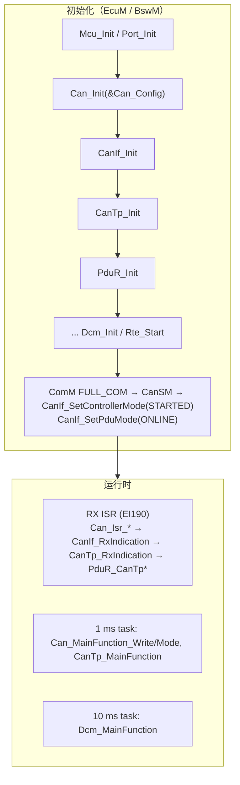
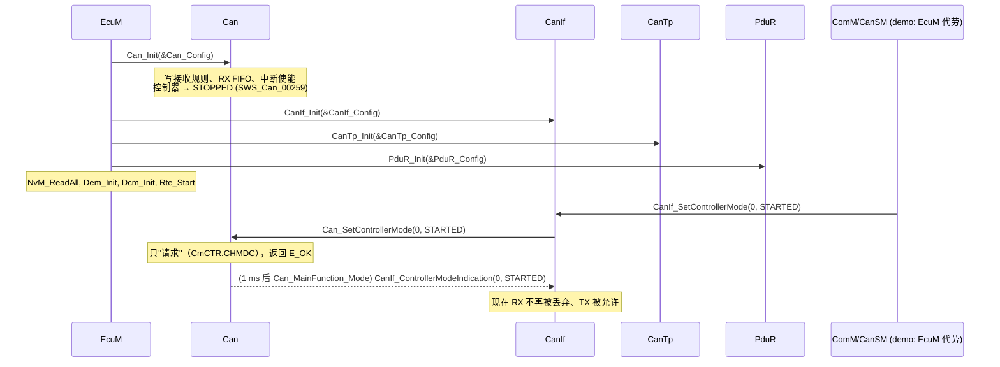
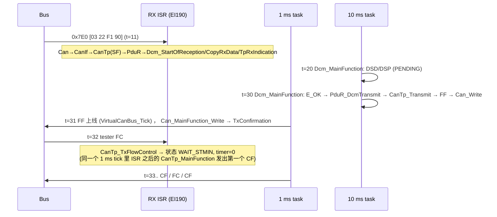

# CAN 栈集成：从"控制器能 ACK"到"PduR 把 N-SDU 交给 Dcm"

> Prerequisite: [01 配置一致性清单](01-ecu-configuration-checklist.md)、[CAN Driver 从零实现](../04-can-mcal/14-can-driver-from-scratch.md)、[CanIf](../05-can-stack/01-canif.md)、[CanTp](../05-can-stack/03-cantp.md)、[ISO-TP](../05-can-stack/04-isotp.md)、[PduR](../05-can-stack/05-pdur.md)、[ECU 启动](../02-autosar-classic/03-ecu-startup.md)
> Next: [03 DCM 集成](03-dcm-integration.md)
> 对应规范: SWS CAN **R22-11**（控制器状态机 p.36–43、`SWS_Can_00230` 异步模式切换 p.66–67、`SWS_Can_00233/00213` Can_Write 与 CAN_BUSY p.80–81、回调列表 `SWS_Can_00234` p.88、中断/轮询 p.50–51）；SWS DCM **R20-11**（TP 接口 p.243–247）。**本仓库没有 CanIf / CanTp / PduR / CanSM / ComM 的 SWS**：这些模块的 API 按公认 R4.x 形态书写（demo 源码中也标注了 "signature per R4.x convention"），真实签名以项目所用 Release 为准。
> 对应源码: 本项目 `examples/uds_diag_demo/mcal/Can.c`、`ecual/CanIf.c`、`com/CanTp.c`、`com/PduR.c`、`integration/EcuM.c`、`integration/BswScheduler.c`；openAUTOSAR `communication/CAN/CanIf/src/CanIf.c`（`:424` Transmit、`:764` RxIndication）、`communication/CAN/CanTp/src/CanTp.c`、`examples/rte_simple/rte_simple.c:37-52`

---

## 1. 本章目标

1. 按**自下而上、每层可验收**的顺序把 Can → CanIf → CanTp → PduR 接起来，并知道每一步"做完"的客观标准是什么。
2. 说清楚初始化时**谁**启动控制器、**谁**打开 PDU 通道，运行时**哪些回调在 ISR 上下文、哪些在 MainFunction 上下文**。
3. 记住 CAN 栈集成中最常见的 15 个错误，以及它们在 CANoe trace 和 ECU 断点上的表现。

---

## 2. 为什么要"分层集成"，而不是一次接完再测？

诊断请求没响应时，可疑点有十几层（见 [调试手册](../debugging-autosar-diagnostics.md)）。如果第一次上电就用 `22 F1 90` 测试，失败时你无法区分是引脚、波特率、过滤器、中断、CanIf 表、CanTp 参数还是 Dcm。**分层集成的本质是"每次只引入一个新的未知数"**：

```text
Step 0  物理层         → 示波器 / CANoe 看到 ECU ACK
Step 1  Can 发送       → CANoe 收到 ECU 发出的一帧（任意 ID）
Step 2  Can 接收       → CANoe 发一帧，ECU 进 RX ISR，CanIf_RxIndication 被调用
Step 3  CanIf 路由     → CanTp_RxIndication 收到正确的 N-PDU id
Step 4  CanTp 单帧     → PduR_CanTpStartOfReception/CopyRxData/RxIndication 依次被调用
Step 5  CanTp 多帧收   → ECU 对 FF 回 FC，收完 CF
Step 6  CanTp 多帧发   → ECU 发 FF、等到 tester 的 FC、按 STmin 发 CF
Step 7  PduR 交付      → Dcm_StartOfReception / Dcm_TpRxIndication 拿到完整请求
```

Step 7 之后才进入 [DCM 集成](03-dcm-integration.md)。

---

## 3. 在系统中的位置



[Educational Implementation] demo 中初始化全部在 `integration/EcuM.c:81-99` 一个函数里，通信启动只用一行 `CanIf_SetControllerMode(...STARTED)`（`:97`）代替了 ComM → CanSM → CanIf 整条链；运行时由 `integration/BswScheduler.c:25-57` 每 1 ms 调一次来模拟 INTC + 三个任务。

---

## 4. AUTOSAR 如何定义各层的集成接口

[AUTOSAR API] Can（SWS CAN R22-11，本地可证）：

```c
void           Can_Init(const Can_ConfigType* Config);                                   /* SWS_Can_00223 p.62 */
Std_ReturnType Can_SetControllerMode(uint8 Controller, Can_ControllerStateType Transition); /* SWS_Can_00230 p.66, Async */
Std_ReturnType Can_Write(Can_HwHandleType Hth, const Can_PduType* PduInfo);             /* SWS_Can_00233 p.80, E_OK/E_NOT_OK/CAN_BUSY */
void           Can_MainFunction_Write(void);  /* 0x01, p.84 */   void Can_MainFunction_Read(void); /* 0x08, p.85 */
void           Can_MainFunction_Mode(void);   /* 0x0c, p.87 */
/* Can 必须调用的 CanIf 回调（SWS_Can_00234 p.88）：
   CanIf_RxIndication, CanIf_TxConfirmation, CanIf_ControllerBusOff, CanIf_ControllerModeIndication */
```

[Conceptual] CanIf / CanTp / PduR（本仓库无 SWS，R4.x 公认形态，demo 使用的就是这一套）：

```c
/* CanIf (ECU Abstraction) */
void           CanIf_RxIndication(const Can_HwType* Mailbox, const PduInfoType* PduInfoPtr);   /* >= R4.2 */
void           CanIf_TxConfirmation(PduIdType CanTxPduId);
Std_ReturnType CanIf_Transmit(PduIdType TxPduId, const PduInfoType* PduInfoPtr);
Std_ReturnType CanIf_SetControllerMode(uint8 ControllerId, Can_ControllerStateType ControllerMode);
/* CanTp */
void           CanTp_RxIndication(PduIdType RxPduId, const PduInfoType* PduInfoPtr);
void           CanTp_TxConfirmation(PduIdType TxPduId, Std_ReturnType result);              /* R4.4 形态 */
Std_ReturnType CanTp_Transmit(PduIdType TxPduId, const PduInfoType* PduInfoPtr);
/* PduR <-> CanTp（下层 TP 接口），PduR <-> Dcm（上层 TP 接口与 SWS DCM p.243-247 一一对应） */
BufReq_ReturnType PduR_CanTpStartOfReception(PduIdType, const PduInfoType*, PduLengthType, PduLengthType*);
BufReq_ReturnType PduR_CanTpCopyRxData(PduIdType, const PduInfoType*, PduLengthType*);
void              PduR_CanTpRxIndication(PduIdType, Std_ReturnType);
BufReq_ReturnType PduR_CanTpCopyTxData(PduIdType, const PduInfoType*, const RetryInfoType*, PduLengthType*);
void              PduR_CanTpTxConfirmation(PduIdType, Std_ReturnType);
Std_ReturnType    PduR_DcmTransmit(PduIdType, const PduInfoType*);
```

**版本差异提醒**（集成时经常踩）：

| 接口 | R3.x（openAUTOSAR） | R4.x（demo / 现行） | 证据 |
|---|---|---|---|
| `CanIf_RxIndication` | `(Hrh, CanId, CanDlc, *CanSduPtr)` 四参数 | `(const Can_HwType*, const PduInfoType*)` | openAUTOSAR `CanIf.c:764`；研究笔记 03 §7.1 |
| CanTp → 上层 RX | `ProvideRxBuffer` 借整块 buffer | `StartOfReception` + `CopyRxData` 分段拷贝 | 研究笔记 03 §4.8；SWS DCM p.243–245 |
| `Can_SetControllerMode` 参数 | `Can_StateTransitionType`（4.3.0 移除） | `Can_ControllerStateType` | SWS CAN p.3（Change History 4.3.0） |
| `Can_Write` 返回 | `Can_ReturnType`（`CAN_OK`…） | `Std_ReturnType` + `CAN_BUSY` | SWS CAN p.59–60、p.81 |

[Real Project Consideration] 目标环境截图标称 Renesas P1M MCAL 使用 **AR 4.2.2 API**，而 BSW 栈可能是更新的 Release——**MCAL 与 BSW 的 Release 不一致很常见**，CanIf 侧通常要有适配。实际组合**需在真实项目环境中确认**（看 `Can.h` / `CanIf.h` 中的 `*_AR_RELEASE_*_VERSION` 宏）。

---

## 5. 核心数据结构（集成者要看的那部分）

| 模块 | 配置表 | 运行时状态 | demo 位置 |
|---|---|---|---|
| Can | HOH 表（id、类型、控制器、过滤、硬件 buffer） | 驱动状态、控制器状态、每个 TX 对象的 busy + `swPduHandle` | `mcal/Can_Cfg.c:16-21`；`mcal/Can.c:33-39` |
| CanIf | Rx L-PDU（CAN ID、HRH、DLC、上层回调、上层句柄）；Tx L-PDU（CAN ID、HTH、上层确认回调） | 每控制器模式、Tx 缓冲环 | `ecual/CanIf_Cfg.c:15-23`；`ecual/CanIf.c:19-23` |
| CanTp | Rx N-SDU（N-PDU、FC N-PDU、PduR 句柄、TA 类型、BS、STmin、N_Ar/N_Br/N_Cr）；Tx N-SDU | 每 N-SDU 一个状态机（IDLE/WAIT_CF/WAIT_FC/WAIT_STMIN…）+ 计时器 | `com/CanTp_Cfg.c:13-34`；`com/CanTp.c:36-60` |
| PduR | Rx 路由（Src → Dcm 句柄 + API 表）；Tx 路由（Dcm Src → CanTp N-SDU + 反查用的 lower id） | 无（纯查表） | `com/PduR_Cfg.c:12-25` |

---

## 6. 初始化流程：谁启动了控制器？



逐跳对应 demo 源码与 trace（`artifacts/uds-demo/trace.txt:5-20`）：

| 步 | 调用 | demo 位置 | trace 行 | 真实 ECU |
|---|---|---|---|---|
| 1 | `Can_Init` 把每个 RECEIVE HOH 变成一条接收规则，label = HRH | `mcal/Can.c:74-83` | 6–8 | [RH850 Hardware] GRAMINIT 等待 → global reset → GAFL 规则 → RFCCx → global operating（[09 Can_Init](../04-can-mcal/09-can-init-implementation.md)） |
| 2 | `CanIf_Init` / `CanTp_Init` / `PduR_Init` 装载配置指针、清运行时状态 | `ecual/CanIf.c:25-36`、`com/CanTp.c:570-577`、`com/PduR.c:13-18` | 10–12 | 通常由 EcuM DriverInitList 或 BswM action list 调用，**顺序需在真实项目确认** |
| 3 | 启动通信：`CanIf_SetControllerMode(STARTED)` | `integration/EcuM.c:97` | 17 | ComM 请求 FULL_COM → CanSM → CanIf（本仓库无 ComM/CanSM SWS） |
| 4 | `Can_SetControllerMode` 只写请求，返回 E_OK | `mcal/Can.c:106-136` | 18 | 写 CmCTR.CHMDC=00b；需等 CmSTS 确认、再等 COMSTS=1（11 个连续隐性位，HW-E p.810–811） |
| 5 | `Can_MainFunction_Mode` 发现状态到达 → `CanIf_ControllerModeIndication` | `mcal/Can.c:147-167` | 19–20 | `SWS_Can_00370/00372/00373`（p.39–40）：异步确认 |

**关键集成点**：在第 5 步之前到达的帧会被丢弃——demo 中 `VirtualCanBus` 在控制器未 STARTED 时直接丢帧（`sim/VirtualCanBus.c:163-167`），CanIf 也会在 `CanIf_CtrlMode != STARTED` 时丢 RX（`ecual/CanIf.c:168-170`）。真实 ECU 上，控制器不在 communication 模式时**根本不发 ACK**——如果总线上只有 tester 和这个 ECU，CANoe 会看到 ACK error / Error Frame。

[Real Project Consideration] 没有 ComM/CanSM 的"最小工程"必须有人手动调 `CanIf_SetControllerMode(STARTED)` 和 `CanIf_SetPduMode(ONLINE)`——openAUTOSAR 的 `examples/rte_simple/rte_simple.c:37-52` 就是这么做的（研究笔记 03 §6.1）。量产项目则由 BswM 规则 + ComM 用户请求驱动，**谁在什么条件下请求 FULL_COM 需在真实项目环境中确认**。

---

## 7. Runtime Flow：执行上下文

[AUTOSAR Standard] SWS CAN p.51：轮询时回调在 MainFunction 上下文，但**回调实现必须按"可能在 ISR 中被调用"来写**。这一句话决定了 CanIf、CanTp、PduR 以及 Dcm 的 TP 回调都必须短小、可在中断里跑、需要时用 SchM exclusive area 保护共享状态。

| 动作 | demo 上下文 | 真实 ECU 典型上下文 | 后果 |
|---|---|---|---|
| RX 帧 → `CanIf_RxIndication` → `CanTp_RxIndication` → `PduR_CanTp*` → `Dcm_StartOfReception/CopyRxData/TpRxIndication` | 模拟 ISR（`integration/BswScheduler.c:33-35`） | OS Cat2 ISR（EI190）或 `Can_MainFunction_Read` | 整条链在中断里；Dcm 只能"登记请求"，不能在这里处理服务（`diag/Dcm_Dsl.c:433-437`） |
| TX 完成 → `CanIf_TxConfirmation` → `CanTp_TxConfirmation` → … → `Dcm_TpTxConfirmation` | 1 ms 任务的 `Can_MainFunction_Write`（`mcal/Can.c:220-239`） | TX ISR（EI185 等）或 MainFunction | 同上 |
| CanTp 发 CF、计时 N_xx | `CanTp_MainFunction`，1 ms（`com/CanTp.c:590-660`） | CanTp 任务 | STmin 精度 = CanTp 周期 |
| Dcm 处理服务 | `Dcm_MainFunction`，10 ms | Dcm 任务（周期 = `DcmTaskTime`） | P2 精度 = Dcm 周期 |



时间戳全部来自 `artifacts/uds-demo/trace.txt:25-81`。

---

## 8. 集成步骤与验收标准

### Step 0 — 物理层

- **做什么**：上电、确认收发器在 normal mode、终端电阻（总线两端各 120 Ω，**需按实际网络拓扑确认**）。
- **验收**：CANoe 发任意一帧，ECU 回 ACK（CANoe 不报 ACK error）。注意：**ACK 只说明控制器在 communication 模式、位时序基本对，和接收过滤无关**。
- **详解**：[04 CAN 引脚与收发器](../04-can-mcal/04-can-pin-transceiver.md)、[15 Can Driver 调试 L0–L2](../04-can-mcal/15-can-driver-debugging.md)。

### Step 1 — Can 发送

- **做什么**：在 ECU 里临时调用一次 `CanIf_Transmit`（或直接 `Can_Write`）发一帧测试 ID。
- **验收**：CANoe trace 出现该帧；ECU 侧 `CanIf_TxConfirmation` 被调用（TX 中断或 `Can_MainFunction_Write`）。
- **demo 对照**：`mcal/Can.c:171-217`（`Can_Write`）→ `mcal/Can.c:220-239`（确认）。

### Step 2 — Can 接收

- **做什么**：CANoe 发 0x7E0。
- **验收**：RX ISR 进入、`CanIf_RxIndication` 的 `Mailbox->Hoh` 与配置的 HRH 一致、`CanId`=0x7E0。
- **常见卡点**：过滤规则（GAFL 掩码语义）、EI190 未开、RFE 未置位（HW-E p.845：RFE 必须在 global operating 后单独写 1）。

### Step 3 — CanIf 路由

- **验收**：`CanTp_RxIndication(RxPduId=物理请求 N-PDU)` 被调用。demo trace 第 28 行：`RxIndication HRH=0 ID=0x7E0 -> Rx L-PDU 0 (DiagPhysReq_7E0) -> CanTp_RxIndication(N-PDU 0)`。
- **常见卡点**：CAN ID / HRH 不匹配 → "no Rx L-PDU configured -> dropped"（`ecual/CanIf.c:186-187`）。

### Step 4 — CanTp 单帧

- **验收**：依次看到 `PduR_CanTpStartOfReception`（返回 `BUFREQ_OK`）、`PduR_CanTpCopyRxData`、`PduR_CanTpRxIndication(E_OK)`。demo 实现 `com/CanTp.c:183-215`。
- **常见卡点**：SF_DL 非法（寻址格式不一致时最常见）、上层拒绝（`BUFREQ_E_NOT_OK`）后 SF 被静默丢弃（`com/CanTp.c:205-208`）。

### Step 5 — CanTp 多帧接收（ECU 收长请求）

- **做什么**：发 13 字节的 `2E F1 A0 ...`。
- **验收**：ECU 在收到 FF 后发 FC CTS（BS/STmin 为配置值），收完 CF 后 `RxIndication(E_OK)`。demo trace 第 235–255 行：`FF total=13` → `send FC CTS (BS=2 STmin=5 ms)` → `CF SN=1 (13/13 bytes)` → `complete`。
- **常见卡点**：FC 的 Tx L-PDU 没配（tester N_Bs 超时）；上层 buffer 太小（FC OVFLW，`com/CanTp.c:247-251`）。

### Step 6 — CanTp 多帧发送（ECU 发长响应）

- **验收**：ECU 发 FF → 收到 tester FC → 按 BS/STmin 发 CF → `PduR_CanTpTxConfirmation(E_OK)`。demo trace 第 48–79 行。
- **常见卡点**：tester FC 进不来（FC 走的是请求 ID 0x7E0，需要那条 Rx L-PDU 也能把 FC 交给 CanTp，`com/CanTp.c:476-483`）；`Can_MainFunction_Write` 没调度导致 N_As 超时（调试手册 F10）。

### Step 7 — PduR 交付 Dcm

- **验收**：`Dcm_StartOfReception` 返回 `BUFREQ_OK`，`Dcm_TpRxIndication(E_OK)` 后 Dcm 进入"请求已收齐"状态。demo trace 第 30–33 行。
- **之后**：交给 [03 DCM 集成](03-dcm-integration.md)。

---

## 9. RH850 Hardware Mapping：每一步背后的寄存器

| Step | RS-CANFD / INTC 资源（P1M-E，Classical 接口模式） | 依据 |
|---|---|---|
| 0 | CmCTR.CHMDC=00、CmSTS.COMSTS=1；收发器引脚（板级） | HW-E p.805–811 |
| 1 | TMIDp / TMPTRp / TMDF0_p / TMDF1_p，`TMCp=0x01`（8 位写）；完成 TMSTSp.TMTRF=10b | HW-E p.878–887、p.1107–1110 |
| 2 | GAFL 规则、RFCCx（RFE/RFIE）、RFSTSx（RFEMP/RFIF/RFMC）、读 RFIDx/RFPTRx/RFDF、`RFPCTRx=0xFF`；EIC190 | HW-E p.830–848、p.1102、p.285–286 |
| 3–7 | 无（纯软件） | — |

[RH850 Hardware] demo 的 `mcal/Can.c` 在每一处"真实驱动会碰寄存器"的地方都写了 `[RH850 Hardware]` 注释（例如 `:65-73`、`:129-130`、`:208-209`、`:229-230`、`:251-254`），把 mock 换成真实驱动时逐条对照即可，详见 [04 F190 Demo §8](04-f190-vin-demo.md#8-把-can-mock-换成-rh850-rs-canfd-mcal-driver)。

---

## 10. openAUTOSAR 对照：一个"没集成"的 CAN 栈长什么样

[Educational Implementation] 研究笔记 03 §3.3 列出了 openAUTOSAR 诊断路径断开的位置，按本章步骤归类：

| Step | openAUTOSAR 问题 | path:line |
|---|---|---|
| 1–2 | 没有 Can driver（`Can_Write`、`Can_Init` 只有声明） | `include/Can.h:313-334` |
| 3 | CanIf 只路由到 PduR/Com，CMake 未开 `USE_CANTP` | `communication/CAN/CanIf/src/CanIf_Cfg.c:130-149`、`CanIf.c:868-878` |
| 3 | `CanIf_RxIndication` "unsupported filter type" 分支死循环 | `CanIf.c:820` |
| 4–6 | `CanTpRxIdList` 为 NULL；周期宏 1000 ms | `CanTp_Cfg.c:136`、`CanTp_Cfg.h:24` |
| 7 | PduR 零成本宏短路 + 重复符号 | `PduR_Cfg.h:77-130` |

它也提供了一个正面参照：CanIf 的 controller mode / PDU mode 双闸门（`CanIf.c:446-462`），这正是 demo 省略、真实项目必须有的部分。

---

## 11. 当前教学项目实现：集成相关的关键代码

```c
/* [Educational Implementation] integration/BswScheduler.c:25-57（节选）
 * 一个函数 = 1 ms：硬件 → 模拟 INTC → 1/5/10 ms 任务 */
void BswScheduler_Tick1ms(void)
{
    ...
    VirtualCanBus_Tick();                                   /* 硬件：TX buffer 上线 */
    if (VirtualCanBus_HwRxPending() && Can_IsRxInterruptEnabled()) {
        Can_Isr_GlobalRxFifo();                             /* "EI190" */
    }
    Can_MainFunction_Mode();  Can_MainFunction_Write();     /* Task_1ms */
    Can_MainFunction_Read();  CanTp_MainFunction();
    if ((now % 5u) == 0u)  { NvM_MainFunction(); }          /* Task_5ms */
    if ((now % 10u) == 0u) { Dcm_MainFunction(); Rte_Task_10ms(); }  /* Task_10ms */
    ...
}
```

真实项目中这段代码不存在于任何 BSW 文件里：它对应 **OS 配置（task + alarm/schedule table）+ RTE/SchM 生成的 task body + OS 的 ISR 包装**。见 [MainFunction 调度](../02-autosar-classic/07-mainfunction-scheduling.md)。

```c
/* [Educational Implementation] ecual/CanIf.c:115-131（节选）
 * CAN_BUSY 不是错误：CanIf 负责排队（SWS CAN p.51, p.54）*/
ret = (CanIf_TxBufCount == 0u) ? CanIf_WriteToDriver(TxPduId, PduInfoPtr->SduDataPtr, length) : CAN_BUSY;
if (ret == CAN_BUSY) {
    ... /* 放进 CanIf_TxBuf，在下一次 CanIf_TxConfirmation 里重发（:146-152）*/
    ret = E_OK;   /* accepted: CanIf owns the retry */
}
```

---

## 12. Debug 方法（集成阶段）

- **两点观测**：总线侧（CANoe trace）+ ECU 侧（断点 / trace / 计数器）。每一步只看"上一层的输出"和"本层的输入"是否一致。
- **断点清单**（按 Step）：`Can_Write` 返回值 → TX ISR / `Can_MainFunction_Write` 中的确认分支 → RX ISR 入口 → `CanIf_RxIndication` 入口与"未匹配"分支 → `CanTp_RxIndication` 的 PCI switch → `PduR_CanTpStartOfReception` 返回值 → `Dcm_StartOfReception` 返回值。
- **DET 是集成阶段最好的朋友**：开发阶段务必打开各模块 `DevErrorDetect`，并在 `Det_ReportError` / `Det_ReportRuntimeError` 上下断点。demo 的 trace 会打印 `DEVELOPMENT ERROR module=51 ...`（PduR）、`module=80`（Can）、`RUNTIME ERROR module=35`（CanTp）这样的行。
- 完整的逐层方法见 [调试手册](../debugging-autosar-diagnostics.md) 与 [07 集成调试](07-integration-debugging.md)。

---

## 13. 常见问题（CAN 栈集成 15 例）

| # | 症状 | 根因 | 在哪层发现 |
|---|---|---|---|
| 1 | CANoe 报 ACK error / Error Frame | 控制器未 STARTED、波特率/采样点错、收发器 STB | Step 0 |
| 2 | ECU 发不出任何帧 | 引脚 ALT 错、HTH 映射到 RECEIVE 对象、控制器未 STARTED | Step 1 |
| 3 | 发了一帧就不再发 | TX 完成标志没清（TMSTSp.TMTRF 未写 00b），或 `Can_MainFunction_Write` 没调度 | Step 1 |
| 4 | ECU ACK 了，但 RX ISR 不来 | 接收规则不匹配（GAFLM 语义）、RFE/RFIE 未置、EI184/EI190 搞错 | Step 2 |
| 5 | RX ISR 反复进入（中断风暴） | ISR 没清 RFIF / 没弹 FIFO（电平型中断，HW-E p.285） | Step 2 |
| 6 | CanIf 丢帧 | CAN ID 或 HRH 不匹配、DLC 检查 | Step 3 |
| 7 | CanTp 把物理请求当功能请求 | CanIf 交给 CanTp 的 N-PDU id 错 | Step 3/4 |
| 8 | SF 被忽略 | 寻址格式不一致（Normal vs Extended），SF_DL 超范围 | Step 4 |
| 9 | 长请求只收到 FF | FC 的 Tx L-PDU 未配或 CAN ID 错 | Step 5 |
| 10 | 长请求 FC OVFLW | Dcm buffer < 请求长度 | Step 5 |
| 11 | 长响应停在 FF | tester FC 进不了 CanTp（FC N-PDU 映射）；或 tester 根本没收到 FF（响应 ID 错） | Step 6 |
| 12 | CF 间隔不符合 STmin | CanTp MainFunction 周期 > STmin，或周期宏与实际不符 | Step 6 |
| 13 | 偶发丢 TX 帧 | CanIf Tx 缓冲深度不够，`CAN_BUSY` 时被丢 | Step 1/6 |
| 14 | 一切正常但 Dcm 没收到 | PduR 路由 Src/Dest 句柄不一致 | Step 7 |
| 15 | 换了 MCAL 版本后编译通过、运行时 RX 参数错乱 | `CanIf_RxIndication` 签名/类型版本不一致（4 参数 vs `Can_HwType*`），适配层未更新 | Step 2/3 |

---

## 14. 实验

1. 在 demo 副本中按 [调试手册 §7](../debugging-autosar-diagnostics.md#7-故障注入练习) 做 F1、F2、F3、F10，把每一个故障对应到本章的 Step 编号。
2. 把 `integration/main_demo.c:47` 的 `Sim_PowerOn(1u, 2u)` 改成 `Sim_PowerOn(0u, 20u)`（tester BS=0、STmin=20 ms），比较 VIN 响应 CF 的时间间隔与 FC 数量（README §8 也有此实验）。
3. 思考：如果把 `Can_MainFunction_Write` 放在 10 ms 任务里，`22 F1 90` 的 20 字节响应最少需要多少毫秒？（提示：每个 CF 都要等一次 TX 确认才会进入 STmin 计时，`com/CanTp.c:501-560`。）

---

## 15. 对未来真实项目的意义

[Real Project Consideration]

1. 真实项目里你很可能**不需要从零集成** CAN 栈，但会遇到"改了一个配置/升级了一个模块后某层断了"。本章的 Step 0–7 就是回归时的验收阶梯：每升级一次 MCAL/BSW，按这个顺序复测。
2. 找到真实项目中 §6 那条"谁启动控制器"的链：ComM 用户、BswM 规则、CanSM 状态机。**这是"上电后诊断不通"排名第一的原因**，而它不在 Can/CanIf 的配置页里。
3. 找到 RX/TX 的实际处理方式（INTERRUPT / POLLING / MIXED）和对应的 OS ISR、任务——写进你的项目"诊断链路地图"（见 [09-real-project-preparation/05](../09-real-project-preparation/05-how-to-trace-can-signal.md)）。
4. 记录 MCAL 与 BSW 各自的 AR Release，CanIf 的回调签名是两者的接缝。

---

## 16. 本章总结

- CAN 栈集成按 Step 0–7 自下而上进行，每一步有客观验收（ACK → TX → RX ISR → CanIf → CanTp SF → 多帧收 → 多帧发 → Dcm 拿到请求）。
- 控制器由 ComM/CanSM 经 CanIf 异步启动；启动完成前的帧会被硬件或 CanIf 丢弃。
- RX 链路整段在 ISR 上下文，TX 确认链路在 ISR 或 MainFunction；所有 TP 回调都必须按"可能在中断中"编写。
- MCAL 与 BSW 的 Release 不一致时，CanIf 回调签名是第一个要核对的接缝。

## 17. 下一章

请求已经完整交到 Dcm 手里了。[03 DCM 集成](03-dcm-integration.md) 讲 Dcm 还依赖哪些模块（ComM、Dem、NvM、BswM、RTE、OS），以及为什么"收到了但不回"往往不是 Dcm 本身的错。
