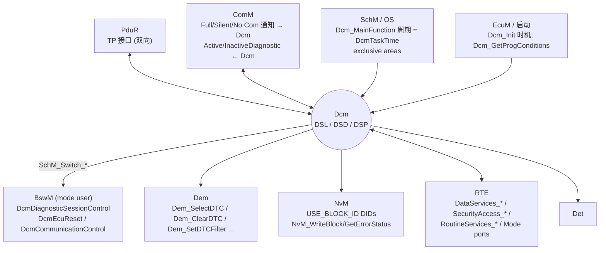
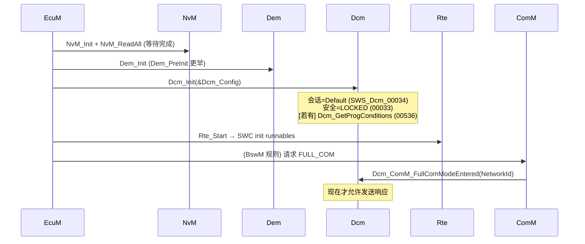
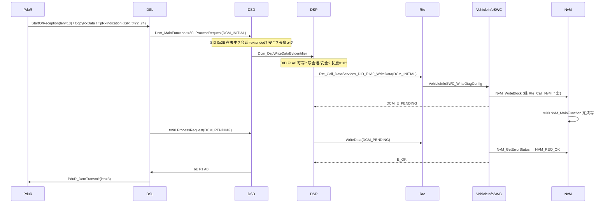

# DCM 集成：Dcm 依赖的每一个模块，以及"收到了却不回"的根因

> Prerequisite: [02 CAN 栈集成](02-can-stack-integration.md)、[DCM 总览](../06-dcm/01-dcm-overview.md)、[DSL](../06-dcm/02-dsl.md)、[DSD](../06-dcm/03-dsd.md)、[DSP](../06-dcm/04-dsp.md)、[DCM 配置](../06-dcm/05-dcm-configuration.md)、[DCM MainFunction](../06-dcm/12-dcm-mainfunction.md)、[DCM ↔ RTE 集成](../07-rte-swc/08-dcm-rte-integration.md)
> Next: [04 F190 VIN Demo](04-f190-vin-demo.md)
> 对应规范: SWS DCM **R20-11**：依赖概览 p.30–31；TP 接口 `SWS_Dcm_00094/00556/00093/00092/00351` p.243–247；`Dcm_Init` `00037` p.236；`Dcm_MainFunction` `00053` p.260–261；`DcmTaskTime` `ECUC_Dcm_00820` p.678；ComM 交互 `00148–00162` p.85–86、`01142/01143` p.85、`Dcm_ComM_*ComModeEntered` `00356/00358/00360` p.248–249、`ComM_DCM_ActiveDiagnostic` `01373–01378` p.87–88；BswM / Mode `00775` p.104、`00311` p.114、`00594` p.115；Dem client `01369` p.82；NvM `00541` p.175–176；RTE 端口 p.335–415。**本仓库没有 ComM / BswM / Dem / NvM / Rte / SchM 的 SWS**——这些模块一侧的 API 只引用 DCM SWS 中"作为调用方/被调用方"出现的形态。
> 对应源码: 本项目 `examples/uds_diag_demo/diag/`、`rte/`、`swc/`、`integration/`；openAUTOSAR `diagnostic/Dcm/src/Dcm.c`、`Dcm_Dsl.c:835`（`USE_COMM` 时调 ComM）、`system/EcuM/src/EcuM_Callout_Stubs.c:360`（`Dcm_Init`）

---

## 1. 本章目标

1. 画出 Dcm 的**集成依赖图**，说出每条依赖的方向、调用 API、在什么时机发生。
2. 把 Dcm 集成进 ECU 的步骤与验收标准：初始化位置、MainFunction 任务、PduR 句柄、协议/连接、ComM、Dem、NvM、BswM、RTE 端口。
3. 解释"Dcm 收到了请求但不回"的五类根因（ComM 未 Full Com、Dcm 未调度、DSD 抑制、SWC 不返回、TX 链路断）。
4. 按一个"由简到难"的服务阶梯验收 Dcm 集成：`3E 00 → 10 01 → 22 F187（同步）→ 22 F190（异步）→ 10 03 → 27 → 2E → 31 → 11`。

---

## 2. 为什么 Dcm 集成比 CAN 栈集成更容易"看起来没问题"？

CAN 栈出错通常是"什么都没有"；Dcm 出错则常常是"**一部分**对"：能回 `7E 00`，但 `22 F1 90` 不回；默认会话下一切正常，进 extended 后一段时间就失效；单独测试能过，整车休眠唤醒后不回。原因是 Dcm 在 SWS 里明确依赖一串其他模块（DCM R20-11 p.30–31）：

> DEM（故障存储）、PduR（收发）、ComM（通信模式与 active/inactive diagnostic）、SW-C/RTE（数据、例程、IO 控制、安全算法）、BswM（应用更新、通信模式变化、复位/会话模式）、Csm、KeyM（0x29）、NvM、IoHwAb。

这些依赖中**任何一个没接好，Dcm 本身的代码都"正确"地执行着规范行为**——例如 No Com 状态下不发响应（`SWS_Dcm_00148`），这是规范要求，不是 bug。

---

## 3. 在系统中的位置：Dcm 依赖图



| 依赖 | 方向 / API（DCM R20-11 中出现的形态） | 时机 | 没接好的症状 | demo |
|---|---|---|---|---|
| PduR | PduR→Dcm：`Dcm_StartOfReception/CopyRxData/TpRxIndication/CopyTxData/TpTxConfirmation`（p.243–247）；Dcm→PduR：`PduR_DcmTransmit` | 每个请求/响应，可能在 ISR | 收不到 / 发不出 | `diag/Dcm_Dsl.c:309-497`、`com/PduR.c:67-129` |
| ComM | ComM→Dcm：`Dcm_ComM_NoComModeEntered/SilentComModeEntered/FullComModeEntered`（`00356/00358/00360` p.248–249）；Dcm→ComM：`ComM_DCM_ActiveDiagnostic/InactiveDiagnostic`（必需，`SWS_Dcm_91001` p.261） | 通信模式变化；收到请求、进入/离开非默认会话 | **收到不回**（No/Silent Com 禁发，`00148–00156`）；ECU 诊断中途休眠 | demo 无 ComM（Dcm 永远可发） |
| BswM / Mode | Dcm 作为 mode manager：`SchM_Switch_<bsnp>_DcmDiagnosticSessionControl`、`DcmEcuReset`…（`00775` p.104） | 0x10 正响应确认后（`00311`）；0x11 前后（`00373/00594`）；S3 超时 | 0x11 回了 `51 01` 不复位；会话相关的应用行为不切换 | `rte/Rte_Dcm.c:134-155` |
| Dem | `Dem_SelectDTC`、`Dem_ClearDTC(ClientId)`、`Dem_SetDTCFilter`…，Client 由 `DcmDemClientRef` 指定（`01369` p.82） | 0x14 / 0x19 / 0x85 | 0x14/0x19 全部 NRC | `diag/Dcm_Dsp.c:170-258`、`diag/Dem.c` |
| NvM | `USE_BLOCK_ID`：`NvM_ReadBlock`（`00560`）、`NvM_SetBlockLockStatus/WriteBlock/GetErrorStatus`（`00541`）；取消时 `NvM_CancelJobs`（`01048`） | 0x22/0x2E 访问 NvM 块 | 0x2E 回 0x72；写入不持久 | demo 由 SWC 调 NvM（`swc/VehicleInfoSWC.c:114-142`） |
| RTE / SW-C | `Rte_Call_DataServices_<Data>_ReadData` 等（p.335–415），签名由 `DcmDspDataUsePort` 决定（p.537–539） | DSP 处理时，在 `Dcm_MainFunction` 上下文 | 0x22 回 0x22/0x10；链接失败 | `rte/Rte_Dcm.c:54-130` |
| SchM / OS | 周期调用 `Dcm_MainFunction`（`00053`）；exclusive area 保护 TP 回调与 MainFunction 共享的状态 | 每 `DcmTaskTime` | 请求收齐但永不处理；P2/S3 错位 | `integration/BswScheduler.c:49-52` |
| EcuM | `Dcm_Init(ConfigPtr)`（`00037` p.236）；bootloader 场景 `Dcm_GetProgConditions`（`00536` p.221） | 启动 | Dcm 未初始化 → DET `DCM_E_UNINIT`，TP 回调返回 `BUFREQ_E_NOT_OK` | `integration/EcuM.c:93` |

完整的、面向升级的依赖分析见 [DCM 升级指南 §9](../dcm-upgrade-guide.md#9-如何分析-integration-dependencies)。

---

## 4. AUTOSAR 如何定义 Dcm 的集成边界

### 4.1 Dcm 只认 PduR

[AUTOSAR Standard] DCM 位于 Service Layer，**网络无关**：网络细节由 PduR 以下处理，DCM 只与 PduR 交互（DCM R20-11 p.23）。所以 Dcm 集成时不需要知道 CAN ID、CanTp 参数——它只关心 `DcmDslProtocolRxPduRef / TxPduRef` 指向的 PDU，以及 PduR 用哪个数字句柄调用它。

### 4.2 Dcm 不在 ISR 里处理服务

[AUTOSAR Standard] TP 回调"可能在中断上下文调用"（p.243–247 各 API 表）。Dcm 在 `Dcm_TpRxIndication` 里只登记"请求完整"，DSD/DSP 在下一个 `Dcm_MainFunction` 中运行。这意味着：

- **从请求收齐到开始处理，最多延迟一个 `DcmTaskTime`**（demo：11 ms 收齐，20 ms 处理，`artifacts/uds-demo/trace.txt:33-34`）；
- P2 计时在请求收齐时就开始（demo `diag/Dcm_Dsl.c:433`），所以 `DcmTaskTime` 和 `DcmTimStrP2ServerAdjust` 一起决定了 P2 余量。

### 4.3 Dcm 的发送受 ComM 门控

[AUTOSAR Standard] 规范要求：

- No Com 模式下禁止收发、不得调用 `PduR_DcmTransmit`（`SWS_Dcm_00148–00152`，p.85–86）；
- Silent Com 下禁止发送（`00153–00156`）；
- 发送响应前必须等待 Full Com，最多等到 P2ServerMax（`01142` p.85）。

[Real Project Consideration] 这条链在量产 ECU 里是：**BswM/EcuM 让 ComM 进入 FULL_COM → ComM 通知 Dcm `Dcm_ComM_FullComModeEntered(NetworkId)`**。只要 `DcmDslProtocolComMChannelRef` 引用的通道和 ComM 通知的 NetworkId 不一致，或者 ComM 从未进入 FULL_COM，Dcm 就会"收到请求、跑完服务、但不发"。在调试器里你会看到 DSD/DSP 正常执行、`PduR_DcmTransmit` 却从未被调用。**这是"CANoe 发了没响应"在 Dcm 层面的头号嫌疑**。demo 没有 ComM，所以这一项无法在 demo 中复现——这正是 demo 与真实项目的重要差异之一。

### 4.4 Dcm 与 BswM 通过"模式"而不是"函数调用"交互

[AUTOSAR Standard] R20-11 中会话/复位的通知通过 ModeDeclarationGroup（`SchM_Switch_<bsnp>_DcmDiagnosticSessionControl`、`DcmEcuReset` 等）完成，BswM 作为 mode user 订阅（`00775` p.104）；**R20-11 DCM SWS 中检索不到 `BswM_Dcm_RequestSessionMode`**（研究笔记 02 §3.11）。若真实项目代码里出现该 API，说明其基线早于 R20-11，**需在真实项目环境中确认**。

---

## 5. 核心数据结构：Dcm 集成者要盯的配置

| 配置 | 作用 | demo | 真实项目（R20-11 ECUC） |
|---|---|---|---|
| `DcmTaskTime` | MainFunction 周期，所有计时的单位 | `diag/Dcm_Cfg.h:20`（10 ms） | `ECUC_Dcm_00820` p.678 |
| `DcmDslBufferSize` | Rx/Tx 缓冲 | `diag/Dcm_Cfg.h:24`（128） | `00738` p.459 |
| `DcmDslProtocolRow` | 协议（UDS_ON_CAN）、优先级、SID 表、P2 adjust、Dem client | 单协议隐含 | p.463–468 |
| `DcmDslConnection` → `DcmDslProtocolRx/Tx` | 物理/功能 Rx PDU、Tx PDU、ComM 通道 | `diag/Dcm_Cfg.h:31-33` | `00710/00770/00772/00952` p.473–478 |
| `DcmDsdServiceTable` | SID → 处理函数 + 会话/安全 | `diag/Dcm_Cfg.c:114-125` | p.448–454 |
| `DcmDspSessionRow` | 会话 + P2/P2* | `diag/Dcm_Cfg.c:19-23` | p.654–656 |
| `DcmDspSecurityRow` | 安全级、seed/key、尝试次数、延时、端口 | `diag/Dcm_Cfg.c:26-30` | p.647–652 |
| `DcmDspDid` / `DcmDspData` | DID → 数据 → UsePort → RTE 端口 | `diag/Dcm_Cfg.c:33-49` | p.509–540 |
| `DcmDspRoutine` | RID → RoutineServices 端口 | `diag/Dcm_Cfg.c:87-90` | p.606–621 |

运行时状态（集成调试时要看的）：

| 状态 | demo 变量 | 含义 |
|---|---|---|
| DSL 请求状态 | `Dcm_Dsl.state`（`diag/Dcm_Dsl.c:36-42`：IDLE/RECEIVING/REQ_RECEIVED/PROCESSING/TRANSMITTING） | 一次请求走到哪了 |
| 当前会话 / 安全级 | `Dcm_Dsl.sessionRow`、`Dcm_Dsl.secLevel` | 决定 DSD 的 0x7F/0x33 |
| P2 / S3 计时 | `Dcm_Dsl.p2TimerMs`、`s3TimerMs`、`s3Running` | 0x78 何时发、何时掉回默认会话 |
| 0x78 计数 | `Dcm_Dsl.respPendCount` | 是否接近 `DcmDslDiagRespMaxNumRespPend` |
| 当前服务 | `Dcm_DsdActiveService`（`diag/Dcm_Dsd.c:30`） | DSP 是否仍在 PENDING |

[Real Project Consideration] 商业 Dcm 的这些状态变量名各不相同（SWS p.50 明确说 DSL/DSD/DSP 的划分不强制），但**语义上一定存在等价物**。读真实 Dcm 时先把这张表填满，见 [09/03 如何阅读 DCM](../09-real-project-preparation/03-how-to-read-dcm.md)。

---

## 6. 初始化流程



| 约束 | 原因 | demo |
|---|---|---|
| PduR/CanTp 在 Dcm 之前初始化 | Dcm 初始化后随时可能被 TP 回调调用 | `integration/EcuM.c:87-93` |
| NvM_ReadAll 完成后再初始化依赖 NV 数据的模块 | Dem 的事件存储、安全尝试计数器（`Xxx_GetSecurityAttemptCounter`，`01154` p.74）、SWC 的 RAM 镜像 | `integration/EcuM.c:90-93`；`swc/VehicleInfoSWC.c:54-60` |
| Dem 在 Dcm 之前 | Dcm 的 0x14/0x19 直接调用 Dem | `integration/EcuM.c:92-93` |
| Rte_Start 在 BSW 初始化之后 | SWC init runnable 可能调用 BSW（demo：`Rte_Call_NvM_DiagConfig_ReadBlock`） | `integration/EcuM.c:94` |
| 通信最后启动 | 所有接收方准备好再让帧进来 | `integration/EcuM.c:95-97` |

[Real Project Consideration] 真实项目中这些调用分布在 EcuM DriverInitList（One/Two/Three）、BswM 的初始化 action list、OS 启动任务中，**具体位置需在真实项目环境中确认**；openAUTOSAR 的一种做法见 `system/EcuM/src/EcuM_Callout_Stubs.c:266-376`（`Dcm_Init` 在 `:360`，排在 PduR、Com 之后），参照 [ECU 启动](../02-autosar-classic/03-ecu-startup.md)。

---

## 7. Runtime Flow：一次请求中 Dcm 与其他模块的交互点

以 demo 中的 `2E F1 A0 <10 字节>`（需要 extended 会话 + level 1 安全 + NvM 异步写）为例，这是 Dcm 依赖最多的一个服务（trace 第 233–284 行）：



对应源码：DSD 检查 `diag/Dcm_Dsd.c:77-142`；DSP `diag/Dcm_Dsp.c:487-535`；RTE `rte/Rte_Dcm.c:76-85`；SWC `swc/VehicleInfoSWC.c:114-142`；NvM 宏 `rte/Rte_VehicleInfoSWC.h:42-47`。

[Educational Implementation] 注意 demo 的选择：0x2E 的 NvM 访问由 **SWC** 完成（`USE_DATA_ASYNCH_CLIENT_SERVER` 风格），而不是 Dcm 直接调 NvM（`USE_BLOCK_ID`，`SWS_Dcm_00541`）。两种都是规范允许的配置；真实项目用哪种**需在真实项目环境中确认**，它决定了"NvM 写失败"时 NRC 由谁产生（Dcm 固定回 0x72，SWC 方式由 SWC 的 ErrorCode 决定）。

---

## 8. RH850 Hardware Mapping

Dcm 本身不访问硬件。它与 RH850 的关系只有三处：

| 关系 | RH850 落点 | 说明 |
|---|---|---|
| `Dcm_MainFunction` 的周期 | OS 计数器的硬件时基（P1M-E 常用 OSTM0/1，EI74/75，PCLK 80 MHz，HW-E p.1542–1544） | 哪个 OSTM 归 OS、哪个归 Gpt 是**配置选择，不是硬件事实**，需在真实项目确认 |
| TP 回调的执行上下文 | RS-CANFD RX ISR（EI190）→ OS Cat2 ISR | Dcm 的 TP 回调与 MainFunction 共享状态 → 需要 SchM exclusive area（在 RH850 上通常由 OS 用 PSW.ID 或 PMR 实现，HW-E p.198、p.211） |
| 0x11 ECUReset 的最终动作 | BswM → `Mcu_PerformReset` → 软件复位寄存器 | [RH850 Hardware] P1M-E：SWSRESA0 / SWARESA0；复位原因 RESF `0xFFF8_1000`（HW-E p.420–422）；复位后 `Mcu_GetResetReason` 映射由 MCAL 决定，需确认 |

---

## 9. openAUTOSAR 实现：一个"Dcm 没集成"的样本

| 集成项 | openAUTOSAR 状态 | path:line |
|---|---|---|
| Dcm 配置实例 | `DCM_Config` 只有 extern，无定义 | `diagnostic/Dcm/include/Dcm_Lcfg.h:641` |
| 服务编译开关 | `DCM_USE_SERVICE_*` 全仓无人定义 → 全部 0x11 | `diagnostic/Dcm/src/Dcm_Dsd.c:86-235` |
| Dem 依赖 | CMake 未定义 `USE_DEM` → 0x14/0x19 被编译掉 | `diagnostic/Dcm/CMakeLists.txt`（研究笔记 03 §1.2） |
| 调度 | SchM 未定义 `USE_DCM` → `Dcm_MainFunction` 从未被调用 | `system/SchM/src/SchM.c:175-179` |
| 周期一致性 | Dcm 假设 10 ms，SchM 实际约 25 ms | `diagnostic/Dcm/include/Dcm_Cfg.h:46`、`system/SchM/include/SchM_cfg.h:27` |
| ComM | 仅在 `USE_COMM` 时调用 `ComM_DCM_ActiveDiagnostic` | `diagnostic/Dcm/src/Dcm_Dsl.c:835` |
| 应用接口 | 只有配置中的 C 函数指针，`DspDidUsePort` 是死字段，`Rte_Dcm.h` 为空 | `diagnostic/Dcm/include/Dcm_Lcfg.h:174-181`；研究笔记 03 §4.4 |
| 复位 callout | `DcmE_EcuReset/DcmE_EcuPerformReset` 只有声明，需集成者实现 | `diagnostic/Dcm/include/Dcm.h:108-110` |

它的正面价值：0x11 "先发正响应、Tx 确认后再复位"的时序（`Dcm_Dsp.c:1968-1990`）是对的，和 R20-11 `SWS_Dcm_00594` 一致。

---

## 10. 当前教学项目实现：Dcm 集成点逐一对照

| 集成点 | demo 实现 | 真实项目中的等价物 |
|---|---|---|
| 初始化 | `integration/EcuM.c:93` `Dcm_Init(&Dcm_Config)` | EcuM/BswM 初始化列表中的 `Dcm_Init(<generated config ptr>)` |
| 调度 | `integration/BswScheduler.c:49-52` 每 10 ms | OS 任务 body（RTE/SchM 生成）中的 `Dcm_MainFunction()` |
| PduR ↔ Dcm | `com/PduR_Cfg.c:12-25` API 表 + 句柄 | `PduR_PBcfg.c` 路由表；`PduR_Dcm.h` |
| ComM | 无（Dcm 永远可发） | ComM 通道 + `Dcm_ComM_*` 通知 |
| BswM | `rte/Rte_Dcm.c:146-155` 内联"BswM role" | BswM 规则：`DcmEcuReset == EXECUTE` → action list |
| Dem | `diag/Dem.c` 固定 3 个 DTC 的 stub | 完整 Dem + Dem client 配置 |
| NvM | `mem/NvM.c` RAM 数组模拟 | NvM → MemIf → Fee → Fls |
| RTE | `rte/Rte_Dcm.c` 直接函数调用 | 生成的 `Rte.c` / `Rte_Dcm.h`（可能是宏、可能跨分区） |
| Det | `general/Det.c` 打印并计数 | Det + 项目的错误钩子 |

---

## 11. Code Walkthrough：Dcm 的"集成接缝"在 demo 中的样子

### 11.1 TP 回调只登记，不处理

```c
/* [Educational Implementation] diag/Dcm_Dsl.c:419-437（节选） — Dcm_TpRxIndication */
ctx->idContext = Dcm_DslRxBuffer[0];                 /* SID */
ctx->reqData = &Dcm_DslRxBuffer[1];
...
Dcm_Dsl.p2TimerMs = (sint32)row->p2ServerMaxMs - (sint32)DCM_TIM_P2_SERVER_ADJUST_MS;  /* P2 从这里开始算 */
Dcm_Dsl.state = DCM_DSL_REQ_RECEIVED;               /* DSD 在下一个 Dcm_MainFunction 中运行 */
```

### 11.2 MainFunction 是 Dcm 的"心跳"

```c
/* [Educational Implementation] diag/Dcm_Dsl.c:254-261（节选） */
if (Dcm_Dsl.state == DCM_DSL_REQ_RECEIVED) {
    Dcm_Dsl.state = DCM_DSL_PROCESSING;
    res = Dcm_DsdProcessRequest(DCM_INITIAL, &Dcm_Dsl.msgContext, Dcm_DslTxBuffer, &txLen);
    ...
} else if ((Dcm_Dsl.state == DCM_DSL_PROCESSING) && !Dcm_Dsl.finalWaiting) {
    res = Dcm_DsdProcessRequest(DCM_PENDING, ...);   /* SWS_Dcm_00530 */
```

如果 OS 没有调度 `Dcm_MainFunction`，状态会永远停在 `DCM_DSL_REQ_RECEIVED`——调试手册 F6 实验就是这个现象。

### 11.3 会话切换与复位都在 TX 确认之后

```c
/* [Educational Implementation] diag/Dcm_Dsl.c:163-180（节选） — Dcm_DslFinishRequest，由 Dcm_TpTxConfirmation 调用 */
if (Dcm_Dsl.pendingSessionRow != DCM_SESSION_ROW_INVALID) {
    ... if (responseOk) { Dcm_DslSetSession(row, "0x10 response confirmed"); }   /* SWS_Dcm_00311 */
}
if (Dcm_Dsl.resetPending) {
    ... if (responseOk) { SchM_Switch_Dcm_DcmEcuReset(RTE_MODE_DcmEcuReset_EXECUTE); }  /* SWS_Dcm_00594 */
}
```

集成含义：如果 **TX 确认链路断了**（例如 `Can_MainFunction_Write` 没调度、PduR 的 Tx 反查句柄错），0x10 会回 `50 03 ...` 但会话不切换，0x11 会回 `51 01` 但不复位——"有响应但行为不对"的典型来源。

---

## 12. Debug 方法：Dcm 集成验收阶梯

按依赖从少到多排列，每一级只新增一种依赖：

| 级 | 请求 | demo 期望响应 | 新增验证的依赖 | 失败先查 |
|---|---|---|---|---|
| 1 | `3E 00` | `7E 00` | PduR ↔ Dcm 句柄、`Dcm_MainFunction` 调度、ComM Full Com、TX 链路 | DSL 状态、`PduR_DcmTransmit` 是否调用 |
| 2 | `10 01` | `50 01 00 32 01 F4` | 会话表、P2/P2* 回报 | `DcmDspSessionRow` |
| 3 | `22 F1 87` | `62 F1 87 53 57 30 31 30 32 30 33` | DID 表 + **同步** RTE 端口 + 多帧发送 | DID 配置、`Rte_Call_*` |
| 4 | `22 F1 90` | `62 F1 90` + 17 字节 VIN | **异步**端口、`DCM_E_PENDING` 重入 | OpStatus 序列 |
| 5 | `10 03` | `50 03 00 32 01 F4` | 会话切换在 TX 确认后 + BswM 模式通知 | `Dcm_TpTxConfirmation` 是否到达 |
| 6 | `27 01` / `27 02 <key>` | `67 01 <seed>` / `67 02` | SecurityAccess 端口、尝试计数/延时 | `DcmDspSecurityRow` |
| 7 | `2E F1 A0 <10>` | `6E F1 A0` | 多帧接收 + 写权限 + NvM 异步 | 安全级、NvM 作业状态 |
| 8 | `31 01 FF 00` / `31 03 FF 00` | `71 01 FF 00` / `71 03 FF 00 02` | RoutineServices 端口 + SWC 周期 runnable | RTE 映射 |
| 9 | `19 02 FF` / `14 FF FF FF` | `59 02 7F ...` / `54` | Dem client | `DcmDemClientRef` |
| 10 | `11 01` | `51 01` 然后复位 | BswM / EcuM / Mcu 复位链 | `DcmEcuReset` 模式用户 |

期望响应全部来自 `artifacts/uds-demo/trace.txt` 与 `examples/uds_diag_demo/tests/test_uds_demo.c`，可直接改写成 CANoe 测试，见 [06 CANoe 测试](06-canoe-test.md)。

---

## 13. 常见问题："收到了却不回"的五类根因

| 类 | 现象（ECU 侧） | 根因 | 怎么确认 |
|---|---|---|---|
| A 未调度 | `Dcm_TpRxIndication(E_OK)` 之后什么都没有 | `Dcm_MainFunction` 未在任何任务中、任务未激活、或 `Dcm_Init` 失败 | 断点 `Dcm_MainFunction`；看 OS 任务状态 |
| B 被抑制 | DSD 执行了，`PduR_DcmTransmit` 未调用 | 功能寻址下的 0x11/0x12/0x31/0x7E/0x7F（`SWS_Dcm_00001` p.101）；SPRMIB=1 的正响应（`00200`）；`DcmRespondAllRequest=FALSE` 时 0x40–0x7F/0xC0–0xFF 的 SID（`00084` p.92） | 看请求的寻址方式和子功能 bit7 |
| C 通信模式 | DSD/DSP 正常，`PduR_DcmTransmit` 未调用 | ComM 未通知 Full Com / NetworkId 不匹配（`00148–00156`） | 断点 `Dcm_ComM_*ComModeEntered` |
| D SWC 不返回 | 一直 `DCM_E_PENDING`，tester 看到一串 `7F xx 78` 后 `7F xx 10` | 异步 server runnable 未被执行、或业务逻辑永远等待 | 断点 `Rte_Call_*` 与 runnable；看 `respPendCount` |
| E TX 链路断 | `PduR_DcmTransmit` 返回 E_OK，但 tester 没收到；`Dcm_TpTxConfirmation(E_NOT_OK)` | CanTp N_As/N_Bs 超时、HTH 错、Tx CAN ID 错、`Can_MainFunction_Write` 未调度 | 回到 [02 CAN 栈集成](02-can-stack-integration.md) Step 1/6 |

---

## 14. 实验

1. 在 demo 中按 §12 的阶梯顺序运行请求（`integration/main_demo.c` 就是这个顺序的变体），对照 trace 指出每一级新增了哪一跳。
2. 调试手册 F6（注释掉 `Dcm_MainFunction`）对应本章 A 类；F8/F10 对应 E 类。思考：如何在 demo 里模拟 C 类？（提示：在 `diag/Dcm_Dsl.c:187-204` 的 `Dcm_DslTransmitFinal` 前加一个"ComM 未 Full Com 则直接返回"的门控，这正是 `SWS_Dcm_00148` 要求真实 Dcm 做的事。）
3. 把 `VehicleInfoSWC_SetVinPendingCycles(255)`、`DCM_DSL_MAX_NUM_RESP_PEND` 改为 2，观察 D 类的总线表现（README §8 第 3 个实验）。

---

## 15. 对未来真实项目的意义

[Real Project Consideration] 进入真实 RTA-CAR 项目（版本**需在真实项目环境中确认**）后：

1. 用 §3 的依赖表逐行找到真实项目中的实现位置：`Dcm_Init` 在哪个初始化列表、`Dcm_MainFunction` 在哪个任务、ComM 通道是哪个、BswM 里有哪些 `Dcm*` 模式的规则、DID 走 RTE 端口还是 C callout。
2. 把 §12 的阶梯作为 Dcm 升级前后的**冒烟测试**（每级都在 CANoe 中录一份"黄金 trace"）。
3. 遇到"收到不回"，先按 §13 的 A–E 分类，再进入 [调试手册](../debugging-autosar-diagnostics.md) 的对应层。

---

## 16. 本章总结

- Dcm 只与 PduR 交换数据，但它的行为受 ComM（能否发送）、OS（是否被调度）、BswM（模式后果）、Dem/NvM/RTE（服务数据）共同决定。
- Dcm 在 TP 回调中只登记请求，在 `Dcm_MainFunction` 中处理；会话切换和复位在 TX 确认之后执行。
- "收到了却不回"可分为未调度、被抑制、通信模式、SWC 不返回、TX 链路断五类。

## 17. 下一章

[04 F190 VIN Demo](04-f190-vin-demo.md) 把前三章串起来，在 PC 上完整运行一次 `22 F1 90`，逐行解释 trace，并给出把 Can mock 替换成 RH850 RS-CANFD 驱动的步骤。
