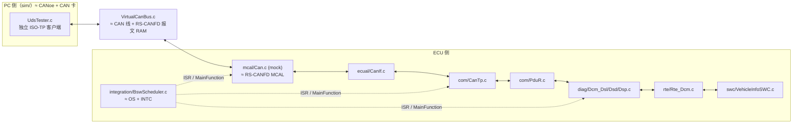
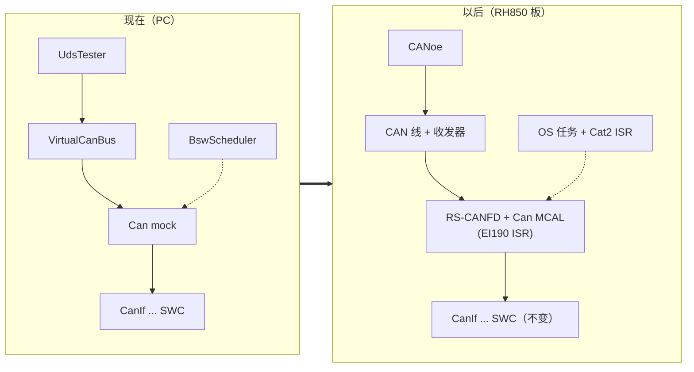

# F190 VIN Demo：在 PC 上跑通 `22 F1 90`，逐行读懂 trace，再换成 RH850 驱动

> Prerequisite: [03 DCM 集成](03-dcm-integration.md)、[demo README](../../examples/uds_diag_demo/README.md)、[DID](../06-dcm/08-did.md)、[SWC/RTE 教程](../autosar-swc-rte-tutorial.md)
> Next: [05 UDS 端到端](05-uds-end-to-end.md)
> 对应规范: SWS DCM **R20-11**（0x22 `SWS_Dcm_01335/00438/00433–00437` p.135–141；OpStatus `00984` p.301、`00527/00530` p.81；TP 接口 p.243–247；`Xxx_ReadData` 异步原型 `91006` p.269–270）；SWS CAN **R22-11**（`Can_Write` `00233` p.80–81、`CanIf_RxIndication` 参数 `00279` p.48、`Can_HwType` `SWS_CAN_00496` p.59）；HW-E R01UH0585EJ0120 Rev.1.20（RS-CANFD §17、EI190 p.285–286）
> 对应源码: 本项目 `examples/uds_diag_demo/`（全部）、`tools/run_uds_demo.py`、`artifacts/uds-demo/trace.txt`、`artifacts/uds-demo/results.txt`；替换目标：[04-can-mcal/14 从零写 RS-CANFD 驱动](../04-can-mcal/14-can-driver-from-scratch.md)

---

## 1. 本章目标

1. 在本机运行 Phase 5 demo，得到 12/12 测试通过和约 825 行的分层 trace。
2. 对 trace 中 `22 F1 90` 那一段（`artifacts/uds-demo/trace.txt:23-82`）的**每一行**说出：是哪个函数在哪一行打印的、对应真实 AUTOSAR 的哪一跳、在 RH850 上对应什么硬件动作。
3. 解释这次请求的时间线：为什么 11 ms 收到、20 ms 才处理、30 ms 才响应、35 ms 结束。
4. 列出 demo 每个组件在真实 ECU 中的对应物，并按步骤把 Can mock 替换成 RH850 RS-CANFD MCAL 驱动。

---

## 2. 为什么要做这个 demo？

`claude_plan.md` 的"不需要模拟整个量产 ECU"一节把目标说得很清楚：只要做一个**最小但架构正确**的栈，让 `22 F1 90` 能被完整 trace。这个 demo 的价值不是"能回 VIN"，而是：

- 每一跳都是一个真实存在、可下断点的 C 函数，名字和签名按 AUTOSAR R4.x（DCM 按 R20-11、CAN 按 R22-11）；
- 每一跳都打印一行 trace，**这份 trace 就是你以后在真实 ECU 上用调试器断点应该看到的顺序**；
- 配置与代码分离（每个模块都有 `*_Cfg.[ch]`），可以用"改配置"做故障注入。

[Educational Implementation] 它不是量产栈：没有 OS、没有寄存器访问、没有 ComM/BswM、Dem/NvM 是 stub、安全算法是不安全的 XOR。这些差异都在 §9 列出。

---

## 3. 在系统中的位置



---

## 4. 如何运行

### 4.1 一条命令

```powershell
# 仓库根目录
python tools/run_uds_demo.py
```

`tools/run_uds_demo.py` 做三件事：用主机 gcc（`-std=c99 -O2 -Wall -Wextra -Werror -pedantic`）编译 `tests/test_uds_demo.c` 和 `integration/main_demo.c` 两个可执行文件；运行测试；运行 demo 并把输出写到 `artifacts/uds-demo/trace.txt`。本次（TDM-GCC 10.3.0）实际输出：

```text
UDS educational stack host tests (12 test cases)
[PASS] 22 F1 90 multi-frame VIN with FC
[PASS] 22 F1 87 + multi-DID + unsupported DID
[PASS] 10 01/03 -> 50 xx + P2/P2*, 10 02 -> 0x12
[PASS] 27 01/02 good+bad key, 0x24/0x35/0x36/0x37
[PASS] 2E without security 0x33, with security 6E
[PASS] 31 01/03 FF00 routine + 0x24/0x31
[PASS] 3E 00 -> 7E 00, 3E 80 -> no response, S3
[PASS] unknown SID 0x11, wrong length 0x13, 0x12
[PASS] S3 timeout -> default session + locked
[PASS] NRC 0x78 response pending sequence
[PASS] 19 02 FF / 14 FF FF FF via Dem stub
[PASS] 11 01 -> 51 01, reset after response

12/12 test cases passed, 80 checks executed
demo exit code 0, 825 trace lines written to ...\artifacts\uds-demo\trace.txt
```

### 4.2 不想覆盖仓库里的证据文件？在副本里跑

[Educational Implementation] 脚本会**覆盖** `artifacts/uds-demo/` 下的文件。做实验时建议复制到临时目录（脚本用自身位置定位仓库根，所以复制后照样能跑）：

```bash
# Git Bash
T="$TEMP/uds-demo-copy"; rm -rf "$T"; mkdir -p "$T/examples" "$T/tools"
cp -r examples/uds_diag_demo "$T/examples/"; cp tools/run_uds_demo.py "$T/tools/"
cd "$T" && python tools/run_uds_demo.py      # 输出在 $T/artifacts/uds-demo/
```

```powershell
# PowerShell
$T = "$env:TEMP\uds-demo-copy"; Remove-Item -Recurse -Force $T -ErrorAction SilentlyContinue
New-Item -ItemType Directory -Force "$T\examples","$T\tools" | Out-Null
Copy-Item -Recurse examples\uds_diag_demo "$T\examples\"; Copy-Item tools\run_uds_demo.py "$T\tools\"
Push-Location $T; python tools\run_uds_demo.py; Pop-Location
```

本章写作时在副本中运行，生成的 trace 与仓库中的 `artifacts/uds-demo/trace.txt` **逐字节相同**（demo 完全确定性：模拟时钟、固定 LCG 种子）。

### 4.3 只看某一层

trace 每行格式是 `[时间 ms] [模块] 动作`（`general/UdsTrace.c:25`），按模块 grep 即可：

```bash
grep "\[CanTp" artifacts/uds-demo/trace.txt | head      # 只看 ISO-TP
grep "\[Bus" artifacts/uds-demo/trace.txt | head        # 只看"总线"，≈ CANoe trace
grep "Dcm/" artifacts/uds-demo/trace.txt | head         # 只看 DSL/DSD/DSP
```

---

## 5. demo 的上电过程（trace 第 2–20 行）

| trace 行 | 内容 | 打印位置 | 真实 ECU 对应 |
|---|---|---|---|
| 5 | `EcuM_Init: DriverInitZero/One (MCAL)` | `integration/EcuM.c:83` | EcuM DriverInitList（Mcu/Port/Can 初始化） |
| 6–7 | `Init: receive rule 0 <- HRH0(0x7E0 ...)`、`rule 1 <- HRH1(0x7DF ...)` | `mcal/Can.c:80-82` | [RH850 Hardware] 写 GAFLIDj/GAFLMj/GAFLP0_j/GAFLP1_j（global reset 中，HW-E p.830–837）；label（GAFLP0_j.PTR）= HRH |
| 8 | `Init done: controller 0 -> STOPPED (RS-CANFD channel reset mode)` | `mcal/Can.c:93` | `SWS_Can_00259`：Init 后控制器为 STOPPED；RS-CANFD channel reset |
| 10–12 | CanIf/CanTp/PduR Init | `ecual/CanIf.c:34`、`com/CanTp.c:575`、`com/PduR.c:16` | BswM 初始化 action list 或 EcuM DriverInitTwo |
| 13 | `NvM ReadAll` | `mem/NvM.c` | NvM_ReadAll（Fee/Fls 读 Data Flash `0xFF20_0000` 起，HW-E p.257） |
| 14 | `Dcm Init: 9 services, 3 DIDs ...; DefaultSession, LOCKED` | `diag/Dcm.c:25-27` | `SWS_Dcm_00034`（默认会话）、`00033`（LOCKED） |
| 15 | `Rte_Start -> init runnables` | `rte/Rte_Dcm.c:41` | 生成的 `Rte_Start()` |
| 17–18 | `SetControllerMode(0, STARTED) requested (CmCTR.CHMDC written)` | `ecual/CanIf.c:43`、`mcal/Can.c:133` | ComM → CanSM → CanIf → Can；[RH850 Hardware] CmCTR.CHMDC=00b |
| 19–20 | `MainFunction_Mode: CmSTS shows STARTED -> CanIf_ControllerModeIndication` | `mcal/Can.c:162`、`ecual/CanIf.c:64` | `SWS_Can_00370/00373` 异步确认；真实驱动轮询 CmSTS 并等待 COMSTS=1（HW-E p.810–811） |

---

## 6. `22 F1 90`：trace 逐行解释（`artifacts/uds-demo/trace.txt:23-82`）

[Educational Implementation] 下表的"打印位置"是产生这一行的 `UDS_TRACE` 调用，所在函数就是你在真实 ECU 上应该下断点的等价位置。

### 6.1 请求进入 ECU（ISR 上下文，t = 10–11 ms）

| 行 | trace 内容 | 打印位置 | 解释（真实 AUTOSAR / RH850） |
|---|---|---|---|
| 25 | `[10 ms] [Tester] >>> UDS request physical 0x7E0 (3 bytes): 22 F1 90` | `sim/UdsTester.c:98` | CANoe 诊断控制台发出请求；3 字节 UDS 请求 = SID 0x22 + DID 0xF190 |
| 26 | `[Bus] Tester -> wire ID=0x7E0 DLC=8 03 22 F1 90 55 55 55 55` | `sim/VirtualCanBus.c:160` | **这就是 CANoe trace 里看到的那一帧**。`03` = ISO-TP 单帧（SF）PCI，高 4 位 0 表示 SF、低 4 位 3 = 长度；`55` 是 tester 的 padding（`sim/SimHarness.c:28`） |
| 27 | `[11 ms] [Can] ISR EI190 (RX FIFO): ID=0x7E0 HRH=0 DLC=8 -> CanIf_RxIndication` | `mcal/Can.c:273` | [RH850 Hardware] 帧匹配接收规则 0 → 进 RX FIFO → RFSTSx.RFIF → **INTRCANGRECC = EI190**（HW-E p.285–286）→ OS Cat2 ISR → Can 驱动 ISR。demo 中由 `integration/BswScheduler.c:33-35` 模拟 INTC。ISR 构造 `Can_HwType{CanId=0x7E0, Hoh=0, ControllerId=0}`（`mcal/Can.c:267-269`，`SWS_CAN_00496`） |
| 28 | `[CanIf] RxIndication HRH=0 ID=0x7E0 -> Rx L-PDU 0 (DiagPhysReq_7E0) -> CanTp_RxIndication(N-PDU 0)` | `ecual/CanIf.c:179` | CanIf 按（HRH, CAN ID）查 Rx L-PDU 表（`ecual/CanIf_Cfg.c:16`），得到上层 = CanTp、上层句柄 = N-PDU 0。**CanIf 不知道这是诊断**，全靠配置表 |
| 29 | `[CanTp] RX RxNSdu_DiagPhys: SF len=3 [22 F1 90] -> PduR_CanTpStartOfReception(0)` | `com/CanTp.c:202` | CanTp 解析 PCI：SF、SF_DL=3；按 N-PDU 0 找到 Rx N-SDU `RxNSdu_DiagPhys`，其 PduR 句柄 = 0 |
| 30 | `[PduR] CanTpStartOfReception(0) -> route 'CanTp(DiagPhys) -> Dcm' -> Dcm_StartOfReception(DcmRxPduId 0)` | `com/PduR.c:87` | PduR 查 Rx 路由表（`com/PduR_Cfg.c:18`）：Src 0 → Dcm、DcmRxPduId 0 |
| 31 | `[Dcm/DSL] StartOfReception(DcmRxPduId 0 physical, len=3) -> BUFREQ_OK, buffer=128, S3 stopped` | `diag/Dcm_Dsl.c:345` | `SWS_Dcm_00094`：Dcm 接受这次接收并报告可用缓冲；`SWS_Dcm_00141`：开始接收请求时停止 S3。（CanTp 随后调 `Dcm_CopyRxData` 拷贝 3 字节——该函数不打印，`diag/Dcm_Dsl.c:352-381`） |
| 32 | `[PduR] CanTpRxIndication(0, E_OK) -> Dcm_TpRxIndication(DcmRxPduId 0)` | `com/PduR.c:105` | 接收完成通知 |
| 33 | `[Dcm/DSL] TpRxIndication(E_OK): request [22 F1 90] complete; P2 timer = 50-10 ms; DSD runs in next Dcm_MainFunction` | `diag/Dcm_Dsl.c:435` | `SWS_Dcm_00093`。P2 计时从这里开始：`P2ServerMax(50) − DcmTimStrP2ServerAdjust(10)`（`diag/Dcm_Dsl.c:433`，`SWS_Dcm_00024`）。**服务不在 ISR 里处理** |

第 27–33 行全部发生在同一个模拟 ISR 调用链里（同一个时间戳 11 ms）。在真实 ECU 上，这意味着 Can → CanIf → CanTp → PduR → Dcm 的 TP 回调全部在 EI190 的 ISR 中执行——这就是为什么这些回调必须短、并且要用 exclusive area 保护与 MainFunction 共享的状态。

### 6.2 Dcm 处理请求（10 ms 任务，t = 20–30 ms）

| 行 | trace 内容 | 打印位置 | 解释 |
|---|---|---|---|
| 34 | `[20 ms] [Dcm/DSD] SID 0x22: lookup in DcmDsdServiceTable -> ReadDataByIdentifier` | `diag/Dcm_Dsd.c:85` | 第一个 10 ms 边界（20 ms）到来，`Dcm_MainFunction` → `Dcm_DslMainFunction`（`diag/Dcm_Dsl.c:254-257`）→ DSD。**"DCM 如何知道 0x22 是 RDBI"**：查 `Dcm_Services[]` 中 SID=0x22 的那一行（`diag/Dcm_Cfg.c:120`） |
| 35 | `[Dcm/DSD] checks passed (session/security/length/sub-function) -> dispatch to DSP ReadDataByIdentifier` | `diag/Dcm_Dsd.c:140` | 检查链（`diag/Dcm_Dsd.c:87-137`）：SID 在表中（否则 0x11）→ 当前会话允许（否则 0x7F）→ 安全级允许（否则 0x33）→ 最小长度 3（否则 0x13）→ 0x22 无子功能。对应 `SWS_Dcm_01535` 的子集 |
| 36 | `[Dcm/DSP] 0x22: DID 0xF190 (VIN) USE_DATA_ASYNCH_CLIENT_SERVER -> ReadData(DCM_INITIAL, Data)` | `diag/Dcm_Dsp.c:347` | **"DCM 如何找到 F190"**：在 `Dcm_Dids[]` 中线性查找（`diag/Dcm_Dsp.c:54-64`，表在 `diag/Dcm_Cfg.c:34-38`）。该 DID 的 `UsePort` = 异步 C/S，所以调用带 `OpStatus` 的签名（`SWS_Dcm_91006` p.269），首次 `DCM_INITIAL`（`00527`） |
| 37 | `[Rte] Rte_Call_DataServices_DID_F190_ReadData(DCM_INITIAL) -> server runnable VehicleInfoSWC_ReadVin` | `rte/Rte_Dcm.c:57` | **"DCM 如何调用 application"**：Dcm 配置里存的函数指针指向 `Rte_Call_DataServices_DID_F190_ReadData`；RTE 把 client 调用转成对 SWC server runnable 的调用（同分区 → 直接调用） |
| 38 | `[SWC] VehicleInfoSWC_ReadVin: VIN not ready yet -> DCM_E_PENDING (0 more)` | `swc/VehicleInfoSWC.c:89` | demo 故意让 F190 第一次返回 `DCM_E_PENDING`（`swc/VehicleInfoSWC.c:42`），用来演示异步模型 |
| 39 | `[Rte] <- DCM_E_PENDING` | `rte/Rte_Dcm.c:60` | — |
| 40 | `[Dcm/DSD] ReadDataByIdentifier returned DCM_E_PENDING -> call again with DCM_PENDING next cycle` | `diag/Dcm_Dsd.c:165` | `SWS_Dcm_00530`：下一个 MainFunction 用 `DCM_PENDING` 再调。DSP 用 `Dcm_DspRdbi`（`diag/Dcm_Dsp.c:23-29`）记住"读到第几个 DID" |
| 41–44 | `[30 ms] ... ReadData(DCM_PENDING, Data)` → `VIN "LRH850DEMO0000001" copied -> E_OK` | `diag/Dcm_Dsp.c:347`、`rte/Rte_Dcm.c:57`、`swc/VehicleInfoSWC.c:94` | 第二次调用（`diag/Dcm_Dsl.c:258-261`）。OUT 数据只在返回 E_OK 时有效（`SWS_Dcm_01187` p.223） |
| 45 | `[Dcm/DSD] positive response assembled: SID 0x62 + 19 data bytes` | `diag/Dcm_Dsd.c:183` | 正响应 SID = 0x22 + 0x40（`diag/Dcm_Dsd.c:181`）；19 字节 = DID 2 字节 + VIN 17 字节 |
| 46 | `[Dcm/DSL] response [62 F1 90 4C 52 48 ...] -> PduR_DcmTransmit(0, len=20)` | `diag/Dcm_Dsl.c:197` | **只把长度交给 PduR**（`info.SduDataPtr = NULL_PTR`，`diag/Dcm_Dsl.c:194`）：R4.x TP 发送是"下层按需拉数据" |

### 6.3 响应回到总线（多帧，t = 30–35 ms）

| 行 | trace 内容 | 打印位置 | 解释 |
|---|---|---|---|
| 47 | `[PduR] DcmTransmit(0) len=20 -> route 'Dcm -> CanTp(DiagPhys)' -> CanTp_Transmit(N-SDU 0)` | `com/PduR.c:73` | Tx 路由（`com/PduR_Cfg.c:23-24`） |
| 48 | `[CanTp] Transmit TxNSdu_DiagPhys length=20 -> segmented (FF + CFs, needs FC from tester)` | `com/CanTp.c:416` | 20 > 7，必须分段：FF（6 字节数据）+ CF（7）+ CF（7） |
| 49 | `[CanTp] TX TxNSdu_DiagPhys: FF payload=6 [62 F1 90 4C 52 48] -> CanIf_Transmit(L-PDU 0)` | `com/CanTp.c:377` | CanTp 先调 `PduR_CanTpCopyTxData` → `Dcm_CopyTxData` 拉出 6 字节（`com/CanTp.c:365`、`diag/Dcm_Dsl.c:441-474`），再交给 CanIf |
| 50 | `[CanIf] Transmit L-PDU 0 (DiagResp_7E8) -> Can_Write(HTH=2, ID=0x7E8)` | `ecual/CanIf.c:112` | L-PDU → HTH + CAN ID（`ecual/CanIf_Cfg.c:21`） |
| 51 | `[Can] Write HTH=2 ID=0x7E8 DLC=8 -> TX buffer 0, TMC.TMTR=1 [10 14 62 F1 90 4C 52 48]` | `mcal/Can.c:213` | [RH850 Hardware] 真实驱动：确认 TMSTSp 空闲 → 写 TMIDp/TMPTRp/TMDF0_p/TMDF1_p → **8 位写** `TMCp = 0x01`（HW-E p.878、p.1107）。`10 14` = FF PCI，总长 0x014 = 20 |
| 52 | `[31 ms] [Bus] ECU -> wire ID=0x7E8 DLC=8 10 14 62 F1 90 4C 52 48` | `sim/VirtualCanBus.c:135` | 帧上线 = CANoe 看到的第一帧响应 |
| 53–54 | `[Can] MainFunction_Write: TX buffer 0 done (TMSTS.TMTRF) -> CanIf_TxConfirmation(L-PDU 0)` → `[CanIf] TxConfirmation ... -> CanTp_TxConfirmation(N-PDU 0)` | `mcal/Can.c:233`、`ecual/CanIf.c:153` | demo 的 TX 用轮询（`CanTxProcessing=POLLING`）。[RH850 Hardware] 真实驱动读 TMSTSp.TMTRF=10b，写回 00b 清除（HW-E p.1109–1110）。`swPduHandle`=L-PDU 0 在 `Can_Write` 时保存、此时回传（`SWS_Can_00276`）。CanTp 收到 FF 的确认后进入 WAIT_FC（N_Bs 计时，`com/CanTp.c:546-549`） |
| 55–56 | `[Tester] send FC CTS BS=1 STmin=2` → `[Bus] Tester -> wire ID=0x7E0 30 01 02 55 ...` | `sim/UdsTester.c:75`、`sim/VirtualCanBus.c:160` | tester 回 FC：`30` = CTS，BS=1（每个 CF 后都要新 FC），STmin=2 ms（`integration/main_demo.c:47` 的 `Sim_PowerOn(1u, 2u)`）。**FC 用的是请求 ID 0x7E0** |
| 57–59 | `[32 ms] ISR EI190 ... -> CanIf ... -> [CanTp] TX TxNSdu_DiagPhys: FC CTS received (BS=1 STmin=2 ms)` | `mcal/Can.c:273`、`ecual/CanIf.c:179`、`com/CanTp.c:442` | FC 和请求走同一条 RX 路径进 CanTp，CanTp 按 PCI=3 把它交给发送方向的状态机（`com/CanTp.c:476-483`） |
| 60–62 | `CF payload=7 [38 35 30 44 45 4D 4F]` → `Can_Write ... [21 38 35 ...]` | `com/CanTp.c:377`、`mcal/Can.c:213` | 同一个 1 ms tick 中、ISR 之后的 `CanTp_MainFunction` 发出 CF1（STmin 计时器初值 0，`com/CanTp.c:446`）。`21` = CF、SN=1 |
| 63–76 | CF1 上线 → 确认 → tester 再发 FC → CF2 `22 30 30 30 30 30 30 31` 上线 → 确认 | 同上 | BS=1，所以 CF2 前需要第二个 FC（测试用例也检查了 `UdsTester_GetFcSentCount() == 2u`，`tests/test_uds_demo.c:101`） |
| 77 | `[35 ms] [CanTp] TX TxNSdu_DiagPhys: complete (20 bytes) -> PduR_CanTpTxConfirmation(E_OK)` | `com/CanTp.c:541` | 全部发完 |
| 78–80 | `[PduR] CanTpTxConfirmation(0, E_OK) -> Dcm_TpTxConfirmation` → `[Dcm/DSL] TpTxConfirmation(E_OK) ... P2 monitoring stops` → `request finished; S3 timer (re)started (5000 ms)` | `com/PduR.c:125`、`diag/Dcm_Dsl.c:493`、`diag/Dcm_Dsl.c:184` | `SWS_Dcm_00353`（停 P2）、`00141`（重启 S3） |
| 81–82 | `[Tester] <<< UDS response (20 bytes): 62 F1 90 ...` / `-- RESULT: ... (after 25 ms, 0 x NRC 0x78 before)` | `sim/UdsTester.c:65`、`integration/main_demo.c:31` | tester 拼出完整响应：`62 F1 90` + ASCII "LRH850DEMO0000001" |

### 6.4 时间线

```text
t(ms)  10    11          20              30         31   32   33   34   35
总线   SF→   |                            |          FF   FC   CF1  FC   CF2
ISR          Can→CanIf→CanTp→PduR→Dcm(TP) |               FC→CanTp   FC→CanTp
Dcm 10ms                 DSD+DSP:PENDING  DSP:E_OK→PduR_DcmTransmit→CanTp_Transmit→FF→Can_Write
CanTp 1ms                                            TxConf    CF1        CF2  TxConf→Dcm_TpTxConfirmation
```

注意 FF 是在 Dcm 任务的调用链里直接写进硬件的（`PduR_DcmTransmit` → `CanTp_Transmit` → `CanTp_TxSendNext`，`com/CanTp.c:420`），后续 CF 才由 1 ms 的 `CanTp_MainFunction` 按 STmin 发出。

为什么是 25 ms？

1. 请求在 11 ms 收齐，但 Dcm 是 10 ms 任务，下一次执行在 20 ms → **最多一个 `DcmTaskTime` 的排队延迟**。
2. SWC 第一次返回 `DCM_E_PENDING`，又等一个 `DcmTaskTime` → 30 ms。
3. 多帧发送受 tester 的 BS/STmin 和 1 ms CanTp 任务支配 → 30 → 35 ms。

[Real Project Consideration] 用同样的方法可以估算真实 ECU 的最坏响应时间：`DcmTaskTime`（排队）+ N × `DcmTaskTime`（异步 PENDING 次数）+ CanTp 分段时间。若总和接近 P2ServerMax（demo 为 50 ms），Dcm 会在 `P2 − adjust` 时发 0x78（trace 第 611–718 行的"慢 SWC"场景）。见 [MainFunction 调度 §7.3](../02-autosar-classic/07-mainfunction-scheduling.md)。

---

## 7. demo 组件 → 真实 AUTOSAR / RH850 映射

| demo 组件 | 文件 | 真实 AUTOSAR 对应 | RH850 / 真实 ECU 对应 | 替换时的动作 |
|---|---|---|---|---|
| PC tester | `sim/UdsTester.c`、`sim/SimHarness.c` | — | CANoe / CANalyzer / python-udsoncan（[06 CANoe 测试](06-canoe-test.md)） | 删除 |
| 虚拟总线 | `sim/VirtualCanBus.c` | — | CAN_H/CAN_L + 收发器 + RS-CANFD 报文 RAM | 删除 |
| `VirtualCanBus_Hw*` | `sim/VirtualCanBus.h:37-47` | — | RS-CANFD 寄存器（见 §8.2） | 由真实驱动的寄存器访问代替 |
| 模拟时钟 | `general/SimClock.c` | OS Counter | OSTM0/1（P1M-E），由 OS 端口驱动 | 删除 |
| 调度器 | `integration/BswScheduler.c` | OS task + alarm / schedule table + RTE/SchM 生成的 task body；INTC → OS Cat2 ISR | EIC190/185 + INTBP 向量表 | 换成 OS 配置 |
| 启动 | `integration/EcuM.c` | EcuM + BswM 初始化 + ComM/CanSM 启动通信 | 启动代码 → `main` → EcuM | 拆入 EcuM DriverInitList 与 BswM |
| Can mock | `mcal/Can.c`、`Can_Cfg.*` | CAN MCAL（SWS CAN R22-11） | Renesas RS-CANFD 驱动 | **替换**（§8） |
| CanIf | `ecual/CanIf.*` | CanIf | — | 换成项目 BSW 的 CanIf（配置由工具生成） |
| CanTp | `com/CanTp.*` | CanTp | — | 同上 |
| PduR | `com/PduR.*` | PduR | — | 同上 |
| Dcm | `diag/Dcm*.c` | Dcm（DCM SWS R20-11） | — | 同上（内部结构必然不同） |
| Dem / NvM | `diag/Dem.c`、`mem/NvM.c` | Dem；NvM → MemIf → Fee → Fls | Data Flash（`0xFF20_0000`，FACI，手册不在本仓库） | 同上 |
| RTE | `rte/Rte_Dcm.c`、`rte/*.h` | RTE generator 输出 | — | 由 RTE 生成 |
| SWC | `swc/VehicleInfoSWC.c`、`swc/SecurityAccessSWC.c` | 应用 SWC / OEM seed-key 库 | — | **保留思路**：只要端口签名一致，SWC 代码可以迁移 |
| 回归测试 | `tests/test_uds_demo.c` | HIL / SIL 测试用例 | CANoe Test Module / pytest | 改写成总线测试（[06](06-canoe-test.md) §9） |

---

## 8. 把 Can mock 换成 RH850 RS-CANFD MCAL Driver

### 8.1 原则：只换 `mcal/` 和 `sim/`

[Educational Implementation] demo 在设计上保证：**`ecual/`、`com/`、`diag/`、`rte/`、`swc/` 不依赖 `VirtualCanBus`**——只有 `mcal/Can.c` 调用 `VirtualCanBus_Hw*`（`sim/VirtualCanBus.h:16-17` 的注释写明了这条规则，对应 `SWS_Can_00058`：只有 Can 驱动访问外设）。所以替换 Can 驱动时，CanIf 以上**一行不改**——这正是"Can 是 MCAL、CanIf 不是"的工程意义（SWS CAN p.14、p.22 脚注 3）。

### 8.2 `VirtualCanBus_Hw*` → RS-CANFD 寄存器

[RH850 Hardware] 下表把 mock 的每个"硬件接口"映射到 P1M-E RS-CANFD（Classical 接口模式）的寄存器动作。寄存器名/页码来自研究笔记 04 §8 与 HW-E；**具体位域与地址必须以实际 derivative 的硬件手册和 MCAL 用户手册确认**。

| demo 调用 | 位置 | 真实驱动动作 | HW-E |
|---|---|---|---|
| `VirtualCanBus_HwSetRxRule(rule, code, mask, label)` | `mcal/Can.c:79` | global reset 中：GAFLECTR.AFLDAE=1、选页 → 写 GAFLIDj（ID）、GAFLMj（**位=1 比较**）、GAFLP0_j（PTR=label=HRH）、GAFLP1_j（目标 RX FIFO）→ AFLDAE=0；GAFLCFG0.RNCm = 规则数 | p.830–837、p.1096 |
| `VirtualCanBus_HwSetOnline(TRUE/FALSE)` | `mcal/Can.c:90`、`:155` | CmCTR.CHMDC=00b（communication）/ 01b（reset）；轮询 CmSTS，STARTED 后等 COMSTS=1 | p.805–811、p.1065–1068 |
| `VirtualCanBus_HwRxPending()` + 调度器调 ISR | `integration/BswScheduler.c:33-35` | RFSTSx.RFIF + RFCCx.RFIE → INTRCANGRECC（EI190）→ EIC190 → CPU | p.285–286、p.844–846 |
| `VirtualCanBus_HwRxFifoRead(&frame, &label)` | `mcal/Can.c:263` | while RFSTSx.RFEMP==0：读 RFIDx / RFPTRx（DLC、label）/ RFDF0_x / RFDF1_x，写 `RFPCTRx = 0xFF`；最后清 RFIF（W0C），store → dummy read → SYNCP | p.846–848、p.1102、p.254 |
| `VirtualCanBus_HwTxBufferBusy(p)` | `mcal/Can.c:197` | 读 TMSTSp（**8 位**）：TMTRM=1 或 TMTRF≠00b → 忙 → `CAN_BUSY` | p.880–881 |
| `VirtualCanBus_HwTxBufferWrite(p, &frame)` | `mcal/Can.c:210` | 写 TMIDp、TMPTRp（DLC）、TMDF0_p、TMDF1_p；**8 位写** `TMCp = 0x01` | p.878–887、p.1107 |
| `VirtualCanBus_HwTxCompleteFlag(p)` | `mcal/Can.c:231` | 读 TMSTSp.TMTRF==10b → 写 TMSTSp=0x00 清除（TX 中断模式下在 EI185 ISR 中做） | p.1109–1110 |

### 8.3 与 [04-can-mcal/14](../04-can-mcal/14-can-driver-from-scratch.md) 教学驱动的对应

第 14 章写了一个可在 mock 寄存器文件上测试的 RS-CANFD 教学驱动（`Can.c / Can_Irq.c / Can_PBcfg.c / Can_Regs.h`，经 `Rh850_Mmio` 访问寄存器）。把它接到本 demo 的对应关系：

| 本 demo（mock） | 第 14 章教学驱动 | 注意 |
|---|---|---|
| `Can_Config`（`mcal/Can_Cfg.c:23-26`） | `Can_Config0`（`Can_PBcfg.c`） | HOH 编号必须保持 HRH0=0x7E0、HRH1=0x7DF、HTH=2，否则 `ecual/CanIf_Cfg.c` 要跟着改 |
| `Can_Isr_GlobalRxFifo()`（`mcal/Can.c:255`） | `Can_Isr_RxFifo()`（`Can_Irq.c`） | 调度器里调用名要改；在目标板上由 OS Cat2 ISR 调用 |
| TX 轮询 `Can_MainFunction_Write`（`mcal/Can.c:220`） | `Can_Isr_Ch0_Tx()` 或 `Can_MainFunction_Write` | 取决于 `CanTxProcessing` 配置；两种都要保证 `CanIf_TxConfirmation(swPduHandle)` |
| `Can_MainFunction_Mode` 确认 STARTED（`mcal/Can.c:147`） | 模式切换完成处理 | 同为异步确认 |
| `VirtualCanBus_Hw*` | `Rh850_Mmio` 读写（目标板：`Rh850_NativeMmio`；PC：MockBus） | 第 14 章的 MockBus 比本 demo 的 VirtualCanBus 更接近寄存器 |

### 8.4 替换步骤（清单）

1. **删除** `sim/VirtualCanBus.*`、`sim/UdsTester.*`、`sim/SimHarness.*`、`general/SimClock.*`；tester 换成 CANoe（[06](06-canoe-test.md)）。
2. **替换** `mcal/Can.c`、`mcal/Can_Cfg.*` 为第 14 章的教学驱动或厂商 MCAL 及其生成配置。逐项核对 [01 清单](01-ecu-configuration-checklist.md) §5.1–§5.4、§5.12：
   - fCAN：clkc 40 MHz 或 clk_xincan 16 MHz（GCFG.DCS），**不是 80 MHz**；位时间可参考 `examples/rh850_mcal_reference/mcal/can/Can_BitTiming.c`；
   - 接收规则：0x7E0、0x7DF；GAFLM 位=1 表示比较；
   - RX 中断：**EI190**（RX FIFO），不是 EI184；
   - TX：HTH → TX buffer，TMCp/TMSTSp 只能 8 位访问。
3. **回调签名对齐**：demo 的 `CanIf_RxIndication(const Can_HwType*, const PduInfoType*)` 是 R4.2+ 形态；若使用标称 AR 4.2.2 API 的 Renesas MCAL，`Can_SetControllerMode` 参数类型、`Can_Write` 返回类型可能不同（研究笔记 02 §2.11），**需在真实项目环境中确认**并在 CanIf 侧适配。
4. **调度**：`integration/BswScheduler.c` 换成 OS 任务（例如 1 ms 任务调 `Can_MainFunction_Write/Mode` 与 `CanTp_MainFunction`，10 ms 任务调 `Dcm_MainFunction`），RX ISR 由 OS Cat2 ISR 调用驱动 ISR；EIC190 优先级、向量方式由 OS 端口配置。
5. **启动**：`EcuM_Init` 的顺序拆进 EcuM DriverInitList（Mcu、Port、Can）和 BswM action list；`CanIf_SetControllerMode(STARTED)` 改为 ComM/CanSM 请求 FULL_COM。
6. **测试**：保留 `tests/test_uds_demo.c` 中的请求/期望字节，作为 CANoe/HIL 测试的需求来源（README §7 第 6 条）。



---

## 9. 教学简化 vs 真实项目（与 F190 直接相关的部分）

| 主题 | demo | 真实 ECU `[Real Project Consideration]` |
|---|---|---|
| F190 数据来源 | SWC 内常量，第一次故意 PENDING | 通常来自 NvM（产线写入）或 EOL 配置，可能经 `USE_BLOCK_ID` 由 Dcm 直接读 NvM；**需在真实项目确认** |
| DID 配置 | `Dcm_Dids[]` 一行压平（`diag/Dcm_Cfg.c:34-38`） | `DcmDspDid` → `DcmDspDidInfo` → `DcmDspDidRead` → `DcmDspDidSignal` → `DcmDspData` 多个容器互相引用（p.509–540） |
| RTE 调用 | 函数指针 → `Rte_Call_*` → 直接调用 runnable | 可能是宏、可能跨 OS-Application（IOC），异步 server call |
| 中断 | 调度器发现 FIFO 非空就调 ISR | INTC 优先级仲裁、ISR 可被更高优先级抢占 |
| 计时 | 1 ms 离散模拟时钟 | OS 计数器 + 任务抖动 |
| 并发 | 单线程，无需 exclusive area | TP 回调（ISR）与 `Dcm_MainFunction`（任务）并发访问 DSL 状态，需要 `SchM_Enter/Exit_Dcm_*` |

---

## 10. 实验

1. **STmin**：把 `integration/main_demo.c:47` 改成 `Sim_PowerOn(0u, 20u)`，在副本中运行，比较 CF 时间间隔（应为约 20 ms）与 FC 数量（应为 1）。
2. **更多 PENDING**：`VehicleInfoSWC_SetVinPendingCycles(3u)`，观察响应时间从 25 ms 变成多少；再改成 8，观察 0x78（trace 第 611–718 行已有现成结果：P2 到期后发 `7F 22 78`，最终响应在 94 ms）。
3. **故障注入**：[调试手册 §7](../debugging-autosar-diagnostics.md#7-故障注入练习) 的 F1–F11 都基于这一段 trace；建议每个都先预测"trace 会停在第几行"，再运行验证。
4. **画你自己的 trace**：选 `27 01`（trace 第 164–195 行），仿照 §6 写一张逐行表。

---

## 11. 对未来真实项目的意义

[Real Project Consideration]

- §6 的逐行表就是真实 ECU 上的**断点脚本**：EI190 ISR → `CanIf_RxIndication` → `CanTp_RxIndication` → `Dcm_StartOfReception` → `Dcm_TpRxIndication` → `Dcm_MainFunction` → DSD 查表 → DSP 查 DID → `Rte_Call_DataServices_*` → SWC → `PduR_DcmTransmit` → `Dcm_CopyTxData` → `Can_Write` → `Dcm_TpTxConfirmation`。商业栈的内部函数名不同，但这些 **AUTOSAR 标准接口名不变**，可以直接在真实工程里搜索。
- §6.4 的时间线方法用于评估真实 ECU 的 P2 余量。
- §8 的替换步骤就是"把教学栈的知识迁移到真实 MCAL"的模板；当真实项目使用不同 derivative（P1x 的 RS-CAN、P1x-C 的 M_CAN）时，只有 §8.2 那张表需要重写。

---

## 12. 本章总结

- 一条命令即可运行 demo；trace 每一行都对应一个可下断点的函数。
- `22 F1 90` 的 RX 链路全部在 ISR 中、服务处理在 `Dcm_MainFunction` 中、响应以 FF+CF 多帧发出并依赖 tester 的 FC。
- 25 ms 响应时间由"排队一个 DcmTaskTime + 一次 PENDING + 分段发送"组成。
- 换成 RH850 时只换 `mcal/`、`sim/` 和调度/启动；CanIf 以上不变。

## 13. 下一章

[05 UDS 端到端](05-uds-end-to-end.md) 把这次 trace 放回完整的系统图里：从 CANoe 的 CAN_H/CAN_L 一直到 SWC 再回来，并逐一回答整个教程的"最重要的问题"。
