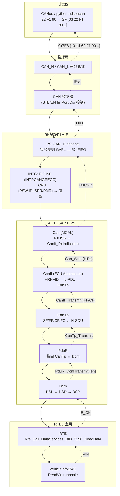
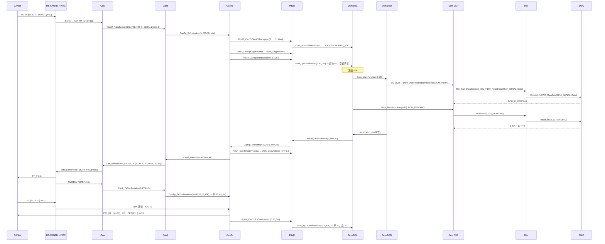
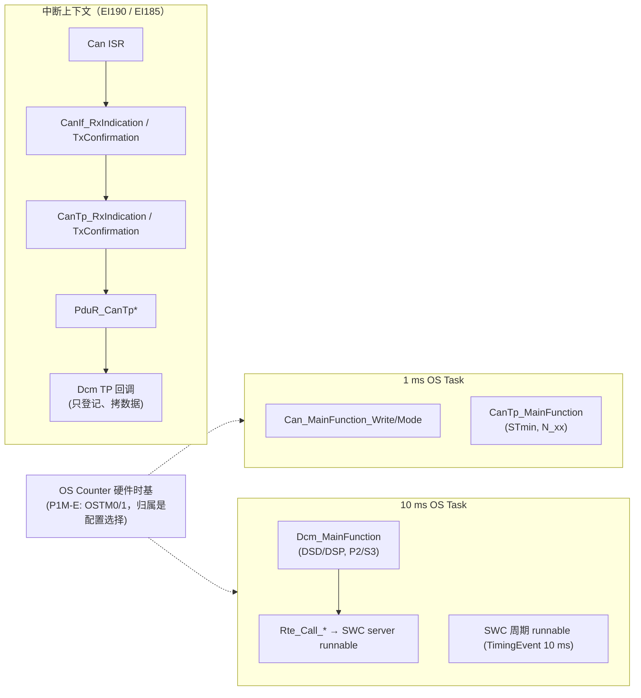

# UDS 端到端：从 CANoe 的 CAN_H/CAN_L 到 SWC，再原路返回

> Prerequisite: 本章是全教程的汇聚点，建议至少读过 [RH850 启动](../01-rh850/04-startup-process.md)、[RH850 中断](../01-rh850/06-interrupt-exception.md)、[ECU 启动](../02-autosar-classic/03-ecu-startup.md)、[MainFunction 调度](../02-autosar-classic/07-mainfunction-scheduling.md)、[CAN 中断](../04-can-mcal/05-can-interrupt.md)、[CAN RX 实现](../04-can-mcal/11-can-rx-implementation.md)、[CAN RX 路径](../05-can-stack/06-can-rx-path.md)、[CAN TX 路径](../05-can-stack/07-can-tx-path.md)、[DCM 运行流程](../06-dcm/11-dcm-runtime-flow.md)、[DCM ↔ RTE](../07-rte-swc/08-dcm-rte-integration.md)、[04 F190 Demo](04-f190-vin-demo.md)
> Next: [06 CANoe 测试](06-canoe-test.md)
> 对应规范: SWS CAN **R22-11**（p.14 定位、p.22 `SWS_Can_00238/00239/00240`、p.45 `00016/00276`、p.48 `00279/00396`、p.50–51 中断/轮询、p.80–81 `00233`）；SWS DCM **R20-11**（p.23 定位、p.49–50 DSL/DSD/DSP、p.61 `00024`、p.79 `00141/00143`、p.94 `01535`、p.135–141 0x22、p.243–247 TP 接口、p.269–270 `ReadData`、p.301 OpStatus）；SWS MCU **R24-11**（p.13–14 start-up code）；HW-E R01UH0585EJ0120 Rev.1.20（RS-CANFD §17、INTC p.264–290、复位 p.418–434）。**本仓库无 CanIf/CanTp/PduR/RTE/Os 的 SWS**——这些接口按 R4.x 公认形态书写。
> 对应源码: 本项目 `examples/uds_diag_demo/`（全部层）、`artifacts/uds-demo/trace.txt`；openAUTOSAR（R3.1.5 对照）`communication/CAN/CanIf/src/CanIf.c:764`、`communication/CAN/CanTp/src/CanTp.c:1001`、`diagnostic/Dcm/src/Dcm_Dsl.c:743`、`diagnostic/Dcm/src/Dcm_Dsd.c:278`、`diagnostic/Dcm/src/Dcm_Dsp.c:1386`

---

## 1. 本章目标

这一章不引入新知识，而是把前面所有 Part 的知识**按一条请求的真实时间顺序重新串起来**。读完后你应该能够：

1. 不看资料，从 CANoe 按下发送键开始，说出 `22 F1 90` 依次经过的**每一个硬件单元和每一个函数**，以及每一步发生在 ISR 还是任务里。
2. 再从 SWC 返回 VIN 开始，说出响应如何一帧一帧回到 CANoe。
3. 回答 `claude_plan.md` "不需要模拟整个量产 ECU" 一节的 12 个问题和 §23 "最重要的问题" 的 10 个问题（本章 §9、§10）。

---

## 2. 为什么需要一个"汇聚章"？

前面的 Part 是**按模块**组织的（RH850 → MCAL → CAN Driver → CanIf/CanTp/PduR → DCM → RTE/SWC），这是学习的顺序；但调试和集成时你面对的是**按时间**组织的问题："帧到了吗？中断来了吗？Dcm 收到了吗？"。本章就是把模块知识转成时间线知识的那张"地图"。

---

## 3. 全链路总图

### 3.1 下行（请求）与上行（响应）



### 3.2 一次完整往返的时序（与 demo trace 时间戳一致）



---

## 4. 逐跳总表（本章的核心）

| # | 跳 | 谁调用谁 / API | 输入 → 输出 | 上下文 | 同步? | 配置来源 | 运行时状态 | demo 位置 | RH850 | 深入阅读 |
|---|---|---|---|---|---|---|---|---|---|---|
| 1 | Tester → 线 | CANoe 诊断控制台 / ISO-TP 层 | UDS `22 F1 90` → CAN 帧 `0x7E0 [03 22 F1 90 ..]` | PC | — | 诊断描述（CDD/ODX）+ TP 参数 | — | `sim/UdsTester.c:90-117` | — | [06](06-canoe-test.md) |
| 2 | 线 → 收发器 → 控制器 | 硬件 | 差分电平 → RXD 逻辑电平 → 位流 | 硬件 | — | 位时间（CmCFG）、引脚复用 | TEC/REC | — | CAN_H/L、收发器、RSCAN0RXm 引脚 | [04-can-mcal/01](../04-can-mcal/01-can-hardware-basics.md)、[04](../04-can-mcal/04-can-pin-transceiver.md) |
| 3 | 控制器 → RX FIFO | 硬件接收规则 | 帧 → 匹配规则 j → label=HRH → RX FIFO x | 硬件 | — | GAFLIDj/GAFLMj/GAFLP0_j/GAFLP1_j（Can_Init 写入） | RFSTSx.RFMC/RFIF | `sim/VirtualCanBus.c:168-187` | HW-E p.1072–1074 | [04-can-mcal/11](../04-can-mcal/11-can-rx-implementation.md) |
| 4 | RX FIFO → CPU | INTC | RFIF & RFIE → EIRF(EIC190) → 优先级仲裁 → 向量 | 硬件 → ISR | 异步 | EIC190.EIP/EITB/EIMK；INTBP；OS ISR 配置 | EIIC=0x10BE；ISPR | `integration/BswScheduler.c:33-35` | EI190，HW-E p.267–268、p.281–286 | [01-rh850/06](../01-rh850/06-interrupt-exception.md)、[04-can-mcal/05](../04-can-mcal/05-can-interrupt.md) |
| 5 | Can ISR → CanIf | `CanIf_RxIndication(const Can_HwType*, const PduInfoType*)` | RFIDx/RFPTRx/RFDF → `{CanId, Hoh, ControllerId}` + 数据 | ISR | 同步回调 | Can HOH 表 | 驱动状态 | `mcal/Can.c:255-277` | RFPCTRx=0xFF、清 RFIF、SYNCP（HW-E p.848、p.254） | [04-can-mcal/12](../04-can-mcal/12-can-interrupt-implementation.md) |
| 6 | CanIf → CanTp | `CanTp_RxIndication(RxPduId, PduInfoPtr)` | (HRH, ID) → Rx L-PDU → 上层 + N-PDU id | ISR | 同步 | CanIf Rx L-PDU 表 | 控制器/PDU 模式 | `ecual/CanIf.c:160-188`、`ecual/CanIf_Cfg.c:16` | — | [05-can-stack/01](../05-can-stack/01-canif.md) |
| 7 | CanTp → PduR | `PduR_CanTpStartOfReception` / `CopyRxData` / `RxIndication` | PCI 解析 → N-SDU → PduR 句柄 | ISR | 同步 | CanTp N-SDU 表 | N-SDU 状态机 | `com/CanTp.c:183-215` | — | [05-can-stack/03](../05-can-stack/03-cantp.md)、[04](../05-can-stack/04-isotp.md) |
| 8 | PduR → Dcm | `Dcm_StartOfReception` / `Dcm_CopyRxData` / `Dcm_TpRxIndication` | 路由 → DcmRxPduId；数据拷入 Dcm 缓冲 | ISR | 同步 | PduR 路由表 | — | `com/PduR.c:80-109`、`com/PduR_Cfg.c:18` | — | [05-can-stack/05](../05-can-stack/05-pdur.md) |
| 9 | DSL 登记请求 | （Dcm 内部） | 请求完整 → 启 P2、停 S3、置 REQ_RECEIVED | ISR | — | `DcmDspSessionRow.P2`、Adjust | `Dcm_Dsl.state`、`p2TimerMs` | `diag/Dcm_Dsl.c:384-438` | — | [06-dcm/02](../06-dcm/02-dsl.md) |
| 10 | DSL → DSD | `Dcm_MainFunction` → DSD | 请求 → 服务表行 + 检查结果 | **10 ms 任务** | 异步（延到 MainFunction） | `DcmDsdServiceTable` | `Dcm_DsdActiveService` | `diag/Dcm_Dsl.c:249-261`、`diag/Dcm_Dsd.c:77-142` | OS 任务（OSTM 时基） | [06-dcm/03](../06-dcm/03-dsd.md)、[06-dcm/12](../06-dcm/12-dcm-mainfunction.md) |
| 11 | DSD → DSP | 服务处理函数（OpStatus, MsgContext, ErrorCode） | SID → `Dcm_DspReadDataByIdentifier` | 10 ms 任务 | 同步（可 PENDING） | 服务表的 `fnc` | `Dcm_DspRdbi` | `diag/Dcm_Dsd.c:163`、`diag/Dcm_Dsp.c:264-367` | — | [06-dcm/04](../06-dcm/04-dsp.md)、[06-dcm/08](../06-dcm/08-did.md) |
| 12 | DSP → RTE | `Rte_Call_DataServices_DID_F190_ReadData(OpStatus, Data)` | DID → 数据端口操作 | 10 ms 任务 | 异步 C/S（PENDING 重入） | `DcmDspDataUsePort` + RTE 端口连接 | OpStatus | `diag/Dcm_Cfg.c:34-38`、`rte/Rte_Dcm.c:54-62` | — | [07-rte-swc/06](../07-rte-swc/06-client-server.md)、[07-rte-swc/08](../07-rte-swc/08-dcm-rte-integration.md) |
| 13 | RTE → SWC | server runnable `VehicleInfoSWC_ReadVin` | OpStatus → VIN + 返回值 | 10 ms 任务（同分区直接调用） | 同步调用、异步语义 | RTE runnable 映射 | SWC 内部 | `swc/VehicleInfoSWC.c:77-96` | — | [autosar-swc-rte-tutorial](../autosar-swc-rte-tutorial.md) |
| 14 | DSD 组响应 | （Dcm 内部） | resData → `62 F1 90` + VIN | 10 ms 任务 | — | — | txBuffer | `diag/Dcm_Dsd.c:176-185` | — | [06-dcm/11](../06-dcm/11-dcm-runtime-flow.md) |
| 15 | DSL → PduR | `PduR_DcmTransmit(TxPduId, {NULL, len=20})` | 只给长度 | 10 ms 任务 | 同步登记 | `DcmDslProtocolTxPduRef` | TRANSMITTING | `diag/Dcm_Dsl.c:187-204` | — | [06-dcm/02](../06-dcm/02-dsl.md) |
| 16 | PduR → CanTp | `CanTp_Transmit(N-SDU, len)` | 路由 → Tx N-SDU | 10 ms 任务 | 同步 | PduR Tx 路由 | — | `com/PduR.c:67-76` | — | [05-can-stack/07](../05-can-stack/07-can-tx-path.md) |
| 17 | CanTp 拉数据 | `PduR_CanTpCopyTxData` → `Dcm_CopyTxData` | 按帧拉 6/7 字节 | 任务 / ISR | 同步 | — | `txCopied` | `com/CanTp.c:328-388`、`diag/Dcm_Dsl.c:441-474` | — | [05-can-stack/04](../05-can-stack/04-isotp.md) |
| 18 | CanTp → CanIf → Can | `CanIf_Transmit` → `Can_Write(Hth, &Can_PduType)` | L-PDU → HTH + CAN ID 0x7E8 | 任务 | 同步（E_OK/CAN_BUSY） | CanIf Tx L-PDU、HTH | TX 对象 busy、`swPduHandle` | `ecual/CanIf.c:93-133`、`mcal/Can.c:171-217` | TMSTSp 检查 → TMIDp/TMPTRp/TMDF → `TMCp=0x01`（8 位） | [04-can-mcal/10](../04-can-mcal/10-can-write-implementation.md) |
| 19 | 发送完成 | `CanIf_TxConfirmation` → `CanTp_TxConfirmation` | TMTRF=10b → 确认 | TX ISR（EI185）或 `Can_MainFunction_Write` | 异步 | `CanTxProcessing` | — | `mcal/Can.c:220-239`、`ecual/CanIf.c:136-156` | HW-E p.1109–1110 | [04-can-mcal/12](../04-can-mcal/12-can-interrupt-implementation.md) |
| 20 | FC 回来 | tester FC 走 RX 路径（#2–#6）到 CanTp 发送状态机 | FC CTS(BS, STmin) | ISR | — | CanTp Rx FC N-PDU | WAIT_FC → WAIT_STMIN | `com/CanTp.c:424-459` | — | [05-can-stack/04](../05-can-stack/04-isotp.md) |
| 21 | CF 节拍 | `CanTp_MainFunction` 按 STmin 发 CF | — | 1 ms 任务 | — | CanTp 周期 | 计时器 | `com/CanTp.c:590-660` | — | [02-autosar-classic/07](../02-autosar-classic/07-mainfunction-scheduling.md) |
| 22 | 完成 | `PduR_CanTpTxConfirmation` → `Dcm_TpTxConfirmation(E_OK)` | 停 P2、启 S3；执行挂起的会话切换/复位 | ISR 或任务 | — | — | IDLE、`s3TimerMs` | `com/PduR.c:121-129`、`diag/Dcm_Dsl.c:163-185`、`:477-497` | — | [06-dcm/06](../06-dcm/06-diagnostic-session.md) |

---

## 5. 下行路径：逐层讲清"每一层为什么存在"

### 5.1 CANoe → CAN_H/CAN_L → 收发器

[Conceptual] CANoe 的诊断层把 `22 F1 90` 交给它自己的 ISO-TP 实现，生成单帧 `03 22 F1 90`，按配置填充到 DLC=8，从 CAN 卡发出。总线上是差分信号；ECU 侧收发器把它转成 RXD 逻辑电平给 RS-CANFD。**收发器必须处于 normal mode**——它的 STB/EN 引脚由 Port/Dio 控制，具体引脚和有效电平**需在真实项目环境中确认**（原理图 + 收发器手册）。

任何一个接收到正确帧的 CAN 节点都会在 ACK 槽发显性位——**ACK 与 ECU 的接收过滤、软件状态都无关**。所以"CANoe 没有报 ACK error"只能说明至少有一个节点的控制器在线且位时序基本匹配。详见 [04-can-mcal/01](../04-can-mcal/01-can-hardware-basics.md)。

### 5.2 RS-CANFD：接收规则 → RX FIFO

[RH850 Hardware] P1M-E 只有一个 RS-CANFD 单元（RSCFD0，3 通道，基址 `0xFFD2_0000`）。帧进入通道后按规则表从小号开始比较，命中第一条即停（HW-E p.1073–1074）：

- GAFLIDj/GAFLMj：ID 与掩码（**掩码位 = 1 表示比较**，HW-E p.834）；
- GAFLP0_j.PTR：12 位 label——教学驱动和 demo 都把它设成 HRH，ISR 读回后就知道"哪个硬件对象收到的"（`mcal/Can.c:77-79`）；
- GAFLP1_j：目标 RX FIFO。

没有任何规则时收不到任何报文（HW-E p.1072）。demo 的 `VirtualCanBus_TesterSend`（`sim/VirtualCanBus.c:168-179`）在没有规则匹配时打印 `no receive rule matches ... hardware discards it`——调试手册 F1 就是这个现象。

### 5.3 中断：EI190 → OS → Can ISR

[RH850 Hardware] RX FIFO 0–7 共用一个中断 **INTRCANGRECC = EI190**；EI184 是 CAN0 的 common（Tx/Rx）FIFO 接收中断，不是 RX FIFO（HW-E p.285–286、p.792；研究笔记 04 §5.2）。中断到达 CPU 要过五道门：外设使能（RFCCx.RFIE）→ 外设标志（RFSTSx.RFIF）→ EIC190（EIRF/EIMK/EIP）→ CPU（PSW.ID、ISPR、PMR）→ 向量（直接分支偏移或 `INTBP + 4×190`）。异常源码 EIIC = `0x1000 + 190 = 0x10BE`（HW-E Table 6.11，研究笔记 01 F-INT-7）。CAN 中断是**电平型**，必须在 ISR 里清外设标志，否则中断风暴。

[AUTOSAR Standard] Can 模块实现 ISR（`SWS_Can_00033` p.33），ISR 末尾清中断标志（`00420`）；但**中断向量与优先级不由 Can 驱动设置**（p.33 实现提示）——由 OS 配置成 Category 2 ISR 后调用驱动的 ISR 函数。

### 5.4 Can：硬件细节到此为止

[AUTOSAR Standard] Can 是唯一访问 RS-CANFD 寄存器的模块（`SWS_Can_00058` p.23、`SRS_SPAL_12092`）。它把 RFIDx/RFPTRx/RFDF 翻译成 `Can_HwType{CanId, Hoh, ControllerId}` + `PduInfoType`，调用 `CanIf_RxIndication`（`SWS_Can_00279` p.48）。

**为什么 Can 是 MCAL 而 CanIf 不是？** SWS CAN p.14："The Can module is part of the lowest layer, performs the hardware access and offers a hardware independent API to the upper layer"；p.22 脚注 3：如果 CAN 控制器在片外（经 SPI 访问），Can 驱动就不再属于 µC 抽象层而属于 ECU 抽象层——**层次由"是否直接访问片上外设"决定**。CanIf 不访问任何寄存器，它抽象的是"一个 ECU 上可能有多个 CAN 驱动/控制器"这件事。

### 5.5 CanIf：把"哪个邮箱收到的哪个 ID"变成"哪个 L-PDU、交给谁"

demo `ecual/CanIf.c:171-183`：按（HRH, CAN ID）线性查表，命中后调用表里配置的上层回调（`CanTp_RxIndication`）并传入上层的句柄（N-PDU 0）。**CanIf 不知道 0x7E0 是诊断**，这完全是 `ecual/CanIf_Cfg.c:16` 那一行配置决定的。CanIf 存在的意义：屏蔽 Can 驱动的差异（多个驱动、不同 HOH 编号），提供 L-PDU 句柄、软件过滤、发送缓冲（`CAN_BUSY` 时排队）、控制器/PDU 模式闸门。

### 5.6 CanTp：8 字节帧与 4095 字节消息之间的桥

UDS 消息长度可以远超一帧的 8 字节（`22 F1 90` 的响应就是 20 字节）。CanTp 实现 ISO 15765-2：SF（≤7 字节）、FF + CF（分段）、FC（流控：BS、STmin）。它把 N-PDU（一帧）组装成 N-SDU（一条完整消息），并维护 N_Ar/N_As/N_Br/N_Bs/N_Cr/N_Cs 超时。请求 `03 22 F1 90` 是 SF，CanTp 直接 StartOfReception → CopyRxData → RxIndication（`com/CanTp.c:183-215`）。

### 5.7 PduR：上层不应该知道下层是 CAN

PduR 只做路由：CanTp 的 N-SDU → Dcm 的 DcmRxPduId。它的存在让 Dcm 成为"网络无关"的（DCM R20-11 p.23）：同一个 Dcm 可以通过 PduR 接 CanTp、LinTp、DoIP，而 Dcm 代码不变；网关 ECU 也靠 PduR 在网络间转发。

### 5.8 Dcm：DSL 管"时间和缓冲"，DSD 管"能不能做"，DSP 管"怎么做"

- **DSL**（`diag/Dcm_Dsl.c`）：TP 握手、缓冲所有权、P2/P2*/S3、0x78、会话/安全状态。它在 `Dcm_TpRxIndication` 里只登记请求并启动 P2（`:433`），**不在 ISR 里处理服务**。
- **DSD**（`diag/Dcm_Dsd.c`）：**"DCM 如何知道 0x22 是 ReadDataByIdentifier？"**——它不知道；它在 `DcmDsdServiceTable`（demo `diag/Dcm_Cfg.c:114-125`）里查 SID=0x22，得到处理函数、会话/安全/长度约束，按 `SWS_Dcm_01535` 的顺序检查（demo 实现子集：SID → 会话 → 安全 → 长度 → 子功能）。
- **DSP**（`diag/Dcm_Dsp.c`）：**"DCM 如何找到 F190？"**——在 `DcmDspDid` 表（demo `diag/Dcm_Cfg.c:34-38`）里查标识符 0xF190，得到长度 17、读权限、`UsePort = USE_DATA_ASYNCH_CLIENT_SERVER` 和数据访问入口。

### 5.9 RTE：Dcm 与应用之间的"合同"

**"DCM 如何调用 application？RTE 承担什么角色？"** Dcm 作为一个 Service Component，拥有 required client 端口 `DataServices_DID_F190`；VehicleInfoSWC 拥有对应的 provided server 端口。RTE 生成器根据端口连接生成 `Rte_Call_DataServices_DID_F190_ReadData(OpStatus, Data)`：同分区时就是一个直接调用（demo `rte/Rte_Dcm.c:54-62`，甚至可以是宏），跨分区/跨核时则可能经 IOC/任务激活而无法同步完成——这正是 `DCM_E_PENDING` + `OpStatus` 存在的原因。RTE 让 SWC 不需要 include `Dcm.h`，也让 Dcm 不需要知道 VIN 由哪个 SWC 提供。

### 5.10 SWC：只实现端口接口

**"SWC 如何提供 VIN？"** `VehicleInfoSWC_ReadVin(Dcm_OpStatusType OpStatus, uint8 *Data)`（`swc/VehicleInfoSWC.c:77-96`）：`DCM_INITIAL` 时开始，未就绪返回 `DCM_E_PENDING`，就绪后拷贝 17 字节并返回 `E_OK`；`DCM_CANCEL` 时中止。SWC 不知道 CAN、ISO-TP、SID 或 NRC 0x78。

---

## 6. 上行路径：response 如何原路返回 CAN Bus

1. **DSD 组正响应**：`txBuffer[0] = 0x22 + 0x40 = 0x62`，后跟 DSP 写好的 `F1 90 <VIN>`（`diag/Dcm_Dsd.c:181-182`）。
2. **DSL 发起发送**：`PduR_DcmTransmit(TxPduId, {SduDataPtr=NULL, SduLength=20})`——只交长度（`diag/Dcm_Dsl.c:194-199`）。
3. **PduR → CanTp**：`CanTp_Transmit(N-SDU 0)`；20 > 7 → 分段。
4. **CanTp 按帧拉数据**：`PduR_CanTpCopyTxData` → `Dcm_CopyTxData`，FF 拉 6 字节（`com/CanTp.c:365`）。R4.x 的这个"拉"模型取代了 R3.x 的 `ProvideTxBuffer`"借整块 buffer"（openAUTOSAR `Dcm_Dsl.c:899`，研究笔记 03 §4.8）。
5. **CanIf → Can**：`CanIf_Transmit` 把 L-PDU 0 映射到 HTH2 + ID 0x7E8，调 `Can_Write`；忙则 `CAN_BUSY`，由 CanIf 排队（`ecual/CanIf.c:115-131`）。
6. **Can → RS-CANFD**：写 TX buffer，8 位写 `TMCp=0x01` 请求发送；帧经 TXD → 收发器 → CAN_H/CAN_L → CANoe。
7. **发送完成**：TMSTSp.TMTRF=10b → `CanIf_TxConfirmation(swPduHandle)` → `CanTp_TxConfirmation` → FF 已发，进入 WAIT_FC，启动 N_Bs。
8. **tester FC**：`30 01 02` 从 0x7E0 进来，走完 §5.1–§5.6 的 RX 路径，被 CanTp 识别为 FC，交给发送状态机（`com/CanTp.c:476-483`）。
9. **CF**：`CanTp_MainFunction` 按 STmin 发 CF1、等 FC（BS=1）、发 CF2。
10. **完成**：`PduR_CanTpTxConfirmation(E_OK)` → `Dcm_TpTxConfirmation(E_OK)` → DSL 停 P2、启 S3，若是 0x10/0x11 则此刻才切会话/复位（`SWS_Dcm_00311/00594`）。

---

## 7. 调度视角：Interrupt、OS Task、MainFunction、Runnable



| 概念 | 是什么 | 由谁触发 | 在本次请求中的角色 |
|---|---|---|---|
| Interrupt | 硬件事件 → CPU 异常处理 | RS-CANFD 标志 → INTC | 把帧"推"进软件；整条 TP 回调链在 ISR 里跑完 |
| OS Task | OS 调度的执行单元 | Alarm / Schedule Table（OS Counter） | 承载 MainFunction 和 runnable |
| MainFunction | BSW 的周期入口（`Dcm_MainFunction` 等） | 由 RTE/SchM 生成的 task body 调用 | 处理已登记的工作、推进计时器 |
| Runnable | SWC 的可执行实体 | RTE 事件（TimingEvent、OperationInvokedEvent…） | `VehicleInfoSWC_ReadVin` 是一个 server runnable，被 Dcm 的 client 调用"触发" |

更完整的推导见 [MainFunction 调度](../02-autosar-classic/07-mainfunction-scheduling.md) 与 [Runnable 与 Event](../07-rte-swc/03-runnable-event.md)。

---

## 8. 配置视角：每个路由决策来自哪张表

| 决策 | 由哪张"生成表"决定 | demo 位置 | ARXML/ECUC 来源 |
|---|---|---|---|
| 0x7E0 能否进入软件 | Can 接收规则 | `mcal/Can_Cfg.c:18` | `CanHardwareObject` + `CanHwFilter` |
| 0x7E0 交给谁 | CanIf Rx L-PDU | `ecual/CanIf_Cfg.c:16` | `CanIfRxPduCfg`* |
| 物理还是功能寻址、BS/STmin | CanTp Rx N-SDU | `com/CanTp_Cfg.c:13-26` | `CanTpRxNSdu`* |
| N-SDU 交给哪个上层 | PduR 路由 | `com/PduR_Cfg.c:18-19` | `PduRRoutingPath`* |
| 哪个 Dcm 协议/连接 | Dcm Rx PDU | `diag/Dcm_Cfg.h:31-33` | `DcmDslProtocolRx`（`00770`） |
| 0x22 是什么服务、允许在哪些会话 | DSD 服务表 | `diag/Dcm_Cfg.c:120` | `DcmDsdService`（p.448–454） |
| F190 长度、权限、接口 | DSP DID 表 | `diag/Dcm_Cfg.c:34-38` | `DcmDspDid` / `DcmDspData`（p.509–540） |
| 调用哪个函数 | RTE 端口连接 | `rte/Rte_Dcm.c:54-62` | SWC 描述 + 端口连接（ARXML） |
| 多久处理一次 | OS 任务 + `DcmTaskTime` | `integration/BswScheduler.c:49`、`diag/Dcm_Cfg.h:20` | Os + Rte 配置；`ECUC_Dcm_00820` |
| 响应用哪个 ID | CanIf Tx L-PDU | `ecual/CanIf_Cfg.c:21` | `CanIfTxPduCfg`* |

（`*` = 本仓库无该 SWS 的 R4.x 公认容器名。）

结论：**代码只提供机制，路线全部由配置决定**。这就是 [配置与 ARXML](../02-autosar-classic/04-configuration-arxml.md) 一章要建立的认识。

---

## 9. 回答"不需要模拟整个量产 ECU"的 12 个问题

| # | 问题 | 回答（以 demo 为证，真实 ECU 同理） |
|---|---|---|
| 1 | `22 F1 90` 到底从哪里进入 ECU？ | 从 CAN_H/CAN_L 经收发器进入 RS-CANFD 通道的 RX 引脚，被接收规则 0（0x7E0）接受，放进 RX FIFO（§5.1–§5.2；trace 第 26–27 行） |
| 2 | 哪个 interrupt 收到？ | RX FIFO 中断 INTRCANGRECC = **EI190**（不是 EI184）；OS 将其配置为 Cat2 ISR 并调用 Can 驱动 ISR（§5.3；`mcal/Can.c:251-277`） |
| 3 | CAN Driver 做什么？ | 从 FIFO 读出 ID/DLC/数据/label，弹出 FIFO，清标志，构造 `Can_HwType` 并调用 `CanIf_RxIndication`；它是唯一碰寄存器的模块（§5.4） |
| 4 | CanIf 做什么？ | 按（HRH, CAN ID）查 Rx L-PDU 表，决定上层用户（CanTp）和上层句柄；控制器/PDU 模式闸门；发送侧做 L-PDU→HTH 映射与 `CAN_BUSY` 排队（§5.5） |
| 5 | CanTp 为什么存在？ | CAN 帧只有 8 字节（Classical），UDS 消息可达 4095 字节；CanTp 实现 ISO 15765-2 的分段、流控和超时（§5.6；响应 20 字节 = FF+2CF） |
| 6 | PduR 为什么存在？ | 让 Dcm 与网络无关、让同一 PDU 可以路由到不同上层/网络；Dcm 只和 PduR 打交道（§5.7；DCM R20-11 p.23） |
| 7 | DCM 如何知道 0x22 是 ReadDataByIdentifier？ | DSD 在配置的服务表里查 SID=0x22 得到处理函数（`diag/Dcm_Cfg.c:120` → `Dcm_DspReadDataByIdentifier`）（§5.8） |
| 8 | DCM 如何找到 F190？ | DSP 在 DID 表中查 0xF190（`diag/Dcm_Cfg.c:34-38`、`diag/Dcm_Dsp.c:54-64`），并检查会话/安全读权限（§5.8） |
| 9 | DCM 如何调用 application？ | 按 `DcmDspDataUsePort` 调用 RTE 生成的 `Rte_Call_DataServices_DID_F190_ReadData(OpStatus, Data)`；异步时用 `DCM_E_PENDING` + 下个 MainFunction 的 `DCM_PENDING` 重入（§5.9） |
| 10 | RTE 在这里承担什么角色？ | 把 Dcm 的 client 端口与 SWC 的 server 端口连接起来，屏蔽两者的位置（同核/跨核/跨分区）与名字；生成调用代码与 runnable 原型（§5.9） |
| 11 | SWC 如何提供 VIN？ | 实现 server runnable `VehicleInfoSWC_ReadVin`，签名由接口决定；返回 E_OK + 17 字节，或 `DCM_E_PENDING`（§5.10） |
| 12 | response 如何原路返回 CAN Bus？ | DSD 组 `62 F1 90 ...` → DSL `PduR_DcmTransmit`（只给长度）→ CanTp 分段并用 `CopyTxData` 拉数据 → CanIf → `Can_Write` → TX buffer → 总线；FC/CF 交替直到 `Dcm_TpTxConfirmation`（§6） |

---

## 10. 回答 §23 "最重要的问题"

| 主题 | 问题 | 简答 | 详细章节 |
|---|---|---|---|
| Hardware | RH850 reset 后到底发生了什么？ | [RH850 Hardware] 复位 → 硬件 Field BIST 与 RAM（含 ECC）初始化 → CPU 从 reset vector（RBASE 初值，user mat 启动时为 `0x0000_0000`，HW-E p.258）取指、PSW=0x20（EI 中断屏蔽，p.197）→ 启动汇编：设 SP（r3）、GP/TP、`.data` 拷贝、`.bss` 清零 → 时钟（P1M-E 无软件可编程 PLL，时钟固定：CPU 160 MHz / HSB 80 MHz / LSB 40 MHz，HW-E p.469–471）→ `main` → EcuM：`Mcu_Init` → `Port_Init` → `Can_Init` … → `StartOS` → BSW 初始化 → `Rte_Start` → SWC | [01-rh850/04](../01-rh850/04-startup-process.md)、[02-autosar-classic/03](../02-autosar-classic/03-ecu-startup.md) |
| MCAL | Mcu/Port/Can 如何操作 RH850 硬件？ | Mcu：复位原因（RESF）、软件复位、RAM 初始化；P1M-E 上 PLL API 大概率是平凡实现（`McuNoPll`）。Port：PMC/PFC/PFCE/PFCAE/PM/PIPC 选择 ALT 功能。Can：global/channel 模式切换、GAFL 规则、RX FIFO、TX buffer、EI183–193 | [03-mcal/02](../03-mcal/02-mcu-driver.md)、[03-mcal/03](../03-mcal/03-port-driver.md)、[04-can-mcal/06](../04-can-mcal/06-can-controller-init.md)、[04-can-mcal/14](../04-can-mcal/14-can-driver-from-scratch.md) |
| CAN | 一个 CAN frame 如何从 RS-CANFD 进入 DCM？ | 本章 §4 #2–#9 | [05-can-stack/06](../05-can-stack/06-can-rx-path.md) |
| DCM | `22 F1 90` 到达 ECU 后经过哪些函数？ | `Can ISR` → `CanIf_RxIndication` → `CanTp_RxIndication` → `PduR_CanTpStartOfReception/CopyRxData/RxIndication` → `Dcm_StartOfReception/CopyRxData/TpRxIndication` → `Dcm_MainFunction` → DSD 查表 → `Dcm_DspReadDataByIdentifier` → `Rte_Call_DataServices_DID_F190_ReadData` → `VehicleInfoSWC_ReadVin` | [06-dcm/11](../06-dcm/11-dcm-runtime-flow.md)、[04 F190 Demo §6](04-f190-vin-demo.md) |
| RTE | DCM 如何最终调用 application software？ | §5.9 | [07-rte-swc/08](../07-rte-swc/08-dcm-rte-integration.md) |
| SWC | 一个真实 Classic AUTOSAR SWC 如何定义、生成并运行？ | ARXML 定义 SWC 类型、端口、接口、runnable 与事件 → RTE 生成器生成 `Rte_<Swc>.h` 与 RTE 代码 → 开发者实现 runnable → OS 任务/事件触发 runnable | [autosar-swc-rte-tutorial](../autosar-swc-rte-tutorial.md)、[07-rte-swc/05](../07-rte-swc/05-rte-generation.md) |
| Configuration | ARXML / generated configuration 起什么作用？ | §8：所有路由决策都是配置表；代码只提供机制 | [02-autosar-classic/04](../02-autosar-classic/04-configuration-arxml.md)、[05](../02-autosar-classic/05-generated-code.md)、[01 清单](01-ecu-configuration-checklist.md) |
| Scheduling | Interrupt、OS Task、MainFunction、Runnable 是什么关系？ | §7 | [02-autosar-classic/07](../02-autosar-classic/07-mainfunction-scheduling.md) |
| Debug | CANoe 发 UDS request 后 ECU 不响应，从哪里开始查？ | 先看总线（ACK？请求帧对吗？有没有响应 ID 的帧？），再按本章 §4 的跳序二分：RX ISR 来没来 → `Dcm_TpRxIndication` 到没到 → `Dcm_MainFunction` 处理没处理 → `PduR_DcmTransmit` 调没调 → `Can_Write` 成没成功 | [调试手册](../debugging-autosar-diagnostics.md) |
| Upgrade | 升级 RTA-CAR DCM 要检查哪些 dependency / configuration / API / behavior？ | 依赖：PduR/CanTp TP 接口、ComM、Dem client 接口、NvM、RTE 端口签名、BswM 模式、SchM、EcuM；配置：ECUC 参数增删改与默认值；API：TP 回调、OpStatus、`Xxx_ReadData` 等 C 原型；行为：NRC 顺序、0x78、会话/安全切换时机。用总线级回归测试保护 | [DCM 升级指南](../dcm-upgrade-guide.md) |

---

## 11. demo 与真实 ECU 在这条路径上的差异

| 跳 | demo | 真实 ECU `[Real Project Consideration]` |
|---|---|---|
| #2–#3 | `VirtualCanBus` 按规则匹配，无仲裁/错误帧 | 真实位时序、仲裁、错误计数；FIFO 满时 RFMLT 丢帧 |
| #4 | 调度器看到 FIFO 非空就调 ISR | INTC 优先级、嵌套、ISPR；ISR 可能被更高优先级抢占 |
| #5–#9 | 单线程 | TP 回调在 ISR，与任务中的 `Dcm_MainFunction` 并发 → exclusive area |
| #10–#13 | 10 ms 离散 | OS 抖动；RTE 可能跨分区 |
| #18–#19 | TX 轮询，1 ms 后完成 | 仲裁失败重发；TX 中断或轮询由配置决定 |
| 全程 | 无 ComM：Dcm 永远可发 | ComM 未 Full Com 时 Dcm 不发响应（[03 §4.3](03-dcm-integration.md)） |

---

## 12. Debug：沿本章跳序设断点

把 §4 的"demo 位置"列换成真实工程中的同名 AUTOSAR 接口，就是一份断点脚本：

```text
[RX]  Can RX ISR 入口 → CanIf_RxIndication → CanTp_RxIndication → PduR_CanTpStartOfReception
      → Dcm_StartOfReception(返回值) → Dcm_TpRxIndication(result)
[处理] Dcm_MainFunction → (DSD 服务处理入口，供应商命名) → Rte_Call_DataServices_<DID>_ReadData → SWC runnable
[TX]  PduR_DcmTransmit(返回值) → CanTp_Transmit → Dcm_CopyTxData → CanIf_Transmit → Can_Write(返回值)
      → CanIf_TxConfirmation → Dcm_TpTxConfirmation(result)
```

每一跳该看的变量、返回值和常见配置错误见 [调试手册](../debugging-autosar-diagnostics.md) 的逐层章节。

---

## 13. 实验

1. 打开 `artifacts/uds-demo/trace.txt`，对第 25–81 行逐行标注本章 §4 的跳号（#1–#22）。哪些跳没有对应的 trace 行？（提示：`Dcm_CopyRxData`、`Dcm_CopyTxData`、`PduR_CanTpCopyRxData/CopyTxData` 不打印。）
2. 用 `grep "\[Bus" artifacts/uds-demo/trace.txt` 得到"纯总线视图"，这就是 CANoe 应该看到的样子；对照 [06 CANoe 测试](06-canoe-test.md) §6 的期望帧表。
3. 选 `2E F1 A0`（trace 第 233–284 行），画出它与 `22 F1 90` 的差异：多了哪几跳（ECU 侧发 FC、NvM 异步）？

---

## 14. 对未来真实项目的意义

[Real Project Consideration]

1. 本章 §4 的总表是你进入真实项目后要**重新填写的第一张表**：把"demo 位置"列换成真实文件和函数（供应商内部函数名必然不同），把"RH850"列换成真实 derivative 的资源（**需在真实项目环境中确认**）。
2. §9 和 §10 的问题可以作为自测：如果在真实项目里还答不出其中某一题，说明对应的那一跳还没有在真实代码里找到。
3. 调试"CANoe 发 UDS request 但 ECU 不响应"时，§4 的跳序就是二分查找的顺序。

---

## 15. 本章总结

- 一条 UDS 请求经过 22 跳：物理层 → RS-CANFD 接收规则 → EI190 → Can → CanIf → CanTp → PduR → Dcm（DSL 在 ISR 中登记，DSD/DSP 在 MainFunction 中处理）→ RTE → SWC，再经 PduR/CanTp/CanIf/Can 多帧返回。
- 每一层的存在理由：Can 屏蔽寄存器、CanIf 屏蔽驱动、CanTp 解决帧长、PduR 解耦网络、Dcm 分离时间/许可/处理、RTE 解耦组件。
- 所有路由由配置表决定；所有时序由中断和 OS 任务决定。

## 16. 下一章

[06 CANoe 测试](06-canoe-test.md) 讲如何在真实总线上用 CANoe 或 python-udsoncan 发出这条请求，以及如何读懂测试仪一侧的 trace。
