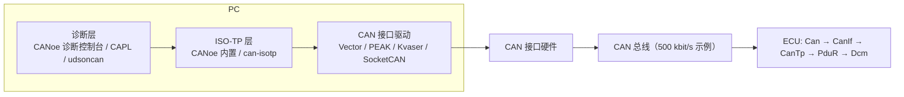

# CANoe / python-udsoncan 测试：用真实测试仪验证 `10 03 → 27 → 22 F1 90 → 2E → 31 → 3E`

> Prerequisite: [05 UDS 端到端](05-uds-end-to-end.md)、[04 F190 Demo](04-f190-vin-demo.md)、[ISO-TP](../05-can-stack/04-isotp.md)、[UDS 服务](../06-dcm/10-uds-services.md)、[会话](../06-dcm/06-diagnostic-session.md)、[安全访问](../06-dcm/07-security-access.md)
> Next: [07 集成调试](07-integration-debugging.md)
> 对应规范: SWS DCM **R20-11**：功能寻址 NRC 抑制 `SWS_Dcm_00001` p.101；SPRMIB `00200/00204` p.94；功能 `3E 80` `00112/00113/01168` p.58；P2/P2*/S3 `00027/00143` p.79、0x10 响应中的 P2 值 p.656；0x78 `00024` p.61；NRC 类型 `00980` p.304–307；服务章节 0x10 p.114、0x22 p.135–141、0x27 p.142–144、0x2E p.174–177、0x31 p.188–196、0x3E p.196。ISO 14229-1 / ISO 15765-2 本仓库无原文，帧格式按公认规则描述。
> 对应源码: 本项目 `examples/uds_diag_demo/tests/test_uds_demo.c`（期望字节的来源）、`sim/UdsTester.c`（PC 侧 ISO-TP 客户端，可当作测试仪逻辑的参考实现）、`artifacts/uds-demo/trace.txt`（`[Bus]` 行 = 测试仪应看到的帧）

---

## 1. 本章目标

1. 知道用 CANoe/CANalyzer 或开源的 **python-can + can-isotp + udsoncan** 测 UDS 时，**需要配置哪些参数**，以及每个参数必须与 ECU 哪一项配置一致。
2. 理解物理寻址与功能寻址的区别，以及功能寻址下哪些负响应会被 ECU 抑制。
3. 掌握一条完整的测试序列 `10 03 / 27 01 / 27 02 / 22 F1 90 / 2E / 31 / 3E 00 / 3E 80`，知道每一步**总线上应该出现哪些 CAN 帧、ECU 应该回什么字节**（以本仓库 demo 为基准）。
4. 能读懂测试仪一侧的 trace，并把它与 ECU 侧的断点/日志对应起来。

---

## 2. 为什么测试仪配置本身就是"集成的一部分"

"CANoe 发了没响应"的问题里，有相当一部分是**测试仪配置与 ECU 配置不一致**：请求 ID、响应 ID、寻址格式、padding、FC 参数、P2 超时。测试仪和 ECU 各有一个 ISO-TP 实现、各有一套诊断时序参数，它们必须对上。本仓库 demo 的 `sim/UdsTester.c` 就是故意**独立于 ECU 侧 CanTp** 写的，两个实现互相校验（`sim/UdsTester.h:1-10` 的注释）。

---

## 3. 在系统中的位置



| 测试仪层 | 必须与 ECU 哪项一致 | ECU 侧配置（demo） |
|---|---|---|
| CAN 通道 | 波特率、采样点、Classical/FD | Can 控制器位时间（[01 清单](01-ecu-configuration-checklist.md) §5.1） |
| ISO-TP | 请求 ID（物理/功能）、响应 ID、寻址格式、padding、本端 BS/STmin、N_xx 超时 | CanIf Rx/Tx L-PDU、CanTp N-SDU（`ecual/CanIf_Cfg.c:16-22`、`com/CanTp_Cfg.c:13-34`） |
| 诊断层 | P2Client/P2*Client 超时、TesterPresent 周期（< S3）、安全算法、DID 数据格式 | Dcm 会话行 P2/P2*、S3=5 s、SecurityAccess SWC、DID 长度 |

---

## 4. 测试仪的配置项

### 4.1 CANoe / CANalyzer（Vector）

[Real Project Consideration] 以下是**概念层面**必须配置的内容；菜单名称、对话框位置随 CANoe 版本变化，**以所用 CANoe 版本的帮助文档为准**。

| 配置 | 说明 | demo 取值 |
|---|---|---|
| 通道波特率 / 采样点 | 必须与网络规范一致 | 500 kbit/s（`mcal/Can_Cfg.c:13` 的 500 只是标注，mock 无位时序） |
| 诊断描述 | CANdelaStudio 生成的 CDD，或 ODX/PDX；没有时可用 CANoe 的通用 UDS（basic diagnostics）描述 | — |
| 物理请求 / 响应 ID | 诊断描述或 TP 设置中配置 | 请求 0x7E0，响应 0x7E8 |
| 功能请求 ID | 用于功能寻址 | 0x7DF |
| 寻址格式 | Normal / Extended / Mixed | Normal（11 bit） |
| Padding | 是否填充到 DLC=8、填充值 | tester 0x55（`sim/SimHarness.c:28`），ECU 0xCC（`com/CanTp_Cfg.h:17`） |
| 测试仪 FC 参数 | 测试仪**接收**多帧响应时宣告的 BS / STmin | demo 脚本 BS=1、STmin=2 ms（`integration/main_demo.c:47`） |
| P2Client / P2*Client | 测试仪等待响应 / 收到 0x78 后等待的时间 | 应 ≥ ECU 的 P2=50 ms、P2*=5000 ms（ECU 在 0x10 正响应中报告） |
| TesterPresent | 非默认会话中周期性发送 `3E 80`（功能寻址常见），周期 < S3（5 s） | — |
| 安全访问 | seed-key DLL/算法（OEM 提供） | demo：key = seed XOR `5A 3C 96 E1`（**不安全的教学算法**） |

### 4.2 开源替代：python-can + can-isotp + udsoncan

[Conceptual] 三个 Python 包分工与 CANoe 的三层相同：`python-can`（CAN 接口驱动抽象，支持 Vector、PEAK、Kvaser、SocketCAN 等）、`can-isotp`（ISO 15765-2）、`udsoncan`（UDS 服务与响应解析）。下面的脚本**未在本仓库运行过**（本机没有 CAN 硬件），库的 API 在不同版本之间有变化，**以所装版本的文档为准**；它的价值在于展示"测试仪需要哪些参数"。

```python
# [Conceptual] uds_smoke_test.py —— 用 python-can + can-isotp + udsoncan 跑 demo 的测试序列
import can, isotp, udsoncan
from udsoncan.client import Client
from udsoncan.connections import PythonIsoTpConnection

# 1) CAN 通道：接口类型与通道号取决于你的硬件（vector / pcan / kvaser / socketcan ...）
bus = can.Bus(interface="vector", channel=0, bitrate=500000)

# 2) ISO-TP：物理寻址 0x7E0 -> 0x7E8，Normal 11-bit；参数必须与 ECU CanTp 对得上
addr = isotp.Address(isotp.AddressingMode.Normal_11bits, txid=0x7E0, rxid=0x7E8)
tp_params = {
    "stmin": 2,                 # 测试仪接收 ECU 多帧响应时宣告的 STmin (ms)
    "blocksize": 1,             # 测试仪宣告的 BS
    "tx_padding": 0x55,         # 测试仪发帧的填充值
    "tx_data_min_length": 8,    # 填充到 DLC=8（许多 ECU 要求）
}
stack = isotp.CanStack(bus=bus, address=addr, params=tp_params)
conn = PythonIsoTpConnection(stack)

# 3) UDS 层：DID 编解码与 P2 超时
cfg = dict(udsoncan.configs.default_client_config)
cfg["data_identifiers"] = {0xF190: udsoncan.AsciiCodec(17), 0xF187: udsoncan.AsciiCodec(8)}
cfg["p2_timeout"] = 0.1          # 应 >= ECU P2ServerMax (demo 50 ms)
cfg["p2_star_timeout"] = 5.0     # 应 >= ECU P2*ServerMax (demo 5000 ms)

MASK = bytes([0x5A, 0x3C, 0x96, 0xE1])   # demo 的不安全教学算法，真实项目由 OEM 提供

with Client(conn, config=cfg) as client:
    client.change_session(3)                                   # 10 03 -> 50 03 00 32 01 F4
    seed = client.request_seed(1).service_data.seed            # 27 01 -> 67 01 <seed>
    client.send_key(2, bytes(s ^ m for s, m in zip(seed, MASK)))  # 27 02 <key> -> 67 02
    vin = client.read_data_by_identifier(0xF190).service_data.values[0xF190]
    print("VIN =", vin)                                        # 22 F1 90 -> 62 F1 90 "LRH850DEMO0000001"
    # 2E F1 A0 <10 字节>：F1A0 没有定义 codec，这里直接发原始请求
    conn.send(bytes([0x2E, 0xF1, 0xA0]) + bytes(range(0xA0, 0xAA)))
    print("2E ->", conn.wait_frame(timeout=1).hex(" "))        # 6E F1 A0
    client.start_routine(0xFF00)                               # 31 01 FF 00 -> 71 01 FF 00
    client.tester_present()                                    # 3E 00 -> 7E 00

# 4) 功能寻址 3E 80：直接发一帧原始 CAN（ECU 不回）
bus.send(can.Message(arbitration_id=0x7DF, is_extended_id=False,
                     data=[0x02, 0x3E, 0x80, 0x55, 0x55, 0x55, 0x55, 0x55]))
```

---

## 5. 物理寻址 vs 功能寻址

| | 物理寻址 | 功能寻址 |
|---|---|---|
| 目标 | 一个 ECU | 所有支持该功能地址的 ECU（广播） |
| demo 请求 ID | 0x7E0 | 0x7DF |
| 响应 | 物理响应 ID（0x7E8） | 每个 ECU 用**自己的**物理响应 ID 回答 |
| ISO-TP | SF / FF+CF 都可 | **只允许 SF**（demo CanTp 忽略功能寻址 FF，`com/CanTp.c:226-229`） |
| 负响应 | 正常发送 | DCM 抑制 NRC 0x11、0x12、0x31、0x7E、0x7F（`SWS_Dcm_00001` p.101；demo `diag/Dcm_Dsd.c:40-58`） |
| `3E 80` | DSD 处理，SPRMIB 抑制正响应 | **DSL 直接处理**：只重启 S3，不进入 DSD（`SWS_Dcm_00112/00113`；demo `diag/Dcm_Dsl.c:408-417`） |

测试含义：

- 功能寻址发 `85 02`（不支持的服务）→ **无响应**是正确行为（`tests/test_uds_demo.c` 中 `EXPECT_NO_RESPONSE(TRUE, unk)`），物理寻址同一请求 → `7F 85 11`。
- 不要用功能寻址测试长请求（`2E` 带数据）——ISO-TP 层就不允许。

---

## 6. 测试序列与期望结果（以 demo 为基准）

[Educational Implementation] 下表的 CAN 帧全部取自 `artifacts/uds-demo/trace.txt` 的 `[Bus]` 行，UDS 字节来自 `tests/test_uds_demo.c`。真实 ECU 的 ID、padding、P2 值、seed 算法**需在真实项目环境中确认**；但"总线上应出现的帧形状"与下表相同。

### 6.1 正向序列

| 步 | 请求（UDS） | 总线帧（ID: data） | 期望响应（UDS） | 总线帧（ID: data） | 验证的 ECU 机制 |
|---|---|---|---|---|---|
| 1 | `10 03` | `7E0: 02 10 03 55 55 55 55 55` | `50 03 00 32 01 F4` | `7E8: 06 50 03 00 32 01 F4 CC` | 会话表；P2=0x0032=50 ms、P2*=0x01F4×10 ms=5000 ms；会话在 TX 确认后切换（`SWS_Dcm_00311`） |
| 2 | `27 01` | `7E0: 02 27 01 55 ...` | `67 01 <seed 4 字节>` | `7E8: 06 67 01 BA 53 CC 82 CC`（demo 上电后第一个 seed） | SecurityAccess 端口 GetSeed；只在 extended 会话允许（`diag/Dcm_Cfg.c:121`） |
| 3 | `27 02 <key>` | `7E0: 06 27 02 E0 6F 5A 63 55` | `67 02` | `7E8: 02 67 02 CC CC CC CC CC` | CompareKey；安全级 0→1 |
| 4 | `22 F1 90` | `7E0: 03 22 F1 90 55 55 55 55` | `62 F1 90` + "LRH850DEMO0000001" | `7E8: 10 14 62 F1 90 4C 52 48` → tester `7E0: 30 01 02 55..` → `7E8: 21 38 35 30 44 45 4D 4F` → `7E0: 30 01 02` → `7E8: 22 30 30 30 30 30 30 31` | 异步 DID、多帧响应（FF + 2 CF，BS=1 时 2 个 FC） |
| 5 | `2E F1 A0 A0..A9` | `7E0: 10 0D 2E F1 A0 A0 A1 A2` → ECU `7E8: 30 02 05 CC..` → `7E0: 21 A3 A4 A5 A6 A7 A8 A9` | `6E F1 A0` | `7E8: 03 6E F1 A0 CC CC CC CC` | ECU 侧多帧接收（ECU 发 FC：BS=2、STmin=5 ms）；写权限需 extended + level 1；NvM 异步 |
| 6 | `22 F1 A0 F1 87` | `7E0: 05 22 F1 A0 F1 87 55 55` | `62 F1 A0 <10> F1 87 "SW010203"`（23 字节） | `7E8: 10 17 62 F1 A0 A0 A1 A2` + 3 CF | 多 DID 读取 |
| 7 | `31 01 FF 00` | `7E0: 04 31 01 FF 00 55 55 55` | `71 01 FF 00` | `7E8: 04 71 01 FF 00 CC CC CC` | RoutineServices Start；只在 extended |
| 8 | （≥100 ms 后）`31 03 FF 00` | `7E0: 04 31 03 FF 00 55..` | `71 03 FF 00 02`（02=completed；100 ms 内为 01=running） | `7E8: 05 71 03 FF 00 02 CC CC` | RequestResults；SWC 10 ms runnable 推进 |
| 9 | `3E 00` | `7E0: 02 3E 00 55 ...` | `7E 00` | `7E8: 02 7E 00 CC ...` | DSD 处理 TesterPresent；重启 S3 |
| 10 | 功能 `3E 80` | `7DF: 02 3E 80 55 ...` | **无响应** | — | DSL 旁路（`SWS_Dcm_00112/00113`），S3 重启 |
| 11 | `19 02 FF` | `7E0: 03 19 02 FF 55..` | `59 02 7F C1 00 00 0B 05 62 00 08` | `7E8: 10 0B 59 02 7F C1 00 00` + CF `21 0B 05 62 00 08 CC CC` | Dem client 接口（stub 中 2 个 DTC） |
| 12 | `14 FF FF FF` | `7E0: 04 14 FF FF FF 55..` | `54` | `7E8: 01 54 CC ...` | `Dem_SelectDTC` + `Dem_ClearDTC`（先 PENDING 一次） |
| 13 | `11 01` | `7E0: 02 11 01 55..` | `51 01`，**之后** ECU 复位 | `7E8: 02 51 01 CC ...` | 先回正响应、TX 确认后 `DcmEcuReset=EXECUTE`（`SWS_Dcm_00594`） |

> seed 说明：demo 的 seed 由固定初值的 LCG 产生（`swc/SecurityAccessSWC.c`），所以每次上电的 seed 序列可复现；第 2 步的 `BA 53 CC 82` 只适用于 `integration/main_demo.c` 的请求顺序。真实 ECU 的 seed 应是随机的，key 算法由 OEM 提供。

### 6.2 负向用例（建议与正向序列一起回归）

| 前置状态 | 请求 | 期望 | NRC 含义 | 规范 / demo 依据 |
|---|---|---|---|---|
| 默认会话 | `27 01` | `7F 27 7F` | serviceNotSupportedInActiveSession | `SWS_Dcm_00211`；`tests/test_uds_demo.c` test_security_access |
| extended、未请求 seed | `27 02 00 00 00 00` | `7F 27 24` | requestSequenceError | p.143 示例；demo `diag/Dcm_Dsp.c:447-450` |
| extended、已请求 seed | 错 key ×1、×2 | `7F 27 35` | invalidKey | `SWS_Dcm_00660` |
| 第 3 次错 key | `27 02 <错>` | `7F 27 36` | exceedNumberOfAttempts | `SWS_Dcm_01349` |
| 延时中 | `27 01` | `7F 27 37` | requiredTimeDelayNotExpired | `SWS_Dcm_01350` |
| 默认会话 | `2E F1 A0 ...` | `7F 2E 7F` | 服务不允许 | `SWS_Dcm_00211` |
| extended、LOCKED | `2E F1 A0 ...` | `7F 2E 33` | securityAccessDenied | `SWS_Dcm_00470` |
| extended、level 1 | `2E F1 A0 01 02`（长度错） | `7F 2E 13` | incorrectMessageLength | `SWS_Dcm_00473` |
| — | `22 12 34` | `7F 22 31` | requestOutOfRange（DID 不支持） | `SWS_Dcm_00438` |
| — | `22 F1` | `7F 22 13` | 长度不足 | `SWS_Dcm_00696` |
| — | `10 02` | `7F 10 12` | 会话未配置 | `SWS_Dcm_00307` |
| extended | `31 03 FF 00`（未 start） | `7F 31 24` | requestSequenceError | ISO 14229-1；demo `diag/Dcm_Dsp.c:583-588` |
| extended | `31 01 12 34` | `7F 31 31` | RID 不支持 | `SWS_Dcm_00568` |
| — | `85 02`（物理） | `7F 85 11` | serviceNotSupported | `SWS_Dcm_00197` |
| — | `85 02`（功能） | 无响应 | 功能寻址抑制 0x11 | `SWS_Dcm_00001` |
| — | `3E 80`（物理） | 无响应 | SPRMIB | `SWS_Dcm_00200` |
| 慢 SWC | `22 F1 90` | `7F 22 78`，然后 `62 F1 90 ...` | responsePending | `SWS_Dcm_00024`；trace 第 611–718 行 |

[Real Project Consideration] **NRC 的优先顺序**（例如长度错误与会话错误同时成立时回 0x13 还是 0x7F）在 R20-11 服务章节与 ISO 14229-1 图示之间并不完全一致（研究笔记 02 §3.7、§3.8.7），demo 的顺序是 SID → 会话 → 安全 → 长度 → 子功能（`diag/Dcm_Dsd.c:10-24`）。真实 Dcm 按哪种顺序实现**需在真实项目环境中确认**——这正是 DCM 升级回归测试的高风险点。

---

## 7. CAPL 示例

### 7.1 基于原始帧的最小测试（不依赖诊断描述）

[Conceptual] 下面的 CAPL 只用 `message`、`output`、`on message`、`msTimer` 等基本构造，手工实现 SF 发送、FF 接收后回 FC、P2 超时检测。它**未在 CANoe 中运行过**，语法细节以所用 CANoe 版本的 CAPL 帮助为准；实际项目更推荐用诊断描述 + 诊断 API（§7.2）。

```c
/* [Conceptual] CAPL: send 22 F1 90, handle multi-frame response, measure P2 */
variables
{
  message 0x7E0 mReq;          /* physical request */
  message 0x7E0 mFc;           /* flow control from tester */
  msTimer tP2;                 /* P2client supervision */
  dword   tReqSent;            /* timeNow() in 10 us units */
  int     rxTotal, rxGot;
  byte    rxBuf[4095];
}

on key 'v'
{
  int i;
  mReq.dlc = 8;
  mReq.byte(0) = 0x03; mReq.byte(1) = 0x22; mReq.byte(2) = 0xF1; mReq.byte(3) = 0x90;
  for (i = 4; i < 8; i++) mReq.byte(i) = 0x55;           /* padding, must match ECU expectation */
  output(mReq);
  tReqSent = timeNow();
  setTimer(tP2, 100);                                     /* >= ECU P2ServerMax (demo 50 ms) */
}

on message 0x7E8
{
  int pci, i;
  pci = this.byte(0) >> 4;
  if (pci == 0) {                                         /* SF */
    cancelTimer(tP2);
    if (this.byte(1) == 0x7F && this.byte(3) == 0x78) {   /* response pending */
      write("NRC 0x78 after %.1f ms -> wait P2*", (timeNow() - tReqSent) / 100.0);
      setTimer(tP2, 5000);                                /* >= ECU P2*ServerMax */
      return;
    }
    write("SF response, first byte 0x%02X", this.byte(1));
  } else if (pci == 1) {                                  /* FF */
    cancelTimer(tP2);
    rxTotal = ((this.byte(0) & 0x0F) << 8) | this.byte(1);
    rxGot = 6;
    for (i = 0; i < 6; i++) rxBuf[i] = this.byte(2 + i);
    mFc.dlc = 8;
    mFc.byte(0) = 0x30; mFc.byte(1) = 0x00; mFc.byte(2) = 0x00;   /* CTS, BS=0, STmin=0 */
    for (i = 3; i < 8; i++) mFc.byte(i) = 0x55;
    output(mFc);                                          /* must be sent within the ECU's N_Bs */
  } else if (pci == 2) {                                  /* CF */
    for (i = 1; i < 8 && rxGot < rxTotal; i++) rxBuf[rxGot++] = this.byte(i);
    if (rxGot >= rxTotal)
      write("multi-frame response complete: %d bytes, first byte 0x%02X, P2 = %.1f ms",
            rxTotal, rxBuf[0], (timeNow() - tReqSent) / 100.0);
  }
}

on timer tP2
{
  write("P2client timeout: no response -> start layer-by-layer debugging");
}
```

### 7.2 基于诊断描述的测试

[Conceptual] 有 CDD/ODX 时，CAPL 提供诊断对象 API（例如 `diagRequest` 对象、`diagSendRequest()`、`on diagResponse` 事件处理），ISO-TP 和时序由 CANoe 的诊断层负责，测试脚本只关心服务与参数。具体对象名取决于诊断描述中的服务限定名，函数签名**以 CANoe 版本的 CAPL 帮助为准**。工程上推荐在 CANoe 的 Test Module 中把 §6 的两张表写成测试用例。

---

## 8. 读懂测试仪 trace

### 8.1 一条 trace 要看什么

以 demo 的 `22 F1 90` 为例，把 `grep "\[Bus" artifacts/uds-demo/trace.txt` 的输出当作"CANoe trace"：

```text
[    10 ms] Tester -> wire  ID=0x7E0 DLC=8  03 22 F1 90 55 55 55 55   ← 请求 SF
[    31 ms] ECU    -> wire  ID=0x7E8 DLC=8  10 14 62 F1 90 4C 52 48   ← FF：总长 0x014=20；P2 实测 ≈ 21 ms
[    31 ms] Tester -> wire  ID=0x7E0 DLC=8  30 01 02 55 55 55 55 55   ← 测试仪 FC：CTS, BS=1, STmin=2 ms
[    33 ms] ECU    -> wire  ID=0x7E8 DLC=8  21 38 35 30 44 45 4D 4F   ← CF SN=1
[    33 ms] Tester -> wire  ID=0x7E0 DLC=8  30 01 02 55 55 55 55 55   ← BS=1 → 每个 CF 后都要 FC
[    35 ms] ECU    -> wire  ID=0x7E8 DLC=8  22 30 30 30 30 30 30 31   ← CF SN=2：6+7+7=20 字节正好填满，无需 padding
```

逐项检查：

| 检查点 | 看什么 | 本例 |
|---|---|---|
| 请求帧 | ID、DLC、PCI、padding 是否符合 ECU 期望 | 0x7E0、DLC 8、SF len 3、0x55 填充 |
| ACK | CANoe 是否报 ACK error / Error Frame | 无（demo 无此层） |
| 首个响应帧的 ID | 是否是测试仪配置的响应 ID | 0x7E8 |
| P2（请求结束 → 响应开始） | 是否 ≤ P2ServerMax；若超出且无 0x78，ECU 违反时序 | ≈ 21 ms < 50 ms |
| FF 后的 FC | 测试仪是否在 ECU 的 N_Bs 内回 FC | 同一 ms 内 |
| CF 间隔 | 是否 ≥ 测试仪宣告的 STmin | 2 ms |
| SN | 是否从 1 递增、0xF 后回 0 | 1、2 |
| 0x78 | 是否按 P2*（减 adjust）周期出现；之后是否有最终响应 | 本例无；慢 SWC 场景见 trace 第 650 行 `7F 22 78` |

### 8.2 把测试仪 trace 映射到 ECU 侧

| 测试仪看到 | ECU 侧最可能停在哪里 | 下一步 |
|---|---|---|
| 请求发出，CANoe 报 ACK error | 控制器不在 communication 模式 / 位时序 / 收发器 | [调试手册 L1–L2](../debugging-autosar-diagnostics.md) |
| 请求被 ACK，无任何响应帧 | RX 规则 / 中断 / CanIf / CanTp / PduR / Dcm 调度 / ComM / 抑制 | 调试手册决策树 |
| 只有 FF，没有 CF | ECU 等测试仪的 FC（测试仪没发或 ECU 收不到 FC） | 检查测试仪 FC 配置；ECU CanTp N_Bs |
| ECU 发 FF 用错 ID | CanIf Tx L-PDU CAN ID | 调试手册 F9 |
| 一串 `7F xx 78` 后 `7F xx 10` | SWC 异步操作不返回 / `DcmDslDiagRespMaxNumRespPend` 用尽 | 调试手册 L11–L12 |
| 负响应 | 不是"无响应"问题，按 NRC 查表 | 调试手册 §6 |

---

## 9. 把 demo 的测试用例迁移到真实测试环境

[Real Project Consideration] `tests/test_uds_demo.c` 的 12 个用例只通过"总线字节"判断结果（`EXPECT(functional, req, exp)`，`tests/test_uds_demo.c:29-41`），这与 CANoe 测试模块或 pytest + udsoncan 的写法一一对应：

| demo 构造 | CANoe Test Module（概念） | pytest + udsoncan（概念） |
|---|---|---|
| `fresh_ecu()`（上电） | 测试前置：电源控制 / `11 01` | fixture：重新上电或 ECUReset |
| `EXPECT(FALSE, req, exp)` | 发请求，比较响应字节 | `conn.send(req); assert conn.wait_frame() == exp` |
| `EXPECT_NO_RESPONSE(TRUE, req)` | 功能寻址发送，在超时内断言无响应 | 原始 `bus.send` 到 0x7DF，监听 0x7E8 超时 |
| `unlock_level1()` | seed-key 库 | `client.request_seed/send_key` |
| `CHECK(UdsTester_GetFcSentCount() == 2u)` | trace 统计 FC 帧数 | 监听总线计数 |
| `Det_GetDevErrorCount()` | ECU 侧：XCP/调试器读 DET 计数 | 同左 |

建议在 DCM 升级前，用同一套用例在**旧版本**上录一份"黄金 trace"，升级后逐字节比较（见 [DCM 升级指南 §10](../dcm-upgrade-guide.md#10-如何做-regression-test)）。

---

## 10. 常见问题

| 现象 | 原因 | 处理 |
|---|---|---|
| 测试仪报 P2 超时，但总线上稍后出现了正确响应 | 测试仪 P2Client 太短；或 ECU 没在 P2 内发 0x78 | 对照 ECU 在 `50 xx` 中报告的 P2；检查 `DcmTimStrP2ServerAdjust` |
| 进入 extended 会话后约 5 s 一切服务回 `7F xx 7F` | 测试仪没发 TesterPresent，S3 超时回默认会话 | 周期发 `3E 80`（功能）或 `3E 00` |
| `27 02` 总是 `7F 27 35` | 测试仪 key 算法与 ECU 不同；或两次 `27 01` 之间 seed 已换 | 每次 sendKey 用最近一次 seed |
| 长请求（2E）没响应、总线上只有请求 FF | ECU 的 FC 没发出（FC Tx L-PDU）或测试仪不认 ECU 的 FC（ID/padding） | [02 CAN 栈集成](02-can-stack-integration.md) Step 5 |
| 功能寻址请求没响应 | 可能是**正确**的（NRC 抑制、SPRMIB） | 先用物理寻址重试 |
| 短帧（DLC<8）被 ECU 忽略 | ECU CanIf/CanTp 要求 DLC=8 | 测试仪打开 padding |
| CAN FD 网络上用了 Classical 帧（或相反） | 测试仪通道模式与 ECU 不一致 | 统一 FD/Classical 与 BRS 设置 |

---

## 11. 实验

1. 用 §4.2 的脚本思路，写一个**只依赖 python-can 的原始帧版本**（不依赖 can-isotp/udsoncan），对照 `sim/UdsTester.c` 的状态机实现 SF/FF/CF/FC——这能加深对 ISO-TP 双方角色的理解。
2. 在 demo 中把 tester 的 STmin 改大（`Sim_PowerOn(1u, 20u)`），观察 ECU CF 节拍随之变化；再思考：ECU 宣告给测试仪的 STmin（`com/CanTp_Cfg.c:18`，5 ms）对**哪个方向**的传输生效？
3. 把 §6.2 负向用例中你最关心的 5 条写成 CAPL 或 pytest 用例。

---

## 12. 对未来真实项目的意义

[Real Project Consideration]

1. 进入真实项目后，第一件事是拿到**诊断描述（CDD/ODX）与 TP 参数表**，并与 ECU 的 CanIf/CanTp/Dcm 配置逐项对比（§3 那张表）。这些都**需在真实项目环境中确认**。
2. §6 的序列可以原样作为冒烟测试：只要把 ID、DID、seed-key 算法换成项目值。
3. "测试仪看到什么"与"ECU 停在哪"的映射（§8.2）是调试"无响应"的第一步：先在测试仪 trace 上缩小范围，再上调试器。
4. 升级 DCM 时，§6.2 的负向用例比正向用例更重要——NRC 顺序、0x78 行为、功能寻址抑制最容易在升级中悄悄改变。

---

## 13. 本章总结

- 测试仪与 ECU 各有一套 ISO-TP 与诊断时序参数，必须逐项对齐：ID、寻址格式、padding、BS/STmin、P2/P2*、S3/TesterPresent、seed-key。
- 功能寻址只允许单帧，且 DCM 会抑制若干 NRC 和 SPRMIB 正响应——"无响应"可能是正确行为。
- demo 的 `[Bus]` trace 就是 CANoe 应看到的帧序列；§6 两张表给出了正向与负向的期望字节。

## 14. 下一章

[07 集成调试](07-integration-debugging.md) 总结集成阶段特有的问题，并指向完整的 [调试手册](../debugging-autosar-diagnostics.md)。
