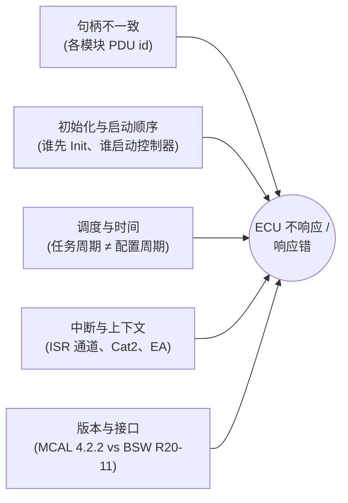

# 集成调试：只属于"集成阶段"的那一类问题

> Prerequisite: [01 配置一致性清单](01-ecu-configuration-checklist.md)、[02 CAN 栈集成](02-can-stack-integration.md)、[03 DCM 集成](03-dcm-integration.md)、[06 CANoe 测试](06-canoe-test.md)
> Next: [Part IX — 如何阅读真实 AUTOSAR 工程](../09-real-project-preparation/01-how-to-read-real-autosar-project.md)
> 完整的逐层调试方法: **[docs/debugging-autosar-diagnostics.md](../debugging-autosar-diagnostics.md)**（"CANoe 发 22 F1 90，ECU 没有 response" 逐层排查手册，含 RH850 寄存器、决策树和故障注入练习）
> 相关章节: [Can Driver 调试](../04-can-mcal/15-can-driver-debugging.md)（L0–L8：物理层到 CanIf 回调）、[DCM 调试](../06-dcm/13-dcm-debugging.md)（DCM 内部状态）

---

## 1. 本章定位

按 [analysis-and-learning-plan.md §6.2](../analysis-and-learning-plan.md) 的去重规则，逐层调试方法**只写在独立手册里**。本章只做两件事：

1. 列出**集成阶段特有**的问题——单个模块各自都"正确"、只有放在一起才出错的那一类；
2. 给出它们在调试手册中的入口。

---

## 2. 集成问题的五个来源

| 来源 | 典型症状 | 为什么单模块测试发现不了 | 调试手册入口 | 配置清单 |
|---|---|---|---|---|
| A 句柄不一致 | CanIf/PduR 静默丢帧；物理请求被当作功能请求 | 每个模块用自己的句柄空间，`0` 在每个模块里都合法 | L5 CanIf、L6 CanTp、L7 PduR | [01 §5.7](01-ecu-configuration-checklist.md) |
| B 启动顺序 | 上电后一段时间或永远不通；首个请求丢失 | 模块 Init 都返回成功，只是"没人启动控制器"或 Dcm 在 PduR 之前收到回调 | L1–L2（ACK）、L8 DSL | [01 §5.13](01-ecu-configuration-checklist.md) |
| C 调度与时间 | 请求收齐但永不处理；P2/S3/N_xx 错位；0x78 太早或太晚 | 周期参数只是"声明"，实际调用在 OS 配置里 | L8 DSL（`Dcm_MainFunction` 是否调用）、L14 CanTp TX | [01 §5.11](01-ecu-configuration-checklist.md) |
| D 中断与上下文 | RX ISR 不来、中断风暴、偶发数据错乱 | 主机测试没有 INTC；并发只在目标板上出现 | L3 中断、§5 寄存器表 | [01 §5.12](01-ecu-configuration-checklist.md) |
| E 版本与接口 | 编译通过但运行时参数错乱；链接期重复符号 | 各模块按各自 Release 的头文件编译 | §8 调试纪律；[DCM 升级指南 §4](../dcm-upgrade-guide.md#4-如何分析-api-changes) | [02 §4](02-can-stack-integration.md) |

---

## 3. 集成问题速查表

| # | 症状 | 最可能的集成原因 | 第一个断点 / 观察点 | demo 中可复现？ |
|---|---|---|---|---|
| 1 | CANoe 报 ACK error | 控制器未 STARTED（ComM/CanSM 未请求 FULL_COM） | `Can_SetControllerMode` 是否被调用；CmSTS | F3 |
| 2 | ECU ACK 但完全无反应 | 接收规则 / EI190 / RFE | RX ISR 入口；RFSTSx、EIC190 | F1、F2 |
| 3 | `CanIf_RxIndication` 来了，CanTp 没收到 | CanIf Rx L-PDU 的 ID/HRH/上层用户 | CanIf 的"未匹配"分支 | F4 |
| 4 | CanTp 收到，Dcm 没收到 | PduR 路由句柄 | `PduR_CanTpStartOfReception` 返回值；DET | F5 |
| 5 | Dcm 收齐，永不处理 | `Dcm_MainFunction` 未调度 | `Dcm_MainFunction` 断点 | F6 |
| 6 | Dcm 处理了，`PduR_DcmTransmit` 未调用 | ComM 非 Full Com；功能寻址/SPRMIB 抑制 | `Dcm_ComM_*ComModeEntered`；请求寻址类型 | 抑制可复现；ComM 不可（demo 无 ComM） |
| 7 | `PduR_DcmTransmit` 成功，总线无帧 | HTH 错、控制器状态、`Can_Write` 返回值 | `Can_Write` 返回值；DET 80 | F8 |
| 8 | 总线有 FF，没有 CF | 测试仪 FC 进不来 / 响应 ID 错 / `Can_MainFunction_Write` 未调度 | CanTp TX 状态与 N_Bs/N_As | F9、F10、F11 |
| 9 | 0x10 有正响应但会话不变、0x11 有正响应但不复位 | TX 确认链路断（`Dcm_TpTxConfirmation` 未到或为 E_NOT_OK）；BswM 规则缺失 | `Dcm_TpTxConfirmation` 的 result | 间接（F8/F10 时 result=E_NOT_OK） |
| 10 | 一切正常，几秒后服务开始回 `7F xx 7F` | S3 超时；测试仪没发 TesterPresent | Dcm 会话状态 | 是（trace 第 721–726 行） |
| 11 | 偶发 0x78 或偶发无响应 | 任务过载导致 `Dcm_MainFunction` 周期抖动；EA 保护缺失 | 任务执行时间、OS 跟踪 | 否（单线程） |
| 12 | MCAL 升级后 RX 数据错乱 | `CanIf_RxIndication` 签名/类型在 MCAL 与 CanIf 之间不一致 | 适配层；头文件版本宏 | 否 |

F1–F11 的具体做法与实测输出见 [调试手册 §7](../debugging-autosar-diagnostics.md#7-故障注入练习)。

---

## 4. 集成调试的三条纪律

1. **先看总线，再看代码**。CANoe trace 先回答"帧有没有、ACK 有没有、响应 ID 对不对"，再决定从哪一层开始下断点（[06 §8.2](06-canoe-test.md)）。
2. **一次只改一个配置**，并且改完重新生成 + 全量编译。生成器的输出之间有交叉引用，只改一个生成文件（而不是改配置源）会让 [01 清单](01-ecu-configuration-checklist.md) 中的引用失配。
3. **断点会改变时序**。停在 RX ISR 里，测试仪的 P2Client、ECU 的 N_Bs/N_Cr 仍在走；时序类问题用计数器、trace 或 DET 钩子代替断点（[Can Driver 调试 §8](../04-can-mcal/15-can-driver-debugging.md)）。

---

## 5. 对未来真实项目的意义

[Real Project Consideration] 真实项目里，§3 的 12 行中至少有一半不在任何单个 BSW 模块的配置界面里——它们分散在 OS、BswM、ComM 和集成代码中。进入项目后，为 §3 的每一行在真实工程里找到"第一个断点"的真实函数名和文件位置，写进自己的诊断链路地图（[09/06 如何追踪 UDS 请求](../09-real-project-preparation/06-how-to-trace-uds-request.md)）。

## 6. 下一章

Part VIII 到此结束。[Part IX](../09-real-project-preparation/01-how-to-read-real-autosar-project.md) 讲进入真实 RH850 + RTA-CAR 工程后，如何用本教程建立的地图去读一个陌生工程。
