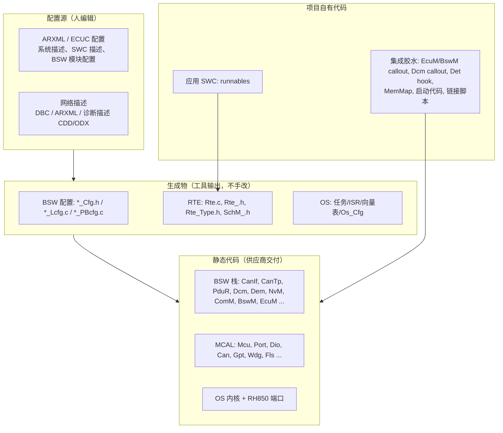

# 如何阅读一个真实的 AUTOSAR 工程：第一天的地图

> Prerequisite: [08-integration/05 UDS 端到端](../08-integration/05-uds-end-to-end.md)、[分层架构](../02-autosar-classic/02-layered-architecture.md)、[配置与 ARXML](../02-autosar-classic/04-configuration-arxml.md)、[ECU 启动](../02-autosar-classic/03-ecu-startup.md)
> Next: [02 如何阅读 MCAL](02-how-to-read-mcal.md)
> 对应规范: SWS MCU **R24-11**（p.13–14 start-up code 职责）；SWS CAN **R22-11**（p.33 一个 Can 模块对应一个硬件单元、多驱动命名 `00284/00385/00386`）；SWS DCM **R20-11**（p.50：DSL/DSD/DSP 划分不强制）。真实工程所用的 AUTOSAR Release、工具与版本**需在真实项目环境中确认**。
> 对应源码: 本项目 `examples/uds_diag_demo/`（目录即"缩小版真实工程"）；历史计划 `plan-implementation-history.md:78-89`（证据清单）、`:150-160`（模块验收标准）；`docs/internal-agent-task.md`（旧语境的 10 步工作流，本章改写为准备清单）

---

## 1. 本章目标

1. 打开一个陌生的 RH850 + AUTOSAR Classic 工程时，知道**按什么顺序**看什么，第一天结束时得到一张"工程地图"。
2. 把工程里的每个目录/文件归入七类之一：配置源、生成代码、静态 BSW、MCAL、OS、集成胶水、应用 SWC（外加启动/链接/构建）。
3. 知道哪些事实**必须从工程里读出来、不能猜**，以及每一项去哪里找。

---

## 2. 为什么需要"地图"而不是"从 main 开始读"？

一个量产 Classic AUTOSAR 工程通常有数百个 C 文件，其中大部分是**生成的**或**供应商静态库**。从 `main()` 顺着调用读，很快会陷入生成的初始化表和宏。更有效的方法是先回答四个问题：

1. **这是什么硬件、什么工具链、什么 AUTOSAR 版本？**（决定你后面读到的 API 签名该和哪份 SWS 对照）
2. **哪些文件是"源"，哪些是"生成物"？**（决定改哪里）
3. **系统怎么启动、谁调度谁？**（决定运行时行为）
4. **我关心的那条链（诊断）经过哪些文件？**（决定调试路径）

本教程的 [UDS 端到端](../08-integration/05-uds-end-to-end.md) 已经给出了第 4 个问题在教学 demo 中的答案；进入真实工程后要做的，是**把同一张图在真实工程里重画一遍**。

---

## 3. 在系统中的位置：工程文件 ↔ 架构层



| 类别 | 典型内容 | 能不能改 | 本教程 demo 的对应 |
|---|---|---|---|
| 配置源 | ARXML、工具工程文件 | 改这里 | 无（demo 直接手写"as if generated"的 `*_Cfg.[ch]`） |
| 生成物 | `*_Cfg.h`、`*_PBcfg.c`、`Rte*.c/h`、`SchM_*.h`、`Os_*` | **不手改**，改源后重新生成 | `*/*_Cfg.[ch]`、`rte/` |
| 静态 BSW | 供应商源码或库 | 一般不改（升级时整体替换） | `ecual/`、`com/`、`diag/`、`mem/` |
| MCAL | 芯片厂源码 + 用户手册 | 一般不改 | `mcal/`（mock） |
| OS | 内核 + 端口 + 生成配置 | 不改内核，改配置 | `integration/BswScheduler.c`（模拟） |
| 集成胶水 | callout、Det hook、启动、链接、MemMap | 项目负责 | `integration/EcuM.c`、`general/Det.c` |
| 应用 SWC | runnables | 项目负责 | `swc/` |

---

## 4. 必须从工程里读出来的事实（不能猜）

[Real Project Consideration] 下表每一项都**需在真实项目环境中确认**。"为什么重要"一栏说明猜错的代价；"去哪里找"给出通常的位置（具体路径因工程而异）。

| # | 事实 | 为什么重要 | 去哪里找 | 映射回本教程 |
|---|---|---|---|---|
| 1 | RH850 derivative（完整器件号） | 决定寄存器地址、CAN 外设类型（RS-CANFD / RS-CAN / M_CAN）、中断通道号 | BOM、原理图、链接脚本中的存储器尺寸、MCAL 配置中的 derivative 选项；运行时读 PRDNAME1–4（P1M-E：HW-E p.2880） | [01-rh850/01](../01-rh850/01-rh850-overview.md)；若不是 R7F701381（P1M-E），本教程所有寄存器地址需重新核对 |
| 2 | 编译器与版本、编译选项 | ABI、寄存器保留（r2/r4/r5）、SDA、FPU、中断函数关键字 | makefile / 构建脚本 / IDE 工程 | [01-rh850/02](../01-rh850/02-cpu-architecture.md)、[05 链接脚本](../01-rh850/05-linker-script.md) |
| 3 | AUTOSAR 工具与版本（配置器、RTE 生成器、OS 生成器） | 生成代码的形态、可用的 ECUC 参数 | 工具工程文件、生成文件头部注释、构建日志 | [02-autosar-classic/04](../02-autosar-classic/04-configuration-arxml.md) |
| 4 | BSW 各模块的 AUTOSAR Release 与供应商软件版本 | API 签名、配置参数、行为（例如 Dem 接口 4.3.0 重做） | 各模块头文件的 `<MOD>_AR_RELEASE_*_VERSION`、`<MOD>_SW_*_VERSION`、`<MOD>_VENDOR_ID` 宏；BSWMD；Release notes | [DCM 升级指南 §2](../dcm-upgrade-guide.md#2-如何识别-dcm-version) |
| 5 | MCAL 供应商、版本与 AR Release | MCAL 与 BSW Release 常不一致，CanIf 回调签名是接缝 | MCAL 头文件版本宏、MCAL 用户手册 | [02 如何阅读 MCAL](02-how-to-read-mcal.md) |
| 6 | OS 与端口版本 | ISR 类别、向量方式、计数器回调契约 | OS 配置、端口文档 | [02-autosar-classic/06](../02-autosar-classic/06-os-task-isr.md) |
| 7 | 诊断 CAN 的通道、引脚、收发器 | 物理层与 Port 配置 | 原理图、Port 配置、Dio 配置 | [04-can-mcal/04](../04-can-mcal/04-can-pin-transceiver.md) |
| 8 | 诊断 ID、寻址格式、TP 参数、P2/S3 | 测试仪配置与 CanIf/CanTp/Dcm 配置 | OEM 诊断规范、CDD/ODX、CanTp/Dcm 配置 | [08-integration/06](../08-integration/06-canoe-test.md) |

[Real Project Consideration] 本仓库根目录的四张截图（转录于 `requirements-extracted.md`）显示过一个可能的真实环境：RTA-CAR 12.9.0、RTA-OS RH850GHS 端口、Green Hills 编译器、Renesas P1M MCAL（标称 AUTOSAR 4.2.2 API）、R7F701381。这些**只能作为"可能的真实环境"的例子**，不能当作公司项目的事实；而且研究笔记 01 已经发现截图里有错误假设（例如 `iROM 2048K`，而 R7F701381 是 1 MB；`80 MHz fCAN`，而 P1M-E 的 fCAN 是 40/16 MHz）。

---

## 5. 第一天的阅读顺序

### Step 1 — 列目录、分类

把顶层目录逐个归入 §3 的七类。判断"是不是生成物"的线索：

- 文件头有"generated by / do not edit / tool version"一类注释；
- 文件名带 `_Cfg`、`_Lcfg`、`_PBcfg`、`Rte_`、`SchM_`、`Os_`；
- 位于名为 `gen`、`generated`、`output`、`cfg` 的目录（命名因工具而异，**需确认**）；
- 构建脚本在编译前调用了某个生成器。

### Step 2 — 找版本与环境事实

对 §4 表中的每一项写下"值 + 出处（文件:行）"。查版本宏的通用方法：

```bash
# [Conceptual] 在真实工程根目录（Git Bash）
grep -rn "_AR_RELEASE_MAJOR_VERSION\|_AR_MAJOR_VERSION" --include=*.h . | sort | head -50
grep -rn "_SW_MAJOR_VERSION" --include=*.h . | sort | head -50
```

R4.x 的宏名形如 `<MOD>_AR_RELEASE_MAJOR_VERSION`；R3.x 是 `<MOD>_AR_MAJOR_VERSION`（openAUTOSAR `diagnostic/Dcm/include/Dcm.h:34-36` 就是 R3 风格，值 3.1.5）。两种命名同时出现，本身就说明工程里混有不同 Release 的模块。

### Step 3 — 找启动路径

从复位到第一个任务（[RH850 启动](../01-rh850/04-startup-process.md)、[ECU 启动](../02-autosar-classic/03-ecu-startup.md)）：

```text
reset vector（链接脚本 / 启动汇编）→ C runtime 初始化（.data/.bss）→ main()
→ EcuM_Init()（或项目自定的初始化）→ DriverInitList（Mcu/Port/Can …）→ StartOS()
→ OS 启动任务 / BswM 初始化 action list → BSW Init → Rte_Start() → 通信启动
```

在工程里搜索这些名字，记录每一步所在的文件和行号。

### Step 4 — 找调度

在 OS 配置（或生成的 OS 代码/RTE 生成的 task body）里找：每个任务的周期/触发方式、每个任务里调用了哪些 `*_MainFunction`、哪些 runnable；每个 ISR 的通道号、类别（Cat1/Cat2）、优先级。

```bash
# [Conceptual]
grep -rn "Dcm_MainFunction\|CanTp_MainFunction\|Can_MainFunction_" --include=*.c .
# 排除模块自身的定义（Dcm.c / CanTp.c / Can.c 中的函数体），剩下的就是调用者——通常在 RTE/SchM/OS 生成的 task body 里
```

把结果填进 [配置清单 §5.11](../08-integration/01-ecu-configuration-checklist.md)。

### Step 5 — 画诊断链路图

用 [05 如何追踪 CAN 信号](05-how-to-trace-can-signal.md) 和 [06 如何追踪 UDS 请求](06-how-to-trace-uds-request.md) 的方法，把 [UDS 端到端 §4](../08-integration/05-uds-end-to-end.md) 的 22 跳逐一映射到真实文件和函数。

### Step 6 — 能构建吗？能调试吗？

确认能在本机重新生成、编译、链接，能下载到板子、连上调试器、在 `Dcm_MainFunction` 停住。**在能够稳定复现构建之前，不要修改任何配置**。

---

## 6. 工程地图模板

[Real Project Consideration] 第一天结束时应得到下面这张表（每格写"值 + 出处"，未知的写"未知 + 计划如何确认"）：

| 区域 | 项目 | 值 | 出处（文件:行 / 工具界面） | 本教程章节 |
|---|---|---|---|---|
| 硬件 | derivative / 封装 / Flash 大小 | | | 01-rh850/01 |
| 硬件 | 诊断 CAN 通道 / 引脚 / 收发器 | | | 04-can-mcal/04 |
| 工具链 | 编译器 / 版本 / 关键选项 | | | 01-rh850/05 |
| 工具链 | AUTOSAR 配置工具 / RTE 生成器 / 版本 | | | 02-autosar-classic/04 |
| 版本 | MCAL 供应商 / 版本 / AR Release | | | 09/02 |
| 版本 | BSW（Dcm、Dem、CanIf、CanTp、PduR）供应商 / 版本 / AR Release | | | dcm-upgrade-guide §2 |
| 版本 | OS / 端口版本 | | | 02-autosar-classic/06 |
| 启动 | reset vector / 启动文件 / `main` | | | 01-rh850/04 |
| 启动 | EcuM 初始化列表位置 | | | 02-autosar-classic/03 |
| 调度 | `Dcm_MainFunction` 所在任务 / 周期 | | | 02-autosar-classic/07 |
| 调度 | `CanTp_MainFunction` / `Can_MainFunction_*` 所在任务 / 周期 | | | 同上 |
| 中断 | CAN RX / TX / ERR ISR 通道与类别 | | | 04-can-mcal/05 |
| 诊断 | Dcm 配置生成文件 | | | 09/03 |
| 诊断 | DID → 应用的连接方式（RTE 端口 / C callout） | | | 07-rte-swc/08 |
| 诊断 | ComM 通道 / BswM 诊断相关规则 | | | 08-integration/03 |

---

## 7. 阅读纪律

1. **证据优先**：每个结论写出处。没有出处的结论标"推测"。
2. **不改生成物**：要改行为，改配置源并重新生成；改生成文件会在下次生成时丢失，并可能破坏 [配置清单](../08-integration/01-ecu-configuration-checklist.md) 中的交叉引用。
3. **不从其他 derivative 的资料填空**：P1x、P1x-C、F1x、U2A 的寄存器和外设不能互相套用（研究笔记 04 §10）。
4. **区分标准接口与供应商内部函数**：`Dcm_TpRxIndication`、`CanIf_RxIndication` 这样的 AUTOSAR 标准名可以直接搜索；DSL/DSD/DSP 的内部函数名每家不同（SWS DCM p.50）。
5. **把"未知"显式化**：维护一份"待确认清单"，每项写清楚"为什么重要、去哪找、谁能回答"。

---

## 8. 练习：在 demo 和 openAUTOSAR 上演练

1. 把 `examples/uds_diag_demo/` 当作"真实工程"，按 §5 的 Step 1–5 填 §6 的表（大部分格子能在 README 和 `*_Cfg.[ch]` 中找到；"硬件"类格子应填"无，mock"）。
2. 对 openAUTOSAR（`D:\side_project\openAUTOSAR`）做 Step 2：用 §5 的 grep 命令列出版本宏，你会看到 Mcu 是 2.2.2、Port 是 3.1.0、Ea 是 4.0.2、多数是 3.1.5（研究笔记 03 §1.7）——这正是"版本混杂"在真实工程里的样子。
3. 对 openAUTOSAR 做 Step 4：找出 `Dcm_MainFunction` 被谁调度、周期是多少（答案：`system/SchM/src/SchM.c:408`，且只在 `USE_DCM` 时，实际周期与 Dcm 自己假设的 10 ms 不一致，研究笔记 03 §6.2）。

---

## 9. 对未来真实项目的意义

这一章本身就是"未来真实项目"的第一步。完成 §6 的表格后：

- 调试"CANoe 发了没响应"时，你知道每一层的真实文件在哪（[调试手册](../debugging-autosar-diagnostics.md)）；
- 准备 DCM 升级时，你已经有了版本基线和依赖清单的雏形（[07 DCM 升级准备](07-rtacar-dcm-upgrade-preparation.md)）。

## 10. 本章总结

- 先分类（源 / 生成物 / 静态 / MCAL / OS / 胶水 / 应用），再找事实（硬件、工具、版本），再找启动与调度，最后画诊断链路。
- 每个事实都要有出处；未知项显式列出，不用其他资料填空。

## 11. 下一章

[02 如何阅读 MCAL](02-how-to-read-mcal.md)：地图的最底层——MCAL 如何把 RH850 的寄存器藏在 AUTOSAR API 后面。
