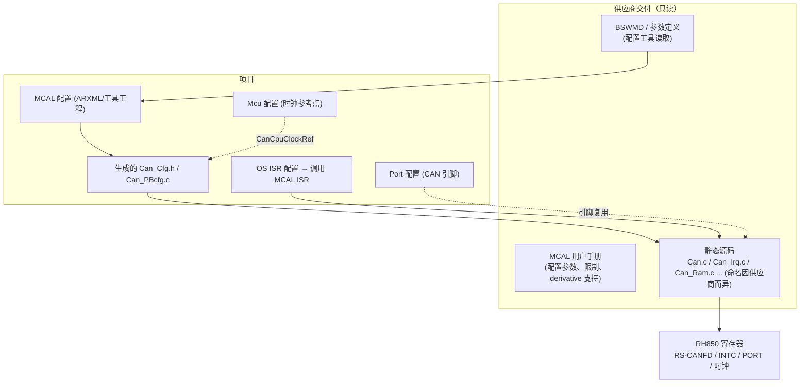

# 如何阅读真实的 MCAL：从 `Can_Init` 追到 RS-CANFD 寄存器

> Prerequisite: [01 如何阅读真实工程](01-how-to-read-real-autosar-project.md)、[MCAL 总览](../03-mcal/01-mcal-overview.md)、[Mcu Driver](../03-mcal/02-mcu-driver.md)、[Port Driver](../03-mcal/03-port-driver.md)、[CAN 配置](../04-can-mcal/08-can-configuration.md)、[CAN Driver 从零实现](../04-can-mcal/14-can-driver-from-scratch.md)
> Next: [03 如何阅读 DCM](03-how-to-read-dcm.md)
> 对应规范: SWS CAN **R22-11**（API p.62–87、类型 p.57–61、配置 p.98–131、Change History p.1–9）；SWS MCU **R24-11**（寄存器初始化归属 `SWS_Mcu_00116/00244–00247` p.25、`McuNoPll` `ECUC_Mcu_00180` p.41）；HW-E R01UH0585EJ0120 Rev.1.20。真实 MCAL 的供应商、版本、AR Release、derivative 支持范围**需在真实项目环境中确认**。
> 对应源码: 本项目 `examples/uds_diag_demo/mcal/Can.c`（每个寄存器动作都有 `[RH850 Hardware]` 注释）、`examples/rh850_mcal_reference/`（OSTM、CAN FD 位时间、MMIO 注入层）、`docs/internal-agent-task.md`（旧"内部 agent"语境下的 10 步工作流——本章将其改写为阅读清单）

---

## 1. 本章目标

1. 面对一个供应商 MCAL（例如 Renesas 为 RH850 提供的 MCAL）时，知道它由哪几部分组成、版本信息在哪里。
2. 能从 `Can_Init`、`Can_Write`、RX ISR 出发，追到它们写/读的 RS-CANFD 寄存器，并与本教程的知识对照。
3. 能为诊断链路填出一张"硬件绑定表"：通道、引脚、时钟、规则、FIFO、TX buffer、中断、HOH 编号，每一项带出处。

---

## 2. 为什么要读 MCAL？它不是"不用改"吗？

确实，MCAL 通常由芯片厂交付、一般不修改。但：

- **诊断不通的问题有一半在 MCAL 配置或其集成上**（引脚、时钟、过滤规则、中断通道、bus-off 策略）。
- MCAL 的 **AUTOSAR Release 往往与 BSW 不同**——截图中的目标环境标称 MCAL 使用 AR 4.2.2 API，而本仓库的 CAN SWS 是 R22-11；两者之间 `Can_Write` 返回类型、`Can_SetControllerMode` 参数类型都可能不同（研究笔记 02 §2.11）。CanIf 与 MCAL 的接缝必须读懂。
- DCM 升级可能牵动 CanIf/CanTp 版本，进而要求核对 MCAL 回调签名。

---

## 3. 在系统中的位置

---

## 4. 版本与身份：先确认你读的是哪个 MCAL

| 要确认的 | 去哪里找 | 为什么 |
|---|---|---|
| 供应商与 MCAL 包版本 | MCAL 发布包的 release note / 目录名 / 用户手册封面 | 同一 derivative 不同 MCAL 版本行为可能不同 |
| AUTOSAR Release | `Can.h` 等头文件中的 `CAN_AR_RELEASE_MAJOR/MINOR/REVISION_VERSION`（R4.x 形态的宏名，**以实际头文件为准**） | 决定 API 签名与要对照的 SWS |
| 供应商软件版本 | `CAN_SW_MAJOR/MINOR/PATCH_VERSION` | 与 BSW 的版本兼容矩阵 |
| 支持的 derivative | 用户手册 / 配置工具中的 derivative 选项 | P1M-E 用 RS-CANFD；P1x（非 E）用 RS-CAN；P1x-C 用 M_CAN（研究笔记 04 §1.1、§10），**寄存器不能互相套用** |
| 接口模式 | 配置参数或生成代码中写 GRMCFG.RCMC 的位置 | Classical 与 FD 接口的寄存器窗口偏移不同（HW-E p.802、p.916–919） |

[AUTOSAR Standard] 不同 Release 之间 CAN 驱动 API 的已知变化（SWS CAN R22-11 Change History，研究笔记 02 §2.11）：

| Release | 变化 | 读 MCAL 时的含义 |
|---|---|---|
| 4.1.1 | `Can_ChangeBaudrate/CheckBaudrate` 废弃，由 `Can_SetBaudrate` 取代 | 旧 MCAL 可能还有前两者 |
| 4.2.1 | 完整 CAN FD（含 Trigger Transmit）；移除 `CanIf_CancelTxConfirmation` | — |
| 4.3.0 | 新增 `Can_GetControllerErrorState/DeInit/GetControllerMode`、`Can_ControllerStateType`；**移除 `Can_StateTransitionType`** | 标称 4.2.2 的 MCAL 中 `Can_SetControllerMode` 的参数类型与 R22-11 不同 |
| R20-11 | 移除 Pretended Networking；新增错误类型上报 | — |
| R22-11 | `Can_Write` 返回 `Std_ReturnType` + `CAN_BUSY`（表格仍残留 "see Can_ReturnType" 字样） | 4.2.x 时代常见 `Can_ReturnType`（`CAN_OK/CAN_NOT_OK/CAN_BUSY`）——本地无 4.2.2 SWS，**unverified locally** |

---

## 5. 阅读路线：三个入口函数

### 5.1 `Can_Init`：初始化序列

在 MCAL 源码中找到 `Can_Init`，按调用顺序列出它写的寄存器，与 [CAN 控制器初始化](../04-can-mcal/06-can-controller-init.md) / 研究笔记 04 §8.7（HW-E Figure 17.16）的 14 步对照：

| 步 | 期望看到的动作（P1M-E，Classical） | 在 MCAL 源码中确认 | HW-E |
|---|---|---|---|
| 1 | 等 GSTS.GRAMINIT==0（有超时） | 超时值与超时处理 | p.1090、p.821 |
| 2 | GCTR.GSLPR=0 → global reset，确认 GSTS | | p.1091、p.819 |
| 3 | GRMCFG.RCMC（Classical/FD） | 与配置一致？ | p.802 |
| 4 | CmCTR.CSLPR=0 → channel reset | | p.1091 |
| 5 | GCFG（DCS 时钟源、TPRI 等） | **DCS 决定 fCAN = 40 MHz（clkc）或 16 MHz（clk_xincan）** | p.816–817 |
| 6 | CmCFG（位时间） | 与网络规范采样点一致？ | p.803–804 |
| 7 | 接收规则（GAFLCFG0、AFLPN 分页、GAFLID/M/P0/P1） | 每个 RECEIVE HOH 产生几条规则？掩码语义（位=1 比较） | p.830–837 |
| 8 | RMNB、RFCCx（先不置 RFE）、CFCCk、TXQ… | FIFO 深度、中断触发方式 | p.838、p.844–845 |
| 9–10 | GCTR / CmCTR 的中断使能、BOM | **BOM 与 CanSM 恢复策略一致？**（`SWS_Can_00274` 禁止自动恢复） | p.807、p.820 |
| 11 | INTC（EIC） | **通常不在 MCAL 里**——由 OS/启动代码配置；确认由谁做 | p.267、p.271 |
| 12 | GCTR.GMDC=00 → global operating | | p.1064 |
| 13 | 单独写 RFCCx.RFE=1 | 是否在 global operating 后单独写？ | p.845 |
| 14 | 通道保持 reset（= `CAN_CS_STOPPED`，`SWS_Can_00259`） | 通道何时进入 communication？由 `Can_SetControllerMode` | p.1065 |

[Educational Implementation] 对照物：教学驱动 [14 章 §7.1](../04-can-mcal/14-can-driver-from-scratch.md) 的 `Can_Init` 完整实现；demo `mcal/Can.c:65-73` 的注释给出了同一序列的概要。

### 5.2 `Can_Write`：发送

找到 `Can_Write`，确认：

1. HTH → 哪个硬件资源（TX buffer p？TX/RX FIFO？TX queue？）——由生成配置决定；
2. 忙判断：读 TMSTSp（**8 位**）；忙时返回 `CAN_BUSY`、不取消在途帧（`SWS_Can_00213`）；
3. 写 TMIDp/TMPTRp/TMDF0_p/TMDF1_p，再 **8 位写** `TMCp=0x01`（HW-E p.878、p.1107）；
4. 保存 `swPduHandle` 直到确认（`SWS_Can_00276`）；
5. 重入保护（exclusive area 名称）。

对照：[Can_Write 实现](../04-can-mcal/10-can-write-implementation.md)；demo `mcal/Can.c:171-217`。

### 5.3 RX ISR：接收

找到 RX 处理（中断或 `Can_MainFunction_Read`）：

1. 它绑定的是哪个中断源？**RX FIFO 应为 EI190（INTRCANGRECC）**；若 MCAL 用 CAN0 common FIFO 接收，才是 EI184（HW-E p.285–286）；
2. 循环读 RFIDx/RFPTRx/RFDF、写 `RFPCTRx=0xFF`、清 RFIF（W0C）；
3. label → HRH 的映射方式；
4. 调用 `CanIf_RxIndication` 的签名（R4.2+ 的 `Can_HwType*` 形态？还是更早的形态？）；
5. 清标志后的 store → dummy read → SYNCP（HW-E p.254）。

对照：[CAN RX 实现](../04-can-mcal/11-can-rx-implementation.md)、[CAN 中断实现](../04-can-mcal/12-can-interrupt-implementation.md)；demo `mcal/Can.c:251-277`。

---

## 6. 读生成的 MCAL 配置

生成的 `Can_PBcfg.c`（或供应商命名）里通常有：控制器表、HOH 表、过滤规则表（或直接是寄存器原值）、位时间原值、FIFO/buffer 分配。

| 要提取的信息 | 用途 | 对照 |
|---|---|---|
| HOH 编号 ↔ 类型 ↔ 硬件资源 | CanIf 的 HRH/HTH 引用必须一致 | [配置清单 §5.4](../08-integration/01-ecu-configuration-checklist.md) |
| 每个 RECEIVE HOH 的 ID/掩码（或 GAFLM 原值） | 诊断请求 ID 是否被接收；掩码语义是否正确 | HW-E p.834 |
| 位时间原值（CmCFG / NCFG / DCFG） | 用 fCAN 反算波特率与采样点 | `examples/rh850_mcal_reference/mcal/can/Can_BitTiming.c`；[位时间](../04-can-mcal/03-can-clock-bit-timing.md) |
| RX/TX processing（INTERRUPT/POLLING/MIXED） | 是否需要 OS 中声明 ISR，是否需要调度 `Can_MainFunction_Read/Write` | SWS CAN p.109–110 |
| 规则数 + FIFO 深度 + buffer 数 | Classical 模式 RAM 预算（≤192 条消息存储，HW-E p.1097） | 研究笔记 04 §8.5 |

---

## 7. 不在 Can MCAL 里、但决定 CAN 能否工作的东西

| 内容 | 归属 | 去哪里找 |
|---|---|---|
| CAN RX/TX 引脚的 ALT、方向、PIPC=0 | Port 驱动（`SWS_Can_00239`） | Port 配置；HW-E p.94、p.131；ALT 号需在 PDF 原表逐格核对（研究笔记 04 §6.3） |
| 收发器 STB/EN | Dio 或 CanTrcv 驱动 | 原理图 + 收发器手册（**需在真实项目环境中确认**） |
| fCAN 时钟源 | Mcu 驱动 + GCFG.DCS | P1M-E 没有软件可编程 PLL；时钟固定（HW-E p.469–471） |
| EIC、向量表、ISR 类别与优先级 | OS 端口 / 启动代码 | OS 配置；向量方式（直接 / 表引用 INTBP） |
| 写保护 | P1M-E：时钟控制器 = Slave Guard（p.471）；复位寄存器 = P-Bus Guard（p.420）（**没有 PROTCMDn/PROTSn**） | HW-E p.420、p.471、p.2764；研究笔记 04 §4.4 |

[RH850 Hardware] 注意不要把 F1x / P1x（非 E）的 `PROTCMD`/`PROT1PHCMD` + PLL 启动序列套到 P1M-E 上（analysis-and-learning-plan E8）。

---

## 8. 硬件绑定表（阅读成果）

[Real Project Consideration] 把旧 `docs/internal-agent-task.md` 中的 10 步工作流改写为一张表。每格写"值 + 出处"，未知写"未知 + 计划"：

| # | 项 | 值 | 出处 | 检查要点 |
|---|---|---|---|---|
| 1 | 完整器件号 / 封装 | | BOM、PRDNAME | 若非 R7F701381，本教程地址需全部重核 |
| 2 | MCAL 供应商 / 版本 / AR Release | | 头文件宏、release note | 与 BSW 的接缝 |
| 3 | 诊断 CAN 通道（CAN0/1/2） | | 原理图、MCAL 配置 | — |
| 4 | RX/TX 引脚与 ALT | | Port 配置、原理图 | PIPC=0；ALT 号 PDF 原表核对 |
| 5 | 收发器型号、STB/EN 引脚与有效电平 | | 原理图 | — |
| 6 | 接口模式（Classical/FD） | | GRMCFG 写入处 | 寄存器窗口一致性 |
| 7 | fCAN 与位时间原值、采样点 | | GCFG.DCS、CmCFG 原值 | 不是 80 MHz |
| 8 | 诊断请求/响应 ID 的接收规则、FIFO、TX buffer | | 生成配置 | GAFLM 位=1 比较 |
| 9 | RX / TX / ERR 中断通道、类别、优先级、向量方式 | | OS 配置、向量表 | RX FIFO = EI190 |
| 10 | Bus-off 策略（BOM）与 CanSM 恢复 | | MCAL 配置、CanSM 配置 | 不自动恢复 |
| 11 | HOH 编号 ↔ CanIf HRH/HTH | | `Can_Cfg.h` + CanIf 配置 | 与 [配置清单 §5.4](../08-integration/01-ecu-configuration-checklist.md) 一致 |
| 12 | `Can_MainFunction_*` 的调度位置与周期 | | OS / RTE 生成的 task body | 与 processing 配置一致 |
| 13 | 期望读回值（初始化完成后） | | 本表 + [Can Driver 调试 §5](../04-can-mcal/15-can-driver-debugging.md) | 只列实际使用的资源 |

---

## 9. openAUTOSAR 与 demo 能帮什么、不能帮什么

| 资源 | 能帮什么 | 不能帮什么 |
|---|---|---|
| openAUTOSAR | Can API 声明与 Arctic 的回调表设计（`include/Can.h:178-185`、`:313-334`） | **没有 Can.c**，MCAL 是 STM32/MPC5xxx 遗留（研究笔记 03 §1.3），与 RS-CANFD 无关 |
| demo `mcal/Can.c` | 清楚标出了每个"真实驱动会碰寄存器"的位置 | 不碰寄存器 |
| 第 14 章教学驱动 | 完整的 RS-CANFD 寄存器级实现 + mock 寄存器测试 | 未上板验证；不是 Renesas MCAL |
| `examples/rh850_mcal_reference/` | MMIO 注入层、OSTM、CAN FD 位时间计算（主机测试通过） | 只证明算术与访问宽度，不证明硬件行为 |

---

## 10. 实验

1. 在第 14 章教学驱动中，按 §5.1 的表格逐行找到 `Can_Init` 对应的代码行，做出"教学驱动版"的 §5.1 表。进入真实项目后用同一张表格对照真实 MCAL。
2. 用 `Can_BitTiming.c`（`examples/rh850_mcal_reference/mcal/can/`）的思路，给定 fCAN=40 MHz 与一个 CFG 原值（例如研究笔记中的 `0x023E0003`），手算 BRP/TSEG1/TSEG2/SJW、波特率与采样点。
3. 列出你认为真实 MCAL 的 `Can_Write` 与 demo `mcal/Can.c:171-217` 最可能不同的 5 个地方（提示：exclusive area、FD、多 buffer HTH、Trigger Transmit、返回类型）。

---

## 11. 对未来真实项目的意义

[Real Project Consideration]

- §8 的硬件绑定表是进入项目后**第一份交付物**；它同时服务于 CAN bring-up、诊断调试和后续的 DCM 升级（升级若牵动 CanIf，需要核对 MCAL 回调签名）。
- 遇到"CAN 不通"，先用 §8 表中的期望读回值和 [Can Driver 调试](../04-can-mcal/15-can-driver-debugging.md) 的九层模型排查，再怀疑上层。
- 不确定的硬件细节（ALT 号、收发器引脚、derivative 差异）一律回到手册原表和原理图，不从本教程或其他 derivative 的资料"填空"。

## 12. 本章总结

- MCAL = 供应商静态源码 + 生成配置 + 用户手册；先确认版本与 derivative，再读代码。
- 三个入口：`Can_Init`（寄存器初始化序列）、`Can_Write`（TX buffer 操作）、RX ISR（FIFO 读取与回调）。
- 很多决定 CAN 能否工作的东西不在 Can MCAL 里：引脚（Port）、收发器（Dio/CanTrcv）、时钟（Mcu）、中断（OS）。

## 13. 下一章

[03 如何阅读 DCM](03-how-to-read-dcm.md)：从硬件跳到诊断核心，用同样的方法读一个陌生的 Dcm。
