# 如何阅读一个陌生的 DCM：从标准接口名找到供应商的 DSL / DSD / DSP

> Prerequisite: [DCM 总览](../06-dcm/01-dcm-overview.md)、[DSL](../06-dcm/02-dsl.md)、[DSD](../06-dcm/03-dsd.md)、[DSP](../06-dcm/04-dsp.md)、[DCM 配置](../06-dcm/05-dcm-configuration.md)、[08-integration/03 DCM 集成](../08-integration/03-dcm-integration.md)、[01 如何阅读真实工程](01-how-to-read-real-autosar-project.md)
> Next: [04 如何阅读生成代码](04-how-to-read-generated-code.md)
> 对应规范: SWS DCM **R20-11**：p.49–50（DSL/DSD/DSP 划分**不强制**）；对外 API p.236–247；`Dcm_MainFunction` `00053` p.260–261；可选/必需接口 p.261–265；Callout 与 RTE 端口 p.265–415；配置 p.442–678。真实 DCM 的供应商、版本、Release**需在真实项目环境中确认**。
> 对应源码: 本项目 `examples/uds_diag_demo/diag/`（教学 Dcm，结构清晰的参照物）；openAUTOSAR `diagnostic/Dcm/`（R3.1.5 风格的真实开源 Dcm，用作"陌生 Dcm"练习对象）

---

## 1. 本章目标

1. 打开一个陌生的商业 Dcm（源码或部分源码 + 生成配置）时，能在一天内找到：入口、TP 回调、MainFunction、DSL 状态、服务表、DID 表、会话/安全行、应用接口（RTE 端口或 callout）、与 Dem/ComM/BswM/NvM 的接口。
2. 能用"从 AUTOSAR 标准接口名出发、沿调用链向内追"的方法，绕过供应商内部命名的差异。
3. 能填出一张"教学 Dcm ↔ 真实 Dcm"的对照表，把本教程的知识映射到真实实现上。

---

## 2. 为什么不能"按 DSL/DSD/DSP 找文件"？

[AUTOSAR Standard] SWS DCM R20-11 p.50 Note 明确：子模块划分及其内部接口**不是强制实现**，只是为了规范可读性。所以：

- 真实 Dcm 可能没有名为 `Dcm_Dsl.c` 的文件，也可能把 DSD 和 DSP 合在一起，或者按服务拆成几十个文件；
- 规范中出现的 `DslInternal_SetSecurityLevel`、`DspInternal_DcmConfirmation` 这类名字只是**伪名**（demo `diag/Dcm_Internal.h:4-8` 的注释也说明了这一点）。

但**对外接口是标准化的**：`Dcm_Init`、`Dcm_MainFunction`、`Dcm_StartOfReception`、`Dcm_CopyRxData`、`Dcm_TpRxIndication`、`Dcm_CopyTxData`、`Dcm_TpTxConfirmation`、`Dcm_GetSesCtrlType` 等，以及它调用的 `PduR_DcmTransmit`、`ComM_DCM_ActiveDiagnostic`、`Dem_*`、`Rte_Call_*` / `Xxx_ReadData`。**从这些固定点出发向内追，就能找到每个子功能的实际位置。**

---

## 3. 在系统中的位置：固定点地图

```mermaid
flowchart LR
    subgraph In["进入 Dcm 的固定点"]
        I1["Dcm_Init"]
        I2["Dcm_MainFunction"]
        I3["Dcm_StartOfReception / CopyRxData / TpRxIndication"]
        I4["Dcm_CopyTxData / TpTxConfirmation"]
        I5["Dcm_ComM_*ComModeEntered"]
        I6["Dcm_Get* / Dcm_ResetToDefaultSession"]
    end
    subgraph Dcm["供应商 Dcm（内部命名未知）"]
        X["DSL 等价物<br/>DSD 等价物<br/>DSP 等价物"]
    end
    subgraph Out["离开 Dcm 的固定点"]
        O1["PduR_DcmTransmit"]
        O2["ComM_DCM_Active/InactiveDiagnostic"]
        O3["Dem_*"]
        O4["NvM_*"]
        O5["Rte_Call_* / Xxx_ReadData 等 callout"]
        O6["SchM_Switch_* (mode)"]
        O7["Det_Report*"]
    end
    In --> X --> Out
```



| 固定点 | 由它向内追到什么 | demo 中的落点 |
|---|---|---|
| `Dcm_TpRxIndication` | DSL：请求完整后的登记、P2 启动 | `diag/Dcm_Dsl.c:384-438` |
| `Dcm_MainFunction` | DSL 状态机 → DSD 入口 → P2/S3 计时 | `diag/Dcm.c:33-40` → `diag/Dcm_Dsl.c:249-302` |
| DSD 入口里的查表 | 服务表结构与检查顺序 | `diag/Dcm_Dsd.c:77-142` |
| `Rte_Call_DataServices_*` 或 `Xxx_ReadData` 的调用者 | DSP 的 0x22 处理与 DID 表 | `diag/Dcm_Dsp.c:264-367` |
| `PduR_DcmTransmit` 的调用者 | DSL 的发送、0x78 发送 | `diag/Dcm_Dsl.c:199`、`:221` |
| `SchM_Switch_*DcmDiagnosticSessionControl` 的调用者 | 会话切换（应在 TX 确认后） | `diag/Dcm_Dsl.c:108-122` |
| `SchM_Switch_*DcmEcuReset` 的调用者 | 0x11 复位流程 | `diag/Dcm_Dsp.c:160`、`diag/Dcm_Dsl.c:178` |
| `Dem_*` 的调用者 | 0x14 / 0x19 / 0x85 | `diag/Dcm_Dsp.c:170-258` |

---

## 4. AUTOSAR 如何定义 Dcm 的"可见面"

[AUTOSAR API]（R20-11）——这些名字在任何符合 R4.x/R20-11 的 Dcm 里都应该能搜到（版本较老的 Dcm 可能是 R3.x 名字，见 §6）：

```c
void              Dcm_Init(const Dcm_ConfigType* ConfigPtr);                 /* SWS_Dcm_00037 p.236 */
void              Dcm_MainFunction(void);                                    /* SWS_Dcm_00053 p.260 */
BufReq_ReturnType Dcm_StartOfReception(PduIdType, const PduInfoType*, PduLengthType, PduLengthType*); /* 00094 */
BufReq_ReturnType Dcm_CopyRxData(PduIdType, const PduInfoType*, PduLengthType*);                     /* 00556 */
void              Dcm_TpRxIndication(PduIdType, Std_ReturnType);                                     /* 00093 */
BufReq_ReturnType Dcm_CopyTxData(PduIdType, const PduInfoType*, const RetryInfoType*, PduLengthType*); /* 00092 */
void              Dcm_TpTxConfirmation(PduIdType, Std_ReturnType);                                   /* 00351 */
void              Dcm_ComM_NoComModeEntered(uint8 NetworkId);   /* 00356 */  /* Silent / Full: 00358 / 00360 */
Std_ReturnType    Dcm_GetSesCtrlType(Dcm_SesCtrlType*);         /* 00339 */
Std_ReturnType    Dcm_GetSecurityLevel(Dcm_SecLevelType*);      /* 00338 */
void              Dcm_GetVersionInfo(Std_VersionInfoType*);     /* 00065 p.237 */
```

生成/静态头文件（R20-11 规范中出现的文件名）：`Dcm.h`、`Dcm_Cbk.h`（若有）、`Dcm_ComM.h`、`Rte_Dcm_Type.h`、`Dcm_Externals.h`（callout 原型）、`SchM_Dcm.h`。实际文件划分**需在真实项目环境中确认**。

---

## 5. 阅读步骤（`claude_plan.md` "对未来真实项目的意义" 的 10 步展开）

| 步 | 找什么 | 怎么找 | 看什么 | demo 参照 |
|---|---|---|---|---|
| 1 | `Dcm_Init()` | 搜定义；搜调用者（EcuM/BswM 初始化列表） | 初始化了哪些状态；是否调 `Dcm_GetProgConditions`、`Xxx_GetSecurityAttemptCounter`；配置指针来源 | `diag/Dcm.c:16-28` |
| 2 | `Dcm_MainFunction()` | 搜定义；搜调用者（OS/RTE task body） | 调用了哪些内部 main 函数、顺序；所在任务的周期是否 = `DcmTaskTime` | `diag/Dcm.c:33-40` |
| 3 | `Dcm_Cfg*` | 生成目录中的 `Dcm_Cfg.h`、`Dcm_Lcfg.c`、`Dcm_PBcfg.c`（命名因工具而异） | 配置结构体的顶层类型、数组、开关宏 | `diag/Dcm_Cfg.h`、`diag/Dcm_Cfg.c` |
| 4 | service table | 配置中按 SID 排列、带函数指针或服务枚举的表 | SID、处理函数、会话/安全引用、子功能表、最小长度 | `diag/Dcm_Cfg.c:114-125` |
| 5 | protocol / connection | 协议行、连接、Rx/Tx PDU 引用、缓冲引用、ComM 通道引用 | 物理/功能 Rx PDU id 是否与 PduR 一致；缓冲大小 | `diag/Dcm_Cfg.h:24-33` |
| 6 | PduR ↔ Dcm 接口 | TP 回调定义；`PduR_DcmTransmit` 调用处 | 返回值语义（忙、溢出）；0x78 是否用独立缓冲（`00119`） | `diag/Dcm_Dsl.c:309-497` |
| 7 | DID configuration | DID 表、DidInfo、Data 元素 | 标识符、长度、`UsePort`、读/写会话/安全引用 | `diag/Dcm_Cfg.c:33-49` |
| 8 | application callback / RTE interface | `Rte_Call_DataServices_*`、`Rte_Call_SecurityAccess_*`、`Rte_Call_RoutineServices_*`，或 `Dcm_Externals.h` 中的 C callout | 同步/异步签名、OpStatus 处理、ErrorCode 处理 | `rte/Rte_Dcm.c:54-130` |
| 9 | session / security configuration | 会话行（P2/P2*）、安全行（seed/key 大小、尝试次数、延时、端口） | 与 OEM 规范一致性；安全级在会话切换时复位（`00139`） | `diag/Dcm_Cfg.c:19-30` |
| 10 | DET / DEM error handling | `Det_ReportError`、`Det_ReportRuntimeError` 调用点；Dem client 配置 | 哪些错误开发期可见；`DcmDemClientRef` | `diag/Dcm_Dsl.c:281`、`diag/Dcm_Cfg.h:37` |

[Real Project Consideration] 完成后**把真实实现映射回本教程建立的 architecture**：每找到一个真实位置，就在下面 §7 的对照表里填一格。

---

## 6. 识别 Dcm 的"年代"：R3.x 还是 R4.x？

| 特征 | R3.x（例：openAUTOSAR，R3.1.5） | R4.x / R20-11 | 证据 |
|---|---|---|---|
| TP 接收 | `Dcm_ProvideRxBuffer(PduIdType, PduLengthType, PduInfoType**)`——下层向 Dcm"借整块 buffer" | `Dcm_StartOfReception` + `Dcm_CopyRxData`——分段拷贝 | openAUTOSAR `diagnostic/Dcm/include/Dcm_Cbk.h:32-35`；SWS DCM p.243–245 |
| 结果类型 | `NotifResultType` | `Std_ReturnType` | 同上 |
| TP 发送 | `Dcm_ProvideTxBuffer` | `Dcm_CopyTxData` | 研究笔记 03 §4.8 |
| DID 回调 | `ReadData(uint8 *data)`，无 OpStatus | 按 `UsePort` 分同步/异步，异步带 `Dcm_OpStatusType` | openAUTOSAR `Dcm_Lcfg.h:44-93`；SWS DCM p.269–270 |
| 应用接口 | 配置里的 C 函数指针，`DspDidUsePort` 字段不被读取 | RTE 端口（`DataServices_*` 等）或 FNC callout | openAUTOSAR `Dcm_Lcfg.h:174-181`；SWS DCM p.335–415 |
| 需求编号 | `DCMxxx` | `SWS_Dcm_xxxxx` | — |
| 版本宏 | `DCM_AR_MAJOR_VERSION` 等 | `DCM_AR_RELEASE_MAJOR_VERSION` 等 | openAUTOSAR `Dcm.h:34-36` |
| Dem 接口 | `Dem_ClearDTC(dtc, group, origin)` 直接调用 | ClientId + `Dem_SelectDTC` 先选后做（4.3.0 起） | openAUTOSAR `Dcm_Dsp.c:590`；SWS DCM p.116、p.82 |

详细的版本识别与 Release 对比见 [DCM 升级指南 §2–§3](../dcm-upgrade-guide.md#2-如何识别-dcm-version)。

---

## 7. 对照表：教学 Dcm ↔ 真实 Dcm

[Real Project Consideration] 第三列在进入真实项目后填写（供应商内部命名**需在真实项目环境中确认**）。

| 职责 | 教学 Dcm（demo） | 真实 Dcm（填写：文件:函数/变量） | 备注 |
|---|---|---|---|
| TP 接收登记 | `Dcm_StartOfReception` / `Dcm_CopyRxData` / `Dcm_TpRxIndication`（`diag/Dcm_Dsl.c:309-438`） | | 标准名，应能直接搜到 |
| 请求状态机 | `Dcm_Dsl.state`（IDLE/RECEIVING/REQ_RECEIVED/PROCESSING/TRANSMITTING，`diag/Dcm_Dsl.c:36-42`） | | 可能是多个变量的组合 |
| 缓冲 | `Dcm_DslRxBuffer` / `Dcm_DslTxBuffer`（`diag/Dcm_Dsl.c:72-73`） | | 可能由配置提供存储 |
| 0x78 独立缓冲 | `Dcm_DslRcrrpBuffer`（`diag/Dcm_Dsl.c:74`，`SWS_Dcm_00119`） | | openAUTOSAR 用 8 字节 localTxBuffer |
| P2 / S3 计时 | `p2TimerMs` / `s3TimerMs`（`diag/Dcm_Dsl.c:61-63`） | | 单位可能是 MainFunction 周期数 |
| 会话 / 安全状态 | `sessionRow` / `secLevel`（`diag/Dcm_Dsl.c:64-65`） | | — |
| 会话切换（TX 确认后） | `Dcm_DslFinishRequest`（`diag/Dcm_Dsl.c:163-185`） | | 检查是否在 TX 确认后（`00311`） |
| DSD 检查链 | `Dcm_DsdCheckRequest`（`diag/Dcm_Dsd.c:77-142`） | | **检查顺序是升级回归的重点** |
| 功能寻址 NRC 抑制 | `Dcm_DsdNrcSuppressedForFunctional`（`diag/Dcm_Dsd.c:40-46`） | | `00001` |
| 服务处理函数签名 | `(OpStatus, MsgContext*, ErrorCode*)`（`diag/Dcm_Cfg.h:118-119`） | | 外部服务处理器形态 p.415 |
| 0x22 处理 | `Dcm_DspReadDataByIdentifier`（`diag/Dcm_Dsp.c:264-367`） | | — |
| DID 表 | `Dcm_Dids[]`（`diag/Dcm_Cfg.c:33-49`，压平） | | 真实为多容器互引用 |
| 应用接口 | `Rte_Call_DataServices_DID_F190_ReadData`（`rte/Rte_Dcm.c:54`） | | RTE 端口或 C callout |
| 安全尝试计数 / 延时 | `Dcm_DspSec`（`diag/Dcm_Dsp.c:31-35`） | | 是否上电恢复（`Xxx_GetSecurityAttemptCounter`） |
| ComM 门控 | **无** | | demo 未实现，真实项目必查 |
| BswM 模式 | `SchM_Switch_Dcm_*`（`rte/Rte_Dcm.c:134-155`） | | — |
| Dem 接口 | `Dem_SelectDTC` / `Dem_ClearDTC` / `Dem_SetDTCFilter`（`diag/Dcm_Dsp.c:170-258`） | | ClientId 形态？ |

---

## 8. 练习：把 openAUTOSAR 的 Dcm 当作"陌生 Dcm"

openAUTOSAR 的 Dcm 是一个真实的开源实现（Arctic Core 2.18.0，R3.1.5 风格），非常适合练习本章方法。研究笔记 03 §4 已经给出答案，先自己做、再对照：

1. **固定点**：找到 `Dcm_Init`、`Dcm_MainFunction`、TP 回调（答案：`diagnostic/Dcm/src/Dcm.c:79/96/109/124/174/188`——注意 TP 回调是 R3 名字）。
2. **MainFunction 内部顺序**（答案：`DsdMain → DspMain → DslMain`，`Dcm.c:100-102`）。
3. **DSL 状态**（答案：`Dcm_DslBufferUserType` 缓冲所有权状态机，`Dcm_Lcfg.h:395-406`）。
4. **DSD 检查顺序**（答案：`Dcm_Dsd.c:278-338`：SID → 会话 → 安全 → 应用许可 → SPRMIB；0x12/0x13 由各 DSP 自己检查）。
5. **DID 读取如何调用应用**（答案：配置中的 C 函数指针 `DspDidReadDataFnc`，`Dcm_Dsp.c:1254`；没有 RTE 端口）。
6. **会话切换时机**（答案：0x10 处理中**立即**切换，`Dcm_Dsp.c:487`——与 R4.x 的"TX 确认后切换"不同）。
7. **找出一个规范偏差**（例如：SecurityAccess 没有尝试次数/延时，`Dcm_Dsp.c:1614-1731`；0x19 未知子功能回 0x31 而非 0x12，`Dcm_Dsp.c:1159`）。

然后用 §7 的表格，把第三列填成 openAUTOSAR 的位置。

---

## 9. 常见误读

| 误读 | 正确理解 |
|---|---|
| "找不到 `Dcm_Dsd.c`，所以这个 Dcm 没有 DSD" | 划分不强制；从 `Dcm_MainFunction` 向内追 |
| "服务表里有 0x22，所以 0x22 一定能用" | 还要看协议引用的是哪张服务表、会话/安全引用、DID 表 |
| "SWC 回调返回 E_NOT_OK 时 Dcm 会回 0x22" | R20-11 中由 ErrorCode 决定（`01414`）；未指定时 0x10（`00271`）；具体实现以真实 Dcm 为准 |
| "会话切换在处理 0x10 时立即生效" | R20-11 要求在 TX 确认后（`00311`）；老实现可能不同（openAUTOSAR 即是） |
| "Dcm 收到请求就会回" | 还受 ComM 通信模式（`00148–00156`）、功能寻址抑制（`00001`）、SPRMIB（`00200`）约束 |

---

## 10. 对未来真实项目的意义

[Real Project Consideration]

1. 进入真实 RTA-CAR 项目后，按 §5 的 10 步阅读 Dcm，按 §7 填对照表；这份对照表就是你调试和升级时的"索引"。
2. 如果真实项目只提供 Dcm 的库文件（不提供源码），§3 的固定点仍然可以用：在固定点上下断点、观察参数与返回值，配合生成的配置文件推断内部行为。
3. DCM 升级前后各做一次 §7 的对照，差异就是升级影响面的第一手证据（见 [DCM 升级指南](../dcm-upgrade-guide.md)）。

## 11. 本章总结

- DSL/DSD/DSP 是规范的描述方式，不是文件结构；读陌生 Dcm 要从标准接口名（固定点）向内追。
- 10 步阅读：Init → MainFunction → 配置 → 服务表 → 协议/连接 → PduR 接口 → DID → 应用接口 → 会话/安全 → DET/DEM。
- 先识别 Dcm 的"年代"（R3.x vs R4.x），再决定对照哪份规范。

## 12. 下一章

[04 如何阅读生成代码](04-how-to-read-generated-code.md)：Dcm 的大部分"行为"其实写在生成的配置表里。
