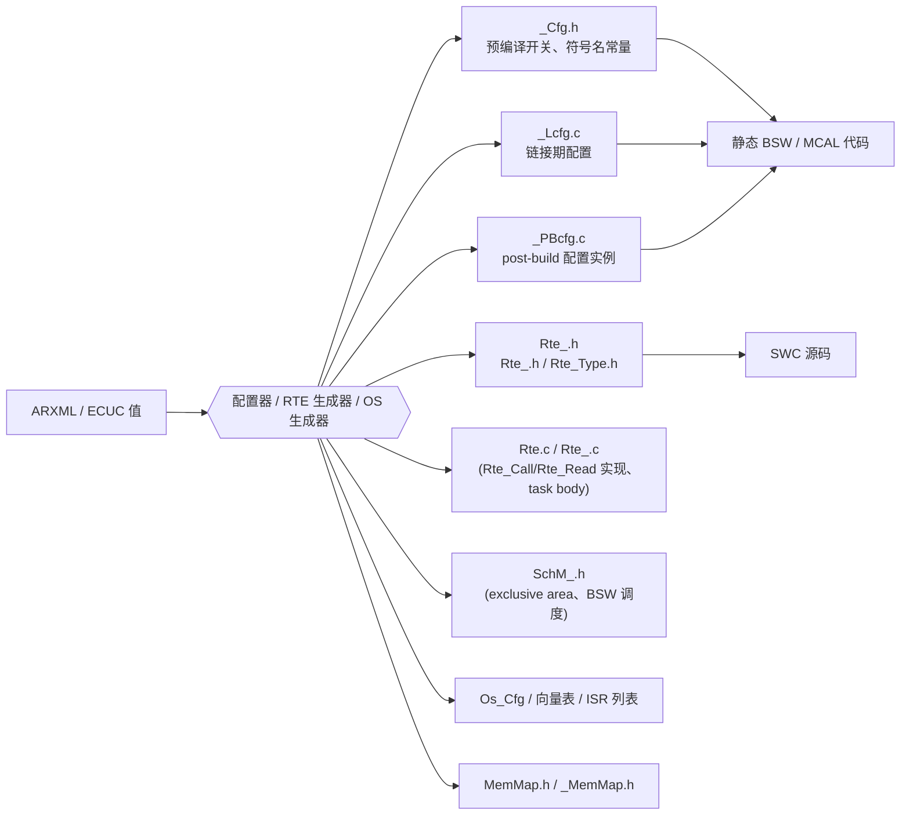

# 如何阅读生成代码：配置表、RTE 头文件与"符号名就是地图"

> Prerequisite: [配置与 ARXML](../02-autosar-classic/04-configuration-arxml.md)、[生成代码](../02-autosar-classic/05-generated-code.md)、[RTE 生成](../07-rte-swc/05-rte-generation.md)、[01 如何阅读真实工程](01-how-to-read-real-autosar-project.md)、[03 如何阅读 DCM](03-how-to-read-dcm.md)
> Next: [05 如何追踪 CAN 信号](05-how-to-trace-can-signal.md)
> 对应规范: SWS CAN **R22-11**（配置变体 VARIANT-PRE-COMPILE / POST-BUILD、`Can_ConfigType` p.57、配置容器 p.98–131）；SWS MCU **R24-11**（`SWS_Mcu_00126` p.38：即使 PRE-COMPILE 变体 Init 也带指针参数，传 NULL）；SWS DCM **R20-11**（`Dcm_ConfigType`、`Dcm_Externals.h`、`Rte_Dcm_Type.h`、`SchM_Dcm.h` 出现在 p.226–301 的类型/接口定义中）。**本仓库无 RTE / EcuC / Os 的 SWS**；生成文件的具体命名与组织由工具决定，**需在真实项目环境中确认**。
> 对应源码: 本项目 `examples/uds_diag_demo/` 中全部"hand-written as if generated"文件（`mcal/Can_Cfg.*`、`ecual/CanIf_Cfg.*`、`com/CanTp_Cfg.*`、`com/PduR_Cfg.*`、`diag/Dcm_Cfg.*`、`rte/*`）；openAUTOSAR 中缺失的配置实例（研究笔记 03 §2、§3.3）

---

## 1. 本章目标

1. 认识 Classic AUTOSAR 工程里常见的生成文件种类，以及它们分别回答哪类问题。
2. 学会用**符号名**在生成文件之间追踪一个 PDU / DID / 端口，而不是靠数字。
3. 学会用"改配置 → 重新生成 → diff 生成物"的方法理解一个配置项的影响。
4. 理解为什么永远不手改生成文件。

---

## 2. 为什么要读生成代码？

[Conceptual] AUTOSAR 的"代码 + 配置"分离意味着：**模块代码只提供机制，路由与参数全部在生成的表里**（[UDS 端到端 §8](../08-integration/05-uds-end-to-end.md)）。所以：

- 问"0x7E0 交给谁"——答案在生成的 CanIf Rx PDU 表里；
- 问"0x22 支持哪些会话"——答案在生成的 Dcm 服务表里；
- 问"F190 调哪个函数"——答案在生成的 Dcm DID 表 + RTE 生成代码里；
- 问"`Dcm_MainFunction` 多久跑一次"——答案在生成的 OS/RTE task body 和 OS 配置里。

demo 把这些表手写成了"as if generated"的样子，并在注释里标出了对应的 ECUC 容器（例如 `diag/Dcm_Cfg.h:5-11`），正是为了让你提前熟悉这种阅读方式。

---

## 3. 在系统中的位置：生成文件家族



| 生成文件（常见命名） | 回答的问题 | demo 中的"替身" | 教程章节 |
|---|---|---|---|
| `<Mod>_Cfg.h` | 哪些功能开了（`DevErrorDetect`、服务开关）；符号名常量（`<Mod>Conf_<Container>_<Name>`） | `mcal/Can_Cfg.h`、`ecual/CanIf_Cfg.h`、`com/CanTp_Cfg.h`、`com/PduR_Cfg.h`、`diag/Dcm_Cfg.h` | [02-autosar-classic/05](../02-autosar-classic/05-generated-code.md) |
| `<Mod>_PBcfg.c` / `<Mod>_Lcfg.c` | 表本身：HOH、L-PDU、N-SDU、路由、服务、DID… | `*_Cfg.c` | 同上 |
| `Rte_<Swc>.h` | SWC 能用哪些 `Rte_*` API；runnable 原型 | `rte/Rte_VehicleInfoSWC.h`、`rte/Rte_SecurityAccessSWC.h` | [07-rte-swc/05](../07-rte-swc/05-rte-generation.md) |
| `Rte_Dcm.h` / `Rte_Dcm_Type.h` | Dcm 的端口调用原型；`Dcm_OpStatusType`、NRC 类型 | `rte/Rte_Dcm.h`、`rte/Rte_Dcm_Type.h` | [07-rte-swc/08](../07-rte-swc/08-dcm-rte-integration.md) |
| `Rte.c` | `Rte_Call_*` 的实现、mode switch、task body | `rte/Rte_Dcm.c` | 同上 |
| `SchM_<Mod>.h` | `SchM_Enter/Exit_<Mod>_<EA>`、`SchM_Switch_*` | `rte/SchM_Dcm.h` | [02-autosar-classic/07](../02-autosar-classic/07-mainfunction-scheduling.md) |
| OS 生成物 | 任务、alarm、ISR 列表、向量表 | `integration/BswScheduler.c`（模拟） | [02-autosar-classic/06](../02-autosar-classic/06-os-task-isr.md) |
| `Dcm_Externals.h`（若用 FNC callout） | 集成者必须实现的 C 函数原型 | 无（demo 用 RTE 方式） | SWS DCM p.265–295 |
| MemMap | 代码/数据放在哪个段 | 无 | [01-rh850/05](../01-rh850/05-linker-script.md) |

[Real Project Consideration] 上表是**常见命名**；具体工具（例如截图中出现过的 RTA-CAR 系列）实际生成哪些文件、放在哪个目录、命名规则如何，**需在真实项目环境中确认**。

---

## 4. 配置变体与配置指针

[AUTOSAR Standard] 模块配置有三种绑定时间：Pre-compile（编译期，通常是 `#define` 和 `static const` 表）、Link-time（链接期，`_Lcfg.c`）、Post-build（可在不重新编译代码的情况下替换，`_PBcfg.c`，通过 `Init(const <Mod>_ConfigType*)` 传入指针）。SWS MCU R24-11 `SWS_Mcu_00126`（p.38）规定：即使只支持 PRE-COMPILE 变体，Init 也必须带指针参数并传 `NULL`。

[Conceptual] 配置指针的流向：

```text
EcuM 配置（生成）里保存各模块配置指针
  → EcuM DriverInitList / BswM action 调用 <Mod>_Init(&<Mod>_Config)
    → 模块把指针存进 static 变量（demo：Can_CfgPtr / CanIf_CfgPtr / Dcm_CfgPtr）
      → 运行时所有查表都经这个指针
```

demo：`integration/EcuM.c:85-93`（`Can_Init(&Can_Config)` … `Dcm_Init(&Dcm_Config)`）；`diag/Dcm.c:13`（`Dcm_CfgPtr`）、`diag/Dcm.c:16-28`（`Dcm_Init` 保存指针）。openAUTOSAR 的反面例子：`EcuM_DeterminePbConfiguration` 返回 `&EcuMConfig`，而 `EcuMConfig` **未定义**（`system/EcuM/src/EcuM_Callout_Stubs.c:156-159`）——配置指针链从源头就断了。

调试含义：模块"什么都不做"时，先看它的配置指针是不是 NULL 或指向了错误的配置集。

---

## 5. 用符号名追踪：一个 PDU 在生成文件中的旅程

[Educational Implementation] demo 的生成风格符号名（例如 `CanIfConf_CanIfRxPduCfg_DiagPhysReq_7E0`）模仿了常见生成器的命名习惯 `<Mod>Conf_<Container>_<ShortName>`（`ecual/CanIf_Cfg.h:7-8` 的注释）。真实工具的命名规则**需在真实项目环境中确认**，但方法相同：

```bash
# [Conceptual] 在真实工程的生成目录中，从一个 ShortName 出发
grep -rn "DiagPhysReq" <gen_dir>/          # 找到所有模块中与这个 PDU 相关的符号
grep -rn "CanTpConf_.*DiagPhysReq" <gen_dir>/  # 看 CanTp 给它的 N-PDU/N-SDU 编号
grep -rn "PduRConf_.*DiagPhysReq" <gen_dir>/   # 看 PduR 的路由编号
```

在 demo 中实际运行（Git Bash，仓库根目录）：

```bash
grep -rn "DiagPhysReq" examples/uds_diag_demo --include=*.h --include=*.c | grep -v "^.*test"
```

输出会给出 Can（HRH）、CanIf（Rx L-PDU）、CanTp（Rx N-PDU）、PduR（Src PDU）四个模块各自的符号与数值——也就是 [配置清单 §5.7](../08-integration/01-ecu-configuration-checklist.md) 的"句柄串"。**数值都是 0，但它们是四个不同的 0**。

---

## 6. 读生成的 Dcm 配置：从结构体类型反推容器

[Conceptual] 生成的 Dcm 配置通常是一棵由数组和指针组成的树。阅读方法：从顶层类型（`Dcm_ConfigType` 或供应商命名）出发，逐层展开，并把每一层对应到 R20-11 的 ECUC 容器。

| 真实配置中的层（R20-11 ECUC） | demo 中的压平版本 | 读的时候问什么 |
|---|---|---|
| `DcmConfigSet` | `Dcm_ConfigType`（`diag/Dcm_Cfg.h:139-150`） | 有几个配置集？Post-build？ |
| `DcmDsl` → `DcmDslProtocol` → `DcmDslProtocolRow` → `DcmDslConnection` → `DcmDslProtocolRx/Tx` | `diag/Dcm_Cfg.h:23-33`（宏） | Rx/Tx PDU id、缓冲、SID 表引用、ComM 通道 |
| `DcmDsd` → `DcmDsdServiceTable` → `DcmDsdService` → `DcmDsdSubService` | `Dcm_DsdServiceType` / `Dcm_DsdSubServiceType`（`diag/Dcm_Cfg.h:118-136`） | SID、处理函数、会话/安全引用 |
| `DcmDsp` → `DcmDspSession` → `DcmDspSessionRow` | `Dcm_DspSessionRowType`（`diag/Dcm_Cfg.h:53-58`） | P2/P2* |
| `DcmDspSecurity` → `DcmDspSecurityRow` | `Dcm_DspSecurityRowType`（`diag/Dcm_Cfg.h:61-74`） | 端口函数、尺寸、尝试/延时 |
| `DcmDspDid` → `DcmDspDidInfo` → `DcmDspDidRead/Write` → `DcmDspDidSignal` → `DcmDspData` | `Dcm_DspDidType`（`diag/Dcm_Cfg.h:86-98`，一行压平） | 标识符、长度、`UsePort`、读写权限、数据访问函数 |
| `DcmDspRoutine` | `Dcm_DspRoutineType`（`diag/Dcm_Cfg.h:106-115`）+ "生成的胶水"（`diag/Dcm_Cfg.c:55-85`） | RID、Start/Stop/Results 函数、授权 |

注意 demo 中 `diag/Dcm_Cfg.c:51-85` 的"generated glue"：它把 Dcm 内部统一的 routine 函数形态适配到配置决定的 `RoutineServices_<Name>` 操作签名。真实生成器也常生成这类适配代码——**它是 Dcm 与 RTE 之间签名差异最容易出问题的地方**，升级时要重点 diff。

---

## 7. 读 RTE 生成物：SWC 和 Dcm 之间的"合同"

[Educational Implementation] demo 的 `rte/Rte_VehicleInfoSWC.h:1-18` 注释说明了 `Rte_<Swc>.h` 的作用：它包含该 SWC 的 runnable 原型（RTE 调用它们）和该 SWC 可以使用的 `Rte_*` API；**SWC 只 include 自己的 `Rte_<Swc>.h`，从不 include `Dcm.h` 或 `NvM.h`**。

读 RTE 生成物时的问题清单：

1. Dcm 的 `Rte_Call_DataServices_<X>_ReadData` 是函数还是宏？直接调用 runnable，还是经过任务/IOC？（demo：直接调用，`rte/Rte_Dcm.c:54-62`）
2. SWC 的 runnable 原型与 Dcm 期望的签名是否一致？（同步/异步、是否带 ErrorCode）
3. 有没有生成的 `Rte_Mode_*` 让 SWC 读取诊断会话？（demo：`rte/Rte_VehicleInfoSWC.h:49-51`）
4. RTE 是否把某些调用优化成宏？（demo 故意把 NvM 调用写成宏，`rte/Rte_VehicleInfoSWC.h:42-47`）——宏化的 `Rte_Call` 在调试器里**没有断点位置**，要在被调函数上下断点。

---

## 8. "改配置 → 重新生成 → diff"

理解一个配置项最可靠的方法是做一次受控实验：

```text
1. 保存当前生成目录的快照（gen_before/）
2. 在配置工具中只改一个参数（例如给 F190 增加 extended 会话的读权限）
3. 重新生成（gen_after/）
4. diff -r gen_before/ gen_after/
5. 逐个解释 diff 中的每一处变化：哪个表、哪一行、为什么
```

[Real Project Consideration] 这个方法在 DCM 升级中尤其重要：**用旧版本工具和新版本工具对同一份配置各生成一次，diff 生成物**，可以直接看到"同样的配置在新版本里变成了什么"（见 [DCM 升级指南 §8](../dcm-upgrade-guide.md#8-如何分析-generated-code)）。

在 demo 中可以用同样的思路做纸面练习：例如 `diag/Dcm_Cfg.c:121` 把 0x27 的会话从 `DCM_SES_EXTENDED` 改成 `DCM_SES_ALL`，预测哪几个测试用例会失败（`tests/test_uds_demo.c` 中 `27 01` 在默认会话期望 `7F 27 7F`）。

---

## 9. 为什么永远不手改生成文件

1. 下次生成会覆盖你的修改，问题"神秘复发"。
2. 生成文件之间有交叉引用（符号名、数组长度、句柄编号）；只改一个文件会制造 [配置清单](../08-integration/01-ecu-configuration-checklist.md) 中的不一致。
3. 配置工具的校验（引用闭合、参数范围、`SWS_Dcm_CONSTR_*` 约束）被绕过。
4. 无法追溯：评审者只看配置源，看不到你在生成物里的改动。

[Real Project Consideration] 历史计划 `plan-implementation-history.md` 在 K1 决策中明确把"依赖反复手改自动生成文件而没有可复现配置途径"列为**暂不选用**的条件——这在真实项目里是同样的原则。

---

## 10. 练习

1. 在 demo 中，从 `0xF190` 出发，列出它出现的所有"生成文件"位置（提示：`diag/Dcm_Cfg.c`、`rte/Rte_Dcm.c`、`rte/Rte_Dcm.h`、`rte/Rte_VehicleInfoSWC.h`），并说明每一处回答了什么问题。
2. 对 openAUTOSAR：找出它**缺失**的配置实例（`DCM_Config`、`PduR_Config`、`EcuMConfig`、`CanTpRxIdList`），解释每一个缺失会让哪一跳断开（答案见研究笔记 03 §3.3）。
3. 设计一个"改配置 → diff"实验：在 demo 副本里把 `com/CanTp_Cfg.c:17` 的 BS 从 2 改为 0，预测 13 字节 `2E` 请求时 ECU 发出的 FC 内容，再运行验证。

---

## 11. 对未来真实项目的意义

[Real Project Consideration]

- 真实项目里你读得最多的不是 Dcm 源码，而是**生成的 Dcm 配置和 RTE 头文件**。本章 §6、§7 的问题清单可以直接用。
- 符号名是跨模块追踪的地图：先在生成目录里 grep ShortName，再看数值。
- "改配置 → 重新生成 → diff"是理解配置项、评审配置变更、分析升级影响的通用方法。

## 12. 本章总结

- 生成文件回答"路由、参数、调度、合同"四类问题；静态代码只提供机制。
- 配置指针链从 EcuM 开始，模块"什么都不做"时先查指针。
- 用符号名而不是数字追踪 PDU；用 diff 而不是猜测理解配置变化；永不手改生成物。

## 13. 下一章

[05 如何追踪 CAN 信号](05-how-to-trace-can-signal.md)：用本章的方法，把一个 CAN ID 从网络描述一路追到软件。
