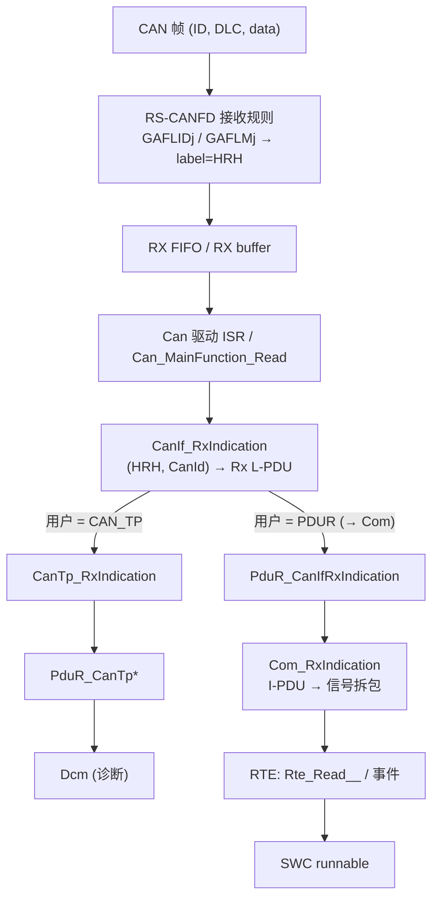

# 如何追踪一个 CAN 帧 / 信号：从网络描述到软件变量

> Prerequisite: [04 如何阅读生成代码](04-how-to-read-generated-code.md)、[HOH / HRH / HTH](../04-can-mcal/07-hoh-hrh-hth.md)、[CanIf](../05-can-stack/01-canif.md)、[CAN RX 路径](../05-can-stack/06-can-rx-path.md)、[CAN TX 路径](../05-can-stack/07-can-tx-path.md)、[Sender/Receiver](../07-rte-swc/07-sender-receiver.md)
> Next: [06 如何追踪 UDS 请求](06-how-to-trace-uds-request.md)
> 对应规范: SWS CAN **R22-11**（`CanHardwareObject`/`CanHwFilter` p.122–129、`SWS_Can_00279` p.48、`Can_IdType` 编码 p.58、`SWS_Can_00423`）；HW-E R01UH0585EJ0120 Rev.1.20（接收规则 p.830–837、p.1072–1074）。**本仓库无 CanIf / PduR / Com / Rte 的 SWS**——Com 路径按 R4.x 公认形态 [Conceptual] 描述；demo 没有 Com 模块。
> 对应源码: 本项目 `examples/uds_diag_demo/`（诊断帧路径）；openAUTOSAR `communication/ComServices/Com/src/Com_Com.c:263`（`Com_RxIndication`）、`:72`（`Com_ReceiveSignal`）、`communication/CAN/CanIf/src/CanIf_Cfg.c:130-149`（一个只路由到 PduR/Com 的 Rx PDU）

---

## 1. 本章目标

1. 给定一个 CAN ID（来自 DBC/ARXML/诊断规范），能在真实工程里找到它经过的**每一张配置表**和**每一个函数**，直到软件里的数据落点。
2. 区分两类帧的上行路径：**诊断帧**（CanIf → CanTp → PduR → Dcm）与**信号帧**（CanIf → PduR → Com → RTE → SWC）。
3. 把追踪结果记录成一张可复用的"帧路径卡"。

---

## 2. 为什么需要会追踪"一个帧"？

集成和调试中最常见的问题形式是"**某个 ID 收不到 / 发不出 / 值不对**"。一个 ID 的路径跨越硬件过滤、HOH、CanIf L-PDU、上层模块、RTE——每一段都由不同的配置表决定（[UDS 端到端 §8](../08-integration/05-uds-end-to-end.md)）。会追踪一个帧，就会追踪所有帧。

---

## 3. 在系统中的位置：两条上行路径

| 段 | 诊断帧（demo 0x7E0） | 信号帧（[Conceptual]） |
|---|---|---|
| 硬件过滤 | 规则 0：code 0x7E0 / mask 0x7FF，label=HRH0（`mcal/Can_Cfg.c:18`） | 同样需要一条规则（或范围规则） |
| HOH | HRH0（`mcal/Can_Cfg.h:22`） | 某个 HRH（BasicCAN/FullCAN） |
| CanIf Rx L-PDU | `DiagPhysReq_7E0` → `CanTp_RxIndication`（`ecual/CanIf_Cfg.c:16`） | → `PduR_CanIfRxIndication`（R4.x 公认形态） |
| 上层 | CanTp N-PDU 0 → N-SDU → PduR → Dcm | PduR → `Com_RxIndication(ComIPduId)` |
| 数据落点 | Dcm Rx 缓冲 | Com I-PDU 缓冲 → 信号 → RTE 缓冲 → SWC 用 `Rte_Read`/`Rte_IRead` 读取 |
| 时间特性 | CanTp/Dcm 在 ISR 中登记、MainFunction 中处理 | Com 在 `Com_MainFunctionRx` 中做超时监控、可能在 RxIndication 中立即拆包（取决于配置） |

---

## 4. 追踪步骤（以"一个 CAN ID"为输入）

### Step 1 — 网络描述：这个 ID 是什么？

| 要确认 | 来源（**需在真实项目环境中确认**） |
|---|---|
| ID、标准/扩展、Classical/FD、DLC | DBC / 系统描述 ARXML / OEM 通信矩阵 |
| 方向（ECU 收还是发）、周期 | 同上 |
| 是诊断帧还是信号帧 | 诊断规范 / CDD/ODX（诊断）或通信矩阵（信号） |
| 信号布局（起始位、长度、字节序、缩放） | DBC / ARXML（仅信号帧） |

### Step 2 — 硬件：控制器能收到吗？

在生成的 MCAL 配置里找到覆盖这个 ID 的 RECEIVE HOH 与对应接收规则；必要时停 CPU 读 GAFL 规则寄存器（[调试手册 §5](../debugging-autosar-diagnostics.md)）。

- [RH850 Hardware] GAFLM 位=1 表示"比较"（HW-E p.834）；规则从小号开始匹配，命中第一条即停（p.1073–1074）——**一条过宽的低号规则会"抢走"本该进入另一 FIFO 的帧**。
- 扩展帧：GAFLIDj.IDE；AUTOSAR 侧 `Can_IdType` 最高位标记扩展帧（`SWS_Can_00423` p.48）。

### Step 3 — Can → CanIf：HRH 与 L-PDU

在生成的 CanIf 配置中，按（HRH, CAN ID）找到 Rx L-PDU；记录：L-PDU 句柄、DLC 检查、上层用户、上层句柄。demo：`ecual/CanIf_Cfg.c:15-18`，匹配逻辑 `ecual/CanIf.c:171-183`。

### Step 4 — 上层：诊断还是信号

- **诊断**：CanTp N-PDU → N-SDU（`com/CanTp_Cfg.c:13-26`）→ PduR 路由（`com/PduR_Cfg.c:17-20`）→ Dcm（`diag/Dcm_Cfg.h:31-32`）。继续阅读 [06 如何追踪 UDS 请求](06-how-to-trace-uds-request.md)。
- **信号** [Conceptual]：PduR 路由到 Com 的 I-PDU → Com 的信号表（起始位、长度、字节序、更新位、超时）→ RTE 的 S/R 端口连接 → SWC 的 `Rte_Read_<Port>_<DataElement>`。openAUTOSAR 有可读的 Com 实现：`Com_RxIndication`（`communication/ComServices/Com/src/Com_Com.c:263`）、`Com_ReceiveSignal`（`:72`）；但它的配置实例 `ComConfiguration` 缺失（研究笔记 03 §2.2），只能读算法。

### Step 5 — 调度与上下文

记录：RX 是中断还是轮询（`CanRxProcessing`）、ISR 通道（RX FIFO = EI190）、相关 MainFunction（`Com_MainFunctionRx`、`CanTp_MainFunction`、`Dcm_MainFunction`）在哪个任务、周期多少。

### Step 6 — 发送方向（ECU 发的帧）

反向追踪：SWC `Rte_Write` / Dcm 响应 → Com/PduR/CanTp → `CanIf_Transmit(TxPduId)` → Tx L-PDU（CAN ID、HTH）→ `Can_Write(Hth)` → TX buffer（[RH850 Hardware] TMIDp/TMDFp/TMCp）。demo：`ecual/CanIf_Cfg.c:20-23`、`mcal/Can.c:171-217`。

---

## 5. 帧路径卡（记录模板）

[Real Project Consideration] 每追踪一个帧，填一张卡。诊断请求/响应、TesterPresent（功能寻址）至少各一张。

| 段 | 字段 | 值 | 出处（文件:行 / 工具 / 寄存器读回） |
|---|---|---|---|
| 网络 | ID / 格式 / DLC / 方向 / 周期 | | |
| 硬件 | 通道 / 规则号 / GAFLID / GAFLM / 目标 FIFO 或 TX buffer | | |
| 中断 | 通道 / 类别 / 优先级 / ISR 名 | | |
| Can | HOH（HRH/HTH）编号 | | |
| CanIf | L-PDU 句柄 / DLC 检查 / 上层用户 / 上层句柄 | | |
| 上层 1 | CanTp N-PDU、N-SDU，或 PduR→Com I-PDU | | |
| 上层 2 | PduR 路由 → Dcm RxPduId，或 Com 信号表 | | |
| 应用 | Dcm 服务/DID，或 RTE 端口 → SWC runnable | | |
| 调度 | 相关 MainFunction 与任务周期 | | |
| 验证 | CANoe 中观察到的帧、ECU 断点命中记录 | | |

demo 版本的"诊断请求卡"已经在 [配置清单 §5.7](../08-integration/01-ecu-configuration-checklist.md) 和 [UDS 端到端 §4](../08-integration/05-uds-end-to-end.md) 中给出，可直接作为填写样例。

---

## 6. 调试器中的追踪手法

| 手法 | 用途 | 注意 |
|---|---|---|
| 在 `CanIf_RxIndication` 上设**条件断点**（`Mailbox->CanId == 0x7E0`） | 只停在关心的帧上 | 条件断点会拖慢 ISR；高总线负载时可能丢帧 |
| 在 CanIf"未匹配"分支设断点 | 发现被丢弃的帧 | 真实 CanIf 中该分支可能只报 DET |
| 在 L-PDU 的上层回调设断点 | 确认交给了正确模块 | — |
| 读 RX FIFO 状态寄存器（RFSTSx.RFMC） | 硬件是否收到 | 读安全，**不要写 RFPCTRx** |
| 计数器 / trace 缓冲 | 不打断时序地统计 | 需要在开发版中预留 |
| CANoe 与 ECU 时间戳对齐 | 测量 ISR 延迟、MainFunction 排队 | 需要统一时基（例如用一个 GPIO 翻转配合示波器） |

---

## 7. 常见问题

| 现象 | 可能原因 | 在哪一步发现 |
|---|---|---|
| 帧在总线上，ECU 软件完全没反应 | 规则不覆盖、FIFO 未启用、中断通道错 | Step 2、Step 5 |
| 同一 ID 有时收到有时收不到 | FIFO 溢出（RFMLT）、低号宽规则抢帧、中断延迟过大 | Step 2、Step 5 |
| CanIf 收到但上层没收到 | L-PDU 的 CAN ID/HRH 不匹配、上层用户配错、PDU 模式 OFFLINE | Step 3 |
| 诊断帧被当成信号帧（或相反） | CanIf 上层用户配置错 | Step 3、Step 4 |
| 信号值不对 | 字节序/起始位与 DBC 不一致；缩放在 SWC 侧重复应用 | Step 4（信号） |
| ECU 发的帧 ID 不对 | Tx L-PDU CAN ID | Step 6 |

---

## 8. 练习

1. 在 demo 中为**功能请求 0x7DF**填一张完整的帧路径卡（HRH1、`DiagFuncReq_7DF`、CanTp N-PDU 1、PduR Src 1、DcmRxPduId 1）。
2. 为**诊断响应 0x7E8**（发送方向）填一张卡，注意它有两个 Tx L-PDU（数据帧与 FC，`ecual/CanIf_Cfg.c:21-22`），说明为什么要两个。
3. 阅读 openAUTOSAR `communication/CAN/CanIf/src/CanIf_Cfg.c:114-149`，为其中唯一的 Rx PDU（ID 0x100）和 Tx PDU（ID 0x200）各填一张卡，并指出为什么这个工程的诊断帧无法到达 Dcm（研究笔记 03 §3.3 第 2 条）。

---

## 9. 对未来真实项目的意义

[Real Project Consideration]

- 进入真实项目后，先为诊断请求（物理）、诊断请求（功能）、诊断响应三个 ID 各填一张帧路径卡——这三张卡就是 [调试手册](../debugging-autosar-diagnostics.md) L1–L7 和 L14–L15 的"本项目版本"。
- 同样的方法适用于任何 CAN 信号问题；只是上层从 CanTp/Dcm 换成 PduR/Com/RTE。
- 帧路径卡也是集成评审和配置变更评审的好材料：变更前后各填一次，差异一目了然。

## 10. 本章总结

- 一个 CAN ID 的路径：网络描述 → 硬件规则/FIFO → 中断 → Can HOH → CanIf L-PDU → （CanTp→PduR→Dcm）或（PduR→Com→RTE→SWC）。
- 每一段由一张配置表决定；用帧路径卡记录"值 + 出处"。
- 发送方向反向追踪到 Tx L-PDU、HTH 与 TX buffer。

## 11. 下一章

[06 如何追踪 UDS 请求](06-how-to-trace-uds-request.md)：在诊断帧进入 Dcm 之后继续追踪，直到 SWC 并回到总线。
