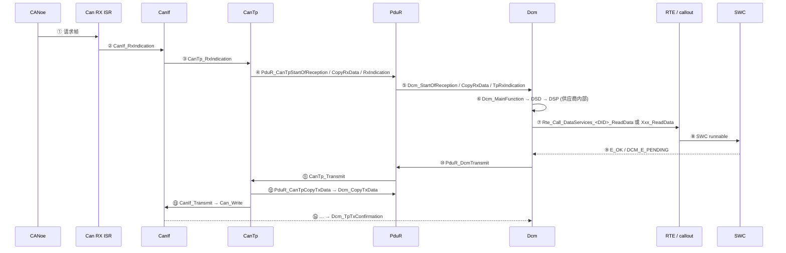

# 如何追踪一个 UDS 请求：在真实 ECU 上复现 demo 的 trace

> Prerequisite: [05 如何追踪 CAN 信号](05-how-to-trace-can-signal.md)、[03 如何阅读 DCM](03-how-to-read-dcm.md)、[08-integration/04 F190 Demo §6](../08-integration/04-f190-vin-demo.md)、[08-integration/05 UDS 端到端](../08-integration/05-uds-end-to-end.md)
> Next: [07 RTA-CAR DCM 升级准备](07-rtacar-dcm-upgrade-preparation.md)
> 对应规范: SWS DCM **R20-11**（TP 接口 p.243–247、`Dcm_MainFunction` p.260–261、OpStatus 模型 `00527/00530` p.81、P2/0x78 `00024` p.61、0x22 p.135–141、DataServices 原型 p.269–276）；SWS CAN **R22-11**（`SWS_Can_00279/00016/00276`）。真实 ECU 中各内部函数的命名**需在真实项目环境中确认**。
> 对应源码: 本项目 `artifacts/uds-demo/trace.txt`（期望顺序）、`examples/uds_diag_demo/`（每一跳的教学实现）

---

## 1. 本章目标

本章不是调试手册（那是 [debugging-autosar-diagnostics.md](../debugging-autosar-diagnostics.md)），而是**在一个能正常工作的真实 ECU 上**，把一条诊断请求完整地追踪一遍，产出一份"真实项目版 trace"。目标：

1. 在真实工程中为 `22 F1 90`（或项目中任意一个读 DID 请求）找到 demo trace 每一行的对应函数，并在调试器中依次命中。
2. 记录每一跳的参数、返回值和时间，得到一份可与 demo 对照的 trace。
3. 测量这个 ECU 的 P2 余量，识别同步/异步 DID、单帧/多帧响应的差异。

做完这件事，你对这个 ECU 诊断链路的理解就从"教程级"变成"项目级"了。

---

## 2. 为什么要追踪一个**正常工作**的请求？

- 调试故障时你需要一个"正常时应该是什么样"的参照；demo 的 trace 是教学参照，**项目自己的 trace 才是真正的参照**。
- 正常请求的追踪可以在没有压力的时候做，顺便把断点位置、变量地址、map 文件符号都准备好。
- DCM 升级前后各做一次，就是最细粒度的回归证据（[DCM 升级指南 §10](../dcm-upgrade-guide.md#10-如何做-regression-test)）。

---

## 3. 在系统中的位置：要追踪的跳



①–⑤、⑦、⑩–⑭ 的函数名是 AUTOSAR 标准接口，可以直接在真实工程中搜索；⑥ 是供应商内部实现，需要从 `Dcm_MainFunction` 向内追（[03 §3](03-how-to-read-dcm.md)）；⑦ 取决于 DID 的 `DcmDspDataUsePort` 配置（RTE 端口或 C callout）。

---

## 4. 准备

| 准备项 | 内容 |
|---|---|
| 选请求 | 先选一个**同步、单帧响应**的读 DID（例如软件版本号），再选一个**多帧响应**的（例如 VIN 若为 17 字节，响应 20 字节必然多帧），最后选一个**异步**的（若项目中有） |
| 测试仪 | CANoe 中只发这一条请求（关闭周期 TesterPresent，避免干扰断点），P2Client 放宽（例如 5 s），因为断点会拖慢 ECU |
| 调试器 | 能在目标板上设置硬件断点；准备 map 文件 |
| 断点清单 | 按 §5 表格准备，先全部禁用，按需逐个启用 |
| 记录表 | §6 模板 |

[Real Project Consideration] 断点会冻结 CPU，但不一定冻结外设和计时器（取决于调试器与芯片的调试配置，**需在真实项目环境中确认**）。如果总线上有其他节点周期发帧，停在 RX ISR 期间 RX FIFO 可能溢出；最好在只有测试仪和 ECU 的台架上做。

---

## 5. 断点脚本：demo trace 行 → 真实工程断点

| # | demo trace 行（`artifacts/uds-demo/trace.txt`） | demo 函数 | 真实工程中的断点（标准名或"去哪找"） | 命中时记录 |
|---|---|---|---|---|
| ① | 26 `[Bus] Tester -> wire ID=0x7E0 ...` | — | CANoe trace | 时间戳 t0、帧内容 |
| ② | 27 `[Can] ISR EI190 ...` | `Can_Isr_GlobalRxFifo`（`mcal/Can.c:255`） | MCAL 的 RX 中断处理函数（OS Cat2 ISR 调用的那一个，名称**需确认**） | EIIC（期望 0x10BE）、读出的 ID/DLC/label |
| ③ | 28 `[CanIf] RxIndication ...` | `CanIf_RxIndication`（`ecual/CanIf.c:160`） | `CanIf_RxIndication` | `Mailbox->Hoh/CanId/ControllerId`、`PduInfoPtr->SduLength` |
| ④ | 29 `[CanTp] RX ... SF len=3` | `CanTp_RxIndication`（`com/CanTp.c:466`） | `CanTp_RxIndication` | `RxPduId`、PCI 字节 |
| ⑤ | 30–31 `PduR` / `Dcm/DSL StartOfReception` | `Dcm_StartOfReception`（`diag/Dcm_Dsl.c:309`） | `Dcm_StartOfReception` | `id`、`TpSduLength`、返回值、`*bufferSizePtr` |
| ⑥ | 33 `TpRxIndication(E_OK) ... P2 timer` | `Dcm_TpRxIndication`（`diag/Dcm_Dsl.c:384`） | `Dcm_TpRxIndication` | `result`；**时间戳 t1**（请求完整） |
| ⑦ | 34–35 `[Dcm/DSD] SID 0x22: lookup ...` | `Dcm_DsdCheckRequest`（`diag/Dcm_Dsd.c:77`） | `Dcm_MainFunction` → 向内追到服务分发处 | 时间戳 t2；t2−t1 = 排队延迟（≤ `DcmTaskTime`） |
| ⑧ | 36 `[Dcm/DSP] 0x22: DID 0xF190 ...` | `Dcm_DspReadDataByIdentifier`（`diag/Dcm_Dsp.c:264`） | 0x22 处理函数（供应商内部） | 找到的 DID 配置项 |
| ⑨ | 37 `[Rte] Rte_Call_DataServices_DID_F190_ReadData(...)` | `rte/Rte_Dcm.c:54` | `Rte_Call_DataServices_<Data>_ReadData` 或 `Xxx_ReadData` callout（若为宏，断在被调函数上） | `OpStatus`、返回值 |
| ⑩ | 38/43 `[SWC] ...` | `VehicleInfoSWC_ReadVin`（`swc/VehicleInfoSWC.c:77`） | SWC runnable | 返回值、输出数据 |
| ⑪ | 46 `[Dcm/DSL] response [...] -> PduR_DcmTransmit` | `diag/Dcm_Dsl.c:199` | `PduR_DcmTransmit` | `TxPduId`、`SduLength`、返回值；时间戳 t3 |
| ⑫ | 48 `[CanTp] Transmit ...` | `CanTp_Transmit`（`com/CanTp.c:392`） | `CanTp_Transmit` | 长度、SF/FF |
| ⑬ | 49 `FF payload=6 ...` | `PduR_CanTpCopyTxData` → `Dcm_CopyTxData`（`diag/Dcm_Dsl.c:441`） | `Dcm_CopyTxData` | 请求长度、返回值、`*availableDataPtr` |
| ⑭ | 50–51 `Can_Write(HTH=2, ID=0x7E8)` | `mcal/Can.c:171` | `CanIf_Transmit`、`Can_Write` | HTH、ID、返回值（`CAN_BUSY`？） |
| ⑮ | 52 `[Bus] ECU -> wire ...` | — | CANoe trace | 时间戳 t4；**t4−t0 ≈ 测得的 P2** |
| ⑯ | 53–54 TX 确认 | `mcal/Can.c:220-239` | TX ISR 或 `Can_MainFunction_Write` → `CanIf_TxConfirmation` | — |
| ⑰ | 78–80 `Dcm_TpTxConfirmation(E_OK)` | `diag/Dcm_Dsl.c:477` | `Dcm_TpTxConfirmation` | `result`；S3 重启 |

建议的执行方式：第一轮只启用 ②、⑥、⑦、⑪、⑰ 五个断点，确认主干顺序；第二轮逐段加细。

---

## 6. 记录模板："真实项目版 trace"

[Real Project Consideration] 用与 demo 相同的格式记录，便于逐行对比：

```text
[t ms] [模块  ] 动作 / 参数 / 返回值                                   ← 出处（文件:函数）
[  0 ] [Bus   ] Tester -> 0x___  __ __ __ __ __ __ __ __             ← CANoe
[    ] [Can   ] RX ISR: EIIC=0x____ ID=0x___ label/HRH=__            ← <MCAL 文件>:<函数>
[    ] [CanIf ] RxIndication Hoh=__ CanId=0x___ -> L-PDU __ -> CanTp ← CanIf.c:CanIf_RxIndication
[    ] [CanTp ] RxIndication RxPduId=__ PCI=0x__                      ← CanTp.c:CanTp_RxIndication
[    ] [Dcm   ] StartOfReception id=__ len=__ -> BUFREQ___ buf=__     ← <Dcm 文件>
[    ] [Dcm   ] TpRxIndication id=__ result=__                        ← <Dcm 文件>
[    ] [Dcm   ] MainFunction: dispatch SID 0x__ -> <内部函数>          ← <Dcm 文件>:<函数>
[    ] [Dcm   ] DID 0x____ found, UsePort=____                        ← <生成配置>:<表>
[    ] [Rte   ] <Rte_Call_... / Xxx_ReadData>(OpStatus=__) -> __       ← <Rte 文件>
[    ] [SWC   ] <runnable> -> __                                       ← <SWC 文件>
[    ] [Dcm   ] PduR_DcmTransmit(id=__, len=__) -> __                 ← <Dcm 文件>
[    ] [CanTp ] Transmit len=__ -> SF/FF                              ← CanTp.c
[    ] [Can   ] Can_Write(Hth=__, ID=0x___) -> __                     ← <MCAL 文件>
[    ] [Bus   ] ECU -> 0x___  __ __ __ __ __ __ __ __                ← CANoe
[    ] [Dcm   ] TpTxConfirmation id=__ result=__                      ← <Dcm 文件>
```

---

## 7. 四个变体：每种都追一次

| 变体 | 选什么请求 | 与 demo 对照的 trace 段 | 重点观察 |
|---|---|---|---|
| 同步 DID、单帧 | 例如读软件版本（若 ≤4 字节数据） | demo 中 `22 F1 87` 是同步但多帧（trace 第 85–127 行） | `ReadData` 只调用一次，无 OpStatus |
| 多帧响应 | 响应 > 7 字节的 DID | 第 23–82 行（VIN） | FF → 测试仪 FC → CF；BS/STmin 由**测试仪**宣告 |
| 多帧请求 | `2E` 写长 DID（需要相应会话/安全） | 第 233–284 行 | ECU 发 FC，BS/STmin 由 **ECU 的 CanTp 配置**宣告 |
| 异步 / 0x78 | 项目中由慢操作提供的 DID 或 Routine | 第 611–718 行（慢 SWC） | `DCM_INITIAL` → `DCM_PENDING` ×N；若超过 `P2−adjust`，总线上出现 `7F xx 78` |
| 功能寻址 | `3E 80`（功能 ID） | 第 456–468 行 | Dcm 不进入服务分发（`SWS_Dcm_00112/00113`），无响应 |

---

## 8. 从 trace 中得到的项目级结论

完成 §6 的记录后，应能写出以下结论（每条带证据）：

1. **P2 余量**：t4 − t0 的典型值与最大值，相对于 `P2ServerMax`（从 `10 01` 正响应中读出）还剩多少。
2. **排队延迟**：t2 − t1 是否 ≤ `DcmTaskTime`；若常常接近上限，说明请求到达与任务相位不利。
3. **执行上下文**：②–⑥ 是否都在 ISR 中（真实项目可能把部分处理放到任务里）；⑦–⑪ 在哪个任务。
4. **应用接口形态**：DID 走 RTE 端口还是 C callout；同步还是异步。
5. **与 demo 的差异清单**：哪些跳在真实 ECU 中多了（例如 ComM 检查、Manufacturer notification、分页缓冲），哪些少了。

---

## 9. 常见陷阱

| 陷阱 | 说明 |
|---|---|
| 断点导致测试仪超时 | 放宽测试仪 P2Client；或改用计数器/trace |
| `Rte_Call_*` 是宏，断不住 | 在宏展开后的被调函数（SWC runnable）上断 |
| 只有库没有源码 | 在标准接口名上断，看参数和返回值即可 |
| ISR 中断点导致后续帧丢失 | 用单节点台架；或只在 ISR 退出后的第一个标准接口上断 |
| 记录了数值却不知道是谁的句柄 | 每个 PduId 都标明属于哪个模块（[配置清单 §5.7](../08-integration/01-ecu-configuration-checklist.md)） |

---

## 10. 练习（在 demo 上预演）

1. 用 `grep -n "" artifacts/uds-demo/trace.txt | sed -n '23,82p'` 列出 `22 F1 90` 段，按 §6 的格式重写成"项目版 trace"，把出处列填成 demo 的文件:函数。
2. 对 `22 F1 87`（trace 第 85–127 行）做同样的事，比较同步与异步 DID 的差异。
3. 从 trace 中计算 demo 的 P2 余量：请求在 10 ms，FF 在 31 ms，P2ServerMax = 50 ms，余量多少？若 SWC 多返回 3 次 `DCM_E_PENDING` 会怎样？（提示：P2 定时器为 50 − 10 = 40 ms，每次 PENDING 多一个 10 ms 周期。）

---

## 11. 对未来真实项目的意义

[Real Project Consideration]

- 本章产出的"真实项目版 trace"是你在这个项目里最有价值的个人资产之一：调试时它是参照，升级时它是回归基线，交接时它是文档。
- 四个变体（同步、多帧响应、多帧请求、异步）覆盖了 Dcm 与下层、上层交互的全部基本形态。
- 记录中每一行都带出处（文件:函数），等于给真实工程建立了一份与本教程一一对应的索引。

## 12. 本章总结

- 在一个正常工作的 ECU 上，按 demo trace 的顺序设置断点（标准接口名 + 从 `Dcm_MainFunction` 向内追的内部函数），逐跳记录参数、返回值、时间。
- 至少追踪四种变体；从记录中得出 P2 余量、排队延迟、执行上下文、应用接口形态和与 demo 的差异。

## 13. 下一章

[07 RTA-CAR DCM 升级准备](07-rtacar-dcm-upgrade-preparation.md)：带着地图、帧路径卡和项目版 trace，开始为 DCM 升级做准备。
