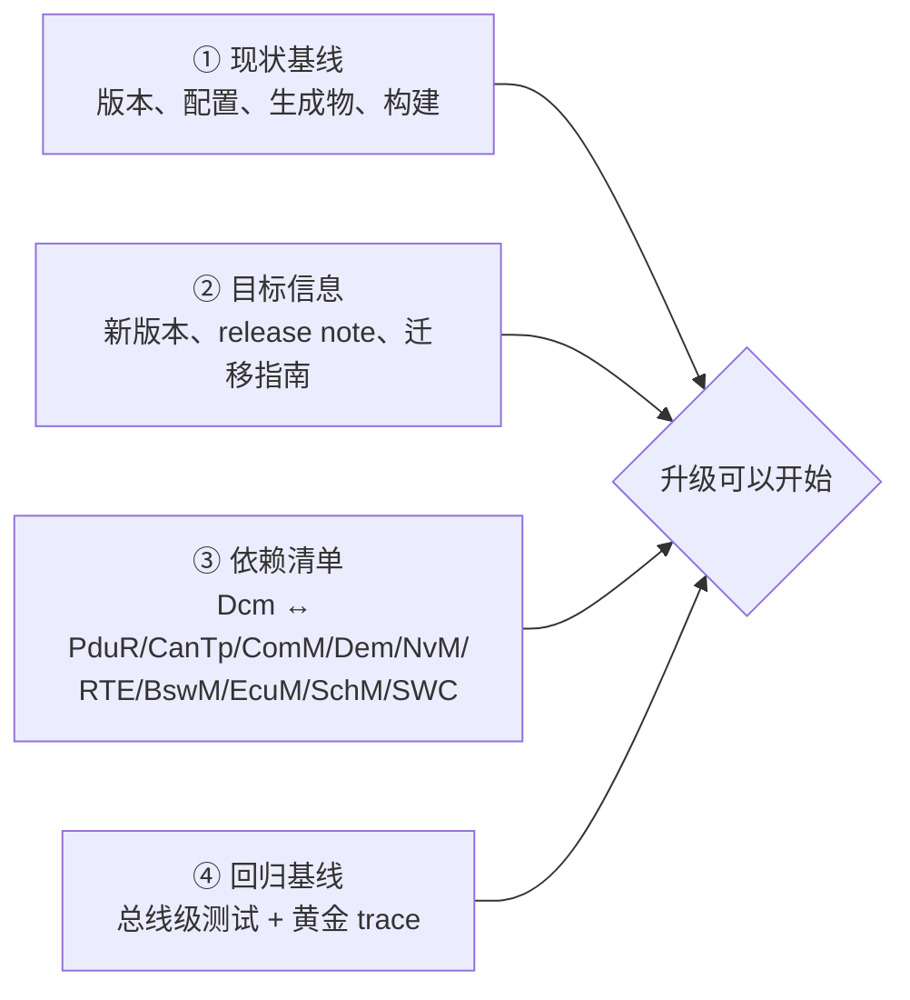

# RTA-CAR DCM 升级准备：进入真实项目第一周的清单

> Prerequisite: [01 如何阅读真实工程](01-how-to-read-real-autosar-project.md)、[03 如何阅读 DCM](03-how-to-read-dcm.md)、[06 如何追踪 UDS 请求](06-how-to-trace-uds-request.md)、[08-integration/01 配置一致性清单](../08-integration/01-ecu-configuration-checklist.md)
> Next: **[DCM 升级指南](../dcm-upgrade-guide.md)**（完整的方法论：版本识别、Release 对比、API/配置/callout/生成代码/依赖分析、回归测试）
> 对应规范: SWS DCM **R20-11**（Change History p.1–5；依赖 p.30–31）。**本仓库只有 R20-11 的 DCM SWS**；R21-11 及以后的 CP DCM 变化在本仓库没有证据（研究笔记 02 §6）。
> 对应源码: 本项目 `examples/uds_diag_demo/tests/test_uds_demo.c`（回归测试用例的模板）、`tools/run_uds_demo.py`

---

## 1. 本章定位

按 [analysis-and-learning-plan.md §6.2](../analysis-and-learning-plan.md) 的去重规则：方法论只写在 [docs/dcm-upgrade-guide.md](../dcm-upgrade-guide.md)；本章只写**进入真实项目第一周要完成的准备工作**——在动任何代码之前，把"现状基线""目标信息""依赖清单""回归基线"四件事准备好。

[Real Project Consideration] 关于真实项目的一切——RTA-CAR 的版本、DCM 的供应商实现与源码结构、所用 AUTOSAR Release、配置工具、derivative——**都需在真实项目环境中确认**。本仓库截图中出现过的 RTA-CAR 12.9.0 / RTA-OS RH850GHS / Renesas P1M MCAL（AR 4.2.2 API）只是"可能的真实环境"示例，不能作为升级计划的事实输入。

---

## 2. 为什么第一周不要改代码？

DCM 升级失败最常见的形态不是"编译不过"，而是"编译过了、大部分服务能用、某些 NRC / 时序 / 边界行为悄悄变了"。要发现这类变化，必须在升级**之前**就有一份可以逐字节对比的行为基线。没有基线，升级后的任何差异都无法判断是"预期的新行为"还是"回归"。

---

## 3. 第一周的四件事

### 3.1 ① 现状基线

| # | 项 | 如何获得 | 产出 |
|---|---|---|---|
| 1 | 当前 Dcm 的 AR Release、供应商软件版本、Vendor ID、Module ID | `Dcm.h` 中的版本宏；`Dcm_GetVersionInfo`（`SWS_Dcm_00065` p.237）运行时读取；BSWMD | 版本卡（[升级指南 §2](../dcm-upgrade-guide.md#2-如何识别-dcm-version)） |
| 2 | 同一栈中 Dem、PduR、CanTp、ComM、BswM、NvM、RTE 生成器的版本 | 各模块头文件版本宏、工具版本 | 版本矩阵 |
| 3 | MCAL 版本与 AR Release | MCAL 头文件 | 版本矩阵 |
| 4 | Dcm 配置源（ARXML/工具工程）的快照 | 版本控制系统 | 配置基线（带提交号） |
| 5 | 当前生成的 Dcm 配置与 RTE 文件快照 | 生成目录拷贝 | `gen_baseline/` |
| 6 | 能否可重复地重新生成 + 构建 | 在干净环境中走一遍 | 构建说明 + 构建日志 |
| 7 | Dcm 相关的项目自有代码：callout 实现、`Dcm_SetProgConditions/GetProgConditions`、DID/Routine/SecurityAccess 的 SWC 或 C 函数、Det hook | 搜索 Dcm 调用的外部符号（链接 map 中的未定义符号） | callout 清单 |
| 8 | 诊断规范：服务、DID、RID、会话、安全级、NRC 期望、时序参数 | OEM 规范、CDD/ODX | 需求基线 |

### 3.2 ② 目标信息

| # | 项 | 向谁要 / 去哪找 |
|---|---|---|
| 1 | 目标 Dcm 版本、对应 AR Release | 项目计划、供应商 |
| 2 | 供应商 release note（当前版本 → 目标版本之间**所有**版本） | 供应商交付包 |
| 3 | 迁移指南 / 已知问题列表 | 供应商 |
| 4 | 目标版本的 BSWMD（参数定义） | 供应商交付包；用于 diff 配置参数 |
| 5 | 目标版本是否要求同时升级 Dem / PduR / CanTp / RTE 生成器 / 配置工具 | 供应商兼容矩阵 |
| 6 | 对应 AUTOSAR Release 的 SWS（DCM、DEM 及接口相关模块）与 Change Documentation | AUTOSAR 官方发布（本仓库只有 DCM R20-11） |

### 3.3 ③ 依赖清单

用 [升级指南 §9](../dcm-upgrade-guide.md#9-如何分析-integration-dependencies) 的依赖图，在真实工程中为每条依赖找到**具体接口和位置**：

| 依赖 | 要列出的接口 | 真实项目位置（填写） |
|---|---|---|
| PduR / CanTp | TP 回调名与签名、PDU 句柄、`PduR_DcmTransmit` | |
| ComM | `Dcm_ComM_*ComModeEntered` 调用方、`ComM_DCM_Active/InactiveDiagnostic` | |
| Dem | Dcm 调用的全部 `Dem_*`、Dem client 配置 | |
| NvM | `USE_BLOCK_ID` 的 DID、`NvM_*` 调用 | |
| RTE / SWC | 所有 `DataServices_*`、`SecurityAccess_*`、`RoutineServices_*` 端口与实现 | |
| BswM | 订阅 `DcmEcuReset`、`DcmDiagnosticSessionControl`、`DcmCommunicationControl_*` 等模式的规则 | |
| EcuM / 启动 | `Dcm_Init` 调用位置、bootloader 交互（`Dcm_GetProgConditions`） | |
| SchM / OS | `Dcm_MainFunction` 任务与周期、Dcm 的 exclusive area | |
| Det | Dcm 的 DET 报告是否被项目钩子使用 | |

### 3.4 ④ 回归基线

| # | 内容 | 方法 |
|---|---|---|
| 1 | 总线级正向测试序列 | 以 [CANoe 测试 §6.1](../08-integration/06-canoe-test.md) 为模板，换成项目的 ID、DID、RID、seed-key |
| 2 | 总线级负向测试（NRC 顺序、功能寻址抑制、SPRMIB、0x78） | 以 [CANoe 测试 §6.2](../08-integration/06-canoe-test.md) 为模板 |
| 3 | 时序测试（P2 实测、0x78 节拍、S3 超时） | CANoe 测量 |
| 4 | 黄金 trace | 在**升级前**的版本上录制每条用例的 CANoe 日志，保存原始文件 |
| 5 | 项目版 ECU trace | [06 如何追踪 UDS 请求](06-how-to-trace-uds-request.md) 的四个变体 |
| 6 | 用例的组织方式 | 参考 `examples/uds_diag_demo/tests/test_uds_demo.c`：每个用例"上电 → 只通过总线 → 比较字节"，12 个用例覆盖会话、安全、读写、例程、TesterPresent、NRC、S3、0x78、DTC、复位 |

---

## 4. 第一周要问的问题（问团队 / 供应商）

1. 升级的**动机**是什么？（新服务？缺陷修复？AUTOSAR Release 对齐？安全需求如 0x29/IdsM？）——决定回归的重点。
2. 升级范围只有 Dcm，还是连同 Dem / PduR / CanTp / RTE 生成器 / 配置工具一起？
3. 当前 Dcm 有没有**项目本地修改**（补丁、手改生成物）？在哪里记录？——这些修改在升级后会丢失。
4. 现有的诊断测试资产（CANoe 测试模块、HIL 脚本）在哪里？覆盖到什么程度？
5. 哪些诊断行为是 OEM **验收测试**会检查的？（NRC 顺序、时序、会话/安全规则）
6. 有没有 bootloader 交互（`10 02`、`11 01` 后跳转）？bootloader 是否也要配合升级？
7. 目标版本的配置工具能否直接导入旧配置？导入时有哪些参数被丢弃/改名/赋默认值？

---

## 5. 风险登记表（模板）

| 风险 | 触发条件 | 影响 | 早期信号 | 缓解 |
|---|---|---|---|---|
| API 签名变化（TP 回调、`Xxx_ReadData` 原型） | 跨 Release 升级 | 编译/链接失败，或适配层静默错误 | 编译告警、RTE 生成报错 | [升级指南 §4、§6](../dcm-upgrade-guide.md) |
| Dem 接口重做（ClientId + `Dem_SelectDTC`） | 从 4.3.0 之前升级 | 0x14/0x19 行为与 NRC 变化 | 0x14/0x19 回归失败 | 同时核对 Dem 版本 |
| 配置参数增删改、默认值变化 | 工具导入旧配置 | 行为悄悄变化 | 生成物 diff | [升级指南 §5、§7](../dcm-upgrade-guide.md) |
| NRC 顺序变化 | 实现按 ISO 14229-1:2013 或 R20-11 编号顺序调整 | OEM 验收失败 | 负向用例失败 | 负向回归必须全覆盖 |
| 0x78 行为变化（adjust、次数上限默认值） | 参数默认值变化 | 测试仪超时或无限 0x78 | 时序回归 | 显式配置，不依赖默认值 |
| ComM / BswM 交互方式变化 | 跨 4.0.3 / R20-11 | 收到不回、复位不执行 | 冒烟测试 | 依赖清单逐条复核 |
| 项目本地修改丢失 | 有未记录的补丁 | 旧缺陷复现 | — | 第一周找出全部本地修改 |

---

## 6. 第一周的交付物

| 交付物 | 内容 | 用于 |
|---|---|---|
| 版本矩阵 | 当前/目标：Dcm、Dem、PduR、CanTp、ComM、BswM、NvM、RTE 生成器、配置工具、MCAL 的版本与 AR Release | 判断影响面 |
| 配置与生成物基线 | 配置源提交号 + `gen_baseline/` | 升级后 diff |
| callout / 端口清单 | 所有 Dcm 外部接口及其实现位置 | API 变化影响分析 |
| 依赖清单 | §3.3 的表 | 集成复核 |
| 回归基线 | 测试用例 + 黄金 trace + 项目版 ECU trace | 升级后对比 |
| 问题与风险登记 | §4 的答案、§5 的表 | 计划与评审 |

---

## 7. 用本仓库预演

在没有真实项目时，可以用本仓库预演整个第一周流程：

1. **版本卡**：demo Dcm 声称遵循 R20-11 API（`diag/Dcm.h:5-15` 的注释），但**没有版本宏、没有 `Dcm_GetVersionInfo`**——在真实项目中，这种情况意味着版本只能从文档或交付包确认。openAUTOSAR 的 Dcm 则有完整的 R3 风格版本宏（`diagnostic/Dcm/include/Dcm.h:28-36`，Module ID 来自 `include/Modules.h:60` 的 `MODULE_ID_DCM (53)`）。
2. **依赖清单**：对 demo 填 §3.3 的表（答案大多在 [08-integration/03 §3](../08-integration/03-dcm-integration.md)）。
3. **回归基线**：`python tools/run_uds_demo.py` 的 12 个用例 + `artifacts/uds-demo/trace.txt` 就是 demo 的"黄金 trace"。在副本中修改 Dcm 行为（例如 [调试手册 §7](../debugging-autosar-diagnostics.md#7-故障注入练习) 的 F7，或调换 `diag/Dcm_Dsd.c` 中会话检查与长度检查的顺序），重新运行，体会回归测试如何捕获行为变化。
4. **"R3 → R4 升级"纸面演练**：以 openAUTOSAR（R3.1.5）为"旧版本"、demo（R4.x / R20-11 API）为"新版本"，按 [升级指南](../dcm-upgrade-guide.md) 的步骤列出 API 变化（`ProvideRxBuffer` → `StartOfReception`+`CopyRxData` 等）、callout 变化（`ReadData` 增加 OpStatus）、行为变化（会话切换时机、SecurityAccess 尝试计数）。

---

## 8. 对未来真实项目的意义

这一章本身就是给未来真实项目的清单。完成第一周的四件事后，再进入 [DCM 升级指南](../dcm-upgrade-guide.md) 的逐项分析；没有基线就开始改代码，是 DCM 升级中最常见、代价最大的错误。

## 9. 本章总结

- 第一周只做准备：现状基线、目标信息、依赖清单、回归基线。
- 所有真实项目信息都需在项目环境中确认，不用示例或猜测填空。
- 回归基线必须在升级**之前**录制，且以总线字节为准。

## 10. 下一章

[DCM 升级指南](../dcm-upgrade-guide.md)。
