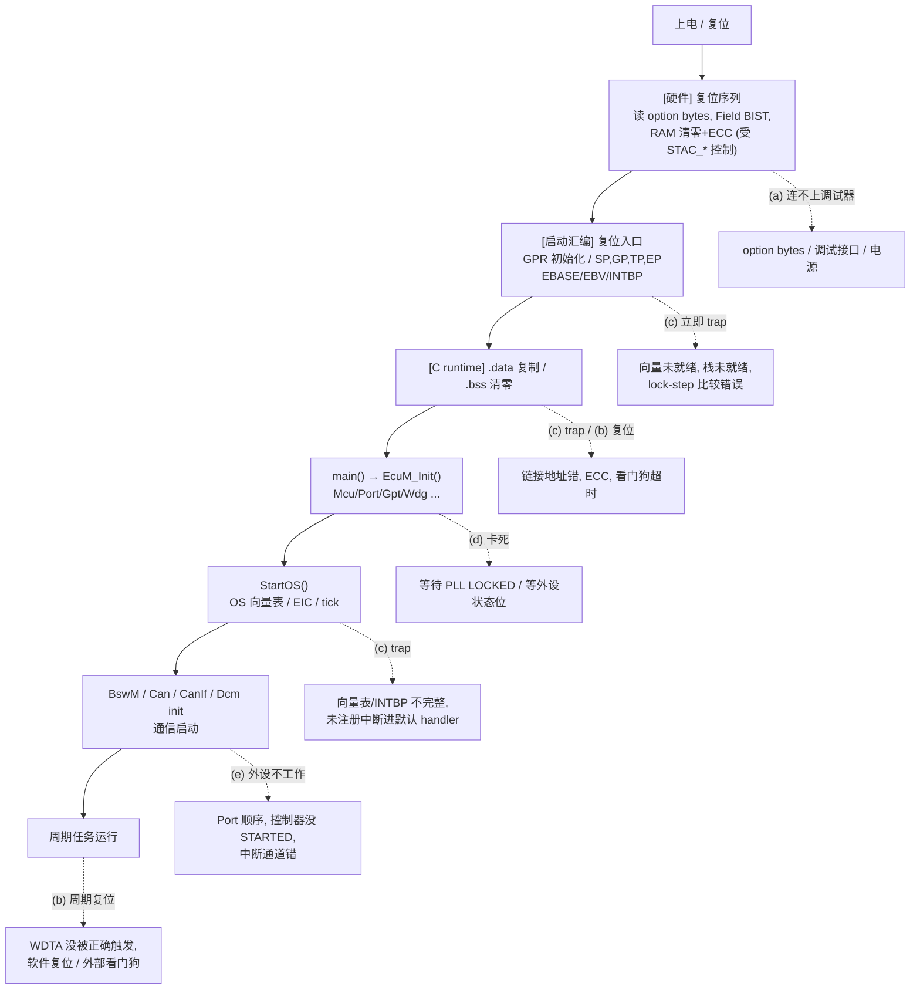
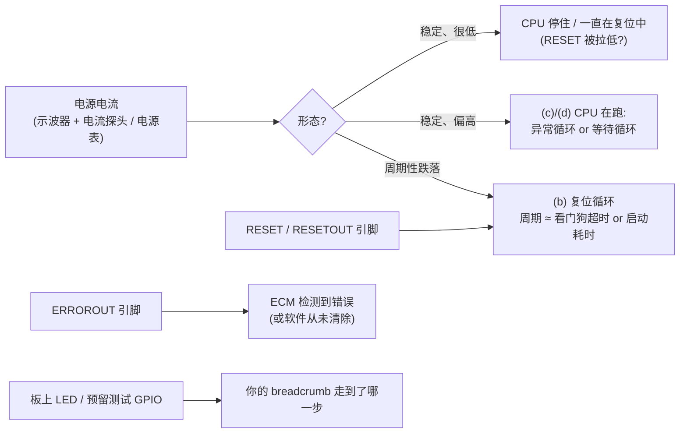
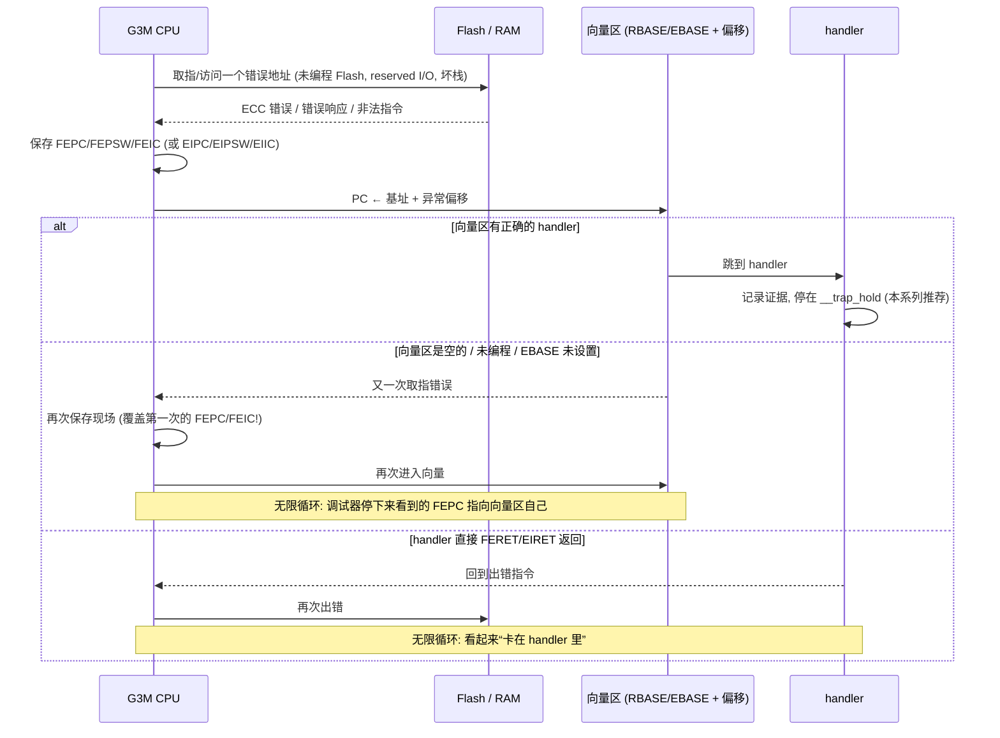
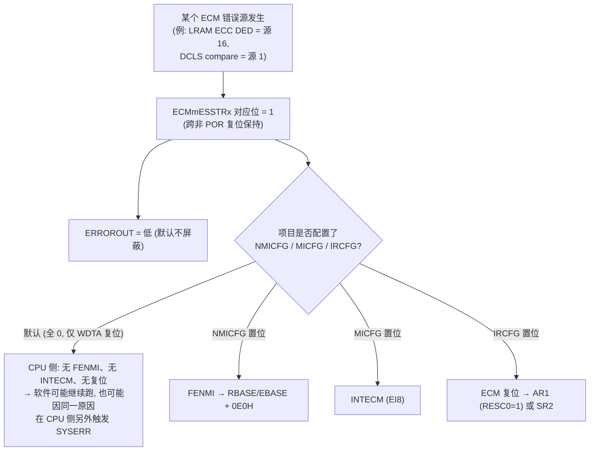
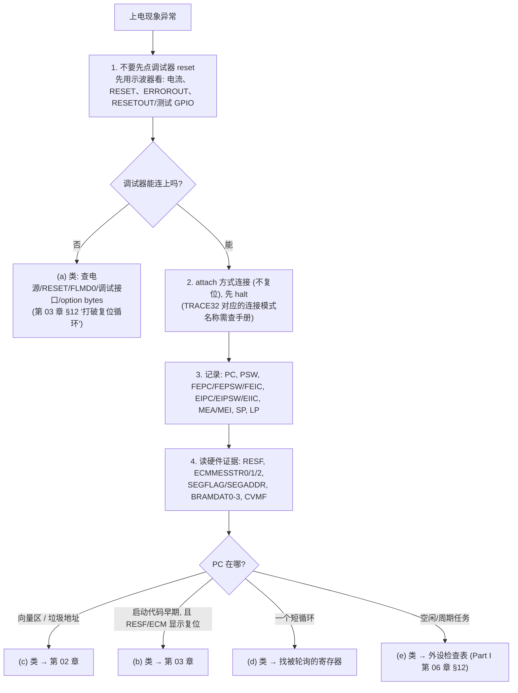

# 启动失败总览：先分类，再让失败“留下证据”

> Prerequisite: [../01-rh850/04-startup-process.md](../01-rh850/04-startup-process.md), [../01-rh850/06-interrupt-exception.md](../01-rh850/06-interrupt-exception.md), [../01-rh850/03-memory-map.md](../01-rh850/03-memory-map.md)
> Next: [02-exception-and-trap-handlers.md](02-exception-and-trap-handlers.md)；系列索引见 [README.md](README.md)
> 对应规范: HW-E（R01UH0585EJ0120 Rev.1.20）§8 Reset Controller p.418–435（复位类别、RESF、RESETOUT）、§32 ECM p.2790–2795（错误源、ERROROUT 行为、状态保持）、p.2817（ECM 复位默认只开 WDTA）、§3.2.3.3 SEG p.244–249（SYSERR）、§3.4.5 p.256（预取与 ECC）、§35 p.2875（读未编程 Code Flash 可能触发 ECC 异常）、§36.3 p.2891（BRAMDAT）、§34 p.2853（片上调试功能）。**本仓库没有 RH850G3M User's Manual: Software、没有 TRACE32 / GHS 手册**
> 对应源码: 本章无源码；trap handler 与启动 breadcrumb 的教学实现在 [02](02-exception-and-trap-handlers.md)、[03](03-reset-causes-and-reset-loops.md)
> 事实底稿: [../reference/research/04-rh850-hardware-notes.md](../reference/research/04-rh850-hardware-notes.md) §2.4、§3；[../reference/p1me-memory-layout-ghs-memmap.md](../reference/p1me-memory-layout-ghs-memmap.md) §1、§3

---

## 1. 本章目标

这个系列回答一个非常具体、也非常常见的担忧：

> “flash 之后启动时 ECU 直接进入 trap，我都没办法 debug —— 启动代码或初始化寄存器哪里出了问题怎么办？”

读完本章你应该能：

1. 把“启动失败”拆成 **5 类**：(a) 调试器连不上、(b) 复位循环、(c) trap/异常循环或卡在默认 handler、(d) 卡在等待循环、(e) 跑起来了但外设不工作，并说出每一类**从外部看是什么样**、**意味着什么**。
2. 知道 R7F701381（RH850/P1M-E）上有哪些**硬件本来就会替你保留的证据**：RESF、ECM 错误状态寄存器、SEGFLAG/SEGADDR、FEPC/FEIC、BRAMDAT——以及哪些动作会**把证据抹掉**（调试器复位、RAM 硬件清零、二次异常覆盖）。
3. 接受本系列的核心原则：**让失败留下证据**——跨复位存活的 breadcrumb、“停住而不是复位”的 trap handler、所有等待循环都有超时。
4. 拿到一个新板子时，按本章的“第一小时排查流程”行动，而不是反复重新烧录碰运气。

---

## 2. 为什么启动阶段的失败特别难调？

在 `main()`、`EcuM_Init()`、`StartOS()` 之前，你平时依赖的调试手段几乎全部不可用：

| 平时依赖的手段 | 启动早期为什么用不了 |
|---|---|
| DET / DEM 错误上报 | DET/DEM 还没初始化；更早的阶段连 C 运行时都还没准备好 |
| CAN / UDS 读故障码 | Can、CanIf、Dcm 还没 init，或者 ECU 根本走不到那里 |
| 调试器单步 | 若 WDTA 是上电自动运行模式，停住 CPU 的同时看门狗可能仍在计数（实际上 CPU 停机时 WDTA0 **无条件停止**，HW-E §34.4 p.2855；所以单步本身不会触发看门狗复位，真正的风险是**全速运行**时触发不及时，以及仿真器就绪前已执行的少量指令 p.2856）→ 复位 → 调试会话丢失 |
| 断点 | 复位后 Flash 断点要重新生效；ECU 每 10 ms 复位一次时，你甚至来不及连上 |
| printf / 日志 | 没有串口驱动，或驱动本身依赖还没初始化的时钟/端口 |

更糟的是，**硬件本来留下的证据会被下一次复位或调试器操作抹掉**：

- 调试器发起的复位（Debugger Initiated Reset）属于 Power On Reset 类别，会清除 RESF 并重新置 PRESF0 与 SRESF0（HW-E p.418、p.421–422）。你在调试器里点一下 “reset”，上一次的复位原因就没了。
- LRAM、GRAM 等在**所有复位类别**中默认都会被硬件清零（HW-E p.434 §8.4.6、p.2890），你放在普通 RAM 里的“错误日志”在下一次复位时消失。
- 多个异常连续发生时，保存现场的系统寄存器会被覆盖（HW-E p.255 §3.4.4）。handler 自己再出一次错，FEPC/FEIC 就不再指向最初的问题。

所以启动调试的第一要务不是“猜哪里错了”，而是**先让系统停在一个可观察的状态，并且把证据放到不会被抹掉的地方**。

---

## 3. 在系统中的位置：失败可能发生在哪一段



几个阶段的详细内容在 Part I 已经讲过（[04-startup-process.md](../01-rh850/04-startup-process.md)）。本系列关注的是**横向**问题：不管死在哪一段，**怎样知道死在哪一段、为什么死**。

---

## 4. 规范如何看待“启动失败”？

[AUTOSAR Standard] AUTOSAR Classic 对“启动代码失败时怎么办”几乎没有规定。相关的只有：

- SWS-MCU R24-11 §5.1（p.13–14）对 start-up code 的指导性要求：设置中断/trap 向量基址、栈指针、在 Wdg 驱动初始化前**不服务**看门狗等（见 [04-startup-process.md](../01-rh850/04-startup-process.md) §4）。
- `Mcu_GetResetReason()` / `Mcu_GetResetRawValue()` 提供“上一次为什么复位”（SWS-MCU R24-11 p.29–30）。
- EcuM / Dem / Det 的错误处理——**本仓库没有 EcuM、Dem、Det 的 SWS**，只能按公认 R4.x 形态描述。

换句话说：**trap handler、breadcrumb、复位循环保护都属于“集成者 / 平台软件”的责任**，AUTOSAR 不会替你做。真实项目中它们通常分散在：启动汇编（`reset.850` / `crt0` 一类文件，名字需在真实项目确认）、OS port 的异常向量、MCAL 的 Mcu 模块，以及安全相关的错误处理模块。

---

## 5. 核心数据结构：P1M-E 上“天然存在”的证据

[RH850 Hardware] 下表是 R7F701381 上在故障之后**可以读到的**硬件证据。“保持条件”一列决定了你必须在**什么时候之前**把它读出来。

| 证据 | 位置 | 记录什么 | 被什么清除 / 覆盖 | 出处 |
|---|---|---|---|---|
| **RESF** | `FFF8_1000H` | 复位原因标志（累积） | POR、Debugger Initiated Reset、CVM reset、软件写 RESFC | HW-E p.420–422 |
| **ECMmESSTR0/1/2** | Master `FFD6_0008H`/`0CH`/`10H`；Checker `FFD6_1008H`… | 93 个 ECM 错误源中哪些发生过 | **只被软件或 POR 清除**（POR 中 Debugger Initiated Reset **除外**）；其他复位**保持** | HW-E p.2795 §32.3.4、p.2799、p.2806、p.419 Note 7 |
| **FEPC / FEPSW / FEIC** | SR2,0 / SR3,0 / SR14,0 | 最近一次 FE 级异常的 PC、PSW、原因码 | 下一次 FE 级异常；复位 | HW-E p.192、p.199 |
| **EIPC / EIPSW / EIIC** | SR0,0 / SR1,0 / SR13,0 | 最近一次 EI 级异常 | 下一次 EI 级异常；复位 | HW-E p.192–194、p.199 |
| **MEA / MEI** | SR6,2 / SR8,2 | MAE（不对齐）或 MPU 违规时的地址与指令信息 | 下一次此类异常 | HW-E p.202–204 |
| **SEGFLAG / SEGADDR** | `FFFE_E982H` / `FFFE_E988H`（SEG base `FFFE_E980H`） | 从哪类 slave 收到过错误响应；首个被通知错误的地址 | 软件清除；SEGADDR 在通知使能的标志置位期间不会被覆盖 | HW-E p.244、p.247–249 |
| **BRAMDAT0–3** | `FFC0_A000H + 4n` | 你自己写的 4 × 32 bit | **任何复位都不清除**；上电后值未定义 | HW-E p.2891、p.419 |
| **CVMF** | `FFF8_2C00H` | 核心电压高/低检测标志 | 仅 POR（或软件写 CVMFC） | HW-E p.445–447 |
| ERROROUT 引脚 | 专用引脚 | 有未屏蔽的 ECM 错误时为低 | 软件按 ECMmECLR 流程清除 | HW-E p.2794、p.2805 |
| RESETOUT（P0_10） | 引脚 | **任何**复位源都会输出低电平，复位释放后保持低，直到用户程序把 P0_10 置 1 | — | HW-E p.435；引脚状态还受 OPEVTO / DCUTRST 影响（p.177） |

几个必须记住的细节：

1. **ECM 错误状态跨非 POR 复位保持**，而且调试器发起的复位也**不会**清掉它（HW-E p.2806：“cleared only by software and power on reset (except debug initiated reset)”）。这让 ECM 状态成为复位循环调试时**最可靠的硬件证据**。
2. **RESF 正好相反**：调试器复位会把它刷成“上电复位”。所以 RESF 必须由**启动代码最早期**读出并转存（第 03 章）。
3. **Field BIST 正常结束也会向 ECM 报一个错误**（错误源 91，HW-E p.2793 及 p.2794 Note 2）。所以上电后在 ECMmESSTR2 中看到 bit 27（91−64）置位**不代表故障**——这是新手最容易误判的一点。
4. **ERROROUT 在复位释放后默认就是低电平**，必须由软件按流程清除（HW-E p.2794 §32.3.2）。所以“ERROROUT 一直是低的”本身不说明任何问题——除非你的软件在启动早期**已经清过它**。

---

## 6. 五类失败：外部现象与含义

### 6.1 总表

| 类别 | 外部可观察现象 | 调试器现象 | 首先怀疑 | 首先看什么 |
|---|---|---|---|---|
| **(a) 调试器连不上** | 电流可能正常；RESET 引脚可能被拉住；LED 不动 | 连接失败 / 认证失败 / 连上后立刻断开 | 供电 / 复位电路、调试接口选择（OPBT2.OPJTAG，HW-E p.2886）、FLMD0 引脚电平决定进入了 serial programming 模式（HW-E p.261）、上电即运行的 WDTA 使会话反复中断 | 电源与 RESET 引脚波形；MODE 寄存器 `FFF8_0104H`（连上后，p.263）；option bytes |
| **(b) 复位循环** | 电流周期性跌落/回升；RESETOUT（若被配置为输出）周期性变低；LED 周期性闪一下；ERROROUT 行为取决于复位类别（§6.3） | 程序计数器总在启动代码附近；“running” 状态下观察到周期性复位 | WDTA 超时（默认经 ECM → Application Reset 1）、软件复位（某处调用了 `Mcu_PerformReset`）、外部看门狗/SBC 拉 RESET | RESF、ECMmESSTR0 bit0、你的 boot breadcrumb |
| **(c) trap / 异常循环** | 电流稳定（CPU 在忙）；无复位；外设全无动作；可能 ERROROUT 为低 | 停下后 PC 在向量区、默认 handler，或一段“看起来是垃圾”的地址；反复进入同一个向量 | 向量表/INTBP/EBASE 未设置或指向错误位置、栈指针无效、访问 reserved 地址、读未初始化 RAM/未编程 Flash 触发 ECC、FPU 未使能、lock-step 比较错误 | FEPC/FEIC、EIPC/EIIC、MEA/MEI、SEGFLAG/SEGADDR、ECM 状态 |
| **(d) 卡在等待循环** | 电流稳定；无复位（或 WDTA 稍后复位，变成 (b)）；外设无动作 | PC 在一个很短的循环里，例如 `while (status != READY)` | 等一个永远不会置位的状态位：PLL LOCKED（P1M-E 无软件 PLL，见 [04-startup-process.md](../01-rh850/04-startup-process.md) §8.4）、CAN `GSTS.GRAMINIT`、Flash 序列器就绪、OS 等待事件 | 当前 PC 所在函数；被轮询的寄存器当前值 |
| **(e) 跑起来但外设死** | 电流正常；LED/周期任务看起来在跑；CAN 无报文 / ADC 无数据 | CPU 在空闲任务或周期任务中，没有异常 | Port 复用顺序、控制器没切到 STARTED、中断通道配错（例如 RX FIFO 是 EI190 而不是 EI184）、Guard 拦截写入 | 外设状态寄存器、EIC、PSW.ID、ISPR、SEGFLAG、PBG 错误状态 |

### 6.2 为什么“电流”和“引脚”是第一手证据

在 (a)(b)(c)(d) 四类中，调试器都可能“不好用”，此时外部引脚是唯一不受软件状态影响的观察手段：



- **RESETOUT（P0_10）**：任何复位源都会让它输出低电平，复位释放后保持低，直到用户程序把 P0_10 置 1（HW-E p.435 Figure 8.1）。如果启动代码在最早期就把 P0_10 置高（并且板上该引脚可以这样用），示波器上就能直接数出“每次启动跑了多久就被复位”。但它是否作为 RESETOUT 输出还取决于 OPEVTO 和 DCUTRST（HW-E p.177 引脚状态表）——**板上是否引出、是否被其他功能占用，需按原理图确认**。
- **ERROROUT**：见 §6.3。
- **测试 GPIO / LED**：强烈建议在 bring-up 阶段预留 1–2 个空闲 GPIO 作为“阶段指示”，并把它写进启动代码最早的部分（第 03 章）。

### 6.3 ERROROUT 能告诉你什么、不能告诉你什么

[RH850 Hardware] HW-E Table 32.11（p.2794）：

| 复位类别 | 复位期间 ERROROUT | 复位释放后 ERROROUT |
|---|---|---|
| Power On Reset | Hi-Z | 低 |
| System Reset 1 | Hi-Z（Debugger Disconnect reset 时为低，Note 1） | 低 |
| System Reset 2 | 低 | 低 |
| Application Reset 1 | **不受影响** | **保持复位前的错误状态** |

结合 ECM 默认配置（ECMEMK0/1/2 复位值全 0，即所有错误源都不屏蔽 ERROROUT，HW-E p.2800、p.2820）可以得出：

- **复位释放后 ERROROUT 永远先是低的**；只有软件按 ECMmECLR 流程（先清除所有未屏蔽错误，再触发清除，HW-E p.2805 CAUTIONS）把它拉高，它才变高。上电时 Field BIST 也会报错误源 91，所以清除前需要先清掉这个状态位。
- 因此：如果你的启动代码**从不**清除 ERROROUT，那么 ERROROUT 永远为低，**没有任何诊断价值**。
- 如果启动代码在早期**会**清除 ERROROUT，那么“ERROROUT 先变高、过一会儿又变低”就意味着“运行中出现了新的 ECM 错误”。
- 默认 ECM 复位是 Application Reset 1（RESC0=1，HW-E p.418、p.426），而 AR1 对 ERROROUT“没有影响”。所以在一个 **WDTA → ECM → AR1** 的复位循环里，ERROROUT 会**一直保持低**，不会出现 Hi-Z 脉冲；而 POR/Pin reset 的循环中会看到 Hi-Z（实际电平取决于板上上下拉，需按原理图确认）。这是用示波器区分两类复位循环的一个线索。

> [Real Project Consideration] ERROROUT 的清除流程涉及 ECM 保护寄存器、ECMPEM 屏蔽、读状态位确认（HW-E p.2804–2805），通常由 safety / Mcu 相关模块负责。**在真实项目中由谁、在什么时候清除 ERROROUT，需要在项目代码中确认**；bring-up 阶段别指望它当“灯”用，用一个 GPIO 更直接。

---

## 7. Runtime Flow：一个典型 trap 循环是怎么形成的

[Conceptual] 很多“flash 之后直接进 trap”的现场，本质上是下面这条链：



逐个 transition 解释：

1. **取指/访问错误地址**。常见来源：
   - 跳到了**未编程的 Code Flash**：“Reading from an area of code flash memory that has been erased but not yet been programmed again … can lead to the detection of an ECC error and generation of the corresponding exception.”（HW-E p.2875）。HEX 文件没覆盖到的区域就是未编程区域。
   - **预取越界**：CPU 会从当前 PC 之后推测性取指，未初始化的 Local RAM 或刚擦除的 Code Flash 可能因此报 ECC 错误（HW-E p.256 §3.4.5）。
   - 访问 reserved 或未实现的 I/O 地址：“operation is not guaranteed”（HW-E p.257），在 SEG 中对应 VCIE/VPGE 类错误（HW-E p.245–246）。
   - 栈指针无效（SP 还没设置，或指向不存在的 RAM），第一条压栈就出错。
2. **保存现场**：FE 级保存到 FEPC/FEPSW/FEIC，EI 级保存到 EIPC/EIPSW/EIIC（HW-E p.192–199）。**只有一组**，再来一次就被覆盖（HW-E p.193–194、p.255）。
3. **进入向量**：基址由 PSW.EBV 选择 RBASE 或 EBASE（HW-E p.205）。复位后 EBV=0，用 RBASE；EBASE 与 INTBP 复位后**未定义**（HW-E p.205–206）。如果启动代码先置了 EBV=1 才写 EBASE，或者把 EBASE 指向了一块还没烧录的区域，下一次异常就跳进垃圾。
4. **循环**：要么向量区本身无效导致“异常中的异常”，要么 handler 返回到出错指令。SYSERR 尤其不能返回：“A SYSERR exception is an FE level exception from which return or recovery is not possible.”（HW-E p.244）

**结论**：要打破这种循环，必须保证三件事——**向量区每个入口都有效**、**handler 在使用任何可能坏掉的资源（栈、RAM）之前先把现场转存**、**handler 停住而不是返回或复位**。这三件事是第 02 章的内容。

---

## 8. RH850 Hardware Mapping：ECM 的默认反应决定了“故障长什么样”

[RH850 Hardware] 很多人以为“发生 ECC 错误 / lock-step 错误芯片会自动复位”。在 P1M-E 上，**默认情况恰恰不是这样**：

| ECM 配置寄存器 | 地址 | 复位值 | 含义（复位值下） | 出处 |
|---|---|---|---|---|
| ECMMICFG0/1/2 | `FFD6_2004H`… | 全 0 | **没有**任何错误源产生可屏蔽中断 INTECM（EI8） | HW-E p.2800、p.2811 |
| ECMNMICFG0/1/2 | `FFD6_2010H`… | 全 0 | **没有**任何错误源产生 FENMI | HW-E p.2800、p.2814 |
| ECMIRCFG0 | `FFD6_201CH` | `0000_0001H` | **只有错误源 0（WDTA）**产生 ECM 复位 | HW-E p.2800、p.2817 |
| ECMIRCFG1/2 | `FFD6_2020H`/`24H` | 全 0 | 其他错误不产生复位 | HW-E p.2800 |
| ECMEMK0/1/2 | `FFD6_2028H`… | 全 0 | 所有错误都驱动 ERROROUT | HW-E p.2800、p.2820 |
| RESC | `FFF8_2800H` | `0000_0001H` | ECM 复位 = Application Reset 1 | HW-E p.420、p.426 |

HW-E p.2817 的原话：“Only the watchdog timer error is enabled by the default setting of Error Control Module Reset.” 以及 p.432：“No device failure (e.g. illegal access) will result in a reset. All failures which are detectable by the Error Control Module (ECM) generate dedicated internal reset or interrupts (FENMI or EINT) instead. … Optionally the device failures can be configured to be used as a Reset Source.”

这对诊断的意义：



- **同一个物理错误可能同时走两条路**：例如 Local RAM 数据访问出错，CPU 侧经 SEG 可产生 SYSERR（若 SEGCONT.TCME 使能，HW-E p.245），系统侧经 ECM 记录错误源 16 并拉低 ERROROUT。两条路的使能是分开的：**SEGCONT 复位值为 `0000H`**（HW-E p.245），即默认**不**为数据访问错误产生 SYSERR 通知；SEGFLAG 仍会记录“收到过哪类错误响应”（HW-E p.247）。
- 所以“为什么同样的 bug，在 A 项目里是 FENMI、在 B 项目里是 SYSERR、在我的 bring-up 板上什么也没发生只是变量值不对”——答案往往在 ECM 和 SEG 的配置里。**真实项目的 ECM/SEG 配置由谁、在何时写入，需要在项目代码中确认**（通常是 safety 模块或 Mcu 的扩展部分）。

---

## 9. 核心原则：让失败留下证据

本系列的全部技巧可以浓缩成三条原则。它们不是 AUTOSAR 要求，而是 bring-up 工程实践。

### 9.1 原则一：breadcrumb 必须能活过复位

[Educational Implementation] 在启动路径的关键点写一个“阶段码”（stage code），存放在**任何复位都不清除**的地方：

| 存放位置 | 容量 | 能活过 | 代价 / 注意 | 出处 |
|---|---|---|---|---|
| **BRAMDAT0–3** | 4 × 32 bit | **所有复位**（包括 POR 后值未定义） | 必须配魔术字/校验；32 位访问 | HW-E p.2891 |
| noinit 段（Local RAM）+ STAC_LM0 关闭清零 | 任意 | Pin reset、SR2、AR1（STAC_LM0 不对 CVM reset、POR 生效） | 需改链接脚本、启动代码不清该段；STAC 改变的是**下一次**复位的行为 | HW-E p.420、p.429、p.434 |
| noinit 段（Global RAM）+ STAC_GRAM | 任意 | 仅 AR1 | 同上 | HW-E p.428、p.434 |
| ECM 错误状态 | 硬件自动 | 非 POR 复位，以及调试器复位 | 只能记录 93 个预定义源，不能写自定义内容 | HW-E p.2795、p.2806 |

第 03 章给出完整设计：启动最早期先把**上一轮**留下的 BRAMDAT、RESF、ECM 状态拷进本轮的 RAM 快照，再开始写本轮的阶段码。

### 9.2 原则二：bring-up 阶段，trap handler 要“停住”，不要“复位”

[Real Project Consideration] 量产软件里，fatal 错误后进入安全状态或复位是正确的。但在 bring-up 阶段，“记录后立即复位”会把问题变成 (b) 复位循环，而且每次复位都在抹证据。推荐的 bring-up 策略：

```text
任何未预期的异常 / 中断
  → 用不依赖栈的汇编入口把 FEPC/FEPSW/FEIC（或 EI 版本）、SP、LP 转存到固定地址
  → 写 BRAMDAT 摘要（魔术字 + 原因 + PC）
  → 点亮/翻转一个测试 GPIO
  → 停在一个有名字的循环 __trap_hold
     （若 WDTA 处于上电自动运行模式，bring-up 构建在该循环里按规则触发 WDTA，
       否则看门狗会把它变成复位循环 —— 见第 02、03 章）
```

调试器 attach 上来后，看到 PC 在 `__trap_hold`，就知道“这是一个被捕获的 trap，现场在记录里”，而不是一个谜一样的地址。

用编译开关区分 bring-up 与量产行为，且量产配置必须经过评审——**停住不动的 ECU 在车上也是一种失效模式**。

### 9.3 原则三：所有等待循环都要有超时，并且超时要留下证据

[Conceptual] 第 (d) 类失败的根源几乎都是一个“无界等待”：

```c
/* [Conceptual] 反例：无界等待 —— 卡死时没有任何证据 */
while ((REG32(SOME_STATUS) & READY_BIT) == 0u) { }

/* [Educational Implementation] 正例：有界等待 + 证据 */
uint32 guard = BOOT_WAIT_LIMIT_SOME_STATUS;   /* 依据实测最坏时间 × 余量确定 */
while ((REG32(SOME_STATUS) & READY_BIT) == 0u) {
    if (--guard == 0u) {
        BootTrace_Fail(BOOT_STAGE_WAIT_SOME_STATUS, REG32(SOME_STATUS)); /* 记录阶段 + 当时的状态值 */
        break;                                  /* 或进入 __boot_hold，由调用者决定 */
    }
}
```

`BootTrace_Fail` 写 BRAMDAT（见第 03 章）。超时值的确定方法：先在好的板子上测量真实等待时间，再乘以足够余量；**不要**用一个拍脑袋的大数字。典型需要超时的等待：

| 等待 | 为什么可能永远等不到 | 出处 |
|---|---|---|
| `Mcu_GetPllStatus() == MCU_PLL_LOCKED` | P1M-E 无软件 PLL，若 `McuNoPll=TRUE` 则恒返回 `MCU_PLL_STATUS_UNDEFINED` | [04-startup-process.md](../01-rh850/04-startup-process.md) §8.4；SWS-MCU R24-11 p.29 |
| RS-CANFD `GSTS.GRAMINIT == 0` | CAN 时钟没有提供 | HW-E p.1090、p.821 |
| CAN 模式切换状态位 | 引脚/收发器/时钟问题 | Part IV |
| ECMmESSTR2 中 ERROROUT 状态位确认 | 仍有未清除的错误源 | HW-E p.2805 |
| 保护写序列后的状态检查（CLMAnPS / ECMPS） | 序列被打断 | HW-E p.2764、p.2795 |

---

## 10. openAUTOSAR 实现

openAUTOSAR（Arctic Core 2.18.0）没有 RH850 arch port，也没有启动汇编（[03-openautosar-trace.md](../reference/research/03-openautosar-trace.md) §1.2、§6.1）。与本章相关的只有两处可供对照：

- `system/kernel/src/init.c:274` 的 `#define BAD_LINK_FILE() while(1) {}` 与 `:290–334` 的链接自检：这是“检测到问题就停在一个已知循环”思想的雏形，但它**没有记录任何证据**，调试器停下来只能看到 PC 在一个 `while(1)` 里（详见 [03-memory-map.md](../01-rh850/03-memory-map.md) §10）。
- `system/EcuM/src/EcuM_Callout_Stubs.c:200` 的无界 PLL 等待：本章原则三的反例（[04-startup-process.md](../01-rh850/04-startup-process.md) §8.4）。

---

## 11. 当前教学项目实现

[Educational Implementation] 本仓库的 `examples/can_irq_demo/startup/` 提供了一个主机可运行的启动模型（到 OS 接管为止；见 [04-startup-process.md](../01-rh850/04-startup-process.md) 头部说明），**目标汇编未经目标工具链验证**。本系列第 02、03 章的 trap handler 与 breadcrumb 代码同样是教学实现：

- 寄存器地址与位定义来自 HW-E 并逐一标注页码；
- 汇编语法按“GHS 风格”书写，**伪指令、`stsr/ldsr` 操作数写法、段名必须按项目所用 GHS 版本手册确认**；
- 没有在 R7F701381 硬件上运行过。

---

## 12. Debug 方法：拿到一块“flash 后就进 trap”的板子，第一小时做什么

[Real Project Consideration] 下面的流程按“先不破坏证据，再获取更多证据”的顺序排列。



逐步说明：

1. **先看引脚，不碰调试器 reset**。理由见 §2：调试器复位会清除 RESF。
2. **attach 而不是 “connect + reset”**。不同调试器的连接模式名称不同（TRACE32 中通常区分“带复位连接”与“attach 到正在运行的目标”）；**具体命令/选项名需按 Lauterbach RH850 调试器手册确认**，本仓库没有该手册。
3. **先记录 CPU 寄存器**。FE/EI 现场寄存器在任何后续异常中都会被覆盖。
4. **再读内存映射的证据**。读这些寄存器本身是安全的：SEG 寄存器“No restriction is provided for read accesses”（HW-E p.244）；ECM 状态寄存器是只读的（HW-E p.2806）。
5. **按 PC 分流**到 (b)/(c)/(d)/(e)。

> [Conceptual] TRACE32 风格的观察操作示意（**命令名与参数需按 Lauterbach 手册确认，不要直接复制到脚本里**）：
>
> ```text
> Register.view                         ; 看 GPR 与 PC/PSW；系统寄存器窗口另开
> Data.dump D:0xFFF81000 /Long          ; RESF
> Data.dump D:0xFFD60008 /Long          ; ECMMESSTR0..2 (连续 3 个字)
> Data.dump D:0xFFFEE980 /Long          ; SEGCONT/SEGFLAG/.../SEGADDR
> Data.dump D:0xFFC0A000 /Long          ; BRAMDAT0..3
> ```

---

## 13. 常见问题

| 问题 | 回答 |
|---|---|
| ECU 一上电 ERROROUT 就是低的，是不是硬件坏了？ | 不一定。复位释放后 ERROROUT 默认就是低，必须由软件清除（HW-E p.2794）；上电时 Field BIST 还会报错误源 91（p.2793–2794） |
| ECC 双比特错误会让芯片复位吗？ | 默认不会。ECM 复位默认只对 WDTA 错误使能（HW-E p.2817）；是否产生 FENMI/中断/复位取决于项目对 ECM 的配置 |
| 调试器 reset 之后 RESF 显示上电复位，说明之前也是上电复位吗？ | 不能这么判断。Debugger Initiated Reset 会置 PRESF0 与 SRESF0（HW-E p.421–422）。上一轮的原因必须在启动早期转存 |
| 为什么同一份 HEX 在 A 板正常、B 板 trap？ | 可能是 option bytes 不同（WDTA 启动方式、调试接口，HW-E p.2884–2886）、Flash 里还残留旧程序的其他区域、或 B 板有外部看门狗。option bytes 不能从芯片型号推出，要读出来 |
| HEX 没覆盖到的 Flash 区域里是什么？ | 若是擦除后未编程的区域，读出值不保证，并且可能触发 ECC 错误和异常（HW-E p.2862、p.2875）。不要假设它是 `0xFF` 或某条指令 |
| 能不能直接在 trap handler 里 `printf`？ | 启动早期不能：没有可用的通信驱动；而且 handler 应避免依赖可能已经坏掉的栈和 RAM（第 02 章） |

---

## 14. 实验

**实验 1：证据清单卡片。** 把 §5 的表格抄成一张卡片，补上你项目的实际地址（若与本教程一致则核对页码）。在每一行写下“如果我在调试器里点了 reset，这一项还在吗？”。

**实验 2：读 ECM 默认值。** 在 `artifacts/pdf-text/r01uh0585ej0120.txt` 中 grep `ECMIRCFG0`、`ECMNMICFG0`、`ECMEMK0`，确认它们的复位值，并用自己的话解释：“为什么在一块没有配置 ECM 的板子上，Local RAM 双比特 ECC 错误不会让芯片复位？”

**实验 3：Field BIST 误报练习。** 已知上电后读到 `ECMMESSTR2 = 0x0800_0000`。计算它对应哪个错误源（提示：ESSTR2 bit n 对应错误源 64+n，HW-E p.2808），查 Table 32.9 判断是否为真实故障。

**实验 4：五类分类练习。** 下面每个现象属于哪一类？各自第一步看什么？
- 电流每 262 ms 跌落一次；
- 电流稳定，调试器 halt 后 PC = `EBASE + 0x0E0`，FEPC 也在向量区；
- CAN 收不到任何报文，但周期任务计数在涨；
- 调试器连接后 1 秒内断开，重复发生。

---

## 15. 思考题

1. 为什么“trap 后立即复位”在量产中是合理的，在 bring-up 中却有害？两种行为如何在同一份代码里通过构建配置切换，并保证量产构建不会误带 bring-up 行为？
2. ECM 状态寄存器不被调试器复位清除，而 RESF 会被清除。这两个设计选择各自服务于什么场景？
3. 如果一个项目把所有 ECC 双比特错误都配置成 ECM 复位，那么“启动早期读未初始化 RAM”这类 bug 在现场会表现成哪一类失败？你需要哪些证据才能定位？
4. BRAMDAT 只有 16 字节。你会在这 16 字节里放什么？为什么不放完整的 trap 记录？

---

## 16. 对未来真实项目的意义

进入真实 RH850 + RTA-CAR 项目后，在“第一次上板”之前就应该确认：

```text
1. 读出 option bytes (OPBT0/OPBT2): WDTA 是否上电自动运行、溢出时间、调试接口
2. 找到启动汇编: 复位入口是否最先初始化 GPR, EBASE/INTBP 何时设置,
   在 OS 接管向量表之前是否已有一个“早期 trap 向量”
3. 找到 OS port 的异常向量: 未注册中断 / 未处理异常进入哪个函数? 它记录什么? 复位还是停住?
4. 找到 ECM/SEG 的配置代码: 哪些错误 → FENMI / INTECM / 复位 / 只拉 ERROROUT
5. 找到 RESF 在哪里被读、存、清 (Mcu_GetResetReason 的实现), 是否被调试器复位影响
6. 确认是否有 BRAMDAT / noinit 的使用约定 (别的模块是否已占用 BRAMDAT)
7. 确认板上: ERROROUT, RESETOUT(P0_10), 空闲 GPIO / LED 是否引出, 是否有外部看门狗/SBC
8. 准备调试器脚本: attach 模式连接、读证据的观察窗口 (只读, 不复位、不擦写)
```

所有具体文件名、函数名、配置值都**需要在真实项目环境中确认**。本章给你的是“要找什么、为什么要找、找到后对照哪张表”。

---

## 17. 本章总结

- 启动失败分五类：连不上、复位循环、trap 循环、等待卡死、外设不工作；先用电流和引脚分类，再用调试器取证。
- P1M-E 的天然证据：RESF（调试器复位会清）、ECM 错误状态（跨非 POR 复位和调试器复位保持）、FE/EI 现场寄存器（会被二次异常覆盖）、SEGFLAG/SEGADDR、BRAMDAT（任何复位不清）。
- ECM 默认只让 WDTA 错误产生复位（AR1），其余错误只拉 ERROROUT；ERROROUT 复位后默认为低，必须软件清除才有诊断意义。
- 三条原则：breadcrumb 活过复位；bring-up 时 trap handler 停住不复位；所有等待都有超时并留证据。

## 18. 系列地图与下一章

| 章节 | 回答的问题 |
|---|---|
| **01（本章）** 启动失败总览 | 失败分几类？各自长什么样？证据在哪？ |
| [02 异常与 trap handler](02-exception-and-trap-handlers.md) | 进 trap 之后，如何保证向量有效、现场被完整记录、CPU 停在可调试的位置？如何把 FEPC 映射回源码？ |
| [03 复位原因与复位循环](03-reset-causes-and-reset-loops.md) | 反复复位时，如何知道是谁复位的、证据如何活过复位、如何打破复位循环？ |
| [04 调试器连接与恢复](04-debugger-attach-and-recovery.md) | 连接模式、连不上的原因、“救砖”路径 |
| [05 启动代码失败点](05-startup-code-failure-points.md) | 从复位向量到 StartOS 逐步排查 |
| [06 增量式上板策略](06-incremental-bring-up-strategy.md) | 从一条死循环逐步加到完整 BSW/DCM |
| [07 启动 Trap 排查手册](07-boot-trap-troubleshooting-playbook.md) | “现象 X → 下一步做什么”速查 |

下一章：[02-exception-and-trap-handlers.md](02-exception-and-trap-handlers.md)——RH850 的异常模型，以及一个“永远不会让你失去现场”的默认 trap handler。
