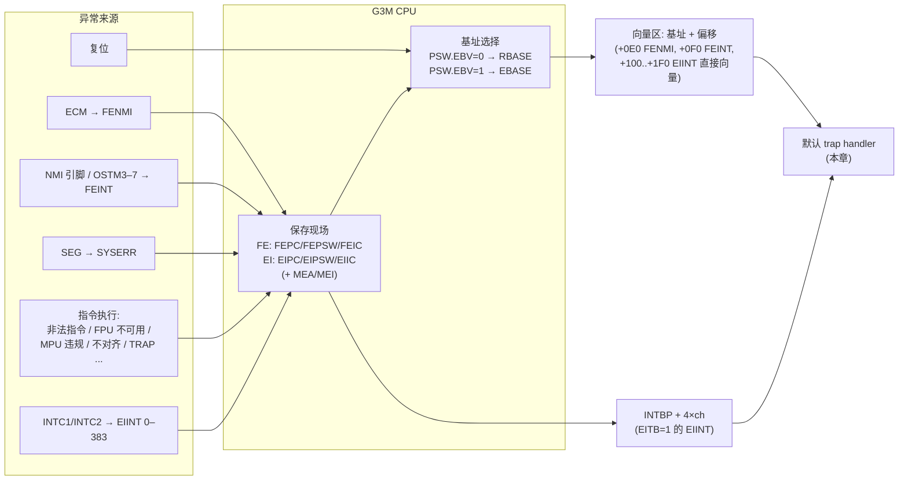
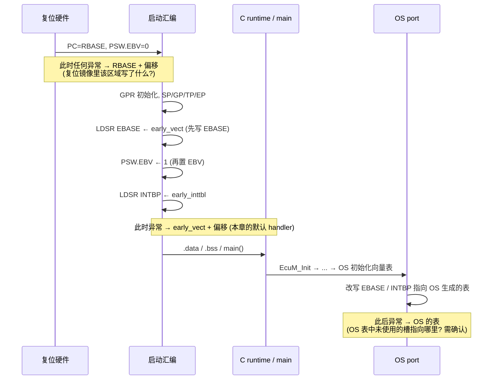
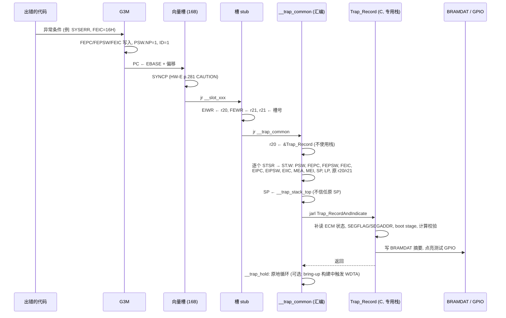
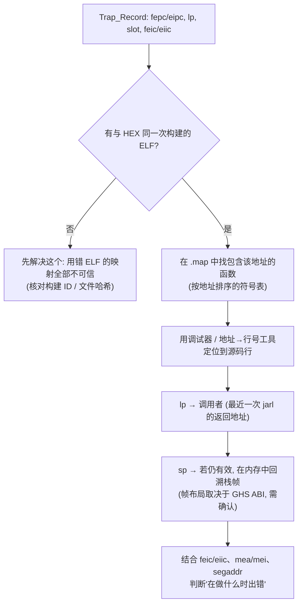

# 异常模型与 trap handler：让每一次 trap 都停在可调试的位置

> Prerequisite: [01-boot-failure-overview.md](01-boot-failure-overview.md), [../01-rh850/02-cpu-architecture.md](../01-rh850/02-cpu-architecture.md), [../01-rh850/06-interrupt-exception.md](../01-rh850/06-interrupt-exception.md)
> Next: [03-reset-causes-and-reset-loops.md](03-reset-causes-and-reset-loops.md)
> 对应规范: HW-E（R01UH0585EJ0120 Rev.1.20）§3.2.1.2 p.192–206（EIPC/FEPC/EIIC/FEIC/FEWR/MEA/MEI/RBASE/EBASE/INTBP）、p.197–198（PSW）、§3.2.3.3 p.244–249（SEG / SYSERR，Table 3.80 FEIC 10H–19H）、§3.2.3.4 p.250（lock-step 注意）、§3.4.4 p.255（多重异常覆盖现场）、§3.4.5 p.256（预取）、§6.1 p.264、§6.4 p.281–290（向量偏移、Table 6.11）、§31.4.1.5 p.2694（MPU 复位后关闭）、§35 p.2862/p.2875（未编程 Flash）、§36.3 p.2891（BRAMDAT）、§21 p.1522–1532（WDTA0 寄存器）。**本仓库没有 RH850G3M User's Manual: Software（下称 G3M SM）、没有 GHS 与 TRACE32 手册**
> 对应源码: 本章 `[Educational Implementation]` 代码只存在于本文中，未在目标硬件或 GHS 工具链上验证
> 事实底稿: [../reference/research/04-rh850-hardware-notes.md](../reference/research/04-rh850-hardware-notes.md) §2.3–2.6

---

## 1. 本章目标

1. 在 P1M-E 层面讲清楚 RH850G3M 的异常模型：**复位、FE 级、EI 级**；哪些信息 HW-E 给出了，哪些必须查 G3M SM。
2. 记住硬件在受理异常时**替你保存了什么**（FEPC/FEPSW/FEIC、EIPC/EIPSW/EIIC、MEA/MEI），以及它们为什么会被覆盖。
3. 理解**向量表放置**（RBASE、EBASE、PSW.EBV、RINT、INTBP）的每一个约束，以及“向量缺失/错位 → 跳进垃圾 → 又一次异常 → 循环”的机制。
4. 能设计并实现一个**健壮的默认 trap handler**：不依赖栈地捕获现场、写入 noinit 记录与 BRAMDAT、点亮测试 GPIO、停在 `__trap_hold`。
5. 知道“**填满每一个向量槽**”和“**填满未使用 Flash**”的意义与限制。
6. 能用调试器读出记录，并把 FEPC/EIPC 映射回源码。

---

## 2. 为什么默认 trap handler 值得认真写？

在一个典型的 AUTOSAR 工程里，异常向量通常有三个“主人”：

| 时间段 | 向量由谁提供 | 默认 handler 通常长什么样 |
|---|---|---|
| 复位 → 启动汇编设置 EBASE 之前 | RBASE 指向的区域（复位入口所在镜像；有 bootloader 时属于 bootloader） | 若镜像中该区域没写东西：**未编程 Flash** |
| 启动汇编 → OS 初始化向量表之前 | 启动汇编自己设置的 EBASE / INTBP（若有） | 常见是一条 `br .`（原地死循环）或干脆没有 |
| OS 运行后 | OS port 生成的向量表 / 异常 hook | 常见是“调用 ShutdownOS / ProtectionHook / 复位” |

问题就出在前两段：**在 OS 接管向量表之前的那段时间，往往没有一个像样的异常入口**。某些 OS port 甚至要在 EcuM 阶段（`main()` 之后）才初始化向量表——那么从复位到这一刻发生的任何异常，都会跳到一个“没人负责”的地址。而“flash 后直接进 trap”恰恰最常发生在这段时间。

默认 handler 写得好，“进了 trap”就从一个**谜**变成一条**带地址和原因码的记录**。

---

## 3. 在系统中的位置



---

## 4. 规范如何定义？

[AUTOSAR Standard] SWS-MCU R24-11 §5.1（p.13）要求 start-up code “initialize the interrupt and trap vector table base address”（指导性要求），除此之外 AUTOSAR **不定义** trap handler 的行为。OS 层面的 ProtectionHook / ErrorHook / ShutdownHook 属于 AUTOSAR OS——**本仓库没有 OS SWS**，只能按公认 R4.x 概念描述，且它们都在 OS 启动之后才有意义。

[RH850 Hardware] 异常模型本身由 G3M 架构定义。HW-E 只给出了 P1M-E 实现相关的部分，并在多处把细节指向 G3M SM（HW-E p.199、p.205、p.255、p.264、p.281）。本章严格区分两者：

- 标注 HW-E 页码的内容：可直接用于核对；
- 标注 **“需按 RH850G3M Software Manual 确认”** 的内容：本章只给架构层面的解释，**不给数值**。

---

## 5. 核心数据结构：异常级别与现场寄存器

### 5.1 三类“入口”

| 类别 | 来源（P1M-E） | HW-E 给出的信息 | 需按 G3M SM 确认 |
|---|---|---|---|
| **复位** | POR、Pin、CVM、软件、ECM、调试器（第 03 章） | 复位向量 = RBASE（user mat 启动时 `0000_0000H`，HW-E p.191、p.205、p.258）；PSW=`0x20`（p.197） | — |
| **FE 级** | FENMI（ECM，不可屏蔽）、FEINT（NMI 引脚、OSTM3–7）、SYSERR（SEG）以及其他 FE 级异常 | FENMI 偏移 `+0E0H`、原因码 `E0H`；FEINT 偏移 `+0F0H`、原因码 `F0H`（HW-E p.282 Table 6.11）；SYSERR 原因码 `10H`–`19H` 与 SEGFLAG 的对应（HW-E p.247 Table 3.80）；受理时 PSW.NP=1、ID=1（p.198） | SYSERR 的**向量偏移**；MIP/MDP（MPU 违规）、MAE（不对齐）、RIE（保留指令）、UCPOP（协处理器不可用，含 FPU）、PIE（特权指令）、FETRAP/TRAP、FPP/FPI、SYSCALL 等的**级别、偏移、原因码、FEPC/EIPC 指向出错指令还是下一条、能否返回** |
| **EI 级** | EIINT 0–383（INTC1/INTC2）以及其他 EI 级异常 | EIIC = `0x1000 + 通道号`（HW-E p.282–290）；直接向量偏移 `+100H`–`+1F0H`（按优先级）或 `+100H`（RINT=1）；表引用 `INTBP + 4×ch`（p.281）；受理时 PSW.ID=1（p.198） | 同上（非 EIINT 的 EI 级异常） |

> 记忆方式：**FE = 严重的、少量的、一般不返回**；**EI = 常规中断和可恢复的异常**。哪些“指令类异常”落在哪一级，必须查 G3M SM 的 Exception Cause List。

### 5.2 硬件保存了什么

[RH850 Hardware] HW-E Table 3.4（p.192）及各寄存器说明：

| 寄存器 | (regID, selID) | 何时写入 | 读出后能回答什么 | 出处 |
|---|---|---|---|---|
| **FEPC** | SR2,0 | 受理 FE 级异常 | 出事时 PC 在哪（出错指令或其后一条，取决于异常种类——需按 G3M SM 确认） | p.192、p.195 |
| **FEPSW** | SR3,0 | 同上 | 出事时是 SV 还是 UM（bit30 UM）、中断是否打开（ID）、是否已在 FE 处理中（NP）、EBV | p.192、p.196–198 |
| **FEIC** | SR14,0 | 同上 | 为什么：`E0H` FENMI、`F0H` FEINT、`10H`–`19H` SYSERR 各子原因；bit31–16 为个别异常的详细码 | p.199、p.247、p.282 |
| **EIPC / EIPSW / EIIC** | SR0,0 / SR1,0 / SR13,0 | 受理 EI 级异常 | 同上；EIIC−`0x1000` = EI 通道号 | p.192–194、p.199、p.282 |
| **MEA** | SR6,2 | MAE（不对齐）或 MPU 违规 | 违规的数据地址 | p.202 |
| **MEI** | SR8,2 | MAE 或 MDP | 出错指令类型（ITYPE）、读/写（RW）、数据宽度（DS）、寄存器号（REG）；“Interrupt (table reference)”也是一种 ITYPE——读 INTBP 表项时违规 | p.203–204 |
| **FEWR / EIWR** | SR29,0 / SR28,0 | 不由硬件写 | handler 可自由使用的暂存寄存器——默认 handler 用它们腾出 GPR | p.192、p.202 |

以及 CPU 外部的 SEG（System Error Generator，base `FFFE_E980H`，HW-E p.244）：

| 寄存器 | 偏移 | 作用 | 复位值 |
|---|---|---|---|
| SEGCONT | +00H | 各类数据访问错误是否通知为 SYSERR | `0000H`（**全部不通知**） |
| SEGFLAG | +02H | 收到过哪类 slave 的错误响应（不自动清除） | `0000H` |
| SEGADDR | +08H | 首个被通知错误的地址（VCIF/TCMF 类；Local RAM 只保留低 19 位） | Undefined（retained） |

（HW-E p.244–248。）

### 5.3 现场为什么会丢：三个覆盖源

1. **同级再次受理**：EIPC/EIPSW 和 FEPC/FEPSW 都“只有一组”（HW-E p.193–194）。
2. **受理不看 ID/NP**：“Acceptance of an exception depends on the type of exception source, regardless of the states of the ID and NP bits in the PSW register. When multiple exceptions are generated, the contents of the system register which hold the context information are overwritten.”（HW-E p.255 §3.4.4）也就是说，**handler 内部再发生一次同步异常（比如用坏掉的栈压栈），现场就被覆盖**。
3. **调试器操作**：复位、重新下载会让一切归零。

所以默认 handler 的第一条设计原则：**在做任何可能失败的事之前，先用最少的资源把现场转存出去。**

---

## 6. 初始化流程：向量表放置与“循环”的成因

### 6.1 三个基址寄存器

[RH850 Hardware]

| 寄存器 | 复位值 | 约束 | 用途 | 出处 |
|---|---|---|---|---|
| **RBASE**（SR2,1） | 由复位向量设置决定（user mat：`0000_0000H`），**只读** | bit31–9 有效（512 B 对齐）；bit0 = RINT | 复位向量；PSW.EBV=0 时也是**异常向量基址** | p.205、p.258；variable reset vector 见 p.2865 |
| **EBASE**（SR3,1） | **Undefined** | bit31–9 有效（512 B 对齐）；bit0 = RINT | PSW.EBV=1 时的异常向量基址 | p.205 |
| **INTBP**（SR4,1） | **Undefined** | bit31–9 有效（512 B 对齐） | 表引用方式 EIINT 的地址表基址 | p.206 |
| PSW.EBV | 0 | — | 选择 RBASE 或 EBASE | p.197–198 |

补充事实：

- SYSERR 发生时 **PSW.EBV 保持不变**，基址不变（HW-E p.249 (c)）。
- RINT=1 时所有直接向量 EIINT 都进 `+100H`（HW-E p.281）；RBASE.RINT 只在 EBV=0 时有效（p.205）。写 EBASE 时 bit0 就是 RINT，**别把一个奇数地址当成 EBASE 写进去**。
- 表引用方式下，表项在 `INTBP + 4×ch`，每项是一个 handler 地址（HW-E p.281）；表本身至少 384×4 = 1536 B。

### 6.2 时间线：每个时刻的异常会跳到哪里



逐段解释：

1. **复位 → 写 EBASE 之前**：EBV=0，异常走 RBASE。若应用镜像的 `0000_0000H` 起 512 B 内只写了复位跳转，其余部分是未编程 Flash，那么此时的任何异常都会**取指到未编程区域**——可能触发 ECC 错误并产生异常（HW-E p.2875），于是再次进入同一个向量……形成循环。若有 bootloader，RBASE 区域属于 bootloader，此时的异常进入 **bootloader 的** handler。
2. **顺序：先写 EBASE，再置 EBV**。反过来做，中间有一段时间 EBV=1 而 EBASE 是 Undefined（HW-E p.205）。
3. **OS 接管后**：OS 生成的向量表里“没有配置的槽”指向哪里，是 OS 工具/port 的行为，**需在真实项目中确认**。最好让它们也指向（或最终调用）同一个默认记录函数。

### 6.3 “跳进垃圾 → 再一次异常 → 循环”的几种形态

| 形态 | 调试器 halt 后看到的现象 | 根因 |
|---|---|---|
| PC 与 FEPC/EIPC 都在向量区同一个地址附近 | 向量入口本身就是坏的（未编程 / 被覆盖 / EBASE 指错） | 向量区没有被 HEX 覆盖；EBASE 指向错误段；链接脚本里向量段没有 512 B 对齐导致 EBASE 低位被截断后指向前面的代码 |
| PC 在一个与项目无关的地址，FEIC 每次读都一样 | 进入 handler 后 handler 又出错（例如用坏栈压栈） | handler 依赖栈 / RAM |
| PC 总在某个 handler 内，FEPC 指向同一条用户指令 | handler 执行了 FERET/EIRET 回到出错指令，再次出错 | handler “假装处理完了”就返回；SYSERR 本来就**不可返回**（HW-E p.244） |
| PC 在 INTBP 表附近或 `0x0000_0000` 附近的奇怪地址 | INTBP 未设置（Undefined）或表项为 0/未编程 | 某 EIC 的 EITB=1 且 EIMK=0，但 INTBP 还没写，或该通道的表项没有填 |

**512 B 对齐的陷阱**值得单独强调：EBASE/RBASE/INTBP 的低 9 位被硬件当作 0（HW-E p.205–206）。如果链接器把向量段放在 `0x0000_0A40`，而你把这个符号写进 EBASE，硬件实际使用的是 `0x0000_0A00`——异常跳到 `0x0A00 + 0x0E0` 的**另一段代码**里。所以：**向量段必须在链接脚本里 `ALIGN(512)`，并且启动代码最好在写 EBASE 前用断言检查低 9 位**。

---

## 7. Runtime Flow：一次被正确捕获的 trap



每一步的理由：

- **SYNCP 在最前**：HW-E p.281 CAUTION：“FENMI, FEINT, EIINT (direct vector method), SYSERR, FPI need insertion of SYNCP instruction before the exception handler.” 默认 handler 不知道自己是被哪种异常进入的，就**每个槽都放 SYNCP**。SYNCP 的确切语义需按 G3M SM 确认。
- **向量槽里只放“SYNCP + 跳转”**：直接向量的相邻入口相距 16 字节（FENMI `+0E0H` 与 FEINT `+0F0H`，EIINT 每级 `+10H`，HW-E p.281–282），槽里放不下完整的保存序列。
- **用 FEWR/EIWR 腾出两个 GPR**：这两个寄存器就是为此设计的（HW-E p.202）。
- **不使用栈**：栈指针可能正是出错原因。先把现场写到一个固定地址的 noinit 记录，再把 SP 换成专用 trap 栈。
- **C 部分只做“读寄存器 + 写内存”**：不调用库函数、不依赖 `.data` 初值（handler 可能在 `.data` 复制之前被触发）。
- **停在 `__trap_hold`**：一个有名字的位置，调试器一看就知道“被捕获了”。

### 7.1 判断“进来的是 FE 级还是 EI 级”

默认 handler 的每个槽并不知道自己对应哪一级（除 FENMI、FEINT 和 EIINT 区域外，其余偏移的分配需查 G3M SM）。一个可行的办法是**同时保存两组现场**，再利用 PSW 在受理时的变化来判断：

- 受理 FE 级异常时 **PSW.NP=1**（且 ID=1）；受理 EI 级时只置 **ID=1**（HW-E p.198）。
- 所以在 handler 入口读到的“当前 PSW”中 NP=1 → 很可能是 FE 级；NP=0 → EI 级。

[推导] 这一判断依赖“进入 handler 前没有处于 FE 处理中”。若 handler 自身是在一个 FE handler 内部又出错进入的，NP 本来就是 1——这正是记录 `seq`（第几次进入）有用的地方。最终的级别判断仍以 G3M SM 的异常表为准。

---

## 8. RH850 Hardware Mapping：原因码速查（只列 HW-E 能确认的）

| 读到的值 | 含义 | 下一步 | 出处 |
|---|---|---|---|
| FEIC = `E0H` | FENMI（来自 ECM） | 读 ECMMESSTR0/1/2（`FFD6_0008H` 起），对照 Table 32.9 找错误源 | HW-E p.282、p.2790–2793 |
| FEIC = `F0H` | FEINT（NMI 引脚或 OSTM3–7） | 读 FEINTF（`FFD6_7000H`）区分来源 | HW-E p.278、p.282 |
| FEIC = `11H` | SYSERR：从 Code Flash 取指出错 | FEPC 附近的 Flash 是否已编程？是否 ECC 错误（ECM 源 19）？ | HW-E p.247、p.2791 |
| FEIC = `12H` | SYSERR：SEGFLAG.ICCF（I-Cache 错误，需 ICCTRL.ICHEMK=0 才通知） | — | HW-E p.246–247 |
| FEIC = `13H` | SYSERR：从 Code Flash 以外取指出错 | 是否跳到了 RAM/外设地址执行？RAM 代码末尾 48 B 是否初始化（p.256）？ | HW-E p.247 |
| FEIC = `14H` | SYSERR：SEGFLAG.VCIF（GRAM/Code Flash/H-Bus/P-Bus 读、未实现区域、guard、特权违规等） | 读 SEGADDR 得到出错地址 | HW-E p.246–248 |
| FEIC = `16H` | SYSERR：SEGFLAG.TCMF（Local RAM ECC 或访问未实现的 Local RAM 区域） | 读 SEGADDR（低 19 位）；栈/指针是否越过 128 KB？ | HW-E p.245、p.247–248 |
| FEIC = `18H` | SYSERR：SEGFLAG.VCRF（IPG 违规） | 读 IPGADRUM（HW-E p.240） | HW-E p.245、p.247 |
| FEIC = `19H` | SYSERR：SEGFLAG.VPGF（P-Bus 写错误：guard、EDC/ECC、未实现区域） | 写了哪个外设？该外设是否被 PBG 保护？ | HW-E p.245、p.247 |
| EIIC = `0x1000 + n` | EIINT 通道 n | Table 6.11 → 外设 → 哪个模块使能了它却没注册 ISR | HW-E p.282–290 |
| 其他 FEIC/EIIC 值 | 指令类异常（RIE、UCPOP、PIE、MAE、MIP/MDP、TRAP/FETRAP、FPU 等） | **需按 RH850G3M Software Manual 确认**；同时看 MEA/MEI | HW-E p.199 |

注意 SYSERR 的数据访问类（14H/16H/18H/19H）只有在 SEGCONT 对应位使能后才会通知（SEGCONT 复位值 `0000H`，HW-E p.245–249）。**如果项目没有使能 SEGCONT，同样的错误可能根本不产生异常**，只在 SEGFLAG 和/或 ECM 中留下痕迹——所以默认 handler 和“第一小时流程”都要读 SEGFLAG。

几个常见“启动早期 trap”的硬件背景：

| 症状 | 背景事实 | 出处 |
|---|---|---|
| 刚进 C 代码第一个浮点运算就 trap | PSW.CU0=0 时 FPU 指令产生 coprocessor unusable 异常；PSW 复位值 CU0=0 | HW-E p.197 |
| 刚开始压栈就 trap / ECM 报 DCLS compare error（源 1） | 压栈了复位后值未定义的 GPR，可能引起 lock-step 比较错误 | HW-E p.250、p.2790 |
| 启动早期出现 MPU 类异常 | **不太可能**：PE 的 MPU 复位后关闭 | HW-E p.2694 §31.4.1.5 |
| OS 启动后才出现 MDP，MEI.ITYPE = 10101B | 读 INTBP 表项时违反 MPU（表放在了当前模式不可读的区域） | HW-E p.204 Table 3.22 Note 3 |
| 刚执行完 RAM 中的函数就 ECC/SYSERR | 预取越过代码末尾读到未初始化 RAM | HW-E p.256 |

---

## 9. openAUTOSAR 实现

openAUTOSAR 没有任何 RH850 异常向量或 trap handler（无 arch port，[03-openautosar-trace.md](../reference/research/03-openautosar-trace.md) §1.2）。可以对照的是其平台无关的 `system/kernel/src/isr.c`（`Os_Isr`，`:327`）——它展示了“OS 层面如何分发已注册的 ISR”，但**不处理未注册中断和 CPU 异常**，也没有被 CMake 编译（[06-interrupt-exception.md](../01-rh850/06-interrupt-exception.md) §9）。

---

## 10. 当前教学项目实现

[Educational Implementation] 下面 §11 的代码是本教程的教学实现，组成如下：

| 部分 | 语言 | 位置（链接） | 作用 |
|---|---|---|---|
| `early_vect`：16 个 16 B 槽 × 2 区（`+000H`–`+1F0H`） | 汇编 | Code Flash，`ALIGN(512)` | 每个槽：SYNCP + 跳到对应 stub |
| `early_inttbl`：384 个表项 | 汇编数据 | Code Flash，`ALIGN(512)` | 全部指向 EI 默认 stub |
| `__slot_xxx` stub + `__trap_common` + `__trap_hold` | 汇编 | Code Flash | 不依赖栈地保存现场 |
| `Trap_Record`（noinit）+ `Trap_Stack` | 数据 | Local RAM noinit 段 | 现场记录 + 专用小栈 |
| `Trap_RecordAndIndicate()` | C | Code Flash | 补充证据、写 BRAMDAT、GPIO |

**未在 GHS 上汇编/链接验证，未在 R7F701381 上运行。**

---

## 11. Code Walkthrough：一个健壮的默认 trap handler

### 11.1 记录格式

```c
/* [Educational Implementation] trap 记录 —— 放在 noinit 段（启动代码不清零，见第 03 章）
 * 偏移在汇编中硬编码使用，修改结构时必须同步修改汇编中的 TR_* 常量 */
#define TRAP_MAGIC      0x54524150u   /* 'TRAP' */

typedef struct {
    uint32 magic;        /* +00 TRAP_MAGIC 表示本记录有效 */
    uint32 slot;         /* +04 向量槽偏移 (0x010..0x1F0) 或 0x0400=INTBP 表项默认 stub */
    uint32 psw_now;      /* +08 进入 handler 时的 PSW: NP=1 推断为 FE 级 (HW-E p.198) */
    uint32 fepc;         /* +0C SR2,0 */
    uint32 fepsw;        /* +10 SR3,0 */
    uint32 feic;         /* +14 SR14,0 */
    uint32 eipc;         /* +18 SR0,0 */
    uint32 eipsw;        /* +1C SR1,0 */
    uint32 eiic;         /* +20 SR13,0 */
    uint32 mea;          /* +24 SR6,2  仅 MAE/MPU 类异常时有意义 (HW-E p.202) */
    uint32 mei;          /* +28 SR8,2  仅 MAE/MDP 时有意义 (HW-E p.203) */
    uint32 sp;           /* +2C 出事时的 r3 */
    uint32 lp;           /* +30 出事时的 r31：最近一次 jarl 的返回地址 → 调用者线索 */
    uint32 r20;          /* +34 被 stub 借用前的 r20 (来自 EIWR) */
    uint32 r21;          /* +38 被 stub 借用前的 r21 (来自 FEWR) */
    /* ---- 以下由 C 部分填写 ---- */
    uint32 seq;          /* +3C 本次上电以来第几次进入 handler（嵌套/重入检测） */
    uint32 boot_stage;   /* +40 进入 trap 前最后一个 boot 阶段码（第 03 章） */
    uint32 ecm_esstr[3]; /* +44 ECMMESSTR0..2 (FFD6_0008H..) HW-E p.2799 */
    uint32 segflag;      /* +50 SEGFLAG (FFFE_E982H, 16 bit) HW-E p.247 */
    uint32 segaddr;      /* +54 SEGADDR (FFFE_E988H) HW-E p.248 */
    uint32 check;        /* +58 简单校验：所有前述字的 XOR ^ 0xA5A5A5A5 */
} TrapRecord_t;
```

设计取舍：

- **同时保存 FE 和 EI 两组现场**，事后由 `psw_now`、`slot` 和原因码判断哪组有意义（§7.1）。
- **`check` 用 XOR 而不是 CRC32**：handler 里越简单越好；它要回答的只是“这块 noinit 内存是本次写的，还是上电后的随机值/旧数据”。
- 记录放在 Local RAM noinit 段：**不会被启动代码清零**；能否活过复位取决于 STAC_LM0（第 03 章）。跨所有复位都保留的最小摘要另写 BRAMDAT（§11.4）。

### 11.2 向量区与 INTBP 表

```asm
;=====================================================================
; [Educational Implementation] 早期异常向量区 —— GHS 风格教学代码
;   * 未在 GHS 上汇编验证。段声明、.align、.word、标签前缀(_ / __)、
;     stsr/ldsr 的操作数写法，都必须按项目所用 GHS 汇编器手册确认。
;   * 只有 +0E0H(FENMI)、+0F0H(FEINT)、+100H..+1F0H(EIINT) 的分配来自
;     HW-E p.281-282；其他偏移(+010H..+0D0H)对应哪个异常需按 G3M SM 确认。
;     这里按 "16 字节一个槽" 全部填满 —— 这是基于 "已知偏移都是 16 的
;     倍数" 的推断, 必须用 G3M SM 的异常表核对。
;=====================================================================
        .section ".early_vect", .text     ; 链接脚本中 ALIGN(512), 见 §11.6
__early_vect:
        jr      __start                   ; +000H 复位 (仅当此表同时是 RBASE 表时有意义)
        .align  16
__ev_010: syncp
        jr      __slot_010
        .align  16
__ev_020: syncp
        jr      __slot_020
        .align  16
        ; ... +030H .. +0D0H 同样模式, 每槽一个独立 stub, 便于事后知道走的是哪个槽
        .align  16
__ev_0E0: syncp                           ; FENMI (HW-E p.282)
        jr      __slot_0E0
        .align  16
__ev_0F0: syncp                           ; FEINT (HW-E p.282)
        jr      __slot_0F0
        .align  16
__ev_100: syncp                           ; EIINT 直接向量, 优先级 0 (RINT=1 时全部进这里)
        jr      __slot_100
        .align  16
        ; ... +110H .. +1F0H: 优先级 1..15, 同样模式
        ; 每个槽: SYNCP + JR 必须 ≤ 16 字节; 指令长度需按 G3M SM 确认

;---------------------------------------------------------------------
; 表引用方式的地址表: 384 项, 全部指向 EI 默认 stub。
; 通道号由 EIIC 给出 (0x1000 + ch, HW-E p.282), 所以一个 stub 足够。
;---------------------------------------------------------------------
        .section ".early_inttbl", .rodata ; 链接脚本中 ALIGN(512)
__early_inttbl:
        .rept   384                       ; 伪指令名需按 GHS 手册确认
        .word   __slot_tbl
        .endr
```

为什么**每个槽一个 stub**而不是全部跳到同一个地址？因为对于 `+010H`–`+0D0H` 这些 HW-E 没有给出含义的槽，**“走了哪个槽”本身就是证据**——即使 FEIC/EIIC 的数值你暂时查不到，`slot` 字段也能把你直接带到 G3M SM 异常表中的那一行。

### 11.3 stub、公共入口与 `__trap_hold`

```asm
;---------------------------------------------------------------------
; [Educational Implementation] 槽 stub: 腾出 r20/r21, 记下槽号
;   ldsr reg2, regID, selID / stsr regID, reg2, selID 的写法需按 GHS 确认
;---------------------------------------------------------------------
__slot_010:
        ldsr    r20, 28, 0                ; EIWR (SR28,0) ← r20   HW-E p.192
        ldsr    r21, 29, 0                ; FEWR (SR29,0) ← r21   HW-E p.192, p.202
        movea   0x010, r0, r21            ; r21 = 槽号
        jr      __trap_common
        ; __slot_020 ... __slot_1F0 同样模式
__slot_tbl:                               ; INTBP 表项默认入口
        ldsr    r20, 28, 0
        ldsr    r21, 29, 0
        movea   0x400, r0, r21            ; 约定: 0x400 = "表引用默认 stub"
        jr      __trap_common

;---------------------------------------------------------------------
; 公共入口: 只用 r20(记录基址) 和 r21(数据), 完全不碰栈
;---------------------------------------------------------------------
__trap_common:
        mov     ___Trap_Record, r20       ; 32 位立即数装载记录地址 (noinit 段)
        st.w    r21, 0x04[r20]            ; slot
        stsr    5, r21, 0                 ; PSW   (SR5,0)
        st.w    r21, 0x08[r20]
        stsr    2, r21, 0                 ; FEPC  (SR2,0)
        st.w    r21, 0x0C[r20]
        stsr    3, r21, 0                 ; FEPSW (SR3,0)
        st.w    r21, 0x10[r20]
        stsr    14, r21, 0                ; FEIC  (SR14,0)
        st.w    r21, 0x14[r20]
        stsr    0, r21, 0                 ; EIPC  (SR0,0)
        st.w    r21, 0x18[r20]
        stsr    1, r21, 0                 ; EIPSW (SR1,0)
        st.w    r21, 0x1C[r20]
        stsr    13, r21, 0                ; EIIC  (SR13,0)
        st.w    r21, 0x20[r20]
        stsr    6, r21, 2                 ; MEA   (SR6,2)
        st.w    r21, 0x24[r20]
        stsr    8, r21, 2                 ; MEI   (SR8,2)
        st.w    r21, 0x28[r20]
        st.w    sp, 0x2C[r20]             ; 出事时的 SP
        st.w    lp, 0x30[r20]             ; 出事时的 LP
        stsr    28, r21, 0                ; 原 r20 (EIWR)
        st.w    r21, 0x34[r20]
        stsr    29, r21, 0                ; 原 r21 (FEWR)
        st.w    r21, 0x38[r20]
        mov     0x54524150, r21           ; 最后写 magic: 记录完整之前 magic 不成立
        st.w    r21, 0x00[r20]

        mov     ___Trap_StackTop, sp      ; 换到专用 trap 栈 (不信任原 SP)
        jarl    _Trap_RecordAndIndicate, lp

__trap_hold:                              ; ← 调试器在这里设断点 / 看到 PC 停在这里
#ifdef BRINGUP_TRAP_SERVICE_WDTA          ; 仅 bring-up 构建! 见 §11.5
        mov     0xFFD74000, r10           ; WDTA0WDTE  (WDTA0_base, HW-E p.1522, p.1527)
        mov     0xAC, r11                 ; 固定激活码 ACH (HW-E p.1528)
        st.b    r11, 0[r10]
#endif
        br      __trap_hold
```

关键点逐条对照：

| 代码 | 理由 | 依据 |
|---|---|---|
| 槽内先 `syncp` | FENMI/FEINT/EIINT 直接向量/SYSERR/FPI 要求 | HW-E p.281 CAUTION |
| 用 EIWR/FEWR 暂存 r20/r21 | 不压栈就腾出工作寄存器 | HW-E p.192、p.202 |
| 先存现场，再做别的 | 任何后续异常都会覆盖 FE/EI 现场 | HW-E p.255 |
| `magic` 最后写 | handler 中途再出错时，记录不会被误认为完整 | — |
| 换专用栈后才进 C | 原 SP 可能就是故障原因 | — |
| `__trap_hold` 是一个有名字的循环 | 调试器一眼识别；也可以对它设硬件断点 | — |

> **lock-step 注意（HW-E p.250）**：handler 把 GPR（SP、LP、r20、r21）写到 RAM。只要启动代码在复位后**第一时间**初始化了全部 GPR（[04-startup-process.md](../01-rh850/04-startup-process.md) §6.2），这些值就是确定的。如果 trap 发生在 GPR 初始化之前（例如复位入口本身就跳错了），这些 store 可能引起 lock-step 比较错误——这也是“GPR 初始化必须是复位后最先做的事”的又一个理由。

### 11.4 C 部分：补充证据、BRAMDAT 摘要、指示灯

```c
/* [Educational Implementation] 默认 trap 记录的 C 部分
 * 运行环境: 专用 trap 栈; 不能依赖 .data 初值 / .bss 清零 / 任何驱动 */
#define REG32(a)            (*(volatile uint32 *)(a))
#define REG16(a)            (*(volatile uint16 *)(a))

#define ECMMESSTR0_ADDR     0xFFD60008u   /* +0CH, +10H 为 1/2, HW-E p.2799 */
#define SEGFLAG_ADDR        0xFFFEE982u   /* SEG base FFFE_E980H + 02H, 16 bit, HW-E p.244 */
#define SEGADDR_ADDR        0xFFFEE988u   /* + 08H, HW-E p.244, p.248 */
#define BRAMDAT_ADDR(n)     (0xFFC0A000u + 4u * (n))   /* HW-E p.2891 */

extern TrapRecord_t Trap_Record;          /* noinit */
extern uint32       Trap_SeqThisPowerOn;  /* noinit; 由启动代码在 POR 时清 0 (第 03 章) */

static uint32 Trap_Check(const TrapRecord_t *r)
{
    const uint32 *w = (const uint32 *)r;
    uint32 x = 0xA5A5A5A5u;
    uint32 i;
    for (i = 0u; i < (sizeof(TrapRecord_t) / 4u) - 1u; ++i) { x ^= w[i]; }
    return x;
}

void Trap_RecordAndIndicate(void)
{
    TrapRecord_t *r = &Trap_Record;
    uint32 pc, cause;

    r->seq        = ++Trap_SeqThisPowerOn;            /* >1 说明 handler 被重入 */
    r->boot_stage = BootTrace_CurrentStage();          /* 第 03 章: 只读 BRAMDAT0 低 16 位 */
    r->ecm_esstr[0] = REG32(ECMMESSTR0_ADDR);
    r->ecm_esstr[1] = REG32(ECMMESSTR0_ADDR + 4u);
    r->ecm_esstr[2] = REG32(ECMMESSTR0_ADDR + 8u);
    r->segflag    = REG16(SEGFLAG_ADDR);               /* 读访问无限制, HW-E p.244 */
    r->segaddr    = REG32(SEGADDR_ADDR);
    r->check      = Trap_Check(r);

    /* BRAMDAT 摘要: 任何复位都不清 (HW-E p.2891)。布局与第 03 章约定一致:
     *   BRAMDAT0 = 0xB0 << 24 | 复位计数 << 16 | boot stage (由 BootTrace 维护, 这里不改)
     *   BRAMDAT1 = 出事 PC
     *   BRAMDAT2 = 原因码 (低 16 位) | 槽号 (高 16 位)
     *   BRAMDAT3 = BRAMDAT0 ^ BRAMDAT1 ^ BRAMDAT2 ^ 0xA5A5A5A5 */
    if ((r->psw_now & (1u << 7)) != 0u) {               /* PSW.NP: FE 级 (HW-E p.198) */
        pc = r->fepc;  cause = r->feic;
    } else {
        pc = r->eipc;  cause = r->eiic;
    }
    REG32(BRAMDAT_ADDR(1)) = pc;
    REG32(BRAMDAT_ADDR(2)) = (r->slot << 16) | (cause & 0xFFFFu);
    REG32(BRAMDAT_ADDR(3)) = REG32(BRAMDAT_ADDR(0)) ^ pc
                           ^ REG32(BRAMDAT_ADDR(2)) ^ 0xA5A5A5A5u;

    BringUp_TrapLedOn();   /* 板级: 哪个 GPIO、Port 寄存器如何写 —— 需按原理图与 HW-E §2 确认;
                              引脚必须在启动早期就已配置为输出, handler 里只做一次写 */
}
```

C 部分的约束：

- **只读寄存器、只写内存**。不调 `memset`、不调 Det/Dem、不访问 CAN。
- `Trap_SeqThisPowerOn` 也在 noinit 段；它的“清零”只在启动代码判定 POR 时做（第 03 章），否则 `.bss` 清零会在每次启动把它归零，失去“重入计数”的意义。
- **ERROROUT 不作为 bring-up 指示**：ECM 的 ERROROUT 设置/清除需要保护序列、ECMPEM 屏蔽和状态确认（HW-E p.2804–2805），不适合在 handler 中临时操作。若项目希望 trap 时强制 ERROROUT，应在 safety 设计中统一考虑（例如把软件检测到的致命错误经 ECM 的机制输出），**需在真实项目中确认**。

### 11.5 `__trap_hold` 与看门狗

如果 option byte OPWDRUN=1（WDTA0 上电自动运行，HW-E p.1525、p.2884），停在 `__trap_hold` 的 CPU 会在溢出时间后被 WDTA → ECM → Application Reset 1 复位（默认配置，HW-E p.2817、p.426），trap 变成复位循环。三种选择：

| 选择 | 做法 | 代价 |
|---|---|---|
| A | bring-up 期间把 OPWDRUN 设为 0（软件触发启动），WDTA 在被第一次触发前不运行 | 需要改 option bytes（第 03 章 §12.3），量产前必须恢复 |
| B | bring-up 构建在 `__trap_hold` 中写 `ACH` 到 WDTA0WDTE | 仅当 OPWDVAC=0（固定激活码）且窗口为 100%（WDTA0MD.WS 复位值 `11B`=100%，且未被软件改小）时成立（HW-E p.1528、p.1531–1532）；VAC 模式下写 WDTAnWDTE 会被忽略/报错，需要按 EVAC 计算——**不适合在 handler 里做**。**此行为绝不能进入量产构建** |
| C | 不处理，接受复位；依赖 BRAMDAT 摘要 + 第 03 章的复位循环保护 | 调试器看不到停住的现场，只能看到摘要 |

调试器把 CPU halt 住时 WDTA0 **无条件停止**（HW-E §34.4 Peripheral Break Control p.2855），所以“调试器停住”是安全的；但**没有调试器时**，CPU 在 `__trap_hold` 自旋并不算 halt，WDTA 照常计数——这正是上面三种选择要解决的问题。

### 11.6 链接与“填满一切”

[Conceptual] 链接脚本片段（GHS 语法需按手册确认，参考 [p1me-memory-layout-ghs-memmap.md](../reference/p1me-memory-layout-ghs-memmap.md) §5）：

```ld
SECTIONS {
    .early_vect    ALIGN(512) : > iROM     /* EBASE 低 9 位必须为 0 (HW-E p.205) */
    .early_inttbl  ALIGN(512) : > .        /* INTBP 低 9 位必须为 0 (HW-E p.206) */
    ...
    .bss.noinit.trap ALIGN(4) NOCLEAR : > iRAM_NI   /* Trap_Record, Trap_Stack, Trap_Seq */
}
```

启动汇编里在写 EBASE/INTBP 之前加一个自检：

```asm
        mov     ___early_vect, r10
        andi    0x01FF, r10, r11          ; 低 9 位
        cmp     r0, r11
        bne     __start_misaligned_vect   ; 未对齐: 停在一个有名字的循环 (不能再依赖异常)
        ldsr    r10, 3, 1                 ; EBASE (SR3,1) ← r10, RINT=0
        ; 之后再置 PSW.EBV (bit15), HW-E p.198
```

**“填满每一个向量槽”的含义**有三层：

1. **EBASE 区**：`+000H`–`+1F0H` 每个 16 B 槽都有 SYNCP + 跳转（§11.2）。
2. **INTBP 表**：384 项全部有效。即使你“只用了 10 个中断”，其余 374 项也要指向默认 stub——任何一个误开的 EIMK、任何一个 EITB 配置错误，都不会再跳进地址 0 或未编程区域。
3. **OS 生成的表**：OS 接管后，未配置的槽指向哪里，要在 OS 配置/生成物里确认，并尽量也落到同一个记录函数。

**“填满未使用 Flash”**：

- HW-E 明确：擦除后未编程的 Code Flash 读出值**不保证**，可能产生 ECC 错误和异常（p.2862、p.2875）；预取也可能读到这些区域（p.256）。所以 **P1M-E 的“擦除值”不是一个可以依赖的常数**——本仓库手册中没有给出可用作“空白填充”的读出值，需根据 Flash Memory 手册确认（本仓库没有该手册）。
- 因此有两种做法，都需要在真实项目中评估：
  - 让链接器/HEX 生成工具把镜像内的空隙（段之间的 gap）填成一个**确定的模式**，并让这个模式在被当作指令执行时**确定地**进入异常或原地循环。具体选哪条指令的编码（例如保留指令、`TRAP` 类指令或“跳转到自身”）**需按 RH850G3M Software Manual 的指令编码确认**——不要假设 `0x0000` 或 `0xFFFF` 是什么指令。GHS 链接器/`gsrec` 是否提供填充选项以及参数，**需按 GHS 手册确认**。
  - 至少保证**向量区、INTBP 表及其后的预取范围**被完整编程。
- 注意填充会改变 HEX 的覆盖范围与烧录时间，也会影响 bootloader 的应用校验区计算，需与 bootloader 方案一致。

---

## 12. Debug 方法：读出记录，把 PC 映射回源码

### 12.1 读记录

[Conceptual] TRACE32 风格示意（**命令名、选项、地址访问类前缀需按 Lauterbach RH850 手册确认**；前提是已加载与烧录 HEX **同一次构建**的 ELF 符号）：

```text
; 已停在 __trap_hold, 或 attach 后 halt
Register.view                          ; PC 应在 __trap_hold
Var.View %Hex Trap_Record              ; 按结构体看记录 (依赖 ELF 调试信息)
Data.dump D:0xFFC0A000 /Long           ; BRAMDAT0..3 摘要
Data.dump D:0xFFD60008 /Long           ; ECMMESSTR0..2
List.Mix <Trap_Record.fepc 的值>         ; 在源码/反汇编混合视图中定位
```

在 GHS MULTI 中，等价操作是：查看全局变量 `Trap_Record`、在内存视图看 `0xFFC0A000`、在源码窗口“跳转到地址”。具体菜单与命令**需按 MULTI 手册确认**。

### 12.2 把 FEPC/EIPC 映射回源码



- **map 文件**：GHS 链接器生成的 map 中有按地址排序的符号表。找到“起始地址 ≤ PC 的最后一个函数符号”，再核对该函数的大小。
- **地址 → 行号工具**：GHS 工具链附带若干命令行工具（常被提及的有 `gdump`、`gaddr2line` 一类），**工具名、是否随你的版本提供、参数格式都需按所用 GHS 版本手册确认**。TRACE32 / MULTI 在加载 ELF 后可以直接完成同样的工作，通常更可靠。
- **FEPC 指向“出错指令”还是“下一条”**，因异常种类而异——**需按 G3M SM 确认**。对异步异常（FENMI、FEINT、SYSERR、EIINT），PC 往往只是“被打断的位置”，真正的出错访问可能在它之前若干条指令，此时 **SEGADDR / MEA 比 FEPC 更接近真相**。
- **地址落在哪个区域**本身就是线索：对照 [03-memory-map.md](../01-rh850/03-memory-map.md) §5.1——PC 在 `FEDE_xxxx`（从 RAM 执行？）、在 `0100_0000` 以上（扩展区？）、在 Code Flash 中但 map 里没有对应符号（未编程区域 / 填充区）。

### 12.3 典型现场解读

| 记录内容 | 解读 | 下一步 |
|---|---|---|
| slot=`0x0E0`，feic=`E0H`，ecm_esstr[0] bit1=1 | FENMI，ECM 源 1（DCLS compare error） | 检查启动代码 GPR 初始化是否在第一次 store 之前（HW-E p.250）；项目是否把该源配置为 NMI |
| slot 在 `0x010`–`0x0D0`，feic=`16H`，segaddr 低 19 位指向栈区下方 | SYSERR / Local RAM 访问错误，很可能栈溢出越界 | 栈大小、栈放置（[p1me-memory-layout-ghs-memmap.md](../reference/p1me-memory-layout-ghs-memmap.md) §2.2） |
| slot=`0x400`，eiic=`0x10BE` | INTBP 表引用进入默认 stub，通道 190（RS-CANFD RX FIFO） | 有人使能了 EI190（EIMK=0）但没有注册 ISR，或 OS 还没接管向量表时就开了中断 |
| slot=`0x1x0`，eiic=`0x104A`，sp 正常 | 直接向量 EIINT，通道 74（OSTM0） | 该通道 EITB=0（直接向量）是否是预期？OS 是否期望表引用？ |
| slot 某值，feic/eiic 是 HW-E 中查不到的值，mei.ITYPE 有效 | 指令类异常（不对齐 / MPU 等） | MEA = 违规数据地址；查 G3M SM 异常表 |
| magic 无效，但 BRAMDAT 摘要有效 | trap 后发生了复位，且 Local RAM 被硬件清零 | 第 03 章：STAC_LM0 与复位循环保护 |

---

## 13. 常见问题

| 问题 | 回答 |
|---|---|
| 为什么不直接在每个向量里放 `br .`？ | 它能停住，但不记录任何东西；而且所有槽长得一样，halt 后你只知道 PC，不知道 FEPC/FEIC 当时的值是否已被后续事件覆盖 |
| SYSERR 的向量偏移是多少？ | HW-E 没有给出，**需按 RH850G3M Software Manual 确认**。这正是“每个槽一个 stub”的理由：先抓住，再查表 |
| 默认 handler 应该 FERET/EIRET 返回吗？ | bring-up 阶段不应该。返回到出错指令只会再次出错；SYSERR 不可返回（HW-E p.244） |
| handler 里能调用 `Mcu_PerformReset()` 吗？ | 量产策略可能如此；bring-up 阶段建议停住。如果必须复位，先写好 BRAMDAT 摘要 |
| INTBP 表放 RAM 还是 Flash？ | 都可以（表引用延迟不同，HW-E p.297）。早期表放 Flash 最稳：不依赖 `.data` 复制；OS 之后可以换成自己的表 |
| 我的项目 OS 负责向量表，我还需要早期表吗？ | 需要覆盖“复位 → OS 初始化向量表”之间的窗口。至少在这段窗口内，EBASE/INTBP 应指向一个完整、全部有效的表 |

---

## 14. 实验

**实验 1：偏移推演。** 设 EBASE = `0x0000_1000`、EBV=1、RINT=0。分别计算 FENMI、FEINT、EIINT 优先级 3 的入口地址。再设链接器把向量段错放到 `0x0000_1040`，而启动代码把这个值写进 EBASE：FENMI 实际会跳到哪里？

**实验 2：记录偏移核对。** 把 §11.1 的结构体编译（主机即可），用 `offsetof` 打印每个字段偏移，与 §11.3 汇编中的硬编码偏移逐一比对。思考：如何让这类“C 与汇编共享偏移”的约束在构建时自动检查？

**实验 3：FEIC 解码函数。** 写一个主机可测试的 `const char *Trap_DecodeFeic(uint32 feic)`，只覆盖 HW-E 能确认的值（`E0H`、`F0H`、`10H`–`19H`），其他值返回 `"see G3M SM"`。用 §12.3 的样例测试。

**实验 4：填满 INTBP 表。** 在 Table 6.11（`artifacts/pdf-text/r01uh0585ej0120.txt`，p.282–290）中统计 Reserved 通道的数量。如果有人误把某个 Reserved 通道的 EIMK 清 0，会发生什么？“384 项全部填满”如何保护你？

---

## 15. 思考题

1. 默认 handler 用 FEWR/EIWR 暂存 r20/r21。如果在保存过程中又来了一个 FE 级异常（例如 FENMI），会丢失什么？你的记录里有没有字段能让你发现这种情况？
2. 为什么 `magic` 要最后写？如果先写 magic，会出现什么误导性的调试结论？
3. 在量产软件中，“记录 + 停住”和“记录 + 复位”各适合哪些错误？结合 ISO 26262 中“安全状态”的概念，说明为什么 bring-up 行为必须用构建开关隔离。
4. 如果 OS 使用 MPU 并让部分代码在 UM 下运行，默认 handler 中读 SEG / ECM 寄存器会不会失败？（提示：handler 运行在受理异常后的模式下；ECM/SEG 的读访问限制见 HW-E p.244 与 PBG 配置。）

---

## 16. 对未来真实项目的意义

```text
进入真实 RH850 + RTA-OS 项目后:
1. 找出 "复位 → OS 初始化向量表" 之间是否有早期向量表; EBASE/INTBP/EBV 在哪里、以什么顺序写
2. 检查向量段与 INTBP 表在链接脚本中是否 ALIGN(512), map 中地址低 9 位是否为 0
3. 检查 OS 生成的向量表: 未配置的 EIINT 槽、CPU 异常槽指向哪里; 它们记录什么
4. 找出项目对 ECM (NMICFG/MICFG/IRCFG) 和 SEGCONT 的配置: 哪些错误会变成 FENMI/SYSERR
5. 约定一个 trap 记录格式与 BRAMDAT 用法, 确认 BRAMDAT 没有被其他模块 (BIST/safety) 占用
6. 确认构建产物: 同一次构建的 ELF + HEX + map, 并记录哈希, 否则 PC → 源码映射不可信
7. 准备调试器观察脚本: 只读地显示 Trap_Record、BRAMDAT、ECM、SEG
8. 为 bring-up 与量产分别定义 trap 行为 (停住 / 安全状态 / 复位), 并在评审中确认开关
```

以上具体文件、符号、工具命令都**需要在真实项目环境中确认**。

---

## 17. 本章总结

- 异常分复位、FE 级、EI 级。HW-E 能确认：FENMI `+0E0H`/`E0H`、FEINT `+0F0H`/`F0H`、EIINT `0x1000+ch` 与 `+100H`–`+1F0H`/`INTBP+4×ch`、SYSERR 原因码 `10H`–`19H`；其余异常的偏移与原因码**需按 RH850G3M Software Manual 确认**。
- 硬件保存 FEPC/FEPSW/FEIC 或 EIPC/EIPSW/EIIC（各一组）、MEA/MEI；多重异常会覆盖现场（HW-E p.255）。
- RBASE/EBASE/INTBP 都是 512 B 对齐；EBASE、INTBP 复位后 Undefined；先写 EBASE 再置 EBV。
- 健壮的默认 handler：每槽 SYNCP + 独立 stub → 用 FEWR/EIWR 腾寄存器 → 不用栈地保存现场 → 专用栈进 C → BRAMDAT 摘要 + GPIO → 停在 `__trap_hold`。
- 填满 EBASE 区的每个槽、INTBP 的 384 项；未编程 Flash 的读出值不保证，填充模式的指令编码需按 G3M SM 确认。
- PC → 源码：同一次构建的 ELF/map；异步异常时 SEGADDR/MEA 比 FEPC 更接近真相。

## 18. 下一章

[03-reset-causes-and-reset-loops.md](03-reset-causes-and-reset-loops.md)：如果 ECU 根本停不下来，而是在反复复位——谁复位了它？证据如何活过复位？如何打破复位循环？
