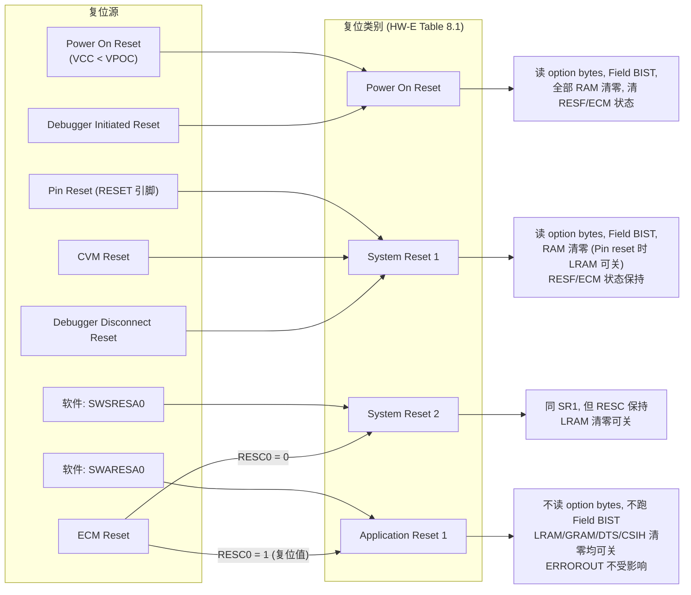
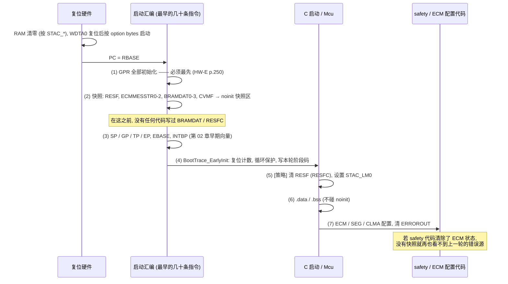
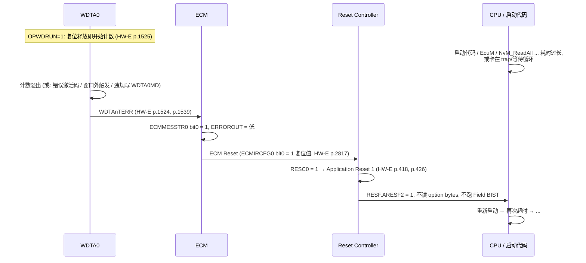
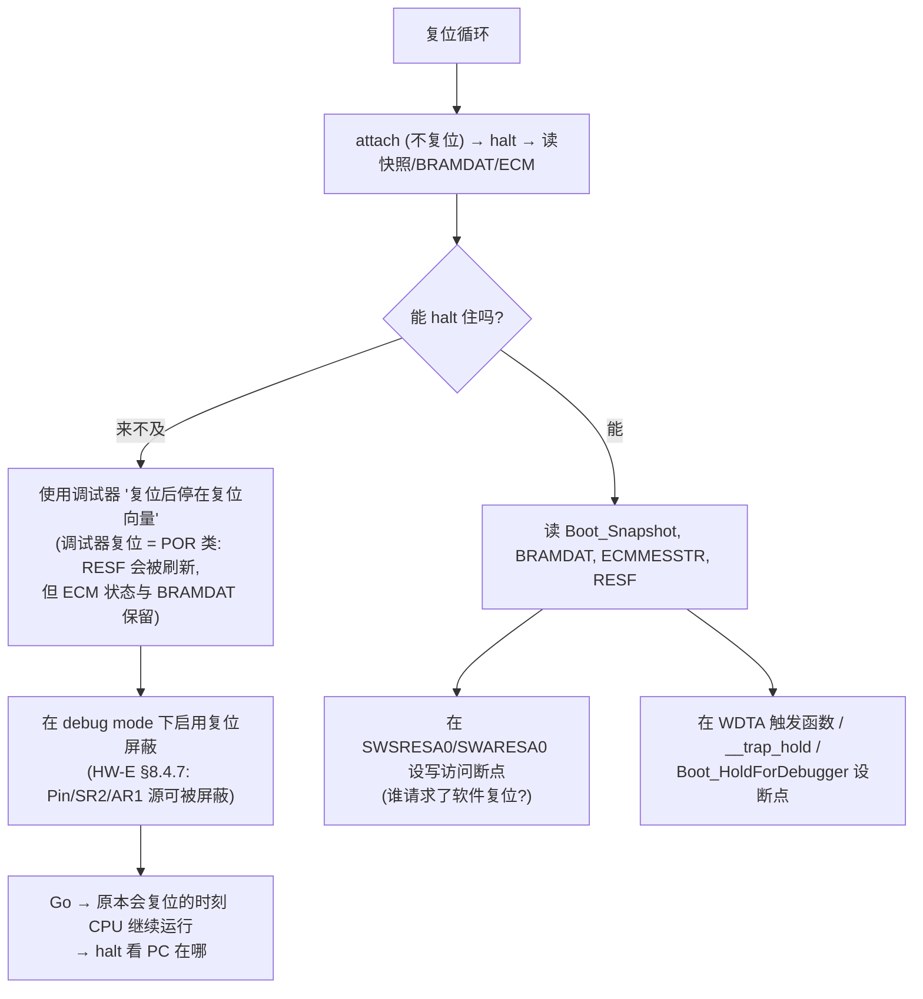

# 复位原因与复位循环：谁复位了 ECU，证据如何活下来

> Prerequisite: [01-boot-failure-overview.md](01-boot-failure-overview.md), [02-exception-and-trap-handlers.md](02-exception-and-trap-handlers.md), [../01-rh850/04-startup-process.md](../01-rh850/04-startup-process.md)
> Next: [04-debugger-attach-and-recovery.md](04-debugger-attach-and-recovery.md)（调试器连接模式与“救砖”）；系列地图见 [01-boot-failure-overview.md](01-boot-failure-overview.md) §18
> 对应规范: HW-E（R01UH0585EJ0120 Rev.1.20）§8 Reset Controller p.418–435（Table 8.1/8.2/8.4/8.5、RESF p.421–422、RESFC p.423、SWSRESA0/SWARESA0 p.424–425、RESC p.426、STAC_* p.427–430、§8.4 p.431–435）、§10 CVM p.442–448、§21 WDTA p.1522–1539、§32 ECM p.2790–2823（错误源 Table 32.9、状态保持 p.2795、ECMIRCFG0 p.2817）、§34 OCD p.2853、§35.10 option bytes p.2884–2886、§36.3 BRAMDAT p.2891；SWS-MCU **R24-11** p.29–31（`Mcu_GetResetReason` / `Mcu_GetResetRawValue` / `Mcu_PerformReset`）。**本仓库没有 RH850G3M Software Manual、TRACE32 / GHS 手册、Wdg/WdgM SWS**
> 对应源码: openAUTOSAR `system/EcuM/src/EcuM.c:137-151`（读取复位原因）；本章 `[Educational Implementation]` 代码只存在于本文中
> 事实底稿: [../reference/research/04-rh850-hardware-notes.md](../reference/research/04-rh850-hardware-notes.md) §3.1、§3.3–3.4

---

## 1. 本章目标

1. 列出 P1M-E 的全部复位源与复位类别（Power On、System Reset 1/2、Application Reset 1；Pin、CVM、软件、ECM、调试器），并知道**每一类复位清除了什么、保留了什么**。
2. 熟练读 **RESF / RESFC**（地址、位、清除条件），并用 **ECM 错误状态寄存器**区分“看门狗复位”和“其他 ECM 复位”。
3. 理解 ECM 的默认反应：**只有 WDTA 错误默认产生复位**，而且默认是 Application Reset 1。
4. 理解 RAM 硬件清零（STAC_*）如何抹掉证据，以及如何用 **BRAMDAT + noinit + STAC** 保住证据。
5. 实现一个“复位后最早几十条指令”就运行的 **boot breadcrumb**：在任何东西覆盖证据之前，先把上一轮的 RESF / ECM / BRAMDAT 拍一张快照。
6. 掌握**打破复位循环**的手段：复位循环保护、调试器复位屏蔽与 halt-on-reset、写访问断点、bring-up 期间调整 WDTA option byte 或 ECM 复位使能——以及每一种的风险。

---

## 2. 为什么复位循环比 trap 更难调？

trap 至少会停在某个地方（第 02 章的 `__trap_hold`）。复位循环则不同：

- **现场被反复清空**：PE 寄存器、WDTA0、时钟控制器、大部分外设在所有复位类别中都会被初始化（HW-E p.418–419 Table 8.2）；Local RAM 默认也被清零（p.434）。
- **调试器难以介入**：若循环周期是几毫秒，调试器还没完成连接，目标就又复位了。
- **调试器本身会改证据**：调试器发起的复位属于 Power On Reset 类别，会清除 RESF（HW-E p.418、p.421）。
- **“复位原因”是累积的**：RESF 中的标志不会因为新的复位自动清除其他位（例如 SRESF0 只能由软件清除，p.422），你读到的可能是好几次复位叠加的结果。

所以本章的思路是：**先弄清楚每一种复位会抹掉什么，再把证据放在它抹不掉的地方，最后用硬件和调试器提供的机制把循环“刹住”。**

---

## 3. 在系统中的位置：复位源 → 复位类别 → 初始化范围



依据：HW-E Table 8.1（p.418）、§8.4.1（p.431）、§8.4.4–8.4.6（p.434）、Table 32.11（p.2794）。

---

## 4. AUTOSAR 如何定义？

[AUTOSAR Standard] SWS-MCU R24-11（详见 [04-startup-process.md](../01-rh850/04-startup-process.md) §6.3）：

| API | 规范要点 | 与本章的关系 |
|---|---|---|
| `Mcu_GetResetReason()` | 读硬件复位原因并映射为 `Mcu_ResetType`；Init 前返回 `MCU_RESET_UNDEFINED`（`SWS_Mcu_00005/00133`，p.29–30） | 枚举映射由 MCAL 供应商定义；若启动代码先清了 RESF，MCAL 读到的就不是原值 |
| `Mcu_GetResetRawValue()` | 返回复位状态寄存器原值（`SWS_Mcu_00006/00135`，p.30） | 对应 RESF；是否返回启动早期保存的副本，需看 MCAL 实现 |
| `Mcu_PerformReset()` | 执行硬件复位，类型由配置决定（`SWS_Mcu_00143/00144`，p.31） | 写 SWSRESA0（SR2）或 SWARESA0（AR1），是**软件复位循环**的常见源头 |

看门狗栈（Wdg / WdgM / WdgIf）、EcuM 的复位/关机路径、Dem 的复位原因记录：**本仓库没有这些 SWS**，只能按公认 R4.x 形态描述。真实项目中“谁会调用 `Mcu_PerformReset`”需要在代码中全局搜索确认（EcuM 关机目标、WdgM 全局失效处理、OS ShutdownHook、Dcm 的 ECUReset 服务等都是常见调用者）。

---

## 5. 核心数据结构：复位相关寄存器

### 5.1 寄存器总表

[RH850 Hardware] HW-E Table 8.4（p.420）及相关章节：

| 寄存器 | 地址 | 宽度 | 复位值 | 作用 | 出处 |
|---|---|---|---|---|---|
| **RESF** | `FFF8_1000H` | 32 R | `0000_0XXXH` | 复位原因标志 | p.420–422 |
| **RESFC** | `FFF8_1008H` | 32 W | `0000_0000H` | 写 1 清除对应 RESF 位 | p.423 |
| SWSRESA0 | `FFF8_1100H` | 32 W | `0` | bit0 写 1 → System Reset 2 | p.424 |
| SWARESA0 | `FFF8_1200H` | 32 W | `0` | bit0 写 1 → Application Reset 1 | p.425 |
| **RESC** | `FFF8_2800H` | 32 R/W | `0000_0001H` | RESC0：ECM 复位产生 SR2（0）或 AR1（1） | p.426 |
| STAC_DTSRAM | `FFF8_1320H` | 32 | `0000_0003H` | DTS RAM 在 AR1 时是否清零 | p.427 |
| STAC_GRAM | `FFF8_1420H` | 32 | `0000_0003H` | Global RAM 在 AR1 时是否清零 | p.428 |
| **STAC_LM0** | `FFF8_1520H` | 32 | `0000_0003H` | Local RAM 在 SR1（CVM 除外）/SR2/AR1 时是否清零 | p.429 |
| STAC_LM10 | `FFF8_1E20H` | 32 | `0000_0003H` | CSIH RAM 在 AR1 时是否清零 | p.430 |
| ECMMESSTR0/1/2 | `FFD6_0008H`/`0CH`/`10H` | 32 R | `0` | ECM 错误源 0–31 / 32–63 / 64–92 状态 | p.2799、p.2806–2808 |
| ECMIRCFG0/1/2 | `FFD6_201CH`/`20H`/`24H` | 32 R/W | `0000_0001H` / `0` / `0` | 哪些错误源产生 ECM 复位（受保护序列） | p.2800、p.2817 |
| CVMF | `FFF8_2C00H` | 8 | `00H` | CVM 高/低压检测标志（仅 POR 清） | p.445–447 |
| CVMDE | `FFF8_2C04H` | 8 R | `03H` | CVM 复位使能状态（由 CVMDEW 写入，POR 后仅可写一次） | p.445、p.448 |
| BRAMDAT0–3 | `FFC0_A000H + 4n` | 32 R/W | Undefined | **任何复位都不初始化** | p.2891 |
| OPBT0（只读映射） | `FFCD_0030H` | 32 R | — | WDTA 启动选项等 | p.2884 |

复位相关寄存器“can be protected from inadvertent write access … by configuration of the P-Bus Guards”（HW-E p.420）；复位后 P-Bus guard 默认允许 PE1 读写（HW-E p.2694 §31.4.1.5）。如果项目在启动早期就收紧了 PBG，后面写 RESFC / STAC_* / SWSRESA0 可能被拦截（并在 SEGFLAG.VPGF 留下痕迹，HW-E p.245）。

### 5.2 RESF 位与清除条件

[RH850 Hardware] HW-E Table 8.6（p.421–422），RESFC 对应位写 1 清除（p.423）：

| 位 | 名称 | 含义 | 特别的置位/清除规则 |
|---|---|---|---|
| 0 | PRESF0 | Power On Reset | Debugger Initiated Reset **也会置位**；只能由 CVM reset 或软件清除 |
| 1 | SRESF0 | Pin Reset | POR 与 Debugger Initiated Reset **也会置位**；只能由软件清除 |
| 2 | SRESF1 | CVM Reset | 只能由 POR、Debugger Initiated Reset 或软件清除 |
| 3 | SRESF2 | 软件 System Reset（SWSRESA0） | — |
| 5 | SRESF4 | ECM System Reset（RESC0=0 时） | — |
| 7 | ARESF0 | 软件 Application Reset（SWARESA0） | — |
| 9 | ARESF2 | ECM Application Reset（RESC0=1，**默认**） | — |
| 10 | ARESF3 | Field BIST 已执行 | 只能由软件清除 |

RESF 整体：“All bits are cleared by Power On Reset, Debugger Initiated Reset, CVM Reset, or software, except it is described differently in Table 8.6.”（p.421）——并且 POR/调试器复位会立即重新置 PRESF0+SRESF0。

一次性清除全部已定义位的 RESFC 值：bit 0,1,2,3,5,7,9,10 → `0x0000_06AF`。[推导] 由 Table 8.7（p.423）各位相加得到。

> 注意 Table 8.1 中的 **Debugger Disconnect Reset**（System Reset 1）在 RESF 位表里**没有单独的标志**；它会置哪个位（或不置位），HW-E 中未找到明确说明，**需上板或按 OCD 资料确认**。

### 5.3 每类复位抹掉什么、保留什么

[RH850 Hardware] 综合 Table 8.2（p.418–419）、Table 8.5（p.420）、Table 32.11（p.2794）、§32.3.4（p.2795）：

| 证据 / 状态 | POR（含调试器复位） | SR1：Pin | SR1：CVM | SR2（SW / ECM） | AR1（SW / ECM，默认） |
|---|---|---|---|---|---|
| RESF | 清，并置 PRESF0+SRESF0 | 保持（置 SRESF0） | 清，并置 SRESF1 | 保持（置 SRESF2/SRESF4） | 保持（置 ARESF0/ARESF2） |
| ECMmESSTR0/1/2 | 清（**调试器复位除外**） | 保持 | 保持 | 保持 | 保持 |
| BRAMDAT0–3 | 保持（上电后未定义） | 保持 | 保持 | 保持 | 保持 |
| Local RAM | 清零 | STAC_LM0 决定 | 清零 | STAC_LM0 决定 | STAC_LM0 决定 |
| Global RAM | 清零 | 清零 | 清零 | 清零 | STAC_GRAM 决定 |
| STAC_LM0 本身 | 复位为“清零” | **保持** | 复位 | **保持** | **保持** |
| STAC_GRAM 本身 | 复位 | 复位 | 复位 | 复位 | **保持** |
| WDTA0 | 复位 | 复位 | 复位 | 复位 | 复位 |
| option bytes 重新读取 | 是 | 是 | 是 | 是 | **否** |
| Field BIST | 是（若使能） | 是（可由 BSEQ0CTL 关） | 是 | 是（可关） | **否** |
| ERROROUT | 复位期间 Hi-Z，之后低 | 同左 | 同左 | 复位期间低，之后低 | **不受影响** |
| CVMF | 清 | 保持 | 保持 | 保持 | 保持 |

（Table 8.5 中 STAC_LM0 仅被 POR 和“System Reset 1 中的 CVM reset”初始化，p.420 Note 2；STAC_GRAM 被 POR/SR1/SR2 初始化。）

由这张表可以直接读出两个结论：

1. **BRAMDAT 与 ECM 状态是最“耐复位”的证据**；前者你可以写任意内容，后者硬件自动记录。
2. **想让 Local RAM 中的 noinit 记录活过复位，必须在复位发生前把 STAC_LM0 写成“不清零”**；而且这只对 Pin reset、SR2、AR1 有效，对 POR 和 CVM reset 无效。

---

## 6. 初始化流程：复位释放后，证据在什么时刻被覆盖



每个“覆盖点”：

| 步骤 | 覆盖了什么 | 对策 |
|---|---|---|
| 硬件 RAM 清零 | 上一轮的 noinit 记录 | STAC_LM0（上一轮就要写好）；BRAMDAT 摘要 |
| 第一次写 BRAMDAT | 上一轮的阶段码与 trap 摘要 | 写之前先快照 |
| 写 RESFC | 上一轮的复位原因 | 写之前先快照；把快照提供给 MCAL |
| safety 代码清 ECM 状态 | 上一轮的 ECM 错误源 | 写之前先快照 |
| 调试器 reset | RESF（以及若是 POR 级则全部 RAM） | 用 attach；ECM 状态与 BRAMDAT 不受影响 |

---

## 7. Runtime Flow：四种典型复位循环

### 7.1 WDTA → ECM → Application Reset 1（最常见）



- WDTA 错误不只是“溢出”：写错激活码、在窗口外写触发寄存器、在第一次触发后修改 WDTA0MD、在第一次触发前修改 WDTA0MD 两次，都会产生错误（HW-E p.1539 §21.5.3）。WDTA0MD 只能在第一次触发前写一次（p.1531、p.1535）。
- 溢出时间 = `2^(9+OVF) / WDTATCKI`，WDTATCKI 为 8 MHz 或 250 kHz（HW-E p.1525、p.1531）。[推导] 所以循环周期大致落在 64 µs–8.192 ms（8 MHz）或 2.048 ms–262.144 ms（250 kHz）加上复位序列时间。**用示波器量出的循环周期和这些值对得上，是 WDTA 复位的强烈信号。**
- 因为 AR1 对 ERROROUT“没有影响”，这种循环中 ERROROUT 一直为低（第 01 章 §6.3）。

### 7.2 软件复位循环

某个模块在启动路径上判断“出错了”并调用 `Mcu_PerformReset()`（写 SWSRESA0 或 SWARESA0）。RESF 显示 SRESF2 或 ARESF0。常见触发：配置校验失败、NvM 读失败后的“安全处理”、OS 启动失败的 ShutdownHook、WdgM 全局失效。**这些逻辑在哪里、条件是什么，需要在真实项目代码中搜索确认。**

### 7.3 外部复位循环（Pin reset）

RESF 只有 SRESF0（且没有 PRESF0）→ RESET 引脚被外部拉低：外部电压监控器、SBC（系统基础芯片）的看门狗、调试器以外的复位按钮。P1M-E 侧软件无从“修复”，需要查**板级原理图与 SBC 数据手册**（例如 SBC 看门狗是否需要在 N ms 内被 SPI 服务）。这一类在 bring-up 中非常常见，且最容易被误判成“芯片内部看门狗”。

### 7.4 CVM 复位

RESF 显示 SRESF1 → 核心电压越限。CVM 复位默认**不使能**：CVMDE 复位值 `03H`，其中 CVMCIRREN1/0 均为 0（HW-E p.445、p.448），只有软件通过 CVMDEW（POR 后仅可写一次）使能后才会产生 CVM 复位。CVMF 的 CVMHVF/CVMLVF 告诉你是过压还是欠压，且只被 POR 清除（p.446–447）。这类问题优先查电源。

---

## 8. RH850 Hardware Mapping：ECM 错误源与默认反应

### 8.1 可能导致复位的 ECM 错误源

[RH850 Hardware] HW-E Table 32.9（p.2790–2793）中与启动最相关的错误源（状态位：源 n < 32 在 ESSTR0 bit n；32–63 在 ESSTR1 bit n−32；64–92 在 ESSTR2 bit n−64，p.2806–2808）：

| 源 | 名称 | 模块 | 启动阶段的典型诱因 | 状态位 |
|---|---|---|---|---|
| 0 | Window watchdog timer error | WDTA | 第一次触发太晚、激活码/窗口错误 | ESSTR0.0 |
| 1 | DCLS compare error | CPU lock-step | 未初始化的 GPR 被写到 PE 外部（HW-E p.250） | ESSTR0.1 |
| 8–15 | Clock monitor upper/lower-limit error（MainOSC、WDTA 计数时钟、外设时钟、checker core 时钟） | CLMA | 晶振问题；CLMA 阈值配置错误 | ESSTR0.8–15 |
| 16 | Local RAM ECC uncorrectable | Local RAM | 读未初始化/关闭清零后的 RAM | ESSTR0.16 |
| 17 | Global RAM ECC uncorrectable | GRAM | 同上 | ESSTR0.17 |
| 19 | Code Flash ECC / address parity | Code Flash | 执行/读取未编程 Flash（HW-E p.2875） | ESSTR0.19 |
| 64 | PE guard error | CPU | — | ESSTR2.0 |
| 65 | Global RAM guard error | GRAM | — | ESSTR2.1 |
| 67 | Slave guard error（PBG + HBG） | P-Bus / H-Bus | 写了被 guard 保护的外设 | ESSTR2.3 |
| 91 | Field BIST executed / test mode | Operating Mode | **Field BIST 正常结束也会报**（p.2794 Note 2） | ESSTR2.27 |
| 92 | ECM compare error | ECM | 软件操作 ECMmESET/ECLR 时也会置位（p.2804–2805） | ESSTR2.28 |

**默认反应**：只有源 0 产生 ECM 复位（ECMIRCFG0 = `0000_0001H`，HW-E p.2817）；没有任何源默认产生 FENMI 或 INTECM（ECMNMICFG*/ECMMICFG* 全 0，p.2800）；所有源默认驱动 ERROROUT（ECMEMK* 全 0，p.2820）。HW-E p.432 也明确：“No device failure (e.g. illegal access) will result in a reset … Optionally the device failures can be configured to be used as a Reset Source.”

因此：

- 在**未配置 ECM 的 bring-up 板**上，看到 ARESF2 → 几乎可以断定是 WDTA（再用 ESSTR0.0 确认）。
- 在**真实项目**中，safety 模块可能把 lock-step、ECC、CLMA 等也配置成复位源；那么 ARESF2（或 RESC0=0 时的 SRESF4）就需要结合 ESSTR 和 ECMIRCFG 的实际值解读。**项目的 ECM 配置需在真实项目中确认。**

### 8.2 解码表：RESF + ECM → 结论

| RESF 快照（启动最早期读到的原值） | ECM 快照 | 结论 | 下一步 |
|---|---|---|---|
| PRESF0=1, SRESF0=1 | 无新位（或只有源 91） | 上电，或调试器复位 | 正常；若你没有手动复位却反复出现 → 电源掉电（查 VCC） |
| 只有 SRESF0 | — | Pin reset：外部拉 RESET | 查 SBC/电压监控/按钮；示波器看 RESET |
| SRESF1 | — | CVM 复位 | CVMF：HVF/LVF；查核心电源 |
| SRESF2 | — | 软件 SR2（SWSRESA0） | 谁写了 `FFF8_1100H`？（§12.2 写断点） |
| ARESF0 | — | 软件 AR1（SWARESA0） | 谁写了 `FFF8_1200H`？ |
| ARESF2（或 SRESF4） | ESSTR0.0 = 1 | WDTA 错误 → ECM 复位 | WDTA 触发路径与第一次触发时序（Part I 第 04 章 §6.4） |
| ARESF2（或 SRESF4） | 其他源 = 1，且该源在 ECMIRCFG 中使能 | 项目配置的 ECM 复位 | 按源号查 Table 32.9 |
| ARESF3 同时置位 | — | 本次复位执行了 Field BIST | 正常现象（POR/SR1/SR2 且 BIST 使能时） |
| 多个“原因”位同时置位 | — | 标志累积：上一轮没有清 RESF | 采用“快照后清除”策略（§11.3），之后每轮只看到本轮的位 |

---

## 9. openAUTOSAR 实现

openAUTOSAR 的 `EcuM_Init` 在 `system/EcuM/src/EcuM.c:137-151` 调用 `Mcu_GetResetReason()`，根据返回值决定 wakeup/复位处理（R3.1.5 风格，见 [04-startup-process.md](../01-rh850/04-startup-process.md) §10）。它的 Mcu 是 STM32 风格的板级实现，与 RH850 RESF 无关；也没有任何“复位循环保护”或 BRAMDAT/noinit 机制。可以借它理解“复位原因在 AUTOSAR 启动流程中被谁消费”，但实现细节没有参考价值。

---

## 10. 当前教学项目实现

[Educational Implementation] 本章新增的教学组件（只存在于本文，未上板、未经 GHS 汇编验证）：

| 组件 | 位置 | 作用 |
|---|---|---|
| `Boot_Snapshot`（noinit） | Local RAM noinit 段 | 本轮启动最早期拍下的“上一轮证据”：RESF、ECM ESSTR0–2、BRAMDAT0–3、CVMF |
| 启动汇编快照段 | 复位入口，GPR 初始化之后 | 只用寄存器和 MMIO 读写完成快照，不依赖栈 |
| `BootTrace_EarlyInit()` / `BootTrace_SetStage()` | C | 维护 BRAMDAT0–3：魔术字、复位计数、阶段码、校验；复位循环保护 |
| `ResetReason_Decode()` | C（主机可测试） | 按 §8.2 解码 |

BRAMDAT 布局（与第 02 章的 trap 摘要共用）：

| 寄存器 | 内容 | 写入者 |
|---|---|---|
| BRAMDAT0 | `0xB0 << 24` \| 复位计数（8 bit）`<< 16` \| 阶段码（16 bit） | BootTrace |
| BRAMDAT1 | 最近一次 trap 的 PC（无 trap 时为 0） | Trap handler（第 02 章） |
| BRAMDAT2 | 槽号 `<< 16` \| 原因码低 16 位 | Trap handler |
| BRAMDAT3 | `BRAMDAT0 ^ BRAMDAT1 ^ BRAMDAT2 ^ 0xA5A5A5A5` | 两者都在写完后更新 |

> [Real Project Consideration] BRAMDAT 的设计用途是“在 BIST 自检期间保留数据”（HW-E p.2891）。真实项目中 safety/BIST 软件可能已经占用了它。**使用前必须确认没有其他模块使用 BRAMDAT。**

---

## 11. Code Walkthrough

### 11.1 复位后最早的几十条指令：先拍快照

```asm
;=====================================================================
; [Educational Implementation] 复位入口早期快照 —— GHS 风格教学代码
;   未经 GHS 汇编验证; 指令助记符/伪指令/符号前缀需按 GHS 手册确认
;=====================================================================
__start:
        ; ---- (1) GPR 初始化: 必须是复位后最先做的事 (HW-E p.190, p.250) ----
        mov     r0, r1
        mov     r0, r2
        ; ... r3 .. r31 同样 (此处省略 29 行)

        ; ---- (2) 快照: 只读 MMIO, 只写 noinit 快照区 (Local RAM 已由硬件
        ;          清零+写 ECC, 或因 STAC_LM0 保留了上一轮内容; 写入都是安全的) ----
        mov     ___Boot_Snapshot, r20
        mov     0xFFF81000, r10           ; RESF            HW-E p.421
        ld.w    0[r10], r11
        st.w    r11, 0x00[r20]
        mov     0xFFD60008, r10           ; ECMMESSTR0..2   HW-E p.2799
        ld.w    0[r10], r11
        st.w    r11, 0x04[r20]
        ld.w    4[r10], r11
        st.w    r11, 0x08[r20]
        ld.w    8[r10], r11
        st.w    r11, 0x0C[r20]
        mov     0xFFC0A000, r10           ; BRAMDAT0..3     HW-E p.2891
        ld.w    0[r10], r11
        st.w    r11, 0x10[r20]
        ld.w    4[r10], r11
        st.w    r11, 0x14[r20]
        ld.w    8[r10], r11
        st.w    r11, 0x18[r20]
        ld.w    12[r10], r11
        st.w    r11, 0x1C[r20]
        mov     0xFFF82C00, r10           ; CVMF (8 bit)    HW-E p.445
        ld.bu   0[r10], r11
        st.w    r11, 0x20[r20]
        mov     0x534E4150, r11           ; 'SNAP' 最后写: 快照完整的标志
        st.w    r11, 0x24[r20]

        ; ---- (3) 可选: 测试 GPIO 置高, 示波器上标记 "已走到这里" ----
        ;      Port 寄存器写法需按原理图与 HW-E §2 确认; 若板上 RESETOUT(P0_10)
        ;      可用, 也可以在这里把 P0_10 置 1 (HW-E p.435), 前提是 OPEVTO/DCUTRST 条件满足 (p.177)

        ; ---- (4) SP/GP/TP/EP, EBASE(先)/EBV(后), INTBP (第 02 章 §11.6) ----
        ; ...
        jarl    _BootTrace_EarlyInit, lp  ; C, 只需要 SP
        ; ... 之后才是 .data 复制 / .bss 清零 / main
```

为什么这些操作必须排在这里：

| 约束 | 理由 | 依据 |
|---|---|---|
| GPR 初始化在任何 store 之前 | 未定义 GPR 写到 PE 外部可能引起 lock-step 比较错误 | HW-E p.250 |
| 快照在任何写 BRAMDAT / RESFC / ECM 之前 | 这些写会覆盖上一轮证据 | §6 |
| 快照写 noinit 区，而不是 `.bss` | `.bss` 稍后会被清零 | [03-memory-map.md](../01-rh850/03-memory-map.md) §7.3 |
| 魔术字最后写 | 快照中途再复位时，不会把半张快照当真 | — |
| 不用栈 | 此时 SP 可能还没设置 | — |

### 11.2 BootTrace：复位计数与复位循环保护

```c
/* [Educational Implementation] Boot breadcrumb —— 非 production code
 * 运行时机: 启动汇编设置 SP 之后, .data/.bss 之前 → 不能依赖任何全局变量的初值 */
#define REG32(a)              (*(volatile uint32 *)(a))
#define BRAMDAT(n)            REG32(0xFFC0A000u + 4u * (n))     /* HW-E p.2891 */
#define RESF_PRESF0           (1u << 0)                          /* HW-E p.422 */
#define BOOT_MAGIC            0xB0u
#define BOOT_LOOP_LIMIT       5u          /* 连续 5 次非上电复位后停下 —— bring-up 策略值 */

typedef struct {                          /* 与 §11.1 汇编偏移一致 */
    uint32 resf;                          /* +00 */
    uint32 ecm_esstr[3];                  /* +04 */
    uint32 bramdat[4];                    /* +10 上一轮留下的 BRAMDAT */
    uint32 cvmf;                          /* +20 */
    uint32 magic;                         /* +24 'SNAP' */
} BootSnapshot_t;

extern BootSnapshot_t Boot_Snapshot;      /* noinit */
extern uint32 Trap_SeqThisPowerOn;        /* noinit, 第 02 章 */

static uint32 Bram_Check(uint32 b0, uint32 b1, uint32 b2) { return b0 ^ b1 ^ b2 ^ 0xA5A5A5A5u; }

static boolean Bram_PrevValid(const BootSnapshot_t *s)
{
    return ((s->bramdat[0] >> 24) == BOOT_MAGIC) &&
           (s->bramdat[3] == Bram_Check(s->bramdat[0], s->bramdat[1], s->bramdat[2]));
}

void BootTrace_EarlyInit(void)
{
    const BootSnapshot_t *s = &Boot_Snapshot;
    const boolean por   = ((s->resf & RESF_PRESF0) != 0u);  /* POR 或调试器复位 */
    uint32 count = 0u;

    if ((!por) && Bram_PrevValid(s)) {
        count = (s->bramdat[0] >> 16) & 0xFFu;
    }
    if (por) {
        Trap_SeqThisPowerOn = 0u;         /* 只在上电时清, 见第 02 章 §11.4 */
    }

#if defined(BRINGUP_RESET_LOOP_GUARD)
    if (count >= BOOT_LOOP_LIMIT) {
        /* 连续多次非上电复位: 停下来, 并且 **不再改写 BRAMDAT** ——
         * 这样上一轮 (最后一次失败) 的阶段码与 trap 摘要被冻结, 等调试器来读。
         * 下一次上电 (PRESF0) 会自动解除。 */
        Boot_HoldForDebugger();           /* 原地循环; 若 WDTA 上电自动运行, 见 §12.3 */
    }
#endif

    if (count < 0xFFu) { ++count; }
    BRAMDAT(0) = (BOOT_MAGIC << 24) | (count << 16) | BOOT_STAGE_RESET_ENTRY;
    BRAMDAT(1) = 0u;
    BRAMDAT(2) = 0u;
    BRAMDAT(3) = Bram_Check(BRAMDAT(0), 0u, 0u);
}

void BootTrace_SetStage(uint16 stage)     /* 在启动路径各关键点调用 */
{
    const uint32 b0 = (BRAMDAT(0) & 0xFFFF0000u) | stage;
    BRAMDAT(0) = b0;
    BRAMDAT(3) = Bram_Check(b0, BRAMDAT(1), BRAMDAT(2));
    /* 两次写之间若发生复位, 下一轮校验失败 → 视为无效 → 计数归零。
     * 这是有意的保守选择: 宁可漏判一次循环, 也不把损坏的数据当真。 */
}
```

阶段码示例（按 [04-startup-process.md](../01-rh850/04-startup-process.md) §3 的路径分配，数值是本教程约定）：

| 阶段码 | 位置 | 阶段码 | 位置 |
|---|---|---|---|
| `0x0010` | 复位入口 / 快照完成 | `0x0110` | `Mcu_Init` 返回 |
| `0x0020` | EBASE/INTBP 已设置 | `0x0120` | `Port_Init` 返回 |
| `0x0030` | `.data` 复制完成 | `0x0130` | `Wdg_Init` 返回（第一次触发之后） |
| `0x0040` | `.bss` 清零完成 | `0x0200` | 调用 `StartOS` 之前 |
| `0x0100` | 进入 `EcuM_Init` | `0x0300` | 第一个任务 / `EcuM_StartupTwo` |

复位后读 `Boot_Snapshot.bramdat[0]` 的低 16 位，就知道**上一轮最后走到哪一步**；再看 `bramdat[1..2]` 是否有 trap 摘要。

### 11.3 RESF 与 STAC 的“策略”部分

```c
/* [Educational Implementation] 证据保留策略 —— bring-up 构建 */
#define RESFC_ADDR      0xFFF81008u   /* HW-E p.423 */
#define RESFC_ALL       0x000006AFu   /* bit 0,1,2,3,5,7,9,10 —— 由 Table 8.7 推导 */
#define STAC_LM0_ADDR   0xFFF81520u   /* HW-E p.420, p.429 */
#define STAC_DISABLED   0x00000000u   /* RZEROMD = 00b ("x0: Disabled"); bit31-2 写复位值 0 */

void BootTrace_ApplyEvidencePolicy(void)
{
    /* (a) 清 RESF: 之后每一轮只看到本轮的复位原因 (RESF 是累积的, p.421-422)。
     *     代价: 若 MCAL 的 Mcu_GetResetReason 直接读 RESF, 它会读到空值。
     *     → 需在真实项目确认 MCAL 读的是 RESF 还是启动代码提供的副本。 */
    REG32(RESFC_ADDR) = RESFC_ALL;

    /* (b) 下一次 Pin reset / SR2 / AR1 时不清零 Local RAM (p.429, p.434)。
     *     STAC_LM0 只被 POR 和 CVM reset 复位 (p.420 Note 2), 所以设置一次后持续有效。
     *     代价: .bss 必须由软件清零 (启动代码不能依赖硬件清零);
     *           若 Local RAM 中存在 ECC 不可纠正的位置, 它会跨复位保留, 读到时再次出错。 */
    REG32(STAC_LM0_ADDR) = STAC_DISABLED;
}
```

[Real Project Consideration] 这两项都是**策略**，不是“正确答案”：

- 很多 MCAL 期望自己读并清 RESF；启动代码提前清除会破坏 `Mcu_GetResetReason()` 的语义（SWS-MCU R24-11 p.29–30）。
- 量产是否关闭 Local RAM 清零，涉及 safety 论证（RAM 内容可信度、ECC 潜伏故障）。
- 截图中出现过 `.bss.PORST.*`、`.bss.TRAPRST.*` 这类段名（[03-memory-map.md](../01-rh850/03-memory-map.md) §7.4），说明真实项目可能已经有一套“按复位类型保留”的机制——**先读懂它，再决定是否叠加本章的做法**。

### 11.4 解码函数（主机可测试）

```c
/* [Educational Implementation] 按 §8.2 解码; 输入是快照中的 RESF 原值和 ECMMESSTR0 */
typedef enum {
    RR_POWER_ON_OR_DEBUGGER, RR_PIN, RR_CVM, RR_SW_SYSTEM, RR_SW_APPLICATION,
    RR_ECM_WDTA, RR_ECM_OTHER, RR_UNKNOWN
} ResetReason_t;

ResetReason_t ResetReason_Decode(uint32 resf, uint32 ecm_esstr0)
{
    if ((resf & (1u << 0)) != 0u) { return RR_POWER_ON_OR_DEBUGGER; } /* PRESF0 优先: POR 同时置 SRESF0 */
    if ((resf & (1u << 2)) != 0u) { return RR_CVM; }                   /* SRESF1 */
    if ((resf & ((1u << 9) | (1u << 5))) != 0u) {                      /* ARESF2 / SRESF4 */
        return ((ecm_esstr0 & 1u) != 0u) ? RR_ECM_WDTA : RR_ECM_OTHER;
    }
    if ((resf & (1u << 3)) != 0u) { return RR_SW_SYSTEM; }             /* SRESF2 */
    if ((resf & (1u << 7)) != 0u) { return RR_SW_APPLICATION; }        /* ARESF0 */
    if ((resf & (1u << 1)) != 0u) { return RR_PIN; }                   /* SRESF0 (无 PRESF0) */
    return RR_UNKNOWN;
}
```

注意：ECM 状态跨非 POR 复位保持，`ecm_esstr0` 的 bit0 可能是**更早**某一轮留下的。若需要区分“本轮”，要么在 safety 代码中记录后清除 ECM 状态（受保护寄存器 ECMESSTC0，HW-E p.2800、p.2823），要么比较前后两轮的快照。

---

## 12. Debug 方法：打破复位循环

### 12.1 先观察，后动手

| 观察 | 方法 | 能得出什么 |
|---|---|---|
| 循环周期 | 示波器看电流或 RESET / 测试 GPIO | 与 §7.1 的 WDTA 溢出时间对比 |
| ERROROUT 在循环中是否出现 Hi-Z | 示波器 | 一直低 → 倾向 AR1（ECM/SW）；有 Hi-Z → POR/SR1 类（HW-E p.2794） |
| RESET 引脚是否被外部拉低 | 示波器 | Pin reset → 板级 |
| 测试 GPIO / RESETOUT 置高后多久被复位 | 示波器 | 启动走了多远 |

### 12.2 调试器手段



1. **复位后停在复位向量（halt on reset）**：几乎所有调试器都支持“复位并停在第一条指令”。这是调试器发起的复位，属于 POR 类别：RESF 被刷新为 PRESF0+SRESF0（HW-E p.421–422），但 **ECM 错误状态不被清除**（p.2806 “except debug initiated reset”）、**BRAMDAT 不被清除**（p.2891）。所以即使不得不复位，快照里的 ECM/BRAMDAT 仍然有效。TRACE32 中对应的连接/复位模式名称（例如 `SYStem.Up` 一类）**需按 Lauterbach RH850 手册确认**。
2. **复位屏蔽（Reset Mask）**：“In debug mode, System Resets 1 and 2 and Application Reset 1 can be masked by debugger setting.”（HW-E p.434 §8.4.7）可屏蔽的源（Table 8.15）：Pin Reset、ECM Reset（RESC0=0 或 1）、SWSRESA0、SWARESA0。屏蔽后，原本会复位的那一刻 CPU 继续运行——对于 WDTA 溢出，计数器值会保持到复位为止（HW-E p.1539 (4)）——你可以 halt 下来看 PC 正在做什么。**注意 POR 与 CVM reset 不在可屏蔽列表中。** 调试器中的选项名需按调试器手册确认。
3. **写访问断点**：P1M-E 的片上调试有 12 个断点，其中 4 个可以针对任意访问地址/数据（HW-E p.2853）。在 `0xFFF81100`（SWSRESA0）和 `0xFFF81200`（SWARESA0）上设“写”断点，就能当场抓到发起软件复位的代码，再看调用栈。
4. **WDTA 相关断点**：在 Wdg 驱动的触发函数（或 OS 中喂狗的 ISR）上设断点，确认第一次触发的时间是否早于溢出时间；注意断点本身会延迟喂狗——调试 break 期间 WDTA0 无条件停止计数（HW-E §34.4 p.2855），所以断点处停多久都不会被看门狗复位，但放行后的时序已与全速运行不同。

### 12.3 bring-up 期间临时关闭复位源（谨慎）

| 手段 | 做法 | 生效时间 | 风险 | 依据 |
|---|---|---|---|---|
| **WDTA 改为软件触发启动** | 用编程器把 OPBT0.OPWDRUN（bit31）设为 0；WDTA 在第一次被触发前不运行 | option bytes 在 POR/SR1/SR2 时读取；**AR1 不重新读取** | ① OPBT0 还包含 OPWDOVF/OPWDVAC/OPWDMDS、OPEVTO/OPEVTI、ERROUTSEL 等字段，必须**读出原值、只改目标位、再写回**；② OPBT2 的 OPJTAG 选择调试接口，误改可能导致调试器连不上；③ 写 Flash 程序前要先设好 option bytes（HW-E p.2881）；④ **量产前必须恢复并在 bring-up 记录中登记** | HW-E p.1525、p.2881–2886、p.431、p.434 |
| **ECM 不再因 WDTA 复位** | 通过保护序列（ECMPCMD1 写 `0000_00A5H` → 值 → 取反值 → 值，再查 ECMPS.ECMPRERR）把 ECMIRCFG0.bit0 清 0；WDTA 错误仍会记入 ESSTR0.0 并拉低 ERROROUT，但不复位 | 写入后立即；必须在第一次溢出之前执行 | 关闭了一个安全机制；仅限 bring-up 构建；序列中途被打断会失败（p.2795–2796） | HW-E p.2795、p.2800、p.2817 |
| **bring-up hold 中服务 WDTA** | `__trap_hold` / `Boot_HoldForDebugger` 中写 ACH 到 WDTA0WDTE | 立即 | 仅在固定激活码（OPWDVAC=0）且窗口为 100% 时成立；**绝不能进入量产** | HW-E p.1528、p.1531–1532；第 02 章 §11.5 |
| **调试器复位屏蔽** | 见 §12.2 | 调试会话期间 | 只在 debug mode 下有效；不能屏蔽 POR/CVM | HW-E p.434 |
| **外部看门狗 / SBC** | 按 SBC 的调试/编程模式禁用其看门狗 | 取决于 SBC | 板级，与 P1M-E 手册无关 | **需按 SBC 数据手册与原理图确认** |

> [Real Project Consideration] option bytes 的当前值**不能从芯片型号推出**，必须用编程器/调试器读出（或在运行时读只读映射 OPBT0 `FFCD_0030H`，p.2884）。修改 option bytes 是 Flash 操作，应按项目规定的烧录流程与工具执行，并保留修改前后的值记录。

### 12.4 一个完整的复位循环排查流程

```text
1. 示波器: 量循环周期, 看 RESET / ERROROUT / 测试 GPIO
2. attach + halt (不复位), 读: Boot_Snapshot, BRAMDAT0-3, ECMMESSTR0-2, RESF, CVMF
   - 来不及 halt: halt-on-reset + 复位屏蔽, 再 Go
3. 用 ResetReason_Decode 分类:
   - WDTA        → 上一轮阶段码说明死在哪一段; 检查第一次触发时序 / 触发方式 (激活码, 窗口)
   - SW reset    → SWSRESA0 / SWARESA0 写断点 → 调用栈 → 哪个模块为什么要复位
   - Pin reset   → 板级: SBC 看门狗 / 电压监控
   - CVM         → 电源
   - ECM 其他源  → Table 32.9 → 对应模块
4. 若阶段码显示 "进入了 trap" (BRAMDAT1/2 非 0): 回到第 02 章解读 trap 摘要
5. 修复后: 撤销所有 bring-up 临时措施 (option bytes / ECMIRCFG / hold 中喂狗), 记录在案
```

---

## 13. 常见问题

| 问题 | 回答 |
|---|---|
| 看门狗复位在 RESF 里是哪一位？ | 默认是 ARESF2（ECM Application Reset）：WDTA 错误是 ECM 源 0，默认唯一使能复位的源，RESC0 默认 1（HW-E p.2817、p.426）。用 ECMMESSTR0 bit0 确认 |
| 为什么上一次 noinit 里的 trap 记录没了？ | 默认所有复位类别都清零 Local RAM；要保留需提前把 STAC_LM0 设为不清零，且对 POR/CVM reset 无效（HW-E p.429、p.434） |
| 调试器复位后 ECM 状态还在，正常吗？ | 正常：ECM 状态只被软件和 POR 清除，且 POR 中的 Debugger Initiated Reset 除外（HW-E p.2806、p.419 Note 7） |
| AR1 循环和 SR2 循环有什么区别？ | AR1 不重新读 option bytes、不执行 Field BIST，更快；ERROROUT 不受影响；GRAM/DTS/CSIH RAM 的清零也可关闭（HW-E p.431、p.434、p.2794） |
| `Mcu_PerformReset()` 走的是哪种复位？ | 由 MCAL 配置决定：写 SWSRESA0 → SR2，写 SWARESA0 → AR1（HW-E p.418、p.424–425）；具体配置需在项目中确认 |
| 能不能用 BRAMDAT 存很多东西？ | 只有 4 × 32 bit（HW-E p.2891）。大的记录放 noinit + STAC，BRAMDAT 只放摘要和校验 |

---

## 14. 实验

**实验 1：抹除矩阵。** 不看 §5.3，根据 HW-E Table 8.2、Table 8.5、Table 32.11 自己填出“每类复位抹掉什么”的表，再与 §5.3 对照。重点核对 STAC_LM0 与 STAC_GRAM 自身的复位条件。

**实验 2：解码函数测试。** 为 `ResetReason_Decode` 写主机单元测试：`(0x00000003, 0)` → 上电；`(0x00000200, 0x1)` → ECM WDTA；`(0x00000200, 0x10000)` → ECM 其他（源 16）；`(0x00000002, 0)` → Pin；`(0x00000282, 0x1)` → 思考：这是“上一轮没清 RESF”的累积结果，函数应如何报告？

**实验 3：循环周期推算。** 已知 OPWDMDS=1、OPWDOVF=011，示波器测得复位循环周期约 33 ms。计算 WDTA 溢出时间，判断这是否与 WDTA 复位一致；列出还需要哪些证据。

**实验 4：复位循环保护推演。** 用 §11.2 的代码，在纸上模拟：上电 → 第 1–6 次 WDTA 复位。写出每一轮 `Boot_Snapshot.bramdat[0]` 的值、复位计数、以及第几轮停在 `Boot_HoldForDebugger`。再模拟“此时用调试器做一次 halt-on-reset”——计数会怎样？为什么？

---

## 15. 思考题

1. 为什么 HW-E 把 ECM 复位的默认类别设为 Application Reset 1，而不是 System Reset 2？从“快速恢复”和“重新读 option bytes / 执行 BIST”的角度讨论。
2. 启动代码清除 RESF 有利于诊断，却可能破坏 `Mcu_GetResetReason()`。你会如何设计“启动代码快照 + MCAL 消费”的接口，使两者都成立？
3. 复位循环保护在量产 ECU 上应该怎样表现？“停住等调试器”显然不行——那应该进入什么状态？谁来决定？
4. 关闭 Local RAM 硬件清零之后，哪些原本由硬件保证的性质（例如 ECC 一致性、`.bss` 为 0）变成了软件责任？如何验证软件真的承担了这些责任？

---

## 16. 对未来真实项目的意义

```text
进入真实 RH850 + RTA-CAR 项目后, 关于复位要逐项确认:
1. option bytes (OPBT0/OPBT2) 实际值; bring-up 与量产是否不同, 谁负责切换
2. RESF 在哪里被读、存、清; Mcu_GetResetReason 的映射表; 启动代码是否保存原值副本
3. ECM 配置: NMICFG / MICFG / IRCFG / EMK / RESC; 哪些错误会复位, 复位类别是什么
4. STAC_* 是否被配置; 哪些 RAM 段在哪种复位下保留 (例如截图中的 .bss.PORST.* / .bss.TRAPRST.*)
5. BRAMDAT 是否已被 BIST / safety 软件占用
6. 全局搜索 Mcu_PerformReset / SWSRESA0 / SWARESA0 的所有调用者与触发条件
7. 喂狗链路: WDTA 第一次触发在哪里、何时; Wdg 驱动初始化时机; 喂狗 ISR 的通道与优先级
8. 板级: 是否有 SBC / 外部看门狗 / 电压监控; RESET、ERROROUT、RESETOUT 是否可测
9. 调试器: halt-on-reset 与复位屏蔽在你的 TRACE32 版本中的用法; 写访问断点是否可用
10. bring-up 临时措施清单 (option bytes / ECMIRCFG / hold 中喂狗) 及其撤销记录
```

以上每一项的具体值都**需要在真实项目环境中确认**；本章给出的是 P1M-E 硬件事实、判断方法和对照表。

---

## 17. 本章总结

- 复位类别：POR（含调试器复位）、SR1（Pin/CVM/调试器断开）、SR2（SWSRESA0、ECM 且 RESC0=0）、AR1（SWARESA0、ECM 且 RESC0=1 默认）。
- RESF `FFF8_1000H` 累积记录原因，RESFC `FFF8_1008H` 写 1 清除；调试器复位会刷新 RESF。
- ECM 状态 ECMMESSTR0–2（`FFD6_0008H` 起）跨非 POR 复位和调试器复位保持；默认只有 WDTA 错误（源 0）产生 ECM 复位 → ARESF2。
- RAM 默认在所有复位中被硬件清零；STAC_LM0 可让 Pin/SR2/AR1 保留 Local RAM；BRAMDAT 不被任何复位清除。
- 启动最早期（GPR 初始化之后）先快照 RESF/ECM/BRAMDAT/CVMF，再写本轮 breadcrumb；用复位计数实现 bring-up 复位循环保护。
- 打破循环：halt-on-reset、debug mode 复位屏蔽（不含 POR/CVM）、SWSRESA0/SWARESA0 写断点、bring-up 期间调整 OPWDRUN 或 ECMIRCFG0（必须登记并在量产前恢复）、排查外部 SBC。

## 18. 下一章

[04-debugger-attach-and-recovery.md](04-debugger-attach-and-recovery.md)：本章多次用到“attach 不复位”“halt-on-reset”“复位屏蔽”——下一章专门讲调试器如何拿到控制权、连不上时怎么办。trap 现场的解读见 [02-exception-and-trap-handlers.md](02-exception-and-trap-handlers.md)。
