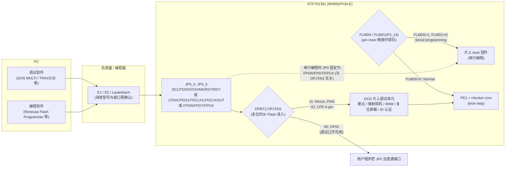
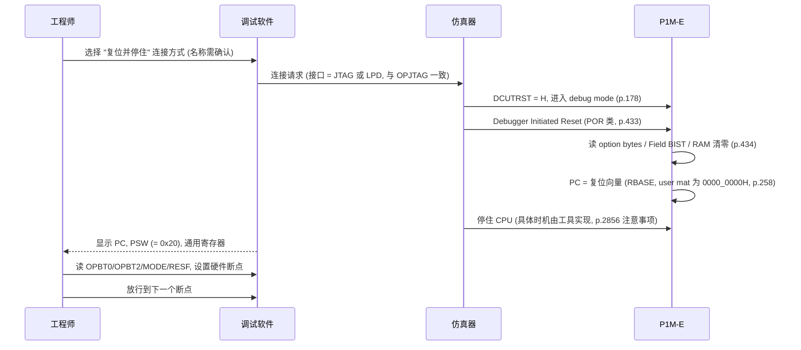
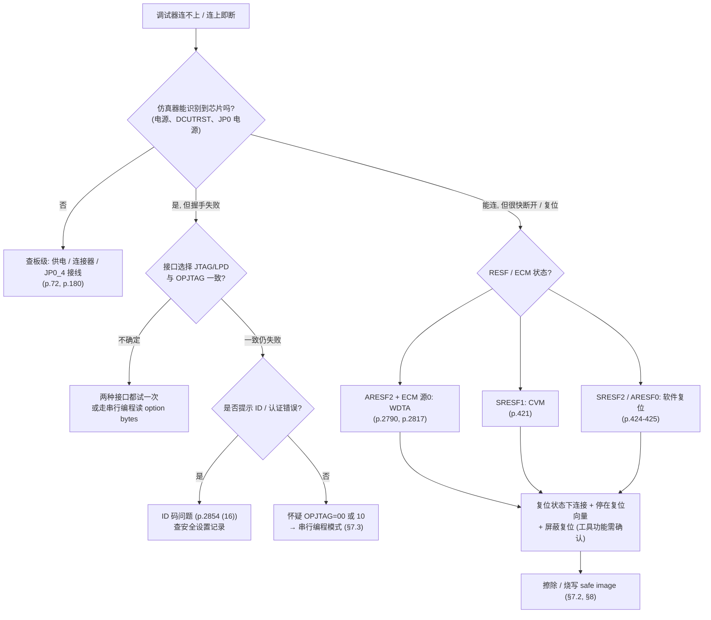

# 调试器如何拿到控制权：连接模式、连不上的原因与“救砖”路径

> Prerequisite: [../01-rh850/04-startup-process.md](../01-rh850/04-startup-process.md)（复位与启动阶段）、[../01-rh850/06-interrupt-exception.md](../01-rh850/06-interrupt-exception.md)（FE/EI 异常、EIIC/FEIC）、[../03-mcal/03-port-driver.md](../03-mcal/03-port-driver.md)（端口寄存器）、[01-boot-failure-overview.md](01-boot-failure-overview.md)、[02-exception-and-trap-handlers.md](02-exception-and-trap-handlers.md)、[03-reset-causes-and-reset-loops.md](03-reset-causes-and-reset-loops.md)
> Next: [05-startup-code-failure-points.md](05-startup-code-failure-points.md)：调试器连上之后，沿启动路径逐步排查
> 对应规范: HW-E（R01UH0585EJ0120 Rev.1.20）p.72、p.87（JP0 调试引脚）、p.91–92、p.99、p.148（JTAG 端口组 JP0）、p.177–180（引脚状态、未用引脚处理）、p.261–263（FLMD0/FLMD1 与 MODE）、p.418、p.431–434（复位类别、Debugger Initiated/Disconnect Reset、复位屏蔽）、p.1531/1535（WDTA0MD 只写一次）、p.2759（CLMA）、p.2790–2793、p.2800、p.2806、p.2817（ECM）、p.2853–2856（OCD）、p.2860–2867（Flash 模式、安全、串行编程接口）、p.2881–2886（option bytes OPBT0/OPBT2）
> 对应源码: 本仓库没有目标板启动代码、调试脚本或 Flash 算法；本章所有调试器操作均为 `[Conceptual]`
> 工具资料: 本仓库**没有** RH850G3M Software Manual、GHS MULTI 手册、Lauterbach TRACE32 RH850 手册、Renesas E1/E2 与 Renesas Flash Programmer（RFP）手册。凡是工具命令、菜单名、选项名，一律标注 **需确认**，只描述“要找的功能”，不作为可直接执行的命令

---

## 1. 本章目标

读完本章，你应该能：

1. 说清楚调试器是**通过哪几根引脚、在什么硬件条件下**拿到 RH850/P1M-E 的控制权，以及 option byte OPBT2.OPJTAG 如何决定这件事。
2. 区分几种连接方式：**复位后停在复位向量**、**连接正在运行的目标（attach）**、**热插入（hot plug-in）**、**复位后运行到片上断点**。知道为什么“复位后停在复位向量”是调试早期启动 trap 的头号工具。
3. 列出会导致“调试器连不上 / 一连就掉 / 一放开就复位”的原因：JP0 被改成 GPIO、看门狗或复位循环、时钟监视复位、安全 ID 不匹配、FLMD0 电平错误等，并且知道每一种怎么取证。
4. 掌握恢复路径：**复位状态下连接 → 擦除 → 烧写已知可用的 safe image**；调试口完全不可用时走 **串行编程模式（FLMD0=1、FLMD1=0）**；以及 option bytes 的恢复。
5. 形成一份**上板前安全检查清单**：哪些东西在 bring-up 早期绝对不要碰。

> 先给结论：**启动代码写错、寄存器初始化写错，绝大多数情况下都不会让芯片“变砖”。** 只要调试接口（OPJTAG）、安全设置（ID / 连接禁止 / OTP）没被改坏，调试器总能在复位状态下重新拿到 CPU。真正需要警惕的只有少数几个“不可逆”或“会锁住调试口”的设置，本章 §6、§8 会把它们单独列出。

---

## 2. 为什么需要这一章？

用户最担心的场景是：

> 烧完程序一上电，ECU 直接进 trap（或者反复复位），调试器还没来得及停下 CPU，程序就已经跑飞了。启动代码或寄存器初始化写错了怎么办？

这个担心里其实混着三种不同的问题，处理方式完全不同：

| 现象 | 本质 | 调试口是否还能用 | 本章对应 |
|---|---|---|---|
| CPU 停在某个异常 handler 里（FENMI / SYSERR / 默认 trap 循环） | **程序问题**：启动代码、向量、寄存器写错 | 能用。CPU 只是“卡”在 handler 里 | §5 复位后停在复位向量；第 05 章逐步排查 |
| ECU 反复复位，调试器连上又断 | **复位循环**：看门狗、ECM、CVM、软件复位 | 通常能用，但需要“在复位状态下连接”并屏蔽复位 | §6.2、§7.1 |
| 调试器根本连不上 / 认证失败 | **调试路径问题**：OPJTAG、JP0 引脚被占用、ID 码、板级接线 | 部分情况下不能用，需要串行编程模式 | §6.1、§7.3 |

前两种情况占绝大多数，而且都可以通过“复位后立即停住 CPU”解决；第三种才需要动 FLMD0 和编程器。把它们区分开，你就不会在一个 SYSERR 面前慌着去重新烧 option bytes。

---

## 3. 系统位置：调试器拿到控制权的硬件路径

[RH850 Hardware] P1M-E 有两条“外部工具接管芯片”的路径：**片上调试（OCD）路径**和**串行编程路径**。它们共用 JP0 端口组的引脚，但由不同条件选通。



图中每一条边的依据：

- JP0 的调试功能引脚：DCUTDI=JP0_0、DCUTDO=JP0_1、DCUTCK=JP0_2、DCUTMS=JP0_3、DCUTRST=JP0_4、DCUTRDY=JP0_5；LPD 4-pin 模式下 LPDI=JP0_0、LPDO=JP0_1、LPDCLK=JP0_2、LPDCLKOUT=JP0_5（HW-E p.87 Table 2.2；封装脚号见 p.72–74，需按实际封装核对）。
- 串行编程接口 FLSCI3：FPDR(RXD)=JP0_0、FPDT(TXD)=JP0_1（也可在 JP0_0）、FPCK=JP0_2（HW-E p.87、p.2867）。
- OPBT2.OPJTAG[1:0]：`00` GPIO、`01` LPD（4 pins）、`10` 禁止设置、`11` Nexus（JTAG）（HW-E p.2883 Table 35.23、p.2886 Table 35.25）。
- 工作模式：FLMD0=0 → Normal（**片上调试也使用这个模式**）；FLMD0=1 且 FLMD1=0 → Serial programming；其他组合禁止（HW-E p.261 Table 5.1）。
- 串行编程模式下，JTAG 端口 “OPJTAG = xx” 都作为 FLSCI3 工作（HW-E p.179 Table 2.59）——**这是最后的救命通道：即使 OPJTAG 被设成 GPIO，串行编程仍然可用**（前提是没有设置“禁止编程器连接”，见 §6.1）。

---

## 4. 硬件事实：OCD 能做什么、不能做什么

### 4.1 OCD 功能清单（HW-E §34.1，p.2853–2854）

[RH850 Hardware] 手册列出的片上调试功能，以及它们对“早期启动调试”的意义：

| # | 功能（手册原名） | 手册描述（摘要） | 对 bring-up 的意义 |
|---|---|---|---|
| (1) | Debug Interface | 支持 Nexus JTAG 与 LPD（4 pins） | 由 OPJTAG 选择；仿真器的接口设置必须与之一致 |
| (2) | Debug Monitor Function | 调试模式下在专用区域运行 monitor 程序：下载程序、程序暂停时读写内存和寄存器、从任意地址开始执行 | “停住 CPU 后读寄存器”的基础 |
| (3) | On-chip Break | CPU 内有 **12 个断点**，其中 **4 个**可用于任意访问（地址与数据） | 在 Flash 中打断点只能用它们；数量有限，要规划（第 05 章 §8） |
| (4) | Software Break | **只能**在“存放于 RAM 中的用户程序”任意地址设置 | 启动代码在 Code Flash 中执行，软件断点**用不上** |
| (5) | Forced Break | 可强制暂停用户程序 | 程序卡死在循环中时用它停下来 |
| (7) | Forced Reset | 可通过 Debugger Initiated Reset 强制复位 | Debugger Initiated Reset 属于 Power On Reset 类别（HW-E p.418、p.433） |
| (8)(9) | RRM / DMM | 程序运行中读 / 写内存，经调试专用 DMA，影响很小 | 不停机观察启动阶段码、计数器 |
| (11) | Mask Function | 可屏蔽 pin reset、software reset、ECM reset | 打断复位循环；但也会让“复位没发生”的 bug 被掩盖（HW-E p.434 Table 8.15） |
| (12) | Event Detection | 执行地址、访问地址、数据、范围、顺序执行 | 例如“谁写了 WDTA0MD” |
| (15) | Hot Plug-in | 可在 normal operating mode 下不输入 pin reset 就开始调试 | 不破坏现场地观察“已经跑飞”的 ECU |
| (16) | Security Function | 可写入 **128-bit ID code（OCD_ID）**；启动调试器时输入的 code 不匹配，则**不能访问 Flash** | ID 丢失 = 调试器读不了 Flash（§6.1） |
| (18) | Tracing | 32 KB trace RAM，分支 PC trace、数据 trace（p.2855） | 事后回看“trap 之前执行了什么”——是否可用取决于仿真器 |

手册在 §34.1 开头还特别提醒：这些功能“是否能用取决于调试器”，具体请看调试器手册（HW-E p.2853 CAUTION）。所以下面凡是“调试器怎么操作”，都必须以你手上工具的手册为准。

### 4.2 调试模式由 DCUTRST 决定

[RH850 Hardware] 手册把引脚状态分成三张表：Normal Mode（**DCUTRST = L**，p.177 Table 2.57）、Debug Mode（**DCUTRST = H**，p.178 Table 2.58）、Serial Programming Mode（p.179 Table 2.59）。

- DCUTRST（JP0_4）内部下拉（表中标注 PD）。不用调试时手册要求把 JP0_4 接 VSS（HW-E p.180 Table 2.60）。
- 仿真器把 DCUTRST 拉高，芯片才进入 debug mode；在 debug mode 下 OPJTAG=11 时 DCUT* 引脚工作，OPJTAG=01 时 LPD 引脚工作（p.178）。
- **Debugger Disconnect Reset**：DCUTRST 由高变低时产生 System Reset 1（HW-E p.433；分类见 p.418）。也就是说，**拔掉仿真器或断开连接本身就会复位 ECU**——这不是你的程序出了问题。

### 4.3 停机时外设会不会继续跑：Peripheral Break

[RH850 Hardware] HW-E §34.4（p.2855）：

- **WDTA0 在用户程序被暂停（断点等）时无条件停止**；
- OSTM0/1/3–7、TAUD/TAUJ、CSIH、RLIN3 等可选择停或不停；
- RS-CANFD **不在**这个列表里。

两个直接后果：

1. **CPU 停在复位向量或断点上时，看门狗不会把你复位**——这是“先停住再说”策略能成立的硬件基础。
2. 反过来，**看门狗相关的 bug 在单步调试时会“消失”**。如果一个问题只在全速运行时出现，必须用硬件断点 + 全速运行（或 RRM 观察）复现，而不是单步。

### 4.4 一个容易被忽略的手册注意事项

[RH850 Hardware] HW-E p.2856 §34.5 (2)：

> When using a debugger, be aware that the execution will be started from the reset vector before preparation for communication between the OCD emulator and the microcomputer completes.

也就是说，**复位释放后，CPU 可能在仿真器完成通信准备之前就已经从复位向量开始执行了**。仿真器怎样做到“停在第一条指令”（例如在复位期间预置断点或保持复位），属于工具实现，**需按调试器手册确认**。对你的意义是：

- 不能假设“复位后停住”时 CPU 一定一条指令都没执行。连上后先读 PC，看它停在哪里。
- 如果启动代码最前面几条指令就把芯片带进致命状态（例如立即触发复位），可能需要组合使用**复位屏蔽**（§4.1 (11)）或改走**串行编程**擦除（§7.3）。

### 4.5 调试连接会被 ECM 当成“错误”吗？

[RH850 Hardware] ECM 错误源表（HW-E p.2793 Table 32.9）里有三条“Mode error”：

| No. | 错误源 | 手册说明 |
|---|---|---|
| 88 | Unintended deactivation of user mode | normal operating mode（FLMD0=0）下意外退出 normal mode |
| 89 | Unintended activation of Code Flash Programming mode | normal mode 下意外进入串行编程模式 |
| 90 | Unintended Debug Enable detection | normal mode 下意外转入 debug mode |

复位后 ECM 的默认配置：ECMIRCFG0 = `0000_0001H`（只有错误源 0，即 WDTA，会产生 ECM 复位，p.2817）；ECMMICFG0–2 与 ECMNMICFG0–2 全为 0（不产生 EI/FE 中断，p.2800、p.2814）。因此**在默认配置下**，就算调试连接置位了错误源 90，也只是记录状态，不会复位或进 FENMI。

[Real Project Consideration] 但是，如果项目的 safety 初始化把“mode error”配置成 ECM 复位或 FENMI，那么**热插入调试器可能会让正在运行的 ECU 复位或进入 FENMI**。热插入本身是否会置位错误源 90，手册没有直接说明，**需按 Renesas 的调试器/安全手册和实测确认**。调试 safety 已启用的工程时，先看 ECM 配置。

---

## 5. 连接方式：调试器有哪几种“接管”方法

### 5.1 四种连接方式对比

[Conceptual] 不同调试器的叫法不同（TRACE32 的 `SYStem.Mode` 系列、MULTI 的 connect 选项、E2 相关工具的连接设置等），但概念上可以归为四类。**表中的工具术语只为帮助你在手册里定位，具体命令名和选项名需确认。**

| 连接方式 | 对目标做了什么 | 典型用途 | 风险 / 限制 |
|---|---|---|---|
| **A. 复位后停在复位向量**（reset + halt；“stop at reset” / “up” 一类） | 调试器发出复位（Debugger Initiated Reset = POR 类别，p.418、p.433），复位释放后尽快停住 CPU | **早期启动 trap、复位循环、程序跑飞**；烧写 Flash | RAM 被硬件清零（POR 类，p.434），RESF 被改写（PRESF0/SRESF0，p.422）——**事故现场被破坏** |
| **B. 连接正在运行的目标**（attach） | 不复位；接上后可强制停机 | 观察已经卡住的 ECU：PC、FEPC/FEIC、SEGFLAG、ECM 状态 | 需要 DCUTRST 等调试路径已就绪；若本来就在复位循环中，可能接不上 |
| **C. 热插入**（hot plug-in，p.2854 (15)） | 在 normal mode 下不输入 pin reset 就开始调试 | 实车/台架上“出了事以后”接仿真器取证 | 需要仿真器和板卡支持；可能触发 ECM mode error（§4.5） |
| **D. 复位后运行到片上断点** | 复位 → 预先设好硬件断点（如某个启动标号、`main`）→ 全速运行 | 二分定位“死在哪一段” | 断点数量有限（12 个，p.2853）；在第一个断点之前的代码是全速执行的 |

### 5.2 为什么“复位后停在复位向量”是头号工具

[Conceptual] 当 ECU 一上电就进 trap 时，这个模式解决了三个核心问题：

1. **抢在用户代码之前**：option bytes、FLMD 锁存、Field BIST、RAM 清零都发生在 CPU 取第一条指令之前（HW-E p.434；第 01-rh850/04 章 §5.2）。停在复位向量时，你的启动代码一行都还没执行（注意 §4.4 的例外），JP0 还没被 Port_Init 改动，看门狗模式寄存器还没被写，ECM/CLMA 还没被配置。
2. **看门狗停住**：CPU 停机期间 WDTA0 无条件停止（p.2855）。即使 OPWDRUN=1、溢出时间只有 64 µs，你也有无限时间检查。
3. **从这里可以二分**：在启动路径的关键标号上打硬件断点，一段一段放行（第 05 章 §8 给出断点规划），第一个“到不了”的断点就是问题所在的区间。



每一步说明：

- **连接请求 → DCUTRST=H**：接口类型必须与 OPJTAG 一致，LPD 和 JTAG 不能混用（p.2886、p.178）。
- **Debugger Initiated Reset**：它属于 Power On Reset 类别，因此会重新读 option bytes、执行 Field BIST、清 RAM（p.418、p.434）。所以它**会擦掉** RAM 中的事故现场，这就是为什么“先 attach 取证、再复位”（§9.1）。
- **PC = 复位向量**：user mat 启动时 RBASE 初值为 `0000_0000H`（p.258）。如果使用了 variable reset vector，复位向量来自 Flash 保护设置，可读 GREG8（`FFCD_0020H`，p.2880）确认。
- **停住后先读什么**：PC 是否等于预期复位向量；PSW 应为复位值 `0x0000_0020`（HW-E p.197）；读 OPBT0（`FFCD_0030H`，32 位，p.2884）、OPBT2（`FFCD_0038H`，p.2886）、MODE（`FFF8_0104H`，p.263）确认芯片是在你以为的配置下启动的。

### 5.3 “连上了”不等于“可以全速调试”

[Conceptual] 连上以后，还有几个常见误区：

| 误区 | 正确理解 | 依据 |
|---|---|---|
| “在 Flash 里的启动代码打个软件断点” | 软件断点只能用于 RAM 中的程序；Flash 中必须用片上断点 | p.2853 (3)(4) |
| “单步一下就能复现看门狗复位” | 停机时 WDTA0 停止，单步会掩盖时序问题 | p.2855 |
| “调试器下 `11 01`（ECU reset）没复位，说明复位代码有问题” | 调试器可屏蔽 pin / software / ECM 复位 | p.434 Table 8.15、p.2854 (11) |
| “连接调试器后读到的 RESF 就是事故原因” | Debugger Initiated Reset 会置 PRESF0 和 SRESF0 | p.422、p.434 |
| “拔掉仿真器 ECU 复位了，说明程序有问题” | DCUTRST 高→低产生 Debugger Disconnect Reset（System Reset 1） | p.433 |

---

## 6. 什么会让调试器连不上或保持不住连接

### 6.1 调试路径本身被关闭或锁住

[RH850 Hardware] 下表按“严重程度”从高到低排列。**前四项是 bring-up 阶段绝对不要碰的设置。**

| # | 原因 | 机制 | 能否恢复 | 依据 |
|---|---|---|---|---|
| 1 | **设置了“禁止连接专用 Flash 编程器”** | 串行编程连接被禁止；而且此时 configuration clearing 命令也被禁止，**无法从“禁止”改回“允许”** | **不可逆**（基本等于换芯片） | p.2863 Table 35.4、p.2864 Table 35.5 |
| 2 | **OTP 设置** | 对应块禁止串行编程和自编程擦写；不能解除；该区域的 configuration clearing 也被禁止 | **不可逆** | p.2862–2864 |
| 3 | **禁止 block erasure 命令** | 串行编程下不能块擦除；configuration clearing 也被禁止 | **不可逆** | p.2863–2864 |
| 4 | **OCD_ID / ID 码不匹配或遗失** | 调试器启动时输入的 128-bit ID 与芯片不一致 → 不能访问 Flash；串行编程的 ID 认证失败 → 不能擦/写/读 | 可通过 configuration clearing（若未被禁止）初始化 | p.2854 (16)、p.2863–2864 |
| 5 | **OPJTAG = 00（GPIO）** | JP0 不作为调试口，片上调试无法连接 | 走串行编程模式改回 option bytes（p.179：串行编程时 JP0 与 OPJTAG 无关） | p.2883、p.2886、p.177、p.179 |
| 6 | OPJTAG 与仿真器接口设置不一致（芯片是 LPD，工具选 JTAG，或相反） | 握手失败 | 改工具设置即可 | p.2886、p.178 |
| 7 | OPJTAG = 10 | 手册写“Setting prohibited”，行为未定义 | 走串行编程恢复 | p.2883 |
| 8 | 板级：JP0 电源域、DCUTRST 接线、仿真器连接器 | 手册 pin 表把 JP0 标在 E1VCC 电源域（p.72）；未上电或接线错误时调试口不工作 | 查原理图和实测 | p.72、p.180 |
| 9 | FLMD0 被意外拉高（且 FLMD1=0） | 芯片进入串行编程模式，用户程序根本不运行；MODE.FLMD0=1 | 修正 FLMD0 电平（手册要求 normal 时“Drive FLMD0 low”，p.177 Note 3） | p.261、p.263、p.177 |

[RH850 Hardware] 关于“安全功能”的完整规格，手册只写到“This product has Security installed. For the specification of Security function, please contact with agent/distributor.”（HW-E p.64）并指向 ICUSE 手册（p.2863）。因此 **ID 码、OCD_ID 写入方式、仿真器如何输入 ID，需以 Renesas 安全资料和调试器手册确认**。bring-up 板上的原则只有一句：**不要设置任何安全项**。

### 6.2 调试路径正常，但用户程序“抢走”了它

[RH850 Hardware] + [Real Project Consideration]

| # | 原因 | 机制与症状 | 取证 | 依据 |
|---|---|---|---|---|
| 10 | **Port_Init 改写了 JP0 寄存器** | JP0 寄存器与普通端口相同（JPM0、JPMC0、JPIBC0 等，基址 `JPORT0_base = FFC2_0000H`，JPM0 在 +0010H、JPMC0 在 +0014H，**8 位**寄存器）。手册说 JTAG 端口组在片上调试期间不能被用户应用使用；未连接调试器时可以当普通端口用。OPJTAG=11/01 时用户程序写 JP0 寄存器会造成什么后果，手册没有给出细节 → **需确认**；无论如何，用户程序把 JP0 当 GPIO 用，就意味着该产品形态下不能再调试 | 在 Port 配置/生成代码中搜索 JP0 / JPORT0 / `0xFFC2xxxx` | p.91–92、p.99、p.148 |
| 11 | **看门狗复位循环** | OPWDRUN=1 时 WDTA0 复位释放即开始计数，首次触发必须在溢出前（p.2817 NOTE）；8 MHz、OVF=000 时只有 64 µs（第 01-rh850/04 章 §5.3 推导）。WDTA 错误是 ECM 错误源 0，默认产生 ECM 复位（p.2790、p.2817），默认是 Application Reset 1（RESC0=1，p.418、p.420） | RESF.ARESF2；ECMMESSTR0 bit0 | p.1525、p.2817 |
| 12 | **WDTA0MD 写了两次** | WDTA0MD 只能在复位后、首次触发前更新一次；首次触发后写入不同值 → 错误 → 复位（同值不报错） | 启动代码与 Wdg 驱动都写 MD？ | p.1531、p.1535 |
| 13 | **时钟监视（CLMA）配置后触发复位** | CLMA 错误进入 ECM（错误源 8–15，p.2791）；是否复位取决于项目把 ECMIRCFG 配成什么（默认只有 WDTA 复位，p.2817）。CLME 一旦置 1 只能由复位清零（p.2759）；CLMAnCTL0 被所有复位类别初始化（p.2759），所以“每次启动都用错误阈值重新使能 CLMA”才会形成循环 | ECMMESSTR0 bit8–15；RESF | p.2759–2764、p.2791 |
| 14 | **CVM 复位** | CVM reset 属于 System Reset 1（p.418）；CVMDEW 在 Power On Reset 后只能写一次，之后写入被忽略（p.449） | RESF.SRESF1 | p.418、p.421、p.449 |
| 15 | **软件在启动早期主动复位**（SWSRESA0 / SWARESA0） | 例如“自检失败就复位”的逻辑写错 | RESF.SRESF2 / ARESF0 | p.418、p.424–425 |
| 16 | **启动代码过早执行致命操作** | 复位释放到仿真器就绪之间 CPU 已在执行（p.2856）；若开头就触发复位/错误，可能来不及停住 | 结合复位屏蔽，或走串行编程擦除 | p.2856、p.434 |

> **一个关键判断**：#11–#15 都是“复位循环”，调试接口本身没有坏。正确做法是**在复位状态下连接、停住 CPU、屏蔽复位源**（工具功能需确认），然后擦除或烧写 safe image——而不是去动 FLMD0。

### 6.3 用一张决策树判断“为什么连不上”



---

## 7. 恢复路径

### 7.1 路径 R1：在复位状态下连接并停住

[Conceptual] 适用：调试接口有效（OPJTAG=11 或 01），只是用户程序导致复位循环、跑飞或 trap。

1. 断开会触发外部复位的东西（外部看门狗、上位机反复复位等，板级需确认）。
2. 在调试软件中选择“复位并停住”一类连接方式；若工具支持“连接期间保持复位”或“复位屏蔽”，一并启用（**名称与可用性需按 MULTI / TRACE32 / E2 手册确认**）。
3. 连上后立即确认 PC、PSW、OPBT0、OPBT2、MODE（§5.2）。
4. 不放行用户程序，直接进入 R2 擦除/烧写。

为什么在 WDTA 复位循环中也能成功：CPU 被停住时 WDTA0 无条件停止（p.2855）；且 OPWDRUN=0 时 WDTA 在首次触发前一直保持计数器为 0（p.1534、p.2817 NOTE）。真正要防的是 §4.4 提到的“仿真器就绪前已执行的几条指令”——如果你的复位向量后马上就是致命操作，R1 可能失败，此时用 R3。

### 7.2 路径 R2：擦除并烧写 safe image

[Conceptual]

1. 仍处于停机状态时，用调试器的 Flash 编程功能擦除 Code Flash 用户区。R7F701381 的用户区为 `0000_0000H`–`000F_FFFFH`（1 MB），按 8 KB / 32 KB 块组织（p.257、p.2858 Figure 35.1）。**擦除范围与 Flash 算法要和器件匹配**，不要沿用其他型号（如 2 MB 型号）的脚本。
2. 下载 safe image（§8.2），校验。
3. 复位并全速运行，确认 safe image 的心跳变量在增长（用 RRM 观察，p.2854 (8)）。
4. 再烧写待测镜像，用“复位后停在复位向量 + 硬件断点”逐段放行（第 05 章）。

> [Real Project Consideration] 擦除后的 Flash 被读到时结果不保证（HW-E p.2862 “Results of reading … after erasure are not guaranteed”），预取也可能在已擦除区域产生 ECC 错误（p.256）。所以“只擦不写就复位”会让 CPU 从未定义的内容开始执行——这也是为什么要准备一个最小可用镜像，而不是让芯片空着。

### 7.3 路径 R3：串行编程模式（调试口不可用时）

[RH850 Hardware] 适用：OPJTAG=00/10、ID 码问题（若未禁止 configuration clearing）、或 R1 失败。

| 步骤 | 内容 | 依据 |
|---|---|---|
| 1 | 断电。把 **FLMD0 拉高**、**FLMD1（P3_14）拉低** | p.261 Table 5.1、p.179 Note 2 |
| 2 | 上电并释放 pin reset。模式在 pin reset 释放时锁存，MODE 寄存器只在 pin reset 时更新 | p.261、p.263 Table 5.4 |
| 3 | 芯片从片上 boot 固件启动（不执行用户程序），JP0 作为 FLSCI3：FPDR=JP0_0、FPDT=JP0_1、FPCK=JP0_2；支持 1-wire UART、2-wire UART、CSI 三种通信方式 | p.261、p.2860 Table 35.1、p.2867 |
| 4 | 用专用编程器连接：手册列出 PG-FP5，或 Renesas Flash Programmer + E1 作为编程适配器（p.2866）。**E2 / Lauterbach 是否支持此模式、如何接线，需确认** | p.2866 |
| 5 | 执行 block erase / program / verify；需要时设置 option bytes（串行编程支持“Setting of option bytes”） | p.2862 Table 35.3 |
| 6 | 若安全设置挡路，且未被禁止，可执行 **configuration clearing**：初始化 ID 设置、安全设置、保护设置、option byte 设置 | p.2862–2864 |
| 7 | 断电，**FLMD0 恢复为低**，重新上电进入 normal mode | p.177 Note 3、p.261 |

串行编程模式下 CVMOUT 被屏蔽并输出高电平（p.179 Note 1）；这说明该模式下芯片行为与 normal 模式不同，**不要在串行编程模式下验证应用功能**。

> [Real Project Consideration] 板卡上 FLMD0 是跳线、拨码还是由仿真器连接器驱动，需看原理图。很多评估板在仿真器连接器上引出了 FLMD0，由编程工具自动控制——**以板卡手册为准**。

### 7.4 路径 R4：恢复 option bytes

[RH850 Hardware] Option bytes 决定 JP0 功能、WDTA0 的触发方式/启动方式/溢出时间、EVTO/EVTI、ERROROUT 模式（HW-E p.2881）。手册要求“Be sure to set the option byte area … before writing a program to the flash memory”（p.2881）。

建议的 bring-up 期间取值思路（**取值本身需结合项目 safety 要求审批**）：

| 字段 | bring-up 建议 | 原因 | 依据 |
|---|---|---|---|
| OPBT2.OPJTAG | `11`（Nexus JTAG）或 `01`（LPD），**与仿真器一致** | 保证调试口可用 | p.2886 |
| OPBT0.OPWDRUN | `0`（软件触发启动） | 启动代码未稳定前不要被看门狗追着跑；WDTA 在首次触发前计数器保持 0（p.1534、p.2817） | p.2884 |
| OPBT0.OPWDOVF / OPWDMDS | 若必须 OPWDRUN=1：OVF=`111`、MDS=`1`（250 kHz）→ 2^16 / 250 kHz = **262.144 ms** | 给启动代码最长的首次触发期限（推导） | p.2884 |
| OPBT0 保留位 | 按手册写 1（“When writing, write 1”） | 避免写入未定义值 | p.2882 Table 35.22 |
| OPBT0.OPEVTO / OPEVTI | 按板卡是否使用 EVTO/EVTI 调试引脚 | EVTO 与 P0_10、EVTI 与 P0_13 复用（p.87） | p.2882 |

恢复后的验证方法：复位后读 OPBT0（`FFCD_0030H`）和 OPBT2（`FFCD_0038H`），两者都是**只能 32 位读**的只读映射（p.2884、p.2886）。注意：

- Option bytes 在复位释放时生效（p.2881）；**Application Reset 1 不重新读 option bytes**（p.431、p.434）。修改后要用 Power On Reset 或 System Reset 验证。
- `OPBT0` 在 CPU 地址空间里是**只读映射**，不能通过普通 MMIO 写来改。

### 7.5 什么时候真的“救不回来”

| 情况 | 依据 | 预防 |
|---|---|---|
| 设置了禁止编程器连接 | p.2863–2864 | bring-up 板永不设置 |
| 设置了 OTP 或禁止 block erasure | p.2863–2864 | 同上 |
| ID 码遗失，且安全设置不允许 configuration clearing | p.2864 | ID 统一管理、写入前双人确认 |
| 物理损坏（ESD、过压、引脚短路） | — | 板级规范 |

除此之外，**写错的启动代码、错误的 Port/Clock/CAN 初始化、错误的 WDTA/CLMA 配置都不会让芯片永久不可用**。

---

## 8. Safe image 与上板前安全检查清单

### 8.1 什么是 safe image

[Conceptual] Safe image 是一个**你确定能在这块板上跑起来**的最小镜像，用于：

- 证明“板子、仿真器、Flash 算法、option bytes”这条链是好的；
- 在待测镜像出问题时，一键回到已知状态；
- 区分“硬件/工具问题”和“我的启动代码问题”。

它应该满足：

| 要求 | 原因 |
|---|---|
| 只有复位入口 + GPR 初始化 + SP + 一个心跳循环 | 越少越不会错 |
| **不写任何 JP0 寄存器** | 保住调试口（§6.2 #10） |
| 不写 WDTA0MD、不触发 WDTA，配合 OPWDRUN=0 | 避免看门狗复位（p.1531、p.2884） |
| 不配置 ECM、CLMA、CVM、guard、MPU | 避免复位/拦截（p.2759、p.449、p.2817） |
| 不设置任何安全/保护项 | §6.1 |
| 把一个阶段码写到 BRAMDAT0（`FFC0_A000H`，任何复位都不初始化） | 复位后仍能读到上次走到哪一步（p.2891） |
| 用 RAM 中一个计数器做心跳，供 RRM 读取 | 不停机确认 CPU 在跑（p.2854 (8)） |

### 8.2 [Conceptual] Safe image 伪代码

> **[Conceptual] 教学伪代码，非 production code。** 段名、标号、链接器符号均为示例；GHS 汇编语法、伪指令和 SYNC 指令的使用以 GHS 手册和 RH850G3M Software Manual 为准（**需确认**）。

```asm
;----------------------------------------------------------------------
; [Conceptual] safe image：只证明“复位 → 取指 → 写 RAM”这条链是通的
;----------------------------------------------------------------------
        .section ".reset", .text      ; 示例段名：链接到复位向量 (user mat: 0000_0000H, HW-E p.258)
_RESET:
        jr      _safe_start

        .section ".text", .text
_safe_start:
        ; 1) 所有 GPR 赋确定值 —— lock-step 要求 (HW-E p.250 CAUTION)
        mov     r0, r1
        ; ... r2 - r31 同样处理 (省略)

        ; 2) 栈指针：指向 Local RAM self 内的地址 (FEDE_0000H - FEDF_FFFFH, HW-E p.257)
        mov     ___safe_stack_top, sp      ; 示例符号

        ; 3) 阶段码写入 BRAMDAT0 (FFC0_A000H, 任何复位都不初始化, HW-E p.2891)
        mov     0xFFC0A000, r10
        mov     0x5AFE0001, r11            ; 示例阶段码: "safe image 已进入"
        st.w    r11, 0[r10]

        ; 4) 心跳: RAM 中的计数器不断加 1, 用调试器 RRM 观察 (HW-E p.2854 (8))
        mov     ___safe_heartbeat, r12     ; 示例符号, 位于 Local RAM
_loop:
        ld.w    0[r12], r13
        add     1, r13
        st.w    r13, 0[r12]
        br      _loop
        ; 不初始化时钟监视、不写 WDTA、不碰 JP0、不开中断
```

逐段说明：

- `_RESET` 只放一条跳转：复位向量区紧挨着异常向量偏移（第 01-rh850/05 章 §5.4）。
- GPR 初始化放在**任何 store 之前**：读复位后未定义的寄存器并写到 PE 外部，可能产生 lock-step 比较错误（p.250）。
- 心跳计数器位于 Local RAM：POR 类复位后 RAM 已被硬件清零并写好 ECC（p.2890），因此直接读改写是安全的。
- 如果 safe image 都跑不起来，问题在板子、工具、Flash 算法或 option bytes——**不是你的启动代码**。

### 8.3 上板前安全检查清单（每次烧写前过一遍）

| # | 检查项 | 通过条件 | 依据 |
|---|---|---|---|
| 1 | 记录当前 OPBT0 / OPBT2 读回值 | 有书面记录，可回滚 | p.2884、p.2886 |
| 2 | 烧写工程中计划写入的 option bytes | OPJTAG 与仿真器接口一致；OPWDRUN=0 或溢出时间足够长 | p.2883、p.2882 |
| 3 | 烧写工程中**没有**任何安全/保护/OTP/ID 操作 | 安全选项全部未勾选 | p.2862–2864 |
| 4 | Port 配置中**没有**任何 JP0 引脚 | 生成代码中无 `JPORT0` / `0xFFC20xxx` 写操作 | p.91、p.99 |
| 5 | 启动代码或驱动中 WDTA0MD 只有一个写入点，且在首次触发前 | 代码搜索 WDTA0MD / `0xFFD7400C` | p.1531、p.1535 |
| 6 | bring-up 早期不使能 CLMA，不改 ECMIRCFG/ECMNMICFG | 代码搜索 CLMA、ECM 寄存器写 | p.2759、p.2817 |
| 7 | CVMDEW 不在早期镜像中写入（写一次后直到 POR 才能再写） | 代码搜索 `0xFFF82C1C` | p.449 |
| 8 | ELF/map 静态检查通过 | 第 05 章 §6 清单全部通过 | 第 05 章 |
| 9 | 手边有 safe image 的 ELF 和 HEX，且已验证可用 | 能在 5 分钟内恢复 | §8.1 |
| 10 | 知道板上 FLMD0 怎么切换 | 有跳线/拨码位置记录 | p.261 |
| 11 | 调试器的复位屏蔽、peripheral break 设置已记录 | 避免“调试器下正常、脱离调试器异常”的误判 | p.434、p.2855 |
| 12 | 阶段码机制（BRAMDAT0）已在待测镜像中实现 | 每个启动阶段写一个唯一值 | p.2891 |

---

## 9. Debug 方法：trap 发生后的前 5 分钟

### 9.1 先取证，再复位

[Conceptual] 发现 ECU 卡住时，**先用 attach 或 hot plug-in 连接（不复位）**，把现场读出来；复位（尤其是 Debugger Initiated Reset，属于 POR 类）会清 RAM、改 RESF（p.422、p.434）。

| 读什么 | 地址 / 编号 | 用来判断什么 | 依据 |
|---|---|---|---|
| PC、PSW | — | 停在哪；PSW.NP=1 表示在 FE 级异常中，ID=1 表示 EI 级中断被屏蔽 | p.197–198 |
| FEPC / FEPSW / FEIC | SR2,0 / SR3,0 / SR14,0 | FE 级异常（FENMI、FEINT、SYSERR 等）发生前的 PC 和原因码 | p.192、p.195–196、p.199 |
| EIPC / EIPSW / EIIC | SR0,0 / SR1,0 / SR13,0 | EI 级异常或中断；EIIC `0x1000`–`0x117F` 对应 EI 通道 | p.193–194、p.199 |
| MEA / MEI | SR6,2 / SR8,2 | MAE（misaligned）或 MPU 违规的地址和指令信息 | p.202–204 |
| SEGFLAG / SEGADDR | `FFFE_E982H` / `FFFE_E988H`（SEG 基址 `FFFE_E980H`） | 是否有 P-Bus guard、未实现区域、Local RAM ECC 等访问错误；FEIC `11H`–`19H` 与 SEGFLAG 位对应 | p.244、p.247–248 |
| ECM 主错误状态 ECMMESSTR0–2 | ECMM_base `FFD6_0000H` + 08H 起 | WDTA（源 0）、lock-step DCLS（源 1）、CLMA（8–15）、RAM ECC（16、48）、guard（64、65、67）、mode error（88–90） | p.2786、p.2790–2793、p.2806 |
| RESF | `FFF8_1000H` | 上次复位原因（累积标志，需按优先级解码） | p.421–422 |
| OPBT0 / OPBT2 / MODE | `FFCD_0030H` / `FFCD_0038H` / `FFF8_0104H` | 芯片按什么配置启动 | p.2884、p.2886、p.263 |
| BRAMDAT0–3 | `FFC0_A000H` + 4n | 你的阶段码：最后走到哪一步 | p.2891 |

两个容易误读的点：

- **ECMmESSTR 只能由软件或 Power On Reset 清除，且“except debug initiated reset”**；其他复位不影响（p.2806）。所以它可以跨越多次 system/application reset 保留错误记录——是“复位循环”最好的证据来源之一。
- **SEGCONT 复位值为 `0000H`**（p.245），即默认**不**为 guard 错误、未实现区域访问、Local RAM ECC 等产生 SYSERR 通知；但 SEGFLAG 仍会记录（p.247）。因此“没有 trap”不代表“没有访问错误”——第 05 章会用到这一点。

### 9.2 再复位，停在复位向量，二分定位

[Conceptual] 取证完毕后，按 §5.2 的方式复位并停住，然后在启动路径的关键标号上设置硬件断点（第 05 章 §8 给出建议的断点分配，12 个片上断点里留 2–3 个给临时使用）。

### 9.3 [Conceptual] 调试器侧的“观察脚本”应该包含什么

本仓库没有任何 TRACE32 CMM 或 MULTI 脚本，下面只给出**脚本应完成的动作清单**，具体命令必须按工具手册编写：

| 动作 | 目的 | 工具中要找的功能（需确认） |
|---|---|---|
| 选择正确器件 | 寄存器视图、Flash 算法、接口参数 | TRACE32 的 CPU 选择命令；MULTI 的目标连接字符串 |
| 选择接口 JTAG / LPD | 与 OPJTAG 一致 | 仿真器接口设置 |
| 以“复位并停住”方式连接 | §5.2 | TRACE32 `SYStem.Mode` 一类；MULTI connect 选项 |
| 只加载 ELF 符号、不重复下载代码 | 镜像已用 HEX 烧好时避免二次下载 | 加载符号但不写代码的选项（例如 TRACE32 加载 ELF 时的 “no code” 类选项，需确认） |
| 读并显示 §9.1 的寄存器 | 取证 | 内存窗口 / 系统寄存器窗口 |
| 设置硬件断点于启动标号 | 二分 | on-chip breakpoint |
| 记录复位屏蔽、peripheral break 设置 | 避免误判 | 工具的 reset mask / break 外设设置 |

> [Real Project Consideration] Lauterbach 官方《RH850 Debugger and Trace》手册（`debugger_rh850.pdf`）把目标连接、符号加载、变量观察分开描述；GHS MULTI 对 RH850 使用的调试服务器、连接参数，以及 E2 是否支持 LPD/串行编程，**都需按安装版本的手册确认**。不要从其他器件的旧脚本里复制 CPU 名称和 Flash 范围。

---

## 10. 常见问题

| 问题 | 回答 |
|---|---|
| 程序一上电就进 trap，芯片是不是坏了？ | 几乎不会。用“复位并停住”连接，停在复位向量后擦除/重烧即可（§7.1–7.2） |
| 我在 Port 配置里把 JP0 用作 GPIO 了，还能救吗？ | 能。复位后、Port_Init 执行前 JP0 尚未被改写；若 OPJTAG 仍为 11/01，用 R1；若不行，走串行编程（R3） |
| OPJTAG 被写成 00 了怎么办？ | 串行编程模式下 JP0 作为 FLSCI3，与 OPJTAG 无关（p.179），用编程器重新设置 option bytes |
| 为什么单步时一切正常，全速运行就复位？ | 停机时 WDTA0 停止（p.2855）；用硬件断点 + 全速运行复现 |
| 调试器下 ECU 不响应软件复位？ | 调试器可屏蔽 pin / software / ECM 复位（p.434、p.2854 (11)） |
| 拔掉仿真器 ECU 就复位？ | DCUTRST 高→低产生 Debugger Disconnect Reset（p.433） |
| 读到 RESF 是上电复位，但我只是按了调试器的复位？ | Debugger Initiated Reset 会置 PRESF0 和 SRESF0（p.422、p.434） |
| 能在 Flash 中的启动代码里设软件断点吗？ | 不能。软件断点只用于 RAM 中的程序；Flash 中用片上断点（p.2853） |
| 串行编程时需要关心 OPJTAG 吗？ | 不需要（p.179）；但需要关心安全设置是否禁止了编程器连接（p.2863） |

---

## 11. 实验

**实验 1：读懂你的芯片配置。** 用“复位并停住”方式连接，读出 OPBT0、OPBT2、MODE、GREG8（`FFCD_0020H`，p.2880）、RESF。逐位解码：WDTA 启动方式、溢出时间（写出 `2^(9+OVF) / WDTATCKI` 的数值）、调试接口、复位向量。把结果和烧写工程中的 option byte 配置对照。

**实验 2：验证“停机时 WDTA 停止”。** 在 OPWDRUN=1 的测试板上（若项目允许），停在复位向量 1 分钟后放行，观察是否复位；再在启动代码第一条指令后的某处设断点，全速运行到断点，比较两次 RESF 与 ECMMESSTR0。用 p.2855 解释现象。

**实验 3：复位来源辨识。** 分别用调试器复位、按 RESET 按钮、执行 SWSRESA0 写入、拔掉仿真器四种方式复位，每次启动后第一时间读 RESF 并清除（RESFC，p.423），记录 PRESF0/SRESF0/SRESF2/ARESF0 的组合，验证 p.418、p.422、p.433 的描述。

**实验 4：制作并验证 safe image。** 按 §8.2 写出 safe image，链接后检查 map（第 05 章 §6），烧写，用 RRM 观察心跳计数和 BRAMDAT0。然后故意烧一个“复位向量处为死循环跳转到非法地址”的镜像，练习 R1/R2 恢复流程，计时。

**实验 5（纸面）：串行编程恢复演练。** 根据板卡原理图，写出 FLMD0、FLMD1、RESET、JP0_0/1/2 在串行编程时的连接方式与电平，标出每一项对应的手册页（p.179、p.261、p.2867）。不要在没有审批的情况下真的修改 option bytes。

---

## 12. 思考题

1. 为什么手册要把“禁止编程器连接”和“禁止 block erasure”设计成不可逆？对量产 ECU 的信息安全有什么意义？在开发阶段又意味着什么？
2. OPJTAG 的值在复位时从 Flash 读入，而 Application Reset 1 不重新读 option bytes。如果你在运行中通过自编程改了 option bytes，然后执行 SWARESA0，新的 OPJTAG 会生效吗？（p.431、p.434）
3. 热插入调试（p.2854 (15)）和 ECM mode error 90（p.2793）之间可能存在什么冲突？safety 工程师和调试工程师应如何约定？
4. WDTA0 在停机时无条件停止，但 RS-CANFD 不在 peripheral break 列表中。如果你停在断点上 10 秒，CAN 总线上会发生什么？对 CanSM / bus-off 恢复的调试有什么影响？
5. 为什么“只擦除不写入就复位”是一个坏主意？结合 p.256 和 p.2862 解释。

---

## 13. 对未来真实项目的意义

进入真实项目后（GHS 编译器 + TRACE32 或 MULTI + 某种仿真器），按以下顺序建立“不怕上板”的能力：

```text
1. 拿到并阅读工具手册：调试器对 RH850 的连接方式、复位模式、复位屏蔽、peripheral break、
   Flash 算法、option byte 编程、ID 输入 —— 本章所有“需确认”项逐条落实
2. 读出并存档每块板的 OPBT0/OPBT2、GREG8、PRDNAME（器件确认）
3. 准备 safe image（ELF + HEX + map + 哈希），在每块新板上首先验证
4. 搜索项目 Port 配置和生成代码：确认没有 JP0；确认没有启动早期的 CLMA/ECM/CVM/安全操作
5. 搜索 WDTA0MD 的所有写入点；结合 OPBT0 算出首次触发期限
6. 在启动代码里加入 BRAMDAT 阶段码；在调试脚本里固定一个“取证窗口”（§9.1 表）
7. 明确 FLMD0 在板上的切换方式，演练一次串行编程恢复（不改安全设置）
8. 与 safety 负责人约定：bring-up 阶段 ECM 反应配置、热插入调试的规则
9. 每次上板严格区分“构建通过 / 已烧录 / 冷启动通过”，复位原因要有证据
```

这些动作的共同目标是：**让“上板失败”变成一个可以定位的问题，而不是一个让人不敢烧写的风险。**

---

## 14. 本章总结

- 调试器通过 JP0（DCUT* 或 LPD）进入 OCD；接口由 OPBT2.OPJTAG 决定（`11` JTAG、`01` LPD、`00` GPIO、`10` 禁止），调试模式由 DCUTRST=H 进入（p.87、p.178、p.2886）。
- “复位后停在复位向量”在用户代码执行之前停住 CPU，且停机时 WDTA0 停止——是调试早期 trap 和复位循环的头号工具（p.2855）；注意仿真器就绪前 CPU 可能已执行少量指令（p.2856）。
- Flash 中只能用片上断点（12 个），软件断点只适用于 RAM（p.2853）。
- 复位循环（WDTA、WDTA0MD 二次写入、CLMA、CVM、软件复位）不会锁死调试口：复位状态下连接 → 屏蔽复位 → 擦写 safe image。
- 调试口不可用时，串行编程模式（FLMD0=1、FLMD1=0）中 JP0 固定为 FLSCI3，与 OPJTAG 无关（p.179、p.261、p.2867）。
- 真正不可逆的只有安全类设置：禁止编程器连接、OTP、禁止 block erasure，以及无法清除的 ID 问题（p.2863–2864）。bring-up 板上一律不设置。
- 取证先于复位：FEPC/FEIC、SEGFLAG/SEGADDR、ECMMESSTR、RESF、BRAMDAT。

## 15. 下一章

[05-startup-code-failure-points.md](05-startup-code-failure-points.md)：调试器已经停在复位向量了，接下来沿“复位 → GPR → SP/GP/TP/EP → EBASE/INTBP → PSW → .data/.bss → cache → WDTA/CVM/CLMA → Mcu/Port → Can → OS”逐步排查，每一步写清楚会怎么错、症状是什么、用调试器查什么、怎么预防。
