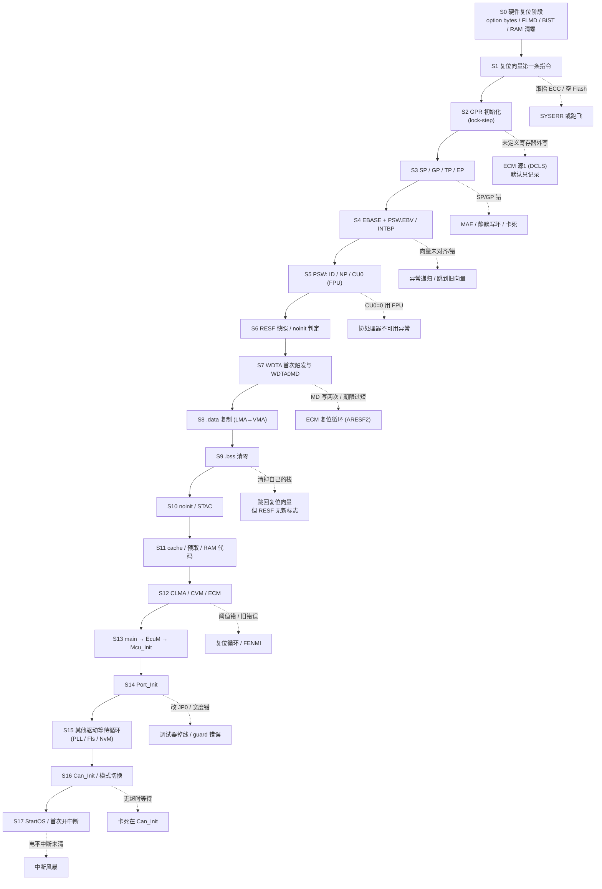
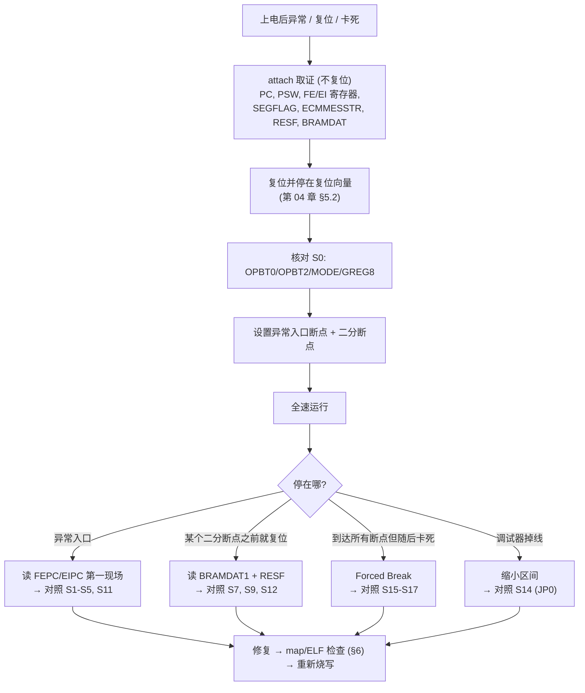

# 启动代码失败点逐步排查清单：从复位向量到 StartOS

> Prerequisite: [02-exception-and-trap-handlers.md](02-exception-and-trap-handlers.md)、[03-reset-causes-and-reset-loops.md](03-reset-causes-and-reset-loops.md)、[04-debugger-attach-and-recovery.md](04-debugger-attach-and-recovery.md)（调试器已能停在复位向量）、[../01-rh850/04-startup-process.md](../01-rh850/04-startup-process.md)、[../01-rh850/05-linker-script.md](../01-rh850/05-linker-script.md)、[../01-rh850/06-interrupt-exception.md](../01-rh850/06-interrupt-exception.md)、[../01-rh850/07-clock-system.md](../01-rh850/07-clock-system.md)、[../reference/p1me-memory-layout-ghs-memmap.md](../reference/p1me-memory-layout-ghs-memmap.md)
> Next: [06-incremental-bring-up-strategy.md](06-incremental-bring-up-strategy.md)（按阶段增量上板）；集成阶段的分层调试见 [../08-integration/07-integration-debugging.md](../08-integration/07-integration-debugging.md)，CAN 驱动寄存器级调试见 [../04-can-mcal/15-can-driver-debugging.md](../04-can-mcal/15-can-driver-debugging.md)
> 对应规范: HW-E（R01UH0585EJ0120 Rev.1.20）p.190–208（GPR、PSW、系统寄存器、RBASE/EBASE/INTBP、MCTL）、p.223（ICCTRL）、p.244–249（SEG / SYSERR）、p.250（lock-step CAUTION）、p.254–256（同步、预取 48 字节）、p.257–259（地址空间）、p.418–434（复位、STAC、复位屏蔽）、p.449（CVMDEW）、p.1090（GRAMINIT）、p.1063/1066（CAN 模式切换时间）、p.1531/1535（WDTA0MD）、p.2690（guard 错误响应）、p.2759–2764（CLMA）、p.2790–2820（ECM）、p.2884（OPBT0）、p.2890–2891（RAM 初始化、BRAMDAT）；SWS-MCU **R24-11** p.13–14（start-up code）；SWS-CAN **R22-11** p.39（`SWS_Can_00398` 超时监控）
> 对应源码: 本仓库没有 RH850 启动汇编、链接脚本或 crt0；启动与 C runtime 的教学伪代码见 [../01-rh850/04-startup-process.md](../01-rh850/04-startup-process.md) §6–7；openAUTOSAR `system/kernel/src/init.c:290-334`（链接文件自检）、`system/EcuM/src/EcuM_Callout_Stubs.c:193-204`（PLL 等待循环）
> 资料缺口: 本仓库**没有** RH850G3M Software Manual（异常向量偏移、LDSR hazard、FPU 异常细节）、GHS 编译器/链接器/crt0 手册、调试器手册。相关内容统一标注 **需确认（G3M SM / GHS 手册 / 调试器手册）**

---

## 1. 本章目标

这一章是一张**可以照着走的排查清单**。读完后你应该能：

1. 把“上电即 trap / 反复复位 / 卡死 / 变量值不对”这几类症状，**反查到启动路径上的具体步骤**。
2. 对启动路径上的每一步回答五个问题：**这一步做什么、会怎么错、症状是什么、调试器上看什么、怎么预防**。
3. 在烧写之前，用 **map 文件 / ELF 静态检查**挡住一大半错误（向量地址与对齐、`.data` 的 ROM 镜像、栈符号、GP/EP、FEBE 别名、容量）。
4. 写出一个读 GHS map / ELF 的检查脚本的结构（本章给出 `[Conceptual]` 伪代码）。

---

## 2. 为什么需要这张清单？

上一章解决了“调试器能不能停住 CPU”。停住以后，新的问题是：**从复位向量到 `StartOS` 之间有几千条指令，错在哪一条？**

启动阶段的错误有三个特点，使它比应用层 bug 难查：

| 特点 | 后果 | 本章的对策 |
|---|---|---|
| **没有任何诊断基础设施**：DET、DEM、OS 错误钩子、日志都还没起来 | 只能看寄存器和内存 | 每一步列出“看哪个寄存器 / 哪个符号” |
| **错误的表现位置和真正原因相距很远** | 例如 `.bss` 清零踩坏了栈，症状却是“跳到复位向量重新开始” | 每一步列出“症状”与“真正原因”的对应 |
| **很多错误在默认配置下是“静默”的** | P1M-E 复位后 SEGCONT=`0000H`（不为访问错误产生 SYSERR，p.245），ECM 的 NMI/中断配置全为 0、只有 WDTA 会触发 ECM 复位（p.2800、p.2817） | 每一步列出“即使没有 trap 也要查的状态寄存器” |

第三点特别重要，值得先记住一句话：

> **在 P1M-E 的复位默认配置下，“没有 trap”不代表“没有错误”。** guard 违规、访问未实现区域、Local RAM ECC 错误会被记录在 SEGFLAG（p.247），lock-step 比较错误会被记录在 ECMmESSTR0（p.2790、p.2806），但都不一定立刻把 CPU 拉进异常。它们可能在后面某个模块（例如 safety 初始化打开 ECM 反应、或打开 SEGCONT）时才“爆发”，让你误以为是那个模块出了问题。

---

## 3. 系统位置：启动路径与失败点总图



> 图中 S0–S12 的顺序是**教学用的推荐顺序**，与 [04-startup-process.md](../01-rh850/04-startup-process.md) §3 一致。真实 GHS crt0 / 项目启动文件的顺序可能不同（例如 RESF 快照在 `.bss` 清零之前还是之后、EBASE 在 C runtime 之前还是之后），**需在真实项目中逐行确认**。顺序不同不一定是错，但每一种顺序都有它必须满足的前置条件——这正是本清单要检查的。

---

## 4. 怎样使用这张清单

### 4.1 症状 → 步骤反查表

先根据你看到的现象，跳到最可能的步骤：

| 你看到的现象 | 先看哪些寄存器 | 最可能的步骤 |
|---|---|---|
| 连上后 PC 不在复位向量，而在某个奇怪地址 / 全 `FF` 区域 | PC、GREG8、Flash 内容 | S0、S1 |
| CPU 停在 FE 级异常（PSW.NP=1），FEIC 在 `11H`–`19H` | FEIC、FEPC、SEGFLAG、SEGADDR | S1、S3、S8、S9、S11、S13（SYSERR，p.247） |
| 停在 FENMI（FE 向量 `+0E0H`） | ECMMESSTR0–2 | S2、S12（取决于项目把哪些 ECM 源配成 NMI） |
| 停在一个“看不出是什么”的异常 handler | FEIC/EIIC、FEPC/EIPC、MEA/MEI | S3（MAE）、S5（FPU）、S4（向量表错） |
| 反复复位，RESF 有 ARESF2 | ECMMESSTR0 bit0（WDTA） | S7 |
| 反复复位，RESF 有 SRESF1 | CVM 状态 | S12 |
| 反复“从头开始”，但 RESF **没有新标志** | BRAMDAT 阶段码、SP、栈内容 | S9（清掉了自己的栈）、S4（异常跳到 RBASE） |
| 全局变量初值不对，有的对有的错 | map 中 `.data` / `.sdata` / `.tdata` 的 LMA/VMA | S8 |
| 卡死，强制停机后 PC 在一个 `while` 循环里 | PC 对应的源码；被等待的状态寄存器 | S15、S16 |
| 一切初始化完成，开中断后 CPU 100% 在 ISR | EIIC、对应外设标志 | S17 |
| 调试器在执行到某处后掉线 | 断点二分到最后一次能停住的位置 | S14（JP0） |
| 调试器下正常，脱离调试器就复位 | OPBT0、WDTA 触发路径 | S7（停机时 WDTA 停止，p.2855） |

### 4.2 每一步的格式

每一步都按同一个结构写：

- **做什么**：这一步的职责与硬件依据。
- **会怎么错**：常见错误。
- **症状**：哪种 trap / 复位 / 卡死 / 静默错误。
- **调试器怎么查**：要看的寄存器、符号、map 项。
- **预防**：代码/链接/配置层面的防线。

---

## 5. 逐步清单

### S0 硬件复位阶段：在你的第一条指令之前

**做什么** [RH850 Hardware]：复位释放时锁存 FLMD0/FLMD1 决定工作模式（p.261）；POR / System Reset 1 / System Reset 2 读 option bytes，Application Reset 1 不读（p.431、p.434）；执行 Field BIST（可配置，p.434）；LRAM/GRAM/DTS RAM/CSIH RAM 清零并写 ECC，受 STAC_* 控制（p.434、p.2890）；PC = 复位向量，user mat 启动时 RBASE=`0000_0000H`（p.258），使用 variable reset vector 时由 Flash 保护设置决定（p.2865）。

**会怎么错**：

- 烧写的镜像与 option bytes 计划值不一致（例如 OPWDRUN=1 而启动代码按“看门狗不会跑”写）。
- 使用了 variable reset vector（或有 bootloader），但应用镜像仍把复位入口链接到 `0000_0000H`。
- FLMD0 电平错误，芯片进了串行编程模式（用户代码根本不运行）。

**症状**：PC 不在你以为的复位入口；或用户代码完全没跑。

**调试器怎么查**：

| 读什么 | 地址 | 期望 | 依据 |
|---|---|---|---|
| OPBT0 | `FFCD_0030H`（32 位只读） | 与烧写计划一致 | p.2884 |
| OPBT2 | `FFCD_0038H` | OPJTAG 与仿真器一致 | p.2886 |
| MODE | `FFF8_0104H` | FLMD0=0（normal） | p.263 |
| GREG8（Reset Vector 0） | `FFCD_0020H` | 等于 map 中复位入口地址 | p.2880 |
| RBASE | SR2,1 | 低 9 位为 0；等于复位向量 | p.205 |

**预防**：把 option bytes 的“计划值”和“板上读回值”都纳入版本记录（上一章 §8.3）；在 map 检查脚本中断言“复位入口符号地址 == 项目约定的复位向量”（§6）。

---

### S1 复位向量的第一条指令

**做什么**：CPU 从 RBASE 取指。通常这里只放一条跳转，跳到真正的启动代码（向量区每个异常只占很小的偏移，第 01-rh850/05 章 §5.4）。

**会怎么错**：

- `.reset` 段没有被链接到复位向量地址，或被链接器当成未引用段丢弃。
- 复位入口处的跳转目标落在**已擦除**或**未烧写**的 Flash 中。
- 转换 HEX/S-record 时地址被截断或偏移（第 05 章 §6 第 10 项）。

**症状**：从已擦除 Flash 读取的值“不保证”（p.2862）；预取已擦除 Flash 可能产生 ECC 错误（p.256）。表现为一启动就进 SYSERR（FEIC `11H`：Code Flash 取指错误，p.247），或执行随机指令后进入保留指令类异常（具体异常类型与向量偏移需确认 G3M SM）。

**调试器怎么查**：停在复位向量后，**反汇编复位向量处**，确认第一条是你的跳转；再看跳转目标处的反汇编是否与 map/ELF 一致（调试器内存视图 vs ELF 内容）。

**预防**：§6 的 map 检查第 1、2、10 项；HEX 与 ELF 的装载段逐段比较（地址、长度、校验）。

---

### S2 通用寄存器初始化（lock-step）

**做什么** [RH850 Hardware]：复位后 r1–r31 未定义（p.190）。手册 CAUTION：“Reading of any register with an undefined value after a reset in a PE or writing to memory or a register outside the PE may cause a lock step comparison error … pay attention to this when saving register values on the stack in RAM.”（p.250）。所以启动代码必须在**任何 store（尤其是压栈）之前**给所有 GPR 赋确定值。

**会怎么错**：

- 先 `prepare` / `pushsp` 保存寄存器、再初始化 GPR（例如把一个 C 函数当作复位入口，其序言会压栈）。
- 只初始化了“用到的”寄存器，遗漏了 r2、r31 等。
- 系统寄存器同理：读一个复位后未定义的系统寄存器（如 EBASE、INTBP 复位值 Undefined，p.205–206）再写到内存。

**症状**：lock-step 比较错误进入 ECM **错误源 1（DCLS compare error）**（p.2790）。在复位默认配置下，ECMNMICFG/ECMMICFG 全为 0、ECMIRCFG0 只使能源 0（p.2800、p.2817），所以**它很可能不会立刻产生异常或复位**，只是：

- ECMMESSTR0 bit1 置位，而且这个状态**只能由软件或 Power On Reset 清除（不包括 debug initiated reset）**，其他复位不影响（p.2806）；
- ECMEMK0 默认为 0（不屏蔽，p.2820），ERROROUT 可能被拉低（板上若接了 LED 或外部监控，会看到）。

**“延迟爆发”陷阱**：当后面的 safety 初始化把源 1 配置为 FENMI 或 ECM 复位时，这个**早就存在的**错误状态可能立刻生效（手册对 ERROROUT 明确写了“清除屏蔽时若错误标志已置位，ERROROUT 立即变低”，p.2820；对 NMI/复位配置是否同样立即触发，**需确认**）。表现为“一执行 safety 初始化就进 FENMI”，真正原因却在复位汇编里。

**调试器怎么查**：停在复位向量后，单步过 GPR 初始化段，检查是否有任何 store 指令出现在 GPR 全部赋值之前；读 ECMMESSTR0（`FFD6_0008H`，p.2786、p.2806）。

**预防**：复位入口必须是**汇编**，GPR 初始化放在最前面；ECM 配置代码在使能反应之前，先读出并记录、再按安全策略清除已有的错误状态（清除寄存器 ECMESSTC0–2，需保护写序列，p.2800）。

---

### S3 SP / GP / TP / EP

**做什么**：r3=SP、r4=GP、r5=TP、r30=EP（p.190–191）。SP 指向 Local RAM self（`FEDE_0000H`–`FEDF_FFFFH`，p.257）中的栈顶；GP/EP 是编译器 SDA/TDA 寻址的基址，值来自链接器符号。

**会怎么错**：

| 错误 | 后果 |
|---|---|
| SP 用了栈**底**而不是栈**顶**（栈向下增长） | 第一次压栈就写到栈区下方，踩坏 `.bss` 或越出 RAM |
| SP 指向 `FEBE_xxxx` 别名而不是 `FEDE_xxxx` | 同一块 RAM 的 PE1 别名，供其他 master 访问（p.259）；CPU 自身应使用 self 地址，用别名访问是否带来额外等待或保护问题需确认 |
| SP 未 4/8 字节对齐 | 压栈时可能触发 MAE：MCTL.MA 复位值 0，即 misaligned 访问产生异常（p.208）；对齐要求由 ABI 决定（需确认 GHS 手册） |
| GP/EP 与编译选项不一致（`-sda`、`-tda` 等，需确认 GHS 手册） | 所有 SDA/TDA 变量读写到错误地址——**完全静默** |
| GP 在 `.data` 复制**之后**才设置，但复制代码本身用了 SDA 变量 | 复制过程读写错地址 |

**症状**：

- SP 越出 Local RAM 实现区域：Local RAM 访问错误被记录为 SEGFLAG.TCMF（“Access to the RAM-unimplemented area in the local RAM”，p.245、p.247），但 SEGCONT 默认不通知（p.245）→ **静默**。
- 写到 Code Flash 地址或 I/O 区：表现取决于目标区域，可能被 guard 拦截并返回错误响应（p.2690），同样记录到 SEGFLAG.VPGF/VCIF。
- MAE：EI/FE 级异常（具体级别与向量需确认 G3M SM），MEA 记录违规地址（p.202）。

**调试器怎么查**：

| 寄存器 | 与什么比 |
|---|---|
| r3 | map 中栈段的 `endaddr`（栈顶）；必须在 `FEDE_0000H`–`FEE0_0000H` 之间 |
| r4 | map 中 SDA 基址符号（如 `__gp`，名称需确认） |
| r5、r30 | 对应的 TP/EP 符号 |
| SEGFLAG / SEGADDR | 是否已有 TCMF/VPGF/VCIF（`FFFE_E982H` / `FFFE_E988H`，p.244、p.247–248） |

**预防**：§6 的 map 检查第 4、5 项；栈区下方放一段填充模式（例如 `0xDEADBEEF`）并在启动后定期检查（栈水位）；bring-up 期间可考虑**临时**打开 SEGCONT 的 TCME/VPGE/VCIE（p.245–246），让访问错误立刻变成 SYSERR 而不是静默——这是调试手段，量产策略需与 safety 设计一致。

---

### S4 EBASE / PSW.EBV / INTBP / RBASE

**做什么** [RH850 Hardware]：

- PSW.EBV=0 时异常向量用 RBASE，=1 时用 EBASE（p.198、p.205）。
- EBASE 低 9 位“are all handled as 0”（p.205），INTBP 低 9 位必须为 0（p.206）→ **512 字节对齐**。
- EBASE bit0 是 RINT，**复位值 Undefined**（p.205）；RINT=1 会改变直接向量方式下中断 handler 的偏移（细节需确认 G3M SM）。
- 表引用方式的中断从 `INTBP + 通道号×4` 读 handler 地址（p.281）。
- 写系统寄存器后与后续指令的同步，按 G3M SM Appendix A 的 hazard 处理（p.254）。

**会怎么错**：

| 错误 | 后果 |
|---|---|
| 向量表没有 512 字节对齐 | 低 9 位被当作 0，CPU 跳到“向量表起点向下取整”的位置，执行的是别的代码 |
| 写 EBASE 时 bit0（RINT）被意外置 1（例如符号值是奇数、或用了未清零的寄存器） | 直接向量中断的偏移变化 |
| 先置 EBV=1 再写 EBASE（EBASE 复位值 Undefined） | 中间这段时间若发生异常，跳到未定义地址 |
| 有 bootloader 时，应用没有设置自己的 EBASE/INTBP | 异常进入 bootloader 的向量表（RBASE 指向 bootloader） |
| INTBP 表项数量不足 384 或表项是 0 / 未烧写 | 某些中断跳到 0（复位向量）或空 Flash |
| 异常 handler 入口缺少 SYNCP | FENMI、FEINT、直接向量 EIINT、SYSERR、FPI 的 handler 前需要 SYNCP（p.256、p.281；细节需确认 G3M SM） |

**症状**：**异常递归**——第一个异常跳到错误位置，执行垃圾指令又引发异常；FE 级异常只有一组 FEPC/FEPSW，多个异常同时或嵌套发生时上下文被覆盖（p.255 §3.4.4），你读到的 FEPC 可能已不是第一现场。也可能表现为“像复位一样从头开始”（跳到了 `0000_0000H`），但 RESF 没有新标志。

**调试器怎么查**：读 EBASE（SR3,1）、INTBP（SR4,1）、PSW.EBV；与 map 中向量段地址比较；读 `INTBP + 4×n` 处的表项，与 map 中 ISR 符号比较（第 01-rh850/06 章 §12.1 第 9 项）。为“第一现场”设硬件断点：在每个异常向量入口的第一条指令上打断点，比事后读 FEPC 可靠。

**预防**：§6 检查第 1、3 项（对齐、表大小、表项全部非零且落在 `.text` 内）；写 EBASE 前对地址做 `& ~0x1FF` 断言；顺序上先写 EBASE、按 hazard 要求同步、再置 EBV。

---

### S5 PSW：ID / NP / CU0（FPU）

**做什么** [RH850 Hardware]：复位后 PSW=`0x0000_0020`（ID=1，EI 级中断屏蔽；CU0=0，FPU 不可用；EBV=0）（p.197–198）。PSW.CU0 为 0 时，执行协处理器（FPU）指令**或访问协处理器系统寄存器**都会产生“coprocessor use prohibition exception”（p.197）。FPSR、FPEPC、FPST、FPCC、FPCFG、FPEC 的访问权限都标注为需要 CU0（p.192）。

**会怎么错**：

- 工程使用硬件浮点编译（GHS 选项需确认），但启动代码没有置 CU0；第一个 `float` 运算（可能在 C runtime、`Mcu_Init` 的时钟换算、甚至编译器生成的整数↔浮点转换中）触发异常。
- 先初始化 FPSR **再**置 CU0：访问 FPSR 本身就需要 CU0（p.192），会立刻触发异常。
- 启动早期执行了 `ei`（例如某个驱动的“临界区恢复”宏把 PSW.ID 清零），而 INTBP/EIC/ISR 栈还没准备好——一个早到的中断就会把 CPU 带到未定义的 handler。
- FE 级异常 handler 中没有正确处理 NP，导致之后所有 EI/FE 都被屏蔽（p.198）。

**症状**：协处理器不可用异常（向量偏移与异常级别需确认 G3M SM）；FEPC/EIPC 指向一条浮点指令。早开中断时：EIIC 显示某个 `0x10xx` 通道（p.199），而 PC 在默认 handler。

**调试器怎么查**：读 PSW 的 CU0（bit16）、ID（bit5）、NP（bit7）；在 ELF 反汇编中搜索 FPU 指令，确认第一条出现在 CU0 置位之后；对 PSW 设置“写访问”类事件检测（OCD Event Detection，p.2854 (12)，工具支持需确认）找出谁清了 ID。

**预防**：

- 启动汇编中：GPR 初始化 → 置 CU0（若用硬件 FPU）→ 再初始化 FPSR（顺序见 p.192、p.197）。
- 编译选项与启动代码对 FPU 的假设写入同一份配置说明；若整个工程使用软件浮点，确认没有任何模块单独开启硬件浮点（需确认 GHS 选项）。
- `StartOS` 之前禁止任何 `ei`；在 bring-up 期间，可在启动结束前加入断言 `PSW.ID == 1`。

---

### S6 RESF 快照与 noinit 判定

**做什么**：尽早读取 RESF（`FFF8_1000H`）并保存（p.421–422）；根据复位类型和 noinit 区的校验字决定是否信任 noinit 数据（第 01-rh850/04 章 §6.3）。

**会怎么错**：

- 快照变量放在 `.bss` 中，随后被 `.bss` 清零覆盖。
- 快照放在 `.data` 中，随后被 `.data` 复制覆盖。
- 读 RESF 后马上清除（RESFC，p.423），但 Mcu 驱动之后再读，得到 0。
- 把 Debugger Initiated Reset 误判为上电复位（PRESF0 与 SRESF0 都会置位，p.422、p.434）。

**症状**：不是 trap，而是**复位原因判断错误**——这会直接误导你对 S7、S12 的判断。

**调试器怎么查**：在快照写入后打断点，比较快照变量与 RESF 原值；在 `main` 处再看一次快照变量是否被覆盖。

**预防**：快照写入 noinit 段或 BRAMDAT（任何复位都不初始化，p.2891）；“读 → 保存 → 清除”三步顺序固定（第 03-mcal/02 章 §6.6）。

---

### S7 WDTA 首次触发与 WDTA0MD（只写一次）

**做什么** [RH850 Hardware]：

- OPWDRUN=1（default start mode）：复位释放后计数立即开始，首次触发必须在溢出前（p.1534、p.2817）；OPWDRUN=0：计数器保持 `0000H`，写入激活码才开始（p.1534）。
- 溢出时间 `2^(9+OVF) / WDTATCKI`，WDTATCKI=8 MHz 或 250 kHz（OPWDMDS，p.2884）。
- **WDTA0MD**（`FFD7_400CH`，8 位，p.1522、p.1531）：只能在复位后、**首次触发之前**更新一次；首次触发后写入不同的值会产生错误，写相同值不报错（p.1531、p.1535）。MD 的新设置在首次触发时生效（p.1535）。
- OPWDVAC 选择固定激活码（WDTA0WDTE）或可变激活码（WDTA0EVAC）（p.2884）。

**会怎么错**：

| 错误 | 后果 |
|---|---|
| OPWDRUN=1，但启动代码到第一次触发的路径超过溢出时间（例如 8 MHz、OVF=000 只有 64 µs，推导） | WDTA 错误 → ECM 源 0 → 默认 ECM 复位（p.2790、p.2817），默认是 Application Reset 1（RESC0=1，p.418、p.420） |
| 启动代码为了“保命”先触发一次，Wdg_Init 再写一个**不同**的 WDTA0MD | 违反只写一次规则 → 错误 → 复位 |
| VAC 模式下照抄固定激活码 | 触发无效 → 溢出 |
| 75% 中断（WDTA0MD.WIE，p.1531）使能，但 EI9 的 ISR / 向量还没就绪 | 中断进入默认 handler（若此时 PSW.ID=0） |
| 长时间无喂狗的启动步骤（大块 `.data` 复制、`NvM_ReadAll`、Fls 初始化） | 中途溢出 |

**症状**：复位循环；RESF 中 **ARESF2**（ECM application reset）；ECMMESSTR0 bit0=1（跨非 POR 复位保留，p.2806）。

**“调试器下不复现”陷阱**：CPU 停机时 WDTA0 无条件停止（p.2855）。单步、停在断点上都会让看门狗“暂停”，所以**这类 bug 往往只在全速运行时出现**。复现方法：只设置一个硬件断点在 `StartOS` 之后，全速运行，看是否到达；或用 RRM 观察阶段码（p.2854 (8)）。

**调试器怎么查**：读 OPBT0 解码首次期限；读 WDTA0MD 当前值；在 WDTA0MD 地址上设置“写访问”事件，列出所有写入点及顺序；读 ECMMESSTR0。

**预防**：bring-up 期间 OPWDRUN=0（上一章 §7.4）；全工程只有一个模块写 WDTA0MD（搜索 `0xFFD7400C` 与符号名）；按启动阶段逐段计算耗时预算，并留出 IOSC 频率偏差余量（HS IntOSC 15.44–16.56 MHz，见第 01-rh850/07 章 §3）。

---

### S8 `.data` 复制（LMA → VMA）

**做什么**：把有初值变量从 Code Flash 中的镜像（LMA）复制到 RAM 中的运行地址（VMA）（第 01-rh850/05 章 §5.2）。GHS 工具链通常用链接器生成的复制表驱动这一步（`.secinfo` 一类段，名称和格式**需确认 GHS 手册**）。

**会怎么错**：

| 错误 | 症状 |
|---|---|
| 复制代码用的符号与链接器实际分配不一致（例如用了 `.data` 的 VMA 当源地址） | 全部初值错（读到 RAM 中硬件清零后的 0，p.2890） |
| 只复制了 `.data`，漏了 `.sdata` / `.tdata` / `.ramfunc` 等其他有初值段 | **部分**变量初值对、部分错（第 01-rh850/05 章 §12） |
| 链接脚本中 `ROM()` 镜像缺失，复制源落在镜像之后的空 Flash | 读到不保证的值（p.2862）；甚至 Code Flash ECC 错误（ECM 源 19，p.2791；或 SYSERR） |
| 按 32 位复制，但段起点或长度不是 4 的倍数 | 越界复制 1–3 字节；或 MAE（MCTL.MA=0，p.208） |
| 复制函数自己是 C 函数且使用了 `.data`/SDA 变量 | 用未初始化的值控制复制 |

**症状**：通常**没有 trap**，而是“程序逻辑莫名其妙”：配置指针为 0、状态机初值错误、`Det` 报 UNINIT 等。

**调试器怎么查**：

1. 在复制完成后打断点。
2. 对每个有初值的输出段：比较 RAM 中 VMA 区域与 Flash 中 LMA 区域的内容（调试器内存比较功能，需确认）。
3. 用一个“哨兵变量”：`volatile uint32 g_boot_sentinel = 0x12345678u;`，复制后读它（openAUTOSAR 的同类自检见 `system/kernel/src/init.c:290-334`）。

**预防**：§6 检查第 6、7 项；加入哨兵变量并在 `main` 开头断言（失败时写阶段码到 BRAMDAT 后停在死循环，便于调试器识别）。

---

### S9 `.bss` 清零

**做什么**：把零初始化段清零。POR 后硬件已清零并写好 ECC（p.2890），但关闭了 STAC 清零的复位路径（Pin reset、System Reset 2、Application Reset 1 下 Local RAM 可关闭，p.434）需要软件清零，所以软件仍应执行。

**会怎么错**：

| 错误 | 症状 |
|---|---|
| 结束符号用错（例如用了下一个段的结束地址），清零范围**覆盖了栈** | 清零循环把自己的返回地址 / 保存的寄存器清成 0 → 返回到 `0000_0000H` → 从复位向量重新执行。**看起来像复位，但 RESF 没有新增标志**——这是辨别它的关键 |
| 清零范围覆盖 noinit 段 | 跨复位保存的数据丢失（不会 trap，但复位诊断失效） |
| 清零范围覆盖 `.data` | 有初值变量又变成 0 |
| `.sbss` / `.tbss` 遗漏 | SDA/TDA 中的零初始化变量是上次运行留下的值（只在关闭 STAC 清零的复位后出现，POR 后正常——“只在软件复位后出问题”） |
| 清零代码在 C 中实现，编译器把循环优化成调用 `memset`，而 `memset` 位于尚未就绪的 RAM 函数或依赖 SDA | 跳转到错误地址 |

**症状**：重复执行启动代码（BRAMDAT 阶段码反复出现 S1→S9 的序列）而 RESF 不变；或软件复位后行为与上电不同。

**调试器怎么查**：在清零循环入口读 r3（SP）和清零范围的起止值，判断 `[start, end)` 是否与 `[SP-栈大小, 栈顶)` 相交；对栈顶附近一个字设置“写访问”事件。

**预防**：§6 检查第 8、9 项（`.bss` 与栈、noinit 不相交）；栈和 noinit 放在 MEMORY 中独立的区域，而不是同一区域里的相邻段（第 01-rh850/05 章 §8；[p1me 速查](../reference/p1me-memory-layout-ghs-memmap.md) §2.2）。

---

### S10 noinit 与 STAC

**做什么**：noinit 段不复制、不清零；是否“真的跨复位保留”取决于 STAC_*：RZEROMD `11`=执行清零、`x0`=不执行、`01`=禁止使用（p.427–430）。Local RAM 只在 Pin reset、System Reset 2、Application Reset 1 下可关闭清零；GRAM/DTS RAM/CSIH RAM 只在 Application Reset 1 下可关闭（p.434）。POR 总是清零。

**会怎么错**：

- 写入 STAC 的值为 `01`（禁止使用）。
- 以为 noinit 能跨所有复位，实际 POR、CVM reset 等仍会清零。
- 关闭 STAC 清零后，读取了从未写过的 RAM（ECC 未初始化）→ Local RAM ECC 错误（ECM 源 16 / 48，p.2791–2792；SEGFLAG.TCMF，p.245）。
- noinit 区的校验字逻辑错误：把随机内容当作有效数据使用。

**症状**：软件复位后读 noinit 时出现 ECC 错误；复位计数器或错误日志“乱跳”。

**调试器怎么查**：读 STAC_LM0（`FFF8_1520H`）、STAC_GRAM（`FFF8_1420H`）等（p.420）；读 ECMMESSTR0（源 16）和 ECMMESSTR1（源 48）。

**预防**：noinit 数据必须带魔术字 + CRC；关闭 STAC 清零只针对 noinit 所在的区域，且启动代码在使用前验证 ECC 安全（只读写过的地址）。

---

### S11 Cache、预取与 RAM 中执行的代码

**做什么** [RH850 Hardware]：

- ICCTRL（SR24,4，p.221）复位值 `0003_0003H`：ICHEN=1（指令 cache 已使能）、ICHEMK=1（屏蔽 cache 错误通知），bit16 保留且**必须写 1**，ICHCLR=1 清整个 cache（p.223）。
- 向 RAM 写入代码后跳转执行：store → dummy read → SYNCP → SYNCI → 跳转（p.255）。
- 自编程改写 Code Flash 后：用 ICCTRL 清指令 cache、用 CDBCR 清数据缓冲（p.255）。
- 预取会读取代码末尾之后 **48 字节**；这段若是未初始化 RAM 或已擦除 Flash，可能产生 ECC 错误；若与 IPG 禁止区或禁止访问区重叠，可能被当作违规（p.256）。

**会怎么错**：

| 错误 | 症状 |
|---|---|
| 启动代码“为了保险”写 `ICCTRL = 1`（bit16 写成 0，违反“Be sure to set to 1”） | 行为未定义（p.223） |
| RAM 函数复制后直接跳转，缺 SYNCI | 偶发执行旧内容 |
| `.ramfunc` 放在 Local RAM 末尾，后 48 字节越出实现区域或未初始化 | 预取 ECC 错误；访问未实现区域（SEGFLAG.TCMF） |
| 代码段紧贴 Code Flash 末尾或已擦除块 | 预取到已擦除区域 → ECC 错误 |

**症状**：随机性的 SYSERR / ECC 错误，常常与代码大小变化有关（“加了一行代码就好了 / 坏了”）。

**调试器怎么查**：读 ICCTRL；在 map 中看每个可执行段的结束地址 + 48 字节落在哪里（§6 检查第 11 项）；读 ECMMESSTR0（源 16、19）。

**预防**：§6 检查第 11 项；链接脚本中 `.ramfunc` 后加 48 字节填充并初始化（第 01-rh850/05 章 §5.4）；不要无理由改写 ICCTRL。

---

### S12 时钟监视 CLMA、电压监视 CVM、ECM

**做什么** [RH850 Hardware]：

- CLMAnCTL0 受保护：CLMAnPCMD 写 `A5H` → 写设定值 → 写反码 → 再写设定值，读 CLMAnPS.PRERR 确认（p.2764）；序列中访问同一模块其他寄存器会失败。
- CLMAnCMPL/CMPH 只能在 CLME=0 时写（p.2760）；**CLME 一旦置 1，只能由复位清零**（p.2759）。
- CVMDEW（`FFF8_2C1CH`）在 Power On Reset 释放后**只能写一次**，之后写入被忽略（p.449）。
- ECM 寄存器写入需要保护解锁序列（p.2800、p.2817）；ECMmESSTR 只能由软件或 POR 清除（p.2806）。

**会怎么错**：

| 错误 | 症状 |
|---|---|
| CLMA 阈值按理想频率计算，没有计入 IOSC/晶振偏差 | 正常频偏也报错 → ECM 源 8–15（p.2791）；若项目把它配成 ECM 复位 → 复位循环 |
| 保护写序列被中断打断，PRERR=1 但代码不检查 | 以为使能了监视，实际没有（静默） |
| 先使能 CLMA，后写阈值 | 阈值写入无效（CLME=1 时不可写，p.2760），使用默认阈值 |
| CVMDEW 在早期 bring-up 镜像中写了“试验值” | 直到下次 POR 前都改不回来（p.449）；软件复位后再写无效，容易误以为“新代码的配置没生效” |
| ECM 配置使能 NMI/复位前，没有处理 S2 等阶段遗留的错误状态 | 一使能就进 FENMI / 复位（见 S2“延迟爆发”） |

**症状**：复位循环（RESF：ECM 相关 ARESF2/SRESF4，或 CVM 的 SRESF1，p.421）；FENMI；或“配置没生效”。

**调试器怎么查**：CLMAnCTL0、CLMAnCMPL/CMPH、CLMAnPS（基址 `FFF8_3100H + 100H×n`，p.2757）；ECMMESSTR0–2；ECMIRCFG0–2、ECMNMICFG0–2 当前值（ECM_base `FFD6_2000H`，p.2800）。

**预防**：bring-up 早期**不使能** CLMA、不改 ECM 反应配置、不写 CVMDEW；时钟稳定后再按 safety 设计逐项打开，每打开一项做一次全速冷启动验证；所有保护写序列都检查 PRERR。

---

### S13 main → EcuM_Init → Mcu_Init（guard 与访问宽度）

**做什么**：Mcu 驱动处理复位原因、STAC、时钟参考点、（P1M-E 上几乎为空的）时钟初始化（第 03-mcal/02 章）。复位寄存器可被 P-Bus Guard 保护（p.420），时钟控制器寄存器可被 Slave Guard 保护（p.471）。

**会怎么错**：

| 错误 | 机制 | 症状 |
|---|---|---|
| 启动早期配置了 PBG/HBG，后续驱动写被保护的寄存器 | guard 检测到非法访问 → 报告 ECM（源 67 slave guard，源 64 PE guard，源 65 GRAM guard，p.2792–2793）+ 总线周期以错误响应结束（p.2690） | 写入无效；SEGFLAG.VPGF（写 P-Bus）或 VCIF（读）置位（p.245–246）；默认**无 SYSERR**（SEGCONT=0） |
| 访问宽度错误（例如对 8 位寄存器做 32 位写，对 16 位端口寄存器做 32 位写） | 每个寄存器都规定了访问宽度（例如 OPBT0 只能 32 位读，p.2884；WDTA0MD 8 位，p.1531）。对 SEG 寄存器，手册明确说宽度/偏移不符会返回错误响应（p.244）；其他模块的具体后果**需按各模块确认** | 写入无效或写到相邻寄存器；SEGFLAG 记录 |
| 对含多个标志位的寄存器用位操作指令（set1/clr1） | 位操作是 8 位读-改-写，可能清掉别的标志（p.255 §3.4.2） | 状态标志莫名丢失 |
| 时钟等待循环：`while (Mcu_GetPllStatus() != MCU_PLL_LOCKED)`，而 P1M-E 的 Mcu 很可能 McuNoPll=TRUE、恒返回 UNDEFINED | 第 01-rh850/04 章 §8.4（openAUTOSAR `EcuM_Callout_Stubs.c:200`） | **卡死在 EcuM_Init** |

**调试器怎么查**：每个 `*_Init` 返回后读 SEGFLAG / SEGADDR；读 ECMMESSTR2（源 64–67 所在寄存器，p.2808 起）；对关键寄存器“写后读回”比较。

**预防**：bring-up 期间不配置 guard；为每个寄存器访问宏标注宽度（`RH850_WRITE8/16/32`），在代码审查中逐项对照手册“Access”行；所有等待循环都有界（见 S15）。

---

### S14 Port_Init（JP0、写使能位、过渡状态）

**做什么**：配置 PMC/PFC/PFCE/PFCAE/PM/PIPC 等（p.94–131），推荐顺序见第 03-mcal/03 章 §6.2。

**会怎么错**：

| 错误 | 症状 | 依据 |
|---|---|---|
| **配置表中包含 JP0 引脚**（JPMC0/JPM0/JPIBC0 等，JPORT0_base `FFC2_0000H`，8 位寄存器） | 调试器在 Port_Init 之后掉线，或连接异常（具体行为需确认） | p.91–92、p.99、p.148 |
| 用 PMSRn/PMCSRn 时只写了低 16 位值、没写高 16 位写使能 | 设置“看起来写了”但实际没生效 | p.96、p.102（内部复审 §12.3 也强调过） |
| 端口寄存器访问宽度用错（Pn/PMn/PMCn 等为 16 位，JP0 为 8 位） | 写入无效或影响相邻寄存器 | p.99、p.148 |
| PIPC=0 时 PMC 置 1 到 PM 清 0 之间引脚短暂为 alternative 输入，若复用了外部中断功能，可能产生假中断 | 开中断后立即进 ISR | p.126 |
| 同一外设输入功能在多个引脚上同时使能 | 外设收不到信号 | p.131 |
| 把 P3_14（FLMD1）当 GPIO 输出，板上又接了编程/模式电路 | 下一次 pin reset 时模式锁存受影响（板级需确认） | p.261–263 |

**调试器怎么查**：Port_Init 返回后，按 `PORT_base + 偏移 + n×40H` 读回每组寄存器（第 03-mcal/03 章 §12），与配置期望值逐位比较；如果调试器在 Port_Init 中掉线，用硬件断点二分到具体写入。

**预防**：Port 配置审查清单第一条：**没有 JP0**；生成代码中搜索 `JPORT0`、`0xFFC2`；对 PMSR/PMCSR 写入断言“高半字非零”。

---

### S15 其他驱动的等待循环（PLL、Fls、NvM）

**做什么**：很多驱动在初始化时等待硬件状态位。

**会怎么错**：等待没有超时；等待的状态位在 P1M-E 上不存在或语义不同（PLL 例子）；等待时间超过 WDTA 期限（若 OPWDRUN=1）。

**症状**：卡死（无复位，若看门狗未运行）或复位循环（若看门狗在跑）。

**调试器怎么查**：强制停机（Forced Break，p.2853 (5)），看 PC 所在函数；读被等待的寄存器，判断它是“还没好”还是“永远不会好”。

**预防**：所有等待使用**有依据的单调超时**，超时后记录寄存器快照、返回错误；超时基准不能依赖尚未初始化的定时器（例如 OS counter）——启动早期可用循环计数加保守上界，并写明依据。

---

### S16 Can_Init 与 CAN 模式切换

**做什么** [RH850 Hardware]：RS-CANFD 在复位后自行初始化 CAN RAM，耗时 **3794 pclk**，期间 GSTS.GRAMINIT=1，完成后清 0；**必须在 GRAMINIT=0 之后再配置 CAN**（p.1090、p.821）。之后按 Figure 17.16 依次进入 global reset、channel reset、global operating、channel communication（p.1090–1091）；每次模式切换后都必须检查状态位（p.1122）。

**会怎么错**：

| 错误 | 症状 | 依据 |
|---|---|---|
| 不等 GRAMINIT 就写规则表/缓冲区配置 | 指向 RAM 的寄存器在 RAM 初始化完成前值未定义，配置无效 | p.1090、p.1123 |
| 模式切换等待无超时 | 硬件异常或时钟问题时卡死 | p.1063、p.1066（最长切换时间） |
| 把“等待 COMSTS=1”放在 Can_Init 或启动路径里 | COMSTS 要检测到 11 个连续隐性位才置 1（p.810–811）；总线未接、收发器在 standby、终端缺失时**永远不会置 1** | p.810–811、p.1068 |
| 在 global/channel 模式不对时写只能在 reset 模式写的寄存器 | 写入被忽略 | p.804、p.817、p.831 |
| CAN 时钟源假设错误（按 80 MHz 计算位时间） | 不卡死，但只有 error frame | p.791、p.817 |

**时间量级**（推导）：3794 pclk ÷ 80 MHz ≈ **47.4 µs**；global reset → operating 最长 10 pclk；channel reset → communication 最长 4 个 bit time（500 kbit/s 时 8 µs）。超时值应远大于这些值，但必须**有界**（SWS-CAN R22-11 `SWS_Can_00398` 要求用 OS 计数器做超时监控，p.39；启动早期没有 OS 时需另选时间基准）。

**调试器怎么查**：强制停机后看 PC 是否在 Can 驱动的等待循环；读 GSTS（`FFD2_008CH`，p.798）、CmSTS（`FFD2_0008H + 10H×m`），对照第 04-can-mcal/06 章 §11.1 的读回表。

**预防**：Can_Init 中只等待“有确定上界”的状态（GRAMINIT、global/channel 模式状态）；COMSTS 由 `Can_MainFunction_Mode` 或上层状态机异步确认，不放进启动的阻塞路径（第 04-can-mcal/06 章 §6.3、§7.2）。

---

### S17 StartOS 与首次开中断

**做什么**：OS port 设置/确认向量表、EIC 的 EIP/EITB/EIMK、ISR 栈，启动 OS tick，进入第一个任务时 PSW.ID=0（第 01-rh850/06 章 §8.5）。

**会怎么错**：

| 错误 | 症状 | 依据 |
|---|---|---|
| 电平型中断（例如 CAN）在 Can_Init 后已经挂起，开中断后 ISR 没有清外设标志 | **中断风暴**：EIRET 后立刻再进入 | p.285–290 Note、p.1057 |
| 清源后没有 dummy read + SYNCP 就 EIRET | 偶发“空 ISR” | p.254 |
| EIC 读-改-写（set1/clr1）在外设可能产生请求时执行 | 丢失或重复中断 | p.267 |
| EIBD 的 PEID 不是 001 | 中断不送到 PE1 | p.271 |
| Cat2 ISR 在 OS 上下文建立前被触发 | OS 内部状态错误 → OS 错误钩子 / 异常 | 第 01-rh850/04 章 §9.3 |
| ISR 栈或任务栈太小 | 随机踩坏 RAM（静默，直到某个指针被踩） | 第 01-rh850/05 章 §8.2 |
| WDTA 75% 中断（EI9）在 OS 允许之前就需要服务 | 看门狗超时（S7） | p.282、p.1531 |

**调试器怎么查**：在 `StartOS` 返回前（若有）/ 第一个任务入口打断点；读 ISPR、PMR、PSW.ID；中断风暴时读 EIIC 找通道号，再查外设标志（第 01-rh850/06 章 §12.2）。

**预防**：OS 启动前所有外设中断源保持未挂起或被屏蔽；ISR 清源模板统一包含 dummy read + SYNCP；启动后的第一个 180 秒全速运行测试作为 bring-up 阶段 A 的通过条件。

---

## 6. 烧写之前：map 文件 / ELF 静态检查

### 6.1 为什么要在烧写前检查

上面 S0–S11 中，有一半以上的错误**在链接完成时就已经确定**，与运行时无关：向量地址、对齐、`.data` 有没有 ROM 镜像、栈符号、GP/EP、有没有段落在别名区、容量是否越界。把这些检查自动化，每次构建都跑一遍，比上板后用调试器找快得多。

### 6.2 检查清单

[RH850 Hardware] 地址依据 HW-E Table 4.1（p.257）；[Real Project Consideration] 段名、符号名按真实 GHS 工程确认。

| # | 检查项 | 通过条件 | 依据 |
|---|---|---|---|
| 1 | **复位入口** | 复位入口符号地址 == 项目约定的复位向量（无 bootloader 时为 `0000_0000H`；有 bootloader 时按分区约定），且该地址处有代码 | p.258、p.2865 |
| 2 | **异常向量表对齐** | EBASE 目标段起点 `& 0x1FF == 0` | p.205 |
| 3 | **中断地址表** | INTBP 目标段起点 `& 0x1FF == 0`；大小 ≥ 384×4 = 1536 字节；每个表项非 0 且落在可执行段内 | p.206、p.281 |
| 4 | **栈** | 栈顶符号在 `FEDE_0000H`–`FEE0_0000H` 之间，按 ABI 对齐（需确认）；栈区不与其他段重叠 | p.257 |
| 5 | **GP / TP / EP** | 符号存在；GP 与 SDA 段的关系符合编译选项（如 SDA 基址在段内某偏移，需确认 GHS 手册）；EP 指向 TDA 段 | p.190、GHS 手册 |
| 6 | **每个有初值的 RAM 段都有 ROM 镜像** | `.data`、`.sdata`、`.tdata`、`.ramfunc` 等：VMA 在 RAM、LMA 在 Code Flash，且 `size(ROM 镜像) == size(RAM 段)` | 第 01-rh850/05 章 §5.2、§11 |
| 7 | **复制表 / 清零表** | GHS 复制表与清零表中的条目覆盖第 6 项的所有段和所有零初始化段；不包含 noinit 段（格式需确认 GHS 手册） | [p1me 速查](../reference/p1me-memory-layout-ghs-memmap.md) §5.1 |
| 8 | **`.bss` 类段与栈、noinit 不相交** | 区间互不重叠 | S9 |
| 9 | **noinit 段不在清零范围、不在复制范围** | 同上 | S10 |
| 10 | **没有任何段落在 `FEBE_0000H`–`FEBF_FFFFH`** | 该区是 Local RAM 的 PE1 别名，与 `FEDE_xxxx` 是同一块物理 RAM | p.257、p.259 |
| 11 | **可执行段末尾 + 48 字节** | 落在已初始化 / 已烧写区域，且不越过存储区末尾 | p.256 |
| 12 | **容量** | Code Flash 段全部在 `0000_0000H`–`000F_FFFFH`（R7F701381 为 1 MB）或扩展区 `0100_0000H`–`0100_7FFFH`；RAM 段在 LRAM `FEDE_0000H`–`FEDF_FFFFH` 或 GRAM `FEEF_8000H`–`FEF0_7FFFH` | p.257、p.2858 |
| 13 | **没有段落在 Data Flash / I/O / ECC test area** | `FF20_0000H` 起、`0100_A000H`–`0100_BFFFH` 等不出现在链接结果中 | p.257 |
| 14 | **DMA 缓冲在 GRAM** | DMA 相关段在 `FEEF_8000H`–`FEF0_7FFFH` | p.259 |
| 15 | **HEX / S-record 与 ELF 一致** | 每个可加载段的地址、长度、内容一致；无地址截断（如 386 格式的扩展地址记录） | 第 01-rh850/05 章 §3 |
| 16 | **没有 orphan / 未放置段、没有“野变量”** | map 中无默认段收集的无模块前缀变量（MemMap 漏包） | [p1me 速查](../reference/p1me-memory-layout-ghs-memmap.md) §4.3 |

### 6.3 [Conceptual] 检查脚本伪代码

> **[Conceptual] 教学伪代码，不是可直接运行的工具。** 它说明“脚本应该怎么组织”。读取 ELF 可以使用通用的 ELF 解析库（例如 Python 生态中的 ELF 解析库）或 GHS 自带的 ELF 查看工具（工具名与输出格式**需确认**）；**GHS map 文件格式随版本不同，解析规则必须按真实 map 文件编写**。段名、符号名都是占位符。

```python
# [Conceptual] p1me_image_check.py —— 教学伪代码，非 production
# 输入：同一次构建的 app.elf、app.map、（可选）app.hex
# 输出：每项检查 PASS/FAIL 与原因；任何 FAIL 时返回非零，阻止烧写

REGIONS = {                       # HW-E Table 4.1 (p.257), R7F701381 = 1 MB 型号
    "CFLASH":     (0x00000000, 0x00100000),
    "CFLASH_EXT": (0x01000000, 0x01008000),
    "LRAM_SELF":  (0xFEDE0000, 0xFEE00000),
    "LRAM_ALIAS": (0xFEBE0000, 0xFEC00000),   # 禁止出现 (p.259)
    "GRAM":       (0xFEEF8000, 0xFEF08000),
}
PREFETCH_GUARD = 48               # HW-E p.256

# 以下名称全部是占位符：必须替换为真实工程的段名/符号名（需确认）
RESET_ENTRY_SYM = "<reset entry symbol>"
EXPECTED_RESET_VECTOR = 0x00000000          # 有 bootloader 时按分区约定修改
EXVECT_SECTION  = "<exception vector section>"
INTVECT_SECTION = "<interrupt address table section>"
STACK_TOP_SYM   = "<stack top symbol>"
GP_SYM, TP_SYM, EP_SYM = "<gp>", "<tp>", "<ep>"
INIT_DATA_SECTIONS = ["<.data>", "<.sdata>", "<.tdata>", "<.ramfunc>"]
ZERO_SECTIONS      = ["<.bss>", "<.sbss>", "<.tbss>"]
NOINIT_SECTIONS    = ["<.noinit>"]
STACK_SECTION      = "<.stack>"

def check_image(elf, mapfile):
    secs = elf.sections()            # 每项: name, vma, lma, size, flags(alloc/exec/write)
    syms = elf.symbols()             # name -> address
    fails = []

    # 1 复位入口
    expect(syms[RESET_ENTRY_SYM] == EXPECTED_RESET_VECTOR, "reset entry", fails)

    # 2/3 向量表对齐与大小
    ev = secs[EXVECT_SECTION];  expect(ev.vma & 0x1FF == 0, "EBASE align (p.205)", fails)
    iv = secs[INTVECT_SECTION]; expect(iv.vma & 0x1FF == 0, "INTBP align (p.206)", fails)
    expect(iv.size >= 384 * 4, "INTBP table size (p.281)", fails)
    for entry in read_words(elf, iv.vma, 384):           # 每个表项都应指向可执行段
        expect(entry != 0 and in_exec_section(entry, secs), f"INTBP entry {entry:#x}", fails)

    # 4/5 栈与基址寄存器符号
    sp = syms[STACK_TOP_SYM]
    expect(in_region(sp - 1, "LRAM_SELF"), "stack top in LRAM self (p.257)", fails)
    for s in (GP_SYM, TP_SYM, EP_SYM):
        expect(s in syms, f"symbol {s} exists", fails)   # 值与段的关系按 GHS 规则另行断言

    # 6 有初值段的 ROM 镜像
    for name in INIT_DATA_SECTIONS:
        if name not in secs: continue
        s = secs[name]
        expect(in_ram(s.vma), f"{name} VMA in RAM", fails)
        expect(in_region(s.lma, "CFLASH") or in_region(s.lma, "CFLASH_EXT"),
               f"{name} LMA in Code Flash", fails)
        expect(s.lma != s.vma, f"{name} has separate load image", fails)

    # 7 复制/清零表：解析 GHS 表格式后，与 INIT_DATA_SECTIONS / ZERO_SECTIONS 比对（格式需确认）
    # tables = parse_ghs_copy_clear_tables(elf)      # 占位：真实实现依赖 GHS 手册

    # 8/9 区间互斥：.bss 类 vs 栈 vs noinit vs .data 类
    groups = ZERO_SECTIONS + NOINIT_SECTIONS + [STACK_SECTION] + INIT_DATA_SECTIONS
    expect(no_overlap([secs[n] for n in groups if n in secs]), "RAM sections disjoint", fails)

    # 10/12/13 区域合法性
    for s in secs.allocated():
        expect(not overlaps(s, "LRAM_ALIAS"), f"{s.name} not in FEBE alias (p.259)", fails)
        expect(fits_any_region(s), f"{s.name} within a legal region (p.257)", fails)

    # 11 预取保护：每个可执行段末尾 + 48 B
    for s in secs.executable():
        tail = s.vma + s.size + PREFETCH_GUARD
        expect(same_region(s.vma, tail - 1), f"{s.name} +48B stays in region (p.256)", fails)

    # 16 map 中的 orphan / 野变量（规则依 map 格式编写）
    # expect(not mapfile.has_orphans(), "no orphan sections", fails)

    return fails

def check_hex_matches_elf(hexfile, elf):
    # 15 对每个可加载段（以 LMA 为准）比较 HEX 中同地址区间的字节
    for s in elf.sections().loadable():
        expect(hexfile.read(s.lma, s.size) == elf.read_section(s), f"HEX == ELF for {s.name}", ...)
```

逐段说明：

- **REGIONS** 直接来自 HW-E p.257；把 `LRAM_ALIAS` 单独列出，是为了让第 10 项检查有明确的禁止区。
- **INTBP 表项检查**比“对齐检查”更有价值：一个未配置的中断通道表项为 0，意味着该中断一旦被误使能，CPU 会跳到复位向量——症状像复位但 RESF 不变（S4、S9 的同类陷阱）。
- **LMA != VMA** 是判断“`.data` 有没有 ROM 镜像”最简单的必要条件；充分条件还要结合 GHS 复制表（第 7 项）。
- 脚本应在 CI / 本地构建末尾运行，FAIL 时阻止生成烧写文件。

---

## 7. RH850 Hardware Mapping：启动阶段可读的“证据寄存器”汇总

| 证据 | 地址 / 编号 | 宽度 | 何时有用 | 依据 |
|---|---|---|---|---|
| PSW | SR5,0 | 32 | NP/ID/CU0/EBV 状态 | p.197–198 |
| FEPC / FEPSW / FEIC | SR2,0 / SR3,0 / SR14,0 | 32 | FE 级异常第一现场 | p.192、p.195–196、p.199 |
| EIPC / EIPSW / EIIC | SR0,0 / SR1,0 / SR13,0 | 32 | EI 级异常 / 中断 | p.193–194、p.199 |
| MEA / MEI | SR6,2 / SR8,2 | 32 | MAE / MPU 违规 | p.202–204 |
| RBASE / EBASE / INTBP | SR2,1 / SR3,1 / SR4,1 | 32 | 向量基址 | p.205–206 |
| ICCTRL | SR24,4 | 32 | cache 状态 | p.221、p.223 |
| MCTL | SR5,1 | 32 | MA（misaligned 是否异常） | p.208 |
| SEGCONT / SEGFLAG / SEGADDR | `FFFE_E980H` / `+02H` / `+08H` | 16/16/32 | 访问错误（含静默的） | p.244–248 |
| ECMMESSTR0–2 | `FFD6_0008H` 起 | 32 | ECM 错误源状态（跨非 POR 复位保留） | p.2786、p.2806 |
| ECMIRCFG0 / ECMNMICFG0 | `FFD6_201CH` / `FFD6_2010H` | 32 | 哪些错误会复位 / NMI | p.2800、p.2814、p.2817 |
| RESF | `FFF8_1000H` | 32 | 复位原因 | p.421–422 |
| OPBT0 / OPBT2 / GREG8 | `FFCD_0030H` / `FFCD_0038H` / `FFCD_0020H` | 32（只读） | 启动配置、复位向量 | p.2880、p.2884、p.2886 |
| MODE | `FFF8_0104H` | 32 | FLMD 锁存 | p.263 |
| WDTA0MD | `FFD7_400CH` | 8 | WDTA 设置 | p.1522、p.1531 |
| STAC_LM0 / STAC_GRAM | `FFF8_1520H` / `FFF8_1420H` | 32 | RAM 清零策略 | p.420、p.427–430 |
| GSTS（RS-CANFD） | `FFD2_008CH` | 32 | GRAMINIT、global 模式 | p.798、p.821 |
| BRAMDAT0–3 | `FFC0_A000H` + 4n | 32 | 阶段码（任何复位都不初始化） | p.2891 |

---

## 8. Debug 方法：阶段码 + 有限断点的二分策略

### 8.1 阶段码

[Educational Implementation] 在每个启动步骤开始时把一个唯一值写到 BRAMDAT0（任何复位都不初始化，p.2891），并把“上一次的值”在启动最开始搬到 BRAMDAT1：

```c
/* [Educational Implementation] 启动阶段码 —— 教学示意
 * BRAMDAT0/1 地址见 HW-E p.2891；必须 32 位访问
 * 注意：这段 C 代码只能在 SP 已设置之后调用（S3 之后）；S1–S2 阶段码需在汇编中直接写 */
#define BRAMDAT0  (*(volatile uint32 *)0xFFC0A000u)
#define BRAMDAT1  (*(volatile uint32 *)0xFFC0A004u)

typedef enum {
    BOOT_STAGE_RESET_ENTRY = 0xB0070001u,   /* S1 */
    BOOT_STAGE_GPR_DONE    = 0xB0070002u,   /* S2 */
    BOOT_STAGE_SP_DONE     = 0xB0070003u,   /* S3 */
    BOOT_STAGE_VECT_DONE   = 0xB0070004u,   /* S4 */
    BOOT_STAGE_DATA_DONE   = 0xB0070008u,   /* S8 */
    BOOT_STAGE_BSS_DONE    = 0xB0070009u,   /* S9 */
    BOOT_STAGE_MAIN        = 0xB0070010u,   /* S13 */
    BOOT_STAGE_MCU_DONE    = 0xB0070011u,
    BOOT_STAGE_PORT_DONE   = 0xB0070012u,   /* S14 */
    BOOT_STAGE_CAN_DONE    = 0xB0070016u,   /* S16 */
    BOOT_STAGE_OS_TASK1    = 0xB0070017u    /* S17 */
} BootStageType;

static inline void Boot_SetStage(BootStageType stage)
{
    BRAMDAT0 = (uint32)stage;
}
```

复位后读 BRAMDAT1（上次最后到达的阶段）和 RESF：

| BRAMDAT1 | RESF 有新标志？ | 解释 |
|---|---|---|
| 停在某个固定阶段 | 是（ARESF2） | 该阶段耗时超过 WDTA 期限，或该阶段写坏了 WDTA0MD（S7） |
| 停在某个固定阶段 | 否 | 该阶段跳回了复位向量：清零踩栈（S9）、表项为 0 的中断（S4） |
| 每次都不同 | 是 | 时序 / 外部因素（电源、CVM、外部复位） |

### 8.2 有限断点的分配

OCD 有 12 个片上断点（p.2853）；Flash 中不能用软件断点。建议这样分配：

| 用途 | 数量 | 位置 |
|---|---|---|
| 异常“第一现场” | 3–4 | FENMI 入口、SYSERR 入口（偏移需确认 G3M SM）、默认 EI handler、协处理器不可用异常入口 |
| 二分启动路径 | 4–5 | S4 完成、S9 完成、`main`、`Port_Init` 返回、`StartOS` 前 |
| 数据访问事件 | 2–3 | WDTA0MD 写、栈顶下方守护字写、某个被踩坏变量的写 |
| 临时 | 1–2 | 随用随设 |

### 8.3 排查流程



每一个分支的依据都在 §5 的对应步骤里；修复后**必须**回到 §6 的静态检查，再做一次断电冷启动（不经调试器下载）验证。

---

## 9. 常见问题

| 问题 | 回答 |
|---|---|
| 没有任何 trap，但 SEGFLAG 不为 0，要紧吗？ | 要紧。说明发生过访问错误（guard、未实现区域、ECC），只是默认 SEGCONT=0 不产生 SYSERR（p.245、p.247） |
| ECMMESSTR0 bit1（DCLS）置位，但程序正常运行？ | 默认配置下 lock-step 错误不复位、不 NMI（p.2800、p.2817），但它表示启动代码可能违反了 p.250 的要求；查 S2 |
| 为什么软件复位后才出问题，上电正常？ | 软件复位可能不清 RAM（STAC，p.434）、不读 option bytes（Application Reset 1，p.431）；查 S9 的 `.sbss/.tbss` 遗漏和 S10 |
| “从头开始执行”就是复位吗？ | 不一定。先看 RESF 是否有新标志；没有新标志通常是跳到了 `0000_0000H`（S4、S9） |
| 调试器单步一切正常，全速运行就复位？ | WDTA 停机时停止（p.2855）；查 S7 |
| 加了一行无关代码，问题消失/出现？ | 预取 48 字节、对齐、栈深度、cache 行边界会随代码大小变化；查 S11、S3 和 §6 第 11 项 |
| 能不能在 crt0 里先喂一次狗以防万一？ | 可以，但 WDTA0MD 只能在首次触发前写一次（p.1531），之后 Wdg 驱动不能再写不同值；需要全局设计 |

---

## 10. 实验

**实验 1：症状反查。** 不看 §4.1，给出以下现象各自最可能的步骤和要读的寄存器：(a) 反复从头执行但 RESF=0；(b) FEIC=`19H`；(c) 部分全局变量初值错误；(d) 卡在 `Can_Init` 内；(e) 调试器单步正常、全速复位。再与 §4.1 对照。

**实验 2：写出你的 map 检查脚本。** 按 §6.3 的结构，针对你手上真实工程的 map 文件实现第 1、2、3、6、10、12 项检查。先在一个“故意改错”的链接脚本上验证它能报 FAIL（例如把 `.intvect` 对齐改成 256、把 `.data` 的 ROM 镜像删掉）。

**实验 3：制造并识别“清掉自己的栈”。** 在一个可以随意烧写的板上（或纸面推演），把 `.bss` 结束符号故意改到栈顶之后，预测阶段码、RESF、PC 的表现；再用 §8.1 的表格解释。

**实验 4：WDTA0MD 双写。** 纸面推演：启动代码写 WDTA0MD=A 并触发一次；Wdg_Init 写 WDTA0MD=B（B≠A）。根据 p.1531、p.1535、p.2790、p.2817、p.418 写出接下来的硬件事件链，以及复位后 RESF、ECMMESSTR0 的值。如果 B==A 呢？

**实验 5：GRAMINIT 时间预算。** 计算 3794 pclk 在 80 MHz 下的时间；为 Can_Init 的 GRAMINIT 等待选择一个超时值，并说明在启动早期（OS 未运行）用什么作为时间基准、上界如何论证。

---

## 11. 思考题

1. 为什么 P1M-E 的复位默认配置把 SEGCONT 设为全 0、把 ECM 的 NMI/中断配置设为全 0？这种“默认静默”对 bring-up 调试和对量产 safety 各有什么影响？
2. ECMmESSTR “只能由软件和 Power On Reset 清除（不包括 debug initiated reset）”（p.2806）。调试器复位后读到的 ECM 状态，能代表“本次上电以来”的错误吗？能代表“上一次运行”的错误吗？
3. 如果启动代码先置 PSW.EBV=1、后写 EBASE，中间发生了一个异常，会发生什么？如何从 FEPC/EIPC 推断出这种顺序错误？
4. `.data` 复制使用 32 位访问，而链接器保证段 4 字节对齐但不保证长度是 4 的倍数。你会在链接脚本中做什么，还是在复制代码中做什么？各有什么风险？
5. bring-up 期间临时打开 SEGCONT，让访问错误立刻变成 SYSERR，有什么好处？量产时应该怎样决定是否保留？

---

## 12. 对未来真实项目的意义

拿到真实的 GHS + RTA-OS + Renesas MCAL 工程后，按本章顺序做一次“启动审计”，产出一份可以复用的记录：

```text
1. 找到真实的复位入口文件（例如 reset/crt0 类汇编）与链接脚本，画出你工程自己的 S0–S17 路径，
   标出与本章推荐顺序不同的地方，并为每处差异写明它满足了哪些前置条件
2. 汇编层逐行核对：GPR 初始化在任何 store 之前（p.250）；SP/GP/TP/EP 的来源符号；
   EBASE/INTBP 写入顺序、对齐、RINT 位；CU0 与 FPSR 的顺序；hazard 处理（需确认 G3M SM）
3. C runtime：找到 GHS 复制表/清零表的生成方式与 crt0 中的使用代码（需确认 GHS 手册），
   列出所有有初值段和零初始化段，确认 noinit 被排除
4. 全工程搜索一次性写入/受保护寄存器的写入点：WDTA0MD、CVMDEW、CLMAnCTL0、ECM 配置、
   STAC_*、guard 配置、JP0 寄存器；每一个写入点记录“谁、何时、写什么、依据哪页手册”
5. 全工程搜索启动路径上的等待循环（PLL、GRAMINIT、模式切换、Fls/Fee），确认都有界
6. 把 §6 的 map/ELF 检查脚本接入构建，FAIL 阻止生成 HEX
7. 在启动代码中加入 BRAMDAT 阶段码，在调试脚本中固定“取证窗口”（§7 表）
8. 上板按阶段推进：safe image → 待测镜像停在复位向量 → 二分断点 → 全速冷启动 → 180 s 连续运行
```

每一项的结论都要附证据（代码位置、map 片段、寄存器读回值）；“应当正常”不能替代“已验证”。

---

## 13. 本章总结

- 启动路径可以拆成 S0–S17 共 18 步；每一步都有确定的硬件约束和典型的出错方式。
- 默认配置下很多错误是**静默**的：SEGCONT=0（p.245）、ECM 只对 WDTA 复位（p.2817）、NMI/中断配置全 0（p.2800）。**没有 trap 也要读 SEGFLAG 和 ECMMESSTR。**
- 最危险的几类错误：GPR 未初始化就压栈（lock-step，p.250）；向量表未对齐或表项为 0（p.205–206、p.281）；CU0 未置位就用 FPU（p.197）；`.data` 缺 ROM 镜像；`.bss` 清零踩栈；WDTA0MD 二次写入（p.1531）；CLMA/CVM/ECM 一次性设置写错（p.2759、p.449）；Port_Init 改 JP0；CAN 等待无超时或等待 COMSTS（p.1090、p.810–811）。
- “从头开始执行”不一定是复位——RESF 没有新标志时，先怀疑跳到了 `0000_0000H`。
- 停机时 WDTA0 停止（p.2855），看门狗类问题要用全速运行 + 硬件断点 / RRM 复现。
- 烧写前用 map/ELF 静态检查挡住链接层错误；上板后用阶段码 + 12 个片上断点二分定位。

## 14. 下一章

[06-incremental-bring-up-strategy.md](06-incremental-bring-up-strategy.md)：把本章的逐步清单组织成“从死循环到完整 BSW”的增量上板计划；具体现象的速查见 [07-boot-trap-troubleshooting-playbook.md](07-boot-trap-troubleshooting-playbook.md)。若启动已经通过、问题转移到通信和诊断层，请继续阅读 [../08-integration/07-integration-debugging.md](../08-integration/07-integration-debugging.md) 和 [../04-can-mcal/15-can-driver-debugging.md](../04-can-mcal/15-can-driver-debugging.md)。
