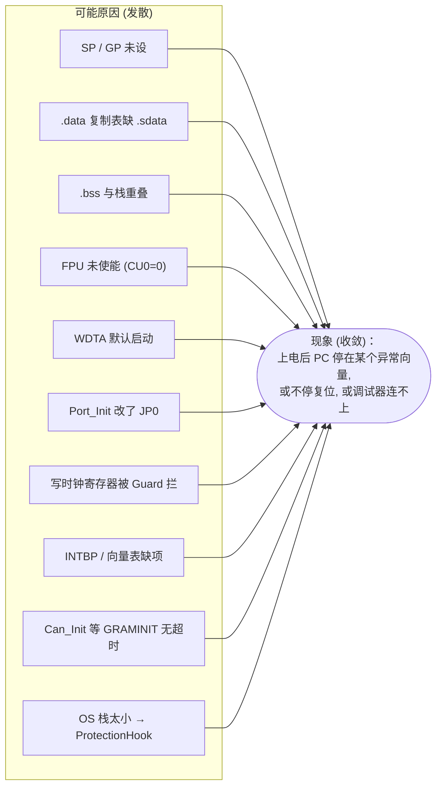
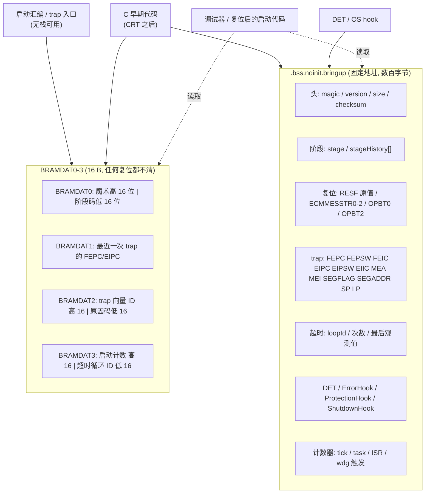
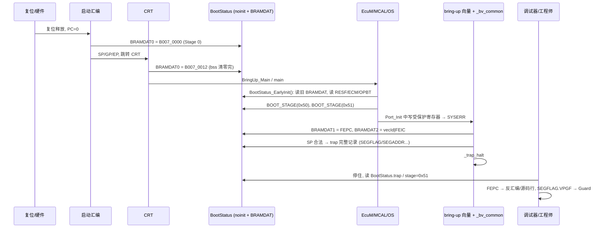

# 增量式上板策略：从“只有一条死循环”到完整 BSW/DCM

> Prerequisite: [01-boot-failure-overview.md](01-boot-failure-overview.md), [02-exception-and-trap-handlers.md](02-exception-and-trap-handlers.md), [03-reset-causes-and-reset-loops.md](03-reset-causes-and-reset-loops.md), [04-debugger-attach-and-recovery.md](04-debugger-attach-and-recovery.md), [05-startup-code-failure-points.md](05-startup-code-failure-points.md)；背景：[RH850 启动过程](../01-rh850/04-startup-process.md)、[ECU 启动流程](../02-autosar-classic/03-ecu-startup.md)
> Next: [07-boot-trap-troubleshooting-playbook.md](07-boot-trap-troubleshooting-playbook.md)
> 对应规范: HW-E = R01UH0585EJ0120 Rev.1.20（PDF 页码）：p.190/p.250（GPR 未定义与 lock-step CAUTION）、p.192–203（FEPC/FEPSW/FEIC/MEA/MEI）、p.197（PSW.CU0/EBV/ID）、p.244–248（SEG：SEGCONT/SEGFLAG/SEGADDR）、p.255–256（RAM 执行与 48 B 预取）、p.281–282（FENMI/FEINT 偏移、SYNCP CAUTION）、p.96/p.99/p.114（PNOTn）、p.421–423（RESF/RESFC）、p.434（复位标志、RAM 初始化、调试器 Reset Mask）、p.1086–1087/p.805/p.807（RS-CANFD self-test、CTME/CTMS）、p.1090（GRAMINIT 3794 pclk）、p.1528–1535（WDTA 启动后不可停、WDTAnMD 只能写一次）、p.2790–2791/p.2799/p.2817（ECM 错误源、ECMMESSTR、看门狗默认 ECM 复位）、p.2853/p.2856（OCD 断点数、调试器连上前已从复位向量执行）、p.2884/p.2886（OPBT0/OPBT2）、p.2890–2891（RAM 初始化、BRAMDAT）。SWS-MCU **R24-11** p.13（start-up code 与看门狗）、p.29–30（`Mcu_GetResetReason`/`Mcu_GetResetRawValue`）。**本仓库没有 Os / EcuM / BswM / Det 的 SWS**：`ErrorHook`/`ProtectionHook`/`ShutdownHook`/`Det_ReportError` 按 R4.x 公认形态描述，需以真实项目所用 release 确认。
> 对应源码: 本项目 [examples/can_irq_demo/startup/](../../examples/can_irq_demo/startup/README.md)（主机可运行的启动阶段模型，含 `BootStage` 与故障注入）；本章 C 代码均为 `[Educational Implementation]` / `[Conceptual]`，**未在目标工具链上编译验证**。

---

## 1. 本章目标

用户最常见的一句话是：

> “flash 之后启动时 ECU 直接进入 trap，我都没办法 debug。”

这句话背后通常有两个问题：

1. **一次加入了太多东西**：启动汇编、CRT、Mcu/Port、OS、Can、NvM、Dcm 全部一起烧进去，任何一处出错都表现为同一个症状——“进 trap 了”。
2. **没有留下证据**：trap handler 是一个默认的 `br .` 死循环，没有记录 FEPC/FEIC，没有记录“死之前走到了哪一步”，复位后 RESF 也没人保存。

本章给出一个**可以照着执行的分阶段上板（bring-up）策略**。读完后你应该能：

1. 把“从复位向量到 DCM 响应”拆成 **9 个阶段（Stage 0–8）**，每个阶段有明确的进入条件、观察点、通过标准和典型失败；
2. 设计并实现一个 **`BootStatus` 观察结构**（noinit RAM + BRAMDAT 双通道），让 ECU 在“死掉”之前把阶段码、复位原因、trap 现场、等待循环超时 ID、DET/OS hook 信息写下来；
3. 用 `BOOT_STAGE(x)` 宏和**带超时的等待循环**，把“卡死”变成“可读的错误记录”；
4. 定义一套 **bring-up 构建开关**（看门狗策略、DET 打开、禁止重配 JP0 等），并知道它和量产构建的差异必须被记录。

本章**不重复**以下内容的深度，只在需要时链接：异常向量与 handler 细节见 [02](02-exception-and-trap-handlers.md)；复位原因解码与复位循环见 [03](03-reset-causes-and-reset-loops.md)；调试器连接与“刷砖”恢复见 [04](04-debugger-attach-and-recovery.md)；启动汇编/CRT 的逐条失败点见 [05](05-startup-code-failure-points.md)。

---

## 2. 为什么需要增量式上板？

### 2.1 “一次全上”的问题：症状收敛，原因发散



十几种完全不同的原因，最后都收敛成“进 trap / 复位 / 连不上”。如果镜像里同时包含所有模块，你只能从症状倒推——这正是“没办法 debug”的根源。

### 2.2 增量式的核心思想

[Conceptual] 增量式上板只做两件事：

1. **每次只增加一个风险源**。上一阶段通过后，下一阶段只引入一个新模块或一个新的硬件资源；失败时，嫌疑范围就是“新加的那一块”。
2. **每一阶段都留下“能活过复位”的证据**。阶段码写在 BRAMDAT（任何复位都不清零，HW-E p.2891），完整记录写在 noinit RAM；复位后第一件事是把这些证据保存好再继续。

这与 [调试手册：22 F1 90 没有响应](../debugging-autosar-diagnostics.md) 的“二分法”是同一种思路：那里是沿着通信链路二分，这里是沿着**启动时间轴**二分。

### 2.3 时间轴上的 9 个阶段


每个箭头都是一个“只新增一件事”的门。下面 §6 逐个展开。

---

## 3. 在系统中的位置

| 本章阶段 | 对应 [RH850 启动过程](../01-rh850/04-startup-process.md) 的阶段 | 负责者 | 本系列中深入讲解的章节 |
|---|---|---|---|
| Stage 0 | 阶段 0（硬件复位）+ 阶段 1 开头（复位入口） | 硬件、启动汇编 | [04 调试器连接](04-debugger-attach-and-recovery.md)、[05 启动代码](05-startup-code-failure-points.md) |
| Stage 1 | 阶段 1（SP/GP/EP）+ 阶段 2（CRT） | 启动汇编、工具链 CRT | [05](05-startup-code-failure-points.md) |
| Stage 2 | 阶段 1 中的 EBASE/INTBP 设置 | 启动汇编 / BSP | [02 异常与 trap handler](02-exception-and-trap-handlers.md) |
| Stage 3–4 | `main()` 之前或刚进入 `main()` 的裸机验证 | bring-up 代码（临时） | 本章 |
| Stage 5 | `EcuM_Init` 中的 DriverInitListOne | EcuM + MCAL | [MCU 驱动](../03-mcal/02-mcu-driver.md)、[Port 驱动](../03-mcal/03-port-driver.md) |
| Stage 6 | `StartOS` → 启动任务 | OS port | [OS Task/ISR](../02-autosar-classic/06-os-task-isr.md) |
| Stage 7 | `EcuM_StartupTwo` / BswM 中的 `Can_Init` | MCAL Can | Part IV CAN 章节 |
| Stage 8 | BswM 规则、`NvM_ReadAll`、`Rte_Start`、通信启动 | BSW、RTE | [ECU 启动流程](../02-autosar-classic/03-ecu-startup.md)、[诊断调试手册](../debugging-autosar-diagnostics.md) |

> [Real Project Consideration] Stage 3、Stage 4 的“裸机 GPIO / 裸机 OSTM”代码**只存在于 bring-up 构建**。在真实 RTA-CAR 工程里，它们通常放在一个可通过编译开关整体移除的集成文件中（例如项目自己的 `BringUp_*.c`），不能混进 MCAL 或生成代码目录。

---

## 4. AUTOSAR 和硬件对“启动早期”说了什么

### 4.1 AUTOSAR：start-up code 不属于任何 BSW 模块

[AUTOSAR Standard] SWS-MCU R24-11 p.13–14 把复位后到 `Mcu_Init` 之前的工作定义为 **start-up code** 的职责，并给出指导：向量基址、栈指针、最少量 RAM 初始化，以及“the MCU internal watchdog shall not be serviced until the watchdog is initialized from the MCAL watchdog driver”（p.13）。

这意味着：

- **Stage 0–2 在 AUTOSAR 里没有任何模块负责**。没有 DET、没有 Dem、没有 OS hook 能帮你。你必须自己留证据。
- DET 从 `Det_Init` 之后才有用（通常在 DriverInitListZero，见 [ECU 启动流程 §6.3](../02-autosar-classic/03-ecu-startup.md)）。
- OS hook（`ErrorHook`、`ProtectionHook`、`ShutdownHook`）只在 `StartOS` 之后才可能被调用。

### 4.2 硬件：复位后哪些证据会被保留

[RH850 Hardware] 设计观察结构前，必须先知道“什么东西能活过复位”：

| 存储位置 | 复位后是否保留 | 依据 | 对 bring-up 的意义 |
|---|---|---|---|
| **BRAMDAT0–3**（`FFC0_A000H + 4n`，32 位访问） | “not initialized by any reset” | HW-E p.2891 | 最可靠的跨复位通道，但只有 16 字节。**断电再上电后内容是否保持未在 HW-E 中找到明确说明——需确认**；因此必须带魔术字校验 |
| Local RAM（含 noinit 段） | Power On Reset **总是清零**；System Reset 1（仅 Pin reset）、System Reset 2、Application Reset 1 可通过 STAC_LM0 关闭清零 | HW-E p.434、p.2890 | noinit 只在“配置了 STAC 不清零”的复位类型下才真正保留 |
| Global RAM / DTS / CSIH RAM | 仅 Application Reset 1 可关闭清零 | HW-E p.434 | 不建议放 bring-up 记录 |
| RESF | 标志累积；PRESF0 只能由 CVM reset 或软件清；SRESF0 等仅软件清 | HW-E p.421–422、p.434 | 每次启动尽早读取保存，再按策略清除 |
| ECMMESSTR0–2（`FFD6_0008H` 起） | ECM Master/Checker Error Source 只被 Power On Reset 初始化，其他复位类别下保持 | HW-E p.419 Table 8.2、p.2799 | 区分“看门狗”与“其他 ECM 错误”；ECM 复位后仍可读 |
| FEPC/FEPSW/FEIC、MEA/MEI | 复位后未定义 / 0 | HW-E p.195–203 | **只在 trap 发生当时有效**——必须在 handler 里立刻抄下来 |
| SEGFLAG/SEGADDR（`FFFE_E982H`/`FFFE_E988H`） | SEGFLAG 不会自动清除（写 0 清除）；SEGADDR 复位值未定义 | HW-E p.244、p.247–248 | SYSERR 的“第二现场” |

一个关键结论：**RESF 能告诉你“复位了”，BRAMDAT 能告诉你“死在哪一阶段”，trap 记录能告诉你“死在哪条指令”。三者缺一不可。**

### 4.3 调试器本身会改变现场

[RH850 Hardware] 设计 bring-up 流程时要记住两条 OCD 事实：

1. “When using a debugger, be aware that the execution will be started form the reset vector before preparation for communication between the OCD emulator and the microcomputer completes.”（HW-E p.2856）——**调试器还没连好，代码已经在跑了**。如果镜像在几十微秒内就把 JP0 改成 GPIO 或触发复位循环，调试器可能永远连不上。Stage 0 的“只有死循环”镜像就是用来排除这一点的。
2. “In debug mode, System Resets 1 and 2 and Application Reset 1 can be masked by debugger setting.”（HW-E p.434，Table 8.15：Pin reset、ECM reset、SWSRESA0/SWARESA0 软件复位）——**连着调试器时，看门狗（经 ECM）复位和软件复位都可能被屏蔽**。这就是“接调试器正常、脱机就重启”的经典来源之一（详见 [07 playbook](07-boot-trap-troubleshooting-playbook.md) 案例 B）。TRACE32 中该屏蔽是否默认打开、由哪个选项控制，**需以所装版本手册确认**。

另外，OCD 提供 12 个片上断点，其中 4 个可做访问断点（HW-E p.2853）；手册对软件断点的描述是“on the user programs stored in the RAM”（p.2853）。因此在 Flash 里打断点时，要清楚调试器使用的是哪种断点资源（TRACE32 对 Flash 断点的具体实现**需确认**），bring-up 阶段尽量少用、用完即删。

---

## 5. 核心数据结构：BootStatus 观察结构

### 5.1 设计目标

| 目标 | 设计决策 |
|---|---|
| trap 发生在 CRT 之前也能留下证据 | 双通道：**BRAMDAT（4 个字）+ noinit RAM（完整记录）**；汇编阶段只写 BRAMDAT |
| 复位后能判断记录是否可信 | 魔术字 + 版本 + 大小 + 校验；POR 后 noinit 一定无效（硬件清零，p.2890） |
| 不依赖栈和 C runtime 也能写 | 字段都是 32 位对齐的普通 store；trap 入口用汇编写 BRAMDAT |
| 调试器一眼能读懂 | 固定地址（链接到 noinit 区的固定偏移）、固定布局、版本号；配合 TRACE32 `Var.View` 或 MULTI 变量窗口 |
| 能同时容纳“阶段、复位、trap、超时、DET、OS hook、计数器” | 分区布局，见 §5.3 |
| 量产可整体关闭 | 全部由 `BRINGUP_ENABLE` 控制；量产构建只保留最小的复位原因记录（项目决定） |

### 5.2 两个通道的分工



为什么不只用 noinit？因为 **Power On Reset 总会清零 Local RAM**（HW-E p.2890），而“上电就进 trap”恰恰发生在 POR 路径上；如果 trap handler 最后触发了复位（量产行为），noinit 可能被清。BRAMDAT 不受任何复位影响，但只有 16 字节，所以只放“最关键的 4 个数”。

### 5.3 [Educational Implementation] 结构定义

> **[Educational Implementation] 声明**：以下代码用于说明“应该记录什么、按什么规则记录”。段名、pragma、寄存器访问宏都是示意，**未在 GHS 上编译验证**；寄存器地址来自 HW-E 并在注释中给出页码。真实项目请改用工程已有的寄存器头文件和 MemMap 机制（见 [MemMap 速查](../reference/p1me-memory-layout-ghs-memmap.md) §4）。

```c
/* ===================================================================
 * BootStatus.h  —— [Educational Implementation] bring-up 观察结构
 * 目标: RH850/P1M-E (R7F701381), GHS 风格; 非 production code
 * =================================================================== */
#ifndef BOOTSTATUS_H
#define BOOTSTATUS_H

#include "Std_Types.h"

#define BRINGUP_ENABLE              1u      /* 量产构建置 0, 见 §6.10 */

#define BOOTSTATUS_MAGIC            0xB0075747u   /* 任意选取的 32 位魔术字 */
#define BOOTSTATUS_VERSION          0x0003u       /* 布局改变就 +1 */
#define BOOT_BRAM_MAGIC_HI          0xB0070000u   /* BRAMDAT0 高 16 位 */

/* ---- RH850/P1M-E 寄存器地址 (HW-E 页码) ---- */
#define REG32(a)                    (*(volatile uint32 *)(a))
#define REG16(a)                    (*(volatile uint16 *)(a))
#define BRAMDAT(n)                  REG32(0xFFC0A000u + ((n) * 4u)) /* p.2891, 32 位访问 */
#define RESF_ADDR                   0xFFF81000u   /* p.421, 32 位只读 */
#define RESFC_ADDR                  0xFFF81008u   /* p.423, 32 位只写, 写 1 清对应位 */
#define ECMMESSTR0_ADDR             0xFFD60008u   /* p.2799, ECM master error source status 0 */
#define ECMMESSTR1_ADDR             0xFFD6000Cu   /* p.2799 */
#define ECMMESSTR2_ADDR             0xFFD60010u   /* p.2799 */
#define OPBT0_ADDR                  0xFFCD0030u   /* p.2884, 只读映射 */
#define OPBT2_ADDR                  0xFFCD0038u   /* p.2886, 只读映射 */
#define SEGFLAG_ADDR                0xFFFEE982u   /* p.244: SEG base FFFE_E980H + 02H, 16 位 */
#define SEGADDR_ADDR                0xFFFEE988u   /* p.244: + 08H, 32 位 */

/* ---- 阶段码: 高 4 位 = Stage 号, 低 4 位 = 子步骤 ---- */
typedef enum {
    BOOT_ST_RESET_ENTRY      = 0x00u,  /* 复位向量第一条指令之后 (汇编写 BRAMDAT) */
    BOOT_ST_GPR_DONE         = 0x01u,
    BOOT_ST_SP_GP_EP_DONE    = 0x02u,
    BOOT_ST_CRT_BEGIN        = 0x10u,
    BOOT_ST_DATA_COPIED      = 0x11u,
    BOOT_ST_BSS_CLEARED      = 0x12u,
    BOOT_ST_CRT_VERIFIED     = 0x13u,
    BOOT_ST_TRAP_READY       = 0x20u,  /* EBASE/EBV 已指向 bring-up 向量 */
    BOOT_ST_RECORD_READY     = 0x21u,  /* BootStatus 已校验/重建 */
    BOOT_ST_GPIO_READY       = 0x30u,
    BOOT_ST_OSTM_POLL_OK     = 0x40u,
    BOOT_ST_OSTM_IRQ_OK      = 0x41u,
    BOOT_ST_MCU_INIT_DONE    = 0x50u,
    BOOT_ST_PORT_INIT_DONE   = 0x51u,
    BOOT_ST_DRVLIST1_DONE    = 0x5Fu,
    BOOT_ST_STARTOS_CALLED   = 0x60u,
    BOOT_ST_STARTUPHOOK      = 0x61u,
    BOOT_ST_FIRST_TASK       = 0x62u,
    BOOT_ST_CAN_INIT_BEGIN   = 0x70u,
    BOOT_ST_CAN_INIT_DONE    = 0x71u,
    BOOT_ST_CAN_LOOPBACK_OK  = 0x72u,
    BOOT_ST_STARTUPTWO       = 0x80u,
    BOOT_ST_NVM_READALL_DONE = 0x81u,
    BOOT_ST_RTE_STARTED      = 0x82u,
    BOOT_ST_RUN              = 0x8Fu
} BootStageType;

/* ---- 等待循环 ID: 每个 "while (!cond)" 都必须有一个 ---- */
typedef enum {
    BOOT_LOOP_NONE              = 0x0000u,
    BOOT_LOOP_OSTM_STOP         = 0x0101u,  /* 等 OSTMnTE.bit0 = 0 */
    BOOT_LOOP_OSTM_FIRST_TICK   = 0x0102u,
    BOOT_LOOP_MCU_PLL           = 0x0201u,  /* P1M-E 上本不应存在, 见 §8 */
    BOOT_LOOP_CAN_GRAMINIT      = 0x0301u,  /* 等 GSTS.GRAMINIT = 0, p.1090 */
    BOOT_LOOP_CAN_GLOBAL_RESET  = 0x0302u,
    BOOT_LOOP_CAN_GLOBAL_OPER   = 0x0303u,
    BOOT_LOOP_CAN_CH_HALT       = 0x0304u,
    BOOT_LOOP_CAN_LOOPBACK_RX   = 0x0305u,
    BOOT_LOOP_NVM_READALL       = 0x0401u,
    BOOT_LOOP_CAN_STARTED       = 0x0501u
} BootLoopIdType;

/* ---- trap 记录: 既保存 FE 级也保存 EI 级寄存器 ----
 * 各异常属于 FE 级还是 EI 级、具体向量偏移, 以 RH850G3M Software 手册为准 (需确认);
 * 因此 handler 一律两组都抄, 用 vectorId 区分. */
typedef struct {
    uint32 valid;          /* 0x7A7A7A7A = 有效 */
    uint32 vectorId;       /* bring-up 向量表给每个入口的编号 (见 §6.3) */
    uint32 stageAtTrap;    /* trap 时的阶段码 */
    uint32 fepc, fepsw, feic;     /* SR2,0 / SR3,0 / SR14,0 (p.192) */
    uint32 eipc, eipsw, eiic;     /* EI 级对应寄存器 (p.193-199) */
    uint32 mea, mei;              /* SR6,2 / SR8,2: MAE/MPU 违规地址与信息 (p.202-203) */
    uint32 segflag, segaddr;      /* SYSERR 补充信息 (p.247-248) */
    uint32 sp, lp;                /* r3 / r31 现场 */
    uint32 count;                 /* 本次上电以来 trap 次数 */
} BootTrapRecordType;

typedef struct {
    /* --- 头 --- */
    uint32 magic;
    uint16 version;
    uint16 size;
    uint32 bootCount;            /* 每次启动 +1 (POR 后从 1 开始) */
    /* --- 阶段 --- */
    uint32 stage;                /* 当前阶段码 */
    uint32 prevStage;            /* 上一次启动死前的阶段码 (从 BRAMDAT0 恢复) */
    uint8  stageHistory[16];     /* 环形记录, 便于看“走过哪些步” */
    uint32 stageHistoryIdx;
    /* --- 复位快照 (本次启动最早读到的值) --- */
    uint32 resfRaw;              /* RESF 原值, 读后再按策略清 */
    uint32 ecmMesstr[3];         /* ECMMESSTR0-2 */
    uint32 opbt0, opbt2;         /* 选项字节: WDTA 启动方式 / 调试接口 */
    uint32 prevBram[4];          /* 本次启动读到的 BRAMDAT0-3 原值 */
    /* --- trap --- */
    BootTrapRecordType trap;
    /* --- 等待超时 --- */
    uint32 timeoutLoopId;        /* 最后一个超时的循环 ID */
    uint32 timeoutCount;
    uint32 timeoutLastValue;     /* 超时时被等待寄存器的读值 */
    /* --- DET / OS hook --- */
    uint16 detModuleId;  uint8 detInstanceId;  uint8 detApiId;
    uint8  detErrorId;   uint8 detPad[3];
    uint32 detCount;
    uint32 osErrorLast;   uint32 osErrorServiceId;  uint32 osErrorCount;
    uint32 protectionLast; uint32 protectionCount;
    uint32 shutdownLast;
    /* --- 运行计数器 --- */
    uint32 ostmPollTicks;
    uint32 osTickIsrCount;
    uint32 bringupTaskCount;
    uint32 wdgTriggerCount;
    uint32 canLoopbackRx;
    /* --- 尾 --- */
    uint32 checksum;             /* 头 + 关键字段的简单和校验 */
} BootStatusType;

extern BootStatusType BootStatus;   /* 位于 .bss.noinit.bringup */

#endif
```

字段选择的理由：

| 字段 | 回答的问题 | 为什么不能省 |
|---|---|---|
| `stage` / `prevStage` | 死在哪个阶段？上一次死在哪？ | “进 trap”本身没有位置信息 |
| `stageHistory[]` | 实际走过的顺序是什么？ | 你以为的 init 顺序和实际顺序常常不一样（[ECU 启动流程 §11](../02-autosar-classic/03-ecu-startup.md) 的技巧） |
| `resfRaw` | 这次启动是因为什么复位？ | Mcu_Init 或调试器可能清除/改变 RESF（[RH850 启动过程 §6.3](../01-rh850/04-startup-process.md)） |
| `ecmMesstr[]` | ECM 复位到底是哪个错误源？ | 看门狗默认表现为 ARESF2（ECM application reset），必须再看错误源 0 才能确认是 WDTA（HW-E p.2790、p.2817） |
| `opbt0` / `opbt2` | 板上实际 option bytes 是什么？ | 开发板与量产板可能不同；不能从工程默认值推断（HW-E p.2884、p.2886） |
| `trap.*` | 死在哪条指令、什么原因、访问了什么地址？ | FEPC/FEIC/MEA 只在 trap 当时有效 |
| `timeoutLoopId` | 哪个等待循环没等到？ | 把“卡死”变成“可读错误” |
| `det*` / `os*` | 哪个模块报了什么错？ | 第一个 DET 往往就是根因（[诊断调试手册 §2.2](../debugging-autosar-diagnostics.md)） |
| 计数器 | 中断/任务/喂狗真的发生了吗？ | “函数被调用”不等于“硬件事件真的发生” |

### 5.4 [Educational Implementation] 校验与重建

```c
/* BootStatus.c —— [Educational Implementation] 非 production code */
#include "BootStatus.h"

/* [Conceptual] GHS pragma 写法需按 GHS 手册确认; 链接脚本必须把该段放进 NOCLEAR 区 */
#pragma ghs section bss=".bss.noinit.bringup"
BootStatusType BootStatus;
#pragma ghs section bss=default

static uint32 BootStatus_Sum(const BootStatusType *s)
{
    /* 简单和校验: 只覆盖头部, 避免每次写字段都要重算 */
    return s->magic + (uint32)s->version + (uint32)s->size + s->bootCount;
}

/* 在 CRT 完成之后、任何业务代码之前调用 (Stage 2) */
void BootStatus_EarlyInit(void)
{
    uint32 i;
    uint32 bram[4];
    uint32 bootCount;
    boolean recordValid;

    for (i = 0u; i < 4u; i++) {
        bram[i] = BRAMDAT(i);                 /* 先读, 再决定是否覆盖 */
    }

    recordValid = (BootStatus.magic   == BOOTSTATUS_MAGIC)   &&
                  (BootStatus.version == BOOTSTATUS_VERSION) &&
                  (BootStatus.size    == (uint16)sizeof(BootStatusType)) &&
                  (BootStatus.checksum == BootStatus_Sum(&BootStatus));

    bootCount = recordValid ? (BootStatus.bootCount + 1u) : 1u;

    if (!recordValid) {
        /* POR 后 Local RAM 被硬件清零 (p.2890) → magic 必然不匹配 → 重建 */
        uint8 *p = (uint8 *)&BootStatus;
        for (i = 0u; i < sizeof(BootStatusType); i++) { p[i] = 0u; }
        /* 注意: 上一次的 trap 记录随之丢失, 只能从 BRAMDAT 恢复摘要 */
    }

    BootStatus.magic     = BOOTSTATUS_MAGIC;
    BootStatus.version   = BOOTSTATUS_VERSION;
    BootStatus.size      = (uint16)sizeof(BootStatusType);
    BootStatus.bootCount = bootCount;
    BootStatus.checksum  = BootStatus_Sum(&BootStatus);

    for (i = 0u; i < 4u; i++) { BootStatus.prevBram[i] = bram[i]; }
    BootStatus.prevStage = ((bram[0] & 0xFFFF0000u) == BOOT_BRAM_MAGIC_HI)
                         ? (bram[0] & 0x0000FFFFu) : 0xFFFFFFFFu;  /* 0xFFFFFFFF = 未知 */

    /* 复位快照: RESF 可能已在汇编阶段先读入 BRAMDAT/寄存器, 这里以最早值为准 */
    BootStatus.resfRaw      = REG32(RESF_ADDR);
    BootStatus.ecmMesstr[0] = REG32(ECMMESSTR0_ADDR);
    BootStatus.ecmMesstr[1] = REG32(ECMMESSTR1_ADDR);
    BootStatus.ecmMesstr[2] = REG32(ECMMESSTR2_ADDR);
    BootStatus.opbt0        = REG32(OPBT0_ADDR);
    BootStatus.opbt2        = REG32(OPBT2_ADDR);

    /* BRAMDAT3 高 16 位 = 启动计数 (截断) */
    BRAMDAT(3) = (bootCount << 16) | (bram[3] & 0x0000FFFFu);
}
```

几个容易出错的地方：

- **先读 BRAMDAT，再写**。否则你会用这次的阶段码覆盖上次的“死亡现场”。
- **RESF 的清除策略要和 Mcu 驱动协调**。如果 MCAL 的 `Mcu_Init` 自己会读并清 RESF，你在这里清了，`Mcu_GetResetReason()` 就拿不到了（[MCU 驱动](../03-mcal/02-mcu-driver.md) 与 SWS-MCU p.29–30）。bring-up 构建中建议：**这里只读不清**，由 Mcu/EcuM 或项目指定的唯一位置清除——这个位置需在真实项目中确认。
- **ECMMESSTR 的清除需要 ECM 保护序列**（ECMMECLR + ECMMPCMD0，HW-E p.2795、p.2799），bring-up 阶段不要随手清，交给 [03 复位原因](03-reset-causes-and-reset-loops.md) 描述的统一流程。
- noinit 区校验失败时**不要“部分信任”**。要么全部可信，要么全部重建。

### 5.5 BOOT_STAGE 宏

```c
/* [Educational Implementation] */
#if (BRINGUP_ENABLE == 1u)

/* 可选: 每进入一个阶段翻转一次调试 GPIO (Stage 3 之后才可用) */
extern volatile uint8 BootStatus_GpioReady;
void BootStatus_StagePinPulse(uint32 stage);

#define BOOT_STAGE(s)                                                         \
    do {                                                                      \
        BootStatus.stage = (uint32)(s);                                       \
        BootStatus.stageHistory[BootStatus.stageHistoryIdx & 0x0Fu] = (uint8)(s); \
        BootStatus.stageHistoryIdx++;                                         \
        BRAMDAT(0) = BOOT_BRAM_MAGIC_HI | ((uint32)(s) & 0xFFFFu);            \
        if (BootStatus_GpioReady != 0u) { BootStatus_StagePinPulse((uint32)(s)); } \
    } while (0)

#else
#define BOOT_STAGE(s)   do { } while (0)
#endif
```

设计说明：

| 选择 | 原因 |
|---|---|
| 同时写 noinit 和 BRAMDAT0 | BRAMDAT0 活过 POR 以外的任何复位（p.2891），noinit 保存历史 |
| BRAMDAT0 带魔术高位 | 断电后 BRAMDAT 内容不可信（需确认），魔术字能区分“真实阶段码”和“随机值” |
| `stageHistory` 只记 8 位 | 阶段码设计为 8 位以内，节省空间；16 项环形缓冲足以看出顺序 |
| GPIO 脉冲可选 | 示波器/逻辑分析仪可以在**脱机**（不接调试器）时看到阶段推进；见 Stage 3 |
| 宏而非函数 | 在 CRT 刚完成、栈还很浅时调用，开销最小；也便于整体编译掉 |

> [Conceptual] 在 Stage 0–1（CRT 之前）不能使用 `BootStatus`（noinit 区虽然可写，但 C 变量地址计算依赖 GP/EP 等是否已设置，见 [05](05-startup-code-failure-points.md)）。汇编阶段用 §6.1 的 `BOOT_STAGE_ASM` 直接写 BRAMDAT0。

### 5.6 带超时的等待循环

**规则：bring-up 构建中，任何 `while (!条件)` 都必须有超时，并在超时时记录循环 ID。** 无界等待是“卡死且没有证据”的头号来源（例如 openAUTOSAR 的 PLL 等待循环，见 [ECU 启动流程 §6.3](../02-autosar-classic/03-ecu-startup.md)）。

```c
/* [Educational Implementation] */
static inline boolean Boot_WaitTimedOut(uint32 loopId, uint32 lastValue)
{
    BootStatus.timeoutLoopId    = loopId;
    BootStatus.timeoutLastValue = lastValue;
    BootStatus.timeoutCount++;
    BRAMDAT(3) = (BRAMDAT(3) & 0xFFFF0000u) | (loopId & 0xFFFFu);
    return TRUE;
}

/* 用法: 循环次数上限在 OSTM 可用前只能按“指令数”估算 (CPU 160 MHz, HW-E p.469),
 * 必须留足余量; OSTM 可用后改为基于计数差值的时间上限. */
#define BOOT_WAIT_UNTIL(cond, readExpr, loopId, maxIter, timedOutFlag)        \
    do {                                                                      \
        uint32 _n = 0u;                                                       \
        (timedOutFlag) = FALSE;                                               \
        while (!(cond)) {                                                     \
            if (++_n >= (maxIter)) {                                          \
                (timedOutFlag) = Boot_WaitTimedOut((loopId), (uint32)(readExpr)); \
                break;                                                        \
            }                                                                 \
        }                                                                     \
    } while (0)
```

使用示例（Can 初始化中等 GRAMINIT，HW-E p.1090：初始化需要 3794 个 pclk）：

```c
/* [Educational Implementation] —— 真实 MCAL 的 Can_Init 内部不应由你修改;
 * 这里演示的是 bring-up 裸机测试或集成层“前置检查”的写法 */
boolean to;
BOOT_WAIT_UNTIL( (CAN_GSTS() & CAN_GSTS_GRAMINIT) == 0u,
                 CAN_GSTS(), BOOT_LOOP_CAN_GRAMINIT, 100000u, to );
if (to) {
    /* 不要继续配置 RS-CANFD: GRAMINIT=1 时写入的配置无效 (见 MemMap 速查 §3) */
    BOOT_STAGE(BOOT_ST_CAN_INIT_BEGIN);   /* 停在本阶段, 让记录清楚指向这里 */
    Boot_Halt();                           /* bring-up: 停住等调试器; 量产: 走降级路径 */
}
```

`CAN_GSTS()`、`CAN_GSTS_GRAMINIT` 是示意宏，GSTS 的实际地址和位号按 HW-E §17 与 Classical/FD 接口模式确认（两种模式寄存器偏移不同，见写作约定 §2）。

> [Real Project Consideration] 你**不能**也不应该去改 Renesas MCAL 的 `Can_Init` 内部循环。对供应商代码的做法是：①查它的循环是否已有超时（很多 MCAL 有 `CanTimeoutDuration` 或类似参数，具体需查 MCAL 用户手册）；②在它前后放 `BOOT_STAGE`；③必要时在 bring-up 构建中先用自己的“前置检查”确认硬件条件（如 GRAMINIT 已为 0），再调用 MCAL。

### 5.7 DET / OS hook 的路由

[Conceptual] 下面是“把错误汇入同一个记录”的做法。API 形态按 R4.x 公认形态（**本仓库无 Det/Os SWS**，签名需以项目 release 与 RTA-OS 文档确认）：

```c
/* [Educational Implementation] —— DET 回调: 很多 DET 实现提供“错误钩子/callout”配置项,
 * 名称因供应商而异 (需确认). 若没有, 可在 bring-up 构建中对 Det_ReportError 下断点. */
void BringUp_DetHook(uint16 ModuleId, uint8 InstanceId, uint8 ApiId, uint8 ErrorId)
{
    if (BootStatus.detCount == 0u) {          /* 只保留第一个: 第一个往往是根因 */
        BootStatus.detModuleId   = ModuleId;
        BootStatus.detInstanceId = InstanceId;
        BootStatus.detApiId      = ApiId;
        BootStatus.detErrorId    = ErrorId;
    }
    BootStatus.detCount++;
}

/* OS hooks: 名称为 AUTOSAR OS 公认形态; RTA-OS 中是否需额外使能、在哪个上下文调用,
 * 以 RTA-OS 用户手册/端口文档为准 (需确认) */
void ErrorHook(StatusType Error)
{
    BootStatus.osErrorLast = (uint32)Error;
    /* OSErrorGetServiceId() 等宏是否可用取决于 OS 配置 (需确认) */
    BootStatus.osErrorCount++;
}

ProtectionReturnType ProtectionHook(StatusType FatalError)
{
    BootStatus.protectionLast = (uint32)FatalError;
    BootStatus.protectionCount++;
    BRAMDAT(2) = (0x5052u << 16) | ((uint32)FatalError & 0xFFFFu);   /* 'PR' 标记 */
#if (BRINGUP_ENABLE == 1u)
    Boot_Halt();                 /* bring-up: 停住看现场 (栈溢出/MPU/时间保护) */
#endif
    return PRO_SHUTDOWN;         /* 量产策略由 safety 概念决定 */
}

void ShutdownHook(StatusType Error)
{
    BootStatus.shutdownLast = (uint32)Error;
    BOOT_STAGE(BootStatus.stage | 0x0Eu);   /* 在当前阶段上标记 "shutdown" */
#if (BRINGUP_ENABLE == 1u)
    Boot_Halt();
#endif
}
```

要点：

- **只记第一个 DET**，后续只计数。级联错误（一个模块未初始化导致后面几十个 `*_E_UNINIT`）会淹没根因。
- ProtectionHook 在 bring-up 中**停住**而不是复位：复位会把现场冲掉，而 OS 栈溢出/MPU 违规正是需要看 SP、MEA 的时候。
- 这些 hook 里**不要调用复杂 BSW**，只写内存。它们可能在 OS 内部错误状态下被调用。
- `Boot_Halt()` 是 bring-up 专用的“停住”函数：关中断后进入一个带固定标签的死循环（与 `_trap_halt` 同理），让调试器 attach 时现场仍在。量产构建中它不存在。

---

## 6. 初始化流程：Stage 0–8 逐阶段展开

总表（每阶段的详细说明在后面小节）：

| Stage | 新增的唯一风险源 | 进入条件 | 观察什么 | 通过标准 | 典型失败 |
|---|---|---|---|---|---|
| 0 | 复位入口 + 调试器连接 | 板子供电正常、OPBT0/OPBT2 已读出 | PC、单步、OPBT0/2、RESF | 调试器能在复位向量停住并单步到死循环标签；脱机上电后重连仍停在死循环 | 连不上（OPJTAG、FLMD0、电源）；PC 不在 0 |
| 1 | SP/GP/EP + CRT | Stage 0 通过 | 非零初值变量、BSS 变量、SP 范围 | **冷启动**后读回值正确（不能靠调试器下载 RAM） | 初值为 0（复制表缺段）；BSS 非零；返回 0 地址 |
| 2 | 向量表 + trap 记录 | Stage 1 通过 | 人为触发 trap 后的记录 | 每类人为 trap 都能在记录中看到正确 vectorId/FEPC | 向量未对齐；handler 用栈导致二次 trap |
| 3 | 一个 GPIO（最小 Port/Dio） | Stage 2 通过 | 示波器/LED | 脱机上电后能看到固定节奏翻转与阶段脉冲 | 引脚选错；误配 JP0；PMC/PM 顺序 |
| 4 | OSTM（先轮询后中断） | Stage 3 通过 | 计数器、心跳周期（外部测量） | 周期与 80 MHz 计算一致；中断计数稳定 | TE=1 时写 CTL；EIC/INTBP 错；循环验证 |
| 5 | 完整 Mcu_Init / Port_Init | Stage 4 通过 | RESF 是否被清、Port 读回、DET | 阶段码到 0x5F，无 DET，JP0 不变，调试器不掉线 | Port 配了 JP0；Guard 拦截；PLL 等待 |
| 6 | StartOS + 1 个任务 | Stage 5 通过 | OS tick 计数、任务计数、hook 记录 | 任务周期运行 ≥ 60 s，无 hook 记录 | 向量表初始化缺失；栈太小；EI 时机 |
| 7 | Can_Init + self-test | Stage 6 通过 | GRAMINIT/模式超时 ID、回环接收计数 | 内部回环收发 N 帧计数一致 | GRAMINIT/模式等待超时；接口模式与寄存器偏移不一致 |
| 8 | 完整 BSW/NvM/DCM | Stage 7 通过 | 阶段 0x80–0x8F、DET、ReadAll 时间 | 阶段码到 RUN；`22 F1 90` 等项目真实服务可响应 | ReadAll 等待；看门狗超时；DCM 无 Full Com |

### 6.1 Stage 0：最小镜像——复位向量 → 已知标签的死循环

**目的**：在加入任何软件逻辑之前，证明“工具链 + 烧录 + 调试器 + 复位入口”这条链是通的。

**镜像内容**（只有几条指令）：

```asm
;--------------------------------------------------------------------
; [Conceptual] Stage 0 bring-up 镜像 —— GHS 风格伪汇编, 非 production
; 段名 .reset 需由链接脚本放到 0x0000_0000 (RBASE 初值, HW-E p.258)
;--------------------------------------------------------------------
        .section ".reset", .text
_RESET:
        jr      _stage0_entry          ; 复位入口只放跳转

        .section ".text", .text
_stage0_entry:
        ; 1) 给全部 GPR 确定值: lock-step 芯片读未定义寄存器后写到 PE 外部
        ;    可能产生比较错误 (HW-E p.250 CAUTION)
        mov     r0, r1
        mov     r0, r2
        ; ... r3 - r31 同样处理 (省略)

        ; 2) BOOT_STAGE_ASM(0x00): BRAMDAT0 = 0xB007_0000 (HW-E p.2891)
        movhi   0xFFC1, r0, r10        ; r10 = 0xFFC1_0000 (示意, 地址拼装方式按 GHS 汇编器确认)
        movea   -0x6000, r10, r10      ; r10 = 0xFFC0_A000 = BRAMDAT0
        movhi   0xB007, r0, r11        ; r11 = 0xB007_0000
        st.w    r11, 0[r10]

_stage0_alive:                          ; ← 调试器里要能看到的“已知标签”
        br      _stage0_alive
```

**进入条件**：

- 用编程器/调试器**读出 OPBT0（`FFCD_0030H`）与 OPBT2（`FFCD_0038H`）**并记录（HW-E p.2884、p.2886）。OPBT2.OPJTAG[1:0] 必须与所用调试接口一致（00=GPIO、01=LPD 4-pin、11=Nexus JTAG、10 禁止，HW-E p.2886）；OPBT0.OPWDRUN 决定 WDTA0 是否上电即运行。
- 若 OPWDRUN=1，Stage 0 的死循环**会在 WDTA 溢出时被复位**（WDTA 启动后不可停止，HW-E p.1528–1529）。bring-up 板应先把 option bytes 设为软件触发启动（见 §6.10），或者接受 Stage 0 中会周期复位、并据此反推溢出时间。

**观察什么**：

1. 调试器“复位并停住”（TRACE32 典型是 `SYStem.Up` 一类连接方式，具体命令与选项**以所装版本手册确认**）后，PC = `0000_0000`，PSW = `0x0000_0020`（HW-E p.197）。
2. 单步：`jr` → `_stage0_entry` → 一条条 `mov` → 写 BRAMDAT0 → `_stage0_alive`。在内存窗口确认 `FFC0_A000` = `B007_0000`。
3. 断开调试器、**断电再上电**、不经复位重新 attach（“热连接”方式名因工具而异，需确认），PC 应在 `_stage0_alive`。
4. 读 RESF（`FFF8_1000H`），记录调试器复位和真实上电分别置哪些位（Debugger Initiated Reset 会置 PRESF0 与 SRESF0，HW-E p.421–422、p.434）。

**通过标准**：上面 4 项全部成立；并且你知道“调试器复位”与“真实上电”在 RESF 上的区别。

**典型失败**：

| 现象 | 可能原因 | 去哪里看 |
|---|---|---|
| 连空片都连不上 | 供电、复位电路、OPJTAG 与接口不匹配、FLMD0 电平（FLMD0=1 且 FLMD1=0 进入串行编程模式，HW-E p.261） | [04 调试器连接与恢复](04-debugger-attach-and-recovery.md) |
| 复位后 PC 不是 0 | 有 bootloader 或可变复位向量（HW-E p.2860、p.2865） | [RH850 启动过程 §5.2](../01-rh850/04-startup-process.md) |
| 单步到第一条 `st.w` 就 FENMI | GPR 未初始化前发生了对外写 → DCLS 比较错误（ECM 错误源 1，HW-E p.2790） | [05 启动代码失败点](05-startup-code-failure-points.md) |
| 死循环里过一段时间就复位 | OPWDRUN=1 | [03 复位原因](03-reset-causes-and-reset-loops.md) |

### 6.2 Stage 1：C runtime——读回一个非零初值变量和一个 BSS 变量

**新增**：SP/GP/TP/EP 设置、`.data` 复制、`.bss` 清零、跳到 C 函数 `BringUp_Main()`（还不是 AUTOSAR 的 `main → EcuM_Init`）。

```c
/* [Educational Implementation] Stage 1 探针 */
volatile uint32 BringUp_DataProbe = 0xC0DE1234u;   /* .data: 有非零初值 */
volatile uint32 BringUp_BssProbe;                  /* .bss: 应为 0      */
volatile uint32 BringUp_SdaProbe = 0x5DA05DA0u;    /* 若工程使用 SDA: 放进 .sdata 的探针 (需按编译选项确认) */

void BringUp_Main(void)
{
    /* 此时 BootStatus 尚未校验 (Stage 2 才做), 只直接写 BRAMDAT0 */
    BRAMDAT(0) = BOOT_BRAM_MAGIC_HI | (uint32)BOOT_ST_CRT_VERIFIED;
    for (;;) {
        /* 在这里停住读探针 */
    }
}
```

**观察什么**：

- `BringUp_DataProbe == 0xC0DE1234`、`BringUp_SdaProbe == 0x5DA05DA0`、`BringUp_BssProbe == 0`；
- SP（r3）在 map 文件中栈段范围内、按 ABI 对齐；GP（r4）/EP（r30）等于链接器给出的符号值（[MemMap 速查 §5](../reference/p1me-memory-layout-ghs-memmap.md)）；
- map 文件中 `.data`/`.sdata`/`.tdata` 都有对应的 ROM 镜像，且在 GHS 复制表中（表格式以 GHS 手册为准）。

**关键陷阱：调试器下载 ELF 会顺手写 RAM。** 很多调试器加载 ELF 时会把 `.data` 的初值直接写进 RAM（取决于加载选项，需确认）。此时即使 CRT 根本没复制 `.data`，你也会“读到正确的初值”。所以 **Stage 1 的通过标准必须是冷启动**：

1. 烧录 Flash；
2. 断电；
3. 上电，等待几百毫秒；
4. 以不复位、不下载的方式 attach，或只加载符号（TRACE32 中“只加载符号不下载”的选项名需确认）；
5. 读探针。

**通过标准**：冷启动后三个探针值都正确，PC 停在 `BringUp_Main` 的循环中，BRAMDAT0 低 16 位 = `0x0013`。

**典型失败**：

| 现象 | 可能原因 |
|---|---|
| `DataProbe == 0` | `.data` 复制没执行；复制表漏了该段；LMA/VMA 弄反 |
| `SdaProbe` 错、`DataProbe` 对 | 只复制了 `.data`，漏了 `.sdata`（不能只匹配 `.data` 一个名字）；或 GP 与 `-sda` 选项不一致 |
| `BssProbe != 0`（仅在软件复位后） | CRT 没清 `.bss`，上电时“碰巧”被硬件清零（HW-E p.2890），软件复位时 STAC 关了清零（p.434） |
| 跳到 `BringUp_Main` 前就跑到地址 0 | `.bss` 清零范围覆盖了栈 → 返回地址被清成 0；详见 [07 案例 A](07-boot-trap-troubleshooting-playbook.md) |
| 在第一个函数调用处 trap | SP 未设置或未对齐（细节见 [05](05-startup-code-failure-points.md)） |

### 6.3 Stage 2：trap handler + breadcrumb 记录

**新增**：把 EBASE 指向 bring-up 自己的向量表（置 PSW.EBV=1，HW-E p.197、p.205），**每个向量入口都有独立编号**；调用 `BootStatus_EarlyInit()`。

[Conceptual] bring-up 向量表的原则：

1. **每个异常入口不同**：不要所有向量都跳到同一个 `_default_handler`。至少让入口把一个“向量编号”装进寄存器再跳到公共代码，这样记录里能看出是哪一个向量。
2. **公共代码先不用栈**：先用 2–3 个通用寄存器把 FEPC、FEIC（以及 EIPC/EIIC）抄进 BRAMDAT1/2，再判断 SP 是否落在合法栈范围；合法才调用 C 函数填写完整记录。原因：很多 trap 本身就是“栈坏了”引起的，handler 一压栈就会二次 trap。
3. **FENMI、FEINT、SYSERR、FPI 等入口前需要 SYNCP**（HW-E p.281 CAUTION）。
4. **bring-up 构建中 handler 最后停在已知标签**（`_trap_halt`），而不是复位；量产构建再按 safety 概念决定。
5. 偏移：FENMI `+0E0H`、FEINT `+0F0H` 来自 HW-E p.282；SYSERR、MAE、RIE、UCPOP 等其他异常的偏移与级别（EI/FE）**以 RH850G3M Software 手册为准（需确认）**。本仓库 [中断与异常章](../01-rh850/06-interrupt-exception.md) §8.4 同样把 SYSERR 偏移标为待查。

```asm
;--------------------------------------------------------------------
; [Conceptual] bring-up 向量表入口与公共记录代码 —— 非 production
;--------------------------------------------------------------------
        .section ".bringup_exvect", .text     ; 512 B 对齐 (EBASE 低 9 位为 0, HW-E p.205)
_bv_base:
        ; +000H RESET     : jr _RESET
        ; +010H ...       : (按 G3M SW 手册填入, 每个入口装入不同编号)
        ; 每个入口形如:
        ;     syncp                      ; 需要 SYNCP 的入口 (HW-E p.281)
        ;     mov   <vectorId>, r20
        ;     jr    _bv_common
        ; +0E0H FENMI     : syncp / mov 0xE0, r20 / jr _bv_common   (HW-E p.282)
        ; +0F0H FEINT     : syncp / mov 0xF0, r20 / jr _bv_common   (HW-E p.282)

_bv_common:
        ; 不使用栈: 只用 r20-r22
        stsr    FEPC, r21                     ; SR2,0  (HW-E p.192)
        ; r22 = &BRAMDAT1 (0xFFC0_A004); 地址拼装同 Stage 0
        st.w    r21, 0[r22]                   ; BRAMDAT1 = FEPC
        stsr    FEIC, r21                     ; SR14,0 (HW-E p.192)
        ; r21 = (vectorId << 16) | (FEIC & 0xFFFF) -> BRAMDAT2
        ; ... (EI 级入口改抄 EIPC/EIIC, 由 vectorId 区分)

        ; 检查 SP (r3) 是否在 [__stack_bottom, __stack_top) 且 4 字节对齐
        ; 若是: jarl _BootTrap_RecordC, lp     (C 函数抄 FEPSW/MEA/MEI/SEGFLAG/SEGADDR/SP/LP)
_trap_halt:
        br      _trap_halt                    ; ← 调试器停在这里时, 先读 BootStatus.trap
```

```c
/* [Educational Implementation] 由 _bv_common 在 SP 合法时调用 */
void BootTrap_RecordC(uint32 vectorId, uint32 sp, uint32 lp)
{
    BootTrapRecordType *t = &BootStatus.trap;
    t->vectorId    = vectorId;
    t->stageAtTrap = BootStatus.stage;
    t->fepc  = Boot_ReadFEPC();  t->fepsw = Boot_ReadFEPSW();  t->feic = Boot_ReadFEIC();
    t->eipc  = Boot_ReadEIPC();  t->eipsw = Boot_ReadEIPSW();  t->eiic = Boot_ReadEIIC();
    t->mea   = Boot_ReadMEA();   t->mei   = Boot_ReadMEI();     /* p.202-203 */
    t->segflag = (uint32)REG16(SEGFLAG_ADDR);                   /* p.247 */
    t->segaddr = REG32(SEGADDR_ADDR);                           /* p.248 */
    t->sp = sp;  t->lp = lp;
    t->count++;
    t->valid = 0x7A7A7A7Au;
}
/* Boot_ReadXXX() 用编译器 intrinsic 或内联汇编 stsr 实现; GHS 的 intrinsic 名称需按手册确认 */
```

**观察什么——用“人为 trap”验证 handler**（这一步经常被跳过，但它决定了后面所有阶段的 trap 能不能被读懂）：

| 人为触发 | 做法（bring-up 测试函数） | 期望记录 |
|---|---|---|
| 软件 trap | 执行 `trap 0`/`fetrap` 类指令（指令名以 G3M SW 手册为准） | vectorId = 对应入口；FEPC/EIPC = 下一条指令地址附近 |
| 非对齐访问 | 从奇数地址做 32 位 load（是否产生 MAE 取决于访问类型和配置，需确认） | MEA = 该奇数地址 |
| 访问未实现区域 | 读一个 HW-E 标为 reserved 的 Local RAM 外地址 | SYSERR；SEGFLAG.TCMF 或其他位（HW-E p.245–247） |
| 坏栈 trap | 先把 SP 设成非法值再触发 trap | BRAMDAT1/2 有值，但 `trap.valid` 不应被写（证明 handler 未用坏栈） |

**通过标准**：每一种人为 trap 都能在复位后（或停住时）从 BRAMDAT 和 `BootStatus.trap` 读出正确的向量编号和地址；坏栈场景下 handler 没有二次 trap。

**典型失败**：向量表没有 512 B 对齐（EBASE 低 9 位必须为 0，HW-E p.205）；EBV 未置 1 导致仍走 RBASE 的向量；handler 入口没有 SYNCP；handler 压栈导致嵌套 trap 后 FEPC 被覆盖（FE 级异常期间再发生 FE 级异常时，原 FEPC 会丢失——“先抄寄存器再做别的事”）。

### 6.4 Stage 3：GPIO 心跳（最小 Port/Dio）

**新增**：配置一个**已知不与调试器、CAN 引脚冲突**的 GPIO 为输出，周期性翻转。

为什么要有 GPIO？因为从这一阶段开始，你需要一种**不依赖调试器**的观测手段：

- 脱机冷启动（不接调试器）时看 ECU 是否活着；
- 判断“接调试器正常、脱机异常”（见 [07](07-boot-trap-troubleshooting-playbook.md)）；
- 用示波器测时间（Stage 4 的外部时间基准）。

[RH850 Hardware] 翻转一个端口位最安全的方式是写 **PNOTn**：“Setting PNOTn.PNOTn_m = 1 inverts the bit Pn.Pn_m without a direct write to Pn_m”（HW-E p.96）；地址 `<PORT_base> + 0008H + n × 40H`，16 位写，读出恒为 0（p.99、p.114）。这避免了对 Pn 做读-改-写时与其他上下文冲突。

```c
/* [Educational Implementation] bring-up 裸机 GPIO —— 非 production; 只在 BRINGUP 构建中存在 */
/* 引脚选择: 必须是板上空闲、且不在 JP0 (调试接口, HW-E p.72/p.87) 上的端口.
 * 具体用哪个 Pn_m 取决于板卡原理图 (需确认); 下面用 n/m 表示. */
#define BU_PORT_N        (/* 需确认: 板上空闲端口组号 */ 0u)
#define BU_PIN_M         (/* 需确认: 端口位号 */ 0u)
#define PORT_BASE        0xFFC10000u                      /* 由 PM2=FFC1_0090H 推得, 见 Port 驱动章 (需复核) */
#define PNOT(n)          REG16(PORT_BASE + 0x0008u + ((n) * 0x40u))   /* HW-E p.99/p.114 */

void BringUp_GpioInit(void)
{
    /* 只改目标位: PMC=0 (端口模式), P 初值, PM=0 (输出); 顺序与保护按 Port 驱动章 / HW-E p.126-130.
     * 首选方式: 通过 Port 驱动的“最小配置”只配置这一个引脚 (见下文 Real Project Consideration). */
    BootStatus_GpioReady = 1u;
}

void BootStatus_StagePinPulse(uint32 stage)
{
    uint32 i;
    /* 阶段码高 4 位 = Stage 号 → 输出 (Stage+1) 个窄脉冲, 示波器上可数 */
    for (i = 0u; i <= ((stage >> 4) & 0x0Fu); i++) {
        PNOT(BU_PORT_N) = (uint16)(1u << BU_PIN_M);
        PNOT(BU_PORT_N) = (uint16)(1u << BU_PIN_M);
    }
}
```

> [Real Project Consideration] 在 RTA-CAR 工程中，Port 配置是生成的。Stage 3 推荐两种做法之一：①在 bring-up 构建中暂时用一个**只包含这一引脚**的 Port 配置变体调用 `Port_Init`，然后用 `Dio_FlipChannel`/`Dio_WriteChannel` 翻转（Dio API 形态见 [Dio 驱动](../03-mcal/04-dio-driver.md)）；②在 Port_Init 之前用上面的裸机代码，**Stage 5 之后删除**。无论哪种，都**不要触碰 JP0**。

**观察什么**：示波器上看到心跳方波和阶段脉冲；断开调试器、断电再上电后依然如此。

**通过标准**：脱机冷启动 10 次，每次都能看到心跳；脉冲个数与 BRAMDAT0 中的阶段一致。

**典型失败**：选了被调试接口占用的 JP0 引脚 → 调试器掉线；PMC/PM 设置顺序导致短暂输出毛刺（HW-E p.126 的提醒）；选错端口组 → 写 PNOT 没反应但也不报错。

### 6.5 Stage 4：OSTM tick（先轮询、后中断）

**新增**：一个 OSTM 通道。**先不用中断**，只轮询计数器；轮询正确后再打开中断。这把“定时器配置错”和“中断链错”分成两步。

[RH850 Hardware] 关键事实（详见 [Gpt 驱动](../03-mcal/05-gpt-driver.md)）：OSTM 计数时钟为 80 MHz（CLK_HSB，HW-E p.469）；只有 `TE=0` 时才能写 CTL（p.1556）；OSTM0/OSTM1 中断为 EI74/EI75（p.283）。OSTM0/OSTM1 由 OS 还是 Gpt 使用是**配置选择**，bring-up 中必须选一个**之后 OS 不会使用的通道**，或者在 Stage 6 前把它交还。

**4a 轮询**：

```c
/* [Educational Implementation] */
uint32 t0 = OSTM_CNT();                   /* 示意宏 */
for (;;) {
    if ((uint32)(t0 - OSTM_CNT()) >= 80000000u) {    /* 1 s @ 80 MHz; 方向取决于计数模式, 需按配置调整 */
        t0 = OSTM_CNT();
        BootStatus.ostmPollTicks++;
        Dio_Flip_BringUpPin();
    }
}
```

**4b 中断**：配置 EIC（EIMK=0、EIP、EITB）→ 向量表/INTBP 中 EI74 或 EI75 的入口指向 bring-up ISR → `EI`。ISR 只做 `BootStatus.osTickIsrCount++` 和翻转 GPIO。

**观察什么**：

- **用示波器测 GPIO**，不要用 OSTM 自己算出的时间去验证 OSTM（那是循环论证；内部审查文档也强调过这一点）；
- `ostmPollTicks` 与外部测量一致；中断模式下 `osTickIsrCount` 稳定增长。

**通过标准**：1 Hz 翻转 → 示波器上周期 2 s 的方波（每次翻转是半周期）；中断模式下 60 s 内计数误差在晶振容差以内。

**典型失败**：

| 现象 | 可能原因 |
|---|---|
| 周期是预期的 2 倍 / 一半 | 把“翻转间隔”当成“方波周期”；或时钟按 40 MHz 而非 80 MHz 计算 |
| 计数不变 | 未启动（TS）；TE 状态不对；写 CTL 时 TE=1 被忽略 |
| 中断不来 | EIMK 仍为 1；PSW.ID=1；INTBP 未设或表项错；EITB 选择与向量方式不一致（[中断与异常](../01-rh850/06-interrupt-exception.md)） |
| 中断一来就 trap | 表项指向了一个普通 C 函数而不是带 EIRET 的 ISR 入口；栈不够 |

### 6.6 Stage 5：Mcu / Port 完整初始化

**新增**：用真实的 `main() → EcuM_Init()`，但 DriverInitListOne **只放 Mcu 和 Port**（以及 Det）。去掉 Stage 3/4 的裸机代码（或改为通过 Dio 翻转）。

```c
/* [Conceptual] EcuM 的 DriverInitListOne 在 bring-up 构建中的样子;
 * 真实 RTA-CAR 工程中这是 EcuM 配置/callout, 名称需在项目中确认 */
Det_Init(NULL_PTR);  Det_Start();                 /* DET 先起来, 后续错误才有记录 */
Mcu_Init(&McuConfig);         BOOT_STAGE(BOOT_ST_MCU_INIT_DONE);
/* P1M-E: 不应出现 “while (Mcu_GetPllStatus() != MCU_PLL_LOCKED)” —— 见 §8 */
Port_Init(&PortConfig);       BOOT_STAGE(BOOT_ST_PORT_INIT_DONE);
BOOT_STAGE(BOOT_ST_DRVLIST1_DONE);
for (;;) { Dio_Flip_BringUpPin(); Boot_DelayMs(500u); }   /* 不 StartOS, 停在这里观察 */
```

**观察什么**：

- 阶段码依次经过 0x50、0x51、0x5F；`stageHistory` 顺序正确；
- `BootStatus.detCount == 0`；
- **调试器在 `Port_Init` 之后仍然连得上**；
- `Mcu_Init` 前后读一次 RESF，看 MCAL 是否清除了它（决定 §5.4 的清除策略）；
- 对 CAN 引脚等关键 Port 寄存器按掩码读回（方法见 [Port 驱动](../03-mcal/03-port-driver.md)）。

**通过标准**：以上全部成立，脱机冷启动后心跳仍在。

**典型失败**：

| 现象 | 可能原因 |
|---|---|
| `Port_Init` 一返回调试器就掉线 | Port 配置包含 JP0（调试接口引脚 JP0_0–JP0_5，HW-E p.72、p.87）——典型来源是从另一块板/另一个 derivative 复制的配置 |
| `Mcu_Init` 内 SYSERR，SEGFLAG.VPGF=1 | 写受 P-Bus Guard / Slave Guard 保护的寄存器被拦截（时钟寄存器 HW-E p.471，复位寄存器 p.420；VPGE 包含 “P-Bus guard error”，p.245） |
| 阶段停在 0x50，`timeoutLoopId=0x0201` | 照抄了 PLL 等待循环（P1M-E 上 `McuNoPll=TRUE` 时恒为 UNDEFINED，见 [MCU 驱动](../03-mcal/02-mcu-driver.md)） |
| DET：`MCU_E_PARAM_CONFIG` 等 | 配置指针或配置变体不匹配 |

### 6.7 Stage 6：StartOS + 一个任务

**新增**：OS。OS 配置只保留：一个周期任务（10 ms 或 100 ms，翻转 GPIO + 计数）、OS 计数器所需的 OSTM 与 ISR、所有 hook 打开。**不加任何 BSW MainFunction**。

**观察什么**：

- 阶段码 0x60（StartOS 前）→ 0x61（StartupHook）→ 0x62（任务首次运行）；
- `osTickIsrCount`、`bringupTaskCount` 持续增长，比例符合配置；
- `osErrorCount`、`protectionCount`、`shutdownLast` 都为 0。

**通过标准**：连续运行 ≥ 60 s（若 OS 计数器存在硬件回绕或软件回绕，运行时间需覆盖至少一次回绕——OSTM 32 位在 80 MHz 下约 53.7 s 回绕一次，按 2^32/80e6 推导），所有计数一致、无 hook 记录；脱机冷启动同样成立。

**典型失败**：

| 现象 | 可能原因 |
|---|---|
| `StartOS` 后立刻进 trap，vectorId = EIINT 某入口 | 向量表/INTBP 未由 OS 正确初始化或被启动代码覆盖；RTA-OS 要求的向量表初始化调用缺失或时机不对（需按端口文档确认） |
| 阶段停在 0x61 | StartupHook 中调用了不允许的服务或死循环 |
| ProtectionHook 记录栈错误 | 任务/ISR 栈配置过小；bring-up 打开了栈监控，量产前要回看栈余量 |
| 任务从未运行，tick 正常 | autostart 未配置；AppMode 不对；alarm 未启动 |
| tick 中断正常，过一会儿复位 | WDTA 已在运行而 OS 阶段还没人喂（见 §6.10） |

### 6.8 Stage 7：Can_Init + 回环/自测

**新增**：`Can_Init`（在 OS 启动之后，按项目 EcuM/BswM 位置），然后**用 RS-CANFD 自测模式**做不依赖总线的收发验证。

[RH850 Hardware]

- RS-CANFD 复位后要初始化 CAN RAM，耗时 3794 pclk；GRAMINIT=1 期间不能做 CAN 设置（HW-E p.1090）。
- Self-test mode 0（external loopback）包括收发器；**self-test mode 1（internal loopback）**内部把 CANmTX 接回 CANmRX，外部 RX 被隔离，外部 TX 只输出隐性位（HW-E p.1086–1087）。
- 由 CmCTR 的 **CTME**（bit24，communication test mode enable）和 **CTMS[1:0]**（bits26:25，`11` = self-test mode 1）选择，只能在 channel halt 模式下修改（HW-E p.805、p.807）。
- 自测模式下，本节点发送的报文与本通道接收规则比较（HW-E p.1086），所以**接收规则必须能匹配你发的 ID**（GAFLM 位=1 表示比较，写作约定 §2）。

[Real Project Consideration] 供应商 MCAL 不一定提供“自测模式”的 AUTOSAR API。可选做法：①MCAL 若有扩展 API 或配置项（如 loopback 测试模式），用它；②在 bring-up 构建中，于 `Can_Init` 之后、`Can_SetControllerMode(STARTED)` 之前，**用一段临时测试代码**在 channel halt 下设置 CTME/CTMS，再交给 MCAL 启动——这会让 MCAL 的内部状态与硬件不一致，**只能用于一次性验证，验证后整段删除**；③若有第二个通道和收发器，用两通道对接（不需要改模式，但引入了物理层变量）。

**观察什么**：

- 阶段 0x70 → 0x71 → 0x72；`timeoutLoopId` 为 0；
- `canLoopbackRx` 等于发送次数；`CanIf_RxIndication` 或测试回调被调用；
- 若卡住，`timeoutLoopId` 告诉你是 GRAMINIT（0x0301）、global mode（0x0302/0x0303）还是 channel mode（0x0304）。

**通过标准**：内部回环收发 100 帧，计数一致，无 DET；随后关闭测试模式并能进入正常 STARTED。

**典型失败**：GRAMINIT 一直为 1（时钟/复位问题，或读错了 Classical/FD 模式下的寄存器偏移）；global mode 切换超时；接收规则掩码语义写反导致回环收不到；把 fCAN 当成 80 MHz（实际 clkc 40 MHz 或 clk_xincan 16 MHz）——回环模式下位时间错误也可能“看起来正常”，所以位时间要到 Stage 8 接外部节点时再验证。

### 6.9 Stage 8：完整 BSW / NvM / DCM

**新增**：剩余的 BswM 规则、NvM/Fee/Fls、CanIf/CanTp/PduR/Com/Dcm、Rte_Start、ComM/CanSM 通信启动。

建议再拆成小步（每步一个阶段码）：

| 子步 | 内容 | 新风险 |
|---|---|---|
| 8.1 | `EcuM_StartupTwo` / `BswM_Init` | BswM 规则错误、调度 |
| 8.2 | 存储栈 + `NvM_ReadAll` | MainFunction 优先级、ReadAll 时间 vs 看门狗 |
| 8.3 | CanIf/CanTp/PduR/Com | 配置一致性 |
| 8.4 | Dcm + Rte_Start | Dem/NvM 依赖 |
| 8.5 | ComM/CanSM → STARTED, PDU ONLINE | 物理层、收发器模式 |
| 8.6 | 诊断请求（项目真实支持的服务，如 `22 F1 90`） | 走 [诊断调试手册](../debugging-autosar-diagnostics.md) |

**观察什么**：阶段码到 `0x8F`；`NvM_ReadAll` 实际耗时（用 OSTM 计数差值记录到 BootStatus，并与 WDTA 期限比较）；DET 首个错误；ECU 在总线上出现。

**通过标准**：阶段到 RUN，诊断请求得到正确响应，连续运行与脱机冷启动均通过。之后进入正常集成测试（[集成调试](../08-integration/07-integration-debugging.md)）。

**典型失败**：ReadAll 永远 PENDING（MainFunction 任务优先级低于等待者，[ECU 启动流程 §6.5](../02-autosar-classic/03-ecu-startup.md)）；ReadAll 超过 WDTA 期限导致周期复位；Init 完成但 CAN 不发（控制器未 STARTED / PDU 未 ONLINE）。

### 6.10 Bring-up 构建开关

[Real Project Consideration] bring-up 构建和量产构建必须**显式区分**，并在交付记录中写清差异。

| 开关 / 设置 | bring-up 构建 | 量产构建 | 说明与依据 |
|---|---|---|---|
| `BRINGUP_ENABLE` | 1 | 0（或只保留复位原因记录） | 本章所有观察代码 |
| **WDTA option bytes** | 优先 OPWDRUN=0（软件触发启动）；若必须默认启动，选 OPWDMDS=1（250 kHz）+ OPWDOVF=111 → 约 262 ms | 按 safety 概念 | 公式 `2^(9+OVF)/fWDT`（HW-E p.2884，推导见 [RH850 启动过程 §5.3](../01-rh850/04-startup-process.md)）。**option bytes 是烧录配置，不是代码**；修改后要记录在交付清单中，且量产板的值可能不同 |
| Wdg 驱动 | 可以初始化但用最长窗口；或 Stage 8 前不启用 | 正常 | WDTAnMD 复位后只能写一次（HW-E p.1531、p.1535）——**不能先用一个值“临时喂狗”再让驱动改成另一个值** |
| DET | 所有模块 `DevErrorDetect = TRUE` + `BringUp_DetHook` | 按项目 | 第一个 DET 常是根因 |
| OS hooks | ErrorHook/ProtectionHook/ShutdownHook 全开，ProtectionHook 停住 | 按 safety 概念 | §5.7 |
| OS 栈监控 | 打开 | 按项目 | 栈问题早暴露 |
| **JP0 / 调试接口引脚** | **Port 配置中不出现 JP0 任何引脚**；OPJTAG 与所用调试器接口一致 | 按产品需求 | HW-E p.72、p.87、p.2886 |
| trap handler 末尾 | 停在 `_trap_halt` | 记录后复位或进入安全状态 | §6.3 |
| 编译优化 | 先 `-O` 较低级别 + 完整调试信息 | 项目设定 | 低优化下单步与源码对应更好；**但最终必须在量产优化级别再跑一遍 Stage 0–8**，有些问题只在高优化下出现 |
| 调试器 reset mask | 记录是否打开 | — | HW-E p.434；它会掩盖看门狗/软件复位 |
| STAC_*（RAM 初始化模式） | 若要依赖 noinit 跨软件复位保留，需配置；否则不依赖 noinit | 按项目 | HW-E p.427–430、p.434 |

---

## 7. Runtime Flow：一次失败的启动在记录中长什么样



逐步解释：

1. **BRAMDAT0 先于一切 C 代码被写**：即使后面 CRT 本身就崩了，复位后也能看到“停在 0x00–0x12 之间”。
2. **`BootStatus_EarlyInit` 先读后写**：把“上一次死前的阶段”保存到 `prevStage` 再覆盖。
3. **每个模块调用后一个 `BOOT_STAGE`**：trap 时 `stageAtTrap` 精确到“哪两个阶段之间”。
4. **handler 先写 BRAMDAT 再考虑栈**：坏栈也不会丢失 FEPC。
5. **停住而不是复位**：工程师到场时现场还在。

---

## 8. RH850 Hardware Mapping

| bring-up 要素 | P1M-E 硬件资源 | 地址 / 位 | 依据 |
|---|---|---|---|
| 跨复位阶段码 | BRAMDAT0–3 | `FFC0_A000H + 4n`，32 位 | HW-E p.2891 |
| 完整记录 | Local RAM noinit 区 | 例 `FEDF_F000H` 起（建议值） | [MemMap 速查 §2.2](../reference/p1me-memory-layout-ghs-memmap.md)；POR 清零 p.2890 |
| 复位原因 | RESF / RESFC | `FFF8_1000H` / `FFF8_1008H` | p.421–423 |
| ECM 错误源 | ECMMESSTR0–2 | `FFD6_0008H`/`000CH`/`0010H` | p.2799；错误源表 p.2790–2791 |
| 看门狗启动方式 | OPBT0（OPWDRUN bit31、OPWDOVF bits27:25、OPWDMDS bit21） | `FFCD_0030H` | p.2884 |
| 调试接口选择 | OPBT2.OPJTAG[1:0]（bits30:29） | `FFCD_0038H` | p.2886 |
| trap 现场 | FEPC / FEPSW / FEIC / MEA / MEI | SR2,0 / SR3,0 / SR14,0 / SR6,2 / SR8,2 | p.192–203 |
| SYSERR 补充 | SEGCONT / SEGFLAG / SEGADDR | `FFFE_E980H` / `+02H` / `+08H` | p.244–248 |
| GPIO 翻转 | PNOTn | `<PORT_base>+0008H+n×40H`，16 位写 | p.96、p.99、p.114 |
| 时间基准 | OSTM0/1，EI74/EI75 | 见 Gpt 章 | p.283、p.1556 |
| CAN 自测 | CmCTR.CTME / CTMS | bit24 / bits26:25 | p.805、p.807、p.1086–1087 |
| CAN RAM 初始化 | GSTS.GRAMINIT | 3794 pclk | p.1090 |
| 调试器断点资源 | 12 个片上断点（4 个可做访问断点） | — | p.2853 |

**P1M-E 特有提醒**：没有软件 PLL、没有 PROTCMDn（写作约定 §2）。所以 Stage 5 里**不存在“等 PLL 锁定”**这一步；如果你的阶段记录停在一个 PLL 等待循环里，那是配置或移植错误，而不是硬件问题。

---

## 9. openAUTOSAR 实现

openAUTOSAR（Arctic Core 2.18.0，R3.1.5 风格）没有 bring-up 观察结构，但有两处可以对照：

- `system/kernel/src/init.c:298-335`：`main()` 中的链接文件自检（检查 `.data` 初值、`.bss` 为 0，失败时 `BAD_LINK_FILE()`）——这就是本章 Stage 1 探针的“自动化版本”（引用自 [ECU 启动流程 §6.2](../02-autosar-classic/03-ecu-startup.md)）。
- `system/EcuM/src/EcuM_Callout_Stubs.c:200-202`：无超时的 PLL 等待循环——正是 §5.6 “所有等待都要超时”规则要防止的反例。

该代码无法在任何硬件上运行（[ECU 启动流程 §9](../02-autosar-classic/03-ecu-startup.md)），只作阅读对照。

---

## 10. 当前教学项目实现

[Educational Implementation] [examples/can_irq_demo/startup/](../../examples/can_irq_demo/startup/README.md) 是一个**主机上可运行**的启动模型：`boot_model.h` 中有 `BootStage` 枚举和 `history[16]`，并带有“保留 RAM 的暖启动”和“自动启动看门狗超时”故障注入场景。它与本章的关系：

| 本章概念 | 教学模型中的对应 | 差异 |
|---|---|---|
| `BOOT_STAGE` + `stageHistory` | `BootStage stage` / `history[16]` | 模型中是普通变量，没有 BRAMDAT/noinit 区分 |
| 看门狗导致的复位循环 | 看门狗超时场景 | 模型时间是人为设定的，不是实测 WCET |
| trap 记录 | 无 | 主机模型不模拟 RH850 异常 |

该目录下 `target/` 中的汇编参考是 CC-RH 风格，**未经目标工具链验证**；本章面向 GHS，两者的段名、伪指令不同。

---

## 11. Code Walkthrough：把记录读成结论

假设脱机上电后 ECU 不响应，你接上调试器（不复位）后读到：

```text
BRAMDAT0 = B007_0051     → 最后阶段: Port_Init 完成
BRAMDAT1 = 0000_3A1C     → 最近一次 trap 的 FEPC
BRAMDAT2 = 0010_0019     → vectorId=0x0010 (bring-up 表中定义为 SYSERR 入口), FEIC 低 16 位 = 0x19
BRAMDAT3 = 0004_0000     → 启动了 4 次, 无超时循环
BootStatus.resfRaw      = 0000_0200   → ARESF2: ECM application reset (p.421)
BootStatus.ecmMesstr[0] = 0000_0001   → 错误源 0: WDTA (p.2790)
BootStatus.trap.segflag = 0000_0200   → bit9 VPGF: P-Bus 写访问错误 (p.245, p.247)
```

> 前提：本例假设项目已通过 STAC_LM0 让 Application Reset 1 **不清零** noinit 所在的 Local RAM（HW-E p.427–430、p.434），所以 trap 完整记录在 ECM 复位后仍在。若没有这样配置，复位后只剩 BRAMDAT0–3 这 4 个字——这正是 BRAMDAT 通道存在的意义。

推理：

1. `FEIC = 0x19` 对应 “SEGFLAG.VPGF”（HW-E p.247 Table 3.80），与 SEGFLAG bit9 一致 → **SYSERR 来自 P-Bus 写错误**（P-Bus guard error、地址 EDC、数据 ECC 或访问未实现区，p.245）。
2. 阶段是 0x51（Port_Init 之后）→ 嫌疑在 0x51 之后的下一个调用。用 map 文件把 FEPC `0x3A1C` 映射到函数。
3. RESF = ARESF2、ECM 源 0 = WDTA → trap 后停在 `_trap_halt`，**看门狗没人喂，最终 ECM 复位**。这解释了“启动了 4 次”。复位原因不是根因，trap 才是。
4. 下一步：看 FEPC 处那条 store 的目标地址，查它属于哪个外设、是否被 PBG 保护（HW-E §31.4.3 p.2704 起的 PBG 通道表）。

这就是本章想建立的工作方式：**先读记录，再看代码**。

---

## 12. Debug 方法

| 你想知道的 | bring-up 记录中的字段 | 补充手段 |
|---|---|---|
| 死在哪一阶段 | BRAMDAT0、`stage`、`stageHistory` | GPIO 脉冲（脱机） |
| 死在哪条指令 | `trap.fepc`/`eipc`、BRAMDAT1 | map 文件、反汇编 |
| 为什么 trap | `vectorId`、`feic`/`eiic`、`mea`/`mei`、`segflag` | G3M SW 手册异常码表（需确认） |
| 为什么复位 | `resfRaw`、`ecmMesstr[]`、`opbt0` | [03 复位原因](03-reset-causes-and-reset-loops.md) |
| 卡在哪个等待 | `timeoutLoopId`、`timeoutLastValue` | 被等待寄存器的手册描述 |
| 哪个模块报错 | `det*`、`osError*`、`protection*`、`shutdownLast` | 模块 DET 错误码表 |
| 中断/任务是否真的发生 | 各计数器 | 示波器 GPIO |

调试器侧的习惯：

1. **attach 时先不要复位**。一复位，FEPC 等现场就没了，RESF 也会被调试器复位改写（HW-E p.434）。
2. 先读 BRAMDAT0–3 和 `BootStatus`（把它们放进一个固定的观察窗口/脚本；TRACE32 中可用 `Var.View` 一类窗口，具体命令以手册为准），**再**读 PC/寄存器。
3. 记录完再复位重现。

---

## 13. 常见问题

| 问题 | 回答 |
|---|---|
| noinit 区放了 BootStatus，为什么上电后总是“无效”？ | POR 总是清零 Local RAM（HW-E p.2890）。noinit 只在关闭了清零的复位类型下保留（p.434）。上电失败的证据靠 BRAMDAT |
| BRAMDAT 断电后还在吗？ | HW-E 只说“not initialized by any reset”（p.2891），未见断电保持的明确说明——**需确认**。所以要用魔术字判断 |
| 能不能在 trap handler 里直接调 `printf`/UART？ | bring-up 早期不要。handler 可能在栈坏、时钟/端口未配置时进入；先写内存，停住，由调试器读 |
| 为什么不在启动代码里先喂一次狗了事？ | WDTAnMD 只能在复位后、首次触发前写一次（HW-E p.1531、p.1535），早期触发和驱动初始化必须使用一致的 MD 配置；SWS-MCU p.13 还要求 start-up code 不服务看门狗。正确做法是 bring-up 期用 option bytes 关掉默认启动或拉长时间 |
| Stage 3/4 的裸机代码会不会和 MCAL 冲突？ | 会，所以它只存在于 bring-up 构建、Stage 5 之后删除或改为通过 Dio 实现 |
| 每次都要从 Stage 0 重新走吗？ | 不用。工程首次上板或换板/换工具链/换链接脚本时完整走一次；之后出问题从“最后通过的阶段”往后走 |

---

## 14. 实验

**实验 1：设计你的阶段码表。** 打开你手头工程（或 [ECU 启动流程 §9](../02-autosar-classic/03-ecu-startup.md) 的 openAUTOSAR 追踪表），为每个 init 调用分配一个阶段码，写出 `BOOT_STAGE` 插入位置清单。检查：每两个相邻阶段之间是否只隔着一个“风险源”？

**实验 2：主机上验证 BootStatus 校验逻辑。** 把 §5.4 的 `BootStatus_EarlyInit` 改成主机版本（用数组模拟 BRAMDAT 和 RESF），写测试覆盖：①全零 RAM（模拟 POR）→ 重建、`bootCount=1`；②有效记录 → `bootCount+1`、`prevStage` 来自 BRAMDAT0；③魔术字对但 `size` 不对（布局改版后）→ 重建；④BRAMDAT0 高位不是魔术 → `prevStage=0xFFFFFFFF`。可参考 [examples/can_irq_demo/startup/test_boot.c](../../examples/can_irq_demo/startup/test_boot.c) 的测试组织方式。

**实验 3：看门狗时间预算。** 读出（或假设）OPBT0 的值，例如 `OPWDRUN=1, OPWDMDS=0, OPWDOVF=011`，算出第一次触发期限（`2^12/8 MHz = 512 µs`）。列出 Stage 1 中 `.data` 复制（假设 16 KB）是否可能超过它，以及你会如何调整 bring-up 的 option bytes。

**实验 4（有板子）：人为 trap 全覆盖。** 按 §6.3 的表做 4 种人为 trap，每次记录 BRAMDAT0–3 与 `BootStatus.trap`，并把 `feic` 值与 G3M Software 手册的异常码表对上。这张表就是你团队的“trap 解码表”。

**实验 5（有板子）：冷启动 vs 调试器下载。** 故意从复制表中去掉 `.sdata`，分别用“调试器下载 ELF 后运行”和“烧录后断电冷启动”两种方式读 `BringUp_SdaProbe`，记录差异，并写下你们调试器的 ELF 加载选项。

---

## 15. 思考题

1. 为什么 trap handler 在 bring-up 构建里要“停住”，而量产构建里通常要“复位”或“进入安全状态”？如果 ProtectionHook 在量产中也停住，会有什么后果？
2. BRAMDAT 只有 16 字节。如果只能保留 4 个 32 位数，你会选哪 4 个？为什么本章选了“阶段码、FEPC、向量+原因、启动计数+超时 ID”？
3. Stage 4 为什么坚持“先轮询后中断”？举出一个“中断模式下表现为 OSTM 不工作、实际是中断链问题”的例子。
4. 如果 MCAL 的 `Mcu_Init` 内部清除了 RESF，而 EcuM 又依赖 `Mcu_GetResetReason()`，`BootStatus_EarlyInit` 在 Mcu_Init 之前读 RESF 并保存，会不会和 MCAL 产生冲突？应由谁负责“唯一一次清除”？
5. 调试器 reset mask（HW-E p.434）会屏蔽哪些复位？在 bring-up 测试计划中，你会如何确保至少有一轮测试“没有调试器的影响”？

---

## 16. 对未来真实项目的意义

在真实 RTA-CAR + RH850 项目里，增量式上板策略对应的落地动作：

1. **第一次拿到新板/新工程**：先烧 Stage 0 镜像，确认调试器、option bytes（OPBT0/OPBT2）、RESF 行为，并把结果写进项目的硬件绑定记录。很多“调试器连不上”的问题在这一步就能和软件问题分开。
2. **把 BootStatus 做成项目资产**：放在项目自己的集成目录（不是 MCAL、不是生成代码），由一个编译开关控制；字段定义、阶段码表、等待循环 ID 表、trap vectorId 表四份文档随代码维护。版本号字段保证调试脚本和固件布局一致。
3. **为调试器准备“只读观察脚本”**：在已连接、已加载符号的会话中打开 BRAMDAT0–3 和 `BootStatus` 窗口，不复位、不下载。与连接/烧录脚本分开维护（连接脚本依赖器件与 Flash 算法，观察脚本只依赖符号）。
4. **审查所有供应商等待循环**：列出 MCAL/OS/BSW 中所有启动期等待（Can 模式切换、GRAMINIT、NvM ReadAll、OS 计数器停止等待），确认它们有超时；没有的，在其前后放阶段码，并与供应商沟通。
5. **DCM 升级/大版本集成时复用**：升级后第一次上板，从“最后一次通过的阶段”开始逐步加回模块；问题定位到某一阶段后再进入 [诊断调试手册](../debugging-autosar-diagnostics.md) 的逐层流程。
6. **把“冷启动通过”写进验收标准**：Stage 1、3、5、6、8 的通过标准都包含“脱机冷启动”。调试器下载并运行成功，不等于 ECU 能自己启动。

---

## 17. 本章总结

- “一上电就 trap”是收敛的症状，原因是发散的；增量式上板通过**每阶段只增加一个风险源**把原因收敛回来。
- 9 个阶段：Stage 0 死循环 → 1 CRT → 2 trap 记录 → 3 GPIO → 4 OSTM → 5 Mcu/Port → 6 OS → 7 Can 回环 → 8 完整 BSW/DCM。每阶段有进入条件、观察点、通过标准、典型失败。
- `BootStatus` 双通道：BRAMDAT（16 B，任何复位不清，p.2891）+ noinit 完整记录（POR 被清，p.2890）。记录阶段、RESF、ECM、OPBT、trap 现场、超时循环 ID、DET 和 OS hook。
- 所有等待循环必须有超时并记录循环 ID；trap handler 先不用栈抄寄存器，再在 SP 合法时写完整记录；bring-up 中停住而不是复位。
- bring-up 构建开关：WDTA option bytes 关闭或拉长、DET 全开、hook 全开、JP0 不进 Port 配置、记录调试器 reset mask；最终必须在量产配置下再验证。

## 18. 下一章

[07-boot-trap-troubleshooting-playbook.md](07-boot-trap-troubleshooting-playbook.md)：有了阶段码和 trap 记录，出事时按什么顺序看？下一章给出“flash 后上电、现象 X → 检查步骤”的决策树、症状→原因→检查表，以及 3 个完整的排查案例。
