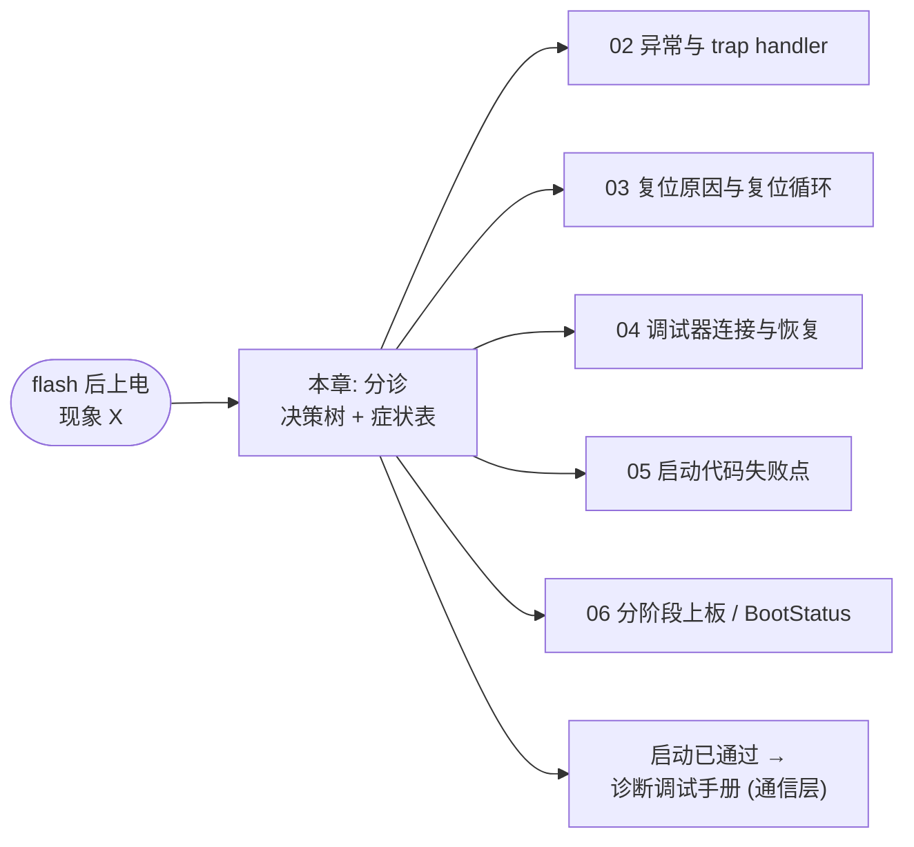
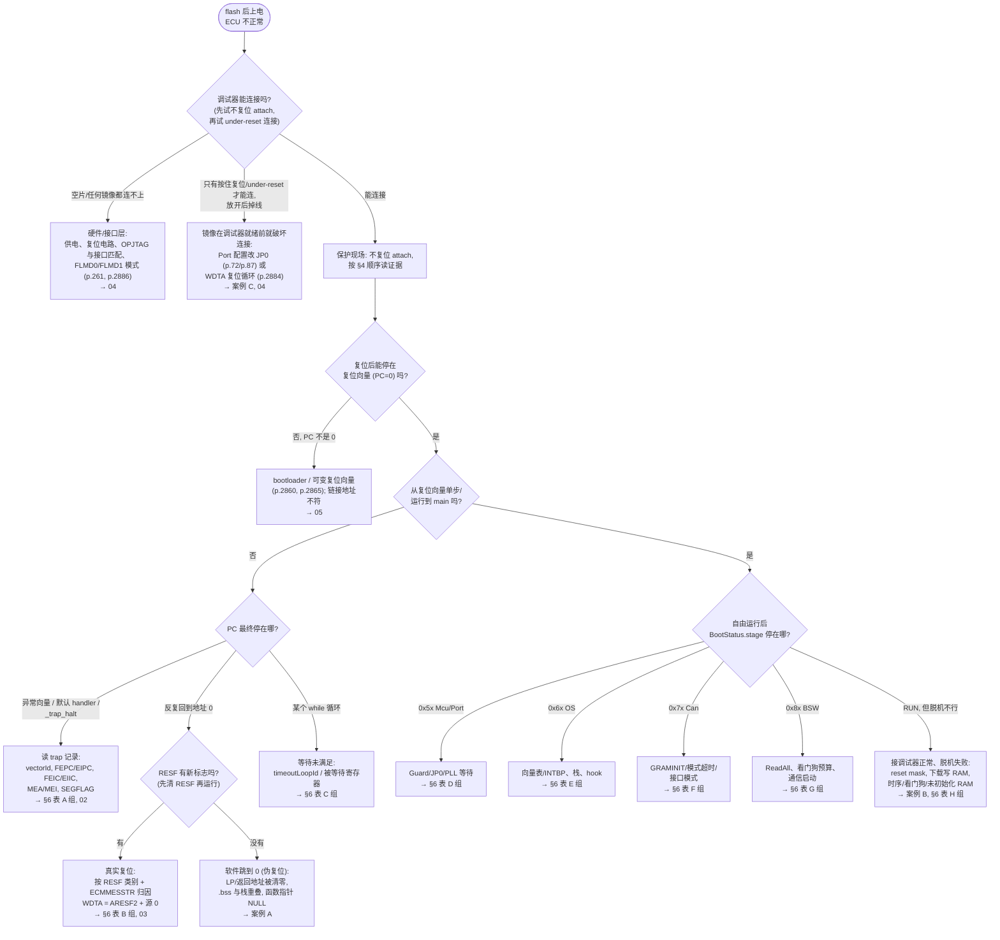

# 启动 Trap 排查手册：“flash 后上电，现象 X”→ 下一步做什么

> Prerequisite: [06-incremental-bring-up-strategy.md](06-incremental-bring-up-strategy.md)（BootStatus 记录与阶段码），[02-exception-and-trap-handlers.md](02-exception-and-trap-handlers.md)，[03-reset-causes-and-reset-loops.md](03-reset-causes-and-reset-loops.md)，[04-debugger-attach-and-recovery.md](04-debugger-attach-and-recovery.md)，[05-startup-code-failure-points.md](05-startup-code-failure-points.md)
> Next: 回到 [本系列索引](README.md)；启动通过后的通信问题见 [调试手册：22 F1 90 没有响应](../debugging-autosar-diagnostics.md)
> 对应规范: HW-E = R01UH0585EJ0120 Rev.1.20（PDF 页码）：p.72/p.87（JP0 调试引脚）、p.96/p.114（PNOTn）、p.190/p.250（GPR 与 lock-step）、p.192–203（FEPC/FEIC/MEA/MEI）、p.197（PSW、CU0）、p.205–206（EBASE/INTBP 对齐）、p.244–248（SEG/SYSERR 原因码）、p.255–256（RAM 执行同步、48 B 预取）、p.261（FLMD0/FLMD1 模式）、p.281–282（SYNCP、FENMI/FEINT 偏移、INTWDTA0=EI9）、p.418–434（复位类别、RESF、STAC、Reset Mask）、p.471（时钟寄存器 Slave Guard）、p.805/p.1086–1090（CAN 自测、GRAMINIT）、p.1528–1535（WDTA）、p.2704（PBG）、p.2790–2791/p.2799/p.2817（ECM）、p.2853/p.2856（OCD）、p.2884/p.2886（OPBT0/OPBT2）、p.2890–2891（RAM 初始化、BRAMDAT）。SWS-MCU **R24-11** p.13、p.29–30、`SWS_Mcu_00206` p.29。**本仓库没有 Os/EcuM/BswM/NvM/Det 的 SWS**，相关行为按 R4.x 公认形态描述，需以项目 release 确认。
> 对应源码: 本章不新增代码；记录结构与宏来自 [06 §5](06-incremental-bring-up-strategy.md)。案例中的调试器操作为 `[Conceptual]`，TRACE32 / MULTI 的具体命令和选项名**以所装版本手册为准**。

---

## 1. 本章目标

这是一本**现场手册**。场景固定为：

> 新镜像 flash 进 R7F701381，上电，ECU 没有按预期工作——要么调试器连不上，要么一停下来 PC 在某个异常向量里，要么不停复位，要么挂在某个循环里。

读完后你应该能：

1. 用一张决策树，在 **5–15 分钟**内把问题落到一个“阶段 + 机制”上（例如“CRT 阶段 + 栈与 .bss 重叠”、“Port_Init 之后 + JP0 被重配”）；
2. 用症状→原因→检查表（≥30 行）找到下一步要读的寄存器、变量或文件；
3. 通过 3 个完整案例，看到一个工程师在调试器里**实际看到什么、依次做什么**。

本章只做“分诊”。每一类机制的深入讲解在对应章节：异常/handler → [02](02-exception-and-trap-handlers.md)，复位原因/复位循环 → [03](03-reset-causes-and-reset-loops.md)，调试器连接与恢复 → [04](04-debugger-attach-and-recovery.md)，启动汇编/CRT → [05](05-startup-code-failure-points.md)，观察结构与分阶段 → [06](06-incremental-bring-up-strategy.md)。

---

## 2. 为什么需要一本手册？

上电即 trap 的现场有三个特点，使“凭经验乱试”特别低效：

1. **现场易失**：FEPC/FEIC/MEA 只在 trap 当时有效（HW-E p.195–203）；一次调试器复位就会让它们失效，同时改写 RESF（Debugger Initiated Reset 会置 PRESF0 与 SRESF0，HW-E p.421–422、p.434）。
2. **调试器会改变行为**：调试器连上之前代码已经从复位向量开始执行（HW-E p.2856）；连上之后，ECM/软件/Pin 复位可能被 reset mask 屏蔽（HW-E p.434 Table 8.15）；加载 ELF 可能把 `.data` 初值直接写进 RAM。
3. **同一个症状对应很多机制**：见 [06 §2.1](06-incremental-bring-up-strategy.md) 的发散图。

所以手册的第一条原则是：**先保护现场，再收集证据，最后才改代码。**

### 2.1 三条铁律

| 铁律 | 具体做法 | 违反的后果 |
|---|---|---|
| **attach 不复位** | 用“热连接/不复位连接”方式 attach（TRACE32 / MULTI 中的选项名需确认） | FEPC、RESF、BRAMDAT 以外的证据全部丢失 |
| **先读记录，再读 PC** | BRAMDAT0–3 → `BootStatus` → RESF/ECM → FEPC/FEIC/MEA/SEGFLAG → PC/SP/LP | 只看 PC 往往停在 `_trap_halt` 或默认 handler，信息量为零 |
| **一次只改一处** | 每次修改只针对一个假设，修改后从“最后通过的阶段”重跑 | 多处同时修改，即使好了也不知道是哪一处 |

---

## 3. 系统位置：分诊的入口与出口



本章的入口只有一个：上电后不对劲。出口是：**一个具体的阶段 + 一个具体的机制 + 一个具体的检查动作**。

---

## 4. 证据从哪里来：读取顺序

[RH850 Hardware] 下表是“停住 CPU 之后”的标准读取顺序。前提是你已经按 [06](06-incremental-bring-up-strategy.md) 放了 BootStatus；如果还没有，第 1、2 步跳过，剩余步骤仍然适用。

| 顺序 | 读什么 | 地址 / 位置 | 回答什么 | 依据 |
|---|---|---|---|---|
| 1 | BRAMDAT0–3 | `FFC0_A000H`–`FFC0_A00CH` | 上次死在哪个阶段、FEPC 摘要、启动次数、超时 ID | HW-E p.2891；[06 §5.2](06-incremental-bring-up-strategy.md) |
| 2 | `BootStatus`（noinit） | map 文件中的符号 | 完整 trap 记录、DET/hook、计数器 | [06 §5.3](06-incremental-bring-up-strategy.md) |
| 3 | RESF | `FFF8_1000H` | 是否真的发生过复位、什么类别 | HW-E p.421–422 |
| 4 | ECMMESSTR0–2 | `FFD6_0008H`/`0CH`/`10H` | ECM 复位/中断的错误源（源 0 = WDTA，源 1 = DCLS compare）；**只被 Power On Reset 初始化，System Reset 1/2、Application Reset 1 后保持**（HW-E p.419 Table 8.2） | HW-E p.2790、p.2799、p.419 |
| 5 | FEPC / FEPSW / FEIC | SR2,0 / SR3,0 / SR14,0 | FE 级异常发生位置与原因码 | HW-E p.192–199 |
| 6 | EIPC / EIPSW / EIIC | EI 级对应系统寄存器 | EI 级异常/中断现场 | HW-E p.193–199 |
| 7 | MEA / MEI | SR6,2 / SR8,2 | MAE/MPU 违规的地址和访问信息 | HW-E p.202–203 |
| 8 | SEGFLAG / SEGADDR | `FFFE_E982H` / `FFFE_E988H` | SYSERR 来源（ICCF/VCIF/TCMF/VCRF/VPGF） | HW-E p.244–248 |
| 9 | PC / SP(r3) / LP(r31) / PSW | CPU 寄存器 | 当前停在哪、栈是否合法 | HW-E p.190、p.197 |
| 10 | OPBT0 / OPBT2 | `FFCD_0030H` / `FFCD_0038H` | WDTA 启动方式、调试接口 | HW-E p.2884、p.2886 |

两条解读提示：

- **FEIC 的 SYSERR 原因码**：HW-E p.247 Table 3.80 给出 `11H` 来自 Code Flash 取指、`12H` ICCF、`13H` 非 Code Flash 取指、`14H` VCIF、`16H` TCMF（Local RAM 数据访问：ECC 错误或访问未实现区）、`18H` VCRF（IPG 违规）、`19H` VPGF（P-Bus 写访问错误：P-Bus guard error、地址 EDC、数据 ECC、访问 P-Bus 未实现区，p.245）。其他异常的 FEIC/EIIC 编码以 RH850G3M Software 手册为准（需确认）。
- **RESF 是累积的**：POR 同时置 PRESF0 和 SRESF0；判断“最近一次复位”需要软件每次启动后清除（HW-E p.421–422；[03](03-reset-causes-and-reset-loops.md) 详述）。

---

## 5. 决策树



逐个节点说明：

| 节点 | 为什么这样分 | 关键依据 |
|---|---|---|
| Q1 “先不复位 attach” | 复位会毁掉现场；只有不复位连不上时才退一步 under-reset 连接 | HW-E p.434（调试器复位改写 RESF） |
| H2 “只有 under-reset 能连” | 代码从复位向量开始运行时调试器尚未就绪（p.2856），若镜像很快重配 JP0 或触发复位，连接窗口就被吃掉 | HW-E p.2856、p.72、p.87 |
| Q2 “PC=0？” | 用户 mat 启动时复位向量 = `0000_0000`（p.258）；若不是 0，说明复位向量被改或有 bootloader | HW-E p.258、p.2860 |
| Q4 → Q5 “回到 0 时看 RESF” | **区分“真实复位”和“跳到 0”是最省时间的一步**：真实复位一定会在 RESF 留标志，跳到 0 不会 | HW-E p.421–422 |
| T2 “WDTA = ARESF2 + 源 0” | ECM 默认只使能看门狗错误的复位，RESC0 默认 1 → Application Reset 1 → ARESF2 | HW-E p.418、p.420、p.2790、p.2817 |
| Q6 “阶段码” | 进入 main 后，阶段码直接把问题定位到 init 序列的一段 | [06 §6](06-incremental-bring-up-strategy.md) |
| T9 “脱机失败” | 调试器能掩盖复位（p.434）、写 RAM、改变时序 | 案例 B |

---

## 6. 症状 → 原因 → 检查表

按决策树的叶子分组。“检查”一栏写的是**下一个具体动作**。

### A 组：停在异常向量 / trap handler

| # | 症状 | 最可能原因 | 检查 | 深入 |
|---|---|---|---|---|
| A1 | `.bss` 清零刚结束 PC 就在 FE 向量或跑到 0 | 栈与 `.bss` 重叠：清零把保存的 LP/返回地址清成 0 | map 中 `.stack` 与 `.bss` 区间；CRT 时 SP 值；`stageHistory` 停在 0x11/0x12 | 案例 A、[05](05-startup-code-failure-points.md) |
| A2 | 上电后第一次压栈附近 FENMI | GPR 未初始化就写到 PE 外部 → lock-step 比较错误 | ECMMESSTR0 bit1（DCLS compare，p.2790）；启动汇编是否先初始化 r1–r31 | HW-E p.250；[05](05-startup-code-failure-points.md) |
| A3 | 第一个浮点运算处 trap | 编译为硬件 FPU，但 PSW.CU0=0（复位值 0，FPU 不可用） | PSW bit16；编译选项是否硬浮点；启动代码是否置 CU0 并初始化 FPSR | HW-E p.197；[RH850 启动过程 §6.1](../01-rh850/04-startup-process.md) |
| A4 | 第一次函数调用 / 第一个局部变量就 trap | SP 未设置、指向非 RAM 或未对齐 | r3 与 map 中栈段；启动汇编设置 SP 的那条指令 | [05](05-startup-code-failure-points.md) |
| A5 | 访问某些全局变量就 trap 或读到乱值 | GP/EP 未设置，或与 `-sda`/`-tda` 等编译选项不一致 | r4/r30 与链接器符号；编译选项 | [MemMap 速查 §5.1](../reference/p1me-memory-layout-ghs-memmap.md) |
| A6 | SYSERR，FEIC=`19H`，SEGFLAG.VPGF=1，FEPC 在写时钟/复位寄存器处 | 写受 Slave Guard / P-Bus Guard 保护的寄存器 | FEPC 处 store 的目标地址；该外设的 PBG 通道（p.2704 起）；时钟寄存器保护（p.471）、复位寄存器保护（p.420） | [02](02-exception-and-trap-handlers.md) |
| A7 | SYSERR，FEIC=`16H`（TCMF），在 RAM 函数里或刚跳进 RAM 代码 | Local RAM ECC 错误或访问未实现区；RAM 函数末尾 48 B 预取读到未初始化 RAM | SEGADDR；RAM 函数段之后是否 PAD 48 B 并初始化（p.256）；复制后是否做 store→dummy read→SYNCP→SYNCI（p.255）；是否有关闭了 RAM 清零的复位路径（p.434） | [MemMap 速查 §5](../reference/p1me-memory-layout-ghs-memmap.md) |
| A8 | SYSERR，FEIC=`11H`/`13H`，取指错误 | 跳到已擦除 Code Flash / 非法区域；Code Flash 末尾代码预取到擦除区 | FEPC 是否在镜像范围外；镜像末尾是否紧贴擦除区（p.256 note 同样适用 Code Flash 擦除后） | [04](04-debugger-attach-and-recovery.md) |
| A9 | MAE 类异常，MEA 为奇数地址 | 打包结构体/类型转换造成非对齐访问 | MEA、MEI（p.202–203）；FEPC 处指令 | [02](02-exception-and-trap-handlers.md) |
| A10 | trap 后 FEPC 指向 handler 自身 | handler 用了坏栈造成二次异常，原现场被覆盖 | BRAMDAT1 中第一次的 FEPC；handler 是否在抄寄存器前压栈 | [06 §6.3](06-incremental-bring-up-strategy.md) |
| A11 | `StartOS` 之后立即进入 EIINT 未定义入口 | INTBP/EBASE 未设置、512 B 未对齐，或向量表缺项 | EBASE/INTBP 值及低 9 位（p.205–206）；OS 向量表初始化调用是否执行 | [中断与异常](../01-rh850/06-interrupt-exception.md) |
| A12 | 第一个中断进来后 trap | 表项指向普通 C 函数（无上下文保存/EIRET）；直接向量方式缺 SYNCP | 向量表该项的目标符号；p.281 CAUTION | [02](02-exception-and-trap-handlers.md) |

### B 组：复位循环（RESF 有新标志）

| # | 症状 | 最可能原因 | 检查 | 深入 |
|---|---|---|---|---|
| B1 | 每 ~N ms 复位一次，N 固定 | WDTA0 默认启动（OPWDRUN=1）且无人触发 | OPBT0 解码：`T = 2^(9+OPWDOVF) / fWDT`（8 MHz 或 250 kHz，p.2884）；RESF=ARESF2 且 ECMMESSTR0 bit0 | [03](03-reset-causes-and-reset-loops.md) |
| B2 | `Wdg_Init` 之后才开始复位 | WDTAnMD 第二次写入（只能写一次，p.1531、p.1535），或窗口/触发值不对（VAC 模式不能用固定值） | 启动代码是否先写过 WDTA0MD；OPWDVAC；驱动配置 | [03](03-reset-causes-and-reset-loops.md) |
| B3 | 启动到 `NvM_ReadAll` 附近复位 | ReadAll 时间超过 WDTA 期限 | BootStatus 中 ReadAll 计时；OPBT0 期限 | [ECU 启动流程 §6.5](../02-autosar-classic/03-ecu-startup.md) |
| B4 | RESF=ARESF2 但 ECMMESSTR0 bit0=0 | 其他 ECM 错误源（ECC、CLMA、DCLS…）配置成了复位 | ECMMESSTR0–2 逐位对照 p.2790–2791 | [03](03-reset-causes-and-reset-loops.md) |
| B5 | RESF=SRESF2 或 ARESF0 | 软件复位：有代码调用了 `Mcu_PerformReset` 或直接写 SWSRESA0/SWARESA0 | 在 `Mcu_PerformReset` 与写这两个地址处设断点（p.420、p.424–425）；常见于 trap handler 量产行为、BswM 规则、DCM 11 01 | [03](03-reset-causes-and-reset-loops.md) |
| B6 | 软件复位后行为与上电不同（`.bss` 有旧值、noinit 失效或意外有效） | Application Reset 1 不读 option bytes、不跑 BIST，RAM 清零取决于 STAC（p.431、p.434） | STAC_* 配置；CRT 是否自己清 `.bss` | [05](05-startup-code-failure-points.md) |
| B7 | 停在断点或单步很久后，一继续就复位 | 停机期间 WDTA0 无条件停止（HW-E §34.4 p.2855），但放行后计数从停止处继续，若剩余时间不足以到达下一次触发就会溢出；reset mask 关闭时 ECM 复位生效 | 调试器对 WDTA/外设“停机冻结”与 reset mask 的设置 | [04](04-debugger-attach-and-recovery.md) |

### C 组：挂在某个循环里

| # | 症状 | 最可能原因 | 检查 | 深入 |
|---|---|---|---|---|
| C1 | 挂在 `Mcu_GetPllStatus` 轮询 | P1M-E 上 `McuNoPll=TRUE` 时恒返回 `MCU_PLL_STATUS_UNDEFINED`（`SWS_Mcu_00206` p.29），等 LOCKED 永远不成立 | EcuM callout / 集成代码中的等待循环 | [MCU 驱动](../03-mcal/02-mcu-driver.md) |
| C2 | 挂在 `Can_Init` 内部 | 等 GSTS.GRAMINIT=0 或 global/channel mode 切换无超时；时钟未供给；寄存器偏移用错（Classical/FD 接口模式） | 停住看 FEPC/PC 所在循环读的寄存器；GSTS/CmSTS 原值；`timeoutLoopId` | HW-E p.1090、p.821；Part IV CAN |
| C3 | 挂在 OSTM 停止等待 | TT 写入方式错（只写寄存器不得读改写），或等 TE 的位错 | OSTMnTE/TT 访问宽度 | [Gpt 驱动](../03-mcal/05-gpt-driver.md) |
| C4 | `NvM_ReadAll` 永远 PENDING | NvM/Fee/Fls MainFunction 未调度，或其任务优先级低于等待任务 | OS 任务优先级；MainFunction 是否在 alarm/schedule table 中 | [ECU 启动流程 §6.5](../02-autosar-classic/03-ecu-startup.md) |
| C5 | 挂在 `Can_SetControllerMode` 之后的等待 | 在 OS 启动前调用了需要 OS 计数器的 API（`GetCounterValue`），或控制器无法进入 STARTED | 调用位置是否在 StartOS 之后 | [ECU 启动流程 §6.7](../02-autosar-classic/03-ecu-startup.md) |

### D 组：Mcu/Port 阶段（阶段码 0x5x）

| # | 症状 | 最可能原因 | 检查 | 深入 |
|---|---|---|---|---|
| D1 | `Port_Init` 一返回调试器就掉线 | Port 配置包含 JP0_0–JP0_5（DCUTDI/DCUTDO/DCUTCK/DCUTMS/DCUTRST/DCUTRDY 或 LPD 引脚，p.72、p.87） | Port 生成配置中的 JP0 项；OPJTAG 设置（p.2886） | 案例 C、[04](04-debugger-attach-and-recovery.md) |
| D2 | `Mcu_Init` 后 `Mcu_GetResetReason` 总是 UNDEFINED / 同一个值 | RESF 在更早处被清除，或 MCAL 映射不包含 P1M-E 的 ARESF2 等位 | `Mcu_Init` 前后读 RESF；MCAL 文档中的映射表 | [MCU 驱动](../03-mcal/02-mcu-driver.md) |
| D3 | `Port_Init` 后某外设功能失效或短暂毛刺 | PMC/PM 写入顺序、只改 mask 内位的规则未遵守（写了整组常数） | 按掩码读回 PM/PMC/PFC/PFCE/PFCAE/PIPC | [Port 驱动](../03-mcal/03-port-driver.md) |

### E 组：OS 阶段（阶段码 0x6x）

| # | 症状 | 最可能原因 | 检查 | 深入 |
|---|---|---|---|---|
| E1 | `ProtectionHook` 被调用（栈错误） | 任务/ISR 栈过小；启动栈与 OS 栈布局冲突 | `BootStatus.protectionLast`；OS 栈配置与 map | [OS Task/ISR](../02-autosar-classic/06-os-task-isr.md) |
| E2 | `ShutdownHook` 在 StartOS 期间被调用 | OS 配置错误（AppMode、autostart、计数器硬件初始化失败） | `BootStatus.shutdownLast` 的 StatusType 值 | OS 端口文档（需确认） |
| E3 | tick ISR 从未进入 | EIC74/75 EIMK 仍为 1、OSTM 通道被 Gpt 和 OS 同时占用、PSW.ID 未清 | EIC 读回；OSTM 归属（配置选择，不是硬件事实） | [Gpt 驱动](../03-mcal/05-gpt-driver.md) |
| E4 | tick 正常，任务不跑 | autostart/alarm 未配置；任务一直被更高优先级 ISR/任务占满 | `bringupTaskCount`；OS trace | [06 §6.7](06-incremental-bring-up-strategy.md) |

### F 组：Can 阶段（阶段码 0x7x）

| # | 症状 | 最可能原因 | 检查 | 深入 |
|---|---|---|---|---|
| F1 | 回环自测收不到 | CTME/CTMS 不在 channel halt 下设置（p.805、p.807）；接收规则掩码语义写反；规则数为 0 | CmCTR 读回；GAFL 表 | HW-E p.1086–1087；Part IV |
| F2 | RS-CANFD RAM ECC 错误（ECM 源 22） | GRAMINIT 未完成就配置或读 CAN RAM | ECMMESSTR0 bit22（p.2791）；GRAMINIT 等待 | HW-E p.1090 |

### G 组：BSW/通信阶段（阶段码 0x8x）

| # | 症状 | 最可能原因 | 检查 | 深入 |
|---|---|---|---|---|
| G1 | 阶段到 RUN 但总线上没有 ECU | 控制器未 STARTED、PDU 未 ONLINE、收发器模式 | 转入诊断调试手册 L1–L2 | [诊断调试手册](../debugging-autosar-diagnostics.md) |
| G2 | 首个 DET 是 `*_E_UNINIT` | init 顺序/BswM 规则漏了某模块 | `BootStatus.det*`；`stageHistory` | [ECU 启动流程 §6.6](../02-autosar-classic/03-ecu-startup.md) |

### H 组：接调试器正常、脱机失败

| # | 症状 | 最可能原因 | 检查 | 深入 |
|---|---|---|---|---|
| H1 | 连调试器一切正常，脱机上电 LED 不亮/不停重启 | 调试器 reset mask 屏蔽了 ECM/软件复位（p.434 Table 8.15），看门狗或软件复位只在脱机时生效 | 脱机运行后不复位 attach，读 RESF/BRAMDAT；对比调试器 reset mask 设置 | 案例 B |
| H2 | 调试器“下载并运行”正常，烧录后冷启动初值错误 | 调试器加载 ELF 时把 `.data` 写进 RAM，掩盖了 CRT 复制缺陷 | 冷启动读 [06 §6.2](06-incremental-bring-up-strategy.md) 的探针 | [05](05-startup-code-failure-points.md) |
| H3 | 只在冷启动失败，调试器复位后正常 | 时序：外部器件/电源上电慢；未初始化变量依赖上次运行残留；调试器复位不等于 POR 的 RAM/option byte 路径 | GPIO 阶段脉冲 + 示波器测上电时序；`bootCount` | [03](03-reset-causes-and-reset-loops.md) |
| H4 | 单步时正常，全速运行 trap | 系统寄存器写入后缺少同步（LDSR 后的 hazard 处理）、RAM 代码复制后缺 SYNCP/SYNCI（p.254–255） | 启动汇编中 LDSR 之后、RAM 跳转之前的同步指令 | [05](05-startup-code-failure-points.md) |
| H5 | 低优化正常、量产优化 trap | 栈用量变化、未定义行为、对齐、`volatile` 缺失 | 栈水位；MEA/MEI；对寄存器访问是否 `volatile` | [02](02-exception-and-trap-handlers.md) |

共 38 行。表中“深入”列指向的章节是该机制的唯一深入讲解处，本章不再展开。

---

## 7. 案例研究

> **[Conceptual] 声明**：以下 3 个案例是综合常见问题构造的**教学案例**，不是某个真实项目的记录。地址、数值为示意；调试器操作用“窗口/动作”描述，具体 TRACE32 命令或 MULTI 菜单名以所装版本手册为准。寄存器语义均来自 HW-E 并标注页码。

### 7.1 案例 A：“一上电就进 trap”——其实是跳到了地址 0

**现象**：新链接脚本合入后，ECU 上电无反应。工程师用 TRACE32 不复位 attach，CPU 正在运行；按 Break，PC 停在 `0x0000_0024` 附近，看起来“在复位向量附近乱跑”。

**第 1 步：保护现场、读记录。**

```text
BRAMDAT0 = B007_0011     → 最后写入的阶段: .data 复制完成 (0x11), 没到 .bss 清零完成 (0x12)
BRAMDAT3 = 0000_0000     → 启动计数高 16 位为 0: BootStatus_EarlyInit 从未执行过
```

阶段停在 0x11 → 0x12 之间：**问题在 `.bss` 清零过程中或刚结束时**。

**第 2 步：是真复位吗？**

工程师在内存窗口向 RESFC（`FFF8_1008H`）写全 1 清掉 RESF（p.423），在复位向量 `0x0000_0000` 设一个片上断点，然后 Go。

几毫秒后断点命中。读 RESF：`0000_0000`——**没有任何新标志**（p.421–422）。

结论：这不是复位，是**软件跳到了地址 0**（伪复位）。真实复位一定会在 RESF 留下痕迹。

**第 3 步：谁跳到了 0？**

在 CRT 的 `.bss` 清零循环入口设断点，复位重跑（此时已知现场，可以复位）。断点命中时看：

```text
r3 (SP)          = FEDE_2FF0
map: .stack      = FEDE_0000 .. FEDE_27FF      (10 KB, 期望 SP 初值 FEDE_2800)
map: .bss        = FEDE_2800 .. FEDE_4A3F
```

SP 初值落在 `.bss` 范围内！查启动汇编：`mov ___ghsend_stack, sp` 使用的符号在新链接脚本中被改名，汇编里引用的是一个旧的、恰好仍然存在的符号（指向 `.bss` 中间）。

**第 4 步：确认机制。** 单步清零循环，观察 SP 附近内存：CRT 函数在入口把 LP 保存在 `[SP+n]`；清零循环把这块也清成 0；函数返回时 `jmp [lp]` → PC=0。CPU 从 0 重新执行启动代码——GPR 重置、BRAMDAT0 再次写入 0x00…，然后再次在同一处“复位”。从外面看就是“一上电就在复位向量附近乱跑”。

**修复与验证**：修正启动汇编中的栈符号；在链接脚本中加入 `.stack` 与 `.bss` 不重叠的检查（map 审查）。按 [06](06-incremental-bring-up-strategy.md) Stage 1 冷启动读探针通过，阶段推进到 0x13。

**要点**：

- “PC 在 0 附近”≠“复位”。**先清 RESF 再观察**是区分两者的最快方法。
- 如果 handler/CRT 用了坏栈，FEPC 之类的现场会被覆盖，BRAMDAT0 的阶段码是唯一可靠的线索。
- 链接脚本改动后，Stage 1 必须重跑。

### 7.2 案例 B：“接着调试器一切正常，拔掉就不停重启”

**现象**：同一个镜像，接 TRACE32 “下载并运行”时 ECU 正常进入 RUN、能回诊断；拔掉调试器后冷启动，LED 心跳每隔约 0.26 s 闪一下就灭，CANoe 中看不到 ECU。

**第 1 步：脱机状态下取证。** 让 ECU 脱机跑几秒，然后 TRACE32 **不复位** attach 并 Break：

```text
BRAMDAT0 = B007_0080     → 最后阶段: EcuM_StartupTwo / BSW 初始化中, ReadAll 尚未完成 (0x81 未到)
BRAMDAT3 = 01A3_0401     → 已启动 0x01A3 = 419 次; 最后一个超时循环 = 0x0401 (NVM_READALL)
BootStatus.resfRaw       = 0000_0201  → PRESF0 (上电时置) + ARESF2 (ECM application reset)
BootStatus.ecmMesstr[0]  = 0000_0001  → ECM 错误源 0: Window watchdog timer error (p.2790)
BootStatus.opbt0         = 解码: OPWDRUN=1, OPWDMDS=1 (250 kHz), OPWDOVF=111
```

（ECMMESSTR 在 ECM 复位（Application Reset 1）后保持，只有 POR 才初始化它，HW-E p.419 Table 8.2——所以复位后仍能读到“源 0”。RESF 中 PRESF0 是本次上电周期最初 POR 留下的，因标志累积而一直保持——见 HW-E p.421–422；ARESF2 是后续反复的 ECM 复位。BootStatus 能在 ECM 复位后保持，前提是项目配置了 STAC 不清零 noinit 区——见 [06 §11](06-incremental-bring-up-strategy.md) 的前提说明。）

**第 2 步：算期限。** `2^(9+7) / 250 kHz = 262.144 ms`（p.2884 公式，推导见 [RH850 启动过程 §5.3](../01-rh850/04-startup-process.md)）——和 LED 的 0.26 s 吻合。

**第 3 步：为什么接调试器时没事？** 两个候选：

1. **Reset mask**：HW-E p.434 说明调试模式下 System Reset 1/2 和 Application Reset 1 可被调试器设置屏蔽，Table 8.15 列出 ECM reset（RESC0=1）属于 Application Reset 1。连着调试器时，看门狗溢出触发的 ECM 复位**可能被屏蔽**，ECU 看起来“一直在跑”。
2. **启动路径不同**：调试器“下载并运行”可能跳过了部分启动时间（例如 Data Flash 已在上一轮被 Fee 整理好，ReadAll 更快）。

工程师查看 TRACE32 中与 reset mask 相关的系统选项（选项名需按手册确认），发现处于屏蔽状态；关闭屏蔽后，接着调试器也能复现每 262 ms 重启。候选 1 成立。

**第 4 步：为什么 ReadAll 超时？** BootStatus 中记录的 ReadAll 耗时（用 OSTM 计数差值）约 300 ms，`timeoutLoopId=0x0401` 说明 bring-up 加的 ReadAll 等待上限也到了。WDTA 期限 262 ms 内，Wdg 驱动的触发路径尚未运转（例如依赖的中断/任务在 ReadAll 等待期间得不到运行）。

**修复方向**（项目决策，不是单一答案）：

- 确认 Wdg 的实际触发源在 StartupTwo 期间是否运行（例如 INTWDTA0=EI9 的 ISR 路径，HW-E p.282），并给出启动期限预算；
- 或在 bring-up 阶段把 option bytes 改为软件触发启动（OPWDRUN=0）先推进其他验证，**并在交付记录中注明**；
- 缩短 ReadAll（block 数量、Fee 整理策略）。

**要点**：

- “接调试器正常、脱机失败”时，首先怀疑 **reset mask** 和 **调试器写 RAM**，其次才是时序。
- 复位原因要两级解码：RESF（是 ECM 复位）→ ECMMESSTR（是 WDTA）。只看 RESF 会把所有 ECM 错误都当成看门狗。
- 测试计划里至少要有一轮“完全没有调试器”的冷启动。

### 7.3 案例 C：“Port_Init 之后调试器掉线，之后再也连不上”

**现象**：同事从另一块评估板的工程复制了 Port 配置。新镜像烧录后：MULTI/TRACE32 报目标通信失败；重新上电后，调试器“正常连接”也失败。

**第 1 步：确认是哪一类“连不上”。** 工程师尝试 under-reset 连接（保持复位时连接，再释放；工具中的选项名需确认）——**可以连上**，PC=0。说明硬件接口和 OPJTAG 没问题，问题出在镜像运行之后（决策树 H2）。

**第 2 步：在镜像破坏连接之前截住它。** 在 under-reset 连接状态下，于 `Port_Init` 入口设片上断点（Flash 中的代码，使用片上断点资源，HW-E p.2853 说明有 12 个），Go。断点命中，读：

```text
BRAMDAT0 = B007_0050     → Mcu_Init 完成, 正在进入 Port_Init
```

在 `Port_Init` 返回地址再设一个断点，Go——调试器报告通信丢失。

**第 3 步：找到元凶。** 重新 under-reset 连接，停在 `Port_Init` 入口，在 Port 生成配置中搜索 JP0：配置里把 **JP0_2 / JP0_3** 设成了通用输出（原评估板用它们驱动 LED）。JP0_2 是 DCUTCK/LPDCLK、JP0_3 是 DCUTMS（HW-E p.72、p.87）——调试时钟和模式选择引脚被改成了 GPIO。

因为代码一上电就从复位向量开始运行（HW-E p.2856），每次上电在调试器就绪前就跑到 `Port_Init` 把 JP0 改掉，所以“正常连接”永远失败；只有 under-reset 连接能在代码运行前抢到控制权。

**第 4 步：恢复与修复。**

- 恢复：under-reset 连接后直接擦除/重新烧录正确镜像。若 under-reset 也不行，退回串行编程模式（FLMD0=1、FLMD1=0 进入，HW-E p.261）用编程器擦除。具体步骤见 [04 调试器连接与恢复](04-debugger-attach-and-recovery.md)。
- 修复：从 Port 配置中删除 JP0 的所有项；把“Port 配置中不得出现 JP0”加入 bring-up 构建检查（[06 §6.10](06-incremental-bring-up-strategy.md)）。如果产品确实需要把 JP0 用作 GPIO，那么 OPJTAG 的设置、调试/编程方案必须在量产前单独评审。

**要点**：

- “只有 under-reset 能连”= 镜像在运行早期破坏了调试连接，最常见的是 JP0 被重配或复位循环。
- 复制别的板/别的 derivative 的 Port 配置，是最常见的 JP0 事故来源。

---

## 8. RH850 Hardware Mapping：手册中“排查用”的页

| 排查对象 | 手册位置 | 用途 |
|---|---|---|
| 复位类别、RAM 清零、Reset Mask | p.418、p.431、p.434 | 软件复位与 POR 行为差异；调试器屏蔽复位 |
| RESF / RESFC | p.421–423 | 复位类别解码、清除 |
| ECM 错误源与寄存器 | p.2790–2791、p.2799、p.2817 | ARESF2 的下一级原因 |
| SEG / SYSERR 原因 | p.244–248 | FEIC 与 SEGFLAG 对应 |
| 系统寄存器 | p.192–203 | FEPC/FEIC/MEA/MEI |
| 向量偏移与 SYNCP | p.281–282 | FENMI +0E0H、FEINT +0F0H、EI9=INTWDTA0 |
| 预取与 RAM 执行 | p.255–256 | RAM 函数同步、48 B 预取 |
| JP0 调试引脚 | p.72、p.87 | 调试器掉线排查 |
| Option bytes | p.2884、p.2886 | WDTA 启动方式、调试接口 |
| WDTA | p.1528–1535 | 不可停止、MD 只写一次 |
| OCD | p.2853、p.2856 | 断点资源、连接前已运行 |
| RS-CANFD 初始化与自测 | p.805、p.1086–1090 | Can 阶段排查 |
| Backup register | p.2891 | 阶段码存储 |

---

## 9. openAUTOSAR 对照

openAUTOSAR 没有任何 trap 记录或启动排查机制。可对照的“反面教材”只有两个，均已在其他章节分析：PLL 等待无超时（`system/EcuM/src/EcuM_Callout_Stubs.c:200-202`，见 C1）、`Mcu_Init` 内提前开中断（`boards/linuxOs/MCAL/Mcu/src/Mcu.c:355`，见 [ECU 启动流程 §6.3](../02-autosar-classic/03-ecu-startup.md)），后者在 RH850 上可能导致 OS 就绪前进入 ISR（A11/A12 类症状）。

---

## 10. 当前教学项目对应

[Educational Implementation] [examples/can_irq_demo/startup/](../../examples/can_irq_demo/startup/README.md) 的主机启动模型提供“自动启动看门狗超时”场景，可用来演练 B1 的推理（阶段历史 + 复位原因）。它不模拟 RH850 异常、RESF 或调试器行为，不能替代上板。

---

## 11. 出事后 5 分钟流程（可打印）

```text
[0:00] 不要复位。不要重新下载。拍照/记录 LED 与总线现象。
[0:30] 不复位 attach → Break。
[1:00] 读 BRAMDAT0-3，读 BootStatus（若有）。记下阶段码、FEPC 摘要、启动次数、超时 ID。
[1:30] 读 RESF、ECMMESSTR0-2。记下原值（不要清）。
[2:00] 读 FEPC/FEPSW/FEIC、EIPC/EIPSW/EIIC、MEA/MEI、SEGFLAG/SEGADDR、PC/SP/LP/PSW。
[3:00] 用 map 把 FEPC / LP 映射到函数；用 §5 决策树选分支。
[4:00] 在 §6 表中找到对应行，确定"下一个具体动作"。
[5:00] 现在才可以：清 RESF → 复位 → 设断点 → 重现。
```

---

## 12. 常见误区

| 误区 | 正确理解 |
|---|---|
| “PC 在 0 附近 = 复位了” | 先清 RESF 再观察；没有新标志就是软件跳到 0（案例 A） |
| “RESF 显示 ECM 复位 = 看门狗” | 还要看 ECMMESSTR0 bit0；其他 ECM 源也可能配置成复位（B4） |
| “接调试器能跑 = 镜像没问题” | reset mask、RAM 下载、时序都可能掩盖问题（H1–H3） |
| “trap handler 就是个死循环，够用了” | 不记录 FEPC/FEIC/阶段码，下次还是“没办法 debug”（[06 §6.3](06-incremental-bring-up-strategy.md)） |
| “连不上 = 板子坏了” | 先试 under-reset 连接；能连说明是镜像问题（案例 C） |
| “P1M-E 启动卡住，先查 PLL” | P1M-E 没有软件 PLL；卡在 PLL 等待说明是移植/配置错误（C1） |

---

## 13. 实验

**实验 1：做一份你们自己的“FEIC 解码卡片”。** 结合 HW-E p.247 Table 3.80 与 G3M Software 手册，把 SYSERR 原因码与本项目会用到的其他异常码整理成一页表，打印贴在工位。

**实验 2：伪复位 vs 真复位（有板子）。** 写两个 bring-up 测试函数：一个执行 `jmp` 到 0，一个写 SWARESA0（`FFF8_1200H`，p.420）。每次运行前清 RESF，运行后读 RESF 与 BRAMDAT0，验证决策树 Q5 的分支。注意关闭/记录调试器 reset mask 设置。

**实验 3：故意制造 JP0 事故（只在可恢复的评估板上做）。** 在评估板上先确认 under-reset 连接与串行编程恢复流程可用，再烧一个在 Port 配置里重配 JP0_3 的镜像，练习案例 C 的恢复步骤。**量产/样件 ECU 上不要做。**

**实验 4：把本章表格映射到你的工程。** 选 §6 中 10 行，在你的工程里找到对应的代码/配置位置（启动汇编文件、链接脚本段名、EcuM callout、Port 配置、OS 栈配置），写进一份“本项目启动排查索引”。

---

## 14. 思考题

1. 决策树中为什么把“先清 RESF 再观察”放在如此靠前的位置？如果 MCAL 在 `Mcu_Init` 中会清 RESF，这个方法还可靠吗？
2. 案例 B 中，如果项目没有配置 STAC 保留 noinit 区，工程师还能得到哪些证据？哪些结论将无法得出？
3. H4（单步正常、全速 trap）和 H5（低优化正常、高优化 trap）分别说明了什么类别的问题？各举一个 RH850 上的具体机制。
4. 如果 trap 发生在 FE 级异常处理过程中（例如 SYSERR handler 里又访问了坏地址），FEPC 会发生什么？你的 handler 设计如何保证第一次的现场不丢？

---

## 15. 对未来真实项目的意义

1. **把本章的决策树和 §11 的 5 分钟流程放进项目 wiki**，并按你们的工具（TRACE32 脚本、MULTI 窗口布局）补上具体命令。新人第一次遇到“上电即 trap”时，按流程走而不是凭感觉。
2. **让每个“症状表”行都能对应到项目文件**：真实 RTA-CAR 工程中，启动汇编（如 `reset.850`/crt0 类文件，名称需确认）、链接脚本、EcuM callout、Port 配置、RTA-OS 栈配置的位置不同；做一份索引（实验 4）。
3. **复位原因两级解码进入正式产品**：bring-up 结束后，RESF + ECMMESSTR 的保存与上报（例如写 DTC 或 NvM 日志）应当保留在量产代码中——售后“偶发重启”问题需要同样的证据。
4. **把“无调试器冷启动”写进每次集成的验收**，并记录调试器 reset mask 等会改变行为的设置。
5. **DCM/BSW 升级后的回归**：升级引起的启动问题通常落在 E、F、G 组；有了阶段码，可以直接定位到“升级后哪个 init 之后开始失败”。

---

## 16. 本章总结

- 三条铁律：attach 不复位；先读记录再读 PC；一次只改一处。
- 证据读取顺序：BRAMDAT → BootStatus → RESF → ECMMESSTR → FEPC/FEIC/EIPC/EIIC → MEA/MEI → SEGFLAG/SEGADDR → PC/SP/LP → OPBT。
- 决策树的关键分叉：能否连接（直接 / under-reset）→ 能否停在复位向量 → 能否到 main → PC 停在异常、地址 0 还是循环 → 阶段码。
- “回到地址 0”时，先清 RESF：有新标志是真复位（再看 ECMMESSTR），没有是软件跳到 0（多为栈/LP 被破坏）。
- “接调试器正常、脱机失败”：先查 reset mask（HW-E p.434）和调试器写 RAM，再查时序与看门狗。
- 38 行症状表按 A–H 分组，每行指向下一个具体动作和唯一深入章节。

## 17. 下一章

本系列到此结束。回到 [README](README.md) 查看上电前检查清单；启动通过后的通信/诊断问题，进入 [调试手册：22 F1 90 没有响应](../debugging-autosar-diagnostics.md)。
