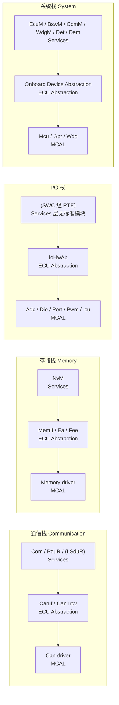
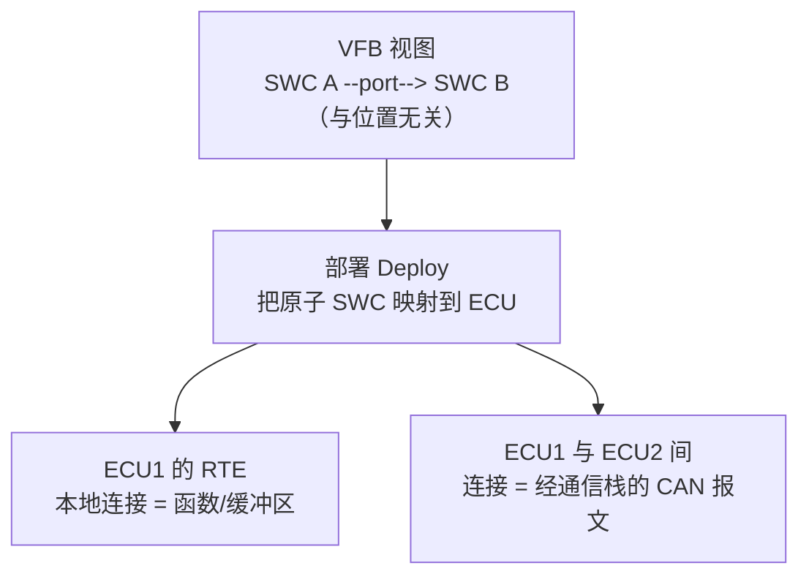
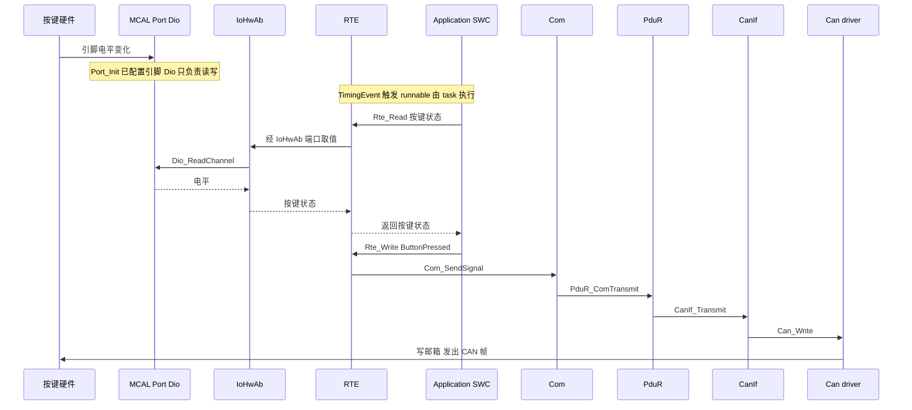

# 01 架构全景：Classic AUTOSAR 为什么这样分层

> 本章回答：AUTOSAR 为什么存在？Classic 平台分几层、每层干什么、谁可以调用谁？SWC、RTE、BSW 的职责边界在哪里？
> Prerequisite: 本 Part 的 [README 导读](README.md)（无前置章节）   Next: [02 谁做什么](02-who-builds-what.md)
> 对应规范（R25-11）：EXP_LayeredSoftwareArchitecture（p.10–20、p.29–37、p.77–83、p.133–136）；TR_VFB（p.13–17、p.41–45、p.85–91）；SWS_BSWGeneral（SWS_BSW_00150、SWS_BSW_00257）
> 深入阅读：[02-autosar-classic/01 Classic Platform 总览](../02-autosar-classic/01-classic-platform-overview.md)、[02 分层架构](../02-autosar-classic/02-layered-architecture.md)、[07-rte-swc/01 SWC 概念](../07-rte-swc/01-swc-concept.md)

---

## 1. 本章要回答的问题

1. 在 AUTOSAR 出现之前，汽车 ECU 软件有什么问题？AUTOSAR 想解决什么？
2. "三层 + 四块"到底是什么？为什么 RTE 之上和之下的风格不同？
3. 规范里"谁可以调用谁"的规则是什么？为什么？
4. 通信、存储、I/O 这些"竖向功能栈"怎样穿过各层？
5. SWC、RTE、BSW 的责任怎么划分？一个按钮事件如何一路变成 CAN 报文？

---

## 2. 直觉理解：为什么需要 AUTOSAR

### 2.1 AUTOSAR 之前

`[Conceptual]` 想象早期的一个 ECU 项目：应用代码里直接写 `P0 |= 0x04` 点灯、直接配置 CAN 邮箱、直接 `#include "can_driver_vendorX.h"`。结果：

- **与硬件紧耦合**：换一颗 MCU（例如从 A 系列换到 B 系列），应用代码里到处是寄存器和外设假设，几乎重写。
- **与供应商紧耦合**：OEM 把功能交给 Tier1，Tier1 的软件结构是私有的；换供应商 = 换整套软件，OEM 无法复用已验证的功能。
- **难复用**：同一个"车速滤波"算法，在 A 车型、B 车型、不同 ECU 之间没有统一的接口，复制粘贴 + 魔改。
- **规模增长失控**：一辆车几十到上百个 ECU，功能越来越多，ECU 之间的通信矩阵靠 Excel 与人工协调，集成成本爆炸。
- **功能分布困难**：想把一个功能从 ECU1 挪到 ECU2，本来是本地函数调用，现在要变成 CAN 通信——代码要重写。

### 2.2 AUTOSAR 的解法（一句话版）

> 把"应用要做什么"和"ECU 怎么做到"拆开，用**标准化的接口**与**标准化的配置格式**把中间接上，让应用软件**可以被搬来搬去**（换 ECU、换 MCU、换供应商、换部署位置）。

三个核心手段：

| 手段 | 做什么 | 本章/后续章节 |
|---|---|---|
| **分层 + 标准接口** | BSW 分层，层间接口标准化，上层与下层可独立替换 | 本章 §3–§5 |
| **VFB / RTE / Port** | 应用 SWC 在"虚拟总线"上通信，不关心对方在哪 | 本章 §7 |
| **方法论 + 配置格式（ARXML = AUTOSAR 的 XML 描述文件；ECUC = 各 BSW 模块的配置值）** | 所有描述用统一格式，工具链自动生成胶水代码 | [03 章](03-methodology-workflow.md) |

### 2.3 类比（仅帮助理解）

把 ECU 想成一家餐厅：SWC 是**厨师**（只关心做菜的配方），RTE 是**传菜口**（厨师不需要知道顾客在几号桌），BSW 是**后勤**（水电、采购、收银），MCAL 是**水电燃气表**（直接接触物理设备）。换一家店（换 MCU），只换后勤和表，配方不变。类比到此为止：**餐厅类比不能替代事实**，实际规则看后文规范。

---

## 3. 原理：三层与四块

### 3.1 顶层视图 `[AUTOSAR Standard]`

EXP R25-11 p.12 给出顶层：**Application Layer / Runtime Environment（RTE）/ Basic Software（BSW）**，下面是 Microcontroller。BSW 在 p.13 进一步分为：

- **Services Layer**
- **ECU Abstraction Layer**
- **Microcontroller Abstraction Layer（MCAL）**
- **Complex Drivers**

EXP 自述"does not contain requirements and is informative only"（p.10）——它是静态概念视图，**真正的接口和动态行为在各模块 SWS 里**。但 EXP 的 Layer Interaction Matrix（p.80）自称 normative，所以"某层可不可以调某层"在引用时要区分这两种强度。

另外两点边界（EXP p.11）：一个 AUTOSAR ECU 指**一颗 MCU + 外设 + 对应软件/配置**；一个壳体里有多颗 MCU 就是多个 AUTOSAR ECU 实例。标准**不允许再增加新的层**——非标准功能以 Complex Driver 接入。

### 3.2 各层职责

| 层 | 职责 | 依赖谁（实现角度） | 页码 |
|---|---|---|---|
| **MCAL** | BSW 最底层，直接访问 MCU 与片内外设（Mcu/Port/Dio/Adc/Can/Spi/Gpt…），让上层独立于 MCU | 实现与 MCU 相关；**向上接口标准化且与 MCU 无关** | EXP p.15 |
| **ECU Abstraction** | 把 MCAL 驱动（含外部器件驱动）包装成与 ECU 硬件布局无关的接口，如 CanIf、IoHwAb、Memory HW Abstraction | 实现与 MCU 无关、与 ECU 硬件有关；上层接口与二者均无关 | EXP p.16、p.22 |
| **Services** | 最高的 BSW 层：OS 服务、网络通信与管理、存储管理（NvM）、诊断（Dcm/Dem）、ECU 状态与模式管理（EcuM/BswM）、WdgM 等 | 大多与 MCU/ECU 都无关 | EXP p.18 |
| **Complex Drivers** | 实现标准里没有的功能或有高实时要求的功能，横跨硬件到 RTE | 可依赖应用、MCU、ECU | EXP p.17、p.32 |
| **RTE** | 向应用 SWC 提供通信服务，把 VFB 落地到本 ECU；每个 ECU 单独生成 | 与 ECU、应用相关；上接口完全与 ECU 无关 | EXP p.19 |

### 3.3 "组件风格"与"分层风格"

EXP p.19 指出：**RTE 之上架构风格从 layered 变成 component style**。

- **分层风格**（BSW）：模块有固定的层位，下层服务上层，调用关系由层间规则约束。
- **组件风格**（Application）：SWC 之间是对等的，通过 port 连接，没有"上下"，位置可变。

这个区别解释了很多初学者的困惑——"为什么 SWC 看起来像对象，而 BSW 看起来像驱动栈"：因为设计出发点就不同。RTE 正是这两种风格的**接缝**。

### 3.4 BSW 模块的"种类"

EXP p.21–25 对模块类型的术语，读代码时很有用：

| 类型 | 含义 | 例 |
|---|---|---|
| **Driver** | 直接管理硬件（internal=片内，external=片外器件） | Can、Adc、外部 watchdog 驱动 |
| **Interface** | 抽象下层多个驱动，**不改数据内容**，通常在 ECU Abstraction | CanIf |
| **Handler** | 并发/多客户端访问的仲裁：缓冲、排队、复用，常并入 driver | SPI Handler |
| **Manager** | 可评估/改变数据内容，通常在 Services | NvM、ComM |

### 3.5 Libraries（不是层）

EXP p.26–27：Library 可被 BSW、SWC、其他库调用，在**调用者的上下文**里执行；**只能调库，不可调 BSW 模块**；要求可重入、无内部状态、无需 init、同步无等待点。BSWG 对应 SWS_BSW_00259/00260/00261（SWS_BSWGeneral R25-11 p.54）。例：CRC、位操作库。

---

## 4. 调用规则：谁可以调用谁

### 4.1 General Interfacing Rules `[AUTOSAR Standard]`（EXP R25-11 p.79）

```text
水平接口（同一层内部模块之间）：
  Services Layer        允许（例：Dem 通过 NvM 保存故障数据）
  ECU Abstraction Layer 允许
  MCAL                  不允许（例外：为性能而配置的 notification）

垂直接口（跨层）：
  一层可访问其正下方一层的全部接口
  绕过一层：应避免
  绕过两层及以上：不允许
  绕过 MCAL：不允许
  一个模块可访问另一层组中较低层的模块（例：访问外部硬件的 SPI）
  所有层都可与 System Services 交互
```

### 4.2 Layer Interaction Matrix（EXP p.80）

页面自称 normative。读法按"行 → 它可以使用哪些列"。其中 MCAL 内的 Microcontroller/Memory/I-O Drivers 行**只可使用 System Services 与硬件**，不使用其他 BSW 层。

`[Real Project Consideration]` 该页的 PDF 文本列对齐不稳（研究笔记 07 §11），上面只采用文字结论，不逐格复述；需要逐格结论时请对照 PDF 图像。

### 4.3 SWC 与硬件

VFB 文档（TR_VFB R25-11 p.86）明确：对硬件的访问经 MCAL，避免高层直接访问 MCU 寄存器。再结合 EXP p.79 "绕过 MCAL 不允许"，可以推出（`[Conceptual]` 推断，非单句明文）：**应用 SWC 不直接调 MCAL，需要 I/O 时经 RTE → IoHwAb（EcuAbstraction SWC）或 Sensor-Actuator SWC**。SensorActuator SWC 与 Application SWC 的区别之一就是它可以经 port 使用 I/O Hardware Abstraction（SWC Template TPS_SWCT_01047/01048，SWCT p.653–654）。

### 4.4 谁能调 `Init`

SWS_BSW_00150/00152（BSWG R25-11 p.73、p.75）：**只有 EcuM 与 BswM 可以调用模块的 Init/DeInit**。EXP p.82 在 CDD 规则里也说 `init` 通常不可重入，只应由 EcuM 调用。这解释了为什么"启动顺序"是 EcuM 这个模块的核心职责（[04 章](04-ecu-startup-ecum.md)）。

### 4.5 谁能用 OS

EXP p.134：**只有 BSW Scheduler（SchM）与 RTE 可使用 OS 对象/服务**，例外：EcuM、CDD、OS 的 `GetCounterValue/GetElapsedCounterValue`、MCAL 可开关中断（BSWG 的使用表 SWS_BSW_00257，BSWG p.47）。这是"RTE 不是 OS、SWC 不直接调 OS"的规范依据，[07 章](07-rte-and-os.md)展开。

### 4.6 为什么要有这些规则

- 规则的共同目标：**让任何一层被替换时，只影响相邻一层**。如果 DCM 直接去读寄存器，换 MCU 就要改 DCM。
- 水平调用在 MCAL 里被禁止：MCAL 模块相互独立，才能由芯片厂分别交付、分别替换。
- 允许 System Services 被所有层调用：Det（错误跟踪）、Dem、SchM 等是横切关注点。

### 4.7 当实际代码违反规则时

`[Real Project Consideration]` 真实项目里偶尔能看到 CDD 里直接 `#include` 下层头文件，或 IoHwAb 里直接操作寄存器。这并不一定是"错"——CDD 与 IoHwAb 本来就是 ECU 专属的集成代码（IOHWAB p.20：IoHwAb 是 integration code）。判断标准：它在规范里是什么角色？EXP p.81–83 对 CDD 能调谁有详细限制（例如只有可重入、callback 名可配置、且其上无做状态管理的上层模块时才可调标准模块）。

---

## 5. 竖向功能栈（Functional Stacks）

### 5.1 层是横着切，功能是竖着切

EXP p.20 把 BSW 服务按功能分组：**I/O、Memory、Crypto、Communication、Off-board Communication、System**。EXP p.14、p.29 的详细图则是竖向切片：每个功能组有各自的 **Drivers（MCAL）→ Hardware Abstraction（ECU Abstraction）→ Services**。



说明：

- **通信栈**：Com / PduR / （R25-11 起 CanIf 之上还有可选的 L-SDU Router）/ CanIf / CanTrcv / Can driver，旁边有 CanSM、CanNM、CanTp、ComM、Generic NM Interface（EXP p.39–41）。COM、Generic NM、DCM 每个 ECU 一份，CanNM/CanSM 按 CAN channel 实例化。
- **存储栈**：NvM 之下是 Memory Hardware Abstraction，再下是 memory driver。R25-11 的 EXP 变更历史显示：R21-11 引入新的 Memory Driver/Memory Access 概念，R25-11 的 EXP 已不再把 Fls/Eep 列为标准模块（EXP p.2–3）。上图用 "MemIf / Ea / Fee" 只是示意旧结构，**具体取决于项目 release**。
- **I/O 栈**：I/O Hardware Abstraction（IoHwAb）抽象的是 **I/O 位置与引脚连接、电平反相等**，**不抽象传感器/执行器本身**（EXP p.33）。它也不是单一模块，而是 ECU 专属的集成代码，实现为一个或多个 `EcuAbstractionSwComponentType`（SWS_IoHwAb_00025，IOHWAB p.24）。
- **诊断栈**：Dcm 在 Services 层，下接 PduR/CanTp 通信栈，上接 RTE 访问应用数据（[06-dcm](../06-dcm/01-dcm-overview.md)）。它是"横跨通信栈和应用"的竖向栈。
- **加密栈**：Crypto Service Manager / Crypto Driver 同理，本系列不展开。

### 5.2 为什么 debug 时要按竖切面看

当你看到"某个 CAN 信号没发出去"，问题可能出现在 SWC 没写、RTE 映射缺失、Com 的 I-PDU group 没启动、PduR 路由、CanIf 通道 offline、Can driver 邮箱——这是一条竖向链路，不是一个层的问题。[09 章](09-life-of-a-signal.md)沿着这条链走一遍。

---

## 6. Complex Driver（CDD）

### 6.1 它是什么

`[AUTOSAR Standard]` CDD 是实现**非标准化**功能的模块（EXP p.32）。三类动机（EXP p.17；VFB p.88）：

1. **AUTOSAR 没规定的设备**，如喷油控制、电子阀控制、增量位置检测；
2. **高实时约束**，如直接使用特定中断或复杂外设（TPU、PCP、CCU 等）；
3. **迁移**——旧应用代码先以 CDD 形式存在。

### 6.2 属性与规则

- 实现可依赖应用、MCU、ECU；**对 SWC 的上接口按 AUTOSAR interface 规范**；下接口受限（EXP p.17、p.32）。
- 层内模块调用 CDD：仅当 CDD 提供可被"通用配置"的接口（典型：PduR 配置中把 CDD 当作新总线的 interface 模块）（EXP p.81）。
- CDD 调标准模块：仅当目标模块可重入、callback 名可配置、且其上无做状态管理的上层模块。可访问 SPI、GPT、I/O drivers（受并发限制）、NvM、WdgM、PduR、总线 Interface、NM Interface、ComM/BswM、Det/Dem/Dlt、OS（有限制）（EXP p.82）。
- 多核时 CDD 访问 BSW 标准接口须与 BSW 同核，否则用 satellite 或自带 stub + IOC（EXP p.83）。
- SWC Template 里的表示是 `ComplexDeviceDriverSwComponentType`（TPS_SWCT_01393/01394/01395，SWCT p.656），它是 SWC 与 BSW 的混合体。

### 6.3 真实项目里你会看到什么

`[Real Project Consideration]` 一个 Tier1 的工程里常有"不属于任何标准模块"的代码——例如与专用 ASIC 通信的驱动、特殊时序的 PWM 捕获、客户私有的启动检查——通常以 CDD 形式存在，并通过 BSWMD 描述其配置与调度需求。CDD 的 ECUC 配置类/变体由实现者自定（TPS_ECUC_02139/02144，ECUC p.273）。

---

## 7. VFB：SWC 的"虚拟总线"

### 7.1 直觉

`[Conceptual]` 写应用时，你希望说"**车速 SWC 把车速发给仪表 SWC**"，而不关心它们是同一个 ECU 的两个函数，还是两个 ECU 通过 CAN 通信。VFB（Virtual Function Bus）就是这个"假想的总线"：**所有 SWC 都挂在它上面，通过 port 通信**。

### 7.2 规范怎么说 `[AUTOSAR Standard]`

- VFB 是让 SWC 互相交互的**抽象通信机制**，与 ECU/网络无关；虚拟连接随后映射为 ECU 内本地连接或网络报文；**SWC 与 SWC / SWC 与 BSW 之间的具体接口 = RTE**（TR_VFB R25-11 p.13）。
- 组件通过 **port** 交互（TR_VFB_00001/00002），一个 port 属于唯一组件；每个 port 由**恰好一个** port-interface 类型化（TR_VFB_00003，p.17）。
- Port-interface 种类（VFB Table 3.1，p.17–18）：**Sender-Receiver、Client-Server、Parameter、Non-volatile Data、Trigger、Mode Switch**。
- 连接器（p.40–42）：assembly connector 把一个 PPort/PRPort 连到一个 RPort/PRPort（TR_VFB_00010），且需兼容（TR_VFB_00113）；**未连接则不能通信**（TR_VFB_00009）——例外是 AUTOSAR Services 的连接在 ECU 配置阶段才建立（p.41 脚注）。
- **Composition vs Atomic**（p.42–43）：composition 本身也是组件类型，可嵌套；**atomic SWC 不可再分，必须整体映射到单个 ECU**。

### 7.3 从 VFB 到 ECU：RTE 的位置



VFB p.44–45：把原子 SWC 部署到 ECU 后，**每个 ECU 的 RTE 单独生成**，实现本地连接，并把远端组件的 port 路由到下层通信栈；同时把 SWC 接到本地标准服务（NvM、ecuMode 等）。

**要点**：

- SWC 代码对"对端在哪"毫无感知——挪动部署位置只改配置，不改 SWC 源码。这是"可重定位（relocatability）"的核心（VFB p.14）。
- 同一 ECU 内的通信**不经过 Com**，由 RTE 本地实现（VFB p.45；COM 表标 "done by the RTE"）。
- 跨 ECU 的 S/R 通信由 RTE 调用 `Com_SendSignal` / `Com_ReceiveSignal` 等（见 [09 章](09-life-of-a-signal.md)）。

### 7.4 SWC 与硬件：VFB 的分层建议

VFB p.85–88 给出硬件交互分层：MCAL → ECU Abstraction → Sensor-Actuator SWC → Application SWC。理由：更换 MCU 只需换 MCAL/ECU Abstraction；换 ECU 可复用 SA-SWC + 应用；换传感器可复用应用。这些层可由不同专家/不同公司开发。

### 7.5 SWC 的种类（VFB §3.7）

Application（TR_VFB_00209）、Sensor-actuator（00121）、Parameter（00122）、Composition（00123）、Service Proxy（00124）、Service（00125）、ECU-abstraction（00126）、Complex driver（00127）（VFB p.47–54）。其中 Service SWC 表示"BSW 服务"在 VFB 上的样子，只在 ECU 配置阶段加入，服务实现必须与使用它的 SWC 在同一 ECU（VFB p.89–91）。

---

## 8. BSW vs RTE vs SWC：责任划分

### 8.1 总表

| | **SWC** | **RTE** | **BSW** |
|---|---|---|---|
| 是什么 | 应用逻辑：runnable 的 C 代码 + 描述（port、事件、数据访问点） | **生成的**胶水代码：把 SWC 的需求变成函数、缓冲区、task 体 | 标准化的基础设施模块（通信、诊断、存储、系统、驱动） |
| 谁写 | SWC Developer（OEM 或 Tier1） | **工具生成**（RTE Generator），不是手写 | BSW Module Developer（栈厂商/芯片厂）+ ECU Integrator 配置 |
| 知道什么 | 自己的 port 和 runnable | 本 ECU 上所有 SWC 的需求与配置 | 自己模块的规范与配置 |
| 不知道什么 | 对端在哪个 ECU、自己跑在哪个 task、MCU 是什么 | 应用逻辑本身 | 应用语义 |
| 调用方向 | 只调 `Rte_*` | 调 SWC runnable、`Com_*`、OS、Service 端口 | 在层间遵守调用规则 |
| 配置形态 | SWC 描述（ARXML） | 输入：ECU Extract + SWC 描述 + ECUC(Rte/Os) | ECUC 值 + BSWMD |

### 8.2 RTE 做的事情（高层）

1. **运行时调度的"胶水"**：提供 runnable 被调用所需的 task 体（SWS_Rte_06200，research 06）、ISR 体（SWS_Rte_04560）；runnable→task 映射是配置输入（[07 章](07-rte-and-os.md)）。
2. **通信的实现**：本地通信用缓冲区/函数；跨 ECU 通信调用 Com。
3. **服务的路由**：Client-Server 的 `Rte_Call_*`、mode 通知、NvM/诊断等服务端口。
4. **与 BSW Scheduler 一起生成**：SchM 与 RTE 同源生成，使同一个 OS Task 可调度 BSW MainFunction 与 SWC runnable，且可交错执行（EXP p.133）。

### 8.3 BSW 做的事情（高层）

- 提供标准接口的**服务**：发送报文、诊断响应、写 NV、复位 ECU、喂狗。
- 提供 `MainFunction`：周期性处理（`<Mip>_MainFunction`，无参数、无返回值、不得进入等待状态——SWS_BSW_00153/00154/00156，BSWG p.79；模块内禁止互相调用 MainFunction——SWS_BSW_00133，p.43）。这些原型由 `SchM_<Mip>.h` 提供而非模块头（SWS_BSW_00210）。
- 提供 `Init`：只由 EcuM/BswM 调。

### 8.4 SWC 做的事情

- 实现 **runnable**：RTE 在合适的时机调用它（周期、数据到达、被客户端调用……）；
- 通过 `Rte_Read/Write/Call/Switch/...` 与外界交互；
- **不**调用 `Com_*`、`CanIf_*`、`Dio_*`、OS API。（`[Conceptual]`：个别 Service SWC / CDD 不在此列。）

---

## 9. 全景走查：按下一个按钮 → CAN 报文发出

> 这里只是"每层摸一下"。完整 TX/RX 函数、ID 与时序见 [09 信号的一生](09-life-of-a-signal.md)。函数名以项目 release 为准。

场景：司机按下方向盘上的一个按键，另一个 ECU 需要通过 CAN 收到 "ButtonPressed=1"。



逐步解释：

1. **硬件 / MCAL**：按键接在某个引脚上。启动时 `Port_Init` 已把它配置为输入（Port 须是第一个被调用的 Port 函数，SWS_Port_00140/00078，PORT p.24–26）；Dio 本身**没有 Init**，只对已被 Port 配置好的引脚读写（SWS_Dio_00001/00061，DIO p.14、p.19）。
2. **IoHwAb（ECU Abstraction）**：用 `Dio_ReadChannel`（SWS_Dio_00133，DIO p.28）读电平，可能做反相、去抖，把"电气量"变成上层想要的信号。规范**不给 IoHwAb 的 C API**（IOHWAB p.8）：它的接口由 ECU 的信号决定。
3. **RTE + SWC**：一个周期性 `TimingEvent` 触发 runnable；runnable 里 `Rte_Read_...` 取到按键状态，处理逻辑后 `Rte_Write_...` 写出 `ButtonPressed`。SWC 不知道这条信号会走 CAN 还是本地。
4. **RTE → Com**：因部署后该 port 连到另一个 ECU，RTE 生成的代码对原语元素调用 `Com_SendSignal`（SWS_Rte_04527，RTE p.326；`SWS_Com_00197`，COM p.105）。
5. **Com → PduR → CanIf → Can**：Com 更新 signal 并（按 `ComTransferProperty` 与 TxMode）触发 `PduR_ComTransmit`，PduR 按静态路由表转到 `CanIf_Transmit`，CanIf 查出 controller 与 HTH，调用 `Can_Write`（SWS_CANIF_00005/00318，CANIF p.85–86）。
6. **硬件**：Can driver 写邮箱，硬件发出帧；之后 `CanIf_TxConfirmation → ... → Com_TxConfirmation` 一路确认返回。

注意一个细节：在 R25-11 的 EXP 与 CanIf SWS 中，CanIf 之上还有 L-SDU Router（`LSduR_*`，R24-11 新增）；R4.x 早期/中期 release 常见的是 CanIf 直接调用 `PduR_CanIf*`。`[Real Project Consideration]` 项目 release 为准（[09 章](09-life-of-a-signal.md)展开）。

---

## 10. 配置：每一层的"形状"由什么决定

`[Conceptual]` 架构图画的是"有哪些模块"，但 ECU 里实际有哪些信号、哪些 PDU、哪些引脚、哪些 task，**全由配置决定**：

- **ECUC 值**（TPS_ECUConfiguration）：一个 ECU 的所有 BSW 模块配置的统一格式（TR_METH_01116，METH p.96）。每个模块的 generator 读取自己需要的子集，生成 `<Mod>_Cfg.h/.c`、`<Mod>_Lcfg.c`、`<Mod>_PBcfg.c` 等（文件名是常见约定，BSWG Table 5.1 p.17 只列出 `_Cfg.c`、`_Lcfg.c`、`_PBcfg.c` 三类配置源文件；`_Cfg.h` 属于常规做法）。
- **配置类**：pre-compile / link-time / post-build，决定"改配置要不要重编译"（EXP p.111–123；ECUC p.49–55）。
- **BSWMD**：每个 BSW 模块自带的 ARXML 描述（SWS_BSW_00001，BSWG p.19）。
- 详见 [03 方法论与工作流](03-methodology-workflow.md) 与 [02-autosar-classic/04 配置与 ARXML](../02-autosar-classic/04-configuration-arxml.md)。

---

## 11. 常见误解

### 误解 1："RTE 就是 AUTOSAR 的操作系统"

不是。**OS 是 AUTOSAR OS（OSEK 派生），RTE 是生成的通信与调度"胶水"**。RTE 生成 task 的函数体，但 task 本身（OsTask）由 OS 配置创建、由 OS 调度；runnable→task 的映射是 integrator 的配置输入（`RteEventToTaskMapping`，ECUC_Rte_09020——research 06）。详见 [07 章](07-rte-and-os.md)。

### 误解 2："SWC 可以直接读 DIO / 写寄存器"

不行（规范层面）。绕过 MCAL 不允许（EXP p.79），VFB 要求硬件访问经 MCAL（VFB p.86）。需要 I/O 时通过 RTE 访问 IoHwAb（EcuAbstraction SWC）或 Sensor-Actuator SWC。`[Real Project Consideration]` 违规的代码在真实项目里可能存在，但它破坏了"换 MCU 不改应用"的承诺。

### 误解 3："AUTOSAR 是一个产品/一份可以编译的软件"

不是。AUTOSAR 是**标准**（规范 + 方法论 + 配置格式）。可编译的东西是**厂商基于标准做的实现**：BSW 栈（Vector MICROSAR、ETAS RTA-CAR、Elektrobit tresos 等是例子）、芯片厂的 MCAL、工具链厂的配置/生成工具。同一个标准，不同厂商实现的内部结构、命名细节、配置界面不同；因此"以项目 release 与厂商文档为准"是常态（[02 章](02-who-builds-what.md)）。

### 误解 4："分层越多越慢、越没用"

分层是为**可替换**付出的结构成本。RTE/SchM 生成时，同 ECU 同 task 内的同步调用可优化成直接函数调用（VFB p.57 脚注）；MCAL 通知为性能允许跨层（EXP p.79 例外）。

### 误解 5："所有 BSW 模块都可以随便互相调用"

不是。Services/ECU Abstraction 内可水平调用，MCAL 不行；跨层最多跨一层且"应避免"；`Init` 只由 EcuM/BswM 调；Library 不能调 BSW。

### 误解 6："ECU 里只有一个 `main`，AUTOSAR 只是库"

AUTOSAR 的"入口"仍是 `main()`，但它是 EcuM 的 `EcuM_Init` 接管之后才不返回（`StartOS`）。启动顺序见 [04 章](04-ecu-startup-ecum.md)。

---

## 12. 真实项目里你会看到什么 `[Industry Practice]`

- **目录**：一个典型工程里会同时看到手写源码（SWC、CDD、IoHwAb、集成代码）、厂商 BSW 源码/库、芯片厂 MCAL、**生成的** `Rte_*.c`、`*_Cfg.c`、`*_PBcfg.c`，以及 ARXML 与工具工程文件。
- **你改的是什么**：大多数情况下是配置（ARXML/ECUC）+ SWC 逻辑，而不是 BSW 源码。BSW 源码往往是只读或仅目标码。
- **哪里出问题**：集成问题大多发生在"接缝"：RTE 映射、PDU 路由、MainFunction 调度周期、MemMap 段分配、Init 顺序。
- **版本**：同一个 ECU 中，MCAL 的 AUTOSAR 版本可能比 BSW 栈旧或新，接口差异靠厂商适配或自写适配层（IoHwAb、CDD）弥合。

---

## 13. 一句话记住

- **AUTOSAR 的核心思想**：把应用与硬件/供应商/位置解耦，靠标准接口 + VFB/RTE + 配置驱动的生成。
- **三层四块**：Application / RTE / BSW；BSW = Services / ECU Abstraction / MCAL / Complex Drivers；OS 在侧面。
- **调用规则**：下一层可用，跳一层应避免，跳两层及绕过 MCAL 不允许；MCAL 内不水平调用；Init 只由 EcuM/BswM 调；只有 SchM 与 RTE 用 OS。
- **VFB 是抽象，RTE 是每个 ECU 的落地**；SWC 只通过 port 通信。
- **竖看功能栈、横看层**：通信、存储、I/O、系统、诊断都是竖向切片。
- **AUTOSAR = 标准**，不是产品；厂商实现不同，以项目 release 为准。

---

## 14. 自测题

1. 列出 EXP 里 BSW 的四块以及它们分别"依赖 MCU / 依赖 ECU 硬件"的情况。
2. 为什么说 RTE 之上是"组件风格"、之下是"分层风格"？这对 SWC 开发者意味着什么？
3. 一个应用 SWC 想读一个按键，规范允许它直接 `Dio_ReadChannel` 吗？应该怎么走？给出依据（页码/ID）。
4. 画出"通信栈"的竖向链路（R25-11 与 R4.x 早期各有何不同？）。
5. CDD 在什么情况下可以调用标准 BSW 模块？
6. `Init` 函数可以由谁调用？依据是哪条 SWS 要求？
7. 同一 ECU 内的 SWC 通信是否经过 Com？跨 ECU 呢？
8. 如果一个同事说"AUTOSAR 是 Vector 的软件"，你怎么回应？

---

## 15. 下一章

[02 谁做什么](02-who-builds-what.md)：方法论中的角色与行业里的公司如何对应，OEM 到底开发什么。
