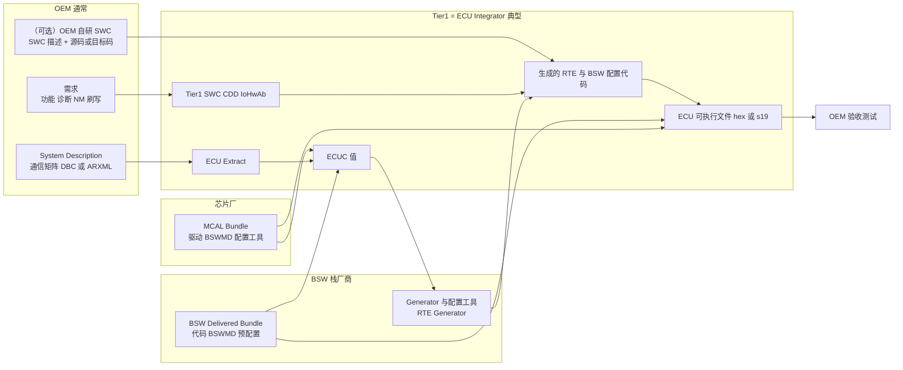

# 02 谁做什么：方法论角色、供应链与交付物

> 本章回答：AUTOSAR 里"谁负责什么"？OEM 是开发 Classic AUTOSAR 软件的吗？OEM、Tier1、BSW 栈厂商、芯片厂（MCAL）、工具厂商各交付哪些东西？
> Prerequisite: [01 架构全景](01-architecture-big-picture.md)   Next: [03 方法论与工作流](03-methodology-workflow.md)
> 对应规范（R25-11）：TR_Methodology p.30、p.38–45、p.71–72、p.94–104、p.137–138、p.182–189、p.414（TR_METH_01023/01024/01047/01049/01110–01112/01114/01116/01139/01156/01157）；SWS_BSWGeneral SWS_BSW_00001；SWS_IoHwAbstraction
> 深入阅读：[02-autosar-classic/04 配置与 ARXML](../02-autosar-classic/04-configuration-arxml.md)、[09-real-project-preparation/01 如何读真实 AUTOSAR 工程](../09-real-project-preparation/01-how-to-read-real-autosar-project.md)、[dcm-upgrade-guide.md](../dcm-upgrade-guide.md)

---

## 1. 本章要回答的问题

1. 规范（Methodology）里到底定义了哪些"角色"？
2. 现实中的公司——OEM、Tier1、BSW 栈厂商、芯片厂、工具厂商——分别扮演哪些角色？
3. **OEM 是开发 Classic AUTOSAR 软件的吗？**
4. 每一方交付什么工件（ARXML、代码、配置、可执行文件）？接口在哪里？
5. 如果我是 Tier1/OEM 的工程师，要在厂商 BSW 栈里升级一个 DCM，我处在哪个位置？

本章严格区分两种信息：

- `[AUTOSAR Standard]`：TR_Methodology R25-11 明文定义的角色与任务。
- `[Industry Practice]`：行业惯例，**规范没有规定**，随项目而异。不要把它当作"AUTOSAR 要求"。

---

## 2. 直觉理解：角色 ≠ 公司

`[Conceptual]` 方法论说的是"**谁在做哪件事**"（角色），不是"**哪家公司做**"。就像电影有"导演、摄影、剪辑"这些岗位，但哪家公司负责哪个岗位，每部电影不同；一人可兼多岗，一岗可多人。

TR_Methodology 明确：**一个人可以担任多个 role，一个 role 可由多个人担任**（TR_METH_01023/01024，METH p.30）。因此"Tier1 = ECU Integrator"这样的等式只是**常见对应**，不是规范。

---

## 3. 规范里的角色（TR_Methodology R25-11 §3.1.4，p.182–189） `[AUTOSAR Standard]`

| Role（原文） | 职责（概括） | 页 |
|---|---|---|
| **System Engineer** | 系统创建/管理/集成；System Description 相关任务：定义系统拓扑、**通信矩阵**、Signal/PDU/Frame/NM/Gateway，**把 SWC 部署到 ECU**，导出各 ECU 通信需求，打平 Software Composition 等 | p.187–188 |
| **Software Component Designer** | 设计 SWC 与 VFB 系统：定义 Application SWC/Composition/Interface/DataType/Mode，定义原子 SWC 的 Internal Behavior，定义 Complex Driver / ECU Abstraction / Sensor-Actuator 组件，**Map Software Component to BSW** | p.185–186 |
| **Software Component Developer** | 写 SWC 代码：生成 **Contract Header**、实现原子 SWC、编译、生成 Component Prebuild Data Set、测量组件资源、定义 SWC Timing | p.186–187 |
| **Basic Software Designer** | 总体设计 BSW，**负责模块间接口与数据类型一致性**：定义 BSW Behavior/Entries/Interfaces/Types、Transformer 规范 | p.182 |
| **Basic Software Module Developer** | 开发并交付一个 BSW 模块：实现、编译核心代码、生成 Module Prebuild Data Set、定义 Module Timing、创建 Library、生成 BSWM Contract Header、定义 Memory Addressing Modes | p.183 |
| **ECU Integrator** | **在 ECU 上集成全部软件**：配置 ECUC / OS / RTE / Com / Diagnostics / NvM / Watchdog Manager / Mode Management / **IO Hardware Abstraction / MCAL**，创建并连接 Service Component，生成 BSW 配置代码、**RTE、RTE 预/后构建数据集、Scheduler、OS**，生成 Memory Mapping Header，编译并生成 ECU 可执行文件 | p.184–185 |
| 其他：Calibration Engineer、Safety Engineer、Rapid Prototyping Engineer、Non-AUTOSAR System Integrator、Certification Agency、AUTOSAR Partnership | 标定、功能安全、快速原型、非 AUTOSAR 系统接入、一致性认证、标准产物 | p.182–189 |

三个重要观察：

1. **"Configure MCAL"、"Configure IO Hardware Abstraction" 是 ECU Integrator 的任务**（METH p.184），而不是单独的"MCAL Developer"角色。MCAL 这个**软件模块**由 BSW Module Developer 开发，但**把它配置到某个具体 ECU**是 Integrator 的事。
2. **方法论里没有 "BSW 厂商"、"工具厂商"、"Tier1" 这些角色名**。涉及工具的是 **Tool Definition**：Compiler、Linker（p.190）、Component API Generator Tool（p.332）、**RTE Generator**（Generate RTE / RTE Prebuild/Postbuild Dataset / Generate Scheduler，p.414）、**BSW Generator Framework**（使用随各模块交付的 BSW generators，p.414）。
3. **三条线可以并行**：SWC 开发、BSW 模块开发、ECU 集成。TR_METH_01110：SWC 的实现在很大程度上独立于 ECU 配置，"这是 AUTOSAR 方法学的关键特性"；TR_METH_01111：BSW 模块独立于 VFB，可在 ECU 集成前任何时间开发；TR_METH_01112：ECU 集成在"BSW Module Delivered Bundles + ECU Extract + 所有 Delivered Atomic SWC"齐备后开始（METH p.41–42）。

### 3.1 规范里出现"组织"名字的地方（仅有这几处）

| 位置 | 内容 | 页 |
|---|---|---|
| TR_METH_01047（两阶段开发） | **primary organization（usually OEM）** 定义整体系统并交付 **System Extract**，**多个 other organizations（usually suppliers）** 并行定义子系统 | p.40–41 |
| TR_METH_01049 | 接收方可把 System Extract 转成自己的 ECU System Description；System Extract 相当于"需求"，子系统是"解决方案" | p.41 |
| TR_METH_01156 | 序列化：**OEM 定义 ISignal 级网络表示**；若 OEM 没提供 implementation data type，**Tier1 可自由选择** | p.71 |
| TR_METH_01157 | 或 OEM 为 root software composition 定义相同的 implementation data types，Tier1 在其内部任意 | p.72 |
| TR_METH_01139（诊断 use case） | OEM 是 diagnostic requester，ECU supplier 是 diagnostic integrator；但若 OEM 自研应用 SWC，OEM 也可兼任 integrator | p.137–138 |

这就是规范对"OEM 开发什么"的**全部明文**。它没有规定 OEM 必须或不得写 SWC/BSW。

---

## 4. 行业里的参与方 `[Industry Practice]`

> 以下是典型分工，**因项目、OEM、供应商关系而异**。公司名只作举例，不涉及其内部实现。

### 4.1 OEM（整车厂）

典型职责：

- **整车/系统架构**：定义有哪些 ECU、网络拓扑、功能分配（对应 System Engineer 任务）。
- **通信矩阵**：信号定义、PDU/帧、周期、ID、NM/网关策略。常见交付格式是 **DBC** 或 **ARXML（System Description / System Extract / ECU Extract）**。
- **需求**：功能需求、诊断需求（诊断矩阵、DID/DTC/Routine 列表）、网络管理、刷写需求、软件接口规范。
- **应用 SWC / 自研软件（越来越常见）**：尤其是整车功能 owner（动力、底盘、智能座舱功能）、集中式/域控制器架构，OEM 可能自己开发应用 SWC，甚至自己的软件平台；再把 **SWC（源码或目标码 + SWC 描述）** 交给 Tier1 集成。
- **验收**：台架/整车测试、网络测试（如 CANoe）、诊断一致性测试。

OEM 通常**不**写 MCAL，也**很少**自己做完整的 BSW 栈或把 ECU 集成到可执行文件（但"OEM 自研 ECU"是例外）。

### 4.2 Tier1（ECU 供应商）

典型职责：

- **ECU 硬件**：原理图、选型、PCB（决定了 IoHwAb、MCAL 配置里的引脚与外设）。
- **ECU 集成**——对应 METH 的 **ECU Integrator**：购买/授权 BSW 栈与 MCAL，配置 ECUC，运行 generator，生成 RTE，编译链接，刷写与调试。
- **应用 SWC**：大部分 ECU 专属应用，或集成 OEM 提供的 SWC。
- **CDD / IoHwAb / Sensor-Actuator SWC**：与具体硬件相关的代码，几乎总是 ECU 专属（IoHwAb 在 SWS 里就是 "integration code"，IOHWAB p.20）。
- **Bootloader、标定、功能安全** 等。

### 4.3 BSW 栈厂商

例如 **Vector（MICROSAR）**、**ETAS（RTA-CAR / RTA-OS）**、**Elektrobit（tresos）** 等（举例而已）。典型交付：

- **BSW 模块实现**（源码或目标码）：Com、PduR、CanIf、Dcm、Dem、NvM、EcuM、BswM、OS 等。
- **BSWMD**（BSW Module Description，ARXML）与**ECUC 参数定义**（StMD 与厂商扩展 VSMD）。规范要求每个 BSW 模块提供 `.arxml` 形式的 BSW Module description（SWS_BSW_00001，BSWG p.19）；ECUC 定义分 Standardized（StMD）和 Vendor-Specific（VSMD，TPS_ECUC_06043/06044）。
- **Generator 与配置工具**：RTE Generator、Com/PduR/Dcm 等模块 generator、配置编辑器（METH 里对应 Tool：RTE Generator 与 BSW Generator Framework，p.414）。
- **预配置/推荐配置**、集成指南、安全手册、版本发布说明。

对应方法论里的 **Basic Software Module Developer**（外加提供 generator）。

### 4.4 MCAL 厂商：通常是芯片厂

例如 **Renesas** 为 RH850 提供 MCAL（Mcu/Port/Dio/Adc/Can/Spi/Gpt/...），Infineon、NXP、TI、ST 等也各自提供。因为 MCAL 与 MCU 寄存器强相关，芯片厂最有能力实现。典型交付：

- **MCAL 驱动源码/库**（上接口按 AUTOSAR 标准化，下接口是该 MCU 的寄存器）；
- 各驱动的 **BSWMD / ECUC 参数定义**（含厂商扩展）和**配置工具**（或与第三方配置工具的集成包）；
- 启动代码、示例工程、勘误与发布说明。

在方法论里，**配置** MCAL 是 ECU Integrator 的任务（METH p.184）。

### 4.5 工具厂商

- **配置/生成工具链**：ECUC 编辑器、RTE/BSW generator、ARXML 编辑器（既可能来自 BSW 栈厂商，也可能来自独立工具厂商）；
- **编译器/链接器**（如 GHS、IAR、Tasking）：在 METH 里是 Tool Definition（p.190）；
- **测试/仿真/总线工具**（CANoe、示波器、调试器）等。

### 4.6 小结：规范角色 ↔ 行业参与方（典型对应）

| 规范角色 | 常见承担方 `[Industry Practice]` |
|---|---|
| System Engineer | OEM（整车层）；Tier1 在子系统层 |
| SWC Designer / Developer | OEM（功能 owner）与/或 Tier1 |
| BSW Designer / Module Developer | BSW 栈厂商；MCAL 部分为芯片厂；CDD 由 Tier1 |
| ECU Integrator | **Tier1**（常见），或 OEM 自研 ECU 时的 OEM |
| Tool（RTE Generator、BSW Generator Framework、配置编辑器） | BSW 栈/工具厂商 |

---

## 5. 谁交付什么工件（Deliverables）

### 5.1 工件词典 `[AUTOSAR Standard]` 概念 + 常见格式

| 工件 | 说明 | 典型提供方 | 规范位置 |
|---|---|---|---|
| **System Description**（含 System Constraint / System Configuration Description / System Extract） | 系统级描述：ECU 清单、通信系统与配置、通信矩阵、SWC 的 port/interface/connection、SWC→ECU 映射 | OEM（System Engineer） | METH p.95、p.258–259 |
| **ECU Extract** | 与 System Configuration Description 同格式，**只含单个 ECU 相关元素**；完全分解，仅含原子 SWC；**ECU 配置的基础** | OEM 导出给 Tier1，或 Tier1 自行导出 | TR_METH_01109，METH p.41、p.95 |
| **通信矩阵**（DBC 或 ARXML） | 信号、PDU、帧、周期、ID（`[Industry Practice]`：DBC 很常见，但完整信息在 ARXML） | OEM | METH p.187–188 |
| **SWC 描述 + 实现**（SwcInternalBehavior、Implementation；代码/目标码；contract header） | SWC 向 RTE 声明需求 + 代码；资源测量值 | SWC Developer（OEM 或 Tier1） | METH p.56–58、p.97、p.186–187 |
| **BSW Module Description（BSWMD）/ BSW Module Delivered Bundle** | 含 Implementation Description、Internal Behavior、Generator、Build Action Manifest、Preconfigured/Recommended Configuration 等 | BSW 栈厂商 / 芯片厂 | METH p.94、p.348；SWS_BSW_00001 |
| **ECUC 参数定义（StMD / VSMD）** | 模块"有哪些参数、取值范围、配置类" | BSW 栈厂商 / 芯片厂 | ECUC p.27–36 |
| **ECU Configuration Values（ECUC 值）** | **一个 ECU 全部 BSW 模块配置的单一格式**，各模块 generator 取自己的子集 | ECU Integrator（Tier1） | TR_METH_01116，METH p.96 |
| **生成的 RTE / BSW 配置代码**（`Rte_*.c/h`、`*_Cfg.c`、`*_PBcfg.c`、OS 配置、MemMap 头） | generator 从 ECUC + ECU Extract + SWC 描述生成 | 工具（由 Integrator 运行） | TR_METH_01092，METH p.103–104 |
| **ECU 可执行文件**（及 A2L） | 所有源码与目标码编译链接 | ECU Integrator | TR_METH_01093，METH p.107 |
| **post-build 配置数据**（可选） | 仅含 post-build 配置的可加载文件，可免重编更新 | ECU Integrator | METH p.101、p.116 |

### 5.2 交付流（Mermaid）

图后逐步解释：

1. OEM 把**系统视角**的东西交给 Tier1：System Extract/ECU Extract（或 DBC + 需求文档）。这相当于 TR_METH_01047/01049 里的"System Extract = 需求"。
2. BSW 栈厂商与芯片厂把**可配置的模块**（代码 + BSWMD + 配置工具）交给 Tier1。
3. Tier1 作为 Integrator：把 ECU Extract + BSWMD 汇成 ECUC 值（TR_METH_01114：配置有两路输入——System Configuration 与 BSW 模块描述，METH p.94），配置各模块（含 MCAL、IoHwAb、OS、RTE）。
4. 运行 generator 得到 RTE/BSW 配置代码（METH p.103–104），再与 SWC（OEM 与 Tier1 的）、BSW 代码、MCAL 一起**编译链接**（METH p.107）。
5. 可执行文件交给 OEM 验收；诊断/网络测试发现的问题回到配置或 SWC。

### 5.3 接口在哪里？

最关键的几个"契约面"：

- **System/ECU Extract**：OEM ↔ Tier1 的系统契约。
- **SWC 描述 + contract header**：SWC Developer ↔ Integrator 的契约；SWC 实现可在 ECU 配置之前完成（METH p.41–42）。
- **BSWMD + ECUC 定义**：栈厂商/芯片厂 ↔ Integrator 的契约。
- **RTE 生成**：Integrator 在 ECU 层面运行 RTE Generator（generation phase，METH p.386–387），而 SWC 侧只需要 contract phase 产物（METH p.307–308）。

---

## 6. 核心问题："OEM 是开发 Classic AUTOSAR 软件的吗？"

### 6.1 简短回答

**取决于项目与 OEM。** 规范不规定。常见模式有三种，下面分别给出。

### 6.2 常见模式（`[Industry Practice]`）

| 模式 | OEM 做什么 | Tier1 做什么 | 备注 |
|---|---|---|---|
| **A. OEM 规格 + Tier1 实现**（最传统） | 写需求、通信矩阵、诊断需求；可能给 ECU Extract | 实现几乎全部软件：应用 SWC、集成 BSW、MCAL、CDD | OEM 基本不碰 AUTOSAR 工具链；对应 METH 的 primary organization / suppliers |
| **B. OEM 提供 SWC，Tier1 集成** | 自研应用 SWC（描述 + 源码/目标码），定义 root composition 的数据类型；其余同 A | 把 OEM SWC 与自己的 SWC、BSW、MCAL 集成到 ECU | 对应 TR_METH_01157 之类的序列化/类型约定；诊断上 Tier1 集成 OEM 的 DTC/DID 定义 |
| **C. OEM 自研 ECU / 平台** | 同时承担 System Engineer、SWC Developer，甚至 ECU Integrator；采购 BSW 栈和 MCAL | 可能只提供硬件或制造 | TR_METH_01139：OEM 自研应用 SWC 时可兼任 diagnostic integrator |

此外：
- **OEM 通常不写 MCAL**，多数情况下也不写完整 BSW，但可能**维护自己的基础软件平台或统一配置模板**，要求各 Tier1 遵守。
- 在集中式/域控制器趋势下，OEM 软件占比上升，但这是趋势，不是规范。
- 即使 OEM 不写 SWC，OEM 的**通信矩阵 ARXML、诊断配置**也会直接进入 ECU 的配置——这也是一种"开发 AUTOSAR 配置"。

### 6.3 回答模板

> OEM 在 AUTOSAR 方法学里通常是 primary organization：定义整车系统与通信（System Extract）。至于是否开发应用 SWC、甚至集成 ECU，规范没有规定，取决于项目分工：可能只出规格，可能提供 SWC 让 Tier1 集成，也可能自研 ECU。MCAL 通常由芯片厂交付，ECU 集成通常由 Tier1 做。

---

## 7. 责任矩阵（RACI 风格）`[Industry Practice]`

R = 负责执行，A = 最终问责，C = 被咨询，I = 被通知，— = 通常不涉及。**仅为典型值**，项目合同可能完全不同。

| 活动 / 工件 | OEM | Tier1 | BSW 栈厂商 | 芯片厂（MCAL） | 工具厂商 |
|---|---|---|---|---|---|
| 整车系统架构与 ECU 划分 | A/R | C | — | — | — |
| 通信矩阵（DBC/ARXML） | A/R | C | — | — | C（导入导出） |
| 诊断需求（DID/DTC/Routine） | A/R | C | — | — | — |
| 导出 System Extract / ECU Extract | A/R | C/R | — | — | C |
| 应用 SWC 设计与实现（OEM 负责的功能） | A/R | C | — | — | — |
| 应用 SWC 设计与实现（ECU 专属功能） | C | A/R | — | — | — |
| 开发 BSW 标准模块（Com/PduR/CanIf/Dcm/…） | I | C | A/R | — | — |
| 开发 MCAL 驱动 | — | C | — | A/R | — |
| 开发 RTE/BSW Generator 与配置编辑器 | — | I | R | — | A/R |
| CDD、IoHwAb、Sensor-Actuator SWC | C | A/R | C | C | — |
| ECUC 配置（Com/PduR/Dcm/NvM/OS/RTE …） | C（审查） | A/R | C（支持） | — | — |
| MCAL 配置（Mcu/Port/Dio/Can/Adc …） | — | A/R | — | C（支持） | — |
| 运行 generator、编译链接、产出可执行文件 | I | A/R | C | — | R（工具） |
| Bootloader / 刷写 | C（需求） | A/R | C | C | — |
| ECU 功能测试 | C | A/R | — | — | — |
| 整车/网络/诊断测试、验收 | A/R | C | — | — | — |
| BSW 版本升级（例如 DCM 升级） | I/C | A/R | R（发布）| C | R（工具兼容） |

---

## 8. 你的真实场景：升级厂商 BSW 栈里的 DCM（抽象描述）

`[Real Project Consideration]` 假设你是 Tier1 或 OEM 的工程师，工程里的 BSW 由某商业栈提供（例如 RTA-CAR 这类），现在要把其中的 Dcm 升级到新版本。把它放在本章框架里：

- 你很可能处于 **ECU Integrator** 的位置：你**不开发** DCM 的源码，而是**换 BSW Delivered Bundle、迁移 ECUC 配置、重新生成、重新编译链接、回归测试**。
- 你的输入：新 Dcm 的 BSW Module Description / ECUC 定义（可能带来参数新增/删除/重命名）、旧工程的 ECUC 值、OEM 的诊断需求（DID/DTC/Session/Security）。
- 你的产出：迁移后的 ECUC（Dcm、Com/PduR 相关、Rte 的 Dcm 端口映射）、再生成的 `Dcm_Cfg.c / Dcm_Lcfg.c / Rte_Dcm.c` 之类文件（名称以项目为准）、新的可执行文件、测试报告。
- 要谨慎的"接缝"：Dcm 与 PduR/CanTp 的 PDU 映射、Dcm 与 RTE 的 `Rte_Call` 端口、Dcm 对 SchM/MainFunction 的周期要求、MemMap 段、与 Dem 的接口版本。
- **谁能回答问题**：栈厂商支持（模块行为）、OEM（诊断需求）、你自己（集成与应用 SWC 实现）。

进一步阅读：[dcm-upgrade-guide.md](../dcm-upgrade-guide.md)、[06-dcm/14 DCM 升级指南](../06-dcm/14-dcm-upgrade-guide.md)、[09-real-project-preparation/07](../09-real-project-preparation/07-rtacar-dcm-upgrade-preparation.md)。注意：这些文档把 RTA-CAR 当作"可能的真实环境"，不等于断言其内部实现。

---

## 9. 常见误解

1. **"Tier1 就是 AUTOSAR 里的 ECU Integrator"** —— 常见对应，但 METH 并没这样规定；OEM 自研 ECU 时 OEM 也是 Integrator。
2. **"OEM 不碰 AUTOSAR 软件"** —— 不对，OEM 常写 SWC 或维护 ARXML/配置模板；也有 OEM 自研基础软件平台。
3. **"MCAL 由 Tier1 写"** —— 通常由芯片厂交付，Tier1 做配置、适配与集成。
4. **"AUTOSAR 认证等于都兼容"** —— 认证只说明满足某些一致性测试范围，不保证两家厂商的 BSW/MCAL 无缝拼装（需要集成与适配，见 [01 章](01-architecture-big-picture.md) §12）。
5. **"配置就是填 GUI"** —— 配置是**契约面**，错误配置的后果在运行时（PDU 丢失、task 超时）才出现。

---

## 10. 真实项目里你会看到什么 `[Industry Practice]`

- 项目启动时先"对齐版本"：OEM 的 AUTOSAR release、栈厂商版本、MCAL 版本、编译器版本、工具版本。
- 交付物清单（SOW/ICD）里常见：ECU Extract/DBC、软件接口规格、SWC 描述、BSW 配置模板、MemMap/链接脚本约定。
- 变更管理：BSW 或 MCAL 升级、通信矩阵变更、诊断需求变更，都会触发"重新生成 + 回归"。
- 沟通渠道：OEM 软件接口工程师 ↔ Tier1 集成工程师 ↔ 栈厂商 FAE ↔ 芯片厂应用工程师。

---

## 11. 一句话记住

- **规范定义角色，不定义公司**：System Engineer、SWC Designer/Developer、BSW Designer/Module Developer、ECU Integrator 等（METH p.182–189）。
- **配置 MCAL/IoHwAb 是 ECU Integrator 的任务**（METH p.184）。
- **规范只说 OEM "通常"是 primary organization**（TR_METH_01047）；OEM 是否写 SWC/BSW 由项目决定。
- **典型对应**：OEM = 系统与需求（可能提供 SWC）；Tier1 = ECU 集成 + ECU 专属软件；BSW 栈厂商 = 模块+工具；芯片厂 = MCAL；这些是 `[Industry Practice]`。
- **契约面**：ECU Extract、SWC 描述、BSWMD/ECUC 定义、ECUC 值、生成代码、可执行文件。

---

## 12. 自测题

1. 方法论里没有哪些"角色名"，却在日常工作中常被提到？这对你理解"Tier1 = Integrator"有什么提醒？
2. 配置 MCAL 是谁的任务？MCAL 软件由谁开发（典型）？
3. ECU Extract 和 System Description 有什么区别？它们在流程中哪个阶段使用？
4. 说出三种"OEM 是否开发 AUTOSAR 软件"的典型模式。
5. 画出（或口述）从 OEM 的通信矩阵到 ECU 可执行文件的交付链。
6. 你要升级 DCM，你更像哪个角色？有哪些输入、产出、风险？
7. 为什么 BSWMD 对 Integrator 如此重要？（提示：SWS_BSW_00001、ECUC 定义。）

---

## 13. 下一章

[03 方法论与工作流](03-methodology-workflow.md)：从 System Description 到可执行文件，逐步走一遍 AUTOSAR 的开发流水线。
