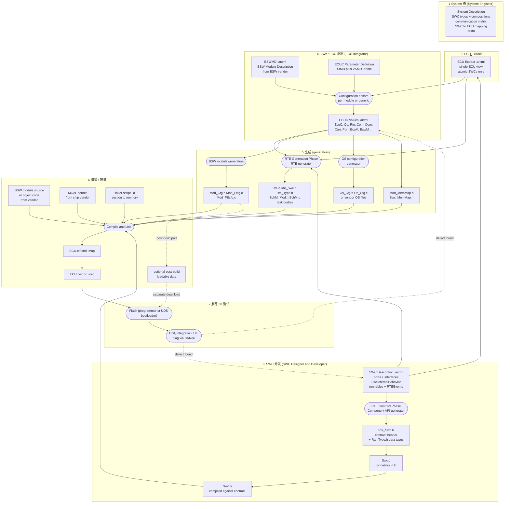

# 03 端到端开发工作流：从 System Description 到刷写与测试（Methodology）

> 本章回答：(1) 一个 Classic AUTOSAR ECU 的软件，从“系统设计”到“烧进板子”，中间经过哪些步骤、每步的输入/输出文件是什么？(2) 谁（哪个 role）在哪一步做事，哪些步骤是工具自动生成的？(3) 为什么改一个配置要重新生成、重新编译？
> Prerequisite: [02 谁做什么](02-who-builds-what.md)（及 [01 架构全景](01-architecture-big-picture.md)）；可选：[配置与 ARXML](../02-autosar-classic/04-configuration-arxml.md)
> Next: [04 ECU 启动与 EcuM](04-ecu-startup-ecum.md)
> 对应规范（R25-11）：TR_Methodology（METH）§2.1、§2.7、§3.1.4、§3.4.1.6；TPS_ECUConfiguration（ECUC）§配置类；SWS_BSWGeneral（BSWG）§5.1；SWS_MemoryMapping（MEMMAP）；SWS_RTE §3.1（contract / generation phase）。
> 深入阅读：[生成代码](../02-autosar-classic/05-generated-code.md)、[RTE 生成](../07-rte-swc/05-rte-generation.md)、[如何阅读真实 AUTOSAR 工程](../09-real-project-preparation/01-how-to-read-real-autosar-project.md)、[UDS demo](../../examples/uds_diag_demo/README.md)

> 版本说明：除非另注，规范引用均为 **R25-11**，页码为文本抽取文件中的 PDF 页码（`artifacts/pdf-text/autosar-cp-R25-11/`）。真实项目所用 release（例如 RTA-CAR 12.9.0 对应的 AUTOSAR 版本）以项目为准，**需在真实项目环境中确认**。
> 标记约定：`[AUTOSAR Standard]` = 规范明文；`[Industry Practice]` = 行业惯例，规范没有规定，因公司/项目而异；`[Educational Implementation]` = 本仓库 demo 的手写代码；`[Conceptual]` = 概念性示意。

---

## 1. 本章要回答的问题

你拿到一个真实项目，看到一堆 `.arxml`、`Rte_*.h`、`*_Cfg.h`、`*_PBcfg.c`、`.ld`、`.elf`，很容易迷路。这一章给你一张“地图”：**每个文件是哪一步产出的、被哪一步消费的、谁负责、坏了会怎样。**

读完你应该能做到：

1. 按顺序说出 8 个阶段：System → ECU Extract → SWC 开发 → BSW/ECU 配置 → 生成 → 编译链接 → 刷写 → 测试。
2. 对任何一个文件，判断它是“人写的”“工具生成的”还是“供应商交付的”。
3. 解释 **RTE contract phase** 与 **RTE generation phase** 的区别，以及为什么 SWC 可以在 ECU 配置之前先写完。
4. 区分 pre-compile / link-time / post-build 三种配置类，以及它们对“改了配置要做什么”的影响。
5. 以 `VehicleInfoSWC` 提供 VIN（DID `0xF190`）给 Dcm 为例，指出每一步对应 demo 中的哪个文件。

---

## 2. 直觉理解：像盖一栋楼

> 类比（只帮助理解，不替代规范）：AUTOSAR 工作流像“设计院 → 建材厂 → 施工队”。
>
> - **System Engineer** = 总设计：决定整栋楼有几间房、房间之间怎么接线（哪个 SWC 在哪个 ECU、信号怎么走）。
> - **SWC Developer** = 做家具的人：按“接口说明书”做家具，不必知道家具最终放哪层楼。这份“说明书”就是 **contract header**。
> - **BSW 模块开发者** = 建材厂：交付水管、电线（Can、CanIf、Dcm 的源码或目标码 + 配置模板）。
> - **ECU Integrator** = 施工队：拿着设计图（ECU Extract），把家具和建材装到这一栋楼里，配置每一个开关，运行“出图工具”（generator），最后合拢（编译链接）。

关键直觉：**AUTOSAR 把“写应用逻辑”和“把软件装进具体 ECU”拆开了。** 这样同一个 SWC 可以放进不同 ECU；不同公司可以并行开发。METH 把它写成明确要求：SWC 的实现在很大程度上独立于 ECU 配置（`TR_METH_01110`，METH p.41），BSW 模块可以在 ECU 集成之前任何时间开发（`TR_METH_01111`，p.42），而 ECU 集成要等“BSW 交付包 + ECU Extract + 所有已交付的原子 SWC”齐备才开始（`TR_METH_01112`，p.42）。

---

## 3. 原理：Methodology 规定了什么（以及没规定什么）

### 3.1 [AUTOSAR Standard] 顶层活动

METH §2.1（p.43–45）的顶层活动链：

```text
(可选) Develop an Abstract System Description
  -> Develop a VFB System Description
  -> Develop System            （定义 ECU/网络拓扑、部署 SWC、导出通信矩阵）
  -> Develop Sub-System
  -> 并行：Develop Application Software  ||  Develop Basic Software
  -> Integrate Software for ECU
```

ECU 集成（METH §2.7，`TR_METH_01087`，p.94）有四个主活动：

1. **Prepare ECU Configuration**
2. **Configure BSW and RTE**
3. **Generate BSW and RTE**（`TR_METH_01092`，p.103）
4. **Build Executable**（`TR_METH_01093`，p.107）

另有可选的 Model ECU Timing。注意：**METH 明确说不规定配置顺序**（p.99–101），“Diagnostics 预期先于 NvM”只是依赖提示。

### 3.2 [AUTOSAR Standard] Role（角色）而不是公司

METH §3.1.4（p.182–189）定义的是 **role**，不是公司类型。一个人可以兼任多个 role，一个 role 可由多人担任（`TR_METH_01023/01024`，p.30）。

| Role（原文） | 本章里做什么 | 页 |
|---|---|---|
| System Engineer | System Description、通信矩阵、SWC→ECU 映射、导出 ECU Extract | p.187–188 |
| Software Component Designer | 定义 SWC、port interface、SwcInternalBehavior（runnable/event） | p.185–186 |
| Software Component Developer | 生成 contract header、用 C 实现 runnable、编译 | p.186–187 |
| Basic Software Designer / Module Developer | 设计并交付 BSW 模块（含 BSWMD、生成器、预配置） | p.182–183 |
| ECU Integrator | 配置全部 ECUC（含 **MCAL、IO Hardware Abstraction**、OS、RTE、Com、Diag…）、运行生成器、编译链接 | p.184–185 |

> 重点（METH p.184）：**“Configure MCAL”“Configure IO Hardware abstraction” 是 ECU Integrator 的任务**，规范里没有单独的 “MCAL Developer” 去配置它。

### 3.3 [AUTOSAR Standard] 规范里出现的组织名（仅此几处）

- 两阶段开发：primary organization（usually OEM）定义整体系统、交付 System Extract；other organizations（usually suppliers）并行定义子系统（`TR_METH_01047`，p.40–41）。
- 诊断 use case：OEM 是 diagnostic requester，ECU supplier 是 diagnostic integrator；OEM 自研应用 SWC 时可兼任 integrator（`TR_METH_01139`，p.137）。
- 序列化 use case 里提到 OEM 与 Tier1 对 implementation data type 的分工（`TR_METH_01156/01157`，p.71–72）。

**METH 没有 “BSW 厂商” “工具厂商” 这种 role。** 凡写 “Tier1 = ECU Integrator” “OEM 只写部分应用 SWC” 的地方，都是 `[Industry Practice]`。

### 3.4 [Industry Practice] 典型分工（因项目而异）

| 事情 | 典型承担者 | 说明 |
|---|---|---|
| 通信矩阵、System/ECU Extract | OEM | 常以 DBC / ARXML 交付 |
| 部分应用 SWC | OEM 或 Tier1 | 视功能 owner 而定 |
| ECU 集成（配置、生成、编译链接、刷写） | Tier1（ECU supplier） | 对应 METH 的 ECU Integrator |
| BSW 栈 + RTE/OS 生成器 | BSW 供应商 | 随包带 BSWMD、ECUC 定义、配置工具 |
| MCAL | 芯片厂（如 Renesas） | 带自己的配置器和 ECUC 定义 |
| 工具举例 | Vector DaVinci、ETAS ISOLAR / RTA、EB tresos | **仅举例**，没有任何一家是规范要求 |

---

## 4. 全景图：产物（artifact）与箭头

下图把 8 个阶段的文件串在一起。读图规则：**矩形 = 文件/产物，圆角 = 阶段/活动，箭头 = “作为输入被消费”。**



**逐段解释：**

1. **System → ECU Extract。** System Engineer 在系统层定好“谁在哪个 ECU、信号怎么走”，再导出只含本 ECU 的 **ECU Extract**（`TR_METH_01109`，p.41、p.95）。Extract 是 ECU 配置的“基础”。
2. **SWC 开发线（左侧）和 BSW 配置线（中间）是并行的。** SWC 线只依赖 SWC Description，产出 `Swc.o`；它不需要等 ECU 配置完成。
3. **ECUC Values 是配置中枢。** METH `TR_METH_01116`（p.96）：ECU Configuration Values 是“单个 ECU 全部 BSW 模块配置的单一格式”，每个 generator 从中取自己需要的子集。
4. **所有生成器都读同一份 ECUC Values**（外加 ECU Extract 和 SWC Description 用于 RTE），所以“改配置→重新生成”是一个整体流程。
5. **编译链接把四路东西合拢**：人写的 SWC、生成的 RTE/配置、供应商的 BSW/MCAL、链接脚本。
6. **回流虚线**：测试发现问题后，要回到 SWC 描述或 ECUC 去改，而不是直接改生成的文件。

> `[Industry Practice]` 实际工程常把“生成 + 编译 + 链接 + 生成 hex”写进一个 Makefile / CMake / 批处理脚本，一键重建。第一周你要找的就是它（见[第 10 章](10-workflow-practice-and-faq.md)）。

---

## 5. 阶段详解（输入 / 输出 / 角色 / 工具 / 出错点）

> 每个阶段都用统一格式：**输入 → 输出 → 角色 → 工具类别 → 常见出错**。工具类别是 `[Industry Practice]`。

### 5.0 运行示例：`VehicleInfoSWC` 提供 VIN（DID `0xF190`）

我们用同一个例子贯穿全章：诊断仪发 `22 F1 90`，Dcm 要读 VIN，VIN 数据由应用 SWC `VehicleInfoSWC` 提供。


在 demo（`[Educational Implementation]`，手写“假装是生成的”）中，对应关系如下：

| 工作流位置 | 概念上的文件 | demo 中的对应文件（path:line） |
|---|---|---|
| SWC Description（ARXML） | `VehicleInfoSWC.arxml`：PPort `DataServices_DID_F190`、operation `ReadData`、runnable、`OperationInvokedEvent` | demo 里**没有 ARXML**；其信息以注释形式出现在 `examples/uds_diag_demo/rte/Rte_VehicleInfoSWC.h:12-17` |
| Contract header | `Rte_VehicleInfoSWC.h` | `examples/uds_diag_demo/rte/Rte_VehicleInfoSWC.h`（runnable 原型：`:28` `VehicleInfoSWC_ReadVin`） |
| SWC 实现 | `VehicleInfoSWC.c` | `examples/uds_diag_demo/swc/VehicleInfoSWC.c:77`（`VehicleInfoSWC_ReadVin`），`:54` Init runnable，`:62` 10 ms runnable |
| RTE 生成物（桥） | `Rte_Dcm.c`（Rte.c 的一部分） | `examples/uds_diag_demo/rte/Rte_Dcm.c:54`（`Rte_Call_DataServices_DID_F190_ReadData` 调 `VehicleInfoSWC_ReadVin`），`:38` `Rte_Start`，`:46` `Rte_Task_10ms` |
| Dcm 配置生成物 | `Dcm_Cfg.c` | `examples/uds_diag_demo/diag/Dcm_Cfg.c:33-38`（`Dcm_Dids[]` 的 0xF190 行，指向 `Rte_Call_DataServices_DID_F190_ReadData`） |
| 初始化顺序（EcuM/BswM 角色） | `EcuM.c` | `examples/uds_diag_demo/integration/EcuM.c:24-42`（`EcuM_Init`，`:37` 调 `Rte_Start`） |
| 周期调度（task 角色） | `BswScheduler.c` | `examples/uds_diag_demo/integration/BswScheduler.c:50-51`（`Dcm_MainFunction`、`Rte_Task_10ms`） |

> 注意：demo 中 `Rte_Start` 由 `EcuM_Init` 直接调用，这是教学简化。R25-11 中，EcuM 的 StartPostOS 不调 `Rte_Start`，而是由 BswM 的 `BswMRteStart` action（`ECUC_BswM_01073`）完成；RTE SWS 的措辞（“by the EcuStateManager”，`SWS_Rte_CONSTR_09035`，RTE p.805）沿用旧版，存在文档间不一致。真实项目以生成工具/集成方案为准。

---

### 5.1 阶段 1：System 级设计

- **输入**：整车/子系统需求、功能划分、网络拓扑设想。
- **输出**：**System Description**（METH 的 “System Description” 是泛称，含 Abstract System Description、System Constraint Description、**System Configuration Description**、System Extract，p.258–259）。System Configuration Description 包含（p.95）：
  - ECU 清单与通信系统配置；
  - **通信矩阵**（signal ↔ PDU ↔ frame ↔ CAN ID）；
  - SWC 的 port / interface / connection（引用 SWC Description）；
  - **SWC → ECU 映射**（deployment）。
- **角色**：System Engineer（`[AUTOSAR Standard]`，p.187–188）。
- **工具类别** `[Industry Practice]`：系统/网络设计工具（如 DaVinci Developer/Network Designer、ISOLAR-A、PREEvision 一类），以及 DBC 导入导出。
- **SWC 的种类与组合**：application SWC、sensor-actuator SWC、ECU-abstraction SWC、service SWC、complex driver SWC、composition（VFB p.47–54；`TPS_SWCT_01108` 等）。**composition 只是“容器”，不能含 runnable**（`TPS_SWCT_01097/01098`，SWCT p.525）；映射到 ECU 的必须是**原子 SWC**（VFB p.43）。
- **本例**：`VehicleInfoSWC`（application SWC）部署到诊断 ECU；其 PPort `DataServices_DID_F190` 将连接到 Dcm 提供的 RPort（**服务端口在 ECU 配置阶段才连接**，VFB p.41 脚注、SWCT p.667）。
- **常见出错**：
  - 通信矩阵与 SWC 数据元素映射缺失 → 后面 RTE 生成时报“未映射”或运行时收不到数据。
  - 把 composition 当成 ECU 部署单位 → 必须打平成原子 SWC。
  - 不同 ECU 对同一信号的 data type / 字节序约定不一致。

### 5.2 阶段 2：导出 ECU Extract

- **输入**：System Configuration Description。
- **输出**：**ECU Extract** `.arxml`——与系统描述格式相同，但**只含本 ECU 相关元素**，完全展开（只含原子 SWC），**是 ECU 配置的基础**（`TR_METH_01109`，p.41；p.83、p.95）。
- **角色**：System Engineer（Extract the ECU Communication / Flatten Software Composition 等任务，p.187–188）。
- **工具类别** `[Industry Practice]`：系统设计工具内的“导出 ECU Extract”功能。
- **与“两阶段开发”的关系**：OEM 常把 System Extract / ECU Extract 当“需求”交给 supplier，supplier 据此做自己的 ECU System Description（`TR_METH_01047/01049`，p.40–41）。
- **常见出错**：Extract 版本与 SWC Description 版本不一致（SWC 改了端口但 Extract 没更新）；Extract 里缺少某个 PDU 或 signal；ARXML 的 schema 版本与工具不匹配。

### 5.3 阶段 3：SWC 开发

这一步分成四个小环节，是**初学者最容易混淆**的地方。


#### 5.3.1 SWC description ARXML

- **内容**：SWC type、ports、port interface（本例 `DataServices_DID_F190` 是 Client-Server，operation `ReadData`）、**SwcInternalBehavior**——描述 SWC 对 RTE 的需求：有哪些 **runnable**、哪些 **RTEEvent**（`TimingEvent`、`OperationInvokedEvent`、`InitEvent` …）、数据访问点、ExclusiveArea、PerInstanceMemory 等（`TPS_SWCT_01075`，SWCT p.520–525）。
- `RunnableEntity` 是 SWC 提供的最小代码片段，由 OS **间接**调度（`TPS_SWCT_01030`，p.525）。**只有原子 SWC 才有 runnable**。
- 本例：`VehicleInfoSWC_ReadVin` 是 **server runnable**，由 `OperationInvokedEvent`（对应 operation `ReadData`）触发；另有 `VehicleInfoSWC_Init`（init runnable）和 `VehicleInfoSWC_Run10ms`（`TimingEvent` 10 ms）。
- **角色**：SWC Designer。**工具类别** `[Industry Practice]`：SWC 建模工具（DaVinci Developer、ISOLAR-A 等）。
- **常见出错**：runnable 没有任何 RTEEvent 引用 → RTE 永远不会激活它（RTE p.142）；port interface 的 operation 签名与 Dcm 期望的 `DataServices_<Data>` 接口不一致。

#### 5.3.2 RTE contract phase → contract header

- **规范怎么说**：SWC Developer 执行任务 *Generate Atomic Software Component Contract Header Files*（METH §3.4.1.6，p.307），产出 **Application Header File**（即 `Rte_<SwcType>.h`）和 **Software Component Data Types Header**，“让 SWC 之后能与 RTE 链接”。RTE SWS §3.1.1（p.93–95）称之为 RTE **Contract Phase**：由 SW-C Type 描述 + Internal Behavior 生成 **Component API**，使开发者不依赖最终通信位置写代码。
- **关键**：contract phase **不需要 ECU 配置**，只需要 SWC 描述。头文件里包含：runnable 原型（RTE 会调用它们）+ 本 SWC 可以使用的 `Rte_*` API（`Rte_Read/Write/Call/IRead...`）。
- **本例**：`examples/uds_diag_demo/rte/Rte_VehicleInfoSWC.h` 就是它的手写版（文件头注释 `:4-10` 明说它对应“RTE generator 为每个 SWC type 生成的 application header”）。**SWC 只包含自己的 `Rte_<Swc>.h`，不包含 `Dcm.h`/`NvM.h`**——这是它能在不同 ECU 间移植的原因（`:9-10`）。（demo 的 `:22-23` 实际还 include 了 `Rte_Dcm_Type.h` 和 `NvM.h`，是教学简化，真实 contract header 只依赖生成的类型头。）
- **工具类别** `[Industry Practice]`：厂商 RTE 工具提供 “Generate contract phase / Generate component API / Generate application headers” 之类命令，可单独运行。
- **常见出错**：SWC 描述改了（加了 port、改了 operation 参数），却没重新生成 contract header → 编译时就会报错或链接不上；手改 contract header 后被覆盖。

#### 5.3.3 用 C 实现 runnable

- **输入**：contract header + 需求。**输出**：`Swc.c`（人写的）。**角色**：SWC Developer（Implement Atomic SWC，METH p.186–187）。
- **规则** `[AUTOSAR Standard]`：runnable 本身与 OS 无关，**不允许直接调 OS 服务**，只能经 RTE API（RTE p.139）；SWC 不直接访问 MCAL（EXP p.79，VFB p.86）；SWC 不包含中断处理函数，只作为 task 里的 runnable（OS p.23）。
- **本例** `[Educational Implementation]`：`examples/uds_diag_demo/swc/VehicleInfoSWC.c:77-96` 实现 `VehicleInfoSWC_ReadVin(Dcm_OpStatusType OpStatus, uint8 *Data)`——首次调用返回 `DCM_E_PENDING`（`:91`），之后 `memcpy` 17 字节 VIN 并返回 `E_OK`（`:93-95`）。注意它**只知道 OpStatus 和 Data，不知道 CAN、不知道 Dcm 的内部结构**。

#### 5.3.4 编译对着 contract header

- **输出**：`Swc.o`（Compile Atomic SWC，METH p.186–187）。可顺带“Measure Component Resources”（栈、ROM/RAM、WCET）并写回 SWC 描述，供集成阶段使用（p.97）。
- **意义**：在 **ECU 配置完成之前**，SWC 就能独立编译通过，验证“代码与合约一致”。这是 `TR_METH_01110` 描述的“并行开发”真正落地的地方。
- **工具类别** `[Industry Practice]`：普通 C 编译器（目标编译器如 GHS/IAR/GCC，或 PC 上的 gcc 做 SIL 单元测试）。
- **常见出错**：SWC 里 include 了不该 include 的 BSW 头（破坏可移植性）；用了裸全局变量而不是 PerInstanceMemory（多实例时冲突）；runnable 里阻塞等待（category 1 runnable 不允许，见 FAQ）。

### 5.4 阶段 4：BSW / ECU 配置

#### 5.4.1 先弄清三类文件：BSWMD、ECUC 定义、ECUC 值

| 文件 | 回答的问题 | 谁提供 | 出处 |
|---|---|---|---|
| **BSWMD**（BSW Module Description） | 这个模块有哪些入口、内部行为（MainFunction、BswEvent）、memory section | BSW 模块开发者（随 Delivered Bundle） | `SWS_BSW_00001`：每个 BSW 模块须提供 `.arxml` 形式的描述（BSWG p.19）；METH p.348 |
| **ECUC Parameter Definition**（StMD / VSMD） | 这个模块能配哪些参数、范围、多重性、配置类 | StMD 由 AUTOSAR 随 SWS 发布（`/AUTOSAR/EcucDefs/`，`TPS_ECUC_02130`）；VSMD 由厂商扩展（`TPS_ECUC_06043/06044`，ECUC p.36） | ECUC p.27–36 |
| **ECUC Values**（ECU Configuration Values） | **这个 ECU** 实际选了什么值 | ECU Integrator（用配置编辑器填） | ECUC p.118–134；`TR_METH_01116`（METH p.96） |

> 类比：**Definition = 空白表格模板**（有哪些栏、栏的类型），**Values = 填好的表格**。二者独立：`EcucDefinitionCollection` 与 `EcucValueCollection` 互不依赖（ECUC p.118）。

值文件里的层级：`EcucValueCollection` → `EcucModuleConfigurationValues`（引用 definition，并带 `implementationConfigVariant`，`TPS_ECUC_03016`，p.120）→ `EcucContainerValue`（`TPS_ECUC_03012`，p.128）→ 参数值/引用值。

#### 5.4.2 配置类：pre-compile / link-time / post-build

每个参数有 `valueConfigClass`（值最迟何时可变），每个变体各一个（`TPS_ECUC_08034/08035`，ECUC p.52）。METH §2.7.9（p.109–120）对三者的流程含义：

| 配置类 | 值何时固定 | 典型生成物 | 改值后要做什么 | 典型用途 |
|---|---|---|---|---|
| **Pre-compile** | 编译前 | `Mod_Cfg.h`（宏）、必要时 `Mod_Cfg.c` | 重新生成 + **重新编译**用到它的源码；模块须有源码 | 开关（如 `DevErrorDetect`）、数组大小 |
| **Link-time** | 链接前 | `Mod_Lcfg.c` | 重新生成 + 编译该配置源文件 + **重新链接**；适合只交付目标码的模块 | 常量表、ID 映射表 |
| **Post-build** | 烧录后仍可改 | `Mod_PBcfg.c` | 重新生成数据，单独下载到可重刷内存段，**不重编不重链**（`TR_METH_01104/01105`，p.116） | 多车型/多变体数据 |

- 同一变体里，**一个参数只属于一个配置类；不同参数可以不同配置类**（ECUC p.52；EXP p.121）。
- 模块 Init 如何拿配置：post-build 变体下 Init 收到**指向配置结构的指针**（EXP p.118–123，例如 `Can_Init(&Config)`），由 EcuM 持有各模块的 post-build 指针；pre-compile 变体 Init 常传 `NULL_PTR`（`SWS_BSW_00212`，BSWG p.73）。VariantPostBuild 时指针必须非 NULL（`SWS_BSW_00050`，p.74）。
- EcuM 在初始化第一个 BSW 模块前会做一次**配置一致性检查**，确保 post-build 参数与 pre-compile/link-time 参数匹配（`SWS_EcuM_02796`，ECUM p.43）。

> 本仓库 demo（`[Educational Implementation]`）中，`Dcm_Cfg.c` 里的 `Dcm_Dids[]` 属于“被生成的配置表”，通过 `Dcm_Init(&Dcm_Config)`（`EcuM.c:36`）传入——对应真实工程里“post-build/link-time 配置指针由 EcuM/BswM 传给 Init”这件事。

#### 5.4.3 谁配置什么

- **ECU Integrator** 配置（METH p.100–101、p.184）：ECUC、OS、RTE、Com、Diagnostics、NvM、Watchdog Manager、Mode Management、**IO Hardware Abstraction、MCAL**、Memmap Allocation、Transformer，以及 Create/Connect Service Component。
- **Prepare ECU Configuration**（`TR_METH_01088/01117`，p.98）：在 ECU Extract 上叠加 SWC/BSW 的 **Service Needs** 与各模块的 Preconfigured/Recommended Configuration，选定每个模块的实现，得到 **base ECU Configuration**。ECUC 规范规定：强制容器/参数（`lowerMultiplicity>0`）至少生成该数量的实例（`TPS_ECUC_01016`，p.273）。
- **配置输入有两路**（`TR_METH_01114`，p.94）：System Configuration（跨 ECU 必须一致的部分，来自 ECU Extract）与 BSW 模块描述。
- **RTE 配置** 还需要该 ECU 所有原子 SWC 的 Implementation；SWC 变了就要重做（METH p.99–101）。其中最重要的两类配置：
  - **runnable → task 映射**：`RteEventToTaskMapping`（`ECUC_Rte_09020`）、`RtePositionInTask`（`09023`）、`RteActivationOffset`（`09018`）。**映射是配置输入，不是 RTE 生成器的决定**（RTE p.135、p.139–140）。
  - **BSW MainFunction → task 映射**：`RteBswEventToTaskMapping`，因此 MainFunction 与 SWC runnable 可以放在同一个 `OsTask` 里按 position 排序。
- **本例**：要让 `22 F1 90` 工作，ECU Integrator 要在 Dcm 的 ECUC 里新增 `DcmDspDid`（DID = 0xF190）+ `DcmDspData`（长度 17，`DcmDspDataUsePort = USE_DATA_ASYNCH_CLIENT_SERVER`），并让 Dcm 的 RPort 与 `VehicleInfoSWC` 的 PPort 在 ECU 配置中建立连接（`DcmDspDataUsePort` 即 `ECUC_Dcm_00713`，R25-11 Dcm SWS p.598；参见 [../07-rte-swc/05-rte-generation.md](../07-rte-swc/05-rte-generation.md)；旧章节引用的 DCM R20-11 页码与 R25-11 不同）。demo 中对应 `diag/Dcm_Cfg.c:33-38`。

> `[Industry Practice]`：诊断数据通常不是手填 ECUC，而是先导入 **ODX / CDD / DEXT** 之类诊断描述，由工具生成 Dcm 配置与 SWC 接口。

- **工具类别** `[Industry Practice]`：各 BSW 模块的配置编辑器（或一个通用 ECUC 编辑器）；MCAL 一般由芯片厂的 MCAL 配置器（如 Renesas 提供的配置插件）完成，输出自己的 `*_Cfg.h/.c`。ECUC 附录列出两种实现策略：**custom editors + generators**（每个模块一对，如 RTE/COM/OS）与 **generic tools**（读各模块 Parameter Definition 的通用工具）（ECUC p.279–280，informative）。
- **常见出错**：
  - 引用悬空：ECUC 参数里某个 `Reference` 指到已删除的容器；
  - 配置类被误用：想运行时改的参数被配置成 pre-compile；
  - 同一个 OsTask 上映射了会互相抢占的 non-reentrant runnable（`SWS_Rte_05083`，p.1167 之类约束）；
  - 中断（ISR）配置与 OS 配置不一致；
  - MCAL 的 Port 引脚/时钟配置与原理图不符——这是“板子上没反应”的头号原因，工具不会替你检查。

### 5.5 阶段 5：生成（Generation）

#### 5.5.1 规范的位置

METH `TR_METH_01092`（p.103–104）：generator 从 ECU Configuration Values 读参数，生成 BSW 配置数据（source + header）、**RTE 源码**、OS 配置、BSW/SWC Memory Mapping Header 等；generator 应做完整性/一致性检查；**抽象参数被翻译为与模块实现相关的硬件/实现特定数据结构**（p.104）。

#### 5.5.2 RTE generation phase（对比 contract phase）

| | **Contract Phase** | **Generation Phase** |
|---|---|---|
| 阶段 | SWC 开发期 | ECU 集成期 |
| 角色 | SWC Developer（METH p.186、p.307） | ECU Integrator（METH p.184、p.386–387） |
| 输入 | 仅 SWC 描述（type + internal behavior） | ECU Extract + RTE/OS/Com 的 ECUC 配置 + 所有原子 SWC 描述 |
| 产出 | `Rte_<Swc>.h`、`Rte_Type.h`（合约） | `Rte.c`/`Rte_<Swc>.c`、task body、`SchM_*`（实现） |
| 是否知道 SWC 最终在哪个 ECU/哪个 task | **不知道** | **知道** |

- 生成阶段**生成 task 与 ISR2 的函数体**（`SWS_Rte_06200/04560`，RTE p.134–135），体内按配置顺序调用 runnable；**但 RTE 一般不创建 `OsTask` 本身**——要求集成者在 OS 配置里先建好，由 `RteMappedToTaskRef` 引用；`strictConfigurationCheck` 关闭时例外（`SWS_Rte_05150`，p.111）。
- RTE 对 OS 的使用：Task 激活（`ActivateTask`/`SetEvent`/alarm/schedule table）、Resource（Exclusive Area）等（RTE p.139–141）；RTE SWS 不规定任何 OS hook 的使用。
- BSW Scheduler（`SchM`）与 RTE **一起生成**（EXP p.133）：同一 OS task 内可交错调度 BSW MainFunction 与 SWC runnable。只有 BSW Scheduler 和 RTE 可使用 OS 对象/服务（例外 EcuM、CDD，EXP p.134）。
- 本例（`[Educational Implementation]`）：`rte/Rte_Dcm.c:46-50` 的 `Rte_Task_10ms()` 是“生成的 task body”——里面按映射调用 `VehicleInfoSWC_Run10ms()`；`:54-62` 的 `Rte_Call_DataServices_DID_F190_ReadData` 是“生成的桥”，它把 Dcm 的调用转给 server runnable `VehicleInfoSWC_ReadVin`。**调用链**：`Dcm_Dids[0xF190]` → `Rte_Call_…_F190_ReadData` → `VehicleInfoSWC_ReadVin`。

#### 5.5.3 BSW 生成器与 OS 配置

- BSW 模块生成器（随各模块的 Delivered Bundle 交付，METH p.348、p.414）读取 ECUC，输出：
  - `Mod_Cfg.h` —— pre-compile 配置头（METH 称 “BSW Module Configuration Header File”，`TR_METH_01096`，p.110）。**BSWG 并没有把它列成“必需文件类型”**，示例中常见（BSWG p.56–57），是常规做法；
  - `Mod_Lcfg.c`（link-time，`SWS_BSW_00013`，BSWG p.24 也允许叫 `_Cfg.c`）；
  - `Mod_PBcfg.c`（post-build，`SWS_BSW_00015`，p.24）。
- **OS 配置**：由 OS 的 ECUC（`OsTask`、`OsIsr`、`OsAlarm`、`OsCounter`、`OsApplication` 等）生成 `Os_Cfg.*` 类文件。具体文件名随 OS 实现而异，需在真实项目确认。
- **Memory Mapping Header**：`<Mip>_MemMap.h`（BSW，`SWS_MemMap_00002`，MEMMAP p.19）与 `<SwcType>_MemMap.h`（SWC），**由 integrator/工具根据 BswImplementation / SwcImplementation 的 MemorySection 生成**（`SWS_MemMap_00026/00027`，p.39–40）。源码用 `#define <PREFIX>_START_SEC_<name>` 再 `#include "<Mip>_MemMap.h"`，由 memmap 头插入 `#pragma` 之类（`SWS_MemMap_00005/00015`）。
- **输出的一致性检查**：生成器应做完整性/一致性检查，**配置错误应在生成阶段被报告，而不是运行时**。

- **常见出错**：
  - 手工改了生成文件，下次生成被覆盖（**永远不要手改生成物**，要改 ECUC 或描述）；
  - 生成器版本与 BSW 模块版本不匹配（`SWS_BSW_00036`：模块用预处理检查包含头的版本，工具检查集成的模块属同一 AUTOSAR 主/次版本，BSWG p.30）；
  - 生成路径/include 路径没加进工程，编译找不到 `Rte_*.h`；
  - 生成器报 “missing mapping” —— 某 RTEEvent 没映射到 task（`SWS_Rte_02254`，p.137 的拒绝生成规则），但用 direct call 的 runnable 例外。

### 5.6 阶段 6：编译与链接

- **输入**：
  - 人写的：`Swc.c`、集成代码（`EcuM` 的 callout、IoHwAb、CDD、`main`/启动代码，视项目而定）；
  - 生成的：RTE、`*_Cfg.h`、`*_Lcfg.c`、`*_PBcfg.c`、`*_MemMap.h`、OS 配置；
  - 供应商的：BSW 源码/库、MCAL 源码/库、OS 库；
  - **linker script**（`.ld` / `.lnk` 等）。
- **输出**：`.o` → `ECU.elf`（含符号、调试信息）、`.map`（内存布局）、`.hex`/`.srec`（刷写镜像）。METH `TR_METH_01093`（p.107）：所有源码与应用、库、目标码一起编译并链接成 ECU Executable，同时可生成 A2L（标定/测量描述）。
- **MemMap 与 linker 的关系**：MemMap 头只是**给代码/变量打 section 标签**；**section 到物理内存区间的分配不在 MemMap 范围，由链接器控制文件完成**（MEMMAP p.19）。所以：
  - 新增 `#pragma` section 名没在 `.ld` 里放置 → 链接失败或被放到默认位置；
  - 每个构建场景（Bootloader / Application）要有各自的一套 memmap 文件（`SWS_MemMap_00001`）。
- **post-build 的双产物**：此时会得到两个可加载文件：ECU Executable（含应用、BSW、pre-compile & link-time 配置），以及“仅含 post-build 配置的 BSW Module Configuration Data Loadable to ECU Memory”（METH p.101）。后续可只更新后者（`TR_METH_01151`）。
- **工具类别** `[Industry Practice]`：芯片厂编译器（如 RH850 常用 GHS，本项目背景提到 RTA-OS RH850 GHS port，**需在真实项目确认**）、make/脚本、`objcopy`/厂商工具出 hex。
- **常见出错**：
  - 多重定义/未定义符号（缺少某个生成文件，或 include 路径错）；
  - **ROM/RAM 溢出**（看 `.map`）；
  - section 放置错误导致启动后 HardFault（如 post-build 配置段与代码段重叠）；
  - 编译选项（结构体对齐、`-O`、char 符号性）与 MCAL/BSW 交付库不一致。

### 5.7 阶段 7：刷写

- **输入**：`.hex`/`.srec`（以及可选的 post-build 数据文件）。**输出**：ECU Flash 里的内容。
- **方式** `[Industry Practice]`：
  - 开发阶段：调试器/仿真器（如 Lauterbach、E1/E2 一类，**需按项目确认**）直接烧录；
  - 量产/售后：通过 **UDS bootloader** 刷写，流程是 `10 02`（编程会话）→ `27`（安全访问）→ `34/36/37`（Request Download / Transfer Data / Transfer Exit）→ 校验 → 复位。Bootloader 是**独立的 AUTOSAR 构建场景**（有自己的 MemMap/linker script）。
- **常见出错**：Application 与 Bootloader 地址范围冲突；post-build 数据没一起下载；校验和/签名与 bootloader 的期望不符；刷完没复位导致仍运行旧版本。

### 5.8 阶段 8：测试

| 层次 | 做什么 | 工具类别 `[Industry Practice]` |
|---|---|---|
| **SWC 单元测试** | 在 PC 上把 runnable 与 stub 的 `Rte_*` 一起编译，调 runnable 验证逻辑 | gcc + 单元测试框架；VectorCAST/Tessy 等 |
| **集成测试 / SIL** | 把生成的 RTE + BSW 编到 PC，或在目标上跑，验证 SWC 间/与 BSW 交互 | 本仓库 demo 即为 host 可运行的“迷你 SIL”（`python tools/run_uds_demo.py`） |
| **HIL** | 真实 ECU + 仿真的整车环境，自动化回归 | dSPACE、NI、Vector VT 等 |
| **诊断测试** | 用诊断仪或脚本发 UDS 请求，对照 ODX/CDD 验证 DID/DTC/Routine | **CANoe（+ Diagnostics 选件）**、CANape，或自写脚本 |
| **时序/资源** | 看 task 负载、堆栈、runnable 执行时间 | Trace 工具、OS 的 timing 统计 |

- **本例**：在 CANoe 里发 `22 F1 90`，期望收到 `62 F1 90` + 17 字节 VIN；如果收到 `7F 22 31`（requestOutOfRange），多半是 `DcmDspDid` 没配或 DID 号错；如果收到 `7F 22 78` 后迟迟无结果，看 `VehicleInfoSWC_ReadVin` 是否一直返回 `DCM_E_PENDING`（demo 的 `README.md` 解释了 pending 机制，见 [../../examples/uds_diag_demo/README.md](../../examples/uds_diag_demo/README.md)）。
- **常见出错**：测试环境（DBC/ODX/CDD）与 ECU 实际配置不是同一版本——“测的不是同一个东西”。

---

## 6. 文件类型速查

> 命名规则出处：BSWG Table 5.1（p.17）、`SWS_BSW_00006/00007/00013/00015`、MEMMAP `SWS_MemMap_00002`。其中 `Mod_Cfg.h`、`Mod_Cbk.h` 是**常见约定**，BSWG 未规定（`Mod_Cbk.h` 以具体模块 SWS/实现为准）。

| 文件 | 产生阶段 | 谁写/谁生成 | 作用 | 能手改吗 |
|---|---|---|---|---|
| **`*.arxml`（SWC Description）** | 3 | SWC Designer（工具导出） | 端口、接口、internal behavior（runnable/event） | 要改，但用建模工具改 |
| **`*.arxml`（System / ECU Extract）** | 1–2 | System Engineer（工具导出） | 拓扑、通信矩阵、SWC 部署 | 用系统工具改 |
| **`*.arxml`（BSWMD）** | 随 BSW 交付 | BSW 供应商 | 模块入口、内部行为、memory section | 不改 |
| **`*.arxml`（ECUC Definition：StMD/VSMD）** | 随 BSW/MCAL 交付 | AUTOSAR / 供应商 | 参数“模板” | 不改 |
| **`*.arxml`（ECUC Values）** | 4 | ECU Integrator（编辑器填） | 本 ECU 的实际配置值 | 用编辑器改 |
| **`Rte_<Swc>.h`** | 3（contract phase）与 5 | 工具生成 | SWC 的 application header：runnable 原型 + `Rte_*` API | **否** |
| **`Rte_Type.h`** | 3 / 5 | 工具生成 | SWC 用的数据类型（Implementation Data Types） | 否 |
| **`Rte.c` / `Rte_<Swc>.c`** | 5（generation phase） | RTE 生成器 | 通信实现、task body、runnable 调用 | 否（改配置重新生成） |
| **`SchM_<Mod>.h` / `SchM.c`** | 5 | 与 RTE 一起生成 | BSW MainFunction 原型、`SchM_Enter/Exit` | 否 |
| **`<Mod>_Cfg.h`** | 5 | BSW 生成器 | pre-compile 配置宏 | 否 |
| **`<Mod>_Lcfg.c`** | 5 | BSW 生成器 | link-time 配置数据（`SWS_BSW_00013`） | 否 |
| **`<Mod>_PBcfg.c`** | 5 | BSW 生成器 | post-build 配置数据（`SWS_BSW_00015`） | 否 |
| **`<Mod>_MemMap.h`** | 5 | 工具/integrator 生成 | 把代码/变量放入指定 section（`SWS_MemMap_00002`） | 少数项目手改，需谨慎 |
| **`<Mod>.c / <Mod>.h`** | 随 BSW 交付 | BSW 供应商 | 模块实现（`SWS_BSW_00020`） | 一般不改 |
| **`.ld` / linker script** | 6 | 集成者（有时来自 MCAL 示例） | section → 物理内存 | **要改**（新增 section 时） |
| **`.o` / `.a`** | 6 | 编译器 | 目标文件/库 | — |
| **`.elf`** | 6 | 链接器 | 带符号与调试信息的可执行文件 | — |
| **`.map`** | 6 | 链接器 | 内存布局、符号地址、大小 | — |
| **`.hex` / `.srec`** | 6 | 转换工具 | 刷写镜像 | — |
| **`.a2l`** | 6 | 工具生成 | 标定/测量描述（METH `TR_METH_01093`，p.107） | 否 |

> 在本仓库 demo 中，没有 `.arxml` 与 `.ld`，`Rte_*.h`、`Dcm_Cfg.c` 是**手写的、假装是生成的**（`[Educational Implementation]`）；真实项目没有人手写它们。

---

## 7. 常见误解

1. **“ARXML 就是代码。”** 不是。ARXML 是描述（XML）；代码是它经 generator 变出来的（RTE、`*_Cfg`）加上 SWC 手写代码。
2. **“RTE 是一个库，装上就能用。”** RTE 是**每个 ECU 单独生成**的（VFB p.44–45；EXP p.19），内容取决于 SWC 部署、映射和配置。
3. **“SWC 开发要等 ECU 配置完成。”** 不要等。contract phase + 编译 `Swc.o` 就能先于 ECU 配置完成（METH `TR_METH_01110`）。
4. **“RTE 生成器会自己创建 task。”** 一般不创建；它生成 task **函数体**，task 对象要在 OS 配置里存在（`SWS_Rte_06200`、`ECUC_Rte_09020`，p.134–135）。
5. **“OEM 写 MCAL / Tier1 写应用，是规范规定的。”** 规范只有 role；组织分工是 `[Industry Practice]`。
6. **“改 post-build 参数也要全部重编。”** post-build 的价值就是不用（METH p.116），但前提是模块的该参数被定义为 post-build 变体，且数据放进独立可重刷段。
7. **“MemMap 决定了变量放在哪片 RAM。”** 它只打 section 标签；放哪片由链接脚本决定（MEMMAP p.19）。

---

## 8. 真实项目里你会看到什么

- 一个 **Makefile/批处理/CMake** 串起：生成（调用厂商命令行）→ 编译 → 链接 → hex。目录往往叫 `gen/`、`Generated/`、`Config/`、`output/`。
- 多个 `*.arxml` 目录：`SWC/`（人维护）、`Extract/`（OEM 交付）、`BSW_Config/`（ECUC Values）、`Vendor/`（BSWMD、ECUC Definition）。
- 版本管理里**生成物是否入库**因公司而异（有的入库，有的只入库 ARXML 与脚本）。
- 工具会生成**报告**（RTE generation report、Config validation report）——第一周就该读。
- 配置里的 `Rte`、`Os`、`EcuM`、`BswM` 是“胶水”，它们互相引用，**改一个 task 名字会同时影响 Os 与 Rte 配置**。
- 具体工具和目录名各不相同，真实项目的 AUTOSAR release、工具版本**需在真实项目环境中确认**；第一周怎么去找它们，见 [10 — 工作流实践与 FAQ](10-workflow-practice-and-faq.md)。

---

## 9. 一句话记住

1. **System → ECU Extract → SWC / BSW 并行 → ECU 集成（配置 → 生成 → 编译链接）→ 刷写 → 测试**，是 METH 的主线。
2. **Contract phase 给 SWC 一份“接口合约”（`Rte_<Swc>.h`），generation phase 才在 ECU 上生成 RTE 实现**；前者由 SWC Developer 做、后者由 ECU Integrator 做。
3. **ECUC Definition 是模板，ECUC Values 是填写结果；所有 generator 从 Values 取数。**
4. **Pre-compile 改值要重编，link-time 要重链，post-build 可独立重刷**。
5. **MCAL 与 IoHwAb 的配置属于 ECU Integrator（METH p.184）；“Tier1 = Integrator”是行业惯例，不是规范。**
6. **生成物不要手改；改描述或配置，再重新生成。**

---

## 10. 自测题

1. 列出 ECU 集成的四个主活动，并说明 METH 对配置顺序有什么规定。
2. `Rte_VehicleInfoSWC.h` 在 contract phase 还是 generation phase 产生？为什么 SWC 可以在 ECU 配置之前编译？
3. RTE 生成器会创建 `OsTask` 吗？它生成什么？runnable→task 的映射是谁决定、写在哪个 ECUC 容器里？
4. BSWMD、ECUC Parameter Definition、ECUC Values 三者各回答什么问题？谁提供？
5. pre-compile / link-time / post-build 各自改一个参数后，最少需要重做什么？
6. 请指出 `22 F1 90` 在 demo 中的调用链：从 `Dcm_Dids` 到 `VehicleInfoSWC_ReadVin` 经过哪几个文件的哪几行？（提示：`diag/Dcm_Cfg.c:33-38` → `rte/Rte_Dcm.c:54` → `swc/VehicleInfoSWC.c:77`）
7. 为什么 MemMap 头文件不能决定变量放在哪块物理内存？应该去哪里改？
8. “OEM 写 SWC，Tier1 做集成”是规范规定的吗？请说出 METH 中明文提到组织名的位置。
9. 为什么说 “MCAL 不是 SWC 能直接调用的” 与 “IoHwAb 配置由 ECU Integrator 负责” 并不矛盾？

---

## 11. 下一章

[04 ECU 启动与 EcuM](04-ecu-startup-ecum.md)：流水线最后产出的可执行文件在复位后怎么跑起来——`EcuM_Init` → `StartOS` → `EcuM_StartupTwo`。更多章节导航见本 Part 的 [README](README.md)。
