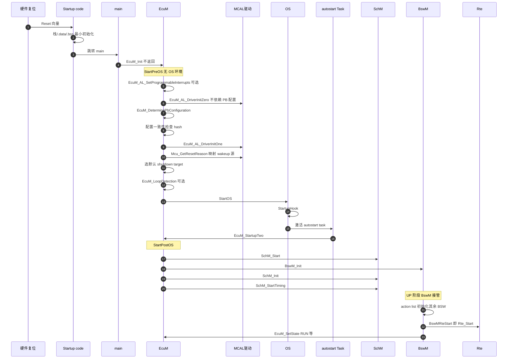
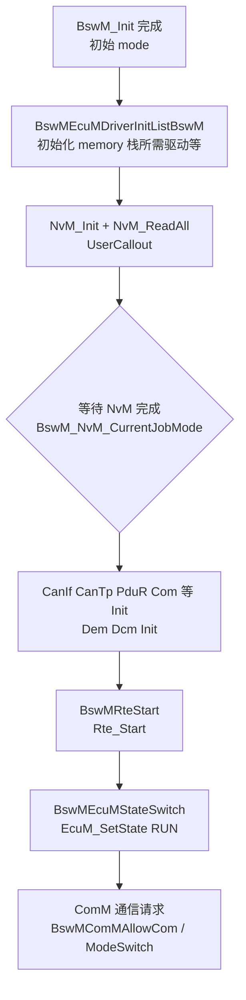
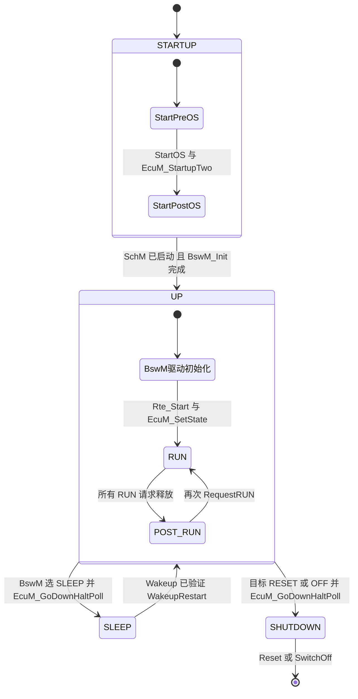
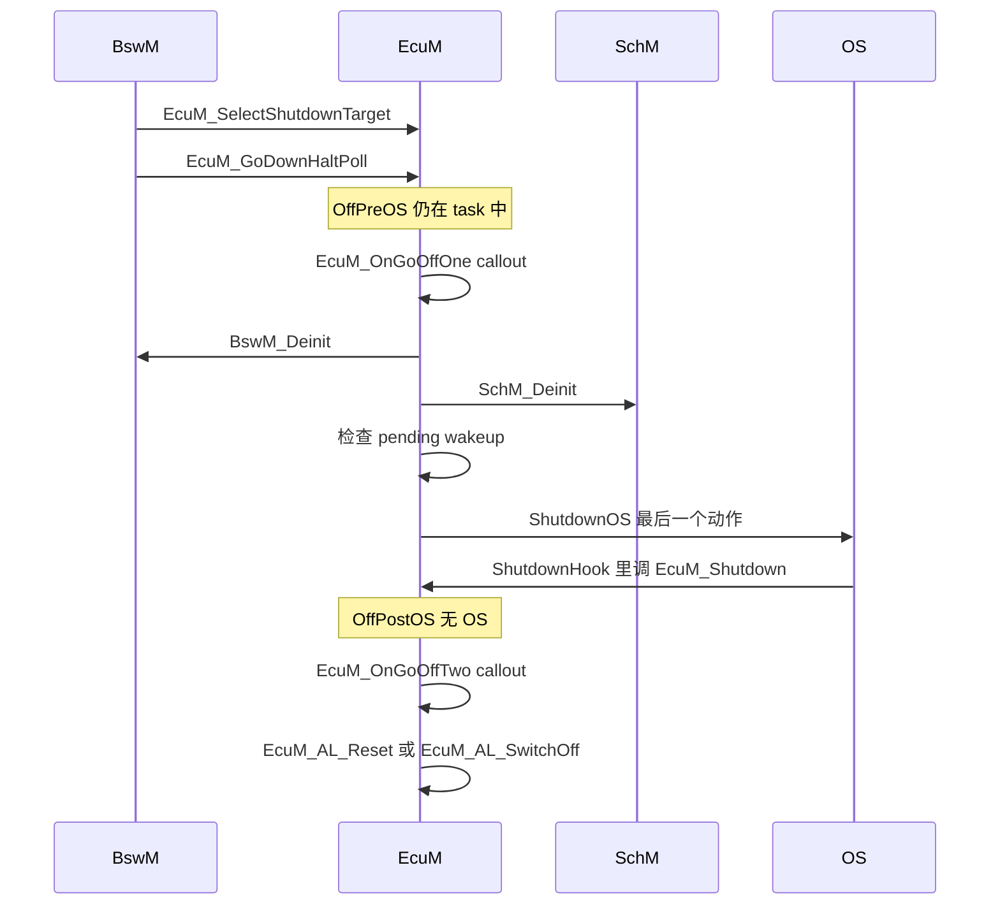

# 04 ECU 启动：EcuM 接管之后到底做了什么

> 本章回答：(1) ECU 复位之后，从 `main()` 到应用 runnable 第一次运行，EcuM 依次做了哪些事？(2) OS 启动之后，谁（EcuM / BswM / ComM）还在管事、管什么？(3) 关机和睡眠又是怎么走的？
> Prerequisite: [03 方法论与工作流](./03-methodology-workflow.md)（及 [README](./README.md) 的总览图）。本章会提前用到 Mcu/Port 等 MCAL init（[05](./05-mcal-role-and-architecture.md) 详述）和 StartOS/Task/Hook（[06](./06-os-basics.md) 详述），第一次读不必先看它们
> Next: [05 MCAL 的角色与架构](./05-mcal-role-and-architecture.md)
> 对应规范（R25-11）：EcuM SWS（Doc 78）§7 Functional Specification、§8 API；BswM SWS（Doc 313）§7、ECUC §10；RTE SWS §5.8 `Rte_Start`；Os SWS（`StartOS`、Hook）
> 深入阅读：[Part II · ECU 启动流程](../02-autosar-classic/03-ecu-startup.md)、[Part I · RH850 启动过程](../01-rh850/04-startup-process.md)、[Part X · 启动失败与早期 Trap 调试](../10-boot-debug/README.md)、[Part II · MainFunction 调度](../02-autosar-classic/07-mainfunction-scheduling.md)

> 版本说明：本章按 **R25-11** 写。R25-11 的 EcuM **只有 flexible 形态**（fixed 在 R4.4.0 移除，EcuM R25-11 p.2）；旧的 `EcuM_GoDown / EcuM_GoHalt / EcuM_GoPoll` 已被 `EcuM_GoDownHaltPoll` 取代。如果你手上的真实工程是更早的 R4.x（例如 `[Real Project Consideration]` RTA-CAR 工程所用 release 以项目为准），很可能还是 fixed EcuM，函数名和 STARTUP I/II 的叫法会不同，请以项目 release 的 SWS 为准。

---

## 1. 本章要回答的问题

你可能听过这样一句话："ECU 启动后，EcuM 接管，然后初始化各个模块，再启动 OS"。这句话有三处容易误导：

1. **EcuM 不是"OS 起来之后才接管"**，它是 `main()` 之后**第一个**被调用的 AUTOSAR 模块，OS 是被 EcuM 启动的。
2. **EcuM 并不负责初始化"所有"模块**。R25-11 里它只负责 OS 之前的底层驱动、启动 OS、以及 OS 之后一小段（调度器与 BswM）；其余初始化由 **BswM 的 action list** 驱动。
3. "接管"之后，EcuM 并没有消失：它还负责 wakeup 源、RUN/POST_RUN 请求仲裁、睡眠与关机序列。

本章把这条时间线从头讲到尾，并告诉你每一步 **谁调用、在什么上下文（无 OS / task）、初始化了谁、规范 ID 是什么**。

---

## 2. 直觉理解：开机的"三棒接力"

用接力赛来记（类比只帮助记忆，下面所有事实以规范为准）：

| 棒次 | 选手 | 跑的路段 | 特点 |
|---|---|---|---|
| 第 1 棒 | **EcuM（StartPreOS）** | 复位后到 `StartOS` | 没有 OS，不能依赖任务、定时、临界区服务；最好别开中断 |
| 第 2 棒 | **EcuM（StartPostOS）** | OS 起来后第一个 task 里的 `EcuM_StartupTwo` | 只做 4 件事：启动调度器、初始化 BswM、初始化调度器、启动调度器定时 |
| 第 3 棒 | **BswM** | UP 阶段 | 规则 + action list 驱动：NvM、通信栈、Dem、Rte_Start、ComM 请求…… |

第 1 棒和第 2 棒由**同一个函数族**（`EcuM_Init` / `EcuM_StartupTwo`）完成，所以说 EcuM "接管"没错，但它把后半段"指挥权"交给了 BswM。

---

## 3. 原理（规范依据）

### 3.1 flexible EcuM 的核心思想 `[AUTOSAR Standard]`

- 旧版 fixed EcuM 里的 ECU **State**（STARTUP / RUN / POST_RUN / SLEEP / SHUTDOWN…）在 flexible 版里变成经 RTE mode port 暴露的 **Mode**；旧版的 ECU **Mode** 变成 **Phase**（EcuM R25-11 p.30-31，图 7.1 p.32）。
- 大多数 ECU 状态不再由 EcuM 自己实现，而是变成由 **BswM** 控制的 generic modes。EcuM 只在 **早期 STARTUP、晚期 SHUTDOWN、以及 SLEEP 中调度器被锁住时** 接管（EcuM R25-11 p.15）。
- R25-11 的 Phase：

| Phase | 含义 | 依据 |
|---|---|---|
| STARTUP | 初始化到 mode management 可用为止；子阶段 **StartPreOS** 与 **StartPostOS** | p.31, p.33 |
| UP | 从 SchM 启动、`BswM_Init` 调用后开始；EcuM 被动，BswM 主导 | p.31, p.33 |
| SHUTDOWN | STARTUP 的反向；子阶段 **OffPreOS**、**OffPostOS** | p.34, p.47 |
| SLEEP | 省电，通常不执行代码 | p.34, p.52-60 |
| OFF | 断电（需要硬件自断电能力，否则建议用 reset 代替） | p.34, p.20 |

- EcuM 对 SW-C 暴露的 mode group `EcuM_Mode` = {STARTUP, RUN, POST_RUN, SLEEP, SHUTDOWN}，初始值 STARTUP（SWS_EcuM_04132 p.162，SWS_EcuM_04107 p.163）。注意：EcuM 只请求 RUN 与 POST_RUN 的进出，SLEEP 由 BswM 设置（p.100）。

### 3.2 EcuM 与 BswM 的分工一句话

- **EcuM**：做"没有 OS 就必须先做的事"和"OS 即将关闭/CPU 即将睡眠时必须做的事"，以及 wakeup 源与 RUN 请求的**记账与仲裁**。
- **BswM**：做"决策"——基于 mode request / indication 评估规则（rule），触发 action list（BswM R25-11 p.24）。
- **ComM**：不是启动模块，而是**通信资源的仲裁者**：用户请求 FULL_COM / NO_COM，ComM 驱动 BusSM（CanSM 等）。BswM 通过 action（`BswMComMAllowCom`、`BswMComMModeSwitch`）与它交互。

---

## 4. 运行时与工作流细节

### 4.1 全景时序（Mermaid）



### 4.2 逐步解释：StartPreOS（`EcuM_Init`，OS 之前）

`EcuM_Init` 的签名是 `void EcuM_Init(void)`，Service ID 0x01，**永不返回，因为它最后调用 `StartOS`**（SWS_EcuM_02811，EcuM R25-11 p.112）。前提：调用前已完成最小 MCU 初始化（栈、C 变量初始化，p.37 §7.3.1）。顺序由 SWS_EcuM_02411（p.37-38）的表 7.1 规定，SWS_EcuM_02684（p.39）要求 `EcuM_Init` 按此执行。

| # | 步骤 | 是否可选 | SWS ID / 页 | 通俗解释 |
|---|---|---|---|---|
| 1 | callout `EcuM_AL_SetProgrammableInterrupts` | 可选 | SWS_EcuM_04085, p.136 | 有"可编程中断优先级"的芯片，在起 OS 前把优先级设好 |
| 2 | callout（EcuM 约定好名字、由集成者提供函数体的回调）`EcuM_AL_DriverInitZero`（Init block 0） | 可选 | SWS_EcuM_02905, p.137 | 只能初始化**不使用 post-build 配置**（运行期可单独刷新的配置数据，与编译期固定的 pre-compile 配置相对）的模块 |
| 3 | callout `EcuM_DeterminePbConfiguration` | 必须 | SWS_EcuM_02906, p.138 | 返回 `EcuM_ConfigType*`，即所有 post-build 配置的"根指针" |
| 4 | 配置一致性检查 | 必须 | SWS_EcuM_02796/02798, p.44；SWS_EcuM_02904 p.136 | 比较配置里的 hash 与编译进代码的 `ECUM_CONFIGCONSISTENCY_HASH`；不一致调 `EcuM_ErrorHook(ECUM_E_CONFIGURATION_DATA_INCONSISTENT)` |
| 5 | callout `EcuM_AL_DriverInitOne`（Init block I） | 可选 | SWS_EcuM_02907, p.138 | 此时已有 post-build 配置，可初始化依赖它的驱动 |
| 6 | 取 reset reason 并映射为 wakeup source | 必须 | 表 7.1 p.38；SWS_EcuM_02623, p.38；SWS_EcuM_02826, p.132 | `Mcu_GetResetReason` → 按 `EcuMWakeupSource` 配置映射；EcuM 记住它，稍后由 `EcuM_MainFunction` 验证 |
| 7 | 选默认 shutdown target | 必须 | SWS_EcuM_02181, p.41 | `EcuMDefaultShutdownTarget`（该条文字与图 7.4 的用词略有出入，以图/表 7.1 为准，调用的是 `EcuM_SelectShutdownTarget`，SWS_EcuM_02822 p.118） |
| 8 | callout `EcuM_LoopDetection` | 可选 | SWS_EcuM_04137, p.139 | `EcuMResetLoopDetection=true` 时检测"复位死循环" |
| 9 | `StartOS(ECUM_DEFAULT_APP_MODE)` | 必须 | SWS_EcuM_02603, p.41 | 把控制权交给 OS，**不再返回** |

几个要点：

- **SWS_EcuM_02603 的要求**：StartPreOS 应初始化"启动 OS 所需的全部 BSW"，并且要尽量短。
- **中断**：StartPreOS 里不要用中断；若必须用，只允许 **Category 1 ISR**（Cat 2 需要运行中的 OS；每个中断向量只能属于一种 category）（EcuM R25-11 p.41 及脚注）。关于 Cat 1/Cat 2，见 [06 OS 基础](./06-os-basics.md)。
- **`Mcu_Init` 不提供完整 MCU 初始化**，硬件相关的其余步骤必须放进 DriverInit 这两个 callout 里（p.41）。这解释了为什么 `EcuM_AL_DriverInitZero/One` 是 **callout**：它们是集成者写的（或由工具生成的）代码，而不是 EcuM 的标准实现。
- 图 7.4（p.40）没有画出步骤 1，以表 7.1 为准。
- **多核**：`EcuM_Init` 在每个核上运行，`DriverInitZero/One` 只初始化当前核的 MCAL（SWS_EcuM_04145, p.83）；master 核循环 `StartCore` 再 `StartOS`（p.82）。

### 4.3 各个 init list 里"通常"放什么

EcuM 配置里有四个有序列表（SWS_EcuM_02559 / 04142, p.45 / 47）：

| 列表 | 谁执行 | 何时 | 约束 |
|---|---|---|---|
| `EcuMDriverInitListZero` | `EcuM_AL_DriverInitZero` | StartPreOS | 不能依赖 post-build 配置与 OS（p.46 表 7.2） |
| `EcuMDriverInitListOne` | `EcuM_AL_DriverInitOne` | StartPreOS | 已有 post-build 配置 |
| `EcuMDriverRestartList` | `EcuM_AL_DriverRestart` | 睡眠醒来（WakeupRestart） | 通常是 Zero+One 的子集，顺序相同（SWS_EcuM_02947/02561/02562 p.46） |
| `EcuMDriverInitListBswM` | BswM 的 action `BswMEcuMDriverInitListBswM` | UP 阶段 | 实际调用 `EcuM_AL_DriverInitBswM_<shortName>(void)`（BswM R25-11 p.150） |

初始化顺序由**集成者**负责（EcuM p.21 §5.1.2）；列表中每个驱动的 init 参数来自该驱动的 `EcuMModuleService` 配置（SWS_EcuM_02730, p.46）。

规范表 7.2（EcuM R25-11 p.46-47）给出的是**示例**（sample），不是强制：

| 位置 | 规范示例 | 备注 |
|---|---|---|
| Init block 0 | Det（"应始终第一个初始化，以便其他模块报开发错误"）、Dem pre-init、读取 post-build 配置所需的驱动 | `Det_Init`：SWS_Det_00008（Det R25-11 p.21）；`Det_Start`：SWS_Det_00010 |
| Init block I | MCU、Port、GPT、Watchdog 驱动（内部看门狗）、SPI、WdgM、ADC、ICU、PWM、OCU | 外部看门狗可能要先初始化 SPI |
| BswM 驱动 | 其余 BSW | NvM 初始化与 `NvM_ReadAll` 属于集成代码；**Com / Dem / FIM 须在 `NvM_ReadAll` 完成后由集成者触发**；RTE 须在 NvM 与 COM 初始化之后才能启动（EcuM p.33） |

把它翻译成 RH850 教学语境，下面的表区分"规范示例/典型做法/规范强制"：

| 模块 | 放哪里 | 性质 | 说明 |
|---|---|---|---|
| Det | Init block 0 | **规范示例**（表 7.2）| 越早越好，这样后面的驱动才能报错 |
| Mcu（`Mcu_Init`→`Mcu_InitClock`→等 PLL 锁定→`Mcu_DistributePllClock`） | Init block I | 规范示例 + `[Industry Practice]` | 调用顺序与"PLL 未锁定则 `Mcu_DistributePllClock` 返回 E_NOT_OK"见 MCU SWS（SWS_Mcu_00153/00155/00156/00142，MCU R25-11 p.25-28）。**P1M-E 没有软件可编程 PLL 寄存器**，这三个 API 在 P1M-E 上退化，见 [Part I · 启动 §8](../01-rh850/04-startup-process.md) 与 [Part III · MCU 驱动](../03-mcal/02-mcu-driver.md)；其他带 PLL 的 RH850 衍生型号以芯片手册为准 |
| Port（`Port_Init`） | Init block I | 规范示例 | `Port_Init` 必须是第一个被调用的 Port 函数，之前不能对引脚做任何操作（SWS_Port_00140/00078，PORT R25-11 p.24-26） |
| Gpt | Init block I | 规范示例 | 若 OS 用 OSTM 做时钟，OS 自己管那个 timer，不要在 Gpt 里重复占用（SWS_Os_00374） |
| Wdg（内部） | Init block I | 规范示例 | 看门狗超时常在启动阶段是第一道时间约束，见 [Part I · 启动 §6.4](../01-rh850/04-startup-process.md) |
| Can（`Can_Init`） | **两种做法都有** | **非强制** | EcuM 结构图含 `Can_Init` 的可选调用（EcuM p.35）；但在 flexible 方案里，更常见的是放进 BswM 驱动 init list，或与 CanIf 一起在 BswM 阶段初始化。`Can_Init` 本身只有"每次运行最多调一次、必须由 EcuM/BswM 调用"（CAN Driver SWS_Can_00223 p.56；SWS_BSW_00150）的约束 |
| Adc / Icu / Pwm | Init block I | 规范示例 | 同上 |
| CanIf / CanTp / PduR / Com / Dcm / Dem / NvM / ComM | **BswM 阶段** | `[Industry Practice]` | 它们依赖 OS、调度器或 NV 数据；见 §4.5 |

> **规范强制的只有两件事**：(a) 只有 EcuM 与 BswM 可以调用各模块的 `Init/DeInit`（SWS_BSW_00150 / 00152，BSWG R25-11 p.73 / 75）；(b) 若干模块自带前置条件（如 Dio 必须在 Port 之后，SWS_Dio_00102）。**具体放进哪个列表是集成者的配置决定**。

### 4.4 OS 启动：StartupHook 与 `EcuM_StartupTwo`

1. `StartOS(AppMode)`：首次调用不返回（SWS_Os_00424，Os R25-11 p.38）；AppMode 决定哪些 autostart 的 Task / Alarm / ScheduleTable 被启动（SWS_Os_00607-00610）。StartOS 之后、任何 StartupHook 之前，所有 OS-Application 置为 `APPLICATION_ACCESSIBLE`（SWS_Os_00500）。
2. OS 调用 `StartupHook`（系统级先于应用级，SWS_Os_00060/00226/00236）。
3. **autostart 的 OS task 以 `EcuM_StartupTwo` 作为第一个动作**（EcuM R25-11 图 7.3 p.37）。集成者必须自己配置这个 task（`[Real Project Consideration]`：这个 task 名字、优先级、autostart 属性都在 OS 配置里，EcuM 不会替你创建）。
4. `EcuM_StartupTwo`：`void`，Service ID 0x1a，Non Reentrant（SWS_EcuM_02838, p.112）。SWS_EcuM_02806（p.112-113）要求它必须在 StartOS 直接引起的 task 里调用（autostart task 或被显式激活的 task）。

**StartPostOS 序列**（SWS_EcuM_02934 / 02932, p.41-42，图 7.5）：

| 步 | 调用 | 说明 |
|---|---|---|
| 1 | `SchM_Start()` | 启动 BSW Scheduler（SWS_Rte_91171，Rte R25-11 p.927）。RTE SWS 要求它在 `BswM_Init` 之前 |
| 2 | `BswM_Init(ConfigPtr)` | 初始化 BSW Mode Manager（SWS_BswM_00002, BswM R25-11 p.69；前置条件：OS 与 SchM 已启动，SWS_BswM_00118） |
| 3 | `SchM_Init()` | 初始化调度器（临界区信号量等，SWS_Rte_91170） |
| 4 | `SchM_StartTiming()` | 启动 BSW/SWC 的周期事件（SWS_Rte_91172，`SchM_StartTiming` 启动 BswTimingEvent 触发的 entity，SWS_Rte_07574） |

多核时每个核各自做一遍（SWS_EcuM_04014/04016/04018, p.81-84）；"每个 partition 里有一个 BswM 负责在该核启动 RTE"（p.81）。

此刻 UP 阶段开始。**EcuM 官方描述的"刚进 UP"状态**非常光秃（EcuM p.33）：没有内存管理（NvM）、没有通信栈、没有 SW-C 支持（RTE）、SW-C 未启动，只有 BSW MainFunction 按初始 mode 在跑。

### 4.5 BswM 接管：用规则驱动其余初始化

BswM 做两件事：**Mode Arbitration**（评估规则）与 **Mode Control**（执行 action list）（BswM R25-11 p.24）。启动后的"其余 BSW 初始化、启动 RTE、隐式启动 SW-C"都成为 action list 里的代码（EcuM p.33 §7.1.2）。

与启动相关的预定义 action（BswM R25-11 p.140-141, p.150, p.169）：

| Action 容器 | 作用 |
|---|---|
| `BswMEcuMDriverInitListBswM` | 调 `EcuM_AL_DriverInitBswM_<name>(void)`，执行 EcuM 管理的 BswM 驱动 init 列表 |
| `BswMRteStart` / `BswMRteStop` | 调 `Rte_Start(void)` / `Rte_Stop`（ECUC_BswM_01073，p.169） |
| `BswMEcuMStateSwitch` | 调 `EcuM_SetState` |
| `BswMEcuMSelectShutdownTarget` / `BswMEcuMGoDownHaltPoll` | 关机路径（p.140, p.151） |
| `BswMComMAllowCom` / `BswMComMModeSwitch` | `ComM_CommunicationAllowed` / `ComM_RequestComMode`（p.140） |
| `BswMPduRouterControl`、`BswMPduGroupSwitch`、`BswMNMControl`、`BswMTimerControl`、`BswMUserCallout` 等 | 见 p.140-141 |

**一个重要的细节**：BswM 没有专门的 `NvM_ReadAll` action（全文只有 NvM 的 mode indication `BswM_NvM_CurrentBlockMode` / `BswM_NvM_CurrentJobMode`）。调用 `NvM_ReadAll` 要走 `BswMUserCallout`，或依据 SWS_BswM_00039（BswM 可调用任意 BSW 函数）（BswM R25-11 p.37）。

**一个典型的启动 action list（示意，`[Conceptual]`，非 SWS 示例）**。BswM SWS 本身没有给出启动 action list 示例（只有 §9 的两张 immediate / deferred 时序图，p.91-92；"Guide to Mode Management"不在仓库中），下面的顺序由 SWS 的零散句子拼出：



逐步解释：

1. **memory 驱动先于 NvM**：NvM 往下依赖 memory 栈（驱动 + 抽象），所以先 init 驱动列表。
2. **`NvM_ReadAll` 先于所有用 NV 数据的模块**：Com、Dem、FIM 的初始化要等 ReadAll 结束（EcuM p.33）。BswM 通过 `BswM_NvM_CurrentJobMode` 得知结束。
3. **通信栈初始化**：CanIf / CanTp / PduR / Com / ComM 等。EcuM 说"通信栈不必完全初始化 COM 就能初始化"（p.33）——即 Com 的初始化可以稍后、在 ReadAll 之后。
4. **`Rte_Start`**：RTE 在 NvM 与 COM 初始化之后才能启动（p.33）。
5. **进入 RUN**：BswM 调 `EcuM_SetState`（SWS_EcuM_04122/04123, p.114），EcuM 再经 RTE mode port 通知 SW-C（`Rte_Switch_currentMode_currentMode`，SWS_EcuM_04133 p.162）。
6. **ComM**：通信不是自动打开的——SW-C 或 BswM 向 ComM 请求 FULL_COM，ComM 驱动 CanSM，CanSM 通过 `CanIf_SetControllerMode` 把控制器置为 STARTED，Can 驱动才真正上线。

### 4.6 `Rte_Start`：规范间的不一致（如实说明）

谁调用 `Rte_Start`，R25-11 的几份规范说法并不一致：

| 文档 | 说法 | 依据 |
|---|---|---|
| **RTE SWS** | "由 EcuStateManager 调用"，且在 startup phase II 末尾（旧 fixed EcuM 的思路） | SWS_Rte_CONSTR_09035，Rte R25-11 p.805；p.460 |
| **EcuM SWS** | StartPostOS 序列（`SchM_Start`、`BswM_Init`、`SchM_Init`、`SchM_StartTiming`）里**没有** `Rte_Start`；RTE 的启动是 BswM action list 里的代码 | SWS_EcuM_02934 p.41-42；p.33 |
| **BswM SWS** | 有专门的 action `BswMRteStart`，调用 `Rte_Start(void)` | ECUC_BswM_01073，p.169 |

结论：这是**规范之间措辞没有同步**，不是你读错了。本教程按 EcuM / BswM（flexible）写：由 BswM action 调用。`[Real Project Consideration]`：真实工程里 `Rte_Start` 到底由谁调用，以**所用工具链的生成器与集成方案**为准——可能是 BswM 生成代码，也可能是旧式的 EcuM 集成代码，甚至直接写在 StartupTwo 之后的集成代码中。无论谁调，`Rte_Start` 的**前置条件**是确定的：只能调一次、从 trusted OS 上下文、每个核各调一次、在 OS/COM/memory services 初始化之后、在 `SchM_Init` 之后，且不得由 SW-C 调用（SWS_Rte_91137, p.805；CONSTR_09035/09036/09037 p.805-806）。

`Rte_Start` 返回之后，InitEvent 触发的 runnable 开始执行一次（SWS_Rte_06761, p.161）；周期性 TimingEvent 的 runnable 随 `Rte_StartTiming` / `Rte_Start` 释放（SWS_Rte_91143 p.810）。这些细节见 [Part VII · RTE 概念](../07-rte-swc/04-rte-concept.md)。

### 4.7 UP 阶段：谁拥有什么



> 图的说明：RUN / POST_RUN 在 flexible 版中是 **EcuM_Mode 的取值**（由 BswM 经 `EcuM_SetState` 反映），而不是 EcuM 内部状态机——EcuM R25-11 没有自己的状态机（p.98）。图是帮助记忆的简化。

**OS 起来之后三个模块的职责对照：**

| 职责 | EcuM | BswM | ComM |
|---|---|---|---|
| BSW 初始化的**驱动者** | 仅 StartPostOS 四步 | 其余全部（action list） | —（被初始化） |
| wakeup 源状态（NONE/PENDING/VALIDATED/EXPIRED） | **拥有**：`EcuM_SetWakeupEvent`（SWS_EcuM_02826）、`EcuM_ValidateWakeupEvent`（02829）、`EcuM_MainFunction` 验证（02837, p.150） | 收到 `BswM_EcuM_CurrentWakeup`（SWS_EcuM_04003） | 收到 `ComM_EcuM_WakeUpIndication` |
| RUN / POST_RUN 请求 | **仲裁**：`EcuM_RequestRUN/ReleaseRUN`（SWS_EcuM_04124/04127，同一 user 不可嵌套请求）、`EcuM_RequestPOST_RUN`（04128/04129），向 BswM 发 `BswM_EcuM_RequestedState` | **决策**：规则决定何时切换，调 `EcuM_SetState` | — |
| 通信请求 | — | action：`BswMComMAllowCom` / `BswMComMModeSwitch` | **拥有**：用户 FULL_COM/NO_COM 请求，驱动 BusSM、NM |
| 睡眠 / 关机 | **执行**：`EcuM_GoDownHaltPoll` 内部序列 | **触发**：`EcuM_SelectShutdownTarget` + `EcuM_GoDownHaltPoll` | 通信先关（NO_COM）才可睡眠 |
| `EcuM_MainFunction` | 拥有；**不应放进会执行 runnable 的 task**（p.151） | — | — |

> `EcuM_MainFunction` 的周期建议约为最短 validation timeout 的一半（p.151）。它和 `BswM_MainFunction`、`ComM_MainFunction_<ch>`、`Com_MainFunctionRx/Tx_<shortName>` 一样，是通过 SchM/RTE 配置映射进 OS task 的，见 [Part II · MainFunction 调度](../02-autosar-classic/07-mainfunction-scheduling.md)。

### 4.8 关机与睡眠路径

**统一入口**：BswM 先 `EcuM_SelectShutdownTarget`（SWS_EcuM_02822, p.118），再调 `EcuM_GoDownHaltPoll(UserID)`（SWS_EcuM_91002, p.111）。R25-11 里不再有 `EcuM_GoDown / GoHalt / GoPoll` 三个函数（全文检索不存在）。Shutdown target 为 OFF / SLEEP / RESET（p.17, p.71）。

**RESET / OFF**（OffPreOS → ShutdownOS → ShutdownHook → OffPostOS，p.47-52）：



要点：

- **ShutdownHook 必须调 `EcuM_Shutdown`**，它不返回，最终复位或断电（SWS_EcuM_02953, p.49；`EcuM_Shutdown` SWS_EcuM_02812 ID 0x02, p.113）。
- OffPreOS 中 `BswM_Deinit` 与 `SchM_Deinit` 之后调度器已不在，无法再验证 wakeup，所以此处检查 pending wakeup：若有，则按 `EcuMIgnoreWakeupEvValOffPreOS` 决定，并可把 target 改为 RESET（SWS_EcuM_04151/04152, p.49）。
- 关机期间发生 wakeup：完成 shutdown 后立即重启（SWS_EcuM_02756, p.47）。
- `ShutdownOS` 是 OffPreOS 的最后一个动作（SWS_EcuM_02952, p.49）。关 RTE：`Rte_Stop` 须在 OS/COM/memory services 关闭**之前**调用（SWS_Rte_91138, p.807），之后才是 `SchM_Deinit`。

**SLEEP**（p.52-60）：GoSleep（`EcuM_EnableWakeupSources`、占用 `RES_AUTOSAR_ECUM_<core#>`，SWS_EcuM_02389/03010 p.54）→ Halt（`EcuM_GenerateRamHash`、`Mcu_SetMode(HALT)`、`EcuM_CheckWakeup`，SWS_EcuM_02960/02863/02961 p.55-56）或 Poll（循环 `EcuM_SleepActivity` / `EcuM_CheckWakeupHook`，SWS_EcuM_03020 p.57）→ WakeupRestart（恢复 MCU normal mode、`EcuM_DisableWakeupSources`、`EcuM_AL_DriverRestart`、释放资源、解锁调度，p.58-60；SWS_EcuM_02923 p.148）。

- **SLEEP 不关 OS**，sleep mode 对 OS 透明（SWS_EcuM_02951, p.54）。
- 醒来后的 wakeup validation 见 p.64-66（`EcuMValidationTimeout`，SWS_EcuM_02566/02565 p.66）。
- `EcuMDriverRestartList` 在 WakeupRestart 里重新初始化那些在 SLEEP 中丢失状态的驱动（p.46）。

---

## 5. 总表：阶段 / 执行上下文 / 调用者 / 被初始化模块 / SWS ID

| 阶段 | 执行上下文 | 调用者 | 被初始化 / 做的事 | SWS ID（R25-11） |
|---|---|---|---|---|
| Reset → startup code | **无 OS**，裸机汇编/C | 硬件复位 | 栈、`.data/.bss`、最小 MCU 初始化 | MCU SWS 对 start-up code 的界定（MCU R25-11 p.14；SWS_Mcu_00244-00247） |
| `main()` → `EcuM_Init` | 无 OS | `main` | 进入 StartPreOS | SWS_EcuM_02811（p.112） |
| `EcuM_AL_SetProgrammableInterrupts` | 无 OS（仅 Cat 1 中断可用） | EcuM_Init | 中断优先级 | SWS_EcuM_04085 |
| `EcuM_AL_DriverInitZero` | 无 OS | EcuM_Init | Det、不依赖 PB 配置的模块 | SWS_EcuM_02905 |
| `EcuM_DeterminePbConfiguration` + hash 检查 | 无 OS | EcuM_Init | 取得 PB 配置根指针 | SWS_EcuM_02906 / 02796 / 02798 |
| `EcuM_AL_DriverInitOne` | 无 OS | EcuM_Init | Mcu、Port、Gpt、Wdg 等（典型） | SWS_EcuM_02907 |
| reset reason / shutdown target / loop detection | 无 OS | EcuM_Init | wakeup 源、默认 target | SWS_EcuM_02623 / 02181 / 04137 |
| `StartOS` | 无 OS → OS | EcuM_Init | OS 启动，不返回 | SWS_EcuM_02603；SWS_Os_00424 |
| `StartupHook` | OS 内部（task 之前） | OS | 用户钩子 | SWS_Os_00060 |
| `EcuM_StartupTwo` | **OS task**（autostart） | 集成者配置的 task | StartPostOS 入口 | SWS_EcuM_02838 / 02806 |
| `SchM_Start` / `BswM_Init` / `SchM_Init` / `SchM_StartTiming` | OS task | EcuM_StartupTwo | 调度器、BswM | SWS_EcuM_02934 / 02932；SWS_Rte_91171/91170/91172；SWS_BswM_00002 |
| BswM action：驱动 init list | OS task 或 `BswM_MainFunction`（deferred 时） | BswM | EcuM 管理的 BswM 驱动列表 | SWS_EcuM_04142；BswMEcuMDriverInitListBswM |
| BswM action：NvM / Com / Dem / Dcm 初始化 | 同上 | BswM（UserCallout 或任意 BSW 函数） | NV、通信栈、诊断 | SWS_BswM_00039 |
| BswM action：`Rte_Start` | 同上（trusted 上下文，每核一次） | BswM（`BswMRteStart`） | RTE 资源与 SW-C 初始化 | ECUC_BswM_01073；SWS_Rte_91137 |
| `EcuM_SetState(RUN)` | 同上 | BswM | EcuM_Mode 反映到 SW-C | SWS_EcuM_04122/04123 |
| ComM 请求 → CanSM → `CanIf_SetControllerMode` | 同上 | BswM / SW-C / ComM | CAN 控制器 STARTED | ComM SWS；见 [Part V](../05-can-stack/01-canif.md) |
| `EcuM_MainFunction` | OS task（周期） | SchM | wakeup validation | SWS_EcuM_02837 |
| `EcuM_GoDownHaltPoll` | OS task | BswM（`BswMEcuMGoDownHaltPoll`） | 关机 / 睡眠 | SWS_EcuM_91002 |
| OffPreOS：`BswM_Deinit`→`SchM_Deinit`→`ShutdownOS` | OS task | EcuM | 反初始化 | SWS_EcuM_03021 / 02952 |
| ShutdownHook → `EcuM_Shutdown` | **OS 关闭中** | OS | 复位/断电前最后一步 | SWS_EcuM_02953 / 02812 |
| OffPostOS：`EcuM_AL_Reset` / `EcuM_AL_SwitchOff` | **无 OS** | EcuM_Shutdown | 复位/断电 | SWS_EcuM_04065 / 02920 |

---

## 6. 代码与配置示例

### 6.1 `[Conceptual]` flexible EcuM 的 callout 形状

下面是**概念性**伪代码，说明 callout 的位置与调用关系，不是任何厂商的生产代码：

```c
/* [Conceptual] EcuM_Init 的骨架：顺序来自 SWS_EcuM_02411 表 7.1 */
void EcuM_Init(void)
{
    EcuM_AL_SetProgrammableInterrupts();            /* 可选 */
    EcuM_AL_DriverInitZero();                       /* Det 等，不依赖 PB 配置 */
    EcuM_ConfigPtr = EcuM_DeterminePbConfiguration();
    if (EcuM_ConfigPtr->ConfigConsistencyHash != ECUM_CONFIGCONSISTENCY_HASH) {
        EcuM_ErrorHook(ECUM_E_CONFIGURATION_DATA_INCONSISTENT);
    }
    EcuM_AL_DriverInitOne();                        /* Mcu / Port / Gpt / Wdg ... */
    /* reset reason -> wakeup source；default shutdown target；loop detection */
    (void)StartOS(ECUM_DEFAULT_APP_MODE);           /* 不返回 */
}

/* [Conceptual] 集成者在 OS 配置里创建的 autostart task */
TASK(Task_Init)
{
    EcuM_StartupTwo();      /* SchM_Start / BswM_Init / SchM_Init / SchM_StartTiming */
    (void)TerminateTask();  /* 之后周期性工作由其他 task 承担 */
}

/* [Conceptual] 由 DriverInit callout 展开的 init list（生成代码常长这样） */
void EcuM_AL_DriverInitOne(void)
{
    Mcu_Init(&Mcu_Config);
    (void)Mcu_InitClock(MCU_CLOCK_0);
    while (Mcu_GetPllStatus() != MCU_PLL_LOCKED) { }  /* P1M-E 无软件 PLL，需按手册退化 */
    Mcu_DistributePllClock();
    Port_Init(&Port_Config);
    Gpt_Init(&Gpt_Config);
}
```

对应的配置形状（`[Conceptual]` ARXML 摘要，仅示意参数名，请对照 ECUC 定义）：

```xml
<!-- [Conceptual] EcuM 配置片段：参数名对应 SWS 的 EcuM 配置，值为示意 -->
<ECUC-CONTAINER-VALUE>
  <SHORT-NAME>EcuMDriverInitListOne</SHORT-NAME>
  <SUB-CONTAINERS>
    <ECUC-CONTAINER-VALUE><SHORT-NAME>Mcu_Init</SHORT-NAME></ECUC-CONTAINER-VALUE>
    <ECUC-CONTAINER-VALUE><SHORT-NAME>Port_Init</SHORT-NAME></ECUC-CONTAINER-VALUE>
  </SUB-CONTAINERS>
</ECUC-CONTAINER-VALUE>
```

### 6.2 对照教学 demo：`examples/uds_diag_demo/integration/EcuM.c`

`[Educational Implementation]` 本仓库的 demo 把整个启动压缩到一个函数 `EcuM_Init`（`examples/uds_diag_demo/integration/EcuM.c:24-42`）：

| demo 位置 | 内容 | 对应真实流程 |
|---|---|---|
| `EcuM.c:26-27` | trace + `Det_Init(NULL_PTR)` | Init block 0（Det 第一个，与表 7.2 示例一致） |
| `EcuM.c:28` | `Can_Init(&Can_Config)` | MCAL 驱动 init（真实 ECU 中放 EcuM 列表还是 BswM 列表取决于配置） |
| `EcuM.c:29-32` | `CanIf_Init`、`CanTp_Init`、`PduR_Init` | 注释自己写了 "normally BswM action list" |
| `EcuM.c:33-34` | `NvM_Init` + `NvM_ReadAll` | NV 数据先于其使用者（与 EcuM p.33 一致） |
| `EcuM.c:35-36` | `Dem_Init`、`Dcm_Init` | BswM 阶段 |
| `EcuM.c:37` | `Rte_Start()` | 对应 `BswMRteStart`（`examples/uds_diag_demo/rte/Rte_Dcm.c:38` 定义，打印 init runnables） |
| `EcuM.c:38-40` | 注释 + `CanIf_SetControllerMode(..., CAN_CS_STARTED)` | 真实路径是 ComM → CanSM → CanIf |
| `EcuM.c:54-60` | `EcuM_SimPerformReset`：`Can_DeInit` 后再调 `EcuM_Init` | 真实 ECU 走 `EcuM_GoDownHaltPoll` → OffPreOS → ShutdownOS → `EcuM_Shutdown` → `EcuM_AL_Reset` / `Mcu_PerformReset` |

调度侧，`examples/uds_diag_demo/integration/BswScheduler.c:25-57` 的 `BswScheduler_Tick1ms` 用一个 1 ms tick 函数模拟了 OS + SchM：1 ms 任务（`Can_MainFunction_*`、`CanTp_MainFunction`，行 37-41）、5 ms 任务（`NvM_MainFunction`，行 43-46）、10 ms 任务（`Dcm_MainFunction`、`Rte_Task_10ms`，行 48-52）。

**demo 的简化点（务必知道）**：

1. **没有 OS**：没有 `StartOS`、StartupHook、autostart task，也没有 `EcuM_StartupTwo`；`EcuM_Init` 会返回（真实的不会）。
2. **没有 StartPreOS / StartPostOS 区分**：所有 init 在同一个函数中顺序执行。
3. **没有 BswM**：没有规则、没有 action list；init 顺序被硬编码。
4. **没有 SchM 的 `SchM_Start/Init/StartTiming`**；调度器是一个手写的 tick。
5. **没有 post-build 配置指针**与 hash 检查，`Can_Init(&Can_Config)` 直接传全局配置。
6. **没有 ComM / CanSM**，直接 `CanIf_SetControllerMode`。
7. **没有 wakeup、sleep、RUN 请求**，"关机"只是 `EcuM_SimPerformReset` 的软复位。
8. `NvM_ReadAll` 是同步调用，真实的是异步 job，要等 `BswM_NvM_CurrentJobMode` 指示完成。

---

## 7. 调试指针

| 症状 | 最可能的位置 | 去哪看 |
|---|---|---|
| 复位后卡在 startup code / 复位死循环 | StartPreOS 之前或 `EcuM_LoopDetection` | [Part X · 复位原因与复位死循环](../10-boot-debug/03-reset-causes-and-reset-loops.md)、[启动代码失败点](../10-boot-debug/05-startup-code-failure-points.md) |
| 进了 `EcuM_ErrorHook` | 配置 hash 不一致：PB 配置与代码版本不匹配 | 先确认工程是否整体重新生成/重新烧写（post-build 配置段与代码一致） |
| `EcuM_AL_DriverInitOne` 里卡死 | `Mcu_GetPllStatus` 一直不 LOCKED（P1M-E 无 PLL 的退化问题） | [Part I · 启动 §8.4 永远等不到 LOCKED](../01-rh850/04-startup-process.md)、[Part X · 增量 bring-up](../10-boot-debug/06-incremental-bring-up-strategy.md) |
| 一调 `StartOS` 就进异常/trap | 向量表、栈、OS 定时器配置 | [Part X · Exception 与 Trap](../10-boot-debug/02-exception-and-trap-handlers.md) |
| `EcuM_StartupTwo` 没被执行 | autostart task 没配、AppMode 不匹配 | OS 配置（见 [06 OS 基础](./06-os-basics.md)） |
| 应用 runnable 不跑 | `Rte_Start` 没被调用，或 BswM 规则没满足 | 看 BswM 的 mode request 端口是否被设置、规则是否评估为真（BswM SWS_BswM_00064/00241：含 undefined condition 的规则不仲裁） |
| 通信一直没起来 | ComM 没收到 FULL_COM 请求 / CanSM 没把控制器置 STARTED | [Part V · CAN 栈](../05-can-stack/01-canif.md) |
| Det 报 `*_E_UNINIT` | 某模块 init 比其调用者晚 | 对照 §4.3 的顺序，检查 init list |
| 睡眠醒来后外设不工作 | `EcuMDriverRestartList` 漏了某驱动 | EcuM p.46 |

一般策略：在 `EcuM_Init` 各步骤之间、`EcuM_StartupTwo` 前后、`BswM_Init` 之后、`Rte_Start` 前后加断点/日志，确定"最后成功的一步"，再回 [Part X 的 playbook](../10-boot-debug/07-boot-trap-troubleshooting-playbook.md) 定位。

---

## 8. 常见误解

1. **"EcuM 在 OS 之后才接管"**：错。EcuM 在 `main()` 之后第一个运行，并且启动 OS。
2. **"EcuM 初始化所有 BSW 模块"**：R25-11 flexible 下，它只做 StartPreOS 的驱动 init 与 StartPostOS 四步；其余由 BswM 驱动。
3. **"`EcuM_Init` 执行完会返回 main"**：不会，它调用 `StartOS` 之后不返回（SWS_EcuM_02811）。
4. **"EcuM 有 RUN / SLEEP 状态机"**：R25-11 的 EcuM 没有自己的状态机（p.98）。RUN / POST_RUN / SLEEP 是 mode，由 BswM 决策、EcuM 记账。
5. **"`EcuM_GoDown` / `EcuM_GoHalt` / `EcuM_GoPoll` 是标准 API"**：它们属于旧 fixed 版；R25-11 用 `EcuM_GoDownHaltPoll`。
6. **"Can_Init 必须放在 EcuM_AL_DriverInitOne 里"**：规范没有这么要求，放哪里是集成配置。规范强制的只是"只有 EcuM/BswM 调 Init"。
7. **"SW-C 里调 `Rte_Start` / `EcuM_RequestRUN` 自己初始化"**：`Rte_Start` 不得由 SW-C 调（SWS_Rte_CONSTR_09035）；`EcuM_RequestRUN` 是 SW-C 请求保持 ECU 运行，不是初始化。
8. **"Rte_Start 一定是 BswM 调的"**：EcuM/BswM SWS 如此，RTE SWS 仍写 EcuM，见 §4.6。
9. **"StartPreOS 里可以放心用中断"**：不能依赖；只允许 Cat 1。

---

## 9. 真实项目里你会看到什么 `[Real Project Consideration]`

- 一个 `EcuM_Cfg.c` / `EcuM_PBcfg.c` 和 `EcuM_Callout_Stubs.c`：`EcuM_AL_DriverInitZero/One` 通常由工具**根据 init list 配置生成**，也可能是你手写补充（时钟、看门狗喂狗、RAM 初始化、外部器件）。
- 一个 `BswM_Cfg.c`：里面是大量由工具生成的 rule / action list 数据结构；启动 action list 往往被命名成 `StartUp`、`InitBlock2` 之类。
- OS 配置里的 `Task_Init`（autostart）、`Task_1ms/5ms/10ms`（周期，Alarm / ScheduleTable 驱动）、`Task_Background`。
- 工程里有一份"初始化顺序表"，常常存在于 Excel 或 Confluence 中；真正的权威是 `EcuM_Cfg.c` 与 `BswM_Cfg.c` 的生成物。
- `Rte_Start` 可能出现在 BswM 生成代码、`EcuM_Callout`，或集成代码中（见 §4.6）；你的项目 release 是什么就看什么。
- 多核 ECU：每个核一份 `EcuM_Init` / `StartOS` / `BswM_Init`；master 核 `StartCore`。
- 启动时间要求：真实项目常要求"X ms 内可通信"，因此 BswM action list 里会特意把通信栈初始化放在 NvM_ReadAll 之前或并行（以满足"快速启动"），这就是 flexible 方案的灵活之处。`[Industry Practice]`。

---

## 10. 一句话记住

- **EcuM 是第一棒**：`main` → `EcuM_Init` → 驱动 init 列表 → `StartOS`，不返回。
- **StartPostOS 只有四步**：`SchM_Start` → `BswM_Init` → `SchM_Init` → `SchM_StartTiming`，在 autostart task 里由 `EcuM_StartupTwo` 完成。
- **BswM 是第三棒**：规则 + action list 驱动 NvM、通信栈、Dem、Dcm、`Rte_Start` 与 RUN。
- **ComM 管通信资源**，EcuM 管 wakeup 与 RUN 请求记账，BswM 管决策——三者分工不同。
- **R25-11 只有 flexible EcuM**，关机/睡眠统一走 `EcuM_GoDownHaltPoll`。
- **`Rte_Start` 的调用者在 RTE SWS 与 EcuM/BswM SWS 间不一致**，以项目生成工具为准。

---

## 11. 自测题

1. 为什么 `EcuM_AL_DriverInitZero` 里不能初始化依赖 post-build 配置的模块？`EcuM_DeterminePbConfiguration` 在它之后做了什么？
2. `StartPostOS` 的四个调用是什么、顺序怎样？为什么 `SchM_Start` 要先于 `BswM_Init`？
3. StartPreOS 阶段能不能用 Cat 2 中断？为什么？
4. BswM 里有没有 `NvM_ReadAll` 的专用 action？应该怎么调？
5. 在 R25-11 中，SW-C 请求 RUN 之后，EcuM、BswM、ComM 各做什么？
6. 睡眠（SLEEP）会不会关掉 OS？关机（RESET）又是怎样的次序？`ShutdownHook` 里必须调用什么？
7. 对照 demo `EcuM.c:24-42`，列出它与真实 EcuM 的三处差别。
8. （思考）`Rte_Start` 的调用者在规范间不一致，你在真实项目中怎么确认它在哪里被调用？

参考答案要点：(1) 此时还没拿到 PB 配置指针；之后做一致性检查。(2) `SchM_Start`→`BswM_Init`→`SchM_Init`→`SchM_StartTiming`；RTE SWS 要求（SWS_Rte_91171）。(3) 不能，Cat 2 需运行中的 OS。(4) 无，用 UserCallout / 任意 BSW 函数。(5) EcuM 仲裁并向 BswM 汇报，BswM 决策并调 `EcuM_SetState`，ComM 管通信请求。(6) 不关；OffPreOS → `ShutdownOS` → ShutdownHook → `EcuM_Shutdown`。(8) 在生成代码里搜 `Rte_Start(`，看调用栈与 BswM/EcuM 配置。

---

## 12. 下一章

下一章 [05 MCAL 的角色与架构](./05-mcal-role-and-architecture.md) 回答：本章里被 `EcuM_AL_DriverInitOne` 调用的那些 `Mcu_Init`、`Port_Init`、`Can_Init` 到底是什么，MCAL 的共同骨架是什么，它怎样把 RH850 的寄存器藏起来。
