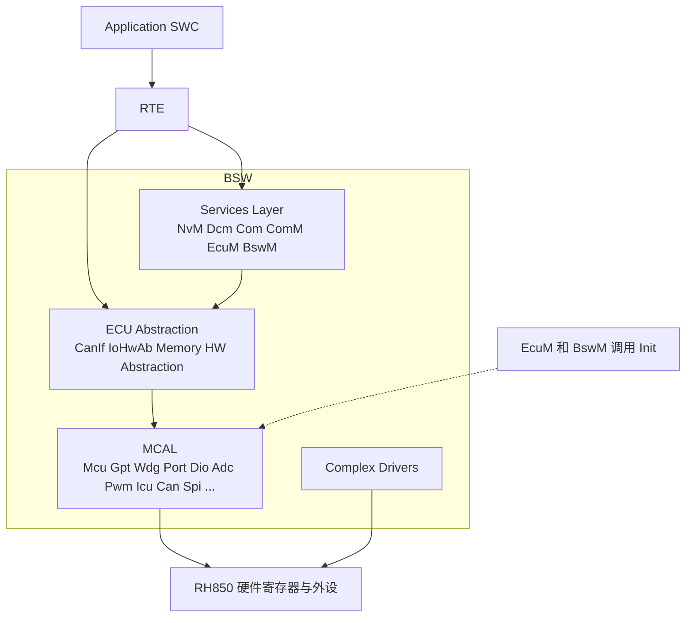
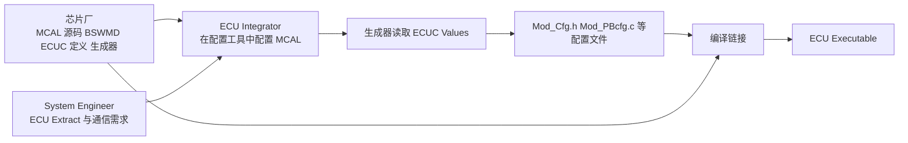
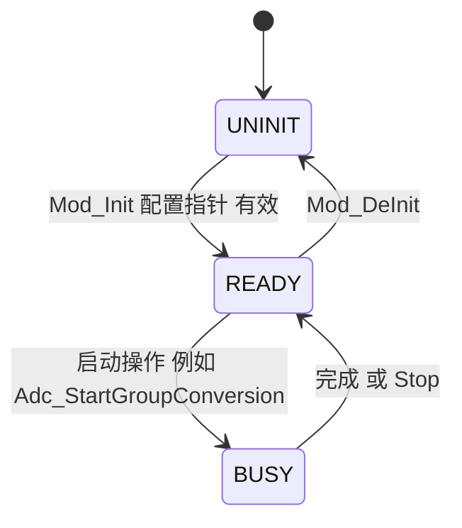

# 05 MCAL：它在哪一层、做什么、长什么样

> 本章回答：(1) MCAL 会做什么？它不做什么？(2) MCAL 驱动的共同架构（文件、Init、状态机、错误、ISR 与 MainFunction、回调）是什么样？(3) 谁调用 MCAL、谁交付、谁配置？
> Prerequisite: [04 ECU 启动与 EcuM](./04-ecu-startup-ecum.md)（知道 `EcuM_AL_DriverInitOne` 里放了哪些 init）
> Next: [06 OS 基础](./06-os-basics.md)
> 对应规范（R25-11）：EXP_LayeredSoftwareArchitecture（以下简称 EXP）；SWS_BSWGeneral（BSWG）；MCU / Port / Dio / Adc / CAN Driver SWS；TR_Methodology（METH）；IoHwAb SWS
> 深入阅读：[Part III · MCAL 总览](../03-mcal/01-mcal-overview.md)、[Part III · MCU 驱动](../03-mcal/02-mcu-driver.md)、[Part III · RH850 硬件映射总表](../03-mcal/07-rh850-hardware-mapping.md)、[Part IV · CAN MCAL](../04-can-mcal/01-can-hardware-basics.md)、[Part I · 中断与异常](../01-rh850/06-interrupt-exception.md)

> 版本说明：EXP 的页码用 **PDF 页码**（幻灯片页脚 = PDF 页 + 10）。R25-11 的 EXP 变更历史写明已**移除 Fls 与 Eep**（EXP p.2），存储驱动改由 Mem / MemAcc 体系覆盖；所以讲 R25-11 时不要再把 Fls/Eep 当作标准 MCAL 模块。你的真实工程用哪个 release，以项目为准（本章的规范引用均按 R25-11 核对）。

---

## 1. 本章要回答的问题

- "MCAL 就是芯片厂给的驱动库吧？" 对了一半：它是**标准化了接口**的驱动库。
- "为什么应用不能直接调 `Dio_WriteChannel`？" 因为规范分层不允许，而且那样换 ECU 就要改应用。
- "MCAL 里有信号、有调度吗？" 没有。MCAL **只管寄存器和外设**，不懂 signal 的含义，也不决定什么时候运行。

---

## 2. 直觉理解

把整个软件栈想成一座楼：

- **MCAL = 地基层的"翻译官"**：对上说标准语言（`Port_Init`、`Dio_WriteChannel`、`Can_Write`），对下说 RH850 方言（`PMC`、`PFC`、`CFDC0...` 寄存器）。上层只需要懂标准语言。
- 它**不负责**"应该点亮哪盏灯"（那是应用）、"信号什么物理含义"（那是 IoHwAb/SWC）、"几毫秒调一次"（那是 OS/SchM）。

类比只用来帮助记忆：事实以下面规范为准。

---

## 3. 原理（规范依据）

### 3.1 MCAL 的位置与目的 `[AUTOSAR Standard]`

- BSW 分 **Services Layer / ECU Abstraction Layer / Microcontroller Abstraction Layer（MCAL）/ Complex Drivers** 四部分（EXP p.13）。
- MCAL 是**最底层 BSW**，包含对 µC 及片内外设有直接访问的"内部驱动"；目的是让上层独立于 µC。**实现 µC 相关，向上的接口标准化且 µC 无关**（EXP p.15）。
- 外部器件（外部 EEPROM/watchdog/flash、SBC 里的 transceiver）不属于 MCAL，它们的驱动在 ECU Abstraction 层；例外：memory-mapped 的外部 flash 驱动放 MCAL（EXP p.22）。
- VFB 章节同样强调：硬件访问经 MCAL，避免高层直接访问 µC 寄存器（TR_VFB p.86）。



> 图的读法：实线是"通常的调用方向"，虚线表示 `Init` 由 EcuM/BswM 调用（SWS_BSW_00150）。CDD 横跨，可以直接访问硬件（EXP p.17, p.32）。

### 3.2 模块分组（EXP p.29，R25-11 的口径）

| 组 | 典型模块 | 备注 |
|---|---|---|
| Microcontroller Drivers | **Mcu**、**Gpt**、**Wdg**、Core Test（CorTst）、RAM Test（RamTst）、Flash Test（FlsTst） | Mcu 管时钟、复位、RAM 初始化、power mode |
| I/O Drivers | **Port**、**Dio**、**Adc**、**Pwm**、**Icu**、**Ocu** | Port 配置引脚，Dio 读写引脚电平 |
| Memory Drivers | **Mem**（及 MemAcc 访问层）等 | **R25-11 的 EXP 变更历史已移除 Fls、Eep**（p.2）；R21-11 起引入新的 Memory Driver / Memory Access 概念（p.3）。老工程仍可能使用 Fls/Eep，**取决于项目 release** |
| Communication Drivers | **Can**、**Lin**、**Fr**、**Eth**、**Spi**、**I2c** | Can 的上层是 CanIf |
| Crypto Drivers | Crypto driver | 另可使用 Memory Services（EXP p.80，R20-11 改动） |
| Wireless Communication Drivers | — | 本教程不涉及 |

> 注：仓库中 R25-11 的 SWS 文本包含 Mcu、Port、Dio、Adc、Can 等；Gpt、Wdg、Spi、Icu、Pwm 的 R25-11 SWS 文本不在本批文本中，本章对它们只写"概念层"内容，细节以对应 SWS 为准。

### 3.3 层间调用规则（谁可以调 MCAL）

EXP "General Interfacing Rules"（p.79）：

- **水平**接口：Services 层、ECU Abstraction 层允许；**MCAL 层不允许**（例外：为性能而配置的 notification）。
- **垂直**接口：一层可访问其下一层的全部接口；**绕过一层应避免，绕过两层或以上不允许；绕过 MCAL 不允许**；所有层都可与 System Services 交互。
- Layer Interaction Matrix（EXP p.80，页面自称 normative）：Microcontroller / Memory / I/O Drivers 只可用 System Services 与硬件，不用其他 BSW 层。

EXP 自述为 informative（"does not contain requirements"，p.10），但矩阵页标注 normative。写文章时可以说"EXP 的 normative 矩阵规定……"。

**所以谁可以调 MCAL：**

| 调用者 | 调什么 | 依据 |
|---|---|---|
| **EcuM**（init lists） | 各驱动的 `Init`（`EcuM_AL_DriverInitZero/One`）；Can 的 `Can_Init` 见 ECUM p.35 的可选调用 | SWS_BSW_00150（BSWG p.73）；ECUM p.37-42；ADC 序列图 EcuM→`Adc_Init`（ADC p.83） |
| **BswM**（init list action） | `EcuMDriverInitListBswM` 中的驱动 init | BswM R25-11 p.150 |
| **ECU Abstraction 层**（CanIf、IoHwAb、Memory HW Abstraction） | 运行期 API：`Can_Write`、`Adc_StartGroupConversion`、`Dio_WriteChannel` 等；接收 ADC/PWM/ICU/GPT 的通知 | EXP p.34、p.80；IOHWAB p.14-15、SWS_IoHwAb_00078 |
| **CDD** | 直接访问 µC；也可使用 SPI/GPT/I-O drivers（受并发限制） | EXP p.32、p.82 |
| **SWC** | **不可以**：不得绕过 MCAL 以上的层次；SWC 通过 RTE → Sensor/Actuator SWC / EcuAbstraction SWC（IoHwAb）访问 I/O | EXP p.79-80；VFB p.86-88；SWCT `TPS_SWCT_01047/01048`（p.653-654） |

> 一个细节：SensorActuator SWC 与 Application SWC 不同，可以通过 port 使用 I/O Hardware Abstraction，**但仍不是直接调 MCAL**（`TPS_SWCT_01048`，SWCT p.654）。

另一个高频误区：**`Init` 只允许 EcuM / BswM 调用**（SWS_BSW_00150 / 00152，BSWG p.73 / 75），所以 CanIf 不会去调 `Can_Init`，Dcm 也不会。

### 3.4 谁交付、谁配置 `[AUTOSAR Standard]` + `[Industry Practice]`

- **规范层面（METH）**：**"Configure MCAL"和"Configure IO Hardware abstraction"是 ECU Integrator 的任务**（METH R25-11 p.184），而不是一个叫 "MCAL Developer" 的角色。METH 里没有 "BSW vendor / tool vendor / 芯片厂" 这种 role 名。
- **业界实践**（规范未规定，因项目而异）：MCAL 通常由**芯片厂**（如 Renesas）交付，随包提供源码或目标码、BSW Module Description（`.arxml`，SWS_BSW_00001，BSWG p.19）、ECUC 参数定义（含厂商扩展参数）、以及配置工具/生成器；Tier1（通常担任 ECU Integrator）在配置工具里配置引脚、时钟、CAN 控制器和硬件对象，由生成器输出 `Mod_Cfg.h` / `Mod_PBcfg.c` 一类文件，再与 MCAL 源码一起编译。`[Industry Practice]`



要点：配置不在 MCAL 源码里手写，而是 **ECUC 参数 → 生成器 → 配置源文件**（METH `TR_METH_01116`，p.96；ECUC 参考 ECUC p.18）。真实项目里 MCAL 的配置通常在 **Tier1/Integrator 一侧**完成，SWC 开发者几乎不会碰到。

---

## 4. 一个 MCAL 驱动的"共同解剖"

> 下面的共同结构由 Mcu / Port / Dio / Adc / Can 的 SWS 归纳得出（`[Conceptual]`，不是 EXP 明文要求）。每个具体驱动以其 SWS 为准。

### 4.1 文件结构：规范与惯例

BSWG（SWS_BSW_00101 等）规定模块缩写 `<Ma>`（如 Can、Port）、实现前缀 `<Mip>`（`<Ma>[_<vi>_<ai>]`）与文件命名（BSWG p.16-18）。Table 5.1（BSWG p.17）：

| 文件 | 规范地位 |
|---|---|
| `Mod.h` / `Mod.c`（Implementation header/source） | **规范有**：`<Mip>.h` 至少存在（SWS_BSW_00020, p.26），声明 API（SWS_BSW_00048），需 include guard（00249）与 `Std_Types.h`（00024） |
| `Mod_Cfg.c`（pre-compile 配置 source，conditional）、`Mod_Lcfg.c`（link-time）、`Mod_PBcfg.c`（post-build，SWS_BSW_00015 p.24） | **规范有**（Table 5.1） |
| `Mod_MemMap.h` | **规范有**（SWS_BSW_00006, p.22） |
| `SchM_Mod.h` | **规范有**（SWS_BSW_00007, p.22），MainFunction 原型由它提供，**不在 `Mod.h` 里**（SWS_BSW_00210, p.28） |
| `Mod_Irq.c`（interrupt frame） | **规范有**（Table 5.1；ISR 建议单独成文件，SWS_BSW_00181, p.23） |
| `Mod_Cfg.h` | **常见约定**：BSWG 只在示例中使用（如 `Nm_Cfg.h`、`CanTp_Cfg.h`），Table 5.1 没有把它列成独立必需文件类型；METH 称之为 "BSW Module Configuration Header File"（`TR_METH_01096`，p.110） |
| `Mod_Cbk.h` | **常见约定**：BSWG R25-11 **没有**这个文件名，它只规定"调用其他模块 callback 时 include 对应模块头文件"（SWS_BSW_00010, p.23）；回调原型写在被调用模块的 SWS "Callback notifications" 章节，具体文件名以模块 SWS/实现为准 |

### 4.2 `Init` 与配置指针

- 命名 `<Mip>_Init`、`<Mip>_DeInit`，**不是所有模块都有**（Dio 就没有，见 §4.7）。
- `Init` 带一个 `const <Mod>_ConfigType*`。规则（SWS_BSW_00050，BSWG p.74）：参数检查开启时检查指针；**VariantPostBuild 或 `postBuildVariantUsed` 为真时必须非 NULL**，否则报 "Invalid configuration set selection" 开发错误；pre-compile 变体下传 NULL_PTR 是合法值（SWS_BSW_00212, p.73；Port 示例：SWS_Port_00121 p.26，Adc：SWS_Adc_00365 p.52 参数栏）。
- Init 结束设置模块状态（SWS_BSW_00071）；复位后须先于其他函数调用 Init（SWS_BSW_00230）；不得重复调用，除非 DeInit 之后（SWS_BSW_00231）。如 `Can_Init` 的实现提示："ECU State Manager 在运行期最多调一次 `Can_Init`"（CAN Driver R25-11 p.30）。
- post-build 配置：配置结构放在独立可重刷内存段，模块 Init 时拿到指针（EXP p.118-123）；配置一致性由 EcuM 在初始化第一个 BSW 模块前做 hash 检查（SWS_EcuM_02796, ECUM p.43-44）。

### 4.3 模块状态机

几乎所有 MCAL 驱动都有"未初始化 → 已初始化"的最小状态机，复杂的驱动有更细的状态：

- **Adc**：组（group）状态 `ADC_IDLE / ADC_BUSY / ADC_COMPLETED / ADC_STREAM_COMPLETED`（SWS_Adc_00513, ADC p.45；迁移图 p.34-36）。
- **Can**：驱动状态 `CAN_UNINIT / CAN_READY`（`Can_Init` 后进入 CAN_READY，CAN Driver p.30）；控制器状态 `UNINIT / STOPPED / STARTED / SLEEP`（与 `CanIf_SetControllerMode` 联动）。
- **Mcu / Port**：以"已初始化/未初始化"为主；`Mcu_Init` 后才可调其他函数（SWS_Mcu_00125：否则 `MCU_E_UNINIT`）。



> 这是一个**通用示意**，不是任一模块的真实状态机。

### 4.4 错误模型：DET 开发错误 vs 运行时错误 vs 生产错误

BSWG §7.2 把错误分四类（SWS_BSW_00144, p.55）：

| 类 | 例子 | 机制 | 能关闭吗 |
|---|---|---|---|
| **Development errors** | 未初始化就调用、空指针、非法 ID | `Det_ReportError`；像 assertion | **可以**：`<Ma>DevErrorDetect` 开关，**默认关闭**（SWS_BSW_00042, p.56）；开启即打开 API 参数检查（00203） |
| **Runtime errors** | 队列溢出、API 在错误时刻被调用 | `Det_ReportRuntimeError`（SWS_BSW_00222, p.58-59；`SWS_Det_01001`） | **不能**通过配置关闭 |
| **Production errors** | 硬件老化、短路 | 报 Dem（`Dem_SetEventStatus`，SWS_BSW_00205） | 按 Dem 配置 |
| **Extended production errors** | — | 同上 | — |

要点：

- 开发错误开启时，**除 GetVersionInfo、Init、调度函数外**，未初始化调用应报 `<MIP>_E_UNINIT`（SWS_BSW_00243, p.57），UNINIT 检查应最先做（SWS_BSW_00255）。
- R25-11 的 `Det_ReportError` **返回 `Std_ReturnType`**（SWS_Det_00009，DET R25-11 p.21，ID 0x01）；旧 release 返回 void——引用旧工程代码时要注意。
- 具体错误码：`MCU_E_UNINIT`、`PORT_E_PARAM_PIN 0x0A`、`PORT_E_UNINIT 0x0F`、`DIO_E_PARAM_INVALID_CHANNEL_ID 0x0A`、`ADC_E_UNINIT 0x0A`、`ADC_E_ALREADY_INITIALIZED 0x0D`、`CAN_E_UNINIT` 等（各自 SWS）。

### 4.5 ISR、MainFunction、轮询：三种运行方式

MCAL 驱动运行有三种形态，一个驱动可以同时具有几种（以 Can 为例）：

| 形态 | 说明 | 典型 |
|---|---|---|
| **中断（ISR）** | 硬件事件触发；`MCAL` 通常实现 ISR 体，但 **ISR 的向量/优先级/Category 由 OS 配置**（"驱动不设置中断向量优先级"，CAN SWS p.33） | Can RX FIFO、Adc 转换完成、Gpt 到期 |
| **`<Mod>_MainFunction_*`**（调度函数） | 由 SchM/OS task 周期性调用；命名 `<Mip>_MainFunction[<Sd>]`（SWS_BSW_00153, p.79），无参无返回（00154），不得等待（00156），模块内互不调用（00133），未初始化时直接返回（00037） | `Can_MainFunction_Write/Read/BusOff/Wakeup/Mode`（如 `Can_MainFunction_Write` 为 SWS_Can_00225，CAN Driver p.78） |
| **同步 API** | 被上层在自己的上下文里调用，直接返回 | `Dio_ReadChannel`、`Port_SetPinDirection` |

- **polling vs interrupt 是集成者在驱动配置里选择的**（例如 Can 的 `CanRxProcessing`、`CanTxProcessing`）：中断模式缩短延迟，轮询模式降低中断负载。参考 [Part II · MainFunction 调度](../02-autosar-classic/07-mainfunction-scheduling.md) §4.2。
- MCAL 模块"可开关中断"（EXP p.134）；直接访问硬件寄存器的模块必须容忍并发访问（SWS_BSW_00179，BSWG p.45-49）。
- **只有 BSW Scheduler 与 RTE 可使用 OS 对象/服务**，例外是 EcuM、CDD，OS 的 `GetCounterValue/GetElapsedValue`，以及 MCAL 可开关中断（EXP p.134）。MCAL 自己**不创建 task**，MainFunction 靠 SchM 调度（见 [06](./06-os-basics.md)）。

### 4.6 回调与通知（向上通报）

- 驱动不能"往上调用业务逻辑"，但可以通过 **notification / callback** 通知上层："有事发生了"。例：
  - Can → CanIf：`CanIf_RxIndication(const Can_HwType* Mailbox, const PduInfoType*)`（SWS_CANIF_00006，CANIF R25-11 p.115）、`CanIf_TxConfirmation(PduIdType)`（SWS_CANIF_00007，p.114）。CAN Driver 的 `Can_Write` 在 SWS_Can_00233（p.74），非阻塞（SWS_Can_00275，p.75）。
  - Adc → IoHwAb：`IoHwAb_Adc_Notification<#groupID>`（名称可配置，ISR 上下文，须尽量短，SWS_Adc_00078/00082，ADC p.81）。
- MCAL 层**水平接口不允许**，"为性能而配置的 notification"是例外（EXP p.79）。
- SWS 会声明每个回调是否可能在**中断上下文**调用（SWS_BSW_00167）。BSW 模块在**自己的首次 MainFunction 调用之前**不得调用 RTE 接口（SWS_BSW_00218，BSWG p.78）。

### 4.7 寄存器"产权"规则：谁初始化哪些寄存器

MCU / Port / Adc 三份 SWS 重复使用同一组规则（MCU `SWS_Mcu_00116/00244-00247` p.25；PORT `SWS_Port_00113/00214-00218` p.25；ADC `SWS_Adc_00246-00249` p.52-53）：

1. 只被一个模块使用的寄存器 → 由该模块初始化。
2. **影响多个硬件模块的 I/O 寄存器 → 由 Port driver 初始化**。
3. **影响多个硬件模块的非 I/O 寄存器 → 由 Mcu driver 初始化**。
4. 复位后须立刻初始化的一次性可写寄存器与其余寄存器 → 由 **start-up code** 初始化。

连带的结果：**Dio 没有 Init**（SWS_Dio_00001/00061，DIO p.19 / 14），它只读写"已由 Port 配置好"的引脚；**必须在 Port 初始化之后才能用 Dio，否则行为未定义**（SWS_Dio_00102，p.14）。`Can_Init` 初始化 CAN 所用的所有片上硬件资源，**唯一例外是 CAN 引脚的数字 I/O 配置，由 Port 驱动完成**（SWS_Can_00239，CAN Driver p.22）。

### 4.8 一个"标准形状"的 MCAL 代码解剖 `[Conceptual]`

下面是**概念性**的 C 骨架，用来展示共同结构，不是任何厂商或 Renesas 的真实实现：

```c
/* [Conceptual] 某 MCAL 模块 Xxx 的解剖（仅示意结构，非 production） */
#define XXX_START_SEC_CODE
#include "Xxx_MemMap.h"                          /* 规范：Mod_MemMap.h */

static Xxx_StateType Xxx_State = XXX_UNINIT;     /* 模块状态（SWS_BSW_00071） */
static const Xxx_ConfigType* Xxx_Cfg;            /* 来自 Mod_PBcfg.c 的指针 */

void Xxx_Init(const Xxx_ConfigType* ConfigPtr)   /* 由 EcuM/BswM 调用 */
{
#if (XXX_DEV_ERROR_DETECT == STD_ON)
    if (ConfigPtr == NULL_PTR) {                 /* post-build 变体不允许 NULL */
        (void)Det_ReportError(XXX_MODULE_ID, 0u, XXX_SID_INIT, XXX_E_PARAM_POINTER);
        return;
    }
#endif
    Xxx_Cfg = ConfigPtr;
    /* 写寄存器：用配置里的值，且遵守"产权规则" */
    XXX_HW_REG = ConfigPtr->RegValue;            /* <-- 对上层隐藏的就是这一步 */
    Xxx_State = XXX_INIT;
}

Std_ReturnType Xxx_Write(Xxx_ChannelType Ch, Xxx_ValueType V)
{
#if (XXX_DEV_ERROR_DETECT == STD_ON)
    if (Xxx_State != XXX_INIT) {                 /* UNINIT 检查应最先做 */
        (void)Det_ReportError(XXX_MODULE_ID, 0u, XXX_SID_WRITE, XXX_E_UNINIT);
        return E_NOT_OK;
    }
#endif
    /* 同步 API：直接操作寄存器 */
    return E_OK;
}

void Xxx_MainFunction(void)                      /* 原型由 SchM_Xxx.h 提供 */
{
    if (Xxx_State != XXX_INIT) { return; }       /* 未初始化直接返回（SWS_BSW_00037） */
    /* 轮询硬件状态 / 搬运数据 / 上报 */
}

ISR(Xxx_Isr)                                     /* 向量与 Category 由 OS 配置 */
{
    /* 清中断源 -> 读状态 -> 调用 notification（须短） */
    IoHwAb_Xxx_Notification();
}
#define XXX_STOP_SEC_CODE
#include "Xxx_MemMap.h"
```

> 本仓库 [Part III · MCAL 总览 §11](../03-mcal/01-mcal-overview.md) 有一份更完整的"标准形状"解剖。

---

## 5. MCAL 如何把寄存器藏起来（RH850 例子）

`[RH850 Hardware]` 参考器件：**R7F701381 = RH850/P1M-E（核 G3M）**。下面只举两个例子说明"上层只看到标准 API，寄存器细节归 MCAL"；完整映射见 [Part III · 硬件映射总表](../03-mcal/07-rh850-hardware-mapping.md)。

### 5.1 Port：一次 `Port_SetPinMode`，背后是一串寄存器

- 上层看到的是：`Port_Init(&Port_Config)` 和 `Port_SetPinMode(Pin, Mode)`（SWS_Port_00140 / 00145，PORT R25-11 p.24-28）。
- MCAL 里对应的是 RH850 的一组端口寄存器：`PMCn`（端口模式控制）、`PMn`（方向）、`PFCn/PFCEn/PFCAEn`（选择 ALT 功能 1-6）等，另有 `PIPCn`、`PIBCn`、`PBDCn`、`PUn/PDn` 等辅助寄存器（详见 [硬件映射总表 §5.2](../03-mcal/07-rh850-hardware-mapping.md)，HW-E p.94-111）。
- 上层完全看不到 "ALT3 对应 PFC 的哪一位"。这些编码在配置工具里由 `PortPinMode`（ALT1-6）参数表达，MCAL 把它翻译成寄存器写入。
- 规范层面的纪律：`Port_Init` 必须是**第一个**被调用的 Port 函数（SWS_Port_00078/00213）；避免 glitch（SWS_Port_00043）；输出锁存硬件要先写默认电平再切方向（SWS_Port_00055，p.26）。
- 链接：[Part III · Port 驱动](../03-mcal/03-port-driver.md)。

### 5.2 Can：RS-CANFD 的控制器、邮箱和过滤器全部藏在 Can 驱动里

- 上层（CanIf）只看到 `Can_Write(Hth, &PduInfo)`、`Can_SetControllerMode`、`CanIf_RxIndication`。
- 下面是 **RS-CANFD**：1 个单元、3 个通道，基址 `0xFFD2_0000`；Classical 与 FD 模式的寄存器偏移不同；fCAN 来自 clkc（40 MHz）或 clk_xincan（16 MHz，`GCFG.DCS`），**不是 80 MHz**；中断通道 EI183-193（全局错误 189，全局 RX FIFO 190）；接收规则 `GAFLM` 位为 1 表示"比较"（详见 [Part IV](../04-can-mcal/02-rh850-can-peripheral.md)）。
- Hardware Object：HTH（发送）/ HRH（接收）把"邮箱"抽象给 CanIf，见 [Part IV · HOH/HRH/HTH](../04-can-mcal/07-hoh-hrh-hth.md)。
- 链接：[Part IV · CAN 控制器初始化](../04-can-mcal/06-can-controller-init.md)。

> P1M-E 的特殊点：**没有软件可编程 PLL 寄存器、没有 PROTCMDn/PROTSn**，时钟固定（CPU 160 MHz / HSB 80 MHz / LSB 40 MHz / MainOSC 16 MHz）；写保护靠 P-Bus Guard / Slave Guard。所以 `Mcu_InitClock` / `Mcu_GetPllStatus` / `Mcu_DistributePllClock` 在 P1M-E 上退化。其他带 PLL 的 RH850 衍生型号以芯片手册为准。详见 [Part III · MCU 驱动](../03-mcal/02-mcu-driver.md)。

---

## 6. MCAL 不做什么

| 你以为它做 | 实际由谁做 | 依据 |
|---|---|---|
| 信号语义（"这是车速 km/h"） | **应用 SWC**；物理量转换由 **IoHwAb / Sensor-Actuator SWC** | IoHwAb 把 I/O Hardware Abstraction port 映射到 ECU signal，让 SWC 不再需要知道 MCAL API 与物理量单位（IOHWAB p.8） |
| 调度（"什么时候调我"） | **OS + SchM/RTE**：MainFunction 靠 task 调用，MCAL 不创建 task | EXP p.134；SWS_Rte_07519 |
| 中断优先级与向量 | **OS 配置** | "驱动不设置中断向量优先级"（CAN SWS p.33）；见 [Part I · 中断](../01-rh850/06-interrupt-exception.md) |
| 外部器件（外部 flash、SBC、外部看门狗） | **ECU Abstraction（Onboard Device Abstraction）** | EXP p.22、p.36 |
| 故障恢复策略 | **负责的 SWC**（IoHwAb 只含硬件保护策略，不含恢复策略） | SWS_IoHwAb_00038/00039（IOHWAB p.20-21） |
| 总线协议语义（PDU 路由、诊断、网络管理） | CanIf / PduR / Com / CanTp / Dcm 等 | [Part V](../05-can-stack/01-canif.md) |
| 初始化时机与顺序 | **EcuM（init lists）/ BswM** | SWS_BSW_00150；[04](./04-ecu-startup-ecum.md) |
| 打开/关闭整个 ECU 电源 | 不是 Mcu driver 的任务 | MCU p.13 |

---

## 7. 总表：模块 → 典型 RH850 外设 → 上层使用者

> 外设列是 **P1M-E 的典型对应关系（`[RH850 Hardware]`，细节以 Part III/IV 与 HW manual 为准）**；"上层使用者"是常见用法，不是强制。

| MCAL 模块 | 典型 RH850/P1M-E 资源 | 上层典型使用者 | 初始化者（典型） | 备注 |
|---|---|---|---|---|
| **Mcu** | 复位控制（RESF/SWSRESA0 等）、时钟控制器、RAM 初始化相关；**无 PLL** | EcuM（`Mcu_GetResetReason`、`Mcu_PerformReset`、`Mcu_SetMode`）、Gpt/Can 等取时钟 | EcuM（Init block I） | `Mcu_Init` 不是完整 MCU 初始化（ECUM p.41） |
| **Port** | PMC/PM/PFC/PFCE 等端口寄存器（`PORT_base=FFC1_0000`） | 无运行期上层（主要在启动配置） | EcuM（Init block I） | 影响多模块的 I/O 寄存器归 Port |
| **Dio** | Pn/PSRn/PNOTn/PPRn | IoHwAb（SWC 经 RTE 访问） | 无 Init（Port 先初始化） | SWS_Dio_00102 |
| **Gpt** | OSTM / TAU 通道（**与 OS 二选一，配置决定**） | OS 集成、上层定时需求 | EcuM（Init block I） | OSTM0/1 归属在文档中不一致，是配置选择 |
| **Wdg** | WDTA0 | WdgM（经 Wdg Interface） | EcuM（Init block I） | 首次期限常在 start-up 处理 |
| **Adc** | ADCG | IoHwAb（`IoHwAb_Adc_Notification<#groupID>`） | EcuM（Init block I） | ISR 通知须短 |
| **Pwm / Icu / Ocu** | TAUD/TAUJ 通道、INTPn | IoHwAb | EcuM（Init block I） | 共享 TAU 预分频需约定归属 |
| **Can** | **RS-CANFD**（`FFD2_0000`），中断 EI183-193 | **CanIf**（`Can_Write`、`Can_SetControllerMode`），回调到 CanIf | EcuM 或 BswM list（非强制，见 [04 §4.3](./04-ecu-startup-ecum.md)） | 引脚由 Port 配置 |
| **Spi** | CSIH | 外部器件驱动、IoHwAb | EcuM / BswM | 外部器件驱动在 ECU Abstraction |
| **Mem / MemAcc（取代 Fls/Eep）** | 数据 flash（FACI）等 | Memory Hardware Abstraction → NvM | 通常由 EcuM 驱动初始化列表或 BswM action 初始化（`[推断]`，规范未明确规定，以项目集成方案为准） | R25-11 EXP 已移除 Fls/Eep（p.2） |
| **Lin / Fr / Eth / I2c** | 对应通信控制器 | 对应 Interface 模块 | 视项目 | 本教程不展开 |
| **Crypto 驱动** | 硬件加密模块或软件 | Crypto Hardware Abstraction | 视项目 | — |

---

## 8. 真实项目里你会看到什么 `[Real Project Consideration]`

- 一个由芯片厂提供的 **MCAL 包**：源码目录下按模块分（`Can/`、`Port/`、`Mcu/` …），每个模块有 `src/`、`include/`、`generate/`（配置模板）和 `.arxml`（BSWMD/ECUC 定义）。
- 一个 **配置工具**（GUI 或脚本），你在里面选引脚复用、CAN 通道波特率、邮箱数量、中断 vs 轮询，输出 `Can_Cfg.h`、`Can_PBcfg.c`、`Port_PBcfg.c` 等。生成器会做一致性检查，例如时钟频率与位时间的关系（见 [Part IV · 位时间](../04-can-mcal/03-can-clock-bit-timing.md)）。
- **ECU Integrator 自己写的补丁/包装**：`EcuM_AL_DriverInitOne` 里的时钟/看门狗特殊初始化，`Os_Cfg` 里为 Can ISR 挂向量、设优先级。
- **版本差异**：同一份 Port 配置，在 AUTOSAR 4.2.2 API 与 R25-11 里可能多了/少了参数。真实项目的 MCAL 往往是旧 release（例如使用 AR 4.2.2 API 的 MCAL），不能把 R25-11 SWS 的所有函数名直接套上去。`[Real Project Consideration]`
- **ISR 的"归属"争议**：MCAL 提供 ISR 函数体，但**由 OS 配置的 ISR 声明（Cat 1/Cat 2）调用或挂载**，不同厂商宏写法不同。调试"中断进不来"时通常先看 OS 配置，再看 EIC（见 [Part I · 中断](../01-rh850/06-interrupt-exception.md)）。
- **新手常见的坑**：配置了 Dio 通道却忘了在 Port 里配该引脚；Gpt 与 OS 争用同一个 OSTM；CAN 的 `CanCpuClockRef` 指向的时钟与实际时钟不一致。

---

## 9. 常见误解

1. **"MCAL 就是厂商的驱动库，没有标准"**：接口是标准化的（SWS），实现 µC 相关。
2. **"应用可以直接调 `Dio_WriteChannel`"**：规范分层不允许绕过；实际项目通过 IoHwAb / Sensor-Actuator SWC。
3. **"`Dio_Init` 在哪里"**：不存在。Dio 没有 Init，依赖 Port。
4. **"`Mcu_Init` 完成整个 MCU 初始化"**：不完整，其余硬件相关步骤在 DriverInit callout 里（ECUM p.41）。
5. **"MCAL 驱动自己创建任务/定时"**：不会。MainFunction 由 SchM/OS 调度。
6. **"ISR 优先级在 MCAL 里设置"**：由 OS 配置（CAN SWS p.33）。
7. **"Can 初始化连引脚也配好了"**：引脚由 Port 配（SWS_Can_00239）。
8. **"R25-11 里还有 Fls / Eep 驱动"**：EXP 变更历史写明已移除（p.2）；项目 release 可能仍有。
9. **"`Mod_Cbk.h` / `Mod_Cfg.h` 是规范规定的文件"**：只是常见约定。
10. **"MCAL 要由 OEM 开发"**：规范没有这样说；实践中通常由芯片厂交付、Integrator 配置，OEM 很少接触（`[Industry Practice]`）。
11. **"开了 DET 就等于生产环境安全"**：开发错误开关默认关闭（SWS_BSW_00042），且开发错误像 assertion，量产通常关闭；运行时错误不能关（SWS_BSW_00222）。

---

## 10. 一句话记住

- **MCAL = BSW 最底层，直接操作寄存器，对上接口标准化且 µC 无关**（EXP p.15）。
- **Init 只由 EcuM/BswM 调用**；Dio 没有 Init，依赖 Port；Can 引脚由 Port 配。
- **SWC 不直接调 MCAL**，经 RTE → IoHwAb / Sensor-Actuator SWC；Can 的上层是 CanIf。
- **共同骨架**：`Init(ConfigPtr)` + 状态 + DET 开发错误 + ISR/MainFunction + notification。
- **MCAL 不懂信号、不管调度、不设中断优先级**。
- **MCAL 由芯片厂交付，ECU Integrator 配置**（METH p.184；交付方式属 `[Industry Practice]`）。
- R25-11 的 EXP 已移除 Fls/Eep，存储驱动看项目 release。

---

## 11. 自测题

1. EXP 规定的 MCAL 向上/向下分别"µC 相关"还是"µC 无关"？
2. 谁可以调 `Can_Init`？CanIf 可以吗？为什么？
3. 为什么 Dio 没有 Init？它依赖什么？
4. `Mod_Cfg.h` 与 `Mod_Cbk.h` 在 BSWG 里的地位是什么？
5. DET 开发错误与运行时错误的区别是什么？哪个能通过配置关闭？
6. 写出 RH850 上 Port 的三个寄存器名和它们的用途（可参考 Part III）。
7. 一个 ADC 转换完成通知是在什么上下文被调用的？对回调代码有什么要求？
8. 某同事在 SWC 里直接写 `Dio_WriteChannel(...)`，请指出两处问题。
9. MCAL 配置"谁做"？规范层面和业界实践各自怎么说？
10. 画出：ECU 启动时，`Port_Init` 在哪个列表里、由谁调用？（提示：[04](./04-ecu-startup-ecum.md)）

参考要点：(1) 实现 µC 相关，向上接口 µC 无关。(2) 只有 EcuM/BswM（SWS_BSW_00150）。(3) 引脚已由 Port 配置，Dio 只读写（SWS_Dio_00001）。(4) 都只是常见约定。(5) 开发错误可关闭，运行时错误不能。(7) ISR 上下文，须尽量短。(8) 违反分层（绕过 RTE/IoHwAb）；SWC 与 OS/硬件耦合，移植性差；同时 SWC 可能无权访问。(9) 规范：ECU Integrator（METH p.184）；业界：芯片厂交付、Tier1 配置。

---

## 12. 下一章

[06 OS 基础](./06-os-basics.md)：MCAL 的中断、`MainFunction` 为什么都要依靠 OS 才能跑起来？AUTOSAR OS 提供了哪些原语，"谁调度谁"的答案是什么。
