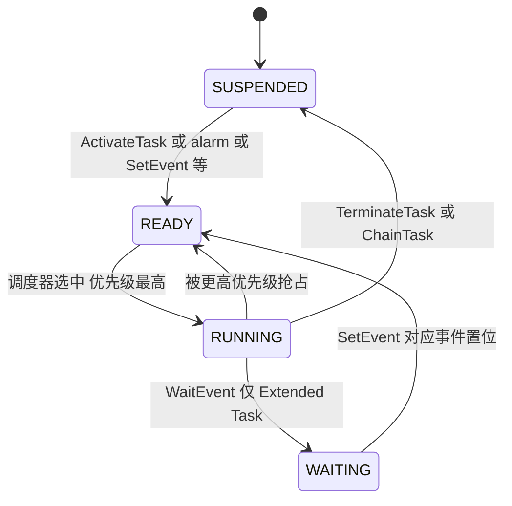
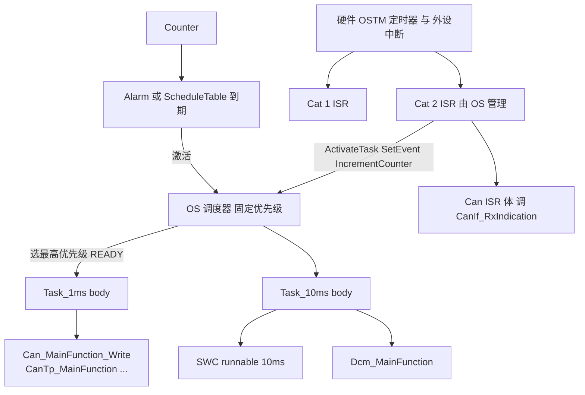

# 06 OS 基础：AUTOSAR OS 给 Classic 平台提供了什么

> 本章回答：(1) 为什么需要 RTOS，AUTOSAR OS 是什么、基于什么？(2) Task / ISR / Event / Alarm / ScheduleTable / Resource / OS-Application 各解决什么问题？(3) "谁调度谁"：MainFunction 和 runnable 为什么只有被 task/ISR 调用才会运行？
> Prerequisite: [04 ECU 启动与 EcuM](./04-ecu-startup-ecum.md)（`StartOS`、StartupHook、autostart task）、[05 MCAL 的角色与架构](./05-mcal-role-and-architecture.md)（ISR 与 MainFunction）
> Next: [07 RTE 与 OS](./07-rte-and-os.md)
> 对应规范（R25-11）：Os SWS（Doc 34）；RTE SWS §4.2.2（RTE 使用的 OS 对象）；EcuM SWS（Hook 的用法）
> 深入阅读：[Part II · OS：Task、ISR、Alarm](../02-autosar-classic/06-os-task-isr.md)、[Part II · MainFunction 调度](../02-autosar-classic/07-mainfunction-scheduling.md)、[Part I · 中断与异常](../01-rh850/06-interrupt-exception.md)、[Part VII · RTE 概念](../07-rte-swc/04-rte-concept.md)

> 范围声明：**本章只讲 OS 基础**，让你读得懂 OS 配置与 task 代码。RTE 如何用 OS 对象来实现 runnable 激活、数据一致性、跨核通信，由第 07 章深入讲解，这里只在"桥接"一节点到为止。
> 来源提示：Os SWS 自身只描述 **OSEK（汽车行业的经典 OS 标准，AUTOSAR OS 在其上扩展）之上的扩展与限制**，Task 状态（suspended/ready/running/waiting）、`ActivateTask`、`WaitEvent` 等 OSEK 概念不在本 SWS 重述（Os R25-11 p.21 的 Glossary 只定义 Basic/Extended Task）。本章凡属 OSEK 经典知识的地方会标注 `[OSEK 经典]`，而不是假装它们出自 R25-11 SWS。

---

## 1. 本章要回答的问题

- 一个周期 1 ms、一个周期 10 ms、一个由 CAN 中断触发的处理，怎么放进同一颗 CPU 里还能满足时限？
- AUTOSAR OS 和 FreeRTOS 有什么不同？为什么 AUTOSAR 要求"静态配置"？
- `Can_MainFunction_Write()` 是"谁"在每 1 ms 调用的？

---

## 2. 直觉理解

### 2.1 为什么需要 RTOS：从 superloop 说起

没有 OS 的裸机程序：

```c
/* [Conceptual] superloop */
while (1) {
    Can_MainFunction_Read();
    Com_MainFunctionRx();
    SwcA_Run();        /* 要 10 ms 一次 */
    SwcB_Run();
    /* 总周期被最慢的那个函数拖长，无法保证 1 ms 的函数真的每 1 ms 一次 */
}
```

问题：**优先级无法表达**、**时限难保证**、**中断与主循环共享数据靠临界区自己管**、**多团队协作难拆分**。RTOS 提供的三样东西（Part II 已展开）：**抢占式的固定优先级调度**、**中断与任务的统一管理**、**同步原语（event/resource/alarm）**。

### 2.2 AUTOSAR OS 是什么

- **以 OSEK/VDX OS（ISO 17356-3）为核心；API 向后兼容 OSEK**（SWS_Os_00001，Os R25-11 p.36）。特点：**静态配置**（所有 task/ISR/alarm 在配置阶段确定，运行时不能动态创建）、**固定优先级调度**、中断优先于任务、`StartOS`/`StartupHook`、`ShutdownOS`/`ShutdownHook`（Os p.17, p.36）。
- 在 OSEK 之上，AUTOSAR OS 增加：**Counter/SWFRT、ScheduleTable、OS-Application 与保护设施（内存、时间、服务）、多核（StartCore、spinlock、IOC）、扩展的 hook**（Os p.38-41；第 3 节）。
- 它对 SW-C 是**不可见**的：SW-C 里不应直接调用 OS 服务，runnable 经 RTE 被调度（RTE R25-11 p.133-134、p.139）。

类比（帮助记忆）：OS 像一个**机场塔台**：只有它决定谁先起飞（调度），每架飞机（task）在配置阶段就确定了跑道和优先级，中途不能临时加飞机。

---

## 3. 原理（规范依据）

### 3.1 Task：Basic 与 Extended `[OSEK 经典]` + `[AUTOSAR Standard]`

- 定义（Os R25-11 Glossary p.21）：**Basic Task** = 不能自己阻塞（不能 wait Event）；**Extended Task** = 可阻塞并等待 Event。
- 状态 `[OSEK 经典]`：



- Basic Task：只有 SUSPENDED / READY / RUNNING 三态，body 执行完要 `TerminateTask`；Extended Task 多一个 WAITING 态，通常写成 `for(;;){ WaitEvent(...); ...; ClearEvent(...); }`。
- **谁决定是 Basic 还是 Extended**：由 OsTask 是否关联 OS Event 决定（RTE R25-11 p.148 的表述）。
- **优先级**：固定，静态配置；高优先级可抢占低优先级（`[OSEK 经典]`，"抢占 / 非抢占 / 混合"由 `OsTaskSchedule` 配置）。
- **激活不排队不是绝对的**：Basic Task 可配置多次激活（`OsTaskActivation`），Extended Task 只能 1 次 `[OSEK 经典]`。

### 3.2 ISR：Category 1 与 Category 2

| | **Category 1** | **Category 2** |
|---|---|---|
| OS 是否感知 | **不感知**（OS 不知道它何时被调用） | **OS 管理** |
| 可调用的 OS 服务 | 基本不能调用（可能只有中断控制类） | 可调用大多数 OS 服务（`ActivateTask`、`SetEvent`…） |
| 保护 | **无法对其提供运行时保护**；若与 OS-Application 共用，须属 trusted OS-Application | 可被 OS 管理与保护 |
| 典型用途 | 极低延迟、不需要 OS 服务的处理 | 绝大多数外设中断（CAN RX、Gpt、Adc 通知等） |

依据：Os R25-11 p.63；SWS 保护章节（"不可能在 Category 1 ISR 运行期间提供保护，因为 OS 感知不到它"）；EcuM p.41 脚注：**Cat II 需要运行中的 OS，每个中断向量只能属于一种 category**；RTE：**category 1 ISR 不得访问 RTE**（SWS_Rte_CONSTR_09012，RTE p.183）。

> `[RH850 Hardware]` 在 RH850 上，Cat 2 ISR 由 OS 的入口代码（保存上下文、调用你的 ISR 体、返回时触发调度）包住；Cat 1 通常直接是硬件向量里的函数。外设中断通道、EIC 与向量方式见 [Part I · 中断与异常](../01-rh850/06-interrupt-exception.md)（§8.5 对 AUTOSAR OS ISR Category 与 RH850 硬件的对应）。

### 3.3 Event（事件）

- 属于 Extended Task：一个 task 可以持有若干个 event 位，`WaitEvent(mask)` 阻塞等待，`SetEvent(task, mask)` 由别的 task / ISR2 / alarm 置位唤醒（`[OSEK 经典]`）。
- 用途：一个 extended task 同时等待多个触发源（如"来自 10 ms alarm"与"来自 CAN 接收"）。
- AUTOSAR 的扩展：多核跨核异步版 `SetEventAsyn`、`ActivateTaskAsyn`（SWS_Os_91022/91023，Os p.213）。RTE 用 Event 实现 WaitPoint 与多周期共 task，见第 07 章。

### 3.4 Counter、Alarm、ScheduleTable

| 对象 | 作用 | 要点 |
|---|---|---|
| **Counter** | 一个"滴答计数器"，由硬件定时器（如 OSTM）或软件（`IncrementCounter`）驱动 | `IncrementCounter`（SWS_Os_00399，p.190）、`GetCounterValue`（SWS_Os_00383，p.191）、`GetElapsedValue`（SWS_Os_00392，p.192）；**OS 自己管理它直接用的 timer**（SWS_Os_00374） |
| **Alarm** | 绑在 Counter 上，到期时执行动作：激活 task / 设置 event / 调 callback / 递增另一个 counter | `SetRelAlarm`（increment=0 返回 E_OS_VALUE，SWS_Os_00304）；允许 autostart 绝对 alarm（SWS_Os_00476）；alarm callback 仅 SC1（SWS_Os_00242）；alarm 到期可递增 software counter（SWS_Os_00301） |
| **ScheduleTable** | 一张**静态时间表**：一组 expiry point，每个 expiry point 含要激活的 Task 集、要设置的 Event 集 | SWS_Os_00401/00402/00403；可补充 execution budget（SWS_Os_00876）；由 Counter 驱动；`StartScheduleTableRel`（SWS_Os_00347）/`Abs`（00358）/`Synchron`（00201）、`NextScheduleTable`、`SyncScheduleTable` |

直觉：**Alarm 像闹钟**（一个一个设），**ScheduleTable 像课程表**（把一堆时间点统一规划，且可以与外部时间同步）。真实项目里，周期性的 BSW/SWC task 往往由 ScheduleTable 或 Alarm 激活。

### 3.5 Resource 与优先级天花板

- `GetResource(res)` / `ReleaseResource(res)`：保护临界区。OS 使用**优先级天花板协议（priority ceiling protocol）**：拿到资源的 task，其优先级被临时提升到该资源的天花板优先级（所有可能使用该资源的 task 的最高优先级），从而避免**优先级反转**与**死锁**（Os R25-11 p.109 写明 `GetResource` 使用该协议，且它临时改变 task 优先级、而优先级是每核本地的，所以跨核不足以保护临界区；协议本身属 `[OSEK 经典]`）。
- **R25-11 变化**：`RES_SCHEDULER` 不再自动存在，当普通 resource 处理（Os p.37）；Resource 不属于任何 OS-App，访问需显式授权（p.59）。
- 多核：天花板协议不足以保护跨核临界区，需 **spinlock**：`GetSpinlock`（SWS_Os_00686，p.199）、`ReleaseSpinlock`（00695）、`TryToGetSpinlock`（00703）。
- 其他临界区手段：`DisableAllInterrupts / EnableAllInterrupts / SuspendAllInterrupts / ResumeAllInterrupts` 在 `StartOS` 前、`ShutdownOS` 后也可用（SWS_Os_00299，p.38）。RTE 的 Exclusive Area 的实现机制可选 NONE / ALL_INTERRUPT_BLOCKING / OS_INTERRUPT_BLOCKING / OS_RESOURCE / OS_SPINLOCK / RTE_PLUGIN（ECUC_Rte_09029，RTE p.1181），第 07 章展开。

### 3.6 OS-Application、保护与"partition"

- **OS-Application** = 一组 Task、ISR、Alarm、ScheduleTable、Counter、hook、trusted function 的内聚单元（SWS_Os_00445，Os p.59）。若使用 OS-Application，所有这些对象必须属于某个 OS-App；同一 OS-App 内互相可访问，跨 OS-App 访问需配置授权（SWS_Os_00448，p.62）。
- **Trusted**（可特权运行、保护可关）vs **Non-trusted**（受限访问、timing 被强制）（SWS_Os_00446，p.59/61）。状态 `APPLICATION_ACCESSIBLE / TERMINATED`；`TerminateApplication`（SWS_Os_00258，p.194）终止其所有 Task/ISR、关中断、停 alarm 与 schedule table（SWS_Os_00447，p.62）。
- "**partition**"一词在 OS SWS 里不是独立对象：RTE/BswM 把 OsApplication 对应的运行单元称 partition（RTE p.82；BswM p.39）。
- **保护设施**：Memory Protection（MPU）、Timing Protection（需高优先级 timer 中断）、Service Protection、`CallTrustedFunction`（SWS_Os_00097，p.172）、ProtectionHook（SWS_Os_00538，p.234：返回 `PRO_IGNORE / PRO_TERMINATETASKISR / PRO_TERMINATEAPPL / PRO_SHUTDOWN`）。
- `[RH850 Hardware]` RH850 的 MPU 有 16 个区域（P1M-E 数据手册，Part I 有说明），OS-Application 的内存保护建立在它之上；`SYSERR`（FE 级）通常最终走到 ProtectionHook / ShutdownOS（见 [硬件映射总表 §5.6](../03-mcal/07-rh850-hardware-mapping.md)）。

### 3.7 Hook

| Hook | 规则 | 依据 |
|---|---|---|
| `StartupHook` + `StartupHook_<App>` | 系统级先于应用级；应用级以所属 OS-App 权限运行 | SWS_Os_00060/00226/00236，p.134；接口 SWS_Os_00539 p.235 |
| `ShutdownHook` + `ShutdownHook_<App>` | 应用级先于系统级 | SWS_Os_00112/00225/00237，p.134-135；SWS_Os_00541 p.236 |
| `ErrorHook` + `ErrorHook_<App>` | 应用级在系统级之后；返回 `StatusType` 的服务才触发 | SWS_Os_00246/00085/00367，p.135；SWS_Os_00540 |
| `ProtectionHook` | 严重错误（超 WCET、违反内存保护）时调用 | SWS_Os_00538，p.234 |
| `PreTaskHook` / `PostTaskHook` | `[OSEK 经典]`，每次 task 切换前后调用，常用于调试与时间测量 | 非本 SWS 新增 |

EcuM 对 hook 的用法：**`ShutdownHook` 里必须调 `EcuM_Shutdown`**（SWS_EcuM_02953，EcuM p.49）；`StartupHook` 之后由 autostart task 调 `EcuM_StartupTwo`（EcuM p.37）。**RTE SWS 不标准化任何 OS hook 的使用**（RTE p.141）。

### 3.8 Scalability Class（SWS_Os_00241，Os p.133）

| 特性 | SC1 | SC2 | SC3 | SC4 |
|---|---|---|---|---|
| OSEK OS、Counter、ScheduleTable、Stack monitoring | 是 | 是 | 是 | 是 |
| ProtectionHook | - | 是 | 是 | 是 |
| Timing protection；Global time | - | 是 | - | 是 |
| Memory protection（MPU）、Service protection、CallTrustedFunction | - | - | 是 | 是 |
| OS-Application | 脚注（SWS_Os_00764） | 同 | 是 | 是 |

SC3/SC4 总是 extended status（SWS_Os_00327，p.133）。直觉：**SC1 = 经典 OSEK 加点扩展；SC2 加时间保护；SC3 加内存保护；SC4 两者都有**。选 SC 要看功能安全（ASIL）需求，真实项目里 SC1 与 SC3 最常见（`[Industry Practice]`）。

### 3.9 `StartOS`

- `StartOS(AppMode)`：**首次调用不返回**（SWS_Os_00424，Os p.38）；ShutdownHook 返回后 OS 关中断并死循环（SWS_Os_00425）。
- **AppMode** 决定哪些 autostart 的 Task/Alarm/ScheduleTable 被启动；多核时各核都要调，AppMode 必须一致或为 DONOTCARE（SWS_Os_00607-00610，p.105）。
- StartOS 之后、任何 StartupHook 之前，所有 OS-Application 置为 `APPLICATION_ACCESSIBLE`（SWS_Os_00500，p.62）。
- 多核：`StartCore`（SWS_Os_00676，p.198）须在该核 `StartOS` 前调用（SWS_Os_00606）；`GetCoreID`、`ShutdownAllCores`（SWS_Os_00713，p.204）。

---

## 4. "谁调度谁"：OS 是唯一决定"谁在跑"的东西

> 这是本章最重要的一节。

**核心结论**：CPU 上任何一行 AUTOSAR 软件代码，要么在 **ISR** 里被调用，要么在 **task** 里被调用。**没有第三种**（除了 `main`/`StartOS` 之前的裸机阶段和 hook）。



- `Can_MainFunction_Write` 不会自己运行。它能每 1 ms 运行一次，是因为：**配置里有一个 OsCounter（由 OSTM 驱动）→ 一个 OsAlarm / ScheduleTable expiry point 每 1 ms 激活 `Task_1ms` → `Task_1ms` 的 body 里（由 RTE/SchM 生成）按顺序调用了它**。
- **RTE Generator 生成 task 与 ISR2 的函数体**（SWS_Rte_06200 / 04560，RTE p.134-135），body 里按配置的顺序调用 runnable 与 BSW MainFunction；**但"哪个 runnable/MainFunction 放进哪个 task"是配置输入**（`RteEventToTaskMapping` ECUC_Rte_09020、`RtePositionInTask` ECUC_Rte_09023；BSW 侧 `RteBswEventToTaskMapping`，RTE p.1156-1158, p.1211-1218）。RTE 一般**不创建** OsTask（`strictConfigurationCheck` 关闭时例外，SWS_Rte_05150）。**OsTask、优先级、autostart、OsEvent、OsAlarm 由集成者在 OS 配置里创建。**
- RTE 与 BSW Scheduler 只能使用 OS；"BSW Scheduler 不是与 OS 调度器竞争的实体"（RTE p.134）。**同一个 OsTask 可同时放 BSW MainFunction 与 SWC runnable，用 position 排序**（RTE Example 8.2，p.1162-1163）。
- **SW-C 不能含中断处理函数，只能实现为 Task（或一组 Task）里的 runnable**（Os R25-11 p.23 §4.3）。
- 并不是所有 runnable 都在 task 里：server / triggered / mode 的 entry-exit 等可以被实现成调用者上下文里的 direct function call（RTE p.171-173）。Category 2 runnable（含 WaitPoint）必须映射 extended task，不能在 ISR2（SWS_Rte_CONSTR_09120）。这些属于第 07 章。

> 因此："`MainFunction` 周期是 10 ms" 这句话的含义是：**配置里有一个 task 每 10 ms 被激活，且它的 body 里调用了这个 MainFunction**。如果把 MainFunction 映射到一个 5 ms 的 task，它就是 5 ms；如果没有任何 task 调用它，它永远不运行。对照 [Part II · MainFunction 调度](../02-autosar-classic/07-mainfunction-scheduling.md)。

---

## 5. 配置与代码示例

### 5.1 `[Conceptual]` OIL 风格配置（经典 OSEK 写法，仅示意）

```c
/* [Conceptual] OIL 风格 —— 真实工程由 ARXML/ECUC 工具生成 */
OS Os {
    STATUS = EXTENDED;
    STARTUPHOOK = TRUE;
    SHUTDOWNHOOK = TRUE;
    ERRORHOOK = FALSE;
};

COUNTER SysCounter { MAXALLOWEDVALUE = 0xFFFFFFFF; TICKSPERBASE = 1; MINCYCLE = 1; };

TASK Task_Init {                       /* autostart：调 EcuM_StartupTwo */
    PRIORITY = 10; SCHEDULE = NON; ACTIVATION = 1; AUTOSTART = TRUE { APPMODE = OSDEFAULTAPPMODE; };
};
TASK Task_1ms {                        /* Basic task，周期由 alarm 激活 */
    PRIORITY = 30; SCHEDULE = FULL; ACTIVATION = 1; AUTOSTART = FALSE;
};
TASK Task_10ms {
    PRIORITY = 20; SCHEDULE = FULL; ACTIVATION = 1; AUTOSTART = FALSE;
};
TASK Task_Rx {                         /* Extended task，等待 CAN 接收事件 */
    PRIORITY = 25; SCHEDULE = FULL; ACTIVATION = 1; AUTOSTART = FALSE; EVENT = Ev_CanRx;
};
EVENT Ev_CanRx { MASK = AUTO; };

ALARM Alarm_1ms {
    COUNTER = SysCounter; ACTION = ACTIVATETASK { TASK = Task_1ms; };
    AUTOSTART = TRUE { ALARMTIME = 1; CYCLETIME = 1; APPMODE = OSDEFAULTAPPMODE; };
};
ALARM Alarm_10ms {
    COUNTER = SysCounter; ACTION = ACTIVATETASK { TASK = Task_10ms; };
    AUTOSTART = TRUE { ALARMTIME = 10; CYCLETIME = 10; APPMODE = OSDEFAULTAPPMODE; };
};

ISR Can_RxIsr { CATEGORY = 2; PRIORITY = 5; };   /* 中断优先级需与 RH850 EIC 配置对应 */
RESOURCE Res_Shared { RESOURCEPROPERTY = STANDARD; };
```

要点：数字（优先级、周期）都是**示意值**；`Task_Rx` 是 Extended（有 EVENT），其他是 Basic。优先级的数值方向因 OS 实现而异（有的数值越大优先级越高），请以所用 OS 文档为准。

### 5.2 `[Conceptual]` ARXML 风格摘要

```xml
<!-- [Conceptual] ECUC 值的 OsTask 片段，参数名对应 Os 的 ECUC 定义，仅示意 -->
<ECUC-CONTAINER-VALUE>
  <SHORT-NAME>Task_10ms</SHORT-NAME>
  <DEFINITION-REF DEST="ECUC-PARAM-CONF-CONTAINER-DEF">/AUTOSAR/EcucDefs/Os/OsTask</DEFINITION-REF>
  <PARAMETER-VALUES>
    <ECUC-NUMERICAL-PARAM-VALUE>OsTaskPriority = 20</ECUC-NUMERICAL-PARAM-VALUE>
    <ECUC-NUMERICAL-PARAM-VALUE>OsTaskActivation = 1</ECUC-NUMERICAL-PARAM-VALUE>
  </PARAMETER-VALUES>
  <REFERENCE-VALUES>
    <!-- 引用 OsApplication、OsTaskAutostart 等 -->
  </REFERENCE-VALUES>
</ECUC-CONTAINER-VALUE>
```

RTE 侧通过 `RteMappedToTaskRef`（ECUC_Rte_09021）引用 `OsTask`，把 runnable 事件映射进去（见第 07 章）。

### 5.3 `[Conceptual]` task body 草图

```c
/* [Conceptual] 手写示意；在 AUTOSAR 工程里 task body 通常由 RTE/SchM 生成 */
TASK(Task_Init)
{
    EcuM_StartupTwo();            /* SchM_Start / BswM_Init / SchM_Init / SchM_StartTiming */
    (void)TerminateTask();
}

TASK(Task_1ms)                    /* Basic task：每次被 Alarm 激活后执行一遍 */
{
    Can_MainFunction_Mode();
    Can_MainFunction_Write();
    Can_MainFunction_Read();
    CanTp_MainFunction();
    (void)TerminateTask();
}

TASK(Task_Rx)                     /* Extended task：等待事件 */
{
    EventMaskType ev;
    for (;;) {
        (void)WaitEvent(Ev_CanRx);
        (void)GetEvent(Task_Rx, &ev);
        (void)ClearEvent(ev);
        /* 处理 */
    }
}

ISR(Can_RxIsr)                    /* Cat 2：OS 保存/恢复上下文 */
{
    /* 清中断源，调驱动 */
    (void)SetEvent(Task_Rx, Ev_CanRx);
}

void StartupHook(void) { /* 极少量早期工作，勿放耗时逻辑 */ }
void ShutdownHook(StatusType Error) { EcuM_Shutdown(); /* 不返回 */ }
```

对照教学 demo `examples/uds_diag_demo/integration/BswScheduler.c:25-57`：`BswScheduler_Tick1ms` 用一个函数手写模拟了"1 ms task / 5 ms task / 10 ms task"和"Can RX ISR"，**没有真实 OS**；真实 ECU 里这些由 OS task 与 ISR 完成，周期来自 Counter+Alarm/ScheduleTable。

---

## 6. 与 RH850 的关系

`[RH850 Hardware]` 本节只给出对应关系，细节见 Part I/II：

| OS 概念 | RH850 资源（P1M-E） | 链接 |
|---|---|---|
| Counter 的硬件时钟 | **OSTM**（OS Timer，如 OSTM0/OSTM1；也有 TAU 可用）。OSTM0/OSTM1 的归属在不同文档中不一致，**是配置选择**而非硬件事实：同一通道不能同时给 Gpt 与 OS | [Part III · MCAL 总览 §8.1 产权表](../03-mcal/01-mcal-overview.md) |
| ISR 优先级、使能、向量 | **INTC1/INTC2**：`EICn`（EIP 优先级、EIMK 屏蔽、EITB 向量方式），`INTBP` 向量表基址 | [Part I · 中断与异常](../01-rh850/06-interrupt-exception.md) |
| `DisableAllInterrupts` / `SuspendAllInterrupts` | `PSW.ID`（DI/EI）；`SuspendOSInterrupts` 用优先级屏蔽（`PMR`） | 同上 §8.2-8.3 |
| 嵌套 ISR 上下文保存 | `EIPC/EIPSW`（只有一组，嵌套须软件保存） | 同上 |
| OS-Application 内存保护 | MPU（16 区） | [硬件映射总表 §5.6](../03-mcal/07-rh850-hardware-mapping.md) |
| ProtectionHook / ShutdownOS 的触发来源 | FE 级 `SYSERR` 等不可恢复异常 | [Part X · Exception 与 Trap](../10-boot-debug/02-exception-and-trap-handlers.md) |
| StartOS 前的时钟/定时器 | 启动阶段的时钟与 WDTA 首次期限 | [Part I · 启动过程](../01-rh850/04-startup-process.md) |

> 关键点：**OS 的 tick 来自某个硬件定时器（OSTM/TAU）的中断**。OS 在这个中断里递增 Counter、检查 Alarm、必要时激活 task；这就是 "1 ms 周期" 的物理来源。如果这个定时器时钟配错（比如 Mcu 的时钟假设与实际不符），**所有周期都会错**，而且错得很整齐。调试起点见 [Part X](../10-boot-debug/README.md)。

---

## 7. 常见误解

1. **"AUTOSAR OS 就是 FreeRTOS 的 AUTOSAR 版"**：不同。AUTOSAR OS 基于 OSEK：静态配置、固定优先级、无动态创建/删除 task、无队列/信号量（用 Resource/Event 等原语），有 OS-Application 与保护。
2. **"MainFunction 是 OS 的东西"**：不是。MainFunction 是 BSW 模块的**调度函数**，只是被 task body 调用；OS 并不认识它。
3. **"runnable 是 task"**：不是。runnable 是 SWC 内的代码片段，**映射**到 task 内；一个 task 里可有多个 runnable，也可有 BSW MainFunction（RTE p.1162-1163）。
4. **"RTE 创建了 OS task"**：一般不创建；RTE 生成 task body，OsTask 由集成者在 OS 配置里建（SWS_Rte_05150 为例外）。
5. **"Cat 1 ISR 比 Cat 2 更好因为更快"**：Cat 1 不能调 OS 服务、不能被保护、不能访问 RTE；多数外设中断用 Cat 2。
6. **"StartupHook 里做初始化"**：EcuM 的约定是由 autostart task 调 `EcuM_StartupTwo`；StartupHook 应保持极短。
7. **"SLEEP 会关掉 OS"**：不会，sleep 对 OS 透明（SWS_EcuM_02951）。
8. **"SC3/SC4 只多了几个 API"**：它们开启 MPU、service protection，影响 ISR/task 的权限与内存布局，配置和调试成本明显变大。
9. **"周期由 task 里写的延时决定"**：周期来自 Counter+Alarm/ScheduleTable 的激活，task body 里不应写阻塞延时。
10. **"优先级数字越大越高"**：取决于 OS 实现，不要假设。

---

## 8. 真实项目里你会看到什么 `[Real Project Consideration]`

- OS 配置通常由工具从 ARXML/ECUC 生成（例如 RTA-OS 一类产品），`Os_Cfg.c`、`Os_Cfg.h`、`Os_Types.h` 等是**生成物**，不要手改。
- 常见 task 集合：`Task_Init`（autostart）、`Task_1ms`、`Task_5ms`、`Task_10ms`、`Task_100ms`、`Task_Background`、若干 Extended task（有 WaitPoint 的 runnable 或 CDD）、ISR2 task 体。
- 周期通常由 **ScheduleTable** 管理（统一相位）或一组 Alarm；**RTE 生成的 task body** 里是 `if (event) { Runnable(); }` 的序列，按 `RtePositionInTask` 排序。
- 栈与堆栈监控：SC1 起就有 stack monitoring；栈溢出常表现为随机 trap，调试见 [Part X](../10-boot-debug/README.md)。
- 优先级规划是系统设计的一部分：通常通信栈相关 task 优先级较高，应用 task 较低，Background 最低；ISR 优先级通常高于所有 task（`[Industry Practice]`）。
- 多核 ECU 的 OS 配置明显更复杂：每核一份 `StartOS`、跨核 IOC、spinlock，通常由 Integrator 与 OS 供应商一同定。
- **OS 供应商 / BSW 供应商不同**：OS 配置、RTE 生成器、BSW 模块往往来自同一套工具链，一致性由工具链保证；规范只定义角色与产物（METH），并没有"OS 厂商"这种 role（见 METH p.182-189）。

---

## 9. 一句话记住

- **AUTOSAR OS = OSEK 基线 + 扩展**：静态配置、固定优先级、`StartOS` 不返回。
- **Basic task 不能 wait，Extended task 可 wait Event**。
- **Cat 1 ISR OS 不感知；Cat 2 ISR 由 OS 管理**，大多数外设中断用 Cat 2。
- **Counter → Alarm / ScheduleTable → 激活 task**：这是周期的来源。
- **Resource 靠优先级天花板；多核用 spinlock**。
- **OS-Application 是保护与授权的边界**，SC3/SC4 才有 MPU。
- **"谁调度谁"**：只有 OS 决定谁跑；MainFunction 与 runnable 只是被 task/ISR 调用。runnable→task 映射是配置输入。

---

## 10. 自测题

1. Basic Task 与 Extended Task 的区别？一个 task 是否 Extended 由什么决定？
2. 为什么在 StartPreOS（`StartOS` 之前）只允许 Category 1 ISR？
3. Alarm 与 ScheduleTable 的区别？一个 10 ms 的 task 是如何被激活的？
4. 优先级天花板协议解决什么问题？多核下为什么还不够？
5. 一个 BSW `MainFunction` 的周期是由谁决定的？如果没有 task 调用它会怎样？
6. SC1 / SC2 / SC3 / SC4 的主要区别是什么？
7. `ShutdownHook` 里必须调用什么？为什么？
8. 对照 demo `BswScheduler.c:25-57`，指出它省略了真实 OS 的哪些部分。
9. RTE Generator 生成什么、不生成什么？OsTask 由谁创建？
10. 如果 OS tick 的硬件定时器时钟配错，会看到什么现象？

参考要点：(1) Basic 不能 WaitEvent；由 OsTask 是否关联 OS Event 决定。(2) Cat 2 需运行中的 OS。(3) 见 §3.4；Alarm/ScheduleTable 到期 → ActivateTask。(4) 优先级反转/死锁；跨核需 spinlock。(5) 集成者配置的 task 周期 + 映射；没有则永不运行。(7) `EcuM_Shutdown`。(9) 生成 task/ISR2 body，不创建 OsTask（SWS_Rte_05150 例外）。(10) 所有周期同比例偏差。

---

## 11. 下一章

[第 07 章](./07-rte-and-os.md) 将深入 **RTE 与 OS 的关系**：RTE 如何用 task、event、alarm、resource、spinlock 实现 runnable 激活、数据一致性与跨核通信，以及 `RteEventToTaskMapping` 如何把 SWC 描述落到你在本章看到的 OS 配置上。更多 OS 与 RH850 中断硬件细节见 [Part II · OS：Task、ISR、Alarm](../02-autosar-classic/06-os-task-isr.md)。
