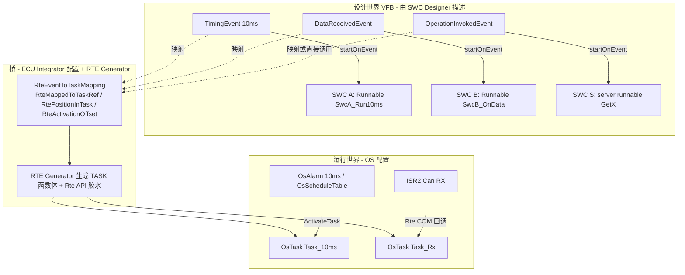
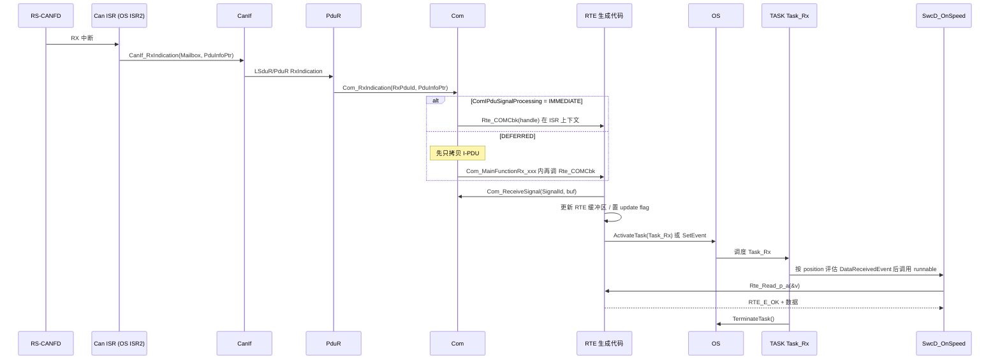
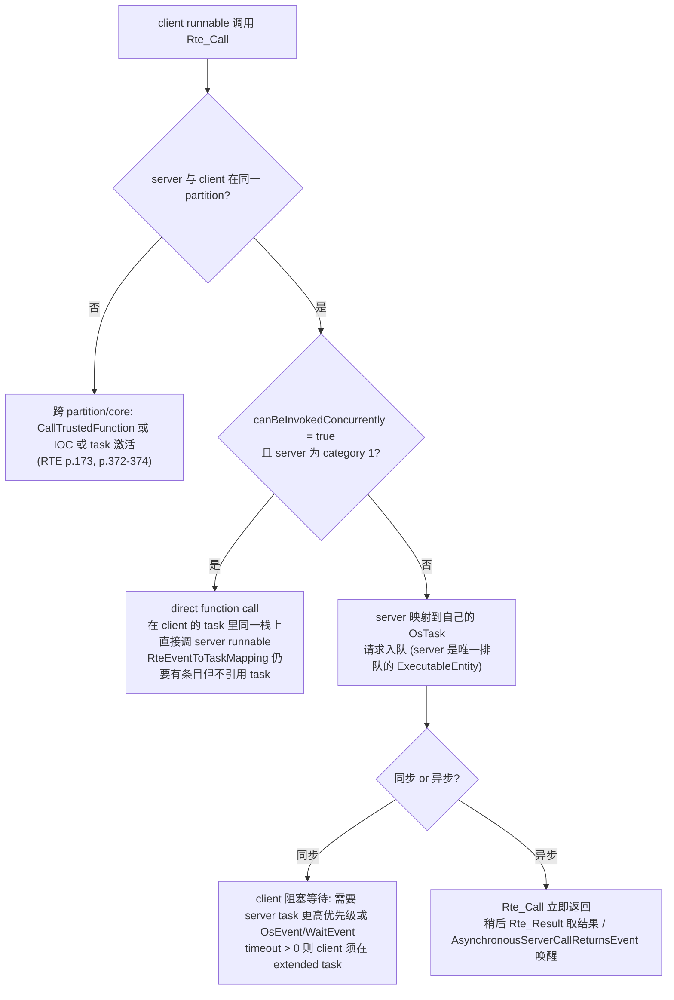
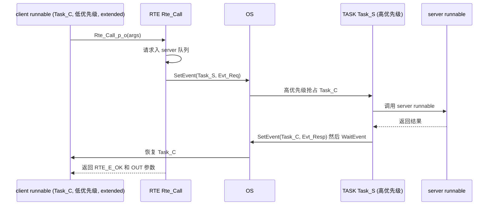
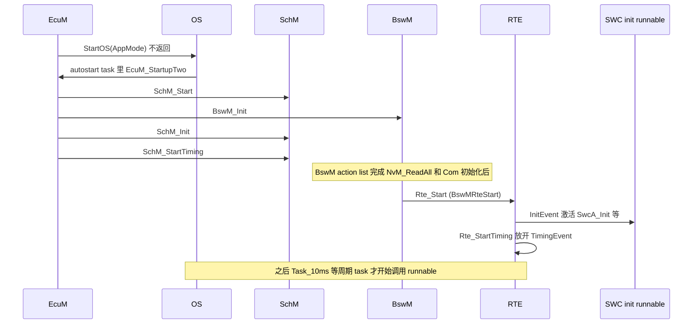
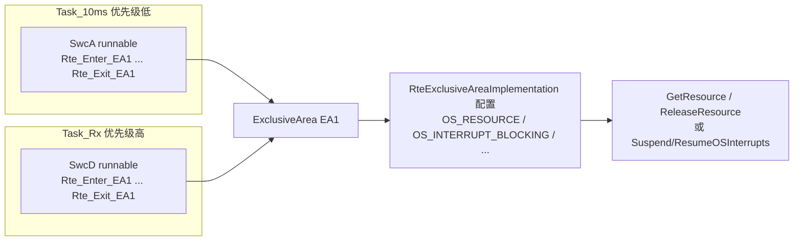
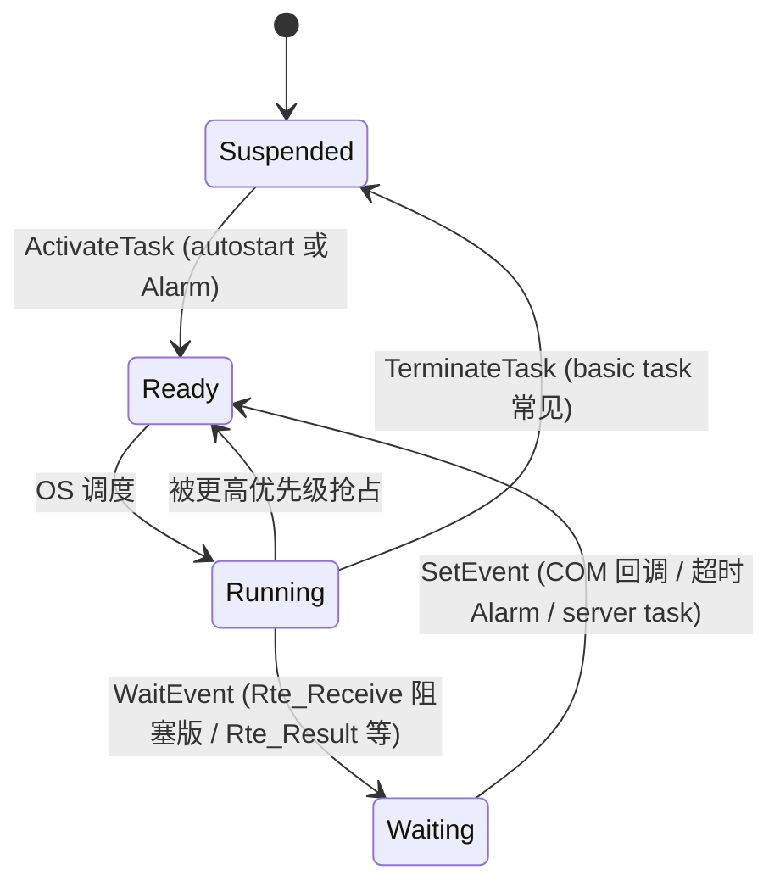

# 07 RTE 与 OS：两个世界之间的那座桥

> 本章回答：(1) runnable 是不是都绑定在 RTE event 上？那 OS task 在哪里？(2) RTE 是调度器吗？谁让 runnable 真正跑起来？(3) 数据一致性、InitEvent、wait point 这些"边角"在 OS 上是怎么落地的？
> Prerequisite: [06 OS 基础](06-os-basics.md)（Task / ISR / Alarm / 优先级）、[01 架构全景](01-architecture-big-picture.md)    Next: [08 SWC 与 RTE 交互](08-swc-rte-interaction.md)
> 对应规范（R25-11）：RTE SWS（`AUTOSAR_CP_SWS_RTE`，Doc ID 84）p.133–150、p.157–158、p.171–173、p.1156–1167；OS SWS p.23；EcuM SWS p.33、p.41–42；BswM SWS p.169
> 深入阅读：[07-rte-swc/03 Runnable 与 Event](../07-rte-swc/03-runnable-event.md)、[07-rte-swc/04 RTE 概念](../07-rte-swc/04-rte-concept.md)、[07-rte-swc/06 Client/Server](../07-rte-swc/06-client-server.md)、[07-rte-swc/07 Sender/Receiver](../07-rte-swc/07-sender-receiver.md)、[02-autosar-classic/07 MainFunction 调度](../02-autosar-classic/07-mainfunction-scheduling.md)
> 对应 demo：`examples/uds_diag_demo/integration/BswScheduler.c`、`rte/Rte_Dcm.c`

---

## 0. 直接回答（先看这个框）

> **你的问题：很多 SWC 都是绑定 RTE event 对吗？那 OS task 呢？SWC 怎么和 RTE 交互？**
>
> 1. **对。** 在 SWC 的描述里（SwcInternalBehavior），每个 runnable 通过 `startOnEvent` 绑定到一个或多个 **RTEEvent**；如果没有任何 RTEEvent 引用某个 runnable，RTE 永远不会激活它（RTE SWS R25-11 p.142）。
> 2. **但 RTE 不是调度器。** RTEEvent 只是"什么时候该跑"的**语义描述**；"在哪个执行上下文里跑"是**配置**决定的：集成者在 ECU 配置（ECUC）里用 `RteEventToTaskMapping`（ECUC_Rte_09020）把每个 RTEEvent 映射到一个 **OsTask**（带 `RtePositionInTask`、`RteActivationOffset`）。RTE 生成器**生成 task 的函数体**（SWS_Rte_06200，p.134），但 **不替你决定映射**（映射是输入，RTE p.135、p.139）。
> 3. **真正让 task 跑起来的是 OS**：OS 的 Alarm / ScheduleTable 周期性 `ActivateTask`/`SetEvent`；ISR2 里的 RTE/COM 回调调用 `ActivateTask`；RTE API 内部（如 `Rte_Write`、`Rte_Call`）也会调用 OS 服务去激活别的 task。
> 4. **有例外：并非所有 runnable 都在 task 里。** server runnable（OperationInvokedEvent）、triggered runnable、mode on-entry/on-exit 等，可以被 RTE 实现成**在调用者上下文里的直接函数调用**（SWS_Rte_06798–06800，p.1161；p.171–173）。这时配置里仍要有 `RteEventToTaskMapping` 条目表示"已考虑"，但不引用 task。
> 5. **BSW 的 MainFunction 用同一套机制**：`BswTimingEvent` + `RteBswEventToTaskMapping`，由 SchM（BSW Scheduler）生成的 task 体调用；同一个 OsTask 里可以同时放 SWC runnable 和 BSW MainFunction，靠 position 排序。
> 6. **SWC 怎么和 RTE 交互**：SWC 只 `#include "Rte_<Swc>.h"`，只调 `Rte_Read/Write/Call/...`，从不直接碰 OS（runnable 不允许直接调用 OS 服务，RTE p.139）。详见 [08 章](08-swc-rte-interaction.md)。

一句话：**SWC 绑定的是 "RTE event"（设计世界），OS 管的是 "task / ISR"（运行世界），RTE 生成器 + 集成者写的映射配置，是两个世界之间的桥。**

---

## 1. 本章要回答的问题

| # | 问题 | 小节 |
|---|---|---|
| 1 | RTEEvent 有哪些？分别什么时候触发？ | §3 |
| 2 | 设计世界与运行世界到底是什么关系？ | §2 |
| 3 | "映射配置"长什么样？task 体长什么样？ | §4、§5 |
| 4 | 数据到达（DataReceivedEvent）如何变成 runnable 的一次执行？ | §6 |
| 5 | C/S 调用：同步/异步、直接调用/跨 task 的区别？ | §7 |
| 6 | InitEvent 与 `Rte_Start`？ | §8 |
| 7 | 多个 task 抢占时 RTE 如何保证数据一致？ | §9 |
| 8 | wait point 为什么需要 extended task？ | §10 |
| 9 | BSW MainFunction 怎么被调度？demo 里是什么样？ | §11、§12 |

---

## 2. 直觉理解：两个世界

[Conceptual] 把 AUTOSAR 想成一家公司里的两张图纸：

- **设计图纸（VFB 视角）**：SWC、Port、Runnable、RTEEvent。这里只说"这个 runnable 每 10 ms 跑一次""这个 runnable 在收到数据 X 后跑"。**没有 task、没有优先级、没有栈。**
- **施工图纸（运行视角）**：OsTask、OsIsr、OsAlarm、OsScheduleTable、优先级、栈。这里只说"Task_10ms 优先级 5，由 10 ms Alarm 激活"。**没有 SWC、没有 port。**

**RTE 生成器 + `RteEventToTaskMapping`** 就是"把设计图纸的每个事件对应到施工图纸的哪个 task、第几个位置"的**对照表 + 自动生成的胶水代码**。类比：设计图纸说"每天 9 点给 A 办公室送文件"；施工图纸有"快递员 3 号，每天 9 点发车"；对照表写明"A 办公室的文件放在 3 号快递员第 2 个包裹"。快递员（OS task）本身不知道文件内容（SWC 逻辑），设计图纸（SWC）也不知道快递员是谁。类比只用来记忆，具体规则以下面的规范为准。



读图：虚线是"设计世界的事件被配置映射到运行世界"。注意 `OsTask`、`OsAlarm`、`OsIsr` **是集成者在 OS 配置里创建的**；RTE 生成器一般只生成 task **体**，不创建 task（SWS_Rte_05150 描述了 `strictConfigurationCheck` 关闭时 RTE 可补建的例外，RTE p.111）。

---

## 3. 规范怎么说：RTE 与 OS 的分工

### 3.1 RTE 只是 OS 的"用户"

| 事实 | 依据 |
|---|---|
| OS 对 SW-C 不可见；RTE 用 OS 来跨 core/partition（对应一个 OS-Application 的运行/保护单元，见 [06 §3.6](06-os-basics.md)）传信号和调度 runnable | RTE SWS R25-11 p.133 |
| RTE 生成器为含 runnable 的 task 构造 task body | SWS_Rte_06200，p.134 |
| 为含 runnable 的 ISR2 构造 ISR body | SWS_Rte_04560，p.134 |
| BSW Schedulable Entity 同理（SchM 生成） | SWS_Rte_06201 / 04561，p.134–135 |
| RTE 只能使用 OS、COM、NvM 等；BSW Scheduler 只能使用 OS；"BSW Scheduler 不是与 OS 调度器竞争的实体" | SWS_Rte_02250 / 07519，p.134 |
| runnable 本身与 OS 无关，不允许直接调用 OS 服务，必须经 RTE API / SchM API | RTE p.139 |
| OS SWS 的对应表述：SW-C 不能含中断处理函数，只能实现为 Task 里的 runnable | Os SWS R25-11 p.23 §4.3 |
| category 1 ISR 不得访问 RTE | SWS_Rte_CONSTR_09012，p.183 |

### 3.2 RTE 用到的 OS 对象

| OS 对象 | RTE/SchM 怎么用 | 配置里谁给 |
|---|---|---|
| Task | `ActivateTask` / `SetEvent`；生成体里 `TerminateTask`/`ChainTask` | 集成者建 OsTask，`RteMappedToTaskRef` 引用 |
| ISR2 | ISR 体里调 runnable | `RteEventToIsrMapping` |
| OsEvent | 区分 extended task 里的不同入口；实现 WaitPoint | `RteUsedOsEventRef`（ECUC_Rte_09025） |
| OsAlarm | 周期触发 TimingEvent；异步 C/S 超时 | `RteUsedOsAlarmRef`（ECUC_Rte_09024） |
| ScheduleTable | 周期触发（expiry point） | `RteUsedOsSchTblExpiryPointRef`（ECUC_Rte_09026） |
| Resource / 中断开关 / Spinlock | Exclusive Area、数据一致性 | `RteExclusiveAreaOsResourceRef`（ECUC_Rte_09031）等 |

（来源：RTE SWS R25-11 p.139–141 §4.2.2.1；ECUC 参数见 p.1156–1167。）

### 3.3 RTEEvent 全集

RTE SWS R25-11 Table 4.1（p.142–143）：

| 事件 | 一句话含义 | 备注 |
|---|---|---|
| `TimingEvent` | 周期触发 | 最常用；实际由 OsAlarm / ScheduleTable 驱动 |
| `BackgroundEvent` | 最低优先级、无固定周期 | 要么映射到该核唯一的后台 task，要么像 TimingEvent 一样触发（p.161） |
| `DataReceivedEvent` | S/R 数据元素收到新值 | 仅 S/R |
| `DataReceiveErrorEvent` | S/R 接收出错 | 仅 S/R |
| `DataSendCompletedEvent` | 显式 S/R 发送完成（反馈） | 仅 explicit |
| `DataWriteCompletedEvent` | 隐式 S/R 写出完成 | 仅 implicit |
| `OperationInvokedEvent` | C/S 的 server 端被调用 | 仅 server runnable |
| `AsynchronousServerCallReturnsEvent` | 异步 C/S 的结果返回 | 仅 client 端异步 |
| `SwcModeSwitchEvent` | 进入/退出/切换某 mode（R25-11 命名） | onEntry/onExit/onTransition |
| `ModeSwitchedAckEvent` | mode 切换被确认 | |
| `SwcModeManagerErrorEvent` | mode manager 出错 | |
| `ExternalTriggerOccurredEvent` / `InternalTriggerOccurredEvent` | trigger 触发 | |
| `InitEvent` | `Rte_Start` 时激活一次 | 见 §8 |
| `TransformerHardErrorEvent` | 数据变换硬错误 | |
| `OsTaskExecutionEvent` | 随 OS task 执行到该位置激活 | 主要给 CDD 用（SWS_Rte_82006，p.162） |

规范对"事件能做什么"的概括（Table 4.2，p.143）：**所有事件都能 ACT（激活 runnable）**；只有 DataReceivedEvent、DataSendCompletedEvent、ModeSwitchedAckEvent、AsynchronousServerCallReturnsEvent 能 **WUP（唤醒 runnable 内的 WaitPoint）**。激活 runnable **不需要 runnable 里调用任何 RTE API**，由 RTE 依据 SWC 描述实现。

### 3.4 绑定有两层

| 层 | 内容 | 谁写 | 在哪里 |
|---|---|---|---|
| 语义层 | `RTEEvent --startOnEvent--> RunnableEntity` | SWC Designer | SWC 的 InternalBehavior（ARXML） |
| 物理层 | `RteEventToTaskMapping: RTEEvent -> OsTask + RtePositionInTask (+ RteActivationOffset / OsEvent / OsAlarm)` | ECU Integrator | ECUC 的 Rte 模块配置 |

用户问的"SWC 绑定 RTE event"指第一层；"OS task 呢"就是第二层——**第二层是 ECU 级配置，SWC 作者看不到、也不该关心**。

---

## 4. 映射配置：(a) 一个例子

### 4.1 关键参数

| 参数 | ECUC ID | 含义 | 依据 |
|---|---|---|---|
| `RteEventRef` | ECUC_Rte_09019 | 被映射的 RTEEvent | p.1156–1158 |
| `RteMappedToTaskRef` | ECUC_Rte_09021 | 目标 OsTask | 同上 |
| `RtePositionInTask` | ECUC_Rte_09023 | task 内的评估/执行顺序，0..65535，同一 task 内唯一 | SWS_Rte_CONSTR_09082，p.1162 |
| `RteActivationOffset` | ECUC_Rte_09018 | 激活偏移（秒），仅时间触发；task 周期取各 runnable 周期与偏移的 GCD，**WCET 须小于该 GCD** | SWS_Rte_07000/07520，p.175–176 |
| `RteUsedOsEventRef` / `RteUsedOsAlarmRef` / `RteUsedOsSchTblExpiryPointRef` | 09025 / 09024 / 09026 | 用哪个 OS 对象驱动该事件（alarm 与 expiry point 二选一） | SWS_Rte_07808，p.1166 |
| `RteBswEventToTaskMapping`（`RteBswMappedToTaskRef` 09067、`RteBswPositionInTask` 09068、`RteBswActivationOffset` 09063） | — | BSW MainFunction 的同类映射 | p.1211–1218 |

### 4.2 示例映射表

[Conceptual] 假设某 ECU 的集成者做了如下映射（数值均为示意，非规范示例）：

| RTEEvent | Runnable / BSW entity | OsTask | Position | Offset | 谁驱动 task |
|---|---|---|---|---|---|
| TimingEvent 10 ms（SwcA） | `SwcA_Run10ms` | `Task_10ms` | 10 | 0 | OsAlarm 10 ms → ActivateTask |
| TimingEvent 10 ms（SwcB） | `SwcB_Run10ms` | `Task_10ms` | 20 | 0 | 同上 |
| TimingEvent 20 ms（SwcC） | `SwcC_Run20ms` | `Task_10ms` | 30 | 10 ms | 同上（每两次激活执行一次，RTE 生成计数胶水） |
| BswTimingEvent（Dcm） | `Dcm_MainFunction` | `Task_10ms` | 40 | 0 | 同上（`RteBswEventToTaskMapping`） |
| BswTimingEvent（CanTp） | `CanTp_MainFunction` | `Task_1ms` | 10 | 0 | OsAlarm 1 ms |
| DataReceivedEvent（SwcD 收转速） | `SwcD_OnSpeed` | `Task_Rx`（高优先级） | 10 | — | `Rte_COMCbk` 里 `ActivateTask` |
| OperationInvokedEvent（VehicleInfo 的 ReadVin） | `VehicleInfoSWC_ReadVin` | **无 task**（direct call） | — | — | 由 client 的 `Rte_Call` 直接调（SWS_Rte_06798） |
| InitEvent（SwcA / SwcB / SwcC） | `*_Init` | 启动 task 或 `RteInitializationRunnableBatch` | 1.. | — | `Rte_Start` |

几点读法：

1. 同一个 task 里 position 小的先执行；position 在同一 task 内必须唯一（CONSTR_09082）。
2. `Task_10ms` 里 SWC runnable 与 BSW MainFunction 并存，这是允许的（RTE p.1162–1163，Example 8.2 同 task 内按 position 依次放 BSW entity 与 SWC runnable）。
3. 同一个 task 里的 runnable **互相不能抢占**——"放进同一个 task"本身就是一个调度决策（见 §9）。
4. 周期与 offset 的作用：`SwcC_Run20ms` 周期 20 ms、offset 10 ms，而 task 本身 10 ms 触发，所以 RTE 生成"奇数次激活才执行"的胶水。若 offset 为 5 ms，task 周期会变成 GCD(20,10,5)=5 ms，WCET 须小于 5 ms（SWS_Rte_07000，p.175–176）。

---

## 5. (b) 生成的 task 体长什么样

### 5.1 概念草图

[Conceptual] 下面不是任何一家 RTE 生成器的真实输出，只是把 SWS 的规则画成代码。函数名、全局变量名、宏都是示意的。

```c
/* [Conceptual] RTE 生成的 Task_10ms（basic task，由 10 ms OsAlarm 激活）*/
TASK(Task_10ms)
{
    Rte_Tick_10ms++;                                  /* 供 offset / 多周期胶水使用 */

    /* position 10 : TimingEvent 10 ms -> SwcA_Run10ms */
    Rte_Copy_In_SwcA();                               /* 隐式读：runnable 启动前拷贝一份 */
    SwcA_Run10ms();                                   /* 你写的 runnable */
    Rte_Copy_Out_SwcA();                              /* 隐式写：runnable 结束后才真正发送 */

    /* position 20 */
    SwcB_Run10ms();

    /* position 30 : TimingEvent 20 ms, offset 10 ms -> 奇数次激活才跑 */
    if ((Rte_Tick_10ms & 1u) == 1u) {
        SwcC_Run20ms();
    }

    /* position 40 : BswTimingEvent -> BSW MainFunction（由 SchM 生成，同 task 内排序）*/
    Dcm_MainFunction();

    (void)TerminateTask();                            /* basic task 末尾；链式 task 则是 ChainTask */
}
```

要点：

- **task 体 = 一串按 `RtePositionInTask` 排序的"评估事件 + 调 runnable"**（RTE p.1161 §8.5.1.1："position 定义了 task 内的执行/评估顺序"）。
- 隐式读写的拷贝/发送由 RTE 在 runnable 前后做（p.292）。
- task 末尾 `TerminateTask()`；如果配置了 `RteOsTaskChain`，则生成 `ChainTask(next)`（SWS_Rte_04558/04559，p.137–138）。
- 如果 `SwcA_Run10ms` 是 category 1 且无 WaitPoint，basic task 足够；见 §10 的 extended task。

### 5.2 规范里的"官方"示意（informative）

RTE SWS p.154–158 给了几个**自称仅作示例、不是规范**的映射例子（p.146–147）：

- Example 1（p.155）：RE1/RE2/RE3 都由 100 ms TimingEvent 触发，要求执行顺序 R1、R2、R3，且 RE2 要被单独监控 → RE2 映射到 `TaskB` 但"虚拟映射"（`RteVirtuallyMappedToTaskRef`，ECUC_Rte_09027）到 `TaskA`。生成的 `TaskA` 是：`RE1(); ActivateTask(TaskB); Schedule(); RE3(); TerminateTask();`。
- Example 2（p.156–158）：DataReceivedEvent 场景，`TaskA` 是 **extended task**，循环 `WaitEvent(EvtA|EvtB|EvtC)` → `GetEvent` → 按事件 `ClearEvent` + 调 RE，再 `ActivateTask(TaskB/TaskC)`。事件 EvtA 由 100 ms OsAlarm `SetEvent`，EvtB/EvtC 由 COM 回调 `SetEvent`。

这些例子说明两件事：(1) task 体的形状完全由映射配置决定；(2) 一个 task 可以不是 `TerminateTask` 结尾，而是 `WaitEvent` 循环。

---

## 6. (c) DataReceivedEvent：从 CAN 帧到 runnable 执行

### 6.1 路径



### 6.2 逐步解释

1. **ISR → CanIf → … → `Com_RxIndication`**：Can 驱动由 RX 中断（或轮询时 `Can_MainFunction_Read`）调用 `CanIf_RxIndication`（SWS_Can_00396，CAN Driver R25-11 p.42；SWS_CANIF_00006，CanIf R25-11 p.115）；CanIf 再向上调（R25-11 的 CanIf 把上层称为 L-SDU Router，`LSduR_CanIfRxIndication`，CanIf p.49；PduR 侧为模板化的 `PduR_<User:Lo>RxIndication`，SWS_PduR_00362，PduR p.89）；最后 `Com_RxIndication`（SWS_Com_00123，COM p.125）。这条链在 [09 章](09-life-of-a-signal.md) 里完整展开。
2. **IMMEDIATE vs DEFERRED**：`ComIPduSignalProcessing` 决定 signal 通知回调**在哪里调**。IMMEDIATE：在 `Com_RxIndication` 内（SWS_Com_00300）；DEFERRED：先拷贝数据，**下一次 `Com_MainFunctionRx_<shortName>` 才拆包并通知**（SWS_Com_00301，COM p.54）。
3. **`Rte_COMCbk`**：这是**由 RTE 生成**的、挂在 COM 通知上的回调（SWS_Rte_91123，RTE p.813，状态 DRAFT；R25-11 的签名带可选 `<Partition>` 前缀）。它"表示该 data item 已可供接收方读取"，只在该 data item 有读访问配置时生成。规范明确它可能来自 `ComMainFunctionRx`（DEFERRED）或 Com 接收所在的 partition（IMMEDIATE）（p.813）。
4. **RTE 的动作**：RTE 把数据取进自己的缓冲区（RTE p.333 的序列图步骤 (8)："RTE receives the data item from COM and replaces the previous value in the RTE buffer"），然后**激活 DataReceivedEvent 对应的 runnable**——具体实现就是 `ActivateTask`（basic task）或 `SetEvent`（extended task）。RTE SWS 的一个例子直接写了 `Rte_Write_myPort_myData(...) { ...; ActivateTask(Task1); }`（p.138），说明**数据写入 API 内部会激活 OS task**。
5. **task 被调度后**，按 position 评估各事件，发现 DataReceivedEvent 成立就调 `SwcD_OnSpeed`；runnable 内仍然要 `Rte_Read`/`Rte_IRead` 读数据——**事件激活不等于数据已传入参数**（SWS_Rte_01292 仅影响"何时激活"，p.144）。
6. **用谁的上下文**：`Rte_COMCbk` 若在 Can ISR（Cat 2）里执行，则 RTE 在 ISR 里调 `ActivateTask`，真正的 runnable 在 `Task_Rx` 里跑，**不在 ISR 里**。Category 1 ISR 不能访问 RTE（CONSTR_09012）。
7. **队列语义**：对 `queued` 的 data element，若多个 DataReceivedEvent 激活同一 runnable，runnable 有责任把队列读空（p.165）；runnable 在运行时又被激活，可能发现队列已空（p.171）——所以 `Rte_Receive` 要处理 `RTE_E_NO_DATA`。

**同 ECU 内的 DataReceivedEvent**（发送端和接收端都在本 ECU）：没有 Com，路径是 `Rte_Write` → RTE 内部缓冲/队列 → RTE 在 `Rte_Write` 内部（或 `Rte_Send` 内部）激活接收端的 task。本地通信可用 COM 或 RTE 自己直接实现（SWS_Rte_04504，p.323）。

---

## 7. (d) OperationInvokedEvent：同步 / 异步 C/S

Client 调用 `Rte_Call_<p>_<o>`，server 端 runnable 由 `OperationInvokedEvent` 激活。执行上下文有三种：



### 7.1 规范依据

- **直接调用**：server、triggered、on-entry/transition/exit、ModeSwitchAck 这类 ExecutableEntity 可以在调用者上下文里用 direct/trusted function call 执行（RTE p.171–173）；此时 `RteEventToTaskMapping` 仍需提供，但**不引用 task、不需要 position**（SWS_Rte_06798/06799，p.1161）。对非 server 的类型（triggered 等），仍需 `RtePositionInTask` 表示调用顺序（SWS_Rte_06800，p.1162）。
- **Scenario 5（p.151，informative）**：同步 C/S，timeout=0：(a) intra-partition 且 server 可并发、category 1 → 简单函数调用，同 task 同栈，client 可以映射到 basic task；(b) server 映射到自己的 task → 该 task 优先级必须高于 client 且 client task 可抢占，才能保证同步语义（`ActivateTask`/`SetEvent` 之后立刻发生任务切换）。
- **Scenario 6（p.152）**：timeout>0 时，若 server 在自己的 task，用 OS event 实现超时监控，client 必须映射到 **extended task**；而直接调用时 **不做超时监控**（SWS_Rte_03768）。
- 复杂度提示（p.173）：即使是直接调用，也不是总能优化成一个宏（Example 4.4），因为要考虑 Activation Reasons、Exclusive Areas、Mode Disabling Dependencies、跨 partition 的 `CallTrustedFunction`；所以应用头文件里的 `Rte_Call_<p>_<o>` 通常仍映射到 `Rte.c` 里生成的函数（SWS_Rte_03837）。
- **排队**：只有 server runnable 排队；其他 ExecutableEntity 不排队（p.165）。队列长度由 `RteServerQueueLength`（ECUC_Rte_09133）配置。
- **混用非法**：同一个 `ClientServerOperation` 同时有同步与异步 ServerCallPoint 是无效配置（SWS_Rte_03014，p.732）。

### 7.2 返回值

`Rte_Call` 的返回值是 `Std_ReturnType`，除 `RTE_E_OK` 外可能是应用错误（低 6 位）或 immediate infrastructure error，例如 `RTE_E_TIMEOUT`、`RTE_E_LIMIT`（队列满）、`RTE_E_UNCONNECTED`（SWS_Rte_07712，p.678）。异步调用的 `Rte_Result` 在结果尚未到达时返回 `RTE_E_NO_DATA`，超时后 `RTE_E_TIMEOUT`；`RTE_E_NO_DATA`/`RTE_E_TIMEOUT`/`RTE_E_UNCONNECTED` 不被视为"错误"而是 API 正常工作的结果（p.742）。

### 7.3 同步 C/S 在 task 之间的时序



（这是 Scenario 5/6 的概念化；具体实现因 RTE 厂商而异。）

---

## 8. (e) InitEvent 与 `Rte_Start`

### 8.1 规范事实

| 事实 | 依据 |
|---|---|
| `Rte_Start`：`Std_ReturnType`，ID 0x70，Non-reentrant；分配并初始化 RTE 的系统/通信资源 | SWS_Rte_91137，RTE p.805 |
| 只能调一次、从 trusted OS 上下文、每个核各调一次、在 OS/COM/memory services 初始化之后、`SchM_Init` 之后；**不得由 SW-C 调用** | CONSTR_09035/09036/09037，p.805–806 |
| `InitEvent` 激活的 runnable 在 `Rte_Start` 执行时激活**一次** | SWS_Rte_06761，p.161 |
| InitEvent runnable 可映射到 OsTask（顺序按 position）或 `RteInitializationRunnableBatch`（在 `Rte_Init_<InitContainer>` 里执行，SWS_Rte_91142 p.808） | p.161–162 |
| TimingEvent/BackgroundEvent 由 `Rte_StartTiming`（SWS_Rte_91143，p.810）释放；无此 API 时由 `Rte_Start` 承担 | SWS_Rte_07575 / 07178 |
| `SchM_Init` 先于 `Rte_Start`；`Rte_Stop` 后才 `SchM_Deinit` | CONSTR_09036/09056，p.458–459 |

### 8.2 谁调用 `Rte_Start`——规范之间并不一致

- RTE SWS 的措辞沿用旧版：由 EcuM（"EcuStateManager"）调用（CONSTR_09035，p.805；p.460）。
- R25-11 的 EcuM SWS 描述的 StartPostOS 序列是 `SchM_Start` → `BswM_Init` → `SchM_Init` → `SchM_StartTiming`，**里面没有 `Rte_Start`**（EcuM p.41–42，SWS_EcuM_02934/02932）。
- R25-11 的 BswM SWS 提供了 `BswMRteStart` action（ECUC_BswM_01073，BswM p.169），并且 EcuM p.33 说"RTE 须在 NvM 与 COM 初始化之后才能启动，启动 RTE 成为 BswM action list 里的内容"。

结论：**R25-11 下按 EcuM/BswM（flexible）理解：`Rte_Start` 通常是 BswM action list 的一步；RTE SWS 的措辞没同步更新。** 真实项目以所用工具链生成/集成的代码为准——可能是 EcuM 集成代码直接调，也可能是 BswM action。这是 `[Real Project Consideration]`，到工程里搜 `Rte_Start` 的调用者即可确认。（详见 [04 ECU 启动与 EcuM](04-ecu-startup-ecum.md)。）



---

## 9. (f) 数据一致性：谁在保护数据

多个 runnable 映射到**不同优先级的 task** 后，它们可能互相抢占，于是产生"读到一半被改"。RTE 提供两类工具。

### 9.1 隐式通信（implicit）：每个 runnable 一份快照

- **隐式读（`dataReadAccess`）**：runnable 启动时 RTE 拷贝一份，**整个运行期间不变**（RTE p.292 §4.3.1.5.1）。如果数据可能被其他 runnable 改，RTE 就拷贝；多个 runnable 需要同一数据时可以共享同一缓冲，但前提是调度结构能保证期间没人改它。
- **隐式写（`dataWriteAccess`）**：runnable **终止后**才发送；多次写只保留最后一次（last-is-best）。
- 前提：runnable 必须终止；category 2 永不终止的 runnable 看不到新数据（p.292）。`queued` 数据元素不能用隐式读（constr_2020）。

在 §5 的 task 体草图里，`Rte_Copy_In_/Rte_Copy_Out_` 就是这一机制的体现。**RTE 生成器看到映射后，才能决定"是否需要真拷贝"**——这就是为什么"映射"决定数据一致性方案（同一 task 内顺序执行的 runnable 可以共享缓冲，跨 task 抢占的则要拷贝或保护）。

### 9.2 Exclusive Area：把临界区交给 RTE

- `ExclusiveArea` 是"工作模型"，不是具体实现；runnable 可整体 `runsInside` 某个 ExclusiveArea，也可以在代码里用 `Rte_Enter_<ea>` / `Rte_Exit_<ea>`（SWS_Rte_01120 / 01123，p.766–767）括起一段（RTE p.201–202 §4.2.6.5）。
- 如果访问同一 ExclusiveArea 的 runnable 在不同 task/ISR2 里，RTE 可用"task/ISR2 阻塞"等机制保证一致性（SWS_Rte_03500，p.201）。
- **具体用什么机制是配置项** `RteExclusiveAreaImplementation`：`NONE / ALL_INTERRUPT_BLOCKING / OS_INTERRUPT_BLOCKING / OS_RESOURCE / OS_SPINLOCK / RTE_PLUGIN`（ECUC_Rte_09029，p.1181），OS resource 通过 `RteExclusiveAreaOsResourceRef`（ECUC_Rte_09031）引用。多核用 OS Spinlock。
- 中断开关要通过 OS 服务实现，**不得用编译器/处理器相关函数**（RTE p.140–141）。
- BSW 侧对应的是 `SchM_Enter_<module>_<ea>` / `SchM_Exit_...`，保护的是 BSW 模块内部数据（RTE p.202；SWS_BSW_00038）。



**一个重要的联动**：把两个 runnable 放进同一个 task，它们就天然互斥（不能互相抢占）；拆进两个 task 就可能抢占，需要 Exclusive Area 或隐式缓冲保护。**映射不仅是"谁在哪个栈上跑"，还会改变并发语义。** 此外 `canBeInvokedConcurrently=false` 的 runnable，其事件不得映射到可互相抢占的不同 task/ISR2（SWS_Rte_05083，p.1167）。

---

## 10. (g) Extended task 与 WaitEvent：为什么需要"会等待"的 task

### 10.1 规范事实

- Task 类型由 OsTask 是否关联 OS Event 决定（RTE p.148）。
- category 1 runnable（无 WaitPoint）：映射到 basic task（同周期，或同一优先序）；若同一 task 要容纳**不同周期**的多个 runnable，要么 RTE 生成"调用周期胶水"，要么用 extended task + 多个 OsAlarm/OsEvent，task 体里按事件分支（p.148–149，Figure 4.14："The Task does not terminate"）。
- **category 2 runnable（含 WaitPoint）必须映射 extended task**，且不可映射到 ISR2（SWS_Rte_CONSTR_09120，p.183）；通常每个 category 2 runnable 独占一个 task，因为共用会产生"WaitPoint 被其他 WaitPoint 阻塞"的延迟（p.150–151，Scenario 4）。
- WaitPoint 在 RTE API 内部用 OS 实现：对应 API 是 `Rte_Receive`（阻塞版 SWS_Rte_01290）、`Rte_Feedback`、`Rte_SwitchAck`、`Rte_Result`（p.143–144），内部通常就是 `WaitEvent`。
- 有时即使没有 WaitPoint，RTE 也需要 `WaitEvent`，例如跨 core 的同步 C/S 调用，或激活一个比 client 优先级低的 server task（p.142）。
- 直接（非阻塞）`Rte_Read` 没有阻塞版本；`Rte_Receive` 的阻塞版只能用于 category 2（p.719、p.726）。

### 10.2 状态图



`Waiting` 状态只有 **extended task** 才有（Os SWS R25-11 p.21 glossary：Basic Task 不能 wait Event）。Task 状态机本身来自 OSEK，不是 AUTOSAR OS SWS 重述的内容（见 [06 OS 基础](06-os-basics.md)）。

### 10.3 什么时候需要关心

- 你在工程里看到 `TASK(...)` 内 `WaitEvent(...)` + `while(1)`：这是 extended task；它通常因为 (a) 含 WaitPoint 的 runnable，(b) 多周期共 task，(c) 被 COM 回调 `SetEvent` 的事件驱动 task。
- Extended task 栈更大、调度开销更大；多数项目尽量让 SWC 用 category 1 + 事件驱动（DataReceivedEvent），避免阻塞型 API。

---

## 11. BSW MainFunction：用同一套机制调度

- BSW 模块的 `*_MainFunction` 是 `BswSchedulableEntity`，由 `BswEvent`（如 `BswTimingEvent`）触发，**BswEvent 不支持 WaitPoint**（RTE p.145–146）。
- 映射配置：`RteBswEventToTaskMapping`（`RteBswEventRef` 09064、`RteBswMappedToTaskRef` 09067、`RteBswPositionInTask` 09068、`RteBswActivationOffset` 09063、`RteBswEventPeriod` 可覆盖 `BswTimingEvent.period`，SWS_Rte_02323，p.159）。**"某 MainFunction 放进哪个 task"就是在这里配**。
- SchM 生命周期：`SchM_Init`（SWS_Rte_91170）、`SchM_Start`（SWS_Rte_91171）、`SchM_StartTiming`（SWS_Rte_91172）、`SchM_Deinit`（SWS_Rte_91173），RTE p.926–929，由 EcuM 在每个核上各调一次；`SchM_StartTiming` 启动 BswTimingEvent 触发的 entity（SWS_Rte_07574）。
- `SchM_Init` 之前只有 `SchM_Enter/Exit` 可用（SWS_Rte_07578，p.459）。
- 与 SWC 的关系：同一个 OsTask 可同时放 BSW MainFunction 与 SWC runnable，靠 position 排序；但**不要**把 `EcuM_MainFunction` 放在会执行 runnable 的 task 里（EcuM p.151）。

这就是 [02-autosar-classic/07 MainFunction 调度](../02-autosar-classic/07-mainfunction-scheduling.md) 里说的"MainFunction 由 BSW Scheduler 周期调用"的底层：**SchM 就是 RTE 生成物中处理 BSW 的那一半，它也只是在生成 OS task 体、使用 OS alarm。**

---

## 12. 对照 demo：`BswScheduler.c` 是手写的"RTE+OS"

`examples/uds_diag_demo/` 没有 OS，也没有 RTE 生成器，它用两个手写文件**模拟**本章所有行为。每一行对应关系如下（行号已核对）：

| 本章概念 | demo 位置 | 说明 |
|---|---|---|
| OS 的"时间推进 + 激活 task" | `integration/BswScheduler.c:25-57` `BswScheduler_Tick1ms()` | 每次调用 = 1 ms；用 `now % N` 手工模拟 1/5/10 ms task |
| ISR2（Can RX FIFO，EI190） | `BswScheduler.c:32-35` | 先模拟硬件 `VirtualCanBus_Tick()`，若 RX FIFO 有帧且中断使能则直接调用 `Can_Isr_GlobalRxFifo()`（`mcal/Can.c:255`） |
| `Task_1ms` | `BswScheduler.c:37-41` | `Can_MainFunction_Mode/Write/Read`、`CanTp_MainFunction` |
| `Task_5ms` | `BswScheduler.c:43-46` | `NvM_MainFunction` |
| `Task_10ms` 里 BSW 在前、SWC 在后 | `BswScheduler.c:48-52` | `Dcm_MainFunction()` 然后 `Rte_Task_10ms()`；相当于 `RteBswPositionInTask` < `RtePositionInTask` |
| RTE 生成的 task 体（SWC 部分） | `rte/Rte_Dcm.c:46-50` `Rte_Task_10ms()` | 只调 `VehicleInfoSWC_Run10ms()`，对应 TimingEvent 10 ms 映射到 `Task_10ms` |
| `InitEvent` / `Rte_Start` | `rte/Rte_Dcm.c:38-44`，调用点 `integration/EcuM.c:37` | 直接在 `EcuM_Init()` 末尾调 `Rte_Start()`，依次调 `VehicleInfoSWC_Init`、`SecurityAccessSWC_Init`；真实系统是 BswM action（见 §8.2），且 `Rte_Start` 之前 NvM/Com 要先初始化——demo 里 `NvM_ReadAll()` 在 `EcuM.c:34` |
| OperationInvokedEvent 的 **direct call** | `rte/Rte_Dcm.c:54-62` `Rte_Call_DataServices_DID_F190_ReadData` 直接调 `VehicleInfoSWC_ReadVin`；调用点 `diag/Dcm_Dsp.c:343-351` | 对应 §7 的"同 partition、直接调用"；因此 `VehicleInfoSWC_ReadVin` 实际在 `Dcm_MainFunction`（10 ms task）的上下文里执行 |
| 同步 C/S 无法完成时的机制 | `Rte_Dcm.c:8-14` 注释 + `VehicleInfoSWC.c:77-96` 返回 `DCM_E_PENDING` | 若 server 在另一个 task/core，调用不能同步完成，DCM 用 `OpStatus`/`DCM_E_PENDING` 轮询 |
| Mode switch | `diag/Dcm_Dsl.c:121` → `Rte_Dcm.c:134-139` | `SchM_Switch_Dcm_DcmDiagnosticSessionControl` |

**demo 的简化（要明确知道）：**

1. **没有抢占、没有优先级**：所有"task"是顺序函数调用，同一个调用栈。因此 §9 的数据一致性问题在 demo 里不存在，demo 里也没有 `Rte_Enter/Exit`。真实 ECU 中 `Task_1ms` 会抢占 `Task_10ms`。
2. **没有 Alarm / ScheduleTable / OsEvent**：用 `% 5`、`% 10` 代替；没有 offset，没有"GCD 必须大于 WCET"的检查。
3. **ISR 用轮询判断模拟**：`Can_IsRxInterruptEnabled()` 为真且 FIFO 有帧时调用 ISR 函数。真实 ISR 是 OS 的 ISR2，里面还要有 `ClearPendingInterrupt` 等。
4. **没有 `Task_Rx` 事件路径**：demo 没有 Com，因此没有 DataReceivedEvent；诊断请求经 CanTp → PduR → Dcm，Dcm 在 `Dcm_MainFunction` 里轮询处理（见 [05-can-stack/06 RX 路径](../05-can-stack/06-can-rx-path.md)）。
5. **RTE 是手写的**：`Rte_Dcm.c` 直接调 runnable。真实 RTE 生成器还要处理 activation reasons、Exclusive Area、mode disabling、partition 边界等（RTE p.173）。

---

## 13. 常见误解

| 误解 | 事实 |
|---|---|
| "RTE 就是 AUTOSAR 的调度器/RTE 就是 OS" | RTE 生成 task 体并调用 OS 服务；OS 才是调度器。"BSW Scheduler 不是与 OS 调度器竞争的实体"（RTE p.134）。 |
| "每个 runnable 一个 task" | 通常多个 runnable（甚至 BSW MainFunction）共享一个 task，靠 `RtePositionInTask` 排序；有些 runnable 根本没有 task（direct call）。 |
| "映射是 RTE 生成器自动决定的" | 映射是输入配置，由集成者做（RTE p.135、p.139）；缺失映射信息会拒绝生成（SWS_Rte_02254）。例外：`strictConfigurationCheck`=false 时可补建 task（SWS_Rte_05150）。 |
| "SWC 里可以调 `ActivateTask`/`SetEvent`" | runnable 不允许直接调用 OS 服务，要用 RTE API（RTE p.139）。 |
| "DataReceivedEvent 的 runnable 在 CAN 中断里跑" | 回调 `Rte_COMCbk` 可能在 ISR 上下文，但 runnable 在被映射的 task 里跑（除非显式映射到 ISR2，且 category 1 runnable 才可以；category 2 不可）。 |
| "TimingEvent 10 ms 就是 task 精确每 10 ms" | 实际周期由 OsAlarm/ScheduleTable 与 `RteActivationOffset` 决定；同 task 内的 runnable 顺序执行，前面的 WCET 会延迟后面的启动，task 周期取 GCD 且 WCET 须小于 GCD（SWS_Rte_07000）。 |
| "事件激活了 runnable，数据就在参数里" | 仍要 `Rte_Read`/`Rte_IRead`；激活与读数据是两件事（SWS_Rte_01292）。 |
| "所有 `Rte_Call` 都是真正的函数调用栈外的跨任务通信" | 同 partition 内常见做法是 direct function call（同栈）；跨 partition 才用 task/IOC/`CallTrustedFunction`。 |
| "`Rte_Start` 一定由 EcuM 调" | RTE SWS 说 EcuM，R25-11 EcuM/BswM 却由 BswM 的 `BswMRteStart` 完成；以项目生成/集成代码为准。 |
| "Extended task 比 basic task 更好" | Extended task 才能 wait，但栈和开销更大；只有含 WaitPoint 或多事件入口时才需要。 |

---

## 14. 真实项目里你会看到什么

[Real Project Consideration] 具体文件名、目录结构因工具链（如 RTA-CAR、Vector MICROSAR、EB tresos 等）而异，以下是"怎么找"而非"必有什么"：

1. **找映射（设计→运行）**：在 ECUC 工程里打开 `Rte` 模块，找 `RteSwComponentInstance` → `RteEventToTaskMapping`，每个条目里有 `RteEventRef`（哪个事件）、`RteMappedToTaskRef`（哪个 OsTask）、`RtePositionInTask`、`RteActivationOffset`；BSW 的在 `RteBswModuleInstance` → `RteBswEventToTaskMapping`。
2. **找 OS 对象**：在 `Os` 模块里找对应 `OsTask`（优先级、栈、是否 extended、autostart）、`OsAlarm`/`OsScheduleTable`（周期，谁 `ActivateTask`）、`OsIsr`、`OsResource`。
3. **找生成代码**：在生成目录里搜索 `TASK(`（或厂商宏）和 runnable 名，通常在 RTE 的 `Rte.c`/`Rte_Main.c`/按 task 拆分的文件里；这就是 §5 的"task 体"。BSW 的 task 内容通常在 SchM 生成文件里（`SchM_*.c` 或同一个 RTE 文件）。
4. **反向定位一个 runnable 的执行环境**（最实用）：
   - 在 runnable 里下断点，看调用栈：栈底应该是 `TASK(...)`（或 ISR 体），中间是 RTE 的胶水函数 → 这就是它的 task；
   - 到 OS 配置里看该 task 的优先级 → 谁能抢占它；
   - 看谁激活该 task（Alarm/ScheduleTable/某 `Rte_Write` 内部 `ActivateTask`）→ 它的触发源；
   - 回到 ECUC 的 `RteEventToTaskMapping` 核对 position，确认顺序。
5. **看到"没有 task"的 runnable**：栈底是**别人的 task/MainFunction**，中间是 `Rte_Call_*` → 那是 direct call 的 server runnable（如 demo 里的 `VehicleInfoSWC_ReadVin` 跑在 `Dcm_MainFunction` 里）。
6. **调优手段**：想降低 jitter 就调映射/优先级/offset，**不用改 SWC 代码**——这正是"设计与运行分离"的价值。想让某个 runnable 单独监控执行时间，则单独映射一个 task，必要时用 `RteVirtuallyMappedToTaskRef` 保持评估顺序（RTE p.153–155）。
7. **验证时间约束**：检查"task 周期 = 各 runnable 周期/offset 的 GCD"与"同 task 内 runnable WCET 之和"是否小于该周期（SWS_Rte_07000/07520）。

---

## 15. 一句话记住

1. **SWC 绑定的是 RTEEvent（语义），OS 管的是 task/ISR（执行）；中间的桥是 `RteEventToTaskMapping` + RTE 生成的 task 体。**
2. **RTE 不是调度器**：它生成 task 体并调用 OS 服务；映射是配置输入，不是 RTE 自己决定。
3. **runnable 不一定在 task 里**：direct call 的 server runnable 跑在调用者的上下文里（SWS_Rte_06798）。
4. **BSW MainFunction 与 SWC runnable 用同一机制调度**（BswEvent + `RteBswEventToTaskMapping`），同一 task 里按 position 排序。
5. **映射同时决定并发语义**：同 task = 不抢占；分 task = 要靠隐式缓冲/Exclusive Area/OS resource 保护。
6. **`Rte_Start`/`SchM_Start*` 夹在 OS 启动之后**；R25-11 下 `Rte_Start` 通常是 BswM 的 action。

---

## 16. 自测题

1. 为什么说"runnable 绑定 RTE event"和"event 映射到 OS task"是两件不同的事？分别由谁、在哪个阶段、写在哪个配置里？
2. 一个 10 ms 和一个 20 ms（offset 10 ms）的 runnable 放进同一个 task，task 周期和 RTE 生成的代码会有什么特点？WCET 有什么约束？
3. `OperationInvokedEvent` 的 server runnable 什么时候可以不映射到 task？此时配置里还需要什么？
4. 解释 DataReceivedEvent 的完整路径：从 `CanIf_RxIndication` 到 runnable 里的 `Rte_Read`，哪几步在 ISR 上下文，哪几步在 task 上下文？IMMEDIATE 和 DEFERRED 有什么区别？
5. 把 `SwcA_Run10ms` 与 `SwcD_OnSpeed` 映射到同一个 task 与映射到两个不同优先级的 task，对数据一致性分别有什么影响？
6. 含 `Rte_Receive` 阻塞版的 runnable 为什么必须在 extended task？它能放进 ISR2 吗？
7. demo 里的 `BswScheduler_Tick1ms()` 简化了本章的哪些东西？为什么 demo 里不需要 `Rte_Enter/Exit`？
8. 在真实工程里，给你一个 runnable 名，你如何一步步找到它所在的 OsTask、优先级、触发源和 position？
9. `Rte_Start` 的调用者在 RTE SWS 与 EcuM/BswM SWS 里的描述为什么不一致？你在项目里怎么确认？

---

## 17. 下一章

下一章 [08 SWC 与 RTE 交互](08-swc-rte-interaction.md) 看 SWC 代码这一侧：`Rte_<Swc>.h` 里有什么、`Rte_Read/Write/Call/Switch/Pim/Enter` 怎么用、返回码怎么处理，并用 `VehicleInfoSWC` ↔ `Rte_Dcm` 逐行走一遍。
