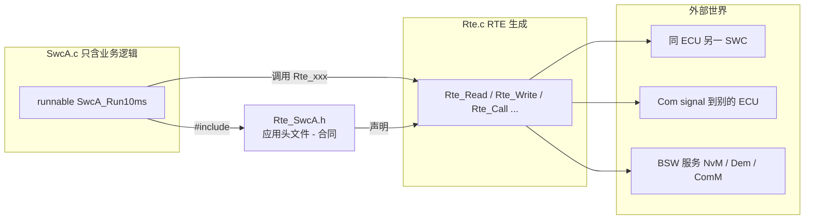
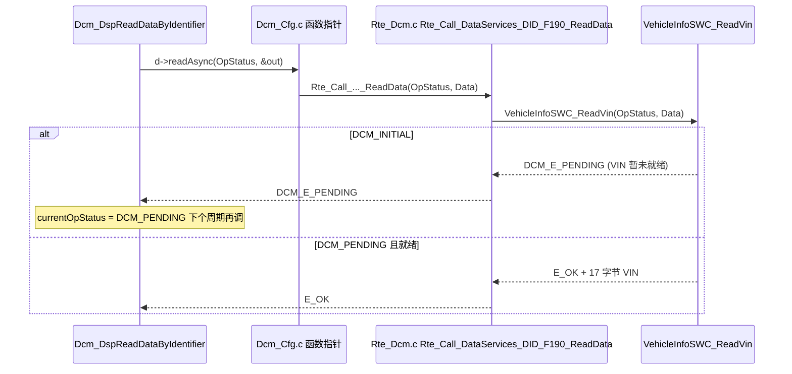
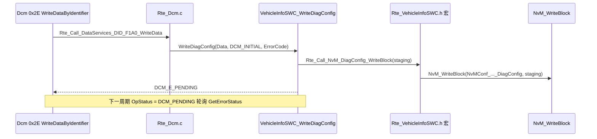

# 08 SWC 与 RTE 交互：你的代码怎么"说话"

> 本章回答：(1) SWC 的 C 代码到底能调用什么、不能调用什么？(2) `Rte_Read / Rte_Write / Rte_Call / Rte_Switch / Rte_Pim …` 各自在什么场景用、返回什么？(3) SWC 如何访问 NvM / Dem / Dcm / ComM 这些 BSW 服务而不直接调用它们的 C API？
> Prerequisite: [07 RTE 与 OS](07-rte-and-os.md)、[07-rte-swc/02 Port 与 Interface](../07-rte-swc/02-port-interface.md)    Next: [09 信号的一生](09-life-of-a-signal.md)
> 对应规范（R25-11）：RTE SWS（Doc ID 84）§5.2–5.7（p.590–591、p.678–686、p.698–768）；ComM SWS p.99、p.152、p.157；EcuM SWS p.161–163；BswM SWS p.45–46；IoHwAb SWS p.27；TPS_SoftwareComponentTemplate（port / interface / RTEEvent 的元模型）
> 深入阅读：[07-rte-swc/06 Client/Server](../07-rte-swc/06-client-server.md)、[07-rte-swc/07 Sender/Receiver](../07-rte-swc/07-sender-receiver.md)、[07-rte-swc/08 DCM 与 RTE 集成](../07-rte-swc/08-dcm-rte-integration.md)、[07-rte-swc/09 诊断 SWC 示例](../07-rte-swc/09-diagnostic-swc-example.md)、[autosar-swc-rte-tutorial.md](../autosar-swc-rte-tutorial.md)
> 对应 demo：`examples/uds_diag_demo/swc/VehicleInfoSWC.c`、`rte/Rte_VehicleInfoSWC.h`、`rte/Rte_Dcm.c`

---

## 1. 本章要回答的问题

| # | 问题 | 小节 |
|---|---|---|
| 1 | SWC 之外的世界通过什么接口暴露给 SWC？ | §2、§3 |
| 2 | `Rte_<Swc>.h` 是什么？为什么 SWC 必须只依赖它？ | §4 |
| 3 | runnable 的函数签名有什么约定？ | §5 |
| 4 | 每一族 RTE API 怎么写、什么语义？ | §6 |
| 5 | 返回码怎么处理？ | §7 |
| 6 | SWC 如何用到 BSW 服务（NvM、Dem、ComM、EcuM、BswM）？ | §8 |
| 7 | demo 里 Dcm ↔ VehicleInfoSWC 是怎么走的（path:line）？ | §9 |

---

## 2. 直觉理解：SWC 只认"合同"

[Conceptual] 把 SWC 想成一家只对外提供"服务窗口"的公司：

- 它有若干**窗口（Port）**，每个窗口只办一种业务（**Interface**）：交数据（Sender/Receiver）、办事（Client/Server）、报状态（Mode）、读参数（Parameter）、存档（NvData）。
- 它只依赖一份"**合同**"——RTE 生成的 `Rte_<Swc>.h`。合同上写明了：你可以办哪几种业务、每种业务窗口叫什么名字、怎么传参。至于对面窗口是同一 ECU 的另一个 SWC、另一个 ECU 的 CAN 信号、还是 BSW 的某个模块，**合同上不写**。
- 因此：同一份 SWC 源码，换一台 ECU（或换一种通信映射）只需要重新生成 RTE，**SWC 不用重编译逻辑**。

这是 AUTOSAR 最核心的承诺：**SWC 与位置无关（location transparency）**。代价是你必须通过 `Rte_*` 做一切对外的事。



---

## 3. 速览：Port 与 Interface 回顾

> 完整讲解见 [07-rte-swc/02 Port 与 Interface](../07-rte-swc/02-port-interface.md)，这里只列"每种 interface 对应哪些 API"。

| Interface 类型 | 通信模型 | Port 方向 | SWC 侧的主要 API |
|---|---|---|---|
| SenderReceiverInterface（data 语义） | 最新值覆盖 | P-Port 发 / R-Port 收 | `Rte_Write` / `Rte_Read`（显式）；`Rte_IWrite` / `Rte_IRead`（隐式） |
| SenderReceiverInterface（event 语义，`queued`） | FIFO 队列 | 同上 | `Rte_Send` / `Rte_Receive` |
| ClientServerInterface | 调用-返回 | P-Port = server，R-Port = client | `Rte_Call`（client）；server 端只是 runnable，由 `OperationInvokedEvent` 触发；异步时 `Rte_Result` |
| ModeSwitchInterface | mode 声明组 | P-Port = mode manager，R-Port = mode user | `Rte_Switch`（manager）、`Rte_Mode`（user 读当前 mode） |
| ParameterInterface / 校准 | 只读参数 | R-Port | `Rte_Prm`（port 上的参数）、`Rte_CData`（SWC 自身的校准参数） |
| NvDataInterface | 非易失数据 | | 与 NvM 的数据映射（`Rte_Read`/`Rte_Write` 的 NV 变体，由 NvM 块描述绑定） |
| TriggerInterface | 触发 | | `Rte_Trigger` / `Rte_IsUpdated` 等（p.773 附近） |

SWC 内部的另外几类对象（**不属于 port，但同样通过 RTE API 访问**）：

| 对象 | API | 说明 |
|---|---|---|
| Per-Instance Memory（PIM） | `Rte_Pim_<name>` | 每个 SWC 实例的私有静态状态 |
| Inter-Runnable Variable（IRV） | `Rte_IrvRead/Write`、`Rte_IrvIRead/IWrite` | SWC 内部、runnable 之间共享的变量 |
| ExclusiveArea | `Rte_Enter_<ea>` / `Rte_Exit_<ea>` | 临界区 |

---

## 4. 合同头文件 `Rte_<Swc>.h`

### 4.1 它是什么

- 官方叫 **Application Header File**，由 RTE 生成（Contract phase 就可以生成，不依赖最终的 ECU 映射），内容是该 SWC type 能用的 **RTE API 的声明/宏**、数据类型、runnable 入口原型、端口句柄等。
- SWS 要求：编译期检查保证"使用应用头文件的 component（或 runnable）只能访问被配置给它的生成数据结构与函数；其它访问会产生编译错误"（SWS_Rte_01004、SWS_Rte_02751，RTE R25-11 p.590–591）。**这就是"契约"。**
- **一个源文件里不能同时包含多个应用头文件**（SWS_Rte_01004，p.591）——因为 RTE API 的定义可能在生成阶段按映射被优化成宏，两个 SWC 的定义会冲突。头文件里通常有防重复包含的机制（SWS_Rte_01006）。
- 头文件里的 API 定义可以在 Generation phase 根据"SWC 到 ECU 的映射 + 通信矩阵"被优化（p.591）。

### 4.2 为什么要"只"依赖它

| 如果你在 SWC 里 | 后果 |
|---|---|
| `#include "NvM.h"` 并直接调 `NvM_WriteBlock` | SWC 绑定了具体 BSW 栈，换 ECU/换 NvM 版本要改 SWC；绕过 RTE 的 partition、权限、Exclusive Area 检查 |
| `#include "Com.h"` 调 `Com_SendSignal` | SWC 与"信号是否走 CAN"耦合，本地通信时也要走 Com |
| 调 `ActivateTask`、`SuspendAllInterrupts` | 绕过 RTE 的数据一致性机制（runnable 不允许直接调用 OS 服务，RTE p.139） |
| 直接读写其他 SWC 的全局变量 | 破坏封装，且无法保证跨 partition |

### 4.3 里面大概有什么

[Conceptual] 一个单实例 SWC 的应用头文件（名字格式遵循 SWS，具体宏展开由生成器决定）：

```c
/* [Conceptual] Rte_SwcA.h 的内容示意 */
#ifndef RTE_SWCA_H
#define RTE_SWCA_H
#include "Rte_Type.h"                 /* 本 SWC 用到的 application / implementation 数据类型 */

/* 1. runnable 入口原型（RTE 调用它们）*/
void SwcA_Init(void);
void SwcA_Run10ms(void);
Std_ReturnType SwcA_GetValue(uint16 *value);   /* server runnable */

/* 2. S/R API，名字格式 Rte_<Api>_<port>_<element> */
Std_ReturnType Rte_Read_RpSpeed_Speed(uint16 *data);
Std_ReturnType Rte_Write_PpTemp_Temp(uint16 data);

/* 3. C/S client API，Rte_Call_<port>_<operation> */
Std_ReturnType Rte_Call_RpNvm_WriteBlock(const uint8 *src);

/* 4. 其它：Rte_Pim_xxx / Rte_CData_xxx / Rte_Enter_xxx / Rte_Exit_xxx ... */
#endif
```

SWS 对"API 名字里的 `<p>_<o>`"的定义：`<p>` 是 port 名，`<o>` 是 data element / operation 名（RTE §5.2.6.4 命名规则，p.731 的注）。**API 是按 port 配置生成的**：你在 SWC 描述里没有配置某个 port，就不存在对应的 `Rte_Read_...`。

### 4.4 实例句柄

- 如果 SWC type 允许**多实例化**（multiple instantiation），每个 API 和 runnable 的第一个参数是**实例句柄** `Rte_Instance`（SWS_Rte_91176，p.685）：类型是指向 **Component Data Structure** 的 `const` 指针（SWS_Rte_01148、06810，p.685–686），名字固定为 `Rte_[Byps_]Instance`（SWS_Rte_01150）。
- 单实例 SWC 没有这个参数（见下面 §5）。

---

## 5. runnable 的签名约定

| 类别 | 形态 | 谁调用 |
|---|---|---|
| 普通 runnable（Timing、DataReceived、Init、ModeSwitch 等） | `void <symbol>(void)`，多实例时 `void <symbol>(Rte_Instance self)` | RTE 生成的 task 体 / 直接调用 |
| server runnable（OperationInvokedEvent） | 参数 = C/S operation 的参数（IN/INOUT/OUT），返回 `Std_ReturnType`（或 void）；多实例时第一个参数是 `Rte_Instance` | RTE（direct call 或 task） |
| 带 WaitPoint 的 runnable（category 2） | 同上，但内部有阻塞 API，必须映射 extended task（见 [07 §10](07-rte-and-os.md)） | task |

要点：

1. **runnable 的 C 函数名**来自 SWC 描述里 `RunnableEntity` 的 `symbol` 属性，不是 shortName。SWS 的骨架例子（Listing 5.1，p.591）：`#include <Rte_c1.h>`，然后 `void runnable_entry(Rte_Instance instance) { ... }`，第一个参数是实例句柄（SWS_Rte_01016）。
2. **runnable 没有"调用者"概念**：你不会在 SWC 代码里调用别的 runnable；RTE 调用它们。
3. **server runnable 的签名是接口的一部分**：client 与 server 的 C 原型由 port interface 的 operation 决定。Dcm 的 DataServices 接口是标准例子：`ReadData(OpStatus, Data)`（见 §9）。
4. runnable 要**尽快返回**（category 1 要求有限执行时间）；需要"等"就应拆成多个 runnable 靠事件驱动，或明确使用 category 2（带 WaitPoint）。
5. runnable 里没有 `main()` 式循环；周期靠 TimingEvent，不靠 `while(1)`。

---

## 6. API 族：一族一个小例子

> 签名/存在性 SWS ID 与页码取自 RTE SWS R25-11 §5.6（p.696–787）。**API 是否存在由 SWC 描述中的数据访问点决定**：显式写要有 `dataSendPoint`，隐式写要有 `dataWriteAccess`，等等。下面的 port/element 名字均为示例。

### 6.1 显式 S/R：`Rte_Write` / `Rte_Read`（data 语义）

```c
/* [Educational Implementation] 显式：调用点即发送/读取 */
void SwcA_Run10ms(void)
{
    uint16 speed;
    Std_ReturnType r = Rte_Read_RpSpeed_Speed(&speed);    /* 非阻塞读 */
    if (r == RTE_E_OK) {
        (void)Rte_Write_PpTemp_Temp(compute(speed));       /* 调用点即发送 */
    } else if (r == RTE_E_NEVER_RECEIVED || r == RTE_E_UNCONNECTED) {
        /* 没收到过数据 / 未连接：用默认值 */
    }
}
```

- `Rte_Write_<p>_<o>`：SWS_Rte_01071（p.699），**调用点即发送**；`Rte_Read_<p>_<o>`：SWS_Rte_01091（p.719），**非阻塞**，没有阻塞版本。
- 如果 `returnValueProvision` 配成 `noReturnValueProvided`，则 `Rte_Write` 返回 `void`。
- 数据是按值还是按引用传递由 ImplementationDataType 决定（复合类型传指针）。
- 同 ECU 内可能直接是缓冲区拷贝；跨 ECU 时 RTE 调用 `Com_SendSignal`/`Com_SendSignalGroup`（SWS_Rte_04527，p.326；详见 [09 章](09-life-of-a-signal.md)）。

### 6.2 隐式 S/R：`Rte_IRead` / `Rte_IWrite`

```c
/* [Educational Implementation] 隐式：启动时拿快照，结束时才发送 */
void SwcA_Run10ms(void)
{
    uint16 speed = Rte_IRead_SwcA_Run10ms_RpSpeed_Speed();  /* 读的是启动时的拷贝 */
    Rte_IWrite_SwcA_Run10ms_PpTemp_Temp(compute(speed));    /* runnable 结束后才发送 */
}
```

- `Rte_IRead_<re>_<p>_<o>`：SWS_Rte_03741（p.746）；`Rte_IWrite_<re>_<p>_<o>`：SWS_Rte_03744（p.749）。名字里带 runnable 名 `<re>`，因为隐式访问点是**按 runnable** 配置的。
- 语义（RTE p.292 §4.3.1.5.1）：读——runnable 启动时拷贝，运行期间不变；写——终止后才发，多次写保留最后一次（last-is-best）；不适用于 `queued`。
- 好处：**无需 Exclusive Area 就拿到一致的数据快照**；代价：runnable 必须终止。

### 6.3 队列 S/R：`Rte_Send` / `Rte_Receive`

```c
/* [Educational Implementation] event 语义：每条都不能丢 */
void SwcB_OnMsg(void)
{
    MsgType m;
    while (Rte_Receive_RpMsg_Msg(&m) == RTE_E_OK) {   /* 非阻塞，读到 RTE_E_NO_DATA 为空 */
        handle(&m);
    }
}
```

- `Rte_Send_<p>_<o>`：SWS_Rte_01072（p.703）；`Rte_Receive_<p>_<o>`：SWS_Rte_01092（p.726，非阻塞存在性 01288，**阻塞版 01290 只能用于 category 2**）。
- 队列空时返回 `RTE_E_NO_DATA`；队列溢出丢数据时，接收端会看到 `RTE_E_LOST_DATA`（overlayed error，值 64，p.678）。
- 激活 runnable 的 DataReceivedEvent 重入时，runnable 要自己负责把队列读空（RTE p.165、p.171）。

### 6.4 C/S：`Rte_Call`（同步/异步）与 `Rte_Result`

```c
/* [Educational Implementation] 同步 C/S client */
Std_ReturnType r = Rte_Call_RpNvm_WriteBlock(srcPtr);   /* 同步：返回时已有结果（或超时）*/
if (r != RTE_E_OK) { /* 应用错误或 RTE_E_TIMEOUT / RTE_E_LIMIT ... */ }

/* [Educational Implementation] 异步 C/S client：发出请求，稍后取结果 */
(void)Rte_Call_RpNvm_ReadBlock(dstPtr);                 /* 立即返回，不等 server */
/* ... 之后，可能在 AsynchronousServerCallReturnsEvent 触发的 runnable 里 ... */
Std_ReturnType r2 = Rte_Result_RpNvm_ReadBlock();       /* 非阻塞版：未到返回 RTE_E_NO_DATA，超时后 RTE_E_TIMEOUT */
```

- `Rte_Call_<p>_<o>`：SWS_Rte_01102（p.731）；同步存在性 SWS_Rte_01293，异步 SWS_Rte_01294（p.732）；**同一 operation 同时有同步与异步调用点是非法配置**（SWS_Rte_03014）。
- `Rte_Result_<p>_<o>`：SWS_Rte_01111（p.737–742）。多个故障同时发生时的优先级见 SWS_Rte_08595（p.742）；`RTE_E_NO_DATA`/`RTE_E_TIMEOUT`/`RTE_E_UNCONNECTED` 不算"错误"。
- `Rte_Call` 只能由包含对应 ServerCallPoint 的 runnable 使用（SWS_Rte_CONSTR_09024，p.732）。
- **server 那一侧**没有 API：你实现一个签名与 operation 匹配的 runnable，RTE 在 `OperationInvokedEvent` 到来时调它。
- 执行上下文（direct call / 另一个 task）见 [07 §7](07-rte-and-os.md)。

### 6.5 Mode：`Rte_Switch` / `Rte_Mode`

```c
/* [Educational Implementation] mode user：读当前 mode */
if (Rte_Mode_RpSession_DiagSession() == RTE_MODE_DiagSession_EXTENDED) { ... }

/* [Educational Implementation] mode manager：请求切换 */
(void)Rte_Switch_PpAppMode_AppMode(RTE_MODE_AppMode_RUN);
```

- `Rte_Switch_<p>_<o>`：SWS_Rte_02631（p.707）；mode manager 调用，**异步通知**，mode queue 满时丢弃并返回错误（SWS_Rte_02720/02675，p.323），确认用 `Rte_SwitchAck` + `ModeSwitchedAckEvent`。
- `Rte_Mode_<p>_<o>`：SWS_Rte_02628（p.768）；读已激活 mode。
- mode 变化通常用 `SwcModeSwitchEvent`（onEntry/onExit/onTransition）触发 runnable。典型的 mode manager 是 BswM/EcuM/Dcm（见 §8）。

### 6.6 PIM / 校准参数：`Rte_Pim` / `Rte_CData` / `Rte_Prm`

```c
/* [Educational Implementation] 每实例私有状态与参数 */
typedef struct { uint16 filtered; uint8 count; } SwcA_State;

void SwcA_Run10ms(void)
{
    SwcA_State *st = Rte_Pim_State();        /* per-instance memory，实例间不共享 */
    uint16 gain = Rte_CData_Gain();          /* 校准参数（SwcInternalBehavior 里的 ParameterDataPrototype）*/
    uint16 limit = Rte_Prm_RpCfg_Limit();    /* 某个 port 上的参数 */
    st->filtered = filter(st->filtered, gain, limit);
}
```

- `Rte_Pim_<name>`：SWS_Rte_01118，存在性 SWS_Rte_01299（p.743）。
- `Rte_CData_<name>`：SWS_Rte_01252，存在性 SWS_Rte_01300（p.743–744）。
- `Rte_Prm_<p>_<o>`：SWS_Rte_03928（p.745）；原始类型返回值，复合类型返回 `const` 指针（SWS_Rte_03930）。
- 用 `Rte_Pim` 而不是 SWC 里的 `static` 变量，是为了**多实例**时每个实例有自己的一份，并让集成者能把它放进指定的内存分区/NvM 块。

### 6.7 Exclusive Area：`Rte_Enter` / `Rte_Exit`

```c
void SwcA_Run10ms(void)
{
    Rte_Enter_EA_Counter();      /* 进入临界区：机制由 RteExclusiveAreaImplementation 配置决定 */
    shared_cnt++;
    Rte_Exit_EA_Counter();       /* 离开 */
}
```

- `Rte_Enter_<ea>`：SWS_Rte_01120（p.766）；`Rte_Exit_<ea>`：SWS_Rte_01123（p.767）。
- 可以用 SWC 描述里的 `runsInside` 让整个 runnable 受保护，也可以在代码里手工括起一段（RTE p.201）。
- 机制（OS resource / 中断阻塞 / spinlock …）是**配置**，SWC 代码不变（见 [07 §9](07-rte-and-os.md)）。

### 6.8 IRV：`Rte_IrvRead` / `Rte_IrvWrite`

- 用于**同一个 SWC 内部、runnable 之间**传值（比如 `RunA` 算好，`RunB` 用）。
- 显式 `Rte_IrvRead/Write_<re>_<irv>` 与隐式 `Rte_IrvIRead/IWrite_<re>_<irv>` 并存；语义与 S/R 的显式/隐式对应；SWS_Rte_03560 / 01305（p.758–763）。
- 好处：RTE 能依据映射决定它是否需要缓冲；比 SWC 里的全局变量更安全。

### 6.9 汇总

| API | 语义 | 阻塞? | 常见返回码 |
|---|---|---|---|
| `Rte_Write` / `Rte_Read` | 显式 data | 否 | `RTE_E_OK`，`RTE_E_INVALID`，`RTE_E_NEVER_RECEIVED`，`RTE_E_UNCONNECTED`，`RTE_E_COM_STOPPED`，`RTE_E_MAX_AGE_EXCEEDED`(overlay) |
| `Rte_IWrite` / `Rte_IRead` | 隐式 data | 否 | 通常无返回码（`Rte_IStatus` 查状态） |
| `Rte_Send` / `Rte_Receive` | 显式 queued | `Receive` 有阻塞版（cat 2） | `RTE_E_NO_DATA`，`RTE_E_LOST_DATA`(overlay)，`RTE_E_LIMIT` |
| `Rte_Call` | C/S | 同步版阻塞；异步版不阻塞 | `RTE_E_OK`，应用错误，`RTE_E_TIMEOUT`，`RTE_E_LIMIT`，`RTE_E_UNCONNECTED` |
| `Rte_Result` | 异步 C/S 取结果 | 阻塞/非阻塞两种 | `RTE_E_NO_DATA`，`RTE_E_TIMEOUT` |
| `Rte_Switch` / `Rte_Mode` | mode | 否 | `RTE_E_OK`，`RTE_E_LIMIT`（queue 满） |
| `Rte_Pim` / `Rte_CData` / `Rte_Prm` | 内存/参数 | 否 | 直接返回值/指针 |
| `Rte_Enter` / `Rte_Exit` | 临界区 | 取决于机制 | 通常 `void` |

---

## 7. 返回码

[AUTOSAR Standard] RTE 的错误/状态值（SWS_Rte_07712，RTE R25-11 p.678）：

| 符号 | 值 | 分类 | 常见场景 |
|---|---|---|---|
| `RTE_E_OK` | 0 | — | 成功 |
| `RTE_E_INVALID` | 1 | 标准应用错误 | AUTOSAR 服务返回的通用应用错误；`Rte_Read`/`Rte_IStatus` 在首次接收前返回（p.312） |
| `RTE_E_COM_STOPPED` | 128 | immediate infra | Com I-PDU group 已停 |
| `RTE_E_TIMEOUT` | 129 | immediate infra | C/S 超时；异步未返回 |
| `RTE_E_LIMIT` | 130 | immediate infra | 队列已满 |
| `RTE_E_NO_DATA` | 131 | immediate infra | 队列空/无新数据 |
| `RTE_E_TRANSMIT_ACK` | 132 | immediate infra | 发送确认 |
| `RTE_E_NEVER_RECEIVED` | 133 | immediate infra | 从未收到过数据 |
| `RTE_E_UNCONNECTED` | 134 | immediate infra | port 未连接 |
| `RTE_E_IN_EXCLUSIVE_AREA` | 135 | immediate infra | 在 Exclusive Area 内调用了不允许的 API |
| `RTE_E_SEG_FAULT` | 136 | immediate infra | 非法访问 |
| `RTE_E_COM_BUSY` | 141 | immediate infra | Com 忙 |
| `RTE_E_LOST_DATA` | 64 | **overlayed** | 队列溢出丢数据（可与其它码叠加） |
| `RTE_E_MAX_AGE_EXCEEDED` | 64 | **overlayed** | 数据超过 aliveTimeout |

规则：

- `Std_ReturnType` 的底层是 `uint8`（p.678）。**应用错误**（C/S 接口里定义的）编码在低 6 位，immediate infra 错误用高位标志，**immediate infra 错误会覆盖应用错误**（SWS_Rte_02593）；可以用 `Rte_ApplicationError(status)`（`status & 63U`，SWS_Rte_07406，p.676）取出纯应用错误。
- **overlayed errors** 是附在"当前有效数据"之上的标志，可与任何其它码组合，所以应该用位运算判断，不要 `==`。
- `RTE_E_NO_DATA`/`RTE_E_TIMEOUT`/`RTE_E_UNCONNECTED` 对 `Rte_Result` 来说不是"错误"而是正常工作的结果（p.742）。
- 并不是每个 API 都有返回码：`Rte_Write` 在 `noReturnValueProvided` 时返回 `void`；隐式 API 通常直接返回数据。
- 注意 **Dcm 自己的 `DCM_E_PENDING`（demo 中定义为 10，见 `rte/Rte_Dcm_Type.h:27`，是 Dcm 对 `Std_ReturnType` 的扩展）与 RTE 的 `RTE_E_*` 是两套码**：DataServices 接口里的 server runnable 返回的是 Dcm 约定的码（见 §9）。

---

## 8. SWC 与 BSW：永远经过 RTE

### 8.1 规则

- SWC **不直接调用 BSW 的 C API**。凡是需要 BSW 服务，BSW 模块以 **Service Component**（或 ECU Abstraction / CDD）的形式在 ARXML 里暴露 **Port + Interface**，SWC 通过连接这些 port 并调用 `Rte_Call_<p>_<o>` 来使用。（IoHwAb SWS 也明说其回调要与 `Rte_Call_<p>_<o>` 兼容，SWS_IoHwAb_00143，IoHwAb p.27。）
- 这样 BSW 模块实现是否在同 core、同 partition，都对 SWC 透明；RTE 负责生成跨 partition 的适配。

### 8.2 常见服务端口

| BSW 模块 | SWC 看到的东西 | 备注 |
|---|---|---|
| **NvM** | R25-11 NvM SWS §8.7 定义了 `NvMService` C/S 接口（SWS_NvM_00734，NvM p.136），operation 有 `ReadBlock`、`WriteBlock`、`GetErrorStatus`、`EraseBlock`、`InvalidateNvBlock`、`RestoreBlockDefaults`、`SetRamBlockStatus`、`Get/SetDataIndex`、`Read/WritePRAMBlock`、`RestorePRAMBlockDefaults`；每个块一个 provided port `PS_{Block}`（SWS_NvM_00847，p.146）。另有 `NvMAdmin`（含 `SetBlockProtection`，p.133）、`NvMMirror`、`NvMNotifyInitBlock`、`NvMNotifyJobFinished` 等接口（p.133–135） | 块是否生成 port 由 `NvMBlockUsePort` 决定；`NvM_ReadAll/WriteAll` 不在这些 SWC 接口里，由 BswM/EcuM 集成代码调（见 [04 §4.5](04-ecu-startup-ecum.md)） |
| **Dem** | R25-11 Dem SWS §8.6 定义了 `DiagnosticMonitor` C/S 接口（SWS_Dem_00598，Dem p.360），operation 有 `SetEventStatus`、`ResetEventStatus`、`ResetEventDebounceStatus`、`PrestoreFreezeFrame`、`ClearPrestoredFreezeFrame`、`SetEventDisabled`、`ResetMonitorStatus`；每个事件一个 provided port `Event_{Name}`（SWS_Dem_01037，p.385）。读取侧有 `DiagnosticInfo`（SWS_Dem_00599，p.357，如 `GetEventUdsStatus`、`GetFaultDetectionCounter`）、`ClearDTC`（SWS_Dem_00666，p.353）等 | 这是 SWC 经 RTE 报告故障的标准方式；BSW 模块则直接调 C API `Dem_SetEventStatus`（Dem p.273） |
| **Dcm** | 作为 service component 对 SWC 暴露 `DataServices_<Data>`、`RoutineServices_<Routine>`、`SecurityAccess_<Level>` 等 C/S 接口——**在这里 Dcm 是 client，SWC 是 server** | 见 §9；Dcm 的 mode 通过 mode port 暴露（`DcmDiagnosticSessionControl` 等） |
| **ComM** | `ComM_UserRequest` C/S 接口（`RequestComMode`、`GetMaxComMode`、`GetCurrentComMode` 等，8.7.2.4，ComM R25-11 p.152）+ `ComM_CurrentMode` ModeSwitchInterface（8.7.3.1，p.157） | ComM SWS p.99 有示例：`e = Rte_Call_comRequest_RequestComMode(COMM_FULL_COMMUNICATION);` |
| **EcuM** | `EcuM_StateRequest`（SWS_EcuM_04131，EcuM R25-11 p.161）：SWC 请求/释放 RUN、POST_RUN；`EcuM_Mode` mode group 经 `Rte_Switch_currentMode_currentMode` 通知 mode user（SWS_EcuM_04133，p.162；`EcuM_Mode` = STARTUP/RUN/POST_RUN/SLEEP/SHUTDOWN，SWS_EcuM_04132，p.162） | EcuM 的 SWC 接口只涉及 RUN/POST_RUN 请求，SLEEP 由 BswM 设（EcuM p.100） |
| **BswM** | 作为 service component：SWC 用 `Rte_Write/Send` 向 BswM 的 **mode request port** 发请求；BswM 用 `Rte_Switch` 通知 mode user，SWC 用 `Rte_Mode` 读 | BswM R25-11 p.45–46；规则里按 Immediate/Deferred 处理（p.28–29） |
| **IoHwAb** | 一组"ECU signal"接口，通常是 C/S（读电压/数字量）+ 回调触发 RTE event | IoHwAb SWS 明说其接口依赖信号链，**不是标准化的 AUTOSAR 接口**（p.21）；p.55 的序列图里 `IoHwAb_GetVoltage` 等是**示例，不是规范接口** |

### 8.3 示例：SWC 请求通信

[Educational Implementation]

```c
/* SwcComUser.c - 只包含自己的合同头文件 */
#include "Rte_SwcComUser.h"

void SwcComUser_OnNetworkWanted(void)
{
    Std_ReturnType e = Rte_Call_comRequest_RequestComMode(COMM_FULL_COMMUNICATION);
    if (e != RTE_E_OK) {
        /* RTE_E_TIMEOUT / 应用错误 ... */
    }
}
```

这与 ComM SWS p.99 的示例相同。调用最终由 RTE 转成 `ComM_UserRequest` 的实现（server 端），这个调用是否 direct call、是否跨 partition，都由集成配置决定（见 [07 §7](07-rte-and-os.md)）。

### 8.4 BSW 对 SWC 的"回调"

BSW 也要触发 SWC（例如 IoHwAb 的 ADC 通知 → SWC 的 DataReceived/OperationInvoked 事件）。方向反过来：BSW 调用 `Rte_Call_<p>_<o>`/`Rte_Write` 之类的 RTE 生成函数（IoHwAb 回调在中断上下文执行，SWS_IoHwAb_00032/00033，IoHwAb p.27，要考虑 ISR 约束），RTE 再激活 SWC runnable。

---

## 9. 走读 demo：`VehicleInfoSWC` ↔ `Rte_Dcm`

demo 里 Dcm 是 BSW（service component 角色），VehicleInfoSWC 是应用 SWC，通过 Dcm 标准定义的 `DataServices_<DID>` C/S 接口交互。**注意方向**：Dcm 是 client，SWC 是 server。

### 9.1 谁在哪里

| 步骤 | 位置 | 说明 |
|---|---|---|
| ① SWC 的合同头 | `rte/Rte_VehicleInfoSWC.h:1-19` | 注释说明：这是"as if generated"的应用头；SWC **只** include 自己的 `Rte_<Swc>.h`，不 include `Dcm.h`/`NvM.h`，这样才可移植（`:9-10`） |
| ② runnable 原型 | `Rte_VehicleInfoSWC.h:25-36` | `VehicleInfoSWC_Init`（init runnable）、`VehicleInfoSWC_Run10ms`（TimingEvent 10 ms）、`ReadVin` 等 server runnable，签名由 port interface 决定 |
| ③ SWC 对外的 RTE API（SWC 作为 client 调 NvM） | `Rte_VehicleInfoSWC.h:42-47` | `Rte_Call_NvM_DiagConfig_WriteBlock/ReadBlock/GetErrorStatus`——这里 demo 把它做成直接映射到 `NvM_*` 的宏；注释说明"同 partition 时真实 RTE 也可能这样生成"（`:39-41`） |
| ④ mode port | `Rte_VehicleInfoSWC.h:49-51`；实现 `rte/Rte_Dcm.c:141-144`；使用 `swc/VehicleInfoSWC.c:154-155` | `Rte_Mode_DcmDiagnosticSessionControl_DcmDiagnosticSessionControl()`：mode user 读当前 session |
| ⑤ Dcm 配置绑定 | `diag/Dcm_Cfg.c:34-38`（F190：`Rte_Call_DataServices_DID_F190_ReadData`） | `DcmDspData` 的 ReadData 函数指针指向 RTE 的 `Rte_Call_*`，不是指向 SWC |
| ⑥ Dcm 调用 RTE | `diag/Dcm_Dsp.c:343-351` | 同步 DID 调 `d->readSync(&out[2])`，异步 DID 调 `d->readAsync(OpStatus, &out[2])`；返回 `DCM_E_PENDING` 就把 `currentOpStatus` 置为 `DCM_PENDING`，下一个周期再调 |
| ⑦ RTE 的 client 调用实现 | `rte/Rte_Dcm.c:54-62` | `Rte_Call_DataServices_DID_F190_ReadData` 里直接调 `VehicleInfoSWC_ReadVin(OpStatus, Data)`；注释 `:8-14` 解释：同 partition 就是 direct call；跨 partition/core 则用 IOC/激活 task，调用就无法同步完成，这是 `DCM_E_PENDING`+`OpStatus` 存在的原因 |
| ⑧ server runnable | `swc/VehicleInfoSWC.c:77-96` | `VehicleInfoSWC_ReadVin`：`DCM_INITIAL` 设置还要 pending 几次；`DCM_CANCEL` 清理返回 `E_OK`；数据未就绪返回 `DCM_E_PENDING`；就绪后 `memcpy` 并返回 `E_OK` |
| ⑨ 同步 server | `swc/VehicleInfoSWC.c:98-103`（`ReadSwVersion`）、`Rte_Dcm.c:64-68` | 无 `OpStatus`，同步返回 |
| ⑩ 写 DID 异步 + SWC 反向调 NvM | `swc/VehicleInfoSWC.c:114-142` | `DCM_INITIAL`：`Rte_Call_NvM_DiagConfig_WriteBlock(...)` 后返回 `DCM_E_PENDING`；`DCM_PENDING`：`Rte_Call_NvM_DiagConfig_GetErrorStatus(&res)` 轮询 |
| ⑪ mode switch（Dcm → RTE → 用户） | `diag/Dcm_Dsl.c:121` → `Rte_Dcm.c:134-139` | `SchM_Switch_Dcm_DcmDiagnosticSessionControl(mode)` 更新 RTE 的 mode，并（真实系统）通知 BswM/SWC 等 mode user |
| ⑫ InitEvent | `swc/VehicleInfoSWC.c:54-60`；调用 `rte/Rte_Dcm.c:38-44` | `Rte_Start` 里调用 `VehicleInfoSWC_Init`（InitEvent 激活的 runnable） |
| ⑬ 周期 runnable | `swc/VehicleInfoSWC.c:62-72`；调用 `rte/Rte_Dcm.c:46-50`，`integration/BswScheduler.c:51` | TimingEvent 10 ms：self-test 推进 |

### 9.2 调用序列



### 9.3 SWC 反向使用 BSW 服务（NvM）



### 9.4 demo 与真实 RTE 的差距

| demo | 真实 |
|---|---|
| `Rte_Call_NvM_DiagConfig_*` 是宏，直接展开成 `NvM_*` | 生成函数（SWS_Rte_03837），带 Exclusive Area、权限检查、partition 适配；SWC 侧代码不变 |
| `Rte_Dcm.c` 手写 `Rte_Call_*` 直调 SWC | 生成；可能是 direct call 也可能是 task 激活 + 队列 |
| 没有 `Rte_Instance` | 多实例 SWC 会多一个实例句柄参数（§4.4） |
| 没有 RTE 返回码 `RTE_E_*` | 真实 `Rte_Call` 会返回 `RTE_E_*` 或应用错误；Dcm 的 `DCM_E_PENDING` 是 server 的应用级约定 |
| `UDS_TRACE` 宏在 SWC 里 | 教学 harness，生产 SWC 不应包含（`VehicleInfoSWC.c:19-20` 注释已声明） |

---

## 10. 常见误解

| 误解 | 事实 |
|---|---|
| "SWC 可以直接调 `NvM_WriteBlock` / `Com_SendSignal`" | 不行（至少违背 AUTOSAR 的分层与可移植性）；应通过 service port + `Rte_Call`。demo 里的宏是"as if generated" |
| "`Rte_Read` 会阻塞等数据" | 不会；`Rte_Read` 没有阻塞版本。阻塞要用 `Rte_Receive` 阻塞版（category 2、extended task） |
| "`Rte_Write` 马上就把值发到 CAN 上了" | 只是把值交给 RTE/Com；真正发出由 Com 的发送模式与 MainFunction 决定，见 [09 章](09-life-of-a-signal.md) |
| "`Rte_IWrite` 写了就能被别人读到" | 要等 runnable 终止之后才发送 |
| "`Rte_Call` 总是同步返回结果" | 有同步、异步两种；且同步调用可能超时返回 `RTE_E_TIMEOUT` |
| "返回 `RTE_E_OK` 就一切正常" | 还要看 overlayed error（`RTE_E_MAX_AGE_EXCEEDED`、`RTE_E_LOST_DATA`） |
| "SWC 里的 `static` 变量和 `Rte_Pim` 一样" | 多实例时 `static` 会被所有实例共享；`Rte_Pim` 是 per-instance，还能让集成者决定内存位置 |
| "一个 .c 文件可以 include 多个 `Rte_<Swc>.h`" | SWS_Rte_01004 明确禁止 |
| "server runnable 是被 client 直接调用的函数" | 看起来是，但它是被 RTE 在 `OperationInvokedEvent` 下调用的；可能 direct call，也可能在另一个 task |
| "DCM_E_PENDING 是 RTE 错误码" | 是 Dcm 与 server 之间的约定（DataServices 接口的返回值），不是 `RTE_E_*` |

---

## 11. 真实项目里你会看到什么

[Real Project Consideration]

1. **生成的头文件**：每个 SWC type 一个 `Rte_<SwcType>.h`，里面能看到所有你能用的 `Rte_Read_…`、`Rte_Call_…`。**这是你写 SWC 的"API 手册"**——想知道某个 SWC 能干什么，看它的头文件。
2. **找不到某个 API**：先查 SWC 描述（ARXML）里有没有对应的 port、数据访问点（`dataSendPoint`、`dataWriteAccess`…）、`ServerCallPoint`。API 是从这些配置里生成的，没配就没有。
3. **API 名里的 `<p>_<o>`**：port 名 + element 名，改了 ARXML 的名字，所有调用点都要改（编译会报错，这是好事）。
4. **宏还是函数**：生成的 `Rte_Read_…` 在同 partition 内可能是宏直接访问缓冲区，也可能是 `Rte.c` 里的函数；调试时进入函数看 RTE 做了什么（如 `Com_SendSignal`、`ActivateTask`、Exclusive Area）。
5. **Service port 的实现位置**：`Rte_Call_<p>_<o>` 展开后最终落在 BSW 模块的 server 函数（如 `NvM_*`）；用调用栈确认是 direct call 还是 task 激活。
6. **SWC 代码里出现 `#include "Com.h"`/`Dem.h` 的情况**：可能是历史遗留或该 SWC 其实是 CDD；评审时要特别关注。
7. **多实例**：看到 `Rte_Instance self` 或 `Rte_Pim_xxx(self)`，说明 SWC 被多实例化。
8. **版本差异**：Rte API 的名字格式（`Rte_[Byps_]Read_...`、可选 `Rte_Instance` 参数）在不同 AUTOSAR release 之间有细节差别，以所用 release 的 RTE SWS 与生成头文件为准。

---

## 12. 一句话记住

1. **SWC 只依赖 `Rte_<Swc>.h`，只调 `Rte_*`；这是位置无关性的代价，也是它的价值。**
2. **API 由 SWC 描述中的 port 与数据访问点生成**：没配置就没有。
3. **显式 = 调用点生效；隐式 = 启动取快照、结束才发送；队列 = 不丢但要处理 `RTE_E_NO_DATA`；C/S 有同步异步；Mode 用 `Rte_Switch`/`Rte_Mode`。**
4. **返回码要分三类**：`RTE_E_OK`、应用错误（低 6 位）、infra 错误（高位）+ overlayed 标志。
5. **BSW 服务（NvM、Dem、ComM、EcuM、BswM、Dcm）一律通过 service port + `Rte_Call`/`Rte_Switch` 使用。**
6. **demo 路径**：`Dcm_Dsp.c:343` → `Rte_Dcm.c:54` → `VehicleInfoSWC.c:77`——Dcm 是 client，SWC 是 server。

---

## 13. 自测题

1. 为什么一个 .c 文件不能同时 include 两个 SWC 的 `Rte_*.h`？
2. 隐式读/写与显式读/写的区别是什么？在哪些场景下一定要用显式 API？
3. `Rte_Receive` 返回 `RTE_E_NO_DATA` 和 `Rte_Read` 返回 `RTE_E_NEVER_RECEIVED` 各自表示什么？
4. 解释 `RTE_E_LOST_DATA` 为什么是 overlayed error，调用方应该如何判断？
5. `VehicleInfoSWC_ReadVin` 的 `OpStatus` 为 `DCM_CANCEL` 时应该做什么？这个值从哪里来？
6. 为什么 demo 的 `Rte_Call_NvM_DiagConfig_WriteBlock` 能写成宏？在什么条件下真实 RTE 不能这样做？
7. 为什么说 Dcm 是 "service component"？在 `DataServices_DID_F190` 接口里谁是 client、谁是 server？
8. SWC 想请求 ECU 保持运行（RUN），要用哪个 port/interface？它最终由谁仲裁？（提示：EcuM `EcuM_StateRequest`。）
9. `Rte_Pim` 与 SWC 内部的 `static` 变量有什么区别？

---

## 14. 下一章

下一章 [09 信号的一生](09-life-of-a-signal.md) 把本章的 `Rte_Write/Rte_Read` 与上一章的 task/ISR 放在一起，沿着一个传感器信号从 ADC 一路追到 CAN 总线，再沿着一帧 CAN 报文追回另一个 SWC 的 `Rte_Read`。
