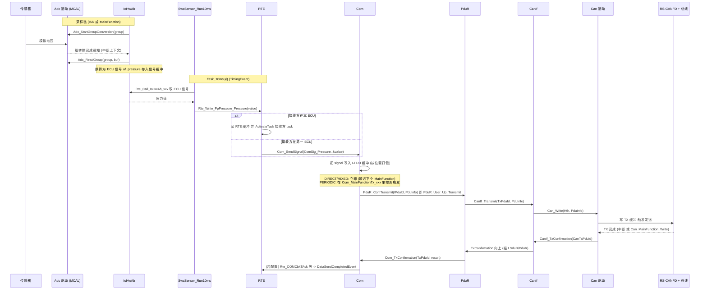
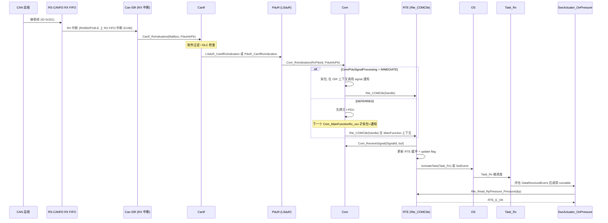
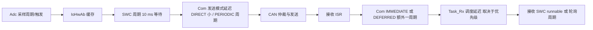
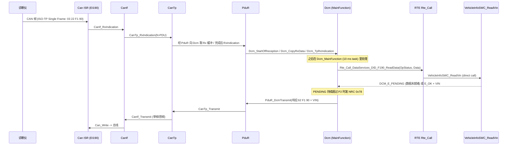

# 09 信号的一生：从 ADC 到 CAN 总线，再回到另一个 SWC

> 本章回答：(1) 一个传感器值从芯片引脚到总线上的 CAN 帧，经过哪些模块、每一跳用什么 API、在什么上下文（ISR / task / MainFunction）、谁配置？(2) 反方向，一帧 CAN 报文如何变成另一个 SWC 里 `Rte_Read` 读到的数据？(3) 一条 UDS 请求 `22 F1 90` 的路径与"普通信号"有什么不同？
> Prerequisite: [07 RTE 与 OS](07-rte-and-os.md)、[08 SWC 与 RTE 交互](08-swc-rte-interaction.md)、[05 MCAL 的角色与架构](05-mcal-role-and-architecture.md)    Next: [10 工作流实践与 FAQ](10-workflow-practice-and-faq.md)
> 对应规范（R25-11）：ADC Driver SWS p.56–69；I/O Hardware Abstraction SWS p.27、p.55；RTE SWS p.138、p.323–337、p.813；COM SWS p.54、p.105–133；PduR SWS p.16、p.86–90；CanIf SWS p.41–49、p.85、p.114–115；CAN Driver SWS p.40–42、p.74–79
> 深入阅读：[05-can-stack/06 完整 RX 路径](../05-can-stack/06-can-rx-path.md)、[05-can-stack/07 完整 TX 路径](../05-can-stack/07-can-tx-path.md)、[06-dcm/11 Dcm 运行流](../06-dcm/11-dcm-runtime-flow.md)、[04-can-mcal/](../04-can-mcal/)、[02-autosar-classic/07 MainFunction 调度](../02-autosar-classic/07-mainfunction-scheduling.md)
> 对应 demo：`examples/uds_diag_demo/`（**注意：demo 没有 Com 模块**，信号路径只做规范对照，诊断路径 §6 可以实际跑）

---

## 0. 先看全景

```mermaid
flowchart LR
    subgraph ECU_A["ECU A（发送方）"]
        direction TB
        ADC["Adc MCAL"] --> IOH["IoHwAb"] --> SWCA["传感器 SWC runnable<br/>Task_10ms"]
        SWCA --> RTEA["RTE: Rte_Write"] --> COMA["Com: Com_SendSignal<br/>打包 I-PDU"]
        COMA --> PDRA["PduR"] --> CIFA["CanIf_Transmit"] --> CANA["Can_Write"] --> HWA["RS-CANFD"]
    end
    BUS[("CAN 总线")]
    subgraph ECU_B["ECU B（接收方）"]
        direction TB
        HWB["RS-CANFD"] --> ISRB["Can ISR"] --> CIFB["CanIf_RxIndication"] --> PDRB["PduR"] --> COMB["Com_RxIndication<br/>拆包"]
        COMB --> RTEB["RTE: Rte_COMCbk"] --> TSKB["Task: DataReceivedEvent"] --> SWCB["接收 SWC<br/>Rte_Read"]
    end
    HWA --> BUS --> HWB
```



[Conceptual] 两个角度看同一张图：

- **数据角度**：物理量 → ADC 码值 → ECU 信号（IoHwAb）→ SWC 变量 → RTE 数据元素 → Com signal → I-PDU（打包）→ L-PDU（CAN 帧）→ 比特流。
- **控制角度（谁驱动谁）**：Adc 完成中断/轮询 → 触发 SWC 的 Timing/DataReceived 事件 → task → `Rte_Write` → Com 的 `MainFunctionTx` 或立即发送 → Can 的 TX 完成中断/`Can_MainFunction_Write` 回调。

整条链上有 **四类"驱动源"**：ISR（硬件中断）、OS task（RTE 生成的 task 体）、BSW MainFunction（SchM 调度，可能在 task 里）、调用链（直接函数调用，继承上层的上下文）。本章对每一跳标注它属于哪一类。

### 本章统一的示例信号

| 项目 | 取值（示意） |
|---|---|
| 物理量 | 传感器电压 0–5 V，ADC 采样 |
| ECU 信号 | `af_pressure`（IoHwAb SWS p.55 的示例信号名） |
| SWC | 发送方：`SwcSensor`，runnable `SwcSensor_Run10ms`（TimingEvent 10 ms）；接收方：`SwcActuator`，runnable `SwcActuator_OnPressure`（DataReceivedEvent） |
| 信号 | System Signal `Pressure`，16 bit，ComSignal `ComSig_Pressure` |
| 报文 | CAN ID `0x321`，DLC 8，周期 10 ms，ComIPdu `IPdu_Status` |

以上均为示意名；实际名称取决于你的 ARXML。

---

## 1. 谁配置了什么（总览表）

[AUTOSAR Standard] + [Real Project Consideration]：一条信号链上的"配置责任"（角色名按 TR_Methodology 的"角色"；具体由哪家公司的谁完成属于 `[Industry Practice]`，见 [02 谁做什么](02-who-builds-what.md)）。

| 配置对象 | 在哪里 | 谁（角色） | 决定了什么 |
|---|---|---|---|
| ADC group / channel / 触发源 | Adc ECUC（MCAL） | ECU Integrator（METH p.184：配置 MCAL 是集成者任务） | 采样通道、触发方式、通知回调 |
| ECU signal 与 IoHwAb 接口 | IoHwAb 配置/ECU 抽象 SWC 描述 | ECU Integrator / 抽象 SWC 设计者 | SWC 看到的"信号质量" |
| SWC 的 port、runnable、TimingEvent | SWC 描述（ARXML） | SWC Designer/Developer | 发什么数据、多久跑一次（语义） |
| 事件→task 映射、position、offset | Rte ECUC：`RteEventToTaskMapping` | ECU Integrator | runnable 在哪个 task（见 [07 章](07-rte-and-os.md)） |
| 数据元素 ↔ 信号映射（DataMapping） | System/ECU Extract | System Engineer | `Rte_Write` 对应哪个 Com signal |
| signal → I-PDU 的位置、字节序、发送模式 | Com ECUC：`ComSignal`、`ComIPdu`、`ComTxMode*` | 通信矩阵 → ECU Integrator | 打包、DIRECT/PERIODIC/MIXED、周期 |
| I-PDU → 下层 PDU 的路由 | PduR ECUC：`PduRRoutingPath` | ECU Integrator | 去向（CanIf / CanTp / …） |
| L-PDU ↔ HTH/HRH、CAN ID、DLC | CanIf ECUC、Can ECUC | ECU Integrator | 哪个邮箱发、过滤规则 |
| MainFunction 与任务映射 | Rte ECUC：`RteBswEventToTaskMapping` | ECU Integrator | `Com_MainFunctionTx_<sn>` 在哪个 task |

---

## 2. (A) TX 路径：传感器 → CAN 总线

### 2.1 序列图



### 2.2 逐跳表

| 跳 | 层 | API（R25-11） | 上下文 | 谁配置 / 备注 | 依据 |
|---|---|---|---|---|---|
| 1 | Adc（MCAL） | `Adc_StartGroupConversion(Group)`；完成后通知回调；读结果 `Adc_ReadGroup(Group, DataBufferPtr)`；状态 `Adc_GetGroupStatus` | 触发由 IoHwAb 或硬件触发；完成通知在**中断上下文**（MCAL 通知回调） | Adc ECUC（集成者）；回调必须与 MCAL 原型一致 | SWS_Adc_00367 p.56；SWS_Adc_00369 p.61；SWS_Adc_00374 p.69 |
| 2 | IoHwAb | 回调（`IoHwAb_Adc_Notification_<Group>` 一类，名称**实现相关**）；`IoHwAb_GetVoltage` 等是**示例而非规范接口** | 回调在**中断上下文**；IoHwAb 可定义 BswInterruptEntity 供 MCAL 通知；可经 RTE 的 sender port 触发 SWC；供 SWC 调的接口是 C/S，`Rte_Call_<p>_<o>` 兼容 | 集成者；IoHwAb 是 integration code，项目特定，**SWS 不标准化其内部与接口** | SWS_IoHwAb_00032/00033/00143 p.27；p.21（接口依赖信号链）；p.55 序列图（`SetRTEEvent()`） |
| 3 | SWC runnable | `Rte_Call_<p>_<o>`（取 IoHwAb 值）后 `Rte_Write_<p>_<o>` | **task**：`SwcSensor_Run10ms` 由 TimingEvent 映射到 `Task_10ms`（见 [07 §4–5](07-rte-and-os.md)） | SWC 描述（语义）+ `RteEventToTaskMapping`（映射） | RTE p.1156–1158；SWS_Rte_01071 p.699 |
| 4 | RTE（intra-ECU） | 写 RTE 缓冲；若接收方有 DataReceivedEvent，内部 `ActivateTask`/`SetEvent` | 继承调用者（Task_10ms） | DataMapping 为空即本地通信 | RTE p.138（`Rte_Write` 内 `ActivateTask` 示例）；SWS_Rte_04504 p.323（本地通信可用 COM 或 RTE 直接实现） |
| 4' | RTE（inter-ECU） | **`Com_SendSignal(SignalId, SignalDataPtr)`**（原语元素）/ `Com_SendSignalGroup`（signal group，同组数据在同一 I-PDU 以保证原子性） | 继承调用者（Task_10ms）；RTE 用 ComSignal 的 symbolic name | System 级 DataMapping（System Signal ↔ 数据元素）+ Com ECUC | SWS_Rte_04527 p.326；SWS_Rte_05081/05173 p.325–326；序列图 RTE p.333 |
| 5 | Com | `Com_SendSignal`：把 signal 更新到 I-PDU 缓冲；返回 `E_OK / COM_SERVICE_NOT_AVAILABLE / COM_BUSY` | 继承调用者；**异步**（返回不等于发出） | `ComSignal`、`ComIPdu`、`ComTransferProperty`、`ComTxModeMode` | SWS_Com_00197 p.105，ID 0x0a |
| 5a | Com 发送触发 | TRIGGERED 且 I-PDU 为 DIRECT/MIXED → 立即发送（最迟下一次 main function）；PERIODIC → 周期发；PENDING 不触发 | 立即发送在调用者上下文；周期发送在 **`Com_MainFunctionTx_<shortName>`**（SchM 调度，在某个 task 里） | `ComTxModeMode`、周期值；MainFunction 的 task 映射在 `RteBswEventToTaskMapping` | SWS_Com_00625 p.106；SWS_Com_00399 p.133 |
| 6 | PduR | `PduR_<User:Up>Transmit(TxPduId, PduInfoPtr)`，实例化名如 `PduR_ComTransmit` | 继承 Com 的上下文 | `PduRRoutingPath`（I-PDU ID 静态查表）；PduR 不改 I-PDU 内容 | SWS_PduR_00406 p.86，ID 0x49；PduR p.16、SWS_PduR_00160 p.33 |
| 7 | CanIf | `CanIf_Transmit(TxPduId, PduInfoPtr)`；要求控制器 STARTED 且通道发送路径 online，否则不接受 | 继承 | `CanIfTxPduCfg`（L-PDU ↔ HTH、CAN ID） | SWS_CANIF_00005 p.85，ID 0x49；SWS_CANIF_00317/00318 |
| 8 | Can 驱动 | `Can_Write(Hth, const Can_PduType* PduInfo)` → `E_OK / E_NOT_OK / CAN_BUSY`；Hth 唯一决定 controller；保存 `swPduHandle` 直到 TxConfirmation | 继承；`Can_Write` **可重入**（需要互斥保护 HTH） | `CanHardwareObject`（HTH 与硬件邮箱）；RS-CANFD 细节见 [04-can-mcal](../04-can-mcal/) | SWS_Can_00233 p.74，ID 0x06；SWS_Can_00276 p.40 |
| 9 | RS-CANFD + 总线 | 硬件仲裁、发送、ACK | 硬件 | 波特率/CAN FD 位时序等在 Can ECUC 与 MCU 时钟配置 | [04-can-mcal](../04-can-mcal/) |
| 10 | TxConfirmation（向上） | Can → `CanIf_TxConfirmation(CanTxPduId)` → 上层（R25-11 CanIf 的上层称 L-SDU Router：`LSduR_CanIfTxConfirmation`）→ `PduR_<User:Lo>TxConfirmation` → `Com_TxConfirmation(TxPduId, Std_ReturnType)` | **TX 中断**或轮询模式下的 **`Can_MainFunction_Write`**；沿调用链向上继承该上下文 | `CanTxProcessing`（INTERRUPT/POLLING） | SWS_Can_00016 p.40；SWS_Can_00225 p.78；SWS_CANIF_00007 p.114；SWS_PduR_00365 p.89；SWS_Com_00124 p.127 |

> **版本提醒（R25-11）**：(1) CanIf 与 PduR 之间新增可选的 **L-SDU Router**（`LSduR_*`，R24-11 起，EXP 变更历史），本仓库没有 LSduR SWS，接线细节不要凭空假设，以所用 release 的 CanIf/PduR/LSduR SWS 为准；旧 release（R4.2.x 等）里 CanIf 通常直接调 `PduR_CanIfRxIndication/TxConfirmation`。(2) PduR 的 API 是模板化名字 `PduR_<User:Up>Transmit` / `PduR_<User:Lo>RxIndication`，`PduR_ComTransmit`、`PduR_CanIfRxIndication` 是实例化后的名字。(3) `Com_MainFunctionRx/Tx` 带 `_<shortName>` 后缀（SWS_Com_00398/00399，COM p.132–133）。

### 2.3 逐跳解释

**跳 1–2（采样）**。Adc 的组转换完成后，MCAL 会调用已配置的**通知回调**；IoHwAb 的回调要符合 MCAL 原型（无参数、无返回值）且**在中断上下文执行**（SWS_IoHwAb_00033），所以里面只做最少的事（读取/缓存值、触发 RTE 事件）。IoHwAb SWS p.55 的序列图展示了完整过程：`Adc_Init` → `IoHwAb_Init` → `Adc_EnableGroupNotification` → 请求 → `Adc_StartGroupConversion` → 中断 → 回调 → `Adc_OnDemandReadChannel`/读值 → "SetRTEEvent" 让 SWC 同步读缓冲。规范特别注明其中 `IoHwAb_GetVoltage` 等"不是规范化的接口，只是示例"。

**跳 3（SWC）**。`SwcSensor_Run10ms` 里没有任何 CAN 概念：

```c
/* [Educational Implementation] 发送方 SWC，只有业务逻辑和 Rte_* 调用 */
void SwcSensor_Run10ms(void)
{
    uint16 raw;
    if (Rte_Call_RpIoHwAb_GetPressure(&raw) == RTE_E_OK) {
        (void)Rte_Write_PpPressure_Pressure(scale(raw));   /* 写 16 bit 压力 */
    }
}
```

**跳 4（RTE 的两条分支）**。是否走 Com，不由 SWC 决定，由 **DataMapping 与 Rte 配置**决定：如果发送端和接收端在同一 ECU，RTE 内部缓冲 + 事件激活即可（RTE p.138 的示例里 `Rte_Write` 内部就是 `ActivateTask(Task1)`）；如果接收方在别的 ECU，生成的 `Rte_Write_…` 调用 `Com_SendSignal`。

**跳 5（Com）**。`Com_SendSignal` 只是"更新 signal object"，**不等于已发送**（SWS_Com_00197，COM p.105）。发不发、何时发看 I-PDU 的发送模式：DIRECT/MIXED 且 signal 为 TRIGGERED 时，"最迟在下一次 main function 内"发送（SWS_Com_00625，p.106）；PERIODIC 时在 `Com_MainFunctionTx_<sn>` 内按周期发送（SWS_Com_00399，p.133）。因此**信号端到端延迟 ≈ SWC 周期 + Com 发送周期/MainFunction 周期 + 总线仲裁 + 接收侧处理**。

**跳 6–8（PduR → CanIf → Can）**。每一跳都是一次**静态表查 ID 转 ID**：Com 的 I-PDU ID → PduR 路由表 → CanIf 的 Tx L-PDU ID → Can 的 HTH + `swPduHandle`。PduR 不会改变 I-PDU 内容（EXP p.96）。`Can_Write` 若返回 `CAN_BUSY`（硬件缓冲被占），CanIf 会做缓冲（CanIf p.44–46），避免丢帧。

**跳 10（确认链）**。`Can_Write` 只代表"硬件接受了"；真正发完后由 TX 中断（或轮询模式的 `Can_MainFunction_Write`）通知 `CanIf_TxConfirmation`，沿着链一路回到 `Com_TxConfirmation`，Com 据此更新发送状态（重复发送计数、`ComTxModeNumberOfRepetitions` 等，SWS_Com_00305，COM p.44）并可通知 RTE（若配置了发送完成反馈，则触发 DataSendCompletedEvent 对应的 runnable，RTE p.143–144 `Rte_Feedback`）。

---

## 3. (B) RX 路径：CAN 帧 → 接收方 SWC

### 3.1 序列图



### 3.2 逐跳表

| 跳 | 层 | API（R25-11） | 上下文 | 谁配置 / 备注 | 依据 |
|---|---|---|---|---|---|
| 1 | RS-CANFD | 接收到 RX FIFO（或专用邮箱），产生中断 | 硬件 → OS 中断 | Can ECUC：`CanRxProcessing`（INTERRUPT/POLLING）；RH850/P1M-E RX FIFO 中断通道 190（EI184 是 CAN0 common FIFO，不是 RX FIFO）[RH850 Hardware] | [04-can-mcal](../04-can-mcal/)；conventions §2 |
| 2 | Can 驱动 | RX 中断服务函数，或轮询模式的 `Can_MainFunction_Read`，调用 `CanIf_RxIndication` | **ISR2**（中断模式）或 **MainFunction**（轮询模式） | `CanRxProcessing`；ISR 本身是 OS 对象（`OsIsr`）；Can 驱动提供 ISR 帧 | SWS_Can_00279、00396 p.42；SWS_Can_00226 p.79 |
| 3 | CanIf | `CanIf_RxIndication(const Can_HwType* Mailbox, const PduInfoType* PduInfoPtr)`；做软件过滤（BasicCAN）、DLC 检查（失败报 runtime error `CANIF_E_INVALID_DATA_LENGTH`） | 继承 ISR | `CanIfRxPduCfg`；Mailbox 带 HRH 与 controller | SWS_CANIF_00006 p.115，ID 0x14（可重入）；流程 p.49 |
| 4 | CanIf → 上层 | R25-11：`LSduR_CanIfRxIndication(PduIdType, const PduInfoType*)`；PduR 侧泛化为 `PduR_<User:Lo>RxIndication` | 继承 ISR | 路由 `PduRRoutingPath`；LSduR 接线以所用 release 为准 | CanIf p.49、p.69；SWS_PduR_00362 p.89，ID 0x42 |
| 5 | PduR → Com | `Com_RxIndication(RxPduId, PduInfoPtr)`：把 I-PDU 拷入 Com 缓冲并拆包；对同一 PduId 不可重入 | 继承 ISR | Com I-PDU ID 查表 | SWS_Com_00123 p.125，ID 0x42 |
| 6 | Com 通知时机 | **IMMEDIATE**：`Com_RxIndication` 内调用 signal 通知；**DEFERRED**：先拷贝，**下一个 `Com_MainFunctionRx_<sn>`** 才拆包并通知（DEFERRED 下在拆包前调 `Com_ReceiveSignal` 返回旧值） | ISR（IMMEDIATE）或 MainFunction（DEFERRED） | `ComIPduSignalProcessing`；MainFunction 的 task 映射在 `RteBswEventToTaskMapping` | SWS_Com_00300/00301 p.54；SWS_Com_00398 p.132 |
| 7 | RTE 回调 | `Rte_COMCbk(ComUserCbkHandleId)`（R25-11 可带 `<Partition>` 前缀，状态 DRAFT）；仅在该 data item 配了读访问时生成 | 同上一跳（IMMEDIATE 时 ISR；DEFERRED 时 MainFunction） | RTE 生成；`RteComUser...` 配置决定所在 partition | SWS_Rte_91123 p.813 |
| 8 | RTE 取数 | `Com_ReceiveSignal(SignalId, SignalDataPtr)`：从 Com 缓冲拷出（signal group 先 `Com_ReceiveSignalGroup` 再逐个 `Com_ReceiveSignal`）；更新 RTE 缓冲 | 回调所在上下文 | — | SWS_Com_00198 p.107，ID 0x0b；RTE p.326、p.333 |
| 9 | RTE 激活 | `ActivateTask`（basic）/`SetEvent`（extended）接收方 task | 回调所在上下文（ISR2 允许调用这些 OS 服务） | `RteEventToTaskMapping`（DataReceivedEvent → `Task_Rx`）；若 task 被 `RteOsTaskChain` 链接，激活链首（RTE p.138） | RTE p.138、p.143–144 |
| 10 | task 执行 | OS 调度 `Task_Rx`；RTE 生成的 task 体按 position 评估事件并调 runnable | **task** | 优先级由 OsTask 配置 | RTE p.1161 §8.5.1.1 |
| 11 | SWC | `Rte_Read_<p>_<o>`（显式）或 `Rte_IRead`（隐式，runnable 启动时已拷贝） | **task** | SWC 描述中的数据访问点 | SWS_Rte_01091 p.719；SWS_Rte_03741 p.746 |

### 3.3 逐跳解释

**为什么要分 IMMEDIATE / DEFERRED？** 这是"实时性 vs 中断负荷"的权衡。IMMEDIATE 缩短延迟，但拆包与回调都发生在 CAN RX 中断里，延长中断占用；DEFERRED 把重活移到 `Com_MainFunctionRx_<sn>`（在 task 里，可被抢占），延迟增加最多一个 MainFunction 周期。这是 [Real Project Consideration]：你在项目里看到的 `ComIPduSignalProcessing`，往往是总线负载和 CPU 负载之间的折中结果。

**为什么 `Rte_COMCbk` 不直接调 runnable？** 因为 runnable 的执行上下文由配置决定（映射到哪个 task），回调通常在 ISR/MainFunction 里，不能随便在里面跑业务逻辑。回调只负责"把数据交给 RTE + 激活 task"，由 task 去调 runnable（见 [07 §6](07-rte-and-os.md)）。

**如果没有 DataReceivedEvent 呢？** 如果接收 SWC 只用周期 runnable + `Rte_Read` 轮询，那 `Rte_COMCbk` 只更新 RTE 缓冲，不激活任何 task；runnable 下一次周期运行时读到最新值。这种"轮询式接收"在实际项目里非常常见，延迟 = 最多一个接收 SWC 周期。

**超时与有效性**。Com 的 `ComTimeout`、接收监控（RxTimeout）会通过 RTE 反映为 `RTE_E_TIMEOUT`、`RTE_E_MAX_AGE_EXCEEDED`（overlayed）或 `RTE_E_NEVER_RECEIVED` 等返回码（见 [08 §7](08-swc-rte-interaction.md)），SWC 要处理，否则会在信号丢失后继续使用旧值。

---

## 4. 各跳的"上下文"总表

| 跳 | TX 路径 | RX 路径 |
|---|---|---|
| ISR2 | Adc 完成通知、IoHwAb 回调；**TX 完成中断**（若 `CanTxProcessing`=INTERRUPT） | **Can RX 中断**；若 IMMEDIATE，Com 拆包与 `Rte_COMCbk` 也在此 |
| OS task（RTE 生成） | `SwcSensor_Run10ms`、`Rte_Write`、`Com_SendSignal`、PduR、`CanIf_Transmit`、`Can_Write`（同一调用链，在 `Task_10ms` 里） | `Task_Rx` 里的 runnable、`Rte_Read` |
| BSW MainFunction（SchM，在某 task 里） | `Com_MainFunctionTx_<sn>`（PERIODIC 发送）、`Can_MainFunction_Write`（轮询模式的 TX 确认） | `Can_MainFunction_Read`（轮询）、`Com_MainFunctionRx_<sn>`（DEFERRED 通知） |
| 直接调用链 | PduR/CanIf/Can 的每一跳（无自己的上下文） | 同左 |

读法：**同一次 API 调用链里，所有函数共享最上层入口的上下文**。因此在 `Rte_Write` 里发生的 `Com_SendSignal → PduR → CanIf_Transmit → Can_Write` 都在 `Task_10ms` 的栈上运行；而接收方向，如果 `ComIPduSignalProcessing`=IMMEDIATE，整个 `CanIf_RxIndication → … → Rte_COMCbk` 都在 ISR 栈上，所以 ISR 栈大小要计入这条链。

---

## 5. 一个信号的端到端延迟从哪里来



调优时的切入点：缩短 SWC 周期、改 ComTxMode（PERIODIC → DIRECT/MIXED）、改 `ComIPduSignalProcessing`、给 `Task_Rx` 提高优先级、把 `Com_MainFunctionRx/Tx` 的 task 映射到更快的 task——**这些全是配置，不改 SWC 代码**。

---

## 6. (C) 诊断请求：`22 F1 90`（读 VIN）

诊断路径与"信号"路径的**底层相同**（CAN 帧、CanIf、PduR），不同点是：它走的是 **CanTp + Dcm**（有分段、有 P2/P2* 时间、有 NRC 0x78 "响应挂起"），并且 Dcm 通过 RTE 的 **C/S 接口**调用 SWC（Dcm 是 client、SWC 是 server）。详细展开见 [05-can-stack/06 RX 路径](../05-can-stack/06-can-rx-path.md)、[07 TX 路径](../05-can-stack/07-can-tx-path.md)、[06-dcm/11 Dcm 运行流](../06-dcm/11-dcm-runtime-flow.md)。这里只给出"和信号路径对照"的简表。



### 6.1 对照信号路径

| 对照点 | 普通信号 | 诊断 `22 F1 90` |
|---|---|---|
| 业务入口 | SWC 周期 runnable 调 `Rte_Write` | 诊断仪的请求帧；业务回调由 Dcm 经 `Rte_Call` 触发 |
| 是否用 Com | 是（`Com_SendSignal` / `Com_RxIndication`） | **否**：诊断 PDU 走 TP 路径：CanIf → CanTp → PduR → Dcm（Com 里 TP I-PDU 另有一组 `Com_TpRxIndication` 系列，Dcm 走自己的 `Dcm_TpRxIndication`） |
| 谁驱动处理 | Rx 回调激活 task | `Dcm_MainFunction` 周期处理（`DcmTaskTime`），由 SchM/RTE 映射的 task 调用 |
| SWC 角色 | 业务生产者/消费者 | **server**（`DataServices_<DID>`），Dcm 是 client |
| 时间要求 | 周期/超时监控（Com、RTE） | P2/P2*、S3、NRC 0x78；server 用 `DCM_E_PENDING` 配合 `OpStatus` |
| 配置在哪 | Com/PduR/CanIf/Can ECUC、DataMapping | Dcm ECUC（DID、DcmDspData 绑定 RTE 端口）、CanTp、PduR、CanIf |

### 6.2 在 demo 里实际对应的位置

demo 里**没有 Com**，因此不能演示信号路径；但诊断路径可以完整运行（`examples/uds_diag_demo/`）。路径与 `path:line`：

| 跳 | demo 位置 | 说明 |
|---|---|---|
| 1 | `integration/BswScheduler.c:32-35` | 模拟硬件 + RX 中断：`VirtualCanBus_Tick()`，FIFO 有帧且中断使能则调用 `Can_Isr_GlobalRxFifo()` |
| 2 | `mcal/Can.c:255-275` | `Can_Isr_GlobalRxFifo`，`:275` 调 `CanIf_RxIndication(&mailbox, &pdu)` |
| 3 | `ecual/CanIf.c:160-185` | 过滤、DLC 检查，再 `rx->rxIndication(rx->upperPduId, PduInfoPtr)`（demo 里 CanIf 直接把 TP 的 Rx L-PDU 交给 CanTp，没有 LSduR） |
| 4 | `com/CanTp.c:466`（`CanTp_RxIndication`）、`:590`（`CanTp_MainFunction`，`BswScheduler.c:41` 调用） | ISO-TP 接收/分段 |
| 5 | `com/PduR.c:101`（`PduR_CanTpRxIndication`） | 经 PduR 通知 Dcm |
| 6 | `diag/Dcm_Dsl.c:309`（`Dcm_StartOfReception`）、`:352`（`Dcm_CopyRxData`）、`:384`（`Dcm_TpRxIndication`） | Dcm 接收完整请求 |
| 7 | `integration/BswScheduler.c:50` → `diag/Dcm.c:33`（`Dcm_MainFunction`） | 10 ms "task" 内处理 |
| 8 | `diag/Dcm_Dsp.c:343-351` | 按 DID 配置调 `readAsync`；`DCM_E_PENDING` 时下一周期再调（`:351-353`） |
| 9 | `diag/Dcm_Cfg.c:34-38` → `rte/Rte_Dcm.c:54-62` | 配置绑定到 RTE 的 `Rte_Call_DataServices_DID_F190_ReadData` |
| 10 | `swc/VehicleInfoSWC.c:77-96` | server runnable `VehicleInfoSWC_ReadVin` |
| 11 | `com/PduR.c:67`（`PduR_DcmTransmit`）→ `com/CanTp.c:392` → `ecual/CanIf.c:93`（`CanIf_Transmit`）→ `mcal/Can.c:171`（`Can_Write`） | 响应发送链 |
| 12 | `mcal/Can.c:220-235`（`Can_MainFunction_Write` → `CanIf_TxConfirmation`）→ `ecual/CanIf.c:136` → `PduR.c:121`（`PduR_CanTpTxConfirmation`）→ `Dcm_Dsl.c:477`（`Dcm_TpTxConfirmation`） | 发送确认链；demo 的 CAN TX 采用轮询确认（`Can_MainFunction_Write`），在 `BswScheduler.c:39` 的 1 ms task 里 |

> demo 里 PduR 的函数叫 `PduR_DcmTransmit`、`PduR_CanTpRxIndication`，正是 R25-11 模板化名字 `PduR_<User:Up>Transmit`、`PduR_<User:Lo>RxIndication` 的"实例化名"（SWS_PduR_00406、00362）。

---

## 7. 常见误解

| 误解 | 事实 |
|---|---|
| "`Rte_Write` 返回后信号已经在总线上了" | 只表示值交给了 RTE/Com。是否发出看 `ComTxModeMode`、MainFunction 周期、总线仲裁（SWS_Com_00197、00625） |
| "`Com_SendSignal` 返回 `E_OK` 就是发送成功" | 只是 signal 更新成功；还可能因 I-PDU group 停止返回 `COM_SERVICE_NOT_AVAILABLE`；真正的发送结果看 `Com_TxConfirmation` |
| "接收 SWC 的 runnable 在 CAN ISR 里跑" | `Rte_COMCbk` 可能在 ISR 里，但 runnable 在映射的 task 里；category 1 ISR 不能访问 RTE（SWS_Rte_CONSTR_09012） |
| "PduR 会修改 I-PDU 内容/做打包" | 不会；打包/拆包是 Com 的事，PduR 只路由（EXP p.96） |
| "每一层都有自己的线程" | 没有；沿调用链共享入口上下文。只有 ISR、task、MainFunction 这三类入口 |
| "CanIf 直接调 `PduR_CanIfRxIndication` 是 R25-11 的样子" | R25-11 的 CanIf SWS 写的是上层为 L-SDU Router（`LSduR_CanIfRxIndication`）；旧 release 常见直调 PduR。以项目 release 为准 |
| "IoHwAb 是标准化接口" | IoHwAb 是 integration code，其接口依赖信号链，SWS 不标准化（SWS_IoHwAb_00038/00039，p.20–21） |
| "诊断请求也走 Com" | 诊断走 CanTp + PduR + Dcm 的 TP 路径，不经过 Com signal |
| "demo 里能看到完整的信号路径" | demo 没有 Com，只有诊断路径；信号路径需要真实工程或自行扩展 |

---

## 8. 真实项目里你会看到什么

[Real Project Consideration]

1. **从 ARXML 走查一个信号**：System Signal / ISignal → DataMapping（SWC 数据元素 ↔ 信号）→ Com 的 `ComSignal`（位置、字节序、`ComTransferProperty`）→ `ComIPdu`（`ComTxModeMode`、周期）→ `PduRRoutingPath` → `CanIfTxPduCfg` → `CanHardwareObject`。任何一环断开，信号就不会出现在总线上；Rx 方向对应的是 `CanIfRxPduCfg`、过滤器（HRH）、`ComIPduSignalProcessing`。
2. **从生成代码走查**：搜 `Com_SendSignal` 的调用者，你会在 `Rte.c` 里找到 `Rte_Write_…` 的实现；搜 `Rte_COMCbk` 找到 RTE 回调与它激活的 task。
3. **用调试器看上下文**：在 `Can_Write` 下断点看栈，应看到 `TASK(...)`→ `Rte_Write_…` → `Com_SendSignal`？（不一定：PERIODIC 时栈是 `Com_MainFunctionTx_…`）。在 `CanIf_RxIndication` 下断点，栈底应是 Can ISR。栈的差异直接告诉你配置选择（DIRECT vs PERIODIC，INTERRUPT vs POLLING，IMMEDIATE vs DEFERRED）。
4. **MainFunction 周期要对**：`Com_MainFunctionTx_<sn>` 的映射周期应与 `ComTxModeRepetitionPeriod`/PERIODIC 周期匹配；`Can_MainFunction_Write/Read`（轮询模式）周期要覆盖最短报文周期。
5. **常见故障定位**：信号"不发"→ I-PDU group 没启动（ComM/BswM 的 `Com_IpduGroupStart` 之类动作未执行，`COM_SERVICE_NOT_AVAILABLE`）；"发得慢"→ PERIODIC/MainFunction 周期；"收不到"→ CanIf 过滤/HRH、控制器未 `CAN_CS_STARTED`、I-PDU group 未启动；"收到但 SWC 读到旧值"→ DEFERRED 下 MainFunction 未跑，或 RTE 事件未映射。
6. **MCAL 与硬件**：RH850 的 RS-CANFD 邮箱/FIFO、中断通道与 `Can_Write` 实现见 [04-can-mcal](../04-can-mcal/)；波特率/CAN FD 位时序、`GCFG.DCS` 等属于 Can/Mcu 配置，需查所用芯片手册确认。

---

## 9. 一句话记住

1. **信号 = SWC 变量 → RTE 数据元素 → Com signal → I-PDU → L-PDU → CAN 帧；每一层只转换自己那一层的 ID/格式。**
2. **TX：`Rte_Write` → `Com_SendSignal` → `PduR_<User:Up>Transmit` → `CanIf_Transmit` → `Can_Write`；确认沿反方向 `CanIf_TxConfirmation` → … → `Com_TxConfirmation`。**
3. **RX：ISR → `CanIf_RxIndication` → (LSduR/PduR) → `Com_RxIndication` → `Rte_COMCbk` → `ActivateTask/SetEvent` → task → runnable → `Rte_Read`。**
4. **谁在哪个上下文**，取决于配置：INTERRUPT/POLLING、IMMEDIATE/DEFERRED、DIRECT/PERIODIC、事件→task 映射。
5. **诊断请求走 CanTp + Dcm，不走 Com；Dcm 通过 RTE C/S 调 SWC。**
6. **R25-11 注意**：CanIf 上层是 LSduR；PduR/Com 的 API 带模板/shortName 后缀。

---

## 10. 自测题

1. 画出 TX 路径上 `Com_SendSignal` 之后的每一跳 API 名称，并标出哪一跳之后函数调用才离开"Task_10ms 栈"？（提示：通常整条同步链都在同一栈上，除非 PERIODIC 由 `Com_MainFunctionTx_<sn>` 发送。）
2. 解释 `ComIPduSignalProcessing` 的 IMMEDIATE 与 DEFERRED 对 ISR 时间、信号延迟、`Com_ReceiveSignal` 在拆包前返回什么，各有什么影响。
3. `Rte_COMCbk` 是谁生成的？它调用后 RTE 做了什么？为什么 runnable 不在回调里直接运行？
4. TX 确认链上，为什么 `CanIf_TxConfirmation` 的上下文可能是 ISR，也可能是 `Can_MainFunction_Write`？
5. 如果接收端在同一 ECU（intra-ECU），整条链路在哪一跳分叉？还会用到 Com / PduR / CanIf 吗？
6. 一个 PERIODIC I-PDU 周期 20 ms，SWC 每 10 ms `Rte_Write` 一次；总线上能看到多少值的变化？信号的"最大陈旧度"大约多长？
7. 对照 §6：诊断请求为什么不经过 Com？它在 demo 的哪个函数里第一次进入 Dcm？
8. 一个信号"总线上看到发了但接收 SWC 读到的还是旧值"，你按什么顺序排查（至少列出 CanIf、PduR、Com、RTE 四层各一项）？

---

## 11. 下一章

[10 工作流实践与 FAQ](10-workflow-practice-and-faq.md)：拿到一个真实工程，如何用本系列的视角去读、去改、去排错；以及常见问题汇总。
