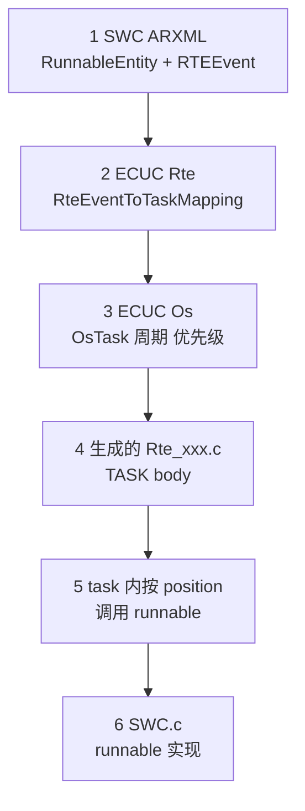
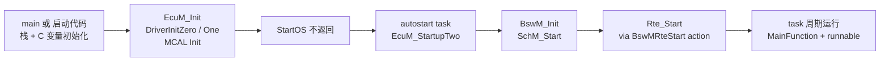
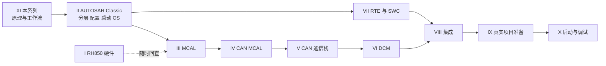

# 10 工作流实践与 FAQ：第一周在真实项目里做什么

> 本章回答：(1) 第一次进入真实 Classic AUTOSAR 工程，第一周应该找什么、做什么？(2) 初学者怎么调试——断点打在哪里、怎么读生成的 RTE 代码？(3) 新手最常问的 20+ 个问题，各自的简明答案与深入链接在哪里？
> Prerequisite: [09 信号的一生](09-life-of-a-signal.md)（及前面各章；FAQ 条目会回链到 [01](01-architecture-big-picture.md)–[08](08-swc-rte-interaction.md)）
> Next: 无（本 Part 终章）；学习路径（本章 §6）→ 回到各 Part 深入阅读
> 对应规范（R25-11）：EcuM / BswM / RTE / OS / BSWGeneral / TR_Methodology / EXP_LayeredSoftwareArchitecture（具体见各 FAQ 条目）
> 深入阅读：[如何阅读真实 AUTOSAR 工程](../09-real-project-preparation/01-how-to-read-real-autosar-project.md)、[生成代码](../02-autosar-classic/05-generated-code.md)、[配置与 ARXML](../02-autosar-classic/04-configuration-arxml.md)、[RTE 生成](../07-rte-swc/05-rte-generation.md)、[UDS demo](../../examples/uds_diag_demo/README.md)

> 版本说明：规范引用为 **R25-11**（页码为 PDF 页码）。真实项目所用 release、工具链、文件名**需在真实项目环境中确认**；本章给的是“去哪里找”的方法，不是任何具体项目的事实断言。
> 标记：`[AUTOSAR Standard]` 规范明文；`[Industry Practice]` 行业惯例（因公司/项目而异）；`[Educational Implementation]` 本仓库 demo；`[Real Project Consideration]` 真实项目注意点。

---

## 1. 本章要回答的问题

很多人读完概念，打开真实工程仍然不知道从哪下手：几万个文件、几十个 ARXML、一堆生成代码。这一章把“怎么上手”拆成可执行的步骤，并把新手最常见的疑问集中回答。

---

## 2. 第一周在真实项目里做什么

### 2.1 总原则

1. **先画地图，再读代码。** 第 1–2 天不要钻进某个 `.c`，先搞清楚“哪些是人写的、哪些是生成的、哪些是供应商的”（对照 [03 章 §6 文件类型速查](03-methodology-workflow.md)）。
2. **只追一条线。** 选一个最小功能（例如 “22 F1 90 读 VIN”或“某个 10 ms runnable”），从 ARXML 追到 task，比通读整个工程有效。
3. **永远不手改生成物。** 想改行为，改 ARXML/ECUC/SWC 源码，然后走生成流程。
4. **所有结论落在文件+行号上**，记在自己的笔记里。

### 2.2 清单：一周内要找到的 8 样东西

| # | 要找什么 | 怎么找（`[Industry Practice]`） | 找到后记下 |
|---|---|---|---|
| 1 | **ARXML 集合** | `find . -name "*.arxml"`，按目录分类：SWC 描述 / ECU Extract / ECUC Values / 供应商 BSWMD 与 ECUC Definition | 每类放哪个目录、谁维护、版本 |
| 2 | **ECU Extract** | 名字常含 `Extract`、`EcuExtract`、`SystemExtract`；内容含 `ECU-INSTANCE`、`SYSTEM-SIGNAL`、`SW-COMPONENT-PROTOTYPE`（需确认） | 来源（OEM 交付？）、版本、导入进工具的方式 |
| 3 | **ECUC 配置（Values）** | 文件含 `ECUC-MODULE-CONFIGURATION-VALUES`；或在工具的工程文件（`.dpa`、`.project` 之类，需确认）里 | 各模块一个文件还是一个大文件？谁是 owner |
| 4 | **生成目录** | `Generated/`、`gen/`、`Config/` 等；里面有 `Rte*.c/h`、`*_Cfg.h`、`*_PBcfg.c`、`*_Lcfg.c`、`*_MemMap.h`、`SchM_*.h` | 是否入库？由哪条命令生成？ |
| 5 | **OS 配置** | ECUC 里的 `OsTask`/`OsIsr`/`OsAlarm`/`OsCounter`；或生成的 `Os_Cfg.*`（文件名随 OS 实现而异） | task 清单、优先级、周期、ISR 向量 |
| 6 | **链接脚本** | `*.ld`、`*.lnk`、`*.ghs` 一类，需确认 | section → 内存区间表（ROM/RAM/Bootloader/NvM） |
| 7 | **构建脚本** | `Makefile`、`CMakeLists.txt`、`build.bat`、IDE 工程；顺藤摸瓜找到“调用生成器”的那一行 | 一键构建命令；生成→编译→链接→hex 顺序 |
| 8 | **MCAL 目录与配置** | 芯片厂交付的 `mcal/`；其配置输出 `Port_Cfg.*`、`Can_Cfg.*`、`Mcu_Cfg.*`（命名随厂商，需确认） | 配置工具与版本；谁改过引脚/时钟 |

> `[Real Project Consideration]` 如果找不到生成物，往往是**还没执行过生成**。先问同事“第一次构建的步骤文档在哪”，不要自己猜命令。

### 2.3 一周的节奏建议

| 天 | 目标 | 产出 |
|---|---|---|
| 1 | 能构建出 `.elf`/`.hex`（照构建文档做一遍） | “如何构建”笔记；构建日志 |
| 2 | 画目录地图：人写 / 生成 / 供应商 | 一张目录标注图 |
| 3 | 读 OS 配置 + 启动路径：谁调用 `main`、`EcuM_Init`、`StartOS` | 启动序列笔记（对照[启动流程](../02-autosar-classic/03-ecu-startup.md)） |
| 4 | **追一个 runnable：ARXML → RTE → task**（见 §2.4） | 一条完整追踪记录 |
| 5 | 追一个通信或诊断请求（可对照 [UDS 端到端](../08-integration/05-uds-end-to-end.md)） | 一张时序图 |

### 2.4 追踪：一个 runnable 从 ARXML 到 OS task

目标：回答“这个 runnable 被谁、在什么时候、在哪个 task 里调用”。这是真实项目里最常见的一类问题。

逐步做法：

1. **在 SWC ARXML 中找 runnable 与 event。** 搜 `<RUNNABLE-ENTITY>` 找到名字（或 `SHORT-NAME`），再搜引用它的 `<TIMING-EVENT>`（含 `PERIOD`）或 `<OPERATION-INVOKED-EVENT>`，其 `START-ON-EVENT-REF` 指向 runnable。没有任何 event 引用的 runnable，RTE 不会激活（RTE p.142）。
2. **在 ECUC 的 Rte 配置里找映射。** 在 `RteSwComponentInstance` 下找 `RteEventToTaskMapping`，看 `RteEventRef`（指向第 1 步的 event）、`RteMappedToTaskRef`（`ECUC_Rte_09021`）、`RtePositionInTask`（`09023`）、`RteActivationOffset`（`09018`）。注意：**映射是配置输入，RTE 生成器不会替你决定**（RTE p.135、p.139–140）。如果该 runnable 用 direct/trusted function call，则可能没有 task 引用（`SWS_Rte_06798`）。
3. **在 OS 配置里找 task。** 看这个 `OsTask` 的优先级、是 basic 还是 extended（是否关联 OS Event，RTE p.148）、周期。TimingEvent 的周期必须是 `OsTaskPeriod` 的整数倍（`SWS_Rte_CONSTR_09123`，p.159）。
4. **在生成目录里找 task body。** 搜 `TASK(` 或 `Os_` 相关宏（具体语法随 OS 实现，需确认）。RTE 生成 task/ISR2 的**函数体**（`SWS_Rte_06200/04560`，p.134–135）。
5. **看 body 里调用顺序。** 同一个 task 内按 `RtePositionInTask` 排序，**BSW MainFunction 与 SWC runnable 可在同一 task 中混排**（经 `RteBswEventToTaskMapping`，RTE p.1211–1218）。
6. **回到 SWC 源码。** 找到函数，设断点（§3）。

> `[Educational Implementation]` demo 里的缩小版：`examples/uds_diag_demo/integration/BswScheduler.c:50-51`（10 ms 任务里调 `Dcm_MainFunction`、`Rte_Task_10ms`）→ `rte/Rte_Dcm.c:46-50`（`Rte_Task_10ms` 调 `VehicleInfoSWC_Run10ms`）→ `swc/VehicleInfoSWC.c:62`。

---

## 3. 初学者怎么调试

### 3.1 断点打哪里：沿着启动序列

启动流程的权威描述在 EcuM（R25-11 只有 flexible 形态）：`EcuM_Init` 内 StartPreOS（`SWS_EcuM_02411`，ECUM p.37–38）→ `StartOS` → autostart task 调 `EcuM_StartupTwo` → StartPostOS（`SWS_EcuM_02934`，p.41–42：`SchM_Start`、`BswM_Init`、`SchM_Init`、`SchM_StartTiming`）。**`EcuM_Init` 不返回**（最后调用 `StartOS`）。

| 断点位置 | 看什么 | 能回答的问题 |
|---|---|---|
| **复位向量 / 启动代码** | 栈指针、是否进入 C 环境 | 板子是否活着；复位原因（可对照 [Part X 启动调试](../10-boot-debug/README.md)） |
| **`EcuM_Init`** | `DriverInitZero/One` 回调、`Mcu_Init`、`Port_Init` 是否执行；`EcuM_DeterminePbConfiguration` 返回的 post-build 指针是否有效 | MCAL/时钟/引脚是否初始化；配置一致性检查（`SWS_EcuM_02796`，p.43）有没有失败 |
| **`StartOS` 之前一行** | 启动 OS 前所有必需 BSW 是否已初始化（`SWS_EcuM_02603`，p.41） | OS 起不来，往往因 OS 配置/中断向量/栈 |
| **`EcuM_StartupTwo`** | 是否被 autostart task 调到 | OS 是否真的跑起来 |
| **`BswM_Init`** | BswM 规则/action list 配置 | 后续 `Com_Init`、`NvM_ReadAll` 等是否在它的 action list 里 |
| **`Rte_Start`** | 谁调用它（R25-11：BswM 的 `BswMRteStart` action，`ECUC_BswM_01073`；老工程/厂商实现可能由 EcuM 或集成代码调）；调用顺序在 OS/COM/NvM 初始化与 `SchM_Init` 之后（RTE p.805、`SWS_Rte_91137`） | SWC 的 InitEvent runnable 在此被激活（`SWS_Rte_06761`，p.161）；`Rte_Start` 失败则 SWC 不会运行 |
| **一个 runnable 入口** | 调用栈：谁调的（应该是生成的 task body）；`RTE` 参数 | 验证映射是否生效；是否被多个 event 触发（可查询触发它的 event，`SWS_Rte_08051`） |
| **OS task 入口 / 生成的 `TASK(...)` body** | task 的周期、顺序 | 确认 position、offset、周期 |
| **`<Mod>_MainFunction`（如 `Dcm_MainFunction`、`Com_MainFunctionRx_<shortName>`）** | 调用周期与调用方 | MainFunction 是 SchM 在 task 里调的，不是模块自己（`SWS_BSW_00153` 命名；`00154` 无参无返回；`00133` 模块内不得互调，BSWG p.79、p.43） |

> `[Educational Implementation]` demo 的对应断点：`integration/EcuM.c:24`（`EcuM_Init`）、`integration/EcuM.c:37`（`Rte_Start()` 调用）、`rte/Rte_Dcm.c:38`（`Rte_Start`）、`swc/VehicleInfoSWC.c:77`（`VehicleInfoSWC_ReadVin`）、`rte/Rte_Dcm.c:46`（`Rte_Task_10ms`）。注意 demo 的 `EcuM_Init` 内含“把 BSW init 与 Rte_Start 都写在一起”的简化（`:29` 注释写明“normally BswM action list”）。

### 3.2 读生成的 RTE 代码：技巧

1. **先读 `Rte_<Swc>.h`**（contract header）：它告诉你这个 SWC 能用什么 `Rte_*` API、要实现哪些 runnable。
2. **再读 `Rte_<Swc>.c` / `Rte.c`** 里对应 API 的实现：
   - `Rte_Write_*` / `Rte_Read_*`：同 ECU 内可能是直接变量访问或宏；跨 ECU 则调用 `Com_SendSignal` / `Com_ReceiveSignal`（`SWS_Rte_04527`，RTE p.326）。
   - `Rte_Call_*`：C/S 调用，可能直接展开成对 server runnable 的函数调用（同 task 且同分区时可退化为直接调用，VFB p.57 脚注）。
   - `Rte_IRead_*` / `Rte_IWrite_*`：implicit 访问，运行前拷贝/运行后发送；你会看到 runnable 入口前后的缓冲读写代码（语义：RTE p.292）。
3. **看 task body**：按 position 排序的一串 `if`/函数调用；周期型 task 常有 `GetEvent/WaitEvent` 或 alarm 驱动（RTE p.139–141）。
4. **看 `Rte_Start`/`Rte_Init_*`**：初始化 runnable、mode machine 的实例化（RTE p.808）。
5. **看宏**：生成代码里大量 `#define Rte_Read_...`，用预处理输出（`-E`）查看展开结果。
6. **看 MemMap include**：`#define RTE_START_SEC_CODE` + `#include "Rte_MemMap.h"` 这类三行套路（`SWS_MemMap_00005/00015`），是 section 标签，不是业务逻辑——读时可忽略。
7. **函数名模式**：`Rte_<Verb>_<Port>_<Element>`（`Rte_Read_Speed_Value`）；`Rte_Call_<Port>_<Operation>`；回调 `Rte_COMCbk_<signal>`（RTE p.813–817）。

> `[Educational Implementation]` 在 demo 中，`rte/Rte_Dcm.c:54-62` 是 `Rte_Call_DataServices_DID_F190_ReadData` 的手写版，可以当作“生成的 Rte_Call 桥”来练习阅读。

### 3.3 常见“现象 → 去哪里看”

| 现象 | 优先怀疑 |
|---|---|
| 启动后卡在 `EcuM_Init` 前后 | MCAL（`Mcu_Init`/`Mcu_InitClock`、`Port_Init`）配置；Post-build 指针/一致性检查；链接脚本 section |
| OS 起不来、立刻 trap | OS 配置（栈、中断向量表）、中断优先级、`StartOS` 前未完成必要初始化 |
| runnable 从不执行 | 没有 RTEEvent 引用；没有映射到 task；`Rte_Start` 没被调用；task 没被激活（周期/alarm 配置） |
| runnable 执行但数据不对 | 端口没连接（未连接 RPort 返回初值，VFB p.42）；DataMapping 缺失；类型/字节序；implicit 读写时机 |
| 收不到 CAN 信号 | 回到通信栈逐层查（参见 [Part V](../05-can-stack/)），Com 的 IMMEDIATE/DEFERRED 通知时机（`SWS_Com_00300/00301`，COM p.54） |
| 诊断请求无响应或 NRC | DID 配置（`Dcm_Dids`）；会话/安全等级；runnable 持续 `DCM_E_PENDING` |
| 偶发复位 | Watchdog、栈溢出、非法中断；看复位原因 `Mcu_GetResetReason` |

---

## 4. FAQ

> 每条先给结论，再给依据/链接。规范依据为 R25-11，`[Industry Practice]` 表示行业惯例。

### Q1. RTE 是线程（任务）吗？

不是。**RTE 是生成的代码层**，没有自己的调度实体。RTE 使用 OS 来调度 runnable：它生成 task/ISR2 的**函数体**，体内按配置调用 runnable（`SWS_Rte_06200/04560`，RTE p.134–135）。“BSW Scheduler 不是与 OS 调度器竞争的实体”（RTE p.134）。runnable 才是被调度的最小片段（`TPS_SWCT_01030`）。详见 [RTE 概念](../07-rte-swc/04-rte-concept.md)。

### Q2. SWC 能直接调用 MCAL 吗？

不能。层间规则：**绕过 MCAL 不允许**（EXP p.79），VFB 也要求对硬件的访问经 MCAL 并避免高层直接访问寄存器（VFB p.86）。SWC 通过 RTE 访问 **ECU Abstraction（IoHwAb）**，后者再调 MCAL；`SensorActuatorSwComponentType` 可经 port 使用 I/O hardware abstraction，而不是 MCAL（`TPS_SWCT_01048`，SWCT p.654）。（EXP 的 Layer Interaction Matrix 页文本列对齐不稳，因此此结论以 EXP p.79 与 VFB p.86 为依据。）

### Q3. 为什么 SWC 不能直接调用别的 SWC 的函数？

因为**位置透明**：SWC 彼此只通过 port 通信，由 RTE 决定这是本地调用还是经通信栈（VFB p.13、p.44–45）。直接 `#include` 并调用对方函数会让 SWC 绑死在同一 ECU/同一 task 上，破坏“可重定位”，也绕过 RTE 对数据一致性、调度、`ExclusiveArea` 的保证。唯一合法途径：`Rte_Call_*`（C/S）、`Rte_Read/Write`（S/R）等。

### Q4. ARXML 是什么？谁写？

ARXML 是 AUTOSAR 的 XML 交换格式，描述系统、SWC、BSW 模块、ECU 配置值（见 [03 章 §6](03-methodology-workflow.md)）。一般**不手写**，由工具导出：System Engineer（系统/Extract）、SWC Designer（SWC 描述）、BSW 供应商（BSWMD、ECUC Definition）、ECU Integrator（ECUC Values）（METH p.182–189）。读它时用工具的树形视图比直接读 XML 友好。

### Q5. 改一个 DID 需要动哪些文件？

以本章/03 章的 `VehicleInfoSWC` 提供 VIN（DID `0xF190`）为例，逻辑上涉及：

1. **诊断描述**（`[Industry Practice]`：ODX/CDD/DEXT 一类）——DID 号、长度、数据类型；
2. **Dcm 的 ECUC**：`DcmDspDid`、`DcmDspData`（长度、使用的接口类型、读/写函数、会话/安全等级）；
3. **SWC 描述**：PPort `DataServices_<Data>` + operation + server runnable；
4. **ECU 配置里的 port 连接**（Dcm 的 RPort ↔ SWC 的 PPort）；
5. **SWC 源码**：实现 runnable；
6. 然后**重新生成**（RTE + Dcm 配置）→ 重新编译链接。

demo 中对应：`diag/Dcm_Cfg.c:33-38`（`Dcm_Dids[]` 行）→ `rte/Rte_Dcm.c:54`（`Rte_Call_…_ReadData`）→ `swc/VehicleInfoSWC.c:77`（runnable）。详见 [03 — 工作流](03-methodology-workflow.md) §5.4 与 [08-integration/04 F190 VIN demo](../08-integration/04-f190-vin-demo.md)。

### Q6. 为什么改了配置要重新生成？

因为 `*_Cfg.h`、`*_Lcfg.c`、`*_PBcfg.c`、RTE 源码都是 generator 从 ECUC Values 的**翻译结果**（抽象参数被翻译成与实现相关的数据结构，METH p.104）。ARXML 变了而生成物不变，就等于“代码和配置对不上”。依配置类不同，重做范围不同：pre-compile 要重编、link-time 要重链、post-build 只需重新生成并下载数据段（METH p.109–120）。

### Q7. `MainFunction` 是谁调用的？

**BSW Scheduler（SchM）**，不是模块自己，也不是 EcuM。SchM 与 RTE 一起生成，把 BSW MainFunction 放进配置的 OS task（`RteBswEventToTaskMapping`），由 `BswTimingEvent` 等触发（EXP p.133–135；RTE p.1211–1218）。MainFunction 无参无返回、不得进入等待状态（`SWS_BSW_00154/00156`），原型在 `SchM_<Mip>.h`（`SWS_BSW_00210`，BSWG p.28）。未初始化时被调用须直接返回（`SWS_BSW_00037`）。

### Q8. 一个 runnable 能映射到多个 task 吗？

要分情况。`RteEventToTaskMapping` 是**按 RTEEvent** 映射：一个 runnable 若被**多个 RTEEvent** 触发，不同 event 可映射到不同 task（例如周期 event 一个 task、模式 event 另一个）；但**同一个 RTEEvent 不能被多个 mapping 引用**（`SWS_Rte_07843`，RTE p.1159）。另外 `canBeInvokedConcurrently=false` 的 runnable，其事件不得映射到可互相抢占的不同 task/ISR2（`SWS_Rte_05083`，p.1167）。多个 `RteEventRef` 出现在同一 mapping 时，只允许全是指向同一 server 的 `OperationInvokedEvent`（`SWS_Rte_CONSTR_08613`）。

### Q9. `Rte_IRead` 和 `Rte_Read` 区别？

- **`Rte_IRead_*`（implicit）**：runnable **启动时**拷贝一份，整个运行期不变；`Rte_IWrite` 在 runnable **终止后**才发送。基于 `dataReadAccess/dataWriteAccess`，适用于 category 1 runnable，不适用于 queued（RTE p.746、p.749、p.292；SWCT p.570–571）。
- **`Rte_Read_*`（explicit）**：调用即读取，**非阻塞**，每次读最新值（RTE p.719）。`Rte_Receive` 才有阻塞版本（对应 WaitPoint，只能用于 category 2，需 extended task）。

注意：category 2 runnable 永不终止，用 implicit 就看不到新数据。

### Q10. OEM 给我什么？

规范层面只说 primary organization（usually OEM）交付 **System Extract**（`TR_METH_01047`，p.40–41）。`[Industry Practice]` 常见交付物：通信矩阵（DBC/ARXML）、ECU Extract、诊断需求/数据（ODX/CDD 等）、有时还有部分应用 SWC 或接口定义。**具体清单以合同与项目为准**——第一周直接向项目负责人要一份“交付物清单”。

### Q11. BSW 厂商的源码能不能改？

技术上可能，**但通常不应该**：`[Industry Practice]`——BSW 随版本升级，改源码会让合规/升级/认证/技术支持都失效。优先级：先用配置解决 → 再用 callout/CDD/hook → 实在不行向供应商申请补丁。规范侧：模块须提供 BSWMD，配置经 ECUC，`Callout` 由集成者在 `<Mip>_Externals.h` 声明（`SWS_BSW_00254`，BSWG p.27）。是否有源码、能否改，取决于授权（有些只交目标码，这正是 link-time 配置类的动机，METH `TR_METH_01098–01103`）。

### Q12. 什么是 post-build？

配置值放在**独立的、可重刷的内存段**，模块 Init 时拿到指向它的指针；改数据**不需要重编重链**（METH `TR_METH_01104/01105`，p.116；EXP p.118–123）。典型用途：一套代码支持多个车型/配置。代价：多一层指针间接访问，配置在运行时才可见，EcuM 需要在初始化前做配置一致性检查（`SWS_EcuM_02796`，ECUM p.43）。VariantPostBuild 下 Init 的配置指针必须非 NULL（`SWS_BSW_00050`，BSWG p.74）。

### Q13. DET 和 DEM 区别？

| | **DET**（Default Error Tracer） | **DEM**（Diagnostic Event Manager） |
|---|---|---|
| 面向 | 开发阶段的**软件 bug / 误用** | 车辆运行中的**硬件/功能故障**，对应 DTC |
| 触发 | `Det_ReportError(ModuleId, InstanceId, ApiId, ErrorId)`（R25-11 返回 `Std_ReturnType`，`SWS_Det_00009`，DET p.21） | `Dem_SetEventStatus`（`SWS_BSW_00205`） |
| 开关 | development error 由 `<Ma>DevErrorDetect` 控制，默认关闭（`SWS_BSW_00042`，BSWG p.56） | production error 不应被关闭 |
| 行为 | 像 assertion：停机/复位/打印 | 存 DTC、冻结帧，可经 UDS 读出 |

BSWG 对错误分四类：development / runtime（`Det_ReportRuntimeError`，不可配置关闭，`SWS_BSW_00222`）/ production / extended production（`SWS_BSW_00144`，p.55）。

### Q14. EcuM 和 BswM 区别？

- **EcuM**（ECU State Manager）：管 ECU 的**生命周期**：OS 前的初始化（`EcuM_Init`→DriverInit→`StartOS`）、OS 后的 `EcuM_StartupTwo`、关机、唤醒源、RUN/POST_RUN 仲裁。R25-11 只有 flexible 形态（fixed 在 R4.4.0 移除）；`EcuM_GoDown/GoHalt/GoPoll` 由 `EcuM_GoDownHaltPoll` 取代。
- **BswM**（BSW Mode Manager）：在 `BswM_Init`（EcuM StartPostOS 调用）之后，通过**规则 + action list** 仲裁 mode（ComM、EcuM、NvM、Dcm 的 mode 请求/指示），驱动后续初始化（如 `NvM_ReadAll` 要走 `BswMUserCallout`，BswM 没有专用 action）、启动 RTE（`BswMRteStart`）、通信开关等。
一句话：EcuM 管“开机到交给 BswM、以及关机”，BswM 管“运行时的模式切换与动作编排”。依据：ECUM p.37–42；BswM p.32–33、p.69。

### Q15. OS 是 AUTOSAR 的一部分吗？

是，**AUTOSAR OS** 有自己的 SWS，以 OSEK/VDX OS（ISO 17356-3）为核心并向后兼容，加了 Counter/ScheduleTable、OS-Application、保护机制（SC1–SC4）等（`SWS_Os_00001`，OS p.36；`SWS_Os_00241`，p.133）。但**对 SWC 不可见**：SWC 不直接用 OS 服务，只有 RTE/BSW Scheduler（及 EcuM、CDD 等例外）使用 OS（RTE p.133；EXP p.134）。OSEK 的 task 状态机等概念不在 AUTOSAR OS SWS 中重述。

### Q16. Complex Driver（CDD）什么时候用？

三类动机（EXP p.17；VFB p.88）：**AUTOSAR 没有标准化的设备/功能**、**高实时约束**、**迁移**（旧应用先以 CDD 形态存在）。例如：喷油控制、直接使用 TPU/PCP 等特殊外设（EXP p.32）。CDD 对上（SWC）仍按 AUTOSAR interface，对下受限：可调 SPI、GPT、I/O drivers、NvM 等；**`Init` 通常只应由 EcuM 调用**（EXP p.81–83）。不要把 CDD 当成“绕过分层的万能出口”。

### Q17. RTE 和 BSW 的 SchM 是什么关系？

SchM（BSW Scheduler）和 RTE 由**同一个生成流程**产出，使同一 task 能按顺序混排 BSW MainFunction 与 SWC runnable（EXP p.133）。SchM 生命周期 API：`SchM_Init`（ID 0x00）、`SchM_Start`（0x70）、`SchM_StartTiming`、`SchM_Deinit`，由 EcuM 在每个核上调用一次（RTE p.926–929）。顺序：`SchM_Init` 先于 `Rte_Start`，`Rte_Stop` 先于 `SchM_Deinit`（RTE p.458–459）。

### Q18. 谁调用 `Rte_Start`？

R25-11 的 EcuM/BswM 文本里，由 **BswM 的 `BswMRteStart` action**（`ECUC_BswM_01073`）调用；RTE SWS 的措辞（`SWS_Rte_CONSTR_09035`，p.805）仍写 EcuM——这是**规范之间的不一致**，真实项目以生成工具/集成方案为准。规则：只能调一次、每核各调一次、在 OS/COM/memory services 初始化之后、`SchM_Init` 之后，不得由 SWC 调用（`SWS_Rte_91137`，p.805）。

### Q19. 一个 SWC 可以多次实例化吗？数据怎么放？

可以：组件类型可多次实例化（`TR_VFB_00084`）。支持多实例的 SWC 通常需要 **PerInstanceMemory**，由 RTE 提供各实例访问自己内存的机制（`TPS_SWCT_01359`，SWCT p.601）。**同一 SWC 不同实例的 runnable 之间只能经 port 通信**（`TPS_SWCT_01592`，p.557）。同一 SWC 内 runnable 之间可用 ExclusiveArea 或 inter-runnable variable。

### Q20. 为什么 BSW 模块的 `Init` 不是 SWC 调用？

因为**只有 EcuM 与 BswM 可调用 Init/DeInit**（`SWS_BSW_00150/00152`，BSWG p.73、p.75）。Init 通常不可重入、有严格顺序依赖（如 `Port_Init` 必须先于 Dio 使用，`SWS_Dio_00102`；Mcu 的 clock/PLL 顺序）。复位后须先于其他函数调用 Init（`SWS_BSW_00230`）。

### Q21. 为什么调用 BSW API 时有时会看到 `DET` 报错而不是崩溃？

开发阶段开启 `DevErrorDetect` 后，模块会检查：未初始化调用（`<MIP>_E_UNINIT`，`SWS_BSW_00243`，p.57）、空指针（`SWS_BSW_00212`）、参数越界。检测到须经 `Det_ReportError` 上报。**量产通常关闭**（节省 ROM/CPU，且默认关，`SWS_BSW_00042`），所以“DET 不报错”不等于“调用正确”。

### Q22. `MemMap.h` 是干嘛的？为什么每个函数前后都有一堆 `#define/#include`？

给代码/变量打 **section 标签**，让同一份源码在不同编译器/内存布局下可用（MEMMAP p.19）。机制：`#define <PREFIX>_START_SEC_<name>` + `#include "<Mip>_MemMap.h"`（`SWS_MemMap_00005/00015`）。section 放到哪块物理内存，由**链接脚本**决定，而不是 MemMap。读代码时可以直接忽略这些三行套路。

### Q23. ECU Extract 和完整 System Description 有什么区别？

Extract **只含本 ECU 相关元素**，已展开成原子 SWC，是 ECU 配置的基础（`TR_METH_01109`，p.41、p.95）；System Description（Configuration）含全系统。OEM 交付给 supplier 的通常是 Extract（`TR_METH_01047` 的 System Extract 概念）。

### Q24. 为什么我的 SWC 在 PC 上能编译，放进 ECU 却链接不过？

多半是 contract header 与实际生成的 RTE 不一致：SWC 描述改了而 RTE 没重新生成，或 ECU 里没有对应的 RTE 实现（port 未连接/未映射）。也可能是 MemMap 的 section 在链接脚本里没放置（MEMMAP p.19）。先看链接错误里缺的符号名：`Rte_*` 缺失 → RTE 生成问题；`<Mod>_*` 缺失 → BSW 模块没加入构建；`*_MemMap` 相关 → 链接脚本。

### Q25. “一个 ECU” 在 AUTOSAR 里到底指什么？多核怎么算？

AUTOSAR 意义上的 ECU = **一个 microcontroller + 外设 + 对应软件/配置**；壳体内多颗 MCU 各自是独立 ECU 实例（EXP p.11）。**同一 MCU 的多核**则是一个 ECU，RTE/OS/BSW 需要按核/partition 配置（RTE 的 `RteSwComponentInstance` 与 OS 的 core/OsApplication 映射；每个核各调一次 `Rte_Start`/`SchM_Init`，RTE p.805、p.926）。

### Q26. 本仓库的 demo 和真实项目差在哪？

demo 是 **host 可运行的教学栈**：Mock CAN → CanIf → CanTp → PduR → Dcm → Rte → SWC，所有 `Rte_*.h`、`Dcm_Cfg.c` 都是**手写的“假装是生成的”**；没有 ARXML、没有 OS、没有 post-build。它的价值是把“22 F1 90 到 VIN”的调用链逐行摊开（见 [demo README](../../examples/uds_diag_demo/README.md)）。真实项目的这些文件由工具生成，你要学的是**怎么找、怎么读、怎么追**，而不是模仿手写。

---

## 5. 常见误解（快速清单）

1. **“看到 `Rte_` 前缀就是 RTE 在运行。”** 它只是接口名；有些会被优化成宏/直接调用。
2. **“所有配置都能在运行时改。”** 只有 post-build 变体的参数可能；其余必须重新编译/链接。
3. **“断点停不住是调试器问题。”** 也可能是该 runnable 根本没被映射/没被激活。
4. **“生成代码很乱，所以是 bug。”** 生成代码为一致性与优化而写，不为可读性；读法见 §3.2。
5. **“出了问题先改生成的文件试试。”** 重新生成会覆盖；只在“临时诊断”时可以读不能提交。

---

## 6. 推荐学习路径（Part I–XI）

> Part 序号对应 `docs/` 下目录（`01-…` = Part I，以此类推；Part XI 为本系列）。**第一遍快速通读主线，第二遍结合真实项目回读。**

| 步骤 | 读什么 | 目的 | 时长建议 |
|---|---|---|---|
| 0 | 本 Part（XI）[README](README.md) 全部章节，顺序 01→10 | 建立整体地图与术语 | 1–2 天 |
| 1 | [Part II — AUTOSAR Classic](../02-autosar-classic/01-classic-platform-overview.md)（01–07） | 分层、启动、配置、生成代码、OS、MainFunction | 2–3 天 |
| 2 | [Part VII — RTE 与 SWC](../07-rte-swc/01-swc-concept.md)（01–09） | SWC/port/runnable/RTE 生成 | 2–3 天 |
| 3 | [Part III — MCAL](../03-mcal/) 与 [Part IV — CAN MCAL](../04-can-mcal/) | 驱动层与 CAN 驱动；Port/Dio/Mcu 初始化与顺序 | 3–4 天 |
| 4 | [Part V — CAN 通信栈](../05-can-stack/) | CanIf/CanTp/PduR/Com 路径 | 2–3 天 |
| 5 | [Part VI — DCM](../06-dcm/) | UDS 服务、会话、DID、NRC | 2–3 天 |
| 6 | [Part VIII — 集成](../08-integration/01-ecu-configuration-checklist.md)（含 [F190 VIN demo](../08-integration/04-f190-vin-demo.md)） | 把各层串成端到端 | 2 天 |
| 7 | [Part IX — 真实项目准备](../09-real-project-preparation/01-how-to-read-real-autosar-project.md) | 读真实工程的方法 | 1–2 天 |
| 8 | [Part X — 启动与调试](../10-boot-debug/README.md) | 启动失败、trap、复位循环 | 按需 |
| 随时 | [Part I — RH850 硬件](../01-rh850/01-rh850-overview.md) | 内存映射、时钟、中断、启动 | 按需 |
| 实操 | 运行 [UDS demo](../../examples/uds_diag_demo/README.md)（`python tools/run_uds_demo.py`），逐行追 `22 F1 90` | 把理论变成肌肉记忆 | 1 天 |

> 建议：每读完一个 Part，**回到 §2.2 的 8 样东西清单**，在真实项目里找对应物——读与找交替，比一口气读完再找有效。

---

## 7. 一句话记住

1. **第一周的目标不是“看懂全部”，而是“找到 8 样东西并追通一个 runnable”。**
2. **调试沿着启动序列打断点：`EcuM_Init` → `StartOS` → `EcuM_StartupTwo` → `BswM_Init` → `Rte_Start` → runnable。**
3. **读生成代码先读 contract header，再读 task body，忽略 MemMap 三行套路。**
4. **RTE 不是线程，MainFunction 由 SchM 在 task 里调，runnable→task 映射是配置输入。**
5. **SWC 不碰 MCAL、不碰别的 SWC 的函数、不直接用 OS；一切走 RTE。**
6. **配置改了就重新生成；生成物不要手改；只有 post-build 免重编。**

---

## 8. 自测题

1. 说出在真实项目里要找的 8 样东西，并说明每样的典型文件特征。
2. 如何证明“某个 runnable 实际运行在 task X 的第 3 个位置”？需要查哪三类文件？
3. 在 `EcuM_Init`、`BswM_Init`、`Rte_Start` 各打一个断点，它们的先后顺序是什么？谁调用 `Rte_Start`，规范间有何不一致？
4. 为什么 runnable 里不能直接调用 `ActivateTask`？它应该怎么触发别的 runnable？
5. `Rte_IRead_*` 与 `Rte_Read_*` 在 category 2 runnable 中会有什么不同的后果？
6. “改一个 DID 需要动哪些文件”？按顺序列出，并指出哪一步之后必须重新生成。
7. 你的 SWC 偶尔不运行。列出至少 4 个排查点（提示：RTEEvent、映射、`Rte_Start`、OS task/alarm）。
8. 为什么说 “DET 不报错 ≠ 调用正确”？
9. 用自己的话区分 EcuM 与 BswM，并说明 `NvM_ReadAll` 为什么不是 BswM 的专用 action。
10. 按 §6 的学习路径，你打算先读哪三个 Part？为什么？

---

## 9. 下一章

本 Part 到此结束。建议按 §6 的路径进入 Part II 起的各深入章节；遇到真实项目问题，可回到本章 §2、§3 对照排查。
