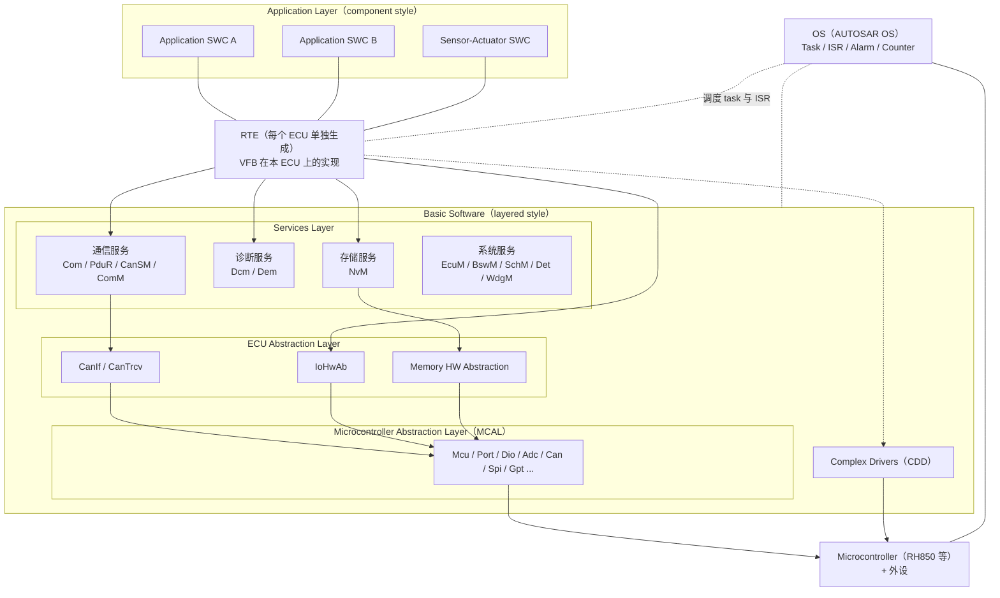

# Part XI — Classic AUTOSAR 入门：原理与工作流（导读）

> 本篇回答：这套入门系列写给谁？Classic AUTOSAR 的整体样子是什么？我的那些问题应该去哪一章找答案？
> Prerequisite: 有嵌入式 C 基础即可（知道中断、任务、寄存器、CAN 是什么）。   Next: [01 架构全景](01-architecture-big-picture.md)
> 对应规范（R25-11）：EXP_LayeredSoftwareArchitecture、TR_VFB、TR_Methodology（各章具体引用）。   深入阅读：Part I–X（见第 6 节）

---

## 1. 这套系列写给谁

- **读者**：写过 MCU 裸机或 RTOS 程序、**第一次系统学习 Classic AUTOSAR** 的工程师；或者手头已经有一个真实 AUTOSAR 工程（例如某 Tier1/OEM 的 ECU，BSW 由 RTA-CAR 之类的商业栈提供），想先把"整体脑图"和"工作流"补齐，再去啃细节。
- **目标**：讲清两件事。
  1. **原理**：AUTOSAR 为什么这样分层、每层为什么只能那样调用。
  2. **工作流**：谁、在什么时候、拿什么输入、产出什么（ARXML、ECUC、生成的 RTE、可执行文件）。
- **不做的事**：不是 API 字典；不重复 Part I–X 的深度内容（那些章节会被链接）；不声称任何商业栈的内部实现。
- **版本**：规范引用以 **R25-11** 为准（`artifacts/pdf-text/autosar-cp-R25-11/`），引用写成 “doc R25-11 p.n, ID”。真实项目的 release 可能更旧（例如 AR 4.2.2 API 的 MCAL），函数名/文件名**一律以项目 release 为准**。

文中的标记：`[AUTOSAR Standard]` 规范明文；`[Conceptual]` 概念解释；`[Industry Practice]` 行业惯例（规范没规定）；`[Educational Implementation]` 本仓库教学 demo；`[Real Project Consideration]` 真实项目注意事项。

---

## 2. 一张图看懂 Classic AUTOSAR

下图是整个系列反复用到的"地图"。先不要试图记住每个方块，只抓三个结构：**三层（Application / RTE / BSW）**、**BSW 内部四块（Services / ECU Abstraction / MCAL / Complex Drivers）**、**OS 在侧面**。



读图要点：

1. **RTE 之上**是"组件风格"：SWC 通过 port 通信，不关心对方在哪个 ECU（EXP R25-11 p.19）。**RTE 之下**是"分层风格"：BSW 模块按层调用。
2. **MCAL 是唯一直接摸寄存器的标准层**（CDD 例外，它按需求直接访问硬件）。SWC 不碰寄存器。
3. **OS 画在侧面**：它不属于"三层"里的任何一层，却被 RTE/SchM 生成的 task 体、以及 ISR 使用；按 EXP 的规则只有 BSW Scheduler 与 RTE 使用 OS 服务（少数例外，EXP p.134）。第 07 章专门讲 RTE 与 OS 的关系。
4. **竖向切片**（通信、存储、I/O、系统、加密、诊断）才是你日常 debug 的视角——见 [01 章](01-architecture-big-picture.md)。

---

## 3. 你的问题 → 去哪一章

| 你的问题 | 答案在 |
|---|---|
| EcuM 接管后到底做什么？Init 顺序是什么？谁调 `StartOS`？ | [04 ECU 启动与 EcuM](04-ecu-startup-ecum.md) |
| MCAL 是做什么的？它是什么架构？谁调用 MCAL？ | [05 MCAL 的角色与架构](05-mcal-role-and-architecture.md) |
| Classic AUTOSAR 整体架构是什么样？分几层？为什么？ | [01 架构全景](01-architecture-big-picture.md) |
| RTE 和 OS 是什么关系？RTE 是不是 OS？ | [07 RTE 与 OS](07-rte-and-os.md) |
| SWC 绑定 RTE event 对吗？OS 的 task 呢？runnable 跑在哪？ | [07 RTE 与 OS](07-rte-and-os.md)（映射关系）、[06 OS 基础](06-os-basics.md)（task 基础） |
| SWC 怎么和 RTE 交互？`Rte_Read/Write/Call` 是什么？ | [08 SWC 与 RTE 交互](08-swc-rte-interaction.md) |
| OEM 是开发 Classic AUTOSAR 软件的吗？谁交付什么？ | [02 谁做什么](02-who-builds-what.md) |
| AUTOSAR 的原理和工作流（从需求到可执行文件）？ | [03 方法论与工作流](03-methodology-workflow.md)、[09 信号的一生](09-life-of-a-signal.md)、[10 工作流实践与 FAQ](10-workflow-practice-and-faq.md) |

---

## 4. 阅读顺序与每章一段话

建议按 01 → 10 顺序读；有目的的读者可以按上表直接跳。

1. **[01 架构全景](01-architecture-big-picture.md)** — 先讲 AUTOSAR 为什么存在，再讲三层/四块、层间调用规则、纵向功能栈、Complex Driver、VFB 思想，用"按键 → CAN 报文"走一遍每一层，最后清扫常见误解（RTE 不是 OS，SWC 不碰寄存器，AUTOSAR 不是一个产品）。
2. **[02 谁做什么](02-who-builds-what.md)** — 方法论里的角色（System Engineer、SWC Designer/Developer、BSW Module Developer、ECU Integrator）与行业里的公司（OEM、Tier1、BSW 栈厂商、MCAL=芯片厂、工具厂商）如何对应；每方交付哪些工件；"OEM 开发 Classic AUTOSAR 软件吗"的有细节的回答。
3. **[03 方法论与工作流](03-methodology-workflow.md)** — 从 System Description、ECU Extract 到 ECUC 值、generator、RTE 生成、编译链接的整条流水线，两阶段开发与 contract phase / generation phase。
4. **[04 ECU 启动与 EcuM](04-ecu-startup-ecum.md)** — 复位后 start-up code → `EcuM_Init` → StartPreOS → `StartOS` → `EcuM_StartupTwo` → BswM；EcuM"接管"之后做的每一件事。
5. **[05 MCAL 的角色与架构](05-mcal-role-and-architecture.md)** — MCAL 的位置、模块组、Mcu/Port/Dio/Adc 的初始化职责划分，IoHwAb 如何成为 SWC 与 MCAL 之间的桥。
6. **[06 OS 基础](06-os-basics.md)** — 学 RTE 之前必需的 OS 概念：Task、ISR、Alarm/Counter、优先级与抢占。
7. **[07 RTE 与 OS](07-rte-and-os.md)** — RTE 生成 task 体但 runnable→task 的映射是配置输入；RTE Event 与 OS task 的绑定关系；`Rte_Start` 谁调用。
8. **[08 SWC 与 RTE 交互](08-swc-rte-interaction.md)** — SWC 的 C 代码能调用什么：`Rte_Read/Write/Call/Switch/Pim/Enter` 各自的场景与返回码；SWC 如何经 RTE 使用 NvM/Dem/Dcm/ComM 服务；用 demo 的 `VehicleInfoSWC` 逐行对照。
9. **[09 信号的一生](09-life-of-a-signal.md)** — 一个 signal 从 `Rte_Write` 到 CAN 帧、再从 CAN 帧回到 `Rte_Read` 的完整路径（Com / PduR / CanIf / Can）。
10. **[10 工作流实践与 FAQ](10-workflow-practice-and-faq.md)** — 拿到一个真实工程应该怎么读、怎么改；常见问题汇总。

---

## 5. 与深入 Part I–X 的关系

Part XI 是"地图"，Part I–X 是"街景"。读完一章后，用"深入阅读"链接进入对应的细节：

| 入门章 | 深入 |
|---|---|
| 01 架构全景 | [02-autosar-classic/01 总览](../02-autosar-classic/01-classic-platform-overview.md)、[02 分层架构](../02-autosar-classic/02-layered-architecture.md) |
| 02 / 03 工作流 | [02-autosar-classic/04 配置与 ARXML](../02-autosar-classic/04-configuration-arxml.md)、[05 生成代码](../02-autosar-classic/05-generated-code.md)、[08-integration](../08-integration/01-ecu-configuration-checklist.md) |
| 04 启动 | [02-autosar-classic/03 ECU 启动](../02-autosar-classic/03-ecu-startup.md)、[10-boot-debug](../10-boot-debug/) |
| 05 MCAL | [03-mcal](../03-mcal/)、[04-can-mcal](../04-can-mcal/) |
| 06 / 07 OS 与 RTE | [02-autosar-classic/06 OS Task ISR](../02-autosar-classic/06-os-task-isr.md)、[07 MainFunction 调度](../02-autosar-classic/07-mainfunction-scheduling.md)、[07-rte-swc/04 RTE 概念](../07-rte-swc/04-rte-concept.md) |
| 08 SWC | [07-rte-swc/01 SWC 概念](../07-rte-swc/01-swc-concept.md)、[autosar-swc-rte-tutorial.md](../autosar-swc-rte-tutorial.md) |
| 09 信号 | [05-can-stack](../05-can-stack/)、[06-dcm](../06-dcm/) |
| 10 实践 | [09-real-project-preparation](../09-real-project-preparation/01-how-to-read-real-autosar-project.md)、[dcm-upgrade-guide.md](../dcm-upgrade-guide.md) |

`[Real Project Consideration]` 旧章节里引用的 DCM R20-11、CAN R22-11 页码与 R25-11 不同；Part XI 引用 R25-11 时会写明 release。

---

## 6. 如何使用可运行 demo

仓库里有一个 host 可运行的教学诊断栈 `examples/uds_diag_demo/`（`[Educational Implementation]`，不是量产代码）：

```text
python tools/run_uds_demo.py
```

它把 `Mock Can → CanIf → CanTp → PduR → Dcm → Rte → VehicleInfoSWC` 串起来，并带有 `integration/EcuM.c`（启动序列）、`integration/BswScheduler.c`（MainFunction 调度）、`rte/Rte_Dcm.c`、`swc/VehicleInfoSWC.c`。建议用法：

1. 读 [04 章](04-ecu-startup-ecum.md) 时，对照 `integration/EcuM.c` 看"教学版 EcuM 做了什么、省略了什么"。
2. 读 [08 章](08-swc-rte-interaction.md) 时，对照 `swc/VehicleInfoSWC.c` 与 `rte/` 目录，看 SWC 如何只调用 `Rte_*` 函数。
3. 读 [09 章](09-life-of-a-signal.md) 时，运行 demo，用日志对照每一层的函数调用。
4. 用法细节与目录结构见 [examples/uds_diag_demo/README.md](../../examples/uds_diag_demo/README.md)。

注意：demo 是**简化**的——它没有 OS 与真实 RTE 生成器，调度由 `BswScheduler.c` 模拟。哪些是简化，各章会明确标出。

---

## 7. 一页纸总结：10 句最重要的心智模型

1. **AUTOSAR 是一套标准（接口 + 方法论 + 配置格式），不是一个可以下载的软件**；你用的是厂商基于标准做的实现。
2. **三层**：Application（SWC）/ RTE / BSW；RTE 之上是组件风格，之下是分层风格。
3. **VFB 是抽象，RTE 是落地**：SWC 在虚拟总线上用 port 通信；每个 ECU 单独生成一个 RTE，把连接实现为本地调用或经通信栈的网络通信。
4. **BSW 四块**：Services / ECU Abstraction / MCAL / Complex Drivers；只有 MCAL（和 CDD）直接碰硬件，SWC 一律不碰。
5. **调用规则**：垂直方向可访问下一层，跳过一层应避免、跳过两层不允许、绕过 MCAL 不允许；Services 与 ECU Abstraction 内允许水平调用，MCAL 内不允许（EXP R25-11 p.79）。
6. **EcuM 管初始化顺序，BswM 管运行期模式仲裁**；模块 `Init` 一般只由 EcuM/BswM 调（SWS_BSW_00150）。
7. **RTE 不是 OS**：RTE 生成 task 体，但 runnable 到 task 的映射是 integrator 的配置输入；真正的 task/ISR 调度由 OS 完成。
8. **SWC 不绑定 task**：SWC 的 runnable 绑定 RTE event（Timing、DataReceived、OperationInvoked ...），再由配置把 event 映射到 task。
9. **配置驱动一切**：ARXML（System/ECU Extract、SWC、BSWMD）→ ECUC 值 → generator → `_Cfg.c/_PBcfg.c/Rte_*.c` → 编译链接。你改的大部分是配置，不是源码。
10. **角色不等于公司**：方法论只定义角色（System Engineer、SWC Developer、BSW Module Developer、ECU Integrator）；OEM/Tier1/BSW 厂商/芯片厂如何分担这些角色是行业惯例，随项目而异。

---

## 8. 一句话记住

- 本系列 = 原理（为什么）+ 工作流（谁、何时、输入输出）；细节链接到 Part I–X。
- 先把 01 的分层图和本页的 10 句话装进脑子，再去读任何模块的 SWS。
- 版本与项目为准：规范引用 R25-11，真实项目的函数名/文件名要在项目 release 上复核。

## 9. 自测题

1. 不看图，说出 Classic AUTOSAR 的三层与 BSW 的四块。
2. 为什么 OS 在图里画在侧面而不是某一层里？
3. "SWC 绑定 RTE event，RTE event 映射到 task"这句话对吗？各自由谁决定？
4. 你手头的工程里，哪些文件是生成的、哪些是手写的？它们分别在 01–10 的哪一章被解释？

下一章：[01 架构全景](01-architecture-big-picture.md)
